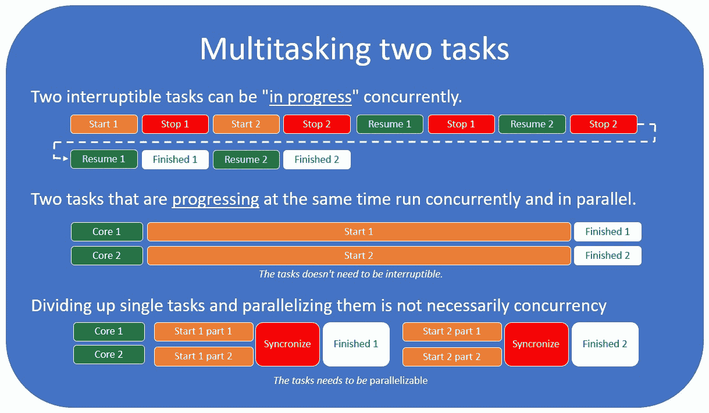
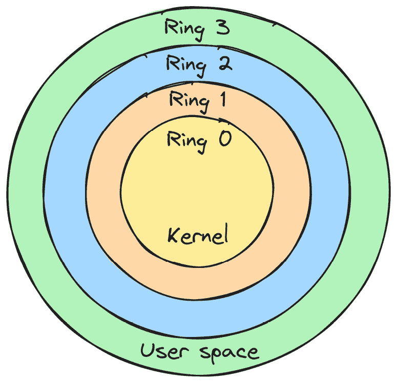
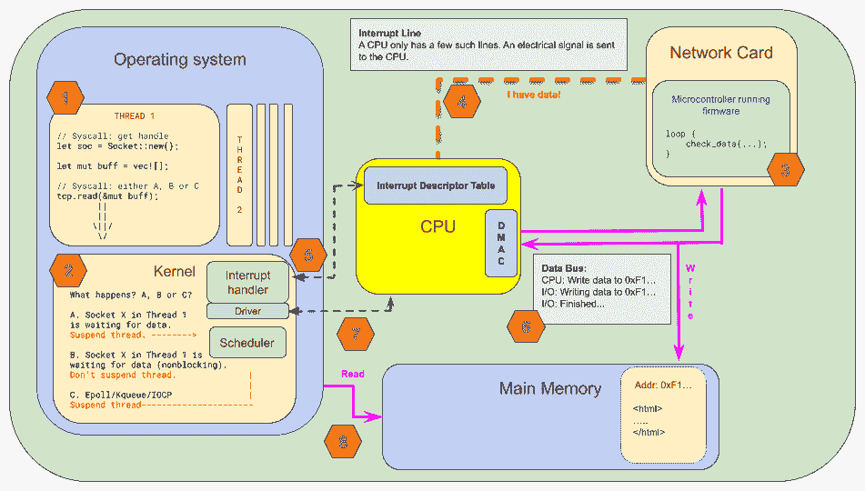

# 1

# 并发与异步编程：详细概述

异步编程是许多程序员觉得令人困惑的话题之一。当你认为自己已经掌握了它时，你可能会后来意识到这个兔子洞比你想象的要深得多。如果你参与讨论，听了足够的讲座，并在互联网上阅读有关这个主题的内容，你可能会遇到似乎相互矛盾的说法。至少，这描述了我第一次接触这个主题时的感受。

这种混淆的原因通常是缺乏上下文，或者作者在没有明确说明的情况下假设了特定的上下文，再加上围绕并发和异步编程的术语定义得相当糟糕。

本章我们将涵盖很多内容，并将内容分为以下主要主题：

+   异步编程历史

+   并发与并行

+   操作系统与 CPU

+   中断、固件和 I/O

本章内容较为通用。它并不特别关注**Rust**，或者任何特定的编程语言，但这是我们需要的背景信息，以便我们知道每个人在前进的道路上都在同一页面上。好处是，这将对任何编程语言都很有用。在我看来，这也使得这一章成为本书中最有趣的一章之一。

本章代码不多，所以我们从轻松的开始。这是一个泡一杯茶、放松并让自己舒适的时候，因为我们将一起开始这段旅程。

# 技术要求

所有示例都将使用 Rust 编写，并且你有两种运行示例的替代方案：

+   在 Rust playground 上编写和运行我们将编写的示例

+   在你的机器上安装 Rust 并本地运行示例（推荐）

阅读本章的理想方式是克隆随附的仓库([`github.com/PacktPublishing/Asynchronous-Programming-in-Rust/tree/main/ch01/a-assembly-dereference`](https://github.com/PacktPublishing/Asynchronous-Programming-in-Rust/tree/main/ch01/a-assembly-dereference))，打开`ch01`文件夹，并在阅读本书时保持打开状态。在那里，你可以找到本章中我们编写的所有示例，甚至还有一些你可能觉得有趣的信息。当然，如果你现在无法访问，你当然也可以稍后回到仓库。

# 多任务处理的进化之旅

在最初，计算机只有一个 CPU，它会逐个执行程序员编写的指令集。没有**操作系统**（**OS**），没有调度，没有线程，没有多任务处理。这就是计算机长时间以来的工作方式。我们说的是当程序在穿孔卡片堆栈上汇编的时候，如果你不幸将卡片堆叠掉到地上，那可就麻烦了。

在 20 世纪 80 年代个人计算开始增长时，操作系统如 DOS 在大多数消费级 PC 上成为标准。

这些操作系统通常将整个 CPU 的控制权交给当前正在执行的程序，程序员需要确保程序正常运行并实现任何类型的多任务处理。这没问题，但随着使用鼠标和窗口式操作系统的交互式用户界面成为常态，这种模式已经无法再继续下去了。

## 非抢占式多任务处理

**非抢占式多任务处理**是第一个能够保持用户界面交互性（并运行后台进程）的方法。

这种多任务处理将操作系统运行其他任务（如响应用户鼠标输入或运行后台任务）的责任交给了程序员。

通常，程序员会将控制权“让出”给操作系统。

除了将巨大的责任转嫁给为你的平台编写程序的每个程序员之外，这种方法自然容易出错。程序代码中的一个小错误可能导致整个系统停止或崩溃。

注意

我们所说的非抢占式多任务处理的另一个流行术语是**协作式多任务处理**。Windows 3.1 使用了协作式多任务处理，并要求程序员通过使用特定的系统调用来将控制权让给操作系统。一个表现不佳的应用程序可能会因此使整个系统停止。

## 抢占式多任务处理

虽然非抢占式多任务处理听起来是个好主意，但它实际上也带来了严重的问题。让每个程序和程序员负责在操作系统中拥有响应式的用户界面，最终可能导致糟糕的用户体验，因为任何一个错误都可能导致整个系统停止。

解决方案是将调度 CPU 资源之间程序的责任（包括操作系统本身）交给了操作系统。操作系统可以停止一个进程的执行，做其他事情，然后再切换回来。

在这样的系统中，如果你在一台单核机器上编写并运行一个具有图形用户界面的程序，操作系统会在切换回你的程序继续之前停止你的程序以更新鼠标位置。这种情况发生的频率很高，以至于我们通常无法观察到 CPU 是否有很多工作或空闲。

操作系统负责调度任务，这是通过在 CPU 上切换上下文来实现的。这个过程可以每秒发生多次，不仅为了保持用户界面的响应性，还为了给其他后台任务和 I/O 事件留出时间。

这现在已经成为设计操作系统的主流方式。

注意

在本书的后面部分，我们将编写自己的绿色线程，并涵盖许多关于上下文切换、线程、堆栈和调度等基础知识，这将使你对这个主题有更深入的了解，所以请保持关注。

## 超线程技术

随着 CPU 的发展，增加了更多功能，例如几个**算术逻辑单元**（**ALUs**）和额外的逻辑单元，CPU 制造商意识到整个 CPU 并没有得到充分利用。例如，当一个操作只需要 CPU 的部分功能时，可以在 ALU 上同时运行一条指令。这成为了**超线程**的起点。

例如，你今天的电脑可能有 6 个核心和 12 个逻辑核心。这正是超线程发挥作用的地方。它通过使用 CPU 的未使用部分来驱动线程*2*的进度，并同时运行线程*1*上的代码，从而“模拟”同一核心上的两个核心。它是通过使用一些智能技巧（例如与 ALU 相关的技巧）来做到这一点的。

现在，通过使用超线程，我们实际上可以在一个线程上卸载一些工作，同时通过在第二个线程中响应事件来保持用户界面交互性，即使我们只有一个 CPU 核心，从而更好地利用我们的硬件。

你可能会对超线程的性能感到好奇

事实上，自 90 年代以来，超线程技术一直在不断改进。由于你实际上并没有运行两个 CPU，因此将会有一些操作需要等待彼此完成。与单核中的多任务处理相比，超线程的性能提升似乎接近 30%，但这在很大程度上取决于工作负载。

## 多核处理器

如大多数人所知，处理器的时钟频率已经很长时间没有提升了。处理器通过改进**缓存**、**分支预测**和**推测执行**，以及通过优化处理器的**处理流水线**来变快，但收益似乎正在减少。

另一方面，新的处理器非常小，这使我们能够在同一芯片上拥有许多处理器。现在，大多数 CPU 都有多个核心，而且通常每个核心也都有执行超线程的能力。

## 你真的编写了同步代码吗？

就像许多事情一样，这取决于你的视角。从你的进程和编写的代码的角度来看，一切通常都会按照你编写的顺序发生。

从操作系统的角度来看，它可能会或可能不会中断你的代码，暂停它，并在恢复你的进程之前在同时运行一些其他代码。

从 CPU 的角度来看，它通常会一次执行一条指令。*尽管它不在乎谁编写了代码，但当发生硬件中断时，它会立即停止并将控制权交给中断处理程序。这就是 CPU 处理并发的方式。

注意

*然而，现代 CPU 也可以并行执行很多事情。大多数 CPU 都是流水线化的，这意味着在当前指令执行的同时，会加载下一条指令。它可能有一个分支预测器，试图确定接下来要加载哪些指令。

如果处理器认为通过使用**乱序执行**可以使事情更快，而不需要“询问”或“告诉”程序员或操作系统，那么您可能无法保证 A 发生在 B 之前。

CPU 将一些工作卸载到单独的“协处理器”上，例如用于浮点计算的 FPU，这样主 CPU 就可以准备执行其他任务等等。

从高层次概述来看，将 CPU 模拟为以同步方式运行是可以的，但在此，我们只需在脑海中记下这是一个存在一些限制条件的模型，这些限制条件在讨论并行性、同步原语（如互斥锁和原子操作）以及计算机和操作系统的安全性时尤为重要。

# 并发与并行性

我们将立即深入探讨这个主题，首先定义**并发**是什么。由于很容易将*并发*与*并行*混淆，我们将从一开始就尝试在这两者之间做出明确的区分。

重要

并发是关于*处理*很多事情。

并行性是关于*同时做*很多事情。

我们将同时推进多个任务的概念称为*多任务处理*。有两种多任务处理的方式。一种是通过*并发*推进任务，但不是同时进行。另一种是在并行中同时推进任务。*图 1.1*展示了这两种场景之间的区别：



图 1.1 – 同时处理两个任务

首先，我们需要就一些定义达成一致：

+   **资源**：这是我们能够推进任务所需要的东西。我们的资源是有限的。这可能是 CPU 时间或内存。

+   **任务**：这是一组需要某种资源来推进的操作。一个任务必须由几个子操作组成。

+   **并行**：这是在*确切*同一时间独立发生的事情。

+   **并发**：这些是在同一时间进行中的任务，但不一定是同时进行的。

这是一个重要的区分。如果两个任务并发运行，但不是并行运行，它们必须能够停止并恢复其进度。我们说一个任务是*可中断的*，如果它允许这种类型的并发。

## 我使用的心理模型

我坚信，我们觉得并行和并发编程难以区分的主要原因，源于我们如何模拟日常生活中的事件。我们往往对这些术语定义得比较宽松，因此我们的直觉往往是不正确的。

注意

并没有帮助的是，*并发*在词典中被定义为*同时进行或发生*，这并没有真正帮助我们描述它与*并行*的区别。

对于我来说，当我开始理解为什么我们最初想要区分并行和并发时，这第一个想法就产生了！

*为什么*与资源利用和效率息息相关。

*效率*是（通常可以衡量的）避免在做事或产生*期望结果*时浪费材料、能源、努力、金钱和时间的能力。

*并行性*是增加我们用来解决任务的资源。它与*效率*无关。

*并发性*与效率和资源利用密切相关。并发性永远不能让*单个任务更快地完成*。它只能帮助我们更好地利用资源，从而*更快地完成一系列*任务。

## 让我们通过流程经济学来类比一下

在制造商品的企业中，我们经常谈论**精益**流程。这很容易与程序员为什么如此关心如果我们并发处理任务我们能实现什么进行比较。

让我们假设我们经营一家酒吧。我们只提供健力士啤酒，没有其他选择，但我们把健力士啤酒做得尽善尽美。是的，我知道，这有点小众，但请耐心听我说。

你是这个酒吧的经理，你的目标是尽可能高效地经营它。现在，你可以把每个酒保想象成一个*CPU 核心*，每个订单想象成一个*任务*。为了管理这个酒吧，你需要知道如何服务一杯完美的健力士啤酒的步骤：

+   将健力士啤酒倒入倾斜 45 度的玻璃杯中，直到杯子的 3/4 满（15 秒）。

+   让激增持续 100 秒。

+   将玻璃杯完全倒满（5 秒）。

+   上菜。

由于酒吧里只有一种东西可以点，顾客只需要用手指表示他们想要点多少，所以我们假设接收新订单是瞬时的。为了简化问题，支付也是如此。在经营这家酒吧时，你有几种选择。

### 选项 1 – 与一名酒保完全同步的任务执行

你开始时只有一名酒保（CPU）。酒保接收一个订单，完成它，然后继续下一个。队伍已经走出门口，沿着街道走了两块街区——太棒了！一个月后，你几乎要破产了，你不知道为什么。

好吧，即使你的酒保在接收新订单方面非常快，他们每小时也只能服务 30 名顾客。记住，他们在啤酒沉淀时要等待 100 秒，他们实际上只是在站着，他们只用了 20 秒来真正倒满玻璃杯。只有当一项订单完全完成后，他们才能继续服务下一位顾客并接收他们的订单。

结果是收入不佳，顾客愤怒，成本高昂。这是不可行的。

### 选项 2 – 并行和同步任务执行

因此，你雇佣了 12 名酒保，你计算你可以每小时服务大约 360 名顾客。现在队伍几乎要走出门口了，收入看起来很可观。

一个月过去了，你几乎要破产了。这怎么可能呢？

结果是，拥有 12 名酒保相当昂贵。尽管收入很高，但成本更高。向问题投入更多资源并不能真正使酒吧更有效率。

### 选项 3 – 使用一个酒保的异步任务执行

因此，我们又回到了起点。让我们仔细思考，找到一种更聪明的工作方式，而不是简单地投入更多资源。

您询问您的酒保是否可以在啤酒沉淀时开始接受新订单，这样他们就不会在有顾客需要服务时只是站立等待。开业之夜到来了...

哇！在一个忙碌的夜晚，酒保连续工作几个小时，您计算得出他们现在处理一个订单只需要超过 20 秒。您基本上消除了所有等待时间。您的理论吞吐量现在是每小时 240 杯啤酒。如果您再增加一个酒保，您的吞吐量将超过拥有 12 个酒保时的吞吐量。

然而，您意识到您实际上并没有达到每小时 240 杯啤酒的产量，因为订单的到达有些不规则，并且不是均匀分布的。有时，酒保忙于新订单，阻止他们补充和为几乎立即完成的啤酒服务。在现实生活中，吞吐量只有每小时 180 杯。

然而，两个酒保以这种方式每小时可以服务 360 杯啤酒，这与您雇佣 12 个酒保时的服务量相同。

这很好，但您会问自己是否还能做得更好。

### 选项 4 – 使用两个酒保的并行和异步任务执行

如果您雇佣两个酒保，并要求他们只做我们在选项 3 中描述的事情，但有一个变化：您允许他们互相偷取任务，这样**酒保 1**就可以开始倒酒并将啤酒放下让其沉淀，而**酒保 2**可以在**酒保 1**忙于倒新订单时补充啤酒并服务。这样，两个酒保同时忙碌的情况很少发生，因为其中一杯正在进行的啤酒已经准备好补充并服务。几乎所有的订单都以可能的最短时间完成并服务，让顾客更快地离开酒吧，为想要下新订单的顾客腾出空间。

现在，这样，您可以进一步提高吞吐量。您仍然无法达到理论上的最大值，但您会非常接近。在开业之夜，您意识到酒保现在每小时处理 230 个订单，总吞吐量为每小时 460 杯啤酒。

收入看起来不错，顾客很满意，成本保持在最低，您是地球上最奇怪的酒吧（尽管是一个效率极高的酒吧）的快乐的经理。

关键要点

并发是关于更聪明地工作。并行是一种向问题投入更多资源的方式。

## 并发及其与 I/O 的关系

如您从我所写的内容中理解的那样，编写异步代码主要在您需要聪明地充分利用资源时才有意义。

现在，如果你编写一个努力解决问题的程序，通常在并发方面没有帮助。这就是并行性发挥作用的地方，因为它给你提供了一个方法，如果你可以将问题分解成可以并行工作的部分，你可以向问题投入更多的资源。

考虑以下两个不同的并发用例：

+   当执行 I/O 并且你需要等待某些外部事件发生时

+   当你需要分散你的注意力，防止一个任务等待太长时间

第一个是一个经典的 I/O 示例：你必须等待网络调用、数据库查询或其他事情发生，然后你才能继续任务。然而，你有许多任务要做，所以你不必等待，你可以继续在其他地方工作，或者定期检查任务是否准备好继续，或者确保你在任务准备好继续时得到通知。

第二个例子是在有 UI 时经常发生的情况。让我们假设你只有一个核心。在执行其他 CPU 密集型任务时，你如何防止整个 UI 变得无响应？

好吧，你可以每 16 毫秒停止你正在做的任何任务，运行*更新 UI*任务，然后继续你之后正在做的事情。这样，你将每秒需要停止/恢复你的任务 60 次，但你也会有一个响应速度大约为 60 赫兹的完全响应式 UI。

## 操作系统提供的线程怎么样？

当我们谈到处理 I/O 的策略时，我们将在本书的后面部分更详细地介绍线程，但我也将在这里提及它们。使用操作系统线程理解并发的一个挑战是，它们似乎被映射到核心上。这不一定是一个正确的心理模型来使用，尽管大多数操作系统都会尝试将一个线程映射到一个核心上，直到线程数量等于核心数量。

一旦我们创建的线程数量超过了核心数量，操作系统将在这我们的线程之间切换，并使用其调度器并发地处理每个线程，以给每个线程一些运行的时间。你也必须考虑这样一个事实，你的程序并不是系统中唯一运行的程序。其他程序也可能创建多个线程，这意味着 CPU 上的线程数量将远多于核心数量。

因此，线程可以是并行执行任务的手段，但它们也可以是实现并发的手段。

这让我想到了关于并发的最后一部分。它需要在某种参考系中定义。

## 选择正确的参考系

当你编写的代码从你的角度来看是完美同步的，停顿一下，考虑一下从操作系统的角度来看这会是什么样子。

操作系统可能根本不会从头到尾运行你的代码。它可能会多次停止和恢复你的进程。CPU 可能会被中断并处理一些输入，而你认为它只专注于你的任务。

因此，同步执行只是一个错觉。但从程序员的角度来看，它不是，这是重要的启示：

*当我们谈论并发而不提供任何其他上下文时，我们是以程序员和你的代码（你的进程）作为参考框架。如果你开始思考并发而不将这一点放在心中，它会很快变得混乱。*

我之所以花这么多时间在这上面，是因为一旦你意识到拥有相同定义和相同参考框架的重要性，你就会开始发现，你所听到和学到的一些看似矛盾的事情实际上并不是。你只需首先考虑参考框架即可。

## 异步与并发

因此，你可能想知道，当这本书是关于异步编程时，我们为什么花这么多时间谈论多任务处理、并发和并行性。

主要原因在于，所有这些概念彼此之间都紧密相关，甚至可以根据它们被使用的上下文具有相同（或重叠）的含义。

为了使定义尽可能清晰，我们将比通常更狭窄地定义这些术语。然而，请记住，我们无法取悦每个人，我们这样做是为了使主题更容易理解。另一方面，如果你喜欢热烈的互联网辩论，这是一个很好的开始。只需声称某个人的并发定义是 100%错误的，或者你的定义是 100%正确的，然后你就可以开始了。

*为了本书的目的，我们将坚持这个定义：异步编程是编程语言或库对并发操作进行抽象的方式，以及我们作为语言或库的用户如何使用这种抽象来并发执行任务。*

操作系统已经有一个现有的抽象，称为**线程**。使用操作系统线程来处理异步操作通常被称为**多线程编程**。为了避免混淆，我们不会直接将使用操作系统线程称为异步编程，即使它解决了相同的问题。

由于异步编程现在被定义为在语言或库中对并发或并行操作进行抽象，因此也更容易理解，它在没有操作系统的嵌入式系统上与针对具有高级操作系统的复杂系统的程序一样相关。定义本身并不暗示任何特定的实现，尽管我们将在本书中探讨一些流行的实现方式。

如果这仍然听起来很复杂，我理解。只是坐着反思并发是困难的，但如果我们试图在处理异步代码时将这些想法放在心中，我保证它会越来越不令人困惑。

# 操作系统的作用

操作系统（OS）是我们作为程序员所做的一切的中心（好吧，除非你在编写操作系统或工作在嵌入式领域），因此我们无法在不稍微详细地讨论操作系统的情况下讨论任何编程基础。

## 从操作系统的角度来看的并发

这与我在之前提到的话题相关，当时我说并发需要在参考框架内讨论，并解释了操作系统可能会随时停止和启动你的进程。

我们所说的同步代码，在大多数情况下，是对于我们程序员来说看起来是同步的代码。操作系统和 CPU 都不生活在完全同步的世界中。

操作系统使用抢占式多任务处理，只要你在运行的操作系统是抢占式调度进程，你就无法保证你的代码会一条指令一条指令地无中断地运行。

操作系统将确保所有重要进程都能从 CPU 获得一些时间以取得进展。

注意

当我们谈论具有 4、6、8 或 12 个物理核心的现代机器时，这并不简单，因为如果系统负载非常小，你实际上可能会在一个 CPU 上不间断地执行代码。这里的关键部分是，你无法确定，也没有保证你的代码会被允许不间断地运行。

## 与操作系统合作

当你发起一个网络请求时，你并不是要求 CPU 或网卡为你做些什么——你是在要求操作系统代表你与网卡通信。

作为程序员，你无法在不利用操作系统的优势的情况下使你的系统达到最优效率。你基本上无法直接访问硬件。*你必须记住，操作系统是对硬件的抽象*。

然而，这也意味着，为了从底层理解一切，你还需要了解你的操作系统如何处理这些任务。

为了能够与操作系统一起工作，你需要知道你如何与之通信，这正是我们接下来将要探讨的。

## 与操作系统通信

与操作系统的通信是通过我们所说的**系统调用**（**syscall**）发生的。我们需要知道如何进行系统调用，并理解当我们想要与操作系统合作和通信时，为什么这对我们来说如此重要。我们还需要了解我们每天使用的这些基本抽象是如何在幕后使用系统调用的。我们将在*第三章*中进行详细说明，所以现在我们将简要介绍。

系统调用使用操作系统提供的公共 API，以便我们编写的“用户空间”程序可以与操作系统通信。

大多数时候，这些调用被我们使用的语言或运行时抽象化。

现在，系统调用是与你所通信的内核独特的东西的例子，但 **UNIX** 系列内核有很多相似之处。UNIX 系统通过 **libc** 暴露这些相似之处。

另一方面，Windows 使用它自己的 API，通常被称为 **WinAPI**，并且它可以与基于 UNIX 的系统操作截然不同。

然而，大多数情况下，都有一种方法可以达到相同的效果。从功能的角度来看，你可能不会注意到太大的差异，但正如我们稍后将会看到的，尤其是在我们深入研究 **epoll**、**kqueue** 和 **IOCP** 的工作原理时，它们在实现这一功能方面可能会有很大的不同。

然而，系统调用并不是我们与操作系统交互的唯一方式，正如我们将在下一节中看到的。

# CPU 和操作系统

*CPU 与操作系统合作吗？*

如果你在我认为自己最初理解了程序是如何工作时问我这个问题，我可能会很可能回答 *不*。我们在 CPU 上运行程序，如果我们知道如何做，我们可以做任何我们想做的事情。现在，首先，我可能不会这样思考，但除非你了解 CPU 和操作系统是如何一起工作的，否则很难确定。

让我开始怀疑自己非常错误的是一段看起来像你即将看到的代码。如果你认为 Rust 中的内联汇编看起来陌生且令人困惑，请不要担心，稍后我们会在本书中详细介绍内联汇编。我会确保逐行解释以下内容，直到你对语法更加熟悉：

仓库引用：ch01/ac-assembly-dereference/src/main.rs

```rs
fn main() {
    let t = 100;
    let t_ptr: *const usize = &t;
    let x = dereference(t_ptr);
    println!("{}", x);
}
fn dereference(ptr: *const usize) -> usize {
    let mut res: usize;
    unsafe {
        asm!("mov {0}, [{1}]", out(reg) res, in(reg) ptr)
    };
    res
}
```

你刚才看到的是一个用汇编编写的解引用函数。

`mov {0}, [{1}]` 这一行需要一些解释。`{0}` 和 `{1}` 是模板，告诉编译器我们正在引用由 `out(reg)` 和 `in(reg)` 表示的寄存器。数字只是一个索引，所以如果我们有更多的输入或输出，它们将是 `{2}`、`{3}` 等等。由于我们只指定了 `reg` 而没有指定特定的寄存器，我们就让编译器选择它想要使用的寄存器。

`mov` 指令指示 CPU 从 `{1}` 所指向的内存位置读取前 8 个字节（如果我们是在 64 位机器上），并将其放置在由 `{0}` 表示的寄存器中。`[]` 方括号将指示 CPU 将该寄存器中的数据视为内存地址，而不是简单地复制内存地址本身到 `{0}`，它将获取该内存位置的内容并将其移动过来。

*无论如何，我们在这里只是向 CPU 写入指令。没有标准库，没有系统调用；只有原始指令。操作系统不可能参与那个解引用* *函数，对吧？*

如果你运行这个程序，你会得到你预期的结果：

```rs
100
```

现在，如果你保留`解引用`函数，但用创建指向`99999999999999`地址的指针的函数替换`main`函数，我们知道这个地址是无效的，我们得到以下函数：

```rs
fn main() {
    let t_ptr = 99999999999999 as *const usize;
    let x = dereference(t_ptr);
    println!("{}", x);
}
```

现在，如果我们运行它，我们会得到以下结果。

这是 Linux 上的结果：

```rs
Segmentation fault (core dumped)
```

这是 Windows 上的结果：

```rs
error: process didn't exit successfully: `target\debug\ac-assembly-dereference.exe` (exit code: 0xc0000005, STATUS_ACCESS_VIOLATION)
```

我们遇到了段错误。这并不奇怪，实际上，你可能也注意到了，我们在不同平台上得到的错误是不同的。当然，操作系统在这里起到了某种作用。让我们看看这里真正发生了什么。

## 掉进兔子洞

结果表明，操作系统和 CPU 之间有很大的合作，但可能不是你天真地认为的那种方式。

许多现代 CPU 为操作系统提供了一些基本的基础设施。这个基础设施为我们提供了我们期望的安全性和稳定性。实际上，大多数先进的 CPU 提供的选项比 Linux、BSD 和 Windows 等操作系统实际使用的选项要多得多。

有两个特别想在这里讨论：

+   CPU 如何阻止我们访问不应该访问的内存

+   CPU 如何处理异步事件，如 I/O

我们在这里讨论第一个，第二个将在下一节中讨论。

## CPU 是如何阻止我们访问不应该访问的内存的？

正如我提到的，现代 CPU 架构通过设计定义了一些基本概念。以下是一些例子：

+   虚拟内存

+   页表

+   页面错误

+   异常

+   权限级别

具体如何工作将取决于特定的 CPU，所以我们在这里以一般术语来处理。

大多数现代 CPU 都有一个**内存管理单元**（**MMU**）。这个 CPU 的部分通常甚至是在同一层上蚀刻的。MMU 的职责是将我们在程序中使用的虚拟地址转换为物理地址。

当操作系统启动一个进程（比如我们的程序）时，它会为我们的进程设置一个页表，并确保 CPU 上的一个特殊寄存器指向这个页表。

现在，当我们尝试在前面代码中解引用`t_ptr`时，地址会在某个时刻发送给 MMU 进行转换，MMU 会在页表中查找它，将其转换为内存中的物理地址，以便从中获取数据。

在第一种情况下，它将指向我们的栈上的一个内存地址，该地址持有值`100`。

当我们传入`99999999999999`并要求它获取该地址存储的内容（这就是解引用所做的），它会查找页表中的转换，但找不到。

CPU 随后将其视为页面错误。

在启动时，操作系统向 CPU 提供了一个**中断描述符表**。这个表有一个预定义的格式，其中操作系统为 CPU 可能遇到预定义条件提供了处理程序。

由于操作系统提供了一个处理*页面错误*的函数指针，当我们尝试解引用`99999999999999`时，CPU 会跳转到该函数，并将控制权交给操作系统。

然后，操作系统会为我们打印一条友好的消息，让我们知道我们遇到了它所说的**段错误**。因此，这条消息将根据你在其上运行代码的操作系统而有所不同。

## 但我们能否只是更改 CPU 中的页表？

现在，这就是*权限级别*发挥作用的地方。大多数现代操作系统以两个*ring 级别*运行：*ring 0*，内核空间，和*ring 3*，用户空间。



图 1.2 – 权限环

大多数 CPU 的概念比大多数现代操作系统使用的还要多。这有历史原因，这也是为什么使用*ring 0*和*ring 3*（而不是 1 和 2）的原因。

页表中的每个条目都有关于它的附加信息。其中信息包括它属于哪个环的信息。这些信息是在你的操作系统启动时设置的。

在*ring 0*中执行的代码几乎可以无限制地访问外部设备和内存，并且可以自由更改提供硬件级别安全性的寄存器。

你在*ring 3*中编写的代码通常对 I/O 和某些 CPU 寄存器（以及指令）的访问权限非常有限。试图从*ring 3*发出指令或设置寄存器以更改页表将被 CPU 阻止。然后 CPU 会将此视为异常，并跳转到操作系统提供的异常处理程序。

这也是为什么你除了与操作系统合作并通过系统调用处理 I/O 任务外别无选择的原因。如果不是这样，系统将不会非常安全。

因此，总结一下：是的，CPU 和操作系统之间有很多合作。大多数现代桌面 CPU 都是考虑到操作系统而设计的，因此它们提供了操作系统在启动时可以抓取的钩子和基础设施。当操作系统创建一个进程时，它也会设置其权限级别，确保普通进程保持在它定义的边界内，以维护稳定性和安全性。

# 中断、固件和 I/O

我们即将结束这本书中的一般计算机科学主题，我们很快就会开始从兔子洞中走出来。

这一部分试图将事物联系起来，并查看整个计算机作为一个系统来处理 I/O 和并发。

让我们开始吧！

## 简化的概述

让我们看看一些步骤，在这些步骤中，我们想象我们从网络卡中读取：



记住，我们在这里简化了很多。这是一个相当复杂的操作，但我们将关注对我们最有兴趣的部分，并跳过一些步骤。

### 第 1 步 – 我们的代码

我们注册一个套接字。这是通过向操作系统发出*系统调用*来完成的。根据操作系统，我们可能得到一个*文件描述符*（macOS/Linux）或一个*套接字*（Windows）。

下一步是我们注册对那个套接字的`Read`事件的兴趣。

### 第 2 步 – 在操作系统中注册事件

这可以通过三种方式之一来处理：

1.  我们告诉操作系统我们感兴趣的是`Read`事件，但我们想通过`yielding`对线程的控制权给操作系统来等待它发生。然后操作系统通过存储寄存器状态并切换到其他线程来挂起我们的线程。

*从我们的角度来看，这将阻塞我们的线程，直到我们有数据* *可以读取。*

1.  我们告诉操作系统我们感兴趣的是`Read`事件，但我们只想获取一个可以`poll`的任务句柄来检查事件是否已准备好。

*操作系统不会挂起我们的线程，所以这不会阻塞* *我们的代码。*

1.  我们告诉操作系统我们可能对许多事件感兴趣，但我们只想订阅一个事件队列。当我们`poll`这个队列时，它将阻塞我们的线程，直到一个或多个事件发生。

*这将阻塞我们的线程，直到事件* *发生。*

第三章和第四章将详细介绍第三种方法，因为它是现代异步框架处理并发最常用的方法。

### 第 3 步 – 网络卡

我们在这里跳过了某些步骤，但我不认为它们对我们理解至关重要。

在网络卡上，有一个运行专用固件的微型控制器。我们可以想象这个微型控制器正在忙循环中轮询，检查是否有数据传入。

网络卡处理其内部的方式与我这里建议的略有不同，并且可能因供应商而异。重要的是，有一个非常简单但专门的 CPU 在网络卡上运行，以检查是否有传入的事件。

一旦固件注册了传入的数据，它就会发出*硬件中断*。

### 第 4 步 – 硬件中断

现代 CPU 有一组**中断请求线**（**IRQs**）来处理来自外部设备发生的事件。CPU 有一组固定的中断线。

硬件中断是一个可以在任何时候发生的电信号。CPU 立即*中断*其正常工作流程，通过保存其寄存器的状态并查找中断处理程序来处理中断。中断处理程序定义在**中断描述符** **表**（**IDT**）中。

### 第 5 步 – 中断处理程序

IDT 是一个表，其中操作系统（或驱动程序）为可能发生的不同中断注册了处理程序。每个条目都指向特定中断的处理程序函数。网络卡的处理程序通常由该卡的*驱动程序*注册和处理。

注意

IDT 并没有存储在 CPU 上，正如*图 1**.3*所示。它位于主内存中的一个固定且已知的位置。CPU 只在其一个寄存器中保存指向表的指针。

### 第 6 步 – 写入数据

这个步骤可能会因 CPU 和网络卡的固件而大不相同。如果网络卡和 CPU 支持**直接内存访问**（**DMA**），这在今天所有现代系统中应该是标准配置，那么网络卡将直接将数据写入操作系统已在主内存中设置的一组缓冲区。

在这样的系统中，网络卡的**固件**可能会在数据写入内存时发出**中断**。DMA 非常高效，因为只有在数据已经在内存中时，CPU 才会被通知。在较旧的系统中，CPU 需要分配资源来处理从网络卡的数据传输。

**直接内存访问控制器**（**DMAC**）被添加到图中，因为在这样的系统中，它将控制对内存的访问。它不是 CPU 的一部分，如前一个图所示。我们现在已经足够深入到这个兔子洞中，而现在系统不同部分的精确位置对我们来说并不真正重要，所以让我们继续前进。

### 步骤 7 – 驱动程序

驱动程序通常会处理操作系统和网络卡之间的通信。在某个时刻，缓冲区被填满，网络卡发出中断。然后 CPU 跳转到该中断的处理程序。对于这种特定类型的中断，处理程序是由驱动程序注册的，因此实际上是驱动程序处理这个事件，并反过来通知内核数据已准备好读取。

### 步骤 8 – 读取数据

根据我们选择的方法 1、2 或 3，操作系统将按以下方式操作：

+   唤醒我们的线程

+   在下一次轮询时返回**Ready**

+   唤醒线程并为我们注册的处理程序返回一个`Read`事件

## 中断

如你所知，有两种类型的中断：

+   硬件中断

+   软件中断

它们在本质上非常不同。

### 硬件中断

硬件中断是通过发送一个通过 IRQ 的电信号来创建的。这些硬件线路直接向 CPU 发出信号。

### 软件中断

这些是来自软件而非硬件的中断。就像硬件中断的情况一样，CPU 会跳转到中断描述符表（IDT）并运行指定中断的处理程序。

## 固件

固件并没有得到我们大多数人的太多关注；然而，它是我们生活在这个世界中的关键部分。它运行在各种硬件上，并且有各种奇怪和独特的方式使我们所编程的计算机工作。

现在，固件需要一个微控制器才能工作。甚至 CPU 也有使其工作的固件。这意味着在我们的系统中，比我们编程的核心还要多出许多小的‘CPU’。

这为什么很重要呢？好吧，你还记得并发都是关于效率的，对吧？由于我们已经在系统中有很多 CPU/微控制器为我们做工作，我们关心的一点是在编写代码时不要重复或复制这些工作。

如果网卡有固件不断检查是否有新数据到达，如果我们让我们的 CPU 也不断检查是否有新数据到达，那么这将是相当浪费的。如果我们偶尔检查一次，或者更好，当数据到达时得到通知，那就好多了。

# 摘要

本章覆盖了大量的内容，所以做得很好，完成了所有这些前期工作。我们从历史的角度了解了一些关于 CPU 和操作系统如何演变的情况，以及非抢占式和抢占式多任务处理之间的区别。我们讨论了并发和并行之间的区别，讨论了操作系统的角色，并了解到系统调用是我们与宿主操作系统交互的主要方式。你也看到了 CPU 和操作系统如何通过作为 CPU 一部分设计的底层设施进行合作。

最后，我们通过一个图表了解了当你发起网络调用时会发生什么。你知道至少有三种不同的方式来处理 I/O 调用需要一些时间来执行的事实，我们必须决定我们想要处理那种等待时间的方式。

这涵盖了我们需要的大部分一般性背景信息，这样我们才能在继续之前拥有相同的定义和概述。随着我们在书中不断前进，我们将更详细地探讨，下一章我们将讨论的第一个主题是编程语言如何通过研究线程、协程和未来来模拟异步程序流程。
