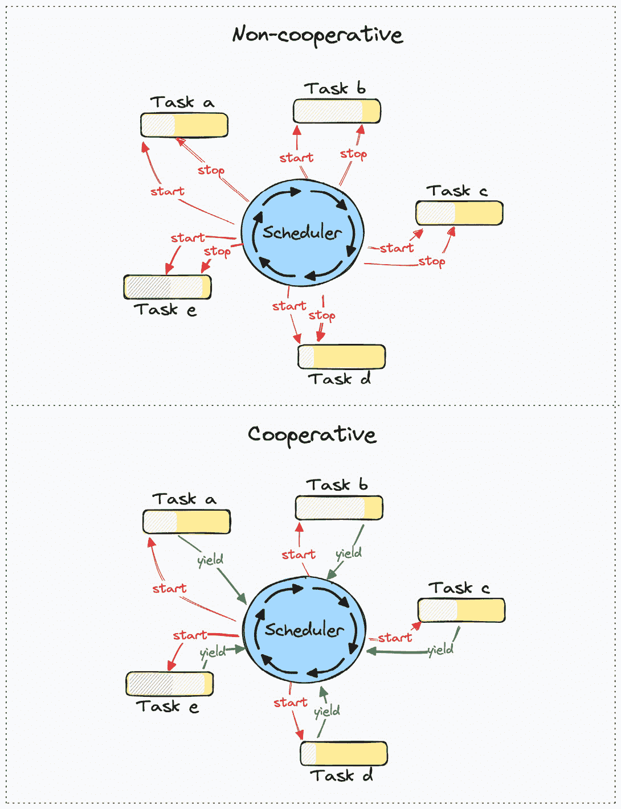
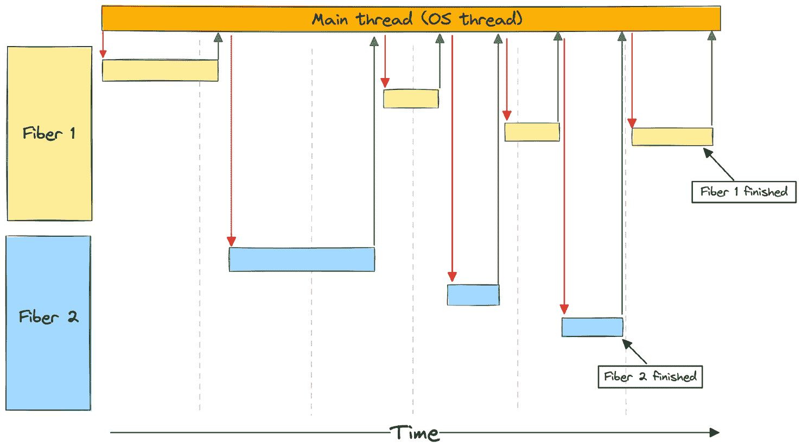

# 2

# 编程语言如何模拟异步程序流程

在上一章中，我们以一般性的方式介绍了异步程序流程、并发和并行性。在本章中，我们将缩小范围。具体来说，我们将探讨编程语言和库中模拟和处理并发性的不同方法。

需要记住的是，线程、未来、纤程、goroutines、承诺等都是抽象概念，它们为我们提供了一种模拟异步程序流程的方法。它们具有不同的优势和劣势，但它们的目标是给程序员提供一个易于使用（并且重要的是，难以误用）、高效且具有表现力的方式来创建一个处理任务的非顺序、通常不可预测的程序。

缺乏精确的定义在这里也很普遍；许多术语的名称源于某个时间点的具体实现，但后来它们获得了更广泛的意义，涵盖了不同实现和同一事物的不同变体。

在我们讨论每个抽象的优缺点之前，我们首先将根据它们的相似性对不同的抽象进行分组。我们还将介绍本书中会使用的重要定义，并详细讨论操作系统线程。

我们在这里讨论的主题相当抽象和复杂，所以如果你一开始不理解所有内容，请不要感到难过。随着我们继续阅读本书，并通过解决一些示例来熟悉不同的术语和技术，越来越多的部分将会变得清晰。

具体来说，以下内容将会被涵盖：

+   定义

+   操作系统提供的线程

+   绿色线程/栈满协程/纤程

+   基于回调的方法

+   承诺、未来和 async/await

# 定义

我们可以将并发操作的抽象大致分为两组：

1.  Rust 和 JavaScript 中的 `async`/`await`。

1.  **非协作式**：不一定自愿让出的任务。在这样的系统中，调度器必须能够**抢占**一个正在运行的任务，这意味着调度器可以停止任务并控制 CPU，即使该任务本来还能够工作并取得进展。这类任务的例子包括操作系统线程和 Goroutines（在 GO 版本 1.14 之后）。



图 2.1 – 非协作式与协作式多任务处理

注意

在一个调度器可以抢占正在运行的任务的系统中，任务也可以像在协作系统中那样自愿让出，而在仅依赖于抢占的系统中的这种情况很少见。

我们可以根据它们实现的特点将这些抽象进一步分为两大类：

1.  **有堆栈**：每个任务都有自己的调用堆栈。这通常实现为一个与操作系统用于其线程的堆栈相似的堆栈。有堆栈的任务可以在程序的任何位置挂起执行，因为整个堆栈都被保留。

1.  **无堆栈**：每个任务没有单独的堆栈；它们都运行在共享的调用堆栈上。任务不能在堆栈帧的中间被挂起，这限制了运行时抢占任务的能力。然而，它们在任务间切换时需要存储/恢复更少的信息，因此可以更高效。

这两个类别还有更多细微之处，你将在本书后面通过实现一个堆栈式协程（纤程）和一个无堆栈协程（由`async`/`await`生成的 Rust 未来）的示例来深入理解。目前，我们只提供概述，尽量简化细节。

## 线程

我们将在整本书中不断提到线程，所以在我们走得太远之前，让我们停下来给“线程”一个好的定义，因为它是一个引起很多混淆的基本术语。

在最一般的意义上，线程指的是**执行线程**，即需要按顺序执行的一系列指令。如果我们将其与本书第一章中在并发与并行性子节下提供的几个定义联系起来，执行线程类似于我们定义的具有多个步骤且需要资源才能进展的**任务**。

这个定义的通用性可能会引起一些混淆。对某个人来说，一个线程显然可以指操作系统线程，而对另一个人来说，它可能仅仅指代任何代表系统上执行线程的抽象。 

线程通常分为两大类：

+   **操作系统线程**：这些线程是由操作系统创建并由操作系统调度器管理的。在 Linux 上，这被称为**内核线程**。

+   **用户级线程**：这些线程是由我们程序员创建和管理的，操作系统并不知道它们的存在。

现在，事情变得有点棘手：大多数现代操作系统的操作系统线程有很多相似之处。其中一些相似之处是由现代 CPU 的设计决定的。一个例子是，大多数 CPU 都假设有一个它可以执行操作的堆栈，并且它有一个堆栈指针寄存器和堆栈操作指令。

在最广泛的意义上，用户级线程可以指代任何创建和调度任务的系统（运行时）的实现，你不能像对待操作系统线程那样做出相同的假设。它们可以通过为每个任务使用单独的堆栈而与操作系统线程相似，正如我们在*第五章*中通过我们的纤程/绿色线程示例所看到的，或者它们在本质上可以非常不同，正如我们在本书第三部分的后面部分将看到的，我们将了解 Rust 如何模拟并发操作。

无论定义如何，一组任务都需要某种东西来管理它们并决定谁可以获得哪些资源以进行进展。在计算机系统中，所有任务都需要进行进展的最明显资源是 CPU 时间。我们将决定谁可以获得 CPU 时间以进行进展的“某种东西”称为**调度器**。

很可能，当某人提到“线程”而没有添加额外上下文时，他们指的是操作系统线程/内核线程，所以我们将继续这样做。

我还会继续将执行线程简单地称为**任务**。我发现当我们尽可能限制与上下文相关的不同假设所关联的术语的使用时，异步编程的主题更容易推理。 

首先，让我们把这个问题解决掉，同时我们也会强调操作系统中线程的一些定义特征。

重要！

定义将根据你阅读的书籍或文章而有所不同。例如，如果你阅读关于特定操作系统如何工作的内容，你可能会看到进程或线程是代表“任务”的抽象，这似乎与我们在这里使用的定义相矛盾。正如我之前提到的，参考系的选择很重要，这就是为什么我们在整本书中遇到这些术语时，都要非常仔细地定义它们。

线程的定义也可能因操作系统而异，尽管今天大多数流行的系统共享一个类似定义。最值得注意的是，Solaris（在 2002 年发布的 Solaris 9 之前）曾经有一个两级线程系统，它区分了应用程序线程、轻量级进程和内核线程。这是我们所说的 M:N 线程的实现，我们将在本书后面的章节中了解更多。只是要注意，如果你阅读了旧材料，这种系统中线程的定义可能与今天普遍使用的定义有显著差异。

既然我们已经讨论了本章最重要的定义，现在是时候更多地讨论编程时处理并发最流行的方式了。

# 操作系统提供的线程

注意！

我们称之为 1:1 线程。每个任务分配一个操作系统线程。

由于本书将不会专门关注操作系统线程作为处理并发的手段，所以我们在这里更详细地讨论它们。

让我们从显而易见的事情开始。要使用操作系统提供的线程，你需要，嗯，一个操作系统。在我们讨论将线程用作处理并发的一种手段之前，我们需要清楚我们正在讨论哪种类型的操作系统，因为它们有不同的风味。

嵌入式系统现在比以往任何时候都更普遍。这种硬件可能没有操作系统的资源，如果有的话，你可能会使用一种针对你的需求定制的、根本不同的操作系统，因为系统往往不那么通用，而更多是专门化的。

他们对线程的支持以及它们调度线程的特性可能与你习惯的 Windows 或 Linux 等操作系统中的不同。

由于涵盖所有不同的设计本身就是一本书的内容，我们将范围限制在讨论线程上，因为它们在运行在流行桌面和服务器 CPU 上的基于 Windows 和 Linux 的系统中使用。

操作系统线程易于实现和使用。我们只是让操作系统为我们处理一切。我们通过为每个我们想要完成的任务创建一个新的操作系统线程，并像平常一样编写代码来实现这一点。

我们用来处理并发的运行时是操作系统本身。除了这些优点之外，你还能免费获得并行性。然而，直接管理并行性和共享资源也会带来一些缺点和复杂性。

## 创建新线程需要时间

创建一个新的操作系统线程涉及一些账目和初始化开销，所以虽然在同一进程内切换两个现有线程相当快，但创建新线程和丢弃不再使用的线程需要花费时间。如果系统需要创建和丢弃大量线程，所有额外的开销都会限制吞吐量。当你处理大量需要并发处理的小任务时，这可能会成为一个问题，尤其是在处理大量 I/O 时。

## 每个线程都有自己的栈

我们将在本书的后面详细讨论栈，但到目前为止，知道它们占据固定大小的内存就足够了。每个操作系统线程都有自己的栈，尽管许多系统允许配置这个大小，但它们仍然是固定大小的，不能增长或缩小。毕竟，它们是栈溢出的原因，如果你将它们配置得太小，以适应你正在运行的任务，这将会成为一个问题。

如果我们有很多只需要少量栈空间的小任务，但我们预留的比实际需要的多得多，我们将占用大量内存，并可能耗尽它。

## 上下文切换

正如你所知，线程和调度器紧密相连。上下文切换发生在 CPU 停止执行一个线程并继续执行另一个线程时。尽管这个过程高度优化，但它仍然涉及到存储和恢复寄存器状态，这需要时间。每次你向操作系统调度器让步时，它可以选择在同一个 CPU 上调度来自不同进程的线程。

你看，这些系统创建的线程属于一个**进程**。当你启动一个程序时，它会启动一个进程，进程至少创建一个初始线程来执行你编写的程序。每个进程可以创建多个线程，这些线程共享相同的**地址空间**。

这意味着同一进程内的线程可以访问共享内存，并且可以访问相同的资源，例如文件和文件句柄。这一结果之一是，当操作系统通过停止同一进程中的一个线程并恢复另一个线程来切换上下文时，它不需要保存和恢复与该进程相关的所有状态，只需保存和恢复特定于该线程的状态。

另一方面，当操作系统从一个与一个进程关联的线程切换到与另一个进程关联的线程时，新进程将使用不同的地址空间，操作系统需要采取措施确保进程“A”不会访问属于进程“B”的数据或资源。如果不是这样，系统将不会安全。

结果是，可能需要刷新缓存，并且可能需要保存和恢复更多的状态。在高并发系统负载下，这些上下文切换可能会花费额外的时间，如果它们频繁发生，可能会以某种不可预测的方式限制吞吐量。

## 调度

操作系统可以以你意想不到的方式调度任务，并且每次你向操作系统让步时，你都会被放入与系统上所有其他线程和进程相同的队列中。

此外，由于无法保证线程将在离开时相同的 CPU 核心上恢复执行，或者两个任务不会并行运行并尝试访问相同的数据，因此你需要同步数据访问以防止数据竞争和其他与多核编程相关的陷阱。

Rust 作为一种语言将帮助你防止许多这些陷阱，但同步数据访问将需要额外的工作，并增加此类程序复杂性。我们经常说，使用操作系统线程处理并发给我们带来了免费的可并行性，但从增加的复杂性和需要适当的数据访问同步的角度来看，这并不是免费的。

## 将异步操作与操作系统线程解耦的优势

将异步操作与线程概念解耦有很多好处。

首先，使用操作系统线程作为处理并发的手段要求我们使用本质上是一种操作系统抽象来表示我们的任务。

拥有一个单独的抽象层来表示并发任务，这给了我们选择如何处理并发操作的自由。如果我们创建了一个表示并发操作（如 Rust 中的 future、JavaScript 中的 promise 或 GO 中的 goroutine）的抽象，那么这些并发任务的处理方式将由运行时实现者来决定。

运行时可以将每个并发操作映射到一个操作系统线程，它们可以使用纤程/绿色线程或状态机来表示任务。编写异步代码的程序员在底层实现发生变化时，不一定需要在他们的代码中进行任何更改。理论上，如果只是有一个运行时，相同的异步代码就可以用来处理没有操作系统的情况下在微控制器上的并发操作。

总结一下，使用操作系统提供的线程来处理并发有以下优点：

+   容易理解

+   易于使用

+   在任务之间切换是相对快速的

+   你可以免费获得并行性

然而，它们也有一些缺点：

+   操作系统级别的线程带有相当大的堆栈。如果你有多个任务同时等待（就像在重负载下的 Web 服务器中那样），你很快就会耗尽内存。

+   上下文切换可能会造成成本增加，并且由于你让操作系统进行所有调度，你可能会得到不可预测的性能。

+   操作系统有许多需要处理的事情。它可能不会像你希望的那样快速切换回你的线程。

+   它与操作系统抽象紧密耦合。在某些系统上，这可能不是一个选项。

## 示例

由于我们不会在这本书中花费更多时间讨论操作系统线程，我们将通过一个简短的示例来展示它们是如何使用的：

ch02/aa-os-threads

```rs
use std::thread::{self, sleep};
fn main() {
    println!("So, we start the program here!");
    let t1 = thread::spawn(move || {
        sleep(std::time::Duration::from_millis(200));
        println!("The long running tasks finish last!");
    });
    let t2 = thread::spawn(move || {
        sleep(std::time::Duration::from_millis(100));
        println!("We can chain callbacks...");
        let t3 = thread::spawn(move || {
            sleep(std::time::Duration::from_millis(50));
            println!("...like this!");
        });
        t3.join().unwrap();
    });
    println!("The tasks run concurrently!");
    t1.join().unwrap();
    t2.join().unwrap();
}
```

在这个示例中，我们简单地创建了几个操作系统线程并将它们放入休眠状态。休眠本质上等同于向操作系统调度器让步，请求在经过一定时间后被重新调度运行。为了确保我们的主线程在子线程有时间运行之前不会完成并退出（这将退出进程），我们在`main`函数的末尾`join`它们。

如果我们运行示例，我们会看到操作顺序的不同是基于我们让每个线程向调度器让步时间的长短：

```rs
So, we start the program here!
The tasks run concurrently!
We can chain callbacks...
...like this!
The long-running tasks finish last!
```

因此，虽然使用操作系统线程对于许多任务来说很棒，但我们通过讨论它们的限制和缺点，也概述了查看替代方案的好理由。我们将首先查看的是我们称之为纤维和绿色线程的替代方案。

# 纤维和绿色线程

注意！

这是一个**M:N 线程**的例子。许多任务可以在一个操作系统线程上并发运行。纤维和绿色线程通常被称为堆栈协程。

“绿色线程”这个名字最初来源于 Java 中早期使用的 M:N 线程模型的一个实现，并且自那时起就与 M:N 线程的不同实现相关联。你将遇到这个术语的不同变体，例如“绿色进程”（在 Erlang 中使用），这与我们在这里讨论的不同。你也会看到一些定义绿色线程比我们在这里更广泛的例子。

在这本书中，我们定义的绿色线程与纤维同义，因此这两个术语在以后都指同一件事。

纤维和绿色线程的实现意味着存在一个运行时和一个调度器，该调度器负责调度哪个任务（M）在操作系统线程（N）上运行。任务的数量远多于操作系统线程的数量，这样的系统仅使用一个操作系统线程就可以运行得很好。后者通常被称为**M:1 线程**。

Goroutines 是堆栈满协程的特定实现的一个例子，但它有一些细微差别。术语“协程”通常意味着它们本质上是合作的，但 Goroutines 可以被调度器抢占（至少从版本 1.14 开始），因此它们在我们提出的类别中处于某种灰色区域。

绿色线程和纤维使用与操作系统相同的机制，为每个任务设置一个堆栈，保存 CPU 的状态，并通过上下文切换从一个任务（线程）跳转到另一个任务。

我们将控制权交给调度器（在这样一个系统的运行时中，调度器是一个核心部分），然后它继续运行不同的任务。

执行状态存储在每个堆栈中，因此在这种解决方案中，不需要 `async`、`await`、`Future` 或 `Pin`。在许多方面，绿色线程模仿了操作系统如何促进并发，实现它们是一个很好的学习经历。

使用纤维/绿色线程进行并发任务运行的运行时可以具有高度的灵活性。例如，任务可以在任何时间、任何执行点被抢占和上下文切换，因此理论上，一个长时间运行的、占用 CPU 的任务可以被运行时抢占，作为防止任务由于边缘情况或程序员错误而阻塞整个系统的安全措施。

这使得运行时调度器几乎具有与操作系统调度器相同的性能，这是使用纤维/绿色线程的系统最大的优点之一。

典型的流程如下：

+   你运行一些非阻塞代码

+   你向某个外部资源发起一个阻塞调用

+   CPU 跳转到主线程，调度另一个线程运行，并跳转到那个堆栈

+   你在新线程上运行一些非阻塞代码，直到新的阻塞调用或任务完成

+   CPU 跳回到主线程，调度一个准备好进行进度的新线程，并跳转到那个线程



图 2.2 – 使用纤维/绿色线程的程序流程

## 每个堆栈都有固定空间

由于纤维和绿色线程类似于操作系统线程，它们确实有一些相同的缺点。每个任务都设置了一个固定大小的堆栈，所以你仍然需要预留比你实际使用的更多空间。然而，这些堆栈可以是可增长的，这意味着一旦堆栈满了，运行时可以增长堆栈。虽然这听起来很简单，但解决这个问题相当复杂。

我们不能像生长一棵树那样简单地生长一个堆栈。实际上需要发生的是以下两种情况之一：

1.  你分配一块新的连续内存，并处理你的堆栈分布在两个不连续内存段的事实

1.  你分配一个新的更大的堆栈（例如，是之前堆栈的两倍大小），将所有数据移动到新的堆栈上，并从这里继续

第一个解决方案听起来相当简单，因为你可以将原始栈保持原样，并在需要时基本切换到新栈，并从那里继续。然而，由于缓存和它们预测你接下来要处理的数据的能力，现代 CPU 可以在连续的内存块上工作得非常快。将栈分散到两块不连续的内存中将会阻碍性能。这在你有一个恰好位于栈边界处的循环时尤为明显，因此你可能会为循环的每次迭代进行多达两次的上下文切换。

第二个解决方案通过将栈作为连续的内存块来解决第一个解决方案的问题，但它也带来了一些问题。

首先，你需要分配一个新的栈并将所有数据移动到新栈上。但是，当一切移动到新位置时，所有指向栈上位置的指针和引用怎么办？你已经猜到了：指向栈上任何内容的指针和引用都需要更新，以便它们指向新位置。这是复杂且耗时的，但如果你的运行时已经包括垃圾回收器，你已经在跟踪所有指针和引用方面有了开销，所以这可能比非垃圾回收程序的问题要小。然而，它确实需要在垃圾回收器和运行时之间进行大量的集成，以便每次栈增长时都执行此操作，因此实现这种运行时可能会变得非常复杂。

其次，你必须考虑如果你有很多长时间运行的任务，这些任务在短时间内只需要大量的栈空间（例如，如果任务开始时涉及大量的递归）但大部分时间都是 I/O 密集型的情况。你最终会只为任务的一个特定部分增长栈多次，你必须决定你是否会接受任务占用比它需要的更多空间，或者在某些时候将其移回较小的栈。这种影响当然会根据你所做的工作类型而有很大差异，但这仍然是一件需要注意的事情。

## 上下文切换

即使这些纤程/绿色线程与操作系统线程相比很轻量级，你仍然需要在每次上下文切换时保存和恢复寄存器。这很可能不会成为问题，但与不需要上下文切换的替代方案相比，它可能效率较低。

上下文切换也可能非常复杂，特别是如果你打算支持许多不同的平台。

## 调度

当一个纤维/绿色线程向运行时调度器让步时，调度器可以简单地在新任务上恢复执行。这意味着每次你向调度器让步时，你都不会被放入与系统中每个其他任务相同的运行队列。从操作系统的角度来看，你的线程一直在忙于工作，所以如果可能，它会尽量避免抢占它们。

这个方法的一个意想不到的缺点是，大多数操作系统调度器确保所有线程都能得到一些运行时间，通过为每个操作系统线程分配一个时间片，在该时间片内它可以运行，然后操作系统抢占线程并在此 CPU 上调度新的线程。使用许多操作系统线程的程序可能会被分配比使用较少操作系统线程的程序更多的时片。使用 M:N 线程的程序很可能只会使用少数操作系统线程（在大多数系统上，每个 CPU 核心似乎是一个起点）。因此，根据系统上运行的其他内容，你的程序可能总共被分配的时片比使用许多操作系统线程时更少。然而，考虑到大多数现代 CPU 上可用的核心数量和并发系统的典型工作负载，这种影响应该是微不足道的。

## FFI

由于你创建了自己的栈，这些栈在特定条件下会增长/缩小，并且可能有一个假设可以在任何时间抢占运行中的任务的调度器，因此在使用 FFI 时，你必须采取额外措施。大多数 FFI 函数将假设一个正常的操作系统提供的 C 栈，因此从纤维/绿色线程调用 FFI 函数可能会出现问题。你需要通知运行时调度器，切换到不同的操作系统线程，并有一种方式通知调度器你已经完成，纤维/绿色线程可以继续。这自然为运行时实现者和进行 FFI 调用的用户都增加了开销和复杂性。

### 优点

+   对于用户来说，使用起来很简单。代码看起来就像使用操作系统线程时一样。

+   上下文切换相对较快。

+   与操作系统线程相比，内存使用量过多的问题较小。

+   你可以完全控制任务的调度方式，如果你愿意，可以根据自己的需求优先级排序。

+   很容易整合抢占，这可以是一个强大的特性。

### 缺点

+   栈需要在空间不足时有一种增长的方式，这会创建额外的工作和复杂性。

+   你仍然需要在每次上下文切换时保存 CPU 状态。

+   如果你打算支持许多平台和/或 CPU 架构，正确实现会比较复杂。

+   FFI 可能会有很多开销并增加意外的复杂性。

# 基于回调的方法

注意！

这是 M:N 线程的另一个例子。许多任务可以在一个操作系统线程上并发运行。每个任务由一系列回调组成。

你可能已经知道接下来几段将要讨论的内容，这来自于 JavaScript，我假设大多数人知道。

基于回调的方法背后的整个想法是保存一组我们想要稍后一起运行的指令的指针，以及所需的任何状态。在 Rust 中，这将是一个闭包。

在大多数语言中实现回调相对容易。它们不需要为每个任务进行上下文切换或预分配内存。

然而，使用回调表示并发操作需要你从开始就以一种截然不同的方式编写程序。将使用正常顺序程序流的程序重写为使用回调的程序，这代表了一次重大的重写，反之亦然。

基于回调的并发可能很难理解，也可能变得非常复杂。因此，“回调地狱”这个术语是大多数 JavaScript 开发者都熟悉的一点，这并非巧合。

由于每个子任务必须保存它稍后需要的所有状态，内存使用量将与任务中回调的数量线性增长。

### 优点

+   在大多数语言中易于实现

+   没有上下文切换

+   相对较低的内存开销（在大多数情况下）

### 缺点

+   内存使用量与回调的数量线性增长。

+   程序和代码可能很难理解。

+   这是一种完全不同的编写程序的方式，它将影响程序的几乎所有方面，因为所有让步操作都需要一个回调。

+   所有权可能很难理解。结果是，在没有垃圾收集器的情况下编写基于回调的程序可能变得非常困难。

+   由于所有权规则的复杂性，任务之间的状态共享很困难。

+   调试回调可能很困难。

# 协程：承诺和未来

注意！

这又是 M:N 线程的一个例子。许多任务可以在一个操作系统线程上并发运行。每个任务都表示为一个状态机。

**JavaScript 中的承诺**和**Rust 中的未来**是基于相同理念的不同实现。

不同的实现之间有一些差异，但在这里我们不会关注这些。由于它们在 JavaScript 中的使用而广为人知，解释承诺是值得的。承诺也与 Rust 的 future 有很多共同之处。

首先，许多语言都有一个承诺的概念，但以下示例中我将使用 JavaScript 中的承诺。

承诺是处理基于回调方法带来的复杂性的一个方法。

而不是：

```rs
setTimer(200, () => {
  setTimer(100, () => {
    setTimer(50, () => {
      console.log("I'm the last one");
    });
  });
});
```

我们可以这样做：

```rs
function timer(ms) {
    return new Promise((resolve) => setTimeout(resolve, ms));
}
timer(200)
.then(() => timer(100))
.then(() => timer(50))
.then(() => console.log("I'm the last one"));
```

后者方法也被称为**延续传递风格**。每个子任务一旦完成就调用一个新的子任务。

回调和承诺之间的区别在底层更为显著。你看，承诺返回一个可以处于三种状态之一的状态机：`pending`、`fulfilled`或`rejected`。

当我们在前面的例子中调用`timer(200)`时，我们得到一个处于`pending`状态的承诺。

现在，传递风格的确解决了与回调相关的一些问题，但在复杂性和编写程序的不同方式方面，它仍然保留了很多。然而，它们使我们能够利用编译器来解决这些问题，我们将在下一段中讨论。

## 协程和 async/await

协程有两种类型：**非对称**和**对称**。非对称协程将控制权交给调度器，我们将关注这些。对称协程将控制权交给特定的目的地；例如，另一个协程。

虽然协程在一般情况下是一个相当广泛的概念，但将协程作为编程语言中的`对象`引入，才是真正使这种处理并发的方式与操作系统线程和纤程/绿色线程所知的易于使用性相媲美的原因。

当你在 Rust 或 JavaScript 中写入`async`时，编译器会将看起来像正常函数调用的代码重写为未来（在 Rust 的情况下）或承诺（在 JavaScript 的情况下）。另一方面，**await**将控制权交给运行时调度器，任务将在你等待的未来/承诺完成之前挂起。

这样，我们可以编写几乎以与编写正常顺序程序相同的方式处理并发操作的程序。

我们现在可以将 JavaScript 程序编写如下：

```rs
async function run() {
    await timer(200);
    await timer(100);
    await timer(50);
    console.log("I'm the last one");
}
```

你可以将`run`函数视为一个由多个子任务组成的可暂停任务。在每个“await”点上，它将控制权交给调度器（在这种情况下，它是众所周知的 JavaScript 事件循环）。

一旦子任务的状态变为`fulfilled`或`rejected`之一，任务将被安排继续到下一步。

当使用 Rust 时，当你写下类似以下内容时，你可以看到函数签名发生了相同的转换：

```rs
async fn run() -> () { … }
```

该函数包装了返回对象，而不是返回类型`()`，而是返回一个输出类型为`()`的`Future`：

```rs
Fn run() -> impl Future<Output = ()>
```

语法上，Rust 的 futures 0.1 与我们所展示的承诺示例非常相似，我们今天使用的 Rust futures 与 JavaScript 中的`async`/`await`的工作方式有很多共同之处。

这种将看起来像正常函数和代码重写为其他方式的方法有很多好处，但并非没有缺点。

就像任何无栈协程实现一样，完全预占可能很难实现，或者根本不可能实现。这些函数必须在特定点让出，与纤程/绿色线程不同，在栈帧的中间无法挂起执行。通过在每次函数调用处插入预占点，例如，运行时或编译器可以实现一定程度的预占，但这并不等同于能够在执行过程中任何时刻预占任务。

预占点

预先中断点可以被视为插入调用调度器的代码，并询问它是否希望中断任务。这些点可以通过编译器或你使用的库在每次新的函数调用之前插入，例如。

此外，你需要编译器的支持来充分利用它。具有元编程能力（如宏）的语言可以模拟很多相同的功能，但这仍然不会像编译器知道这些特殊异步任务时那样无缝。

调试是另一个在实现未来/承诺时必须小心处理的问题领域。由于代码被重写为状态机（或生成器），你将不会像在正常函数中那样拥有相同的堆栈跟踪。通常，你可以假设函数的调用者既在堆栈中也在程序流程中先于它。对于未来和承诺，可能是运行时调用函数来推进状态机，因此可能没有好的回溯可以用来查看在调用失败的函数之前发生了什么。有方法可以绕过这个问题，但大多数方法都会带来一些开销。

### 优点

+   你可以像平时一样编写代码和模拟程序

+   没有上下文切换

+   它可以以非常内存高效的方式实现

+   它很容易在各种平台上实现

### 缺点

+   预先中断可能很难或不可能完全实现，因为任务不能在堆栈帧的中间停止

+   它需要编译器的支持来发挥其全部优势

+   调试可能很困难，这既是因为程序的流程非顺序性，也是因为从回溯中获取的信息有限。

# 摘要

你还在这里吗？这太棒了！你做得很好，已经通过了所有这些背景信息。我知道阅读描述抽象和代码的文本可能相当令人畏惧，但我希望你能看到为什么我们现在在书的开始部分研究这些高级主题是如此有价值。我们很快就会看到例子。我保证！

在本章中，我们讨论了如何通过使用操作系统提供的线程和编程语言或库提供的抽象来模拟和处理编程语言中的异步操作。虽然这不是一个详尽的列表，但我们讨论了一些最流行和广泛使用的技术，同时讨论了它们的优缺点。

我们花了很多时间深入探讨了线程、协程、纤程、绿色线程和回调，所以你应该对它们是什么以及它们之间有何不同有一个相当好的了解。

下一章将详细介绍我们如何进行系统调用和创建跨平台抽象，以及像 Epoll、Kqueue 和 IOCP 这样的操作系统支持的事件队列究竟是什么，以及为什么它们对于你将在野外遇到的几乎所有异步运行时都是基本的。
