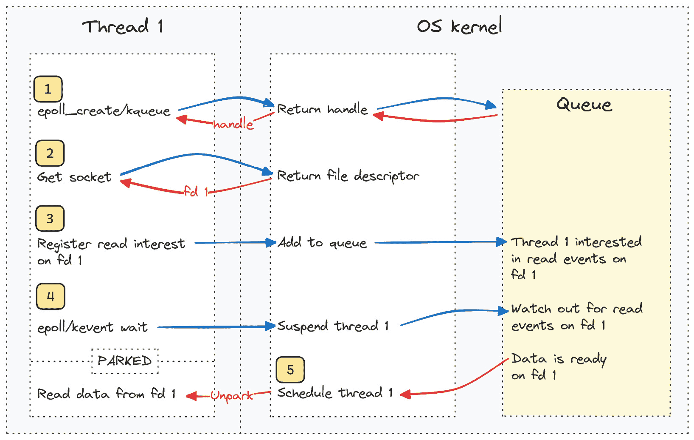
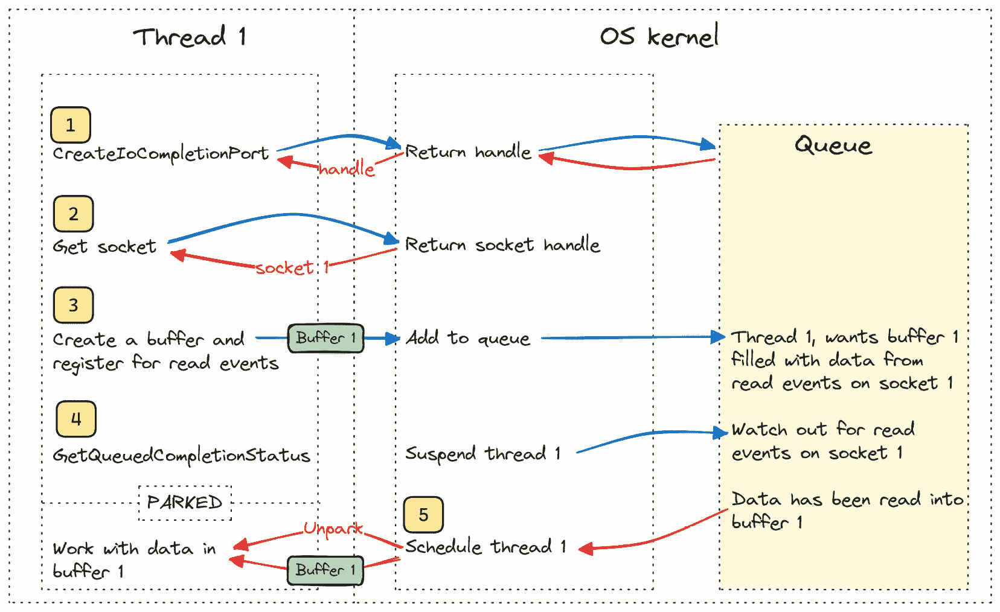

# 3

# 理解基于操作系统的事件队列、系统调用和跨平台抽象

在本章中，我们将探讨基于操作系统的事件队列的工作方式以及三个不同的操作系统如何以不同的方式处理这项任务。我们这样做的原因是，我所知道的大多数异步运行时都将此类基于操作系统的事件队列作为实现高性能 I/O 的基本部分。你很可能在阅读有关异步代码真正是如何工作的内容时经常听到对这些的引用。

基于本章讨论的技术的事件队列被用于许多流行的库中，例如：

+   mio ([`github.com/tokio-rs/mio`](https://github.com/tokio-rs/mio))，Tokio 等流行运行时的关键部分

+   polling ([`github.com/smol-rs/polling`](https://github.com/smol-rs/polling))，Smol 和 async-std 中使用的事件队列

+   libuv ([`libuv.org/`](https://libuv.org/))，用于创建 Node.js（一种 JavaScript 运行时）和 Julia 编程语言中使用的事件队列的库

+   C#用于其异步网络调用

+   Boost.Asio，一个用于 C++的异步网络 I/O 库

我们与宿主操作系统的所有交互都是通过**系统调用**（**syscalls**）完成的。要使用 Rust 进行系统调用，我们需要知道如何使用 Rust 的**外部函数接口**（**FFI**）。

除了知道如何使用 FFI 和进行系统调用外，我们还需要涵盖跨平台抽象。在创建事件队列时，无论你是自己创建还是使用库，如果你只有对例如 Windows 上 IOCP 工作方式的高级概述，你可能会发现这些抽象似乎有点不直观。这是因为这些抽象需要提供一个 API，涵盖不同操作系统以不同方式处理相同任务的事实。这个过程通常涉及在平台之间识别共同分母，并在其上构建新的抽象。

为了解释 FFI、系统调用和跨平台抽象，我们不会使用一个相当复杂且冗长的示例，而是通过一个简单的示例来逐步介绍这个主题。当我们后来遇到这些概念时，我们已经对这些主题有了足够的了解，因此我们为以下章节中更有趣的示例做好了充分的准备。

在本章中，我们将探讨以下主要主题：

+   为什么使用基于操作系统的事件队列？

+   基于就绪状态的事件队列

+   基于完成的事件队列

+   epoll

+   kqueue

+   IOCP

+   系统调用、FFI 和跨平台抽象

注意

尽管我们在这里没有涵盖它们，但有一些流行的、尽管使用较少的替代方案，你应该了解：

**wepoll**：这使用 Windows 上的特定 API，并封装 IOCP，使其在 Linux 上与 epoll 的工作方式非常相似，而不是常规的 IOCP。这使得在两种不同技术之上创建具有相同 API 的抽象层变得更容易。它被**libuv**和**mio**都使用。

**io_uring**：这是 Linux 上一个相对较新的 API，与 Windows 上的 IOCP 有很多相似之处。

我非常自信，在你阅读完接下来的两个章节后，如果你想要了解更多关于它们的信息，你会很容易阅读。

# 技术要求

本章不需要你设置任何新的东西，但由于我们将为三个不同的平台编写一些底层代码，如果你想运行所有示例，你需要访问这些平台。

跟随的最佳方式是在你的计算机上打开配套的存储库，并导航到 `ch03` 文件夹。

本章有些特别，因为我们从最基本的概念开始构建一些基本理解，这意味着其中一些内容相当底层，需要特定的操作系统和 CPU 系列。不用担心；我已经选择了最常用和最受欢迎的 CPU，所以这不应该是个问题，但这是你需要注意的事情。

在 Windows 和 Linux 上，机器必须使用 x86-64 指令集的 CPU。Intel 和 AMD 的台式机 CPU 使用这种架构，但如果你在基于 ARM 处理器的机器上运行 Linux（或 WSL），你可能会遇到一些使用内联汇编的示例的问题。在 macOS 上，本书中的示例针对的是较新的 M 系列芯片，但存储库中也包含针对较旧的基于 Intel 的 Mac 的示例。

不幸的是，一些针对特定平台的示例需要特定的操作系统才能运行。然而，这将是唯一一个你需要访问三个不同平台才能运行所有示例的章节。展望未来，我们将创建可以在所有平台上本地运行或使用 **Windows Subsystem for Linux** (**WSL**) 运行的示例，但为了理解跨平台抽象的基础，我们需要实际创建针对这些不同平台的示例。

## 运行 Linux 示例

如果你没有设置 Linux 机器，你可以在 Rust Playground 上运行 Linux 示例，或者如果你在 Windows 系统上，我的建议是设置 WSL 并在那里运行代码。你可以在 [`learn.microsoft.com/en-us/windows/wsl/install`](https://learn.microsoft.com/en-us/windows/wsl/install) 上找到如何操作的说明。记住，你还需要在 WSL 环境中安装 Rust，所以请遵循本书 *前言* 部分中关于如何在 Linux 上安装 Rust 的说明。

如果你使用 VS Code 作为你的编辑器，有一个非常简单的方法可以将你的环境切换到 WSL。按 *Ctrl*+*Shift*+*P* 并输入 `Reopen folder in WSL`。这样，你就可以轻松地在 WSL 中打开示例文件夹，并使用 Linux 运行代码示例。

# 为什么使用操作系统支持的事件队列？

到现在为止，你已经知道我们需要与操作系统紧密合作，以使 I/O 操作尽可能高效。Linux、macOS 和 Windows 等操作系统提供了多种执行 I/O 的方式，包括阻塞和非阻塞。

I/O 操作需要通过操作系统进行，因为它们依赖于操作系统抽象的资源。这可以是磁盘驱动器、网卡或其他外围设备。特别是在网络调用的案例中，我们不仅依赖于自己的硬件，还依赖于可能位于我们很远的资源，这会导致显著的延迟。

在上一章中，我们介绍了编程时处理异步操作的不同方法，虽然它们各不相同，但它们都有一个共同点：它们在执行系统调用时需要控制何时以及是否应该让出给操作系统调度器。

实际上，这意味着那些通常需要让出给操作系统调度器的系统调用（阻塞调用）需要避免，我们需要使用非阻塞调用。我们还需要一种有效的方法来了解每个调用的状态，以便我们知道发起阻塞调用的任务何时可以继续进行。这就是在异步运行时使用操作系统支持的事件队列的主要原因。

我们将以处理 I/O 操作的三种不同方式为例进行探讨。

## 阻塞 I/O

当我们请求操作系统执行阻塞操作时，它将挂起发起调用的操作系统线程。然后，它会存储我们在调用点所拥有的 CPU 状态，继续执行其他任务。当通过网络到达我们的数据时，它会再次唤醒我们的线程，恢复 CPU 状态，并让我们像什么都没发生一样继续执行。

对于我们程序员来说，阻塞操作是最不灵活的，因为我们在每次调用时都会将控制权交给操作系统。它的一个重大优势是，一旦我们等待的事件准备好，我们的线程就会被唤醒，我们可以继续执行。如果我们考虑整个在操作系统上运行的系统，这是一个相当高效的解决方案，因为操作系统会为有工作要做的线程在 CPU 上分配时间来推进。然而，如果我们缩小范围，只关注我们的进程，我们会发现每次我们进行阻塞调用时，我们都会让一个线程进入休眠状态，即使我们还有进程可以完成的工作。这让我们面临选择：是生成新的线程来执行工作，还是接受我们必须等待阻塞调用返回。我们稍后会对此进行更详细的讨论。

## 非阻塞 I/O

与阻塞 I/O 操作不同，操作系统不会挂起发起 I/O 请求的线程，而是给它一个句柄，线程可以使用这个句柄来询问操作系统事件是否已准备好。

我们称查询状态的这个过程为**轮询**。

非阻塞 I/O 操作给我们程序员更多的自由，但，像往常一样，这也伴随着责任。如果我们轮询过于频繁，比如在一个循环中，我们只会占用大量的 CPU 时间来请求更新状态，这是非常浪费的。如果我们轮询过于不频繁，那么事件就绪和我们对它采取行动之间会有显著的延迟，从而限制我们的吞吐量。

## 通过 epoll/kqueue 和 IOCP 进行事件排队

这是一种先前方法的混合体。在网络调用的情况下，调用本身将是非阻塞的。然而，我们不必定期轮询句柄，我们可以将句柄添加到事件队列中，我们可以用很少的开销处理数千个句柄。

作为程序员，我们现在有一个新的选择。我们可以定期查询队列以检查我们添加的事件是否已更改状态，或者我们可以向队列发出阻塞调用，告诉操作系统我们希望在队列中至少有一个事件的状态发生变化时被唤醒，这样等待该特定事件的任务就可以继续。

这允许我们在没有更多工作要做且所有任务都在等待事件发生才能继续之前，只向操作系统交出控制权。我们可以决定何时自己发起这样的阻塞调用。

注意

我们将不会介绍**poll**和**select**这样的方法。大多数操作系统都有一些较老的方法，在今天的现代异步运行时中并不广泛使用。只需知道我们还可以调用其他方法，这些方法本质上旨在提供与我们刚才讨论的事件队列相同的灵活性。

# 基于就绪状态的事件队列

**epoll**和**kqueue**被称为**基于就绪状态的事件队列**，这意味着它们会在动作准备好执行时通知你。一个例子是准备好读取的套接字。

为了了解这种做法在实际中的工作原理，我们可以看看当我们使用 epoll/kqueue 从套接字读取数据时会发生什么：

1.  我们通过调用系统调用`epoll_create`或`kqueue`来创建一个事件队列。

1.  我们向操作系统请求一个表示网络套接字的文件描述符。

1.  通过另一个系统调用，我们在该套接字上注册对`Read`事件的兴趣。重要的是我们也要通知操作系统，我们将期待在我们在*步骤 1*中创建的事件队列中事件就绪时收到通知。

1.  接下来，我们调用`epoll_wait`或`kevent`以等待事件。这将阻塞（挂起）被调用的线程。

1.  当事件准备就绪时，我们的线程将被解除阻塞（恢复）并从`wait`调用返回，返回有关已发生事件的数据。

1.  我们在*步骤 2*中创建的套接字上调用`read`。



图 3.1 – epoll 和 kqueue 流程的简化视图

# 基于完成的的事件队列

IOCP 代表**输入/输出完成端口**。这是一种基于完成的的事件队列。此类队列在事件完成时通知您。一个例子是将数据读入缓冲区。

以下是对此类事件队列中发生的基本情况的分解：

1.  我们通过调用系统调用`CreateIoCompletionPort`创建一个事件队列。

1.  我们创建一个缓冲区并请求操作系统给我们一个套接字的句柄。

1.  我们使用另一个系统调用在套接字上注册对`Read`事件的兴趣，但这次我们还传递了在（步骤 2）中创建的缓冲区，数据将被读入该缓冲区。

1.  接下来，我们调用`GetQueuedCompletionStatusEx`，它将阻塞，直到事件完成。

1.  我们的线程被解除阻塞，并且我们的缓冲区现在充满了我们感兴趣的数据。



图 3.2 – IOCP 流程的简化视图

# epoll、kqueue 和 IOCP

**epoll**是 Linux 实现事件队列的方式。在功能方面，它与 kqueue 有很多共同之处。使用 epoll 而不是 Linux 上其他类似方法（如 select 或 poll）的优势在于，epoll 被设计成能够与大量事件非常高效地工作。

**kqueue**是 macOS 在操作系统（如 FreeBSD 和 OpenBSD）中实现事件队列（起源于 BSD）的方式。在高级功能方面，它与 epoll 在概念上相似，但在实际使用中有所不同。

**IOCP**是 Windows 处理此类事件队列的方式。在 Windows 中，一个**完成端口**会在事件完成时通知您。现在，这听起来可能是一个微小的差异，但事实并非如此。当您想要编写库时，这一点尤其明显，因为抽象这两种方法意味着您必须将 IOCP 建模为基于准备状态的，或者将 epoll/kqueue 建模为基于完成的。

或者，将缓冲区借给操作系统也带来了一些挑战，因为当等待操作返回时，这个缓冲区保持不变非常重要。

| **Windows** | **Linux** | **macOS** |
| --- | --- | --- |
| IOCP | epoll | kqueue |
| 基于完成 | 基于准备状态 | 基于准备状态 |

表 3.1 – 不同平台和事件队列

# 跨平台事件队列

当创建跨平台事件队列时，您必须处理这样一个事实：您必须创建一个统一的 API，无论是在 Windows（IOCP）、macOS（kqueue）还是 Linux（epoll）上使用，都是相同的。最明显的区别是 IOCP 是基于完成的，而 kqueue 和 epoll 是基于准备状态的。

这种基本差异意味着您必须做出选择：

+   您可以创建一个抽象，将 kqueue 和 epoll 视为基于完成的事件队列，

+   您可以创建一个抽象，将 IOCP 视为基于准备状态的事件队列

根据我的个人经验，创建一个模仿基于完成的队列的抽象，并处理 kqueue 和 epoll 在幕后是基于准备状态的这一事实，比反过来要容易得多。正如我之前提到的，使用 wepoll 是创建 Windows 上基于准备状态的队列的一种方法。这将极大地简化创建这样的 API，但我们现在不讨论这一点，因为它不太为人所知，并且不是微软官方文档化的方法。

由于 IOCP 是基于完成的，它需要一个缓冲区来读取数据，因为它在数据被读取到该缓冲区时返回。另一方面，Kqueue 和 epoll 不需要。它们只会在你可以不阻塞地将数据读取到缓冲区时返回。

通过要求用户为我们 API 提供他们偏好的缓冲区大小，我们让用户控制他们想要如何管理他们的内存。用户定义缓冲区的大小，并控制所有将被传递给操作系统的内存方面，当使用 IOCP 时。

在这种 API 的情况下，对于 epoll 和 kqueue，你可以简单地调用 read 为用户服务，并填充相同的缓冲区，这样用户就会觉得 API 是基于完成的。

如果你想要展示一个基于准备状态的 API，那么在 Windows 上进行 I/O 操作时，你必须创建一个有两个独立操作的错觉。首先，当数据准备好在套接字上读取时请求一个通知，然后实际读取数据。虽然可以做到，但你很可能会发现自己不得不创建一个非常复杂的 API 或在 Windows 平台上接受一些由于中间缓冲区而导致的效率低下，以保持基于准备状态的 API 的错觉。

我们将把事件队列的话题留到我们创建一个简单示例来展示它们是如何工作的具体时刻。在我们这样做之前，我们需要真正熟悉 FFI 和系统调用，我们将通过编写一个在三个不同平台上实现系统调用的示例来实现这一点。

我们还将利用这个机会来讨论抽象级别以及我们如何创建一个在三个不同平台上都能工作的统一 API。

# 系统调用、FFI 和跨平台抽象

我们将为三种架构实现一个非常基本的系统调用：**BSD/macOS**、**Linux**和**Windows**。我们还将看到这是如何在三个抽象级别上实现的。

我们将实现的系统调用是在我们将某些内容写入**标准输出**（**stdout**）时使用的，因为这是一个非常常见的操作，而且了解它是如何真正工作的很有趣。

我们将从查看我们可以用来进行系统调用和从底层构建我们对它们的理解的最低抽象级别开始。

## 最低的抽象级别

最低层的抽象是编写通常被称为“原始”的系统调用。原始系统调用是绕过操作系统提供的系统调用库，而是依赖于操作系统有一个稳定的**系统调用 ABI**。稳定的系统调用 ABI 意味着它保证如果你在特定的寄存器中放入正确的数据并调用一个将控制权传递给操作系统的特定 CPU 指令，它总是会做同样的事情。

要进行原始系统调用，我们需要编写一点**内联汇编**，但别担心。尽管我们在这里突然引入了它，但我们会逐行分析它，并且在*第五章*中，我们将更详细地介绍内联汇编，以便你熟悉它。

在这个抽象级别，我们需要为 BSD/macOS、Linux 和 Windows 编写不同的代码。如果操作系统运行在不同的 CPU 架构上，我们也需要编写不同的代码。

### Linux 上的原始系统调用

在 Linux 和 macOS 上，我们想要调用的系统调用称为`write`。这两个系统都是基于当你启动一个进程时`stdout`已经存在的概念。

如果你不在你的机器上运行 Linux，有一些选项可以运行这个示例。你可以将代码复制粘贴到 Rust Playground 中，或者你可以在 Windows 中使用 WSL 运行它。

如介绍中所述，我将在每个示例的开始列出你需要去的地方的示例，你可以通过编写`cargo run`在那里运行示例。源代码始终位于`src/main.rs`示例文件夹中。

我们首先引入的是标准库模块，它给我们提供了访问`asm!`宏的权限。

仓库引用：ch03/a-raw-syscall

```rs
use std::arch::asm;
```

下一步是编写我们的系统调用函数：

```rs
#[inline(never)]
fn syscall(message: String) {
    let msg_ptr = message.as_ptr();
    let len = message.len();
    unsafe {
        asm!(
            "mov rax, 1",
            "mov rdi, 1",
            "syscall",
            in("rsi") msg_ptr,
            in("rdx") len,
            out("rax") _,
            out("rdi") _,
            lateout("rsi") _,
            lateout("rdx") _
        );
    }
}
```

我们将逐行分析这一部分。接下来的内容将非常相似，所以我们只需要详细说明一次。

首先，我们有一个名为`#[inline(never)]`的属性，它告诉编译器我们永远不会希望在这个函数优化期间将其内联。内联是编译器省略函数调用并简单地复制函数体而不是调用它的情况。在这种情况下，我们不希望这种情况发生。

接下来，我们有我们的函数调用。函数中的前两行只是简单地获取存储我们的文本的内存位置的原始指针和文本缓冲区的长度。

下一个行是一个不安全的块，因为在 Rust 中无法安全地调用这样的汇编。

汇编的第一行将值`1`放入`rax`寄存器。当 CPU 稍后陷阱我们的调用并将控制权传递给操作系统时，内核知道`rax`中的值为一意味着我们想要进行`write`。

第二行将值`1`放入`rdi`寄存器。这告诉内核我们想要写入的位置，而一表示我们想要写入`stdout`。

第三行调用`syscall`指令。这个指令发出一个软件中断，CPU 将控制权传递给操作系统。

Rust 的内联汇编语法一开始可能会显得有些令人生畏，但请耐心等待。我们将在本书稍后详细讲解，以便你能够熟悉它。现在，我只会简要地解释它做了什么。

第四行将地址写入缓冲区，其中我们的文本存储在 `rsi` 寄存器中。

第五行将我们的文本缓冲区的长度（以字节为单位）写入 `rdx` 寄存器。

接下来的四行不是对 CPU 的指令；它们的目的是告诉编译器它不能将这些寄存器中的任何内容存储，并且假设我们在退出内联汇编块时数据未被修改。我们通过告诉编译器将有一些未指定数据（由下划线表示）写入这些寄存器来实现这一点。

最后，是时候调用我们的原始系统调用了：

```rs
fn main() {
    let message = "Hello world from raw syscall!\n";
    let message = String::from(message);
    syscall(message);
}
```

这个函数只是创建一个 `String` 并调用我们的 `syscall` 函数，将其作为参数传递。

如果你在这台 Linux 机器上运行它，你现在应该在控制台看到以下消息：

```rs
Hello world from raw syscall!
```

### macOS 上的原始系统调用

现在，由于我们使用的是特定于 CPU 架构的指令，所以我们需要根据你运行的是带有英特尔 CPU 的较老 Mac 还是带有基于 Arm 64 架构的较新 Mac 来使用不同的函数。我们只展示了适用于使用 ARM 64 架构的新 M 系列芯片的函数，但不用担心，如果你已经克隆了 Github 仓库，你会在那里找到适用于两种版本 Mac 的代码。

由于只有细微的变化，我将在这里展示整个示例，并仅说明差异。

记住，你需要在一台带有 macOS 和 M 系列芯片的机器上运行此代码。你不能在 Rust 演示场地上尝试此操作。

ch03/a-raw-syscall

```rs
use std::arch::asm;
fn main() {
    let message = "Hello world from raw syscall!\n"
    let message = String::from(message);
    syscall(message);
}
#[inline(never)]
fn syscall(message: String) {
    let ptr = message.as_ptr();
    let len = message.len();
    unsafe {
        asm!(
            "mov x16, 4",
            "mov x0, 1",
            "svc 0",
            in("x1") ptr,
            in("x2") len,
            out("x16") _,
            out("x0") _,
            lateout("x1") _,
            lateout("x2") _
        );
    }
}
```

除了不同的寄存器命名外，与我们在 Linux 上编写的那一个相比，并没有太大的区别，除了在 macOS 上，`write` 操作的代码是 `4`，而不是 Linux 上的 `1`。此外，引发软件中断的 CPU 指令是 `svc 0`，而不是 `syscall`。

再次强调，如果你在 macOS 上运行此代码，你将在控制台看到以下输出：

```rs
Hello world from raw syscall!
```

### 那么在 Windows 上原始的系统调用呢？

这是一个很好的机会来解释为什么如果你想让你的程序或库跨平台工作，像我们刚才那样编写原始的系统调用是一个坏主意。

你看，如果你想让你的代码在未来很长时间内都能工作，你必须担心操作系统提供的保证。Linux 保证，例如，写入 `rax` 寄存器的值 `1` 总是指向 `write`，但 Linux 在许多平台上运行，并不是每个人都使用相同的 CPU 架构。我们与 macOS 面临着相同的问题，它最近刚刚从基于英特尔 x86_64 架构转变为基于 ARM 64 架构。

当涉及到像这样的低级内部结构时，Windows 根本不提供任何保证。Windows 已经多次更改其内部结构，并且没有提供关于此问题的官方文档。我们唯一拥有的只是可以在互联网上找到的反汇编表，但这些不是稳健的解决方案，因为下一次运行 Windows 更新时，原本是`write`的系统调用可能会变成`delete`的系统调用。即使这种情况不太可能发生，你也没有任何保证，这反过来又使得你无法向你的程序用户保证它将来会工作。

因此，虽然原始的系统调用在理论上确实有效，并且熟悉它们是有好处的，但它们主要作为我们为什么更愿意在系统调用时链接到不同操作系统为我们提供的库的例子。下一部分将展示我们是如何做到这一点的。

## 抽象的下一层次

抽象的下一层次是使用 API，这是三个操作系统都为我们提供的。

我们很快就会看到这个抽象有助于我们移除一些代码。在这个特定例子中，Linux 和 macOS 上的系统调用是相同的，所以我们只需要担心我们是否在 Windows 上。我们可以通过使用`#[cfg(target_family = "windows")]`和`#[cfg(target_family = "unix")]`条件编译标志来区分平台。你将在仓库中的示例中看到这些标志的使用。

我们的主要功能将和之前看起来一样：

ch03/b-normal-syscall

```rs
use std::io;
fn main() {
    let message = "Hello world from syscall!\n";
    let message = String::from(message);
    syscall(message).unwrap();
}
```

唯一的区别是，我们不是引入`asm`模块，而是引入`io`模块。

### 在 Linux 和 macOS 中使用操作系统提供的 API

你可以直接在 Rust playground 上运行这段代码，因为它在 Linux 上运行，或者你可以在使用 WSL 的 Linux 机器上本地运行它，或者在 macOS 上运行：

ch03/b-normal-syscall

```rs
#[cfg(target_family = "unix")]
#[link(name = "c")]
extern "C" {
    fn write(fd: u32, buf: *const u8, count: usize) -> i32;
}
fn syscall(message: String) -> io::Result<()> {
    let msg_ptr = message.as_ptr();
    let len = message.len();
    let res = unsafe { write(1, msg_ptr, len) };
    if res == -1 {
        return Err(io::Error::last_os_error());
    }
    Ok(())
}
```

让我们一步一步地了解不同的步骤。了解如何进行适当的系统调用将在本书后面的内容中对我们非常有用。

```rs
#[link(name = "c")]
```

每个 Linux（和 macOS）安装都附带了一个`libc`版本，这是一个用于与操作系统通信的 C 库。有了`libc`和一致的 API，我们可以以相同的方式进行编程，而不用担心底层平台架构。内核开发者也可以在不破坏每个人程序的情况下更改底层的 ABI。这个标志告诉编译器链接到系统上的`"c"`库。

接下来是定义我们想要在链接的库中调用的函数：

```rs
extern "C" {
 fn write(fd: u32, buf: *const u8, count: usize);
}
```

`extern "C"`（有时可以不带`"C"`，因为如果未指定，则假定使用`"C"`）意味着我们想要在链接到的`"C"`库中使用`"C"`的`write`函数。这个函数需要有与链接到的库中函数完全相同的名称。参数名称不必相同，但它们必须以相同的顺序排列。将它们命名为与链接到的库中相同的名称是一种良好的做法。

在这里，我们使用 Rust 的 FFI（Foreign Function Interface，外部函数接口），所以当你读到使用 FFI 调用外部函数时，这正是我们在做的事情。

`write`函数接受一个文件描述符`fd`，在这个例子中，它是`stdout`的句柄。此外，它期望我们提供一个指向 u8 数组`buf`值的指针和该缓冲区的长度`count`。

调用约定

这是我们第一次遇到这个术语，所以即使我们稍后会更深入地探讨这个主题，我仍会简要解释一下。

调用约定定义了函数调用是如何执行的，并将指定如下：

- 函数参数是如何传递给函数的

- 函数在开始时预期存储哪些寄存器，并在返回前恢复

- 函数如何返回其结果

- 如何设置堆栈（我们稍后会回到这个问题）

因此，在调用外部函数之前，你需要指定要使用的调用约定，因为编译器不知道的话，就没有办法知道了。C 调用约定是最常见的一种。

接下来，我们将对链接的函数的调用包装在一个正常的 Rust 函数中。

ch03/b-normal-syscall

```rs
#[cfg(target_family = "unix")]
fn syscall(message: String) -> io::Result<()> {
    let msg_ptr = message.as_ptr();
    let len = message.len();
    let res = unsafe { write(1, msg_ptr, len) };
    if res == -1 {
        return Err(io::Error::last_os_error());
    }
    Ok(())
}
```

你现在可能已经熟悉前两行，因为它们与我们为原始系统调用示例编写的相同。我们获取存储文本的缓冲区的指针和该缓冲区的长度。

接下来是`libc`中的`write`函数的调用，由于 Rust 在调用外部函数时不能保证安全性，所以需要包装在`unsafe`块中。

你可能会想知道我们是如何知道值`1`指的是`stdout`的文件句柄。

当你从 Rust 编写系统调用时，你会经常遇到这种情况。通常，常量是在`C`头文件中定义的，因此我们需要手动搜索它们并查找这些定义。`1`在 UNIX 系统中始终是`stdout`的文件句柄，所以很容易记住。

注意

包装`libc`函数并提供这些常量正是 create `libc` ([`github.com/rust-lang/libc`](https://github.com/rust-lang/libc))为我们提供的。大多数时候，你可以使用它来代替我们在这里所做的所有手动工作，比如链接和定义函数。

最后，我们有错误处理，当使用 FFI 时，你会经常看到这一点。`C`函数通常使用一个特定的整数来指示函数调用是否成功。在这个`write`调用的例子中，函数将返回写入的字节数，或者如果发生错误，它将返回值`-1`。你可以通过阅读 Linux 的*man-pages*（[`man7.org/linux/man-pages/index.html`](https://man7.org/linux/man-pages/index.html)）来轻松找到这些信息。

如果发生错误，我们使用 Rust 标准库中的内置函数查询 OS 为该进程报告的最后错误，并将其转换为 rust `io::Error`类型。

如果你使用`cargo run`运行这个函数，你会看到以下输出：

```rs
Hello world from syscall!
```

### 使用 Windows API

在 Windows 上，事情有点不同。虽然 UNIX 模型几乎将你交互的每一件事都视为“文件”，但 Windows 使用其他抽象。在 Windows 上，你得到一个**句柄**，它代表你可以以特定方式与之交互的对象。句柄的具体类型决定了交互方式。

我们将使用之前相同的`main`函数，但我们需要链接到 Windows API 中的不同函数，并对我们的`syscall`函数进行修改。

ch03/b-normal-syscall

```rs
#[link(name = "kernel32")]
extern "system" {
    fn GetStdHandle(nStdHandle: i32) -> i32;
    fn WriteConsoleW(
        hConsoleOutput: i32,
        lpBuffer: *const u16,
        numberOfCharsToWrite: u32,
        lpNumberOfCharsWritten: *mut u32,
        lpReserved: *const std::ffi::c_void,
    ) -> i32;
}
```

你首先注意到的是，我们不再链接到`"C"`库。相反，我们链接到`kernel32`库。下一个变化是使用系统调用约定。这个约定有点特别。你看，Windows 根据你为 32 位 x86 Windows 版本还是 64 位 x86_64 Windows 版本编写代码而使用不同的调用约定。运行在 x86_64 上的较新版本的 Windows 使用`"C"`调用约定，所以如果你有一个较新的系统，你可以尝试将其更改并查看它是否仍然工作。“指定系统”让编译器根据系统确定正确的调用约定。

在 Windows 中，我们链接到两个不同的系统调用：

+   `GetStdHandle`: 这个函数用于获取对标准设备（如`stdout`）的引用

+   `WriteConsoleW`: `WriteConsole`有两种类型。`WriteConsoleW`接受 Unicode 文本，而`WriteConsoleA`接受 ANSI 编码的文本。在我们的程序中，我们使用接受 Unicode 文本的那个版本。

现在，如果你只写英文文本，**ANSI 编码**的文本可以正常工作，但一旦你开始写其他语言的文本，你可能需要使用 ANSI 无法表示但在**Unicode**中可以表示的特殊字符。如果你混合使用它们，你的程序可能不会按预期工作。

接下来是我们的新`syscall`函数：

ch03/b-normal-syscall

```rs
fn syscall(message: String) -> io::Result<()> {
    let msg: Vec<u16> = message.encode_utf16().collect();
    let msg_ptr = msg.as_ptr();
    let len = msg.len() as u32;
    let mut output: u32 = 0;
        let handle = unsafe { GetStdHandle(-11) };
        if handle  == -1 {
            return Err(io::Error::last_os_error())
        }
        let res = unsafe {
            WriteConsoleW(
                handle,
                msg_ptr,
                len,
                &mut output,
                std::ptr::null()
            )};
        if res  == 0 {
            return Err(io::Error::last_os_error());
        }
    Ok(())
}
```

我们首先做的事情是将文本转换为 Windows 使用的`utf-16`编码的文本。幸运的是，Rust 有一个内置函数可以将我们的`utf-8`编码文本转换为`utf-16`代码点。`encode_utf16`返回一个`u16`代码点的迭代器，我们可以将其收集到一个`Vec`中。

接下来的两行现在应该很熟悉了。我们获取文本存储位置的指针和文本的字节长度。

接下来，我们调用`GetStdHandle`并传入值`-11`。我们需要为不同的标准设备传入的值与`GetStdHandle`的文档一起描述，在[`learn.microsoft.com/en-us/windows/console/getstdhandle`](https://learn.microsoft.com/en-us/windows/console/getstdhandle)。这很方便，因为我们不需要在 C 头文件中挖掘以找到我们需要的所有常量值。

所有函数的返回码都有详细的文档说明，所以我们在这里以与 Linux/macOS 系统调用相同的方式处理潜在的错误。

最后，我们有调用`WriteConsoleW`函数的例子。这没有什么太复杂的，你会注意到它与我们在 Linux 中使用的`write`系统调用的相似之处。一个不同之处在于，输出不是从函数返回，而是写入我们以指针形式传递的输出变量地址位置。

注意

现在你已经看到了我们如何创建跨平台的系统调用，你可能也会理解为什么我们不包含使本书中每个示例都跨平台的代码。简单来说，如果这样做，这本书会非常长，而且并不明显这些额外的信息实际上会帮助我们理解关键概念。

## 最高级别的抽象

这很简单，但我只是想为了完整性而添加这一点。Rust 标准库为我们封装了对底层操作系统 API 的调用，所以我们不需要关心要调用哪些系统调用。

```rs
fn main() {
 println!("Hello world from the standard library");
}
```

恭喜！你现在已经用三个层次抽象写出了相同的系统调用。你现在知道了 FFI 的样子，你看到了一些内联汇编（我们将在稍后更详细地介绍），并且你已经正确地进行了系统调用，将内容打印到控制台。你还看到了我们标准库通过封装这些针对不同平台的调用来尝试解决的问题，这样我们就不需要知道这些系统调用来打印内容到控制台。

# 概述

在本章中，我们介绍了基于操作系统的事件队列是什么，并对其工作原理进行了高级概述。我们还讨论了 epoll、kqueue 和 IOCP 的定义特征，并重点介绍了它们之间的差异。

在本章的后半部分，我们介绍了一些系统调用的例子。我们讨论了原始系统调用和“正常”系统调用，这样你知道它们是什么，并看到了两者的示例。我们还利用这个机会讨论了抽象层次，以及当我们能够利用好的抽象时，依赖它们的优点。

作为系统调用的一个部分，你也了解了 Rust 的 FFI（Foreign Function Interface）。

最后，我们创建了一个跨平台的抽象。你也看到了创建一个在多个操作系统上工作的统一 API 所面临的挑战。

下一章将带你通过一个使用 epoll 创建简单事件队列的例子，这样你可以看到它在实际中是如何工作的。在仓库中，你还可以找到 Windows 和 macOS 的相同示例，所以如果你想要为这些平台中的任何一个实现事件队列，这些示例都是可用的。

# 第二部分：事件队列和绿色线程

在这部分，我们将展示两个示例。第一个示例演示了使用 epoll 创建事件队列的过程。我们将设计 API，使其与 mio 使用的 API 非常相似，这样我们就可以掌握 mio 和 epoll 的基本原理。第二个示例说明了使用 fibers/green threads 的方法，这与 Go 使用的方法类似。这种方法是 Rust 使用 futures 和 async/await 进行异步编程的流行替代方案之一。在 Rust 达到 1.0 版本之前，它也使用了 green threads，这使得它成为了 Rust 异步编程历史的一部分。在整个探索过程中，我们将深入研究诸如 ISAs、ABIs、调用约定、栈等基本编程概念，并简要涉及汇编编程。本节包括以下章节：

+   *第四章**，创建你自己的事件队列*

+   *第五章**，创建我们自己的纤维*
