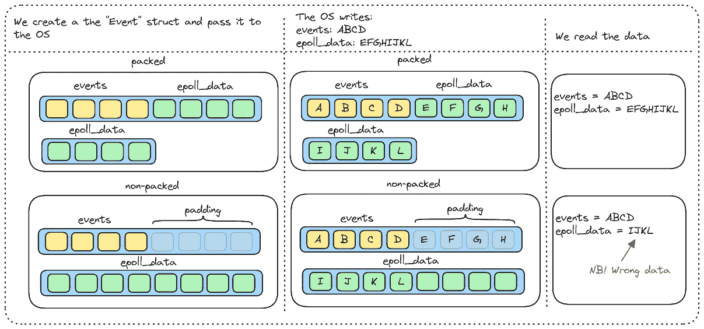
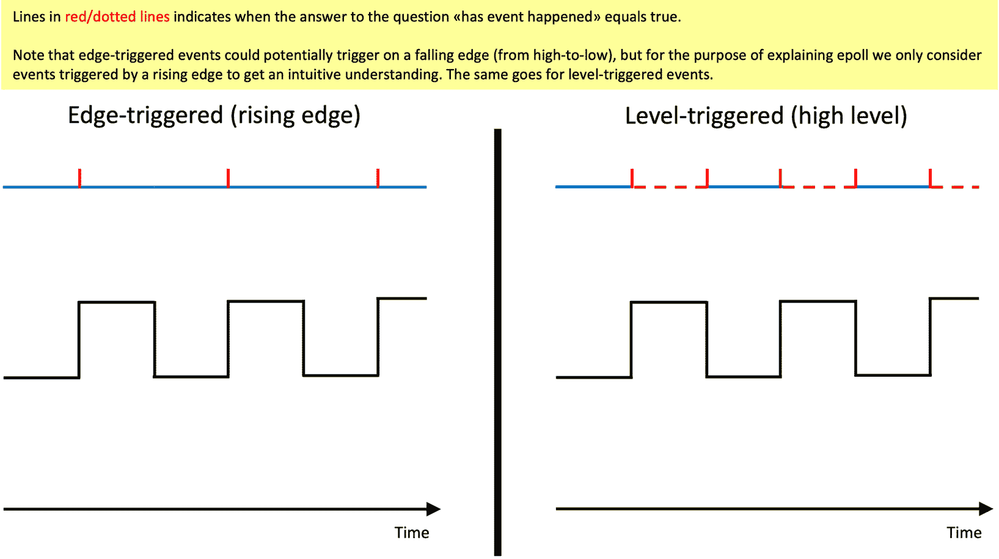

# 第四章：创建您自己的事件队列

在本章中，我们将使用 epoll 创建事件队列的简单版本。我们将从 `mio` 中汲取灵感，这也有助于如果你想要探索一个真正的生产就绪库是如何工作的，更容易地深入研究它们的代码库。

到本章结束时，你应该能够理解以下内容：

+   阻塞和非阻塞 I/O 之间的区别

+   如何使用 epoll 创建自己的事件队列

+   跨平台事件队列库（如 mio）的源代码

+   如果我们想让程序或库在不同的平台上工作，为什么需要在 epoll、kqueue 和 IOCP 之上添加抽象层

我们将本章分为以下几部分：

+   epoll 的设计和介绍

+   `ffi` 模块

+   `Poll` 模块

+   `main` 程序

# 技术要求

本章重点介绍 epoll，它是 Linux 特有的。不幸的是，epoll 不是 **可移植操作系统接口** (**POSIX**) 标准的一部分，因此这个示例将需要你在 Linux 上运行，不会与 macOS、BSD 或 Windows 操作系统兼容。

如果你在一台运行 Linux 的机器上，你已经设置好了，可以运行示例而无需进一步操作。

如果你使用的是 Windows，我的建议是如果你还没有设置，请设置 **WSL** ([`learn.microsoft.com/en-us/windows/wsl/install`](https://learn.microsoft.com/en-us/windows/wsl/install)) 并在 WSL 上运行的 Linux 操作系统中安装 Rust。

如果你使用的是 Mac，你可以通过使用基于 QEMU 的 **UTM** 应用程序 ([`mac.getutm.app/`](https://mac.getutm.app/)) 或其他任何在 Mac 上管理虚拟机 (VM) 的解决方案来创建一个运行 Linux 的 **虚拟机** (VM)，例如。

最后一个选择是租用一个 Linux 服务器（甚至有些提供商提供免费层），安装 Rust，然后在控制台中使用 Vim 或 Emacs 等编辑器，或者在远程机器上通过 SSH 使用 VS Code 进行开发 ([`code.visualstudio.com/docs/remote/ssh`](https://code.visualstudio.com/docs/remote/ssh))。我个人对 Linode 的服务有很好的体验 ([`www.linode.com/`](https://www.linode.com/))，但市面上有很多其他选择。

理论上，可以在 Rust playground 上运行示例，但由于我们需要延迟服务器，我们可能需要使用接受纯 HTTP 请求（不是 HTTPS）的远程延迟服务器服务，并修改代码，使所有模块都在一个文件中。这在紧急情况下是可能的，但并不推荐。

延迟服务器

这个示例依赖于对延迟响应可配置持续时间的服务器的调用。在存储库中，根目录下有一个名为 `delayserver` 的项目。

你可以通过在单独的控制台窗口中进入文件夹并编写 `cargo run` 来设置服务器。只需将服务器在单独的、打开的终端窗口中运行即可，因为我们将在示例中使用它。

`delayserver` 程序是跨平台的，因此它可以在 Rust 支持的所有平台上无需任何修改即可运行。如果你在 Windows 上运行 WSL，我建议你也在 WSL 中运行 `delayserver` 程序。根据你的配置，你可能可以在 Windows 控制台中运行服务器，同时在 WSL 中运行示例时仍然能够访问它。只是要注意，它可能不会直接工作。

服务器默认将监听端口 `8080`，那里的示例假设这是使用的端口。你可以在启动服务器之前在 `delayserver` 代码中更改监听端口，但请记住在示例代码中也进行相同的修正。

`delayserver` 的实际代码不到 30 行，所以如果你想看看服务器做了什么，浏览代码只需几分钟。

# 设计和 epoll 介绍

好的，所以本章将围绕一个主要示例展开，你可以在 `ch04/a-epoll` 仓库中找到这个示例。我们将首先看看我们是如何设计我们的示例的。

正如我在本章开头提到的，我们将从 `mio` 中汲取灵感。这有一个很大的优点和一个缺点。优点是，我们得到了一个关于 `mio` 如何设计的温和介绍，这使得如果你想要学习比我们在这个示例中涵盖的更多内容，更容易深入到那个代码库。缺点是我们对 epoll 引入了一个过于厚重的抽象层，包括一些非常具体于 `mio` 的设计决策。

我认为优点大于缺点，简单的理由是，如果你想要实现一个生产级别的事件循环，你可能会想查看已经存在的实现，同样，如果你想要深入挖掘 Rust 中异步编程的构建块，也是如此。在 Rust 中，`mio` 是支撑大部分异步生态系统的重要库之一，因此对它有所了解是一个额外的加分项。

重要的是要注意，`mio` 是一个跨平台库，它对 epoll、kqueue 和 IOCP（通过 Wepoll，正如我们在 *第三章* 中描述的）进行了抽象。不仅如此，`mio` 支持 iOS 和 Android，未来它可能还会支持其他平台。因此，如果只计划支持一个平台，那么在这么多不同的系统上统一 API 的可能性必然也会带来一些妥协。

mio

`mio` 自称是一个“*针对 Rust 的快速、低级 I/O 库，专注于非阻塞 API 和事件通知，以尽可能少的开销在* *操作系统抽象之上* *构建性能 I/O 应用。””

mio 驱动 Tokio 中的事件队列，Tokio 是 Rust 中最受欢迎和广泛使用的异步运行时之一。这意味着 mio 正在驱动像 Actix Web([`actix.rs/`](https://actix.rs/))、Warp([`github.com/seanmonstar/warp`](https://github.com/seanmonstar/warp))和 Rocket([`rocket.rs/`](https://rocket.rs/))这样的流行框架的 I/O。

在本例中，我们将使用 mio 的**0.8.8**版本作为设计灵感的来源。API 在过去已经改变，并且未来可能会改变，但我们在本处覆盖的 API 部分自 2019 年以来一直保持稳定，因此可以合理地预测，在不久的将来它不会发生重大变化。

正如所有跨平台抽象一样，通常有必要走选择最小公倍数的路线。一些选择可能会限制一个或多个平台上的灵活性和效率，以追求一个与所有这些平台都兼容的统一 API。我们将在本章中讨论一些这些选择。

在我们继续之前，让我们创建一个空白项目并给它起一个名字。我们将从现在开始称它为`a-epoll`，但当然你需要用你选择的名称来替换它。

进入文件夹并输入`cargo init`命令。

在这个例子中，我们将项目分成几个模块，并将代码拆分到以下文件中：

```rs
src
 |-- ffi.rs
 |-- main.rs
 |-- poll.rs
```

它们的描述如下：

+   `ffi.rs`：此模块将包含与我们需要与宿主操作系统通信的 syscalls 相关的代码

+   `main.rs`：这是示例程序本身

+   `poll.rs`：此模块包含主要抽象，它是在 epoll 之上的一个薄层

接下来，在`src`文件夹中创建前面提到的四个文件。

在`main.rs`中，我们还需要声明模块：

a-epoll/src/main.rs

```rs
mod ffi;
mod poll;
```

现在我们已经设置了项目，我们可以开始讨论我们将如何设计我们将使用的 API。主要抽象在`poll.rs`文件中，所以请打开该文件。

让我们先构建出我们需要的结构和函数。当我们把它们放在面前时，讨论它们会更简单：

a-epoll/src/poll.rs

```rs
use std::{io::{self, Result}, net::TcpStream, os::fd::AsRawFd};
use crate::ffi;
type Events = Vec<ffi::Event>;
pub struct Poll {
  registry: Registry,
}
impl Poll {
  pub fn new() -> Result<Self> {
    todo!()
  }
  pub fn registry(&self) -> &Registry {
    &self.registry
  }
  pub fn poll(&mut self, events: &mut Events, timeout: Option<i32>) -> Result<()> {
    todo!()
  }
}
pub struct Registry {
  raw_fd: i32,
}
impl Registry {
  pub fn register(&self, source: &TcpStream, token: usize, interests: i32) -> Result<()> 
  {
    todo!()
  }
}
impl Drop for Registry {
  fn drop(&mut self) {
    todo!()
  }
}
```

我们目前用`todo!()`替换了所有的实现。这个宏允许我们在尚未实现函数体的情况下编译程序。如果我们的执行达到`todo!()`，它将引发 panic。

你首先会注意到，我们将除了标准库中的一些类型外，还将`ffi`模块引入作用域。

我们还将使用`std::io::Result`类型作为我们自己的`Result`类型。这很方便，因为大多数错误都源于我们对操作系统的调用之一，操作系统错误可以映射到`io::Error`类型。

在 `epoll` 上有两个主要的抽象。一个是名为 `Poll` 的结构，另一个是名为 `Registry`。这些函数的名称和功能与 `mio` 中相同。命名这样的抽象出人意料地困难，这两个构造完全可以用不同的名称，但让我们依靠这样一个事实：在我们之前，有人已经花时间研究过这个问题，并决定在我们的示例中使用这些名称。

`Poll` 是一个表示事件队列本身的 `struct`。它有几个方法：

+   `new`: 创建一个新的事件队列

+   `registry`: 返回一个引用，我们可以用它来注册对新事件的兴趣

+   `poll`: 阻塞调用该方法的线程，直到有事件准备好或超时，以先发生者为准

`Registry` 是等式的另一半。虽然 `Poll` 代表事件队列，但 `Registry` 是一个句柄，它允许我们注册对新事件的兴趣。

`Registry` 只有一个方法：`register`。再次强调，我们模仿 `mio` 使用的 API ([`docs.rs/mio/0.8.8/mio/struct.Registry.html`](https://docs.rs/mio/0.8.8/mio/struct.Registry.html))，并且不是接受一个预定义的方法列表来注册不同的兴趣，而是接受一个 `interests` 参数，它将指示我们希望我们的事件队列跟踪哪种类型的事件。

另一点需要注意的是，我们不会为所有源使用泛型类型。我们只会为 `TcpStream` 实现，尽管我们可以用事件队列跟踪许多潜在的东西。

这尤其适用于我们想要实现跨平台时，因为根据你想要支持的平台，可能有许多类型的事件源我们想要跟踪。

`mio` 通过让 `Registry::register` 接受一个实现了 `mio` 定义的 `Source` 特性的对象来解决此问题。只要为源实现这个特性，你就可以使用事件队列来跟踪它的事件。

在下面的伪代码中，你会了解我们计划如何使用这个 API：

```rs
let queue = Poll::new().unwrap();
let id = 1;
// register interest in events on a TcpStream
queue.registry().register(&stream, id, ...).unwrap();
let mut events = Vec::with_capacity(1);
// This will block the curren thread
queue.poll(&mut events, None).unwrap();
//...data is ready on one of the tracked streams
```

你可能会想知道为什么我们真的需要 `Registry` 结构。

要回答这个问题，我们需要记住 `mio` 抽象了 `epoll`、`kqueue` 和 `IOCP`。它是通过使 `Registry` 包围一个 `Selector` 对象来做到这一点的。`Selector` 对象是条件编译的，以便每个平台都有其自己的 `Selector` 实现，对应于执行 IOCP、`kqueue` 和 `epoll` 的相关系统调用。

`Registry` 实现了一个我们不会在示例中实现的重要方法，称为 `try_clone`。我们不实现这个方法的原因是我们不需要它来理解这种事件循环是如何工作的，我们希望保持示例简单易懂。然而，这个方法对于理解为什么注册事件和队列本身的责任是分开的是很重要的。

重要提示

通过将注册兴趣的关注点移动到这样一个单独的结构中，用户可以通过调用`Registry::try_clone`来获取一个拥有的`Registry`实例。这个实例可以被传递给其他线程，或者通过`Arc<Registry>`与其他线程共享，使得多个线程可以在`Poll`阻塞另一个线程等待`Poll::poll`中发生新事件时注册对同一个`Poll`实例的兴趣。

`Poll::poll`需要独占访问，因为它接受一个`&mut self`，所以当我们等待`Poll::poll`中的事件时，如果我们依赖于使用`Poll`来注册兴趣，那么我们就无法从不同的线程同时注册兴趣，因为这会被 Rust 的类型系统所阻止。

由于这本质上会使得每个调用都变成顺序的，因此通过在同一个实例上调用`Poll::poll`来使多个线程等待事件变得在有意义的方式上实际上是不可能的。

这种设计允许用户通过注册兴趣从潜在的许多线程与队列交互，而一个线程进行阻塞调用并处理来自操作系统的通知。

注意

`mio`不能让你有多个线程在同一时刻阻塞在`Poll::poll`的调用上，这并不是由于 epoll、kqueue 或 IOCP 的限制。它们都允许许多线程在同一个实例上调用`Poll::poll`并接收队列中的事件通知。epoll 甚至允许特定的标志来决定操作系统是否只唤醒一个或所有等待通知的线程（特别是`EPOLLEXCLUSIVE`标志）。

问题部分在于不同的平台在许多线程都在同一个队列上等待事件时如何决定唤醒哪些线程，部分在于似乎对这种功能没有很大的兴趣。例如，epoll 默认会唤醒所有在`Poll`上阻塞的线程，而 Windows 默认只会唤醒一个线程。你可以在一定程度上修改这种行为，并且已经有人提出了在`Poll`上实现`try_clone`方法的想法。目前，设计就像我们概述的那样，我们将在示例中也坚持这一点。

这引出了另一个我们在开始实现示例之前应该讨论的话题。

## 所有的 I/O 都是阻塞的吗？

最后，一个容易回答的问题。答案是响亮的大……也许吧。问题是并非所有的 I/O 操作都会阻塞，即操作系统会挂起调用线程，切换到另一个任务会更有效率。原因是操作系统很智能，会在内存中缓存大量信息。如果信息在缓存中，请求该信息的系统调用将立即返回数据，因此强制上下文切换或重新调度当前任务可能不如同步处理数据更有效率。问题是无法确定 I/O 是否阻塞，这取决于你正在做什么。

让我给你举两个例子。

### DNS 查找

当创建 TCP 连接时，首先发生的一件事是你需要将典型的地址，如[www.google.com](https://www.google.com)，转换为 IP 地址，如`216.58.207.228`。操作系统维护一个本地地址和之前在缓存中查找的地址的映射，并且几乎可以立即解析它们。然而，第一次查找未知地址时，它可能需要调用 DNS 服务器，这需要很长时间，如果未以非阻塞方式处理，操作系统将挂起调用线程等待响应。

### 文件输入/输出

本地文件系统上的文件是另一个操作系统执行大量缓存操作的区域。经常被读取的小文件通常会被缓存在内存中，因此请求该文件可能根本不会阻塞。如果你有一个提供静态文件的 Web 服务器，你很可能只提供一小部分小文件。这些文件很可能被缓存在内存中。然而，无法确定这一点——如果操作系统内存不足，它可能不得不将内存页面映射到硬盘上，这使得通常非常快的内存查找变得极其缓慢。同样，如果随机访问大量小文件，或者如果你提供非常大的文件（因为操作系统只会缓存有限的信息），情况也是如此。如果你在同一操作系统上运行许多无关的过程，你也可能会遇到这种不可预测性，因为它可能不会缓存对你重要的信息。

处理这些情况的一个流行方法是忘记非阻塞 I/O，实际上进行阻塞调用。你不想在运行`Poll`实例的同一个线程中执行这些调用（因为任何小的延迟都会阻塞所有任务），但你可能会将这个任务委派给**线程池**。在线程池中，你有一有限数量的线程，它们负责为诸如 DNS 查找或文件 I/O 之类的操作进行常规的阻塞调用。

一个运行时示例，它正好做这件事的是 `libuv` ([`docs.libuv.org/en/v1.x/threadpool.html#threadpool`](http://docs.libuv.org/en/v1.x/threadpool.html#threadpool))。`libuv` 是 Node.js 构建在之上的异步 I/O 库。

虽然 `libuv` 的范围比 `mio` 更广（`mio` 只关心非阻塞 I/O），但 `libuv` 在 JavaScript 中的地位相当于 `mio` 在 Rust 中的地位。

注意

在线程池中执行文件 I/O 的原因在于，历史上非阻塞文件 I/O 的跨平台 API 一直很差。虽然许多运行时选择将这个任务委托给线程池，并通过操作系统进行阻塞调用，但这可能不会在未来成为事实，因为操作系统 API 随着时间的推移而演变。

创建一个线程池来处理这些情况超出了这个示例的范围（即使是 `mio` 也认为这超出了它的范围，为了明确起见）。我们将专注于展示 epoll 的工作原理，并在文本中提及这些主题，尽管我们不会在这个示例中实际实现解决方案。

现在我们已经介绍了关于 epoll、mio 以及我们示例设计的很多基本信息，是时候编写一些代码，亲自看看这一切在实际中是如何工作的了。

# `ffi` 模块

让我们从那些不依赖于其他模块的模块开始，逐步深入。`ffi` 模块包含了我们与操作系统通信所需的系统调用和数据结构的映射。一旦我们介绍了系统调用，我们也会详细解释 epoll 的工作原理。

这只是一些代码行，所以我会在这里放置第一部分，这样更容易跟踪文件中的位置，因为有很多东西需要解释。打开 `ffi.rs` 文件，并写下以下代码行：

ch04/a-epoll/src/ffi.rs

```rs
pub const EPOLL_CTL_ADD: i32 = 1;
pub const EPOLLIN: i32 = 0x1;
pub const EPOLLET: i32 = 1 << 31;
#[link(name = "c")]
extern "C" {
  pub fn epoll_create(size: i32) -> i32;
  pub fn close(fd: i32) -> i32;
  pub fn epoll_ctl(epfd: i32, op: i32, fd: i32, event: *mut Event) -> i32;
  pub fn epoll_wait(epfd: i32, events: *mut Event, maxevents: i32, timeout: i32) -> i32;
}
```

你首先会注意到，我们声明了一些名为 `EPOLL_CTL_ADD`、`EPOLLIN` 和 `EPOLLET` 的常量。

我稍后会解释这些常量的含义。首先，让我们看看我们需要执行的系统调用。幸运的是，我们已经详细介绍了系统调用，所以你已经知道了 `ffi` 的基础知识以及为什么在前面的代码中我们要链接到 C：

+   `epoll_create` 是我们用来创建 epoll 队列的系统调用。你可以在这里找到它的文档 [`man7.org/linux/man-pages/man2/epoll_create.2.html`](https://man7.org/linux/man-pages/man2/epoll_create.2.html)。这个方法接受一个名为 `size` 的参数，但 `size` 只是为了历史原因而存在的。这个参数将被忽略，但必须有一个大于 *0* 的值。

+   `close` 是我们需要在创建 `epoll` 实例时关闭文件描述符的系统调用，这样我们就可以正确地释放资源。你可以在 [`man7.org/linux/man-pages/man2/close.2.html`](https://man7.org/linux/man-pages/man2/close.2.html) 阅读这个系统调用的文档。

+   `epoll_ctl`是我们用来对 epoll 实例执行操作的控件接口。这是我们用来在源上注册对事件兴趣的调用。它支持三种主要操作：*添加*、*修改*或*删除*。第一个参数`epfd`是我们想要执行操作的 epoll 文件描述符。第二个参数`op`是我们指定是否想要执行一个*添加*、*修改*或*删除*操作的参数。

+   在我们的情况下，我们只对为事件添加兴趣感兴趣，因此我们只会传递`EPOLL_CTL_ADD`，这是表示我们想要执行一个*添加*操作的值。`epoll_event`稍微复杂一些，所以我们将在更多细节中讨论它。它为我们做了两件重要的事情：首先，`events`字段指示我们想要被通知的事件类型，并且它还可以修改我们*如何*和*何时*被通知的行为。其次，`data`字段将一块数据传递给内核，当发生事件时内核会将其返回给我们。后者很重要，因为我们需要这些数据来精确识别发生了什么事件，因为这是我们唯一会收到的可以识别我们收到通知来源的信息。您可以在以下链接中找到此系统调用的文档：[`man7.org/linux/man-pages/man2/epoll_ctl.2.html`](https://man7.org/linux/man-pages/man2/epoll_ctl.2.html)。

+   `epoll_wait`是会阻塞当前线程并等待以下两种情况之一的调用：我们收到一个事件已发生的通知，或者它超时了。`epfd`是标识我们使用`epoll_create`创建的队列的 epoll 文件描述符。`events`是我们用于`epoll_ctl`的相同`Event`结构体的数组。区别在于，`events`字段现在提供了关于发生了什么事件的信息，并且重要的是，`data`字段包含我们在注册兴趣时传递的相同数据。

+   例如，`data`字段让我们能够识别哪个文件描述符有准备读取的数据。`maxevents`参数告诉内核我们在我们的数组中为多少事件预留了空间。最后，`timeout`参数告诉内核在它再次唤醒我们之前我们将等待事件多长时间，这样我们就不可能永远阻塞。您可以在以下链接中阅读`epoll_wait`的文档：[`man7.org/linux/man-pages/man2/epoll_wait.2.html`](https://man7.org/linux/man-pages/man2/epoll_wait.2.html)。

该文件中的代码最后一部分是`Event`结构体：

ch04/a-epoll/src/ffi.rs

```rs
#[derive(Debug)]
#[repr(C, packed)]
pub struct Event {
    pub(crate) events: u32,
    // Token to identify event
    pub(crate) epoll_data: usize,
}
impl Event {
    pub fn token(&self) -> usize {
        self.epoll_data
    }
}
```

这个结构体用于在`epoll_ctl`中与操作系统通信，操作系统使用相同的结构体在`epoll_wait`中与我们通信。

事件被定义为`u32`，但它不仅仅是数字。这个字段就是我们所说的**位掩码**。我会在稍后的部分花时间解释位掩码，因为它在大多数系统调用中都很常见，并不是每个人都遇到过。简单来说，它是一种使用位表示作为一组是/否标志的方法，以指示是否选择了某个选项。

不同的选项在我提供的`epoll_ctl`系统调用链接中有描述。在这里，我不会详细解释所有选项，但只介绍我们将要使用的：

+   `EPOLLIN`代表一个位标志，表示我们对文件句柄上的读取操作感兴趣。

+   `EPOLLET`代表一个位标志，表示我们感兴趣的是通过将 epoll 设置为边沿触发模式来通知事件。

我们稍后会回到解释 bitflags、bitmasks 以及边沿触发模式真正意味着什么，但让我们先完成代码部分。

`Event`结构体的最后一个字段是`epoll_data`。这个字段在文档中被定义为联合体。联合体很像枚举，但与 Rust 的枚举不同，它不携带任何关于它是什么类型的信息，因此我们得确保我们知道它持有的数据类型。

我们使用这个字段简单地保存一个`usize`，这样我们就可以在注册兴趣时使用`epoll_ctl`传递一个标识每个事件的整数。传递一个指针也是完全可以接受的——只要我们确保在`epoll_wait`返回时指针仍然是有效的。

我们可以把这个字段看作是一个令牌，这正是`mio`所做的事情，为了使 API 尽可能相似，我们复制了`mio`，并在结构体上提供了一个`token`方法来获取这个值。

`#[repr(packed)]`的作用是什么？

`#[repr(packed)]`这个注解对我们来说是新的。通常，一个结构体会在字段之间或结构体末尾有填充。即使我们指定了`#[repr(C)]`，这种情况也会发生。

原因在于，通过不需要多次获取结构体字段中存储的数据，我们可以更有效地访问结构体中存储的数据。在`Event`结构体的例子中，通常的填充会在`events`字段末尾添加 4 个字节的填充。当操作系统期望`Event`结构体是打包的，而我们提供了一个填充的结构体时，它会在字段之间的填充中写入`event_data`的部分。当你稍后尝试读取`event_data`时，你将只读取`event_data`的最后部分，这恰好与填充重叠并获取了错误的数据。



操作系统期望`Event`结构体是打包的，这一点通过阅读 Linux 的 man 手册页并不明显，因此你必须阅读适当的 C 头文件才能确定。当然，你可以简单地依赖`libc`包([`github.com/rust-lang/libc`](https://github.com/rust-lang/libc))，如果我们不是在这里自己学习这类知识，我们也会这样做。

因此，现在我们已经走过了代码，有几个主题我们承诺要回过头来讨论。

## 位标志和位掩码

当你进行系统调用时（实际上，位掩码的概念在底层编程中相当常见），你经常会遇到这种情况。位掩码是一种将每个位视为开关或标志的方法，以指示一个选项是启用还是禁用。

一个整数，例如`i32`，可以表示为 32 位。`EPOLLIN`的十六进制值为`0x1`（这在十进制中就是 1）。以二进制表示，这将看起来像`00000000000000000000000000000001`。

另一方面，`EPOLLET`的值为`1 << 31`。这仅仅意味着十进制数 1 的位表示向左移动了 31 位。巧合的是，十进制数 1 与`EPOLLIN`相同，所以通过查看这个表示并将位向左移动 31 次，我们得到一个位表示为`10000000000000000000000000000000`的数字。

我们使用位标志的方式是使用 OR 运算符`|`，通过将值组合在一起，我们得到一个掩码，其中每个 OR 过的标志都设置为 1。在我们的例子中，掩码将看起来像`10000000000000000000000000000001`。

掩码的接收者（在这种情况下，操作系统）可以执行相反的操作，检查哪些标志被设置，并相应地采取行动。

我们可以通过一个简单的代码示例来展示这在实践中是如何工作的（你可以在 Rust playground 中运行这个示例，或者为这种类型的实验创建一个新的空项目）：

```rs
fn main() {
  let bitflag_a: i32 = 1 << 31;
  let bitflag_b: i32 = 0x1;
  let bitmask: i32 = bitflag_a | bitflag_b;
  println!("{bitflag_a:032b}");
  println!("{bitflag_b:032b}");
  println!("{bitmask:032b}");
  check(bitmask);
}
fn check(bitmask: i32) {
  const EPOLLIN: i32 = 0x1;
  const EPOLLET: i32 = 1 << 31;
  const EPOLLONESHOT: i32 = 0x40000000;
  let read = bitmask & EPOLLIN != 0;
  let et = bitmask & EPOLLET != 0;
  let oneshot = bitmask & EPOLLONESHOT != 0;
  println!("read_event? {read}, edge_triggered: {et}, oneshot?: {oneshot}")
}
```

这段代码将输出以下内容：

```rs
10000000000000000000000000000000
00000000000000000000000000000001
10000000000000000000000000000001
read_event? true, edge_triggered: true, oneshot?: false
```

在本章中，我们将介绍下一个主题，即边沿触发事件的概念，这可能需要一些解释。

## 电平触发与边沿触发事件

在一个完美的世界里，我们不需要讨论这个问题，但当我们与 epoll 一起工作时，几乎不可避免地需要了解这些差异。通过阅读文档，这一点并不明显，尤其是如果你之前没有接触过这些术语。有趣的是，这允许我们创建一个并行，即 epoll 中事件的处理方式与硬件级别事件的处理方式。

epoll 可以在`Event`结构体的`events`掩码上通知事件，我们设置`EPOLLET`标志以在边沿触发模式下接收通知（如果没有指定，默认为电平触发）。

这种对事件通知和事件处理的方式进行建模，与计算机处理中断的方式有很多相似之处。

电平触发意味着只要中断线上报告的电信号为高，问题的答案“事件是否发生”就是真的。如果我们把这一点应用到我们的例子中，*只要与文件句柄关联的缓冲区中有数据，读取事件就已经发生。*

在处理中断时，你会通过服务引起中断的任何硬件来清除中断，或者你可以屏蔽中断，这只是在稍后显式取消屏蔽之前禁用该线路上的中断。

在我们的例子中，我们通过读取缓冲区中的所有数据来清除 *中断*。当缓冲区被清空时，我们问题的答案变为 *false*。

当使用默认模式的 epoll 时，它是电平触发的，我们可能会遇到在相同事件上收到多个通知的情况，因为我们还没有时间清空缓冲区（记住，只要缓冲区中有数据，epoll 就会不断地通知你）。这在我们有一个线程报告事件然后将处理事件（从流中读取）的任务委托给其他工作线程时尤为明显，因为 epoll 会愉快地报告事件已准备好，即使我们正在处理它。

为了解决这个问题，epoll 有一个名为 `EPOLLONESHOT` 的标志。

`EPOLLONESHOT` 告诉 epoll，一旦我们在这个文件描述符上收到一个事件，它应该在该兴趣列表中禁用文件描述符。它不会移除它，但除非我们通过调用带有 `EPOLL_CTL_MOD` 参数和新的掩码的新 `epoll_ctl` 来显式重新激活它，否则我们不会在该文件描述符上收到任何更多通知。

如果我们没有添加这个标志，可能会发生以下情况：如果 *线程 1* 是我们调用 `epoll_wait` 的线程，那么一旦它收到关于读取事件的通告，它就会在 *线程 2* 中启动一个任务来读取该文件描述符，然后再次调用 `epoll_wait` 来获取新事件的通告。在这种情况下，`epoll_wait` 的调用将再次返回并告诉我们数据已在该文件描述符上准备好，因为我们还没有时间清空该文件描述符上的缓冲区。我们知道任务已经被 `thread 2` 处理，但我们仍然收到通知。如果没有额外的同步和逻辑，我们可能会将读取同一文件描述符的任务分配给 *线程 3*，这可能会引起难以调试的问题。

使用 `EPOLLONESHOT` 解决了这个问题，因为 *线程 2* 在完成其任务后必须重新激活事件队列中的文件描述符，从而通知我们的 epoll 队列它已经处理完毕，并且我们再次对该文件描述符上的通知感兴趣。

要回到我们最初的硬件中断的类比，`EPOLLONESHOT` 可以被看作是屏蔽中断。你实际上还没有清除事件通知的来源，但你不想在完成并显式取消屏蔽之前收到更多通知。在 epoll 中，`EPOLLONESHOT` 标志将禁用文件描述符上的通知，直到你通过调用 `epoll_ctl` 并将 `op` 参数设置为 `EPOLL_CTL_MOD` 来显式启用它。

边沿触发意味着对于“是否发生了事件”这个问题的答案只有在电信号从低到高*改变*时才是真的。如果我们把这个翻译到我们的例子中：当缓冲区从*没有数据*变为*有数据*时，就会发生读取事件。只要缓冲区中有数据，就不会报告新的事件。你仍然通过从套接字中清除所有数据来处理事件，但直到缓冲区完全清除并重新填充新数据，你都不会收到新的通知。

边沿触发模式也有一些陷阱。最大的一个问题是，如果你没有正确清除缓冲区，你将永远不会在那个文件句柄上再次收到通知。



图 4.1 – 边沿触发与电平触发事件

mio 在写作时，不支持`EPOLLONESHOT`，并使用边沿触发模式的 epoll，我们将在我们的示例中也这样做。

那么在多个线程中等待`epoll_wait`呢？

只要我们只有一个`Poll`实例，我们就可以避免在同一个 epoll 实例上多个线程调用`epoll_wait`时出现的问题和微妙之处。使用电平触发事件会唤醒所有在`epoll_wait`调用中等待的线程，导致它们都试图处理事件（这通常被称为雷鸣般的响声问题）。epoll 还有一个你可以设置的标志，称为`EPOLLEXCLUSIVE`，可以解决这个问题。默认情况下，设置为边沿触发的事件只会唤醒在`epoll_wait`中阻塞的一个线程，从而避免这个问题。

由于我们只从一个线程中使用一个`Poll`实例，这对我们来说不会是问题。

我知道并理解这听起来非常复杂。事件队列的一般概念相当简单，但细节可能会变得有点复杂。话虽如此，epoll 是我所经历的最复杂的 API 之一，因为 API 显然随着时间的推移而不断演变，以适应原始设计以适应现代需求，而且实际上没有简单的方法可以正确使用和理解它，除非至少覆盖我们在这里讨论的这些主题。

在这里，有一个安慰的话是，kqueue 和 IOCP 都有更容易理解的 API。还有这样一个事实，Unix 有一个新的异步 I/O 接口叫做`io_uring`，它将在未来变得越来越普遍。

现在我们已经覆盖了本章的难点，并对 epoll 的工作原理有了高级概述，是时候在`poll.rs`中实现我们受 mio 启发的 API 了。

# Poll 模块

如果你还没有编写或复制我们在*epoll 的设计和介绍*部分中展示的代码，现在是时候做了。我们将实现所有之前只是有`todo!()`的地方。

我们首先从实现我们的`Poll`结构体上的方法开始。首先，是打开`impl Poll`块并实现`new`函数：

ch04/a-epoll/src/poll.rs

```rs
impl Poll {
    pub fn new() -> Result<Self> {
        let res = unsafe { ffi::epoll_create(1) };
        if res < 0 {
            return Err(io::Error::last_os_error());
        }
        Ok(Self {
            registry: Registry { raw_fd: res },
        })
    }
```

在*The ffi module*部分对 epoll 的详细介绍之后，这应该相当直接。我们用参数 1 调用`ffi::epoll_create`（记住，参数被忽略，但必须是非零值）。如果出现任何错误，我们要求操作系统为我们进程报告最后一个错误并返回它。如果调用成功，我们返回一个新的`Poll`实例，它简单地封装了我们持有的 epoll 文件描述符的注册表。

接下来是我们的注册方法，它只是简单地返回内部`Registry`结构的引用：

ch04/a-epoll/src/poll.rs

```rs
    pub fn registry(&self) -> &Registry {
        &self.registry
    }
```

`Poll`上的最后一个方法是`poll`函数，它将挂起当前线程，并告诉操作系统在我们跟踪的源上发生事件或超时（哪个先发生）时唤醒它。我们还在这里关闭了`impl Poll`块：

ch04/a-epoll/src/poll.rs

```rs
  pub fn poll(&mut self, events: &mut Events, timeout: Option<i32>) -> Result<()> {
    let fd = self.registry.raw_fd;
    let timeout = timeout.unwrap_or(-1);
    let max_events = events.capacity() as i32;
    let res = unsafe { ffi::epoll_wait(fd, events.as_mut_ptr(), max_events, timeout) };
    if res < 0 {
      return Err(io::Error::last_os_error());
    };
    unsafe { events.set_len(res as usize) };
    Ok(())
  }
}
```

我们首先做的事情是获取事件队列的原始文件描述符，并将其存储在`fd`变量中。

接下来是`timeout`。如果它是`Some`，我们就展开那个值；如果是`None`，我们就将其设置为`-1`，这个值告诉操作系统我们想要阻塞，直到发生事件，即使这种情况可能永远不会发生。

在文件顶部，我们将`Events`定义为`Vec<ffi::Event>`的类型别名，所以接下来我们要做的是获取那个`Vec`的容量。我们依赖`Vec::capacity`而不是`Vec::len`是很重要的，因为`Vec::len`报告`Vec`中的项目数量，而`Vec::capacity`报告我们分配的空间，这是我们想要的。

接下来是调用`ffi::epoll_wait`。如果返回值为 0 或更大，表示成功，这告诉我们发生了多少事件。

注意

如果在事件发生之前超时，我们会得到一个值为 0。

我们最后要做的事情是调用`events.set_len(res as usize)`，这是一个不安全的调用。因为这个函数可能会设置一个长度，导致我们在安全的 Rust 代码中访问尚未初始化的内存。我们知道操作系统给我们的保证是它返回的事件数量指向我们`Vec`中的有效数据，所以在这种情况下这是安全的。

接下来是我们的`Registry`结构。我们将只实现一个名为`register`的方法，最后，我们将为它实现`Drop`特质，关闭 epoll 实例：

ch04/a-epoll/src/poll.rs

```rs
impl Registry {
    pub fn register(&self, source: &TcpStream, token: usize, interests: i32) -> Result<()> {
        let mut event = ffi::Event {
            events: interests as u32,
            epoll_data: token,
        };
        let op = ffi::EPOLL_CTL_ADD;
        let res = unsafe {
            ffi::epoll_ctl(self.raw_fd, op, source.as_raw_fd(), &mut event)
        };
        if res < 0 {
            return Err(io::Error::last_os_error());
        }
        Ok(())
    }
}
```

注册函数接受一个`&TcpStream`作为源，一个类型为`usize`的令牌，以及一个名为`interests`的掩码，其类型为`i32`。

注意

这就是 mio 以不同的方式做事的地方。源参数对每个平台都是特定的。在注册函数在`Registry`上实现的地方，它以接收到的源参数的特定平台方式处理。

我们首先创建一个`ffi::Event`对象。`events`字段简单地设置为接收到的掩码，并命名为`interests`，而`epoll_data`被设置为在`token`参数中传递的值。

我们想要在 epoll 队列上执行的操作是在新的文件描述符上添加对事件的兴趣。因此，我们将`op`参数设置为`ffi::EPOLL_CTL_ADD`常量值。

接下来是调用`ffi::epoll_ctl`。我们首先传入 epoll 实例的文件描述符，然后传入`op`参数来指示我们想要执行的操作。最后两个参数是我们想要队列跟踪的文件描述符和我们创建的`Event`对象，以指示我们感兴趣的事件类型。

函数体的最后一部分仅仅是错误处理，现在应该已经很熟悉了。

`poll.rs`的最后一部分是`Registry`的`Drop`实现：

ch04/a-epoll/src/poll.rs

```rs
impl Drop for Registry {
    fn drop(&mut self) {
        let res = unsafe { ffi::close(self.raw_fd) };
        if res < 0 {
            let err = io::Error::last_os_error();
            eprintln!("ERROR: {err:?}");
        }
    }
}
```

`Drop`实现简单地调用 epoll 文件描述符上的`ffi::close`。在`drop`中添加 panic 很少是一个好主意，因为`drop`可以在 panic 中调用，这会导致进程简单地中止。如果 mio 的 Drop 实现中发生错误，它将记录错误，但不会以任何其他方式处理它们。对于我们的简单示例，我们只是打印错误，这样我们就可以看到是否有什么出错，因为我们没有实现任何类型的日志记录。

最后一部分是运行我们的示例的代码，这把我们带到了`main.rs`。

# 主程序

让我们看看这一切在实际中是如何工作的。确保`delayserver`正在运行，因为我们需要它来使这些例子正常工作。

目标是向`delayserver`发送一组具有不同延迟的请求，然后使用 epoll 等待响应。因此，在这个例子中，我们只会使用 epoll 来跟踪`read`事件。目前程序所做的并不多。

我们首先确保我们的`main.rs`文件设置正确：

ch04/a-epoll/src/main.rs

```rs
use std::{io::{self, Read, Result, Write}, net::TcpStream};
use ffi::Event;
use poll::Poll;
mod ffi;
mod poll;
```

我们从自己的 crate 和标准库中导入了一些类型，这些类型是我们接下来需要用到的，以及声明我们的两个模块。

在这个例子中，我们将直接与`TcpStreams`一起工作，这意味着我们必须自己格式化发送给`delayserver`的 HTTP 请求。

服务器将接受`GET`请求，因此我们创建了一个小的辅助函数来为我们格式化一个有效的 HTTP `GET`请求：

ch04/a-epoll/src/main.rs

```rs
fn get_req(path &str) -> Vec<u8> {
    format!(
        "GET {path} HTTP/1.1\r\n\
             Host: localhost\r\n\
             Connection: close\r\n\
             \r\n"
    )
}
```

上述代码只是接受一个路径作为输入参数，并使用它格式化一个有效的`GET`请求。*路径*是 URL 方案和主机之后的部分。在我们的例子中，路径将是以下 URL 中加粗的部分：`http://localhost:8080`**/2000/hello-world**。

接下来是我们的`main`函数。它分为两部分：

+   设置和发送请求

+   等待和处理传入的事件

`main`函数的第一部分看起来是这样的：

```rs
fn main() -> Result<()> {
    let mut poll = Poll::new()?;
    let n_events = 5;
    let mut streams = vec![];
    let addr = "localhost:8080";
    for i in 0..n_events {
        let delay = (n_events - i) * 1000;
        let url_path = format!("/{delay}/request-{i}");
        let request = get_req(&url_path);
        let mut stream = std::net::TcpStream::connect(addr)?;
        stream.set_nonblocking(true)?;
        stream.write_all(request.as_bytes())?;
        poll.registry()
            .register(&stream, i, ffi::EPOLLIN | ffi::EPOLLET)?;
        streams.push(stream);
    }
```

我们首先做的是创建一个新的`Poll`实例。我们还在我们的例子中指定了我们想要创建和处理的事件数量。

下一步是创建一个变量来存储`Vec<TcpStream>`对象集合。

我们还将本地`delayserver`的地址存储在一个名为`addr`的变量中。

接下来的部分是我们创建一系列发送给我们的`delayserver`的请求，它最终会回应我们。对于每个请求，我们期望在发送请求的`TcpStream`上稍后发生一个读取事件。

在循环中我们首先设置延迟时间（以毫秒为单位）。将延迟设置为`(n_events - i) * 1000`只是将我们发出的第一个请求的超时时间设置得最长，因此我们应该期望响应以发送的相反顺序到达。

注意

为了简单起见，我们使用事件将在`streams`集合中的索引作为其 ID。这个 ID 将与我们的循环中的`i`变量相同。例如，在第一个循环中，`i`将是`0`；它也将是第一个推送到我们的`streams`集合的流，因此索引也将是`0`。因此，我们使用`0`作为此流/事件的标识，因为检索与该事件相关的`TcpStream`将像在`streams`集合中索引那样简单。

下一行，`format!("/{delay}/request-{i}")`格式化我们的`GET`请求的*路径*。我们设置了之前描述的超时时间，并且我们还设置了一个消息，其中存储了此事件的标识符`i`，这样我们就可以在服务器端跟踪此事件。

接下来是创建一个`TcpStream`。你可能已经注意到，Rust 中的`TcpStream`不接受`&str`，而是接受一个实现了`ToSocketAddrs`特质的参数。这个特质已经为`&str`实现了，这就是为什么我们可以像在这个例子中那样简单地写出来。

在`Tcpstream::connect`实际打开套接字之前，它将尝试解析我们传入的地址作为 IP 地址。如果失败，它将解析为域名地址和端口号，然后请求操作系统对该地址进行 DNS 查找，然后可以使用它来实际连接到我们的服务器。所以，你看，当我们进行简单的连接时，实际上可能有很多事情在进行。

你可能还记得我们之前讨论了一些 DNS 查找的细微差别以及这样一个调用可能由于操作系统已经将信息存储在内存中而非常快，或者由于等待 DNS 服务器的响应而阻塞。如果你使用标准库中的`TcpStream`并希望完全控制整个过程，这是一个潜在的缺点。

Rust 中的 TcpStream 和 Nagle 算法

这里有一个小事实告诉你（我最初打算称它为“有趣的事实”，但意识到这有点过分夸大“有趣”的概念了！）！在 Rust 的`TcpStream`中，以及更重要的是，大多数旨在模仿标准库的`TcpStream`的 API，如 mio 或 Tokio，流是以`TCP_NODELAY`标志设置为`false`创建的。在实践中，这意味着使用了 Nagle 算法，这可能会在某些延迟异常和可能的工作负载中减少吞吐量。

Nagle 算法是一种旨在通过合并小网络数据包来减少网络拥塞的算法。如果你查看其他语言中的非阻塞 I/O 实现，许多（如果不是大多数）默认禁用此算法。在大多数 Rust 实现中并非如此，这一点值得注意。你可以通过简单地调用`TcpStream::set_nodelay(true)`来禁用它。如果你尝试创建自己的异步库或依赖于 Tokio/mio，并观察到低于预期的吞吐量或延迟问题，那么检查此标志是否设置为`true`是值得的。

要继续代码，下一步是将`TcpStream`设置为非阻塞，通过调用`TcpStream::set_nonblocking(true)`。

然后，我们在注册对读事件感兴趣之前将请求写入服务器，通过在`interests`掩码中设置`EPOLLIN`标志位。

对于每次迭代，我们将流推送到`streams`集合的末尾。

`main`函数的下一部分是处理传入的事件。

让我们看看`main`函数的最后部分：

```rs
let mut handled_events = 0;
    while handled_events < n_events {
        let mut events = Vec::with_capacity(10);
        poll.poll(&mut events, None)?;
        if events.is_empty() {
            println!("TIMEOUT (OR SPURIOUS EVENT NOTIFICATION)");
            continue;
        }
        handled_events += handle_events(&events, &mut streams)?;
    }
    println!("FINISHED");
    Ok(())
}
```

我们首先创建一个名为`handled_events`的变量来跟踪我们处理了多少事件。

接下来是我们的事件循环。只要处理的事件少于我们期望的事件数，我们就继续循环。一旦所有事件都得到处理，我们就退出循环。

在循环内部，我们创建一个容量为 10 个事件的`Vec<Event>`。我们使用`Vec::with_capacity`来创建这一点很重要，因为操作系统会假设我们传递给它的是我们已分配的内存。我们在这里可以选择任何数量的事件，它都会正常工作，但设置得太低会限制操作系统在每次唤醒时通知我们的事件数量。

接下来是我们的阻塞调用`Poll::poll`。正如你所知，这实际上会告诉操作系统暂停我们的线程，并在发生事件时唤醒我们。

如果我们被唤醒，但列表中没有事件，那么可能是超时或虚假事件（这可能会发生，因此我们需要一种方法来检查是否确实已经超时，如果这对我们很重要）。如果是这种情况，我们只需再次调用一次`Poll::poll`。

如果有待处理的事件，我们将这些事件连同对`streams`集合的可变引用一起传递给`handle_events`函数。

`main`函数的最后部分只是将`FINISHED`写入控制台，让我们知道在那个点退出了`main`。

本章的最后一段代码是`handle_events`函数。这个函数接受两个参数，一个`Event`结构体的切片和一个可变切片的`TcpStream`对象。

在我们解释代码之前，让我们看看代码：

```rs
fn handle_events(events: &[Event], streams: &mut [TcpStream]) -> Result<usize> {
    let mut handled_events = 0;
    for event in events {
        let index = event.token();
        let mut data = vec![0u8; 4096];
        loop {
            match streams[index].read(&mut data) {
                Ok(n) if n == 0 => {
                    handled_events += 1;
                    break;
                }
                Ok(n) => {
                    let txt = String::from_utf8_lossy(&data[..n]);
                    println!("RECEIVED: {:?}", event);
                    println!("{txt}\n------\n");
                }
                // Not ready to read in a non-blocking manner. This could
                // happen even if the event was reported as ready
                Err(e) if e.kind() == io::ErrorKind::WouldBlock => break,
                Err(e) => return Err(e),
            }
        }
    }
    Ok(handled_events)
}
```

我们首先创建一个变量`handled_events`来跟踪我们在每次唤醒时认为处理了多少事件。下一步是遍历我们接收的事件。

在循环中，我们检索标识我们收到事件的`TcpStream`的`token`。正如我们在这段示例中之前解释的，这个`token`与`streams`集合中该特定流的索引相同，因此我们可以简单地用它来索引我们的`streams`集合并检索正确的`TcpStream`。

在我们开始读取数据之前，我们创建一个大小为 4,096 字节的缓冲区（当然，如果你想的话，可以分配一个更大或更小的缓冲区）。

我们创建一个循环，因为我们可能需要多次调用`read`以确保我们实际上已经清空了缓冲区。*记住在使用边缘触发模式下的 epoll 时，完全清空缓冲区是多么重要*。

我们根据调用`TcpStream::read`的结果进行匹配，因为我们想根据结果采取不同的行动：

+   如果我们得到`Ok(n)`并且值是 0，我们已清空了缓冲区；我们考虑该事件已被处理并跳出循环。

+   如果我们得到`Ok(n)`并且值大于 0，我们将数据读取到`String`中，并使用一些格式化打印出来。我们还没有跳出循环，因为我们必须调用`read`直到返回 0（或错误）以确保我们已经完全清空了缓冲区。

+   如果我们得到`Err`并且错误是`io::ErrorKind::WouldBlock`类型，我们只需跳出循环。由于`WouldBlock`表示数据传输尚未完成，但我们现在没有准备好数据，所以我们还不认为事件已被处理。

+   如果我们得到任何其他错误，我们只需返回该错误并认为它是一个失败。

注意

你通常还想覆盖的一个更多错误条件是`io::ErrorKind::Interrupted`。从流中读取可能会被操作系统的信号中断。这应该是预期的，可能不会被视为失败。处理这种错误的方式与我们得到`WouldBlock`类型错误时的方式相同。

如果`read`操作成功，我们返回处理的事件数量。

使用 TcpStream::read_to_end 时要小心

当使用非阻塞缓冲区时，你应该小心使用`TcpStream::read_to_end`或任何其他为你完全清空缓冲区的函数。如果你得到一个`io::WouldBlock`类型的错误，即使在你得到那个错误之前有几次成功的读取，它也会报告为错误。除了观察你传递的`&mut Vec`的任何变化外，你无法知道你成功读取了多少数据。

现在，如果我们运行我们的程序，我们应该得到以下输出：

```rs
RECEIVED: Event { events: 1, epoll_data: 4 }
HTTP/1.1 200 OK
content-length: 9
connection: close
content-type: text/plain; charset=utf-8
date: Wed, 04 Oct 2023 15:29:09 GMT
request-4
------
RECEIVED: Event { events: 1, epoll_data: 3 }
HTTP/1.1 200 OK
content-length: 9
connection: close
content-type: text/plain; charset=utf-8
date: Wed, 04 Oct 2023 15:29:10 GMT
request-3
------
RECEIVED: Event { events: 1, epoll_data: 2 }
HTTP/1.1 200 OK
content-length: 9
connection: close
content-type: text/plain; charset=utf-8
date: Wed, 04 Oct 2023 15:29:11 GMT
request-2
------
RECEIVED: Event { events: 1, epoll_data: 1 }
HTTP/1.1 200 OK
content-length: 9
connection: close
content-type: text/plain; charset=utf-8
date: Wed, 04 Oct 2023 15:29:12 GMT
request-1
------
RECEIVED: Event { events: 1, epoll_data: 0 }
HTTP/1.1 200 OK
content-length: 9
connection: close
content-type: text/plain; charset=utf-8
date: Wed, 04 Oct 2023 15:29:13 GMT
request-0
------
FINISHED
```

正如你所见，响应是按相反的顺序发送的。你可以通过运行`delayserver`实例并查看终端上的输出轻松确认这一点。输出应该看起来像这样：

```rs
#1 - 5000ms: request-0
#2 - 4000ms: request-1
#3 - 3000ms: request-2
#4 - 2000ms: request-3
#5 - 1000ms: request-4
```

顺序有时可能会有所不同，因为服务器几乎同时接收它们，并且可以选择以稍微不同的顺序处理它们。

假设我们跟踪 ID 为`4`的流上的事件：

1.  在`send_requests`中，我们将 ID`4`分配给了我们创建的最后一个流。

1.  套接字 4 向`delayserver`发送一个请求，设置延迟为 1,000 毫秒和消息为`request-4`，这样我们就可以在服务器端识别它。

1.  我们将套接字 4 注册到事件队列中，确保将`epoll_data`字段设置为`4`，这样我们就可以识别事件发生在哪个流上。

1.  `delayserver`接收到那个请求，在发送`HTTP/1.1 200 OK`响应和原始发送的消息之前，延迟响应 1,000 毫秒。

1.  `epoll_wait`唤醒，通知我们有一个事件准备好了。在`Event`结构体的`epoll_data`字段中，我们得到了我们在注册事件时传递的相同数据。这告诉我们，这是一个发生在流 4 上的事件。

1.  我们然后从流 4 读取数据并打印出来。

在这个例子中，尽管我们使用了标准库来处理建立连接的复杂性，但我们仍然保持了非常低级别的操作。尽管你实际上向自己的本地服务器发送了一个原始的 HTTP 请求，但你设置了一个 epoll 实例来跟踪`TcpStream`上的事件，并且你使用了 epoll 和系统调用来处理传入的事件。

这不是一件小事——恭喜你！

在我们离开这个例子之前，我想指出，为了让我们的例子使用 mio 作为事件循环而不是我们创建的那个，我们需要做的改动非常少。

在`ch04/b-epoll-mio`目录下的存储库中，你会看到一个例子，我们使用 mio 而不是我们自己的模块来做完全相同的事情。这只需要从 mio 导入几个类型，而不是我们的模块，并且只需要对我们自己的代码进行*仅五处小的修改*！

你不仅复制了 mio 的功能，而且几乎知道了如何使用 mio 来创建一个事件循环！

# 摘要

epoll、kqueue 和 IOCP 的概念在高层上相当简单，但魔鬼在于细节。这并不容易理解，也不容易正确实现。即使是从事这些工作的程序员也经常会专门研究一个平台（epoll/kqueue 或 Windows）。很少有人会了解所有平台的复杂性，你也许可以就这个主题写一本书。

如果我们将你在本章中学到并亲身体验到的内容总结一下，这个列表相当令人印象深刻：

+   你对 mio 的设计有了很多了解，这使你能够去那个存储库，知道要寻找什么，以及如何更容易地开始阅读那段代码

+   你在 Linux 上执行系统调用学到了很多

+   你创建了一个 epoll 实例，向其注册了事件，并处理了这些事件。

+   你对 epoll 的设计及其 API 有了相当多的了解。

+   你了解了边缘触发和电平触发，这些是即使在 epoll 的上下文之外也是非常有用且非常低级的概念。

+   你发起了一个原始的 HTTP 请求。

+   你看到了非阻塞套接字的行为以及操作系统报告的错误代码可以是一种传达你预期要处理某些条件的方式。

+   通过观察 DNS 解析和文件 I/O，你了解到并非所有的 I/O 都是同等“阻塞”的。

我认为这对于一个章节来说已经相当不错了！

如果你进一步深入研究我们在这里讨论的主题，你很快就会意识到到处都是陷阱和死胡同——特别是如果你将这个示例扩展到抽象 epoll、kqueue 和 IOCP。你可能很快就会开始阅读林纳斯·托瓦兹关于边缘触发模式应该在管道上如何工作的电子邮件。

至少你现在有了进一步探索的良好基础。你可以在我们的简单示例基础上进行扩展，创建一个适当的事件循环来处理连接、写入、超时和调度；你可以通过查看`mio`如何解决这个问题来深入了解 kqueue 和 IOCP；或者你可以高兴地发现你不必再次直接处理它，并欣赏像`mio`、`polling`和`libuv`这样的库所付出的努力。

到目前为止，我们已经对异步编程的基本构建块有了很多了解，因此是时候开始探索不同的编程语言是如何在异步操作上创建抽象，并使用这些构建块为我们程序员提供高效、表达性和生产性的异步程序编写方式了。

首先是一个我最喜欢的例子，我们将通过自己实现它们来探究纤程（或绿色线程）是如何工作的。

现在你应该休息一下了。是的，继续吧，下一章可以稍后再说。泡一杯茶或咖啡，让自己放松一下，以便以清醒的头脑开始下一章。我保证这将既有趣又引人入胜。
