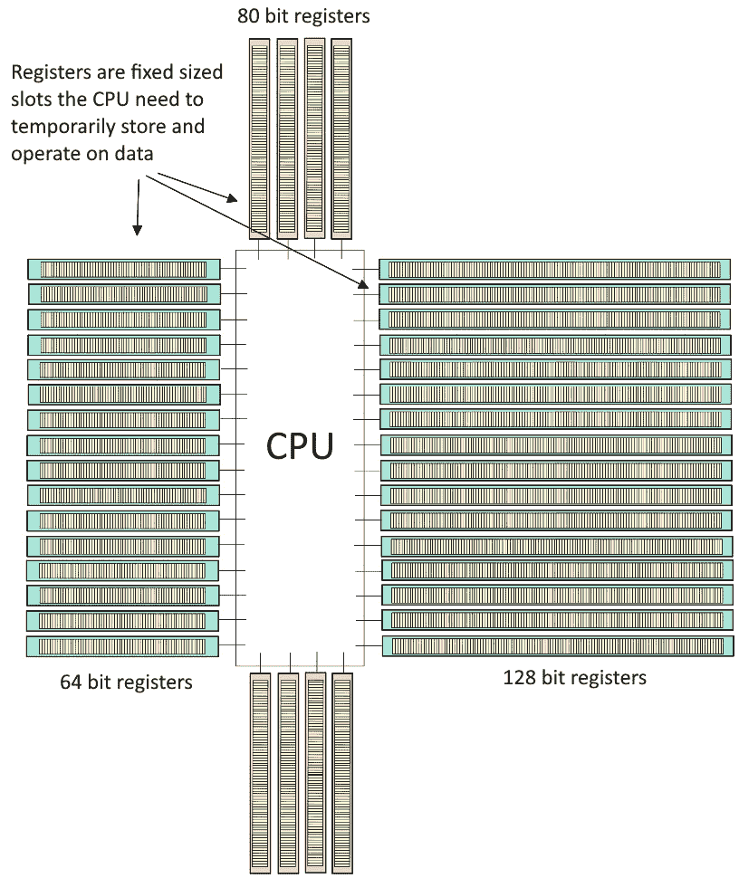
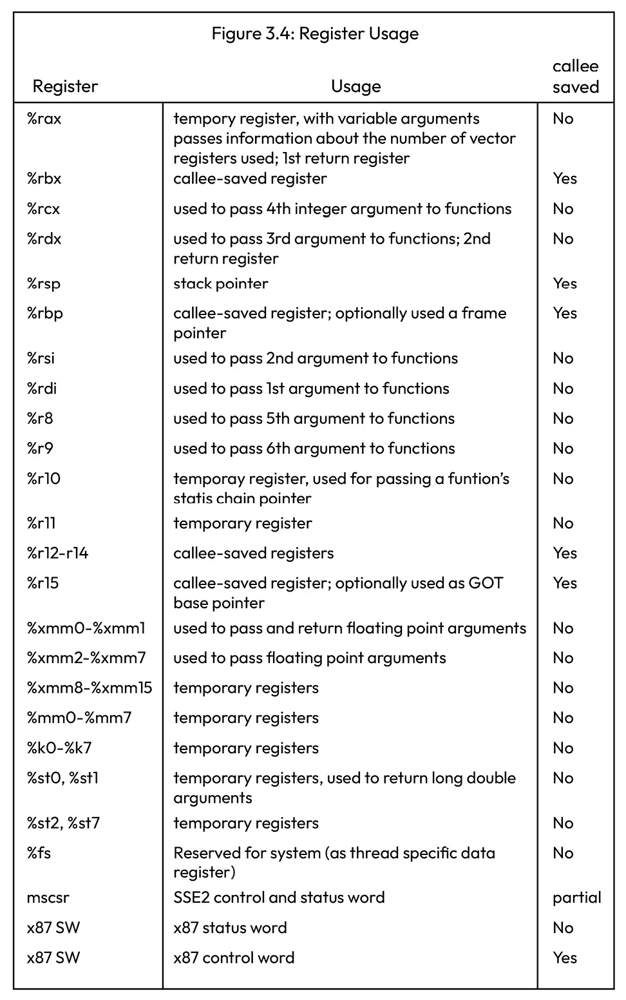
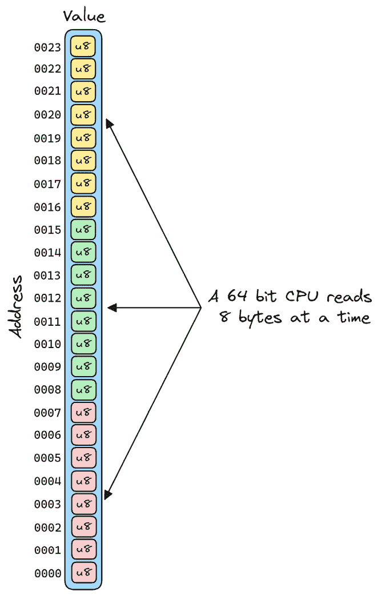

# 第五章：创建我们自己的纤程

在本章中，我们将深入探讨一种非常流行的处理并发的方式。没有比亲自实践更好的方式来获得对这一主题的根本理解了。幸运的是，尽管这个主题有点复杂，我们只需要大约 200 行代码就能最终得到一个完全工作的示例。

使这个主题复杂的是，它需要相当多的对 CPU、操作系统和汇编工作方式的基本理解。这种复杂性也是这个主题如此有趣的原因。如果你详细地探索并完成这个示例，你将获得一个令人耳目一新的对那些你可能只听说过或只有初步了解的主题的理解。你还将有机会了解一些你之前没有见过的 Rust 语言的方面，这将扩大你对 Rust 以及一般编程的知识。

我们首先介绍一些在开始编写代码之前我们需要的一些基础知识。一旦我们有了这些知识，我们就会从一些小例子开始，这些例子将允许我们详细展示和讨论我们示例中最技术性和困难的部分，这样我们就可以逐步介绍这些主题。最后，我们将基于我们获得的知识来创建我们的主要示例，这是一个在 Rust 中实现的纤程的工作示例。

作为额外奖励，你将在仓库中获得两个扩展的示例版本，以激发你继续前进，改变、适应并基于我们所创建的内容来使其成为你自己的。

我在这里列出主要主题，以便你以后可以参考：

+   如何在书中使用仓库

+   背景信息

+   一个我们可以构建的示例

+   栈

+   实现我们自己的纤程

+   最后的想法

注意

在本章中，我们将使用“纤程”和“绿色线程”这两个术语来指代这种具体的堆栈纤程实现。本章中使用的“线程”术语，在我们在代码中使用的，将指代我们在示例中实现的绿色线程/纤程，而不是操作系统线程。

# 技术要求

要运行示例，你需要一台运行在 x86-64 指令集上的 CPU。今天大多数流行的桌面、服务器和笔记本电脑 CPU 都使用这个指令集，包括大多数来自 Intel 和 AMD 的现代 CPU（这些制造商在过去 10-15 年中生产的绝大多数 CPU 型号）。

一个需要注意的问题是，现代 M 系列 Mac 使用 ARM 指令集（指令集），与我们在这里编写的示例不兼容。然而，较老的基于 Intel 的 Mac 是兼容的，所以如果你没有最新版本，你应该能够使用 Mac 来跟随学习。

如果你没有使用这个指令集的计算机可用，你有几种选择来安装 Rust 并运行示例：

+   使用 M 系列芯片的 Mac 用户可以使用 Rosetta（随较新的 MacOS 版本提供）并通过四个简单的步骤使示例工作。你可以在仓库中的`ch05/How-to-MacOS-M.md`找到说明。

+   [`mac.getutm.app/`](https://mac.getutm.app/)（有些甚至有免费层）是一个运行在 x86-64 上的 Linux 远程服务器。我有使用 Linode 提供的服务的经验(/)，但还有更多选择。

为了与书中的示例同步，你还需要一个基于 Unix 的操作系统。只要运行在 x86-64 CPU 上，示例代码将原生适用于任何 Linux 和 BSD 操作系统（如 Ubuntu 或 macOS）。

如果你使用的是 Windows，仓库中有一个与 Windows 原生兼容的示例版本，但为了与书中内容同步，我明确的建议是设置**Windows Subsystem for Linux**（**WSL**）([`learn.microsoft.com/en-us/windows/wsl/install`](https://learn.microsoft.com/en-us/windows/wsl/install))，安装 Rust，并在 WSL 上使用 Rust 进行操作。

我个人使用 VS Code 作为我的编辑器，因为它使得在 WSL 和 Windows 之间切换使用 Linux 版本变得非常容易——只需按下*Ctrl* + *Shift* + *P*并搜索`在 WSL 中重新打开文件夹`。

# 如何将仓库与书籍一起使用

阅读本章的推荐方法是同时打开仓库和书籍。在仓库中，你会发现三个不同的文件夹，对应于本章中我们讨论的示例：

+   `ch05/a-stack swap`

+   `ch05/b-show-stack`

+   `ch05/c-fibers`

此外，你还将获得两个我在书中提到的例子，但这些例子应该在仓库中进一步探索：

+   `ch05/d-fibers-closure`：这是第一个示例的扩展版本，可能会激发你做更复杂的事情。示例尝试使用`std::thread::spawn`模仿 Rust 标准库中使用的 API。

+   `ch05/e-fibers-windows`：这是本书中我们讨论的示例的版本，可以在基于 Unix 的系统上和 Windows 上运行。在 README 中有一个相当详细的解释，说明了我们为使示例在 Windows 上工作所做的更改。如果你想要深入了解这个主题，我将其视为推荐阅读，但它对于理解本章中我们讨论的主要概念并不重要。

# 背景信息

我们将直接干扰和控制 CPU。由于存在许多不同类型的 CPU，这并不非常便携。虽然整体实现将是相同的，但实现中有一个小但重要的部分将非常具体于我们为它编程的 CPU 架构。另一个限制我们代码便携性的方面是操作系统有不同的 ABIs，我们需要遵守，并且相同的代码片段将根据不同的 ABIs 而改变。在我们进一步讨论之前，让我们具体解释一下我们的意思，以确保我们处于同一页面上。

## 指令集、硬件架构和 ABI

好的，在我们开始之前，我们需要了解 **应用程序二进制接口**（**ABI**）、**CPU 架构**和 **指令集架构**（**ISA**）之间的区别。我们需要这些信息来编写自己的栈，并让 CPU 跳转到它。幸运的是，虽然这听起来可能很复杂，但为了我们的示例运行，我们只需要了解一些具体的事情。这里提供的信息在许多情况下都很有用，而不仅仅是我们的示例，所以详细地介绍它是值得的。

ISA 描述了一个 CPU 的抽象模型，它定义了软件如何控制 CPU。我们通常简单地称其为 **指令集**，它定义了 CPU 可以执行哪些指令，程序员可以使用哪些寄存器，硬件如何管理内存等。ISA 的例子包括 **x86-64**、**x86** 和 **ARM ISA**（用于 Mac M 系列芯片）。

ISA 可以广泛分为两个子组，**复杂指令集计算机**（**CISC**）和 **精简指令集计算机**（**RISC**），根据它们的复杂性。CISC 架构提供了大量的不同指令，硬件必须知道如何执行这些指令，导致一些指令非常专业且很少被程序使用。RISC 架构接受较少的指令，但要求一些操作由软件处理，而在 CISC 架构中这些操作可以直接由硬件处理。我们将关注的 x86-64 指令集是一个 CISC 架构的例子。

为了增加一点复杂性（你知道，如果太简单就不好玩了），不同的名称可能指的是相同的 ISA。例如，x86-64 指令集也被称为 AMD64 指令集和 Intel 64 指令集，所以无论你遇到哪个，只需知道它们指的是同一件事。在我们的书中，我们将简单地称之为 x86-64 指令集。

小贴士

要找到您当前系统的架构，请在您的终端中运行以下命令之一：

在 Linux 和 MacOS 上：`arch` 或 `uname -m`

在 Windows PowerShell 中：`$env:PROCESSOR_ARCHITECTURE`

在 Windows 命令提示符中：`echo %PROCESSOR_ARCHITECTURE%`

指令集仅定义了程序如何与 CPU 交互。ISA 的具体实现可能因不同制造商而异，特定的实现被称为 CPU 架构，例如英特尔酷睿处理器。然而，在实践中，这些术语通常可以互换使用，因为从程序员的视角来看，它们都执行相同的功能，而且很少需要针对 ISA 的特定实现进行目标定位。

ISA 指定了 CPU 必须能够执行的最小指令集。随着时间的推移，这个指令集已经扩展，例如 **Streaming SIMD Extensions**（**SSE**），它添加了更多的指令和寄存器，程序员可以利用这些指令和寄存器。

对于本章的示例，我们将针对 x86-64 ISA（指令集架构），这是今天大多数桌面计算机和服务器上使用的一种流行架构。

因此，我们知道处理器架构提供了一个程序员可以使用的接口。操作系统实现者使用这个基础设施来创建操作系统。

操作系统如 Windows 和 Linux 定义了一个 ABI（应用程序二进制接口），它指定了一组规则，程序员必须遵守这些规则，以确保他们的程序在该平台上正确运行。操作系统 ABI 的例子包括**System V ABI**（Linux）和**Win64**（Windows）。ABI 指定了操作系统期望如何设置堆栈，如何调用函数，如何创建一个可以加载并作为程序运行的文件，程序加载后将被调用的函数名称等。

操作系统必须指定的 ABI 的一个重要部分是其**调用约定**。调用约定定义了堆栈的使用方式和函数的调用方式。

让我们用一个例子来说明 Linux 和 Windows 在 x86-64 架构上如何处理函数的参数；例如，一个具有如下签名的函数：`fn foo(a: i64, b: i64)`。

x86-64 ISA 定义了 16 个通用寄存器。这些是 CPU 提供给程序员使用的寄存器，程序员可以根据需要使用它们。请注意，这里的*程序员*包括编写操作系统的那些人，他们可以在创建在他们的操作系统上运行的程序时对可用的寄存器施加额外的限制。在我们的具体例子中，Windows 和基于 Unix 的系统对函数参数的放置位置有不同的要求：

+   Linux 指定，一个接受两个参数的函数应将第一个参数放置在`rdi`寄存器中，第二个参数放置在`rsi`寄存器中

+   Windows 要求前两个参数必须通过寄存器`rcx`和`rdx`传递

这只是许多情况下，为某个平台编写的程序在另一个平台上无法工作的一种方式。通常，这些细节是编译器开发者的关注点，当为特定平台编译时，编译器将处理不同的调用约定。

所以总结一下，CPU 实现了指令集。指令集定义了 CPU 可以执行哪些指令以及它应该为程序员提供哪些基础设施（例如寄存器）。操作系统以不同的方式使用这个基础设施，并为程序员提供额外的规则，程序员必须遵守这些规则才能在他们的平台上正确运行程序。大多数时候，唯一需要关注这些细节的程序员是编写操作系统或编译器的人。然而，当我们自己编写底层代码时，我们需要了解 ISA 和 OS ABI，以确保我们的代码在平台上正确运行。

由于我们需要编写这种代码来实现自己的纤维/绿色线程，我们必须可能为每个存在的 OS ABI/ISA 组合编写不同的代码。这意味着一个用于 Windows/x86-64，一个用于 Windows/ARM，一个用于 MacOS/x86-64，一个用于 Macos/M 等等。

如你所理解，这也是使用纤维/绿色线程处理并发复杂性的一个主要贡献者。一旦为 ISA/OS ABI 组合正确实现，它就有很多优点，但要做到正确需要大量的工作。

为了本书中的示例，我们将只关注一种这样的组合：x86-64 的 System V ABI。

注意！

在随附的仓库中，你可以找到本章主要示例的 Windows x86-64 版本。在 README 中解释了我们需要做的更改以使其在 Windows 上工作。

## x86-64 的 System V ABI

如前所述，这种 CPU 架构具有一组 16 个 64 位通用寄存器，16 个 128 位宽度的 SSE 寄存器，以及 8 个 80 位宽度的浮点寄存器：



图 5.1 – x86-64 CPU 寄存器

有一些架构建立在基础之上并对其进行扩展，例如 Intel 的**高级向量扩展**（**AVX**），它提供了额外的 16 个 256 位宽度的寄存器。让我们看看 System V ABI 规范中的一页：



图 5.2 – 寄存器使用

*图 5.1* 展示了 x86-64 架构中通用寄存器的一般概述。对我们目前来说，特别感兴趣的是标记为 *被调用者保存* 的寄存器。这些是我们需要在函数调用之间跟踪上下文的寄存器。它包括下一个要执行的指令、基指针、栈指针等等。虽然寄存器本身由 ISA 定义，但被认为是被调用者保存的规则由 System V ABI 定义。我们将在稍后了解更多细节。

注意

Windows 有一个稍微不同的约定。在 Windows 上，寄存器 XMM6:XMM15 也被认为是被调用者保存的，并且如果我们的函数使用它们，必须保存和恢复。我们编写的这个第一个示例在 Windows 上运行良好，因为我们还没有真正遵循任何 ABI，只是关注我们将如何指导 CPU 执行我们想要的操作。

如果我们想要直接向 CPU 发出一组非常具体的命令，我们需要在汇编语言中编写小的代码片段。幸运的是，对于我们第一个任务，我们只需要了解一些非常基础的汇编指令。具体来说，我们需要知道如何将值移动到寄存器和从寄存器中取出：

```rs
mov rax, rsp
```

## 汇编语言的快速介绍

首先，**汇编语言** 并不特别便携，因为它是我们可以写入 CPU 的最低级别的人类可读指令，我们编写的汇编指令会因架构而异。由于我们将只编写针对 x86-64 架构的汇编，因此我们只需要学习这个特定架构的几个指令。

在我们深入具体细节之前，您需要知道在汇编中有两种流行的语法：**AT&T 语法** 和 **Intel 语法**。

Intel 语法是编写 Rust 中内联汇编的标准，但在 Rust 中，我们可以指定我们想要使用 AT&T 语法，如果我们想的话。Rust 对内联汇编有自己的看法，对于习惯于 C 中内联汇编的人来说，一开始看起来可能很陌生。但它经过深思熟虑，随着我们通过代码进行详细解释，我将花一些时间来解释它，以便有经验的 C 类内联汇编读者和没有经验的读者都能够跟上。

注意

在我们的示例中，我们将使用 Intel 语法。

汇编有强大的向后兼容性保证。这就是为什么您会看到以不同方式引用相同的寄存器。让我们以我们用作示例的 rax 寄存器为例进行解释：

```rs
rax    # 64 bit register (8 bytes)
eax    # 32 low bits of the "rax" register
ax     # 16 low bits of the "rax" register
ah     # 8 high bits of the "ax" part of the "rax" register
al     # 8 low bits of the "ax" part of the "rax" register
```

如您所见，这基本上就像在我们面前观看 CPU 的发展历史。由于今天的大多数 CPU 都是 64 位，因此我们将使用代码中的 64 位版本。

在汇编中，字大小也有历史原因。它源于 CPU 有 16 位数据总线的时候，所以一个字是 16 位。这很重要，因为您会看到许多带有 `q`（四倍字）或 `l`（长字）后缀的指令。所以，`movq` 就意味着移动 4 * 16 位，即 64 位。

在大多数现代汇编器中，一个普通的 `mov` 会使用您目标寄存器的大小。这是您在编写内联汇编时在 AT&T 和 Intel 语法中看到的最常用的一个，我们也会在我们的代码中使用它。

另一点需要注意的是，x86-64 上的 **栈对齐** 是 16 字节。只需记住这一点以备后用。

# 我们可以构建的示例

这是一个简短的示例，我们将创建自己的栈，并让我们的 CPU 从当前的执行上下文返回到我们刚刚创建的栈。我们将在接下来的章节中在此基础上构建这些概念。

## 设置我们的项目

首先，让我们通过创建一个名为 `a-stack-swap` 的新文件夹来开始一个新的项目。进入新文件夹并运行以下命令：

```rs
cargo init
```

小贴士

您也可以导航到附带的仓库中名为 `ch05/a-stack-swap` 的文件夹，并在那里查看整个示例。

在我们的 `main.rs` 中，我们首先导入 `asm!` 宏：

ch05/a-stack-swap/src/main.rs

```rs
use core::arch::asm;
```

让我们在这里设置一个小的栈大小，仅为 48 字节，这样我们就可以在切换上下文之前打印栈并查看它，以便在第一个示例工作后：

```rs
const SSIZE: isize = 48;
```

注意

在 macOS 上使用如此小的栈似乎存在问题。此代码运行的最小栈大小为 624 字节。如果你想要跟随这个精确的示例，可以在[Rust Playground](https://play.rust-lang.org)上运行此代码（然而，由于我们最后的循环，你可能需要等待大约 30 秒才能超时）。

然后，让我们添加一个表示 CPU 状态的`struct`。我们现在只关注存储栈指针的寄存器，因为这是我们目前需要的所有：

```rs
#[derive(Debug, Default)]
#[repr(C)]
struct ThreadContext {
    rsp: u64,
}
```

在后面的示例中，我们将使用我在链接的规范文档中标记为*调用者保存*的所有寄存器。这些是在 System V x86-64 ABI 中描述的寄存器，我们需要保存我们的上下文，但目前为止，我们只需要一个寄存器来让 CPU 跳转到我们的栈。

注意，这需要是`#[repr(C)]`，因为我们在汇编中访问数据的方式。Rust 没有稳定的语言 ABI，所以我们无法确定这将以`rsp`作为前 8 个字节在内存中表示。C 有一个稳定的语言 ABI，这正是这个属性告诉编译器要使用的。当然，我们的结构体目前只有一个字段，但我们会稍后添加更多。

对于这个非常简单的示例，我们将定义一个只打印消息然后无限循环的函数：

```rs
fn hello() -> ! {
    println!("I LOVE WAKING UP ON A NEW STACK!");
    loop {}
}
```

接下来是我们的内联汇编，我们将切换到自己的栈：

```rs
unsafe fn gt_switch(new: *const ThreadContext) {
    asm!(
        "mov rsp, [{0} + 0x00]",
        "ret",
        in(reg) new,
    );
}
```

乍一看，你可能认为这段代码没有什么特别之处，但让我们停下来，暂时考虑一下这里发生了什么。

如果我们参考*图 5**.1，我们会看到`rsp`是存储 CPU 用于确定栈当前位置的**栈指针**的寄存器。

现在，如果我们想让 CPU 切换到不同的栈，我们实际上想要做的是将栈指针寄存器（`rsp`）设置为新的栈顶，并将 CPU 上的指令指针（`rip`）设置为指向`hello`的地址。

指令指针，有时在不同的架构上被称为程序计数器，它指向要运行的*下一个*指令。如果我们能直接操作它，CPU 就会获取由`rip`寄存器指向的指令并执行我们在`hello`函数中编写的第一个指令。然后，CPU 将使用栈指针指向的地址在新的栈上推送/弹出数据，而简单地保留我们的旧栈不变。

现在，这里会变得有点困难。在 x86-64 指令集中，我们无法直接操作`rip`，所以我们必须使用一个小技巧。

我们首先设置新的栈，并将我们想要运行的函数的地址写入栈顶 16 字节偏移处（ABI 规定栈对齐为 16 字节，因此我们的栈帧顶部必须从 16 字节偏移开始）。我们稍后会看到如何创建连续的内存块，但这是一个相当直接的过程。

接下来，我们将存储在我们新创建的栈中这个地址的第一个字节的地址传递给 `rsp` 寄存器（我们设置的 `new.rsp` 地址将指向我们自己的栈上的一个地址，而这个地址又指向 `hello` 函数）。明白了吗？

`ret` 关键字将程序控制权转移到当前栈帧顶部通常的返回地址。由于我们将 `hello` 的地址放置在了我们新的栈上，并将 `rsp` 寄存器设置为指向我们的新栈，CPU 会认为 `rsp` 现在指向了它正在运行的函数的返回地址，但实际上，它指向的是我们新栈上的一个位置。

当 CPU 执行 `ret` 指令时，它将从栈中弹出第一个值（恰好是我们 `hello` 函数的地址）并将该地址放入 rip 寄存器。在下个周期，CPU 将从该函数指针处获取指令并开始执行这些指令。由于 `rsp` 现在指向我们的新栈，它将从此栈开始使用。

注意

如果你现在感到有些困惑，这是完全可以理解的。这些细节很难理解并正确执行，而且需要时间来熟悉其工作方式。正如我们将在本章后面看到的那样，我们需要保存和恢复更多的数据（目前，我们没有方法来恢复我们刚刚交换的栈），但栈交换的技术细节与之前描述的是相同的。

在我们解释如何设置新栈之前，我们将利用这个机会逐行解释内联汇编宏是如何工作的。

## Rust 内联汇编宏简介

我们将通过逐步分析 `gt_switch` 函数的主体来使用它作为起点。

如果你之前没有使用过内联汇编，这可能会看起来有些陌生，但稍后我们会使用示例的扩展版本来切换上下文，因此我们需要理解正在发生的事情。

`unsafe` 是一个关键字，表示 Rust 无法在所写的函数中强制执行安全性保证。由于我们正在直接操作 CPU，这绝对是不安全的。该函数还将从一个 `ThreadContext` 实例的指针中读取一个字段：

```rs
unsafe gt_switch(new: *const ThreadContext)
```

下一条是 Rust 标准库中的 `asm!` 宏。它将检查我们的语法，如果遇到看起来不像有效的 Intel（默认）汇编语法的部分，将提供错误信息。

```rs
asm!(
```

宏首先接受的是汇编模板：

```rs
"mov rsp, [{0} + 0x00]",
```

这是一条简单的指令，它将存储在 `{0}` 内存位置偏移 `0x00` 处的值（这意味着在十六进制中没有偏移）移动到 `rsp` 寄存器。由于 `rsp` 寄存器通常存储指向最近推入栈的值的指针，我们实际上将 `hello` 的地址推到当前栈的顶部，这样 CPU 将返回到该地址而不是从上一个栈帧的断点恢复。

注意

注意，当我们不想从内存位置偏移时，不需要写 `[{0} + 0x00]`。写入 `mov rsp, [{0}]` 就完全可以。然而，我选择介绍如何在这里进行偏移，因为我们稍后需要访问 `ThreadContext` 结构体中的更多字段。

注意，`mov a, b` 的意思是“将 `a` 中的内容移动到 `b`”，但 Intel 语法通常规定目标寄存器在前，源寄存器在后。

为了使事情更复杂，这与通常的“从 `a` 到 `b`”的做法相反。这是两种语法之间的一个基本区别，了解这一点是有用的。

在正常的汇编代码中，你不会看到 `{0}` 被这样使用。这是汇编模板的一部分，是作为宏的第一个参数传递的值的占位符。你会注意到这非常接近 Rust 中使用 `println!` 或类似方式格式化的字符串模板。参数按升序编号，从 0 开始。这里我们只有一个输入参数，对应于 `{0}`。

你实际上并不需要像这样索引你的参数；正确地写入 `{}` 就足够了（就像使用 `println!` 宏那样）。然而，使用索引可以提高可读性，我强烈建议这样做。

`[]` 基本上意味着“获取这个内存位置的内容”，你可以把它想象成与解引用指针相同。

让我们用词来总结一下我们在这里所做的工作：

将 `{compiler_chosen_general_purpose_register}` 指向的内存位置偏移 `+ 0x00` 处的内容移动到 `rsp` 寄存器。

下一行是 `ret` 关键字，它指示 CPU 从栈中弹出一个内存位置，然后无条件跳转到该位置。实际上，我们已经劫持了 CPU，使其返回到我们的栈。

接下来是 `asm!` 宏的第一个非汇编参数，即我们的输入参数：

```rs
in(reg) new,
```

当我们写 `in(reg)` 时，我们让编译器决定一个通用寄存器来存储 `new` 的值。`out(reg)` 意味着该寄存器是输出，所以如果我们写 `out(reg) new`，则需要 `new` 是 `mut`，这样我们才能向它写入值。你还会发现其他版本，如 `inout` 和 `lateout`。

### 选项

为了现在对 Rust 的内联汇编有一个最小限度的理解，我们需要介绍的最后一件事情是`options`关键字。在输入和输出参数之后，您通常会看到类似`options(att_syntax)`的东西，这指定了汇编是用 AT&T 语法而不是 Intel 语法编写的。其他选项包括`pure`、`nostack`和几个其他选项。

我将引导您查阅文档来了解它们，因为它们在那里有详细的解释：

[`doc.rust-lang.org/nightly/reference/inline-assembly.html#options`](https://doc.rust-lang.org/nightly/reference/inline-assembly.html#options)

内联汇编相当复杂，所以我们将一步一步地进行，并在我们的示例中逐步介绍其工作原理的更多细节。

## 运行我们的示例

我们需要的最后一个部分是运行我们示例的主函数。我将展示整个函数，然后我们一步一步地分析它：

```rs
fn main() {
    let mut ctx = ThreadContext::default();
    let mut stack = vec![0_u8; SSIZE as usize];
    unsafe {
        let stack_bottom = stack.as_mut_ptr().offset(SSIZE);
        let sb_aligned = (stack_bottom as usize & !15) as *mut u8;
        std::ptr::write(sb_aligned.offset(-16) as *mut u64, hello as u64);
        ctx.rsp = sb_aligned.offset(-16) as u64;
        gt_switch(&mut ctx);
    }
}
```

因此，在这个函数中，我们实际上在创建我们的新栈。`hello`已经是一个指针了（一个函数指针），所以我们可以直接将其转换为`u64`，因为 64 位系统上的所有指针都将是这样，64 位。然后，我们将这个指针写入我们的新栈。

注意

我们将在下一部分更多地讨论栈，但我们需要知道的是，栈是向下增长的。如果我们的 48 字节栈从索引`0`开始，到索引`47`结束，索引`32`将是我们的栈起始/基址的 16 字节偏移量的第一个索引。

注意，我们写入的是从栈基址 16 字节偏移的指针。

这行代码`let sb_aligned = (stack_bottom as usize &! 15) as *mut u8;`的作用是什么？

当我们像创建`Vec<u8>`时请求内存，我们无法保证我们得到的内存在我们得到它时是 16 字节对齐的。这一行代码实际上将我们的内存地址向下舍入到最近的 16 字节对齐地址。如果它已经是对齐的，它就什么都不做。这样，我们知道如果我们简单地从栈的基址减去 16，我们最终会到达一个 16 字节对齐的地址。

我们将地址`hello`作为一个指向`u64`的指针，而不是指向`u8`的指针。我们想要写入位置“32, 33, 34, 35, 36, 37, 38, 39”，这是我们存储`u64`所需的 8 字节空间。如果我们不进行这种转换，我们尝试只将`u64`写入位置 32，这并不是我们想要的。

当我们在终端中通过写入`cargo run`来运行示例时，我们得到：

```rs
Finished dev [unoptimized + debuginfo] target(s) in 0.58s
Running `target\debug\a-stack-swap`
I LOVE WAKING UP ON A NEW STACK!
```

提示

由于我们在一个无限循环中结束程序，您必须通过按*Ctrl* +*C*来退出。

好吧，那么发生了什么？我们没有在任何地方调用`hello`函数，但它仍然执行了。

发生的事情是我们实际上让 CPU 跳转到我们的自己的栈上，由于它认为它从函数返回，它将读取`hello`的地址并开始执行它指向的指令。我们迈出了实现上下文切换的第一步。

在我们实现我们的纤程之前，我们将在下一节中更详细地讨论栈。由于我们已经涵盖了这么多基础知识，现在会更容易。

# 栈

栈不过是一块连续的内存。

这是很重要的。计算机只有内存，它没有特殊的栈内存和堆内存；它们都是同一内存的一部分。

差别在于如何访问和使用这块内存。栈支持在连续内存部分上的简单 push/pop 指令，这就是它使用快速的原因。堆内存由内存分配器按需分配，并且可以分散在不同的位置。

我们在这里不会讲解栈和堆之间的区别，因为已经有许多文章详细解释了它们，包括 *《Rust 编程语言》* 中的一个章节，在 [`doc.rust-lang.org/stable/book/ch04-01-what-is-ownership.html#the-stack-and-the-heap`](https://doc.rust-lang.org/stable/book/ch04-01-what-is-ownership.html#the-stack-and-the-heap)。

## 栈看起来是什么样子？

让我们从对栈的简化视图开始。64 位 CPU 会一次读取 8 个字节。尽管我们看栈的自然方式是像 *图 5.2* 所示的长串 `u8`，但 CPU 会更像是长串的 `u64`，因为它在执行加载或存储时无法读取少于 8 个字节。



图 5.3 – 栈

当我们传递指针时，我们需要确保传递的是指向示例中地址 `0016`、`0008` 或 `0000` 的指针。

栈向下增长，所以我们从顶部开始，向下工作。

当我们设置 `0008`（记住栈是从顶部开始的）。

如果我们在上一章的例子中在 `main` 函数的切换之前添加以下几行代码，我们就可以有效地打印出我们的栈并查看它：

ch05/b-show-stack

```rs
for i in 0..SSIZE {
    println!("mem: {}, val: {}",
    sb_aligned.offset(-i as isize) as usize,
    *sb_aligned.offset(-i as isize))
}
```

我们得到的结果如下：

```rs
mem: 2643866716720, val: 0
mem: 2643866716719, val: 0
mem: 2643866716718, val: 0
mem: 2643866716717, val: 0
mem: 2643866716716, val: 0
mem: 2643866716715, val: 0
mem: 2643866716714, val: 0
mem: 2643866716713, val: 0
mem: 2643866716712, val: 0
mem: 2643866716711, val: 0
mem: 2643866716710, val: 0
mem: 2643866716709, val: 127
mem: 2643866716708, val: 247
mem: 2643866716707, val: 172
mem: 2643866716706, val: 15
mem: 2643866716705, val: 29
mem: 2643866716704, val: 240
mem: 2643866716703, val: 0
mem: 2643866716702, val: 0
mem: 2643866716701, val: 0
mem: 2643866716700, val: 0
mem: 2643866716699, val: 0
...
mem: 2643866716675, val: 0
mem: 2643866716674, val: 0
mem: 2643866716673, val: 0
I LOVE WAKING UP ON A NEW STACK!
```

我在这里以 `u64` 的形式打印出了内存地址，这样如果你不太熟悉十六进制，解析起来会更容易。

首先要注意的是，这只是一个连续的内存块，从地址 `2643866716673` 开始，到 `2643866716720` 结束。

地址 `2643866716704` 到 `2643866716712` 对我们来说特别有趣。第一个地址是栈指针的地址，我们将其写入 CPU 的 `rsp` 寄存器。这个范围代表了我们切换之前写入栈的值。

注意

每次运行程序时，你得到的实际地址都会不同。

换句话说，值 `240, 205, 252, 56, 67, 86, 0, 0` 代表了我们的 `hello()` 函数的指针，这些值被写成 `u8`。

大小端序

这里有一个有趣的旁注：CPU 将`u64`作为一个由 8 个`u8`字节组成的集合写入的顺序取决于其端序。换句话说，如果它是小端序，CPU 可以将我们的指针地址写入`240, 205, 252, 56, 67, 86, 0, 0`，如果是大端序，则写入`0, 0, 86, 67, 56, 252, 205, 240`。想象一下，像希伯来语、阿拉伯语和波斯语这样的语言是从右到左阅读和书写的，而拉丁语、希腊语和印度语系的语言是从左到右阅读和书写的。只要您事先知道这一点，结果就会相同。

x86-64 架构使用小端格式，所以如果您尝试手动解析数据，您必须记住这一点。

随着我们编写更复杂的函数，我们那极小的 48 字节栈空间很快就会耗尽。您可以看到，当我们运行在 Rust 中编写的函数时，CPU 现在会在我们的新栈上推入和弹出值以执行我们的程序，而确保它们不会溢出栈空间的责任就留给了程序员。这引出了我们的下一个主题：栈大小。

## 栈大小

我们在*第二章*中提到了这个主题，但现在我们已经创建了我们的栈，并让 CPU 跳转到它，您可能会对这个问题有更好的理解。创建我们自己的绿色线程的一个优点是，我们可以自由地选择为每个栈预留多少空间。

当您在大多数现代操作系统中启动一个进程时，标准栈大小通常是 8MB，但可以配置为不同的值。这对大多数程序来说已经足够了，但程序员必须确保我们不会使用超过我们拥有的。这就是我们大多数人都有过经验的可怕的栈溢出的原因。

然而，当我们能够自己控制栈时，我们可以选择我们想要的尺寸。例如，在运行 Web 服务器中的简单函数时，每个任务 8MB 的空间远远超过了我们的需求，因此通过减少栈大小，我们可以在一台机器上运行数百万个纤程/绿色线程。使用操作系统提供的栈，我们很快就会耗尽内存。

总之，我们需要考虑如何处理栈大小，而大多数生产系统，如**Boost.Coroutine**或您在**Go**中找到的系统，将使用分段栈或可增长栈。我们将使这个过程变得简单，并从现在开始使用固定大小的栈。

# 实现我们自己的纤程

在我们开始之前，我想确保您明白我们编写的代码相当不安全，并且不是编写 Rust 时的“最佳实践”。我想尽量使代码尽可能安全，而不引入过多的不必要复杂性，但在这个例子中不可避免地会有很多不安全代码。我们还将优先关注*如何*实现这一点，并尽可能简单地解释它，这本身就是一个很大的挑战，因此在这个问题上，最佳实践和安全性的关注将不得不退居次要位置。

让我们从创建一个全新的项目`c-fibers`并从`main.rs`中移除代码开始，这样我们就从一个空白页开始。

注意

你也可以在`ch05/c-fibers`文件夹下的存储库中找到这个例子。这个例子，以及`ch05/d-fibers-closure`和`ch05/e-fibers-windows`，需要使用 nightly 编译器编译，因为我们使用了不稳定的功能。你可以通过以下两种方式之一来完成：

• 通过编写`rustup override set nightly`覆盖你所在目录的默认工具链（我个人更喜欢这个选项）。

• 使用`cargo +nightly run`告诉 cargo 每次编译或运行程序时使用 nightly 工具链。

我们将创建一个简单的运行时，具有一个非常简单的调度器。我们的纤程将保存/恢复它们的状态，以便在执行过程中的任何时刻停止和恢复。每个纤程将代表我们想要并发推进的任务，我们只需为每个想要运行的任务创建一个新的纤程。

我们从启用一个特定的功能开始，导入`asm`宏，并定义一些常量：

ch05/c-fibers/main.rs

```rs
#![feature(naked_functions)]
use std::arch::asm;
const DEFAULT_STACK_SIZE: usize = 1024 * 1024 * 2;
const MAX_THREADS: usize = 4;
static mut RUNTIME: usize = 0;
```

我们想要启用的功能被称为`naked_functions`功能。让我们立即解释一下什么是裸函数。

裸函数

如果你还记得我们之前讨论操作系统 ABI 和调用约定的时候，你可能还记得每个架构和操作系统都有不同的要求。这在创建新的栈帧时尤为重要，当你调用一个函数时就会发生这种情况。因此，编译器知道每个架构/操作系统需要什么，并调整布局和栈上的参数位置，保存/恢复某些寄存器，以确保我们在当前平台上满足 ABI。这发生在我们进入和退出函数时，通常被称为函数的**序言**和**尾声**。

在 Rust 中，我们可以启用此功能并将函数标记为`#[naked]`。裸函数告诉编译器我们不想让它创建函数序言和尾声，而想自己处理这些。由于我们在返回到新栈并希望在稍后某个时刻恢复旧栈时做了这个技巧，我们不希望编译器认为它在这些点管理栈布局。在我们的第一个例子中它有效，因为我们从未切换回原始栈，但向前推进时它将不起作用。

我们的`DEFAULT_STACK_SIZE`设置为 2 MB，这对于我们的使用来说已经足够多了。我们还把`MAX_THREADS`设置为`4`，因为我们不需要更多的线程来运行我们的例子。

最后一个静态常量`RUNTIME`是指向我们的运行时的指针（是的，我知道，使用可变的全局变量看起来并不漂亮，但它有助于我们专注于示例的重要部分）。

接下来，我们设置一些数据结构来表示我们将要处理的数据：

```rs
pub struct Runtime {
    threads: Vec<Thread>,
    current: usize,
}
#[derive(PartialEq, Eq, Debug)]
enum State {
    Available,
    Running,
    Ready,
}
struct Thread {
    stack: Vec<u8>,
    ctx: ThreadContext,
    state: State,
}
#[derive(Debug, Default)]
#[repr(C)]
struct ThreadContext {
    rsp: u64,
    r15: u64,
    r14: u64,
    r13: u64,
    r12: u64,
    rbx: u64,
    rbp: u64,
}
```

`Runtime` 将成为我们的主要入口点。我们将创建一个非常小的运行时，具有一个非常简单的调度器，并在线程之间切换。运行时包含一个 `Thread` 结构体的数组和一个 `current` 字段，用于指示我们当前正在运行的线程。

`Thread` 存储线程的数据。`ctx` 字段是一个上下文，表示我们的 CPU 需要在栈上恢复的位置，以及一个 `state` 字段，用于存储线程状态。

`State` 是一个 **枚举**，表示线程可能处于的状态：

+   `Available` 表示线程可用，并且如果需要可以分配任务

+   `Running` 表示线程正在运行

+   `Ready` 表示线程准备好向前移动并继续执行

`ThreadContext` 存储了 CPU 需要在栈上恢复执行的寄存器数据。

注意

我们在 `ThreadContext` 结构体中保存的寄存器是标记为 *callee saved* 的 *图 5**.1* 中的寄存器。我们需要保存这些寄存器，因为 ABI 规定在 *caller*（从操作系统的角度来看，将是我们的 `switch` 函数）恢复之前，*callee*（即我们的 `switch` 函数）需要恢复它们。

接下来是如何初始化新创建的线程的数据：

```rs
impl Thread {
    fn new() -> Self {
        Thread {
            stack: vec![0_u8; DEFAULT_STACK_SIZE],
            ctx: ThreadContext::default(),
            state: State::Available,
        }
    }
}
```

这很简单。一个新的线程以 `Available` 状态开始，表示它准备好被分配一个任务。

我想在这里指出的是，我们在这里分配我们的栈。这不是必需的，并且不是我们资源的最优使用，因为我们为可能需要的线程分配内存而不是在首次使用时分配。然而，这降低了我们代码中比分配栈内存更重要的部分的复杂性。

注意

一旦分配了栈，它就不能移动！不要在向量上执行 `push()` 或其他可能触发重新分配的方法。如果栈被重新分配，我们持有的任何指向它的指针都将无效。

值得注意的是，`Vec<T>` 有一个名为 `into_boxed_slice()` 的方法，它返回一个指向已分配切片 `Box<[T]>` 的引用。切片不能增长，所以如果我们用这个来存储，我们可以避免重新分配的问题。还有其他几种方法可以使这更安全，但在这个例子中我们不会关注那些。

## 实现运行时

我们需要做的第一件事是将一个新的运行时初始化到基本状态。接下来的代码段都属于 `impl Runtime` 块，我会确保让你知道何时结束该块，因为当我们像这里这样将其拆分时，找到结束括号可能很难。

我们首先在 `Runtime` 结构体上实现一个 `new` 函数：

```rs
impl Runtime {
  pub fn new() -> Self {
    let base_thread = Thread {
      stack: vec![0_u8; DEFAULT_STACK_SIZE],
      ctx: ThreadContext::default(),
      state: State::Running,
    };
    let mut threads = vec![base_thread];
    let mut available_threads: Vec<Thread> = (1..MAX_THREADS).map(|_| Thread::new()).collect();
    threads.append(&mut available_threads);
    Runtime {
      threads,
      current: 0,
    }
  }
```

当我们实例化我们的 `Runtime` 时，我们设置一个基本线程。这个线程将被设置为 `Running` 状态，并确保我们保持运行时运行，直到所有任务完成。

然后，我们实例化其余的线程，并将当前线程（基本线程）设置为 `0`。

我们接下来要做的事情在某种程度上是有点黑客式的，因为我们做了一些在 Rust 中通常不被推荐的事情。正如我提到过的，当我们查看常量时，我们希望从代码的任何地方访问我们的运行时结构体，这样我们就可以在任何代码点调用 yield。有安全地做到这一点的方法，但当前的话题已经很复杂，所以尽管我们在玩刀子，我会尽我所能使所有不是本例主要焦点的部分尽可能简单。

在我们对运行时调用 initialize 之后，我们必须确保我们不做任何可能使我们对 `self` 指针的引用无效的事情。

```rs
    pub fn init(&self) {
        unsafe {
            let r_ptr: *const Runtime = self;
            RUNTIME = r_ptr as usize;
        }
    }
```

这是我们开始运行运行时的地方。它将不断调用 `t_yield()`，直到它返回 `false`，这意味着没有更多的工作要做，我们可以退出进程：

```rs
    pub fn run(&mut self) -> ! {
        while self.t_yield() {}
        std::process::exit(0);
    }
```

注意

`yield` 是 Rust 中的一个保留字，所以我们不能将我们的函数命名为这个名字。如果不是这样，那将是我对它稍显晦涩的 `t_yield` 的首选名称。

这是我们在线程完成时调用的返回函数。`return` 是 Rust 中的另一个保留关键字，所以我们将其命名为 `t_return()`。请注意，我们的线程用户不会调用这个函数；我们设置我们的堆栈，以便在任务完成时调用这个函数：

```rs
    fn t_return(&mut self) {
        if self.current != 0 {
            self.threads[self.current].state = State::Available;
            self.t_yield();
        }
    }
```

如果调用线程是 `base_thread`，我们不会做任何事情。我们的运行时会在基础线程上为我们调用 `t_yield`。如果是从一个派生线程中调用的，我们知道它已经完成，因为所有线程的堆栈顶部都有一个 `guard` 函数（我们将在下面展示），而这个函数被调用的唯一地方就是我们的 `guard` 函数。

我们将其状态设置为 `Available`，让运行时知道它已准备好分配新的任务，然后立即调用 `t_yield`，这将安排一个新的线程运行。

所以，最终，我们来到了运行时的核心：`t_yield` 函数。

这个函数的前一部分是我们的调度器。我们只是遍历所有线程，看看是否有任何线程处于 `Ready` 状态，这表明它有一个准备进行进展的任务。这可能是现实世界应用程序中返回的数据库调用。

如果没有线程处于 `Ready` 状态，我们就完成了。这是一个极其简单的调度器，仅使用轮询算法。一个真正的调度器可能会有一种更复杂的方式来决定下一个要运行的任务。

如果我们找到一个可以运行的线程，我们将当前线程的状态从 `Running` 改为 `Ready`。

在我们解释这个函数的最后部分之前，让我们先展示这个函数：

```rs
    #[inline(never)]
    fn t_yield(&mut self) -> bool {
        let mut pos = self.current;
        while self.threads[pos].state != State::Ready {
            pos += 1;
            if pos == self.threads.len() {
                pos = 0;
            }
            if pos == self.current {
                return false;
            }
        }
        if self.threads[self.current].state != State::Available {
            self.threads[self.current].state = State::Ready;
        }
        self.threads[pos].state = State::Running;
        let old_pos = self.current;
        self.current = pos;
        unsafe {
            let old: *mut ThreadContext = &mut self.threads[old_pos].ctx;
            let new: *const ThreadContext = &self.threads[pos].ctx;
            asm!("call switch", in("rdi") old, in("rsi") new, clobber_abi("C"));
        }
        self.threads.len() > 0
    }
```

我们接下来要做的事情是调用 `switch` 函数，这将保存当前上下文（旧上下文）并将新上下文加载到 CPU 中。新上下文要么是一个新任务，要么是 CPU 需要恢复现有任务的所有信息。

我们将要进一步介绍的`switch`函数接受两个参数，并标记为`#[naked]`。裸函数与普通函数不同。它们不接受形式参数，例如，所以我们不能像在 Rust 中调用普通函数一样简单地调用它，如`switch(old, new)`。

你看，通常，当我们用两个参数调用一个函数时，编译器会将每个参数放置在平台调用约定描述的寄存器中。然而，当我们调用一个`#[naked]`函数时，我们需要自己处理这个问题。因此，我们通过汇编传递我们旧的和新`ThreadContext`的地址。`rdi`是 System V ABI 调用约定中第一个参数的寄存器，而`rsi`是用于第二个参数的寄存器。

`#[inline(never)]`属性阻止编译器简单地用函数内容的副本替换我们的函数调用（这就是内联的含义）。在调试构建中这几乎永远不会成为问题，但在这个案例中，如果编译器将`Runtime`作为静态`usize`处理，然后将其转换为`*mut`指针（这几乎肯定会引起未定义行为），那么它*最有可能*是由于编译器在将此函数内联并调用时，在将要概述的辅助方法中通过强制转换和间接引用`RUNTIME`时做出了错误的假设。请注意，如果我们改变我们的设计，这可能是有避免的；这不是在这个特定情况下值得长时间深思的问题。

更多内联汇编

我们需要解释我们在这里引入的新概念。汇编调用函数`switch`（该函数被标记为`#[no_mangle]`，因此我们可以通过名称调用它）。`in("rdi") old`和`in("rsi") new`参数将`old`和`new`的值分别放置到`rdi`和`rsi`寄存器中。x86-64 的 System V ABI 指出，`rdi`寄存器持有函数的第一个参数，而`rsi`持有第二个参数。

`clobber_abi("C")`参数告诉编译器它不能假设任何通用寄存器在`asm!`块执行期间被保留。编译器将发出指令将使用的寄存器推送到栈上，并在`asm!`块执行后恢复它们。

如果你再仔细看看*图 5**.1*中的列表，我们已经知道我们需要特别小心标记为*调用者保留*的寄存器。在调用普通函数时，编译器会在调用函数之前插入代码*保存/恢复所有非调用者保留或调用者保留的寄存器，以便在函数返回时能够以正确的状态恢复。由于我们将要调用的函数标记为`#[naked]`，我们明确告诉编译器不要插入此代码，因此最安全的事情是确保编译器在执行我们的`asm!`块中的调用后恢复时不会假设任何寄存器未被触及。

*在某些情况下，编译器会知道一个寄存器在函数调用中没有被修改，因为它控制了调用者和被调用者的寄存器使用，并且它不会发出任何特殊的指令来保存/恢复它们知道在函数返回时不会被修改的寄存器

最后的 `self.threads.len() > 0` 行只是我们防止编译器优化我们的代码的一种方式。这种情况在 Windows 上会发生，但在 Linux 上不会，这是运行基准测试时常见的常见问题。还有其他防止编译器优化这段代码的方法，但我选择了我能找到的最简单的方法。只要它被注释掉，做这个应该没问题。代码永远不会到达这个点。

接下来是我们的 `spawn` 函数。我先展示这个函数，然后再引导你了解它：

```rs
pub fn spawn(&mut self, f: fn()) {
    let available = self
        .threads
        .iter_mut()
        .find(|t| t.state == State::Available)
        .expect("no available thread.");
    let size = available.stack.len();
    unsafe {
        let s_ptr = available.stack.as_mut_ptr().offset(size as isize);
        let s_ptr = (s_ptr as usize & !15) as *mut u8;
        std::ptr::write(s_ptr.offset(-16) as *mut u64, guard as u64);
        std::ptr::write(s_ptr.offset(-24) as *mut u64, skip as u64);
        std::ptr::write(s_ptr.offset(-32) as *mut u64, f as u64);
        available.ctx.rsp = s_ptr.offset(-32) as u64;
    }
    available.state = State::Ready;
}
} // We close the `impl Runtime` block here
```

注意

我承诺指出我们关闭 `impl Runtime` 块的位置，我们是在 `spawn` 函数之后做的。接下来的函数是“免费”函数，不属于任何结构体。

虽然我认为 `t_yield` 是这个例子中逻辑上有趣的功能，但我认为 `spawn` 在技术上是最有趣的。

首先要注意的是，这个函数接受一个参数：`f: fn()`。这只是一个指向我们作为参数传递的函数的函数指针。这个函数是我们想要与其他任务并发运行的作业。如果这是一个库，那么这个函数就是用户实际传递给我们并希望我们的运行时并发处理的函数。

在这个例子中，我们以一个简单的函数作为参数，但如果我们稍微修改一下代码，我们也可以接受一个闭包。

小贴士

在 `ch05/d-fibers-closure` 示例中，你可以看到一个稍微修改过的例子，它接受一个闭包而不是函数，这使得它比我们这里展示的更灵活。我真心建议你在完成这个例子后去查看一下那个例子。

函数的其余部分是我们根据前一章讨论的内容设置我们的栈，并确保我们的栈看起来像 System V ABI 栈布局中指定的那样。

当我们启动一个新的纤程（或用户空间线程）时，我们首先检查是否有任何可用的用户空间线程（处于 `Available` 状态的线程）。如果我们用完了线程，在这个场景下我们会恐慌，但还有几种（更好的）处理方式。我们现在会保持简单。

当我们找到一个可用的线程时，我们获取栈长度以及指向我们的 `u8` 字节数组的指针。

在下一个部分，我们必须使用一些不安全的功能。我们稍后会解释我们在这里提到的函数，但这是我们在新的栈中设置它们，以便它们以正确的顺序被我们的运行时调用的地方。

首先，我们确保我们将要使用的内存段是 16 字节对齐的。然后，我们将地址写入我们的 `guard` 函数，该函数将在我们提供的任务完成并返回时被调用。

第二，我们将地址写入 `skip` 函数，这个函数只是用来处理从 `f` 返回时的间隙，这样 `guard` 就会在 16 字节边界上被调用。我们接下来写入栈的下一个值是 `f` 的地址。

我们为什么需要 `skip` 函数？

记得我们是如何解释栈的工作原理的吗？我们希望 `f` 函数首先运行，因此我们将基指针设置为 `f` 并确保它是 16 字节对齐的。然后我们推送 `skip` 函数的地址，最后推送 `guard` 函数。由于 `skip` 只有一个指令 `ret`，这样做确保我们的 `guard` 调用是 16 字节对齐的，这样我们就遵守了 ABI 要求。

在我们将函数指针写入栈后，我们设置 `rsp` 的值，即栈指针，指向我们提供的函数地址，这样当我们被调度运行时，我们首先执行该函数。

最后，我们将状态设置为 `Ready`，这意味着我们有工作要做，并且我们已经准备好去做。记住，启动这个线程实际上是由我们的调度器来完成的。

现在我们已经完成了 `Runtime` 的实现，如果你理解了这一切，你基本上就明白了 fibers/green threads 的工作原理。然而，还有一些细节需要完善才能使整个系统工作。

## 守护、跳过和切换函数

有几个我们提到的重要函数对于我们的运行时真正工作至关重要。幸运的是，除了一个之外，它们都非常简单易懂。我们将从 `guard` 函数开始：

```rs
fn guard() {
    unsafe {
        let rt_ptr = RUNTIME as *mut Runtime;
        (*rt_ptr).t_return();
    };
}
```

当我们传递的函数 `f` 返回时，会调用 `guard` 函数。当 `f` 返回时，意味着我们的任务已经完成，因此我们取消引用 `Runtime` 并调用 `t_return()`。我们本可以创建一个函数，在线程完成时执行一些额外的工作，但当前我们的 `t_return()` 函数已经足够满足需求。它将我们的线程标记为 `Available`（如果不是基本线程）并释放，这样我们就可以在不同的线程上继续工作。

接下来是我们的 `skip` 函数：

```rs
#[naked]
unsafe extern "C" fn skip() {
    asm!("ret", options(noreturn))
}
```

在 `skip` 函数中并没有发生太多事情。我们使用 `#[naked]` 属性，使得这个函数实际上编译成只有一个 `ret` 指令。`ret` 将从栈中弹出下一个值，并跳转到该地址指向的指令。在我们的例子中，这是 `guard` 函数。

接下来是一个名为 `yield_thread` 的小型辅助函数：

```rs
pub fn yield_thread() {
    unsafe {
        let rt_ptr = RUNTIME as *mut Runtime;
        (*rt_ptr).t_yield();
    };
}
```

这个辅助函数允许我们从代码的任意位置调用 `Runtime` 上的 `t_yield`，而不需要任何对该函数的引用。这个函数非常不安全，并且是我们为了使示例稍微简单易懂而做出的大胆简化的地方之一。如果我们调用这个函数，而我们的 `Runtime` 尚未初始化或者运行时被丢弃，这将导致未定义的行为。然而，为了使这个函数更安全，对我们来说并不是一个优先事项，只是为了让我们的示例能够运行起来。

我们已经非常接近终点；只需再完成一个函数。我们最后需要的函数是`switch`函数，你已经知道了它的最重要的部分。让我们看看它的样子，并解释一下它与我们的第一个栈交换函数有何不同：

```rs
#[naked]
#[no_mangle]
unsafe extern "C" fn switch() {
    asm!(
        "mov [rdi + 0x00], rsp",
        "mov [rdi + 0x08], r15",
        "mov [rdi + 0x10], r14",
        "mov [rdi + 0x18], r13",
        "mov [rdi + 0x20], r12",
        "mov [rdi + 0x28], rbx",
        "mov [rdi + 0x30], rbp",
        "mov rsp, [rsi + 0x00]",
        "mov r15, [rsi + 0x08]",
        "mov r14, [rsi + 0x10]",
        "mov r13, [rsi + 0x18]",
        "mov r12, [rsi + 0x20]",
        "mov rbx, [rsi + 0x28]",
        "mov rbp, [rsi + 0x30]",
        "ret", options(noreturn)
    );
}
```

因此，这是我们完整的栈交换函数。你可能还记得，从我们的第一个例子中，这只是一个更详细的过程。我们首先读取所有需要的寄存器的值，然后将所有寄存器值设置为我们在新线程上挂起执行时保存的寄存器值。

这基本上就是我们保存和恢复执行所需做的所有事情。

在这里，我们看到再次使用了`#[naked]`属性。通常，每个函数都有一个前缀和后缀，我们在这里不希望有这些，因为这里全是汇编，我们希望自行处理所有事情。如果我们不包括这个，我们将在第二次切换回我们的栈时失败。

你也可以看到我们在实践中使用我们之前引入的偏移量：

```rs
0x00[rdi] # 0
0x08[rdi] # 8
0x10[rdi] # 16
0x18[rdi] # 24
```

这些是表示从内存指针到我们想要读取/写入的偏移量的十六进制数字。我在注释中写下了十进制数字，所以正如你所见，我们只以 8 字节步长偏移指针，这与我们的`ThreadContext`结构体上的`u64`字段大小相同。

这也是为什么用`#[repr(C)]`注释`ThreadContext`很重要的原因；它告诉我们数据将以这种方式在内存中表示，因此我们写入正确的字段。Rust ABI 不保证它们在内存中以相同的顺序表示；然而，C-ABI 确实如此。

最后，我们在`asm!`块中添加了一个新的选项。在编写裸函数时，`option(noreturn)`是一个必需的要求，如果我们不添加它，将会收到编译错误。通常，编译器会假设函数调用将会返回，但裸函数与我们习惯的函数完全不同。它们更像是我们可以调用的汇编标签容器，因此我们不希望编译器在函数末尾发出`ret`指令或做出任何关于我们返回到上一个栈帧的假设。通过使用这个选项，我们告诉编译器将汇编块视为永远不会返回，并通过添加一个`ret`指令来确保我们永远不会通过汇编块。

接下来是`main`函数，它相当直接，所以我将在这里简单地展示代码：

```rs
fn main() {
    let mut runtime = Runtime::new();
    runtime.init();
    runtime.spawn(|| {
        println!("THREAD 1 STARTING");
        let id = 1;
        for i in 0..10 {
            println!("thread: {} counter: {}", id, i);
            yield_thread();
        }
        println!("THREAD 1 FINISHED");
    });
    runtime.spawn(|| {
        println!("THREAD 2 STARTING");
        let id = 2;
        for i in 0..15 {
            println!("thread: {} counter: {}", id, i);
            yield_thread();
        }
        println!("THREAD 2 FINISHED");
    });
    runtime.run();
}
```

正如你所见，我们初始化我们的运行时并创建了两个线程：一个从 1 数到 10 并在每个计数之间交出控制权，另一个从 1 数到 15。当我们`cargo run`我们的项目时，我们应该得到以下输出：

```rs
Finished dev [unoptimized + debuginfo] target(s) in 2.17s
Running `target/debug/green_threads`
THREAD 1 STARTING
thread: 1 counter: 0
THREAD 2 STARTING
thread: 2 counter: 0
thread: 1 counter: 1
thread: 2 counter: 1
thread: 1 counter: 2
thread: 2 counter: 2
thread: 1 counter: 3
thread: 2 counter: 3
thread: 1 counter: 4
thread: 2 counter: 4
thread: 1 counter: 5
thread: 2 counter: 5
thread: 1 counter: 6
thread: 2 counter: 6
thread: 1 counter: 7
thread: 2 counter: 7
thread: 1 counter: 8
thread: 2 counter: 8
thread: 1 counter: 9
thread: 2 counter: 9
THREAD 1 FINISHED.
thread: 2 counter: 10
thread: 2 counter: 11
thread: 2 counter: 12
thread: 2 counter: 13
thread: 2 counter: 14
THREAD 2 FINISHED.
```

精美！我们的线程交替，因为它们在每个计数之间交出控制权，直到`THREAD 1`完成，然后`THREAD 2`在它完成任务之前数最后几个数字。

# 结束语

我想通过指出这种方法的一些优缺点来结束本章，这些优缺点我们在*第二章*中讨论过，因为我们现在对这个主题有了第一手经验。

首先，我们在这里实现的例子是我们所说的栈满协程的例子。每个协程（或线程，如我们在示例实现中称呼它）都有自己的栈。这也意味着我们可以在任何时间点中断和恢复执行。我们是否在栈帧的中间（在执行函数的中间）无关紧要；我们只需告诉 CPU 将我们需要的状态保存到栈上，返回到不同的栈并恢复那里的状态，然后像什么都没发生一样继续执行。

你也可以看到，我们必须要以某种方式管理我们的栈。在我们的例子中，我们只是创建了一个静态栈（就像操作系统在请求线程时所做的，但更小），但为了使其比使用操作系统线程更有效率，我们需要选择一种策略来解决这个潜在的问题。

如果你查看`ch05/d-fibers-closure`中稍微扩展的例子，你会注意到我们可以使 API 非常易于使用，就像标准库中用于`std::thread::spawn`的 API 一样。当然，另一方面是实现这个 API 的正确性在所有我们想要支持的 ISA/ABIs 组合上的复杂性，虽然这特定于 Rust，但没有原生语言的支持，在这些类型的栈满协程上创建一个优秀且*安全*的 API 是具有挑战性的。

为了将其与*第三章*联系起来，在那里我们讨论了事件队列和非阻塞调用，我想指出，如果你使用纤维来处理并发，你会在你的非阻塞调用中做出读取兴趣之后调用 yield。通常，运行时会提供这些非阻塞调用，而我们 yield 的事实对用户来说是透明的，但纤维在那个点被挂起。我们可能会在我们的`State`枚举中添加一个名为`Pending`或其它表示线程正在等待某些外部事件的额外状态。

当操作系统指示数据已准备好时，我们会将线程标记为`State::Ready`以恢复，调度器会像在这个例子中一样继续执行。

虽然它需要一个更复杂的调度器和基础设施，但我希望你已经对这种系统在实际中的工作方式有了很好的了解。

# 摘要

首先，恭喜！你现在已经实现了一个超级简单但有效的纤维示例。你已经设置了自己的栈，并了解了 Rust 中的 ISAs、ABIs、调用约定和内联汇编。

我们经历了一段相当刺激的旅程，但如果你已经走到这一步并阅读了所有内容，你应该给自己一个大大的掌声。这不是给胆小的人准备的，但你做到了。

这个例子（和章节）可能需要一些时间来完全消化，但不必急于一时。你总是可以回过头来再次阅读这段代码，以完全理解它。我真心建议你自己动手操作代码，去熟悉它。改变调度算法，为创建的线程添加更多上下文，并发挥你的想象力。

你可能会发现，在像这样低级别的代码中调试问题可能相当困难，但这正是学习过程的一部分，你总是可以回退到一个可工作的版本。

现在我们已经覆盖了这本书中最大、最困难的例子之一，我们将继续学习另一种处理并发的方法，即通过研究 Rust 中 Futures 和 async/await 的工作原理。实际上，本书的其余部分完全致力于学习 Rust 中的 Futures 和 async/await，由于我们在此阶段已经获得了大量的基础知识，因此我们将更容易获得对它们如何工作的良好和深入的理解。你到目前为止已经做得很好了！

# 第三部分：Rust 中的 Futures 和 async/await

这一部分将从基础开始解释 Rust 中的 Futures 和 async/await。在迄今为止获得的知识基础上，我们将构建一个中心示例，这个示例将在后续章节中反复出现，最终将导致一个能够在 Rust 中执行 Futures 的运行时的创建。在整个探索过程中，我们将深入研究诸如协程、运行时、反应器、执行器、唤醒器等概念。

本部分包括以下章节：

+   *第六章**，Rust 中的 Futures*

+   *第七章**，协程和 async/await*

+   *第八章**，运行时，唤醒器以及反应器-执行器模式*

+   *第九章**，协程，自引用结构体和固定*

+   *第十章**，创建你自己的运行时*
