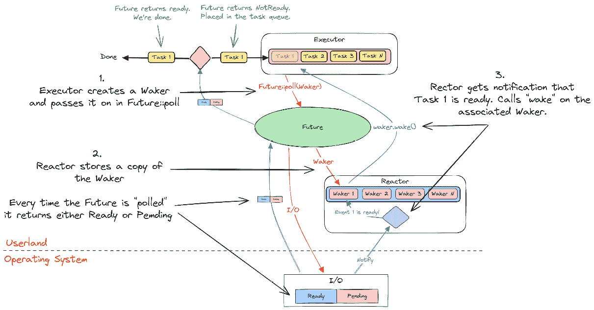

# 第六章：Rust 中的 future

在*第五章*中，我们介绍了一种在编程语言中建模并发最流行的方式：纤程/绿色线程。纤程/绿色线程是堆栈式协程的一个例子。建模异步程序流的另一种流行方式是使用我们所说的无堆栈协程，将 Rust 的 future 与`async/await`结合就是一个例子。我们将在下一章中详细讨论这一点。

这第一章将向您介绍 Rust 的 future，本章的主要目标是完成以下内容：

+   给您一个 Rust 中并发的概述

+   解释 Rust 在处理异步代码时提供的内容以及语言和标准库中不提供的内容

+   了解为什么我们需要在 Rust 中使用运行时库

+   理解叶未来和非叶未来的区别

+   了解如何处理 CPU 密集型任务

为了完成这个目标，我们将把本章分为以下部分：

+   什么是 future？

+   叶未来

+   非叶未来

+   运行时

+   异步运行时的心理模型

+   Rust 语言和标准库负责的内容

+   I/O 与 CPU 密集型任务

+   Rust 异步模型的优缺点

# 什么是 future？

future 是对未来完成的某个操作的表示。

Rust 中的异步使用基于 poll 的方法，其中异步任务将经历三个阶段：

1.  **轮询阶段**：对 future 进行轮询，这会导致任务进展到它不能再进一步进展的点。我们通常将轮询 future 的运行时部分称为 executor。

1.  **等待阶段**：事件源，通常被称为 reactor，注册了一个 future 正在等待某个事件发生，并确保当该事件准备好时唤醒 future。

1.  **唤醒阶段**：事件发生，future 被唤醒。现在取决于在*步骤 1*中轮询 future 的 executor 来安排 future 再次被轮询并进一步进展，直到它完成或达到它不能再进一步进展的新点，然后循环重复。

现在，当我们谈论未来时，我认为一开始就区分**非叶**未来和**叶**未来是有用的，因为在实践中，它们彼此之间相当不同。

# 叶未来

运行时创建叶 future，它代表一个资源，如套接字。

这是一个叶未来示例：

```rs
let mut stream = tokio::net::TcpStream::connect("127.0.0.1:3000");
```

对这些资源进行的操作，例如从套接字读取，将是非阻塞的，并返回一个 future，我们称之为叶 future，因为它是我们实际等待的 future。

您不太可能自己实现叶 future，除非您正在编写运行时，但我们将在这本书中介绍它们是如何构建的。

您也不太可能将叶 future 传递给运行时并单独运行到完成，正如您将在下一段中阅读到的。

# 非叶未来

非叶未来是我们作为运行时用户使用 `async` 关键字自己编写的，可以在执行器上运行的任务。

异步程序的大部分将包括非叶未来，这是一种可暂停的计算。这是一个重要的区别，因为这些未来代表了一组操作。通常，这样的任务会将叶未来作为许多操作之一 `await`，以完成任务。

这是一个非叶未来示例：

```rs
let non_leaf = async {
    let mut stream = TcpStream::connect("127.0.0.1:3000").await.unwrap();
    println!("connected!");
    let result = stream.write(b"hello world\n").await;
    println!("message sent!");
    ...
};
```

两个突出显示的行表示我们暂停执行、将控制权交给运行时，并最终恢复的点。与叶未来相比，这类未来本身并不代表 I/O 资源。当我们轮询它们时，它们会一直运行，直到到达返回 `Pending` 的叶未来，然后才会将控制权交给调度器（这是我们所说的运行时的一部分）。

运行时

C#、JavaScript、Java、Go 以及许多其他语言都自带用于处理并发的运行时。因此，如果你习惯了这些语言之一，这对你来说可能有点奇怪。与这些语言不同，Rust 并没有自带用于处理并发的运行时，所以你需要使用一个提供此功能的库。

分配给未来的相当一部分复杂性实际上源于运行时；创建一个高效的运行时是困难的。

学习如何正确使用它也需要相当多的努力，但你会发现这类运行时之间有几种相似之处，因此学习一个会使学习下一个变得容易得多。

Rust 与其他语言的区别在于，在选择运行时时要做出一个积极的选择。在其他语言中，你通常会使用为你提供的那个。

# 异步运行时的心理模型

我发现通过创建一个我们可以使用的高级心理模型来推理未来的工作方式更容易。为了做到这一点，我必须引入一个概念，即运行时将推动我们的未来完成。

注意

我在这里创建的心理模型并不是驱动未来完成的唯一方式，Rust 的未来也不会对如何实际完成这项任务施加任何限制。

一个完全工作的 Rust 异步系统可以分为三个部分：

+   反应器（负责通知 I/O 事件）

+   执行器（调度器）

+   未来（可以在特定点停止和恢复的任务）

那么，这三个部分是如何协同工作的呢？

让我们看看一个展示异步运行时简化概述的图表：



图 6.1 – 反应器、执行器和唤醒器

在图象的*步骤 1*中，执行者持有一个未来列表。它将通过轮询（轮询阶段）尝试运行未来，当它这样做时，它会将一个`Waker`传递给它。未来要么返回`Poll:Ready`（这意味着它已完成）或`Poll::Pending`（这意味着它尚未完成，但此刻无法进一步执行）。当执行者收到这些结果之一时，它知道它可以开始轮询另一个未来。我们将这些控制权返回给执行者的点称为*yield 点*。

在*步骤 2*中，反应器存储了执行者在轮询未来时传递给它的`Waker`的副本。反应器跟踪该 I/O 源上的事件，通常是通过我们在*第四章*中学到的相同类型的事件队列。

在*步骤 3*中，当反应器收到通知，表明跟踪的源之一发生了事件时，它会定位与该源关联的`Waker`，并在其上调用`Waker::wake`。这将反过来通知执行者，未来已准备好继续前进，因此它可以再次轮询它。

如果我们使用伪代码编写一个简短的异步程序，它将看起来像这样：

```rs
async fn foo() {
    println!("Start!");
    let txt = io::read_to_string().await.unwrap();
    println!("{txt}");
}
```

我们写入`await`的行是返回控制权给调度器的行。这通常被称为*yield 点*，因为它将返回`Poll::Pending`或`Poll::Ready`（最可能的情况是，第一次轮询未来时将返回`Poll::Pending`）。

由于`Waker`在所有执行者中都是相同的，因此反应器在理论上可以完全忽略执行者的类型，反之亦然。*执行者和反应器无需直接相互通信*。

这种设计赋予了未来框架其力量和灵活性，并允许 Rust 标准库为我们提供一个易于使用、零成本的抽象。

注意

我在这里介绍了反应器和执行者的概念，就像它是每个人都了解的东西一样。我知道情况并非如此，不用担心，我们将在下一章中详细讲解。

# Rust 语言和标准库负责处理的事项

Rust 只为在语言中建模异步操作提供必要的功能。基本上，它提供了以下功能：

+   一个表示操作的通用接口，该操作将通过`Future`特质在未来完成

+   通过`async`和`await`关键字创建可以挂起和恢复的任务（确切地说，是无栈协程）的便捷方式

+   通过`Waker`类型定义的唤醒挂起任务的方式

这正是 Rust 标准库所做的事情。正如你所看到的，没有非阻塞 I/O 的定义，也没有说明这些任务是如何创建或运行的。没有标准库的非阻塞版本，因此要实际运行异步程序，你必须创建或选择一个运行时来使用。

# I/O 任务与 CPU 密集型任务

如您现在所知，您通常编写的被称为非叶子 future。让我们以伪 Rust 为例，看看这个`async`块：

```rs
let non_leaf = async {
    let mut stream = TcpStream::connect("127.0.0.1:3000").await.unwrap();
    // request a large dataset
    let result = stream.write(get_dataset_request).await.unwrap();
    // wait for the dataset
    let mut response = vec![];
    stream.read(&mut response).await.unwrap();
    // do some CPU-intensive analysis on the dataset
    let report = analyzer::analyze_data(response).unwrap();
    // send the results back
    stream.write(report).await.unwrap();
};
```

我已经突出显示了我们将控制权交给运行时执行器的地方。重要的是要意识到，我们在 yield 点之间编写的代码与我们的执行器在**同一线程**上运行。

这意味着当我们的`analyzer`正在处理数据集时，执行器正忙于进行计算，而不是处理新的请求。

幸运的是，有几种处理这种问题的方法，而且并不困难，但这是您必须注意的事情：

1.  我们可以创建一个新的叶子 future，将我们的任务发送到另一个线程，并在任务完成时解决。我们可以像其他 future 一样`await`这个叶子 future。

1.  运行时可能有一种监督器，可以监控不同任务花费的时间，并将执行器本身移动到不同的线程，这样即使我们的`analyzer`任务阻塞了原始执行器线程，它也可以继续运行。

1.  您可以创建一个与运行时兼容的反应器，以任何您认为合适的方式进行分析，并返回一个可以被`await`的 future。

现在，第一种方法是处理这种情况的常规方法，但一些执行器也实现了第二种方法。问题在于，如果您切换运行时，您需要确保它也支持这种类型的监督，否则您最终会阻塞执行器。

第三个方法在理论上有更多的重要性；通常，您会乐意将任务发送到大多数运行时提供的线程池。

大多数执行器都有一种方法，可以使用如`spawn_blocking`之类的函数来实现#1。

这些方法将任务发送到由运行时创建的线程池中，您可以在其中执行 CPU 密集型任务或运行时不支持的阻塞任务。

# 摘要

因此，在本章中，我们向您介绍了 Rust 的 futures。现在，您应该对 Rust 的异步设计有一个基本的了解，语言为您提供了什么，以及您需要在哪里获取什么。您也应该对叶子 future 和非叶子 future 有一个概念。

这些方面很重要，因为它们是内置到语言中的设计决策。您现在知道 Rust 使用无栈协程来模拟异步操作，但既然协程本身不做什么，了解如何调度和运行这些协程的选择留给了您。

随着我们开始详细解释这一切是如何工作的，我们将对它有一个更深入的理解。

现在我们已经看到了 Rust 的 futures 的高级概述，我们将从底层开始解释它们是如何工作的。下一章将涵盖 futures 的概念以及它们与 Rust 中的协程和 `async/await` 关键字的关系。我们将亲自看到它们如何表示可以暂停和恢复执行的任务，这是多个任务能够同时 *进行中* 的先决条件，以及它们与我们实现为 fibers/green threads 的可暂停/可恢复任务有何不同。第五章。
