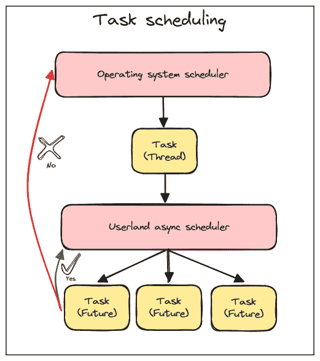
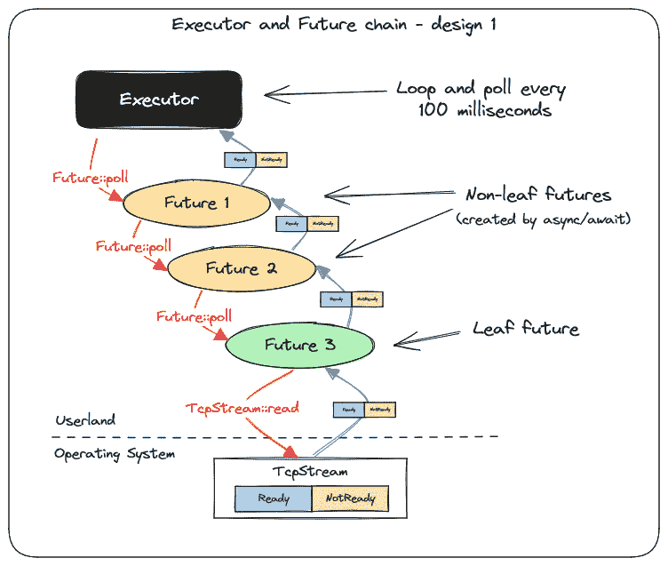
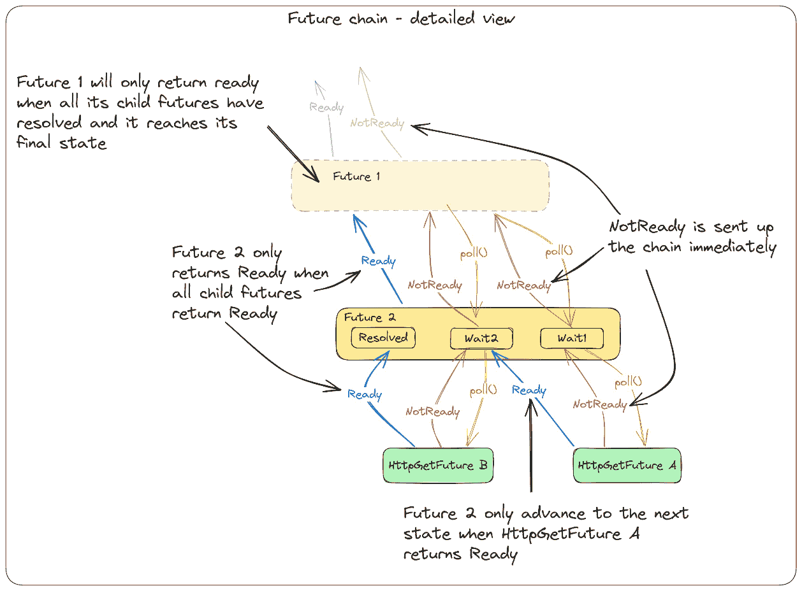
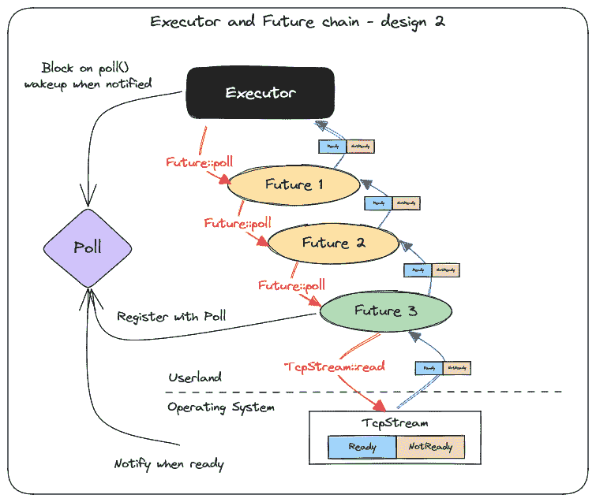
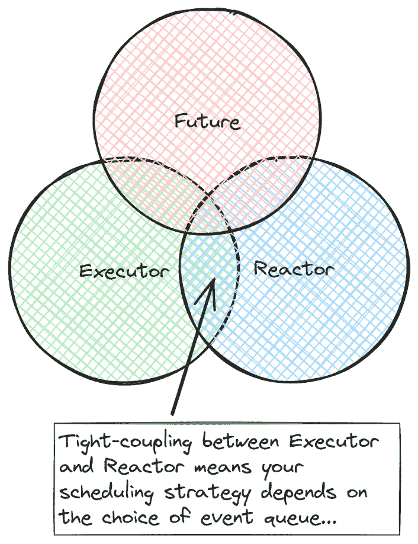
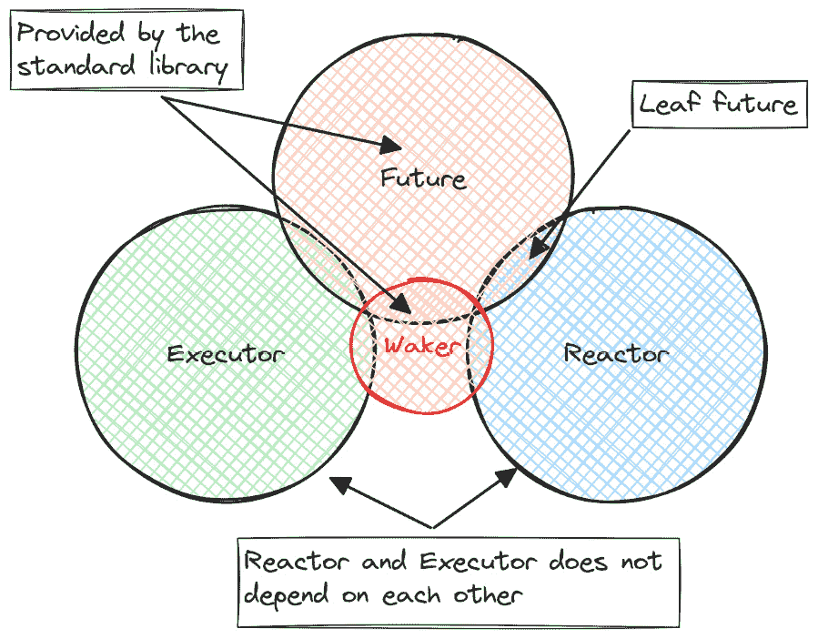
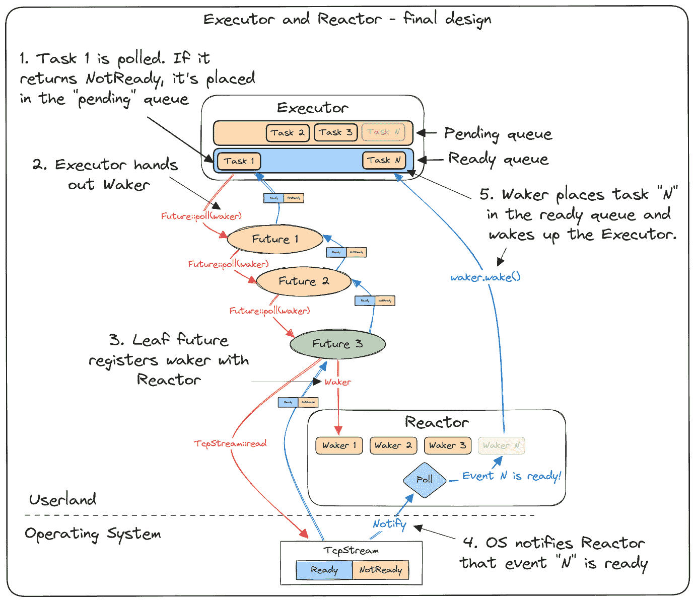

# 8

# 运行时、Wakers 和 Reactor-Executor 模式

在上一章中，我们通过将它们编写为状态机来创建了我们的可暂停任务（协程）。我们通过要求它们实现`Future`特质为这些任务创建了一个通用的 API。我们还展示了如何使用一些关键字创建这些协程，并通过编程重写它们，这样我们就不必手动实现这些状态机，而是可以像平时一样编写我们的程序。

如果我们停下来，从宏观的角度审视到目前为止我们所取得的成果，从概念上讲是非常简单的：我们有一个可暂停任务的接口（`Future`特质），并且我们有两个关键字（`coroutine/wait`）来指示我们希望重写的代码段，作为将我们的代码分割成可以暂停的段的状态机。

然而，我们还没有事件循环，也没有调度器。在本章中，我们将扩展我们的示例，并添加一个运行时，使我们能够高效地运行我们的程序，并使我们能够比现在更高效地并发地调度任务。

本章将带你在两个阶段实现我们的运行时，逐步使其更有用、更高效和更强大。我们将从简要概述运行时是什么以及为什么我们想要了解它们的一些特性开始。我们将基于我们在*第七章*中学到的知识，并展示我们如何利用在*第四章*中获得的知识，使其变得更加高效，并避免不断轮询未来以使其进展。

接下来，我们将展示如何通过将运行时分为两部分：一个**executor**和一个**reactor**，来获得更灵活和松散耦合的设计。

在本章中，你将了解基本的运行时设计、Reactor、Executor、Waker 和创建，我们将基于本书中我们学到的很多知识。

这将是本书中的一大章节，不是因为主题过于复杂或困难，而是因为我们有很多代码要编写。除此之外，我还试图通过提供很多图表并详细解释一切，给你一个良好的心理模型来了解正在发生的事情。尽管这不是你通常在睡前快速浏览的章节，但我确实承诺最终它绝对值得。

本章将分为以下部分：

+   运行时简介及其必要性

+   改进我们的基础示例

+   创建一个合适的运行时

+   第一步 - 通过添加一个 Reactor 和一个 Waker 来改进我们的运行时设计

+   第二步 - 实现一个合适的 Executor

+   第三步 - 实现一个合适的 Reactor

+   尝试我们的新运行时

因此，让我们直接进入正题！

# 技术要求

本章中的示例将基于我们上一章的代码，因此要求相同。所有示例都将跨平台，并在 Rust([`doc.rust-lang.org/beta/rustc/platform-support.html#tier-1-with-host-tools`](https://doc.rust-lang.org/beta/rustc/platform-support.html#tier-1-with-host-tools))和`mio`([`github.com/tokio-rs/mio#platforms`](https://github.com/tokio-rs/mio#platforms))支持的平台上运行。你需要做的只是安装 Rust 并将属于本书的存储库下载到本地。本章中的所有代码都将位于`ch08`文件夹中。

要逐步跟随示例，你还需要在你的机器上安装`corofy`。如果你在*第七章*中没有安装它，现在就通过进入存储库中的`ch08/corofy`文件夹并运行以下命令来安装它：

```rs
cargo install --force --path .
```

或者，当我们在使用`corofy`重写`coroutine/wait`语法时，你也可以直接复制存储库中的相关文件。这两种版本都会在那里供你使用。

在这个例子中，我们还将使用`delayserver`，因此你需要打开一个单独的终端，进入存储库根目录下的`delayserver`文件夹，并运行`cargo run`，以便它为后续的示例准备就绪并可用。

如果由于某种原因你需要更改`delayserver`监听的端口号，请记住在代码中更改端口号。

# 运行时介绍及其必要性

如你所知，你需要自己提供运行时来驱动和调度 Rust 中的异步任务。

运行时有多种风味，从流行的**Embassy**嵌入式运行时([`github.com/embassy-rs/embassy`](https://github.com/embassy-rs/embassy))，它更多地关注通用多任务处理，可以在许多平台上替代**实时操作系统**（**RTOS**）的需求，到**Tokio**([`github.com/tokio-rs/tokio`](https://github.com/tokio-rs/tokio))，它专注于在流行的服务器和桌面操作系统上的非阻塞 I/O。

Rust 中的所有运行时都需要至少完成两件事：调度和驱动实现 Rust 的`Future`特质的对象以完成。在本章的后续内容中，我们将主要关注在流行的桌面和服务器操作系统（如 Windows、Linux 和 macOS）上执行非阻塞 I/O 的运行时。这也是程序员在 Rust 中最常见的运行时类型。

掌控任务调度的方式非常**侵入性**，几乎是一条单行道。如果你依赖用户空间的调度器来运行你的任务，那么你同时就不能使用操作系统调度器（除非跳过几个步骤），因为将它们混合在你的代码中将会造成混乱，并可能最终抵消编写异步程序的全部目的。

下面的图示说明了不同的调度器：



图 8.1 – 单线程异步系统中的任务调度

向操作系统调度器让步的一个例子是使用默认的 `std::net::TcpStream` 或 `std::thread::sleep` 方法进行阻塞调用。甚至使用标准库提供的原语（如 `Mutex`）进行的 *可能* 阻塞调用也可能让步给操作系统调度器。

这也是为什么你经常会发现异步编程往往会影响它所触及的一切，并且仅使用 `async/await` 运行程序的一部分是非常困难的。

结果是，运行时必须使用标准库的非阻塞版本。从理论上讲，你可以制作一个所有运行时都使用的非阻塞版本的标准库，这也是 `async_std` 初始化（[`book.async.rs/introduction`](https://book.async.rs/introduction)）的一个目标。然而，让社区就解决这个任务达成一致意见是一项艰巨的任务，而且至今尚未实现。

在我们开始实现示例之前，我们将讨论 Rust 中典型异步运行时的整体设计。大多数运行时，如 Tokio、Smol 或 async-std，都会将它们的运行时分为两部分。

跟踪我们等待的事件并确保以高效方式等待来自操作系统的通知的部分通常被称为 *reactor* 或 *driver*。

调度任务并轮询它们直到完成的部分被称为 *executor*。

让我们从这个设计的宏观角度看看，这样我们就会知道我们将在示例中实现什么。

## Reactors 和 executors

当我们查看 Rust 如何建模异步任务时，将运行时分为两个不同的部分是非常有意义的。如果你阅读了 `Future` ([`doc.rust-lang.org/std/future/trait.Future.html`](https://doc.rust-lang.org/std/future/trait.Future.html)) 和 `Waker` ([`doc.rust-lang.org/std/task/struct.Waker.html`](https://doc.rust-lang.org/std/task/struct.Waker.html)) 的文档，你会发现 Rust 不仅定义了一个 `Future` 特征和一个 `Waker` 类型，而且还提供了关于它们应该如何使用的重要信息。

这的一个例子是 `Future` 特征是 *惰性的*，正如我们在 *第六章* 中所讨论的。另一个例子是，对 `Waker::wake` 的调用将保证 *至少一次* 对相应任务上的 `Future::poll` 的调用。

因此，仅通过阅读文档，你就会看到至少有一些关于运行时应该如何表现的想法。

学习这种模式的原因是它几乎与 Rust 的异步模型完美契合。

由于许多读者，包括我，英语不是第一语言，所以我会在一开始就解释这些名称，因为，嗯，它们似乎很容易被误解。

如果在 `TcpStream` 上有名为 `READABLE` 的事件。

你可以在同一个运行时中运行几种不同类型的 reactor。

如果“executor”这个名字让你联想到*执行者*（中世纪的那种）或*可执行文件*，那么也请摒弃这种想法。如果你查阅 executor 的定义，它是一个人，通常是律师，负责管理一个人的遗嘱。通常情况下，由于那个人已经去世。这也正是任何命名所暗示的心理模型崩溃的点，因为异步运行时中，没有任何东西，也没有任何人需要受到伤害，executor 才能有工作可做，但我跑题了。

重要的是，executor 只是决定谁能在 CPU 上获得时间以推进，以及何时获得。executor 还必须调用`Future::poll`并推进状态机到下一个状态。它是一种调度器。

由于主题本身已经足够复杂，无需考虑核反应堆和执行者如何在整体画面中发挥作用，因此一开始就产生错误的想法可能会令人沮丧。

由于反应器将对事件做出响应，它们需要与事件的*来源*进行一些集成。如果我们继续以`TcpStream`为例，某个东西将对其调用*read*或*write*，此时，反应器需要知道它应该跟踪该来源上的某些事件。

因此，非阻塞 I/O 原语和反应器需要紧密集成，具体取决于你如何看待，I/O 原语将不得不自带反应器，或者你将有一个提供 I/O 原语（如套接字、端口和流）的反应器。

现在我们已经讨论了一些总体设计，我们可以开始编写一些代码了。

运行时通常会很快变得复杂，因此为了尽可能保持简单，我们将在代码中避免任何错误处理，并使用`unwrap`或`expect`来处理所有事情。我们还将尽我们所能选择简单而不是巧妙，可读性而不是效率。

我们的第一项任务将是改进我们在*第七章*中编写的第一个示例，避免需要主动轮询它以取得进展。相反，我们将依靠我们在前面章节中学到的非阻塞 I/O 和`epoll`的知识。

# 改进我们的基础示例

我们将创建*第七章*中第一个示例的版本，因为它是最简单的一个开始。我们唯一的重点是展示如何更有效地调度和驱动运行时。

我们将从以下步骤开始：

1.  创建一个新的项目，并将其命名为`a-runtime`（或者，导航到书籍仓库中的`ch08/a-runtime`）。

1.  将`src`文件夹中的`future.rs`和`http.rs`文件从我们在*第七章*中创建的第一个项目`a-coroutine`（或者，从书籍仓库中的`ch07/a-coroutine`复制文件）复制到我们新项目的`src`文件夹中。

1.  确保通过在`Cargo.toml`中添加以下内容将`mio`添加为依赖项：

    ```rs
    [dependencies]
    mio = { version = "0.8", features = ["net", "os-poll"] }
    ```

1.  在`src`文件夹中创建一个名为`runtime.rs`的新文件。

我们将使用`corofy`将以下`coroutine/wait`程序转换为我们可以运行的其状态机表示形式。

在`src/main.rs`中添加以下代码：

ch08/a-runtime/src/main.rs

```rs
mod future;
mod http;
mod runtime;
use future::{Future, PollState};
use runtime::Runtime;
fn main() {
    let future = async_main();
    let mut runtime = Runtime::new();
    runtime.block_on(future);
}
coroutine fn async_main() {
    println!("Program starting");
    let txt = http::Http::get("/600/HelloAsyncAwait").wait;
    println!("{txt}");
    let txt = http::Http::get("/400/HelloAsyncAwait").wait;
    println!("{txt}");
}
```

这个程序基本上与我们创建在*第七章*中相同，只是这次我们是从`coroutine/wait`语法创建它，而不是手动编写状态机。接下来，我们需要使用`corofy`将其转换为代码，因为编译器不识别我们自己的`coroutine/wait`语法。

1.  如果你处于`a-runtime`的根目录，运行`corofy ./src/main.rs`。

1.  你现在应该有一个名为`main_corofied.rs`的文件。

1.  删除`main.rs`中的代码，并将`main_corofied.rs`的内容复制到`main.rs`中。

1.  你现在可以删除`main_corofied.rs`，因为我们以后不再需要它。

如果一切按计划进行，项目结构现在应该看起来像这样：

```rs
src
 |-- future.rs
 |-- http.rs
 |-- main.rs
 |-- runtime.rs
```

小贴士

你可以随时参考书籍的仓库以确保一切正确。正确的示例位于`ch08/a-runtime`文件夹中。在仓库中，你还可以在根目录找到一个名为`main_orig.rs`的文件，其中包含`coroutine/wait`程序，如果你想要重新运行它或遇到问题使一切正常工作。

## 设计

在我们继续之前，让我们通过考虑由`coroutine/wait`创建的两个未来和两次对`Http::get`的调用来可视化我们的系统当前是如何工作的。在`main`函数中轮询我们的`Future`特遇到完成的循环在我们的可视化中扮演执行器的角色，正如你所看到的，我们有一个由以下组成的一连串未来：

1.  由`async/await`（或我们示例中的`coroutine/wait`）创建的非叶子未来，它们简单地调用下一个未来的`poll`，直到它达到一个叶子未来

1.  轮询实际源（无论是`Ready`还是`NotReady`）的叶子未来

以下图表展示了我们当前设计的简化概述：



图 8.2 – 执行器和未来链：当前设计

如果我们更仔细地查看未来链，我们可以看到，当一个未来被轮询时，它会轮询所有子未来，直到它达到一个代表我们实际等待的某个事物的叶子未来。如果该未来返回`NotReady`，它将立即将此状态向上传播。然而，如果它返回`Ready`，状态机将一直前进，直到下一个未来返回`NotReady`。顶级未来将不会解决，直到所有子未来都返回`Ready`。

下一个图表更详细地查看未来链，并给出了其工作原理的简化概述：



图 8.3 – 未来链：详细视图

我们将要进行的第一个改进是避免对顶级未来的连续轮询以推动其前进。

我们将改变我们的设计，使其看起来更像这样：



图 8.4 – 执行器和 Future 链：设计 2

在这个设计中，我们使用了我们在*第四章*中获得的知识，但我们不是简单地依赖于`epoll`，而是使用`mio`的跨平台抽象。由于我们之前已经实现了一个简化的版本，现在我们应该对它的工作方式很熟悉。

我们不再连续循环并轮询我们的顶级 Future，而是向`Poll`实例注册兴趣，当我们得到一个`NotReady`的结果返回时，我们等待在`Poll`上。这将使线程休眠，直到操作系统再次唤醒我们，通知我们我们等待的事件已准备好。

此设计将更加高效和可扩展。

## 修改当前实现

现在我们已经对我们的设计有了概述，并且知道要做什么，我们可以继续进行，对程序进行必要的更改。让我们逐一查看我们需要更改的每个文件。我们将从`main.rs`开始。

### main.rs

当我们在更新的`coroutine/wait`示例上运行`corofy`时，我们已经对`main.rs`做了一些更改。我只想在这里指出这个更改，以免你错过，因为这里实际上没有更多需要更改的内容。

我们不再在`main`函数中轮询 Future，而是创建了一个新的`Runtime`结构体，并将 Future 作为参数传递给`Runtime::block_on`方法。在这个文件中我们不再需要做任何更改。我们的`main`函数变成了这样：

ch08/a-runtime/src/main.rs

```rs
 fn main() {
    let future = async_main();
    let mut runtime = Runtime::new();
    runtime.block_on(future);
}
```

我们在`main`函数中的逻辑现在已移动到`runtime`模块中，这也是我们需要更改代码以从我们之前的状态中轮询 Future 完成的地方。

因此，下一步将是打开`runtime.rs`。

### runtime.rs

在`runtime.rs`中，我们首先做的是引入我们需要的依赖项：

ch08/a-runtime/src/runtime.rs

```rs
use crate::future::{Future, PollState};
use mio::{Events, Poll, Registry};
use std::sync::OnceLock;
```

下一步是创建一个名为`REGISTRY`的静态变量。如果你还记得，`Registry`是我们向`Poll`实例注册事件兴趣的方式。当我们实际进行 HTTP `GET`请求时，我们希望在`TcpStream`上注册对事件的兴趣。我们本可以将`Registry`结构体作为参数传递给`Http::get`，以便稍后使用，但我们希望保持 API 的简洁性，因此我们希望在`HttpGetFuture`内部访问`Registry`，而不必将其作为引用传递：

ch08/a-runtime/src/runtime.rs

```rs
static REGISTRY: OnceLock<Registry> = OnceLock::new();
pub fn registry() -> &'static Registry {
    REGISTRY.get().expect("Called outside a runtime context")
}
```

我们使用`std::sync::OnceLock`，这样我们就可以在运行时启动时初始化`REGISTRY`，从而防止任何人（包括我们自己）在没有运行`Runtime`实例的情况下调用`Http::get`。如果我们没有初始化运行时就调用`Http::get`，它将引发 panic，因为访问它的唯一公共方式是通过`runtime`模块外的`pub fn registry(){…}`函数，而这个调用将失败。

注意

我们本可以使用标准库中的 `thread_local!` 宏来使用线程局部静态变量，但当我们在这个章节的后面扩展示例时，我们需要从多个线程访问它，所以我们从这一点开始设计。

我们接下来添加的是 `Runtime` 结构体：

ch08/a-runtime/src/runtime.rs

```rs
pub struct Runtime {
    poll: Poll,
}
```

目前，我们的运行时将只存储一个 `Poll` 实例。有趣的部分在于 `Runtime` 的实现。由于它不是很长，我将在这里展示整个实现，并在接下来解释它：

ch08/a-runtime/src/runtime.rs

```rs
impl Runtime {
    pub fn new() -> Self {
        let poll = Poll::new().unwrap();
        let registry = poll.registry().try_clone().unwrap();
        REGISTRY.set(registry).unwrap();
        Self { poll }
    }
    pub fn block_on<F>(&mut self, future: F)
    where
        F: Future<Output = String>,
    {
        let mut future = future;
        loop {
            match future.poll() {
                PollState::NotReady => {
                    println!("Schedule other tasks\n");
                    let mut events = Events::with_capacity(100);
                    self.poll.poll(&mut events, None).unwrap();
                }
                PollState::Ready(_) => break,
            }
        }
    }
}
```

我们首先创建一个 `new` 函数。这将初始化我们的运行时并设置我们所需的一切。我们创建一个新的 `Poll` 实例，然后从 `Poll` 实例中获取 `Registry` 的所有者版本。如果你还记得 第四章，这是我们提到但没有在示例中实现的方法之一。然而，在这里，我们利用了将这两部分分开的能力。

我们将 `Registry` 存储在 `REGISTRY` 全局变量中，这样我们就可以在稍后从 `http` 模块中访问它，而不需要运行时的引用。

下一个函数是 `block_on` 函数。我会一步一步地解释它：

1.  首先，这个函数接受一个泛型参数，并将阻塞在实现了我们的 `Future` 特质且 `Output` 类型为 `String` 的任何事物上（记住，这是我们目前唯一支持的 `Future` 特质类型，所以如果没有数据返回，我们将只返回一个空字符串）。

1.  我们不需要将 `mut future` 作为参数传递，我们可以在函数体中定义一个变量，并将其声明为 `mut`。这样做只是为了使 API 稍微干净一些，并避免我们以后需要做出小的修改。

1.  接下来，我们创建一个循环。我们将循环，直到我们接收到的顶级 `future` 返回 `Ready`。

    如果 `future` 返回 `NotReady`，我们将输出一条消息，让我们知道在这个时候我们可以做其他事情，例如处理与 `future` 无关的事情，或者更有可能的是，如果我们的运行时支持多个顶级 `future`，则轮询另一个顶级 `future`（别担心——稍后会解释）。

    注意，我们需要将 `Events` 集合传递给 `mio` 的 `Poll::poll` 方法，但由于只有一个顶级 `future` 需要运行，我们并不关心发生了哪个事件；我们只关心发生了某些事情，并且这很可能意味着数据已准备好（记住——我们总是必须考虑假唤醒）。

目前我们只需要对 `runtime` 模块做出这些更改。

在我们的 `http` 模块中将请求写入服务器后，我们需要注册对 *读取* 事件的 *兴趣*。

让我们打开 `http.rs` 并做一些修改。

### http.rs

首先，让我们调整我们的依赖关系，以便拉入我们需要的所有内容：

ch08/a-runtime/src/http.rs

```rs
use crate::{future::PollState, runtime, Future};
use mio::{Interest, Token};
use std::io::{ErrorKind, Read, Write};
```

我们需要添加对我们 `runtime` 模块的依赖，以及来自 `mio` 的几个类型。

我们只需要在这个文件中做一项更改，那就是在我们的`Future::poll`实现中，所以让我们继续定位它：

我们在这里做了一项重要的更改，我已经为你突出显示了。实现方式完全相同，只有一个重要的区别：

ch08/a-runtime/src/http.rs

```rs
impl Future for HttpGetFuture {
  type Output = String;
  fn poll(&mut self) -> PollState<Self::Output> {
    if self.stream.is_none() {
      println!("FIRST POLL - START OPERATION");
      self.write_request();
      runtime::registry()
        .register(self.stream.as_mut().unwrap(), Token(0), Interest::READABLE)
                .unwrap();
        }
        let mut buff = vec![0u8; 4096];
        loop {
            match self.stream.as_mut().unwrap().read(&mut buff) {
                Ok(0) => {
                    let s = String::from_utf8_lossy(&self.buffer);
                    break PollState::Ready(s.to_string());
                }
                Ok(n) => {
                    self.buffer.extend(&buff[0..n]);
                    continue;
                }
                Err(e) if e.kind() == ErrorKind::WouldBlock => {
                    break PollState::NotReady;
                }
                Err(e) => panic!("{e:?}"),
            }
        }
    }
}
```

在第一次轮询后，在我们写入请求后，我们注册了对这个`TcpStream`的`READABLE`事件的兴趣。我们还删除了以下行：

```rs
return PollState::NotReady;
```

通过删除这一行，我们将立即轮询`TcpStream`，这是有道理的，因为我们不希望立即将控制权返回给我们的调度器。你也不会出错，因为我们已经将`TcpStream`注册为我们的 reactor 的事件源，并且无论如何都会得到唤醒。这些更改是我们需要的最后一块拼图，以使我们的示例恢复运行。

如果你记得第七章的版本，我们得到了以下输出：

```rs
Program starting
FIRST POLL - START OPERATION
Schedule other tasks
Schedule other tasks
Schedule other tasks
Schedule other tasks
Schedule other tasks
Schedule other tasks
Schedule other tasks
HTTP/1.1 200 OK
content-length: 11
connection: close
content-type: text/plain; charset=utf-8
date: Thu, 16 Nov xxxx xx:xx:xx GMT
HelloWorld1
FIRST POLL - START OPERATION
Schedule other tasks
Schedule other tasks
Schedule other tasks
Schedule other tasks
Schedule other tasks
HTTP/1.1 200 OK
content-length: 11
connection: close
content-type: text/plain; charset=utf-8
date: Thu, 16 Nov xxxx xx:xx:xx GMT
HelloWorld2
```

在我们的新改进版本中，如果我们用`cargo run`运行它，我们会得到以下输出：

```rs
Program starting
FIRST POLL - START OPERATION
Schedule other tasks
HTTP/1.1 200 OK
content-length: 11
connection: close
content-type: text/plain; charset=utf-8
date: Thu, 16 Nov xxxx xx:xx:xx GMT
HelloAsyncAwait
FIRST POLL - START OPERATION
Schedule other tasks
HTTP/1.1 200 OK
content-length: 11
connection: close
content-type: text/plain; charset=utf-8
date: Thu, 16 Nov xxxx xx:xx:xx GMT
HelloAsyncAwait
```

注意

如果你将示例在 Windows 上运行，你会看到每次都会连续出现两个“调度其他任务”的消息。这是因为 Windows 在服务器端`TcpStream`被丢弃时会发出一个额外的事件。在 Linux 上不会发生这种情况。过滤掉这些事件相当简单，但我们在示例中不会关注这一点，因为它更多的是一种优化，而我们实际上并不需要这种优化来使示例工作。

这里需要注意的一点是我们打印了“调度其他任务”的次数。每次我们在轮询并得到`NotReady`时，都会打印这条消息。在第一个版本中，我们每 100 毫秒打印一次，但这仅仅是因为我们不得不在每个睡眠周期中延迟，以避免打印输出过多。如果没有它，我们的 CPU 将会 100%地用于轮询未来。

如果我们添加延迟，即使我们使延迟远短于 100 毫秒，我们也会增加延迟，因为我们无法立即响应事件。

我们的新设计确保我们一旦准备好就响应事件，并且我们不进行任何不必要的操作。

因此，通过这些小的改动，我们已经创建了一个比之前更好的、更可扩展的版本。

这个版本是完全单线程的，这使得事情变得简单，避免了复杂性和同步开销。当你使用 Tokio 的`current-thread`调度器时，你会得到一个基于我们在这里展示的相同理念的调度器。

然而，我们的当前实现也有一些缺点，最明显的一个是它需要在以`Poll`为中心的运行时的**reactor 部分**和**executor 部分**之间进行非常紧密的集成。

我们希望在没有任何工作要做的时候让出操作系统调度器，并在有事件发生时让操作系统唤醒我们，以便我们可以继续前进。在我们的当前设计中，这是通过在`Poll::poll`上阻塞来完成的。

因此，执行器（调度器）和反应器都必须了解`Poll`。那么，如果你创建了一个非常适合特定用例的执行器，并希望允许用户使用一个不依赖于`Poll`的不同反应器，你就不能这样做。

*更重要的是，你可能需要运行多个不同的反应器，这些反应器出于不同的原因唤醒执行器。* 你可能会发现有些东西`mio`不支持，因此你为这些任务创建了一个不同的反应器。当它阻塞在`mio::Poll::poll(...)`时，它们应该如何唤醒执行器呢？

为了给你一些例子，你可以使用一个单独的反应器来处理定时器（例如，当你想让任务睡眠一段时间时），或者你可能想实现一个线程池来处理 CPU 密集型或阻塞任务，作为当任务准备好时唤醒相应未来的反应器。

为了解决这些问题，我们需要通过一种方式唤醒执行器，这种方式不是紧密耦合到单个反应器实现，从而在运行时的反应器和执行器部分之间实现松散的耦合。

让我们看看我们如何通过创建更好的运行时设计来解决这个问题的。

# 创建合适的运行时

因此，如果我们可视化我们运行时不同部分之间的依赖程度，我们的当前设计可以这样描述：




如果我们希望在反应器和执行器之间有松散的耦合，我们需要提供一个接口来通知执行器，当发生允许未来进展的事件时，它应该唤醒。在 Rust 的标准库中，这种类型被称为`Waker`([`doc.rust-lang.org/stable/std/task/struct.Waker.html`](https://doc.rust-lang.org/stable/std/task/struct.Waker.html))并非巧合。如果我们改变我们的可视化来反映这一点，它看起来可能就像这样：




我们最终采用与 Rust 今天所拥有的相同的设计并非巧合。从 Rust 的角度来看，这是一个最小化的设计，但它允许有各种各样的运行时设计，而不对未来的设计施加过多的限制。

注意

尽管从语言的角度来看，当前的设计相当最小化，但未来有计划稳定更多与异步相关的特性和接口。

Rust 有一个工作组负责将广泛使用的特性和接口纳入标准库，你可以在以下链接中找到更多信息：[`rust-lang.github.io/wg-async/welcome.html`](https://rust-lang.github.io/wg-async/welcome.html)。你还可以在这里获得他们工作的概述并跟踪他们的进度：[`github.com/orgs/rust-lang/projects/28/views/1`](https://github.com/orgs/rust-lang/projects/28/views/1)。

也许你甚至想在阅读这本书后参与进来 ([`rust-lang.github.io/wg-async/welcome.html#-getting-involved`](https://rust-lang.github.io/wg-async/welcome.html#-getting-involved))，让异步 Rust 对每个人来说都变得更好？

如果我们将我们的系统图改为反映我们对运行时未来所需进行的更改，它将看起来像这样：



图 8.7 – 执行器和反应器：最终设计

我们有两个部分，它们之间没有直接的依赖关系。我们有一个`Executor`，它安排任务，并在轮询最终将被`Reactor`捕获并存储的`Future`时传递一个`Waker`。当`Reactor`收到一个事件准备就绪的通知时，它会找到与该任务关联的`Waker`，并在其上调用`Wake::wake`。

这使我们能够：

+   运行几个操作系统线程，每个线程都有自己的执行器，但共享同一个反应器

+   拥有多个反应器，处理不同类型的叶子期货，并确保在可以进步时唤醒正确的执行器

因此，现在我们已经有了要做什么的想法，是时候开始用代码实现了。

# 第 1 步 – 通过添加反应器和唤醒器来改进我们的运行时设计

在这一步中，我们将进行以下更改：

1.  改变项目结构，使其反映我们新的设计。

1.  找到一种让执行器睡眠和唤醒的方法，不直接依赖于`Poll`，并基于此创建一个`Waker`，允许我们唤醒执行器并识别哪个任务准备好进步。

1.  更改`Future`的特质定义，使`poll`接受一个`&Waker`作为参数。

小贴士

你可以在`ch08/b-reactor-executor`文件夹中找到这个示例。如果你按照书中的例子编写，我建议你按照以下步骤创建一个名为`b-reactor-executor`的新项目来使用这个示例：

1. 创建一个名为`b-reactor-executor`的新文件夹。

2. 进入新创建的文件夹，并运行`cargo init`。

3. 将上一个示例中的`src`文件夹中的所有内容，`a-runtime`，复制到新项目的`src`文件夹中。

4. 将`Cargo.toml`文件中的`dependencies`部分复制到新项目的`Cargo.toml`文件中。

让我们先对我们的项目结构做一些更改，以便我们可以在此基础上构建。我们首先做的事情是将我们的`runtime`模块分为两个子模块，`reactor`和`executor`：

1.  在`src`文件夹中创建一个名为`runtime`的新子文件夹。

1.  在`runtime`文件夹中创建两个新文件，分别命名为`reactor.rs`和`executor.rs`。

1.  在`runtime.rs`中的导入下面，通过添加以下行声明两个新模块：

    ```rs
    mod executor;
    mod reactor;
    ```

现在，你应该有一个看起来像这样的文件夹结构：

```rs
src
 |-- runtime
        |-- executor.rs
        |-- reactor.rs
 |-- future.rs
 |-- http.rs
 |-- main.rs
 |-- runtime.rs
```

为了设置一切，我们首先删除`runtime.rs`中的所有内容，并用以下代码行替换它：

ch08/b-reactor-executor/src/runtime.rs

```rs
pub use executor::{spawn, Executor, Waker};
pub use reactor::reactor;
mod executor;
mod reactor;
pub fn init() -> Executor {
    reactor::start();
    Executor::new()
}
```

`runtime.rs`的新内容首先声明了两个子模块，称为`executor`和`reactor`。然后我们声明了一个名为`init`的函数，它启动我们的`Reactor`并创建一个新的`Executor`，然后将其返回给调用者。

我们列表上的下一个要点是找到一种方法，让我们的`Executor`在需要时能够睡眠和唤醒，而不依赖于`Poll`。

## 创建一个 Waker

因此，我们需要找到一种不同的方式，让我们的执行器能够睡眠和被唤醒，而不直接依赖于`Poll`。

结果证明这相当简单。标准库为我们提供了所需的一切来让某事开始工作。通过调用`std::thread::current()`，我们可以获取一个`Thread`对象。这个对象是当前线程的引用，它为我们提供了一些方法，其中之一是`unpark`。

标准库还提供了一个名为`std::thread::park()`的方法，它简单地请求操作系统调度器将我们的线程挂起，直到我们稍后请求它被*unpark*。

结果表明，如果我们结合这些方法，我们就有了一种既能*park*又能*unpark*执行器的方式，这正是我们所需要的。

让我们基于这个创建一个`Waker`类型。在我们的示例中，我们将在`executor`模块内部定义`Waker`，因为这是我们创建这种特定类型`Waker`的地方，但你可以争论它应该属于`future`模块，因为它是`Future`特质的一部分。

重要提示

我们的`Waker`依赖于在标准库中对`Thread`类型调用`park/unpark`。对于我们的示例来说，这是可以接受的，因为它很容易理解，但考虑到代码的任何部分（包括你使用的任何库）都可以通过调用`std::thread::current()`来获取对同一线程的引用，并对其调用`park/unpark`，这并不是一个健壮的解决方案。如果代码的不相关部分在同一线程上调用`park/unpark`，我们可能会错过唤醒或陷入死锁。大多数生产库都会创建自己的`Parker`类型或依赖于像`crossbeam::sync::Parker`这样的东西（[`docs.rs/crossbeam/latest/crossbeam/sync/struct.Parker.html`](https://docs.rs/crossbeam/latest/crossbeam/sync/struct.Parker.html)）。

我们不会将`Waker`实现为一个特质，因为传递特质对象会显著增加我们示例的复杂性，而且这也不符合 Rust 中`Future`和`Waker`的当前设计。

打开位于`runtime`文件夹内的`executor.rs`文件，并从开始就添加我们需要的所有导入：

ch08/b-reactor-executor/src/runtime/executor.rs

```rs
use crate::future::{Future, PollState};
use std::{
    cell::{Cell, RefCell},
    collections::HashMap,
    sync::{Arc, Mutex},
    thread::{self, Thread},
};
```

接下来，我们添加我们的`Waker`：

ch08/b-reactor-executor/src/runtime/executor.rs

```rs
#[derive(Clone)]
pub struct Waker {
    thread: Thread,
    id: usize,
    ready_queue: Arc<Mutex<Vec<usize>>>,
}
```

`Waker`将为我们保留三件事：

+   `thread` – 对我们之前提到的`Thread`对象的引用。

+   `id` – 一个`usize`，用于标识这个`Waker`关联的任务。

+   `ready_queue` – 这是一个可以在线程之间共享的引用，指向一个 `Vec<usize>`，其中 `usize` 代表就绪队列中任务的 ID。我们与执行器共享这个对象，以便当任务就绪时，我们可以将 `Waker` 相关的任务 ID 推送到该队列。

我们 `Waker` 的实现将会相当简单：

ch08/b-reactor-executor/src/runtime/executor.rs

```rs
impl Waker {
    pub fn wake(&self) {
        self.ready_queue
            .lock()
            .map(|mut q| q.push(self.id))
            .unwrap();
        self.thread.unpark();
    }
}
```

当调用 `Waker::wake` 时，我们首先锁定与执行器共享的 `Mutex`，该 `Mutex` 保护着就绪队列。然后，我们将与这个 `Waker` 相关的任务的 `id` 值推送到就绪队列。

完成这些后，我们在执行器线程上调用 `unpark` 并唤醒它。现在它将在就绪队列中找到与这个 `Waker` 相关的任务，并对其调用 `poll`。

值得注意的是，许多设计都采用对 *future/task 本身* 的 *共享引用（例如，一个 Arc<…>）*，并将其推送到队列中。通过这样做，它们跳过了一个间接层，我们在这里通过将任务表示为 `usize` 而不是传递其引用来实现这一点。

然而，我个人认为这种方式更容易理解和推理，并且最终结果将是一样的。

这个 Waker 与标准库中的 Waker 有何不同？

我们在这里创建的 `Waker` 将承担与标准库中的 `Waker` 类型相同的角色。最大的区别是 `std::task::Waker` 方法被封装在一个 `Context` 结构体中，并且在我们自己创建它时需要跳过几个步骤。不用担心——我们将在本书的末尾完成所有这些，但这两个差异对于理解它所扮演的角色并不重要，因此我们现在坚持使用自己的简化版异步 Rust。

我们需要做的最后一件事是更改 `Future` 特质的定义，使其接受 `&Waker` 作为参数。

## 修改 Future 定义

由于我们的 `Future` 定义在 `future.rs` 文件中，我们首先打开该文件。

我们需要做的第一件事是引入 `Waker`，以便我们可以使用它。在文件顶部添加以下代码：

ch08/b-reactor-executor/src/future.rs

```rs
use crate::runtime::Waker;
```

接下来，我们更改我们的 `Future` 特质，使其接受 `&Waker` 作为参数：

ch08/b-reactor-executor/src/future.rs

```rs
pub trait Future {
    type Output;
    fn poll(&mut self, waker: &Waker) -> PollState<Self::Output>;
}
```

在这一点上，你有一个选择。我们不会继续使用 `join_all` 函数或 `JoinAll<F: Future>` 结构体。

如果你不想保留它们，只需删除与 `join_all` 相关的所有内容，这就是你在 `future.rs` 中需要做的所有事情。

如果你想要保留它们以进行进一步的实验，你需要更改 `JoinAll` 的 `Future` 实现以接受 `waker: &Waker` 参数，并记得在 `match fut.poll(waker)` 中传递 `Waker`。

在 *步骤 1* 中剩余要做的事情是在实现 `Future` 特质的地方做一些小的修改。

让我们从 `http.rs` 开始。我们首先要做的是稍微调整我们的依赖关系，以反映我们对 `runtime` 模块所做的更改，并添加对我们新的 `Waker` 的依赖。将文件顶部的 `dependencies` 部分替换为以下内容：

ch08/b-reactor-executor/src/http.rs

```rs
use crate::{future::PollState, runtime::{self, reactor, Waker}, Future};
use mio::Interest;
use std::io::{ErrorKind, Read, Write};
```

编译器会抱怨找不到反应器，但我们会很快解决这个问题。

接下来，我们必须导航到 `impl Future for HttpGetFuture` 块，我们需要更改 `poll` 方法，使其接受一个 `&Waker` 参数：

ch08/b-reactor-executor/src/http.rs

```rs
impl Future for HttpGetFuture {
    type Output = String;
    fn poll(&mut self, waker: &Waker) -> PollState<Self::Output> {
…
```

我们需要更改的最后一个文件是 `main.rs`。由于 `corofy` 不了解 `Waker` 类型，我们需要更改它为我们生成的 `main.rs` 中的协程中的几行。

首先，我们必须在我们的新 `Waker` 上添加一个依赖项，所以请将以下内容添加到文件的开头：

ch08/b-reactor-executor/src/main.rs

```rs
use runtime::Waker;
```

在 `impl Future for Coroutine` 块中，更改以下三行代码，我已经突出显示：

ch08/b-reactor-executor/src/main.rs

```rs
fn poll(&mut self, waker: &Waker)
match f1.poll(waker)
match f2.poll(Waker.
			The next step will be to create a proper `Executor`.
			Step 2 – Implementing a proper Executor
			In this step, we’ll create an executor that will:

				*   Hold many top-level futures and switch between them
				*   Enable us to spawn new top-level futures from anywhere in our asynchronous program
				*   Hand out `Waker` types so that they can sleep when there is nothing to do and wake up when one of the top-level futures can progress
				*   Enable us to run several executors by having each run on its dedicated OS thread

			Note
			It’s worth mentioning that our executor won’t be fully multithreaded in the sense that tasks/futures can’t be sent from one thread to another, and the different `Executor` instances will not know of each other. Therefore, executors can’t steal work from each other (no work-stealing), and we can’t rely on executors picking tasks from a global task queue.
			The reason is that the `Executor` design will be much more complex if we go down that route, not only because of the added logic but also because we have to add constraints, such as requiring everything to be `Send +` `Sync`.
			Some of the complexity in asynchronous Rust today can be attributed to the fact that many runtimes in Rust are multithreaded by default, which makes asynchronous Rust deviate more from “normal” Rust than it actually needs to.
			It’s worth mentioning that since most production runtimes in Rust are multithreaded by default, most of them also have a work-stealing executor. This will be similar to the last version of our bartender example in *Chapter 1*, where we achieved a slightly increased efficiency by letting the bartenders “steal” tasks that are *in progress* from each other.
			However, this example should still give you an idea of how we can leverage all the cores on a machine to run asynchronous tasks, giving us both concurrency and parallelism, even though it will have limited capabilities.
			Let’s start by opening up `executor.rs` located in the `runtime` subfolder.
			This file should already contain our `Waker` and the dependencies we need, so let’s start by adding the following lines of code just below our dependencies:
			ch08/b-reactor-executor/src/runtime/executor.rs

```

type Task = Box<dyn Future<Output = String>>;

thread_local! {

static CURRENT_EXEC: ExecutorCore = ExecutorCore::default();

}

```rs

			The first line is a *type alias*; it simply lets us create an alias called `Task` that refers to the type: `Box<dyn Future<Output = String>>`. This will help keep our code a little bit cleaner.
			The next line might be new to some readers. We define a thread-local static variable by using the `thread_local!` macro.
			The `thread_local!` macro lets us define a static variable that’s unique to the thread it’s first called from. This means that all threads we create will have their own instance, and it’s impossible for one thread to access another thread’s `CURRENT_EXEC` variable.
			We call the variable `CURRENT_EXEC` since it holds the `Executor` that’s currently running on this thread.
			The next lines we add to this file is the definition of `ExecutorCore`:
			ch08/b-reactor-executor/src/runtime/executor.rs

```

#[derive(Default)]

struct ExecutorCore {

tasks: RefCell<HashMap<usize, Task>>,

ready_queue: Arc<Mutex<Vec<usize>>>,

next_id: Cell<usize>,

}

```rs

			`ExecutorCore` holds all the state for our `Executor`:

				*   `tasks` – This is a `HashMap` with a `usize` as the *key* and a `Task` (remember the alias we created previously) as *data*. This will hold all the top-level futures associated with the executor on this thread and allow us to give each an `id` property to identify them. We can’t simply mutate a static variable, so we need internal mutability here. Since this will only be callable from one thread, a `RefCell` will do so since there is no need for synchronization.
				*   `ready_queue` – This is a simple `Vec<usize>` that stores the IDs of tasks that should be polled by the executor. If we refer back to *Figure 8**.7*, you’ll see how this fits into the design we outlined there. As mentioned earlier, we could store something such as an `Arc<dyn Future<…>>` here instead, but that adds quite a bit of complexity to our example. The only downside with the current design is that instead of getting a reference to the task directly, we have to look it up in our `tasks` collection, which takes time. An `Arc<…>` (shared reference) to this collection will be given to each `Waker` that this executor creates. Since the `Waker` can (and will) be sent to a different thread and signal that a specific task is ready by adding the task’s ID to `ready_queue`, we need to wrap it in an `Arc<Mutex<…>>`.
				*   `next_id` – This is a counter that gives out the next available I, which means that it should never hand out the same ID twice for this executor instance. We’ll use this to give each top-level future a unique ID. Since the executor instance will only be accessible on the same thread it was created, a simple `Cell` will suffice in giving us the internal mutability we need.

			`ExecutorCore` derives the `Default` trait since there is no special initial state we need here, and it keeps the code short and concise.
			The next function is an important one. The `spawn` function allows us to register new top-level futures with our executor from anywhere in our program:
			ch08/b-reactor-executor/src/runtime/executor.rs

```

pub fn spawn<F>(future: F)

where

F: Future<Output = String> + 'static,

{

CURRENT_EXEC.with(|e| {

let id = e.next_id.get();

e.tasks.borrow_mut().insert(id, Box::new(future));

e.ready_queue.lock().map(|mut q| q.push(id)).unwrap();

e.next_id.set(id + 1);

});

}

```rs

			The `spawn` function does a few things:

				*   It gets the next available ID.
				*   It assigns the ID to the future it receives and stores it in a `HashMap`.
				*   It adds the ID that represents this task to `ready_queue` so that it’s polled at least once (remember that `Future` traits in Rust don’t do anything unless they’re polled at least once).
				*   It increases the ID counter by one.

			The unfamiliar syntax accessing `CURRENT_EXEC` by calling `with` and passing in a closure is just a consequence of how thread local statics is implemented in Rust. You’ll also notice that we must use a few special methods because we use `RefCell` and `Cell` for internal mutability for `tasks` and `next_id`, but there is really nothing inherently complex about this except being a bit unfamiliar.
			A quick note about static lifetimes
			When a `'static` lifetime is used as a trait bound as we do here, it doesn’t actually mean that the lifetime of the `Future` trait we pass in *must be* static (meaning it will have to live until the end of the program). It means that it *must be able to* last until the end of the program, or, put another way, the lifetime can’t be constrained in any way.
			Most often, when you encounter something that requires a `'static` bound, it simply means that you’ll have to give ownership over the thing you pass in. If you pass in any references, they need to have a `'static` lifetime. It’s less difficult to satisfy this constraint than you might expect.
			The final part of *step 2* will be to define and implement the `Executor` struct itself.
			The `Executor` struct is very simple, and there is only one line of code to add:
			ch08/b-reactor-executor/src/runtime/executor.rs

```

pub struct Executor;

```rs

			Since all the state we need for our example is held in `ExecutorCore`, which is a static thread-local variable, our `Executor` struct doesn’t need any state. This also means that we don’t strictly need a struct at all, but to keep the API somewhat familiar, we do it anyway.
			Most of the executor implementation is a handful of simple helper methods that end up in a `block_on` function, which is where the interesting parts really happen.
			Since these helper methods are short and easy to understand, I’ll present them all here and just briefly go over what they do:
			Note
			We open the `impl Executor` block here but will not close it until we’ve finished implementing the `block_on` function.
			ch08/b-reactor-executor/src/runtime/executor.rs

```

impl Executor {

pub fn new() -> Self {

Self {}

}

fn pop_ready(&self) -> Option<usize> {

CURRENT_EXEC.with(|q| q.ready_queue.lock().map(|mut q| q.pop()).unwrap())

}

fn get_future(&self, id: usize) -> Option<Task> {

CURRENT_EXEC.with(|q| q.tasks.borrow_mut().remove(&id))

}

fn get_waker(&self, id: usize) -> Waker {

Waker {

id,

线程：thread::current(),

ready_queue: CURRENT_EXEC.with(|q| q.ready_queue.clone()),

}

}

fn insert_task(&self, id: usize, task: Task) {

CURRENT_EXEC.with(|q| q.tasks.borrow_mut().insert(id, task));

}

fn task_count(&self) -> usize {

CURRENT_EXEC.with(|q| q.tasks.borrow().len())

}

```rs

			So, we have six methods here:

				*   `new` – Creates a new `Executor` instance. For simplicity, we have no initialization here, and everything is done lazily by design in the `thread_local!` macro.
				*   `pop_ready` – This function takes a lock on `read_queue` and pops off an ID that’s ready from the back of `Vec`. Calling `pop` here means that we also remove the item from the collection. As a side note, since `Waker` pushes its ID to the *back* of `ready_queue` and we pop off from the *back* as well, we essentially get a `VecDeque` from the standard library would easily allow us to choose the order in which we remove items from the queue if we wish to change that behavior.
				*   `get_future` – This function takes the ID of a top-level future as an argument, removes the future from the `tasks` collection, and returns it (if the task is found). This means that if the task returns `NotReady` (signaling that we’re not done with it), we need to remember to add it back to the collection again.
				*   `get_waker` – This function creates a new `Waker` instance.
				*   `insert_task` – This function takes an `id` property and a `Task` property and inserts them into our `tasks` collection.
				*   `task_count` – This function simply returns a count of how many tasks we have in the queue.

			The final and last part of the `Executor` implementation is the `block_on` function. This is also where we close the `impl` `Executor` block:
			ch08/b-reactor-executor/src/runtime/executor.rs

```

pub fn block_on<F>(&mut self, future: F)

where

F: Future<Output = String> + 'static,

{

spawn(future);

loop {

while let Some(id) = self.pop_ready() {

let mut future = match self.get_future(id) {

Some(f) => f,

// 防止假唤醒

None => continue,

};

let waker = self.get_waker(id);

match future.poll(&waker) {

PollState::NotReady => self.insert_task(id, future),

PollState::Ready(_) => continue,

}

}

let task_count = self.task_count();

let name = thread::current().name().unwrap_or_default().to_string();

if task_count > 0 {

println!("{name}: {task_count} pending tasks. Sleep until notified.");

thread::park();

} else {

println!("{name}: All tasks are finished");

break;

}

}

}

}

```rs

			`block_on` will be the entry point to our `Executor`. Often, you will pass in one top-level future first, and when the top-level future progresses, it will spawn new top-level futures onto our executor. Each new future can, of course, spawn new futures onto the `Executor` too, and that’s how an asynchronous program basically works.
			In many ways, you can view this first top-level future in the same way you view the `main` function in a normal Rust program. `spawn` is similar to `thread::spawn`, with the exception that the tasks stay on the same OS thread in this example. This means the tasks won’t be able to run in parallel, which in turn allows us to avoid any need for synchronization between tasks to avoid data races.
			Let’s go through the function step by step:

				1.  The first thing we do is spawn the future we received onto ourselves. There are many ways this could be implemented, but this is the easiest way to do it.
				2.  Then, we have a loop that will run as long as our asynchronous program is running.
				3.  Every time we loop, we create an inner `while let Some(…)` loop that runs as long as there are tasks in `ready_queue`.
				4.  If there is a task in `ready_queue`, we take ownership of the `Future` object by removing it from the collection. We guard against false wakeups by just continuing if there is no future there anymore (meaning that we’re done with it but still get a wakeup). This will, for example, happen on Windows since we get a `READABLE` event when the connection closes, but even though we could filter those events out, `mio` doesn’t guarantee that false wakeups won’t happen, so we have to handle that possibility anyway.
				5.  Next, we create a new `Waker` instance that we can pass into `Future::poll()`. Remember that this `Waker` instance now holds the `id` property that identifies this specific `Future` trait and a handle to the thread we’re currently running on.
				6.  The next step is to call `Future::poll`.
				7.  If we get `NotReady` in return, we insert the task back into our `tasks` collection. I want to emphasize that when a `Future` trait returns `NotReady`, we know it will arrange it so that `Waker::wake` is called at a later point in time. It’s not the executor’s responsibility to track the readiness of this future.
				8.  If the `Future` trait returns `Ready`, we simply continue to the next item in the ready queue. Since we took ownership over the `Future` trait, this will drop the object before we enter the next iteration of the `while` `let` loop.
				9.  Now that we’ve polled all the tasks in our ready queue, the first thing we do is get a task count to see how many tasks we have left.
				10.  We also get the name of the current thread for future logging purposes (it has nothing to do with how our executor works).
				11.  If the task count is larger than `0`, we print a message to the terminal and call `thread::park()`. Parking the thread will yield control to the OS scheduler, and our `Executor` does nothing until it’s woken up again.
				12.  If the task count is `0`, we’re done with our asynchronous program and exit the main loop.

			That’s pretty much all there is to it. By this point, we’ve covered all our goals for *step 2*, so we can continue to the last and final step and implement a `Reactor` for our runtime that will wake up our executor when something happens.
			Step 3 – Implementing a proper Reactor
			The final part of our example is the `Reactor`. Our `Reactor` will:

				*   Efficiently wait and handle events that our runtime is interested in
				*   Store a collection of `Waker` types and make sure to wake the correct `Waker` when it gets a notification on a source it’s tracking
				*   Provide the necessary mechanisms for leaf futures such as `HttpGetFuture`, to register and deregister interests in events
				*   Provide a way for leaf futures to store the last received `Waker`

			When we’re done with this step, we should have everything we need for our runtime, so let’s get to it.
			Start by opening the `reactor.rs` file.
			The first thing we do is add the dependencies we need:
			ch08/b-reactor-executor/src/runtime/reactor.rs

```

use crate::runtime::Waker;

use mio::{net::TcpStream, Events, Interest, Poll, Registry, Token};

use std::{

collections::HashMap,

sync::{

atomic::{AtomicUsize, Ordering},

Arc, Mutex, OnceLock,

},

thread,

};

```rs

			After we’ve added our dependencies, we create a *type alias* called `Wakers` that aliases the type for our `wakers` collection:
			ch08/b-reactor-executor/src/runtime/reactor.rs

```

type Wakers = Arc<Mutex<HashMap<usize, Waker>>>;

```rs

			The next line will declare a static variable called `REACTOR`:
			ch08/b-reactor-executor/src/runtime/reactor.rs

```

static REACTOR: OnceLock<Reactor> = OnceLock::new();

```rs

			This variable will hold a `OnceLock<Reactor>`. In contrast to our `CURRENT_EXEC` static variable, this will be possible to access from different threads. `OnceLock` allows us to define a static variable that we can write to once so that we can initialize it when we start our `Reactor`. By doing so, we also make sure that there can only be a single instance of this specific reactor running in our program.
			The variable will be private to this module, so we create a public function allowing other parts of our program to access it:
			ch08/b-reactor-executor/src/runtime/reactor.rs

```

pub fn reactor() -> &'static Reactor {

REACTOR.get().expect("Called outside an runtime context")

}

```rs

			The next thing we do is define our `Reactor` struct:
			ch08/b-reactor-executor/src/runtime/reactor.rs

```

pub struct Reactor {

wakers: Wakers,

registry: Registry,

next_id: AtomicUsize,

}

```rs

			This will be all the state our `Reactor` struct needs to hold:

				*   `wakers` – A `HashMap` of `Waker` objects, each identified by an integer
				*   `registry` – Holds a `Registry` instance so that we can interact with the event queue in `mio`
				*   `next_id` – Stores the next available ID so that we can track which event occurred and which `Waker` should be woken

			The implementation of `Reactor` is actually quite simple. It’s only four short methods for interacting with the `Reactor` instance, so I’ll present them all here and give a brief explanation next:
			ch08/b-reactor-executor/src/runtime/reactor.rs

```

impl Reactor {

pub fn register(&self, stream: &mut TcpStream, interest: Interest, id: usize) {

self.registry.register(stream, Token(id), interest).unwrap();

}

pub fn set_waker(&self, waker: &Waker, id: usize) {

let _ = self

.wakers

.lock()

.map(|mut w| w.insert(id, waker.clone()).is_none())

.unwrap();

}

pub fn deregister(&self, stream: &mut TcpStream, id: usize) {

self.wakers.lock().map(|mut w| w.remove(&id)).unwrap();

self.registry.deregister(stream).unwrap();

}

pub fn next_id(&self) -> usize {

self.next_id.fetch_add(1, Ordering::Relaxed)

}

}

```rs

			Let’s briefly explain what these four methods do:

				*   `register` – This method is a thin wrapper around `Registry::register`, which we know from *Chapter 4*. The one thing to make a note of here is that we pass in an `id` property so that we can identify which event has occurred when we receive a notification later on.
				*   `set_waker` – This method adds a `Waker` to our `HashMap` using the provided `id` property as a key to identify it. If there is a `Waker` there already, we replace it and drop the old one. An important point to remember is that `Waker` associated with the `TcpStream`.
				*   `deregister` – This function does two things. First, it removes the `Waker` from our `wakers` collection. Then, it deregisters the `TcpStream` from our `Poll` instance.
				*   I want to remind you at this point that while we only work with `TcpStream` in our examples, this could, in theory, be done with anything that implements `mio`’s `Source` trait, so the same thought process is valid in a much broader context than what we deal with here.
				*   `next_id` – This simply gets the current `next_id` value and increments the counter atomically. We don’t care about any happens before/after relationships happening here; we only care about not handing out the same value twice, so `Ordering::Relaxed` will suffice here. Memory ordering in atomic operations is a complex topic that we won’t be able to dive into in this book, but if you want to know more about the different memory orderings in Rust and what they mean, the official documentation is the right place to start: [`doc.rust-lang.org/stable/std/sync/atomic/enum.Ordering.html`](https://doc.rust-lang.org/stable/std/sync/atomic/enum.Ordering.html).

			Now that our `Reactor` is set up, we only have two short functions left. The first one is `event_loop`, which will hold the logic for our event loop that waits and reacts to new events:
			ch08/b-reactor-executor/src/runtime/reactor.rs

```

fn event_loop(mut poll: Poll, wakers: Wakers) {

let mut events = Events::with_capacity(100);

loop {

poll.poll(&mut events, None).unwrap();

for e in events.iter() {

let Token(id) = e.token();

let wakers = wakers.lock().unwrap();

if let Some(waker) = wakers.get(&id) {

waker.wake();

}

}

}

}

```rs

			This function takes a `Poll` instance and a `Wakers` collection as arguments. Let’s go through it step by step:

				*   The first thing we do is create an `events` collection. This should be familiar since we did the exact same thing in *Chapter 4*.
				*   The next thing we do is create a `loop` that in our case will continue to loop for eternity. This makes our example short and simple, but it has the downside that we have no way of shutting our event loop down once it’s started. Fixing that is not especially difficult, but since it won’t be necessary for our example, we don’t cover this here.
				*   Inside the loop, we call `Poll::poll` with a timeout of `None`, which means it will never time out and block until it receives an event notification.
				*   When the call returns, we loop through every event we receive.
				*   If we receive an event, it means that something we registered interest in happened, so we get the `id` we passed in when we first registered an interest in events on this `TcpStream`.
				*   Lastly, we try to get the associated `Waker` and call `Waker::wake` on it. We guard ourselves from the fact that the `Waker` may have been removed from our collection already, in which case we do nothing.

			It’s worth noting that we can filter events if we want to here. Tokio provides some methods on the `Event` object to check several things about the event it reported. For our use in this example, we don’t need to filter events.
			Finally, the last function is the second public function in this module and the one that initializes and starts the runtime:
			ch08/b-reactor-executor/src/runtime/runtime.rs

```

pub fn start() {

use thread::spawn;

let wakers = Arc::new(Mutex::new(HashMap::new()));

let poll = Poll::new().unwrap();

let registry = poll.registry().try_clone().unwrap();

let next_id = AtomicUsize::new(1);

let reactor = Reactor {

wakers: wakers.clone(),

registry,

next_id,

};

REACTOR.set(reactor).ok().expect("Reactor already running");

spawn(move || event_loop(poll, wakers));

}

```rs

			The `start` method should be fairly easy to understand. The first thing we do is create our `Wakers` collection and our `Poll` instance. From the `Poll` instance, we get an owned version of `Registry`. We initialize `next_id` to `1` (for debugging purposes, I wanted to initialize it to a different start value than our `Executor`) and create our `Reactor` object.
			Then, we set the static variable we named `REACTOR` by giving it our `Reactor` instance.
			The last thing is probably the *most important one to pay attention to*. We spawn a new OS thread and start our `event_loop` function on that one. This also means that we pass on our `Poll` instance to the event loop thread for good.
			Now, the best practice would be to store the `JoinHandle` returned from `spawn` so that we can join the thread later on, but our thread has no way to shut down the event loop anyway, so joining it later makes little sense, and we simply discard the handle.
			I don’t know if you agree with me, but the logic here is not that complex when we break it down into smaller pieces. Since we know how `epoll` and `mio` work already, the rest is pretty easy to understand.
			Now, we’re not done yet. We still have some small changes to make to our `HttpGetFuture` leaf future since it doesn’t register with the reactor at the moment. Let’s fix that.
			Start by opening the `http.rs` file.
			Since we already added the correct imports when we opened the file to adapt everything to the new `Future` interface, there are only a few places we need to change that so this leaf future integrates nicely with our reactor.
			The first thing we do is give `HttpGetFuture` an identity. It’s the source of events we want to track with our `Reactor`, so we want it to have the same ID until we’re done with it:
			ch08/b-reactor-executor/src/http.rs

```

struct HttpGetFuture {

stream: Option<mio::net::TcpStream>,

buffer: Vec<u8>,

path: String,

id: usize,

}

```rs

			We also need to retrieve a new ID from the reactor when the future is created:
			ch08/b-reactor-executor/src/http.rs

```

impl HttpGetFuture {

fn new(path: String) -> Self {

let id = reactor().next_id();

Self {

stream: None,

buffer: vec![],

path,

id,

}

}

```rs

			Next, we have to locate the `poll` implementation for `HttpGetFuture`.
			The first thing we need to do is make sure that we register interest with our `Poll` instance and register the `Waker` we receive with the `Reactor` the first time the future gets polled. Since we don’t register directly with `Registry` anymore, we remove that line of code and add these new lines instead:
			ch08/b-reactor-executor/src/http.rs

```

if self.stream.is_none() {

println!("FIRST POLL - START OPERATION");

self.write_request();

let stream = self.stream.as_mut().unwrap();

runtime::reactor().register(stream, Interest::READABLE, self.id);

runtime::reactor().set_waker(waker, self.id);

}

```rs

			Lastly, we need to make some minor changes to how we handle the different conditions when reading from `TcpStream`:
			ch08/b-reactor-executor/src/http.rs

```

match self.stream.as_mut().unwrap().read(&mut buff) {

Ok(0) => {

let s = String::from_utf8_lossy(&self.buffer);

runtime::reactor().deregister(self.stream.as_mut().unwrap(), self.id);

break PollState::Ready(s.to_string());

}

Ok(n) => {

self.buffer.extend(&buff[0..n]);

continue;

}

Err(e) if e.kind() == ErrorKind::WouldBlock => {

runtime::reactor().set_waker(waker, self.id);

break PollState::NotReady;

}

Err(e) => panic!("{e:?}"),

}

```rs

			The first change is to deregister the stream from our `Poll` instance when we’re done.
			The second change is a little more subtle. If you read the documentation for `Future::poll` in Rust ([`doc.rust-lang.org/stable/std/future/trait.Future.html#tymethod.poll`](https://doc.rust-lang.org/stable/std/future/trait.Future.html#tymethod.poll)) carefully, you’ll see that it’s expected that the `Waker` from the *most recent call* should be scheduled to wake up. That means that every time we get a `WouldBlock` error, we need to make sure we store the most recent `Waker`.
			The reason is that the future could have moved to a different executor in between calls, and we need to wake up the correct one (it won’t be possible to move futures like those in our example, but let’s play by the same rules).
			And that’s it!
			Congratulations! You’ve now created a fully working runtime based on the reactor-executor pattern. Well done!
			Now, it’s time to test it and run a few experiments with it.
			Let’s go back to `main.rs` and change the `main` function so that we get our program running correctly with our new runtime.
			First of all, let’s remove the dependency on the `Runtime` struct and make sure our imports look like this:
			ch08/b-reactor-executor/src/main.rs

```

mod future;

mod http;

mod runtime;

use future::{Future, PollState};

use runtime::Waker;

```rs

			Next, we need to make sure that we initialize our runtime and pass in our future to `executor.block_on`. Our `main` function should look like this:
			ch08/b-reactor-executor/src/main.rs

```

fn main() {

let mut executor = runtime::init();

executor.block_on(async_main());

}

```rs

			And finally, let’s try it out by running it:

```

cargo run.

```rs

			You should get the following output:

```

Program starting

FIRST POLL - START OPERATION

main: 1 pending tasks. Sleep until notified.

HTTP/1.1 200 OK

content-length: 15

connection: close

content-type: text/plain; charset=utf-8

date: Thu, xx xxx xxxx 15:38:08 GMT

HelloAsyncAwait

FIRST POLL - START OPERATION

main: 1 pending tasks. Sleep until notified.

HTTP/1.1 200 OK

内容长度: 15

连接: 关闭

内容类型: text/plain; 字符集=utf-8

日期: Thu, xx xxx xxxx 15:38:08 GMT

HelloAsyncAwait

main: 所有任务已完成

```rs

			Great – it’s working just as expected!!!
			However, we’re not really using any of the new capabilities of our runtime yet so before we leave this chapter, let’s have some fun and see what it can do.
			Experimenting with our new runtime
			If you remember from *Chapter 7*, we implemented a `join_all` method to get our futures running concurrently. In libraries such as Tokio, you’ll find a `join_all` function too, and the slightly more versatile `FuturesUnordered` API that allows you to join a set of predefined futures and run them concurrently.
			These are convenient methods to have, but it does force you to know which futures you want to run concurrently in advance. If the futures you run using `join_all` want to spawn new futures that run concurrently with their “parent” future, there is no way to do that using only these methods.
			However, our newly created spawn functionality does exactly this. Let’s put it to the test!
			An example using concurrency
			Note
			The exact same version of this program can be found in the `ch08/c-runtime-executor` folder.
			Let’s try a new program that looks like this:

```

fn main() {

let mut executor = runtime::init();

executor.block_on(async_main());

}

协程 fn request(i: usize) {

let path = format!("/{}/HelloWorld{i}", i * 1000);

let txt = Http::get(&path).wait;

println!("{txt}");

}

协程 fn async_main() {

println!("程序开始");

for i in 0..5 {

let future = request(i);

runtime::spawn(future);

}

}

```rs

			This is pretty much the same example we used to show how `join_all` works in *Chapter 7*, only this time, we spawn them as top-level futures instead.
			To run this example, follow these steps:

				1.  Replace everything *below the imports* in `main.rs` with the preceding code.
				2.  Run `corofy ./src/main.rs`.
				3.  Copy everything from `main_corofied.rs` to `main.rs` and delete `main_corofied.rs`.
				4.  Fix the fact that `corofy` doesn’t know we changed our futures to take `waker: &Waker` as an argument. The easiest way is to simply run `cargo check` and let the compiler guide you to the places we need to change.

			Now, you can run the example and see that the tasks run concurrently, just as they did using `join_all` in *Chapter 7*. If you measured the time it takes to run the tasks, you’d find that it all takes around 4 seconds, which makes sense if you consider that you just spawned 5 futures, and ran them concurrently. The longest wait time for a single future was 4 seconds.
			Now, let’s finish off this chapter with another interesting example.
			Running multiple futures concurrently and in parallel
			This time, we spawn multiple threads and give each thread its own `Executor` so that we can run the previous example simultaneously in parallel using the same `Reactor` for all `Executor` instances.
			We’ll also make a small adjustment to the printout so that we don’t get overwhelmed with data.
			Our new program will look like this:

```

模块 future;

模块 http;

模块 runtime;

use crate::http::Http;

use future::{Future, PollState};

use runtime::{Executor, Waker};

use std::thread::Builder;

fn main() {

let mut executor = runtime::init();

let mut handles = vec![];

for i in 1..12 {

let name = format!("exec-{i}");

let h = Builder::new().name(name).spawn(move || {

let mut executor = Executor::new();

executor.block_on(async_main());

}).unwrap();

handles.push(h);

}

executor.block_on(async_main());

handles.into_iter().for_each(|h| h.join().unwrap());

}

协程 fn request(i: usize) {

let path = format!("/{}/HelloWorld{i}", i * 1000);

let txt = Http::get(&path).wait;

let txt = txt.lines().last().unwrap_or_default();

println!(«{txt}»);

}

协程 fn async_main() {

println!("程序开始");

for i in 0..5 {

let future = request(i);

runtime::spawn(future);

}

}

```rs

			The machine I’m currently running has 12 cores, so when I create 11 new threads to run the same asynchronous tasks, I’ll use all the cores on my machine. As you’ll notice, we also give each thread a unique name that we’ll use when logging so that it’s easier to track what happens behind the scenes.
			Note
			While I use 12 cores, you should use the number of cores on your machine. If we increase this number too much, our OS will not be able to give us more cores to run our program in parallel on and instead start pausing/resuming the threads we create, which adds no value to us since we handle the concurrency aspect ourselves in an `a^tsync` runtime.
			You’ll have to do the same steps as we did in the last example:

				1.  Replace the code that’s currently in `main.rs` with the preceding code.
				2.  Run `corofy ./src/main.rs`.
				3.  Copy everything from `main_corofied.rs` to `main.rs` and delete `main_corofied.rs`.
				4.  Fix the fact that `corofy` doesn’t know we changed our futures to take `waker: &Waker` as an argument. The easiest way is to simply run `cargo check` and let the compiler guide you to the places we need to change.

			Now, if you run the program, you’ll see that it still only takes around 4 seconds to run, but this time we made **60 GET requests instead of 5**. This time, we ran our futures both concurrently and in parallel.
			At this point, you can continue experimenting with shorter delays or more requests and see how many concurrent tasks you can have before the system breaks down.
			Pretty quickly, printouts to `stdout` will be a bottleneck, but you can disable those. Create a blocking version using OS threads and see how many threads you can run concurrently before the system breaks down compared to this version.
			Only imagination sets the limit, but do take the time to have some fun with what you’ve created before we continue with the next chapter.
			The only thing to be careful about is testing the concurrency limit of your system by sending these kinds of requests to a random server you don’t control yourself since you can potentially overwhelm it and cause problems for others.
			Summary
			So, what a ride! As I said in the introduction for this chapter, this is one of the biggest ones in this book, but even though you might not realize it, you’ve already got a better grasp of how asynchronous Rust works than most people do. **Great work!**
			In this chapter, you learned a lot about runtimes and why Rust designed the `Future` trait and the `Waker` the way it did. You also learned about reactors and executors, `Waker` types, `Futures` traits, and different ways of achieving concurrency through the `join_all` function and spawning new top-level futures on the executor.
			By now, you also have an idea of how we can achieve both concurrency and parallelism by combining our own runtime with OS threads.
			Now, we’ve created our own async universe consisting of `coro/wait`, our own `Future` trait, our own `Waker` definition, and our own runtime. I’ve made sure that we don’t stray away from the core ideas behind asynchronous programming in Rust so that everything is directly applicable to `async/await`, `Future` traits, `Waker` types, and runtimes in day-to-day programming.
			By now, we’re in the final stretch of this book. The last chapter will finally convert our example to use the real `Future` trait, `Waker`, `async/await`, and so on instead of our own versions of it. In that chapter, we’ll also reserve some space to talk about the state of asynchronous Rust today, including some of the most popular runtimes, but before we get that far, there is one more topic I want to cover: pinning.
			One of the topics that seems hardest to understand and most different from all other languages is the concept of pinning. When writing asynchronous Rust, you will at some point have to deal with the fact that `Future` traits in Rust must be pinned before they’re polled.
			So, the next chapter will explain pinning in Rust in a practical way so that you understand why we need it, what it does, and how to do it.
			However, you absolutely deserve a break after this chapter, so take some fresh air, sleep, clear your mind, and grab some coffee before we enter the last parts of this book.

```
