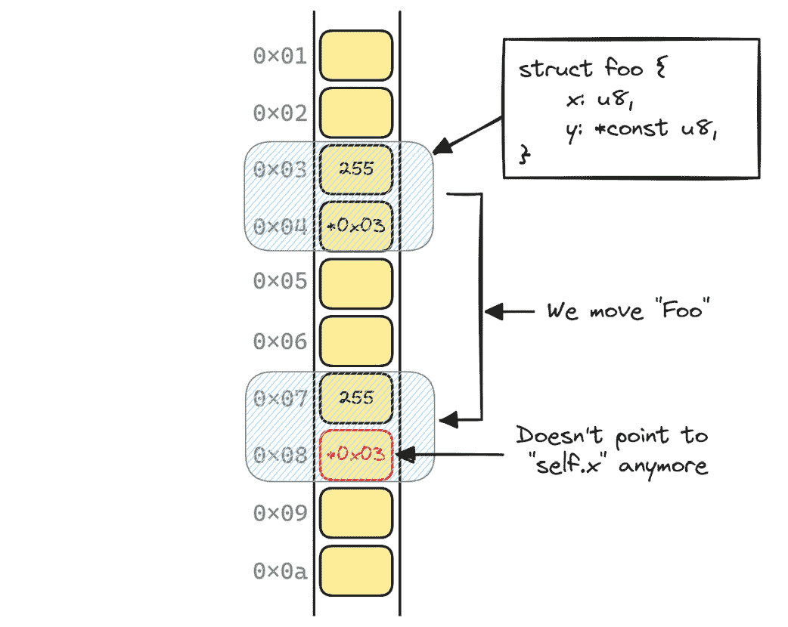
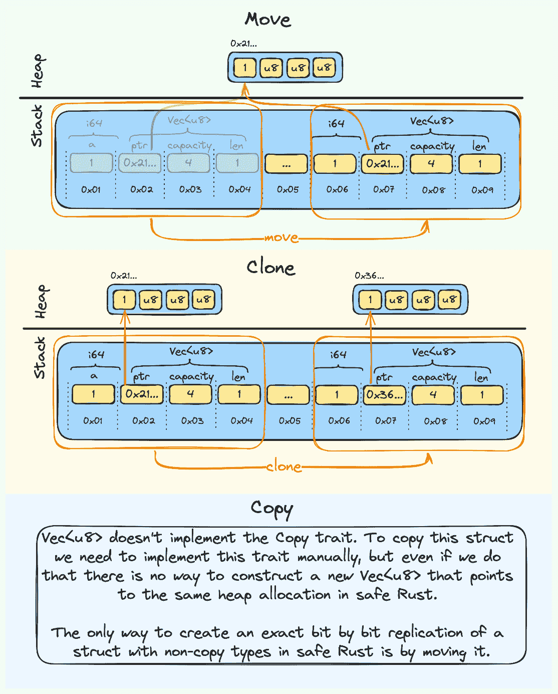
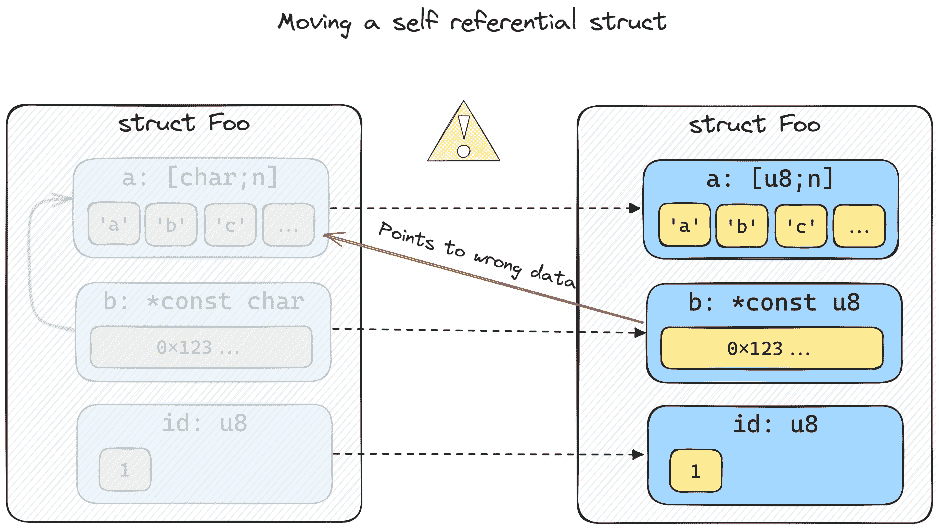
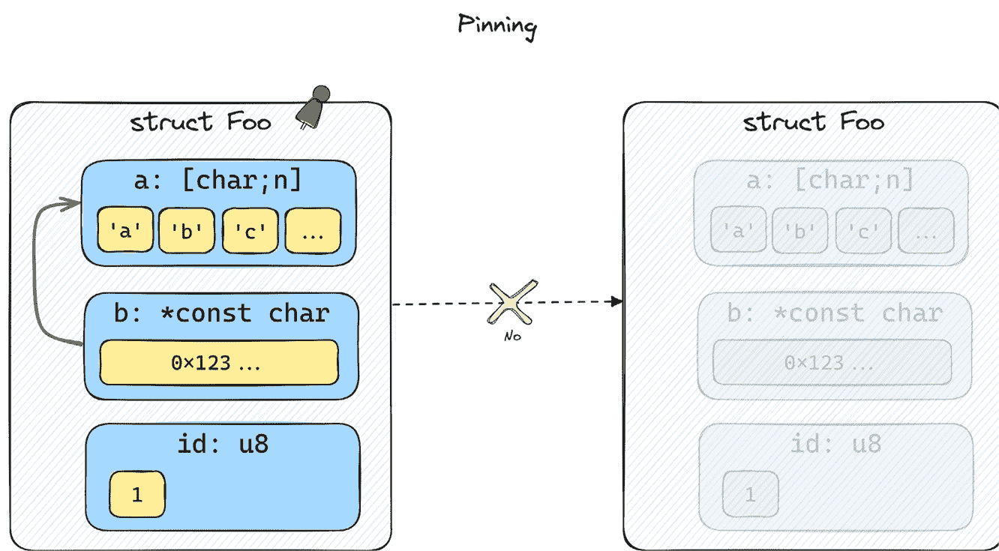
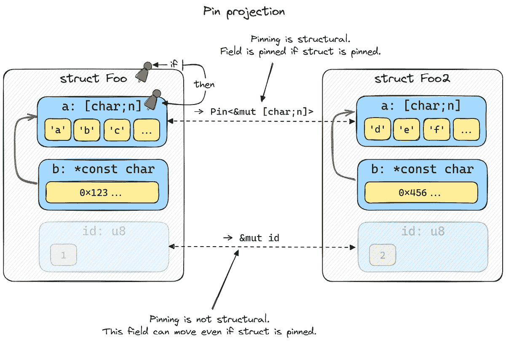

# 第九章：协程、自引用结构体和`Pinning`

在本章中，我们将首先通过添加在状态变化之间存储变量的能力来改进我们的协程。我们将看到这如何导致我们的协程需要引用自身，以及由此产生的问题。将整个章节专门用于这个主题的原因是，它是 Rust 中实现`async/await`的一个关键部分，也是一个相对难以良好理解的课题。

原因在于，对于许多开发者来说，`pinning`的概念是陌生的，就像 Rust 的所有权系统一样，它需要一些时间来建立一个良好且有效的心理模型。

幸运的是，`pinning`的概念并不难理解，但它在语言中的实现以及它与 Rust 的类型系统的交互是抽象的，难以掌握。

尽管我们不会在本章中涵盖关于`pinning`的方方面面，但我们将努力获得对它的良好和稳固的理解。这里的重大目标是对此主题感到自信，并理解为什么我们需要它以及如何使用它。

如前所述，本章不仅关于 Rust 中的`pinning`，因此我们首先将做一些重要的改进，从我们停止的地方开始，通过改进*第八章*中的最终示例。

然后，我们将在解释如何使用`pinning`解决我们的问题之前，先解释什么是自引用结构体以及它们与`futures`之间的联系。

本章将涵盖以下主要主题

+   改进我们的示例 1——变量

+   改进我们的示例 2——引用

+   改进我们的示例 3——这……不是……好的……

+   发现自引用结构体

+   Rust 中的`Pinning`

+   改进我们的示例 4——`pinning`拯救了我们

# 技术要求

本章中的示例将基于前一章的代码，因此要求相同。所有示例都将跨平台，并在 Rust([`doc.rust-lang.org/stable/rustc/platform-support.html`](https://doc.rust-lang.org/stable/rustc/platform-support.html))和 mio([`github.com/tokio-rs/mio#platforms`](https://github.com/tokio-rs/mio#platforms))支持的所有平台上运行。您唯一需要的是安装 Rust 并下载本书的 GitHub 存储库到本地。本章中的所有代码都可以在`ch09`文件夹中找到。

要逐步跟随示例，您还需要在您的机器上安装`corofy`。如果您在*第七章*中没有安装它，现在请进入存储库中的`ch07/corofy`文件夹，并运行以下命令来安装：

```rs
cargo install --force --path .
```

我们还将在这个示例中使用`delayserver`，因此您需要打开一个单独的终端，进入存储库根目录下的`delayserver`文件夹，并运行`cargo run`，以便它为后续的示例做好准备和可用。

如果您需要更改`delayserver`监听的端口号，请记住在代码中更改端口号。

# 改进我们的示例 1 – 变量

因此，让我们回顾一下到目前为止我们所拥有的内容，继续我们在上一章中留下的地方。我们有以下内容：

+   一个`Future`特质

+   使用协程/await 语法和预处理器实现的协程实现

+   基于`mio::Poll`的反应器

+   一个允许我们创建尽可能多的顶级任务并调度准备运行的任务的执行器

+   一个只向我们的本地延迟服务器实例发送 HTTP GET 请求的 HTTP 客户端

这并不糟糕——我们可能会争论我们的 HTTP 客户端有点儿限制，但这不是本书的重点，所以我们可以忍受这一点。然而，我们的协程实现却非常有限。让我们看看我们如何使我们的协程稍微更有用。

我们当前实现的最大缺点是没有任何东西——我是指没有任何东西——可以跨越等待点。首先解决这个问题是有意义的。

让我们从设置我们的示例开始。

我们将使用`d-multiple-threads 示例`中的“库”代码（*第* *8* *章*（我们上一个版本的示例）），但我们将通过添加一个更短、更简单的示例来修改`main.rs`文件。

让我们设置我们将在此章节中迭代和改进的基本示例。

## 设置基本示例

注意

你可以在本书的 GitHub 仓库的`ch09/a-coroutines-variables`下找到这个示例。

执行以下步骤：

1.  创建一个名为`a-coroutines-variables`的文件夹。

1.  进入文件夹并运行`cargo init`。

1.  删除默认的`main.rs`文件，并将`ch08/d-multiple-threads/src`文件夹中的所有内容复制到`ch10/a-coroutines-variables/src`文件夹中。

1.  打开`Cargo.toml`并在依赖项部分添加对`mio`的依赖：

    ```rs
    mio = {version = "0.8", features = ["net", "os-poll"]}
    ```

你现在应该有一个看起来像这样的文件夹结构：

```rs
src
  |-- runtime
       |-- executor.rs
       |-- reactor.rs
  |-- future.rs
  |-- http.rs
  |-- main.rs
  |-- runtime.rs
```

我们将最后一次使用`corofy`为我们生成样板状态机。将以下内容复制到`main.rs`中：

ch09/a-coroutines-variables/src/main.rs

```rs
mod future;
mod http;
mod runtime;
use crate::http::Http;
use future::{Future, PollState};
use runtime::Waker;
fn main() {
    let mut executor = runtime::init();
    executor.block_on(async_main());
}
coroutine fn async_main() {
    println!("Program starting");
    let txt = Http::get("/600/HelloAsyncAwait").wait;
    println!("{txt}");
    let txt = Http::get("/400/HelloAsyncAwait").wait;
    println!("{txt}");
}
```

这次，让我们走捷径，直接将我们的`corofied`文件写回`main.rs`，因为我们已经足够多次地并排比较了文件。假设你处于基本文件夹，`a-coroutine-variables`，写下以下内容：

```rs
corofy ./src/main.rs ./src/main.rs
```

最后一步是修复`corofy`不知道`Waker`的事实。你可以通过编写`cargo check`让编译器引导你到需要做出更改的地方，但为了帮助你，这里有三处小的修改要做（注意行号是重写我们之前写的相同代码时报告的）：

```rs
64: fn poll(&mut self, waker: &Waker)
82: match f1.poll(waker)
102: match f2.poll(cargo run.
			You should see the following output (the output has been abbreviated to save a little bit of space):

```

程序启动

第一次轮询 - 开始操作

main: 1 个待处理任务。等待通知。

HTTP/1.1 200 OK

[==== 简化版 ====]

HelloAsyncAwait

main: 所有任务已完成

```rs

			Note
			Remember that we need `delayserver` running in a terminal window so that we get a response to our HTTP GET requests. See the *Technical requirements* section for more information.
			Now that we’ve got the boilerplate out of the way, it’s time to start making the improvements we talked about.
			Improving our base example
			We want to see how we can improve our state machine so that it allows us to hold variables across wait points. To do that, we need to store them somewhere and restore the variables that are needed when we enter each state in our state machine.
			Tip
			Pretend that these rewrites are done by `corofy` (or the compiler). Even though `corofy` can’t do these rewrites, it’s possible to automate this process as well.
			Or coroutine/wait program looks like this:

```

coroutine fn async_main() {

println!("Program starting");

let txt = Http::get("/600/HelloAsyncAwait").wait;

println!("{txt}");

let txt = Http::get("/400/HelloAsyncAwait").wait;

println!("{txt}");

}

```rs

			We want to change it so that it looks like this:

```

coroutine fn async_main() {

let mut counter = 0;

println!("程序开始");

let txt = http::Http::get("/600/HelloAsyncAwait").wait;

println!("{txt}");

counter += 1;

let txt = http::Http::get("/400/HelloAsyncAwait").wait;

println!("{txt}");

counter += 1;

println!("Received {} responses.", counter);

}

```rs

			In this version, we simply create a `counter` variable at the top of our `async_main` function and increase the counter for each response we receive from the server. At the end, we print out how many responses we received.
			Note
			For brevity, I won’t present the entire code base going forward; instead, I will only present the relevant additions and changes. Remember that you can always refer to the same example in this book’s GitHub repository.
			The way we implement this is to add a new field called `stack` to our `Coroutine0` struct:
			ch09/a-coroutines-variables/src/main.rs

```

struct Coroutine0 {

stack: Stack0,

state: State0,

}

```rs

			The stack fields hold a `Stack0` struct that we also need to define:
			ch09/a-coroutines-variables/src/main.rs

```

#[derive(Default)]

struct Stack0 {

counter: Option<usize>,

}

```rs

			This struct will only hold one field since we only have one variable. The field will be of the `Option<usize>` type. We also derive the `Default` trait for this struct so that we can initialize it easily.
			Note
			Futures created by async/await in Rust store this data in a slightly more efficient manner. In our example, we store every variable in a separate struct since I think it’s easier to reason about, but it also means that the more variables we need to store, the more space our coroutine will need. It will grow linearly with the number of different variables that need to be stored/restored between state changes. This could be a lot of data. For example, if we have 100 state changes that each need one distinct `i64`-sized variable to be stored to the next state, that would require a struct that takes up 100 * 8b = 800 bytes in memory.
			Rust optimizes this by implementing coroutines as enums, where each state only holds the data it needs to restore in the *next* state. This way, the size of a coroutine is not dependent on the *total number of variables*; it’s only dependent on the *size of the largest state that needs to be saved/restored*. In the preceding example, the size would be reduced to 8 bytes since the largest space any single state change needed is enough to hold one `i64`-sized variable. The same space will be reused over and over.
			The fact that this design allows for this optimization is significant and it’s an advantage that stackless coroutines have over stackful coroutines when it comes to memory efficiency.
			The next thing we need to change is the `new` method on `Coroutine0`:
			ch09/a-coroutines-variables/src/main.rs

```

impl Coroutine0 {

fn new() -> Self {

Self {

state: State0::Start,

stack: Stack0::default(),

}

}

}

```rs

			The default value for `stack` is not relevant to us since we’ll overwrite it anyway.
			The next few steps are the ones of most interest to us. In the `Future` implementation for `Coroutine0`, we’ll pretend that `corofy` added the following code to initialize, store, and restore the stack variables for us. Let’s take a look at what happens on the first call to `poll` now:
			ch09/a-coroutines-variables/src/main.rs

```

State0::Start => {

// 初始化栈（提升变量）

self.stack.counter = Some(0);

// ---- 实际编写的代码 ----

println!("程序开始");

// ---------------------------------

let fut1 = Box::new( http::Http::get("/600/HelloAsyncAwait"));

self.state = State0::Wait1(fut1);

// 保存栈

}

```rs

			Okay, so there are some important changes here that I’ve highlighted. Let’s go through them:

				*   The first thing we do when we’re in the `Start` state is add a segment at the top where we initialize our stack. One of the things we do is *hoist* all variable declarations for the relevant code section (in this case, before the first `wait` point) to the top of the function.
				*   In our example, we also initialize the variables to their initial value, which in this case is `0`.
				*   We also added a comment stating that we should save the stack, but since all that happens before the first wait point is the initialization of `counter`, there is nothing to store here.

			Let’s take a look at what happens after the first wait point:
			ch09/a-coroutines-variables/src/main.rs

```

State0::Wait1(ref mut f1) => {

match f1.poll(waker) {

PollState::Ready(txt) => {

// 恢复栈

let mut counter = self.stack.counter.take().unwrap();

// ---- 实际编写的代码 ----

println!("{txt}");

counter += 1;

// ---------------------------------

let fut2 = Box::new( http::Http::get("/400/HelloAsyncAwait"));

self.state = State0::Wait2(fut2);

// 保存栈

self.stack.counter = Some(counter);

}

PollState::NotReady => break PollState::NotReady,

}

}

```rs

			Hmm, this is interesting. I’ve highlighted the changes we need to make.
			 The first thing we do is to *restore* the stack by taking ownership over the counter (`take()`replaces the value currently stored in `self.stack.counter` with `None` in this case) and writing it to a variable with the same name that we used in the code segment (`counter`). Taking ownership and placing the value back in later is not an issue in this case and it mimics the code we wrote in our coroutine/wait example.
			The next change is simply the segment that takes all the code after the first wait point and pastes it in. In this case, the only change is that the `counter` variable is increased by `1`.
			Lastly, we save the stack state back so that we hold onto its updated state between the wait points.
			Note
			In *Chapter 5*, we saw how we needed to store/restore the register state in our fibers. Since *Chapter 5* showed an example of a *stackful coroutine* implementation, we didn’t have to care about stack state at all since all the needed state was stored in the stacks we created.
			Since our coroutines are *stackless*, we don’t store the entire call stack for each coroutine, but we do need to store/restore the parts of the stack that will be used *across wait points*. Stackless coroutines still need to save some information from the stack, as we’ve done here.
			When we enter the `State0::Wait2` state, we start the same way:
			ch09/a-coroutines-variables/src/main.rs

```

State0::Wait2(ref mut f2) => {

match f2.poll(waker) {

PollState::Ready(txt) => {

// 恢复栈

let mut counter = self.stack.counter.take().unwrap();

// ---- 实际编写的代码 ----

println!("{txt}");

counter += 1;

println!(«Received {} responses.», counter);

// ---------------------------------

self.state = State0::Resolved;

// 保存栈（所有变量已设置为 None）

break PollState::Ready(String::new());

}

PollState::NotReady => break PollState::NotReady,

}

}

```rs

			Since there are no more wait points in our program, the rest of the code goes into this segment and since we’re done with `counter` at this point, we can simply `drop` it by letting it go out of scope. If our variable held onto any resources, they would be released here as well.
			With that, we’ve given our coroutines the power of saving variables across wait points. Let’s try to run it by writing `cargo run`.
			You should see the following output (I’ve removed the parts of the output that remain unchanged):

```

…

HelloAsyncAwait

Received 2 responses.

main: 所有任务已完成

```rs

			Okay, so our program works and does what’s expected. Great!
			Now, let’s take a look at an example that needs to store *references* across wait points since that’s an important aspect of having our coroutine/wait functions behave like “normal” functions.
			Improving our example 2 – references
			Let’s set everything up for our next version of this example:

				*   Create a new folder called `b-coroutines-references` and copy everything from `a-coroutines-variables` over to it
				*   You can change the name of the project so that it corresponds with the folder by changing the `name` attribute in the `package` section in `Cargo.toml`, but it’s not something you need to do for the example to work

			Note
			You can find this example in this book’s GitHub repository in the `ch10/b-coroutines-references` folder.
			This time, we’ll learn how to store references to variables in our coroutines by using the following coroutine/wait example program:

```

use std::fmt::Write;

coroutine fn async_main() {

let mut buffer = String::from("\nBUFFER:\n----\n");

let writer = &mut buffer;

println!("程序开始");

let txt = http::Http::get("/600/HelloAsyncAwait").wait;

writeln!(writer, "{txt}").unwrap();

let txt = http::Http::get("/400/HelloAsyncAwait").wait;

writeln!(writer, "{txt}").unwrap();

println!("{}", buffer);

}

```rs

			So, in this example, we create a `buffer` variable of the `String` type that we initialize with some text, and we take a `&mut` reference to that and store it in a `writer` variable.
			Every time we receive a response, we write the response to the buffer through the `&mut` reference we hold in `writer` before we print the buffer to the terminal at the end of the program.
			Let’s take a look at what we need to do to get this working.
			The first thing we do is pull in the `fmt::Write` trait so that we can write to our buffer using the `writeln!` macro.
			Add this to the top of `main.rs`:
			ch09/b-coroutines-references/src/main.rs

```

use std::fmt::Write;

```rs

			Next, we need to change our `Stack0` struct so that it represents what we must store across wait points in our updated example:
			 ch09/b-coroutines-references/src/main.rs

```

#[derive(Default)]

struct Stack0 {

buffer: Option<String>,

writer: Option<*mut String>,

}

```rs

			An important thing to note here is that `writer` can’t be `Option<&mut String>` since we know it will be referencing the buffer field in the same struct. A struct where a field takes a reference on `&self` is called a **self-referential** struct and there is no way to represent that in Rust since the lifetime of the self-reference is impossible to express.
			The solution is to cast the `&mut` self-reference to a pointer instead and ensure that we manage the lifetimes correctly ourselves.
			The only other thing we need to change is the `Future::poll` implementation:
			ch09/b-coroutines-references/src/main.rs

```

State0::Start => {

// 初始化栈（提升变量）

self.stack.buffer = Some(String::from("\nBUFFER:\n----\n"));

self.stack.writer = Some(self.stack.buffer.as_mut().unwrap());

// ---- 实际编写的代码 ----

println!("程序开始");

// ---------------------------------

let fut1 = Box::new(http::Http::get("/600/HelloAsyncAwait"));

self.state = State0::Wait1(fut1);

// 保存栈

}

```rs

			Okay, so this looks a bit odd. The first line we change is pretty straightforward. We initialize our `buffer` variable to a new `String` type, just like we did at the top of our coroutine/wait program.
			The next line, however, looks a bit dangerous.
			We cast the `&mut` reference to our `buffer` to a `*``mut` pointer.
			Important
			Yes, I know we could have chosen another way of doing this since we can take a reference to buffer everywhere we need to instead of storing it in its variable, but that’s only because our example is very simple. Imagine that we use a library that needs to borrow data that’s local to the async function and we somehow have to manage the lifetimes manually like we do here but in a much more complex scenario.
			The `self.stack.buffer.as_mut().unwrap()` line returns a `&mut` reference to the `buffer` field. Since `self.stack.writer` is of the `Option<*mut String>` type, the reference will be *coerced* to a pointer (meaning that Rust does this cast implicitly by inferring it from the context).
			Note
			We take `*mut String` here since we deliberately don’t want a *string slice* (`&str`), which is often what we get (and want) when using a reference to a `String` type in Rust.
			Let’s take a look at what happens after the first wait point:
			ch09/b-coroutines-references/src/main.rs

```

State0::Wait1(ref mut f1) => {

match f1.poll(waker) {

PollState::Ready(txt) => {

// 恢复栈

let writer = unsafe { &mut *self.stack.writer.take().unwrap() };

// ---- 实际编写的代码 ----

writeln!(writer, «{txt}»).unwrap();

// ---------------------------------

let fut2 = Box::new(http::Http::get("/400/HelloAsyncAwait"));

self.state = State0::Wait2(fut2);

// 保存栈

self.stack.writer = Some(writer);

}

PollState::NotReady => break PollState::NotReady,

}

}

```rs

			The first change we make is regarding how we restore our stack. We need to restore our `writer` variable so that it holds a `&mut String` type that points to our buffer. To do this, we have to write some `unsafe` code that dereferences our pointer and lets us take a `&mut` reference to our `buffer`.
			Note
			Casting a reference to a pointer is safe. The unsafe part is dereferencing the pointer.
			Next, we add the line of code that writes the response. We can keep this the same as how we wrote it in our coroutine/wait function.
			Lastly, we save the stack state back since we need both variables to live across the wait point.
			Note
			We don’t have to take ownership over the pointer stored in the `writer` field to use it since we can simply copy it, but to be somewhat consistent, we take ownership over it, just like we did in the first example. It also makes sense since if there is no need to store the pointer for the next await point, we can simply let it go out of scope by not storing it back.
			The last part is when we’ve reached `Wait2` and our future returns `PollState::Ready`:

```

State0::Wait2(ref mut f2) => {

match f2.poll(waker) {

PollState::Ready(txt) => {

// 恢复栈

let buffer = self.stack.buffer.as_ref().take().unwrap();

let writer = unsafe { &mut *self.stack.writer.take().unwrap() };

// ---- 你实际编写的代码 ----

writeln!(writer, «{txt}»).unwrap();

println!("{}", buffer);

// ---------------------------------

self.state = State0::Resolved;

// 保存栈 / 释放资源

let _ = self.stack.buffer.take();

break PollState::Ready(String::new());

}

PollState::NotReady => break PollState::NotReady,

}

}

```rs

			In this segment, we restore both variables since we write the last response through our writer variable, and then print everything that’s stored in our `buffer` to the terminal.
			I want to point out that the `println!("{}", buffer);` line takes a reference in the original coroutine/wait example, even though it might look like we pass in `an` `owned` `String`. Therefore, it makes sense that we restore the buffer to a `&String` type, and not the owned version. Transferring ownership would also invalidate the pointer in our `writer` variable.
			The last thing we do is `drop` the data we don’t need anymore. Our `self.stack.writer` field is already set to `None` since we took ownership over it when we restored the stack at the start, but we need to take ownership over the `String` type that `self.stack.buffer` holds as well so that it gets dropped at the end of this scope too. If we didn’t do that, we would hold on to the memory that’s been allocated to our `String` until the entire coroutine is dropped (which could be much later).
			Now, we’ve made all our changes. If the rewrites we did previously were implemented in `corofy`, our coroutine/wait implementation could, in theory, support much more complex use cases.
			Let’s take a look at what happens when we run our program by writing `cargo run`:

```

程序启动

第一次轮询 - 开始操作

main: 1 个挂起任务。等待通知。

第一次轮询 - 开始操作

main: 1 个挂起任务。等待通知。

缓冲区：

----

HTTP/1.1 200 OK

内容长度：15

连接：关闭

内容类型：text/plain; charset=utf-8

日期：Thu, 30 Nov 2023 22:48:11 GMT

HelloAsyncAwait

HTTP/1.1 200 OK

内容长度：15

连接：关闭

内容类型：text/plain; charset=utf-8

日期：Thu, 30 Nov 2023 22:48:11 GMT

HelloAsyncAwait

main: 所有任务已完成

```rs

			Puh, great. All that dangerous `unsafe` turned out to work just fine, didn’t it? Good job. Let’s make one small improvement before we finish.
			Improving our example 3 – this is… not… good…
			Pretend you haven’t read this section title and enjoy the fact that our previous example compiled and showed the correct result.
			I think our coroutine implementation is so good now that we can look at some optimizations instead. There is one optimization in our executor in particular that I want to do immediately.
			Before we get ahead of ourselves, let’s set everything up:

				*   Create a new folder called `c-coroutines-problem` and copy everything from `b-coroutines-references` over to it
				*   You can change the name of the project so that it corresponds with the folder by changing the `name` attribute in the `package` section in `Cargo.toml`, but it’s not something you need to do for the example to work

			Tip
			This example is located in this book’s GitHub repository in the `ch``09``/c-coroutines-problem` folder.
			With that, everything has been set up.
			Back to the optimization. You see, new insights into the workload our runtime will handle in real life indicate that most futures will return `Ready` on the first poll. So, in theory, we can just poll the future we receive in `block_on` once and it will resolve immediately most of the time.
			Let’s navigate to `src/runtime/executor.rs` and take a look at how we can take advantage of this by adding a few lines of code.
			If you navigate to our `Executor::block_on` function, you’ll see that the first thing we do is `spawn` the future before we poll it. Spawning the future means that we allocate space for it in the heap and store the pointer to its location in a `HashMap` variable.
			Since the future will most likely return `Ready` on the first `poll`, this is unnecessary work that could be avoided. Let’s add this little optimization at the start of the `block_on` function to take advantage of this:

```

pub fn block_on<F>(&mut self, future: F)

where

F: Future<Output = String> + 'static,

{

// ===== 优化，假设已就绪

let waker = self.get_waker(usize::MAX);

let mut future = future;

match future.poll(&waker) {

PollState::NotReady => (),

PollState::Ready(_) => return,

}

// ===== 结束

spawn(future);

loop {

…

```rs

			Now, we simply poll the future immediately, and if the future resolves on the first poll, we return since we’re all done. This way, we only spawn the future if it’s something we need to wait on.
			Yes, this assumes we never reach `usize::MAX` for our IDs, but let’s pretend this is only a proof of concept. Our `Waker` will be discarded and replaced by a new one if the future is spawned and polled again anyway, so that shouldn’t be a problem.
			Let’s try to run our program and see what we get:

```

程序启动

第一次轮询 - 开始操作

main: 1 个挂起任务。等待通知。

第一次轮询 - 开始操作

main: 1 个挂起任务。等待通知。

/400/HelloAsyn

free(): 在 tcache 2 中检测到双重释放

已终止

```rs

			Wait, what?!?
			That doesn’t sound good! Okay, that’s probably a kernel bug in Linux, so let’s try it on Windows instead:

```

…

错误：进程未成功退出：`target\release\c-coroutines-

problem.exe` (退出代码：0xc0000374, 状态：STATUS_HEAP_CORRUPTION)

```rs

			That sounds even worse!! What happened here?
			Let’s take a closer look at exactly what happened with our async system when we made our small optimization.
			Discovering self-referential structs
			What happened is that we created a self-referential struct, initialized it so that it took a pointer to itself, and then moved it. Let’s take a closer look:

				1.  First, we received a future object as an argument to `block_on`. This is not a problem since the future isn’t self-referential yet, so we can move it around wherever we want to without issues (this is also why moving futures before they’re polled is perfectly fine using proper async/await).
				2.  Then, we polled the future once. The optimization we did made one essential change. The future was located on the stack (inside the stack frame of our `block_on` function) when we polled it the first time.
				3.  When we polled the future the first time, we initialized the variables to their initial state. Our `writer` variable took a pointer to our `buffer` variable (stored as a part of our coroutine) and made it *self-referential* at this point.
				4.  The first time we polled the future, it returned `NotReady`
				5.  Since it returned `NotReady`, we spawned the future, which moves it into the tasks collection with the `HashMap<usize, Box<dyn Future<Output = String>>>` type in our `Executor`. The future is now placed in `Box`, which moves it to the heap.
				6.  The next time we poll the future, we restore the stack by dereferencing the pointer we hold for our `writer` variable. However, there’s a big problem: the pointer is now pointing to the old location on the stack where the future was located at the first poll.
				7.  That can’t end well, and it doesn’t in our case.

			You’ve now seen firsthand the problem with self-referential structs, how this applies to futures, and why we need something that prevents this from happening.
			A **self-referential struct** is a struct that takes a reference to *self* and stores it in a field. Now, the term *reference* here is a little bit unprecise since there is no way to take a reference to *self* in Rust and store that reference in *self*. To do this in safe Rust, you have to cast the reference to a *pointer* (remember that references are just pointers with a special meaning in the programming language).
			Note
			When we create visualizations in this chapter, we’ll disregard *padding*, even though we know structs will likely have some padding between fields, as we discussed in *Chapter 4*.
			When this value is moved to another location in memory, the pointer is not updated and points to the “old” location.
			If we take a look at a move from one location on the stack to another one, it looks something like this:
			

			Figure 9.1 – Moving a self-referential struct
			In the preceding figure, we can see the memory addresses to the left with a representation of the stack next to it. Since the pointer was not updated when the value was moved, it now points to the old location, which can cause serious problems.
			Note
			It can be very hard to detect these issues, and creating simple examples where a move like this causes serious issues is surprisingly difficult. The reason for this is that even though we move everything, the old values are not zeroed or overwritten immediately. Often, they’re still there, so dereferencing the preceding pointer would *probably* produce the correct value. The problem only arises when you change the value of `x` in the new location, and expect `y` to point to it. Dereferencing `y` still produces a valid value in this case, but it’s the *wrong* value.
			Optimized builds often optimize away needless moves, which can make bugs even harder to detect since most of the program will seem to work just fine, even though it contains a serious bug.
			What is a move?
			A *move* in Rust is one of those concepts that’s unfamiliar to many programmers coming from C#, Javascript, and similar garbage-collected languages, and different from what you’re used to for C and C++ programmers. The definition of *move* in Rust is closely related to its ownership system.
			Moving means transferring ownership. In Rust, a *move* is the default way of passing values around and it happens every time you change ownership over an object. If the object you move only consists of copy types (types that implement the `Copy` trait), this is as simple as copying the data over to a new location on the stack.
			For non-copy types, a move will copy all copy types that it contains over just like in the first example, but now, it will also copy **pointers** to resources such as heap allocations. The moved-from object is left **inaccessible** to us (for example, if you try to use the moved-from object, the compilation will fail and let you know that the object has moved), so there is only one owner over the allocation at any point in time.
			In contrast to *cloning*, it does not recreate any resources and make a clone of them.
			One more important thing is that the compiler makes sure that `drop` is never called on the moved-from object so that the only thing that can free the resources is the new object that took ownership over everything.
			*Figure 9**.2* provides a simplified visual overview of the difference between move, clone, and copy (we’ve excluded any internal padding of the struct in this visualization). Here, we assume that we have a struct that holds two fields – a copy type, `a`, which is an `i64` type, and a non-copy type, `b`, which is a `Vec<u8>` type:
			

			Figure 9.2 – Move, clone, and copy
			A move will in many ways be like a deep copy of everything in our struct that’s located on the stack. This is problematic when you have a pointer that points to `self`, like we have with self-referential structs, since `self` will start at a new memory address after the move but the pointer to `self` won’t be adjusted to reflect that change.
			Most of the time, when programming Rust, you probably won’t think a lot about moves since it’s part of the language you never explicitly use, but it’s important to know what it is and what it does.
			Now that we’ve got a good understanding of what the problem is, let’s take a closer look at how Rust solves this by using its type system to prevent us from moving structs that rely on a stable place in memory to function correctly.
			Pinning in Rust
			The following diagram shows a slightly more complex self-referential struct so that we have something visual to help us understand:
			

			Figure 9.3 – Moving a self-referential struct with three fields
			At a very high level, pinning makes it possible to rely on data that has a stable memory address by disallowing any operation that might move it:
			

			Figure 9.4 – Moving a pinned struct
			The concept of pinning is pretty simple. The complex part is how it’s implemented in the language and how it’s used.
			Pinning in theory
			Pinning is a part of Rust’s standard library and consists of two parts: the type, **Pin**, and the marker-trait, **Unpin**. Pinning is only a language construct. There is no special kind of location or memory that you move values to so they get pinned. There is no syscall to ask the operating system to ensure a value stays the same place in memory. It’s only a part of the type system that’s designed to prevent us from being able to move a value.
			`Pin` does not remove the need for `unsafe` – it just gives the user of `unsafe` a guarantee that the value has a stable location in memory, so long as the user that pinned the value only uses *safe* Rust. This allows us to write self-referential types that are safe. It makes sure that all operations that can lead to problems must use `unsafe`.
			Back to our coroutine example, if we were to move the struct, we’d have to write `unsafe` Rust. That is how Rust upholds its safety guarantee. If you somehow know that the future you created never takes a self-reference, you could choose to move it using `unsafe`, but the blame now falls on you if you get it wrong.
			Before we dive a bit deeper into pinning, we need to define several terms that we’ll need going forward.
			Definitions
			Here are the definitions we must understand:

				*   `std::pin` module. `Pin` wrap types that implement the `Deref` trait, which in practical terms means that it wraps *references and* *smart pointers*.
				*   `Unpin`, *pinning will have no effect on that type*. You read that right – no effect. The type will still be wrapped in `Pin` but you can simply take it out again.

    The impressive thing is that almost everything implements `Unpin` by default, and if you manually want to mark a type as `!Unpin`, you have to add a marker trait called `PhantomPinned` to your type. Having a type, `T`, implement `!Unpin` is the only way for something such as `Pin<&mut T>` to have any effect.

				*   **Pinning a type that’s !Unpin** will guarantee that the value remains at the same location in memory until it gets dropped, so long as you stay in safe Rust.
				*   `self`. For example, they often look like `fn foo(self:` `Pin<&mut self>)`.
				*   `Pin<&mut T>` where `T` has one field, `a`, that can be moved freely and one that can’t be moved, `b`, you can do the following:
    *   Write a *pin projection* for `a` with the `fn a(self: Pin<&mut self>) -> &A` signature. In this case, we say that pinning is *not structural*.
    *   Write a projection for `b` that looks like `fn b(self: Pin<&mut self>) -> Pin<&mut B>`, in which case we say that pinning is *structural* for `b` since it’s pinned when the struct, `T`, is pinned.

			With the most important definitions out of the way, let’s look at the two ways we can pin a value.
			Pinning to the heap
			Note
			The small code snippets we’ll present here can be found in this book’s GitHub repository in the `ch``09``/d-pin` folder. The different examples are implemented as different methods that you comment/uncomment in the `main` function.
			Let’s write a small example to illustrate the different ways of pinning a value:
			ch09/d-pin/src/main.rs

```

use std::{marker::PhantomPinned, pin::Pin};

#[derive(Default)]

struct Foo {

a: MaybeSelfRef,

b: String,

}

```rs

			So, we want to be able to create an instance using `MaybeSelfRef::default()` that we can move around as we wish, but then at some point *initialize* it to a state where it references itself; moving it would cause problems.
			This is very much like futures that are not self-referential until they’re polled, as we saw in our previous example. Let's write the `impl` block for `MaybeSelfRef` and take a look at the code::
			ch09/d-pin/src/main.rs

```

impl MaybeSelfRef {

fn init(self: Pin<&mut Self>) {

unsafe {

let Self { a, b, .. } = self.get_unchecked_mut();

*b = Some(a);

}

}

fn b(self: Pin<&mut Self>) -> Option<&mut usize> {

unsafe { self.get_unchecked_mut().b.map(|b| &mut *b) }

}

}

```rs

			As you can see, `MaybeStelfRef` will only be self-referential after we call `init` on it.
			We also define one more method that casts the pointer stored in `b` to `Option<&mut usize>`, which is a mutable reference to `a`.
			One thing to note is that both our functions require `unsafe`. Without `Pin`, the only method requiring unsafe would be `b` since we dereference a pointer there. Acquiring a mutable reference to a pinned value always require `unsafe`, since there is nothing preventing us from moving the pinned value at that point.
			Pinning to the heap is usually done by pinning a `Box`. There is even a convenient method on `Box` that allows us to get `Pin<Box<...>>`. Let’s look at a short example:
			ch09/d-pin/src/main.rs

```

fn main() {

let mut x = Box::pin(MaybeSelfRef::default());

x.as_mut().init();

println!("{}", x.as_ref().a);

*x.as_mut().b().unwrap() = 2;

println!("{}", x.as_ref().a);

}

```rs

			Here, we pin `MaybeSelfRef` to the heap and initialize it. We print out the value of `a` and then mutate the data through the self-reference in `b`, and set its value to `2`. If we look at the output, we’ll see that everything looks as expected:

```

完成开发 [未优化 + 调试信息] 目标(s) 在 0.56s

运行 `target\debug\x-pin-experiments.exe`

0

2

```rs

			The pinned value can never move and as *users* of `MaybeSelfRef`, we didn’t have to write any `unsafe` code. Rust can guarantee that we never (in safe Rust) get a mutable reference to `MaybeSelfRef` since `Box` took ownership of it.
			Heap pinning being safe is not so surprising since, in contrast to the stack, a heap allocation will be stable throughout the program, regardless of where we create it.
			Important
			This is the preferred way to pin values in Rust. Stack pinning is for those cases where you don’t have a heap to work with or can’t accept the cost of that extra allocation.
			Let’s take a look at stack pinning while we’re at it.
			Pinning to the stack
			Pinning to the stack can be somewhat difficult. In *Chapter 5*, we saw how the stack worked and we know that it grows and shrinks as values are popped and pushed to the stack.
			So, if we’re going to pin to the stack, we have to pin it somewhere “high” on the stack. This means that if we pin a value to the stack inside a function call, we can’t return from that function, and expect the value to still be pinned there. That would be impossible.
			Pinning to the stack is hard since we pin by taking `&mut T`, and we have to guarantee that we won’t move `T` until it’s dropped. If we’re not careful, this is easy to get wrong. Rust can’t help us here, so it’s up to us to uphold that guarantee. This is why stack pinning is `unsafe`.
			Let’s look at the same example using stack pinning:
			ch09/d-pin/src/main.rs

```

fn stack_pinning_manual() {

let mut x = MaybeSelfRef::default();

let mut x = unsafe { Pin::new_unchecked(&mut x) };

x.as_mut().init();

println!("{}", x.as_ref().a);

*x.as_mut().b().unwrap() = 2;

println!("{}", x.as_ref().a);

}

```rs

			The noticeable difference here is that it’s `unsafe` to pin to the stack, so now, we need `unsafe` both as users of `MaybeSelfRef` and as implementors.
			If we run the example with `cargo run`, the output will be the same as in our first example:

```

完成开发 [未优化 + 调试信息] 目标(s) 在 0.58s

运行 `target\debug\x-pin-experiments.exe`

0

2

```rs

			The reason stack pinning requires `unsafe` is that it’s rather easy to accidentally break the guarantees that `Pin` is supposed to provide. Let’s take a look at this example:
			ch09/d-pin/src/main.rs

```

use std::mem::swap;

fn stack_pinning_manual_problem() {

let mut x = MaybeSelfRef::default();

let mut y = MaybeSelfRef::default();

{

let mut x = unsafe { Pin::new_unchecked(&mut x) };

x.as_mut().init();

*x.as_mut().b().unwrap() = 2;

}

swap(&mut x, &mut y);

println!("

x: {{

+----->a: {:p},

|      b: {:?},

|  }}

|

|  y: {{

|      a: {:p},

+-----|b: {:?},

}}",

&x.a,

x.b,

&y.a,

y.b,

);

}

```rs

			In this example, we create two instances of `MaybeSelfRef` called `x` and `y`. Then, we create a scope where we pin `x` and set the value of `x.a` to `2` by dereferencing the self-reference in `b`, as we did previously.
			Now, when we exit the scope, `x` isn’t pinned anymore, which means we can take a mutable reference to it without needing `unsafe`.
			Since this is safe Rust and we should be able to do what we want, we swap `x` and `y`.
			The output prints out the pointer address of the `a` field of both structs and the value of the pointer stored in `b`.
			When we look at the output, we should see the problem immediately:

```

完成 dev [未优化 + 调试信息] 目标(s) 在 0.58s

运行`target\debug\x-pin-experiments.exe`

x: {

+----->a: 0xe45fcff558,

|      b: None,

|  }

|

|  y: {

|      a: 0xe45fcff570,

+-----|b: Some(0xe45fcff558),

}

```rs

			Although the pointer values will differ from run to run, it’s pretty evident that `y` doesn’t hold a pointer to `self` anymore.
			Right now, it points somewhere in `x`. This is very bad and will cause the exact memory safety issues Rust is supposed to prevent.
			Note
			For this reason, the standard library has a `pin!` macro that helps us with safe stack pinning. The macro uses `unsafe` under the hood but makes it impossible for us to reach the pinned value again.
			Now that we’ve seen all the pitfalls of stack pinning, my clear recommendation is to avoid it unless you need to use it. If you have to use it, then use the `pin!` macro so that you avoid the issues we’ve described here.
			Tip
			In this book’s GitHub repository, you’ll find a function called `stack_pinning_macro()` in the `ch``09``/d-pin/src/main.rs` file. This function shows the preceding example but using Rust’s `pin!` macro.
			Pin projections and structural pinning
			Before we leave the topic of pinning, we’ll quickly explain what pin projections and structural pinning are. Both sound complex, but they are very simple in practice. The following diagram shows how these terms are connected:
			

			Figure 9.5 – Pin projection and structural pinning
			Structural pinning means that if a struct is pinned, so is the field. We expose this through pin projections, as we’ll see in the following code example.
			If we continue with our example and create a struct called `Foo` that holds both `MaybeSelfRef` (field `a`) and a `String` type (field `b`), we could write two projections that return a pinned version of `a` and a regular mutable reference to `b`:
			ch09/d-pin/src/main.rs

```

#[derive(Default)]

struct Foo {

a: MaybeSelfRef,

b: String,

}

实现 Foo {

fn a(self: Pin<&mut Self>) -> Pin<&mut MaybeSelfRef> {

unsafe {

self.map_unchecked_mut(|s| &mut s.a)

}

}

fn b(self: Pin<&mut Self>) -> &mut String {

unsafe {

&mut self.get_unchecked_mut().b

}

}

}

```rs

			Note that these methods will only be callable when `Foo` is pinned. You won’t be able to call either of these methods on a regular instance of `Foo`.
			Pin projections do have a few subtleties that you should be aware of, but they’re explained in quite some detail in the official documentation (https://doc.rust-lang.org/stable/std/pin/index.html), so I’ll refer you there for more information about the precautions you must take when writing projections.
			Note
			Since pin projections can be a bit error-prone to create yourself, there is a popular create for making pin projections called **pin_project** (https://docs.rs/pin-project/latest/pin_project/). If you ever end up having to make pin projections, it’s worth checking out.
			With that, we’ve pretty much covered all the advanced topics in async Rust. However, before we go on to our last chapter, let’s see how pinning will prevent us from making the big mistake we made in the last iteration of our coroutine example.
			Improving our example 4 – pinning to the rescue
			Fortunately, the changes we need to make are small, but before we continue and make the changes, let’s create a new folder and copy everything we had in our previous example over to that folder:

				*   Copy the entire `c-coroutines-problem` folder and name the new copy `e-coroutines-pin`
				*   Open `Cargo.toml` and rename the name of the package `e-coroutines-pin`

			Tip
			You’ll find the example code we’ll go through here in this book’s GitHub repository under the `ch``09``/e-coroutines-pin` folder.
			Now that we have a new folder set up, let’s start making the necessary changes. The logical place to start is our `Future` definition in `future.rs`.
			future.rs
			The first thing we’ll do is pull in `Pin` from the standard library at the very top:
			ch09/e-coroutines-pin/src/future.rs

```

use std::pin::Pin;

```rs

			The only other change we need to make is in the definition of `poll` in our `Future` trait:

```

fn poll(self: Pin<&mut Self>, waker: &Waker) -> PollState<Self::Output>;

```rs

			That’s pretty much it.
			However, the implications of this change are noticeable pretty much everywhere poll is called, so we need to fix that as well.
			Let’s start with `http.rs`.
			http.rs
			The first thing we need to do is pull in `Pin` from the standard library. The start of the file should look like this:
			ch09/e-coroutines-pin/src/http.rs

```

use crate::{future::PollState, runtime::{self, reactor, Waker}, Future};

use mio::Interest;

use std::{io::{ErrorKind, Read, Write}, pin::Pin};

```rs

			The only other place we need to make some changes is in the `Future` implementation for `HttpGetFuture`, so let’s locate that. We’ll start by changing the arguments in `poll`:
			ch09/e-coroutines-pin/src/http.rs

```

fn poll(self is now Pin<&mut Self>, there are several small changes we need to make so that the borrow checker stays happy. Let’s start from the top:

            ch09/e-coroutines-pin/src/http.rs

```rs
let id = self.id;
        if self.stream.is_none() {
            println!("FIRST POLL - START OPERATION");
            self.write_request();
            let stream = (&mut self).stream.as_mut().unwrap();
            runtime::reactor().register(stream, Interest::READABLE, id);
            runtime::reactor().set_waker(waker, self.id);
        }
```

            在顶部将`id`分配给变量的原因是，当尝试将`&mut self`和`&self`作为参数传递给 register/deregister 函数时，借用检查器给我们带来了一些小麻烦，所以我们只是在顶部将`id`分配给一个变量，这样大家就都高兴了。

            只有两行需要更改，那就是我们从一个内部缓冲区创建`String`类型并从 reactor 注销兴趣的地方：

            ch09/e-coroutines-pin/src/http.rs

```rs
let s = String::from_utf8_lossy(&self.buffer).to_string();
runtime::reactor().deregister(self.stream.as_mut().unwrap(), id);
break PollState::Ready(s);
```

            重要

            注意，这个 future 是`Unpin`。没有东西让它移动`HttpGetFuture`变得`不安全`，对于大多数这样的 future 来说，情况确实如此。只有由 async/await 创建的 future 是按设计自我引用的。这意味着这里不需要任何`不安全`的操作。

            接下来，让我们继续到`main.rs`，因为那里有一些重要的更改需要我们进行。

            Main.rs

            让我们从顶部开始，确保我们有正确的导入：

            ch09/e-coroutines-pin/src/main.rs

```rs
mod future;
mod http;
mod runtime;
use future::{Future, PollState};
use runtime::Waker;
use std::{fmt::Write, PhantomPinned marker and Pin.
			The next thing we need to change is in our `State0` enum. The futures we hold between states are now pinned:
			ch09/e-coroutines-pin/src/main.rs

```

Wait1(Pin<Box<dyn Future<Output = String>>>),

Wait2(Pin<Box<dyn Future<Output = String>>>),

```rs

			Next up is an important change. We need to make our coroutines `!Unpin` so that they can’t be moved once they have been pinned. We can do this by adding a marker trait to our `Coroutine0` struct:
			ch09/e-coroutines-pin/src/main.rs

```

struct Coroutine0 {

栈: Stack0,

状态: State0,

_pin: PhantomPinned,

}

```rs

			We also need to add the `PhantomPinned` marker to our new function:
			ch09/e-coroutines-pin/src/main.rs

```

实现 Coroutine0 {

fn new() -> Self {

Self {

状态: State0::Start,

栈: Stack0::default(),

_pin: PhantomPinned,

}

}

}

```rs

			The last thing we need to change is the `poll` method. Let’s start with the function signature:
			ch09/e-coroutines-pin/src/main.rs

```

fn poll(this, which replaces self everywhere in the function body.

            我不会逐行解释，因为变化如此微不足道，但第一行之后，我们只需在函数体中所有使用`self`的地方进行简单的搜索和替换，将其更改为`this`：

            ch09/e-coroutines-pin/src/main.rs

```rs
let this = unsafe { self.get_unchecked_mut() };
        loop {
            match this.state {
                State0::Start => {
                    // initialize stack (hoist declarations - no stack yet)
                    this.stack.buffer = Some(String::from("\nBUFFER:\n----\n"));
                    this.stack.writer = Some(this.stack.buffer.as_mut().unwrap());
                    // ---- Code you actually wrote ----
                    println!("Program starting");
...
```

            这里重要的行是`let this = unsafe { self.get_unchecked_mut() };`。在这里，我们必须使用`unsafe`，因为由于我们添加的标记 trait，固定值是`!Unpin`。

            获取到固定值是`不安全的`，因为 Rust 无法保证我们不会移动固定值。

            这个好处是，如果我们以后遇到任何这样的问题，我们知道我们可以搜索我们使用 `unsafe` 的地方，问题肯定在那里。

            我们接下来需要更改的是将我们存储在等待状态中的未来对象固定。我们可以通过调用 `Box::pin` 而不是 `Box::new` 来实现这一点：

            ch09/e-coroutines-pin/src/main.rs

```rs
let fut1 = Box::pin(http::Http::get("/600/HelloAsyncAwait"));
let fut2 = Box::main.rs where we need to make changes is in the locations where we poll our child futures since we now have to go through the Pin type to get a mutable reference:
			ch09/e-coroutines-pin/src/main.rs

```

match f1.as_mut().poll(waker)

由于这些未来对象是 !Unpin，这里使用 `f2unsafe`。

            我们需要更改几行代码的最后一个地方是在 `executor.rs` 中，所以让我们前往那里作为我们的最后一站。

            executor.rs

            我们必须做的第一件事是确保我们的依赖关系是正确的。我们在这里所做的唯一更改是添加来自标准库的 `Pin`：

            ch09/e-coroutines-pin/src/runtime/executor.rs

```rs
...
    thread::{self, Thread}, pin::Pin,
};
```

            我们将要更改的下一行是我们的 `Task` 类型别名，使其现在指向 `Pin<Box<...>>`：

```rs
type Task = Pin<Box<dyn Future<Output = String>>>;
```

            我们现在将要更改的最后一行是在我们的 spawn 函数中。我们必须将未来对象固定在堆上：

```rs
e.tasks.borrow_mut().insert(id, Box::pin(future));
```

            如果我们现在尝试运行我们的示例，它甚至无法编译并给出以下错误：

```rs
error[E0599]: no method named `poll` found for struct `Pin<Box<dyn future::Future<Output = String>>>` in the current scope
  --> src\runtime\executor.rs:89:30
```

            它甚至不允许我们在不先固定它的情况下轮询未来对象，因为 `poll` 只能对 `Pin<&mut Self>` 类型调用，而不能对 `&mut self` 调用。

            因此，在我们甚至尝试轮询之前，我们必须决定是将值固定在栈上还是堆上。在我们的情况下，我们的整个执行器通过堆分配未来对象，所以这是唯一合理的事情去做。

            让我们完全移除优化，并更改一行代码以使我们的执行器再次工作：

            ch09/e-coroutines-pin/src/runtime/executor.rs

```rs
match future.cargo run, you should get the expected output back and not have to worry about the coroutine/wait generated futures being moved again (the output has been abbreviated slightly):

```

完成开发 [未优化 + 调试信息] 目标(s) 在 0.02 秒

运行 `target\debug\e-coroutines-pin.exe`

程序开始

第一次轮询 - 开始操作

main: 1 个待处理任务。等待通知。

第一次轮询 - 开始操作

main: 1 个待处理任务。等待通知。

缓冲区：

----

HTTP/1.1 200 OK

content-length: 15

[=== 简化版 ===]

日期：Sun, 03 Dec 2023 23:18:12 GMT

HelloAsyncAwait

main: 所有任务已完成

```rs

			You now have self-referential coroutines that can safely store both data and references across wait points. Congratulations!
			Even though making these changes took up quite a few pages, the changes themselves were part pretty trivial for the most part. Most of the changes were due to `Pin` having a different API than what we had when using references before.
			The good thing is that this sets us up nicely for migrating our whole runtime over to futures created by async/await instead of our own futures created by coroutine/wait with very few changes.
			Summary
			What a ride, huh? If you’ve got to the end of this chapter, you’ve done a fantastic job, and I have good news for you: you pretty much know everything about how Rust’s futures work and what makes them special already. All the complicated topics are covered.
			In the next, and last, chapter, we’ll switch over from our hand-made coroutines to proper async/await. This will seem like a breeze compared to what you’ve gone through so far.
			Before we continue, let’s stop for a moment and take a look at what we’ve learned in this chapter.
			First, we expanded our coroutine implementation so that we could store variables across wait points. This is pretty important if our coroutine/wait syntax is going to rival regular synchronous code in readability and ergonomics.
			After that, we learned how we could store and restore variables that held references, which is just as important as being able to store data.
			Next, we saw firsthand something that we’ll *never* see in Rust unless we implement an asynchronous system, as we did in this chapter (which is quite the task just to prove a single point). We saw how moving coroutines that hold self-references caused serious memory safety issues, and exactly why we need something to prevent them.
			That brought us to pinning and self-referential structs, and if you didn’t know about these things already, you do now. In addition to that, you should at least know what a pin projection is and what we mean by structural pinning.
			Then, we looked at the differences between pinning a value to the stack and pinning a value to the heap. You even saw how easy it was to break the `Pin` guarantee when pinning something to the stack and why you should be very careful when doing just that.
			You also know about some tools that are widely used to tackle both pin projections and stack pinning and make both much safer and easier to use.
			Next, we got firsthand experience with how we could use pinning to prevent the issues we had with our coroutine implementation.
			If we take a look at what we’ve built so far, that’s pretty impressive as well. We have the following:

				*   A coroutine implementation we’ve created ourselves
				*   Coroutine/wait syntax and a preprocessor that helps us with the boilerplate for our coroutines
				*   Coroutines that can safely store both data and references across wait points
				*   An efficient runtime that stores, schedules, and polls the tasks to completion
				*   The ability to spawn new tasks onto the runtime so that one task can spawn hundreds of new tasks that will run concurrently
				*   A reactor that uses `epoll`/`kqueue`/IOCP under the hood to efficiently wait for and respond to new events reported by the operating system

			I think this is pretty cool.
			We’re not quite done with this book yet. In the next chapter, you’ll see how we can have our runtime run futures created by async/await instead of our own coroutine implementation with just a few changes. This enables us to leverage all the advantages of async Rust. We’ll also take some time to discuss the state of async Rust today, the different runtimes you’ll encounter, and what we might expect in the future.
			All the heavy lifting is done now. Well done!

```

```rs

```

```rs

```

```rs

```
