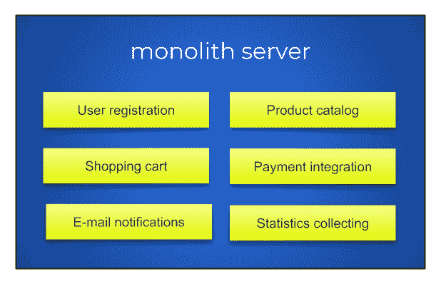
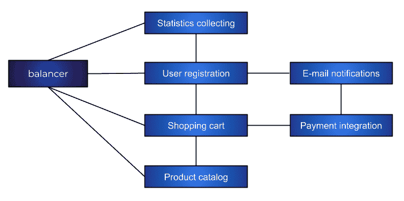

# 第一章：微服务简介

本章将向您介绍微服务的基础知识，包括微服务是什么以及如何将单体服务器拆分为微服务。如果您不熟悉微服务的概念，或者从未使用 Rust 编程语言实现过它们，这将很有用。

本章将涵盖以下主题：

+   什么是微服务？

+   如何将传统服务器架构转换为微服务

+   Rust 在微服务开发中的重要性

# 技术要求

本章没有特殊的技术要求，但现在安装或更新您的 Rust 编译器是个好时机。您可以从 Rust 的官方网站获取：[`www.rust-lang.org/`](https://www.rust-lang.org/)。我建议您使用`rustup`工具，您可以从[`rustup.rs/`](https://rustup.rs/)下载。

如果您之前已安装编译器，您需要使用以下命令将其更新到最新版本：

```rs
rustup update
```

您可以从 GitHub 页面获取本书的示例：[`github.com/PacktPublishing/Hands-On-Microservices-with-Rust-2018/`](https://github.com/PacktPublishing/Hands-On-Microservices-with-Rust-2018/)。

# 什么是微服务？

现代用户每天都在与微服务互动；虽然不是直接互动，但通过使用 Web 应用程序。微服务是一种灵活的软件开发技术，有助于将应用程序作为一系列独立服务集合起来，这些服务之间关系较弱。

在本节中，我们将了解为什么微服务是个好东西，以及为什么我们需要它们。微服务遵循 REST 架构，该架构提供了关于使用一致 HTTP 方法的规则。我们还将探讨如何将微服务部署给用户，这是它们的主要优势之一。

# 我们为什么需要微服务

微服务是一种现代软件开发方法，指的是将软件拆分为一系列小型服务，这些服务更容易开发、调试、部署和维护。微服务是微型的、独立的服务器，充当单一业务功能。例如，如果您有一个作为单体工作的电子商务套件，您可以将其拆分为具有有限责任的小型服务器，执行相同的任务。一个微服务可以处理用户授权，另一个可以处理用户的购物车，其余的服务可以处理诸如搜索功能、社交媒体集成或推荐等功能。

微服务可以与数据库交互或连接到其他微服务。为了与数据库交互，微服务可以使用不同的协议。这可能包括 HTTP 或 REST、Thrift、ZMQ、AMQP 用于消息通信风格、WebSockets 用于流数据，甚至古老的**简单对象访问协议**（**SOAP**）来与现有基础设施集成。本书我们将使用 HTTP 和 REST，因为这是提供和交互 Web API 最灵活的方式。我们将在后面解释这个选择。

与单体服务器相比，微服务有以下优势：

+   你可以使用不同的编程语言

+   单个服务器的代码库更小

+   它们有独立的 DevOps 流程来构建和部署活动

+   它们可以根据其实现进行扩展

+   如果一个微服务失败，其余的将继续工作

+   它们在容器内运行良好

+   元素之间的隔离性提高导致安全性更好

+   它们适合涉及物联网的项目

+   它们与 DevOps 哲学一致

+   它们可以被外包

+   开发完成后可以进行编排

+   它们是可重用的

然而，微服务也有一些缺点。以下是一些：

+   过多的微服务会超负荷开发过程

+   你必须设计交互协议

+   对于小型团队来说，它们可能很昂贵

微服务架构是一种现代方法，可以帮助你实现拥有松耦合元素的目标。这就是服务器相互独立，帮助你比单体方法更快地发布和扩展应用程序，在单体方法中，你把所有的鸡蛋都放在一个篮子里。

# 如何部署微服务

由于微服务是一个小型但完整的 Web 服务器，你必须将其作为完整的服务器进行部署。但由于其功能范围较窄，配置起来也更简单。容器可以帮助你将二进制文件打包到包含必要依赖项的操作系统镜像中，从而简化部署过程。

这与单体架构的情况不同，在单体架构中，你有一个系统管理员负责安装和配置服务器。微服务需要一个新角色来执行此功能——DevOps。DevOps 不仅仅是一个工作角色，而是一种整个软件工程文化，其中开发人员成为系统管理员，反之亦然。DevOps 工程师负责打包和交付软件给最终用户或市场。与系统管理员不同，DevOps 工程师与云和集群一起工作，通常除了自己的笔记本电脑外不接触任何硬件。

DevOps 使用大量自动化，并将应用程序通过交付流程的各个阶段：构建、测试、打包、发布或部署，以及工作系统的监控。这有助于减少将特定软件推向市场以及发布其新版本所需的时间。对于单体服务器，很难使用大量自动化，因为它们过于复杂且脆弱。即使你想将单体打包到容器中，你也必须以大型捆绑包的形式交付它，并承担应用程序任何部分可能失败的风险。在本节中，我们将简要介绍容器和持续集成。我们将在第十五章“将服务器打包到容器中”和第十六章“Rust 微服务的 DevOps – 持续集成和交付”中详细介绍这些主题。

# Docker

当我们提到容器时，我们几乎总是指 Docker 容器（[`www.docker.com/`](https://www.docker.com/)）。Docker 是运行容器（隔离环境）中程序的最受欢迎的软件工具。

容器化是一种虚拟化形式，其中应用程序资源的作用域受到限制。这意味着应用程序在其最大性能水平上运行。这与全虚拟化不同，全虚拟化需要运行完整的操作系统及其相应的开销，并在该隔离操作系统中运行你的应用程序。

Docker 因其多种原因而变得流行。其中一个原因是它有一个注册表——你可以在这里上传和下载带有应用程序的容器镜像。公共注册表是 Docker Hub（[`hub.docker.com/explore/`](https://hub.docker.com/explore/)），但你可以为私有软件拥有一个私有或受权限的注册表。

# 持续集成

**持续集成**（**CI**）是指保持软件的主副本，并使用测试和合并过程来扩展应用程序的功能。CI 的过程与**源代码管理**（**SCM**）过程集成。当源代码更新时（例如，在 Git 中），CI 工具会检查它并开始测试。如果所有测试都通过，开发者可以将更改合并到主分支。

CI 不能保证应用程序将正常工作，因为测试可能会出错，但它消除了在自动系统中由开发者运行测试的需求。这让你能够测试所有即将到来的更改，以检测更改之间的冲突。另一个优点是 CI 系统可以将你的解决方案打包到容器中，因此你唯一需要做的事情是将容器交付到生产云。容器的部署也易于自动化。

# 如何将传统服务器拆分为多个微服务

大约 10 年前，开发者们通常使用 Apache 网络服务器和脚本编程语言来创建 Web 应用程序，在服务器端渲染视图。这意味着没有必要将应用程序拆分成多个部分，并且将代码保持在一起更为简单。随着**单页应用程序**（**SPA**）的出现，我们只需要在特殊情况下进行服务器端渲染，应用程序被分为两部分：前端和后端。另一个趋势是服务器改变了处理方法，从同步（每个客户端交互都存在于一个单独的线程中）变为异步（一个线程使用非阻塞的输入输出操作同时处理多个客户端）。这一趋势促进了单服务器单元性能的提升，意味着它们可以服务数千个客户端。这意味着我们不需要特殊的硬件、专有软件或特殊的工具链或编译器来编写具有出色性能的小型服务器。

当脚本编程语言变得流行时，微服务的入侵发生了。通过这一点，我们不仅指的是服务器端脚本的编程语言，还包括像 Python 或 Ruby 这样的通用高级编程语言。JavaScript 在后台需求中的采用，尤其是它以前一直是异步的，具有特别的影响力。

如果你编写自己的服务器已经足够困难，你可以为特殊情况创建一个单独的服务器，并直接从前端应用程序中使用它们。这不需要在服务器上进行渲染过程。本节简要描述了从单体服务器到微服务的演变。我们现在将探讨如何将单体服务器分解成小块。

# 避免单体服务的理由

如果你已经有一个包含所有后端功能的单个服务器，即使你启动了两个或更多个此服务的实例，你仍然有一个单体服务。单体服务有几个缺点——它无法垂直扩展，无法在不中断所有运行实例的情况下更新和部署一个功能，如果服务器故障，它会影响所有功能。让我们进一步讨论这些缺点。这可能会帮助你说服你的经理将你的服务分解成微服务。

# 无法垂直扩展

应用程序扩展的两种常见方法：

+   **水平扩展**：指的是启动应用程序的新实例

+   **垂直扩展**：指的是改进一个具有瓶颈的独立应用层

扩展后端最简单的方式是启动服务器的另一个实例。这将解决问题，但在许多情况下，这会浪费硬件资源。例如，假设你在收集或记录统计数据的应用程序中遇到瓶颈。这可能会只使用你 CPU 的 15%，因为记录可能包括多个 I/O 操作，但没有密集的 CPU 操作。然而，为了扩展这个辅助功能，你将不得不为整个实例付费。

# 无法仅更新和部署一个功能

如果你的后端作为单体运行，你无法仅更新其一小部分。每次你添加或更改一个功能，你都必须停止、更新并重新启动服务，这会导致中断。

当你有一个微服务并且发现一个错误时，你可以停止并仅更新这个微服务，而不会影响其他服务。正如我之前提到的，将产品拆分成单独的开发团队也是有用的。

# 一个服务器的故障会影响所有功能

避免单体应用程序的另一个原因是，每次服务器崩溃也会导致所有功能崩溃，即使不是每个功能都需要它工作，应用程序也会完全停止工作。如果你的应用程序无法加载新的用户界面主题，错误不是关键的，只要你不从事时尚或设计行业，你的应用程序仍然能够向用户提供关键功能。如果你将单体应用程序分解成独立的微服务，你将减少崩溃的影响。

# 将单体服务分解成各个部分

让我们看看一个提供以下功能的电子商务单体服务器的例子：

+   **用户注册**

+   **产品目录**

+   **购物车**

+   **支付集成**

+   **电子邮件通知**

+   **统计收集**

几年前开发的旧式服务器将包括所有这些功能。即使你将其拆分为单独的应用程序模块，它们仍然会在同一服务器上运行。你可以在以下位置看到单体服务的示例结构：



在现实中，实际服务器包含的模块比这更多，但我们已经根据它们执行的任务将它们分成了逻辑组。这是一个将单体应用程序分解成多个松散耦合的微服务的好起点。在这个例子中，我们可以进一步将其分解成以下图中表示的各个部分：



如你所见，我们使用**均衡器**将请求路由到微服务。你实际上可以直接从前端应用程序连接到微服务。

在前面的图中显示了服务之间可能发生的潜在通信。对于简单情况，您可以使用直接连接。如果交互更复杂，您可以使用消息队列。但是，您应该避免使用共享状态，如中央数据库，并通过记录进行交互，因为这可能会成为整个应用程序的瓶颈。我们将在第十二章 可扩展微服务架构中讨论如何扩展微服务。现在，我们将探索 REST API，它将在本书的一些示例中部分实现。我们还将讨论为什么 Rust 是实现微服务的绝佳选择。

# REST API 的定义

让我们使用 REST 方法定义我们将在微服务基础设施中使用的 API。在这个例子中，为了演示目的，我们的微服务将具有最小的 API；实际的微服务可能不会如此“微小”。让我们探索我们应用程序微服务的 REST 规范。我们将从查看用户注册微服务开始，并查看应用程序的每个部分。

# 用户注册微服务

第一个服务负责用户的注册。它必须包含添加、更新或删除用户的方法。我们可以使用标准的 REST 方法来满足所有需求。我们将使用方法和路径的组合来提供此用户注册功能：

+   发送到 `/user/` 的 `POST` 请求创建一个新用户并返回其 `id`

+   发送到 `/user/id` 的 `GET` 请求返回与具有 `id` 的用户相关的信息

+   发送到 `/user/id` 的 `PUT` 请求将更改应用于具有 `id` 的用户

+   发送到 `/user/id` 的 `DELETE` 请求移除具有 `id` 的用户

此服务可以使用 **电子邮件通知** 微服务并调用其方法来通知用户注册。

# 电子邮件通知微服务

**电子邮件通知** 微服务可以非常简单，并且只包含一个方法：

+   发送到 `/send_email/` 的 `POST` 请求向任何地址发送电子邮件

此服务器还可以通过请求 **用户注册** 微服务来计算发送的电子邮件数量，以防止垃圾邮件或检查电子邮件是否存在于用户的数据库中。这是为了防止恶意使用。

# 产品目录微服务

**产品目录** 微服务跟踪可用的产品，并且只需要与其他微服务建立弱关系，除了 **购物车**。此微服务可以包含以下方法：

+   发送到 `/product/` 的 `POST` 请求创建一个新产品并返回其 `id`

+   发送到 `/product/id` 的 `GET` 请求返回具有 `id` 的产品信息

+   发送到 `/product/id` 的 `PUT` 请求更新具有 `id` 的产品信息

+   发送到 `/product/id` 的 `DELETE` 请求将 `id` 标识的产品标记为已删除

+   发送到 `/products/` 的 `GET` 请求返回所有产品的列表（可以通过额外参数进行分页）

# 购物车微服务

**购物车**微服务与**用户注册**和**产品目录**微服务紧密集成。它持有待购商品并准备发票。它包含以下方法：

+   向 `/user/uid/cart/` 发送的 `POST` 请求，将产品放入购物车，并返回具有 `uid` 的用户购物车中项目的 `id`

+   向 `/user/uid/cart/id` 发送的 `GET` 请求，返回有关 `id` 的项目信息

+   向 `/user/uid/cart/id` 发送的 `PUT` 请求，用于更新具有 `id` 的项目信息（更改项目数量）

+   向 `/user/uid/cart/` 发送的 `GET` 请求，返回购物车中所有项目的列表

如您所见，我们没有在 `/cart/` URL 中添加额外的 "s"，并且我们使用相同的路径来创建项目和获取列表，因为第一个处理器对 `POST` 方法做出响应，第二个处理器处理使用 `GET` 方法的请求，依此类推。我们还在路径中使用用户的 ID。我们可以以两种方式实现嵌套的 REST 函数：

+   使用会话信息获取用户的 `id`。在这种情况下，路径包含单个对象，例如 `/cart/id`。我们可以将用户的 `id` 保存在会话 cookie 中，但这并不可靠。

+   我们可以明确地将用户的 `id` 添加到路径中。

# 支付集成微服务

在我们的示例中，此微服务将是一个第三方服务，它包含以下方法：

+   向 `/invoices` 发送的 `POST` 请求创建一个新的发票并返回其 `id`

+   向 `/invoices/id/pay` 发送的 `POST` 请求支付发票

# 统计收集微服务

此服务收集使用统计信息并将用户的操作记录下来以供以后改进应用程序。此服务导出 API 调用来收集数据，并包含一些内部 API 来读取数据：

+   向 `/log` 发送的 `POST` 请求记录用户的操作（用户的 `id` 设置在请求体中）

+   仅从内部网络向 `/log?from=?&to=?` 发送的 `GET` 请求返回指定期间收集的数据

此微服务并不明显符合 REST 原则。它对提供完整方法集以添加、修改和删除数据的微服务很有用，但对于其他服务来说，它过于限制性。您不必为所有服务遵循清晰的 REST 结构，但对于一些期望它的工具来说可能很有用。

# 转换为微服务

如果您已经有一个运行中的应用程序，您可能将其转换为一组微服务，但您必须保持应用程序以最高的速率运行并防止任何中断。

要做到这一点，您可以逐步创建微服务，从最不重要的任务开始。在我们的示例中，从电子邮件活动和日志开始会更好。这种做法有助于您从头开始创建 DevOps 流程并将其与您的应用程序维护流程结合起来。

# 重新使用现有的微服务

如果你的应用程序是一个单体服务器，你不需要将所有模块都转换为微服务，因为你可以使用现有的第三方服务并缩减需要重写的代码量。这些服务可以帮助处理许多事情，包括存储、支付、日志记录以及交易通知，告诉你事件是否已送达。

我建议你自己创建和维护确定你竞争优势的服务，然后使用第三方服务处理其他任务。这可以显著减少你的开支和上市时间。

在任何情况下，记住你正在交付的产品，不要在应用程序的不必要单元上浪费时间。微服务方法帮助你简单地实现这一点，与单体服务的繁琐编码不同，单体服务需要你处理许多次要任务。希望你现在已经完全了解微服务可能有用的原因。在下一节中，我们将探讨为什么 Rust 是创建微服务的有希望的工具。

# 为什么 Rust 是创建微服务的优秀工具

如果你选择了阅读这本书，你可能已经知道 Rust 是一种最新、强大且可靠的编程语言。然而，选择它来实现微服务并不是一个明显的决定，因为 Rust 是一种系统编程语言，通常用于低级软件，如驱动程序或操作系统内核。这是因为你往往需要编写大量的粘合代码或深入研究涉及低级概念（如系统编程语言中的指针）的详细算法。但这并不是 Rust 的情况。作为一个 Rust 程序员，你肯定已经看到了它如何利用灵活的语言能力创建高级抽象。在本节中，我们将讨论 Rust 的优势：其严格和显式的本质、其高性能以及其出色的包管理系统。

# 显式与隐式

直到最近，还没有一个使用 Rust 编写异步网络应用程序的成熟方法。以前，开发者倾向于使用两种风格：要么使用显式控制结构来处理异步操作，要么使用隐式上下文切换。Rust 的显式性意味着第一种方法超越了第二种。隐式上下文切换在像 Go 这样的并发编程语言中使用，但这种模型不适合 Rust，有各种原因。首先，它有设计限制，并且很难或甚至不可能在线程之间共享隐式上下文。这是因为标准 Rust 库为某些函数使用线程局部数据，程序无法安全地更改线程环境。另一个原因是上下文切换的方法有开销，因此不符合零成本抽象哲学，因为你会有一个后台运行时。一些现代库，如 `actix`，提供了一个类似于自动上下文切换的高级方法，但实际上使用显式控制结构来处理异步操作。

Rust 中的网络编程随着时间的推移而发展。当 Rust 发布时，开发者只能使用标准库。这种方法特别冗长，不适合编写高性能服务器。这是因为标准库没有包含任何好的异步抽象。此外，`hyper` 事件，一个用于创建 HTTP 服务器和客户端的好包，在单独的线程中处理请求，因此只能有有限数量的并发连接。

`mio` 包的引入是为了提供一个清晰的异步方法来构建高性能服务器。它包含了与操作系统异步特性交互的函数，例如 epoll 或 kqueue***，***，但它仍然很冗长，这使得编写模块化应用程序变得困难。

在 `mio` 之上的下一个抽象层是由 `futures` 和 `tokio` 这对包组成的。`futures` 包包含了实现延迟操作的抽象（如果你熟悉 Python 中的 Twisted 的 defer 概念），它还包含了用于组装流处理器的类型，这些处理器是反应式的，并且像有限状态机一样工作。

使用 `futures` 包是实现高性能和高精度网络软件的有效方式。然而，它是一个中间件包，这使得解决日常任务变得困难。它是重写 `hyper` 等包的好基础，因为这些包可以使用具有完全控制的显式异步抽象。

当前的最高抽象级别是使用 `futures`、`tokio` 和 `hyper` crate 的 crate，例如 `rocket` 或 `actix-web`。现在，`rocket` 包含了构建具有最少行数的 Web 服务器的元素。`actix-web` 在你的软件被分解成相互交互的小实体时，充当一组演员。还有很多其他有用的 crate，但我们将从 hyper 开始，作为从头开始开发 Web 服务器的基石。使用这个 crate，我们将在低级 crate（如 futures）和高级 crate（如 `rocket`）之间。这将使我们能够详细了解两者。

# 最小化运行时错误

有许多语言适合创建微服务，但并非每种语言都有可靠的设计来防止你犯错误。大多数解释型动态语言允许你编写灵活的代码，该代码可以即时决定获取对象的哪个字段以及调用哪个函数。你甚至可以通过向对象添加元信息来覆盖函数调用的规则。这在元编程或数据驱动运行时行为的情况下至关重要。

然而，动态方法对于需要可靠性而不是灵活性的软件来说具有显著的缺点。这是因为代码中的任何不准确都会导致应用程序崩溃。当你第一次尝试使用 Rust 时，你可能会觉得它缺乏灵活性。但这并不是真的；区别在于你用来实现灵活性的方法。在 Rust 中，你必须遵守所有规则。如果你创建了足够的抽象来覆盖应用程序可能遇到的所有情况，你将获得你想要的灵活性。

来自 JavaScript 或 Python 世界的 Rust 新手可能会注意到，他们必须声明数据序列化/反序列化的每一个案例，而在动态语言中，你可以简单地解包任何输入数据到自由形式的对象，并在之后探索其内容。实际上，你必须检查运行时期间的所有不一致性案例，并尝试确定如果你更改一个字段并删除另一个字段可能会产生什么后果。在 Rust 中，编译器会检查一切，包括类型、存在性和相应的格式。这里最重要的是类型，因为你不能编译使用不兼容类型的程序。在其他语言中，这有时会导致奇怪的编译错误，例如，你有两个相同 crate 的类型，但由于它们是在不同版本的同一 crate 中声明的，因此这些类型是不兼容的。只有 Rust 可以保护你免受这种自伤的方式。事实上，不同版本可以有不同的序列化/反序列化规则，即使两个声明具有相同的数据布局。

# 优秀的性能

Rust 是一种系统编程语言。这意味着你的代码会被编译成处理器的原生二进制指令，并且运行时没有不必要的开销，这与 JavaScript 或 Python 等解释器不同。

Rust 也不使用垃圾回收器，你可以控制所有内存分配和缓冲区大小，以防止溢出。

Rust 之所以在微服务中如此快速，另一个原因是它具有零成本抽象，这意味着语言中的大多数抽象在编译时没有任何开销。它们在编译期间转化为有效代码，没有任何运行时开销。对于网络编程来说，这意味着你的代码在编译后将是有效的，也就是说，一旦你在源代码中添加了有意义的构造。

# 最小化依赖项负担

Rust 程序编译成一个单一的二进制文件，不包含任何不想要的依赖。如果你想要使用 OpenSSL 或类似的不可替代的依赖项，则需要 libc 或另一个动态库，但所有 Rust 包都是静态编译到你的代码中的。

你可能会认为编译的二进制文件太大，不适合用作微服务。然而，微服务这个词指的是狭义的逻辑范围，而不是大小。即便如此，静态链接的程序对于现代计算机来说仍然非常小巧。

这能给你带来什么好处？你将无需担心依赖项。每个 Rust 微服务都使用自己的一套依赖项，这些依赖项被编译成一个单一的二进制文件。你甚至可以保留具有过时功能和依赖项的微服务，同时使用新的微服务。此外，与 Go 编程语言相比，Rust 对依赖项有严格的规则。这意味着即使有人强制更新包含所需依赖项的存储库，项目也能抵抗崩溃。

Rust 与 Java 相比如何？Java 有用于构建微服务的微框架，但你必须携带所有依赖项。你可以将这些依赖项放入一个胖**Java ARchive**（**JAR**）中，这是 Java 中的一种编译代码分发方式，但你仍然需要**Java 虚拟机**（**JVM**）。别忘了，Java 还会用类加载器加载每个依赖项。此外，Java 字节码是解释执行的，**即时编译**（**JIT**）完成需要相当长的时间来加速代码。在 Rust 中，依赖项的自举过程不需要很长时间，因为它们在编译期间就附加到了代码上，你的代码将从一开始就以最高速度运行，因为它已经被编译成原生代码。

# 摘要

在本章中，我们掌握了微服务的基础知识。简单来说，微服务是一个处理特定任务的紧凑型 Web 服务器。例如，微服务可以负责用户认证或电子邮件通知。它们使运行单元可重用。这意味着如果它们不需要任何更新，你不需要重新编译或重启单元。这种方法在部署和维护中更简单、更可靠。

我们还讨论了如何将包含所有业务逻辑的单个单元的垄断式 Web 服务器拆分成更小的部分，并通过通信将它们连接起来，这与松耦合的理念相符。为了拆分垄断式服务器，你应该将其分离成执行特定任务的域。

在本章的最后部分，我们探讨了为什么 Rust 是开发微服务的良好选择。我们提到了依赖管理、Rust 的性能、其显式性和其工具链。现在是时候深入编码，用 Rust 编写一个最小的微服务了。

在下一章中，我们将开始使用`hyper` crate 用 Rust 编写微服务，该 crate 提供了编写紧凑型异步 HTTP 服务器所需的所有功能。

# 进一步阅读

你在本章中学到了微服务的基础知识，这将作为你在本书中开始用 Rust 编写微服务的起点。如果你想了解更多关于本章讨论的主题，请参考以下列表：

+   *微服务 - 新架构术语的定义*，2014 年，马丁·福勒，可在[`martinfowler.com/articles/microservices.html`](https://martinfowler.com/articles/microservices.html)找到。这篇文章介绍了微服务的概念。

+   `mio`，可在[`github.com/carllerche/mio`](https://github.com/carllerche/mio)找到。这是一个被其他 crate 广泛用于 Rust 中异步操作的 crate。我们不会直接使用它，但了解它是如何工作的是有用的。

+   *使用 Rust 进行网络编程*，2018 年，阿比谢克·钱达，可在[`www.packtpub.com/application-development/network-programming-rust`](https://www.packtpub.com/application-development/network-programming-rust)找到。这本书解释了更多关于网络地址、协议和套接字的内容，以及如何使用 Rust 来使用它们。
