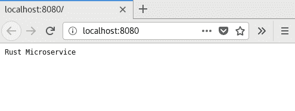
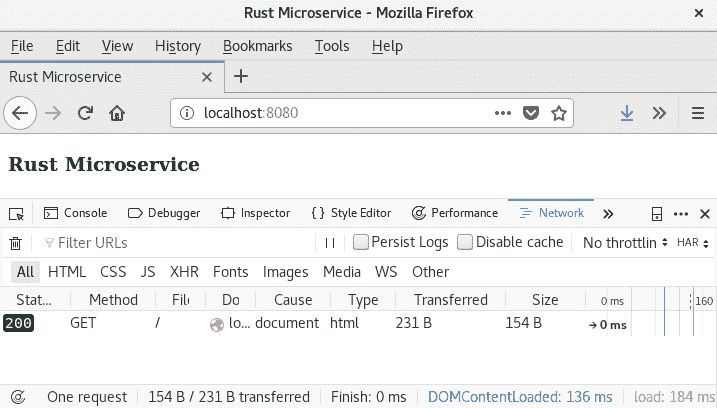
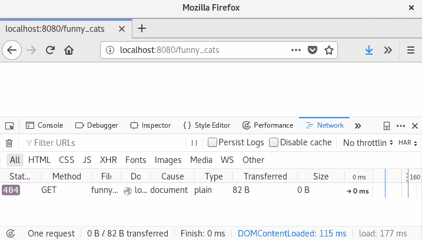
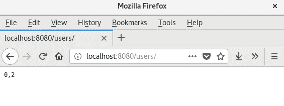

# 第二章：使用 Hyper Crate 开发微服务

本章将简要介绍使用 Rust 和`hyper` crate 创建微服务。我们将探讨 HTTP 协议的基础和路由原则。我们还将描述一个完全使用 Rust 编写的最小 REST 服务，使用简单的方法。

在本章中，我们将介绍以下主题：

+   使用`hyper`

+   处理 HTTP 请求

+   使用正则表达式进行路由

+   从环境中获取参数

# 技术要求

因为我们在本章开始编写代码，所以你需要安装某些软件来编译和运行示例：

+   我建议你使用`rustup`工具，这将保持你的 Rust 实例更新。如果你没有这个工具，你可以从[`rustup.rs/`](https://rustup.rs/)获取它。安装后，运行`rustup update`命令来更新当前安装。

+   Rust 编译器，至少版本 1.31。

+   我们将使用的`hyper` crate，需要 OpenSSL ([`www.openssl.org/`](https://www.openssl.org/)) 库。大多数流行的操作系统已经包含了 OpenSSL 包，你可以遵循你的包管理器的手册来安装它。

你可以从 GitHub 获取本章中显示的示例，网址为[`github.com/PacktPublishing/Hands-On-Microservices-with-Rust/tree/master/Chapter02`](https://github.com/PacktPublishing/Hands-On-Microservices-with-Rust/tree/master/Chapter02)。

# 绑定微型服务器

在本节中，我们将从头开始创建一个 Tiny Server。我们将从必要的依赖项开始，声明一个主函数，然后尝试构建和运行它。

# 添加必要的依赖项

首先，我们需要创建一个新的文件夹，我们将在这个文件夹中添加创建第一个微服务所需的依赖项。使用`cargo`创建一个名为`hyper-microservice`的新项目：

```rs
> cargo new hyper-microservice
```

打开创建的文件夹，并将依赖项添加到你的`Cargo.toml`文件中：

```rs
[dependencies]
hyper = "0.12"
```

单一依赖项是`hyper` crate。这个 crate 的最新版本是异步的，并且建立在`futures` crate 之上。它还使用了`tokio` crate 作为运行时，包括调度器、反应器和异步套接字。`tokio` crate 的一些必要类型在`hyper::rt`模块中被重新导出。`hyper`的主要目的是操作 HTTP 协议，这意味着这个 crate 未来可以支持其他运行时。

# 服务器的主体函数

让我们从主函数开始，逐一添加必要的依赖项，并详细说明为什么我们需要每个依赖项。一个最小化的 HTTP 服务器需要以下内容：

+   绑定的地址

+   一个用于处理传入请求的`server`实例

+   任何请求的默认处理器

+   一个`server`实例将运行的反应器（运行时）

# 服务器的地址

我们首先需要一个地址。套接字地址由 IP 地址和端口号组成。在这本书中，我们将使用 IPv4，因为它得到了广泛的支持。在第六章，*反应式微服务 - 增加容量和性能*，我们将讨论扩展和微服务之间的交互，我会展示一些使用 IPv6 的示例。

标准 Rust 库包含一个`IpAddr`类型来表示 IP 地址。我们将使用包含`IpAddr`和端口号`u16`的`SocketAddr`结构体。我们可以从类型为`([u8; 4], u16)`的元组中构造`SocketAddr`。将以下代码添加到我们的主函数中：

```rs
let addr = ([127, 0, 0, 1], 8080).into();
```

我们在这里使用了一个`impl<I: Into<IpAddr>> From<(I, u16)> for SocketAddr`特质的实现，它反过来使用`impl From<[u8; 4]> for IpAddr`。这使得我们可以使用`.into()`方法调用从元组中构造套接字地址。同样，我们可以使用构造函数创建新的`SocketAddr`实例。在生产应用程序中，我们将从外部字符串（命令行参数或环境变量）解析套接字地址，如果没有设置任何变体，我们将从具有默认值的元组中创建`SocketAddr`。

# 服务器实例

现在我们可以创建一个`server`实例并将其绑定到这个地址：

```rs
let builder = Server::bind(&addr);
```

前一行创建了一个带有`bind`构造函数的`hyper::server::Server`实例，该构造函数实际上返回`Builder`，而不是`Server`实例。`Server`结构体实现了`Future`特质。它具有与`Result`类似的作用，但描述了一个不可立即获得的价值。你将在第五章，*使用 Futures Crate 理解异步操作*中了解更多关于`Future`和`futures`crate 的其他特质。

# 设置请求处理器

`Builder`结构体提供了调整创建的`server`参数的方法。例如，hyper 的`server`支持`HTTP1`和`HTTP2`。你可以使用`builder`值选择一个或两个协议。在下面的示例中，我们使用`builder`通过`serve`方法附加一个处理传入 HTTP 请求的服务：

```rs
let server = builder.serve(|| {
    service_fn_ok(|_| {
        Response::new(Body::from("Almost microservice..."))
    })
});
```

在这里，我们使用构建实例来附加一个生成`Service`实例的函数。这个函数实现了`hyper::service::NewService`特质。生成的项随后必须实现`hyper::service::Service`特质。在`hyper`crate 中的服务是一个接收请求并返回响应的函数。我们没有在这个示例中实现这个特质；相反，我们将使用`service_fn_ok`函数，它将具有合适类型的函数转换为服务处理器。

有两个相应的结构体：`hyper::Request`和`hyper::Response`。在前面的代码中，我们忽略了一个请求参数并为每个请求构造了相同的响应。响应包含静态文本的正文。

# 将服务器实例添加到运行时

由于我们现在已经有了处理器，我们可以启动服务器。运行时期望一个 `Future` 实例，其类型为 `Future<Item = (), Error = ()>`，但 `Server` 结构体实现了一个带有 `hyper::Error` 错误类型的 `Future`。我们可以使用这个错误来通知用户问题，但在我们的例子中我们只会丢弃任何错误。如您所记得，`drop` 函数期望一个任何类型的单个参数，并返回一个 `unit` 空类型。`Future` 特性使用 `map_err` 方法。它通过一个函数改变错误类型，该函数期望原始错误类型并返回一个新的类型。使用以下方式从 `server` 中丢弃错误：

```rs
let server = server.map_err(drop);
```

现在我们已经拥有了所需的一切，可以使用特定的运行时启动 `server`。使用 `hyper::rt::run` 函数启动 `server`：

```rs
hyper::rt::run(server);
```

还不要编译它，因为我们还没有导入类型。将其添加到源文件的开头：

```rs
use hyper::{Body, Response, Server};
use hyper::rt::Future;
use hyper::service::service_fn_ok;
```

我们需要导入我们正在使用的不同 `hyper` 类型：`Server`、`Response` 和 `Body`。在最后一行，我们使用 `service_fn_ok` 函数。`Future` 导入需要特别注意；它是 `futures` 包的重新导出特性，并在 `hyper` 包的每个地方使用。在下一章中，我们将详细检查这个特性。

# 构建和运行

您现在可以编译代码并使用以下命令启动服务器：

```rs
cargo run
```

使用您的浏览器连接到服务器。在浏览器的地址栏中输入 [`localhost:8080/`](http://localhost:8080/)，浏览器将连接到您的服务器并显示您在上一段代码中输入的文本：



# 重建更改

当您在开发网络服务器时，能够即时访问编译和运行的应用程序非常有用。每次更改代码时都必须手动重新启动 `cargo run` 是一件很麻烦的事情。我建议您在 `cargo` 上安装并使用 `cargo-watch` 子命令。这将监视您项目文件中的更改，并重新启动您选择的其它命令。

要安装 `cargo-watch`，执行以下步骤：

1.  在控制台中输入以下命令：

```rs
cargo install cargo-watch
```

1.  使用带有 `watch` 的 `run` 命令：

```rs
cargo watch -x "run"
```

您可以在引号之间添加额外的参数到 `run` 命令，或者添加额外的参数在 `--` 字符之后。

# 处理传入请求

我们已经创建了一个服务器，但直到它能够响应真实请求之前，它并不是很有用。在本节中，我们将向请求添加处理器，并使用 REST 原则。

# 添加服务函数

在上一节中，我们基于 `service_fn_ok` 函数实现了简单的服务，这些函数期望服务函数不抛出任何错误。还有 `service_fn` 函数，可以用来创建可以返回错误的处理器。这些更适合异步 `Future` 结果。如我们之前所见，`Future` 特征有两个关联类型：一个用于成功结果，一个用于错误。`service_fn` 函数期望结果通过 `IntoFuture` 特征转换为 future。您可以在下一章中了解更多关于 `futures` crate 和其类型的信息。

让我们将之前的服务函数改为返回 `Future` 实例的服务函数：

```rs
let server = builder.serve(|| service_fn(microservice_handler));
```

然后添加此未实现的服务函数：

```rs
fn microservice_handler(req: Request<Body>)
    -> impl Future<Item=Response<Body>, Error=Error>
{
    unimplemented!();
}
```

与之前类似，这个函数期望一个 `Request`，但它不返回一个简单的 `Response` 实例。相反，它返回一个 future 结果。由于 `Future` 是一个特征（它没有大小），我们不能从函数中返回一个无大小实体，而必须将其包装在 `Box` 中。然而，在这种情况下，我们使用了全新的方法，即 `impl` 特征。这允许我们通过值返回特征的实现，而不是通过引用。我们的 `future` 可以解析为 `hyper::Response<Body>` 项目或 `hyper::Error` 错误类型。如果您是从头开始的项目并且没有使用本书中包含的代码示例，您应该导入必要的类型：

```rs
use futures::{future, Future};
use hyper::{Body, Error, Method, Request, Response, Server, StatusCode};
use hyper::service::service_fn;
```

我们还从 `futures` crate 中导入了 `Future` 特征。请确保您在 `Cargo.toml` 文件中使用 `edition = "2018"`，或者将 crate 导入到 `main.rs` 中：

```rs
extern crate futures;
extern crate hyper;
```

我们首先将类型导入到代码中，但仍然需要在 `Cargo.toml` 文件中导入 crate。在您的 `Cargo.toml` 文件的依赖列表中添加以下 crate：

```rs
[dependencies]
futures = "0.1"
hyper = "0.12"
```

现在一切准备就绪，可以实现服务处理器。

我更喜欢按泛型到更具体的顺序排列依赖项。或者，您也可以使用字母顺序。

# 实现服务函数

我们的服务函数将支持两种类型的请求：

+   对 `/` 路径的 `GET` 请求带有索引页面响应

+   其他带有 `NOT_FOUND` 响应的请求

要检测对应的方法和路径，我们可以使用 `Request` 对象的方法。请参见以下代码：

```rs
fn microservice_handler(req: Request<Body>)
    -> impl Future<Item=Response<Body>, Error=Error>
{
        match (req.method(), req.uri().path()) {
            (&Method::GET, "/") => {
                future::ok(Response::new(INDEX.into()))
            },
            _ => {
                let response = Response::builder()
                    .status(StatusCode::NOT_FOUND)
                    .body(Body::empty())
                    .unwrap();
                future::ok(response)
            },
        }
}
```

我使用了一个 `match` 表达式来检测从 `req.method()` 函数返回的对应方法，以及 `req.uri().path()` 方法链调用返回的 URI 路径。

`method()` 函数返回对 `Method` 实例的引用。`Method` 是一个枚举，包含所有支持的 HTTP 方法。与返回字符串方法的其它流行语言不同，Rust 使用来自有限枚举的严格方法集。这有助于在编译期间检测拼写错误。

使用`future::ok`函数创建的`Future`实例也会返回。这个函数立即将未来对象解析为对应类型的成功结果。这对于静态值很有用；我们不需要等待它们创建。

未来对象是一个长期操作，不会立即返回结果。运行时会轮询未来对象，直到它返回结果。在数据库上执行异步请求很有用。我们将在第七章，“与数据库的可靠集成”中这样做。

我们也可以返回流而不是整个结果。对于这些情况，`futures`crate 包含一个`Stream`trait。我们将在第五章，“使用 Futures Crate 理解异步操作”中进一步探讨这一点。

在我们的匹配表达式中，我们使用了`Method::GET`和`"/"`路径来检测索引页面的请求。在这种情况下，我们将返回一个`Response`，它构建一个`new`函数和一个 HTML 字符串作为参数。

如果没有找到匹配`_`模式的页面，我们将从`StateCode`枚举返回一个带有`NOT_FOUND`状态码的响应。这包含了 HTTP 协议的所有状态码。

我们使用`body`方法来构建响应，并使用一个空的`Body`作为该函数的参数。为了检查我们之前没有使用它，我们使用`unwrap`来解包`Result`中的`Response`。

# 索引页面

我们最后需要的是一个索引页面。当请求微服务时，返回一些关于微服务的相关信息被认为是好的做法，但出于安全原因，你可能隐藏它。

我们的索引页面是一个包含 HTML 内容的简单字符串：

```rs
const INDEX: &'static str = r#"
 <!doctype html>
 <html>
     <head>
         <title>Rust Microservice</title>
     </head>
     <body>
         <h3>Rust Microservice</h3>
     </body>
 </html>
 "#;
```

这是一个不能修改的常量值。如果你之前没有使用过，请注意字符串的开始`r#"`。这是一种 Rust 中的多行字符串，必须以`"`结尾。

现在，你可以编译代码，并用浏览器查看页面。我打开了开发者工具来显示请求的状态码：



如果你尝试获取一个不存在的资源，你会得到一个`404`状态码，我们使用`StatusCode::NOT_FOUND`常量设置：



# 实现 REST 原则

如果每个人都从头开始创建与微服务交互的规则，我们将有过多私有的通信标准。REST 不是一个严格的规则集，但它是一种旨在使与微服务交互简单的架构风格。它提供了一组建议的 HTTP 方法来创建、读取、更新和删除数据；以及执行操作。我们将向我们的服务添加方法，并使它们符合 REST 原则。

# 添加共享状态

你可能已经听说共享数据是坏事，如果它需要从不同的线程中更改，它可能是瓶颈的潜在原因。然而，如果我们想共享通道的地址或者我们不需要频繁访问它，共享数据是有用的。在本节中，我们需要一个用户数据库。在下面的示例中，我将向你展示如何向我们的生成函数添加共享状态。这种方法可以用于各种原因，例如保持与数据库的连接。

用户数据库显然会存储有关用户的数据。让我们添加一些类型来处理这个问题：

```rs
type UserId = u64;
struct UserData;
```

`UserId`代表用户的唯一标识符。`UserData`代表存储的数据，但在本例中我们使用一个空的 struct 进行序列化和解析流。

我们的数据库将如下所示：

```rs
type UserDb = Arc<Mutex<Slab<UserData>>>;
```

`Arc`是一个原子引用计数器，它为数据的一个实例提供多个引用（在我们的情况下，这是对数据 slab 的`Mutex`）。原子实体可以安全地在多个线程中使用。它使用原生原子操作来禁止引用的克隆。这是因为两个或多个线程可能会损坏引用计数器，并可能导致段错误，如果计数器大于代码中的引用，则可能导致数据丢失或内存泄漏。

`Mutex`是一个互斥包装器，用于控制对可变数据的访问。`Mutex`是一个原子标志，它检查只有一个线程可以访问数据，其他线程必须等待锁定`Mutex`的线程释放它。

你需要考虑到，如果你在一个线程中有一个锁定的`Mutex`，并且该线程崩溃，`Mutex`实例将中毒，如果你尝试从另一个线程锁定它，你会得到一个错误。

你可能想知道为什么我们回顾了这些类型，如果异步服务器可以在单个线程中工作。有两个原因。首先，你可能需要运行服务器在多个线程中进行扩展。其次，所有提供交互设施的类型，如发送对象（来自标准库、`futures` crate 或任何其他地方）或数据库连接，通常都会用这些类型包装，以使它们与多线程环境兼容。了解底层发生的事情可能是有用的。

你可能熟悉标准库中的类型，但`Slab`可能看起来有些不同。这种类型可以被视为网络服务器开发中的银弹。大多数池都使用这种设备。Slab 是一个分配器，可以存储和删除由有序数字标识的任何值。它还可以重用已删除项的槽位。它与`Vec`类型类似，如果你删除元素，它不会调整大小，但会自动重用空闲空间。对于服务器来说，保留连接或请求很有用，例如在 JSON-RPC 协议实现中。

在这种情况下，我们使用`Slab`为用户分配新的 ID，并保留与用户相关的数据。我们使用`Arc`与`Mutex`对来保护我们的数据库，以防止数据竞争，因为不同的响应可以在不同的线程中处理，这两个线程都可能尝试访问数据库。实际上，Rust 不会让你在没有这些包装器的情况下编译代码。

我们必须添加一个额外的依赖项，因为`Slab`类型在外部`slab`crate 中可用。使用`Cargo.toml`添加此依赖项：

```rs
[dependencies]
slab = "0.4"
futures = "0.1"
hyper = "0.12"
```

在`main.rs`文件中导入这些必要的类型：

```rs
use std::fmt;
use std::sync::{Arc, Mutex};
use slab::Slab;
use futures::{future, Future};
use hyper::{Body, Error, Method, Request, Response, Server, StatusCode};
use hyper::service::service_fn;
```

让我们在下一节中编写一个处理函数和一个`main`函数。

# 从服务函数访问共享状态

要访问共享状态，你需要提供共享数据的引用。这很简单，因为我们已经用`Arc`包装了我们的状态，它为我们提供了一个`clone()`函数来复制共享对象的引用。

由于我们的服务函数需要额外的参数，我们必须重新编写定义并调用我们的`microservice_handler`函数。现在它有一个额外的参数，即共享状态的引用：

```rs
fn microservice_handler(req: Request<Body>, user_db: &UserDb)
    -> impl Future<Item=Response<Body>, Error=Error>
```

我们还必须将此预期的引用发送到`main`函数：

```rs
fn main() {
     let addr = ([127, 0, 0, 1], 8080).into();
     let builder = Server::bind(&addr);
     let user_db = Arc::new(Mutex::new(Slab::new()));
     let server = builder.serve(move || {
         let user_db = user_db.clone();
         service_fn(move |req| microservice_handler(req, &user_db))
     });
     let server = server.map_err(drop);
     hyper::rt::run(server);
 }
```

如您所见，我们创建了一个`Slab`，并用`Mutex`和`Arc`将其包装。之后，我们将对象`user_db`移动到使用`move`关键字的`server`构建器的`serve`函数调用中。当引用移动到闭包中时，我们可以将其发送到`microservice_handler`。这是一个由发送到`service_fn`调用的闭包调用的处理函数。我们必须克隆引用以将其移动到嵌套闭包中，因为该闭包可能被多次调用。然而，我们不应该完全移动对象，因为发送到`serve`函数的闭包可能被多次调用，因此运行时可能稍后还需要该对象。

换句话说，这两个闭包都可以被多次调用。`service_fn`的闭包将在与运行时相同的线程中被调用，我们可以使用其中的值引用。

# 在微服务中解析路径

在 Web 开发中，一个常见的任务是使用与持久存储一起工作的函数。这些函数通常被称为**创建**、**读取**、**更新**和**删除**（**CRUD**）函数。它们是与数据最常见操作。

我们可以为我们的服务实现一个 CRUD 集，但首先我们必须确定我们想要与之工作的实体。想象一下，我们需要三种类型的实体：用户、文章和评论。在这种情况下，我建议你分离微服务，因为用户微服务负责身份，文章微服务负责内容，评论微服务处理内容。然而，如果你能将这些实体用于多个上下文，你会得到更多的好处。

在我们实现所有处理函数之前，我们需要一个辅助函数，用于创建带有相应 HTTP 状态码的空响应：

```rs
fn response_with_code(status_code: StatusCode) -> Response<Body> {
    Response::builder()
        .status(status_code)
        .body(Body::empty())
        .unwrap()
}
```

此函数执行几个简单的操作——它期望一个状态码，创建一个新的响应构建器，设置该状态，并添加一个空体。

我们现在可以添加一个新的请求处理程序，该处理程序检查三个路径变体：

+   索引页面（路径`/`）

+   与用户数据相关的操作（前缀`/user/`）

+   其他路径

我们可以使用`match`表达式来满足所有这些情况。将以下代码添加到`microservices_handler`函数中：

```rs
    let response = {
        match (req.method(), req.uri().path()) {
            (&Method::GET, "/") => {
                Response::new(INDEX.into())
            },
            (method, path) if path.starts_with(USER_PATH) => {
                unimplemented!();
            },
            _ => {
                response_with_code(StatusCode::NOT_FOUND)
            },
        }
    };
    future::ok(response)
```

正如你所见，我们在第二个分支中使用了`if`表达式来检测路径是否以`/user/`前缀开头。实际上，这个前缀存储在`USER_PATH`常量中：

```rs
const USER_PATH: &str = "/user/";
```

与前面的例子不同，在这种情况下，我们将使用我们全新的`response_with_code`函数来返回`NOT_FOUND` HTTP 响应。我们还分配了一个响应给`response`变量，并使用它来创建一个`Future`实例，使用`future::ok`函数。

# 实现 REST 方法

我们的服务微件已经可以区分不同的路径。剩下要做的只是实现用户数据的请求处理。所有传入的请求都必须在其路径中包含`/user/`前缀。

# 提取用户的标识符

要修改特定用户，我们需要他们的标识符。REST 规定您需要从路径中获取 ID，因为 REST 将数据实体映射到 URL。

我们可以使用路径的尾部来提取用户的标识符，这是我们已经拥有的。这就是为什么我们使用字符串的`starts_with`方法，而不是检查与`USER_PATH`路径尾部的强等价性。

我们之前声明了`UserId`类型，它等于`u64`无符号数。将以下代码添加到之前声明的`match`表达式的第二个分支中，使用`(method, path)`模式从路径中提取用户的标识符：

```rs
let user_id = path.trim_left_matches(USER_PATH)
        .parse::<UserId>()
        .ok()
        .map(|x| x as usize);
```

`str::trim_left_matches`方法会移除与提供的字符串匹配的字符串部分。之后，我们使用`str::parse`方法，该方法尝试将字符串（剩余的尾部）转换为实现了标准库中`FromStr`特性的类型。`UserId`已经实现了这一点，因为它等于`u64`类型，可以从字符串中解析出来。

解析方法返回`Result`。我们使用`Result::ok`函数将其转换为`Option`实例。我们不会尝试处理 ID 的错误。`None`值表示值的缺失或错误值。

我们还可以使用返回的`Option`实例的映射来将值转换为`usize`类型。这是因为`Slab`使用`usize`作为 ID，但`usize`类型的实际大小取决于平台架构，这可能是不同的。它可以是`u32`或`u64`，这取决于你可以使用的最大内存地址。

为什么我们不能为`UserId`使用`usize`，因为它实现了`FromStr`特性？这是因为客户端期望与 HTTP 服务器相同的行为，而 HTTP 服务器不依赖于架构平台。在 HTTP 请求中使用不可预测的大小参数是不良的做法。

有时，选择一个类型来标识数据可能会有困难。我们使用 `map` 将 `u64` 值转换为 `usize`。然而，在 `usize` 等于 `u32` 的架构中，这不起作用，因为 `UserId` 可能大于内存限制。在微服务很小的案例中这是安全的，但对于你将在生产中使用的微服务来说，这是一个需要牢记的重要点。通常，这个问题很容易解决，因为你可以使用数据库的 ID 类型。

# 获取对共享数据的访问权限

在这个用户处理器中，我们需要访问包含用户的数据库。因为数据库是一个被 `Mutex` 实例包装的 `Slab` 实例，我们必须锁定互斥锁以获得对片段的独占访问。有一个 `Mutex::lock` 函数，它返回 `Result<MutexGuard, PoisonError<MutexGuard>>`。`MutexGuard` 是一个作用域锁，这意味着它会在代码块或作用域内保持，并且它实现了 `Deref` 和 `DerefMut` 特性，以提供对受保护对象下数据的透明访问。

在处理器中报告所有错误是一个好习惯。你可以记录错误并返回一个 `500`（内部错误）HTTP 状态码给客户端。为了保持简单，我们将使用 `unwrap` 方法并期望互斥锁能够正确锁定：

```rs
let mut users = user_db.lock().unwrap();
```

在这里，我们在生成请求的过程中锁定了 `Mutex`。在这种情况下，我们立即创建整个响应，这是正常的。在结果延迟或我们处理流的情况下，我们不应该一直锁定互斥锁。因为这将为所有请求创建瓶颈，因为如果所有请求都依赖于单个共享对象，那么 `服务器` 就不能并行处理请求。对于没有立即得到结果的情况，你可以克隆互斥锁的引用，并在需要访问数据时短暂地锁定它。

# REST 方法

我们希望涵盖所有基本的 CRUD 操作。使用 REST 原则，有适合这些操作的合适的 HTTP 方法——`POST`、`GET`、`PUT` 和 `DELETE`。我们可以使用 `match` 表达式来检测相应的 HTTP 方法：

```rs
match (method, user_id) {
    // Put other branches here
    _ => {
        response_with_code(StatusCode::METHOD_NOT_ALLOWED)
    },
}
```

在这里，我们使用了一个包含两个值的元组——一个方法和一个用户标识符，它由 `Option<UserId>` 类型表示。如果客户端请求一个不支持的方法，有一个默认分支返回 `METHOD_NOT_ALLOWED` 消息（405 HTTP 状态码）。

让我们讨论每个操作的匹配表达式的每个分支。

# POST – 创建数据

当 `服务器` 刚启动时，它不包含任何数据。为了支持数据创建，我们使用不带用户 ID 的 `POST` 方法。将以下分支添加到 `match (method, user_id)` 表达式中：

```rs
(&Method::POST, None) => {
    let id = users.insert(UserData);
    Response::new(id.to_string().into())
}
```

这段代码向用户数据库添加一个 `UserData` 实例，并在带有 `OK` 状态（HTTP 状态码 200）的响应中发送关联的用户 ID。默认情况下，这段代码是由 `Response::new` 函数设置的。

在这种情况下，`UserData`是一个空的 struct。然而，在实际应用中，它必须包含真实数据。我们使用一个空的 struct 来避免序列化，但你可以在第四章中了解更多关于基于`serde`crate 的序列化和反序列化信息，*使用 Serde Crate 进行数据序列化和反序列化*。

如果客户端使用`POST`请求设置 ID，你可以有两种解释方式——忽略它或尝试使用提供的 ID。在我们的例子中，我们将通知客户端请求是错误的。添加以下分支来处理这种情况：

```rs
(&Method::POST, Some(_)) => {
    response_with_code(StatusCode::BAD_REQUEST)
}
```

此代码返回一个带有`BAD_REQUEST`状态码（`400` HTTP 状态码）的响应。

# GET – 读取数据

当数据被创建时，我们需要能够读取它。在这种情况下，我们可以使用 HTTP 的`GET`方法。将以下分支添加到代码中：

```rs
(&Method::GET, Some(id)) => {
     if let Some(data) = users.get(id) {
         Response::new(data.to_string().into())
     } else {
         response_with_code(StatusCode::NOT_FOUND)
     }
 }
```

此代码使用用户数据库尝试通过路径中提供的 ID 查找用户。如果找到用户，我们将将其数据转换为`String`并转换为`Body`以发送响应。

如果找不到用户，处理分支将以`NOT_FOUND`状态码（经典的`404`错误）响应。

要使`UserData`可转换为`String`，我们必须为该类型实现`ToString`trait。然而，通常实现`Display`trait 更有用，因为对于每个实现了`Display`trait 的类型，`ToString`将被自动推导。将以下代码添加到`main.rs`源文件中的某个位置：

```rs
impl fmt::Display for UserData {
    fn fmt(&self, f: &mut fmt::Formatter) -> fmt::Result {
        f.write_str("{}")
    }
}
```

在此实现中，我们返回一个包含空 JSON 对象`"{}"`的字符串。真正的微服务必须使用`serde`trait 进行此类转换。

# PUT – 更新数据

一旦数据被保存，我们可能希望提供修改它的能力。这是`PUT`方法的任务。使用此方法来处理数据的更改：

```rs
(&Method::PUT, Some(id)) => {
    if let Some(user) = users.get_mut(id) {
        *user = UserData;
        response_with_code(StatusCode::OK)
    } else {
        response_with_code(StatusCode::NOT_FOUND)
    }
},
```

此代码尝试使用`get_mut`方法在用户数据库中查找`user`实例。这返回一个包含`Some`选项的可变引用，或者如果找不到相应的值，则返回`None`选项。我们可以使用解引用运算符`*`来替换存储中的数据。

如果找到并替换了用户数据，分支将返回`OK`状态码。如果没有找到请求的 ID 的用户，分支将返回`NOT_FOUND`。

# DELETE – 删除数据

当我们不再需要数据时，我们可以将其删除。这就是`DELETE`方法的目的。在分支中使用它如下：

```rs
(&Method::DELETE, Some(id)) => {
    if users.contains(id) {
        users.remove(id);
        response_with_code(StatusCode::OK)
    } else {
        response_with_code(StatusCode::NOT_FOUND)
    }
},
```

此代码检查`Slab`是否包含数据，并使用`remove`方法将其删除。我们不立即使用`remove`方法，因为它期望数据事先存在于存储中，如果数据不存在，则会引发 panic。

通常，网络服务并没有真正删除数据，而是只是将其标记为已删除。这样做是合理的，因为它允许你稍后探索数据并提高服务或公司的效率。然而，这是一种风险行为。用户应该能够完全删除他们的数据，因为敏感数据可能构成威胁。新的法律，如 GDPR 法律([`en.wikipedia.org/wiki/General_Data_Protection_Regulation`](https://en.wikipedia.org/wiki/General_Data_Protection_Regulation))，保护用户对其数据的所有权，并规定数据保护的一些要求。违反这些法律可能会导致罚款。当你处理敏感数据时，记住这一点很重要。

# 路由高级请求

在前面的示例中，我们使用了模式匹配来检测请求的目的地。这不是一种灵活的技术，因为路径通常包含必须考虑的额外字符。例如，`/user/1/`路径包含尾随斜杠，***`/`***，在微服务的上一个版本中无法与用户 ID 一起解析。有一个灵活的工具可以解决这个问题：正则表达式。

# 使用正则表达式定义路径

正则表达式是一系列字符，用于表达在字符串中要搜索的图案。正则表达式提供给你创建小解析器的功能，这些解析器使用正式声明将文本分割成部分。Rust 有一个名为`regex`的 crate，这是正则表达式组合的流行缩写。你可以在这里了解更多关于这个 crate 的信息：[`crates.io/crates/regex`](https://crates.io/crates/regex)。

# 添加必要的依赖项

要在我们的`server`中使用正则表达式，我们需要两个 crate：`regex`和`lazy_static`。第一个提供了`Regex`类型，用于创建和匹配字符串中的正则表达式。第二个帮助在静态上下文中存储`Regex`实例。我们可以将常量值赋给静态变量，因为它们在程序加载到内存时创建。为了使用复杂表达式，我们必须添加初始化代码并使用它来执行表达式，将结果赋给静态变量。`lazy_static` crate 包含一个`lazy_static!`宏来自动完成这项工作。这个宏创建一个静态变量，执行一个表达式，并将评估后的值赋给该变量。我们还可以使用局部变量而不是静态变量，在局部上下文中为每个请求创建一个正则表达式对象。然而，这会占用运行时开销，因此最好提前创建并重用它。

将这两个依赖项添加到`Cargo.toml`文件中：

```rs
[dependencies]
slab = "0.4"
futures = "0.1"
hyper = "0.12"
lazy_static = "1.0"
regex = "1.0"
```

除了上一个示例中的`main.rs`源文件中的导入之外，还需要添加两个导入：

```rs
use lazy_static::lazy_static;
use regex::Regex;
```

我们将使用`lazy_static`宏和`Regex`类型来构建一个正则表达式。

# 编写正则表达式

正则表达式包含一种特殊语言，用于编写模式以从字符串中提取数据。我们需要为我们的示例编写三个模式：

+   索引页面路径

+   用户管理路径

+   用户列表路径（我们示例服务器的全新功能）

有一个 `Regex::new` 函数可以创建正则表达式。删除之前的 `USER_PATH` 常量，并在懒静态块中添加三个新的正则表达式常量：

```rs
lazy_static! {
    static ref INDEX_PATH: Regex = Regex::new("^/(index\\.html?)?$").unwrap();
    static ref USER_PATH: Regex = Regex::new("^/user/((?P<user_id>\\d+?)/?)?$").unwrap();
    static ref USERS_PATH: Regex = Regex::new("^/users/?$").unwrap();
}
```

如你所见，正则表达式看起来很复杂。为了更好地理解它们，让我们分析它们。

# 索引页面路径

`INDEX_PATH` 表达式匹配以下路径：

+   *`/`*

+   *`/index.htm`*

+   *`/index.html`*

匹配这些路径的表达式是 `"^/(index\\.html?)?$"`。

`^` 符号表示必须有字符串的开始，而 `$` 符号表示必须有字符串的结束。当我们将这些符号放在两边时，我们防止路径中的所有前缀和后缀，并期望精确匹配。

`( )` 括号表示必须有组。组中的表达式被视为一个不可分割的单位。

`?` 符号表示前面的字符是可选的。我们将它放在 `l` 字符后面，以允许路径中的文件具有 `.htm` 和 `.html` 扩展名。正如你稍后看到的，我们没有索引文件可以读取。我们将其用作根路径处理器的别名。问号也用于整个组（带有文件名）之后，以适应空根路径，*`/`*。

点符号 (`.`) 匹配任何字符，但我们需要一个真正的点符号。为了将点作为符号处理，我们必须在它前面添加一个反斜杠 (`\`)。然而，单个反斜杠将被解释为开始转义表达式，因此我们必须使用一对反斜杠 (`\\`) 来使反斜杠成为一个普通符号。

所有其他字符都按原样处理，包括 `/` 符号。

# 用户管理路径

`USER_PATH` 表达式可以匹配以下路径：

+   `/user/`

+   `/user/<id>`，其中 `<id>` 表示数字组

+   `/user/<id>/`，与上一个相同，但有一个尾随反斜杠

这些情况可以用 `"^/user/((?P<user_id>\\d+?)/?)?$"` 正则表达式来处理。这个表达式有点复杂。它包括两个组（一个是嵌套的）和一些其他奇怪的字符。让我们更仔细地看看。

`?P<name>` 是一个分组属性，用于设置捕获组的名称。每个括号中的组都可以通过 `regex::Captures` 对象访问。命名组可以通过名称访问。

`\\d` 是一个特殊表达式，用于匹配任何数字。为了指定我们有一个或多个数字，我们应该添加 `+` 符号，它告诉我们可能有多少重复。`*` 符号也可以添加，它告诉我们可以有零个或多个重复，但我们还没有在我们的正则表达式中使用它。

有两个组。第一个是嵌套的，名称为`user_id`。它必须只包含数字，才能解析为`UserId`类型。第二个是一个包含可选尾随斜杠的包围组。整个组是可选的，这意味着表达式可以包含没有标识符的`/user/`路径。

# 用户列表的路径

`USERS_PATH`是一个新的模式，我们在前面的例子中没有。我们将使用它来在`server`上返回用户的全列表。此模式仅适合路径的两个变体：

+   `/users/` （带有尾随斜杠）

+   `/users` （不带尾随斜杠）

处理这些情况的正则表达式相当简单：`"^/users/?$"`。我们已经看到了这个模式中的所有符号。它期望一个以`^`符号和斜杠符号开始的字符串。之后，它期望以`users`结尾，尾部可以有可选的斜杠`/?`。最后，它期望字符串的结尾有`$`符号。

# 匹配表达式

我们必须重新组织`microservice_handler`的代码，因为我们不能在`match`表达式中使用正则表达式。我们必须提取以路径开头的的方法，因为我们需要它在大多数响应中：

```rs
let response = {
    let method = req.method();
    let path = req.uri().path();
    let mut users = user_db.lock().unwrap();

    // Put regular expressions here
};
futures::ok()
```

我们首先检查的是索引页面的请求。添加以下代码：

```rs
if INDEX_PATH.is_match(path) {
    if method == &Method::GET {
        Response::new(INDEX.into())
    } else {
        response_with_code(StatusCode::METHOD_NOT_ALLOWED)
    }
```

这使用`INDEX_PATH`正则表达式来检查请求的路径是否与索引页面请求匹配，使用`Regex::is_match`方法，该方法返回一个`bool`值。在这里，我们正在检查请求的方法，所以只允许`GET`。

然后，我们将继续`if`子句，为用户列表请求提供一个替代条件：

```rs
} else if USERS_PATH.is_match(path) {
    if method == &Method::GET {
        let list = users.iter()
            .map(|(id, _)| id.to_string())
            .collect::<Vec<String>>()
            .join(",");
        Response::new(list.into())
    } else {
        response_with_code(StatusCode::METHOD_NOT_ALLOWED)
    }
```

此代码使用`USERS_PATH`模式来检查客户端是否请求了用户列表。这是一个新的路径路由。之后，我们遍历数据库中的所有用户，并将它们的 ID 连接成一个字符串。

以下代码用于处理 REST 请求：

```rs
} else if let Some(cap) = USER_PATH.captures(path) {
    let user_id = cap.name("user_id").and_then(|m| {
        m.as_str()
            .parse::<UserId>()
            .ok()
            .map(|x| x as usize)
    });
    // Put match expression with (method, user_id) tuple
```

此代码使用`USER_PATH`和`Regex::captures`方法。它返回一个包含所有捕获组值的`Captures`对象。如果模式不匹配方法，它返回一个`None`值。如果模式匹配，我们得到存储在`cap`变量中的对象。`Captures`结构体有`name`方法，可以通过名称获取捕获值。我们使用`user_id`作为组的名称。此组可以是可选的，`name`方法返回一个`Option`。我们使用`and_then`方法将`Option`替换为解析后的`UserId`。最后，`user_id`变量采用`Option<UserId>`值，与我们的微服务的前一个版本相同。为了避免重复，我跳过了请求与（`method`，`user_id`）元组相同的块——只需从本章前一部分的例子中复制这部分即可。

最后的部分是一个默认处理程序，它返回一个带有`NOT_FOUND`状态码的响应：

```rs
} else {
    response_with_code(StatusCode::NOT_FOUND)
}
```

服务现在已经完整，因此可以编译并运行。在第十三章《测试和调试 Rust 微服务》中，您将了解到如何调试微服务。然而，目前您可以使用`curl`命令发送一些`POST`请求，并在浏览器中检查结果。在 shell 中输入以下命令以添加三个用户并删除 ID 为`**1**`的第二个用户：

```rs
$ curl -X POST http://localhost:8080/user/
0
$ curl -X POST http://localhost:8080/user/
1
$ curl -X POST http://localhost:8080/user/
2
$ curl -X DELETE http://localhost:8080/user/1
$ curl http://localhost:8080/users
0,2
```

如果你从浏览器中获取用户列表，它应该显示以下内容：



如您所见，我们使用`curl`时没有使用尾随斜杠的`/users`请求，而在浏览器中使用带有尾随斜杠的**`/users/`**。这个结果意味着正则表达式和请求路由都正常工作。

# 摘要

在本章中，我们使用`hyper` crate 创建了一个微服务。我们从一个仅响应`*Rust Microservice*`消息的最小示例开始。然后，我们创建了一个具有两个不同路径的微服务——第一个是索引页面请求，第二个是`NOT_FOUND`响应。

在学习了基础知识之后，我们开始使用`match`表达式使微服务符合 REST 规范。我们还添加了处理用户数据的四种基本操作——创建、读取、更新和删除。

为了扩展本章最后示例中的路由功能，我们实现了基于正则表达式的路由。正则表达式是紧凑的模式，用于检查和从文本中提取数据。

在本章中，我们遇到了各种 crate——`hyper`、`futures`、`slab`、`regex`和`lazy_static`。我们将在下一章详细讨论这些内容。

由于我们在下一章学习了如何创建最小化的 HTTP 微服务，我们将学习如何使其可配置，以及如何将其与日志关联，因为微服务在远程服务器上运行，我们需要一个无需重新编译即可配置它的能力，并且能够查看所有在微服务中发生的日志问题。
