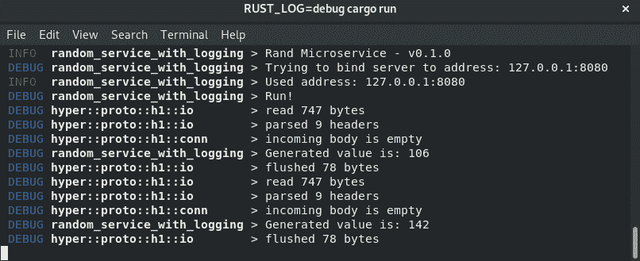

# 日志和配置微服务

微服务在现实世界中工作，这是一个动态的环境。为了有用，它们必须可配置，以便你可以更改地址或端口以绑定服务器的套接字。通常，你需要设置令牌、密钥和其他微服务的地址。即使你已经正确配置了它们，你的微服务也可能失败。在这种情况下，你需要能够使用服务器的日志。

在本章中，我们将学习以下技能：

+   如何使用`log` crate 进行日志记录

+   如何使用`clap` crate 读取命令行参数

+   如何使用`dotenv` crate 读取环境变量

+   如何声明和使用配置文件

# 技术要求

本章解释了如何将日志添加到服务中，并解析配置微服务所需的命令行参数或环境变量。除了 Rust 编译器（版本 1.31 或更高版本）之外，你不需要任何特殊的软件。使用 rustup 工具进行安装。

你可以在 GitHub 上找到本章示例的代码：[`github.com/PacktPublishing/Hands-On-Microservices-with-Rust-2018/tree/master/Chapter3`](https://github.com/PacktPublishing/Hands-On-Microservices-with-Rust-2018/tree/master/Chapter3)。

# 将日志添加到微服务中

如果微服务没有记录它执行的操作，我们就无法使用或调试微服务。在本节中，我们将开始使用我们的微服务进行日志记录，以了解它们内部发生了什么。我们将创建一个生成随机值的微服务，并将其附加到微服务上以记录其执行的操作。之后，我们将使用环境变量配置日志。

# 随机值生成微服务

要讨论这些更高级的话题，我们需要一个比生成*hello*消息更有用目的的微服务架构。我们将创建一个用于生成随机值的微服务应用程序。这足够简单，足以为我们提供足够的机会来使用日志和配置。

然而，我们不会完全从头开始；让我们以前一章的例子为基础，并添加一个依赖项：

```rs
[dependencies]
hyper = "0.12"
rand = "0.5"
```

`rand` crate 提供了在 Rust 中生成随机值所需的实用工具。在`main.rs`文件中导入必要的类型：

```rs
use hyper::{Body, Response, Server};
use hyper::rt::Future;
use hyper::service::service_fn_ok;
```

在`service_fn_ok`函数中添加两行以处理传入的请求：

```rs
fn main() {
    let addr = ([127, 0, 0, 1], 8080).into();
    let builder = Server::bind(&addr);
    let server = builder.serve(|| {
        service_fn_ok(|_| {
            let random_byte = rand::random::<u8>();
            Response::new(Body::from(random_byte.to_string()))
        })
    });
    let server = server.map_err(drop);
    hyper::rt::run(server);
}
```

要了解更多关于前面代码的信息，请参阅前一章，其中我们探讨了`hyper` crate。

如你所见，我们在提供给`service_fn_ok`函数的闭包中添加了两行。第一行使用`rand` crate 的`random`函数生成随机字节。我们在`rand::random::<u8>()`调用中将生成的类型设置为类型参数。现在，`u8`是一个无符号字节整数。

在第二行，我们简单地将生成的字节转换为字符串，并将其作为`Response`的`Body`返回。尝试运行代码以测试它：


从前面的屏幕截图可以看出，该服务成功返回了生成的随机值。

# 日志 crate

日志记录是记录程序活动的过程。日志可以是特定格式的文本流，它打印到控制台或写入文件。Rust 有一个基于`log` crate 的优秀的日志生态系统。值得注意的是，`log` crate 包含宏但没有实际的日志实现。这给了你根据需要使用不同日志记录器的机会。在本节中，我们将开始在微服务中使用 log crate，以了解日志级别的工作原理以及如何设置您想要看到的日志级别。

# 日志记录器

实际上包含在某些 crate 中的日志实现如下：

+   `env_logger`

+   `simple_logger`

+   `simplelog`

+   `pretty_env_logger`

+   `stderrlog`

+   `flexi_logger`

+   `log4rs`

+   `fern`

在这些日志实现之间进行选择可能很困难。我建议您在[crates.io](http://crates.io)上探索它们，以了解它们之间的差异。最受欢迎的是`env_logger`，这是我们将要使用的一个。`env_logger`读取`RUST_LOG`环境变量来配置日志并将日志打印到`stderr`。还有一个基于`env_logger`的`pretty_env_logger` crate，它以紧凑和彩色格式打印日志。两者都使用相同的环境变量进行配置。

`stderr`是三个标准流之一——`stdin`*，*其中您的程序通过控制台读取输入数据； `stdout`*，*程序发送输出数据；和 `stderr`*，*具有显示错误或其他与应用程序相关信息的特殊用途。日志记录器通常使用`stderr`以避免影响输出数据。例如，假设您有一个解码输入流的工具。您希望工具只将解码后的数据发送到输出流。程序将如何通知您它遇到的问题？在这种情况下，我们可以使用`stderr`流，它作为一个输出流工作，但不会污染`stdout`？有一个`stderr`流，它作为一个输出流工作，但不会污染`stdout`。

将日志记录器添加到您的`Cargo.toml`文件的依赖项列表中：

```rs
[dependencies]
log = "0.4"
pretty_env_logger = "0.2"
hyper = "0.12"
rand = "0.5"
```

然后将这些类型添加到您的`main.rs`文件中：

```rs
use hyper::{Body, Response, Server};
use hyper::rt::Future;
use hyper::service::service_fn_ok;
use log::{debug, info, trace};
```

# 日志级别

如我们之前讨论的，使用`log` crate，我们需要导入以下日志宏。我们可以使用以下：

+   `trace!`

+   `debug!`

+   `info!`

+   `warn!`

+   `error!`

这些按它们打印的信息的重要性排序，其中`trace!`是最不重要的，而`error!`是最重要的：

+   `trace!`: 用于打印关于任何关键活动的详细信息。它允许 Web 服务器跟踪任何传入的数据块。

+   `debug!`: 用于较少冗余的消息，例如传入的服务器请求。它对调试很有用。

+   `info!`: 用于重要信息，如运行时或服务器配置。在库 crate 中很少使用。

+   `warn!`：通知用户关于非关键错误，例如如果客户端使用了损坏的 cookie，或者必要的微服务暂时不可用，并且使用缓存数据作为响应。

+   `error!`：提供关于关键错误的警报。这用于数据库连接中断的情况。

我们直接从`log`crate 中导入了必要的宏。

# 记录日志

没有代码的上下文数据，日志记录是没有用的。每个日志宏都期望一个可以包含位置参数的文本消息。例如，看看`println!`宏：

```rs
debug!("Trying to bind server to address: {}", addr);
```

上述代码将适用于实现了`Display`特质的类型。就像在`println!`宏中一样，你可以添加实现了`Debug`特质的类型，并使用`{:?}`格式化器。对于你的代码中的所有类型使用`#[derive(Debug)]`并设置整个 crate 的`#![deny(missing_debug_implementations)]`属性是有用的。

# 消息的自定义级别

级别在日志记录过程中起着重要的作用。它们用于根据优先级过滤记录。如果你为`logger`设置了`info`级别，它将跳过所有`debug`和`trace`记录。显然，在调试目的时需要更详细的日志记录，而在生产中使用服务器时则需要更简略的日志记录。

内部，`log`crate 的每个宏都使用`log!`宏，该宏有一个参数用于设置级别：

```rs
log!(Level::Error, "Error information: {}", error);
```

它需要一个`Level`枚举的实例，该枚举有以下变体——`Trace`、`Debug`、`Info`、`Warn`和`Error`。

# 检查日志是否启用

有时，日志记录可能需要很多资源。在这种情况下，你可以使用`log_enabled!`宏来检查是否已启用某个日志级别：

```rs
if log_enabled!(Debug) {
    let data = get_data_which_requires_resources();
    debug!("expensive data: {}", data);
}
```

# 自定义目标

每个日志记录都有一个目标。一个典型的日志记录看起来如下：



日志记录包含日志级别、时间（在此输出中未显示）、目标和消息。你可以将目标视为一个命名空间。如果没有指定目标，`log`crate 将使用`module_path!`宏来设置一个。我们可以使用目标来检测错误或警告发生的位置，或者用它来按名称过滤记录。我们将在下一节中看到如何通过环境变量设置过滤。

# 使用日志记录

我们现在可以为我们的微服务添加日志记录。在以下示例中，我们将打印关于套接字地址、传入请求和生成的随机值的信息：

```rs
fn main() {
     logger::init();
     info!("Rand Microservice - v0.1.0");
     trace!("Starting...");
     let addr = ([127, 0, 0, 1], 8080).into();
     debug!("Trying to bind server to address: {}", addr);
     let builder = Server::bind(&addr);
     trace!("Creating service handler...");
     let server = builder.serve(|| {
         service_fn_ok(|req| {
             trace!("Incoming request is: {:?}", req);
             let random_byte = rand::random::<u8>();
             debug!("Generated value is: {}", random_byte);
             Response::new(Body::from(random_byte.to_string()))
         })
     });
     info!("Used address: {}", server.local_addr());
     let server = server.map_err(drop);
     debug!("Run!");
     hyper::rt::run(server);
 }
```

使用日志记录相当简单。我们可以使用宏来打印套接字的地址以及请求和响应的信息。

# 使用变量配置记录器

有一些环境变量可以用来配置记录器。让我们看看每个变量。

# RUST_LOG

编译此示例。要使用激活的日志记录器运行它，您必须设置`RUST_LOG`环境变量。`env_logger`包读取它，并使用此变量的过滤器配置日志记录器。必须使用相应的日志级别配置`logger`实例。

您可以全局设置`RUST_LOG`变量。如果您使用 Bash shell，您可以在`.bashrc`文件中设置它。

您可以在`cargo run`命令之前临时设置`RUST_LOG`：

```rs
RUST_LOG=trace cargo run
```

然而，这也会打印大量的`cargo`工具和编译器记录，因为 Rust 编译器也使用`log`包进行日志记录。您可以通过名称过滤排除所有记录，除了您程序中的记录。您只需要使用目标名称的一部分，如下所示：

```rs
 RUST_LOG=random_service=trace,warn cargo run
```

此`RUST_LOG`变量的值通过`warn`级别过滤所有记录，并为以`random_service`前缀开始的目标使用`trace`级别。

# RUST_LOG_STYLE

`RUST_LOG_STYLE`变量设置打印记录的样式。它有三个变体：

+   **auto**：尝试使用样式字符

+   **always**：始终使用样式字符

+   **never**：关闭样式字符

以下是一个示例：

```rs
RUST_LOG_STYLE=auto cargo run
```

我建议您使用`never`值，如果您将`stderr`输出重定向到文件，或者您想使用`grep`或`awk`提取具有特殊模式的值。

# 将`RUST_LOG`变量更改为您自己的

如果您发布自己的产品，您可能需要更改`RUST_LOG`和`RUST_LOG_STYLE`变量的名称。`env_logger`的新版本包含一个用于修复此问题的`init_from_env`特殊函数。它期望一个参数——一个`Env`对象的实例。请看以下代码：

```rs
let env = env_logger::Env::new()
    .filter("OWN_LOG_VAR")
    .write_style("OWN_LOG_STYLE_VAR");
env_logger::init_from_env(env);
```

它创建一个`Env`实例，并将`OWN_LOG_VAR`变量设置为配置日志，将`OWN_LOG_STYLE_VAR`变量设置为控制日志的样式。当创建`env`对象时，我们将将其用作`env_logger`包的`init_from_env`函数调用的参数。

# 读取环境变量

在上一个示例中，我们使用`RUST_LOG`环境变量的值来设置日志记录的过滤参数。我们还可以使用其他环境变量来设置服务器的参数。在以下示例中，我们将使用`ADDRESS`环境变量来设置我们想要绑定的套接字地址。

# 标准库

`std::env`标准模块中提供了足够多的函数来处理环境变量。它包含`var`函数来读取外部值。如果变量存在，此函数返回一个包含变量`String`值的`Result`，如果不存在，则返回一个`VarError`错误。将`env`模块的导入添加到您的`main.rs`文件中：

```rs
use std::env;
```

我们需要替换以下行：

```rs
let addr = ([127, 0, 0, 1], 8080).into();
```

替换为以下内容：

```rs
let addr = env::var("ADDRESS")
    .unwrap_or_else(|_| "127.0.0.1:8080".into())
    .parse()
    .expect("can't parse ADDRESS variable");
```

新代码读取`ADDRESS`值。如果此值不存在，我们不会让代码抛出 panic。相反，我们将使用`unwrap_or_else`方法调用将其替换为默认值`"127.0.0.1:8080"`。由于`var`函数返回一个`String`，我们还需要使用`into`方法调用将`&'static str`转换为`String`实例。

如果我们无法解析地址，我们将在`except`方法调用中抛出 panic。

您的服务器现在将使用`addr`变量，该变量从`ADDRESS`环境变量或默认值中获取值。

环境变量是配置应用程序的一种简单方式。它们也广泛得到托管或云平台和 Docker 容器的支持。

记住，所有敏感数据都对主机系统管理员可见。在 Linux 中，系统管理员可以通过使用`cat /proc/`pidof random-service-with-env`/environ` | tr '\0' '\n''`命令来读取这些数据。这意味着将比特币钱包的密钥设置为环境变量不是一个好主意。

# 使用`.env`文件

设置许多环境变量很耗时。我们可以通过使用配置文件来简化这一点，我们将在本章末尾进一步探讨。然而，在包或依赖项使用环境变量的情况下，不能使用配置文件。

为了使这个过程简单，我们可以使用`dotenv`包。这个包用于从文件中设置环境变量。这种做法作为*十二要素应用*方法的一部分出现（[`12factor.net/`](https://12factor.net/)*）。

*十二要素应用*方法是一种构建**软件即服务**（**SaaS**）应用程序的方法，旨在实现以下三个目标：

+   声明式格式配置

+   与操作系统和云的最大可移植性

+   持续部署和扩展

这种方法鼓励你使用环境变量来配置应用程序。*十二要素应用*方法不需要配置磁盘空间，并且具有极高的可移植性，这意味着所有操作系统都支持环境变量。

# 使用`dotenv`包

`dotenv`包允许你在名为`.env`的文件中设置环境变量，并将它们与以传统方式设置的环境变量连接起来。你不需要手动读取此文件。你只需要添加依赖项并调用包的初始化方法。

将此包添加到`dependencies`列表中：

```rs
dotenv = "0.13"
```

将以下导入添加到上一个示例的`main.rs`文件中，以使用`dotenv`包：

```rs
use dotenv::dotenv;
use std::env;
```

使用`dotenv`函数初始化它，该函数将尝试找到`.env`文件。它将返回一个包含此文件路径的`Result`。如果文件未找到，调用`Result`的`ok`方法来忽略它。

# 向`.env`文件添加变量

`.env`文件包含环境变量的名称和值对。对于我们的服务，我们将设置`RUST_LOG`、`RUST_BACKTRACE`和`ADDRESS`变量：

```rs
RUST_LOG=debug
RUST_BACKTRACE=1
ADDRESS=0.0.0.0:1234
```

如你所见，我们将`logger`的所有目标都设置为`debug`级别，因为`cargo`不使用`dotenv`，因此跳过了这些设置。

`RUST_BACKTRACE`变量设置标志，在应用程序发生 panic 时打印应用程序的回溯。

将此文件存储在运行应用程序的工作目录中。你可以有多个文件，并使用它们进行不同的配置。此文件格式也与 Docker 兼容，可以用于设置容器的变量。

我建议你将`.env`文件添加到`.gitignore`中，以防止敏感或本地数据的泄露。这意味着每个与你的项目一起工作的用户或开发者都有自己的环境和需要他们自己的`.env`文件版本。

# 解析命令行参数

环境变量对于与容器一起使用很有用。如果你从控制台使用应用程序或想避免与其他变量名称冲突，你可以使用命令行参数。这是开发者设置程序参数的更传统方式。

你也可以使用`env`模块获取命令行参数。它包含`args`函数，该函数返回一个`Args`对象。此对象不是一个数组或向量，但它可迭代，你可以使用`for`循环处理所有命令行参数：

```rs
for arg in env::args() {
    // Interpret the arg here
}
```

在简单情况下，这个变体可能很有用。然而，对于具有复杂规则的参数解析，你必须使用命令行参数解析器。`clap`crate 中包含了一个很好的实现。

# 使用`clap`crate

要使用`clap`crate 解析参数，你必须构建一个解析器并使用它来处理参数。要构建解析器，你首先创建一个`App`类型的实例。要使用它，添加所有必要的导入。

# 添加依赖项

在`Cargo.toml`中添加依赖项：

```rs
clap = "2.32"
```

此 crate 提供了一些有用的宏，用于添加关于程序元信息。具体如下：

+   `crate_name!`：返回 crate 的名称

+   `crate_version!`：返回 crate 的版本

+   `crate_authors!`：返回作者列表

+   `crate_description!`：提供 crate 的描述

这些宏的所有信息都来自`Cargo.toml`文件。

导入必要的类型。我们需要两个类型，即`App`和`Arg`，以及之前提到的宏：

```rs
use clap::{crate_authors, crate_description, crate_name, crate_version, Arg, App};
```

# 构建解析器

构建解析器的过程相当简单。你将创建一个`App`实例，并用`Arg`实例填充此类型。`App`还有可以用来设置应用程序信息的方法。将以下代码添加到我们服务器的`main`函数中：

```rs
let matches = App::new(crate_name!())
         .version(crate_version!())
         .author(crate_authors!())
         .about(crate_description!())
         .arg(Arg::with_name("address")
              .short("a")
              .long("address")
              .value_name("ADDRESS")
              .help("Sets an address")
              .takes_value(true))
         .arg(Arg::with_name("config")
              .short("c")
              .long("config")
              .value_name("FILE")
              .help("Sets a custom config file")
              .takes_value(true))
        .get_matches();
```

首先，我们使用`new`方法创建一个`App`实例，该方法期望接收 crate 的名称。我们使用`crate_name!`宏提供这个名称。之后，我们使用`version`、`author`和`about`方法通过相应的宏设置这些数据。我们可以链式调用这些方法，因为每个方法都会消耗并返回更新后的`App`对象。当我们设置应用程序的元信息时，我们必须使用`arg`方法声明支持的参数。

要添加一个参数，我们必须使用`with_name`方法创建一个`Arg`实例，提供名称，并使用链式方法调用设置额外的参数。我们可以使用`short`方法设置参数的简写形式，使用`long`方法设置长写形式。你可以使用`value_name`方法为生成的文档设置值的名称。你可以使用`help`方法提供参数的描述。`takes_value`方法用于指示此参数需要值。还有一个`required`方法用于指示选项是必需的，但在这里我们没有使用它。在我们的服务器中，所有选项都是可选的。

我们使用这些方法添加了`--address`参数，用于设置我们将用于绑定服务器的套接字地址。它还支持参数的简写形式`a`。我们将在稍后读取这个值。

服务器将支持`--config`参数来设置配置文件。我们已经将此参数添加到构建器中，但我们将在本章的下一节中使用它。

在我们创建构建器之后，我们调用`get_matches`方法。这个方法读取`std::env::args_os`中的参数，并返回一个`ArgMatches`实例，我们可以使用它来获取命令行参数的值。我们将它分配给`matches`局部变量。

我们应该在任何日志调用之前添加`get_matches`方法，因为它也会打印帮助信息。我们应该避免打印带有帮助描述的日志。

# 阅读参数

要读取参数，`ArgMatches`包含一个`value_of`方法，其中你可以添加一个参数的名称。在这种情况下，使用常量很方便，可以避免输入错误。提取`--address`参数，如果它不存在，则检查`ADDRESS`环境变量。这意味着命令行参数的优先级高于环境变量，并且你可以使用命令行参数覆盖`.env`文件中的参数：

```rs
let addr = matches.value_of("address")
    .map(|s| s.to_owned())
    .or(env::var("ADDRESS").ok())
    .unwrap_or_else(|| "127.0.0.1:8080".into())
    .parse()
    .expect("can't parse ADDRESS variable");
```

在这段代码中，我们将所有提供的字符串引用转换为`&str`类型的实体`String`对象。如果你想在代码的后续部分使用这个对象，或者需要将其移动到其他地方，这很有用。

# 用法

当你在你的应用程序中使用`clap`crate 时，你可以使用命令行参数来调整它。`clap`crate 添加了一个`--help`参数，用户可以使用它来打印有关所有参数的信息。这个描述是由 crate 自动生成的，如下面的示例所示：

```rs
$ ./target/debug/random-service-with-args --help
random-service-with-env 0.1.0
Your Name
Rust Microservice

USAGE:
 random-service-with-env [OPTIONS]

FLAGS:
 -h, --help       Prints help information
 -V, --version    Prints version information

OPTIONS:
 -a, --address <ADDRESS>    Sets an address
 -c, --config <FILE>        Sets a custom config file
```

我们的应用程序成功打印了用法信息：它提供了所有标志、选项和用法变体。如果你需要添加自己的帮助描述，可以使用 `App` 实例的 `help` 方法设置任何字符串作为帮助信息。

如果你使用 `cargo run` 命令，你还可以在 `--` 参数之后设置命令行参数。这意味着它停止读取 `run` 命令，并将所有剩余的参数传递给正在运行的应用程序：

```rs
$ cargo run -- --help
```

现在，你可以使用 `--address` 参数并设置值为来启动服务器：

```rs
$ cargo run -- --address 0.0.0.0:2345
```

服务器已启动并向控制台打印：

```rs
    Finished dev [unoptimized + debuginfo] target(s) in 0.10s                                                                                             Running `target/debug/random-service-with-args --address '0.0.0.0:2345'`
 INFO 2018-07-26T04:23:52Z: random_service_with_env: Rand Microservice - v0.1.0
DEBUG 2018-07-26T04:23:52Z: random_service_with_env: Trying to bind server to address: 0.0.0.0:2345
 INFO 2018-07-26T04:23:52Z: random_service_with_env: Used address: 0.0.0.0:2345
DEBUG 2018-07-26T04:23:52Z: random_service_with_env: Run!
DEBUG 2018-07-26T04:23:52Z: tokio_reactor::background: starting background reactor
```

# 如何添加子命令

一些流行的应用程序，例如 `cargo` 和 `docker`，使用子命令在单个二进制文件内提供多个命令。我们也可以使用 `clap` 包来支持子命令。一个微服务可能有两个命令：一个用于运行服务器，另一个用于生成 HTTP 甜点的密钥。看看下面的代码：

```rs
let matches = App::new("Server with keys")
    .setting(AppSettings::SubcommandRequiredElseHelp)
    .subcommand(SubCommand::with_name("run")
        .about("run the server")
        .arg(Arg::with_name("address")
            .short("a")
            .long("address")
            .takes_value(true)
            .help("address of the server"))
    .subcommand(SubCommand::with_name("key")
        .about("generates a secret key for cookies")))
    .get_matches();
```

在这里，我们使用了两种方法。`setting` 方法调整构建器，你可以使用 `AppSettings` 枚举的变体来设置它。`SubcommandRequiredElseHelp` 方法要求我们使用子命令，如果没有提供子命令，则打印帮助信息。要添加子命令，我们使用 `subcommand` 方法，并使用通过 `with_name` 方法创建的 `SubCommand` 实例。子命令实例也有设置子命令元信息的方法，就像我们对 `App` 实例所做的那样。子命令也可以接受参数。

在上面的示例中，我们添加了两个子命令——`run` 用于运行服务器，`key` 用于生成密钥。当你启动应用程序时，你可以使用这些命令：

```rs
$ cargo run -- run --address 0.0.0.0:2345
```

我们有两个 `run` 参数，因为 cargo 有一个同名的命令。

# 从文件中读取配置

环境变量和命令行参数对于添加单次运行的临时更改参数很有用。它们是配置服务器使用配置文件的更方便的方式。这种方法不符合 *十二要素应用* 方法论，但在需要设置长参数的情况下很有用。

可以用于配置文件的格式有很多。其中一些流行的包括 TOML、YAML 和 JSON。我们将使用 TOML，因为它在 Rust 编程语言中得到了广泛的应用。

# 添加 TOML 配置

TOML 文件格式在 `toml` 包中实现。它之前使用的是现在已废弃的 `rustc-serialize` 包，但最近几个版本已经使用 `serde` 包进行序列化和反序列化。我们将使用 `toml` 和 `serde` 包。

# 添加依赖项

我们实际上不仅需要 `serde` 包，还需要 `serde_derive` 包。这两个包都帮助在多种序列化格式中处理序列化结构体。将所有三个包添加到 `Cargo.toml` 文件的依赖列表中：

```rs
serde = "1.0"
serde_derive = "1.0"
toml = "0.4"
```

`main.rs` 文件中的完整导入列表包含以下内容：

```rs
use clap::{crate_authors, crate_description, crate_name, crate_version, Arg, App};
use dotenv::dotenv;
use hyper::{Body, Response, Server};
use hyper::rt::Future;
use hyper::service::service_fn_ok;
use log::{debug, info, trace, warn};
use serde_derive::Deserialize;
use std::env;
use std::io::{self, Read};
use std::fs::File;
use std::net::SocketAddr;
```

如您所见，我们在这里没有导入`serde`包。我们不会直接在代码中使用它，因为它需要使用`serde_derive`包。我们已经导入了`serde_derive`包中的所有宏，因为`serde`包包含`Serialize`和`Deserialize`特性，而`serde_derive`帮助我们为我们的结构体推导这些特性。

微服务在与客户端交互时通常需要序列化和反序列化数据。我们将在下一章中介绍这个主题。

# 声明配置结构体

我们现在已经导入了所有必要的依赖项，可以声明我们的配置文件结构。将`Config`结构体添加到您的代码中：

```rs
#[derive(Deserialize)]
struct Config {
    address: SocketAddr,
}
```

此结构体仅包含一个带有地址的字段。您可以添加更多字段，但请记住，所有字段都必须实现`Deserialize`特性。`serde`包已经为标准库类型提供了实现。对于我们的类型，我们必须使用`serde_derive`包的宏推导`Deserialize`的实现。

一切准备就绪，我们可以从文件中读取配置。

# 读取配置文件

我们的服务器期望在当前工作目录中找到一个名为`microservice.toml`的配置文件。为了读取配置并将其转换为`Config`结构体，我们需要找到并读取此文件（如果存在）。将以下代码添加到服务器的`main`函数中：

```rs
let config = File::open("microservice.toml")
    .and_then(|mut file| {
        let mut buffer = String::new();
        file.read_to_string(&mut buffer)?;
        Ok(buffer)
    })
    .and_then(|buffer| {
        toml::from_str::<Config>(&buffer)
            .map_err(|err| io::Error::new(io::ErrorKind::Other, err))
    })
    .map_err(|err| {
        warn!("Can't read config file: {}", err);
    })
    .ok();
```

上述代码是一系列以`File`实例开始的调用链。我们使用`open`方法打开文件并提供名称`microservice.toml`。调用返回一个`Result`，我们将在调用链中处理它。在处理结束时，我们将使用`ok`方法将其转换为选项，并忽略在解析配置文件过程中发生的任何错误。这是因为我们的服务也支持环境变量和命令行参数，并为未设置的参数提供了默认值。

当文件准备就绪时，我们将尝试将其转换为`String`。我们创建了一个空字符串，称为缓冲区，并使用`File`实例的`read_to_string`方法将所有数据移动到缓冲区中。这是一个同步操作。它适合读取配置，但您不应该用它来读取发送给客户端的文件，因为它将锁定服务器的运行时直到文件读取完成。

在我们读取`buffer`变量之后，我们将尝试将其解析为 TOML 文件并将其转换为`Config`结构体。`toml`包在包的根命名空间中有一个`from_str`方法。它期望一个类型参数用于反序列化和一个输入字符串。我们使用`Config`结构体作为输出类型，使用`buffer`作为输入。但是有一个问题：`File`使用`io::Error`作为错误类型，但`from_str`使用`toml::de:Error`作为错误类型。我们可以将第二种类型转换为`io::Error`以使其与调用链兼容。

链表的倒数第二个部分是`map_err`方法调用。我们使用它将任何配置文件错误写入日志。正如你所见，我们使用了`Warn`级别。配置文件的问题不是关键的，但了解它们很重要，因为它们可能会影响配置。这使得`microservices.toml`文件成为可选的。

# 按优先级连接所有值

我们的服务器有四个地址设置的来源：

+   配置文件

+   环境变量

+   命令行参数

+   默认值

我们必须按此顺序连接它们。使用一组选项和`or`方法设置值，如果选项不包含任何内容，则实现这一点很简单。使用以下代码从所有来源获取地址值：

```rs
let addr = matches.value_of("address")
    .map(|s| s.to_owned())
    .or(env::var("ADDRESS").ok())
    .and_then(|addr| addr.parse().ok())
    .or(config.map(|config| config.address))
    .or_else(|| Some(([127, 0, 0, 1], 8080).into()))
    .unwrap();
```

首先，此代码从`--address`命令行参数获取一个值。如果它不包含任何值，代码将尝试从`ADDRESS`环境变量中获取一个值。之后，我们尝试将文本值解析为套接字地址。如果所有这些步骤都失败，我们可以尝试从我们从`microservice.toml`读取的`Config`实例中获取一个值。如果没有用户设置值，我们将使用默认地址值。在之前的地址解析代码中，我们也从字符串中解析了默认值。在此代码中，我们使用一个元组来构建`SocketAddr`实例。由于我们保证会得到一个值，所以我们使用`unwrap`来提取它。

# 创建和使用配置文件

我们现在可以创建一个配置文件并运行服务器。在项目的根目录中创建`microservice.toml`文件，并添加以下行到其中：

```rs
address = "0.0.0.0:9876"
```

编译并启动服务，你会看到它已经绑定到了该地址：


# 概述

在本章中，我们向服务器添加了日志记录，并学习了如何激活`logger`并设置其过滤器。之后，我们将我们的不灵活服务器转换为一个可配置的微服务，可以从不同的来源读取设置——配置文件、环境变量和命令行参数。我们熟悉了*十二要素应用*方法，并使用了`dotenv` crate，它帮助我们从文件中读取环境变量。我们还使用了`clap` crate 来添加命令行解析器。最后，我们简要介绍了`serde` crate，它带我们进入了序列化的世界。

在下一章中，我们将学习如何使用`serde` crate 来满足微服务的需求：将请求反序列化并将响应序列化到特定的格式，如 JSON、CBOR、BSON、MessagePack 等。
