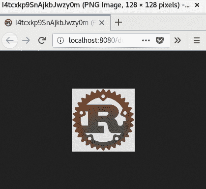

# 使用 Futures Crate 理解异步操作

Rust 是一种现代语言，有许多我们可以用来实现微服务的途径和 crate。我们可以将这些分为两类——同步框架和异步框架。如果你想编写同步微服务，你可以将处理程序实现为一系列表达式和方法调用。但在 Rust 中编写异步代码很困难，因为它不使用垃圾回收器，你必须考虑所有对象的生命周期，包括回调。这不是一个简单的任务，因为你不能在任何代码行上停止执行。相反，你必须编写不会长时间阻塞执行的代码。这个挑战可以通过`futures` crate 优雅地解决。

在本章中，你将了解`futures` crate 的工作原理。我们将研究两种基本类型——`Future`和`Stream`。我们还将探索**多生产者单消费者**（**MPSC**）模块，它是`std` crate 中类似模块的替代品，但支持异步访问通道。在本章结束时，我们将创建一个使用`Future`和`Stream`特质来处理传入数据并将处理结果返回给客户端的微服务。

`futures` crate 只包含异步原语。我们还将使用`tokio` crate，它为我们提供异步输入和输出能力，以读取和写入图像文件。

本章我们将涵盖以下主题：

+   基本异步类型

+   创建图像服务

# 技术要求

本章需要安装 Rust。我们将使用`futures`和`tokio` crate 来开发微服务。

你可以在 GitHub 上找到本章项目的源代码：[`github.com/PacktPublishing/Hands-On-Microservices-with-Rust/tree/master/Chapter04`](https://github.com/PacktPublishing/Hands-On-Microservices-with-Rust/tree/master/Chapter04)。

# 基本异步类型

微服务可以以两种不同的方式实现——同步和异步。这种方法指的是下一个任务必须在当前任务完成时等待。为了使用代码并行运行任务，我们必须运行一个线程池并在池中的线程中运行任务。异步方法是指使用非阻塞操作，单线程执行多个任务。如果操作无法完成，它将返回一个标志，表示任务尚未完成，我们稍后必须尝试再次运行它。

在过去，Rust 开发者仅使用同步操作，这意味着如果我们想从套接字读取数据，我们必须阻塞一个正在执行的线程。现代操作系统有两种避免阻塞的方法——非阻塞输入/输出函数，以及可扩展的 I/O 事件通知系统，如**epoll**。

异步活动指的是使用工作资源执行多个并发活动的能力。与同步处理程序相比，异步处理程序使用非阻塞操作。如果资源不可用以完成处理程序，它将被挂起，直到下一次尝试获取资源。有一个涉及反应器和承诺的成熟方法。反应器允许开发者在同一线程中运行多个活动，而承诺代表一个稍后可用的延迟结果。反应器保持一组承诺，并继续轮询，直到完成并返回结果。

由于标准 Rust 库不包含用于编写异步应用程序以及与反应器和承诺一起工作的有用模块，您需要一个第三方 crate。这类 crate 的一个例子是 `futures` crate，我们通过使用 `hyper` crate 间接使用了这个 crate。现在是时候详细探索这个 crate 了。在本节中，我们将讨论 `futures` crate 中可用的不同类型，如何使用通道在任务之间传递消息，以及如何使用反应器，这是运行任务所需的。

# Future crate 的基本类型

`futures` crate 的创建是为了为 Rust 开发者提供异步编程的无成本抽象。这个 crate 适应 Rust 的借用系统，并有助于创建在资源可用时轮询资源并返回结果的类型。

对于日常使用，您只需要 `futures` crate 中的一小部分类型。三个基本类型是 `Future`、`Stream` 和 `Sink`。让我们详细探讨这些类型。

# 使用 Future 特质

`Future` 是一个特质，它会在未来返回一个结果，并代表一个不能立即完成的操作。与 `Result` 枚举类似，`Future` 有两个结果变体，分别由关联类型 `Item` 和 `Error` 表示。这个特质有一个 `poll` 方法，用于检索结果。这个方法将由一个反应器调用，直到它返回 `Error` 或 `Async::Ready` 值。`Async` 是一个枚举，它有 `Ready` 和 `Pending` 两种变体，用于表示异步操作的结果。`Ready` 表示值已准备好使用，而 `Pending` 表示值尚未可用，将在稍后准备好。

如您所见，`Future` 用于与 `Result` 类似的目的。然而，与 `Result` 不同，`Future` 是一个特质，这意味着实现未指定，许多类型都可以实现它。一个有用的特性是 `FutureExt` 特质，它可以应用于所有 `Future` 实例。这个特质提供了多种方法以延迟方式处理结果。例如，如果我们想将获取到的值转换为另一种类型，这个特质提供了一个 `map` 方法来完成这个目的。让我们看一下以下内容：

```rs
let fut = future::ok(10u64);
let mapped_fut = fut.map(|x| x as f64);
```

在这个例子中，我们从一个常量创建了一个`FutureResult`结构体。此类型实现了`Future`特质，并代表一个立即准备好的值。之后，我们为`FutureResult`调用了`FutureExt`中的`map`方法，它期望一个闭包并返回。

对于实现`Future`特质的类型，你必须使用反应器来获取结果。我们将在本节后面讨论反应器。记住，你不能立即获取结果并在下一个表达式中使用它；相反，你必须创建未来或流的链来获取适当的结果。继续阅读！我们现在将探讨`Stream`特质。

# 使用 Stream 特质

`Stream`是一个特质，它表示一系列延迟的项目。它的工作方式与`Iterator`特质类似，但它使用`poll`方法来获取下一个`Item`或在失败的情况下返回`Error`。流可以是来自套接字的数据或可以从文件中读取的数据。如果`Future`实例返回一个`Stream`，则可以将`Stream`转换为`Future`，反之亦然。

为了有效地使用流，你应该学习`StreamExt`特质的用法。这让你可以创建一个链来处理流中的每个项目，甚至可以将多个流合并为一个。例如，你可以使用带有谓词的`filter`方法从`Stream`中过滤一些元素：

```rs
let stream = stream::iter_ok::<_, ()>(vec![-1, 0, 1, 2, 3]);
let filtered_stream = stream.filter(|x| x > 0);
```

`iter_ok`方法从`Iterator`创建一个`Stream`。如果你想从一个`Vec`实例提供自己的值，这很有用。

一个有用的特性是将包含`Stream`结果的`Future`实例转换为仅`Stream`。例如，当你尝试使用`tokio`包中的`TcpStream::connect`方法通过 TCP 连接时，它将返回`ConnectFuture`，该实例实现了`Future`特质并返回一个`TcpStream`实例。

# 使用 Sink 发送数据

`Future`和`Stream`对象从源提供数据，但如果你想向源发送数据，你必须使用`Sink`对象。`Sink`是一个与`Stream`类似的特质，但工作方向相反。它包含两个关联类型——`SinkItem`和`SinkError`。第一个确定可以使用特定`Sink`发送的项目类型。第二个表示发送过程出错时的错误。要与`Sink`交互，你应该使用`SinkExt`特质的`send`方法，它包含将项目发送给接收者的`send`方法。`send`方法返回一个实现`Future`特质的`Send`结构体，这意味着你不能立即发送项目。`send`方法的调用返回一个必须由反应器执行的`Future`。如果你不关心发送过程的结果，你可以使用`spawn`方法在单独的任务中发送该`Future`。

`Sink` 对象与 `Stream` 一起提供，您必须调用 `StreamExt` 的 split 方法来获取一个连接到流的 `Sink` 实例。这个调用返回一个包含 `SplitSink` 和 `SplitStream` 对象的元组。这些是让您能够同时读取输入和写入输出的必要条件。稍后，这些都可以通过这些对象中的任何一个的 `reunite` 方法重新组合。如果您正在编写复杂的交互，您可能需要多次使用 `Sink` 特性。每次都使用 `split` 来做这件事很难，但有两种替代方法可以使用。第一种是在单独实现的 `Stream` 特性中实现所有交互，并使用 `poll` 方法与 `Stream` 和 `Sink` 一起工作。第二种方法是将 `Sink` `split` 并与通道的 `Receiver` 对象 `join`。然后您可以使用这个通道的 `Sender` 发送项目，而无需每次都分割流。我们将在下一节中实现这种交互的示例，其中我们将讨论通道。

# 通道模块

并发活动通常需要相互交互。您可能已经熟悉标准库中的 `mpsc` 模块，它使用阻塞操作在通道中发送，但这不适合任何操作阻塞工作线程时完全阻塞的复杂反应器。然而，幸运的是，`futures` 包中有一个 `channel` 模块，它能够执行跨任务通信。`channel` 模块包含两个模块——`mpsc` 和 `oneshot`。让我们看看这两个模块。

# 发送多个消息的通道

通常，通道是一种单向交互原语。通道有一个发送消息的发送者和一个提取消息的接收者。内部，通道作为一个受原子标志或无锁数据类型保护免受数据竞争（当两个或多个线程尝试写入相同的内存单元格时）的数组或列表。通道实现了我们在以下章节中将要讨论的队列访问模式之一。

# 单生产者单消费者

这种方法意味着只有一个生产者可以发送消息，只有一个消费者可以读取它们。在 Rust 中，这意味着我们有一个单一的 `Sender` 和一个单一的 `Receiver`，它们都不能被克隆。标准库有一个内部实现的 **单生产者单消费者**（**SPSC**）队列，但这种类型对用户不可用。如果您需要这种类型的队列，请尝试 `bounded-spsc-queue` 包。

# 多生产者单消费者

这是在 Rust 中最受欢迎的队列类型。标准库和 `futures` 包都提供了这种类型的通道。它之所以受欢迎，是因为通道通常用于为其他多个线程提供访问单个线程中存在的资源的权限。对于这种类型的队列，`Sender` 可以被克隆，但 `Receiver` 不能。

# 多生产者多消费者

这种类型的队列允许我们使用任何数量的线程的 `Sender` 和 `Receiver`。`Sender` 和 `Receiver` 都可以被克隆并在多个线程中使用。如果有多个线程从 `Receiver` 读取消息，你无法预测哪个线程将获得特定的消息。你可以在 `crossbeam-channel` crate 中找到这个功能。

# 使用示例

要从一个线程向另一个线程发送消息，你可能会使用标准库中的 `mpsc` 模块。`futures` crate 中的 `mpsc` 模块以类似的方式工作，但当你调用 `send` 方法向消息流发送一个项目时，`Sender` 返回 `Sink` 实例。`Receiver` 实现了 `Stream` 特性，这意味着你必须使用一个反应器来轮询流以获取新消息：

```rs
fn multiple() {
    let (tx_sink, rx_stream) = mpsc::channel::<u8>(8);
    let receiver = rx_stream.fold(0, |acc, value| {
        future::ok(acc + value)
    }).map(|x| {
        println!("Calculated: {}", x);
    });
    let send_1 = tx_sink.clone().send(1);
    let send_2 = tx_sink.clone().send(2);
    let send_3 = tx_sink.clone().send(3);
    let execute_all = future::join_all(vec![
        to_box(receiver),
        to_box(send_1),
        to_box(send_2),
        to_box(send_3),
    ]).map(drop);
    drop(tx_sink);
    tokio::run(execute_all);
}
```

在这个例子中，我们创建了一个传递 `u8` 类型消息的通道。我们使用了 `Receiver` 的 `fold` 方法来添加所有值，并在通道关闭时打印结果。我们使用 `Sender` 将值发送到 `Receiver`。最后，我们使用 `future::join_all` 方法将所有 futures 组合到一个单独的未来中，并将结果未来传递给 `tokio` crate 的执行器。`join_all` 函数期望一个实现了 `Future` 特性的特定类型的 `Vec`。我们添加了 `to_box` 函数，该函数将类型转换为具有 `IntoFuture` 特性的 `Future`，丢弃结果和错误，并将其装箱：

```rs
fn to_box<T>(fut :T) -> Box<dyn Future<Item=(), Error=()> + Send>
where
    T: IntoFuture,
    T::Future: Send + 'static,
    T::Item: 'static,
    T::Error: 'static,
{
    let fut = fut.into_future().map(drop).map_err(drop);
    Box::new(fut)
}
```

要关闭 `Sender`，我们只需要将其丢弃。如果我们不丢弃 `Sender`，通道将保持打开状态，`tokio::run` 将永远不会完成。

# 单次发送

`oneshot` 模块实现了一个单条消息的通道。它也有自己的 `Sender` 和 `Receiver` 类型，但它们的工作方式不同。`Sender` 有一个 `send` 方法，它完成 `oneshot` 并完全消耗一个实例。`Sender` 不需要实现 `Sink` 特性，因为我们不能发送多个项目。它有一个预分配的单元格用于放置一个项目，该项目将立即放入单元格中，我们没有任何队列。

`Receiver` 实现了 `Future` 特性，这意味着你必须使用一个反应器来从它获取一个项目：

```rs
fn single() {
    let (tx_sender, rx_future) = oneshot::channel::<u8>();
    let receiver = rx_future.map(|x| {
        println!("Received: {}", x);
    });
    let sender = tx_sender.send(8);
    let execute_all = future::join_all(vec![
        to_box(receiver),
        to_box(sender),
    ]).map(drop);
    tokio::run(execute_all);
}
```

在这个例子中，我们为 `oneshot` 通道创建了一个 `Sender` 和一个 `Receiver`。发送者是一个将被 `send` 方法调用消耗的对象。`Receiver` 实现了 `Future` 特性，我们可以使用 `map` 方法来访问一个值。

之前，我们提到我们可以从多个来源向 `Sink` 发送消息。让我们使用通道实现这个示例。

# 在多个地方使用通道来使用 Sink

如前所述，你可以使用通道从不同的地方和任何时间发送带有 `Sink` 的数据。看看以下示例：

```rs
fn alt_udp_echo() -> Result<(), Error> {
    let from = "0.0.0.0:12345".parse()?;
    let socket = UdpSocket::bind(&from)?;
    let framed = UdpFramed::new(socket, LinesCodec::new());
    let (sink, stream) = framed.split();
    let (tx, rx) = mpsc::channel(16);
    let rx = rx.map_err(|_| other("can't take a message"))
        .fold(sink, |sink, frame| {
            sink.send(frame)
        });
    let process = stream.and_then(move |args| {
        tx.clone()
            .send(args)
            .map(drop)
            .map_err(other)
    }).collect();
    let execute_all = future::join_all(vec![
        to_box(rx),
        to_box(process),
    ]).map(drop);
    Ok(tokio::run(execute_all))
}
```

此示例创建了一个`UdpSocket`实例，它代表一个 UDP 套接字，并将其绑定到`0.0.0.0:12345`地址。之后，我们使用`UdpFramed`类型包装套接字，该类型实现了一个由提供的编解码器生成数据的`Stream`。我们将使用来自`tokio::codec`模块的`LinesCodec`。它读取输入并使用行分隔符将数据分割成代表文本行的片段。

我们将拆分封装的流并创建一个通道，以便从不同的地方发送 UDP 数据报。我们将在下一节熟悉通道模块，并学习任务如何通过`Sender`和`Receiver`对象异步交互。

`channel`方法返回`Sender`和`Receiver`对象。我们使用`Receiver`将所有传入的消息转发到 UDP 连接的`Sink`，并从流中读取所有数据，然后通过通道将其发送回去。这个回声服务器可以不使用通道更有效地实现，但我们在这里使用它们是为了演示目的。要发送消息，我们使用了创建的通道的`Sender`。这种方法的优势在于您可以在任何地方克隆并使用发送器实例，在任何时候向通道发送消息。

有时，`Future`和`Stream`在它们的`Item`或`Error`类型参数方面有所不同。为了解决这个问题，我们添加了一个`other`方法，该方法将任何错误实例包装为`io::Error`类型。我们使用此函数将一个错误类型转换为另一个类型：

```rs
fn other<E>(err: E) -> io::Error
where
    E: Into<Box<std::error::Error + Send + Sync>>,
{
    io::Error::new(io::ErrorKind::Other, err)
}
```

您可以编译这个回声服务器，并使用 netcat 实用程序检查其工作情况。如果您操作系统中尚未包含它，您应该安装它。使用带有`--verbose`（简称：`-v`）、`--udp`（简称：`-u`）和`--no-dns`（简称：`-n`）参数的`nc`命令并输入任何文本。例如，我们输入了`"*Text Message*"`：

```rs
$ nc -vnu 0.0.0.0 12345
Ncat: Version 7.60 ( https://nmap.org/ncat )
Ncat: Connected to 0.0.0.0:12345.
Text Message
Text Message
^C
```

如您所见，服务器已将提供的字符串发送回我们。所有这些示例都使用执行器来并发运行任务。在我们开始实现服务器之前，让我们先了解执行器是如何工作的。

# 执行器

由于异步任务可以在单个线程中执行，我们需要一种方法来执行所有任务，即使某些任务在执行过程中生成新的任务。运行所有任务有两种方法：

+   使用阻塞直接运行未来和收集流

+   使用执行器运行未来和流

让我们在以下部分中探索它们。

# 使用阻塞运行未来和流

第一种方法是使用`executor`模块的`block_on`或`block_on_stream`函数。这两个函数都会阻塞当前线程以等待结果。这是一个简单但不太灵活的方法，但在以下情况下非常出色：

+   如果您只有一个任务

+   如果您的任务中没有读取或写入流

+   如果您希望从可以阻塞的单独线程中完成任务

你应该记住，不要在异步代码中调用此函数，因为调用将阻塞执行器，你的程序将停止工作。

# 使用执行器

第二种方法是使用 `Executor` 实例执行所有任务。这允许你在单个线程中运行多个任务，即使某些任务不能立即完成。要使用 `Executor`，你必须创建并运行它，但它将阻塞当前线程，你应该在开始时添加所有要执行的任务。

例如，如果你想打开一个套接字并处理每个传入连接的流，你必须创建一个主要的 `Future`，它将读取传入连接的 `Stream`，并使用 `tokio::spawn` 方法为处理连接数据的 `Stream` 创建一个处理器。创建后，你必须使用执行器 `spawn` 整个处理 `Future`。请看以下示例：

```rs
fn send_spawn() {
    let (tx_sink, rx_stream) = mpsc::channel::<u8>(8);
    let receiver = rx_stream.fold(0, |acc, value| {
        println!("Received: {}", value);
        future::ok(acc + value)
    }).map(drop);
    let spawner = stream::iter_ok::<_, ()>(1u8..11u8).map(move |x| {
        let fut = tx_sink.clone().send(x).map(drop).map_err(drop);
        tokio::spawn(fut);
    }).collect();
    let execute_all = future::join_all(vec![
        to_box(spawner),
        to_box(receiver),
    ]).map(drop);
    tokio::run(execute_all);
}
```

在这个例子中，我们创建了一个通道。我们还使用 `stream::iter_ok` 方法从一个整数序列创建了一个流。我们将流的所有项目发送到通道，该通道读取所有传入的值并将它们打印到控制台。我们已处理了一个类似的例子。在当前版本中，我们使用 `tokio::spawn` 函数在当前线程的执行器中创建任务。

正如你所见，要使用 `futures` crate，你必须构建处理器的链。生成的代码难以维护和改进。为了简化异步代码，Rust 编译器已经开始支持 `async`/`await` 语法。

# async/await 语法

一些编程语言，如 JavaScript 和 C#，有 `async` 和 `await` 操作符，可以帮助编写看起来像同步代码的异步代码。Rust 编译器的夜间版本支持一种新语法，并为语言添加了 `async` 和 `await`（实际上，这是一个宏）关键字，以简化异步应用程序的编写。新代码可能如下所示：

```rs
async fn http_get(addr: &str) -> Result<String, std::io::Error> {
    let mut conn = await!(NetwrokStream::connect(addr))?;
    let _ = await!(conn.write_all(b"GET / HTTP/1.0\r\n\r\n"))?;
    let mut buf = vec![0;1024];
    let len = await!(conn.read(&mut buf))?;
    let res = String::from_utf8_lossy(&buf[..len]).to_string();
    Ok(res)
}
```

这还不是稳定的，发布前可能会更改。`async` 是一个新关键字，它将标准函数转换为异步。`await!` 是一个在不稳定 Rust 版本中内置的宏。它暂停函数的执行，并等待作为 `await!` 参数提供的 `Future` 实例的结果。此宏使用生成器功能来中断执行，直到 `await!` 下的 `Future` 完成。

在本章的剩余部分，我们将查看一个使用流来处理传入和传出数据的代理。

# 创建图像服务

在本节中，我们将创建一个微服务，允许客户端上传图像，然后下载它们。首先，我们实现一个处理程序来异步上传图像并将它们保存到文件系统中，使用 `tokio` crate。之后，我们将实现一个下载处理程序，允许用户从之前上传的文件中下载原始图像。

# 上传图像

让我们开始实现一个微服务，该服务可以存储和提供具有上传文件功能的图像。为了获取传入的文件，我们必须读取 `Request` 的一个传入 `Stream`。`Stream` 可能非常大，所以我们不应该将整个文件保留在内存中。我们将分块读取传入的数据，并立即将它们写入文件。让我们创建微服务的 `main` 函数：

```rs
fn main() {
    let files = Path::new("./files");
    fs::create_dir(files).ok();
    let addr = ([127, 0, 0, 1], 8080).into();
    let builder = Server::bind(&addr);
    let server = builder.serve(move || {
        service_fn(move |req| microservice_handler(req, &files))
    });
    let server = server.map_err(drop);
    hyper::rt::run(server);
}
```

这看起来像我们创建的其他示例，但在这里我们将 `std::path::Path` 设置为一个将保留所有传入文件的目录。我们将使用 `std::fs` 模块的 `create_dir` 函数使用我们之前设置的路径创建目录。如果目录创建失败，我们将忽略它，但对于生产代码来说，最好停止创建服务器并返回一个 `Error` 或打印必要的信息。 这适用于演示目的，但不可靠，因为本地存储的文件可能会在服务器中丢失，并且您的服务可能会损坏。在现实中的微服务中，您可能更喜欢使用第三方服务，例如 AWS S3，来存储和向客户端提供文件。

在我们创建一个目录来存储文件后，我们将启动一个 `Server`，它将使用我们稍后定义的 `microservice_handler`。请注意，当我们传递一个 `Path` 的引用时。如果想要使用命令行参数设置另一个文件夹，将路径作为参数提供是有用的。

我们现在可以定义将处理四个情况的 `microservice_handler` 函数：

+   在 `/` 路径上返回索引页面

+   将文件存储到 `/upload` 路径

+   通过 `/download` 路径返回上传的文件

+   对于其他请求返回 404 错误

函数的定义如下：

```rs
fn microservice_handler(req: Request<Body>, files: &Path)
    -> Box<Future<Item=Response<Body>, Error=std::io::Error> + Send>
```

这与我们在 第二章 中使用的处理程序定义相似，*使用 Hyper Crate 开发微服务*，以及 第三章 中使用的，*记录和配置您的微服务*，但我们使用 `std::io::Error` 而不是 `hyper::Error`。这是因为我们不仅与请求和响应一起工作，我们还使用一个可能会引起其他类型错误的文件系统。我们还期望一个 `Path` 类型的参数来确定我们将存储文件的目录。

让我们添加一个 `match` 表达式来匹配传入请求的参数。在这里，我们将考虑两个分支——第一个是当客户端向根路径发送 GET 请求时，第二个是对于所有其他请求。我们稍后会添加其他分支：

```rs
match (req.method(), req.uri().path().to_owned().as_ref()) {
    (&Method::GET, "/") => {
        Box::new(future::ok(Response::new(INDEX.into())))
    },
    _ => {
        response_with_code(StatusCode::NOT_FOUND)
    },
}
```

我们在 第二章 中使用了类似的模式匹配，*使用 Hyper Crate 开发微服务*。之前，我们有一个 `match` 表达式来检查传入请求的方法和路径。这次，我们需要 `Uri::path` 的一个副本，因为我们稍后需要在其他分支的正则表达式中使用路径副本。

`response_with_code` 函数现在返回一个 `Future` 实例，而不是 `Request`：

```rs
fn response_with_code(status_code: StatusCode)
    -> Box<Future<Item=Response<Body>, Error=Error> + Send>
{
    let resp = Response::builder()
        .status(status_code)
        .body(Body::empty())
        .unwrap();
    Box::new(future::ok(resp))
}
```

让我们将剩余的分支添加到`match`表达式中。让我们添加一个来处理文件的上传：

```rs
(&Method::POST, "/upload") => {
    let name: String = thread_rng().sample_iter(&Alphanumeric).take(20).collect();
    let mut filepath = files.to_path_buf();
    filepath.push(&name);
    let create_file = File::create(filepath);
    let write = create_file.and_then(|file| {
        req.into_body()
            .map_err(other)
            .fold(file, |file, chunk| {
            tokio::io::write_all(file, chunk)
                .map(|(file, _)| file)
        })
    });
    let body = write.map(|_| {
        Response::new(name.into())
    });
    Box::new(body)
}
```

这个请求处理分支期望的是`POST`方法和`"/upload"`路径。我们不检查用户凭证，并允许每个人上传文件，但在实际的微服务中，你应该过滤传入流量以避免垃圾邮件或恶意使用。

在分支的第一行，我们为传入的文件生成一个随机名称。我们可以给客户端提供设置文件名称的机会，但这是一种危险的做法。如果你不检查传入请求的路径，客户端可以从服务器上的任何文件夹请求一个文件。我们使用`rand` crate 中的`thread_rng`函数调用获取一个实现了`Rng`特质的随机数生成器实例。之后，我们使用生成器通过`Rng`特质的`sample_iter`方法调用获取一个样本的`Iterator`，并向它提供一个生成随机字符和数字的`Alphanumeric`分布。我们从迭代器中取出 20 个项并将它们收集到一个`String`中。然后，我们使用`to_path_buf`方法将`files`变量转换为`PathBuf`，并将生成的文件名添加到路径中。

在下一行，我们使用生成的名称创建一个`File`。这里隐藏了异步应用程序最重要的区别——我们使用`tokio::fs::File`类型而不是`std::fs::File`类型，因此我们返回一个`Future`实例而不是文件引用。当文件创建完成后，这个`Future`将被完成。之后，我们使用创建的文件异步地向该文件写入一些数据。`tokio::fs::File`类型封装了`std::fs::File`，但实现了`AsyncRead`和`AsyncWrite`特质。在任何时候，你都可以调用`into_std`方法来解包标准的`File`类型。然而，在我们这样做之前，我们将传入的流写入创建的文件。让我们更仔细地看看`tokio` crate 以及与文件异步读写相关的一些重要问题。

# `tokio` crate

`tokio` crate 提供了以异步方式处理文件网络连接的功能。它包括 TCP 和 UDP 套接字的包装器——`TcpStream`和`UdpSocket`。它还包括通过`Future`和`Stream`特质访问文件系统的类型。没有跨平台的异步文件处理方法，因为操作系统有自己的非阻塞 API 实现。然而，一些操作系统根本就没有好的异步 API。为了提供跨平台的文件系统异步访问，`tokio`使用`tokio_threadpool` crate，它有一个`blocking`方法，在单独的线程中运行任务。这有助于实现可以使用输入/输出操作阻塞线程的类型异步交互。这不是与文件系统交互最有效的方法，但它确实允许我们将同步 API 转换为异步。`tokio` crate 还包含一个`Executor`特质和一个`Timer`模块。我们之前已经考虑过执行器。`timer`模块包含`Timeout`和`Interval`类型，用于创建在指定时间间隔过去时产生值的`Future`和`Stream`。

# 文件的异步输入/输出

现在我们必须创建一个链来读取所有传入的块并将它们写入创建的文件。正如你可能记得的，`File::create`返回一个返回`File`实例的`Future`。我们不会立即获取结果，因为 I/O 操作需要一些时间，可能会阻塞当前运行的线程。我们必须使用`Future::and_then`方法将结果（当它准备好时）移动到其他`Future`实例，该实例将所有块发送到文件。为此，我们将使用通过`req`变量中存储的`Request`的`into_body`方法调用获得的`Body`实例。`Body`实现了`Chunk`实例的`Stream`，但它可以产生一个`hyper::Error`。由于`File::create`可以产生一个`io::Error`，我们必须使用`other`函数调用将`hyper::Error`转换为`io::Error`，如下所示：

```rs
fn other<E>(err: E) -> Error
where
    E: Into<Box<std::error::Error + Send + Sync>>,
{
    Error::new(ErrorKind::Other, err)
}
```

之前的功能根据提供的单个参数中的任何`Error`创建一个带有`ErrorKind::Other`的`io::Error`。我们使用`StreamExt`的`map_err`函数与`other`函数一起将流的失败转换为`io::Error`。当`Body`的`Stream`与错误类型兼容时，我们可以创建一个`Future`，它将传入的二进制数据移动到文件中。为此，我们可以使用`StreamExt`特质的`fold`方法。如果你熟悉函数式编程，你可能已经知道它是如何工作的。`fold`函数接受两个参数——一个初始值，它将在每次迭代中重复使用，以及一个函数，该函数使用初始值执行一些处理。处理函数必须在每次调用时返回一个`Future`实例，有一个条件——`Future`必须返回与初始值相同类型的类型。

我们将提供一个 `File` 实例作为初始值，并将调用 `tokio::io::write_all` 将请求体的一个数据块写入文件。`write_all` 函数期望一个输出流和一个二进制切片。它在成功时返回一个 `Future`，该 `Future` 返回一个包含输出流和提供的切片的元组。我们必须使用返回的 `Future` 的 `map` 方法来丢弃切片并保留文件。结果链将 `fold` 整个 `Stream` 到一个 `Future`，当所有数据块都写入文件时，它将返回一个填充的 `File` 实例。我们将这个 `Future` 存储到一个变量中，并使用 `FutureExt` 的 `map` 方法来丢弃文件实例（带有写入数据的真实文件将保留在驱动器上），并返回一个带有存储文件名的 `Response`。

我们现在已经成功实现了文件上传。现在我们应该讨论如何使用 HTML 表单上传文件，并为我们服务添加下载功能。

# 多部分表单请求

到目前为止，在本章中，我们使用了具有二进制体的请求。这对于微服务来说很合适，但如果你想要通过 HTML 表单发送文件，你应该使用具有 `multipart/form-data` 内容类型的请求。这允许客户端在单个请求中包含多个文件，但它也需要一个解析器来从请求体中分割文件。`hyper` 包不包含多部分请求的解析器，你可以使用其他包，例如 `multipart` 包来解析请求。然而，这并不支持异步操作，所以你应该使用与 `hyper` 包最新版本兼容的 `multipart-async` 包。你也可以自己实现多部分请求。要实现这一点，你可以创建一个实现 `Stream` 特性的结构体，并解析传入的数据块。多部分请求具有 `multipart/form-data` 内容类型，边界值例如 `boundary=53164434ae464234f`。其体包含一个分隔符和嵌入的文件：

```rs
--------------------------53164434ae464234f
Content-Disposition: form-data; name="first_file"; filename="file1.txt"
Content-Type: text/plain
Contents of the file1.txt
--------------------------53164434ae464234f
Content-Disposition: form-data; name="second_file"; filename="file2.txt"
Content-Type: text/plain
Contents of the file2.txt
--------------------------53164434ae464234f
```

您的流必须实现 **`Stream<Item=FileEntry>`**，它读取请求并使用提供的边界提取文件。

# 下载图片

让我们实现一个分支来下载图片。处理程序可以使用 `/download/filename` 路径下载文件。为了提取文件名，我们使用正则表达式：

```rs
lazy_static! {
    static ref DOWNLOAD_FILE: Regex = Regex::new("^/download/(?P<filename>\\w{20})?$").unwrap();
}
```

我们将使用 `startwith` 来检测路径中的 `/download` 部分。看看实现方式：

```rs
(&Method::GET, path) if path.starts_with("/download") => {
    if let Some(cap) = DOWNLOAD_FILE.captures(path) {
            let filename = cap.name("filename").unwrap().as_str();
            let mut filepath = files.to_path_buf();
            filepath.push(filename);
            let open_file = File::open(filepath);
            let body = open_file.map(|file| {
                let chunks = FileChunkStream::new(file);
                Response::new(Body::wrap_stream(chunks))
            });
            Box::new(body)
    } else {
        response_with_code(StatusCode::NOT_FOUND)
    }
}
```

在这个例子中，我们期望一个`GET`方法，并检查路径是否与`DOWNLOAD_FILE`正则表达式匹配。我们使用名称`"filename"`来提取文件名称的字符串。由于我们有一个包含文件夹路径的`filepath`变量，我们使用`Path`实例的`to_path_buf`方法将`Path`值转换为`PathBuf`类型，并将一个文件名推送到它。之后，我们使用`tokio` crate 的文件类型来打开一个文件，它具有异步读写能力以处理文件内容。文件的`open`方法返回一个`OpenFuture`实例，当成功时解析为一个`File`实例。

我们使用从`hyper_staticfile` crate 导入的`FileChunkStream`包装文件。这个流读取一个`File`并返回字节数据块。主体有一个`wrap_stream`方法，我们可以将整个流作为响应发送。当流被转发到客户端时，打开的`File`将在流被丢弃时关闭。

我们最后应该做的是返回一个`Body`实例。

# 用于发送文件的 sendfile

从一个文件转发文件到另一个文件并不有效，因为这种方法在发送之前会将每个数据块复制到内存中。流行的服务器如**NGINX**使用`sendfile`系统调用来从一个文件描述符发送文件到另一个。这有助于节省大量资源，因为`sendfile`允许零拷贝，这意味着我们可以直接将缓冲区写入必要的设备。要使用`tokio`的`sendfile`，你必须为其实现一个包装器，但我不认为用微服务来提供静态文件是一个好主意。你可能更喜欢使用 NGINX 来完成这项任务，或者使用对象存储如**AWS S3**，它可以为客户端提供静态文件。

# 测试服务

图像服务现在已准备好进行测试。编译它，从互联网下载任何图片，并使用`curl`将其上传到我们的服务：

```rs
$ curl https://www.rust-lang.org/logos/rust-logo-128x128.png | curl -X POST --data-binary @- localhost:8080/upload

I4tcxkp9SnAjkbJwzy0m
```

这个请求下载 Rust 标志并将其上传到我们的微服务。它将以响应返回上传的图像名称。将其放在`/download/`路径之后，并尝试用你的浏览器下载它：



# 摘要

在本章中，我们研究了`futures`和`tokio` crate。`futures` crate 包含用于处理延迟结果和流的类型。我们比较了`Future`和`Result`类型以及`Stream`和`Iterator`类型。之后，我们实现了一个存储图像并将其发送回客户端的微服务。

我们将在第十章背景任务和线程池在微服务中中改进本章的微服务，使用线程和后台任务。但在下一章，我们将探讨反应式微服务和使用远程过程调用作为实现微服务的替代方法。
