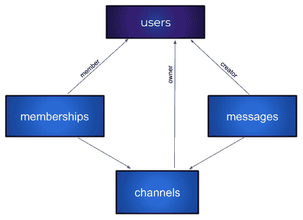

# 第八章：使用对象关系映射（ORM）与数据库交互

在本章中，我们将继续与数据库交互，但这次我们将使用 `diesel` crate 探索对象关系映射（ORM）。这个 crate 帮助生成代表 SQL 数据库中表和记录的 Rust 类型。ORM 允许您在代码中使用原生数据结构，并将记录和数据库表映射到它们。它很有用，因为编译器会负责匹配数据库中的数据列和源代码中的结构体的类型。

阅读本章后，您将熟悉以下内容：

+   使用 `diesel` crate 与 `r2d2` 池

+   生成和应用迁移

+   使用 ORM 类型访问数据

# 技术要求

在本章中，我们将使用 SQLite 嵌入式数据库。您不需要安装和运行数据库，但您需要 PostgreSQL、MySQL 和 SQLite 数据库的开发包。在您的系统上安装它们。

您可以在 GitHub 上找到本章的示例：[`github.com/PacktPublishing/Hands-On-Microservices-with-Rust/tree/master/Chapter08.`](https://github.com/PacktPublishing/Hands-On-Microservices-with-Rust/tree/master/Chapter08)

# diesel crate

在上一章中，我们学习了如何与不同的数据库交互。但我们讨论的方法存在潜在困难——您必须检查添加到应用程序中的原始请求。如果 Rust 编译器控制数据的结构并生成所有必要的请求，那么会更好。这种正式和严格的方法可以通过 `diesel` crate 实现。

Rust 有一个很棒的功能可以创建宏并生成代码。它允许 `diesel` crate 的创建者创建一个特定领域的语言来查询数据库中的数据。要开始使用这个 crate，我们需要将其添加到一个新项目中。

# 添加必要的依赖项

创建一个新的 crate 并添加以下依赖项：

```rs
[dependencies]
clap = "2.32"
diesel = { version = "¹.1.0", features = ["sqlite", "r2d2"] }
failure = "0.1"
r2d2 = "0.8"
serde = "1.0"
serde_derive = "1.0"
uuid = { version = "0.5", features = ["serde", "v4"] }
```

我们添加了 `clap`、`r2d2` 和 `serde` crate，以及 `serde_derive` crate。我们还需要 `uuid` crate 来生成用户 ID。我们还添加了具有以下功能的 `diesel` crate：

+   `sqlite`：使 crate 能够使用 SQLite 数据库

+   `r2d2`：使用池而不是普通连接

下一步您需要的是 `diesel_cli` 工具。

# diesel_cli

`diesel_cli` 是创建迁移并应用它们所必需的。要安装此工具，请使用以下参数的 `cargo`：

```rs
cargo install diesel_cli
```

然而，您需要 PostgreSQL、MySQL 和 SQLite 的开发包来构建这个工具。如果您没有或无法安装它们，您可以在 `cargo install` 中传递特殊参数。例如，如果您想在本章的示例中使用 `diesel_cli`，只需安装具有 `sqlite` 功能的工具即可：

```rs
cargo install diesel_cli --no-default-features --features "sqlite"
```

当您安装了 `diesel-cli` 工具后，运行它，使用 `setup` 命令准备应用程序以使用 `diesel` crate：

```rs
diesel setup
```

现在，我们必须为我们的示例准备所有必要的迁移。

# 创建迁移

此命令创建一个 `migrations` 文件夹，你可以使用以下命令存储迁移：

```rs
diesel migration generate <name>
```

此命令创建一个名为 `<name>` 的迁移并将其存储在 `migrations` 文件夹中。例如，如果你将创建的迁移的名称设置为 `create_tables`，你将在 `migrations` 文件夹中看到以下结构：

```rs
migrations/
└── 2018-11-22-192300_create_tables/
    ├── up.sql
    └── down.sql
```

对于每个迁移，`generate` 命令都会创建一个文件夹和一对文件：

+   `up.sql`：应用迁移的语句

+   `down.sql`：回滚迁移的语句

所有迁移都是手写的。你需要自己添加所有必要的迁移语句。以我们的例子为例，我们需要在 `up.sql` 文件中添加以下语句：

```rs
CREATE TABLE users (
   id TEXT PRIMARY KEY NOT NULL,
   name TEXT NOT NULL,
   email TEXT NOT NULL
 );
```

相反的语句在 `down.sql` 文件中：

```rs
DROP TABLE users;
```

应用 `up.sql` 脚本会创建与我们在上一章中使用的相同结构的 `users` 数据库。回滚脚本会删除用户表。

现在，我们可以使用此命令创建数据库并应用所有迁移：

```rs
DATABASE_URL=test.db diesel migration run
```

我们将 `DATABASE_URL` 设置为 `test.db` 以在当前文件夹中创建一个 SQLite 数据库。`run` 命令按顺序运行所有迁移。你可以有多个迁移，并且可以从一个结构级别移动到另一个，无论是向前还是向后。

小心！你可以有多个迁移，但你不能有来自不同项目到同一数据库的竞争迁移。自动迁移的问题是你不能从多个服务中进行，或者如果你在另一个微服务已经迁移数据库之后尝试迁移数据库，甚至无法启动一个微服务。

我们已经创建了迁移，现在我们必须在 Rust 源代码中声明数据结构。

# 声明数据结构

我们的工具将有两个包含数据结构的模块。第一个是 `src/schema.rs` 模块，它包含一个 `table!` 宏调用，用于声明每个表的字段。在我们的例子中，此模块包含以下声明：

```rs
table! {
    users (id) {
        id -> Text,
        name -> Text,
        email -> Text,
    }
}
```

此文件是由 `diesel setup` 命令自动生成的。当你运行设置时，它创建一个包含以下内容的 `diesel.toml` 配置文件：

```rs
# For documentation on how to configure this file,
# see diesel.rs/guides/configuring-diesel-cli
[print_schema]
file = "src/schema.rs"
```

如你所见，配置有一个 schema 模块引用。还会生成一个 `schema.rs` 文件，并且每次编译时都会更新。`table!` 宏创建了用于表的 DSL 所需的声明。

# 模型

架构声明仅定义表结构。为了将表映射到 Rust 类型，你必须添加一个包含模型的模块，该模型将用于将 `users` 表中的记录转换为原生 Rust 类型。让我们创建一个并命名为 `models.rs`。它将包含以下代码：

```rs
use serde_derive::Serialize;
use super::schema::users;

#[derive(Debug, Serialize, Queryable)]
pub struct User {
    pub id: String,
    pub name: String,
    pub email: String,
}

#[derive(Insertable)]
#[table_name = "users"]
pub struct NewUser<'a> {
    pub id: &'a str,
    pub name: &'a str,
    pub email: &'a str,
}
```

我们在这里声明了两个模型：`User` 用于表示数据库中的用户，`NewUser` 用于创建用户的新的记录。我们为 `User` 结构体推导出必要的特质。`Queryable` 特质被实现以允许你通过查询从数据库获取此类型。

有一个`Insertable`特质，它是从`NewUser`结构体派生出来的。这个特质允许结构体作为新行插入到表中。这种派生需要一个带有表名的注解。我们可以将其设置为`users`表，使用`#[table_name = "users"]`注解。

数据库结构已经准备就绪，我们可以从应用程序开始使用数据库。

# 连接到数据库

在我们的工具中，我们将实现两个子命令——`add`用于添加新用户，`list`用于从数据库检索所有可用用户。导入所有必要的依赖项并添加带有`schema`和`models`的模块：

```rs
extern crate clap;
#[macro_use]
extern crate diesel;
extern crate failure;
extern crate serde_derive;

use clap::{
    crate_authors, crate_description, crate_name, crate_version,
    App, AppSettings, Arg, SubCommand,
};
use diesel::prelude::*;
use diesel::r2d2::ConnectionManager;
use failure::Error;

pub mod models;
pub mod schema;
```

由于我们使用的是`r2d2` crate，我们还需要导入`ConnectionManager`以使用 diesel 对传统数据库连接的抽象。

使用`pub`修饰符声明的模块使它们在文档中可用。这对于由`diesel` crate 生成的模块很有用，这样你可以探索由生成的 DSL 提供的函数。

# 解析参数

与上一章中的示例类似，我们有一个参数解析器。它的声明如下：

```rs
let matches = App::new(crate_name!())
    .version(crate_version!())
    .author(crate_authors!())
    .about(crate_description!())
    .setting(AppSettings::SubcommandRequired)
    .arg(
        Arg::with_name("database")
        .short("d")
        .long("db")
        .value_name("FILE")
        .help("Sets a file name of a database")
        .takes_value(true),
        )
    .subcommand(SubCommand::with_name(CMD_ADD).about("add user to the table")
                .arg(Arg::with_name("NAME")
                     .help("Sets the name of a user")
                     .required(true)
                     .index(1))
                .arg(Arg::with_name("EMAIL")
                     .help("Sets the email of a user")
                     .required(true)
                     .index(2)))
    .subcommand(SubCommand::with_name(CMD_LIST).about("prints a list with users"))
    .get_matches();
```

我们可以使用带有数据库文件路径的`--database`参数。`add`子命令需要两个参数——带有用户名的`NAME`和带有电子邮件的`EMAIL`。`list`子命令不需要额外的参数，并将打印用户列表。

# 创建连接

要创建连接，我们提取数据库的路径。由于我们使用的是 SQLite 数据库，与之前的示例不同，我们不需要 URL，而是数据库文件的路径。这就是为什么我们使用`test.db`文件名而不是 URL 的原因：

```rs
let path = matches.value_of("database")
     .unwrap_or("test.db");
 let manager = ConnectionManager::<SqliteConnection>::new(path);
 let pool = r2d2::Pool::new(manager)?;
```

`r2d2::Pool`需要一个`ConnectionManager`实例来与数据库建立连接，我们可以提供从命令行参数中提取的数据库路径作为关联类型来使用 SQLite 数据库。现在让我们看看如何使用生成的 DSL 与数据库交互。

# 使用 DSL 实现子命令

`diesel` crate 为我们生成一个 DSL，以简单的方式构造类型化查询。所有指令都作为 schema 的子模块生成，并对每个生成的表映射可用，模块路径如下：

```rs
use self::schema::users::dsl::*;
```

让我们使用生成的类型化关系实现两个命令。

# 添加用户子命令实现

我们用户管理工具的第一个子命令是`add`。这个命令从参数中提取用户的`NAME`和`EMAIL`，并使用`uuid` crate 生成一个新的用户标识符。我们将在这个所有微服务中使用这种类型。看看下面的代码：

```rs
(CMD_ADD, Some(matches)) => {
    let conn = pool.get()?;
    let name = matches.value_of("NAME").unwrap();
    let email = matches.value_of("EMAIL").unwrap();
    let uuid = format!("{}", uuid::Uuid::new_v4());
    let new_user = models::NewUser {
        id: &uuid,
        name: &name,
        email: &email,
    };
    diesel::insert_into(schema::users::table)
        .values(&new_user)
        .execute(&conn)?;
}
```

在我们提取所有参数后，我们从`models`模块创建一个`NewUser`实例。它需要引用值，我们不需要将所有权传递给值并在多个请求中重用它们。

最后一行使用了`insert_into`函数，它为提供的表生成一个`INSERT INTO`语句，但与表文本名称，如`"users"`不同，我们使用来自模式中用户`module`的`table`类型。这有助于你在编译时看到所有错误。我们使用`values`函数调用来设置这个请求的值。作为值，我们使用对`NewUser`实例的引用，因为这个映射已经在结构声明中映射到`***users***`表。要执行一个语句，我们调用由`values`方法调用生成的`InsertStatement`实例的`execute`函数。

`execute`方法期望一个对我们已经从池中提取的连接的引用。

# 列出用户子命令实现

在之前的数据插入示例中，我们没有使用生成的`users`类型，而只使用了嵌套的`table`类型。为了在`list`子命令的实现中列出用户，我们将使用`dsl`子模块中的类型。

如果你构建一些文档并查看`users::schema::users::dsl`模块，你会看到以下项目：

```rs
pub use super::columns::id;
pub use super::columns::name;
pub use super::columns::email;
pub use super::table as users;
```

所有类型都非常复杂，你可以在文档中看到所有功能。由于`users`表类型实现了`AsQuery`特质，我们可以使用`RunQueryDsl`特质的`load`方法来处理`users`类型。我们将关联类型设置为`model::Users`以从表中提取此类型。我们也不需要像上一章那样进行任何手动提取。`load`方法期望一个`Connection`，我们可以从`Pool`实例中获取它：

```rs
(CMD_LIST, _) => {
    use self::schema::users::dsl::*;
    let conn = pool.get()?;
    let mut items = users
        .load::<models::User>(&conn)?;
    for user in items {
        println!("{:?}", user);
    }
}
```

现在，我们可以简单地遍历用户集合。这很简单。

如果你想要构造更复杂的请求，可以使用`diesel`crate 在构建过程中生成的其他 DSL 函数。例如，你可以通过域名过滤用户，并使用以下 DSL 表达式限制列表中用户的数量：

```rs
let mut items = users
    .filter(email.like("%@example.com"))
    .limit(10)
    .load::<models::User>(&conn)?;
```

我们使用`filter`方法，并通过`email`列的`like`方法调用来创建参数，过滤了所有`example.com`域的用户。

# 测试

让我们测试我们的工具。使用以下命令编译并运行它：

```rs
cargo run -- add user1 user1@example.com
cargo run -- add user2 user2@example.com
cargo run -- add userx userx@xample.com
```

如果你添加过滤并调用`list`子命令，你会看到以下输出：

```rs
cargo run -- list
User { id: "a9ec3bae-c8c6-4580-97e1-db8f988f10f8", name: "user1", email: "user1@example.com" }
User { id: "7f710d18-aea5-46f9-913c-b60d4e4529c9", name: "user2", email: "user2@example.com" }
```

我们得到了一个将纯 Rust 类型映射到关系数据库类型的完美示例。

# 复杂的数据库结构

我们已经涵盖了一个单表的示例。在本节中，我们将创建一个具有复杂表结构的示例，以涵盖整体数据库交互。我们将开发一个用于数据库交互的独立 crate，该 crate 涵盖了复杂聊天应用程序的功能——与用户、频道和角色聊天。此外，我们将测试我们实现的功能，并展示如何测试 Rust 应用程序的数据库交互层。

# 示例应用程序的业务逻辑

在本节中，我们将学习如何将数据关系转换为 ORM 模型。我们将实现一个聊天应用的数据库交互包。想象一下，我们需要在 Rust 中表达这些数据关系：



我们有四个表。第一个表包含用户。它是主表，并被其他所有表使用。每个用户都可以创建一个频道并成为频道的所有者。第二个表包含频道，每个频道都有一个所有者，由`users`表中的记录表示。

在我们的聊天应用中，每个用户都可以加入频道并向其发布消息。为了维护这种关系，我们将添加一个`memberships`表，其中包含两个引用的记录——一个用户是频道的成员，另一个是包含用户的频道记录。

此外，用户可以向频道发布消息。我们将保留所有消息在一个单独的`messages`表中。每条消息有两个关系：包含消息的频道和发布消息的用户。

# API 方法

为了维护数据，我们需要提供以下方法：

+   `register_user`：向`users`表添加新用户

+   `create_channel`：创建一个新的频道，并使用提供的用户作为频道所有者

+   `publish_channel`：使频道公开

+   `add_member`：向频道添加成员

+   `add_message`：向频道添加用户的消息

+   `delete_message`：删除消息

你可能已经注意到我们没有删除频道的功能，但我们有一个删除消息的方法。这是因为用户可能会不小心发布一条消息，他们可能想要删除它。也许用户发布了一些他们想要从数据库中删除的私人信息。

我们不允许删除频道和用户，因为它们是业务逻辑的重要组成部分。如果用户删除了一个频道，那么其他用户的全部消息也会被删除。这不是其他用户希望的行为。

如果你需要一个删除功能，你可以在每个表中添加一个布尔列，表示记录已被删除。不要删除物理记录，但将其标记为已删除。你可以自己添加到这个例子中。在实际情况中，你还需要考虑用户所在国家的法律，因为它们可能要求物理删除记录。

现在，我们可以使用 Rust 的 ORM 通过`diesel`包来表示这些关系。

# 数据库结构和迁移

首先，我们需要创建数据库结构。我们需要四个表：

+   `users`：包含用户的账户

+   `channels`：包含用户创建的频道

+   `memberships`：属于频道的用户

+   `messages`：频道中用户的消息

要添加这些表，我们将向新项目添加四个迁移：

```rs
cargo new --lib chat
cd chat
diesel setup
diesel migration generate create_users
diesel migration generate create_channels
diesel migration generate create_memberships
diesel migration generate create_messages
```

前面的命令创建了这些迁移：

```rs
00000000000000_diesel_initial_setup
2019-01-06-192329_create_users
2019-01-06-192333_create_channels
2019-01-06-192338_create_memberships
2019-01-06-192344_create_messages
```

如你所记，每个迁移文件夹包含两个文件：`up.sql`和`down.sql`。现在，我们可以添加 SQL 语句来执行必要的迁移操作。

# Diesel 初始设置

第一次迁移是`diesel_initial_setup`。它是由`diesel` CLI 工具自动创建的，包含一个设置触发器以更新表`updated_at`列的函数。我们将使用这个功能来处理频道表。像每次迁移一样，它由两个文件组成。

# up.sql

这个 SQL 文件包含两个语句。第一个是`diesel_manage_updated_at`函数，它为表创建一个触发器，以便在每行更新时调用`diesel_set_updated_at`函数：

```rs
CREATE OR REPLACE FUNCTION diesel_manage_updated_at(_tbl regclass) RETURNS VOID AS $$
BEGIN
    EXECUTE format('CREATE TRIGGER set_updated_at BEFORE UPDATE ON %s
                    FOR EACH ROW EXECUTE PROCEDURE diesel_set_updated_at()', _tbl);
END;
$$ LANGUAGE plpgsql;
```

此函数仅对提供`_tbl`参数的表执行`CREATE TRIGGER`语句。

第二个函数是`diesel_set_updated_at`，它更新`updated_at`列，如果处理过的行已更改，则使用当前时间戳：

```rs
CREATE OR REPLACE FUNCTION diesel_set_updated_at() RETURNS trigger AS $$
BEGIN
    IF (
        NEW IS DISTINCT FROM OLD AND
        NEW.updated_at IS NOT DISTINCT FROM OLD.updated_at
    ) THEN
        NEW.updated_at := current_timestamp;
    END IF;
    RETURN NEW;
END;
$$ LANGUAGE plpgsql;
```

为了使这个功能工作，你必须将`updated_at`列添加到你的表中，并在你的模型中添加一个同名字段。我们将在本节稍后对`channel`表做这件事。

# down.sql

降级脚本会删除两个函数（如果存在）：

```rs
DROP FUNCTION IF EXISTS diesel_manage_updated_at(_tbl regclass);
DROP FUNCTION IF EXISTS diesel_set_updated_at();
```

这是一个由`diesel`工具创建的默认迁移。正如你所见，它包含你可以删除或用你自己的替换的功能。现在，我们可以将`users`表添加到下一个迁移中。

# 用户表

第二次迁移是`create_users`。它创建一个`users`表，该表用于在数据库中保存所有用户的账户。为了创建这个表，我们创建了一个单独的迁移，包含两个脚本——一个用于创建`users`表，另一个用于删除它。

# up.sql

将以下语句添加到`up.sql`脚本中：

```rs
CREATE TABLE users (
  id SERIAL PRIMARY KEY,
  email TEXT NOT NULL UNIQUE
);
```

如你所见，该表有两个列。`id`代表用户的唯一 ID，我们将在稍后的其他表中使用这个标识符。`email`列包含用户的唯一电子邮件。对于实际应用，`users`表还必须包含一个散列密码，以及两个列来存储用户创建和更新的时间。

# down.sql

降级脚本删除`users`表：

```rs
DROP TABLE users;
```

现在，我们可以使用用户的 ID 来创建频道。

# 频道表

第三次迁移是`create_channels`。它创建一个`channels`表，包含所有由用户创建的频道。频道可以是私有的或公共的，每个频道都有一个标题。让我们看看创建数据库中频道表的脚本。

# up.sql

升级脚本包含一个创建`channels`表的语句。列包括频道`id`和`user_id`，它引用`users`表中的用户。频道还有一个`title`列和一个`is_public`列，它包含一个表示频道可见性的标志。如果`is_public`等于`TRUE`，则表示该频道是公开的。看看以下语句：

```rs
CREATE TABLE channels (
  id SERIAL PRIMARY KEY,
  user_id INTEGER NOT NULL REFERENCES users,
  title TEXT NOT NULL,
  is_public BOOL NOT NULL,
  created_at TIMESTAMP NOT NULL DEFAULT CURRENT_TIMESTAMP,
  updated_at TIMESTAMP NOT NULL DEFAULT CURRENT_TIMESTAMP
);

SELECT diesel_manage_updated_at('channels');
```

该表还有两个列——`create_at`，它在行创建时获取当前时间戳，以及`updated_at`，它包含行的最新更新时间戳。默认情况下，`updated_at`列在创建时使用当前时间戳作为默认值。

正如我们之前提到的，diesel 创建了一个 `diesel_manage_updated_at` 函数，该函数将触发器设置到表中，当行被更新时自动更新行的 `updated_at` 列。由于我们在表声明中已经有了 `updated_at` 列，我们可以在 `SELECT` 语句中调用此函数。

# down.sql

down 脚本删除了 `channels` 表：

```rs
DROP TABLE channels;
```

在 `up.sql` 脚本中，我们创建了一个带有 `diesel_manage_updated_at` 调用的触发器，但我们不需要手动删除它，因为它会随着表的删除而自动移除。

# 会员表

第四次迁移是 `create_memberships`。它创建了一个必要的 `memberships` 表，用于管理可以读取消息并写入新消息的渠道参与者。这个表依赖于 `users` 和 `channels` 表。

# up.sql

`up` 脚本简单，包含一个创建具有三个字段（会员的 `id`、在 `channel_id` 列中的渠道 `id` 以及具有 `user_id` 列的用户的 `id`）的会员表语句：

```rs
CREATE TABLE memberships (
  id SERIAL PRIMARY KEY,
  channel_id INTEGER NOT NULL REFERENCES channels,
  user_id INTEGER NOT NULL REFERENCES users
);
```

# down.sql

down 脚本删除了表：

```rs
DROP TABLE memberships;
```

我们现在需要添加一个存储用户发布到渠道的消息的表。

# 消息表

第五次迁移是 `create_messages`。它创建了一个包含所有用户已写入消息的 `messages` 表。

# up.sql

看看以下 up 脚本：

```rs
CREATE TABLE messages (
  id SERIAL PRIMARY KEY,
  timestamp TIMESTAMP NOT NULL,
  channel_id INTEGER NOT NULL REFERENCES channels,
  user_id INTEGER NOT NULL REFERENCES users,
  text TEXT NOT NULL
);
```

它创建了一个包含与渠道和用户通过 ID 关联的消息的表。此外，它还包含显示消息添加时间的戳以及每条消息的文本。

# down.sql

down 脚本删除了表：

```rs
DROP TABLE messages;
```

我们已经完成了所有迁移，现在我们可以查看 `diesel` 工具生成的架构。

# 架构

`diesel` 创建了一个包含生成用于源代码中使用的 DSL 语言的宏调用的 schema 文件。具有相互关系的表架构需要额外的声明。让我们在 `src/schema.rs` 文件中查看生成的架构，看看它与我们在本章早期创建的简单架构有何不同。

第一张表是 `users`。它具有我们在 SQL 文件中声明的相同列：

```rs
table! {
    users (id) {
        id -> Int4,
        email -> Text,
    }
}
```

`table!` 宏在编译期间会被展开为一些类型和特质实现，您可以使用以下命令查看：

```rs
cargo rustc -- -Z unstable-options --pretty=expanded
```

此命令将所有展开的宏打印到终端。

diesel 工具还为 `channels` 表生成了一个 DSL 声明：

```rs
table! {
    channels (id) {
        id -> Int4,
        user_id -> Int4,
        title -> Text,
        is_public -> Bool,
        created_at -> Timestamp,
        updated_at -> Timestamp,
    }
}
```

对于 `memberships` 表，我们有以下声明：

```rs
table! {
    memberships (id) {
        id -> Int4,
        channel_id -> Int4,
        user_id -> Int4,
    }
}
```

对于 `messages` 表，我们有以下声明：

```rs
table! {
    messages (id) {
        id -> Int4,
        timestamp -> Timestamp,
        channel_id -> Int4,
        user_id -> Int4,
        text -> Text,
    }
}
```

但您可能已经注意到，表声明中没有包含任何关于关系的信息。由 `joinable!` 宏创建的关系期望一个表名和一个具有 ID 列名的父表：

```rs
joinable!(channels -> users (user_id));
joinable!(memberships -> channels (channel_id));
joinable!(memberships -> users (user_id));
joinable!(messages -> channels (channel_id));
joinable!(messages -> users (user_id));
```

所有关系都通过 `joinable!` 宏列出，但架构还包含一个 `allow_tables_to_appear_in_same_query!` 宏调用，表示哪些表可以在 `JOIN` 查询中使用：

```rs
allow_tables_to_appear_in_same_query!(
    channels,
    memberships,
    messages,
    users,
);
```

由于我们有了包含所有关系的完整模式声明，我们可以声明与原生 Rust 结构体具有相同关系的模型。

# 模型

现在，我们可以使用生成的模式来创建所有必要的模型，这些模型代表数据库记录到原生 Rust 结构体。首先，我们必须导入`NaiveDateTime`类型，因为我们有时间戳列。此外，我们必须导入所有表：`users`、`channels`、`memberships`和`messages`：

```rs
use chrono::NaiveDateTime;
use crate::schema::{users, channels, memberships, messages};
```

我们将使用`i32`类型作为记录的标识符，但最好使用别名来使其意图更加明确：

```rs
pub type Id = i32;
```

让我们添加一个模型来表示`users`表中的记录。

# 用户

为了表示存储在`users`表中的用户，我们将添加一个具有以下声明的`User`结构体：

```rs
#[derive(Debug, Identifiable, Queryable, Serialize, Deserialize)]
#[table_name = "users"]
pub struct User {
    pub id: Id,
    pub email: String,
}
```

如您所见，我们使用具有`SERIAL` SQL 类型的`Id`类型作为 ID 列。对于电子邮件字段，我们使用 String 类型，它在 PostgreSQL 中映射到`TEXT`列类型。

此外，还有一个`table_name`属性来将此结构体与表绑定。我们还为此模型推导了一些特质——`Debug`用于将模型值打印到终端，以及`Serialize`和`Deserialize`特质，使此模型可转换为任何序列化格式。这些是推荐实现的基本特质，尤其是如果你想在一个 REST API 中使用相同的类型。

`Queryable`特质代表可以转换为实现该特质的结构的 SQL 表达式的结果。这使得我们可以在数据库交互 API 中将元组转换为`User`结构体。

`Identifiable`特质意味着实现此特质的结构体代表表中的一个单个记录。此特质有一个关联的`Id`类型，它设置为 SQL 表中相应的类型。此特质还包含一个`id`方法，它返回表中的记录标识符。

# 通道

下一个模型是`Channel`，它代表`channels`表中的记录：

```rs
#[derive(Debug, Identifiable, Queryable, Associations, Serialize, Deserialize)]
#[belongs_to(User)]
#[table_name = "channels"]
pub struct Channel {
    pub id: Id,
    pub user_id: Id,
    pub title: String,
    pub is_public: bool,
    pub created_at: NaiveDateTime,
    pub updated_at: NaiveDateTime,
}
```

此模型使用`table_name`属性绑定到表，并包含映射到表相应列的所有字段。为了表示`TIMESTAMP` SQL 类型，我们使用来自`chrono`包的`NaiveDateTime`。

该模型有一个`user_id`字段，它映射到`users`表中的记录。为了指示`User`模型是否属于`users`表，我们向此模型添加了`belongs_to`属性。该模型还必须实现`Associations`特质。如果模型做到了这一点，你就可以使用模型的`belonging_to`方法来获取与父记录相关联的其他记录。

# 会员资格

为了表示会员资格模型中的记录，我们添加了`Membership`模型：

```rs
#[derive(Debug, Identifiable, Queryable, Associations, Serialize, Deserialize)]
#[belongs_to(Channel)]
#[belongs_to(User)]
#[table_name = "memberships"]
pub struct Membership {
    pub id: Id,
    pub channel_id: Id,
    pub user_id: Id,
}
```

此模型与`Channel`和`User`模型建立了关联关系。例如，如果你想获取一个用户的全部会员资格，你可以使用`belonging_to`方法：

```rs
let memberships = Membership::belonging_to(&user)
    .load::<Membership>(&conn);
```

# 消息

我们需要的最后一个模型是`Message`，它与`messages`表中的记录相关联：

```rs
#[derive(Debug, Identifiable, Queryable, Associations, Serialize, Deserialize)]
#[belongs_to(Channel)]
#[belongs_to(User)]
#[table_name = "messages"]
pub struct Message {
    pub id: Id,
    pub timestamp: NaiveDateTime,
    pub channel_id: Id,
    pub user_id: Id,
    pub text: String,
}
```

此模型还使用了我们在第一个示例中讨论的派生特性。现在，我们可以使用生成的模式和声明的模型来实现我们的数据库交互包。

# 数据库交互 API 包

让我们在 `lib.rs` 源文件中添加数据库交互 API 的实现。我们需要导入 `diesel` 包并声明模块：

```rs
#[macro_use]
extern crate diesel;

mod models;
mod schema;
```

你可以看到我们添加了两个模块：`models` 和 `schema`。在实现中，我们需要以下类型：

```rs
use diesel::{Connection, ExpressionMethods, OptionalExtension, PgConnection, QueryDsl, RunQueryDsl, insert_into};
use chrono::Utc;
use failure::{Error, format_err};
use self::models::{Channel, Id, Membership, Message, User};
use self::schema::{channels, memberships, messages, users};
use std::env;
```

导入包括所有模型和所有表。我们还导入了 `Connection` 特性到 `establish` 连接，`ExpressionMethods` 特性来使用 DSL 的 `eq` 方法设置列的值相等，`OptionalExtension` 特性来使用 `optional` 方法尝试获取不在表中的记录，具有 `filter` 方法的 `QueryDsl` 特性，以及 `RunQueryDsl` 来使用尝试将记录转换为 Rust 类型的 `get_result` 方法。`insert_into` 方法让我们能够向表中插入新记录。现在，我们已经有了声明 `Api` 结构体所需的一切。

# Api

我们将声明一个包含连接实例的结构体，并在这个连接上添加方法：

```rs
pub struct Api {
    conn: PgConnection,
}
```

`Api` 结构体可以通过 `connect` 方法创建，它使用 `DATABASE_URL` 环境变量来启动与 PostgreSQL 的连接：

```rs
impl Api {
    pub fn connect() -> Result<Self, Error> {
        let database_url = env::var("DATABASE_URL")
            .unwrap_or("postgres://postgres@localhost:5432".to_string());
        let conn = PgConnection::establish(&database_url)?;
        Ok(Self { conn })
    }
}
```

在这里我们使用直接连接而没有 `r2d2` 连接池，但你也可以使 `Api` 结构体兼容并发访问。让我们首先添加用于注册新用户的 API 方法。

# 注册用户

要使用电子邮件地址注册新用户，添加以下方法：

```rs
pub fn register_user(&self, email: &str) -> Result<User, Error> {
    insert_into(users::table)
        .values((
                users::email.eq(email),
                ))
        .returning((
                users::id,
                users::email
                ))
        .get_result(&self.conn)
        .map_err(Error::from)
}
```

`register_user` 函数期望一个包含用户电子邮件的字符串，向数据库中添加一条记录，并返回一个代表 `users` 表中记录的 `User` 实例。

我们使用 `insert_into` 方法与来自 `users` 范围的表类型，这是由 `schema` 模块中的 `table!` 宏自动创建的。此方法返回一个 `IncompleteInsertStatement` 实例，它提供了一个 `values` 方法来使用 `INSERT` 语句设置值。我们将 `email` 列设置为等于 `email` 变量。`values` 方法调用返回一个 `InsertStatement` 类型实例，它具有 `returning` 方法来设置与此语句一起返回的列。我们将返回值设置为 `users` 表的 `id` 和 `email` 列。`returning` 方法接收一个语句的所有权并返回一个新的 `InsertStatement` 实例，其中包含返回值。

最后，我们调用 `InsertStatement` 结构体的 `get_result` 方法来执行语句并将结果转换为 `User` 模型。因为我们有一个不同的 `Result` 错误类型，所以我们必须将 `get_result` 方法返回的 `diesel::result::Error` 类型转换为 `failure::Error` 类型。

# 创建频道

下一个方法是 `create_channel`，它为用户创建一个新的频道。看看实现方式：

```rs
pub fn create_channel(&self, user_id: Id, title: &str, is_public: bool)
    -> Result<Channel, Error>
{
    self.conn.transaction::<_, _, _>(|| {
        let channel: Channel = insert_into(channels::table)
            .values((
                    channels::user_id.eq(user_id),
                    channels::title.eq(title),
                    channels::is_public.eq(is_public),
                    ))
            .returning((
                    channels::id,
                    channels::user_id,
                    channels::title,
                    channels::is_public,
                    channels::created_at,
                    channels::updated_at,
                    ))
            .get_result(&self.conn)
            .map_err(Error::from)?;
        self.add_member(channel.id, user_id)?;
        Ok(channel)
    })
}
```

该函数期望 `user_id`、频道的 `title` 和 `is_public` 标志，这意味着频道是公开的。

由于我们必须将创建频道的用户作为创建频道的第一个成员添加，因此我们将两个语句合并为一个事务。要使用 `diesel` 创建事务，你可以使用 `Connection` 实例的 `transaction` 方法。此方法期望三个类型参数——成功值类型、错误值类型以及作为单个参数提供的闭包类型的函数调用。我们跳过所有类型，因为编译器可以检测它们。

在事务实现中，我们创建一个 `Channel` 模型实例，它代表数据库中的一个新记录。之后，我们使用 `Api` 结构的 `add_member` 方法。正如你所看到的，事务和连接实例都不需要一个可变引用，我们可以组合多个方法来获取一个不可变引用到 `Connection` 实例。你将在稍后看到 `add_member` 方法的实现，但现在我们将添加一个方法来更新表中频道的记录。

# 发布频道

我们将添加一个方法来将频道记录的 `is_public` 标志设置为 `true`。看看以下实现：

```rs
pub fn publish_channel(&self, channel_id: Id) -> Result<(), Error> {
    let channel = channels::table
        .filter(channels::id.eq(channel_id))
        .select((
                channels::id,
                channels::user_id,
                channels::title,
                channels::is_public,
                channels::created_at,
                channels::updated_at,
                ))
        .first::<Channel>(&self.conn)
        .optional()
        .map_err(Error::from)?;
    if let Some(channel) = channel {
        diesel::update(&channel)
            .set(channels::is_public.eq(true))
            .execute(&self.conn)?;
        Ok(())
    } else {
        Err(format_err!("channel not found"))
    }
}
```

该函数期望 `channel_id`，我们使用 `table` 值来创建一个语句。我们使用 `QueryDsl` 特性的 `filter` 方法获取具有提供 ID 的单个记录，并使用同一特性的 `select` 方法从表中提取转换为 `Channel` 模型实例所需的价值。然后，我们调用返回执行语句找到的第一个记录的 `first` 方法。如果没有找到记录，它将返回一个错误，但由于返回的是 `Result` 类型，我们可以通过使用 `optional` 方法调用来转换它，从而删除这个错误部分。它让我们可以在稍后决定如果未找到记录时该做什么。

如果找到记录，我们使用 `update` 方法和一个 `Channel` 模型的引用。此调用返回一个 `UpdateStatement` 值，它有一个 `set` 方法，我们使用它将 `is_public` 列设置为 `true`。最后，我们对连接实例执行此语句。此调用还自动更新记录的 `updated_at` 列，因为我们为 `channels` 表注册了一个触发器。现在，我们可以实现 `add_member` 函数。

# 添加成员

`add_member` 函数需要一个频道 ID 和用户 ID 来将会员记录添加到 `memberships` 表：

```rs
pub fn add_member(&self, channel_id: Id, user_id: Id)
    -> Result<Membership, Error>
{
    insert_into(memberships::table)
        .values((
                memberships::channel_id.eq(channel_id),
                memberships::user_id.eq(user_id),
                ))
        .returning((
                memberships::id,
                memberships::channel_id,
                memberships::user_id,
                ))
        .get_result(&self.conn)
        .map_err(Error::from)
}
```

实现很简单，它使用 `insert_into` 函数调用来准备 `INSERT` 语句，在表中插入一个新的 `Membership` 值。我们还需要一个函数来向频道添加新消息。

# 添加消息

`add_message` 方法将一条与频道和用户相关的消息添加到 `messages` 表：

```rs
pub fn add_message(&self, channel_id: Id, user_id: Id, text: &str)
    -> Result<Message, Error>
{
    let timestamp = Utc::now().naive_utc();
    insert_into(messages::table)
        .values((
                messages::timestamp.eq(timestamp),
                messages::channel_id.eq(channel_id),
                messages::user_id.eq(user_id),
                messages::text.eq(text),
                ))
        .returning((
                messages::id,
                messages::timestamp,
                messages::channel_id,
                messages::user_id,
                messages::text,
                ))
        .get_result(&self.conn)
        .map_err(Error::from)
}
```

实现还使用了`insert_into`函数，但我们还手动创建了时间戳。您可以通过在`timestamp`列中设置当前时间戳的默认值来避免手动设置此字段。

# 删除消息

如果您发布了消息并决定删除它，我们需要一个方法从`messages`表中删除消息。查看`delete_message`方法的实现：

```rs
pub fn delete_message(&self, message_id: Id) -> Result<(), Error> {
    diesel::delete(messages::table)
        .filter(messages::id.eq(message_id))
        .execute(&self.conn)?;
    Ok(())
}
```

此函数使用`delete`方法，该方法返回一个`DeleteStatement`实例，该实例也有一个`filter`方法。我们使用`id`列等于提供的`message_id`设置一个过滤器，并执行生成的`DELETE` SQL 语句。

# 测试包

就这些了，现在我们有一个可以用来与数据库交互的包。由于它不是二进制文件，我们需要保证代码的正确性。一个好的做法是用测试覆盖您的代码，我们现在就来做这件事。

将以下代码添加到`lib.rs`文件中：

```rs
#[cfg(test)]
mod tests {
    use super::Api;

    #[test]
    fn create_users() {
        let api = Api::connect().unwrap();
        let user_1 = api.register_user("user_1@example.com").unwrap();
        let user_2 = api.register_user("user_2@example.com").unwrap();
        let channel = api.create_channel(user_1.id, "My Channel", false).unwrap();
        api.publish_channel(channel.id).unwrap();
        api.add_member(channel.id, user_2.id).unwrap();
        let message = api.add_message(channel.id, user_1.id, "Welcome!").unwrap();
        api.add_message(channel.id, user_2.id, "Hi!").unwrap();
        api.delete_message(message.id).unwrap();
    }
}
```

我们添加了一个`test`模块和一个`create_users`测试函数。这个函数测试了我们实现的所有 API 方法。它使用带有连接方法调用的`Api`实例创建一个实例，并使用该实例注册两个用户，电子邮件地址为`"user_1@example.com"`和`"user_2@example.com"`。之后，它为第一个用户创建了一个频道，发布了它，并将第二个用户添加为成员。最后，它添加了两条消息并删除了第一条。让我们运行这个测试，但您必须使用 Docker 运行一个 PostgreSQL 数据库实例。您可以在上一章中阅读如何做到这一点。

应用所有迁移并运行测试：

```rs
DATABASE_URL=postgres://postgres@localhost:5432 diesel migration run && cargo test
```

当测试完成后，您将收到来自`psql`客户端的消息：

```rs
postgres=# select * from messages;
 id | timestamp | channel_id | user_id | text 
----+----------------------------+------------+---------+------
 2 | 2019-01-08 18:30:48.465001 | 1 | 2 | Hi!
(1 row)
```

如您所见，测试添加了两个记录并删除了第一个。在第十三章测试和调试 Rust 微服务中，我们将详细讨论微服务的测试。

# 摘要

在本章中，我们学习了如何使用对象关系映射将纯 Rust 类型存储和加载到数据库中。首先，我们使用`diesel`包中包含的`diesel-cli`工具创建了迁移。之后，我们添加了模型以将列映射到 Rust 类型，并使用`r2d2`包和`diesel`包的抽象创建了一个最小连接。

我们还提到了 DSL 构造，然而`diesel`包提供了很多功能，如果您想构建更复杂的查询，可以参考文档。

在下一章中，我们将学习一些简化编写微服务并让您更快实现想法的框架。
