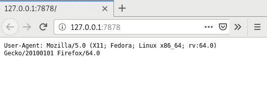

# 使用框架进行简单的 REST 定义和请求路由

在本章中，我们将探讨创建微服务的替代框架。在前面的章节中，我们使用了`hyper`crate 来处理 HTTP 交互，但它要求我们编写异步代码。如果你不需要低级控制，如果你创建的微服务在高负载下无法工作，或者你需要简单快速地编写代码，你可以尝试使用以下 crate 来创建微服务：

+   `rouille`

+   `nickel`

+   `rocket`

+   `gotham`

在本章中，我们将创建四个使用之前章节中数据库交互概念的微服务。

# 技术要求

本章向您介绍了新的 crate——`rouille`、`nickel`、`rocket`和`gotham`。你不需要安装除`cargo`和 Rust 编译器之外的特殊软件，但你需要一个 nightly 版本，因为 Rocket 框架需要它。

为了使示例复杂，我们将使用 SQL 数据库和 SMTP 服务器。但你不需要在本地安装此软件。使用 Docker 启动带有 PostgreSQL 和 Postfix 服务器的容器就足够了。

你可以从 GitHub 上的相关项目获取本章的源代码：[`github.com/PacktPublishing/Hands-On-Microservices-with-Rust/tree/master/Chapter09`](https://github.com/PacktPublishing/Hands-On-Microservices-with-Rust/tree/master/Chapter09)。

# Rouille

`rouille`crate 帮助你使用`route!`宏通过简单的路由声明创建微服务。这个框架提供了一个同步 API，每个请求都由池中的一个线程处理。

# 创建微服务

让我们使用 Rouille 框架编写一个用户注册的微服务。它允许用户创建账户并授权使用其他微服务。我们可以从创建服务器实例开始。

# 启动服务器

Rouille 框架非常易于使用。它包含`start_server`函数，这些函数期望一个函数来处理每个传入的请求。让我们创建一个`main`函数，使用带有`r2d2`池功能的`diesel`crate，并调用一个处理请求的函数：

```rs
fn main() {
     env_logger::init();
     let manager = ConnectionManager::<SqliteConnection>::new("test.db");
     let pool = Pool::builder().build(manager).expect("Failed to create pool.");
     rouille::start_server("127.0.0.1:8001", move |request| {
         match handler(&request, &pool) {
             Ok(response) => { response },
             Err(err) => {
                 Response::text(err.to_string())
                     .with_status_code(500)
             }
         }
     })
 }
```

我们为本地`test.db` SQLite 数据库创建了一个`ConnectionManager`和一个带有此管理器的`Pool`实例。我们之前章节中讨论过这一点。我们感兴趣的是带有`rouille::start_server`函数调用的那一行。这个函数接受两个参数：一个监听地址和一个用于处理请求的闭包。我们将`pool`移动到闭包中，并调用位于其下方的`handler`函数，以生成一个以`Pool`作为参数的请求响应。

由于`handler`函数必须返回一个`Response`实例，如果一个`handler`函数返回错误，我们必须返回一个带有 500 状态码的响应。看起来很简单，不是吗？让我们看看`handler`函数的声明。

# 处理请求

Rouille 框架包含一个 `router!` 宏，它可以帮助你为每个路径和 HTTP 方法声明处理程序。如果我们添加一个从 `start_server` 函数调用中使用的闭包中调用的 `handler` 函数，`router!` 宏期望一个请求实例作为第一个参数和所需的请求处理程序数量。让我们按顺序分析四个处理程序函数。

# 根处理程序

以下是一个简单的处理程序，它期望一个 `GET` 方法并返回一个文本响应：

```rs
(GET) (/) => {
    Response::text("Users Microservice")
},
```

# 注册处理程序

要处理注册请求，我们需要为 `/signup` 路径提供一个 `POST` 方法处理程序。我们可以按以下方式声明它：

```rs
(POST) (/signup) => {
    let data = post_input!(request, {
        email: String,
        password: String,
    })?;
    let user_email = data.email.trim().to_lowercase();
    let user_password = pbkdf2_simple(&data.password, 12345)?;
    {
        use self::schema::users::dsl::*;
        let conn = pool.get()?;
        let user_exists: bool = select(exists(users.filter(email.eq(user_email.clone()))))
            .get_result(&conn)?;
        if !user_exists {
            let uuid = format!("{}", uuid::Uuid::new_v4());
            let new_user = models::NewUser {
                id: &uuid,
                email: &user_email,
                password: &user_password,
            };
            diesel::insert_into(schema::users::table).values(&new_user).execute(&conn)?;
            Response::json(&())
        } else {
            Response::text(format!("user {} exists", data.email))
                .with_status_code(400)
        }
    }
}
```

这个处理程序更复杂，也展示了如何解析请求的参数。我们需要解析一个包含两个参数——`email` 和 `password` 的 HTML 表单。为此，我们使用了 `post_input!` 宏，它期望一个请求实例和一个带有类型的表单声明。表单结构声明看起来像是一个没有名称但带有字段的简单结构声明。我们添加了两个必要的字段，`post_input!` 宏解析请求以填充具有相应字段的对象。

由于解析的参数只适合类型，我们还需要对其进行额外的处理。`email` 字段是 `String` 类型，我们使用了 `trim` 方法来删除不必要的空格，并使用 `to_lowercase` 方法将其转换为小写。我们没有对 `password` 字段进行任何更改，并将其作为参数传递给 `rust-crypto` crate 的 `pbkdf2_simple` 方法。

PBKDF2 是一种算法，它通过向加密值添加计算成本来防止暴力攻击。如果你的微服务遭到攻击并且你的密码被盗，攻击者将很难找到密码值以使用他人的账户访问服务。如果你使用散列，那么攻击者将能够快速找到匹配的密码。

在我们准备参数后，我们使用对象关系映射方法使用它们。首先，为了检查提供的电子邮件地址是否已存在用户，我们使用由 `diesel` crate 生成的 DSL，如果用户不存在，我们使用 `uuid` crate 为用户生成一个唯一的 ID。处理程序使用相应的值填充 `NewUser` 实例并将其插入数据库。成功后，它返回一个空的 JSON 响应。如果用户已经存在，处理程序返回一个包含 400 状态码（错误响应）的响应，并带有一条消息，说明提供的电子邮件地址的用户已存在。让我们看看如何使用存储的用户值进行登录。

# 登录处理程序

以下代码表示 `/signin` 请求路径的处理程序，并使用 `post_input!` 解析来自 HTML 表单的数据：

```rs
(POST) (/signin) => {
    let data = post_input!(request, {
        email: String,
        password: String,
    })?;
    let user_email = data.email;
    let user_password = data.password;
    {
        use self::schema::users::dsl::*;
        let conn = pool.get()?;
        let user = users.filter(email.eq(user_email))
            .first::<models::User>(&conn)?;
        let valid = pbkdf2_check(&user_password, &user.password)
            .map_err(|err| format_err!("pass check error: {}", err))?;
        if valid {
            let user_id = UserId {
                id: user.id,
            };
            Response::json(&user_id)
                .with_status_code(200)
        } else {
            Response::text("access denied")
                .with_status_code(403)
        }
    }
}
```

数据提取后，我们从连接池中获取一个连接，并使用 `diesel` 包生成的类型向数据库发送查询。代码从用户表中获取提供的电子邮件值对应的第一条记录。之后，我们使用 `pbkdf2_check` 函数检查密码是否与存储的密码匹配。如果用户有效，我们返回一个包含用户 ID 的 JSON 值。在接下来的章节中，我们不会直接提供这个服务，而是将从另一个微服务中使用它。如果密码不匹配，我们将返回一个带有 `403` 状态码的响应。

# 默认处理器

对于没有匹配路径或方法对的请求，我们可以添加一个默认处理器。我们的微服务对所有未知请求返回 `404` 错误。将其添加到 `router!` 宏调用中：

```rs
_ => {
    Response::empty_404()
}
```

# 编译和运行

使用以下命令准备数据库并运行服务器：

```rs
DATABASE_URL=test.db diesel migration run
cargo run
```

当服务器启动时，尝试发送登录和注册请求：

```rs
curl -d "email=user@example.com&password=password" -X POST http://localhost:8001/signup
curl -d "email=user@example.com&password=password" -X POST http://localhost:8001/signin
```

第二个请求将返回一个包含用户标识符的 JSON 格式响应，其外观如下：

```rs
{"id":"08a023d6-be15-46c1-a6d6-56f0e2a04aae"}
```

现在，我们可以尝试使用 `nickel` 包实现另一个服务。

# Nickel

另一个帮助我们非常简单地创建微服务的框架是 `nickel`。在处理器的设计方面，它与 `hyper` 非常相似，但它支持同步操作。

# 创建微服务

让我们创建一个向任何地址发送电子邮件的服务。这个微服务还将从模板构建电子邮件的正文内容。首先，我们必须添加必要的依赖项以启动服务器实例。

# 启动服务器

要编写一个邮件微服务，我们需要两个依赖项：`nickel` 包和 `lettre` 包。第一个是一个受 Node.js 的 Express 框架启发的框架。第二个实现了 SMTP 协议，并允许我们与 Postfix 等邮件服务器交互。将这些依赖项添加到 `Cargo.toml` 文件中：

```rs
failure = "0.1"
lettre = { git = "https://github.com/lettre/lettre" }
lettre_email = { git = "https://github.com/lettre/lettre" }
nickel = "0.10"
```

对于 `lettre` 包，我们使用 GitHub 上的 0.9.0 版本，因为在编写时它不在 crates.io 上可用。我们需要从这些包中导入一些类型：

```rs
use lettre::{ClientSecurity, SendableEmail, EmailAddress, Envelope, SmtpClient, SmtpTransport, Transport};
use lettre::smtp::authentication::IntoCredentials;
use nickel::{Nickel, HttpRouter, FormBody, Request, Response, MiddlewareResult};
use nickel::status::StatusCode;
use nickel::template_cache::{ReloadPolicy, TemplateCache};
```

`std` 和 `failure` 包中的类型在前面代码中没有展示。现在我们可以声明代表服务器共享状态的 `Data` 结构体：

```rs
struct Data {
    sender: Mutex<Sender<SendableEmail>>,
    cache: TemplateCache,
}
```

这个结构体包含两个字段——一个 `Sender` 用于向我们将要实现的邮件工作进程发送消息，以及 `TemplateCache`，它允许我们从本地目录加载和渲染模板。我们只直接使用它来生成电子邮件的正文，因为这个微服务不会渲染 HTML 响应。

以下代码启动了一个邮件发送工作进程，创建了一个 `Data` 结构体的实例，创建了一个 `Nickel` 服务器，并将其绑定到 `127.0.0.1:8002` 端口地址：

```rs
fn main() {
    let tx = spawn_sender();

    let data = Data {
        sender: Mutex::new(tx),
        cache: TemplateCache::with_policy(ReloadPolicy::Always),
    };

    let mut server = Nickel::with_data(data);
    server.get("/", middleware!("Mailer Microservice"));
    server.post("/send", send);
    server.listen("127.0.0.1:8002").unwrap();
}
```

在 `Data` 结构体的 `cache` 字段中，我们设置了一个需要 `ReloadPolicy` 参数的 `TemplateCache` 实例。`ReloadPolicy` 参数控制模板将重新加载的频率。我们使用 `Always` 变体，这意味着模板将在每次渲染时重新加载。它允许管理员更新模板而不会中断服务。

要启动服务器，我们需要创建一个 `Nickel` 实例，并使用 `with_data` 方法用 `Data` 实例初始化它。由于 `Data` 将在多个线程之间共享，我们必须将 `Sender` 包装在 `Mutex` 中。`TemplateCache` 已经实现了 `Sync` 和 `Send`，并且可以安全地共享。

我们使用 `get` 和 `post` 方法向 `Nickel` 服务器实例添加两个方法。我们添加了两个处理器。第一个是针对根路径 `/`，它使用来自 `nickel` 包的 `middleware!` 宏附加一个返回文本响应的处理程序。第二个处理程序处理带有 `/send` 路径的请求，并调用位于其下的 `send` 函数。最后一个方法调用 `listen` 将服务器的套接字绑定到一个地址。现在我们可以继续前进并实现一个处理程序。

# 处理请求

Nickel 框架的处理程序接受两个参数：一个可变引用到 `Request` 结构体和一个拥有的 `Response` 实例，我们可以用数据填充它。处理程序必须返回 `MiddlewareResult`。每个输入和输出类型都有一个共享数据类型的类型参数。

`nickel` 包包含 `try_with!` 宏。它需要解包 `Result` 类型，但如果结果等于 `Err`，则返回 HTTP 错误。我创建了 `send_impl` 方法来使用常规的 `?` 操作符；`failure::Error` 是错误类型。我发现这比使用像 `try_with!` 这样的特殊宏更常见：

```rs
fn send<'mw>(req: &mut Request<Data>, res: Response<'mw, Data>) -> MiddlewareResult<'mw, Data> {
    try_with!(res, send_impl(req).map_err(|_| StatusCode::BadRequest));
    res.send("true")
}
```

我们将结果映射到 `BadRequest`。如果方法返回 `Ok`，我们将发送一个 JSON `true` 值作为响应。对于这种最简单的 JSON 值类型，我们不需要使用序列化。

以下代码是 `send_impl` 函数的实现。让我们逐个分析：

```rs
fn send_impl(req: &mut Request<Data>) -> Result<(), Error> {
    let (to, code) = {
        let params = req.form_body().map_err(|_| format_err!(""))?;
        let to = params.get("to").ok_or(format_err!("to field not set"))?.to_owned();
        let code = params.get("code").ok_or(format_err!("code field not set"))?.to_owned();
        (to, code)
    };
    let data = req.server_data();
    let to = EmailAddress::new(to.to_owned())?;
    let envelope = Envelope::new(None, vec![to])?;
    let mut params: HashMap<&str, &str> = HashMap::new();
    params.insert("code", &code);
    let mut body: Vec<u8> = Vec::new();
    data.cache.render("templates/confirm.tpl", &mut body, &params)?;
    let email = SendableEmail::new(envelope, "Confirm email".to_string(), Vec::new());
    let sender = data.sender.lock().unwrap().clone();
    sender.send(email).map_err(|_| format_err!("can't send email"))?;
    Ok(())
}
```

`Request` 实例具有 `from_body` 方法，该方法返回一个 `Params` 结构体实例的查询参数。`Params` 的 `get` 方法返回一个名为 `Option` 的参数。如果任何参数未提供，我们将返回一个 `Err` 值，因为该方法要求所有参数都必须设置。

要访问共享服务器的数据，有 `Request` 的 `server_data` 方法，它返回一个 `Data` 实例，因为我们将其设置为 `Request` 的类型参数，并向服务器提供了一个 `Data` 实例。

当我们获取所有参数后，我们可以提取一个 `Sender` 实例（用于向工作者发送任务），使用缓存中的模板编写一封电子邮件，并将其发送给工作者。我们从查询的 `to` 参数创建一个 `EmailAddress` 实例。然后，我们用包含具有确认码值的 `code` 参数的模板参数填充 `HashMap`。

参数已经准备就绪，我们使用`Data`实例的`cache`字段来访问`TemplateCache`。缓存中的`render`方法加载一个模板并用提供的参数填充它。`render`方法期望一个缓冲区来填充渲染的内容。在我们获取它之后，我们创建一个`SendableEmail`实例，克隆一个`Sender`，并使用克隆的实例向一个工作节点发送电子邮件。让我们看看电子邮件工作节点是如何实现的。

# 发送电子邮件的工作节点

我们使用一个单独的线程来接收`SendableEmail`值，并使用 SMTP 协议发送它们。以下代码创建了一个`SmtpClient`实例，并使用`credentials`方法设置连接的凭据：

```rs
fn spawn_sender() -> Sender<SendableEmail> {
    let (tx, rx) = channel();
    let smtp = SmtpClient::new("localhost:2525", ClientSecurity::None)
        .expect("can't start smtp client");
    let credentials = ("admin@example.com", "password").into_credentials();
    let client = smtp.credentials(credentials);
    thread::spawn(move || {
        let mut mailer = SmtpTransport::new(client);
        for email in rx.iter() {
            let result = mailer.send(email);
            if let Err(err) = result {
                println!("Can't send mail: {}", err);
            }
        }
        mailer.close();
    });
    tx
}
```

`StmpClient`已移动到新线程的上下文中。它被`SmtpTransport`包装，并用于发送每个接收到的`SendableEmail`实例。

工作节点实现了一个非事务性的电子邮件发送器。如果你想保证电子邮件的投递，你需要与邮件服务器实现更多样化的交互，或者你可以甚至嵌入一个邮件服务器，或者使用第三方服务。我建议你尽可能多地使用外部服务；虽然它们会花费你一些费用，但你在维护方面可以节省更多。我们仅为了演示目的实现了邮件服务，以展示如何将多个服务集成在一起。

# 编译和运行

在我们开始微服务之前，我们需要一个工作的 SMTP 服务器。让我们使用 Docker 创建一个。以下命令创建了一个包含 Postfix 服务器实例的容器：

```rs
docker run -it --rm --name test-smtp -p 2525:25  \
 -e SMTP_SERVER=smtp.example.com \
 -e SMTP_USERNAME=admin@example.com \
 -e SMTP_PASSWORD=password \
 -e SERVER_HOSTNAME=smtp.example.com \
 juanluisbaptiste/postfix
```

服务器公开端口`*25*`，我们将它重映射到本地端口`*2525*`。该命令使用环境变量设置所有必要的参数，现在邮件微服务已准备好编译和运行。使用`cargo run`命令执行此操作，启动后，使用以下命令进行检查：

```rs
curl -d "to=email@example.com&code=passcode" -X POST http://localhost:8002/send
```

当你调用这个命令时，微服务将构建并发送一封电子邮件到 Postfix 服务器。实际上，这封电子邮件不会被投递，因为我们的邮件服务器仅作为中继使用，许多邮件服务会拒绝来自这种邮件服务器的电子邮件。如果你想接收电子邮件，你需要相应地配置该服务。

# 火箭

我们将要探索的下一个框架是 Rocket。它是一个易于使用的框架，它使用夜间编译器的功能提供了一种将一组 Rust 函数转换为完整 Web 服务的工具。Rocket 框架与我们之前讨论的框架不同。它使用环境变量实现应用程序配置和日志记录。这种方法的不足之处在于调整和替换部分稍微复杂一些，但这种方法的好处是，你在编码微服务的日志和配置功能上几乎不花时间。

# 创建微服务

让我们创建一个实现我们应用程序评论功能的微服务。它将接受新的评论并将它们存储在数据库中。此外，客户端可以请求微服务中的任何和所有评论。首先，我们需要使用 Rocket 框架启动一个新的服务器。

# 启动服务器

要启动服务器实例，我们必须准备数据库交互。但是它并不能像使用`diesel` crate 那样直接工作。为了连接数据库，我们必须添加所需的 crates 并激活`rocket_contrib` crate 的必要功能：

```rs
rocket = "0.4.0-rc.1"
rocket_contrib = { version = "0.4.0-rc.1", features = ["diesel_sqlite_pool"] }
serde = "1.0"
serde_json = "1.0"
serde_derive = "1.0"
diesel = { version = "1.3", features = ["sqlite", "r2d2"] }
diesel_migrations = "1.3"
log = "0.4"
```

我们使用了`rocket_contrib` crate 的`diesel_sqlite_pool`功能和`diesel` crate 中的`sqlite`以及`r2d2`。以下代码行从我们需要的所有 crates 中导入宏，添加我们稍后将要创建的`comment`模块，并导入所有必要的类型：

```rs
#![feature(proc_macro_hygiene, decl_macro)]

#[macro_use]
extern crate rocket;
#[macro_use]
extern crate diesel;
#[macro_use]
extern crate diesel_migrations;
#[macro_use]
extern crate log;
#[macro_use]
extern crate serde_derive;
#[macro_use]
extern crate rocket_contrib;

mod comment;

use rocket::fairing::AdHoc;
use rocket::request::Form;
use rocket_contrib::json::Json;
use diesel::SqliteConnection;
use comment::{Comment, NewComment};
```

你还会看到我们使用了 nightly 发布版中的两个功能：`proc_macro_hygiene`和`decl_macro`。没有这些功能，你无法声明处理器。

nightly Rust 编译器包含许多酷但不稳定的功能。不稳定并不意味着你不能在生产应用程序中使用它们；这意味着这些功能可能会更改或甚至被删除。它们的不稳定性意味着使用它们是有风险的，因为你可能需要稍后重写你的代码。Rocket 框架要求你使用一些不稳定的功能。你可以在不稳定手册中找到不稳定功能的完整列表：[`doc.rust-lang.org/stable/unstable-book/`](https://doc.rust-lang.org/stable/unstable-book/)。

现在，我们可以在代码中连接到 SQLite 数据库。为此，我们为`SqliteConnection`创建一个包装器，并将用户数据库属性设置为`global.database.sqlite_database`参数，以分配数据库连接：

```rs
#[database("sqlite_database")]
pub struct Db(SqliteConnection);
```

我们还使用了迁移嵌入功能，它将`migrations`文件夹中的所有 SQL 脚本包含在一个程序中：

```rs
embed_migrations!();
```

现在，我们可以创建并启动服务器实例。我们通过调用`ignite`方法创建一个`Rocket`实例，但在启动它之前，我们在 Rocket 框架中添加了两个称为 fairings 的中间件。第一个是为`Db`数据库包装器创建的，它为请求提供数据库池。第二个是`AdHoc` fairing，它尝试为数据库运行迁移。看看以下代码：

```rs
fn main() {
    rocket::ignite()
        .attach(Db::fairing())
        .attach(AdHoc::on_attach("Database Migrations", |rocket| {
            let conn = Db::get_one(&rocket).expect("no database connection");
            match embedded_migrations::run(&*conn) {
                Ok(_) => Ok(rocket),
                Err(err) => {
                    error!("Failed to run database migrations: {:?}", err);
                    Err(rocket)
                },
            }
        }))
        .mount("/", routes![list, add_new])
        .launch();
}
```

之后，我们调用`mount`方法将路由添加到根路径。路由是通过`routes!`宏创建的，其中我们包括本节稍后定义的所有路由。当`Rocket`实例构建完成后，我们通过调用`launch`方法来运行它。

# 处理请求

我们的微服务包含两个处理器。第一个处理器处理`/list`路径的请求，并从数据库返回所有评论：

```rs
#[get("/list")]
fn list(conn: Db) -> Json<Vec<Comment>> {
    Json(Comment::all(&conn))
}
```

如您所见，Rocket 框架中的处理器是一个函数，它接受`**rocket**`自动绑定的参数，并期望一个函数返回一个结果。我们的`list`函数返回 JSON 格式的评论列表。我们使用在`comment`模块中声明的`Comment`模型，通过函数参数提供的连接池提取所有评论。

要声明一个方法和路径，我们向具有所需路径的函数声明中添加`get`属性。`get`属性允许您使用`GET`方法调用处理器。此外，还有一个`post`属性，我们用它来添加评论处理器：

```rs
#[post("/new_comment", data = "<comment_form>")]
fn add_new(comment_form: Form<NewComment>, conn: Db) {
    let comment = comment_form.into_inner();
    Comment::insert(comment, &conn);
}
```

前面的函数期望两个参数：`Form`，它可以解析到`NewComment`对象，以及`Db`实例。`Form`包装器持有提供的类型内部值。为了提取它，我们调用`into_inner`方法，在我们的情况下返回`NewComment`结构体。如果表单不提供请求，该方法甚至不会被调用。我们在`post`属性的`data`绑定中设置一个参数，用于存储提供的数据。最后，我们使用`Comment`类型的插入方法，使用提供的`Connection`将`NewComment`结构体插入到数据库中。

就这些！微服务已经声明。这很简单，不是吗？但我们最后需要的是模式声明。让我们添加它。

# 数据库模式和管理

评论将存储在具有三个字段的`comments`表中：评论的`id`、用户的`uid`和评论的`text`：

```rs
mod schema {
    table! {
        comments {
            id -> Nullable<Integer>,
            uid -> Text,
            text -> Text,
        }
    }
}
```

`Comment`结构体的声明如下：

```rs
#[table_name="comments"]
#[derive(Serialize, Queryable, Insertable, Debug, Clone)]
pub struct Comment {
    pub id: Option<i32>,
    pub uid: String,
    pub text: String,
}
```

我们在`Comment`结构体中重复了相同的字段，并添加了没有`id`的`NewComment`结构体：

```rs
#[derive(FromForm)]
pub struct NewComment {
    pub uid: String,
    pub text: String,
}
```

现在来点新的——我们为`NewComment`结构体推导出`FormForm`类型。这有助于 Rocket 将查询转换为`Form`实例。下一个`Comment`结构体实现添加了两个方法：

```rs
impl Comment {
    pub fn all(conn: &SqliteConnection) -> Vec<Comment> {
        all_comments.order(comments::id.desc()).load::<Comment>(conn).unwrap()
    }

    pub fn insert(comment: NewComment, conn: &SqliteConnection) -> bool {
        let t = Comment { id: None, uid: comment.uid, text: comment.text };
        diesel::insert_into(comments::table).values(&t).execute(conn).is_ok()
    }
}
```

我们使用由`diesel`包生成的函数与数据库交互，使用`Connection`实例。如果您想了解更多关于`diesel`包的信息，您可以在第八章中阅读更多，*使用对象关系映射与数据库交互*。

# 编译和运行

要运行使用`Rocket`创建的微服务，您需要创建一个`Rocket.toml`配置文件。这允许您在启动之前配置微服务。查看以下`Rocket.toml`内容：

```rs
[global]
template_dir = "static"
address = "127.0.0.1"
port = 8003

[global.databases.sqlite_database]
url = "test.db"
```

在这个配置中，我们声明了全局参数，例如：包含模板的`template_dir`目录（如果使用它）、`address`和`port`，以及数据库连接的`url`。

您可以使用环境变量覆盖任何参数。例如，如果我们需要将`port`参数设置为 80，我们可以使用以下命令运行微服务：

```rs
ROCKET_PORT=3721 cargo run
```

Rocket 框架也支持三种不同的环境类型：`development`、`staging`和`production`。它允许你在同一个配置中拥有三个配置。在`global`部分之外添加一个额外的部分，并使用相应的模式运行微服务：

```rs
ROCKET_ENV=staging cargo run
```

要测试一个微服务，只需用简单的`cargo run`命令启动它，无需额外参数。当服务启动时，我们可以添加以下命令的注释并打印所有注释的列表：

```rs
curl -d 'uid=user_id&text="this is a comment"' -X POST http://localhost:8003/new_comment
curl http://localhost:8003/list
```

此命令以 JSON 格式打印所有注释。正如你所见，我们没有直接将任何结构体转换为 JSON。Rocket 会自动完成这项工作。

# Gotham

我们已经学习了如何使用三个简化微服务编写的框架：Rouille、Nickel 和 Rocket。但所有这些框架都是同步的。如果你想编写异步微服务，你有三条路径可以选择：直接使用`hyper`依赖库，就像我们在第二章中做的那样，*使用 Hyper 依赖库开发微服务*；使用使用`hyper`和`tokio`的`gotham`依赖库；或者使用`actix-web`框架。在本节中，我们将学习如何使用`gotham`依赖库和异步的`tokio-postgres`依赖库来异步地与 PostgreSQL 交互。我们将在第十一章中学习如何使用`actix-web`依赖库，*使用 Actors 和 Actix 依赖库处理并发*。

作为使用`gotham`依赖库的示例，我们将创建一个微服务，该服务从请求中获取`User-Agent` `header`并将其存储在 PostgreSQL 数据库中。我们将创建一个完全异步的应用程序，并了解`tokio-postgres`依赖库。

# 创建一个微服务

创建一个新的二进制依赖库，并添加以下依赖：

```rs
failure = "0.1"
futures = "0.1"
gotham = "0.3"
gotham_derive = "0.3"
hyper = "0.12"
mime = "0.3"
tokio = "0.1"
tokio-postgres = { git = "https://github.com/sfackler/rust-postgres" }
```

正如你所见，我们添加了`gotham`和`gotham_derive`依赖库。第一个是一个框架，第二个帮助我们为所需的共享连接推导出`StateData`特质的实现。`gotham_derive`依赖库也可以用来推导中间件的`NewMiddleware`特质，但我们的示例不需要特殊的中间件。

我们还添加了`tokio-postgres`依赖库。它包含了一个异步数据库连接器的实现，用于 PostgreSQL。

# 框架类型

我们需要为微服务准备很多类型。让我们简要谈谈我们这里导入的每个类型：

```rs
use failure::{Error, format_err};
use futures::{Future, Stream, future};
use gotham::handler::HandlerFuture;
use gotham::middleware::state::StateMiddleware;
use gotham::pipeline::single::single_pipeline;
use gotham::pipeline::single_middleware;
use gotham::router::Router;
use gotham::router::builder::{DefineSingleRoute, DrawRoutes, build_router};
use gotham::state::{FromState, State};
use gotham_derive::StateData;
use hyper::Response;
use hyper::header::{HeaderMap, USER_AGENT};
use std::sync::{Arc, Mutex};
use tokio::runtime::Runtime;
use tokio_postgres::{Client, NoTls};
```

很可能你已经熟悉`failure`和`futures`依赖库中的类型，因为我们在这本书的第一部分中大量使用了它们。最有趣的是`gotham`依赖库的类型。有多个模块涵盖了框架的不同部分；`handler`模块包含`HandlerFuture`，它是`Future`特质的别名，具有预定义的类型：

```rs
type HandlerFuture = dyn Future<
    Item = (State, Response<Body>),
    Error = (State, HandlerError)
    > + Send;
```

我们将在异步处理程序中使用这个`Future`别名。此外，此模块包含`IntoHandlerFuture`特质，该特质为可以转换为响应的元组实现。

`middleware`模块包含`StateMiddleware`，我们将使用它来将状态附加到我们的微服务上。

`pipeline`模块包含我们将要使用的两个函数：`single_middleware`和`single_pipeline`。第一个函数在内部创建一个包含单个提供的中间件的`Pipeline`。第二个函数是创建从单个管道实例创建管道链所必需的。

`router`模块包括我们构建微服务路由表的所需类型。`Router`结构是一个包含路由的类型，我们必须实例化并提供它给服务器。我们将通过调用`build_router`函数来完成这项工作。

对于`DrawRoutes`特质，我们需要有`Router`的方法来添加路径。它添加了`get`、`get_or_head`、`put`、`post`和其他方法来注册与相应 HTTP 方法对应的路径。调用这些方法返回`SingleRouteBuilder`实例，我们需要使用`DefineSingleRoute`特质为`to`方法，这允许我们将注册的路径映射到`Handler`。

`state`模块为我们提供了使用通用的`State`并将其通过调用实现了`StateData`特质的类型所实现的`FromState`特质的`borrow_from`方法转换为所需类型的可能性。

在`gotham`中的通用`State`是一个非常灵活的概念，它提供了获取环境不同部分引用的能力。你可以获取你自己的状态类型的引用或请求数据的引用。

我们需要从`hyper`crate 中获取一些类型，因为该 crate 在`gotham`实现中以及某些类型的`hyper`中使用。我们导入了`Response`类型来创建客户端的响应，以及`HeaderMap`来获取对请求头部的访问，因为我们需要获取`USER_AGENT`头部的值。

由于我们正在开发一个异步应用程序，我们必须使用相同的 reactor 在同一运行时中执行所有任务。为此，我们将使用从`tokio`crate 中手动创建的`Runtime`。

要连接到数据库，我们需要从`tokio-postgres`crate 中导入`Client`类型和`NoTls`来配置连接。

现在我们已经导入了编写应用程序的`main`函数所需的所有内容。

# 主函数

在`main`函数的实现中，我们创建一个`Runtime`实例，我们将使用它进行数据库查询和处理 HTTP 请求。查看以下代码：

```rs
pub fn main() -> Result<(), Error> {
    let mut runtime = Runtime::new()?;

    let handshake = tokio_postgres::connect("postgres://postgres@localhost:5432", NoTls);
    let (mut client, connection) = runtime.block_on(handshake)?;
    runtime.spawn(connection.map_err(drop));

    // ...
}
```

我们创建一个`Runtime`实例。之后，我们可以通过调用`tokio-postgres`crate 的连接函数来创建一个新的数据库连接。它返回一个`Future`，我们必须立即执行它。要运行`Future`，我们将使用我们已创建的相同的`Runtime`。`Runtime`有我们已经在第五章中讨论过的`block_on`方法，*使用 Futures Crate 理解异步操作*。我们用`Connect`未来调用它，并获取一对结果：`Client`和`Connection`实例。

`Client`是一个提供创建语句方法的类型。我们将在这个部分稍后声明的`ConnState`中存储这个实例。

`Connection`类型是一个执行与数据库实际交互的任务。我们必须在`Runtime`中派发这个任务。如果你忘记这样做，你的数据库查询将被阻塞，永远不会发送到数据库服务器。

现在，我们可以使用`Client`实例来执行 SQL 语句。我们需要的第一个语句是创建一个用于记录`User-Agent` `header`值的表。`Client`结构体有`batch_execute`方法，它从字符串中执行多个语句。我们只使用了一个语句，但如果你想创建多个表，这个调用很有用：

```rs
let execute = client.batch_execute(
     "CREATE TABLE IF NOT EXISTS agents (
         agent TEXT NOT NULL,
         timestamp TIMESTAMPTZ NOT NULL DEFAULT NOW()
     );");
 runtime.block_on(execute)?;
```

`batch_execute`返回一个`Future`实例，我们必须立即执行它以在插入记录之前初始化数据库。我们使用`Runtime`实例的`block_on`方法来执行语句。

在我们完成实现主函数之前，让我们看看`ConnState`结构体的实现：

```rs
#[derive(Clone, StateData)]
struct ConnState {
    client: Arc<Mutex<Client>>,
}
```

结构体非常简单，包含一个原子引用计数器`Arc`，它包装了一个带有`Mutex`的数据库`Client`。我们只需要一个方法来简化实例创建：

```rs
impl ConnState {
    fn new(client: Client) -> Self {
        Self {
            client: Arc::new(Mutex::new(client)),
        }
    }
}
```

但你也可以添加一个方法来获取这个状态的内值。如果你想在单独的模块中声明状态类型，这很有用。我们将直接使用`client`字段。

此外，你可能还会注意到`ConnState`继承了`Clone`和`StateData`特性。结构体必须是可克隆的，因为 Gotham 会为每个请求克隆一个状态。`StateData`允许我们将此结构体的一个实例附加到`StateMiddleware`。

现在，我们可以完成`main`函数的实现：

```rs
let state = ConnState::new(client);
let router = router(state);

let addr = "127.0.0.1:7878";
println!("Listening for requests at http://{}", addr);
gotham::start_on_executor(addr, router, runtime.executor());
runtime
    .shutdown_on_idle()
    .wait()
    .map_err(|()| format_err!("can't wait for the runtime"))
```

我们使用`Client`值创建了`ConnState`状态，并将结果存储在`state`变量中，用于`router`函数调用，我们将在稍后声明。

之后，我们可以通过调用`start_on_executor`函数来启动 Gotham 服务器。它期望三个参数：我们设置为`"127.0.0.1:7878"`的*地址*，我们使用`router`函数调用创建的*路由器*值，以及我们从`Runtime`中提取的`TaskExecutor`实例。

实际上，`start_on_executor`函数调用会向异步反应器派发一个任务，我们必须启动我们的`Runtime`实例。我们可以通过调用`shutdown_on_idle`方法来实现，它返回一个`Shutdown`未来对象，我们使用`wait`方法调用在当前线程中运行它。当所有任务完成时，`main`函数结束。

让我们看看创建我们应用程序的`Router`实例的`router`函数实现：

```rs
fn router(state: ConnState) -> Router {
    let middleware = StateMiddleware::new(state);
    let pipeline = single_middleware(middleware);
    let (chain, pipelines) = single_pipeline(pipeline);
    build_router(chain, pipelines, |route| {
        route.get("/").to(register_user_agent);
    })
}
```

在函数实现中，我们创建一个`StateMiddleware`实例，并将`ConnState`提供给它。我们通过`single_middleware`调用将中间件添加到管道中，并通过调用`single_pipeline`函数调用创建一个链。它返回一个链和一组管道。

我们将这些值传递给`build_router`函数，该函数返回`Router`实例，但我们可以通过在将闭包作为第三个参数传递给`build_router`函数时调用`RouterBuilder`的方法来调整生成的`Router`。

我们调用`RouterBuilder`的 get 方法，将`register_user_agent`函数中实现的处理器设置到根路径`/`。Gotham 框架支持路由的 scope 范围，这可以帮助你通过路径前缀来分组处理器，如下所示：

```rs
route.scope("/checkout", |route| {
    route.get("/view").to(checkout::view);
    route.post("/item").to(checkout::item::create);
    route.get("/item").to(checkout::item::read);
    route.put("/item").to(checkout::item::update);
    route.patch("/item").to(checkout::item::update);
    route.delete("/item").to(checkout::item::delete);
}
```

现在我们只需要实现一个处理器。

# 处理器实现

Gotham 中的每个处理器都必须返回一个可以转换为`HandlerFuture`的元组的`HandlerFuture`实现。此外，处理器必须接受一个`State`参数：

```rs
fn register_user_agent(state: State) -> Box<HandlerFuture> {
    // Implementation
}
```

如果你记得，我们需要从请求中提取`User-Agent` `header`。我们可以使用`State`值来完成此操作，因为我们可以通过`borrow_from`方法调用从`State`借用`HeaderMap`。它返回一个我们可以使用`USER_AGENT`键（从`hyper` crate 导入）来获取`User-Agent` HTTP `header`的映射：

```rs
let user_agent = HeaderMap::borrow_from(&state)
    .get(USER_AGENT)
    .map(|value| value.to_str().unwrap().to_string())
    .unwrap_or_else(|| "<undefined>".into());
```

`HeaderMap`返回`HeaderValue`作为`header`的值，我们必须使用`to_str`方法获取字符串值，并使用`to_string`方法将其转换为所有者字符串。如果未提供`header`，我们使用`"<undefined>"`值。

现在我们可以从`State`中借用`ConnState`值，并向数据库添加一条新记录：

```rs
let conn = ConnState::borrow_from(&state);
let client_1 = conn.client.clone();
let client_2 = conn.client.clone();

let res = future::ok(())
    .and_then(move |_| {
        let mut client = client_1.lock().unwrap();
        client.prepare("INSERT INTO agents (agent) VALUES ($1)
                        RETURNING agent")
    })
    .and_then(move |statement| {
        let mut client = client_2.lock().unwrap();
        client.query(&statement, &[&user_agent]).collect().map(|rows| {
            rows[0].get::<_, String>(0)
        })
    })
    .then(|res| {
        let mut builder = Response::builder();
        let body = {
            match res {
                Ok(value) => {
                    let value = format!("User-Agent: {}", value);
                    builder.status(StatusCode::OK);
                    value.into()
                }
                Err(err) => {
                    builder.status(StatusCode::INTERNAL_SERVER_ERROR);
                    err.to_string().into()
                }
            }
        };
        let response = builder.body(body).unwrap();
        Ok((state, response))
    });
Box::new(res)
```

我们需要两个`Client`的引用，因为我们必须解决两个未来：一个是准备查询，另一个是执行该查询。为了准备查询，我们将使用`prepare`方法，该方法期望一个包含 SQL 语句的字符串。方法调用返回一个返回`Statement`实例的`Future`实例，但我们不能在函数体中直接创建该`Future`，因为我们必须锁定`Mutex`以获取对`Client`的访问权限，并且它将在`Future`语句解决后阻塞。

要两次使用`Client`，我们需要两个`Client`的引用，并在未来的链中分别使用它们。我们通过调用`future::ok`方法来创建一个成功的`Future`，从而开始创建一个未来的链。我们使用`and_then`方法添加第一步：语句准备。然后，我们锁定`Mutex`以获取对`Client`的可变引用。接下来，我们调用`prepare`方法创建一个返回`Statement`的`Future`。

除了这些，我们还可以将下一步添加到未来的链中，以填充`Statement`中的值。我们锁定第二个`Mutex`克隆以调用`Client`的查询方法。该方法期望一个语句作为第一个参数和一个引用数组，其中包含对值的引用。由于我们知道我们使用的语句插入一条新记录并返回一行，我们从第一行的第一个位置提取一个`String`值。

在链的末端，我们使用方法将查询执行的结果 `Result` 转换为 `Response`。我们为 `Response` 创建一个新的 `Builder`。如果查询返回成功的结果，我们将其返回给客户端。如果查询失败，我们使用 `500` 状态码打印一个错误。闭包返回一个包含一对的元组：`State` 和 `Response` 实例。Gotham 使用这个结果将响应返回给客户端。

实现完成，现在我们可以使用数据库实例来检查它。

# 运行和测试

要运行此示例，我们需要一个 PostgreSQL 数据库实例。最简单的方法是启动一个 Docker 容器。我们已经在第七章，*与数据库的可靠集成*中做了这件事，在那里我们学习了如何使用 Rust 与数据库交互。你可以使用以下命令启动一个新的包含 PostgreSQL 数据库实例的容器：

```rs
docker run -it --rm --name test-pg -p 5432:5432 postgres
```

容器启动后，使用 `cargo run` 命令运行本节中编写的示例服务器。编译后它会打印出来，服务器准备好接受请求：

```rs
Listening for requests at http://127.0.0.1:7878
```

现在，你可以使用提供的链接从你的浏览器记录访问。如果配置成功，你将在浏览器中看到响应：



Gotham 处理了请求并返回了一个结果给你。如果你关闭数据库，服务器将返回一个带有 500 错误代码和 `"connection closed"` 字符串的响应。我们最后要做的就是验证服务器是否将记录添加到了数据库中，因为我们使用异步方法与数据库交互，并使用相同的 `Runtime` 来处理 HTTP 请求和执行 SQL 语句。为 `postgres://postgres@localhost:5432` 连接运行 `**psql**` 客户端并输入一个查询：

```rs
postgres=# SELECT * FROM agents;
                                                      agent                                      | timestamp           
-------------------------------------------+-------------------------------
 Mozilla/5.0 Gecko/20100101 Firefox/64.0   | 2019-01-10 19:43:59.064265+00
 Chrome/71.0.3578.98 Safari/537.36         | 2019-01-10 19:44:08.264106+00
(2 rows)
```

我们从两个不同的浏览器中发出了两个请求，现在我们在 `agents` 表中有两条记录。

# 摘要

本章向您介绍了几个简化微服务编写的舒适框架：Rouille、Nickel 和 Rocket。

Rouille 框架围绕 `router!` 宏构建，帮助你以简单的方式声明所需的全部路径和方法。路由声明看起来与我们使用 Hyper 的方式相似，但简单得多。

Nickel 框架也很简单易用，灵感来源于 JavaScript 的 Express 框架。

Rocket 框架非常酷，可以帮助你以直观、清晰的方式编写处理器，但它需要编译器的夜间版本。

Gotham 框架是一个基于 `tokio` 和 `hyper` crate 的异步框架。它允许你使用异步应用程序的所有好处：并行处理数千个请求并充分利用所有资源。我们创建了一个示例，通过向它发送查询来使用异步的 `tokio-postgres` crate 与数据库一起工作。

但是有更多的框架，我们无法涵盖所有。大多数框架都是同步的，并且使用起来很简单。如果你想编写一个异步微服务，我推荐你大多数情况下使用`actix-web` crate，我们将在下一章中对其进行探讨。
