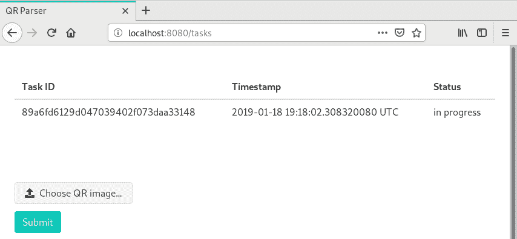
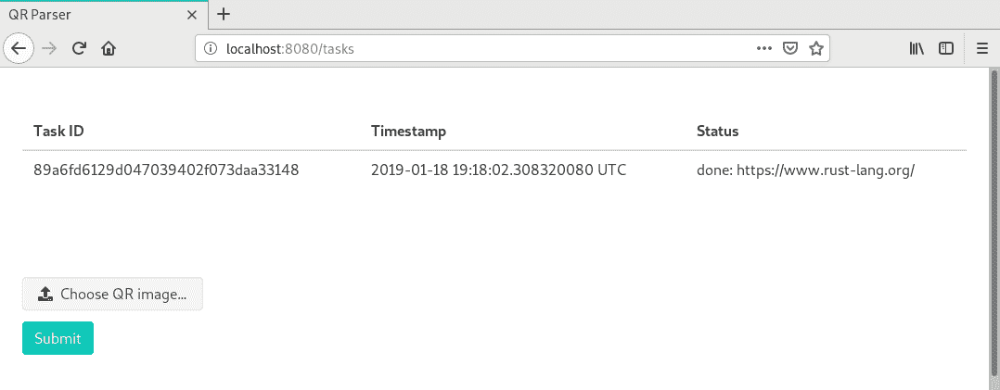

# 第十二章：可扩展微服务架构

本章描述了微服务的可扩展性。在本章中，我们将学习如何创建使用消息与其他微服务进行交互的微服务。你将熟悉 RabbitMQ 消息代理以及如何在 Rust 中使用`lapin`包来使用它。

在本章中，我们将涵盖与微服务可扩展性相关的以下概念：

+   可扩展微服务设计

+   如何避免应用程序中的瓶颈

+   消息代理是什么？

+   如何使用 Rust 与 RabbitMQ

# 技术要求

要构建可扩展的微服务，你需要一个基础设施或资源来并行运行多个微服务。但为了演示目的，我们将使用 Docker，它提供了运行我们应用程序多个实例的能力。我们还需要 Docker 来启动一个 RabbitMQ 实例。

要构建所有示例，你需要 Rust 编译器的 1.31 版本。

你可以从 GitHub 上的项目获取本章示例的所有代码：[`github.com/PacktPublishing/Hands-On-Microservices-with-Rust/tree/master/Chapter12`](https://github.com/PacktPublishing/Hands-On-Microservices-with-Rust/tree/master/Chapter12)。

# 可扩展架构

我们避免使用单体架构，如果你以正确的方式开发微服务，它们可以处理每秒更多的请求，但使用微服务并不意味着你可以毫不费力地拥有一个可扩展的应用程序。它使应用程序的任何部分都变得灵活，可以扩展，你必须编写松散耦合的微服务，这些服务可以在多个实例中运行。

# 基本思想

要使应用程序可扩展，你可以选择两种方法之一。

在第一种情况下，你可以启动整个应用程序的更多副本。你可能认为这是不可能的，但想象一下一个通过广告赚钱并提供将图像转换为 PDF 的服务。这种服务可以通过这种方式进行扩展，如果你有足够的硬件，你可以处理客户需要的任何数量的请求。

第二种方法是将应用程序拆分为处理相同类型任务的独立服务，你可以运行任意数量的服务实例。例如，如果你的应用程序是一个在线商店，你在服务器上处理图像或静态资源时遇到负载问题。这个问题很容易解决，因为你可以使用**内容分发网络**（**CDN**）或购买额外的服务器来放置必要的静态文件，运行 NGINX，并将此服务器添加到你的域名 DNS 记录中。但对于微服务，你并不总是可以使用这种方法。这需要独创性。但食谱是清晰的。当你添加额外的微服务来处理特定任务或通过缓存或其他技巧加快某些流程时，你必须为你的微服务实现松散耦合。

为了有一个更抽象的服务交互层，你可以使用对您的应用程序一无所知的消息代理，但提供从微服务到另一个微服务发送消息的能力，并返回结果。

# 消息代理和队列

消息代理将消息从一种应用程序转换为另一种应用程序。消息代理的客户端使用 API 发送序列化为特定格式的消息，并订阅队列以接收所有新消息的通知。存在 **AMQP**（即 **高级消息队列协议**）协议，它提供了一个与不同产品兼容的通用 API。

消息代理的主要概念是队列。它是一种抽象，表示用于收集消息直到它们被客户端消费的实体。

为什么消息代理的概念很酷？因为它是最简单的方式来实现服务的松耦合并保持平滑更新的可能性。您可以使用通用的消息格式并编写微服务来读取特定类型的消息。这有助于重新路由所有消息路径。例如，您可以添加特定消息类型的特定处理程序，或者设置平衡规则以加载更强大的服务。

根据您的需求，有很多消息代理可以使用。以下章节中描述了一些流行的产品。

# RabbitMQ

RabbitMQ 是最受欢迎的消息代理。这个消息代理支持 AMQP 协议。它速度快且可靠。它还便于创建短生命周期的队列，以实现基于消息的客户端-服务器交互。我们将使用这个消息代理来创建一个可扩展应用的示例。

# Kafka

Apache Kafka 最初由 LinkedIn 创建，并捐赠给了 Apache 软件基金会。它使用 Scala 实现，就像一个日志，提交所有信息并提供对其的访问。它与传统的 AMQP 代理不同，因为它维护一个提交日志，有助于实现持久消息存储。

# 应用程序瓶颈

应用程序的任何部分都可能成为瓶颈。最初，您可能遇到微服务使用的底层基础设施问题，如数据库或消息代理。扩展这些部分是一个复杂的概念，但在这里我们只会触及微服务的瓶颈。

当您创建微服务时，您可能会遇到它可以处理的请求数量问题。这取决于多个因素。您可以使用如演员模型这样的概念来在线程和事件循环之间分配负载。

如果您遇到 CPU 性能问题，您可以创建一个单独的工人来处理 CPU 密集型任务，并通过消息代理安排任务以实现松耦合，因为您可以在任何时间添加更多工人来处理更多请求。

如果你有一些 I/O 密集型任务，你可以使用负载均衡器将负载定向到特定的服务，但你的微服务应该是可替换的，并且不应该保持持久状态，但可以从数据库中加载。这允许你使用 Kubernetes 等产品自动扩展你的应用程序。

你还应该通过逻辑领域将大型任务拆分成小而独立的微服务。例如，为处理账户创建一个单独的微服务，并为在线商店渲染和显示购物车创建另一个微服务。你还可以添加另一个处理支付并与其他微服务通过消息代理传递消息的微服务。

让我们创建一个可以通过运行其某些组件的额外实例来扩展的应用程序。

# 使用 Rust 和 RabbitMQ 构建可扩展的应用程序

在本节中，我们将编写一个应用程序，该程序可以从图像中解码 QR 码到文本字符串。我们将创建两个服务——一个用于处理传入请求和解码任务，另一个是工作器，它将接收任务并将图像解码为字符串，然后将结果返回到服务器。为了实现服务之间的交互，我们将使用 RabbitMQ。对于服务器和工作器的实现，我们将使用 Actix 框架。在我们开始编码之前，让我们使用 Docker 启动一个 RabbitMQ 实例。

# 为测试启动消息代理引导信息

要启动 RabbitMQ，我们将使用 DockerHub 上的官方 Docker 镜像，位于此处：[`hub.docker.com/_/rabbitmq/`](https://hub.docker.com/_/rabbitmq/)。我们已经使用 Docker 启动了数据库实例。启动 RabbitMQ 的过程类似：

```rs
docker run -it --rm --name test-rabbit -p 5672:5672 rabbitmq:3
```

我们启动了一个名为`test-rabbit`的容器，并将端口`5672`转发到容器的相同端口。RabbitMQ 镜像还公开了端口`4369`、`5671`和`25672`。如果你想使用消息代理的高级功能，你也需要打开这些端口。

如果你想要启动一个 RabbitMQ 实例并从其他容器访问它，你可以为`run`命令设置`--hostname`参数，并使用其他容器提供的名称来连接到 RabbitMQ 实例。

当消息代理实例启动时，你可能需要从它那里获取一些统计信息。可以使用 Docker 的`exec`命令在容器内执行`rabbitmqctl`命令：

```rs
docker exec -it test-rabbit rabbitmqctl
```

它会打印出可用的命令。可以将其中任何一个添加到命令中，如下所示：

```rs
docker exec -it test-rabbit rabbitmqctl trace_on
```

前面的命令激活了跟踪所有推送到队列的消息，你可以使用以下命令查看：

```rs
docker exec -it test-rabbit rabbitmqctl list_exchanges
```

它会打印以下内容：

```rs
Listing exchanges for vhost / ...
amq.headers    headers
amq.direct    direct
amq.topic    topic
amq.rabbitmq.trace    topic
    direct
amq.fanout    fanout
amq.match    headers
```

现在，我们可以创建一个使用消息代理与工作器交互的微服务。

# 依赖项

创建一个新的库 crate（稍后我们将添加两个二进制文件）名为`rabbit-actix`：

```rs
[package]
name = "rabbit-actix"
version = "0.1.0"
edition = "2018"
```

如你所见，我们正在使用 2018 版的 Rust。我们需要一大堆 crate：

```rs
[dependencies]
actix = "0.7"
actix-web = "0.7"
askama = "0.7"
chrono = "0.4"
env_logger = "0.6"
image = "0.21"
indexmap = "1.0"
failure = "0.1"
futures = "0.1"
log = "0.4"
queens-rock = "0.1"
rmp-serde = "0.13"
serde = "1.0"
serde_derive = "1.0"
serde_json = "1.0"
tokio = "0.1"
uuid = "0.7"
```

重要的是要注意，我们使用`actix`框架和`actix-web`crate。如果您不熟悉这个 crate，您可以在第十一章中了解更多信息，*使用 Actix Crate 和 Actor 处理并发*。我们还使用`image`crate 来处理图像格式，因为这个 crate 被`queens-rock`使用，并实现了 QR 码的解码器。我们还使用`askama`crate 来渲染带有已发布任务的 HTML 页面，并使用`indexmap`crate 来获取一个保持元素插入顺序的有序哈希表。为了为任务创建唯一的名称，我们将使用 UUID4 格式，该格式在`uuid`crate 中实现。

要与 RabbitMQ 交互，我们将使用`lapin-futures`crate，但我们将其重命名为`lapin`，因为有两个此 crate 的实现。我们使用的是基于`futures`crate 的实现，还有一个基于`mio`crate 的`lapin-async`crate 版本。我们将首先使用`lapin-futures`crate，并将其命名为`lapin`：

```rs
[dependencies.lapin]
version = "0.15"
package = "lapin-futures"
```

添加第一个二进制文件，其中包含指向`src/server.rs`文件的 server 实现：

```rs
[[bin]]
name = "rabbit-actix-server"
path = "src/server.rs"
test = false
```

添加第二个二进制文件，用于实现将在`src/worker.rs`文件中的 worker：

```rs
[[bin]]
name = "rabbit-actix-worker"
path = "src/worker.rs"
test = false
```

我们已经将`askama`crate 作为主代码的依赖项使用，但我们还需要它作为`build.rs`脚本的依赖项。添加以下内容：

```rs
[build-dependencies]
askama = "0.7"
```

前面的依赖项需要重新构建模板以将其嵌入到代码中。将以下代码添加到新的`build.rs`脚本中：

```rs
fn main() {
    askama::rerun_if_templates_changed();
}
```

所有依赖项都已准备就绪，我们可以创建一个用于与消息代理中的队列交互的抽象类型。

# 抽象队列交互 actor

添加`src/queue_actor.rs`中的 actor，然后创建一个使用抽象处理器来处理传入消息并可以向队列发送新消息的 actor。它还必须创建所有必要的 RabbitMQ 队列并订阅相应队列中的新事件。

# 依赖项

要创建一个 actor，我们需要以下依赖项：

```rs
use super::{ensure_queue, spawn_client};
use actix::fut::wrap_future;
use actix::{Actor, Addr, AsyncContext, Context, Handler, Message, StreamHandler, SystemRunner};
use failure::{format_err, Error};
use futures::Future;
use lapin::channel::{BasicConsumeOptions, BasicProperties, BasicPublishOptions, Channel};
use lapin::error::Error as LapinError;
use lapin::message::Delivery;
use lapin::types::{FieldTable, ShortString};
use log::{debug, warn};
use serde::{Deserialize, Serialize};
use tokio::net::TcpStream;
use uuid::Uuid;

pub type TaskId = ShortString;
```

首先，我们使用来自 super 模块的`ensure_queue`函数，该函数创建一个新的队列，但我们将在此章的后面实现它。`spawn_client`允许我们创建一个连接到消息代理的新`Client`。我们将使用`wrap_future`函数，该函数将任何`Future`对象转换为`ActorFuture`，这可以在 Actix 框架的`Context`环境中启动。

让我们探索`lapin`crate 中的类型。`Channel`结构体表示与 RabbitMQ 实例的连接通道。`BasicConsumeOptions`表示用于`Channel`调用中`basic_consume`方法的选项，用于订阅队列中的新事件。`BasicProperties`类型用于`Channel`类型的`basic_publish`方法调用的参数，用于添加如关联 ID 等属性到消息的不同接收者，或设置交付所需的质量级别。`BasicPublishOptions`用于`basic_publish`调用，以设置消息发布活动的额外选项。

我们还需要从`lapin`包中获取`Error`类型，但我们将它重命名为`LapinError`，因为我们还使用了来自`failure`包的泛型`Error`。`Delivery`结构体代表从队列中传递过来的入站消息。`FieldTable`类型被用作`Channel`类型的`basic_consume`方法调用的参数。`ShortString`类型是一个简单的别名，用于在`lapin`包中将`String`用作队列的名称。`Uuid`类型是从`uuid`包导入的，用于为消息生成唯一的关联 ID 以识别消息的来源。

现在，我们可以声明我们消息的抽象处理器。

# 抽象消息处理器

在`queue_actor.rs`文件中创建`QueueHandler`结构体：

```rs
pub trait QueueHandler: 'static {
     type Incoming: for<'de> Deserialize<'de>;
     type Outgoing: Serialize;

     fn incoming(&self) -> &str;
     fn outgoing(&self) -> &str;
     fn handle(
         &self,
         id: &TaskId,
         incoming: Self::Incoming,
     ) -> Result<Option<Self::Outgoing>, Error>;
 }
```

`QueueHandler`是一个具有两个关联类型和三个方法的特质。它要求实现`QueueHandler`特质的类型具有`static`生命周期，因为此特质的实例将被用作具有静态生命周期的演员的字段。

此特质有一个`Incoming`关联类型，它代表入站消息类型，并要求类型实现`Deserialize`特质以便可反序列化，因为 RabbitMQ 只传输字节数组，你必须决定使用哪种格式进行序列化。`Outgoing`关联类型必须实现`Serialize`特质以便可序列化为字节数组，以便作为出站消息发送。

`QueueHandler`特质也有`incoming`和`outgoing`方法。第一个方法返回要消费入站消息的队列名称。第二个方法返回一个演员将要写入发送消息的队列名称。还有一个`handle`方法，它接受一个`TaskId`的引用和`Self::Incoming`关联类型的入站消息。该方法返回一个包含可选`Self::Outgoing`实例的`Result`。如果实现返回`None`，则不会将消息发送到出站通道。然而，你可以使用特殊的`SendMessage`类型稍后发送消息。我们将在添加演员的结构体之后声明此类型。

# 演员

添加一个新的结构体`QueueActor`，并添加一个实现`QueueHandler`特质的类型参数：

```rs
pub struct QueueActor<T: QueueHandler> {
     channel: Channel<TcpStream>,
     handler: T,
 }
```

该结构体有一个指向 RabbitMQ 连接`Channel`的引用。我们通过`TcpStream`构建它。结构体还有一个`handler`字段，其中包含一个实现`QueueHandler`的处理器的实例。

此结构体还必须实现`Actor`特质才能成为演员。我们还添加了一个`started`方法。它目前为空，但这是一个创建所有队列的好地方。例如，你可以创建一个消息类型，将消息的`Stream`附加到这个演员上。使用这种方法，你可以随时开始消费任何队列：

```rs
impl<T: QueueHandler> Actor for QueueActor<T> {
     type Context = Context<Self>;

     fn started(&mut self, _: &mut Self::Context) {}
 }
```

我们将在`new`方法中初始化所有队列，如果出现问题将中断演员的创建：

```rs
impl<T: QueueHandler> QueueActor<T> {
     pub fn new(handler: T, mut sys: &mut SystemRunner) -> Result<Addr<Self>, Error> {
         let channel = spawn_client(&mut sys)?;
         let chan = channel.clone();
         let fut = ensure_queue(&chan, handler.outgoing());
         sys.block_on(fut)?;
         let fut = ensure_queue(&chan, handler.incoming()).and_then(move |queue| {
             let opts = BasicConsumeOptions {
                 ..Default::default()
             };
             let table = FieldTable::new();
             let name = format!("{}-consumer", queue.name());
             chan.basic_consume(&queue, &name, opts, table)
         });
         let stream = sys.block_on(fut)?;
         let addr = QueueActor::create(move |ctx| {
             ctx.add_stream(stream);
             Self { channel, handler }
         });
         Ok(addr)
     }
 }
```

我们调用稍后将要实现的`spawn_client`函数，以创建一个连接到消息代理的`Client`。该函数返回一个`Channel`实例，该实例由连接的`Client`创建。我们使用`Channel`来确保所需的队列存在，或者使用`ensure_queue`创建它。此方法将在本章稍后实现。我们使用`QueueHandler::outgoing`方法的结果来获取要创建的队列的名称。

此方法期望`SystemRunner`通过调用`block_on`方法立即执行`Future`对象。它允许我们获取`Result`，如果方法调用失败，则中断其他活动。

之后，我们使用`QueueHandler::incoming`方法调用的名称创建一个队列。我们将从这个队列中消费消息，并使用`Channel`的`basic_consume`方法开始监听新消息。要调用`basic_consume`，我们还创建了`BasicConsumeOptions`和`FieldTable`类型的默认值。`basic_consume`返回一个将解析为`Stream`值的`Future`。我们使用`SystemRunner`实例的`block_on`方法调用执行此`Future`以获取一个`Stream`实例并将其附加到`QueueActor`。我们使用`create`方法调用创建`QueueActor`实例，该方法期望一个闭包，该闭包反过来又接受一个`Context`的引用。

# 处理传入的流

我们使用`Channel`的`basic_consume`方法创建了一个返回`Delivery`对象的`Stream`，这些对象来自一个队列。由于我们想将这个`Stream`附加到 actor 上，我们必须为`QueueActor`类型实现`StreamHandler`：

```rs
impl<T: QueueHandler> StreamHandler<Delivery, LapinError> for QueueActor<T> {
     fn handle(&mut self, item: Delivery, ctx: &mut Context<Self>) {
         debug!("Message received!");
         let fut = self
             .channel
             .basic_ack(item.delivery_tag, false)
             .map_err(drop);
         ctx.spawn(wrap_future(fut));
         match self.process_message(item, ctx) {
             Ok(pair) => {
                 if let Some((corr_id, data)) = pair {
                     self.send_message(corr_id, data, ctx);
                 }
             }
             Err(err) => {
                 warn!("Message processing error: {}", err);
             }
         }
     }
 }
```

我们的`StreamHandler`实现期望一个`Delivery`实例。RabbitMQ 期望客户端在消费投递的消息时发送确认。我们通过将`QueueActor`的字段存储为`Channel`实例的`basic_ack`方法调用来完成此操作。此方法调用返回一个`Future`实例，我们将将其`spawn`在一个`Context`中以发送消息已被接收的确认。

RabbitMQ 要求消费者在处理每条消息时进行通知。如果消费者不这样做，则消息将悬挂在队列中。但你可以将`BasicConsumeOptions`结构体的`no_ack`字段设置为`true`，这样消息一旦被消费者读取就会被标记为已投递。但如果你的应用程序在处理消息之前失败，你将丢失该消息。这仅适用于非关键消息。

我们使用稍后将要实现的`process_message`方法，使用`QueueHandler`实例处理消息。如果此方法返回一个非`None`值，我们将将其用作响应消息，并使用`send_message`方法将其发送到输出队列，该方法我们将在本章稍后实现。但现在我们将添加一条消息以启动输出消息。

# 发送新消息

`QueueActor`必须发送一条新消息，因为我们将使用此 actor 将任务发送到 worker。添加相应的结构体：

```rs
pub struct SendMessage<T>(pub T);
```

为此类型实现 `Message` 特性：

```rs
impl<T> Message for SendMessage<T> {
     type Result = TaskId;
 }
```

我们需要将 `Result` 类型设置为 `TaskId`，因为我们将为处理响应的处理器生成一个新的任务 ID。如果你不熟悉 Actix 框架和消息，请回到 第十一章，*使用 Actor 和 Actix Crate 涉及并发*。

此消息类型的 `Handler` 将生成一个新的 UUID 并将其转换为 `String`。然后，该方法将使用 `send_message` 方法向输出队列发送消息：

```rs
impl<T: QueueHandler> Handler<SendMessage<T::Outgoing>> for QueueActor<T> {
     type Result = TaskId;

     fn handle(&mut self, msg: SendMessage<T::Outgoing>, ctx: &mut Self::Context) -> Self::Result {
         let corr_id = Uuid::new_v4().to_simple().to_string();
         self.send_message(corr_id.clone(), msg.0, ctx);
         corr_id
     }
 }
```

现在，我们必须实现 `QueueActor` 的 `process_message` 和 `send_message` 方法。

# 工具方法

让我们添加 `process_message` 方法，它处理传入的 `Delivery` 项目：

```rs
impl<T: QueueHandler> QueueActor<T> {
     fn process_message(
         &self,
         item: Delivery,
         _: &mut Context<Self>,
     ) -> Result<Option<(ShortString, T::Outgoing)>, Error> {
         let corr_id = item
             .properties
             .correlation_id()
             .to_owned()
             .ok_or_else(|| format_err!("Message has no address for the response"))?;
         let incoming = serde_json::from_slice(&item.data)?;
         let outgoing = self.handler.handle(&corr_id, incoming)?;
         if let Some(outgoing) = outgoing {
             Ok(Some((corr_id, outgoing)))
         } else {
             Ok(None)
         }
     }
 }
```

首先，我们必须获取与消息相关联的唯一 ID。如果你还记得，我们在这个例子中使用了 UUID。我们将其存储在消息的关联 ID 字段中。

关联 ID 代表一个与消息相关联的值，作为响应的标签。此信息用于在 RabbitMQ 上实现 **远程过程调用**（RPC）。如果你跳过了 第六章，*反应式微服务 - 提高容量和性能*，你可以回到那里阅读更多关于 RPC 的内容。

我们使用 JSON 格式来处理消息，并使用 `serde_json` 解析以创建存储在 `Delivery` 实例的 `data` 字段中的传入数据。如果反序列化成功，我们取 `Self::Incoming` 类型的值。现在，我们拥有了调用 `QueueHandler` 实例的 `handle` 方法所需的所有信息——关联 ID 和反序列化的传入消息。处理程序返回一个 `Self::Outgoing` 消息实例，但我们不会立即对其进行序列化以发送，因为它将使用我们用于处理传入消息的 `send_message` 方法。让我们来实现它。

`send_message` 方法接收一个关联 ID 和一个输出值来准备并发送一条消息：

```rs
impl<T: QueueHandler> QueueActor<T> {
     fn send_message(&self, corr_id: ShortString, outgoing: T::Outgoing, ctx: &mut Context<Self>) {
         let data = serde_json::to_vec(&outgoing);
         match data {
             Ok(data) => {
                 let opts = BasicPublishOptions::default();
                 let props = BasicProperties::default().with_correlation_id(corr_id);
                 debug!("Sending to: {}", self.handler.outgoing());
                 let fut = self
                     .channel
                     .basic_publish("", self.handler.outgoing(), data, opts, props)
                     .map(drop)
                     .map_err(drop);
                 ctx.spawn(wrap_future(fut));
             }
             Err(err) => {
                 warn!("Can't encode an outgoing message: {}", err);
             }
         }
     }
 }
```

首先，该方法将值序列化为二进制数据。如果值成功序列化为 JSON，我们将准备选项和属性以调用 `Channel` 的 `basic_publish` 方法向输出队列发送消息。值得注意的是，我们将提供的关联 ID 与用于 `basic_publish` 调用的 `BasicProperties` 结构相关联。发布消息返回一个 `Future` 实例，我们必须在 `Actor` 的上下文中启动它。如果我们无法序列化值，我们将记录一个错误。

现在，我们可以通过添加 `spawn_client` 和 `ensure_queue` 函数来完成 crate 的库部分实现。

# Crate

将以下导入添加到 `src/lib.rs` 源文件中：

```rs
pub mod queue_actor;

use actix::{Message, SystemRunner};
use failure::Error;
use futures::Future;
use lapin::channel::{Channel, QueueDeclareOptions};
use lapin::client::{Client, ConnectionOptions};
use lapin::error::Error as LapinError;
use lapin::queue::Queue;
use lapin::types::FieldTable;
use serde_derive::{Deserialize, Serialize};
use tokio::net::TcpStream;
```

你熟悉一些类型。让我们讨论一些新的类型。`Client` 代表连接到 RabbitMQ 的客户端。`Channel` 类型将在连接的结果中创建，并由 `Client` 返回。`QueueDeclareOptions` 用作 `Channel` 的 `queue_declare` 方法调用的参数。`ConnectionOptions` 是建立连接所必需的，但我们将使用默认值。`Queue` 代表 RabbitMQ 中的队列。

我们需要两个队列：一个用于请求，一个用于响应。我们将使用关联 ID 指定消息的目的地。添加以下常量作为队列的名称：

```rs
pub const REQUESTS: &str = "requests";
pub const RESPONSES: &str = "responses";
```

要生成一个 `Client` 并创建一个 `Channel`，我们将添加 `spawn_client` 函数，该函数创建一个 `Client` 并从它生成一个 `Channel`：

```rs
pub fn spawn_client(sys: &mut SystemRunner) -> Result<Channel<TcpStream>, Error> {
    let addr = "127.0.0.1:5672".parse().unwrap();
    let fut = TcpStream::connect(&addr)
        .map_err(Error::from)
        .and_then(|stream| {
            let options = ConnectionOptions::default();
            Client::connect(stream, options).from_err::<Error>()
        });
    let (client, heartbeat) = sys.block_on(fut)?;
    actix::spawn(heartbeat.map_err(drop));
    let channel = sys.block_on(client.create_channel())?;
    Ok(channel)
}
```

上述函数的实现足够简单。我们使用 `connect` 方法调用从一个常量地址创建一个 `TcpStream`。如果需要，你可以使地址参数可配置。`connect` 方法返回一个 `Future`，我们使用它来创建一个映射到连接到 RabbitMQ 的新 `Client` 的组合器。我们使用 `SystemRunner` 的 `block_on` 来立即执行该 `Future`。它返回一个 `Client` 和一个 `Heartbeat` 实例。`Client` 实例用于创建 `Channel` 的实例。`Heartbeat` 实例是一个任务，它使用必须作为事件循环中的并发活动产生的连接来 ping RabbitMQ。我们使用 `actix::spawn` 来运行它，因为我们没有 `Actor` 的 `Context`。

最后，我们调用 `Client` 的 `create_channel` 方法来创建一个 `Channel`。但是该方法返回一个 `Future`，我们也使用 `block_on` 方法来执行它。现在，我们可以返回创建的 `Channel` 并实现 `ensure_queue` 方法，该方法期望该 `Channel` 实例作为参数。

`ensure_queue` 方法创建了一个调用 `queue_declare` 方法的选项，该方法在 RabbitMQ 内部创建一个队列：

```rs
pub fn ensure_queue(
    chan: &Channel<TcpStream>,
    name: &str,
) -> impl Future<Item = Queue, Error = LapinError> {
    let opts = QueueDeclareOptions {
        auto_delete: true,
        ..Default::default()
    };
    let table = FieldTable::new();
    chan.queue_declare(name, opts, table)
}
```

我们用默认参数填充 `QueueDeclareOptions`，但将 `auto_delete` 字段设置为 `true`，因为我们希望创建的队列在应用程序结束时被删除。这对于测试目的来说很合适。在这个方法中，我们不会立即执行由 `queue_declare` 方法返回的 `Future`。我们按原样返回它，以便调用环境可以使用返回的 `Queue` 值创建组合器。

我们已经实现了创建服务器和工人的所有必要部分。现在，我们需要声明请求和响应类型，以便在工人和服务器中使用它们。

# 请求和响应

被称为 `QrRequest` 的请求类型包含有关 QR 图像的数据：

```rs
#[derive(Clone, Debug, Deserialize, Serialize)]
pub struct QrRequest {
    pub image: Vec<u8>,
}
```

它实现了来自 `actix` 的 `Message` 特性，该特性将被设置为 `QueueHandler` 的关联类型：

```rs
impl Message for QrRequest {
    type Result = ();
}
```

响应类型由 `QrResponse` 枚举表示：

```rs
#[derive(Clone, Debug, Deserialize, Serialize)]
pub enum QrResponse {
    Succeed(String),
    Failed(String),
}
```

它包含两个变体：`Succeed`用于成功结果，`Failed`用于错误。它与标准库中的`Result`类型类似，但我们决定添加我们自己的类型，以便在我们需要时有机会覆盖序列化行为。但我们可以通过实现`From`特质从`Result`实例构建此响应。这很有用，因为我们可以使用一个函数来构建返回`Result`类型的值。请看这里的实现：

```rs
impl From<Result<String, Error>> for QrResponse {
    fn from(res: Result<String, Error>) -> Self {
        match res {
            Ok(data) => QrResponse::Succeed(data),
            Err(err) => QrResponse::Failed(err.to_string()),
        }
    }
}
```

`QrResponse`还必须实现`Message`特质：

```rs
impl Message for QrResponse {
    type Result = ();
}
```

库 crate 已准备好用于创建一个工作器和服务器。让我们先实现一个工作器。

# 工作器

工作器将消费请求队列中的所有消息，并尝试将它们解码为 QR 图像字符串。

# 依赖项

我们需要以下类型来实现工作器的实现：

```rs
use actix::System;
use failure::{format_err, Error};
use image::GenericImageView;
use log::debug;
use queens_rock::Scanner;
use rabbit_actix::queue_actor::{QueueActor, QueueHandler, TaskId};
use rabbit_actix::{QrRequest, QrResponse, REQUESTS, RESPONSES};
```

我们在本章前面已经导入了所有必要的类型。我们还导入了用于解码 QR 图像的两个类型。`GenericImageView`提供了将图像转换为灰度的`to_luma`方法。`Scanner`方法是一个将灰度图像作为 QR 码提供的解码器。

# 处理程序

我们需要创建一个空的结构体，因为我们的工作器没有状态，并且只会转换传入的消息：

```rs
struct WokerHandler {}
```

我们使用`WorkerHandler`结构体作为队列的处理程序，并在稍后与`QueueActor`一起使用。实现`QueueHandler`特质，这是`QueueActor`所需的：

```rs
impl QueueHandler for WokerHandler {
    type Incoming = QrRequest;
    type Outgoing = QrResponse;

    fn incoming(&self) -> &str {
        REQUESTS
    }
    fn outgoing(&self) -> &str {
        RESPONSES
    }
    fn handle(
        &self,
        _: &TaskId,
        incoming: Self::Incoming,
    ) -> Result<Option<Self::Outgoing>, Error> {
        debug!("In: {:?}", incoming);
        let outgoing = self.scan(&incoming.image).into();
        debug!("Out: {:?}", outgoing);
        Ok(Some(outgoing))
    }
}
```

由于此处理程序接收请求并准备响应，我们将`QrRequest`设置为`Incoming`类型，将`QrResponse`设置为`Outgoing`类型。`incoming`方法返回`REQUESTS`常量的值，我们将用作传入队列的名称。`outgoing`方法返回`RESPONSES`常量，用作传出消息队列的名称。

`QueueHandler`的`handle`方法接收一个请求并使用数据调用`scan`方法。然后，它将`Result`转换为`QrResponse`并返回它。让我们实现解码图像的`scan`方法：

```rs
impl WokerHandler {
    fn scan(&self, data: &[u8]) -> Result<String, Error> {
        let image = image::load_from_memory(data)?;
        let luma = image.to_luma().into_vec();
        let scanner = Scanner::new(
            luma.as_ref(),
            image.width() as usize,
            image.height() as usize,
        );
        scanner
            .scan()
            .extract(0)
            .ok_or_else(|| format_err!("can't extract"))
            .and_then(|code| code.decode().map_err(|_| format_err!("can't decode")))
            .and_then(|data| {
                data.try_string()
                    .map_err(|_| format_err!("can't convert to a string"))
            })
    }
}
```

从微服务角度来看，函数的实现并不重要，我将简要描述它——它从提供的字节中加载一个`Image`，使用`to_luma`方法将`Image`转换为灰度，并将返回值作为`Scanner`的参数提供。然后，它使用`scan`方法解码 QR 码并提取转换为`String`的第一个`Code`。

# 主函数

现在，我们可以添加一个`main`函数来创建一个带有解码工作器的 actor：

```rs
fn main() -> Result<(), Error> {
    env_logger::init();
    let mut sys = System::new("rabbit-actix-worker");
    let _ = QueueActor::new(WokerHandler {}, &mut sys)?;
    let _ = sys.run();
    Ok(())
}
```

此方法启动一个`System`并创建一个`QueueActor`的实例，该实例包含一个`WorkerHandler`的实例。就是这样。这真的很简单——使用`QueueActor`，只需实现`QueueHandler`即可将处理器转换为队列。让我们以类似的方式创建一个服务器。

# 服务器

要实现服务器，我们不仅要实现`QueueHandler`，还要实现 HTTP 请求的处理程序。我们还将使用`actix`和`actix-web`crate。

# 依赖项

将以下类型添加到`server.rs`文件中：

```rs
use actix::{Addr, System};
use actix_web::dev::Payload;
use actix_web::error::MultipartError;
use actix_web::http::{self, header, StatusCode};
use actix_web::multipart::MultipartItem;
use actix_web::{
    middleware, server, App, Error as WebError, HttpMessage, HttpRequest, HttpResponse,
};
use askama::Template;
use chrono::{DateTime, Utc};
use failure::Error;
use futures::{future, Future, Stream};
use indexmap::IndexMap;
use log::debug;
use rabbit_actix::queue_actor::{QueueActor, QueueHandler, SendMessage, TaskId};
use rabbit_actix::{QrRequest, QrResponse, REQUESTS, RESPONSES};
use std::fmt;
use std::sync::{Arc, Mutex};
```

您应该熟悉所有这些类型，因为我们已经在之前的章节中使用了它们中的大多数，除了 `MultipartItem` 和 `MultipartError`。这两种类型都用于从 POST 请求中提取上传的文件。

# 共享状态

我们还将添加 `SharedTasks` 类型别名，它表示由 `Mutex` 和 `Arc` 包装的 `IndexMap`。我们将使用此类型来存储所有任务及其状态：

```rs
type SharedTasks = Arc<Mutex<IndexMap<String, Record>>>;
```

`Record` 是一个包含任务唯一标识符的结构体，用作消息的相关 ID。它还有一个 `timestamp`，表示任务被发布的时间，以及一个 `Status`，表示任务的状态：

```rs
#[derive(Clone)]
struct Record {
    task_id: TaskId,
    timestamp: DateTime<Utc>,
    status: Status,
}
```

`Status` 是一个枚举，有两个变体：`InProgress`，当任务被发送到工作者时；和 `Done`，当工作者以 `QrResponse` 值返回响应时：

```rs
#[derive(Clone)]
enum Status {
    InProgress,
    Done(QrResponse),
}
```

我们需要为 `Status` 实现 `Display` 特性，因为我们将会用它来渲染 HTML 模板。实现此特性：

```rs
impl fmt::Display for Status {
    fn fmt(&self, f: &mut fmt::Formatter) -> fmt::Result {
        match self {
            Status::InProgress => write!(f, "in progress"),
            Status::Done(resp) => match resp {
                QrResponse::Succeed(data) => write!(f, "done: {}", data),
                QrResponse::Failed(err) => write!(f, "failed: {}", err),
            },
        }
    }
}
```

我们将展示三种状态：进行中、成功和失败。

我们的服务器需要一个共享状态。我们将使用带有任务映射和 `QueueActor` 及 `ServerHandler` 地址的 `State` 结构体：

```rs
#[derive(Clone)]
struct State {
    tasks: SharedTasks,
    addr: Addr<QueueActor<ServerHandler>>,
}
```

现在，我们可以实现 `ServerHandler` 并使用它创建一个 actor。

# 服务器处理器

为了从工作者那里消费响应，我们的服务器必须启动 `QueueActor` 并带有将更新服务器共享状态的处理器。创建一个包含 `SharedTasks` 引用副本的 `ServerHandler` 结构体：

```rs
struct ServerHandler {
    tasks: SharedTasks,
}
```

为此结构体实现 `QueueHandler`：

```rs
impl QueueHandler for ServerHandler {
    type Incoming = QrResponse;
    type Outgoing = QrRequest;

    fn incoming(&self) -> &str {
        RESPONSES
    }
    fn outgoing(&self) -> &str {
        REQUESTS
    }
    fn handle(
        &self,
        id: &TaskId,
        incoming: Self::Incoming,
    ) -> Result<Option<Self::Outgoing>, Error> {
        self.tasks.lock().unwrap().get_mut(id).map(move |rec| {
            rec.status = Status::Done(incoming);
        });
        Ok(None)
    }
}
```

服务器处理器必须使用 `RESPONSES` 队列来消费响应，并将 `REQUESTS` 作为发送请求的输出队列。相应地，将 `QrResponse` 设置为 `Incoming` 类型，将 `QrRequest` 设置为 `Outgoing` 类型。

`handle` 方法锁定存储在 `tasks` 字段的 `Mutex`，以获取对 `IndexMap` 的访问权限，并在存在对应任务 ID 的记录时更新 `Record` 的 `status` 字段。任务 ID 将由 `QueueActor` 自动提取，并通过不可变引用提供给此方法。现在是实现所有必要的 HTTP 处理器的时候了。

# 请求处理器

我们需要为请求实现三个处理器：一个显示微服务名称的索引页面、渲染所有任务及其状态的处理器，以及用于上传带有二维码的新任务的处理器。

# 索引处理器

`index_handler` 返回包含此微服务名称的文本：

```rs
fn index_handler(_: &HttpRequest<State>) -> HttpResponse {
    HttpResponse::Ok().body("QR Parsing Microservice")
}
```

# 任务处理器

`tasks_handler` 使用 `Mutex` 和 `IndexMap` 锁定，以便迭代所有 `Record` 值并将它们作为 `Tasks` 结构体的一部分进行渲染：

```rs
fn tasks_handler(req: HttpRequest<State>) -> impl Future<Item = HttpResponse, Error = WebError> {
    let tasks: Vec<_> = req
        .state()
        .tasks
        .lock()
        .unwrap()
        .values()
        .cloned()
        .collect();
    let tmpl = Tasks { tasks };
    future::ok(HttpResponse::Ok().body(tmpl.render().unwrap()))
}
```

如果您还记得，我们添加了 `askama` crate 来渲染模板。在项目的根目录中创建一个 `templates` 文件夹，并添加一个 `tasks.html` 文件，其中包含一些 HTML 代码，至少包含以下渲染表格：

```rs
<table>
    <thead>
        <tr>
            <th>Task ID</th>
            <th>Timestamp</th>
            <th>Status</th>
        </tr>
    </thead>
    <tbody>
        
        <tr>
            <td>{{ task.task_id }}</td>
            <td>{{ task.timestamp }}</td>
            <td>{{ task.status }}</td>
        </tr>
        
    </tbody>
</table>
```

这是您可以在本书示例文件夹中找到的完整模板的一部分，但前面的代码包含用于渲染从 `Tasks` 结构体中提取的所有任务的表格的代码，其实现如下：

```rs
#[derive(Template)]
#[template(path = "tasks.html")]
struct Tasks {
    tasks: Vec<Record>,
}
```

为此结构派生`Template`类型，并使用`template`属性附加模板。`askama`会将模板嵌入到你的代码中。这非常方便。

# 上传处理器

`upload_handler`稍微复杂一些，因为它接受包含上传图像的表单的 POST 请求：

```rs
fn upload_handler(req: HttpRequest<State>) -> impl Future<Item = HttpResponse, Error = WebError> {
    req.multipart()
        .map(handle_multipart_item)
        .flatten()
        .into_future()
        .and_then(|(bytes, stream)| {
            if let Some(bytes) = bytes {
                Ok(bytes)
            } else {
                Err((MultipartError::Incomplete, stream))
            }
        })
        .map_err(|(err, _)| WebError::from(err))
        .and_then(move |image| {
            debug!("Image: {:?}", image);
            let request = QrRequest { image };
            req.state()
                .addr
                .send(SendMessage(request))
                .from_err()
                .map(move |task_id| {
                    let record = Record {
                        task_id: task_id.clone(),
                        timestamp: Utc::now(),
                        status: Status::InProgress,
                    };
                    req.state().tasks.lock().unwrap().insert(task_id, record);
                    req
                })
        })
        .map(|req| {
            HttpResponse::build_from(&req)
                .status(StatusCode::FOUND)
                .header(header::LOCATION, "/tasks")
                .finish()
        })
}
```

实现获取一个`MultipartItem`的`Stream`，其值可以是`Filed`或`Nested`。我们使用以下函数来收集所有项目到一个单一的统一`Stream`的`Vec<u8>`对象中：

```rs
pub fn handle_multipart_item(
    item: MultipartItem<Payload>,
) -> Box<Stream<Item = Vec<u8>, Error = MultipartError>> {
    match item {
        MultipartItem::Field(field) => {
            Box::new(field.concat2().map(|bytes| bytes.to_vec()).into_stream())
        }
        MultipartItem::Nested(mp) => Box::new(mp.map(handle_multipart_item).flatten()),
    }
}
```

然后，我们使用`into_future`方法提取第一个项目。如果值存在，我们将其映射到`QrRequest`并使用`QueueActor`的地址向一个 worker 发送请求。

你可能会问，如果任务的 ID 没有设置，worker 返回结果是否可能。潜在地，这是可能的。如果你想有一个可靠的`State`变化，你应该实现一个仅与`State`实例一起工作的 actor。

最后，处理器构建一个`HttpResponse`值，将客户端重定向到`/tasks`路径。

现在，我们可以将所有部分连接到一个单独的函数中。

# 主函数

我们已经在第十一章，*涉及并发与 Actors 和 Actix Crate*中创建了创建`actix`应用程序实例的函数。如果你不记得如何将处理器和状态附加到应用程序，请回到该章节，查看以下`main`函数：

```rs
fn main() -> Result<(), Error> {
    env_logger::init();
    let mut sys = System::new("rabbit-actix-server");
    let tasks = Arc::new(Mutex::new(IndexMap::new()));
    let addr = QueueActor::new(
        ServerHandler {
            tasks: tasks.clone(),
        },
        &mut sys,
    )?;

    let state = State {
        tasks: tasks.clone(),
        addr,
    };
    server::new(move || {
        App::with_state(state.clone())
            .middleware(middleware::Logger::default())
            .resource("/", |r| r.f(index_handler))
            .resource("/task", |r| {
                r.method(http::Method::POST).with_async(upload_handler);
            })
            .resource("/tasks", |r| r.method(http::Method::GET).with_async(tasks_handler))
    })
    .bind("127.0.0.1:8080")
    .unwrap()
    .start();

    let _ = sys.run();
    Ok(())
}
```

此函数创建一个带有新方法的`System`实例，该方法返回一个`SystemRunner`实例，我们将使用它来启动包含`ServerHandler`的`QueueActor`。然后，它创建一个带有已孵化 actor 地址的`State`实例，并将所有必要的处理器填充到`App`对象中。

当我们启动一个`SystemRunner`时，它会创建一个 actor 并连接到 RabbitMQ 来创建所有必要的队列并开始消费响应。

一个好的做法是创建所有使用它的应用程序的相同队列，因为你无法知道哪个部分会先启动——服务器还是 worker。这就是为什么我们在`QueueAction`的`new`方法中实现了所有队列的创建。所有队列在任何代码使用它们之前都将可用。

我们准备好测试这个示例。

# 测试

让我们构建并运行应用程序的服务器和 worker。你应该启动一个包含 RabbitMQ 实例的容器，就像我们在本章的*Bootstrap 消息代理测试*部分所做的那样。然后，使用`cargo build`来构建所有部分。

当编译完成后，启动一个服务器实例：

```rs
RUST_LOG=rabbit_actix_server=debug ./target/debug/rabbit-actix-server
```

还可以使用以下命令启动一个 worker 实例：

```rs
RUST_LOG=rabbit_actix_worker=debug ./target/debug/rabbit-actix-worker
```

当两个部分都启动后，你可以使用`rabbitmqctl`命令探索 RabbitMQ 并查看你的队列：

```rs
docker exec -it test-rabbit rabbitmqctl list_queues
```

它打印出 actors 创建的所有队列：

```rs
Timeout: 60.0 seconds ...
Listing queues for vhost / ...
responses    0
requests    0
```

如果你想要查看所有已连接的消费者，你可以使用以下命令：

```rs
docker exec -it test-rabbit rabbitmqctl list_consumers
```

它打印出`responses-consumer`，代表一个服务器实例，以及`requests-consumer`，代表一个工作实例：

```rs
Listing consumers on vhost / ...
responses  <rabbit@f137a225a709.3.697.0>  responses-consumer   true    0    []
requests   <rabbit@f137a225a709.3.717.0>  requests-consumer    true    0    []
```

现在一切都已经连接到 RabbitMQ，我们可以在浏览器中打开`http://localhost:8080/tasks`。你会看到一个空表和一个上传 QR 码的表单。选择一个文件，并使用表单上传。页面会刷新，你会看到你的任务正在进行中：



如果工作者工作正常，并且你在短时间内刷新页面，你会看到解码后的 QR 码：



正如你所见，服务器和工作者通过 RabbitMQ 传递的消息进行交互。

让我们讨论这个解决方案的优缺点。

# 如何扩展这个应用程序

本章中我们创建的示例使用两个独立工作并使用 RabbitMQ 交换任务和结果的组件。

扩展这个应用程序非常简单——你只需要启动任意数量的工作者，他们不需要在同一个服务器上工作。你可以在分布式的服务器集群上运行工作者。如果你的工作者无法处理负载，你可以启动额外的工人，他们可以立即消费等待的任务并开始解码过程。

但这个系统有一个潜在的瓶颈——消息代理。对于这个示例，如果你启动额外的独立消息代理，你可以简单地处理它；例如，RabbitMQ 通过其集群功能支持多个实例。你的服务器可以与多个消息代理建立多个连接，但你不能启动任意数量的服务器，因为它们将具有不同的任务集。

是否可以共享任务列表？是的，你可以使用传统的数据库或存储，如 Redis，但它成为另一个瓶颈，因为很难为百万级客户使用相同的数据库实例。

我们如何处理数据库的瓶颈问题？你可以通过客户来分割任务列表，并将特定客户的列表保存在存储的一个实例上。如果你想提供一个功能，让客户之间可以共享任务，你可以创建共享列表并将它们存储在数据库中，在这种情况下，数据库的负载不会很重。

正如你所见，扩展是一个未定义的过程，你必须进行一些实验以达到预期的结果。但无论如何，你应该努力在微服务之间实现独立的任务，并使用消息或 RPC 来为你的应用程序提供松散耦合，以及良好的性能。

# 摘要

在本章中，我们讨论了可扩展微服务的重要主题。我们从基础知识开始，继续实现两个使用 RabbitMQ 作为消息代理相互交互的服务。我们创建的示例将 QR 码解码以便由单独的工作者处理。实现的应用程序的好处是你可以启动任意数量的工作者。

在下一章中，我们将学习如何使用单元测试、集成测试和调试器来测试和调试微服务。
