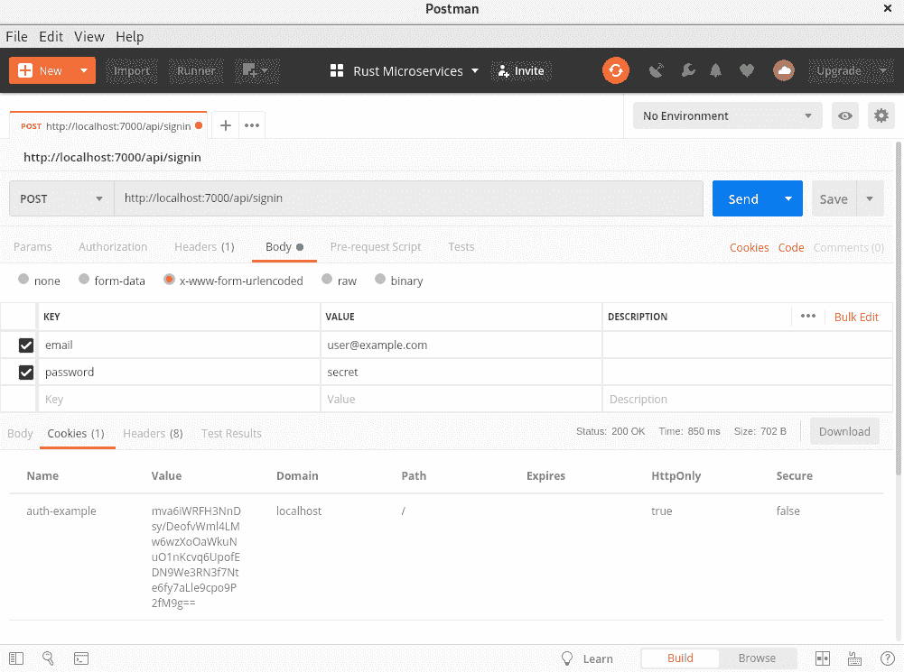
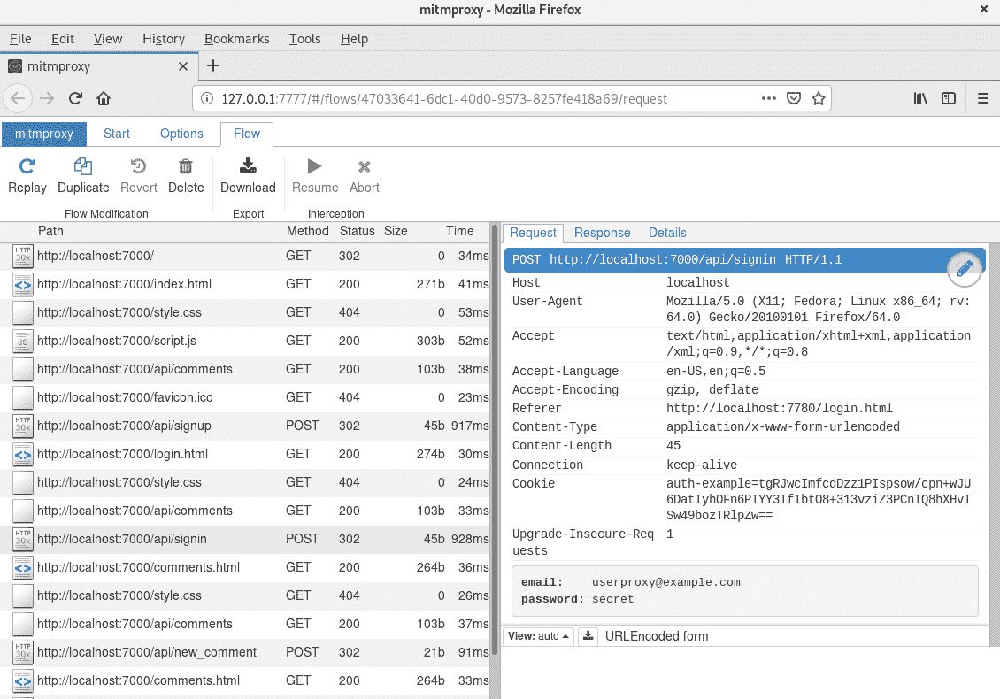
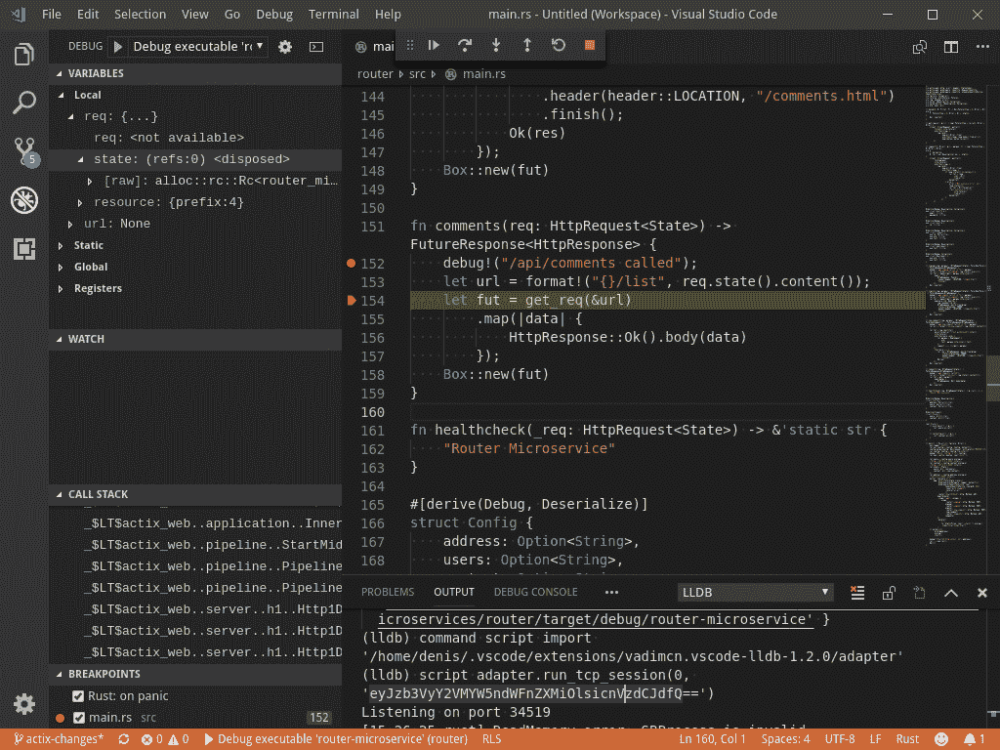
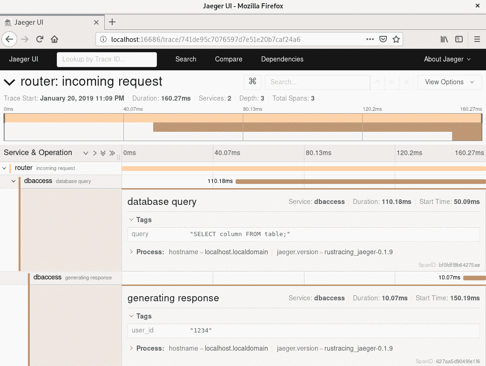

# 第十三章：测试和调试 Rust 微服务

微服务，就像任何其他应用程序一样，都可能存在错误。你可能在编写新代码时犯错，或者通过向应用程序添加额外功能来犯错。在本章中，我们将探讨可用于测试和调试你的微服务的可用工具。

我们将首先为应用程序创建单元和集成测试。我们还将检查`actix`包的测试能力。

在此之后，我们将学习使用 LLDB 调试器进行调试，并检查日志作为调试技术，因为并非每个错误都能用传统的调试器捕获。此外，如果你在生产中使用产品，你不能将其附加到调试器上。

在本章中，我们将涵盖以下主题：

+   微服务测试

+   微服务调试

# 技术要求

对于本章的测试示例，你除了需要 Rust 编译器（当然，你也需要）之外，还需要一些额外的软件。你需要安装 Docker 和 Docker Compose 来从[第十五章](http://Packing%20Servers%20to%20Containers)，“将服务器打包到容器中”启动应用程序。我们将使用这个应用程序来运行集成测试。

你还需要安装 Postman 工具，我们将使用它手动测试 API，以及 LLDB 调试器，我们将学习如何使用它来调试微服务。此外，还需要安装 Jaeger，但你可以使用在 Docker 中运行的单一镜像来完成这项工作。最后，我们将使用 OpenTracing API 进行分布式跟踪。

本章的示例代码可在 GitHub 上找到：[`github.com/PacktPublishing/Hands-On-Microservices-with-Rust/tree/master/Chapter13`](https://github.com/PacktPublishing/Hands-On-Microservices-with-Rust/tree/master/Chapter13)

# 微服务测试

Rust 是创建可靠应用程序的几乎完美的工具。编译器非常严格，永远不会错过任何潜在的内存访问错误或数据竞争，但仍然有许多方法可以在代码中犯错。换句话说，Rust 在很大程度上帮助你，但它并非万能。

# 单元测试

微服务也可能存在错误，因此你必须准备好处理所有可能的错误。第一道防线是单元测试。

单元测试涉及使用 HTTP 客户端向服务器或请求处理器发送隔离的请求。在单元测试中，你应该只检查一个函数。覆盖大多数有助于保持函数相同行为的代码，该函数可以通过测试重新实现或改进，这是必要的。

此外，你可以在编写任何代码之前编写一个测试。这被称为**测试驱动开发**（**TDD**），但这种方法适合具有良好规格的项目，因为如果你还没有决定解决方案，你可能需要多次重写测试。换句话说，TDD 不适合错误不是关键，但需要高速开发的项目。

为传统 crate 编写单元测试很简单，但对于微服务，你会有很多问题，因为需要在生产环境中模拟微服务的工作环境。为了模拟环境，你可以使用创建具有预定义响应的 HTTP 服务器的模拟服务。你还记得在第十一章中，*使用 Actix Crate 和 Actors 进行并发*时，我们创建了一个无法测试的路由微服务吗？因为我们必须手动运行很多微服务？在本节中，我们将为该路由微服务创建一个单元测试。

# 模拟

让我们创建一个模拟服务器，模拟对路由微服务的三个路径的请求响应：`/signin`、`/signup`和`/comments`。有一个名为`mockito`的 crate 提供了模拟 HTTP 响应的服务器。我们将使用第十一章中的示例，*使用 Actix Crate 和 Actors 进行并发*。复制它并添加以下额外的依赖项：

```rs
mockito = "0.15"
reqwest = "0.9"
```

我们需要`mockito` crate 来启动带有模拟的服务器，以及`reqwest` crate 来向我们的 Actix 服务器实例发送 HTTP 请求。

创建一个带有`#[cfg(test)]`属性的`tests`模块，它只编译用于测试，并导入以下我们将用于测试的类型：

```rs
use crate::{start, Comment, LinksMap, UserForm, UserId};
use lazy_static::lazy_static;
use mockito::{mock, Mock};
use reqwest::Client;
use serde::{Deserialize, Serialize};
use std::sync::Mutex;
use std::time::Duration;
use std::thread;
```

我们使用路由微服务的类型来准备请求；即，`Comment`、`UserForm`和`UserId`。此外，我们还添加了`LinksMap`结构体来配置 URL 到模拟：

```rs
#[derive(Clone)]
struct LinksMap {
    signup: String,
    signin: String,
    new_comment: String,
    comments: String,
}
```

将此结构体添加到`State`中，并使用处理程序获取微服务的 URL：

```rs
#[derive(Clone)]
struct State {
    counter: RefCell<i64>,
    links: LinksMap,
}
```

此外，我们还导入了`lazy_static!`宏，它用于初始化一个`Mutex`，我们将使用它来检查 Actix 服务器是否已启动一次。Rust 还有一个`Once`类型，也可以使用，但我们需要等待一定的时间间隔，然后让服务执行请求，而`Once`类型的`is_completed`方法是不稳定的。为了创建模拟，我们将使用`mockito` crate 的`mock`函数和一个表示特定请求处理器的`Mock`类型。

创建一个添加模拟的函数，如下所示：

```rs
fn add_mock<T>(method: &str, path: &str, result: T) -> Mock
where
    T: Serialize,
{
    mock(method, path)
        .with_status(200)
        .with_header("Content-Type", "application/json")
        .with_body(serde_json::to_string(&result).unwrap())
        .create()
}
```

`add_mock`函数期望一个 HTTP 方法和要模拟的资源路径。它还接受以 JSON 格式返回的响应值。

我们调用`mock`函数来创建一个`Mock`实例，并使用以下方法对其进行调整：

+   `with_status`设置响应的状态码

+   `with_header`设置特定头部的值

+   `with_body`设置响应体

最后，我们调用`crate`方法，它尝试启动一个模拟服务器并将我们创建的`Mock`附加到它。现在，我们可以启动一个路由微服务实例并准备所有必要的模拟来模拟路由器期望的其他微服务。

# 启动测试服务器

我们将在一个单独的线程中启动服务器实例，因为 Rust 在多个线程中运行测试，并且我们不会为每次测试运行创建具有唯一端口的服务器实例来展示如何使用共享实例，因为集成测试通常需要重用相同的应用程序实例。创建一个共享标志，我们将使用它来检测已经启动的路由器：

```rs
lazy_static! {
    static ref STARTED: Mutex<bool> = Mutex::new(false);
}
```

现在，我们将使用这个`Mutex`来创建一个启动服务器的函数。看看下面的`setup`函数实现：

```rs
fn setup() {
    let mut started = STARTED.lock().unwrap();
    if !*started {
        thread::spawn(|| {
            let url = mockito::server_url();
            let _signup = add_mock("POST", "/signup", ());
            let _signin = add_mock("POST", "/signin", UserId { id: "user-id".into() });
            let _new_comment = add_mock("POST", "/new_comment", ());
            let comment = Comment {
                id: None,
                text: "comment".into(),
                uid: "user-id".into(),
            };
            let _comments = add_mock("GET", "/comments", vec![comment]);
            let links = LinksMap {
                signup: mock_url(&url, "/signup"),
                signin: mock_url(&url, "/signin"),
                new_comment: mock_url(&url, "/new_comment"),
                comments: mock_url(&url, "/comments"),
            };
            start(links);
        });
        thread::sleep(Duration::from_secs(5));
        *started = true;
    }
}
```

之前的功能会锁定一个`Mutex`以获取标志的值。如果它等于`false`，我们将启动一个新的线程，并带有服务器实例和模拟，然后在将标志设置为`true`并释放`Mutex`之前等待 5 秒钟。

在启动的线程中，我们获取一个 URL 或`mock`服务器。如果它还没有启动，它将自动启动该服务器。之后，我们使用`add_mock`方法将所有模拟添加到模拟其他微服务。

`mockito` crate 要求你在`mock`服务器启动的同一个线程中添加所有模拟。

此外，我们将所有创建的模拟都保存在局部变量中。如果其中任何一个被丢弃，那么那个模拟处理程序就会丢失。你也可以使用`std::mem::forget`方法来确保模拟永远不会被丢弃，但更准确的做法是保留局部变量。

我们将使用`LinksMap`，通过`mock`服务器的 URL 和路径，这两个都通过以下函数连接：

```rs
fn mock_url(base: &str, path: &str) -> String {
    format!("{}{}", base, path)
}
```

最后，我们调用了`start`函数，这实际上是一个修改过的`main`函数：

```rs
fn start(links: LinksMap) {
    let sys = actix::System::new("router");
    let state = State {
        counter: RefCell::default(),
        links,
    };
    server::new(move || {
        App::with_state(state.clone())
            // App resources attached here
    }).workers(1).bind("127.0.0.1:8080").unwrap().start();
    sys.run();
}
```

这与第十一章涉及并发与 Actix Crate 中路由器微服务的`main`函数的区别在于，它期望将`LinksMap`值添加到`State`中。现在，我们可以创建方法来对重定向到模拟的服务器进行测试请求。

# 发送请求

要发送`GET`请求，我们将使用`test_get`函数，该函数创建一个`reqwest` crate 的`Client`，设置一个路径，执行一个`send`请求，并将响应从 JSON 反序列化：

```rs
fn test_get<T>(path: &str) -> T
where
    T: for <'de> Deserialize<'de>,
{
    let client =  Client::new();
    let data = client.get(&test_url(path))
        .send()
        .unwrap()
        .text()
        .unwrap();
    serde_json::from_str(&data).unwrap()
}
```

如果你熟悉`reqwest` crate，你可能想知道为什么我们得到文本值，因为`Client`有`json`方法可以反序列化 JSON？如果我们这样做，在反序列化问题时我们无法看到原始值，但使用响应的原始文本，我们可以将其记录下来以供调查。

要生成 URL，我们使用以下函数：

```rs
fn test_url(path: &str) -> String {
    format!("http://127.0.0.1:8080/api{}", path)
}
```

这添加了我们将要绑定到的服务器地址，但对于大型项目，最好使用动态地址，特别是如果你想在每次测试中使用一个新的服务器实例。

对于`POST`请求，我们将使用类似的方法，但我们不会反序列化结果，因为我们不需要它，并且只会检查响应的状态：

```rs
fn test_post<T>(path: &str, data: &T)
where
    T: Serialize,
{
    setup();
    let client =  Client::new();
    let resp = client.post(&test_url(path))
        .form(data)
        .send()
        .unwrap();
    let status = resp.status();
    assert!(status.is_success());
}
```

我们已经有了所有必要的函数来实现每个处理器的单元测试。

# 实现测试

到目前为止，我们在这个章节中创建的实用工具使得单元测试看起来相当紧凑。为了测试期望 `UserForm` 的 `/signup` 路径的处理程序，我们将添加一个带有 `#[test]` 属性的 `test_signup_with_client` 函数：

```rs
#[test]
fn test_signup_with_client() {
    let user = UserForm {
        email: "abc@example.com".into(),
        password: "abc".into(),
    };
    test_post("/signup", &user);
}
```

当我们运行 `cargo test` 命令时，这个函数将被调用，而 `test_post` 调用，反过来，将启动一个带有 `mock` 服务器的服务器。

要测试 `/signin` 路径的处理程序，我们将使用以下函数：

```rs
#[test]
fn test_signin_with_client() {
    let user = UserForm {
        email: "abc@example.com".into(),
        password: "abc".into(),
    };
    test_post("/signin", &user);
}
```

这个测试使用与 `POST` 请求相同的输入值。

要获取评论列表，只需调用带有 `/comments` 路径的 `test_get` 函数：

```rs
#[test]
fn test_list_with_client() {
    let _: Vec<Comment> = test_get("/comments");
}
```

现在，我们可以启动这些测试来检查将请求转发到 `mock` 服务器的路由微服务。

# 运行我们的测试

运行单元测试，请在本项目文件夹中运行 Cargo 的 `test` 命令。它将启动三个测试，您将在终端中看到命令的输出：

```rs
running 3 tests
test tests::test_list_with_client ... ok
test tests::test_signup_with_client ... ok
test tests::test_signin_with_client ... ok

test result: ok. 3 passed; 0 failed; 0 ignored; 0 measured; 0 filtered out
```

所有测试都通过了，但让我们检查一下如果我们更改实现中的某些内容会发生什么。让我们移除 `/signin` 路径的 `Mock`。测试将打印出一个测试失败的信息：

```rs
running 3 tests
test tests::test_list_with_client ... ok
test tests::test_signin_with_client ... FAILED
test tests::test_signup_with_client ... ok

failures:
---- tests::test_signin_with_client stdout ----
thread 'tests::test_signin_with_client' panicked at 'assertion failed: status.is_success()', src/lib.rs:291:9
note: Run with `RUST_BACKTRACE=1` environment variable to display a backtrace.

failures:
    tests::test_signin_with_client

test result: FAILED. 2 passed; 1 failed; 0 ignored; 0 measured; 0 filtered out
```

如预期的那样，`tests::test_signin_with_client` 测试失败了，因为它无法从 `/signin` 请求中获取响应。单元测试可以帮助您确保处理器的行为不会改变，即使您从头开始重写实现。

我们使用预定义的方法对微服务进行了单元测试，以简化服务器的启动并向其发送 HTTP 请求。如果您想测试与应用程序的复杂交互，您应该实现集成测试，我们现在将介绍。

# 集成测试

单元测试不能保证整个应用程序正常工作，因为它只测试了实现的一小部分。相比之下，集成测试更复杂，并且有助于确保您的整个应用程序正常工作。我们将这本书中创建的一些微服务组合成一个应用程序。让我们创建集成测试来检查应用程序。

# 启动应用程序实例

在我们编写测试代码的第一行之前，我们必须使用 Docker 启动一个应用程序。这很复杂，您将在第十五章 [80b8c3ec-d291-40df-a7a7-b9e9f0a64a99.xhtml] “将服务器打包到容器中” 中学习如何操作，但到目前为止，请打开该章节的代码示例文件夹，并从 Docker Compose 脚本中启动一个项目。然而，您还必须准备一个用于构建微服务的镜像。在终端中输入以下两个命令：

```rs
docker build -t rust:nightly nightly
docker-compose -f docker-compose.test.yml up
```

项目已经包含一个特殊的 Compose 文件，`docker-compose.test.yml`，它打开容器的端口，以便我们可以从本地的 Rust 应用程序连接到它们。

它需要一些时间来启动，但应用程序启动后，您将在终端窗口中看到日志。然后，我们可以编写一些集成测试。

# 依赖项

你可能会感到惊讶，但在集成测试中，我们不需要很多依赖项，因为我们将会使用 HTTP 客户端和`serde`系列 crate 来序列化请求和反序列化响应：

```rs
cookie = "0.11"
rand = "0.6"
reqwest = "0.9"
serde = "1.0"
serde_derive = "1.0"
serde_json = "1.0"
uuid = { version = "0.5", features = ["serde", "v4"] }
```

此外，我们需要`uuid`crate 来生成唯一值，以及`cookie`crate 来支持我们的 HTTP 请求中的 cookies，因为集成测试必须保持会话以发出一系列有意义的请求。

# 工具

就像我们对单元测试所做的那样，我们将添加一些实用函数以避免为每个测试创建 HTTP 客户端。我们将使用预定义的方法来执行健康检查，并发送`POST`和`GET`请求到应用程序中包含的微服务。创建一个`utils.rs`文件并导入必要的类型：

```rs
use cookie::{Cookie, CookieJar};
use rand::{Rng, thread_rng};
use rand::distributions::Alphanumeric;
pub use reqwest::{self, Client, Method, RedirectPolicy, StatusCode};
use reqwest::header::{COOKIE, SET_COOKIE};
use serde::Deserialize;
use std::collections::HashMap;
use std::iter;
use std::time::Duration;
use std::thread;
```

我们将使用`reqwest`crate 中的`Client`实例，就像我们在单元测试中所做的那样，但我们需要导入额外的类型：`Method`用于精确设置不同的 HTTP 方法；`RedirectPolicy`用于控制重定向，因为路由微服务会重定向我们到其他页面；以及`Client`，它将执行这些重定向，但我们希望关闭这种行为。`StatusCode`用于检查返回的 HTTP 状态码。

我们导入了`COOKIE`和`SET_COOKIE`头，用于设置这些头的值以供请求使用，并从响应中获取它们的值。但这些头的值是正式的，我们需要解析它们。为了简化这一点，我们将使用 cookie crate 中的`Cookie`和`CookieJar`类型，因为`reqwest`crate 目前不支持 cookies。

此外，我们使用`rand`crate 和从中导入的`Alphanumeric`分布来生成唯一的测试登录名，因为我们将与一个工作应用程序交互，现在根本无法重新启动它。

我们的应用程序包含四个微服务，以下地址，所有这些地址都可以从我们的应用程序的 Docker 容器中访问：

```rs
const USERS: &str = "http://localhost:8001";
const MAILER: &str = "http://localhost:8002";
const CONTENT: &str = "http://localhost:8003";
const ROUTER: &str = "http://localhost:8000";
```

我们将地址声明为常量，这样我们就有了一个单独的地方来更新它们（如果需要的话）：

```rs
pub fn url(url: &str, path: &str) -> String {
    url.to_owned() + path
}
```

此外，我们需要一个函数来生成由字母数字字符组成的随机字符串：

```rs
pub fn rand_str() -> String {
    let mut rng = thread_rng();
    iter::repeat(())
            .map(|()| rng.sample(Alphanumeric))
            .take(7)
            .collect()
}
```

上述代码使用一个为当前线程初始化的随机数生成器和一个生成随机值的迭代器，取 7 个字符并将它们连接成`String`值。

由于集成测试与实时系统一起工作，我们需要一个函数来暂停当前线程：

```rs
pub fn wait(s: u64) {
    thread::sleep(Duration::from_secs(s));
}
```

这个函数是`thread::sleep`调用的简短别名。

但这不仅仅是关于工具——我们还需要一个通用客户端来向所有工作的微服务发送请求。

# 集成测试客户端

将以下结构体添加到您的`utils.rs`源文件中：

```rs
pub struct WebApi {
    client: Client,
    url: String,
    jar: CookieJar,
}
```

它有三个字段——一个 HTTP `Client`；一个基础`url`，用于使用附加的路径构建完整的 URL；以及一个`CookieJar`实例，用于在请求之间保持 cookie 值。

这个结构体的构造函数接受一个 URL 并构建一个禁用重定向的`Client`实例：

```rs
impl WebApi {
    fn new(url: &str) -> Self {
        let client = Client::builder()
            .redirect(RedirectPolicy::none())
            .build()
            .unwrap();
        Self {
            client,
            url: url.into(),
            jar: CookieJar::new(),
        }
    }
}
```

我们可以为应用程序的特定微服务创建`WebApi`实例的快捷方式：

```rs
pub fn users() -> Self { WebApi::new(USERS) }
pub fn mailer() -> Self { WebApi::new(MAILER) }
pub fn content() -> Self { WebApi::new(CONTENT) }
pub fn router() -> Self { WebApi::new(ROUTER) }
```

我们将检查每个微服务是否存活。为此，我们需要一个`WebApi`的方法，该方法向指定的路径发送`GET`请求并检查响应：

```rs
pub fn healthcheck(&mut self, path: &str, content: &str) {
    let url = url(&self.url, path);
    let mut resp = reqwest::get(&url).unwrap();
    assert_eq!(resp.status(), StatusCode::OK);
    let text = resp.text().unwrap();
    assert_eq!(text, content);
}
```

我们的应用程序的每个微服务都有一个特殊的路径来获取微服务的名称，我们将使用它来进行健康检查。

要向微服务发送请求，我们将使用以下函数：

```rs
pub fn request<'a, I, J>(&mut self, method: Method, path: &'a str, values: I) -> J
where
    I: IntoIterator<Item = (&'a str, &'a str)>,
    J: for <'de> Deserialize<'de>,
{
    let url = url(&self.url, path);
    let params = values.into_iter().collect::<HashMap<_, _>>();
    let mut resp = self.client.request(method, &url)
        .form(&params)
        .send()
        .unwrap();

    let status = resp.status().to_owned();

    let text = resp
        .text()
        .unwrap();

    if status != StatusCode::OK {
        panic!("Bad response [{}] of '{}': {}", resp.status(), path, text);
    }

    let value = serde_json::from_str(&text);
    match value {
        Ok(value) => value,
        Err(err) => {
            panic!("Can't convert '{}': {}", text, err);
        },
    }
}
```

这是一个有用的函数，它以 JSON 格式发送请求并接收 JSON 格式的响应，然后将其反序列化为必要的本地结构。这个方法的实现并不疯狂。它期望一个 HTTP 方法、路径以及将用作请求表单参数的值。

如果微服务返回的不是`OK`的 HTTP 状态，我们使用文本响应来打印值。如果响应成功，我们将从 JSON 格式反序列化主体到必要的输出类型。

由于整个应用程序不会返回内部服务信息给我们，我们需要一个创建请求并检查响应状态码的方法，同时存储 cookie 以便有机会在我们的应用程序中注册和登录。为`WebApi`结构实现创建`check_status`方法：

```rs
pub fn check_status<'a, I>(&mut self, method: Method, path: &'a str, values: I, status: StatusCode)
where
    I: IntoIterator<Item = (&'a str, &'a str)>,
{
    let url = url(&self.url, path);
    let params = values.into_iter().collect::<HashMap<_, _>>();
    let cookies = self.jar.iter()
        .map(|kv| format!("{}={}", kv.name(), kv.value()))
        .collect::<Vec<_>>()
        .join(";");
    let resp = self.client.request(method, &url)
        .header(COOKIE, cookies)
        .form(&params)
        .send()
        .unwrap();
    if let Some(value) = resp.headers().get(SET_COOKIE) {
        let raw_cookie = value.to_str().unwrap().to_owned();
        let cookie = Cookie::parse(raw_cookie).unwrap();
        self.jar.add(cookie);
    }
    assert_eq!(status, resp.status());
}
```

上述实现还使用值以表单的形式发送请求，但它还准备 cookie 并在函数期望从服务器收到响应后，通过`Cookie`头将它们发送出去。如果响应包含`SetCookie`头，我们使用它来更新我们的`CookieJar`。通过这样的简单操作，我们使一个可以保持连接会话的方法。

# 类型

在我们开始实现测试之前，我们需要添加一些我们需要与微服务交互的类型。创建一个`types.rs`源文件并定义类型：

```rs
use serde_derive::Deserialize;
use uuid::Uuid;
```

现在，添加一个`UserId`结构体，它将被用来解析来自`users`微服务的原始响应（是的，我们也将直接测试它）：

```rs
#[derive(Deserialize)]
pub struct UserId {
    id: Uuid,
}
```

此外，添加一个`Comment`结构体，我们将使用它来向我们的内容微服务发布新的评论：

```rs
#[derive(Deserialize)]
pub struct Comment {
    pub id: i32,
    pub uid: String,
    pub text: String,
}
```

现在，我们可以为每个微服务单独编写测试，然后创建一个测试复杂交互的测试。

# 用户

我们将开始`users`微服务的测试覆盖率。创建一个`users.rs`文件并将创建的模块导入其中，使用必要的类型：

```rs
mod types;
mod utils;

use self::types::UserId;
use self::utils::{Method, WebApi};
```

首先，我们必须检查微服务是否存活。添加`users_healthcheck`方法：

```rs
#[test]
fn users_healthcheck() {
    let mut api = WebApi::users();
    api.healthcheck("/", "Users Microservice");
}
```

它使用`users`方法创建`WebApi`结构体的实例，该方法已经配置好了与用户微服务的交互。我们使用`healthcheck`方法检查必须返回`"Users Microservice"`字符串的服务根路径。

`users`微服务的主要目的是新用户的注册以及已注册用户的授权。创建一个`check_signup_and_signin`函数，该函数将生成一个新用户，通过向`/signup`路径发送请求来注册它，然后尝试使用`/signin`路径进行登录：

```rs
#[test]
fn check_signup_and_signin() {
    let mut api = WebApi::users();
    let username = utils::rand_str() + "@example.com";
    let password = utils::rand_str();
    let params = vec![
        ("email", username.as_ref()),
        ("password", password.as_ref()),
    ];
    let _: () = api.request(Method::POST, "/signup", params);

    let params = vec![
        ("email", username.as_ref()),
        ("password", password.as_ref()),
    ];
    let _: UserId = api.request(Method::POST, "/signin", params);
}
```

我们创建了一个新的`WebApi`实例，该实例针对我们的`users`微服务。`username`和`password`的值是由我们之前创建的`utils`模块中的`rand_str`函数调用生成的。之后，我们准备参数来模拟向服务器发送带有`POST`请求的 HTML 表单。第一个请求注册了一个新用户；第二个请求尝试使用相同的表单参数进行授权。

由于用户微服务被路由器微服务内部使用，它返回一个原始的`UserId`结构体。我们将解析它，但不会使用它，因为我们已经检查了微服务是否正常工作，因为它不会为无效凭据返回用户的 ID。

# 内容

我们需要测试的下一个微服务是一个允许用户发布评论的内容微服务。创建一个`content.rs`文件，并使用必要的类型导入`types`和`utils`模块：

```rs
mod types;
mod utils;

use self::utils::{Method, WebApi};
use self::types::Comment;
```

我们还将在`content_healthcheck`测试中检查该服务是否可用：

```rs
#[test]
fn content_healthcheck() {
    let mut api = WebApi::content();
    api.healthcheck("/", "Content Microservice");
}
```

此服务对于用户能够添加新评论是必要的，并且是松散耦合的（它不需要检查用户是否存在，因为它由路由器微服务保护，免受不存在用户的干扰）。我们将生成一个新的用户 ID 并发送一个请求来发布一条新评论：

```rs
#[test]
fn add_comment() {
    let mut api = WebApi::content();
    let uuid = uuid::Uuid::new_v4().to_string();
    let comment = utils::rand_str();
    let params = vec![
        ("uid", uuid.as_ref()),
        ("text", comment.as_ref()),
    ];
    let _: () = api.request(Method::POST, "/new_comment", params);

    let comments: Vec<Comment> = api.request(Method::GET, "/list", vec![]);
    assert!(comments.into_iter().any(|Comment { text, ..}| { text == comment }))
}
```

我们准备了一个创建新评论的表单，并向`/new_comment`路径发送了一个`POST`请求。之后，我们取出一组评论并检查列表中是否存在一个包含生成文本的评论。这意味着评论已被添加，并且内容微服务运行正常。

# 邮件发送器

我们的应用程序还有一个邮件发送器微服务，该服务向用户发送通知。它只需要`utils`模块进行测试：

```rs
mod utils;

use self::utils::{Method, WebApi};
```

将前面的代码放入一个新的`mailer.rs`文件，并添加一个`healthcheck`来测试微服务实例是否存活：

```rs
#[test]
fn mails_healthcheck() {
    let mut api = WebApi::mailer();
    api.healthcheck("/", "Mailer Microservice");
}
```

邮件发送器微服务也不需要知道用户来通知他们。它只需要一个电子邮件地址和一些内容。这个微服务将向用户发送确认码，所以让我们在我们的`send_mail`测试中模拟这种行为：

```rs
#[test]
fn send_mail() {
    let mut api = WebApi::mailer();
    let email = utils::rand_str() + "@example.com";
    let code = utils::rand_str();
    let params = vec![
        ("to", email.as_ref()),
        ("code", code.as_ref()),
    ];
    let sent: bool = api.request(Method::POST, "/send", params);
    assert!(sent);
}
```

我们使用`mailer`函数调用创建了一个`WebApi`实例，以将客户端指向邮件发送器微服务。之后，我们生成了一个新的电子邮件和代码，并将它们放入一个表单中。微服务返回一个布尔值，表示电子邮件已发送。我们使用`asser!`宏来检查它是否正确工作。

我们已经用测试覆盖了应用程序的所有微服务，现在我们可以添加一个完整的集成测试，以检查与应用程序的复杂交互。

# 路由器

创建一个`router.rs`文件并添加以下模块和类型：

```rs
mod types;
mod utils;

use self::utils::{Method, StatusCode, WebApi};
use self::types::Comment;
```

由于路由器微服务也通过我们用于其他微服务的根路径提供静态文件，为了检查它们是否存活，我们将使用一个特殊的`/healthcheck`路径，该路径返回该微服务的名称：

```rs
#[test]
fn router_healthcheck() {
    let mut api = WebApi::router();
    api.healthcheck("/healthcheck", "Router Microservice");
}
```

完整的测试是在`check_router_full`测试中实现的。查看以下代码：

```rs
#[test]
fn check_router_full() {
    let mut api = WebApi::router();
    let username = utils::rand_str() + "@example.com";
    let password = utils::rand_str();
    let params = vec![
        ("email", username.as_ref()),
        ("password", password.as_ref()),
    ];
    api.check_status(Method::POST, "/api/signup", params, StatusCode::FOUND);

    let params = vec![
        ("email", username.as_ref()),
        ("password", password.as_ref()),
    ];
    api.check_status(Method::POST, "/api/signin", params, StatusCode::FOUND);

    let comment = utils::rand_str();
    let params = vec![
        ("text", comment.as_ref()),
    ];
    api.check_status(Method::POST, "/api/new_comment", params, StatusCode::FOUND);

    let comments: Vec<Comment> = api.request(Method::GET, "/api/comments", vec![]);
    assert!(comments.into_iter().any(|Comment { text, ..}| { text == comment }))
}
```

它创建了一个针对路由微服务的 `WebApi` 实例。之后，它为用户创建随机凭据并在 `/api` 范围内调用路由的方法。但在这个案例中，我们使用 `check_status` 方法，因为路由微服务内部创建并保持会话 ID，并返回 cookie 来识别我们。

我们向 `/api/signup` 和 `/api/signin` 发送请求以注册用户账户并对其进行授权。之后，我们调用应用程序 API 的 `/api/new_comment` 方法，通过当前会话的用户发布一条新评论。最后，我们在公开的 `/api/comments` 端点检查我们的评论是否存在。

我们使用这个集成测试覆盖了应用程序的基本功能，但对于大型应用程序，你也可以检查数据库中的记录、缓存的值和上传的文件，以确保应用程序按预期工作。如果你的微服务工作不正确，并且你找不到原因，你可以尝试使用我们在下一节中将要学习的工具来调试它。

# 调试微服务

如果你的程序出现错误，你需要调试工具来修复它，我们将在本节中探讨。调试不仅意味着使用调试器进行交互式调试——这是一个特殊的工具，可以帮助你逐步执行程序——你还可以使用日志来跟踪代码的所有活动。为了了解错误的起因，你可以使用以下工具：

+   **curl**：一个我们已使用的用于发送 HTTP 请求的命令行工具

+   **Postman**：一个用于测试 REST API 的图形界面工具

+   **mitmproxy**：一个用于跟踪通过它的所有请求的代理

+   **LLDB**：一个传统的命令行调试器

+   **VS Code**：一个具有良好 LLDB 集成的编辑器

让我们探索所有这些。

# curl

执行 HTTP 请求最常用的工具是 `curl`。它是一个具有大量参数的命令行工具。其中一些最有用的如下：

+   `--request <METHOD>`（或 `-X`）设置要使用的 HTTP 方法

+   `--header "Header: Value"`（或 -`H`）为请求设置一个额外的头信息

+   `--data <data>`（或 `-d`）设置请求的主体，并使用 `@filename` 作为数据值来附加文件内容

+   `--form "field=value"`（或 `-F`）设置表单的一个字段

+   `--cookie <file>`（或 `-b`）设置一个包含 cookie 的文件以发送

+   `--cookie-jar <file>`（或 `-c`）设置一个包含 cookie 的文件以存储

例如，如果你想发送一个带有 JSON 文件的请求，请使用以下命令：

```rs
curl -X POST -H "Content-Type: application/json" -d @file.json http://localhost:8080/upload
```

或者，要发送表单，请使用以下命令：

```rs
curl -X POST -F login=user -F password=secret http://localhost:8080/register
```

如果你想在调用之间保持 cookie，请使用以下代码使用相同的文件读取和写入 cookie 值：`-b session.file -c session.file`。

如果你更喜欢使用图形界面工具，你可以考虑使用 Postman。

# Postman

Postman 是一个流行的浏览器扩展，它也作为桌面应用程序提供。你可以从这里获取它：[`www.getpostman.com/`](https://www.getpostman.com/)。Postman 最酷的功能之一是你可以分组请求并在请求中使用可配置的变量。

例如，让我们向使用 Docker Compose 启动的应用程序发送一个登录请求。安装 Postman 并创建一个名为 **Rust Microservices** 的新工作区。输入应用程序的 URL，将方法设置为 `POST`，并将正文设置为 `x-www-form-unlencoded`，包含两个参数，`email` 和 `password`（用户必须在使用 */signup* 之前创建）。点击发送按钮：



如您所见，微服务返回了一个包含名为 `auth-example` 的值的 cookie 的响应。

但如果我们想使用浏览器执行所有活动，但之后探索发送的请求和响应怎么办？我们可以启动一个跟踪代理。让我们试试。

# mitmproxy

mitmproxy 是一个优秀的代理工具，它可以记录所有请求和响应，并且可以作为透明代理、SOCKS5 代理或反向代理工作。当你想通过浏览器与运行中的应用程序交互，但又想记录交互会话的所有请求和响应时，这个工具非常有用。你可以从这里获取这个工具：[`mitmproxy.org/`](https://mitmproxy.org/).

安装一个代理并通过转发到服务器的端口启动它：

```rs
mitmweb --mode reverse:http://localhost:7000 --web-port 7777 --listen-port 7780
```

如您可能已经通过谈论参数所知，我们使用了反向代理模式。它使用 `7777` 端口提供对 mitmproxy UI 的访问，并使用端口 `7780` 通过代理连接到我们的应用程序。换句话说，代理将所有来自端口 `7780` 的请求重定向到我们应用程序的 `7000` 端口。

在浏览器中打开 `127.0.0.1:7777`，并在单独的标签页中打开 `127.0.0.1:7780`，然后尝试与应用程序交互。mitmproxy 网页应用将显示浏览器发出的请求流和响应：



就像 Postman 一样，我们也可以探索 `/signin` 响应的头部，并查看设置了 `auth-example` 值的 cookie 头部。

有时，您可能会在应用程序中看到不正确的行为，但找不到代码中的错误。对于这些情况，您可能需要考虑尝试调试器。

# LLDB

Rust 对两个调试器——GDB 和 LLDB——有很好的支持。我们在这里尝试第二个。LLDB 是一个现代的命令行调试器。它是 LLVM 项目的组成部分。

让我们尝试查看我们正在工作的路由微服务内部。移动到微服务的目录，并使用 `cargo build` 命令编译它。然而，你必须确保你没有设置 `--release` 标志，因为它会删除所有调试信息。如果你不使用 cargo，并想直接使用 `rustc` 添加调试信息，请添加 `-g -C debuginfo=2` 参数以保留输出文件中的调试符号。构建完成后，使用命令启动一个支持 Rust 编程语言的调试器：

```rs
rust-lldb ./target/debug/router-microservice
```

如果您使用了 `rustup` 安装工具安装 Rust，则此命令已经安装。您还将安装 LLDB 调试器到您的机器上。当调试器启动时，它将打印类似以下内容：

```rs
(lldb) command script import "/home/user/.rustup/toolchains/nightly-x86_64-unknown-linux-gnu/lib/rustlib/etc/lldb_rust_formatters.py"
(lldb) type summary add --no-value --python-function lldb_rust_formatters.print_val -x ".*" --category Rust
(lldb) type category enable Rust
(lldb) target create "./target/debug/router-microservice"
Current executable set to './target/debug/router-microservice' (x86_64).
(lldb) 
```

它将提示您输入。

让我们设置 `comments` 处理器的断点。您可以使用以下命令完成：

```rs
breakpoint set --name comments
```

它会打印出您已设置断点的信息：

```rs
Breakpoint 1: where = router-microservice`router_microservice::comments::h50a827d1180e4955 + 7 at main.rs:152, address = 0x00000000001d3c77
```

现在，我们可以使用此命令启动微服务：

```rs
run
```

它会通知您进程已启动：

```rs
Process 10143 launched: '/home/user/sources/Chapter15/deploy/microservices/router/target/debug/router-microservice'
```

现在，如果您在浏览器中尝试打开 `http://localhost:8080/comments` URL，那么调试器将中断您设置的断点处的处理器执行，调试器将显示它中断的代码行位置：

```rs
   151     fn comments(req: HttpRequest<State>) -> FutureResponse<HttpResponse> {
-> 152         debug!("/api/comments called");
   153         let url = format!("{}/list", req.state().content());
   154         let fut = get_req(&url)
   155             .map(|data| {
```

在这一点上，您可以探索正在运行的微服务。例如，您可以使用以下命令了解哪些活动线程存在：

```rs
thread list
```

它会显示 actix 的主线程和仲裁线程：

```rs
  thread #3: tid = 10147, 0x00007ffff7e939d7 libc.so.6`.annobin_epoll_wait.c + 87, name = 'actix-web accep'
  thread #4: tid = 10148, 0x00007ffff7f88b4d libpthread.so.0`__lll_lock_wait + 29, name = 'arbiter:77596ed'
  thread #5: tid = 10149, 0x00007ffff7f8573c libpthread.so.0`__pthread_cond_wait + 508, name = 'arbiter:77596ed'
```

要查看当前上下文中可用的变量，您可以使用 `frame variable` 命令。要将执行移动到下一行代码，使用 `next` 命令。要继续执行，使用 `continue` 命令。

使用这个工具，您可以逐步通过有问题的处理器并找到问题的原因。许多开发者更喜欢 GUI 调试器，我们也会尝试一个。

# Visual Studio Code

Visual Studio Code 是一个方便的开发者编辑器，拥有许多扩展，包括对 Rust 语言和 LLDB 调试器的支持。让我们尝试使用它。

首先，您必须从这里下载并安装 Visual Studio Code：[`code.visualstudio.com/`](https://code.visualstudio.com/)。之后，您需要安装两个扩展——`rust-lang.rust` 和 `vadimcn.vscode-lldb`。第一个扩展添加 Rust 支持，而第二个将 VS Code 与 LLDB 集成。

与 Rust 的集成基于 **Rust 语言服务器**（**RLS**）项目，该项目为 IDE 提供有关 Rust 代码的信息。

使用 *文件 > 将文件夹添加到工作区...* 打开路由微服务项目，并选择包含项目的文件夹。当它打开时，设置一个断点——将光标移动到所需的行并选择 *调试 > 切换断点* 命令。现在，我们可以使用 *调试 | 开始调试* 命令开始调试。在第一次运行时，需要一些时间来准备 LLDB，但调试器启动时，会在 *输出* 选项卡中打印一些信息。

打开浏览器并尝试打开激活我们 `comments` 处理器断点的 `http://localhost:8080/comments` URL：



使用顶部的栏移动执行指针到下一行。使用 GUI 调试器，您可以探索变量和调用栈。它简单且实用。但并非所有情况都可以通过调试器修复，因为存在一些类型的错误（称为 **海森堡错误**），在调试或研究它们时会消失。唯一能帮助这种情况的是日志。

# 结构化日志

我认为日志是调试的银弹，因为它无处不在——在测试中、在生产服务器上、在云基础设施中。此外，您不必重现产生错误的操作——您可以直接读取工作应用程序的日志来检测问题。有时，您会遇到无法重现的错误，日志可以帮助修复它们。

我们已经在第三章， *日志和配置微服务*中学习了日志的基本知识。我们使用了简单的 `env_logger` 和 `log` crate，但对于大型应用程序来说，可能还不够，因为您需要收集所有日志进行分析，并且从像 JSON 这样的正式格式解析日志更简单。为此存在结构化日志 crate。让我们通过 `slog` crate 探索使用结构化日志的一个微小示例。

# 示例

我们将创建一个微小的应用程序，该程序将日志写入文件和控制台。创建一个新的 crate 并添加以下依赖项：

```rs
slog = "2.4"
slog-async = "2.3"
slog-json = "2.3"
slog-term = "2.4"
```

我们需要 `slog` 作为应用程序的主要日志 crate。`slog-async` crate 有助于将日志处理移动到单独的线程。`slog-json` 提供了一个以 JSON 格式写入记录的日志记录器。`slog-term` 提供了将消息写入终端的格式。

我们将导入以下类型：

```rs
use slog::{crit, debug, error, Drain, Duplicate, Level, LevelFilter};
use slog_async::Async;
use slog_term::{CompactFormat, PlainDecorator};
use slog_json::Json;
use std::fs::OpenOptions;
use std::sync::Mutex;
```

从主 `slog` crate 中，我们将使用 `crit`、`debug` 和 `error` 宏，这些宏是 `log` crate 中日志宏的替代品。`Drain` 是提供日志功能的主要 trait。最终，我们必须创建一个 `Drain` 实例来记录某些内容。`Duplicate` 是一种将记录复制到两个 `Drain` 实例的 `Drain`。`Level` 和 `LevelFilter` 允许我们根据所需的级别过滤记录。

从 `slog-async` crate 中，我们将使用 `Async` 类型，它是一个将记录处理移动到单独线程的 `Drain`。从 `slog-term` crate 导入的 `PlainDecorator` 打印日志而不进行任何着色。我们还导入了 `CompactFormat` 类型，它是一个将记录以短格式写入的 `Drain`。从 `slog-json` crate 中，我们导入了 `Json` 格式的 `Drain`，它以 JSON 格式写入日志。

请注意，`Drain` trait 为包含已实现 `Drain` trait 的值的 `Mutex` 类型的值提供了一个默认实现。这允许我们将任何 `Drain` 包装在 `Mutex` 中，使其在多线程中使用时更安全。`OpenOptions` 类型被导入以打开一个文件进行写入并截断其内容。

现在，我们可以添加带有示例日志的 `main` 函数：

```rs
fn main() {
   let log_path = "app.log";
   let file = OpenOptions::new()
      .create(true)
      .write(true)
      .truncate(true)
      .open(log_path)
      .unwrap();

    let drain = Mutex::new(Json::default(file)).fuse();
    let file_drain = LevelFilter::new(drain, Level::Error);

    let decorator = PlainDecorator::new(std::io::stderr());
    let err_drain = CompactFormat::new(decorator).build().fuse();

    let drain_pair = Duplicate::new(file_drain, err_drain).fuse();
    let drain = Async::new(drain_pair).build().fuse();

    let log = slog::Logger::root(drain, slog::o!(
        "version" => env!("CARGO_PKG_VERSION"),
        "host" => "localhost",
        "port" => 8080,
    ));
    debug!(log, "started");
    debug!(log, "{} workers", 2;);
    debug!(log, "request"; "from" => "example.com");
    error!(log, "worker failed"; "worker_id" => 1);
    crit!(log, "server can't continue to work");
}
```

此函数打开一个文件并创建两个 `Drain` 实例。第一个是一个用 `Mutex` 包装的 `Json`，因为 `Json` 不是一个线程安全的类型。我们还用 `LevelFilter` 包装它，以过滤低于 `Error` 级别的消息。

之后，我们使用`PlainDecorator`将日志写入`stderr`流。它实现了`Decorator`特质，这可以用作创建`Drain`实例的流。我们用`CompactFormat`包装它，现在我们有两个`Drain`实例，我们将它们组合起来。

我们使用`Duplicate`将记录复制到两个创建的`Drain`实例，但我们还用`Async`包装它，以便将正在处理的日志移动到单独的线程。现在，我们可以创建一个`Logger`实例并填充它关于应用程序的基本信息。

我们使用`root`方法创建根日志记录器。此方法还可以获取一个值映射，这些值将被添加到记录中。我们使用了`o!`宏来创建一个映射。之后，我们添加了不同宏的调用，以展示如何使用结构化日志记录器。

任何日志宏都期望一些参数——一个指向`Logger`实例的引用、一条消息、可选的参数来填充消息，或者一个键值映射，其中包含可以稍后从日志中提取的额外参数。

演示应用程序已经准备好了，我们可以开始测试它。

# 构建和测试

使用`cargo build`构建此应用程序，或者如果你想玩代码，可以使用以下命令：

```rs
cargo watch --ignore *.log -x run
```

我们使用`cargo-watch`工具，但忽略日志文件，因为这些将在应用程序运行时创建。应用程序启动后，你将在终端看到以下记录：

```rs
version: 0.1.0
 host: localhost
  port: 8080
   Jan 20 18:13:53.061 DEBG started
   Jan 20 18:13:53.062 DEBG 2 workers
   Jan 20 18:13:53.062 DEBG request, from: example.com
   Jan 20 18:13:53.062 ERRO worker failed, worker_id: 1
   Jan 20 18:13:53.063 CRIT server can't continue to work
```

正如你所见，在终端输出中没有过滤掉任何带有`Debug`级别的记录。正如你可能记得的，我们将日志复制到两个`Drain`实例。第一个将错误写入`app.log`文件，如果你打开这个文件，你可以看到不包含带有`Debug`级别的记录的过滤记录：

```rs
{"msg":"worker failed","level":"ERRO","ts":"2019-01-20T18:13:53.061797633+03:00","port":8080,"host":"localhost","version":"0.1.0","worker_id":1}
{"msg":"server can't continue to work","level":"CRIT","ts":"2019-01-20T18:13:53.062762204+03:00","port":8080,"host":"localhost","version":"0.1.0"}
```

这里只有级别高于或等于`Error`的记录。

在第三章，“日志和配置微服务”，在`env_logger` crate 的示例中，我们使用了环境变量来配置日志记录器。`slog`也通过`slog_envlogger` crate 提供了这个功能。

日志是一个强大的工具，用于追踪单个微服务的每一个动作，但如果你的应用程序由多个微服务组成，理解某些错误发生的原因可能很困难，因为它是受多个因素影响的。为了找到并修复这种最困难的类型的问题，存在分布式追踪。

# 分布式追踪

分布式追踪有助于收集关于应用程序相关部分的**分布式无环图**（DAG）信息。你可以使用收集到的信息来分析分布式应用程序中任何活动的路径。

存在一个开放标准——OpenTracing，它被多个产品支持，包括 Jaeger。追踪的最小单元被称为**span**。Spans 可以与其他 span 建立关系，以构建带有追踪路径的报告。在本节中，我们将编写一个小应用程序，将一些 span 发送到 Jaeger 实例。

# 启动 Jaeger

首先，我们需要一个可工作的 Jaeger 实例，你可以从包含应用程序所有部分的官方 Docker 镜像中启动它，它甚至被称为 **jaegertracing/all-in-one**：

```rs
$ docker run --rm --name jaeger \
 -e COLLECTOR_ZIPKIN_HTTP_PORT=9411 \
 -p 5775:5775/udp \
 -p 6831:6831/udp \
 -p 6832:6832/udp \
 -p 5778:5778 \
 -p 16686:16686 \
 -p 14268:14268 \
 -p 9411:9411 \
 jaegertracing/all-in-one:1.8
```

打开所有必要的端口，并通过 [`localhost:16686`](http://localhost:16686) 访问 Jaeger 的 Web UI。

现在，我们可以编写一个应用程序来与该实例交互。

# 生成跨度

我们将使用两个 crate 来创建一个测试示例——`rustracing` 和 `rustracing_jaeger`。创建一个新的 crate 并将其添加到 `Cargo.toml` 的 `[dependencies]` 部分：

```rs
rustracing = "0.1"
rustracing_jaeger = "0.1"
```

将以下依赖项添加到 `main.rs` 源文件中：

```rs
use rustracing::sampler::AllSampler;
use rustracing::tag::Tag;
use rustracing_jaeger::Tracer;
use rustracing_jaeger::reporter::JaegerCompactReporter;
use std::time::Duration;
use std::thread;
```

`AppSampler` 实现了 `Sampler` 特性，该特性用于决定是否对每个新的跟踪进行采样。将采样器视为日志记录器的过滤器，但更智能，可以限制每秒的跟踪数量或使用其他条件。`Tag` 用于为跨度设置额外的数据。`Tracer` 是用于创建跨度的主要对象。`JaegerCompactReporter` 类型用于对跨度进行分组并将它们发送到 Jaeger 实例。

此外，我们还需要一个函数来让当前线程休眠毫秒数：

```rs
fn wait(ms: u64) {
    thread::sleep(Duration::from_millis(ms));
}
```

现在，你可以添加 `main` 函数，并将示例的第一部分添加到其中：

```rs
let (tracer1, span_rx1) = Tracer::new(AllSampler);
let (tracer2, span_rx2) = Tracer::new(AllSampler);
thread::spawn(move || {
    loop {
        {
            let req_span = tracer1
                .span("incoming request")
                .start();
            wait(50);
            {
                let db_span = tracer2
                    .span("database query")
                    .child_of(&req_span)
                    .tag(Tag::new("query", "SELECT column FROM table;"))
                    .start();
                wait(100);
                let _resp_span = tracer2
                    .span("generating response")
                    .follows_from(&db_span)
                    .tag(Tag::new("user_id", "1234"))
                    .start();
                wait(10);
            }
        }
        wait(150);
    }
});
```

在此代码中，我们完成了跟踪例程的大部分工作。首先，我们创建了两个 `Tracer` 实例，它们将通过 `AllSampler` 传递所有值。之后，我们使用 `spawn` 创建了一个新线程，并创建了一个生成跨度的循环。你必须记住，`rustracing` crate 使用 `Drop` 特性的实现将跨度值发送到与 `Tracer::new` 方法调用一起创建的 `Receiver`，我们必须丢弃值（我们使用了 Rust 的作用域规则来自动执行丢弃）。

我们使用了存储在 `tracer1` 变量中的 `Tracer` 实例，通过 `span` 方法调用创建了一个跨度。它期望一个跨度的名称，并创建了一个 `StartSpanOptions` 结构体，该结构体可以用来配置未来的 `Span` 值。为了配置，我们可以使用 `child_of` 方法设置一个父级，或者使用 `follows_from` 方法设置对先前 `Span` 的引用。我们还可以使用 `tag` 方法调用设置额外的信息，并提供一个名为 `Tag` 的键值对，就像我们在结构化日志中做的那样。配置完成后，我们必须调用 `StartSpanOptions` 实例的 `start` 方法来创建一个具有设置跨度的起始时间的 `Span` 实例。使用作用域和跟踪器，我们模拟了应用程序的两个部分：第一个处理请求，第二个执行数据库查询并生成响应，其中第一个是后者的父级。

现在，我们必须使用 `SpanReceiver` 实例来收集所有丢失的 `Span` 值。（它们实际上已经被发送到 `Receiver`。）此外，我们创建了两个带有名称的 `JaegerCompactReporter` 实例，并在循环中使用 `report` 方法调用将跨度添加到报告中：

```rs
let reporter1 = JaegerCompactReporter::new("router").unwrap();
let reporter2 = JaegerCompactReporter::new("dbaccess").unwrap();
loop {
    if let Ok(span) = span_rx1.try_recv() {
        reporter1.report(&[span]).unwrap();
    }
    if let Ok(span) = span_rx2.try_recv() {
        reporter2.report(&[span]).unwrap();
    }
    thread::yield_now();
}
```

现在，我们可以编译并运行这个跟踪示例。

# 编译并运行

要开始这个示例，你可以使用 `cargo run` 命令。当示例启动时，它将连续产生跨度并将它们发送到正在运行的 Jaeger 实例。你需要等待一小段时间并中断应用程序，否则它将生成过多的跨度。

在浏览器中打开 Jaeger 的 Web UI。在服务字段中选择 `router`，然后点击查找跟踪按钮以查找相应的跨度。你会看到最近的跟踪，如果你点击其中一个，你将看到跟踪的详细信息：



正如你所见，分布式跟踪记录了我们应用程序的活动，我们可以将其用作日志记录我们应用程序中包含的微服务分布式活动的工具。

# 摘要

在本章中，我们讨论了许多关于测试和调试微服务的话题。首先，我们考虑了单元测试和集成测试，并看到了一些在 Rust 中使用这些测试的例子。之后，我们探讨了帮助我们调试微服务的工具，包括 curl 和 Postman，用于手动发送请求；mitmproxy 用于跟踪微服务的所有传入请求和传出响应；LLDB 用于探索微服务的运行代码；以及 Visual Studio Code 作为 LLDB 调试器的 GUI 前端。

最后，我们讨论了两种用于最大应用程序的技术，在这些应用程序中，你不能简单地调试：结构化日志和使用 OpenTracing API 的分布式跟踪。

在下一章中，你将了解一些可以用来优化 Rust 微服务的技巧。
