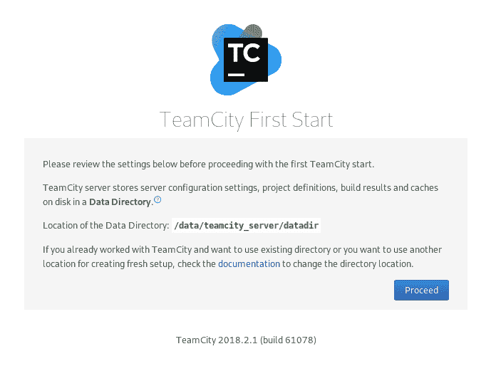
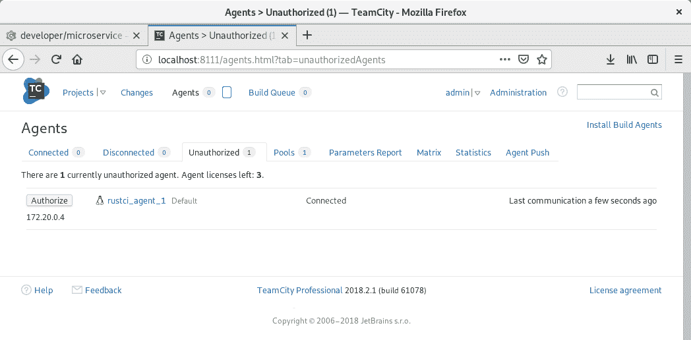

# 第十六章：Rust 微服务的 DevOps - 持续集成和交付

本章涵盖了广泛使用的持续集成（**CI**）和持续交付（**CD**）实践。当一个微服务正在开发时，您必须确保每个功能都经过测试并且能够正常工作，并考虑如何将应用程序部署到您的服务器或云中。

在本章中，我们将研究以下内容：

+   如何使用工具检查代码

+   如何使用 CI 工具自动构建代码

+   如何将编译后的代码部署到服务器

# 技术要求

本章需要 Rust 编译器，并且您必须安装至少版本 1.31。此外，您还需要`rustup`工具来添加额外的组件，例如`rustfmt`和`clippy`。如果您还没有它，您可以在以下链接找到：[`rustup.rs/`](https://rustup.rs/)

在本章中，我们将尝试启动一个 CI 系统，该系统将构建和测试一个微服务。由于手动安装这类工具既耗时又复杂，我们将使用 Docker 和 Docker Compose 来更快地启动和准备构建环境。但无论如何，您需要一个浏览器来连接到 TeamCity 工具的管理控制台 UI 并进行配置。

本章的示例可以在 GitHub 上找到：[`github.com/PacktPublishing/Hands-On-Microservices-with-Rust/tree/master/Chapter16.`](https://github.com/PacktPublishing/Hands-On-Microservices-with-Rust/tree/master/Chapter16)

# 持续集成和持续交付

在现代世界，速度是应用程序和产品成功的关键因素。竞争已经变得激烈，每个公司都必须尽可能快地发布新功能。

对于微服务开发者来说，这意味着我们需要一个持续的过程来及时且具有竞争力地构建和交付我们产品的版本。从软件的角度来看，这意味着您需要自动化这个过程——可能是一个特殊的产品或一系列脚本。幸运的是，这类产品已经存在；被称为 CI 工具。

# 持续集成

持续集成（CI）是将所有传入的功能和补丁合并到单个经过充分测试的应用程序的过程。重要的是要注意，这应该每天发生几次——您将获得一个新鲜出炉的版本，就像从传送带上下来的一样。

现在，许多产品提供给您一个测试、构建和部署产品的工具，但它们并不明确。在大多数情况下，CI 产品作为一个服务器，使用远程构建代理从存储库中提取代码进行构建。这个过程在以下图中大致描述：


CI 服务器负责从源代码管理服务器（如 Git）获取更新，拉取代码的新版本，并使用已经连接并注册在服务器上的代理开始构建。一些软件可以使用 Docker 作为必要构建代理的运行时。在这种情况下，你甚至不需要手动运行代理。但这并不适合应用程序的每个部分，因为某些部分需要在不能作为 Docker 容器启动的环境中构建。

编译和测试成功的微服务可以被移动到也可以使用 CD 自动化的部署流程中。

# 持续交付

当应用程序构建完成并准备部署时，自动化部署的过程被称为 CD。通常，这种功能是通过 CI 产品提供的，使用称为配置管理和部署工具的特殊插件，如 Ansible、Chef、Puppet 和 Salt。

在过去，微服务是以包含如**Web ARchives**（**WAR**）等文件的存档形式交付的，在 Java 中，它们作为直接安装在服务器操作系统上的包，以及作为二进制文件。如今，公司更倾向于交付容器，而不是这些其他格式。容器的好处是无可否认的：它们紧凑且安全，使用共享注册表，而且你不需要一次又一次地准备环境。Docker 镜像已经包含了你需要的内容，如果你的微服务可以在不与其他相同微服务的实例冲突的情况下工作，你可以考虑将你的产品不仅作为部署到远程服务器的容器，还可以使用一个自动根据客户需求扩展应用程序的编排工具。

# 容器编排

通过自动化的构建和交付流程，你仍然可以将一个微服务部署到一个无法扩展的环境中。这意味着你失去了快速扩展应用程序的重要好处。一个大型互联网招聘服务的开发者告诉我一个有趣的故事，关于他们经历的峰值负载——他们服务器上最大的活动发生在周一早晨。那是在周末后每个员工访问办公室并决定“这结束了”的时候。应用程序维护的现实是，你无法预测服务的活动峰值，因此你应该能够快速运行更多微服务的实例。

有一些产品可以编排容器，其中最受欢迎的是 Kubernetes。你唯一需要做的就是将容器上传到注册表。Kubernetes 可以路由请求并运行无法处理所有传入请求的额外微服务实例。然而，你仍然需要为其提供硬件资源，并编写松散耦合的微服务，这样你就可以运行尽可能多的实例。

在任何情况下，为了自动化应用程序的交付流程，你必须从持续集成系统开始，并不断改进它。让我们看看我们可以用来为 Rust 项目编写 CI 脚本的工具。

# Rust 工具

微服务质量控制的第一步是检查代码中不包含明显的错误。编译器会检查可变性、引用、所有权和生命周期的情况，如果你有未使用的代码，它还会打印警告，但还有一些更复杂的情况需要特殊工具来检测。

在本节中，我们将介绍在持续集成（CI）代理中常用的以下工具，用于准备合并前的代码。让我们一一探索，从代码格式化风格开始。

# Rustfmt

Rustfmt 是一个帮助你使代码符合风格指南的工具。这并不意味着你必须使用一种通用的风格：该工具提供了多个配置参数，你可以使用它们来设置首选的样式。

这个工具已经成熟，但直到版本 1.31 之前，它都没有包含在 Rust 发行版中。自 2018 版发布以来，rustfmt 工具已经可用，并建议在项目中使用；然而，Rust 不会强制你的代码具有标准格式。让我们安装它并尝试使用它。

# 安装

如果你使用`rustup`工具，那么要安装`rustfmt`，你需要使用以下命令添加相应的组件：

```rs
rustup component add rustfmt
```

如果你想要安装最新版本，你可以直接从仓库中安装：

```rs
cargo install --git https://github.com/rust-lang/rustfmt
```

从源代码安装需要编译时间，可能不稳定，但你将拥有最新的功能。

# 使用

由于`rustfmt`被添加为一个命令，使用它就像调用一个特殊命令一样简单：

```rs
cargo fmt
```

此命令将所有源代码修复为默认风格指南。但它会静默运行，我们必须查看文件之间的差异来查看更改。

该工具会修补你的项目中的文件，在你尝试修复代码风格之前，你必须提交所有更改。

但我们将使用这个工具通过 CI 检查代码风格，如果代码格式不正确，则停止构建。为了检查代码并查看潜在的变化，你必须将`--check`参数传递给`rustfmt`：

```rs
cargo fmt -- --check
```

正如你所见，我们使用了额外的`--`参数，因为没有它，我们会将参数传递给调用`rustfmt`的工具，但为了直接将参数发送到`rustfmt`，我们必须添加这个额外的破折号对。如果没有问题，检查将返回`0`代码，如果有错误，则返回非零代码，并打印出潜在的差异：

```rs
Diff in ./microservice/src/main.rs at line 1:
-use actix_web::{App, middleware, server, App};
+use actix_web::{middleware, server, App, App};

 fn index(_req: &HttpRequest) -> &'static str {
     "Microservice"
Diff in ./microservice/src/main.rs at line 8:
     env_logger::init();
     let sys = actix::System::new("microservice");
     server::new(|| {
-        App::new().middleware(middleware::Logger::default()).resource("/", |r| r.f(index))
+        App::new()
+            .middleware(middleware::Logger::default())
+            .resource("/", |r| r.f(index))
     })
     .bind("127.0.0.1:8080")
     .unwrap()
```

这正是我们在 CI 中需要用来中断构建，并查看中断原因以便修复的工具。

# 配置

你可以通过配置来更改`rustfmt`的行为，以设置你首选的样式。将`rustfmt.toml`配置文件添加到你的项目中。当前版本的默认值可以用以下配置文件内容描述：

```rs
max_width = 100
hard_tabs = false
tab_spaces = 4
newline_style = "Auto"
use_small_heuristics = "Default"
reorder_imports = true
reorder_modules = true
remove_nested_parens = true
edition = "2015"
merge_derives = true
use_try_shorthand = false
use_field_init_shorthand = false
force_explicit_abi = true
```

大多数参数都有描述性的名称，但如果你想阅读参数的描述，你可以通过向`rustfmt`传递`--help=config`参数来查看详细信息。你可以创建一个`rustfmt.toml`文件，并设置与默认值不同的参数。

通常，代码风格检查是 CI 脚本的第一步，因为它是最快的检查，最好在长时间编译过程之前完成。还有一个我们在编译之前应该做的代码检查——lint 检查。

# Clippy

除了你代码格式的问题外，你还可能遇到更严重的问题，这些问题可以通过另一种工具——linters 来解决。linters 是一种程序，它可以找到可能影响未来性能的代码编写不良习惯，如果问题可以更简单地解决。Rust 有一个很好的 linters 叫做`clippy`，自 1.31 版本以来作为组件包含在内，当时它成为了 2018 版的一部分。它是在构建脚本时防止大量不良编码实践的好工具。让我们安装它并尝试使用它。

# 安装

你可以通过两种方式安装`clippy`，就像我们安装`rustfmt`工具一样：使用`rustup`命令添加组件或从项目的 GitHub 仓库安装最新版本。要将其添加为预构建组件，请使用以下命令：

```rs
rustup component add clippy
```

你也可以使用以下命令直接从项目的仓库中安装最新版本：

```rs
cargo install --git https://github.com/rust-lang/rust-clippy
```

但请记住，这个版本可能是不稳定的，它包含的 lints 可能在将来发生变化。

# 使用

要使用`clippy`，只需将其作为`cargo`的子命令启动即可：

```rs
cargo clippy
```

此子命令开始检查代码，并将通知你可能的改进。例如，假设你的代码中有一个这样的结构体：

```rs
struct State {
    vec: Box<Vec<u8>>,
}
```

然后，`clippy`会通知你`Box`是不必要的，因为`Vec`已经放置在内存堆中：

```rs
warning: you seem to be trying to use `Box<Vec<T>>`. Consider using just `Vec<T>`
 --> src/main.rs:4:10
  |
4 |     vec: Box<Vec<u8>>,
  |          ^^^^^^^^^^^^
  |
  = note: #[warn(clippy::box_vec)] on by default
  = help: `Vec<T>` is already on the heap, `Box<Vec<T>>` makes an extra allocation.
  = help: for further information visit https://rust-lang.github.io/rust-clippy/master/index.html#box_vec
```

但如果你真的想对向量进行装箱，你可以通过在字段或结构体上添加`#[allow(clippy::box_vec)]`属性来禁用此行代码的警告，并且此字段的警告将被抑制。

上述示例是一个警告，意味着代码将成功编译，构建不会被`clippy`中断。在 CI 脚本中，如果`clippy`从代码中获得警告，它必须中断执行，因为我们应该合并不包含任何警告以及模糊代码的代码。为了使`clippy`在出现警告时失败，我们可以设置额外的参数：

```rs
cargo clippy -- -D warnings
```

现在，`clippy`否认所有警告。但如果你的 crate 包含非默认功能：`clippy`不会检查所有这些。要进行完整检查，可以使用以下参数：

```rs
cargo clippy --all-targets --all-features -- -D warnings
```

当然，这会花费更多时间，但`clippy`知道的所有潜在问题都将被检查。

# 配置

`clippy`工具可能会非常烦人。为了收紧或放宽检查，你可以使用`clippy.toml`配置文件来配置工具。

例如，如果我们使用 `-W clippy::pedantic` 参数激活所有 lint，我们可以得到如下警告：

```rs
warning: you should put `MyCompany` between ticks in the documentation
 --> src/main.rs:8:29
  |
8 | /// This method connects to MyCompany API.
  |                             ^^^^^^^^^
  |
  = note: `-W clippy::doc-markdown` implied by `-W clippy::pedantic`
  = help: for further information visit https://rust-lang.github.io/rust-clippy/master/index.html#doc_markdown
```

这是因为 `clippy` 认为存在一个我们忘记包含在引号中的变量名称。为了避免这种行为，我们可以在 `clippy.toml` 配置文件中添加一个额外的单词来忽略 Markdown 注释：

```rs
doc-valid-idents = ["MyCompany"]
```

现在工具不会将 `MyCompany` 解释为变量的名称。

# 推荐的代码属性

正如你所见，允许或拒绝某些警告对于 lint 是可能的，但有一些属性可以用来自动化你的代码：

```rs
#![deny(
    bare_trait_objects,
    dead_code,
)]
#![warn(
    missing_debug_implementations,
    missing_docs,
    while_true,
    unreachable_pub,
)]
#![cfg_attr(
    feature = "cargo-clippy",
    deny(
        clippy::doc_markdown,
    ),
)]
```

这是代码更严格要求的示例。编译器拒绝未使用代码和缺少文档，将要求使用 `loop` 而不是 `while true`，并检查所有已发布类型都必须可达。我们还完全拒绝在 Markdown 文档中使用不带引号的变量名称。你可以将所需的要求添加到你的项目中。

此外，前面的要求迫使我们使用 `dyn Trait` 来表示 trait 对象，而不是裸露的 `Trait` 名称。如果你使用 2015 版本但想为 Edition 2018 准备项目，这可能很有用，但最好尽可能使用最新版本，并且有一个工具可以帮助你迁移到 Rust 的最新版本——`rustfix`。

# Rustfix

你可能想过，如果 Rust 可以在代码中找到问题并提出解决方案，为什么没有立即应用这些更改？这是一个合理的想法，未来可能实现，但现在这个功能正在通过 `rustfix` 工具积极开发中。

本项目旨在提供一个可以修复所有编译器警告的工具，今天你可以尝试使用它将你的项目从 Edition 2015 转换到 Edition 2018。我们不需要在 CI 流程中直接使用这个工具，但它可以帮助更快地满足 CI 检查。

# 安装

要安装 `rustfix`，请使用以下命令：

```rs
cargo install cargo-fix
```

安装后，你可以使用带有必要参数的 `cargo fix` 子命令。

# 使用方法

让我们考虑将项目从 Edition 2015 转换到 Edition 2018。你需要设置哪些参数来完成这个代码转换？首先，你可以使用以下命令来准备你的代码以进行转换：

```rs
cargo fix --edition
```

此命令将使你的代码与两个版本兼容，但如果你想使用某个版本的惯用用法，你必须将版本设置为在 `Cargo.toml` 文件的 `[package]` 部分的 `edition` 字段中使用的版本，并运行以下命令：

```rs
cargo fix --edition-idioms
```

运行此命令后，你的代码可能与所选版本兼容。你还可以使用 `rustfix` 做更多的事情，但如果你使用 IDE，一些问题可以得到修复；但这个主题超出了本书的范围；让我们探索其他 cargo 命令。

# Cargo 测试

完全坦白地说，CI 中最重要的工具是测试工具。我们已经在 第十三章 中学习了如何编写测试，*测试和调试 Rust 微服务*，但在本节中，我们将探讨 `cargo test` 命令的一些有用参数。

CI 有一些有用的参数：

+   `--no-run`：编译但不运行测试，这对于检查不同目标的测试编译很有用，无需浪费额外运行的时间

+   `--all-targets`：为所有目标运行测试

+   `--all-features`：使用所有功能运行测试

+   `--examples`：测试所有示例

+   `--jobs <N>`：在多个作业中运行测试，如果测试只使用一个数据库实例，并且你想要顺序运行测试以避免一个测试影响另一个测试的结果，这很有用

现在我们已经准备好启动 CI 工具并为其构建微服务进行配置。

# CI 和 CD 工具

在本节中，我们将讨论 CI 系统，并使用 Docker Compose 启动一个 CI 服务器实例，并使用构建代理。但首先，让我们看看一些流行的 CI 产品及其交付能力。

# TravisCI

TravisCI 是开源项目最受欢迎的持续集成服务，因为它为这些项目提供免费计划，并且与 GitHub 集成良好。要使用它，你只需将 `.travis.yml` 文件添加到你的项目仓库的根目录。它默认支持 Rust。

使用 TravisCI，你可以在 Linux 或 macOS 环境中构建你的项目。让我们写一个简单的 `.travis.yml` 文件示例。该文件的第一部分是构建矩阵声明：

```rs
language: rust
cache: cargo
matrix:
  include:
    - os: linux
      rust: stable
      env: TARGET=x86_64-unknown-linux-gnu
    - os: linux
      rust: nightly
      env: TARGET=x86_64-unknown-linux-gnu
    - os: osx
      rust: stable
      env: TARGET=x86_64-apple-darwin
    - os: osx
      rust: nightly
      env: TARGET=x86_64-apple-darwin
```

我们选择了带有缓存的 Rust 语言，以加快构建更新的速度。此外，我们还声明了一个环境矩阵。TravisCI 自动为我们准备了 Rust 环境，有四种变体：带有 `stable` 编译器的 `linux`，带有 `nightly` 编译器的 `linux`，以及 `osx` 上的 `stable` 和 `nightly` 编译器版本的一对。对于微服务，你通常只需要 `linux` 构建。此外，我们还指定了目标，但你可以使用 `musl` 而不是 `gnu`，例如。

以下代码安装额外的包：

```rs
addons:
  apt:
    packages:
      - build-essential
      - libcurl4-openssl-dev
      - libssl-dev
```

此外，你还可以添加在构建和测试运行中使用的环境变量：

```rs
env:
  global:
    - APPNAME="myapp"
```

最后，你必须添加一个用作 CI 脚本的脚本。你可以直接将 `script` 部分中的命令作为该部分的项放入 `.travis.yml`，或者添加一个 `jobs` 部分以包含可以并行运行的作业：

```rs
jobs:
  include:
    - name: rustfmt
      install:
        - rustup component add rustfmt
      script:
        - cargo fmt -- --check
    - name: clippy
      install:
        - rustup component add clippy
      script:
        - cargo clippy
    - name: test
      script:
        - cargo build --target $TARGET --verbose
        - cargo test --target $TARGET --verbose
```

`jobs` 部分也可以包含一个安装子部分，以提供为作业安装额外依赖项的命令列表。

现在，你可以将这个`.travis.yml`文件放入你项目仓库的根目录，以便允许 Travis CI 检查你的项目的 pull 请求。但请记住，你必须为 TravisCI 服务付费以使用私有仓库，而 GitHub 允许你免费拥有私有仓库。你可以测试你的 Rust 应用程序在 Linux 和 macOS 上，但还有一个提供另一组操作系统的服务。

# AppVeyor

AppVeyor 是一个适用于 Linux 和 Windows 的 CI 服务。对于开源项目，它也是免费的，并且与 GitHub 有良好的集成。要开始使用这项服务，你必须在你的项目中添加一个`appveyor.yml`文件。让我们看看示例配置：

```rs
os: Visual Studio 2015
environment:
  matrix:
    - channel: stable
      target: x86_64-pc-windows-msvc
    - channel: nightly
      target: i686-pc-windows-msvc
    - channel: stable
      target: x86_64-pc-windows-gnu
    - channel: nightly
      target: i686-pc-windows-gnu
```

配置看起来与 TravisCI 的配置类似。我们还创建了一个构建矩阵，并将使用 MSVC 和 GNU 工具链为稳定和夜间编译器版本。在此之后，我们使用这些值通过`rustup`安装所需的工具：

```rs
install:
  - appveyor DownloadFile https://win.rustup.rs/ -FileName rustup-init.exe
  - rustup-init -yv --default-toolchain %channel% --default-host %target%
  - set PATH=%PATH%;%USERPROFILE%\.cargo\bin
  - rustup component add rustfmt
  - rustup component add clippy
  - rustc -vV
  - cargo -vV
```

在更新了`PATH`环境变量之后，我们也安装了`rustfmt`和`clippy`工具。最后，我们可以按照以下方式构建项目：

```rs
build: false
test_script:
  - cargo fmt -- --check
  - cargo clippy
  - cargo build
  - cargo test
```

我们将`build`字段设置为`false`，以防止构建代理启动 MSBuild 工具，这对于 Rust crate 来说是不必要的。

# Jenkins

这是一个最初为 Java 创建并设计的流行 CI 系统。Jenkins 是一个开源产品，对使用没有限制。这两个原因都是一些成长中的公司选择这个产品的原因，如果你想要定制构建过程并希望控制 CI 的成本，你也可能会选择这个产品。

Jenkins 为你提供了两种构建应用程序的方法。第一种是运行一个普通的脚本，第二种是使用流水线（pipeline），这是一个允许你在仓库根目录中包含 CI 脚本的特性，就像我们在 TravisCI 和 AppVeyor 中做的那样。

如果你想要自动从仓库中拉取此脚本并将其使用 SCM 更新，那么必须将以下`pipeline`配置存储在你项目根目录的`Jenkinsfile`配置文件中：

```rs
pipeline {
    agent { dockerfile true }
    stages {
        stage('Rustfmt') {
            steps {
                sh "cargo fmt -- --check"
            }
        }
        stage('Clippy') {
            steps {
                sh "cargo clippy"
            }
        }
        stage('Build') {
            steps {
                sh "cargo build"
            }
        }
        stage('Test') {
            steps {
                sh "cargo test"
            }
        }
    }
}
```

上述`pipeline`配置意味着 Jenkins 需要 Docker 来构建附加的`Dockerfile`，并运行所有阶段的全部命令。这个特性利用 Docker 容器而不是代理，但你也可以将传统的构建代理连接到 CI 服务器。

# 持续集成的演示

为了创建一个演示，我们将使用由 JetBrains 开发的 TeamCity CI。这个产品在某些特性上与 Jenkins 相似，但对我们演示来说，它更容易启动和部署。我们将启动自己的 CI 环境，并为其配置自己的构建任务。TeamCity 有一个免费计划，足以构建小型和中型项目。我们还将使用 Gogs Git 服务器来满足我们的构建需求。让我们开始吧。

# Docker Compose

创建一个空的`docker-compose.yml`文件，并向其中添加一个`services`部分：

```rs
version: '3.1'
services:
```

# SCM 服务器

在`services`部分，首先添加 SCM 服务器 Gogs：

```rs
git-server:
    image: gogs/gogs
    ports:
        - '10022:22'
        - '10080:3000'
    volumes:
        - ./gogs:/data
```

我们将使用官方的 Docker 镜像。我们设置了一个持久卷来保持所有创建的仓库在启动之间的状态。此外，我们还转发了两个端口——SSH（从本地端口`10022`到容器中的端口`22`）和 HTTP（从本地端口`10080`到容器中的端口`3000`）。要使用 Git 客户端上传数据，我们将使用本地端口，但要从 TeamCity 服务器使用，我们必须使用容器的端口。

# CI 服务器

我们需要的下一个服务是一个持续集成（CI）服务器。我们将使用 TeamCity 的官方镜像：

```rs
teamcity:
    image: jetbrains/teamcity-server
    ports:
        - '8111:8111'
    volumes:
        - ./teamcity/datadir:/data/teamcity_server/datadir
        - ./teamcity/logs:/opt/teamcity/logs
```

容器需要两个持久卷来存储数据和日志。我们还转发容器的`8111`端口到相同的本地端口，以便通过浏览器连接到用户界面。

# CI 代理

要使用 TeamCity 服务器进行构建，我们需要至少一个代理。它在 Docker 中作为一个兄弟容器工作，我们还将它声明为一个服务，但提供指向我们之前创建的 CI 服务器的`SERVER_URL`环境变量：

```rs
agent:
    build: ./images/rust-slave
    environment:
        - SERVER_URL=http://teamcity:8111
    volumes:
        - ./teamcity/agent:/data/teamcity_agent/conf
```

有一个官方的代理镜像，但我们在这里没有直接使用它，因为我们需要添加 Rust 编译器和额外的工具，这就是为什么我们为这个服务构建了自己的镜像。此外，我们还需要为它提供一个持久卷来保持将要连接到服务器的运行代理的配置。

代理不需要打开端口，因为它们是非交互式的，并且没有任何用户界面。通常，代理也被称为奴隶。

# 镜像

从 TeamCity 最小代理的官方镜像创建的代理服务镜像如下：

```rs
FROM jetbrains/teamcity-minimal-agent:latest

RUN apt-get update
RUN apt-get install -y build-essential

ENV RUST_VERSION=1.32.0

RUN curl https://sh.rustup.rs -sSf \
 | sh -s -- -y --no-modify-path --default-toolchain $RUST_VERSION

ENV PATH=/root/.cargo/bin:$PATH

RUN rustup --version; \
 cargo --version; \
 rustc --version;

RUN rustup component add rustfmt
RUN rustup component add clippy
```

如您所见，我们安装了 Rust 编译器，并使用`rustup`添加了`rustfmt`和`clippy`作为组件。

# 配置 Gogs

让我们配置源代码管理（SCM）服务器并将一个小型微服务推送到它：

1.  使用以下命令从我们的 CI 服务包启动 Docker Compose：

```rs
docker-compose up
```

1.  当所有服务启动后，在浏览器中打开`http://localhost:10080`来配置 Gogs 服务器。您将看到以下配置表单：


1.  在数据库类型字段中设置 SQLite3（因为我们不会花时间配置外部数据库），在其他字段中保留默认值，然后点击安装 Gogs 按钮。它将重定向到端口`3000`，但请记住，它仅在 Docker 内部可用，您必须再次打开之前的 URL。

1.  点击注册链接并注册一个新账户：


我设置了`developer`作为用户名，`secret`作为密码。我们需要这些凭证来上传我们的代码到创建的仓库，以及使用 CI 拉取代码。

1.  使用**+**按钮创建一个新的私有仓库，并将其命名为`microservice`。现在您可以使用`http://localhost:3000/developer/microservice.git`将代码上传到这个仓库。如果您使用本书仓库中的本章代码，您可以使用该文件夹中的 microservice crate，但您必须初始化它并使用以下命令添加远程服务器：

```rs
git init
git add -A
git commit
git remote add origin http://localhost:10080/developer/microservice.git
git push origin master
```

这是一条简单的命令，但如果你忘记了，就需要记住。

1.  输入我们之前设置的用户名和密码，你将获得一个空的源代码管理（SCM）仓库：


现在我们可以配置 CI 以获取构建所需的代码。

# 配置 TeamCity

1.  首先，打开 `http://localhost:8111` URL，在那里我们在浏览器中绑定 CI 服务器并传递配置 TeamCity 实例的第一步。设置数据目录与作为持久卷附加的相同（默认值）：



1.  点击“继续”按钮，在下一步中，创建一个 HSQLDB 类型的数据库。还有其他外部数据库的选项，对于生产环境来说，使用它们会更好，但对于测试来说，将所有数据保留在 TeamCity 的 `data` 目录中就足够了：


1.  创建一个管理员账户，你将使用它来访问 TeamCity 用户界面：


我为用户名使用了 `admin` 值，为密码字段使用了 `secret` 值。现在初始化和启动需要一些时间，但初始化过程完成后，我们可以添加外部代理。

# 授权代理

由于我们有一个在兄弟容器中的代理，它已经尝试连接到服务器，但我们必须授权它，因为如果代理被授权，它可以窃取微服务的源代码。在“代理”页面的“未授权”选项卡中点击“授权”按钮：



当代理被授权后，你可以在“已连接”选项卡中看到它，并可以控制它。你还可以在 Docker Compose 配置中添加更多的兄弟工作节点。

# 创建项目

现在我们已经连接了代理，可以创建一个构建我们的微服务的项目。在“项目”页面点击“创建项目”按钮，并填写我们想要构建的仓库参数：


我们将仓库 URL 设置为 `http://git-server:3000/developer/microservice.git`，因为 CI 服务器实例在虚拟网络内部运行，可以通过 Docker 镜像暴露的名称和原始端口连接到其他服务。

当你点击“继续”按钮时，你可以指定项目的名称：


再次点击“继续”，你将得到一个空的项目，我们可以通过步骤来配置它。

# Rust 的构建步骤

在项目的页面上，点击配置构建步骤的链接并添加一个新的构建步骤到我们的项目中：


第一步，称为“格式检查”，是一个运行自定义脚本的命令行，使用单个命令：`cargo fmt -- --check`。这个命令将使用 `rustfmt` 工具检查代码的风格。添加下一个构建步骤，称为“构建”（你可以使用自己的名称），使用 `cargo build` 命令：


现在，如果你点击构建步骤菜单项，你会看到我们创建的步骤：


现在，你可以通过点击运行按钮开始这个构建过程，如前面的截图所示。它将立即与代理容器开始构建。

# 使用 CI 构建

如果你进入第一个出现的构建任务，你会看到构建正在进行中：


如你所见，第一步已经成功完成，`cargo build` 命令正在进行中。当它完成时，这个构建任务的状态将变为成功。它工作了！

此外，项目默认创建一个触发器，当你向仓库推送新更改时，它会运行构建过程：


我向一个仓库推送了一个额外的提交，构建过程随即开始。正如你在前面的截图中所见，出现了构建的预估时间。根据之前的构建，预估需要 15 分钟，但实际上只需要 40 秒，因为代理保持了构建缓存。

作为实验，你可以添加更多步骤来使用 `clippy` 测试和检查代码，还可以添加步骤将二进制文件上传到服务器。

你也可以配置 Jenkins 以类似的方式工作，但配置需要更多时间。

# 摘要

在本章中，我们了解了 Rust 微服务的 CI（持续集成）。如果你之前没有使用 Rust 创建过本地程序，这可能对你来说是一个新话题。首先，我们讨论了 CI 和 CD 的目的。此外，我们还探讨了容器编排工具的好处。

然后，我们学习了检查代码质量的一些工具——`rustfmt`、`clippy` 和 `rustfix`。然后我们了解了如何配置它们。

接下来，我们研究了使用一些流行的 CI 服务和服务器——TravisCI、AppVeyor 和 Jenkins 的示例。然后，我们使用 TeamCity CI 和其代理启动了一个示例，并使用私有 Git 服务器将我们的 Rust 项目推送到 CI 进行构建。最后，我们配置了微服务的构建过程，并通过 UI 进行了检查。

在下一章中，我们将探讨无服务器应用程序：它是怎么回事，以及如何使用 Rust 编写它们。亚马逊网络服务提供了 AWS Lambda 产品来托管无服务器应用程序，并开始正式支持 Rust。
