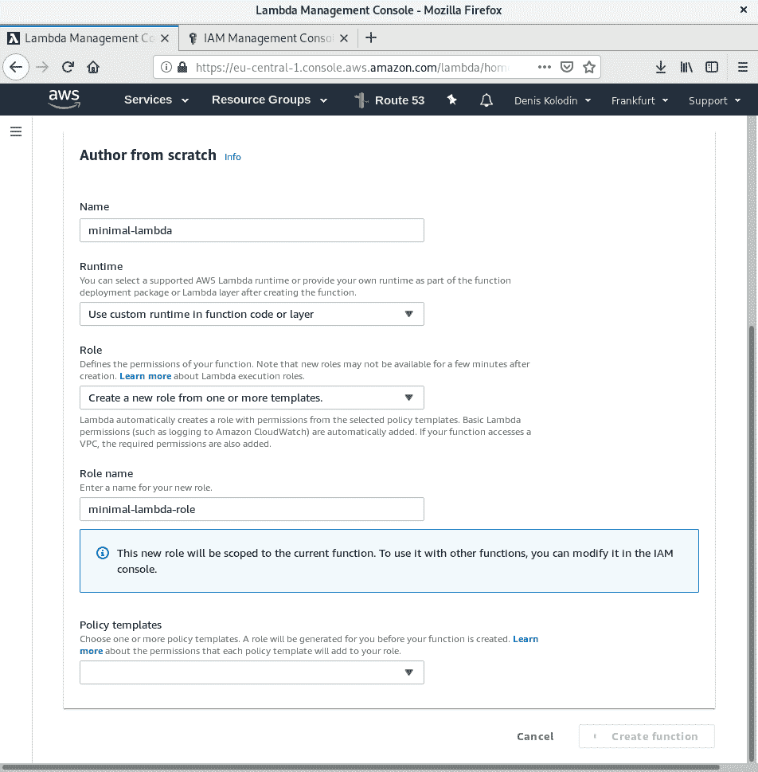
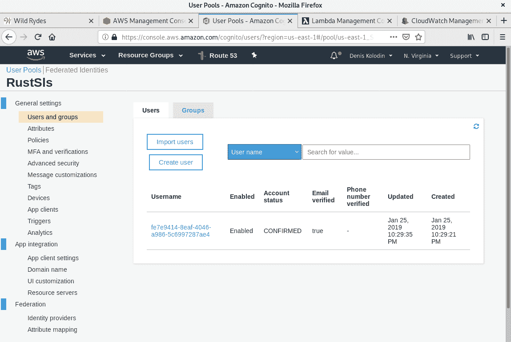

# 使用 AWS Lambda 的有界微服务

在上一章中，我们学习了如何使用 AWS Lambda 和官方的 `lambda-runtime` 包创建无服务器应用程序。这对于使用 **Amazon Web Services** (**AWS**) 的开发者尤其有用，尤其是那些特别想使用 AWS Lambda 的开发者。它与我们在创建独立网络服务器时的方法不同，因为 AWS Lambda 会自动存储、扩展和运行，而我们唯一需要提供的是微服务的编译代码。

本章将涵盖以下主题：

+   处理 AWS Lambda Rust 运行时

+   使用 Serverless Framework 将微服务部署到 AWS

# 技术要求

要使用本章中的技术，您需要一个配置好的 Docker 实例，因为 AWS 使用 Amazon Linux AMI 分发版来运行 Lambda，我们需要为该环境编译 Rust 代码的特殊环境。您还需要在 AWS 中有一个账户。如果您还没有，请创建一个。AWS 提供了一个名为 Free Tier 的免费试用期，为期一年，每月包含 100 万次 AWS Lambda 请求。您可以在以下链接中了解更多关于这个试用期的信息：[`aws.amazon.com/free/`](https://aws.amazon.com/free/)

您还应该知道如何使用 AWS 控制台。本章中将有使用它的示例，但为了生产环境，您必须了解其所有功能，包括使用访问控制来防止恶意渗透到您的微服务。您可以在一本名为《Learning AWS》的书中了解 AWS：[`www.packtpub.com/virtualization-and-cloud/learning-aws-second-edition`](https://www.packtpub.com/virtualization-and-cloud/learning-aws-second-edition)。

在本章中，我们将创建两个无服务器应用程序的示例。第一个示例需要 Rust 编译器 1.31 版本或更高版本以及 `musl` 库，而第二个示例则需要 npm 和 Docker。

您可以在 GitHub 上找到本章所有示例的源代码：[`github.com/PacktPublishing/Hands-On-Microservices-with-Rust/tree/master/Chapter17/`](https://github.com/PacktPublishing/Hands-On-Microservices-with-Rust/tree/master/Chapter17/)

# 无服务器架构

在本书的大部分内容中，我们已将微服务创建为独立的服务器应用程序。要部署它们，您必须使用持续交付工具将二进制文件上传到远程服务器。如果您不想担心使二进制文件与操作系统兼容，您可以使用容器来交付和部署打包到镜像中的应用程序。这为您提供了使用容器编排服务（如 Kubernetes）的机会。容器编排软件简化了使用容器运行微服务的大型应用程序的扩展和配置。如果您进一步思考这种简化，您会发现使用预定义和预安装的容器池很有帮助，这些容器池具有通用的环境，可以运行带有请求处理功能的小型二进制文件，而不需要任何 HTTP 中间件。换句话说，您可以为事件编写处理器，而无需编写更多的 HTTP 代码。这种方法被称为无服务器。

在下一节中，我们将列出提供无服务器基础设施并可用于部署无服务器应用程序的平台。

# AWS Lambda

AWS Lambda 是 Amazon 的一项产品，您可以在以下链接找到：[`aws.amazon.com/lambda/`](https://aws.amazon.com/lambda/).

针对 Rust 编程语言提供了官方支持，使用 `lambda-runtime` 包：[`github.com/awslabs/aws-lambda-rust-runtime`](https://github.com/awslabs/aws-lambda-rust-runtime). 我们将在本章中使用此包来演示无服务器方法。

# Azure Functions

Azure Functions 是微软的无服务器产品，它是 Azure 平台的一部分：[`azure.microsoft.com/en-us/services/functions/`](https://azure.microsoft.com/en-us/services/functions/)[.](https://azure.microsoft.com/en-us/services/functions/)

目前没有官方的 Rust 支持，但您可以使用 `azure-functions` 包，该包使用基于 GRPC 的 Azure Functions 内部工作者协议在主机和语言工作者之间进行交互。

# Cloudflare Workers

Cloudflare 提供了自己的无服务器产品，称为 Cloudflare Workers：[`www.cloudflare.com/products/cloudflare-workers/`](https://www.cloudflare.com/products/cloudflare-workers/).

此服务与 Rust 兼容，因为 Cloudflare Workers 实现了一个很棒的想法：**将工作者编译为 WebAssembly**（**WASM**）。由于 Rust 对 WASM 有良好的支持，您可以使用它轻松地为 Cloudflare 生成无服务器工作者。

# IBM Cloud Functions

IBM 提供了自己的基于 Apache OpenWhisk 的无服务器产品：[`console.bluemix.net/openwhisk/`](https://console.bluemix.net/openwhisk/).

您可以使用 Rust 编写无服务器函数，因为该平台支持以 Docker 镜像提供的函数，并且您可以使用 Rust 函数创建 Docker 镜像。

# Google Cloud Functions

Google Cloud Functions 是 Google 提供的产品，作为 Google Cloud 的一部分：[`cloud.google.com/functions/`](https://cloud.google.com/functions/).

Rust 没有支持。可能，你可以使用 Rust 为 Python 环境编写原生模块，并尝试使用 Python 代码启动它们，但我找不到确认这种方法是否可行的证据。无论如何，我确信将来会有机会运行 Rust 代码。

# 用于 AWS Lambda 的最小 Rust 微服务

在本节中，我们将创建一个在 AWS Lambda 无服务器环境中工作的微服务。我们将重新实现第四章 数据序列化和反序列化使用 Serde Crate 中 *与微服务交互的数据格式* 部分的随机数生成器。

# 依赖项

首先，我们需要创建一个新的 `minimal-lambda` crate 并向其中添加以下依赖项：

```rs
[dependencies]
lambda_runtime = { git = "https://github.com/awslabs/aws-lambda-rust-runtime" }
log = "0.4"
rand = "0.5"
serde = "1.0"
serde_derive = "1.0"
simple_logger = "1.0"
```

我们需要的首要依赖项是 `lambda_runtime`，这是一个用于使用 Rust 为 AWS Lambda 平台编写 `lambda` 函数的官方 crate。我们使用了 GitHub 上的版本，因为在编写本文时，这个 crate 正在积极开发。

AWS 将所有 `lambda` 函数的输出打印为日志，我们将使用 `simple_logger` crate，它将所有日志打印到 *stdout*。

我们还需要用 lambda 重写二进制的名称，因为运行 AWS Lambda 的环境期望找到一个名为 `bootstrap` 的二进制文件，该文件实现了 `lambda` 函数。让我们将我们的示例生成的二进制文件重命名：

```rs
[[bin]]
name = "bootstrap"
path = "src/main.rs"
```

这就足够开始编写一个用于无服务器环境的最小微服务了。

# 开发一个微服务

我们需要在我们的代码中以下类型：

```rs
use serde_derive::{Serialize, Deserialize};
use lambda_runtime::{lambda, Context, error::HandlerError};
use rand::Rng;
use rand::distributions::{Bernoulli, Normal, Uniform};
use std::error::Error;
use std::ops::Range;
```

查看从 `lambda_runtime` crate 的导入是有意义的。`lambda` 宏用于从二进制文件导出处理程序，该处理程序将由 AWS Lambda 运行时使用。`Context` 是处理程序的必需参数，我们还有导入 `HandlerError` 以用于处理程序的返回 `Result` 值。

然后，我们可以编写一个主函数，初始化 `simple_logger` 并将 `rng_handler`（我们将在下面的代码中实现）包装起来，以导出 lambda 函数的处理程序：

```rs
fn main() -> Result<(), Box<dyn Error>> {
    simple_logger::init_with_level(log::Level::Debug).unwrap();
    lambda!(rng_handler);
    Ok(())
}
```

`rng_handler` 是一个函数，它期望一个请求并返回一个响应：

```rs
fn rng_handler(event: RngRequest, _ctx: Context) -> Result<RngResponse, HandlerError> {
    let mut rng = rand::thread_rng();
    let value = {
        match event {
            RngRequest::Uniform { range } => {
                rng.sample(Uniform::from(range)) as f64
            },
            RngRequest::Normal { mean, std_dev } => {
                rng.sample(Normal::new(mean, std_dev)) as f64
            },
            RngRequest::Bernoulli { p } => {
                rng.sample(Bernoulli::new(p)) as i8 as f64
            },
        }
    };
    Ok(RngResponse { value })
}
```

在实现中，我们使用了第四章 使用 Serde Crate 的数据序列化和反序列化 中的示例中的生成器，并在 *与微服务交互的数据格式* 部分借用了一个必须可序列化的请求类型：

```rs
#[derive(Deserialize)]
#[serde(tag = "distribution", content = "parameters", rename_all = "lowercase")]
enum RngRequest {
    Uniform {
        #[serde(flatten)]
        range: Range<i32>,
    },
    Normal {
        mean: f64,
        std_dev: f64,
    },
    Bernoulli {
        p: f64,
    },
}
```

前一个请求类型是一个枚举，有三个变体，允许客户端选择三个概率分布之一来生成随机值。我们还需要一个类型来返回带有随机值的响应。我们也将从前面的代码中借用它。看看我们将使用的响应结构体：

```rs
#[derive(Serialize)]
struct RngResponse {
    value: f64,
}
```

现在，这个 lambda 函数期望一个 JSON 格式的 `RngRequest` 值作为请求，它将被自动反序列化，以及一个 `RngResponse` 结果，它将被序列化为 JSON 并返回给客户端。让我们构建这段代码并检查它的工作情况。

# 构建

要构建 lambda 函数，我们需要生成一个与亚马逊 Linux 兼容的二进制文件。您可以使用三种方法来构建相应的二进制文件：

+   使用与 x86_64 兼容的 Linux 发行版构建它。

+   在亚马逊 Linux 的 Docker 容器中构建它。

+   使用 `musl` 标准 C 库构建它。

我们将使用后一种方法，因为它最小化了生成的二进制文件的外部依赖。首先，您必须安装 `musl` 库，您可以从这里获取：[`www.musl-libc.org/`](https://www.musl-libc.org/)。

我使用以下命令完成了这项工作：

```rs
git clone git://git.musl-libc.org/musl
 cd musl
 ./configure
 make
 sudo make install
```

但如果您的操作系统有相应的包，您应该安装那个包。

要使用 `musl` 库构建代码，我们必须将 `x86_64-unknown-linux-musl` 作为目标值。但我们可以通过 cargo 的配置文件将此目标设置为项目的默认值。在项目的文件夹中添加一个 `.cargo/config` 文件，并添加以下配置：

```rs
[build]
target = "x86_64-unknown-linux-musl"
```

确保编译器支持 `musl` 或使用 `rustup` 添加它：

```rs
rustup target add x86_64-unknown-linux-musl
```

现在，您可以使用 `cargo build` 命令简单地构建 lambda。这将生成一个使用 `musl` 库编译的二进制文件，我们可以将其上传到 AWS。

# 部署

我们可以使用两个工具将 lambda 部署到 AWS：

+   AWS CLI 工具

+   Web AWS 控制台

第一个步骤可能有点繁琐，在本书的下一节中，您将看到如何使用 Serverless Framework 来部署由 `lambda` 函数组成的应用程序。对于这个例子，进入 AWS 控制台并转到 AWS Lambda 产品页面。点击 *创建函数* 按钮，在出现的表单中输入以下值：

+   **名称**: `minimal-lambda`

+   **运行时**: 在函数代码或层中选择使用自定义运行时

+   **角色**: 选择从一个或多个模板创建新角色

+   **角色名称**: `minimal-lambda-role`

这就是您完成表单后应该看起来像的样子：



点击创建函数按钮，在函数创建过程中，使用以下命令将二进制打包到 zip 文件中：

```rs
zip -j minimal-lambda.zip target/x86_64-unknown-linux-musl/debug/bootstrap
```

在出现的表单中，选择在 *函数代码* 部分的 *代码输入类型* 中 *上传一个 .zip 文件*：


选择文件并使用表单上传它。当带有 Rust 函数的存档上传后，函数就准备好被调用了。点击测试按钮，您将看到一个表单，您可以在其中输入 JSON 格式的测试请求：


在其中输入以下 JSON：

```rs
{
  "distribution": "uniform",
  "parameters": {
    "start": 0,
    "end": 100
  }
}
```

这是一个序列化的 `RngRequest` 值，它使用均匀分布生成 0-100 范围内的随机值。在事件名称字段中输入 `uniform` 并点击 *创建* 按钮，测试前提条件将被存储。现在您可以在 *测试* 按钮左侧的下拉列表中选择此请求。选择 *uniform* 值并点击 *测试* 按钮以查看响应结果：


我们生成的微服务产生了一个值。如果您再次点击 *测试* 按钮，它将生成下一个值。如您所见，在 *日志输出* 部分打印了由 `simple_logger` crate 生成的日志记录。并且此函数的执行大约需要 20 毫秒。

AWS Lambda 的主要好处是访问所有其他 AWS 服务。让我们创建一个更复杂的示例，利用更多服务来展示如何将 `lambda` 函数与其他 AWS 基础设施集成。

# Serverless Framework

在本节中，我们将从 Wild Rydes Serverless Workshops 将无服务器应用程序移植到 Rust：[`github.com/aws-samples/aws-serverless-workshops`](https://github.com/aws-samples/aws-serverless-workshops)。此示例的目的是提供一个模拟订购独角兽骑乘服务的服务。

我们将使用 Serverless Framework，它提供了一个有用的工具，可以简化使用资源声明及其关系的应用程序部署。本节灵感来源于 Andrei Maksimov 创建的 Serverless Framework 使用示例，位于此处：[`github.com/andreivmaksimov/serverless-framework-aws-lambda-amazon-api-gateway-s3-dynamodb-and-cognito`](https://github.com/andreivmaksimov/serverless-framework-aws-lambda-amazon-api-gateway-s3-dynamodb-and-cognito)。让我们准备环境，以便使用 Serverless Framework 编写和构建应用程序。

# 准备

首先，您需要使用 `npm` 安装 Serverless Framework，它随 Node.js 提供：

```rs
sudo npm install -g serverless
```

我全局安装了它，因为我想要使用它从具有多个 lambdas 的应用程序 Rust 模板创建新项目：

```rs
sls install --url https://github.com/softprops/serverless-aws-rust-multi --name rust-sls
```

此命令会自动下载模板，并使用提供的名称构建一个空白应用程序。它会在控制台打印以下内容：

```rs
Serverless: Downloading and installing "serverless-aws-rust-multi"...
Serverless: Successfully installed "rust-sls"
```

当项目初始化时，进入此项目的文件夹并添加 **`serverless-finch`** 插件，我们将使用它来上传我们应用程序的资产：

```rs
npm install --save serverless-finch
```

`serverless-aws-rust-multi` 模板是一个工作区，包含两个 crate：`hello` 和 `world`。让我们将它们重命名为 `lambda_1` 和 `lambda_2`。我已经使用这个模板来向您展示一个应用程序如何包含多个 crate。在重命名文件夹后，我们还需要在项目的 `Cargo.toml` 配置中替换 `workspace` 的 `members`：

```rs
[workspace]
 members = [
     "lambda_1",
     "lambda_2",
 ]
```

现在我们可以不对 `lambda_2` 进行更改，并在 `lambda_1` crate 中实现 Wild Rydes 示例的功能。

# 实现

模板的原始源代码包含一些与上一个示例类似的代码，但我们将从头编写代码，你必须删除原始的`main.rs`文件。

# 依赖项

在`lambda_1` crate 的文件夹中，将以下依赖项添加到`Cargo.toml`中：

```rs
[dependencies]
chrono = "0.4"
lambda_runtime = { git = "https://github.com/awslabs/aws-lambda-rust-runtime" }
log = "0.4"
rand = "0.6"
rusoto_core = {version = "0.35.0", default_features = false, features=["rustls"]}
rusoto_dynamodb = {version = "0.35.0", default_features = false, features=["rustls"]}
serde = "1.0"
serde_derive = "1.0"
serde_json = "1.0"
simple_logger = "1.0"
uuid = { version = "0.7", features = ["v4"] }
```

如果你阅读了前面的章节，你将熟悉列表中的所有 crate，包括我们在本章前面的部分中使用的`lambda_runtime`。让我们看看`src/main.rs`中我们将从该 crate 使用的类型：

```rs
use chrono::Utc;
use lambda_runtime::{error::HandlerError, lambda, Context};
use log::debug;
use rand::thread_rng;
use rand::seq::IteratorRandom;
use rusoto_core::Region;
use rusoto_dynamodb::{AttributeValue, DynamoDb, DynamoDbClient, PutItemError, PutItemInput, PutItemOutput};
use serde_derive::{Serialize, Deserialize};
use std::collections::HashMap;
use std::error::Error;
use uuid::Uuid;
```

我们使用前面的类型实现了以下一系列操作：

+   解析请求

+   找到（生成）稍后将声明的`Unicorn`实例

+   向`DynamoDb`表添加记录

我们的`main`函数只调用一个执行这些步骤的处理器函数：

```rs
fn main() -> Result<(), Box<dyn Error>> {
     simple_logger::init_with_level(log::Level::Debug)?;
     debug!("Starting lambda with Rust...");
     lambda!(handler);
     Ok(())
 }
```

我们还初始化了日志记录器，以便使用 CloudWatch 服务读取它们。

# 处理器

处理器执行与原始示例相同的逻辑，但它完全用 Rust 和`lambda_runtime` crate 重写。看看`handler`函数的实现：

```rs
fn handler(event: Request, _: Context) -> Result<Response, HandlerError> {
     let region = Region::default();
     let client = DynamoDbClient::new(region);
     let username = event
         .request_context
         .authorizer
         .claims
         .get("cognito:username")
         .unwrap()
         .to_owned();
     debug!("USERNAME: {}", username);
     let ride_id = Uuid::new_v4().to_string();
     let request: RequestBody = serde_json::from_str(&event.body).unwrap();
     let unicorn = find_unicorn(&request.pickup_location);
     record_ride(&client, &ride_id, &username, &unicorn).unwrap();
     let body = ResponseBody {
         ride_id: ride_id.clone(),
         unicorn_name: unicorn.name.clone(),
         unicorn,
         eta: "30 seconds".into(),
         rider: username.clone(),
     };
     let mut headers = HashMap::new();
     headers.insert("Access-Control-Allow-Origin".into(), "*".into());
     let body = serde_json::to_string(&body).unwrap();
     let resp = Response {
         status_code: 201,
         body,
         headers,
     };
     Ok(resp)
 }
```

初始时，这个函数使用默认的`Region`值连接到 DynamoDB，它最初读取环境变量以获取实际值，如果没有找到区域，则使用`us-east-1`区域。然后，`handler`提取由`Cognito`提供的用户名，我们将使用它来授权用户，而不会手动实现用户注册。

然后，我们生成一次骑行的唯一 ID，并从提供的 JSON 字符串中提取请求的主体。你不能声明一个完整的`Request`结构体，你必须分两步解析它。第一步使用`lambda!`宏，第二步使用`serde_json::from_str`函数调用。然后，我们调用我们稍后将实现的`find_unicorn`函数，并使用`record_ride`函数调用将记录添加到数据库中，该函数我们将在本节稍后实现。

当记录被添加时，我们分两步构建响应。首先，我们创建响应的主体，然后将其包裹在额外的值中。我们必须这样做包裹，因为我们将会使用 API 网关通过`S3`共享的外部应用程序调用 lambda。

现在我们可以查看我们需要的结构体了。

# 请求和响应类型

主要的结构体是`Unicorn`，它包含我们将要骑乘的生物：

```rs
#[derive(Clone, Serialize)]
 #[serde(rename_all = "PascalCase")]
 struct Unicorn {
     name: String,
     color: String,
     gender: String,
 }
```

每个`Unicorn`都有一个`name`、`color`和`gender`。我们将把这些值作为 DynamoDB 记录中的条目存储。为了简化代码中实例的创建，我们将添加以下构造函数：

```rs
impl Unicorn {
     fn new(name: &str, color: &str, gender: &str) -> Self {
         Unicorn {
             name: name.to_owned(),
             color: color.to_owned(),
             gender: gender.to_owned(),
         }
     }
 }
```

你可能会问为什么我们不用枚举来表示颜色和性别。这是可能的，但你必须确保序列化的值正是你想要的。

`Location`结构体表示地图上的一个点，它将由应用程序的 UI 设置：

```rs
#[derive(Deserialize)]
 #[serde(rename_all = "PascalCase")]
 struct Location {
     latitude: f64,
     longitude: f64,
 }
```

现在我们可以声明一个包含`body`和`request_context`字段的`Request`结构体，我们将使用它来获取由`Cognito`提供的用户名。您可能已经注意到`Location`结构体与其他结构体有不同的重命名规则。这是因为`Request`结构体是由 API 网关解析的，而`Location`和`RequestBody`将由前端应用创建，该应用使用其他标识符。`Request`将`body`表示为一个`String`：

```rs
#[derive(Deserialize)]
 #[serde(rename_all = "camelCase")]
 struct Request {
     body: String,
     request_context: RequestContext,
 }
```

`RequestContext`是一个由运行时填充的映射，我们将将其解析到一个结构体中：

```rs
#[derive(Deserialize)]
 #[serde(rename_all = "camelCase")]
 struct RequestContext {
     authorizer: Authorizer,
 }
```

我们需要一个只包含`claims`值的`Authorizer`字段：

```rs
#[derive(Deserialize)]
 #[serde(rename_all = "camelCase")]
 struct Authorizer {
     claims: HashMap<String, String>,
 }
```

我们在`handler`中使用`claims`来获取`cognito:username`值。

```rs
#[derive(Deserialize)]
 #[serde(rename_all = "PascalCase")]
 struct RequestBody {
     pickup_location: Location,
 }
```

现在我们可以声明一个`Response`。它也被 API 网关使用，必须包含`status_code`和`headers`：

```rs
#[derive(Serialize)]
 #[serde(rename_all = "camelCase")]
 struct Response {
     body: String,
     status_code: u16,
     headers: HashMap<String, String>,
 }
```

`body`字段由一个`String`类型表示，我们将将其单独反序列化到`ResponseBody`结构体中：

```rs
#[derive(Serialize)]
 #[serde(rename_all = "PascalCase")]
 struct ResponseBody {
     ride_id: String,
     unicorn: Unicorn,
     unicorn_name: String,
     eta: String,
     rider: String,
 }
```

前面的字段对于工作坊的前端应用是必要的。

现在我们可以添加生成`Unicorn`实例和向数据库添加记录的功能。

# 函数

`find_unicorn`函数从`Unicorn`的三个预定义值中选择一个：

```rs
fn find_unicorn(location: &Location) -> Unicorn {
     debug!("Finding unicorn for {}, {}", location.latitude, location.longitude);
     let unicorns = [
         Unicorn::new("Bucephalus", "Golden", "Male"),
         Unicorn::new("Shadowfax", "White", "Male"),
         Unicorn::new("Rocinante", "Yellow", "Female"),
     ];
     let mut rng = thread_rng();
     unicorns.iter().choose(&mut rng).cloned().unwrap()
 }
```

`record_ride`函数从 DynamoDB 构建 put 请求。要执行此类请求，我们需要填充一个只包含属性的`HashMap`。如果您想了解更多关于如何与 DynamoDB 交互的信息，您可以回到第七章，*与数据库的可靠集成*，其中我们详细探讨了与数据库的交互。

```rs
fn record_ride(
     conn: &DynamoDbClient,
     ride_id: &str,
     username: &str,
     unicorn: &Unicorn,
 ) -> Result<PutItemOutput, PutItemError> {
     let mut item: HashMap<String, AttributeValue> = HashMap::new();
     item.insert("RideId".into(), s_attr(ride_id));
     item.insert("User".into(), s_attr(username));
     item.insert("UnicornName".into(), s_attr(&unicorn.name));
     let timestamp = Utc::now().to_string();
     item.insert("RequestTime".into(), s_attr(&timestamp));
     item.insert("Unicorn".into(), unicorn_map(unicorn));
     let put = PutItemInput {
         table_name: "Rides".into(),
         item,
         ..Default::default()
     };
     conn.put_item(put).sync()
 }
```

我们还需要一个函数来准备由`rusoto_dynamodb` crate 使用的`AttributeValues`，这些类型可以表示为字符串值的引用：

```rs
fn s_attr<T: AsRef<str>>(s: T) -> AttributeValue {
     AttributeValue {
         s: Some(s.as_ref().to_owned()),
         ..Default::default()
     }
 }
```

我们需要的最后一个函数是将`Unicorn`的字段转换为映射：

```rs
fn unicorn_map(unicorn: &Unicorn) -> AttributeValue {
     let mut item = HashMap::new();
     item.insert("Name".into(), s_attr(&unicorn.name));
     item.insert("Color".into(), s_attr(&unicorn.color));
     item.insert("Gender".into(), s_attr(&unicorn.gender));
     AttributeValue {
         m: Some(item),
         ..Default::default()
     }
 }
```

在本章的后面，您将在 AWS 控制台中看到使用此布局的存储值。

# 配置

Serverless Framework 使用一个`serverless.yml`配置文件来部署 Lambda 到 AWS。由于我们安装了`serverless-rust`插件（它包含在 Rust 模板中），我们可以使用它来设置运行时。填写所描述服务的参数：

```rs
service: rust-sls
 provider:
   name: aws
   runtime: rust
   memorySize: 128
```

以下参数为配置函数提供了更多控制：

```rs
package:
   individually: true
```

我们还必须激活两个插件：一个用于构建 Rust Lambda，另一个用于将资产上传到`S3`：

```rs
plugins:
   - serverless-rust
   - serverless-finch
```

现在我们可以声明我们的函数：

```rs
functions:
   lambda_1:
     handler: lambda_1
     role: RustSlsLambdaRole
     events:
       - http:
           path: ride
           method: post
           cors: true
           authorizer:
             type: COGNITO_USER_POOLS
             authorizerId:
               Ref: RustSlsApiGatewayAuthorizer
   lambda_2:
     handler: lambda_2
     events:
       - http:
           path: check
           method: get
```

第一个函数关联着我们将要声明的`RustSlsLambdaRole`角色。我们需要它来访问一些资源。Lambda 函数接收一个帖子并支持 CORS，可以从前端调用，这在浏览器中工作。我们还关联了一个授权者，并使用`RustSlsApiGatewayAuthorizer`，我们将在后面声明。

# 资源

添加一个包含`Resources`和`Outputs`映射的资源部分，以声明必要的资源和输出变量。让我们添加`Resources`：

```rs
resources:
   Resources:
```

添加一个`S3`存储桶声明，我们将所有资产放置在这里，并将`WebsiteConfiguration`设置为设置默认索引文件：

```rs
RustSlsBucket:
   Type: AWS::S3::Bucket
   Properties:
     BucketName: rust-sls-aws
     WebsiteConfiguration:
       IndexDocument: index.html
```

我们还必须添加一个策略，允许外部客户端（如浏览器）读取这些文件：

```rs
RustSlsBucketPolicy:
   Type: AWS::S3::BucketPolicy
   Properties:
     Bucket:
       Ref: "RustSlsBucket"
     PolicyDocument:
       Statement:
         -
           Effect: "Allow"
           Principal: "*"
           Action:
             - "s3:GetObject"
           Resource:
             Fn::Join:
               - ""
               -
                 - "arn:aws:s3:::"
                 -
                   Ref: "RustSlsBucket"
                 - "/*"
```

Wild Rydes 应用程序配置为使用`Cognito`客户端授权用户使用其账户。让我们使用以下声明进行配置并激活电子邮件确认：

```rs
RustSlsCognitoUserPool:
   Type: AWS::Cognito::UserPool
   Properties:
     UserPoolName: RustSls
     UsernameAttributes:
       - email
     AutoVerifiedAttributes:
       - email
RustSlsCognitoUserPoolClient:
   Type: AWS::Cognito::UserPoolClient
   Properties:
     ClientName: RustSlsWebApp
     GenerateSecret: false
     UserPoolId:
       Ref: "RustSlsCognitoUserPool"
```

在第七章，*与数据库的可靠集成*中，我们使用了表的 JSON 声明。您也可以使用 Serverless Framework 配置`DynamoDB`表：

```rs
RustSlsDynamoDBTable:
   Type: AWS::DynamoDB::Table
   Properties:
     TableName: Rides
     AttributeDefinitions:
       - AttributeName: RideId
         AttributeType: S
     KeySchema:
       - AttributeName: RideId
         KeyType: HASH
     ProvisionedThroughput:
       ReadCapacityUnits: 1
       WriteCapacityUnits: 1
```

为我们的`lambda_1`crate 添加一个角色：

```rs
RustSlsLambdaRole:
   Type: AWS::IAM::Role
   Properties:
     RoleName: RustSlsLambda
     AssumeRolePolicyDocument:
       Version: '2012-10-17'
       Statement:
         - Effect: Allow
           Principal:
             Service:
               - lambda.amazonaws.com
           Action: sts:AssumeRole
```

并将这些策略添加到该角色中：

```rs
Policies:
   - PolicyName: DynamoDBWriteAccess
     PolicyDocument:
       Version: '2012-10-17'
       Statement:
         - Effect: Allow
           Action:
             - logs:CreateLogGroup
             - logs:CreateLogStream
             - logs:PutLogEvents
           Resource:
             - 'Fn::Join':
               - ':'
               -
                 - 'arn:aws:logs'
                 - Ref: 'AWS::Region'
                 - Ref: 'AWS::AccountId'
                 - 'log-group:/aws/lambda/*:*:*'
         - Effect: Allow
           Action:
             - dynamodb:PutItem
           Resource:
             'Fn::GetAtt': [ RustSlsDynamoDBTable, Arn ]
```

我们必须为此角色提供对`DynamoDB`表的写访问权限。

创建一个`authorizer`：

```rs
RustSlsApiGatewayAuthorizer:
   Type: AWS::ApiGateway::Authorizer
   Properties:
     Name: RustSls
     RestApiId:
       Ref: ApiGatewayRestApi
     Type: COGNITO_USER_POOLS
     ProviderARNs:
       - Fn::GetAtt: [ RustSlsCognitoUserPool, Arn ]
     IdentitySource: method.request.header.Authorization
```

声明输出变量：

```rs
Outputs:
   RustSlsBucketURL:
     Description: "RustSls Bucket Website URL"
     Value:
       "Fn::GetAtt": [ RustSlsBucket, WebsiteURL ]
   RustSlsCognitoUserPoolId:
     Description: "RustSls Cognito User Pool ID"
     Value:
       Ref: "RustSlsCognitoUserPool"
   RustSlsCognitoUserPoolClientId:
     Description: "RustSls Cognito User Pool Client ID"
     Value:
       Ref: "RustSlsCognitoUserPoolClient"
   RustSlsDynamoDbARN:
     Description: "RustSls DynamoDB ARN"
     Value:
       "Fn::GetAtt": [ RustSlsDynamoDBTable, Arn ]
```

此长配置的最后部分声明了`serverless-finch`插件将使用的文件夹来上传：

```rs
custom:
   client:
     bucketName: rust-sls-aws
     distributionFolder: assets
```

如您所见，我使用了`rust-sls-aws`作为存储桶名称，但每个`S3`存储桶都需要一个唯一的全局名称，并且您必须替换所有配置中的存储桶名称才能部署。

# Deployment

部署准备工作已经完成。您需要一个有效的 AWS 账户来运行此应用程序。但让我们先创建一个用户，该用户具有使用 AWS CLI 部署应用程序所需的必要权限。

# Permissions

要部署此应用程序，您需要配置 AWS CLI 工具和一个具有以下权限的用户：

+   AWSLambdaFullAccess

+   IAMFullAccess

+   AmazonDynamoDBFullAccess

+   AmazonAPIGatewayAdministrator

+   AmazonCognitoPowerUser

+   CloudFormationAdministrator

值得注意的是，后者是手动创建的，可以在配置用户时通过向策略中添加 JSON 定义来添加：

```rs
{
    "Version": "2012-10-17",
    "Statement": [
        {
            "Sid": "Stmt1449904348000",
            "Effect": "Allow",
            "Action": [
                "cloudformation:CreateStack",
                "cloudformation:CreateChangeSet",
                "cloudformation:ListStacks",
                "cloudformation:UpdateStack",
                "cloudformation:DeleteStack",
                "cloudformation:DescribeStacks",
                "cloudformation:DescribeStackResource",
                "cloudformation:DescribeStackEvents",
                "cloudformation:ValidateTemplate",
                "cloudformation:DescribeChangeSet",
                "cloudformation:ExecuteChangeSet"
            ],
            "Resource": [
                "*"
            ]
        }
    ]
}
```

当您创建了一个具有必要凭证的用户后，您可以使用 Serverless Framework 构建和部署应用程序，该框架会自动构建所有 lambdas。

# Script

我们需要一些在部署前不知道的值。我们将使用`sls info -v`命令获取我们需要配置前端的实际值。创建一个 bash 脚本来添加必要的部署功能。首先，我们需要一个`extract`函数来获取`sls info`输出的第二列空格分隔的值：

```rs
extract() {
     echo "$DATA" | grep $1 | cut -d " " -f2
 }
```

要使用 Serverless Framework 部署应用程序，您必须调用`sls deploy`命令，但我们的应用程序更复杂，我们必须使用一系列命令：

```rs
deploy() {
     echo "ASSETS DOWNLOADING"
     curl -L https://api.github.com/repos/aws-samples/aws-serverless-workshops/tarball \
         | tar xz --directory assets --wildcards "*/WebApplication/1_StaticWebHosting/website" --strip-components=4
     echo "LAMBDAS BUILDING"
     sls deploy
     echo "ASSETS UPLOADING"
     sls client deploy
     echo "CONFIGURATION UPLOADING"
     DATA=`sls info -v`
     POOL_ID=`extract PoolId`
     POOL_CLIENT_ID=`extract PoolClientId`
     REGION=`extract region`
     ENDPOINT=`extract ServiceEndpoint`
     CONFIG="
     window._config = {
         cognito: {
             userPoolId: '$POOL_ID',
             userPoolClientId: '$POOL_CLIENT_ID',
             region: '$REGION'
         },
         api: {
             invokeUrl: '$ENDPOINT'
         }
     };
     "
     echo "$CONFIG" | aws s3 cp - s3://rust-sls-aws/js/config.js
     INDEX=`extract BucketURL`
     echo "INDEX: $INDEX"
 }
```

在 `deploy` 函数中，我们从 GitHub 下载 Wild Rydes 应用程序的前端部分，并将其所需文件夹提取到我们项目的 `assets` 文件夹中。然后我们调用 `sls deploy` 来部署应用程序的堆栈。然后我们调用 `sls client deploy` 将所有资产发布到 `S3`。当所有部分都部署完毕后，我们使用 `extract` 函数获取所有必要的值以填充 `config.js` 文件，这是连接已部署的前端与我们的 Rust 实现的 lambda 所必需的。我们使用嵌入式模板构建一个 `config.js` 文件，并使用 `aws s3 cp` 命令上传它。

让我们运行这个命令。

# 运行

如果你已经从 GitHub 下载了本章项目的源代码，你可以使用 `deploy.sh` 脚本来调用我们之前实现的函数。提供要调用的 `deploy` 函数的名称：

```rs
./deploy.sh deploy
```

它将使用 Serverless Framework 开始构建和部署过程，并打印出类似以下内容：

```rs
ASSETS DOWNLOADING
   % Total    % Received % Xferd  Average Speed   Time    Time     Time  Current
                                  Dload  Upload   Total   Spent    Left  Speed
   0     0    0     0    0     0      0      0 --:--:-- --:--:-- --:--:--     0
 100 65.7M    0 65.7M    0     0  7647k      0 --:--:--  0:00:08 --:--:-- 9968k
 LAMBDAS BUILDING
 Serverless: Building native Rust lambda_1 func...
     Finished release [optimized] target(s) in 0.56s                                                                                                                                                                
   adding: bootstrap (deflated 60%)
 Serverless: Building native Rust lambda_2 func...
     Finished release [optimized] target(s) in 0.32s                                                                                                                                                                
   adding: bootstrap (deflated 61%)
 Serverless: Packaging service...
 Serverless: Creating Stack...
 Serverless: Checking Stack create progress...
 .....
 Serverless: Stack create finished...
 Serverless: Uploading CloudFormation file to S3...
 Serverless: Uploading artifacts...
 Serverless: Uploading service .zip file to S3 (2.75 MB)...
 Serverless: Uploading service .zip file to S3 (1.12 MB)...
 Serverless: Validating template...
 Serverless: Updating Stack...
 Serverless: Checking Stack update progress...
 ........................................................................
 Serverless: Stack update finished...
 Service Information
 service: rust-sls
 stage: dev
 region: us-east-1
 stack: rust-sls-dev
 api keys:
   None
 endpoints:
   POST - https://48eggoi698.execute-api.us-east-1.amazonaws.com/dev/ride
   GET - https://48eggoi698.execute-api.us-east-1.amazonaws.com/dev/check
 functions:
   lambda_1: rust-sls-dev-lambda_1
   lambda_2: rust-sls-dev-lambda_2
 layers:
   None
```

部署需要时间，完成后，将调用第二个命令 `sls client deploy`，使用 `serverless-finch` 插件上传 `assets` 文件夹，并打印以下内容：

```rs

ASSETS UPLOADING
Serverless: This deployment will:
Serverless: - Upload all files from 'assets' to bucket 'rust-sls-aws'
Serverless: - Set (and overwrite) bucket 'rust-sls-aws' configuration
Serverless: - Set (and overwrite) bucket 'rust-sls-aws' bucket policy
Serverless: - Set (and overwrite) bucket 'rust-sls-aws' CORS policy
? Do you want to proceed? true
Serverless: Looking for bucket...
Serverless: Bucket found...
Serverless: Deleting all objects from bucket...
Serverless: Configuring bucket...
Serverless: Configuring policy for bucket...
Serverless: Configuring CORS for bucket...
Serverless: Uploading client files to bucket...
Serverless: Success! Your site should be available at http://rust-sls-aws.s3-website-us-east-1.amazonaws.com/
CONFIGURATION UPLOADING
INDEX: http://rust-sls-aws.s3-website-us-east-1.amazonaws.com
```

脚本打印出了我们可以用来连接和测试应用的链接。

# 测试

在浏览器中打开提供的 URL，你将看到 Wild Rydes 前端应用程序。

用户必须点击 *GIDDY UP!* 按钮，并使用 `Cognito` 注册账户，实际上这个服务是在后台使用的，用户不需要直接与该服务交互。

你将看到可爱的用户界面。点击地图并点击 *设置取货* 按钮，你将看到独角兽的头如何移动到你设置的位置：


独角兽的名称和颜色是由我们用 Rust 创建的 `lambda` 函数生成的。如果你打开 AWS 控制台的一些页面，你可以在 *用户池* 部分的 *用户和组* 页面上看到一个注册的用户：



我们部署了两个 lambda，但实际上应用程序只使用了第一个，称为 `rust-sls-dev-lambda_1`：


如果你进入 lambda 的页面，点击 监控 标签，并打开 lambda 的 CloudWatch 日志，你可以看到 lambda 生成了一个用户名，并存储在我们设置的位置：


lambda 还在 DynamoDB 中存储了一个记录，你也可以在 DynamoDB 部分的 *表格* 页面上找到它：


你可以看到 lambda 添加的记录。如果你点击记录，你将看到我们之前使用 `record_ride` 函数填充的所有字段：


应用程序已成功移植到 Rust，并且按预期工作。让我们看看我们如何清理我们使用的资源。

# 更新和删除

如果你再次调用`sls deploy`，Serverless Framework 还提供了自动更新资源的能力。我们可以将此作为函数添加到部署 bash 脚本中：

```rs
update() {
     sls deploy
 }
```

如果你想要更新一些 Lambda 的代码，但又不想离开由`Cognito`维护的会话，这个命令很有用。

要移除我们部署的所有内容，我们可以使用以下函数：

```rs
remove() {
     echo "ASSETS REMOVING"
     sls client remove
     echo "LAMBDAS REMOVING"
     sls remove
     echo "ASSETS CLEANUP"
     rm -rf assets
     mkdir assets
     touch assets/.gitkeep
 }
```

它之所以有效，是因为 Serverless Framework 支持移除声明的资源。我建议你在实验后清理所有内容，因为即使你不使用这个演示，AWS 也会为服务产生账单。

# 摘要

在这一章中，我们研究了微服务实现的一种替代方法——无服务器架构。这种方法涉及直接使用处理传入请求的函数。有许多无服务器基础设施的提供商，我们使用了流行的 AWS 平台将无服务器应用程序移植到 Rust。
