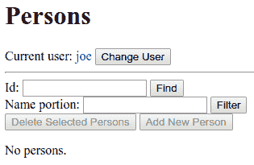

创建一个完整的后端网页应用

在上一章中，我们看到了如何使用 Actix web 框架构建 RESTful 网络服务。为了对我们有用，RESTful 网络服务必须被客户端应用使用。

在本章中，我们将看到如何使用 Actix web 框架构建一个非常小但完整的网页应用。我们将使用 HTML 代码在网页浏览器中格式化，使用 JavaScript 代码在同一网页浏览器中执行，以及使用 Tera crate 进行 HTML 模板化。这对于在 HTML 页面中嵌入动态数据非常有用。

本章将涵盖以下主题：

+   理解经典网页应用及其 HTML 模板是什么

+   在 Rust 和 Actix web 中使用 Tera 模板引擎

+   使用 Actix web 处理网页请求

+   在网页中处理身份验证和授权

# 技术要求

为了最好地理解本章内容，你需要阅读上一章。此外，还假设你具备基本的 HTML 和 JavaScript 知识。

本章的完整源代码可以在[`github.com/PacktPublishing/Rust-2018-Projects`](https://github.com/PacktPublishing/Rust-2018-Projects)存储库的`Chapter04`文件夹中找到。

# 网页应用的定义

每个人都知道什么是网页或网站，也知道有些网页相当静态，而有些则具有更多动态行为。然而，网页应用的定义却更为微妙且具有争议性。

我们将从网页应用的运行定义开始；也就是说，观察网页应用的外观和行为。

对于我们的目的，一个网页应用是一个具有以下行为的网站：

+   它在网页浏览器中表现为一个或多个网页。在这些页面上，用户可以通过按键盘上的键、用鼠标点击、触摸屏上的点击或使用其他输入设备与页面进行交互。对于某些用户交互，这些网页会向服务器发送请求，并从该网站接收作为响应的数据。

+   对于一个*静态*网页，接收到的数据对于相同的请求始终相同；但对于网页应用，接收到的数据取决于服务器当前的状态，这可能会随时间变化。在接收到数据后，网页会显示其他 HTML 代码，要么是新的完整页面，要么是当前页面的部分。

+   经典的网页应用只从服务器接收 HTML 代码，因此浏览器在收到 HTML 代码时只需显示它。现代应用更常从服务器接收原始数据，并在浏览器中使用 JavaScript 代码创建显示数据的 HTML 代码。

在这里，我们将开发一个相当经典的网页应用，因为我们的应用主要从服务器接收 HTML 代码。一些 JavaScript 代码将被用来改进应用的结构。

# 理解网页应用的行为

当用户通过浏览器的地址栏或点击页面中的链接来导航到网站时，浏览器会发送一个 HTTP `GET`请求，其中 URI 指定在地址字段或链接元素中，例如`http://hostname.domainname:8080/dir/file?arg1=value1&arg2=value2`。

这个地址通常被称为**统一资源定位符**（**URL**）或**统一资源标识符**（**URI**）。这两个缩写之间的区别在于，URI 是唯一标识资源的东西，不一定指定它可以在哪里找到；而 URL 则精确指定了资源可以找到的位置。在这个过程中，它也标识了资源，因为单个位置只能有一个资源。

因此，每个 URL 也是 URI，但一个地址可以是 URI 而不一定是 URL。例如，指定文件路径名的地址是 URL（也是 URI），因为它指定了文件的路径。然而，指定文件过滤条件的地址是 URI，但不是 URL，因为它没有明确指定哪个文件满足该条件。

地址的第一部分（如`http://hostname.domainname:8080`），直到（可选的）端口号，是必要的，以便将请求路由到应该处理它的服务器进程。这个服务器必须在主机计算机上运行，并且它必须等待针对该端口的传入请求；或者，通常的说法是，它必须在该端口上监听。

URI 的后续部分（如`/dir/file`）被称为**路径**，它始终以斜杠开头，以第一个问号字符或 URI 的结尾为结束。可能的后续部分（如`?arg1=value1&arg2=value2`）被称为**查询**，它由一个或多个用与号分隔的字段组成。查询的任何字段都有一个名称，后面跟着一个等号，然后是值。

当发起请求时，服务器应通过发送 HTTP 响应来回复，其中包含在浏览器中显示的 HTML 页面作为其主体。

在初始页面显示后，任何进一步的交互通常发生在用户通过键盘、鼠标或其他输入设备在页面上操作时。

注意，任何用户操作对页面产生的影响可以分为以下几种方式：

+   **无代码**：某些用户操作仅由浏览器处理，没有调用应用程序代码。例如，当鼠标悬停在控件上时，鼠标光标形状会改变；当在文本控件中输入时，该控件内的文本会改变；当点击复选框时，框会被选中或取消选中。通常，这种行为不受应用程序代码的控制。

+   **仅前端**：某些用户操作（如按键按下）会触发与这些操作关联的客户端 JavaScript 代码的执行，但不会执行客户端-服务器通信，因此不会调用服务器端代码。通常，任何按钮都与（使用按钮元素的`onclick`属性）任何时间用户点击该按钮时执行的 JavaScript 代码相关联。此代码可以，例如，启用或禁用其他小部件或将数据从一个小部件复制到同一页面的另一个小部件。

+   **仅后端**：某些用户操作会触发客户端-服务器通信，而不使用任何 JavaScript 代码。这些操作的例子只有两个：

    +   在 HTML `form`元素内部点击一个`submit`输入元素

    +   点击一个**a** HTML 元素，更广为人知的是**链接**

+   **全栈**：某些用户操作会触发与该操作关联的客户端 JavaScript 代码的执行。此 JavaScript 代码向后端进程发送一个或多个请求，并接收作为对这些请求的回复发送的响应。后端进程接收请求并适当地对它们做出响应。因此，客户端应用程序代码和服务器端应用程序代码都会运行。

现在，让我们来探讨这四种情况的优势和劣势。**无代码**的情况是默认的。如果浏览器的基本行为足够好，就没有必要对其进行自定义。可以使用 HTML 或 CSS 执行一些行为自定义。

**仅前端**和**全栈**的情况需要浏览器支持并启用 JavaScript。这曾经是一个问题，因为有些人或平台无法或不愿意支持它。如今，任何想要被称为**Web 应用**而不是仅仅是一个网页或网站的东西，如果没有使用某种形式的客户端处理，就无法做到。

仅前端的情况不与服务器交互，因此对于不需要将数据发送到当前计算机之外或不需要从另一台计算机接收数据的任何过程可能很有用，并建议使用。例如，可以使用 JavaScript 实现计算器，而不与服务器通信。然而，大多数 Web 应用都需要这种通信。

在 JavaScript 发明之前，只有后端的情况是可用的 Web 通信类型。尽管如此，它相当有限。

链接的概念对于旨在成为超文本的网站是有用的，而不是应用。记住，HTML 和 HTTP 中的**HT**代表**超文本**。这是网络的原始目的，但如今，Web 应用旨在成为通用应用程序，而不仅仅是超文本。

包含提交按钮的表单概念也限制了交互到一个固定的协议——一些字段被填写，然后按下一个按钮将所有数据发送到服务器。服务器处理请求并发送一个新的页面来替换当前页面。在许多情况下，这可以完成，但对于用户来说，这并不是一个愉快的体验。

第四种情况被称为全栈，因为这些应用程序既有前端应用代码，也有应用后端代码。由于前端代码需要后端代码才能正常工作，因此它被视为堆叠在其上。

注意，*任何* Web 交互都必须在前端和后端运行一些机器代码。在前端，可能有网络浏览器、`curl`实用程序或其他类型的 HTTP 客户端。在后端，可能有 Web 服务器，如**互联网信息服务**（**IIS**）、Apache 或 NGINX，或者一个充当 HTTP 服务器的应用程序。

因此，对于任何 Web 应用程序，都存在使用 HTTP 协议的客户端-服务器通信。

术语*全栈*意味着，除了系统软件之外，还有一些应用软件在前端（作为 HTTP 客户端）运行，以及一些应用软件在后台（作为 HTTP 服务器）运行。

在一个典型的在浏览器上运行的完整栈应用程序中，没有链接或表单，只有 GUI 的典型小部件。通常，这些小部件是固定文本、可编辑字段、下拉列表、复选按钮和推送按钮。当用户按下任何推送按钮时，会向服务器发送一个请求，可能使用小部件中包含的值，当服务器发送回一个 HTML 页面时，该页面用于替换当前页面或其部分。

# 项目概述

我们将要构建的示例 Web 应用程序的目的是管理数据库中包含的人员列表。这是一个极其简单的数据库，因为它只有一个表，有两列——一列是数字 ID，另一列是名称。为了使项目简单，数据库实际上是一个存储在内存中的结构对象向量；但在现实世界的应用程序中，它当然会被存储在一个**数据库管理系统**（**DBMS**）中。

项目将分步骤构建，创建四个逐渐变得更加复杂的项目，这些项目可以从本章*技术要求*部分中链接的 GitHub 仓库下载：

+   `templ`项目是一系列代码片段，展示了如何为本章的项目使用 Tera 模板引擎。

+   `list`项目是一个关于人员的简单记录列表，可以根据名称进行筛选。这些记录实际上包含在数据库代码中，用户无法更改。

+   `crud`项目包含添加、更改和删除人员的功能。它们是所谓的**创建、检索、更新**和**删除**（**CRUD**）基本功能。

+   `auth`项目添加了一个登录页面，并确保只有授权用户可以读取或更改数据库。然而，用户列表及其权限不能更改。

`templ`项目，它不使用 Actix Web 框架，第一次编译需要 1 到 3 分钟，而在代码有任何更改后，只需几秒钟。

其他任何项目第一次编译大约需要 3 到 9 分钟，而在代码有任何更改后，大约需要 8 到 20 秒。

当你运行上述任何项目（除了第一个）时，你将在控制台上看到`Listening at address 127.0.0.1:8080`打印出来。要查看更多内容，你需要一个网页浏览器。

# 使用 Tera 模板引擎

在开始开发我们的 Web 应用之前，我们将检查**模板引擎**的概念——特别是 Tera crate，这是 Rust 可用的众多模板引擎之一。

模板引擎可以有几种应用，但它们主要用于网页开发。

网页开发中一个典型的问题是知道如何生成包含一些手动编写的常量部分和由应用程序代码生成的动态部分的 HTML 代码。一般来说，有两种方法可以获得这种效果：

+   你有一个包含大量打印字符串语句的编程语言源文件，以创建所需的 HTML 页面。这些`print`语句混合了字符串字面量（即用引号括起来的字符串）和格式化为字符串的变量。如果你没有模板引擎，你会在 Rust 中这样做。

+   你编写一个包含所需常量 HTML 元素和所需常量文本的 HTML 文件，但它还包含一些用特定标记包围的语句。这些语句的评估生成了 HTML 文件的变量部分。这就是你在 PHP、JSP、ASP 和 ASP.NET 中会做的事情。

然而，也存在一种折衷方案，即编写包含评估语句的应用程序代码文件和 HTML 代码。然后你可以选择最适合这项工作的工具。这是模板引擎使用的范式。

假设你有一些 Rust 代码文件和一些必须相互协作的 HTML 文件。使这两个世界通信的工具是模板引擎。包含嵌入式语句的 HTML 文件被称为**模板**，Rust 应用程序代码调用模板引擎函数来操作这些模板。

现在，让我们看看`templ`示例项目中的代码。第一条语句创建了一个引擎实例：

```rs
 let mut tera_engine = tera::Tera::default();
```

第二条语句通过调用`add_raw_template`函数将一个简单的模板加载到引擎中：

```rs
 tera_engine.add_raw_template(
     "id_template", "Identifier: {{id}}.").unwrap();
```

第一个参数是要用来引用此模板的名称，第二个参数是模板本身。这是一个对字符串切片的正常引用，但它包含`{{id}}`占位符。这个符号使其成为**Tera** **表达式**。特别是，这个表达式只包含一个 Tera 变量，但它可以包含更复杂的表达式。

允许使用常量表达式，例如 `{{3+5}}`，即使使用常量表达式没有意义。一个模板可以包含多个表达式，也可以一个都不包含。

注意，`add_raw_template` 函数是可能失败的，所以对其结果调用了 `unwrap`。在将作为参数接收的模板添加之前，此函数会分析它以查看其是否格式正确。例如，如果它读取 `"Identifier: {{id}."`（缺少大括号），它将生成一个错误，因此对 `unwrap` 的调用将导致恐慌。

当你有一个 Tera 模板时，你可以**渲染**它；也就是说，生成一个字符串，用一些指定的字符串替换表达式，这与宏处理器的做法类似。

为了评估一个表达式，Tera 引擎必须首先用其当前值替换其中使用的所有变量。为此，必须创建一个 Tera 变量的集合——每个变量都与它的当前值相关联——这个集合被称为上下文。上下文是通过以下两个语句创建和填充的：

```rs
let mut numeric_id = tera::Context::new();
numeric_id.insert("id", &7362);
```

第一个创建了一个可变上下文，第二个将键值对插入其中。在这里，值是一个数字的引用，但也可以作为值使用其他类型。

当然，在现实世界的例子中，值将是一个 Rust 变量，而不是一个常量。

现在，我们可以渲染它：

```rs
println!("id_template with numeric_id: [{}]",
    tera_engine.render("id_template", &numeric_id).unwrap());
```

`render` 方法从 `tera_engine` 对象中获取一个名为 `"id_template"` 的模板，并应用由 `numeric_id` 上下文指定的替换。

如果指定的模板未找到，如果模板中的变量未替换，或者由于其他原因评估失败，这可能会失败。如果结果正常，`unwrap` 获取字符串。因此，它应该打印以下内容：

```rs
id_template with numeric_id: [Identifier: 7362.]
```

示例中的下一个三个 Rust 语句如下：

```rs
let mut textual_id = tera::Context::new();
textual_id.insert("id", &"ABCD");
println!(
    "id_template with textual_id: [{}]",
    tera_engine.render("id_template", &textual_id).unwrap()
);
```

它们做的是同一件事，但使用一个字面字符串，表明相同的模板变量可以用数字和字符串替换。打印的行应该是这样的：

```rs
id_template with textual_id: [Identifier: ABCD.]
```

下一个语句如下：

```rs
tera_engine
    .add_raw_template("person_id_template", "Person id: {{person.id}}")
    .unwrap();
```

它向引擎添加了一个包含 `{{person.id}}` 表达式的模板。这个 Tera 点符号与 Rust 点符号具有相同的功能——它允许我们访问结构体的一个字段。当然，它只在我们用具有 `id` 字段的对象替换 `person` 变量时才有效。

因此，`Person` 结构体定义如下：

```rs
#[derive(serde_derive::Serialize)]
struct Person {
    id: u32,
    name: String,
}
```

结构体有一个 `id` 字段，但也派生了 `Serialize` 特性。这是任何必须传递给 Tera 模板的对象的必要条件。

定义上下文中的 `person` 变量的语句如下：

```rs
one_person.insert(
    "person",
    &Person {
        id: 534,
        name: "Mary".to_string(),
    },
);
```

因此，打印的字符串将是以下内容：

```rs
person_id_template with one_person: [Person id: 534]
```

现在，有一个更复杂的模板：

```rs
tera_engine
    .add_raw_template(
        "possible_person_id_template",
        "Id: {{person.id}}\
         No person\
         ",
    )
    .unwrap();
```

模板是一行长的，但在 Rust 源代码中已被拆分为三行。

除了 `{{person.id}}` 表达式之外，还有三种其他类型的标记；它们是 **Tera 语句**。Tera 语句与 Tera 表达式不同，因为它们被 `` 符号包围，而不是双大括号。虽然 Tera 表达式类似于 C 预处理器宏（即 `#define`），但 Tera 语句类似于 C 预处理器的条件编译指令（即 `#if`、`#else` 和 `#endif`）。

`if` 语句之后的表达式由 `render` 函数进行评估。如果该表达式未定义或其值为 `false`、`0`、空字符串或空集合，则该表达式被视为 `false`。然后，从 `` 语句开始的部分文本将被丢弃。否则，从该语句之后到 `` 语句的部分将被丢弃。

此模板使用两种不同的上下文进行渲染——一种是在其中定义了 `person` 变量的上下文，另一种是没有定义变量的上下文。打印出的两行如下：

```rs
possible_person_id_template with one_person: [Id: 534]
possible_person_id_template with empty context: [No person]
```

在第一种情况下，打印出人的 `id` 值；在第二种情况下，打印出 `No person` 文本。

然后，创建了一个更复杂的模板：

```rs
tera_engine
    .add_raw_template(
        "multiple_person_id_template",
        "\
         Id: {{p.id}};\n\
         ",
    )
    .unwrap();
```

在这里，模板包含两种其他类型的语句——`` 和 ``。它们包含一个循环，新创建的 `p` 变量遍历 `persons` 集合，该集合必须属于 `render` 所使用的上下文。

然后，有以下的代码：

```rs
let mut three_persons = tera::Context::new();
three_persons.insert(
    "persons",
    &vec![
        Person {
            id: 534,
            name: "Mary".to_string(),
        },
        Person {
            id: 298,
            name: "Joe".to_string(),
        },
        Person {
            id: 820,
            name: "Ann".to_string(),
        },
    ],
);
```

这向 `three_persons` Tera 上下文添加了一个名为 `persons` 的 Tera 变量。该变量是一个包含三个人的向量。

因为 `persons` 变量可以遍历，所以可以评估模板，从而获得以下结果：

```rs
multiple_person_id_template with three_persons: [Id: 534;
Id: 298;
Id: 820;
]
```

注意，任何 `Id` 对象都位于单独的一行，因为模板包含一个换行符字符（通过 `\n` 转义序列）；否则，它们将打印在同一行。

到目前为止，我们已经在字符串字面量中使用了模板。但是，对于长模板来说，这会变得很困难。因此，模板通常是从单独的文件中加载的。这是可取的，因为 **集成开发环境**（**IDE**）可以帮助开发者（如果它知道正在处理哪种语言）因此，最好将 HTML 代码保存在以 `.html` 后缀的文件中，CSS 代码保存在以 `.css` 后缀的文件中，等等。

下一个语句从文件中加载一个 Tera 模板：

```rs
tera_engine
    .add_template_file("templates/templ_id.txt", Some("id_file_template"))
    .unwrap();
```

`add_template_file` 函数的第一个参数是模板文件的路径，相对于项目的根目录。将所有模板文件放在单独的文件夹或其子文件夹中是一种良好的做法。

第二个参数允许我们指定新模板的名称。如果该参数的值为 `None`，则新模板的名称是第一个参数。

因此，该语句如下：

```rs
println!(
    "id_file_template with numeric_id: [{}]",
    tera_engine
        .render("id_file_template", numeric_id.clone())
        .unwrap()
);
```

这将打印以下内容：

```rs
id_file_template with numeric_id: [This file contains one id: 7362.]
```

以下代码将产生类似的结果：

```rs
tera_engine
    .add_template_file("templates/templ_id.txt", None)
    .unwrap();

println!(
    "templates/templ_id.txt with numeric_id: [{}]",
    tera_engine
        .render("templates/templ_id.txt", numeric_id)
        .unwrap()
);
```

最后，让我们谈谈一个方便的功能，它可以用来通过单个语句加载所有模板。

而不是逐个加载模板，在需要的地方加载，可以一次性加载所有模板并将它们存储在全局字典中。这使得它们在整个模块中可用。为此，可以使用在第一章 *Rust 2018 – Productivity!* 中描述的`lazy_static`宏，在函数外部编写：

```rs
lazy_static::lazy_static! {
    pub static ref TERA: tera::Tera =
        tera::Tera::new("templates/**/*").unwrap();
}
```

这条语句定义了`TERA`静态变量作为一个全局模板引擎。当你的应用中的某些 Rust 代码首次使用它时，它将自动初始化。这个初始化将在指定的文件夹子树中的所有文件中进行搜索，并将它们加载，给每个文件赋予文件名本身，并省略其文件夹名称。

本节最后要介绍的 Tera 引擎的功能是`include`语句。`templ_names.txt`文件的最后一行是以下内容：

```rs

```

它将加载指定文件的内容并将其内联展开，替换掉原语句。这类似于 C 预处理器中的`#include`指令。

# 一个简单的个人列表

现在，我们可以检查`list`项目。如果你在控制台中运行服务器，并通过网页浏览器访问`localhost:8080`地址，你将在浏览器中看到以下页面：


这里有一个标题，一个标签，一个文本字段，一个推送按钮，以及一个包含三个人名单的表格。

在这个页面上，你可以做的唯一一件事是在文本字段中输入一些内容，然后点击按钮将输入的文本作为过滤器应用。例如，如果你输入`l`（即小写的*L*），只有哈姆雷特和奥赛罗的台词会出现，因为他们是唯一两个名字中包含这个字母的人。如果过滤器是`x`，结果将是“无人员”文本，因为这三个人中没有一个人的名字包含这个字母。页面看起来如下截图所示：


在解释这一切是如何工作的之前，让我们看看这个项目的依赖项；即它使用的外部 crate。它们如下所示：

+   `actix-web`：这是一个 Web 框架，也在第三章 *创建 RESTful Web 服务* 中使用。

+   `tera`：这是 Tera 模板引擎。

+   `serde`和`serde_derive`：这些是 Tera 引擎使用的序列化 crate，用于将整个结构体对象传递到模板上下文中。

+   `lazy_static`：这包含初始化 Tera 引擎的宏。

现在，让我们看一下源代码。对于这个项目，`src`文件夹包含以下文件：

+   `main.rs`：这是整个服务器端应用程序，不包括数据库。

+   `db_access.rs`：这是一个包含一些模拟数据的模拟数据库。

+   `favicon.ico`: 这是任何网站都应该有的图标，因为它会被浏览器自动下载并在浏览器标签中显示。

此外，还有一个 `templates` 文件夹，包含以下文件：

+   `main.html`: 这是整个网页的 Tera/HTML 模板，其中包含一个空白的主体。

+   `persons.html`: 这是部分网页的 Tera/HTML 模板，仅包含我们 Web 应用的主体。

+   `main.js`: 这是需要包含在 HTML 页面中的 JavaScript 代码。

现在，让我们来检查这个 Web 应用的机制。

当用户导航到 `http://localhost:8080/` URI 时，浏览器向我们的进程发送一个 `GET` HTTP 请求（其路径只有一个斜杠），没有查询和空主体，并期望显示一个 HTML 页面。正如前一章所述，服务器——使用 Actix Web 框架——如果其 `main` 函数包含以下代码，则可以响应请求：

```rs
let server_address = "127.0.0.1:8080";
println!("Listening at address {}", server_address);
let db_conn = web::Data::new(Mutex::new(AppState {
    db: db_access::DbConnection::new(),
}));
HttpServer::new(move || {
    App::new()
        .register_data(db_conn.clone())
        .service(
            web::resource("/")
                .route(web::get().to(get_main)),
        )
})
.bind(server_address)?
.run()
```

这里，我们有一个 Web 应用，其状态仅是一个对数据库连接（实际上是一个模拟数据库）的共享引用。这个应用只接受一种类型的请求——使用根路径 (`/`) 和 `GET` 方法的请求。这些请求被路由到 `get_main` 函数。该函数应返回一个包含要显示的初始 HTML 页面的 HTTP 响应。

下面是 `get_main` 函数的主体：

```rs
let context = tera::Context::new();
HttpResponse::Ok()
    .content_type("text/html")
    .body(TERA.render("main.html", context).unwrap())
```

这个函数根本不使用请求，因为它总是返回相同的结果。

要返回一个成功的响应（即状态码 `200`），调用 `HttpResponse::Ok()` 函数。要指定响应的主体是 HTML 代码，在响应上调用 `content_type("text/html")` 方法。要指定响应主体的内容，在响应上调用 `body` 方法。

`body` 函数的参数必须是一个包含要显示的 HTML 代码的字符串。可以像下面这样在这里编写所有代码：

```rs
.body("<!DOCTYPE html><html><body><p>Hello</p></body></html>")
```

然而，对于更复杂的页面，最好将所有 HTML 代码保存在一个单独的文件中，使用 `.html` 文件名扩展名，并将该文件的内容加载到一个字符串中，作为 `body` 函数的参数传递。这可以通过以下表达式完成：

```rs
.body(include_str!("main.html"))
```

如果 `main.html` 文件是静态的；也就是说，它不需要在运行时更改，这将工作得很好。然而，这个解决方案有两个原因过于限制：

+   我们希望我们的初始页面是一个 *动态* 页面。当页面打开时，它应该显示数据库中的人名单。

+   我们希望我们的初始页面，以及所有其他可能的页面，由几个部分组成：元数据元素、JavaScript 程序、样式、页面标题、页面主体部分和页面页脚。所有这些部分（除了主体部分）都应由所有页面共享，以避免在源代码中重复它们。因此，我们需要将这些部分保存在单独的文件中，然后在将 HTML 页面发送到浏览器之前将它们拼接在一起。此外，我们希望将 JavaScript 代码保存在具有`.js`文件扩展名的单独文件中，将样式代码保存在具有`.css`文件扩展名的单独文件中，以便我们的 IDE 能够识别它们的语言。

解决这些问题的方法之一是使用 Tera 模板引擎，我们将在下一节中看到。

## 模板文件夹

最好将所有可交付的应用程序文本文件放在`templates`文件夹中（或其子文件夹中的某些文件夹）。因此，这个子树应该包含所有的 HTML、CSS 和 JS 文件，即使目前它们可能不包含任何 Tera 语句或表达式。

相反，非文本文件（如图片、音频、视频等）、用户上传的文件、需要明确下载的文档以及数据库应保存在其他地方。

所有模板文件的加载发生在运行时，但通常只在进程生命周期中发生一次。加载发生在运行时的这一事实意味着`templates`子树必须部署，并且要部署这些文件的新版本或更改版本，不需要重新构建程序。这一加载通常只在进程生命周期中发生一次的事实意味着模板引擎在第一次之后处理模板的速度相当快。

前面的 body 语句具有以下参数：

```rs
TERA.render("main.html", context).unwrap()
```

此表达式使用`context` Rust 变量中包含的 Tera 上下文来渲染`main.html`文件中包含的模板。此类变量已通过`tera::Context::new()`表达式初始化，因此它是一个空上下文。

HTML 文件非常小，它有两个值得注意的片段。第一个如下：

```rs
 <script>
 
 </script>
```

这使用`include` Tera 语句将 JavaScript 代码合并到 HTML 页面中。这意味着将其合并到服务器意味着不需要进一步的 HTTP 请求来加载它。第二个片段如下：

```rs
<body id="body" onload="getPage('/page/persons')">
```

这导致页面加载时立即调用`getPage` JavaScript 函数。此函数定义在`main.js`文件中，正如其名称所暗示的，它会导致指定页面的加载。

因此，当用户导航到网站的根目录时，服务器准备了一个包含所有必需的 JavaScript 代码但几乎不含 HTML 代码的 HTML 页面，并将其发送到浏览器。一旦浏览器加载了空页面，它就会请求另一个页面，该页面将成为第一个页面的主体。

这可能听起来很复杂，但你可以把它看作页面被分成两部分——元数据、脚本、样式，以及可能还有页面头部和页脚是公共部分，这些在会话期间不会改变。中心部分（在这里是`body`元素，但也可能是一个内部元素）是变量部分，它会随着用户的任何点击而改变。

通过只重新加载页面的一部分，应用程序具有更好的性能和可用性。

让我们来看看`main.js`文件的内容：

```rs
function getPage(uri) {
    var xhttp = new XMLHttpRequest();
    xhttp.onreadystatechange = function() {
        if (this.readyState == 4 && this.status == 200) {
            document.getElementById('body')
                .innerHTML = xhttp.responseText;
        }
    };
    xhttp.open('GET', uri, true);
    xhttp.send();
}
```

此代码创建了一个`XMLHttpRequest`对象，尽管它的名字叫 XML，但实际上并不使用 XML，而是用来发送 HTTP 请求。此对象被设置为在响应到达时通过将匿名函数分配给`onreadystatechange`字段来处理响应。然后，使用`GET`方法打开指定的 URI。

当响应到达时，代码会检查消息是否完整（`readystate == 4`）和有效（`state == 200`）。在这种情况下，假设为有效 HTML 的响应文本被分配为具有`body`唯一 ID 的元素的内容。

`templates`文件夹中的最后一个文件是`persons.html`文件。它是一个部分 HTML 文件——也就是说，一个包含 HTML 元素但不含`<html>`元素的文件——因此它的目的是被包含在另一个 HTML 页面中。这个小应用程序只有一个页面，所以它只有一个部分 HTML 文件。

让我们看看这个文件的一些有趣的部分。以下是一个允许用户输入文本的元素（所谓的**编辑框**）：

```rs
 <input id="name_portion" type="text" value="{{partial_name}}"/>
```

它的初始值——即在页面打开时显示给用户的文本——是一个**Tera 变量**。Rust 代码应该给这个变量赋值。

然后，这里有`Filter`按钮：

```rs
<button onclick="getPage('/page/persons?partial_name='
    + getElementById('name_portion').value)">Filter</button>
```

当用户点击它，并且前面的编辑框包含单词`Ham`时，`'/page/persons?partial_name=Ham'`参数会被传递给 JavaScript 的`getPage`函数。因此，该函数向后端发送`GET`请求，并将页面的主体替换为后端返回的任何内容，只要它是一个完整且有效的响应。

然后，这里有以下的 Tera 语句：

```rs

...

    <p>No persons.</p>

```

在这里，`persons` Tera 变量被评估。根据 Rust 程序，变量只能是一个集合。如果变量是一个非空集合，则会在 HTML 页面中插入一个表格；如果变量未定义或它是一个空集合，则显示`No persons.`文本。

在定义表格的 HTML 代码中，有如下内容：

```rs

    <tr>
        <td>{{p.id}}</td>
        <td>{{p.name}}</td>
    </tr>

```

这是一个对`persons`（我们知道它是非空的）中包含的项目进行迭代。

在每次迭代中，`p`变量将包含一个特定人的数据。这个变量在两个表达式中使用。第一个表达显示了变量的`id`字段的值。第二个表达显示了其`name`字段的值。

## 其他 Rust 处理器

我们只看到了网站根部的路由和处理——即`/`路径。这发生在用户打开页面时。

浏览器可以向该应用程序发送四种其他请求：

+   当访问根路径时，由该请求加载的页面会自动使用 JavaScript 代码发送另一个请求以加载页面主体。

+   当用户按下筛选按钮时，前端应将编辑框中包含的文本发送到后端，然后后端应通过发送满足此筛选条件的人员列表进行响应。

+   浏览器自动请求`favicon.ico`应用图标。

+   任何其他请求都应被视为错误。

实际上，这些请求中的第一和第二条可以以相同的方式处理，因为初始状态可以通过指定空字符串的筛选生成。因此，剩下三种不同类型的请求。

为了路由这些请求，以下代码被插入到`main`函数中：

```rs
.service(
    web::resource("/page/persons")
        .route(web::get().to(get_page_persons)),
)
.service(
    web::resource("/favicon.ico")
        .route(web::get().to(get_favicon)),
)
.default_service(web::route().to(invalid_resource))
```

第一条路由将任何`GET`请求重定向到`/page/persons`路径的`get_page_persons`函数。这些请求发生在用户点击筛选按钮时，也间接发生在请求`/`路径时。

第二条路由将任何`GET`请求重定向到`/favicon.ico`路径的`get_favicon`函数。这些请求来自浏览器，当它收到完整的 HTML 页面而不是部分页面时。

对`default_resource`的调用将任何其他请求重定向到`invalid_resource`函数。这些请求不能通过正确使用应用程序进行，但在特定条件下或当用户在浏览器的地址栏中输入意外的路径时可能会发生。例如，当你输入`http://127.0.0.1:8080/abc`时，就会发生这种请求。

现在，让我们看看处理器的函数。

`get_page_persons`函数有两个参数：

+   使用`web::Query<Filter>`传递可选的筛选条件。

+   使用`web::Data<Mutex<AppState>>`传递数据库连接。

`Query`类型的参数定义如下：

```rs
#[derive(Deserialize)]
pub struct Filter {
    partial_name: Option<String>,
}
```

这指定了查询的可能参数，即问号之后 URI 的部分。在这里，只有一个参数，它是可选的，因为这在 HTTP 查询中很典型。一个可能的查询是`?partial_name=Jo`，但在这种情况下，一个空字符串也是有效的查询。

为了能够从请求中接收`Filter`结构，它必须实现`Deserialize`特质。

`get_page_persons`函数的主体如下：

```rs
let partial_name = &query.partial_name.clone().unwrap_or_else(|| "".to_string());
let db_conn = &state.lock().unwrap().db;
let person_list = db_conn.get_persons_by_partial_name(&partial_name);
let mut context = tera::Context::new();
context.insert("partial_name", &partial_name);
context.insert("persons", &person_list.collect::<Vec<_>>());
HttpResponse::Ok()
    .content_type("text/html")
    .body(TERA.render("persons.html", context).unwrap())
```

第一个语句从请求中获取查询。如果定义了`partial_name`字段，则提取它；否则，生成一个空字符串。

第二个语句从共享状态中提取数据库连接。

第三条语句使用这个连接来获取满足条件的人员的迭代器。参见前一章“构建有状态服务器”部分中的*实现数据库*子节。参见前一章以了解这两行。

然后，创建一个空的 Tera 上下文，并向其中添加两个 Tera 变量：

+   `partial_name`用于在编辑框中保留在页面重新加载时通常会消失的输入字符。

+   `persons`是包含从数据库收集的人员的向量。为了实现这一点，`Person`类型必须实现`Serialize`特质。

最后，Tera 引擎可以使用上下文渲染`persons.html`模板，因为模板中使用的所有变量都已定义。渲染的结果作为成功 HTTP 响应的主体传递。当浏览器内的 JavaScript 代码接收到该 HTML 代码时，它将使用它来替换当前页面主体的内容。

现在，让我们看看`get_favicon`函数的主体：

```rs
HttpResponse::Ok()
    .content_type("image/x-icon")
    .body(include_bytes!("favicon.ico") as &[u8])
```

这是一个简单的成功 HTTP 响应，其内容是`image` HTTP 类型和`x-icon`子类型，其主体是包含图标的字节数据。这个二进制对象在编译时从`favicon.ico`文件中包含的字节构建。这个文件的内容嵌入到可执行程序中，因此不需要部署此文件。

最后，让我们看看`invalid_resource`函数的主体：

```rs
HttpResponse::NotFound()
    .content_type("text/html")
    .body("<h2>Invalid request.</h2>")
```

这是一个失败的响应（因为`NotFound`生成`404`状态码），它应该包含一个完整的 HTML 页面。为了简单起见，返回了一个直接的消息。

我们现在已经查看了一个非常简单的 Web 应用。本节中看到的大多数概念将在下一节中使用，其中数据库将通过用户操作进行修改。

# 一个 CRUD 应用

上一节中显示的 Web 应用允许我们在单个页面上查看筛选后的数据。如果您现在在`crud`文件夹中运行项目，您将看到一个更加丰富和有用的网页：


Id 编辑框和其右侧的查找按钮用于打开一个页面，允许您查看或编辑具有特定 ID 的人员数据。

名称部分编辑框和其右侧的筛选按钮用于筛选下方的表格，方式与`list`项目类似。

然后，有两个按钮——一个用于删除数据，一个用于添加数据。

最后，这里有人员的过滤表格。在这个应用中，数据库的初始状态是空的人员列表，因此不显示 HTML 表格。

让我们创建一些人。

点击“添加新人员”按钮。您将看到以下窗口：


这是用于创建人员并将其插入数据库的页面。Id 字段被禁用，因为其值将自动生成。要插入人员，为他们输入一个名字——例如，Juliet——然后点击插入按钮。主页将再次出现，但前面有一个包含只有 Juliet 的小表格，其 ID 为 1。

如果你重复这些步骤，插入 Romeo 和 Julius，你将看到以下图片中的结果：


任何列出的人员附近的按钮允许我们打开与该人员相关的页面。例如，如果点击 Julius 附近的按钮，将出现以下页面：


此页面与用于插入人员的页面非常相似，但有以下区别：

+   Id 字段现在包含一个值。

+   Name 字段现在包含一个初始值。

+   现在没有了插入按钮，而是有一个更新按钮。

如果你将 Julius 的值更改为 Julius Caesar 并点击更新，你将在主页上看到更新的列表。

打开与单个人员相关的页面的另一种方法是，在 Id 字段中输入该人员的 ID，然后点击查找按钮。如果你在字段为空或包含没有人员作为其 ID 的值时点击此按钮，页面上将出现红色错误消息：


此应用程序的最后一个功能允许我们删除记录。要这样做，点击要删除的人员所在行的左侧复选框，然后点击删除选定人员按钮。列表将立即更新。

注意，数据库存储在后端进程的内存中。如果你关闭浏览器并重新打开，或者打开另一个浏览器，你将看到相同的人员列表。你甚至可以从另一台计算机打开页面，只要你在后端进程运行的计算机上插入适当的名称或 IP 地址。然而，如果你通过按 *Ctrl* + *C* 键组合（或任何其他方式）终止后端进程，然后重新运行它，当页面重新加载时，所有浏览器都将显示没有人员。

## JavaScript 代码

我们现在将探讨使此项目与上一节中描述的项目不同的因素。

首先，`main.js` 文件要大得多，因为它包含三个额外的函数：

+   `sendCommand`：这是一个相当通用的例程，用于向服务器发送 HTTP 请求，并异步处理接收到的响应。它接受五个参数：

    +   `method` 是要使用的 HTTP 命令，例如 `GET`、`PUT`、`POST` 或 `DELETE`。

    +   `uri` 是发送到服务器的路径和可能的查询。

    +   `body` 是请求的可能正文，用于发送大于 2 KB 的数据。

    +   `success` 是一个函数的引用，该函数将在接收到成功响应（`status == 200`）后被调用。

    +   `failure` 是一个在接收到任何失败响应（`status != 200`）后将被调用的函数的引用。

        这个函数用于访问 REST 服务，因为它允许任何 HTTP 方法，但它不会自动更改当前的 HTML 页面。相反，`getPage` 函数只能使用 `GET` 方法，但它会替换当前 HTML 页面为接收到的 HTML 代码。

+   `delete_selected_persons`：这个函数会扫描复选框被选中的项目，并使用 `/persons?id_list=` URI 发送一个 `DELETE` 命令到服务器，后面跟着一个由逗号分隔的选定项目 ID 列表。服务器应该删除这些记录并返回一个成功状态。如果删除成功，这个 JavaScript 函数将不带过滤器重新加载主页面；否则，在消息框中显示错误消息，并且当前页面不会改变。应该在点击删除选定人员按钮时调用此函数。

+   `savePerson`：这个函数接收一个 HTTP 方法，可以是 `POST`（用于插入）或 `PUT`（用于更新）。它使用作为参数接收的方法和一个依赖于方法的 URI 向服务器发送命令。对于 `POST` 请求，URI 是 `/one_person?name=NAME`，而对于 `PUT` 请求，URI 是 `/one_person?id=ID&name=NAME`，其中 `ID` 和 `NAME` 实际上是创建或更新记录的 `id` 和 `name` 字段的值。当点击插入按钮时，应该使用 `POST` 参数调用此函数，当点击更新按钮时，应该使用 `PUT` 参数调用此函数。

现在，让我们检查应用的 HTML 代码。

## HTML 代码

当然，已经向 `persons.html` 文件添加了许多 HTML 元素来创建额外的控件。

首先，有一个 `<label class="error">{{id_error}}</label>` 元素，用于显示由查找按钮引起的错误消息。为了正确处理此元素，需要在当前的 Tera 上下文中定义 `id_error` Tera 变量。

然后，还有以下元素：

```rs
<div>
    <label>Id:</label>
    <input id="person_id" type="number">
    <button onclick="getPage(
        '/page/edit_person/' + getElementById('person_id').value)"
        >Find</button>
</div>
```

当点击查找按钮时，会请求位于 `/page/edit_person/` URI 的页面，后面跟着输入的 ID。

然后，有两个按钮：

```rs
<div>
    <button onclick="delete_selected_persons()">Delete Selected Persons</button>
    <button onclick="getPage('/page/new_person')">Add New Person</button>
</div>
```

第一个简单地将所有工作委托给 `delete_selected_persons` 函数，而第二个则获取位于 `/page/new_person` URI 的页面。

最后，在包含人员列表的 HTML 表中添加了两列。它们位于表的左侧：

```rs
<td><input name="selector" id="{{p.id}}" type="checkbox"/></td>
<td><button onclick="getPage('/page/edit_person/{{p.id}}')">Edit</button></td>
```

第一列是用于选择要删除的记录的复选框，第二列是编辑按钮。复选框元素的 HTML `id` 属性的值是 `{{p.id}}` Tera 表达式，它将被当前行的记录 ID 所替换。因此，这个属性可以用来准备请求，将其发送到服务器以删除选定的项目。

编辑按钮将获取位于 `/page/edit_person/` URI 的页面，后面跟着当前记录的 ID。

此外，还有一个另一个 HTML 部分文件，`one_person.html`。这个页面用于插入新的人和查看/编辑现有的人。其第一部分如下：

```rs
<h1>Person data</h1>
<div>
    <label>Id:</label>
    <input id="person_id" type="number" value="{{ person_id }}" disabled>
</div>
<div>
    <label>Name:</label>
    <input id="person_name" type="text" value="{{ person_name }}"/>
</div>
```

对于这两个`input`元素，`value`属性被设置为 Tera 表达式；对于第一个，它是`person_id` Tera 变量，对于第二个，它是`person_name` Tera 变量。当插入一个人时，这些变量将是空的，而当编辑一个人时，这些变量将包含数据库字段的当前值。

文件的最后部分如下：

```rs

    <button onclick="savePerson('POST')">Insert</button>

    <button onclick="savePerson('PUT')">Update</button>

<button onclick="getPage('/page/persons')">Cancel</button>
```

当页面用于插入一个人时，它必须显示插入按钮；当用于查看或编辑一个人时，它必须显示更新按钮。因此，使用`inserting` Tera 变量。当处于插入模式时，其值将为`true`，而在编辑模式时为`false`。

最后，取消按钮打开没有过滤的`/page/persons`页面。

关于`templates`文件夹，我们所需了解的就是这些。

## Rust 代码

在`src`文件夹中，`db_access.rs`和`main.rs`文件都有很多更改。

### `db_access.rs`文件更改

`persons`向量最初是空的，因为用户可以将其中的记录插入进去。

已添加以下函数：

+   `get_person_by_id`：这个函数在向量中搜索具有指定 ID 的人。如果找到，则返回该人，否则返回`None`。

+   `delete_by_id`：这个函数在向量中搜索具有指定 ID 的人；如果找到，则从向量中删除并返回`true`。否则，返回`false`。

+   `insert_person`：接收一个`Person`对象作为参数以将其插入数据库。然而，在将其插入向量之前，其`id`字段被一个唯一的 ID 值覆盖。如果向量不为空，则此值是向量中最大 ID 的整数加一，否则为`1`。

+   `update_person`：这个函数在向量中搜索具有指定 ID 的人；如果找到，则用指定的人替换这个人并返回`true`。否则，返回`false`。

这些函数中没有包含任何特定的网络内容。

### `main.rs`文件更改

对于`main`函数，有各种对该路由的请求。新的路由如下：

```rs
.service(
    web::resource("/persons")
        .route(web::delete().to(delete_persons)),
)
.service(
    web::resource("/page/new_person")
        .route(web::get().to(get_page_new_person)),
)
.service(
    web::resource("/page/edit_person/{id}")
        .route(web::get().to(get_page_edit_person)),
)
.service(
    web::resource("/one_person")
        .route(web::post().to(insert_person))
        .route(web::put().to(update_person)),
)
```

第一条路径用于删除选定的个人。

第二条路径用于获取页面，允许用户以插入模式插入一个新的人——即`one_person.html`页面。

第三条路径用于获取页面，允许用户查看或编辑一个新的人——即`one_person.html`页面——在编辑模式下。

对于第四个资源，有两条可能的路径。实际上，这个资源可以通过使用`POST`方法或`PUT`方法来访问。第一种方法用于将新记录插入数据库。第二种方法用于使用指定数据更新指定的记录。

现在，让我们看看处理程序。与之前的项目相比，其中一些是新的，一些是旧的但已更改，还有一些是未修改的。

新的处理程序如下：

+   `delete_persons`用于删除选定的人员。

+   `get_page_new_person`用于获取创建新人员的页面。

+   `get_page_edit_person`用于获取编辑现有人员的页面。

+   `insert_person`用于将新人员插入到数据库中。

+   `update_person`用于更新数据库中的现有人员。

改变的处理程序是`get_page_persons`和`invalid_resource`。未修改的处理程序是`get_main`和`get_favicon`。

这些处理程序可以分为三种逻辑类型：

+   那些负责生成 HTML 代码以替换网页部分的任务

+   那些负责返回非 HTML 数据的任务

+   那些执行一些工作然后返回关于已完成工作的状态信息的任务

返回 HTML 的函数有`get_main`、`get_page_persons`、`get_page_new_person`、`get_page_edit_person`和`invalid_resource`。`get_favicon`是唯一的数据返回函数；其他三个是数据处理函数。

从逻辑上讲，可以有一个单独的处理程序，首先执行一些工作，然后返回要显示的 HTML 页面。然而，最好将这些逻辑上不同的功能分离成两个不同的函数——首先，执行数据处理函数，然后运行返回 HTML 代码的函数。这种分离可以在后端或前端发生。

在这个项目中，前端负责分离。首先，JavaScript 代码发送请求来操作数据（例如，在数据库中插入记录），然后，如果操作成功，其他 JavaScript 代码请求 HTML 代码在浏览器中显示出来。

一种替代架构是以下调用序列：

1.  用户在网页上执行一个操作。

1.  该操作会导致执行一个 JavaScript 程序。

1.  该程序从浏览器向服务器发送请求。

1.  服务器将请求路由到后端处理程序函数。

1.  后端处理程序首先调用一个程序来处理数据，然后等待其完成。

1.  如果后端程序成功，后端将调用另一个程序来生成并返回下一个 HTML 页面给浏览器。如果后端程序失败，后端将生成并返回另一个 HTML 页面给浏览器，描述失败情况。

1.  JavaScript 程序接收 HTML 页面并将其显示给用户。

现在，让我们逐个查看`get_page_edit_person`函数的主体。

记住，这个程序的目的生成网页的 HTML 代码以编辑一个人的名字。要编辑的人的当前名字应在数据库中找到，而常量 HTML 代码应在`one_person.html`模板中找到。

前五条语句定义并初始化了尽可能多的局部变量：

```rs
let id = &path.0;
let db_conn = &state.lock().unwrap().db;
let mut context = tera::Context::new();
if let Ok(id_n) = id.parse::<u32>() {
    if let Some(person) = db_conn.get_person_by_id(id_n) {
```

第一条语句从路径中获取`id`变量作为字符串。对于这个函数，路由是`/page/edit_person/{id}`，因此`id`变量可用于提取。

第二条语句获取并锁定数据库连接。

第三条语句创建一个空的 Tera 上下文。

第四条语句尝试将`id` Rust 变量解析为整数。如果转换成功，`if`语句的条件得到满足，因此执行下一条语句。

第五条语句通过调用`get_person_by_id`方法在数据库中搜索由该 ID 标识的人。

现在所需信息可用，Tera 上下文可以填充：

```rs
context.insert("person_id", &id);
context.insert("person_name", &person.name);
context.insert("inserting", &false);
```

让我们看看这些变量的目的是什么：

+   `person_id` Tera 变量允许我们在页面上显示当前（禁用）的 ID。

+   `person_name` Tera 变量允许我们在页面上显示当前（可编辑）的人名。

+   `inserting` Tera 变量允许我们（通过条件 Tera 语句）将页面设置为编辑页面，而不是插入页面。

然后，我们可以使用这个上下文调用`render` Tera 方法来获取 HTML 页面，并将生成的页面作为响应的 HTML 主体发送：

```rs
return HttpResponse::Ok()
    .content_type("text/html")
    .body(TERA.render("one_person.html", context).unwrap());
```

在这里，我们考虑了每个语句都成功的案例。在类型 ID 不是数字或它不在数据库中存在的情况下，函数执行以下代码。这发生在用户在主页的 ID 字段中输入错误数字然后点击查找时：

```rs
context.insert("id_error", &"Person id not found");
context.insert("partial_name", &"");
let person_list = db_conn.get_persons_by_partial_name(&"");
context.insert("persons", &person_list.collect::<Vec<_>>());
HttpResponse::Ok()
    .content_type("text/html")
    .body(TERA.render("persons.html", context).unwrap())
```

最后一行显示我们将使用的模板是`persons.html`，因此我们将转到主页。该模板的 Tera 变量是`id_error`、`partial_name`和`persons`。我们希望在第一个变量中有一个特定的错误消息，没有任何`filter`条件，以及所有人的列表。这可以通过过滤所有名字包含空字符串的人来实现。

当用户按下更新按钮时，调用`update_person`函数。

此函数有以下参数：

```rs
 state: web::Data<Mutex<AppState>>,
 query: web::Query<ToUpdate>,
```

第二个是使用以下结构定义的类型查询：

```rs
#[derive(Deserialize)]
struct ToUpdate {
    id: Option<u32>,
    name: Option<String>,
}
```

因此，此查询允许两个可选关键字：`id`和`name`。第一个关键字必须是一个整数。以下是一些有效的查询：

+   `?id=35&name=Jo`

+   `?id=-2`

+   `?name=Jo`

+   无查询

以下是对该结构的无效查询：

+   `?id=x&name=Jo`

+   `?id=2.4`

这是函数体第一部分的内容：

```rs
let db_conn = &mut state.lock().unwrap().db;
let mut updated_count = 0;
let id = query.id.unwrap_or(0);
```

第一条语句获取并锁定数据库连接。

更新记录的计数由第二条语句定义。此例程只能更新一条记录，因此此计数只能是`0`或`1`。

然后，如果存在且有效，从查询中提取`id`变量，否则，将`0`视为替代。

注意，由于查询变量的类型定义了哪些字段被定义（它们是否为可选或必需以及它们的类型），Actix Web 框架可以对 URI 查询执行严格的解析。如果 URI 查询无效，则不会调用处理器，并将选择`default_service`例程。另一方面，在处理器中，我们可以确信查询是有效的。

函数体的最后一部分如下：

```rs
let name = query.name.clone().unwrap_or_else(|| "".to_string()).clone();
updated_count += if db_conn.update_person(Person { id, name }) {
    1
} else {
    0
};
updated_count.to_string()
```

首先，从查询中提取`name`变量，如果没有包含该变量，则考虑为空字符串。这个名称被克隆，因为数据库操作对其参数拥有所有权，我们不能放弃查询字段的拥有权。

然后，调用数据库连接的`update_person`方法。此方法接收一个使用刚刚提取的`id`和`name`值构造的新`Person`对象。如果此方法返回`true`，则将处理过的记录数设置为`1`。

最后，处理过的记录数作为响应返回。

其他例程在概念上与这里描述的类似。

# 处理具有身份验证的应用程序

之前所有应用程序的功能都对能够与我们的服务器建立 HTTP 连接的每个人开放。通常，一个 Web 应用程序应该根据当前使用它的人的行为不同。通常，一些用户被授权执行一些重要操作，例如添加或更新记录，而其他用户仅被授权读取这些记录。有时，必须记录特定用户的数据。

这打开了身份验证、授权和安全的广阔世界。

让我们想象一个简化的场景。有两个用户的配置文件连接到了模拟数据库：

+   `joe`，其密码为`xjoe`，只能**读取**人员数据库。

+   `susan`，其密码为`xsusan`，可以**读取和写入**人员数据库——也就是说，她可以执行前一个章节中应用程序允许的操作。

应用程序从登录页面开始。如果用户没有插入现有的用户名及其匹配的密码，他们将无法访问其他页面。即使用户名和密码有效，用户无权访问的小部件也会被禁用。

对于这些情况，一些应用程序创建一个服务器端用户会话。当用户数量有限时，这可能是一个合适的选择，但如果用户数量很多，可能会使服务器过载。在这里，我们将展示一个不使用服务器端会话的解决方案。

如果你运行`auth`项目并通过浏览器访问网站，你将看到以下页面：


这表明没有当前用户，并且有两个字段允许我们输入用户名和密码。如果您在用户名字段中输入`foo`然后点击登录，将会出现红色消息“用户`foo`未找到”。如果您输入`susan`然后点击登录，消息将是“用户`susan`的密码无效”。

相反，如果您输入了该用户的正确密码`xsusan`，将会出现以下页面：


这与`crud`项目的首页相同，增加了一行小部件：在蓝色中显示当前用户的名字和一个更改按钮。如果您点击更改用户按钮，您将返回到登录页面。此外，查看、编辑或添加人的页面在页面标题下方也有相同的小部件。

如果在登录页面您输入`joe`作为用户名，`xjoe`作为密码，将会出现以下页面：



这与`susan`出现的小部件相同，但删除选定人员按钮和添加新人员按钮现在被禁用。

要看到`joe`如何看待人们，首先，您需要以`susan`的身份登录，添加一些人，然后将用户更改为`joe`，因为`joe`不能添加人。如果您这样做，然后点击一个人的编辑按钮，您将看到以下页面，其中姓名字段为只读，更新按钮被禁用：


让我们从理解我们刚刚所做应用的细节开始。

## 实现

这个项目在`crud`项目的基础上添加了一些代码。

第一个区别在于`Cargo.toml`文件，其中添加了`actix-web-httpauth = "0.1"`依赖项。这个 crate 处理 HTTP 请求中用户名和密码的编码。

## HTML 代码

`main.html`页面，而不是打开`/page/persons` URI，最初打开`/page/login`以显示登录页面。因此，这个项目为登录页面添加了一个新的 TERA 模板。这是以下所示的`login.html`部分 HTML 页面：

```rs

<h1>Login to Persons</h1>
<div>
    <span>Current user:</span>
    <span id="current_user" class="current-user"></span>
</div>
<hr/>
<label class="error">{{error_message}}</label>
<div>
    <label>User name:</label>
    <input id="username" type="text">
</div>
<div>
    <label>Password:</label>
    <input id="password" type="password">
</div>
<button onclick="login()">Log in</button>
```

其值得注意的点已用下划线标出：`{{error_message}}` Tera 变量，当点击登录按钮时调用`login()`，以及三个 ID 分别为`current_user`、`username`和`password`的元素。

`persons.html`和`one_person.html`模板在标题下方都有以下部分：

```rs
<div>
    <span>Current user: </span>
    <span id="current_user" class="current-user"></span>
    <button onclick="getPage('/page/login')">Change User</button>
</div>
<hr/>
```

这将显示当前用户，或`---`，然后是更改用户按钮。点击此按钮将加载`/page/login`页面。

应用程序包含四个按钮，必须禁用未授权用户的按钮——两个在`persons.html`模板中，两个在`one_person.html`模板中。它们现在包含以下属性：

```rs
disabled
```

它假设`can_write` Tera 变量定义为`true`，或任何非空值，如果——并且仅当——当前用户有修改数据库内容的授权。

在`one_person.html`模板中还有一个编辑框元素，必须将其设置为只读，以便未经授权更改数据的用户；因此，它包含以下属性：

```rs
readonly
```

应该意识到，这些检查并不是最终的安全保障。前端软件中的授权检查总是可以被绕过的，因此最终的安全保障是由 DBMS 执行的那些。

然而，始终进行早期检查以使用户体验更加直观，错误信息更有帮助是很好的。

例如，如果实体的某个属性不应由当前用户修改，则可以使用 DBMS 以可靠的方式指定此约束。

然而，如果用户界面允许此类更改，用户可能会尝试更改此值，当他们发现这种更改不允许时，他们会感到失望。

此外，当尝试进行禁止的更改时，DBMS 会发出错误信息。该消息可能没有国际化，并引用了用户不熟悉的 DBMS 概念，例如表、列、行和对象名称。因此，此消息对用户来说可能是模糊的。

## JavaScript 代码

`main.js`文件相对于`crud`项目有以下新增：

已添加并初始化为空字符串的全局变量`username`和`password`。

以下语句已添加到`sendCommand`函数和`getPage`函数中：

```rs
xhttp.setRequestHeader("Authorization",
    "Basic " + btoa(username + ":" + password));
```

这为即将发送的 HTTP 请求设置了`Authorization`头。该头的格式是标准的 HTTP。

在`getPage`函数中，在将接收到的 HTML 代码分配给当前主体后的语句之后，插入以下三行：

```rs
var cur_user = document.getElementById('current_user');
if (cur_user)
    cur_user.innerHTML = username ? username : '---';
```

如果当前页面包含具有`current_user`值的`id`属性元素，它们将设置该元素的内容。如果定义了`username`全局 JavaScript 变量且不为空，则该内容是该变量的值，否则为`---`。

另一个新增的是新`login`函数的定义。其主体如下：

```rs
username = document.getElementById('username').value;
password = document.getElementById('password').value;
getPage('/page/persons');
```

这将获取页面中`username`和`password`元素的价值，并将它们保存到具有相同名称的全局变量中，然后打开主页面。当然，这应该在`login.html`页面中调用，因为其他页面不太可能有`password`元素。

## 模拟数据库代码

模拟数据库中还有一个表：`users`。因此，其元素类型必须被定义：

```rs
#[derive(Serialize, Clone, Debug)]
pub struct User {
    pub username: String,
    pub password: String,
    pub privileges: Vec<DbPrivilege>,
}
```

任何用户都有一个用户名、一个密码和一组权限。**权限**有一个自定义类型，该类型在同一个文件中定义：

```rs
#[derive(Serialize, Clone, Copy, PartialEq, Debug)]
pub enum DbPrivilege { CanRead, CanWrite }
```

在这里，只有两种可能的权限：能够读取数据库或能够写入数据库。现实世界的系统会有更多的粒度。

`DbConnection`结构现在也包含`users`字段，它是一个`Users`向量的集合。其内容（关于`joe`和`susan`的记录）在行内指定。

已添加以下函数：

```rs
pub fn get_user_by_username(&self, username: &str) -> Option<&User> {
    if let Some(u) = self.users.iter().find(|u| u.username == username) {
        Some(u)
    }
    else { None }
}
```

这将在`users`向量中搜索具有指定用户名的用户。如果找到，则返回；否则，返回`None`。

## 主函数

`main`函数只有两个小的更改。第一个更改是在`App`对象上调用`data(Config::default().realm("PersonsApp"))`。这个调用是为了从 HTTP 请求中获取认证上下文。它使用`realm`调用指定上下文。

第二个更改是添加以下路由规则：

```rs
.service(
    web::resource("/page/login")
        .route(web::get().to(get_page_login)),
)

```

此路径用于打开登录页面。它被主页用作应用的入口点，以及两个更改用户按钮。

`get_page_login`函数是唯一的新处理器。它只是调用`get_page_login_with_message`函数，该函数有一个字符串参数，用作错误消息显示。当此函数被`get_page_login`调用时，指定一个空字符串作为参数，因为在此页面上还没有发生错误。然而，此函数在其他六个地方被调用，其中指定了各种错误消息。此函数的目的是转到登录页面并显示作为参数接收到的消息。

登录页面显然对所有用户都是可访问的，就像 favicon 资源一样，但所有其他处理器都已修改，以确保只有授权用户才能访问这些资源。处理数据的处理器体具有以下结构：

```rs
match check_credentials(auth, &state, DbPrivilege::CanWrite) {
    Ok(_) => {
        ... manipulate data ...
        HttpResponse::Ok()
            .content_type("text/plain")
            .body(result)
        },
    Err(msg) => get_page_login_with_message(&msg)
}
```

首先，`check_credentials`函数检查由`auth`参数指定的凭据是否标识了一个具有`CanWrite`权限的用户。只有被允许写入的用户应该操作数据。对于他们，函数返回`Ok`，因此他们可以更改数据库，并以纯文本格式返回这些更改的结果。

不允许写入的用户将被重定向到登录页面，该页面显示`check_credentials`返回的错误消息。

相反，获取 HTML 页面的处理器体具有以下结构：

```rs
match check_credentials(auth, &state, DbPrivilege::CanRead) {
    Ok(privileges) => {
        ... get path arguments, query arguments, body ...
        ... get data from the database ...
        let mut context = tera::Context::new();
        context.insert("can_write",
            &privileges.contains(&DbPrivilege::CanWrite));
        ... insert some other variables in the context ...
        return HttpResponse::Ok()
            .content_type("text/html")
            .body(TERA.render("<template_name>.html", context).unwrap());
    },
    Err(msg) => get_page_login_with_message(&msg)
}
```

在这里，就像典型情况一样，任何可以读取数据的用户也可以访问网页。在这种情况下，`check_credentials`函数成功并返回该用户的完整权限集。将这些结果与`Ok(privileges)`模式匹配会导致使用该用户的权限初始化`privileges` Rust 变量。

如果用户具有`CanWrite`权限，则该信息以`true`值传递给`can_write` Tera 变量，否则传递给`false`。这样，页面可以根据用户的权限启用或禁用 HTML 小部件。

最后，让我们看看`check_credentials`函数。

在其参数中，有 `auth: BasicAuth`。多亏了 `actix_web_httpauth` 包和主函数中对 `data` 的调用，此参数允许访问基本认证的授权 HTTP 头部。`BasicAuth` 类型的对象具有 `user_id` 和 `password` 方法，它们返回由 HTTP 客户端指定的可选凭据。

这些方法使用以下代码片段调用：

```rs
if let Some(user) = db_conn.get_user_by_username(auth.user_id()) {
    if auth.password().is_some() && &user.password == auth.password().unwrap() {
```

此代码通过用户的用户名从数据库中获取用户信息，并检查存储的密码是否与来自浏览器的密码匹配。

这相当基础。现实世界的系统会存储加密的密码；它会使用相同的单向加密来加密指定的密码，并比较加密后的字符串。

然后，该程序会区分不同类型的错误：

+   HTTP 请求不包含凭据，或者凭据存在但指定的用户不在用户表中。

+   用户存在，但存储的密码与接收到的凭据中指定的密码不同。

+   凭据有效，但该用户没有所需的权限（例如，他们只有 `CanRead` 访问权限，但需要 `CanWrite`）。

因此，我们现在已经涵盖了一个简单的认证 Web 应用程序。

# 摘要

在本章中，我们看到了如何使用 Tera 模板引擎创建包含可变部分、条件部分、重复部分和从另一个文件中包含的部分的文本字符串或文件（而不仅仅是 HTML 格式）。

然后，我们看到了如何使用 Actix web——结合 HTML 代码、JavaScript 代码、CSS 样式和 Tera 模板引擎——创建一个具有 CRUD 功能、认证（以证明当前用户是谁）和授权（禁止对当前用户执行某些操作）的完整 Web 应用程序。

此项目向我们展示了如何创建一个执行客户端代码和服务器端代码的单个应用程序。

在下一章中，我们将看到如何使用 WebAssembly 技术和 Yew 框架创建客户端 Web 应用程序。

# 问题

1.  创建包含可变部分的 HTML 代码的可能策略有哪些？

1.  将 Tera 表达式嵌入到文本文件中的语法是什么？

1.  将 Tera 语句嵌入到文本文件中的语法是什么？

1.  在 Tera 渲染操作中，如何指定变量的值？

1.  如何对发送到 Web 服务器的请求进行分类？

1.  为什么将网页拆分成部分可能有用？

1.  HTML 模板和 JavaScript 文件应该单独部署还是链接到可执行程序中？

1.  哪个 JavaScript 对象可以用来发送 HTTP 请求？

1.  当服务器不存储用户会话时，当前用户名应该存储在哪里？

1.  如何从 HTTP 请求中提取凭据？

# 进一步阅读

+   关于 Tera 的更多信息可以在 [`tera.netlify.app/`](https://tera.netlify.app/) 找到。

+   关于 Actix web 的更多信息可以在 [`actix.rs/docs/`](https://actix.rs/docs/) 找到。

+   网页开发库和框架的状态可以在[`www.arewewebyet.org/`](https://www.arewewebyet.org/)找到。
