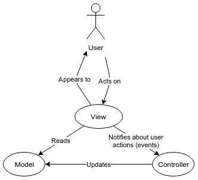

使用 Yew 创建客户端 WebAssembly 应用程序

本章中，你将看到如何使用 Rust 构建网页应用的前端，作为使用 HTML、CSS 和 JavaScript（通常使用 JavaScript 前端框架，如 React）或生成 JavaScript 代码的另一种语言（如 Elm 或 TypeScript）的替代方案。

要为网页浏览器构建 Rust 应用程序，必须将 Rust 代码转换为 WebAssembly 代码，这种代码可以被所有现代网页浏览器支持。现在，将 Rust 代码转换为 WebAssembly 代码的功能已包含在稳定的 Rust 编译器中。

开发大型项目需要网页前端框架。在本章中，将介绍 Yew 框架。这是一个支持使用 **模型-视图-控制器**（**MVC**）架构模式开发前端网页应用，并生成 WebAssembly 代码的框架。

本章将涵盖以下主题：

+   理解 MVC 架构模式及其在网页中的应用

+   使用 Yew 框架构建 WebAssembly 应用程序

+   如何使用 Yew 包创建采用 MVC 模式（`incr` 和 `adder`）设计的网页

+   创建具有公共页眉和页脚（`login` 和 `yauth`）的网页应用

+   创建具有前端和后端（在两个不同的项目中，`yclient` 和 `persons_db`）的网页应用

前端使用 Yew 开发，后端是一个 HTTP RESTful 服务，使用 Actix web 开发。

# 第六章：技术要求

本章假设你已经阅读了前面的章节，此外，还需要具备 HTML 的相关知识。

要运行本章中的项目，只需安装 WebAssembly 代码生成器（简称 Wasm）即可。最简单的方法可能是输入以下命令：

```rs
cargo install cargo-web
```

13 分钟后，你的 Cargo 工具将增加几个命令。其中一些如下：

+   `cargo web build`（或 `cargo-web build`）：它构建旨在在网页浏览器中运行的 Rust 项目。它与 `cargo build` 命令类似，但用于 Wasm。

+   `cargo web start`（或 `cargo-web start`）：它执行 `cargo web build` 命令，然后启动一个网页服务器，每次被客户端访问时，都会向客户端发送一个完整的 Wasm 前端应用。它与 `cargo run` 命令类似，但用于服务 Wasm 应用程序。

本章的完整源代码位于存储库的 `Chapter05` 文件夹中：[`github.com/PacktPublishing/`](https://github.com/PacktPublishing/Rust-2018-Projects)[Creative-Projects-for-Rust-Programmers](https://github.com/PacktPublishing/Creative-Projects-for-Rust-Programmers)。

# 介绍 Wasm

Wasm 是一种强大的新技术，可以提供交互式应用程序。在网页出现之前，已经有许多开发者正在构建客户端/服务器应用程序，其中客户端应用程序在 PC 上运行（通常是 Microsoft Windows），而服务器应用程序在公司拥有的系统上运行（通常是 NetWare、OS/2、Windows NT 或 Unix）。在这样的系统中，开发者可以选择他们喜欢的客户端应用程序的语言。有些人使用 Visual Basic，其他人使用 FoxPro 或 Delphi，还有许多其他语言被广泛使用。

然而，对于这样的系统，部署更新是一种地狱般的体验，因为存在多个可能的问题，例如确保每个客户端 PC 都有适当的运行时系统，并且所有客户端都能同时获得更新。这些问题通过在网页浏览器中运行的 JavaScript 得到了解决，因为它是前端软件可以下载和执行的一个无处不在的平台。但这也有一些缺点：开发者被迫使用 HTML + CSS + JavaScript 来开发前端软件，而且有时这样的软件性能较差。

接下来是 Wasm，这是一种类似机器语言的编程语言，就像 Java 字节码或 Microsoft .NET CIL 代码，但它是由所有主流网页浏览器接受的标准化语言。其规范的第 1.0 版于 2017 年 10 月发布，到 2019 年，世界上已有超过 80%的网页浏览器支持它。这意味着它更高效，并且可以从多种编程语言中轻松生成，包括 Rust。

因此，如果将 Wasm 设置为 Rust 编译器的目标架构，用 Rust 编写的程序就可以在任何主流的现代网页浏览器上运行。

# 理解 MVC 架构模式

本章是关于创建网页应用程序的。所以，为了使事情更具体，让我们直接看看两个名为`incr`和`adder`的玩具网页应用程序。

## 实现两个玩具网页应用程序

要运行第一个玩具应用程序，请按照以下步骤操作：

1.  进入`incr`文件夹并输入`cargo web start`。

1.  几分钟后，控制台上将出现一条消息，最后以以下行结束：

```rs
You can access the web server at `http://127.0.0.1:8000`.
```

1.  现在，在网页浏览器的地址栏中输入：`127.0.0.1:8000`或`localhost:8000`，你将立即看到以下内容：


1.  点击两个按钮，或者选择以下文本框，然后按键盘上的*+*或*0*键。

+   如果你点击一次增加按钮，右侧框的内容将从 0 变为 1。

+   如果你再点击一次，它就会变成 2，以此类推。

+   如果你点击重置按钮，值会变为 0（零）。

+   如果你通过点击选择文本框，然后按*+*键，数值会增加，就像增加按钮一样。相反，如果你按*0*键，数值将被设置为零。

1.  要停止服务器，请进入控制台并按*Ctrl* + *C*。

1.  要运行`adder`应用程序，请进入`adder`文件夹，并输入`cargo web start`。

1.  类似地，对于其他应用程序，当服务器应用程序启动后，你可以刷新你的网页浏览器页面，你将看到以下页面：


1.  在这里，你可以在第一个框中输入一个数字，在“加数 1”标签的右侧，在第二个框中输入另一个数字，然后按下“加”按钮。之后，你将在底部的文本框中看到这些数字的总和，该文本框已从黄色变为浅绿色，如下面的截图所示：


在加法操作后，“加”按钮已变为禁用状态。如果第一个两个框中的任何一个为空，则求和失败，不会发生任何操作。此外，如果你更改前两个框中任意一个的值，“加”按钮将变为启用状态，最后一个文本框变为空并变为黄色。

## 什么是 MVC 模式？

现在我们已经看到了一些非常简单的 Web 应用程序，我们可以使用这些应用程序作为例子来解释 MVC 架构模式是什么。MVC 模式是一种关于事件驱动的交互式程序的架构。

让我们看看什么是事件驱动的交互式程序。单词**交互式**是**批处理**的反义词。批处理程序是一种用户在开始时准备所有输入的程序，然后程序运行而不需要进一步输入。相反，交互式程序有以下步骤：

+   初始化。

+   等待用户采取某些行动。

+   当用户在输入设备上采取行动时，程序处理相关的输入，然后回到前面的步骤，等待进一步的输入。

例如，控制台命令解释器是交互式程序，所有的 Web 应用程序也都是交互式的。

术语*事件驱动*意味着在初始化后，应用程序不执行任何操作，直到用户在用户界面上执行某些操作。当用户在输入设备上采取行动时，应用程序处理这些输入，并且仅作为对用户输入的反应来更新屏幕。大多数 Web 应用程序都是事件驱动的。主要的例外是游戏和虚拟现实或增强现实环境，即使用户没有采取任何行动，动画也会继续。

本章中的所有示例都是事件驱动的交互式程序，因为初始化后，它们只有在用户用鼠标点击（或触摸触摸屏）或按下键盘上的任何键时才会执行某些操作。一些这样的点击和按键会在屏幕上引起变化。因此，MVC 架构可以应用于这些示例项目。

这个模式有几种方言。Yew 使用的方言源自 Elm 语言实现的方言，因此它被称为**Elm 架构**。

## 模型

在任何 MVC 程序中，都有一个名为`model`的数据结构，它包含表示用户界面所需的所有动态数据。

例如，在`incr`应用中，需要表示右侧框中包含的数字的值来表示该框，并且它可以随时改变。因此，这个数值必须在模型中。

在这里，浏览器窗口的宽度和高度通常不需要生成 HTML 代码，因此它们不应该成为模型的一部分。同样，按钮的大小和文本也不应该成为模型的一部分，但出于另一个原因：在这个应用中它们不能在运行时改变。尽管如此，如果这是一个国际化应用，所有文本也应该包含在模型中。

在`adder`应用中，模型应只包含三个文本框中的三个值。其中两个直接由用户输入，第三个是计算得出的，这并不重要。标签和文本框的背景颜色不应该成为模型的一部分。

## 视图

MVC 架构的下一部分是**视图**。它是指根据模型值如何表示（或渲染）屏幕图形内容的规定。它可以是声明性规范，如纯 HTML 代码，也可以是程序性规范，如一些 JavaScript 或 Rust 代码，或者它们的混合。

例如，在`incr`应用中，视图显示两个按钮和一个只读文本框，而在`adder`应用中，视图显示三个标签、三个文本框和一个按钮。

所有的按钮都有恒定的外观，但视图必须根据模型的变化更改数字的显示。

## 控制器

MVC 架构的最后一部分是*控制器*。它始终是一组由视图在用户使用输入设备与应用交互时调用的例程。当用户使用输入设备执行操作时，视图必须做的只是通知控制器用户已执行该操作，并指定操作（例如，哪个鼠标键被按下），以及位置（例如，屏幕的哪个位置）。

在`incr`应用中，三种可能的输入操作如下：

+   点击“增加”按钮

+   点击“重置”按钮

+   在文本框被选中时按下键盘上的键

通常，也可以使用键盘按下按钮，但这种动作可以被认为是相当于鼠标点击，因此每个按钮只通知一个输入动作类型。

在`adder`应用中，三种可能的输入操作如下：

+   改变“加数 1”文本框中的值

+   改变“加数 2”文本框中的值

+   点击“添加”按钮

有几种方式可以更改文本框的值：

+   在没有选择文本的情况下输入，插入额外的字符

+   在选择一些文本时输入，从而用字符替换所选文本

+   通过从剪贴板粘贴一些文本

+   通过从屏幕上的另一个元素拖放一些文本

+   通过使用鼠标上下旋转器

我们对此不感兴趣，因为它们由浏览器或框架处理。对于应用程序代码来说，重要的是当用户执行输入操作时，文本框会更改其值。

控制器的任务只是使用此类输入信息来更新模型。当模型完全更新后，框架通知视图需要刷新屏幕的外观，考虑到模型的新值。

在 `incr` 应用程序的情况下，当控制器被通知到按下 Increment 按钮，它会增加模型中的数字；当它被通知到按下 Reset 按钮，它会将模型中的该数字设置为零；当它被通知到在文本框上按下键时，它会检查按下的键是 *+*、*0* 还是其他，并将适当的更改应用于模型。在这些更改之后，视图被通知更新显示这样的数字。

在 `adder` 应用程序的情况下，当控制器被通知到 Addend 1 文本框的更改时，它会将编辑框中包含的新值更新到模型中。对于 Addend 2 文本框也有类似的行为；当控制器被通知到按下 Add 按钮，它会将模型中包含的两个加数相加并将结果存储在模型的第三个字段中。在这些更改之后，视图被通知更新显示这样的结果。

## 查看实现

关于网页，页面的表示通常由 HTML 代码组成，因此，使用 Yew 框架，视图函数必须生成 HTML 代码。这样的生成包含 HTML 代码的固定部分，但它们也访问模型以获取在运行时可能更改的信息。

在 `incr` 应用程序中，视图组合了定义两个按钮和一个只读数字 *输入* 元素的 HTML 代码，并将从模型中获取的值放入这样的 *输入* 元素中。视图包括通过将它们转发到控制器来处理两个按钮上的 HTML *点击* 事件。

在 `adder` 应用程序中，视图组合了定义三个标签、三个数字输入元素和一个按钮的 HTML 代码，并将从模型中获取的值放入最后一个 *输入* 元素中。视图包括处理前两个文本框的 HTML *输入* 事件和按钮上的 *点击* 事件，通过将它们转发到控制器。关于前两个文本框事件，框中的值被转发到控制器。

## 控制器实现

在使用 Yew 时，控制器通过一个 *更新* 程序实现，该程序处理来自视图的用户操作消息，并使用此类输入来更改模型。在控制器完成对模型的所有必要更改后，必须通知视图以将模型的更改应用于用户界面。

在某些框架中，例如在 Yew 中，这样的视图调用是自动的；该机制有以下步骤：

+   对于视图处理的任何用户操作，框架调用`update`函数，即控制器。在这个调用中，框架将用户操作的详细信息传递给控制器；例如，在文本框中输入了哪个值。

+   通常，控制器会改变模型的状态。

+   如果控制器成功将一些更改应用到模型上，框架将调用视图函数，这是 MVC 架构的*视图*。

## 理解 MVC 架构

MVC 架构的控制流程在以下图中展示：



每个用户操作的迭代是这个操作序列：

1.  用户看到屏幕上图形元素的静态表示。

1.  用户使用输入设备对图形元素进行操作。

1.  视图接收到用户操作并通知控制器。

1.  控制器更新模型。

1.  视图读取模型的新状态以更新屏幕的内容。

1.  用户看到屏幕的新状态。

MVC 架构的主要概念如下：

+   所有需要正确构建显示的必要可变数据必须在一个名为**模型**的单个数据结构中。模型可能关联一些代码，但这些代码不直接接收用户输入，也不向用户输出。它可能访问文件、数据库或其他进程。由于模型不直接与用户界面交互，实现模型的代码在应用程序用户界面从文本模式移植到 GUI/web/mobile 时不应更改。

+   在屏幕上绘制并捕获用户输入的逻辑被称为*视图*。当然，视图必须了解屏幕渲染、输入设备和事件，以及模型。尽管视图只是*读取*模型，但它永远不会直接更改它。当发生有趣的事件时，视图会通知控制器该事件。

+   当控制器被视图通知有有趣的事件时，它会相应地更改模型，并在完成更改后，框架通知视图使用模型的新状态刷新自己。

# 项目概述

本章将介绍四个项目，这些项目的复杂度将逐渐增加。您已经看到了前两个项目的实际操作：`incr`和`adder`。第三个项目，命名为`login`，展示了如何在网站上创建登录页面进行身份验证。

第四个项目，命名为`yauth`，扩展了`login`项目，增加了对人员列表的 CRUD 处理。其行为几乎与第四章中“创建一个完整的后端 Web 应用”的`auth`项目相同。每个项目从零开始下载和编译大约需要 1 到 3 分钟。

## 入门

要启动所有设备，只需要一个非常简单的语句——`main` 函数的主体：

```rs
 yew::start_app::<Model>();
```

它基于指定的 `Model` 创建一个网络应用程序，启动它，并等待默认的 TCP 端口。当然，TCP 端口可以更改。这是一个将应用程序提供给任何导航到它的浏览器的服务器。

# `incr` 应用程序

在这里，我们将看到 `incr` 项目的实现，我们之前已经看到了如何构建和使用它。唯一的依赖项是 Yew 框架，因此，TOML 文件包含以下行：

```rs
yew = "0.6"
```

所有源代码都在 `main.rs` 文件中。模型通过以下简单声明实现：

```rs
struct Model {
    value: u64,
}

```

它只需要是一个将被框架实例化的结构体，被视图读取，并被控制器读取和写入。它的名称及其字段名称是任意的。

然后必须将视图到控制器的可能通知声明为 `enum` 类型。以下是 `incr` 的示例：

```rs
enum Msg {
    Increment,
    Reset,
    KeyDown(String),
}
```

此外，这里的名称也是任意的：

+   `Msg` 是 *message* 的缩写，因为此类通知在某种程度上是视图到控制器的消息。

+   `Increment` 消息通知点击了增量按钮。《Reset` 消息通知点击了重置按钮。

+   `KeyDown` 消息通知键盘上任何键的按下；其参数传达了哪个键被按下。

要实现控制器，必须为我们的模型实现 `yew::Component` 特性。我们项目的代码如下：

```rs
impl Component for Model {
    type Message = Msg;
    type Properties = ();
    fn create(_: Self::Properties, _: ComponentLink<Self>) -> Self {
        Self { value: 0 }
    }
    fn update(&mut self, msg: Self::Message) -> ShouldRender { ... }
}
```

所需的实现如下：

+   `Message`：是之前定义的 `enum`，描述了从视图到控制器的所有可能的通知。

+   `Properties`：在这个项目中没有使用。当未使用时，它必须是一个空元组。

+   `create`：框架调用它以让控制器初始化模型。它可以使用两个参数，但在这里我们对此不感兴趣，并且它必须返回一个具有初始值的模型实例。因为我们想在开始时显示数字零，我们将 `value` 设置为 `0`。

+   `update`：框架在用户以某种方式在页面上进行操作时调用它，该操作由视图处理。两个参数是可变的模型本身（`self`）和来自视图的通知（`msg`）。此方法应返回 `ShouldRender` 类型的值，但 `bool` 值将很好。返回 `true` 表示模型已更改，因此需要刷新视图。返回 `false` 表示模型未更改，因此刷新视图将是浪费时间。

`update` 方法包含对消息类型的 `match`。前两种消息类型相当简单：

```rs
match msg {
    Msg::Increment => {
        self.value += 1;
        true
    }
    Msg::Reset => {
        self.value = 0;
        true
    }
```

如果收到 `Increment` 消息，则值会增加。如果收到 `Reset` 消息，则值归零。在这两种情况下，视图都必须刷新。

处理按键有点复杂：

```rs
Msg::KeyDown(s) => match s.as_ref() {
    "+" => {
        self.value += 1;
        true
    }
    "0" => {
        self.value = 0;
        true
    }
    _ => false,
}
```

`KeyDown`匹配分支将按下的键分配给`s`变量。由于我们只对两个可能的键感兴趣，因此`s`变量上有嵌套的`match`语句。对于双键（`+`和`0`），更新模型并返回`true`以刷新视图。对于按下的任何其他键，不执行任何操作。

为了实现 MVC 的视图部分，必须为我们的模型实现`yew::Renderable`特质。唯一需要的方法是`view`，它获取对模型的不可变引用，并返回一个表示某些 HTML 代码的对象，但该对象能够读取模型并通知控制器：

```rs
impl Renderable<Model> for Model {
    fn view(&self) -> Html<Self> {
        html! { ... }
    }
}
```

此方法的主体使用强大的`yew::html`宏构建。以下是此类宏调用的主体：

```rs
<div>
    <button onclick=|_| Msg::Increment,>{"Increment"}</button>
    <button onclick=|_| Msg::Reset,>{"Reset"}</button>
    <input
        readonly="true",
        value={self.value},
        onkeydown=|e| Msg::KeyDown(e.key()),
    />
</div>
```

它看起来非常类似于实际的 HTML 代码。它等同于以下 HTML 伪代码：

```rs
<div>
    <button onclick="notify(Increment)">Increment</button>
    <button onclick="notify(Reset)">Reset</button>
    <input
        readonly="true"
        value="[value]"
        onkeydown="notify(KeyDown, [key])"),
    />
</div>
```

注意，在任何 HTML 事件中，在 HTML 伪代码中，都会调用一个 JavaScript 函数（此处命名为`notify`）。相反，在 Rust 中，有一个返回给控制器消息的闭包。此类消息必须具有适当类型的参数。虽然`onclick`事件没有参数，但`onkeydown`事件有一个参数，在`e`变量中捕获，并通过调用该参数上的`key`方法，将按下的键传递给控制器。

还请注意在 HTML 伪代码中的`[value]`符号，在运行时将被实际值替换。

最后，请注意，宏的主体有三个与 HTML 代码不同的特性：

+   HTML 元素的所有参数都必须以逗号结尾。

+   任何 Rust 表达式都可以在 HTML 代码内部评估，只要它被括号包围。

+   在此 HTML 代码中不允许使用字面字符串，因此必须将其作为 Rust 字面量（通过在括号中包含它们）插入。

# 加法器应用

在这里，我们将看到`adder`项目的实现，我们已经看到了如何构建和使用它。我们将检查与`incr`项目不同的部分。

首先，存在一个与`html`宏展开递归级别的问题。它非常深，必须在程序开始时使用以下指令增加：

```rs
#![recursion_limit = "128"]
#[macro_use]
extern crate yew;
```

没有它们，将生成编译错误。对于更复杂的视图，需要更大的限制。模型包含以下字段：

```rs
addend1: String,
addend2: String,
sum: Option<f64>,
```

它们分别代表以下内容：

+   插入到第一个框中的文本（`addend1`）。

+   插入到第二个框中的文本（`addend2`）。

+   如果计算成功并在第三个框中显示计算出的数字，否则不显示。

处理的事件（即消息）如下：

```rs
 ChangedAddend1(String),
 ChangedAddend2(String),
 ComputeSum,
```

它们分别代表以下内容：

+   对第一个框内容的任何更改，包含在框中的新值（`ChangedAddend1`）。

+   对第二个框内容的任何更改，及其值（`ChangedAddend2`）。

+   点击“添加”按钮。

`create` 函数初始化模型的三个字段：两个加数设置为空字符串，`sum` 字段设置为 `None`。使用这些初始值，在总和文本框中不显示任何数字。

`update` 函数处理三种可能的消息。对于 `ComputeSum` 消息，它执行以下操作：

```rs
self.sum = match (self.addend1.parse::<f64>(), self.addend2.parse::<f64>()) {
    (Ok(a1), Ok(a2)) => Some(a1 + a2),
    _ => None,
};
```

模型的 `addend1` 和 `addend2` 字段被解析以将它们转换为数字。如果两个转换都成功，第一个臂匹配，因此将 `a1` 和 `a2` 的值相加，并将它们的和分配给 `sum` 字段。如果某些转换失败，将 `None` 分配给 `sum` 字段。

关于第一个加数的臂如下所示：

```rs
Msg::ChangedAddend1(value) => {
    self.addend1 = value;
    self.sum = None;
}
```

当前文本框的值被分配给模型的 `addend1` 字段，并将 `sum` 字段设置为 `None`。对于其他加数的更改，执行类似的行为。

让我们看看 `view` 方法中最有趣的部分：

```rs
 let numeric = "text-align: right;";
```

它将一段 CSS 代码片段分配给 Rust 变量。然后，使用以下代码创建第一个 `addend` 的文本框：

```rs
<input type="number", style=numeric,
    oninput=|e| Msg::ChangedAddend1(e.value),/>
```

注意，将 `numeric` 变量的值分配给 `style` 属性。这些属性的值只是 Rust 表达式。

以下代码创建了 `sum` 文本框：

```rs
<input type="number",

    style=numeric.to_string()
        + "background-color: "
        + if self.sum.is_some() { "lightgreen;" } else { "yellow;" },
         readonly="true", value={
        match self.sum { Some(n) => n.to_string(), None => "".to_string() }
    },
/>
```

`style` 属性是通过连接之前看到的 `numeric` 字符串和背景颜色组成的。如果 `sum` 有数值，则颜色为浅绿色，如果它是 `None`，则颜色为黄色。此外，使用表达式分配 `value` 属性，如果 `sum` 是 `None`，则分配一个空字符串。

# 登录应用

到目前为止，我们已经看到，一个应用仅包含一个模型结构体、一个消息 `enum`、一个 `create` 函数、一个 `update` 方法和一个 `view` 方法。这对于非常简单的应用来说很好，但随着应用变得更加复杂，这种简单的架构变得难以管理。需要将应用的不同部分分离到不同的组件中，其中每个组件都按照 MVC 模式设计，因此它有自己的模型、控制器和视图。

通常，但不一定，有一个通用组件包含应用中所有部分都相同的部分：

+   一个包含标志、菜单和当前用户名的页眉

+   包含版权信息和联系信息的页脚

然后在页面中间，是内嵌部分（也称为 *body*，尽管它不是 `body` HTML 元素）。这个内嵌部分包含应用的真实信息，是许多可能的组件或表单（或页面）之一：

1.  通过在其文件夹中键入 `cargo web start` 来运行 `login` 应用。

1.  当导航到 `localhost:8000` 时，显示以下页面：


有两条水平线。第一行之上的部分是作为整个应用程序的头部，必须保持不变。第二行之下的部分是作为整个应用程序的尾部，也必须保持不变。中间部分是“登录”组件，仅在用户需要认证时出现。这部分将在用户认证后由其他组件替换。

首先，让我们看看一些认证失败的情况：

+   如果您直接点击“登录”，会出现一个消息框，显示：“用户未找到”。如果您在用户名框中输入一些随机字符，也会发生相同的情况。仅允许的用户名是`susan`和`joe`。

+   如果您插入两个允许的用户名之一，然后点击登录，您将收到“指定用户无效密码”的消息。

+   如果您在密码框中输入一些随机字符，也会发生相同的情况。仅允许的用户密码是用户`susan`的`xsusan`，以及用户`joe`的`xjoe`。如果您输入`susan`然后`xsusan`，在点击登录之前，您将看到以下内容：


接下来，您将看到以下内容：


以下三件事情发生了变化：

+   在标签“当前用户”的右侧，蓝色文本---已被替换为`susan`。

+   在那个蓝色文本的右侧，出现了“更改用户”按钮。

+   在两条水平线之间，所有的 HTML 元素都被大号文本“待实现页面”所替换。当然，这种情况将代表用户已成功认证并正在使用应用程序的其余部分。

如果您点击“更改用户”按钮，您将看到以下页面：


它与第一个页面相似，但`susan`的名字既出现在“当前用户”处，也出现在“用户名”处。

## 项目组织结构

本项目的源代码已被拆分为三个文件（您可以在本书的 GitHub 仓库`Chapter05/login/src/db_access.rs`中找到）：

+   `db_access.rs`：包含一个用于处理认证的用户目录的存根

+   `main.rs`：包含一行`main`函数，以及一个处理页面头部和尾部的 MVC 组件，并将内部部分委托给认证组件

+   `login.rs`：包含用于处理认证的 MVC 组件，用作主组件的内部部分

### `db_access.rs`文件

`db_access`模块是前一章模块的一个子集。它声明了一个`DbConnection`结构体，用于模拟与数据库的连接。实际上，为了简单起见，它只包含`Vec<User>`，其中`User`是应用程序的账户：

```rs
#[derive(PartialEq, Clone)]
pub struct DbConnection {
    users: Vec<User>,
}
```

`User`类型的定义如下：

```rs
pub enum DbPrivilege {
    CanRead,
    CanWrite,
}

pub struct User {
    pub username: String,
    pub password: String,
    pub privileges: Vec<DbPrivilege>,
}
```

应用程序的任何用户都有一个名字、一个密码和一些权限。在这个简单的系统中，只有两种可能的权限：

+   `CanRead`，表示用户可以读取数据库中的所有内容

+   `CanWrite`，意味着用户可以更改数据库的所有内容（即插入、更新和删除记录）

连接了两个用户：

+   `joe` 用户，密码为 `xjoe`，只能从数据库中读取

+   `susan` 用户，密码为 `xsusan`，可以读取和写入数据

只有两个函数：

+   `new`，用于创建 `DbConnection`：

```rs
pub fn new() -> DbConnection {
    DbConnection {
        users: vec![
            User {
                username: "joe".to_string(),
                password: "xjoe".to_string(),
                privileges: vec![DbPrivilege::CanRead],
            },
            User {
                username: "susan".to_string(),
                password: "xsusan".to_string(),
                privileges: vec![DbPrivilege::CanRead, 
                 DbPrivilege::CanWrite],
            },
        ],
    }
}
```

+   `get_user_by_username`，用于获取具有指定名称的用户引用，如果没有用户具有该名称，则为 `None`：

```rs
pub fn get_user_by_username(&self, username: &str) -> Option<&User> {
    if let Some(u) = self.users.iter().find(|u| 
     u.username == username) {
        Some(u)
    } else {
        None
    }
}
```

当然，首先，我们将使用 `new` 函数创建一个 `DbConnection` 对象，然后我们将使用 `get_user_by_username` 方法从该对象中获取一个 `User`。

### `main.rs` 文件

`main.rs` 文件以以下声明开始：

```rs
mod login;

enum Page {
    Login,
    PersonsList,
}
```

第一个声明导入了 `login` 模块，该模块将被 `main` 模块引用。任何内部部分模块都必须在这里导入。

第二个声明声明了所有将用作内部部分的组件。在这里，我们只有认证组件（`Login`）和一个尚未实现的组件（`PersonsList`）。

然后，是主页 MVC 组件的模型：

```rs
struct MainModel {
    page: Page,
    current_user: Option<String>,
    can_write: bool,
    db_connection: std::rc::Rc<std::cell::RefCell<DbConnection>>,
}
```

按照惯例，任何模型的名称都以 `Model` 结尾：

+   模型的第一个字段是最重要的一个。它表示当前活动的是哪个内部部分（或页面）。

+   其他字段包含全局信息，即用于显示页眉、页脚或必须与内部组件共享的信息。

+   `current_user` 字段包含已登录用户的名称，如果没有用户登录，则为 `None`。

+   `can_write` 标志是对用户权限的简单描述；在这里，两个用户都可以读取，但只有一个也可以写入，因此当它们登录时，此标志为 `true`。

+   `db_connection` 字段是对数据库占位符的引用。它必须与内部组件共享，因此它被实现为一个引用计数的智能指针到 `RefCell`，其中包含实际的 `DbConnection`。使用这种包装，任何对象都可以与其他组件共享，只要一次只有一个线程访问它们。

视图向控制器发送的可能通知如下：

```rs
enum MainMsg {
    LoggedIn(User),
    ChangeUserPressed,
}
```

记住，页脚没有可以获取输入的元素，而对于页眉，只有当它可见时，Change User 按钮可以获取输入。按下此类按钮时，将发送 `ChangeUserPressed` 消息。

因此，看起来没有发送 `LoggedIn` 消息的方法！实际上，`Login` 组件可以向主组件发送它。

控制器的更新函数具有以下主体：

```rs
match msg {
    MainMsg::LoggedIn(user) => {
        self.page = Page::PersonsList;
        self.current_user = Some(user.username);
        self.can_write = user.privileges.contains(&DbPrivilege::CanWrite);
    }
    MainMsg::ChangeUserPressed => self.page = Page::Login,
```

当 `Login` 组件通知主组件成功认证，从而指定了认证用户时，主控制器将 `PersonsList` 设置为要访问的页面，保存新认证用户的名称，并从该用户中提取权限。

当点击“更改用户”按钮时，*要访问的页面* 变为“登录”页面。`view` 方法只包含对 `html` 宏的调用。此类宏必须包含一个 HTML 元素，在这种情况下，它是一个 `div` 元素。

该 `div` 元素包含三个 HTML 元素：一个 `style` 元素、一个 `header` 元素和一个 `footer` 元素。但在标题和页脚之间，有一些 Rust 代码用于创建主页的内部部分。

要在 `html` 宏内插入 Rust 代码，有两种可能性：

+   HTML 元素的属性只是 Rust 代码。

+   在任何时刻，一对大括号包围着 Rust 代码。

在第一种情况下，此类 Rust 代码的评估必须返回一个可以通过 `Display` 特性转换为字符串的值。

在第二种情况下，大括号内 Rust 代码的评估必须返回一个 HTML 元素。那么如何从 Rust 代码中返回一个 HTML 元素呢？使用 `html` 宏！

因此，实现 `view` 方法的 Rust 代码包含一个 `html` 宏调用，该宏调用包含一个 Rust 代码块，该代码块又包含一个 `html` 宏调用，以此类推。这种递归是在编译时执行的，并且可以通过 `recursion_limit` Rust 属性来覆盖其限制。

注意，标题和内部部分都包含一个 `match self.page` 表达式。

在标题中，它只用于在当前页面不是登录页面时显示“更改用户”按钮，否则将毫无意义。

在内部部分，此类声明的主体如下：

```rs
Page::Login => html! {
    <LoginModel:
        current_username=&self.current_user,
        when_logged_in=|u| MainMsg::LoggedIn(u),
        db_connection=Some(self.db_connection.clone()),
    />
},
Page::PersonsList => html! {
    <h2>{ "Page to be implemented" }</h2>
},
```

如果当前页面是“登录”，对 `html` 宏的调用包含 `LoginModel:` HTML 元素。实际上，HTML 语言没有这样的元素类型。这是在当前组件中嵌入另一个 Yew 组件的方式。`LoginModel` 组件在 `login.rs` 源文件中声明。其构造需要一些参数：

+   `current_username` 是当前用户的名称。

+   `when_logged_in` 是组件在成功完成身份验证时应调用的回调。

+   `db_connection` 是数据库的（引用计数）副本。

关于回调，请注意它接收一个用户（`u`）作为参数，并返回由该用户装饰的消息 `LoggedIn`。将此消息发送到主组件的控制器是 `Login` 组件与刚刚登录的用户的主组件通信的方式。

### `login.rs` 文件

`login` 模块首先定义 `Login` 组件的模型：

```rs
pub struct LoginModel {
    dialog: DialogService,
    username: String,
    password: String,
    when_logged_in: Option<Callback<User>>,
    db_connection: std::rc::Rc<std::cell::RefCell<DbConnection>>,
}
```

此模型必须由主组件使用，因此它必须是公共的。

其字段如下：

+   `dialog` 是对 Yew 服务的引用，这是请求框架执行比实现 MVC 架构更多操作的一种方式。对话框服务是向用户显示消息框的能力，通过浏览器的 JavaScript 引擎实现。

+   `username` 和 `password` 是用户在两个文本框中输入的文本值。

+   `when_logged_in`是一个可能的回调函数，用于在成功认证完成后调用。

+   `db_connection`是数据库的引用。

可能的通知消息如下：

```rs
pub enum LoginMsg {
    UsernameChanged(String),
    PasswordChanged(String),
    LoginPressed,
}
```

前两个消息表示相应的字段已更改值，第三个消息表示按钮已被按下。

到目前为止，我们已经看到这个组件有一个模型和一些消息，就像我们之前看到的组件一样；但现在我们将看到它还有一些我们从未见过的东西：

```rs
pub struct LoginProps {
    pub current_username: Option<String>,
    pub when_logged_in: Option<Callback<User>>,
    pub db_connection: 
     Option<std::rc::Rc<std::cell::RefCell<DbConnection>>>,
}
```

这个结构表示每个父组件创建此组件必须传递的参数。在这个项目中，`Login`组件只有一个父组件，即主组件，该组件创建了一个具有`LoginProps`字段作为属性的`LoginModel`元素。请注意，所有字段都是`Option`的特殊化：即使你不将`Option`作为属性传递，Yew 框架也要求这样做。

这个`LoginProps`类型必须在四个地方使用：

+   首先，它必须实现`Default`特质，以确保当框架需要此类型的对象时，其字段被正确初始化：

```rs
impl Default for LoginProps {
    fn default() -> Self {
        LoginProps {
            current_username: None,
            when_logged_in: None,
            db_connection: None,
        }
    }
}
```

+   第二，我们已经看到，为模型实现`Component`特质的实现必须定义一个`Properties`类型。在这种情况下，它必须是这样的：

```rs
impl Component for LoginModel {
    type Message = LoginMsg;
    type Properties = LoginProps;
```

即，这个类型被传递到`LoginModel`类型的`Component`特质的实现中。

+   第三，`create`函数必须使用其第一个参数，该参数包含由父组件传递的值。以下是该函数：

```rs
fn create(props: Self::Properties, _link: ComponentLink<Self>)
-> Self {
    LoginModel {
        dialog: DialogService::new(),
        username: props.current_username.unwrap_or(String::new()),
        password: String::new(),
        when_logged_in: props.when_logged_in,
        db_connection: props.db_connection.unwrap(),
    }
}
```

模型的所有字段都已初始化，但`dialog`和`password`字段接收默认值，而其他字段接收来自父组件接收的`props`对象中的值，即`MainModel`。因为我们确信`props`中的`db_connection`字段将是`None`，所以我们对其调用`unwrap`。相反，`current_username`字段可能是`None`，因此在这种情况下，使用空字符串。

然后是`update`函数，它是`Login`组件的控制器。

当用户按下登录按钮时，执行以下代码：

```rs
if let Some(user) = self.db_connection.borrow()
    .get_user_by_username(&self.username)
{
    if user.password == self.password {
        if let Some(ref go_to_page) = self.when_logged_in {
            go_to_page.emit(user.clone());
        }
    } else {
        self.dialog.alert("Invalid password for the specified user.");
    }
} else {
    self.dialog.alert("User not found.");
}
```

使用`borrow`方法从`RefCell`中提取数据库连接，然后寻找当前名称的用户。如果找到用户，并且如果他们存储的密码与用户输入的密码相同，则从`when_logged_in`字段中提取回调，然后调用其`emit`方法，传递用户名的副本作为参数。因此，由父组件传递的例程，即`|u| MainMsg::LoggedIn(u)`闭包，被执行。

在用户缺失或密码不匹配的情况下，使用对话框服务的`alert`方法显示一个消息框。我们之前看到的控制器只有两个功能：`create`和`update`。但这个还有一个功能；它是`change`方法：

```rs
fn change(&mut self, props: Self::Properties) -> ShouldRender {
    self.username = props.current_username.unwrap_or(String::new());
    self.when_logged_in = props.when_logged_in;
    self.db_connection = props.db_connection.unwrap();
    true
}
```

此方法允许父组件使用 `Properties` 结构重新发送更新后的参数到该组件。`create` 方法只调用一次，而 `change` 方法在父组件需要更新传递给子组件的参数时会被调用。

通过阅读其代码，视图很容易理解，并且不需要解释。

# yauth 应用

在上一节中展示的 `login` 应用程序展示了如何创建一个包含多个可能的子组件之一的父组件。然而，它只实现了一个子组件，即 `Login` 组件。因此，在本节中，将展示一个更完整的示例，包含三个不同的可能的子组件，对应于经典 Web 应用程序的三个不同的页面。

它被命名为 `yauth`，是 **Yew Auth** 的缩写，因为它的行为几乎与上一章中展示的 `auth` 项目相同，尽管如此，它完全基于 Yew 框架，而不是基于 Actix web 和 Tera。

## 理解应用的行为

本应用与上一节中的应用构建和启动方式相同，其第一页与 `login` 应用的第一页相同。尽管如此，如果你输入 `susan` 作为用户名，`xsusan` 作为密码，然后点击登录按钮，你会看到以下页面：


本页以及你将在本应用中看到的另一页，以及它们的行为，几乎与上一章中描述的 `auth` 应用程序的行为相同。唯一的区别如下：

+   任何错误信息都不会以红色文本的形式嵌入在页面中，而是以弹出消息框的形式显示。

+   头部和底部由主组件实现，它们的外观和行为如本章前述部分所述。

因此，我们只需要检查此应用的实现。

## 项目组织

本项目的源代码已被拆分为五个文件：

+   `db_access.rs`：它包含了一个连接到数据库的占位符，提供对用户目录的访问以处理身份验证以及人员列表；它实际上包含如向量这样的数据。它与上一章 `auth` 项目的同名文件几乎相同。唯一的区别是 `Serialize` 特性没有被实现，因为 Yew 框架不需要它。

+   `main.rs`：它包含了一行的 `main` 函数，以及处理页面头部和尾部的 MVC 组件，并将内嵌部分委托给应用的其他三个组件之一。

+   `login.rs`：它包含处理身份验证的 MVC 组件。它应作为主组件的内嵌部分使用。它与 `login` 项目的同名模块相同。

+   `persons_list.rs`：它包含处理人员列表的 MVC 组件。它应作为主组件的内嵌部分使用。

+   `one_person.rs`：它包含用于查看、编辑或插入单个人员的 MVC 组件；它将用作主组件的内嵌部分。

我们将只讨论`yauth`应用独有的文件，如下所述。

### `persons_list.rs`文件

此文件包含组件的定义，以便用户管理人员列表，因此它定义以下结构作为模型：

```rs
pub struct PersonsListModel {
    dialog: DialogService,
    id_to_find: Option<u32>,
    name_portion: String,
    filtered_persons: Vec<Person>,
    selected_ids: std::collections::HashSet<u32>,
    can_write: bool,
    go_to_one_person_page: Option<Callback<Option<Person>>>,
    db_connection: std::rc::Rc<std::cell::RefCell<DbConnection>>,
}
```

让我们看看上一段代码中的每一行都说了什么：

+   `dialog`字段包含打开消息框的服务。

+   `id_to_find`字段包含用户在 Id 文本框中输入的值，如果框中包含数字，否则为`None`。

+   `name_portion`字段包含 Name 部分: 文本框中的值。特别是，如果该框为空，则模型中的该字段包含一个空字符串。`filtered_persons`字段包含使用指定过滤器从数据库中提取的人员列表。最初，过滤器指定提取所有名称包含空字符串的人员。当然，所有人员都满足该过滤器，因此数据库中的所有人员都被添加到该向量中，尽管数据库为空，因此该向量也为空。

+   `selected_ids`字段包含所有列出的、复选框被设置的人员的 ID，因此它们被选中以进行进一步操作。

+   `can_write`字段指定当前用户是否有修改数据的权限。

+   `go_to_one_person_page`字段包含要传递给查看/编辑/插入单个人员的页面的回调。此类回调函数接收一个参数，即要查看/编辑的人员，或`None`以打开插入新人员的页面。

+   `db_connection`字段包含对数据库连接的共享引用。

从视图到控制器的可能通知由该结构定义：

```rs
pub enum PersonsListMsg {
    IdChanged(String),
    FindPressed,
    PartialNameChanged(String),
    FilterPressed,
    DeletePressed,
    AddPressed,
    SelectionToggled(u32),
    EditPressed(u32),
}
```

让我们看看我们在上一段代码中做了什么：

+   当 Id: 文本框中的文本发生变化时，必须发送`IdChanged`消息。其参数是字段的新文本值。

+   当点击查找按钮时，必须发送`FindPressed`消息。

+   当 Name 部分: 文本框中的文本发生变化时，必须发送`PartialNameChanged`消息。其参数是字段的新文本值。

+   当点击过滤器按钮时，必须发送`FilterPressed`消息。

+   当点击删除选中人员按钮时，必须发送`DeletePressed`消息。

+   当点击添加新人员按钮时，必须发送`AddPressed`消息。

+   当列表中的人员复选框被切换（即选中或取消选中）时，必须发送`SelectionToggled`消息。其参数是列表中该行指定的人员的 ID。

+   当点击列表中任何编辑按钮时，必须发送`EditPressed`消息。其参数是列表中该行指定的人员的 ID。

然后，定义组件初始化参数的结构：

```rs
pub struct PersonsListProps {
    pub can_write: bool,
    pub go_to_one_person_page: Option<Callback<Option<Person>>>,
    pub db_connection: 
     Option<std::rc::Rc<std::cell::RefCell<DbConnection>>>,
}
```

让我们看看这是如何工作的：

+   使用 `can_write` 字段，主要组件指定了当前用户的权限的简单定义。更复杂的应用程序可能有更复杂的权限定义。

+   使用 `go_to_one_person_page` 字段，主要组件传递一个函数的引用，必须调用该函数才能转到显示、编辑或插入单个人员的页面。

+   使用 `db_connection` 字段，主要组件传递对数据库连接的共享引用。

通过实现 `Default` 特性初始化 `PersonsListProps` 结构体，以及通过实现 `Component` 特性初始化 `PersonsListModel` 结构体是微不足道的，除了 `filtered_persons` 字段。它不是将其保留为空向量，而是首先将其设置为空向量，然后通过以下语句进行修改：

```rs
model.filtered_persons = model.db_connection.borrow()
    .get_persons_by_partial_name("");
```

#### 为什么空集合对 filtered_persons 来说不是很好

每次从登录页面和 `OnePerson` 页面打开 `PersonsList` 页面时，模型都通过 `create` 函数初始化，并且使用该模型初始化页面的所有用户界面元素。

因此，如果您在 `PersonsList` 页面上输入某些内容，然后转到另一个页面，然后再返回到 `PersonsList` 页面，除非您在 `create` 函数中设置它，否则您输入的所有内容都会被清除。

可能，Id 文本框、名称部分文本框或所选人员被清除的事实并不非常令人烦恼，但人员列表被清除的事实意味着您将获得以下行为：

+   您过滤人员以查看一些列出的人员。

+   您点击一个人员的行中的编辑按钮，以更改该人员的名称，然后转到 `OnePerson` 页面。

+   您更改名称并按下更新按钮，然后返回到 `PersonsList` 页面。

+   您会看到“无人员”文本，而不是人员列表。

您在 `OnePerson` 页面上再也看不到您刚刚修改的人员了。这很不方便。

为了看到该人员被列出，您需要将 `filtered_persons` 设置为包含该人员的值。所选择的解决方案是显示数据库中存在的所有人员，这是通过调用 `get_persons_by_partial_name("")` 函数来执行的。

现在，让我们看看 `update` 方法如何处理视图的消息。

当接收到 `IdChanged` 消息时，执行以下语句：

```rs
self.id_to_find = id_str.parse::<u32>().ok(),
```

它试图在模型中存储文本框的值，如果没有可转换的数字，则为 `None`。

当接收到 `FindPressed` 消息时，执行以下语句：

```rs
match self.id_to_find {
    Some(id) => { self.update(PersonsListMsg::EditPressed(id)); }
    None => { self.dialog.alert("No id specified."); }
},
```

如果 Id 文本框包含一个有效的数字，则会递归地发送另一个消息：它是 `EditPressed` 消息。按下查找按钮必须与按下 Id 文本框中包含相同 ID 的行中的编辑按钮具有相同的行为，因此消息被转发到同一个函数。如果没有在文本字段中输入 ID，则显示一个消息框。

当接收到`PartialNameChanged`消息时，新部分名称仅保存在模型的`name_portion`字段中。当接收到`FilterPressed`消息时，执行以下语句：

```rs
self.filtered_persons = self
    .db_connection
    .borrow()
    .get_persons_by_partial_name(&self.name_portion);
```

数据库连接封装在一个`RefCell`对象中，该对象进一步封装在一个`Rc`对象中。在`Rc`内部的访问是隐式的，但要访问`RefCell`内部的，则需要调用`borrow`方法。然后查询数据库以获取包含当前名称部分的所有人的列表。这个列表最终被分配给模型的`filtered_persons`字段。

当接收到`DeletePressed`消息时，执行以下语句：

```rs
if self
    .dialog
    .confirm("Do you confirm to delete the selected persons?") {
    {
        let mut db = self.db_connection.borrow_mut();
        for id in &self.selected_ids {
            db.delete_by_id(*id);
        }
    }
    self.update(PersonsListMsg::FilterPressed);
    self.dialog.alert("Deleted.");
}
```

显示以下弹出框以进行确认：


如果用户点击 OK 按钮（或按*Enter*键），则按以下方式执行删除操作：从共享数据库连接中借用一个可变引用，并且对于通过复选框选择的任何 ID，从数据库中删除相应的人员。

范围关闭释放了借用。然后，对`update`的递归调用触发`FilterPressed`消息，其目的是刷新显示的人员列表。最后，以下消息框传达了操作完成的信号：


当接收到`AddPressed`消息时，执行以下代码：

```rs
if let Some(ref go_to_page) = self.go_to_one_person_page {
    go_to_page.emit(None);
}
```

在这里，获取`go_to_one_person_page`回调的引用，然后使用`emit`方法调用它。这种调用的效果是转到`OnePerson`页面。`emit`的参数指定页面上要编辑的人员。如果它是`None`，如本例中所示，页面将以插入模式打开。

当接收到`SelectionToggled`消息时，它指定了一个人员的 ID，但没有指定该人员是要选中还是取消选中。因此，执行以下代码：

```rs
if self.selected_ids.contains(&id) {
    self.selected_ids.remove(&id);
} else {
    self.selected_ids.insert(id);
}
```

我们想要反转用户点击的人员的状态，即如果未选中，则选中它，如果已选中，则取消选中它。模型的`selected_ids`字段包含所有选中人员的集合。因此，如果点击的 ID 包含在选中 ID 的集合中，则通过调用`remove`方法从该集合中删除；否则，通过调用`insert`方法将其添加到列表中。

最后，当接收到`EditPressed`消息（指定要查看/更改的人员的`id`）时，执行以下代码：

```rs
match self.db_connection.borrow().get_person_by_id(id) {
    Some(person) => {
        if let Some(ref go_to_page) = self.go_to_one_person_page {
            go_to_page.emit(Some(person.clone()));
        }
    }
    None => self.dialog.alert("No person found with the indicated id."),
}
```

数据库中搜索具有指定 ID 的人员。如果找到这样的人，则调用`go_to_one_person_page`回调，传递找到的人员的克隆。如果没有找到，则显示一个消息框解释错误。`change`方法在来自父组件的任何属性发生变化时保持模型字段更新。

然后是视图。当消息被展示时，描述了视图发送的消息。视图的其他有趣方面如下。

“删除所选人员”按钮和“添加新人员”按钮具有属性 `disabled=!self.can_write`。这仅在用户具有更改数据的权限时启用此类命令。

`if !self.filtered_persons.is_empty()` 条件语句导致只有在至少有一个人员被过滤时才会显示人员表。否则，将显示文本“无人员”。

表格的主体开始和结束于以下行：

```rs
for self.filtered_persons.iter().map(|p| {
    let id = p.id;
    let name = p.name.clone();
    html! {
        ...
    }
})
```

这是基于迭代器生成 HTML 元素序列所需的语法。

`for` 关键字紧随迭代器（在这种情况下，表达式 `self.filtered_persons.iter()`），然后是表达式 `.map(|p|`，其中 `p` 是循环变量。通过这种方式，可以将对 `html` 宏的调用插入到映射闭包中，该宏生成序列的元素。在这种情况下，这些元素是 HTML 表格的行。

最后一个值得注意的点是显示哪些人员被选中的方式。每个复选框都有属性 `checked=self.selected_ids.contains(&id),`。复选框属性期望一个 `bool` 值。该表达式将相对于包含在所选 ID 列表中的 `id` 的人员的复选框设置为选中状态。

### `one_person.rs` 文件

此文件包含组件的定义，允许用户查看或编辑一个人的详细信息，或填写详细信息并插入一个新人员。当然，要查看现有记录的详细信息，必须将这些详细信息作为参数传递给组件；相反，要插入一个新人员，则不需要向组件传递任何数据。

此组件不会直接将其更改返回给创建它的父组件。如果用户请求这样做，则这些更改将保存到数据库中，父组件可以从数据库中检索它们。

因此，模型由以下结构定义：

```rs
pub struct OnePersonModel {
    id: Option<u32>,
    name: String,
    can_write: bool,
    is_inserting: bool,
    go_to_persons_list_page: Option<Callback<()>>,
    db_connection: std::rc::Rc<std::cell::RefCell<DbConnection>>,
}
```

通过前面的代码，我们理解了以下内容：

+   `id` 字段包含 Id 文本框中包含的值，如果框中包含数字，否则为 `None`。

+   `name` 字段包含名称文本框中包含的值。特别是，如果框为空，则模型中的此字段包含一个空字符串。

+   `can_write` 字段指定当前权限是否允许用户更改数据或仅查看数据。

+   `is_inserting` 字段指定此组件是否已收到数据以将新人员插入数据库，或者是否已收到人员的资料以查看或编辑它们。

+   `go_to_persons_list_page` 字段是一个无参数的回调，当用户关闭此页面以转到管理人员名单的页面时，必须由该组件调用。

+   `db_connection` 字段是数据库的共享连接。

当然，在不允许用户更改值的情况下打开插入页面是没有意义的。所以，可能的组合如下：

+   **插入模式**：`id`字段为`None`，`can_write`字段为`true`，`is_inserting`字段为`true`。

+   **编辑模式**：`id`字段为`Some`，`can_write`字段为`true`，`is_inserting`字段为`false`。

+   **只读模式**：`id`字段为`Some`，`can_write`字段为`false`，`is_inserting`字段为`false`。

视图到控制器可能的通告由以下`enum`定义：

```rs
pub enum OnePersonMsg {
    NameChanged(String),
    SavePressed,
    CancelPressed,
}
```

让我们看看代码中发生了什么：

+   当用户更改名称文本框的内容时，会发送`NameChanged`消息，该消息还指定了该文本框的当前内容。

+   当用户点击插入按钮或更新按钮时，会发送`SavePressed`消息。为了区分这两个按钮，可以使用`is_inserting`字段。

+   当用户按下取消按钮时，会发送`CancelPressed`消息。

Id 文本框的值在此组件的生命周期中永远不会改变，因此不需要消息。从父组件接收的数据由以下结构定义：

```rs
pub struct OnePersonProps {
    pub id: Option<u32>,
    pub name: String,
    pub can_write: bool,
    pub go_to_persons_list_page: Option<Callback<()>>,
    pub db_connection: 
     Option<std::rc::Rc<std::cell::RefCell<DbConnection>>>,
}
```

在前面的代码中，我们需要检查以下内容：

+   如果父组件想要打开页面让用户插入新人员，则`id`字段为`None`，如果页面用于查看或编辑该人员的资料，则包含该人员的 ID。

+   `name`字段是任何人员的唯一可更改数据。如果页面是为插入新人员而创建的，则为空字符串。否则，父组件传递人员的当前名称。

+   `can_write`字段指定用户是否允许更改显示的数据。如果`id`字段为`None`，则该字段应为`true`。

+   `go_to_persons_list_page`是激活父组件中`PersonsList`组件的回调函数。

+   `db_connection`字段是共享的数据库连接。

在本模块的其余部分，没有新的内容。唯一需要强调的是，基于模型`can_write`和`is_inserting`标志的条件表达式使用，允许只有一个具有突变视图的组件。

# 访问 RESTful 服务的网络应用

前一节描述了一个相当复杂的软件架构，但仍然只在用户的网页浏览器中运行，在它被安装的网站上提供服务之后。这相当不寻常，因为大多数网络应用实际上是与某些其他进程进行通信。通常，提供前端应用的同一家网站也提供后端服务，即一个网络服务，允许应用访问存储在服务器上的共享数据。

在本节中，我们将看到可以从存储库下载的一对项目：

+   `yclient`: 这是一个与`yauth`应用相当相似的应用。实际上，它是使用 Yew 和 Wasm 开发的，并且具有与`yauth`相同的界面和行为；尽管其数据，即授权用户和存储在模拟数据库中的人员，不再位于应用本身，而是在另一个应用中，通过 HTTP 连接访问。

+   `persons_db`: 这是为`yclient`应用提供数据访问的 RESTful 服务。它使用上一章中解释的 Actix web 框架开发。即使这个应用也不管理真实的数据库，而只是一个模拟的内存数据库。

要运行系统，需要两个命令：一个用于运行前端提供者`yclient`，另一个用于运行网络服务`persons_db`。

要运行前端提供者，进入`yclient`文件夹，并输入以下命令：

```rs
cargo web start
```

在下载和编译所有必需的 crate 之后，它将打印以下内容：

```rs
You can access the web server at `http://127.0.0.1:8000`.
```

要运行后端，在另一个控制台窗口中，进入`db_persons`文件夹，并输入以下命令：

```rs
cargo run
```

或者，我们可以使用以下命令：

```rs
cargo run --release
```

这两个命令都将结束并打印以下内容：

```rs
 Listening at address 127.0.0.1:8080
```

现在，您可以使用您的网络浏览器并导航到`localhost:8000`。将打开的应用将与上一节中展示的`yauth`应用以及上一章中展示的`auth`应用相当相似。

让我们先看看`persons_db`是如何组织的。

## `persons_db`应用

此应用使用上一两章中描述的 Actix web 框架。特别是，此项目从第三章中描述的`json_db`项目获取了一些功能，该章节是*创建 RESTful 网络服务*，以及从第四章中描述的`auth`项目获取的一些功能，该章节是*创建完整的后端网络应用*。

在这里，我们将只看到迄今为止尚未描述的新功能。`Cargo.toml`文件包含以下新行：

```rs
actix-cors = "0.1"
```

此 crate 允许处理**跨源资源共享**（**CORS**）检查，通常由浏览器执行。当一些在浏览器内部运行的代码试图使用网络连接访问外部资源时，出于安全原因，浏览器会检查所指向的主机是否正是提供执行请求代码的那个网站。这意味着前端和后端实际上是同一个网站。

如果检查失败，即前端应用试图与不同的网站通信，浏览器将使用`OPTION`方法发送 HTTP 请求，以检查该网站是否同意与该网络应用在此资源共享上合作。只有当`OPTION`请求的响应允许所需的访问类型时，原始请求才能被转发。

在我们的情况下，前端应用和网络服务都在本地主机上运行；尽管如此，它们使用不同的 TCP 端口：前端使用 `8000`，后端使用 `8080`。因此，它们被认为是不同的源，需要处理 CORS。`actix-cors` 库为使用 Actix web 开发的后端提供了允许此类跨源访问的功能。

其中一个功能在 `main` 函数中使用，如下代码片段所示：

```rs
.wrap(
    actix_cors::Cors::new()
        .allowed_methods(vec!["GET", "POST", "PUT", "DELETE"])
)
```

这段代码被称为 **中间件**，意味着它将为服务接收到的每个请求运行，因此它是一段位于客户端和服务器之间的软件。

`wrap` 方法是用来添加中间件的，这意味着以下代码必须放在每个处理器周围，可能过滤请求和响应。

这样的代码创建了一个类型为 `Cors` 的对象，并为其指定了哪些 HTTP 方法将被接受。

对于那些已经学习过 Actix web 框架描述的人来说，这个网络服务的其余部分应该是清晰的。它是一个 RESTful 网络服务，接受 URI 路径和查询作为请求，并以 JSON 主体作为响应返回，并且通过基本认证头在任何请求中提供认证。

API 为 `GET` 方法添加了新的路由和 `/authenticate` 路径，它调用 `authenticate` 处理器，用于获取包含其权限列表的整个用户对象。

现在让我们看看 `yclient` 是如何组织的。

## yclient 应用

此应用从 `yauth` 应用停止的地方开始。`yauth` 应用包含自己的内存数据库，而这里描述的应用与 `person_db` 网络服务通信以访问其数据库。

在这里，我们将只看到与 `yauth` 项目相关的新功能。

### 导入的库

`Cargo.toml` 文件包含新行：

```rs
failure = "0.1"
serde = "1"
serde_derive = "1"
url = "1"
base64 = "0.10"
```

对于前面的代码，让我们看看以下这些内容：

+   `failure` 库用于封装通信错误。

+   `serde` 和 `serde_derive` 库用于通过反序列化从服务器传输整个对象到客户端。特别是，`Person`、`User` 和 `DbPrivilege` 类型的整个对象在服务器响应中传输。

+   `url` 库用于在 URL 中编码信息。在 URL 路径或 URL 查询中，你可以轻松地只放置标识符或整数，例如，比如 `/person/id/478` 或 `/persons?ids=1,3,39`，但更复杂的数据，如人的名字，不允许直接使用。你不能有包含空白的 URL，如 `/persons?partial_name=John Doe`，因为它包含空格。通常，你必须使用 URL 允许的编码来编码它，这由 `url::form_urlencoded::byte_serialize` 调用提供，它获取一个字节数组切片并返回一个生成字符的迭代器。如果你对这个迭代器调用 `collect::<String>()`，你将得到一个可以安全放入网络 URI 的字符串。

+   使用`base64`crate 执行将二进制数据编码为文本数据的类似操作，但用于 HTTP 请求的头部或主体。特别是，需要将用户名和密码编码在基本认证头部中。

### 源文件

源文件名与`yauth`项目相同，但`db_access.rs`文件已被重命名为`common.rs`。实际上，在这个项目中，没有需要访问数据库的代码，因为访问现在只由服务执行。`common`模块包含了一些组件需要的常量、两个结构体、一个枚举和一个函数的定义。

### 模型的更改

组件的模型有以下更改。

所有`db_connection`字段都已移除，因为应用现在不再直接访问数据库。这已成为服务器的责任。

添加了布尔`fetching`字段。当向服务器发送请求时将其设置为 true，在收到响应或请求失败时重置为 false。在这个应用中它并不是必需的，但在使用较慢的通信（与远程服务器通信）或一些更长的请求时可能很有用。它可以用来向用户显示请求正在进行，同时在此期间禁用其他请求。

添加了`fetch_service`字段以提供通信功能。`ft`字段被添加以在请求期间包含对当前`FetchTask`对象的引用，或者在没有发送请求时为`Nothing`。这个字段实际上并没有被使用；这只是一个保持当前请求活跃的技巧，因为否则在请求发送后`update`函数返回，局部变量就会被丢弃。

添加了`link`字段，用于将回调函数转发到当前模型，该回调函数将在收到响应时被调用。

添加了`console`字段，以提供一种将信息打印到浏览器控制台的方法，用于调试目的。在 Yew 中，`print!`和`println!`宏无效，因为没有系统控制台可以打印。但网络浏览器有一个控制台，可以通过`console.log()`JavaScript 函数调用访问。这个 Yew 服务提供了访问这种功能的方法。

添加了`username`和`password`字段，以便在所有请求中发送认证数据。

但让我们看看由于需要与服务器通信而需要进行的代码更改。

### 一个典型的客户端/服务器请求

对于在`yauth`项目中需要访问数据库的任何用户命令，已经移除了这种访问权限，并应用了以下更改。

现在这样的用户命令会向一个网络服务发送请求，然后必须处理来自该服务的响应。在我们的示例中，用户命令和收到服务响应之间的时间相当短——仅仅几毫秒，以下是一些原因：

+   客户端和服务器在相同的计算机上运行，因此 TCP/IP 数据包实际上没有离开计算机。

+   计算机没有其他事情要做。

+   数据库实际上是一个非常短的内存向量，因此其操作非常快。

然而，在实际系统中，处理导致通信的用户命令花费的时间要多得多。如果一切顺利，一个命令只需要半秒钟，但有时可能需要几秒钟。因此，同步通信是不可接受的。您的应用程序不能只是等待服务器的响应，因为这会显得它卡住了。

因此，Yew 框架的 `FetchService` 对象提供了一个异步通信模型。

由用户命令触发的控制器例程准备发送到服务器的请求，并准备一个回调例程来处理来自服务器的响应，然后发送请求，因此应用程序可以自由处理其他消息。

当来自服务器的响应到达时，响应会触发一个由控制器处理的消息。处理消息会调用预先准备的回调。

因此，除了表示用户命令的消息外，还添加了其他消息。其中一些报告了响应的接收，即请求的成功完成；而另一些报告了来自服务器的请求失败，即请求的不成功完成。例如，在 `persons_list.rs` 文件中实现的 `PersonsListModel` 组件中，以下用户操作需要通信：

+   按下查找按钮（触发 `FindPressed` 消息）

+   按下筛选按钮（触发 `FilterPressed` 消息）

+   按下删除选中人员按钮（触发 `DeletePressed` 消息）

+   按下其中一个编辑按钮（触发 `EditPressed` 消息）

对于它们，添加了以下消息：

+   `ReadyFilteredPersons(Result<Vec<Person>, Error>)`: 当从服务接收到筛选人员列表时，`FetchService` 实例会触发此消息。这样的列表包含在 `Person` 的 `Vec` 中。这可能在处理 `FilterPressed` 消息之后发生。

+   `ReadyDeletedPersons(Result<u32, Error>)`: 当服务完成删除一些人员的命令后，`FetchService` 实例会触发此消息。删除的人员数量包含在 `u32` 中。这可能在处理 `DeletePressed` 消息之后发生。

+   `ReadyPersonToEdit(Result<Person, Error>)`: 这是在从服务接收到请求的 `Person` 对象后由 `FetchService` 发送的，因此它可以被编辑（或简单地显示）。这可能在处理 `FindPressed` 消息或 `EditPressed` 消息之后发生。

+   `Failure(String)`: 当服务返回失败响应时，`FetchService` 发送此消息，表示前面的任何请求都失败了。

例如，让我们看看处理 `EditPressed` 消息的代码。其第一部分如下：

```rs
self.fetching = true;
self.console.log(&format!("EditPressed: {:?}.", id));
let callback =
    self.link
        .send_back(move |response: Response<Json<Result<Person, Error>>>| {
            let (meta, Json(data)) = response.into_parts();
            if meta.status.is_success() {
                PersonsListMsg::ReadyPersonToEdit(data)
            } else {
                PersonsListMsg::Failure(
                    "No person found with the indicated id".to_string(),
                )
            }
        });
```

让我们检查代码的工作原理：

+   首先，将 `fetching` 状态设置为 `true`，以记录通信正在进行中。

+   然后向浏览器的控制台打印一条调试信息。

+   然后，准备一个回调来处理响应。为了准备这样的回调，一个 *move* 闭包，即获取它所使用所有变量的所有权的闭包，被传递给 `link` 对象的 `send_back` 函数。

记住，我们在这里是因为用户按下了按钮来编辑一个通过其 ID 指定的个人；因此，我们需要整个个人数据来向用户显示。

回调体是我们在收到服务器响应后想要执行的代码。这样的响应，如果成功，必须包含我们想要编辑的人的所有相关数据。因此，这个闭包从服务中获取一个 `Response` 对象。实际上，这个类型是由响应的可能内容参数化的。在这个项目中，我们始终期望一个 `yew::format::Json` 有效载荷，这样的有效载荷是一个 `Result`，它总是有 `failure::Error` 作为其错误类型。尽管如此，成功类型取决于请求类型。在这个特定的请求中，我们期望一个 `Person` 对象作为成功的结果。

闭包体调用响应上的 `into_parts` 方法，将响应解构为元数据和数据。元数据是 HTTP 特定的信息，而数据是 JSON 有效载荷。

使用元数据，可以检查响应是否成功（`meta.status.is_success()`）。在这种情况下，将触发 Yew 消息 `ReadyPersonToEdit(data)`；这样的消息将处理响应有效载荷。在发生错误的情况下，将触发 `Failure` 消息；这样的消息将显示指定的错误信息。

你可能会问：“为什么回调将有效载荷转发给 Yew 框架，指定另一个消息，而不是在收到响应时执行任何应该执行的操作？”

原因是，为了在框架外部执行，回调必须是其创建后访问的任何变量的所有者，即请求发送时，直到其销毁（收到响应时）。因此，它不能使用模型或任何其他外部变量。你甚至不能在这样的回调中在控制台打印或打开一个警告框。因此，你需要异步地将响应转发给消息处理器，该处理器将能够访问模型。

`EditPressed` 消息处理器的剩余部分如下：

```rs
let mut request = Request::get(format!("{}person/id/{}", BACKEND_SITE, id))
    .body(Nothing)
    .unwrap();

add_auth(&self.username, &self.password, &mut request);
self.ft = Some(self.fetch_service.fetch(request, callback));
```

首先，使用 `get` 方法准备一个网络请求，它使用 `GET` HTTP 方法，并可选地指定一个 `body`，在这种情况下是空的（`Nothing`）。

这样的请求通过调用 `add_auth` 公共函数来丰富认证信息，最后，调用 `FetchService` 对象的 `fetch` 方法。此方法使用请求和回调开始与服务器通信。它立即返回一个句柄，存储在模型的 `ft` 字段中。

然后，控制权返回到 Yew，它可以处理其他消息，直到从服务器收到响应。这样的响应将被转发到之前定义的回调函数。

现在，让我们看看当从服务器接收到人员结构作为响应，以请求通过 `id` 编辑人员时转发的 `ReadyPersonToEdit(person)` 消息的处理程序。其代码如下：

```rs
self.fetching = false;
let person = person.unwrap_or(Person {
    id: 0,
    name: "".to_string(),
});
if let Some(ref go_to_page) = self.go_to_one_person_page {
    self.console
        .log(&format!("ReadyPersonToEdit: {:?}.", person));
    go_to_page.emit(Some(person.clone()));
}
```

首先，将 `fetching` 状态设置为 `false`，以记录当前通信已结束。

然后，如果接收到的人员是 `None`，则将这样一个值替换为具有零 `id` 和空字符串作为名称的人员。当然，这是一个无效的人员。

然后，获取模型中 `go_to_one_person_page` 字段的引用。这个字段可以是 `None`（实际上，仅在初始化阶段），因此，如果没有定义，则不执行任何操作。这个字段是一个 Yew 回调，用于跳转到另一个页面。

最后，打印一条调试信息，并使用 `emit` 方法调用回调。这个调用接收一个要显示在该页上的人员的副本。

现在，让我们看看当从服务器接收到错误时，转发的 `Failure(msg)` 消息的处理程序。这个处理程序被其他请求共享，因为它具有相同的行为。其代码如下：

```rs
self.fetching = false;
self.console.log(&format!("Failure: {:?}.", msg));
self.dialog.alert(&msg);
return false;
```

再次，由于通信已结束，将获取状态设置为 `false`。

打印一条调试信息，并打开一个消息框来显示用户错误信息。只要这样的消息框打开，组件就会冻结，因为无法处理其他消息。

最后，控制器返回 `false` 以表示不需要刷新任何视图。请注意，默认返回值是 `true`，因为通常控制器会更改模型，因此视图必须作为结果刷新。

# 摘要

我们已经看到如何使用 Rust、`cargo-web` 命令、Wasm 代码生成器和 Yew 框架来构建一个完整的 frontend web 应用。这样的应用是模块化和结构良好的，因为它们使用了 Elm 架构，这是 MVC 架构模式的一个变体。

我们创建了六个应用，并看到了它们的工作方式——`incr`、`adder`、`login`、`yauth`、`persons_db` 和 `yclient`。

尤其是你学习了如何构建和运行一个 Wasm 项目。我们探讨了用于构建交互式应用的 MVC 架构模式。我们介绍了 Yew 框架如何支持实现 MVC 模式的应用创建，特别是根据 Elm 架构。我们还看到了如何将应用结构化为多个组件，以及如何在应用的不同页面之间保持一个共同的头部和脚部，同时应用的主体从页面到页面发生变化。最后，我们学习了如何使用 Yew 与后端应用通信，该应用可能运行在不同的计算机上，并将数据打包成 JSON 格式。

在下一章中，我们将看到如何使用 Wasm 和 Quicksilver 框架构建一个网页游戏。

# 问题

1.  WebAssembly 是什么，它有哪些优势？

1.  MVC 模式是什么？

1.  Elm 架构中的消息是什么？

1.  Yew 框架中的组件是什么？

1.  Yew 框架中的属性是什么？

1.  你如何使用 Yew 框架构建一个具有固定头部和脚部的网页应用，并更改内部区域？

1.  Yew 框架中的回调是什么？

1.  你如何在 Yew 组件之间传递共享对象，例如数据库连接？

1.  为什么在与服务器通信时，即使你不需要使用它，你也必须在模型中保留一个类型为 FetchTask 的字段？

1.  你如何使用 Yew 框架打开 JavaScript 风格的警告框和确认框？

# 进一步阅读

+   你可以从这里下载 Yew 项目：[`github.com/DenisKolodin/yew`](https://github.com/DenisKolodin/yew)。仓库包含一个非常简短的教程和许多示例。

+   你可以在以下位置找到有关从 Rust 项目生成 Wasm 代码的其他信息：[`github.com/koute/cargo-web`](https://github.com/koute/cargo-web)。

+   网页开发库和框架的状态：[`www.arewewebyet.org/`](https://www.arewewebyet.org/)

+   游戏开发库和框架的状态：[`arewegameyet.com/`](https://arewegameyet.com/)

+   程序员编辑器和 IDE 的状态：[`areweideyet.com/`](https://areweideyet.com/)

+   异步编程库的状态：[`areweasyncyet.rs/`](https://areweasyncyet.rs/)

+   GUI 开发库和框架的状态：[`areweguiyet.com/`](https://areweguiyet.com/)
