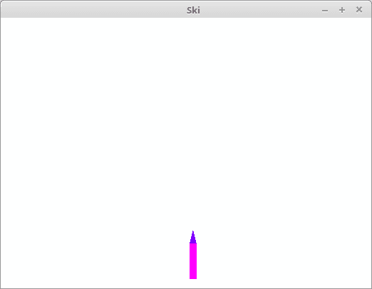
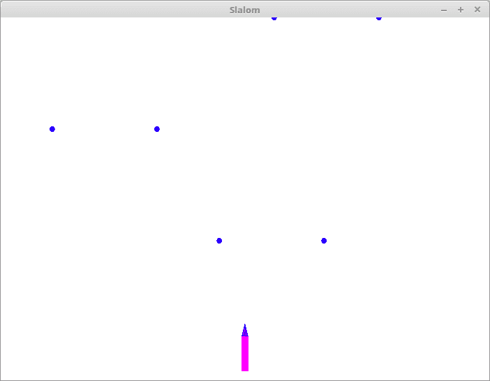
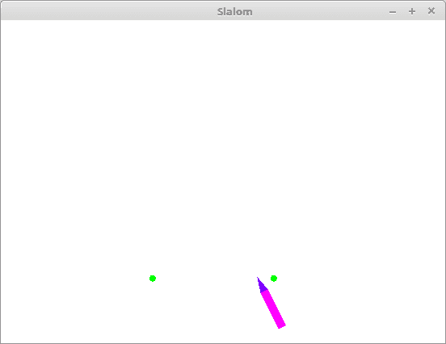
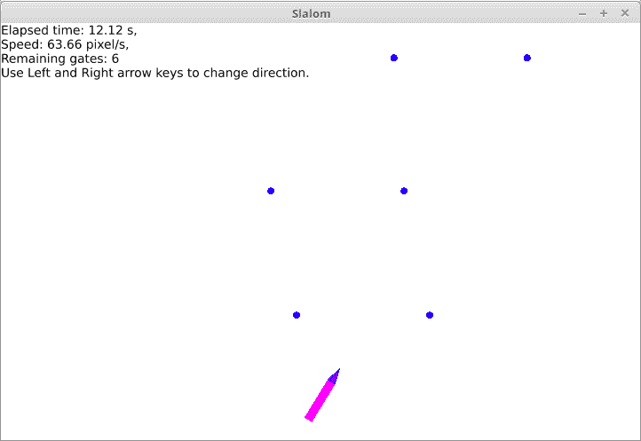

使用 Quicksilver 创建 WebAssembly 游戏

在本章中，您将了解如何使用 Rust 构建一个简单的 2D 游戏，该游戏可以编译为桌面应用程序或网络应用程序。要将其作为网络应用程序运行，我们将使用上一章中看到的工具生成一个 **WebAssembly** (**Wasm**) 应用程序。正如该章节所示，Wasm 是一种运行在浏览器内部的新技术，它可以将 Rust 源代码转换为伪机器语言，名为 Wasm，浏览器以最高速度加载和运行。

本章将描述并使用 Quicksilver 开源框架。它具有从单个源代码生成以下应用程序的强大功能：

+   一个独立的 **图形用户界面** (**GUI**) 应用程序，可在 Windows、macOS 或 Linux 等桌面系统中运行

+   在启用 JavaScript 的网络浏览器中运行的 Wasm 应用程序

Quicksilver 面向游戏编程，因此，作为一个例子，我们将使用它开发一个交互式图形游戏：一项滑雪回转比赛，玩家必须沿着滑雪道驾驶滑雪板，进入沿途的障碍门。

本章将涵盖以下主题：

+   理解动画循环架构

+   使用 Quicksilver 框架构建一个动画应用程序（`ski`）

+   使用 Quicksilver 框架（`silent_slalom`）构建一个简单的游戏

+   向游戏中添加文本和声音（`assets_slalom`）

# 第七章：技术要求

您需要阅读上一章中关于 Wasm 的部分，但不需要其他知识。要运行本章中的项目，只需安装一个 Wasm 代码生成器即可。

本章的完整源代码位于存储库的 `Chapter06` 文件夹中，可在[`github.com/PacktPublishing/Creative-Projects-for-Rust-Programmers`](https://github.com/PacktPublishing/Creative-Projects-for-Rust-Programmers) 找到。

对于 macOS 用户，您可能难以安装 `coreaudio-sys`。将 `coreaudio-sys` 的补丁版本升级到 0.2.3 可以解决这个问题。

# 项目概述

在本章中，我们将了解如何开发在现代网络浏览器或 GUI 窗口中运行的游戏。

为了这个目的，我们首先将描述基于动画循环概念的任何交互式游戏的典型架构。

然后，我们将介绍 Quicksilver crate。这是一个框架，允许我们基于动画循环创建图形应用程序。它允许我们生成可在网络浏览器中运行的 Wasm 可执行文件，或在桌面环境中运行的本地可执行文件。

第一个项目（`ski`）将非常简单：仅包含一个可以按箭头键旋转的滑雪板页面。这个项目将展示游戏的一般架构，如何在页面上绘制，以及如何处理输入。

第二个项目（`silent_slalom`）将为第一个项目添加功能，创建一个完整——尽管非常简单——的游戏。然而，它将不会使用可加载的资源，例如图像、字体或声音。

第三个项目（`assets_slalom`）将为第二个项目添加功能，加载字体和一些录音声音，并展示如何在页面上显示一些文本，以及如何播放加载的声音文件。

# 理解动画循环架构

如前一章所述，交互式软件的典型架构是**事件驱动架构**。在这种架构中，软件只是等待输入命令，当命令到达时，它会对这些命令做出响应。在收到任何命令之前，软件什么都不做。

这种架构对许多类型的应用程序来说既高效又响应迅速，但它对某些其他类型的应用程序来说并不理想，例如以下情况：

+   带有动画的游戏

+   持续模拟软件

+   多媒体软件

+   一些教育软件

+   机器监控软件（通常称为**人机界面**（**HMI**）软件）

+   系统监控软件（通常称为**监督控制与数据采集**（**SCADA**）软件）

在这样的系统中，软件总是有事情要做，如下面的例子所示：

+   在带有动画的游戏中，例如体育游戏或战斗游戏或赛车游戏，无论是与其他玩家对战还是与机器模拟玩家对战，即使用户没有操作，对手也会移动，时间会流逝；因此，屏幕必须不断更新以显示对手所做的一切，以及当前的时间。

+   在持续模拟软件中，例如汽车碰撞的图形模拟，物体即使在您没有按任何键的情况下也会继续移动；因此，屏幕必须随时显示物体的新位置。

+   在多媒体软件中，例如播放音频或视频剪辑的软件，数据会持续流动，直到您暂停或停止播放。

+   教育软件有很多种，但其中一些只是带有动画的游戏、持续模拟软件或多媒体软件。

+   大多数机械机器为了让用户监控它们，即使在用户没有请求更新时，也会在屏幕上显示其内部状态的持续更新表示。

+   许多复杂的系统，如工业设施、办公楼，以及最近也开始应用于住宅建筑，会在屏幕上显示系统内运行的设备状态的持续更新表示。

实际上，这类软件甚至可以使用事件驱动架构来开发。只需要使用一个称为**计时器**的特定小部件。计时器是一个软件组件，会在固定的时间间隔触发一个事件。

例如，在电子温度计中，有一个每分钟执行一次例程的计时器。这个例程从传感器读取温度，并在小屏幕上显示读取值。

对于某些类型的应用，使用事件驱动环境，可能包括一个或多个计时器，是合适的。例如，事件驱动编程对于会计应用等商业应用来说是最优的。在这些应用中，用户屏幕被分成几个输入小部件，如标签、按钮和文本框。在这样的软件中，直到用户点击鼠标或按下一个键，才运行应用程序代码。这些输入事件触发动作。

然而，事件驱动编程并不完全适合显示填充窗口的场景，这种软件没有小部件，并且即使在用户没有对输入设备进行操作的情况下，也始终有一些代码在运行。

对于这类软件，所谓的 **动画循环架构** 更为合适。其最简单的结构如下：

1.  首先，绘制例程被定义为负责检查输入设备的状态并根据状态重新绘制屏幕的程序。

1.  然后，一个屏幕区域被定义为场景，并为它定义一个更新率。

1.  当程序启动时，它首先为场景打开一个窗口（或子窗口），然后使用内部计时器以固定间隔调用绘制例程。

1.  这种周期性的绘制例程通常被称为 *帧*，其调用频率以每秒 **帧数**（**FPS**）来衡量。

动画循环有时被称为 *游戏循环*，因为它经常用于游戏。然而，这个名称并不准确，原因如下：

+   还有其他几种应用应该使用动画循环，例如连续模拟软件、工业机器监控软件或多媒体软件。因此，动画循环不仅限于游戏。

+   有些游戏不需要动画循环。例如，棋盘游戏、纸牌游戏或冒险游戏，只要它们不是基于动画的，就可以使用事件驱动架构完美实现。因此，游戏不一定基于动画循环。

注意，虽然在事件驱动架构中用户输入会触发动作，但在动画循环架构中，某些动作仍然会发生，但如果存在用户输入，这些动作会相应地改变。

考虑一个按下键盘键或鼠标按钮的用户。在事件驱动编程中，这种输入操作发送一条精确的命令。相反，在动画循环编程中，程序在任何一帧都会检查是否有任何键被按下。如果按键时间非常短，那么这种操作可能会被忽略，因为在检查键盘的一个周期中，那个键还没有被按下，而在下一个周期中，那个键已经被释放了。

这相当不寻常。典型的帧率是从 20 到 60 FPS，因此相应的间隔是从 50 到 16.7 毫秒。很难按下比这更短的时间。相反，按键时间通常比帧长得多，因此按键在几个连续帧中被看到按下。

如果你使用这样的按键来插入文本，你希望允许用户按下一个键来插入一个字母。如果你使用鼠标点击来在屏幕上按一个按钮，你希望那个屏幕按钮只按一次。为了避免这种多次点击，你必须在你第一次得到输入时暂时禁用输入。这相当麻烦，因此，对于典型的基于小部件的 GUI 应用程序，事件驱动编程更合适。

相反，当必须使按键的效果与按键持续时间成比例时，动画循环编程是合适的。例如，如果使用箭头键在屏幕上移动一个角色，并且如果你按住右箭头键 1 秒钟，那个角色会移动一段短距离；而如果你按住那个键 2 秒钟，那个角色会移动两倍的距离。一般来说，短按应该改变很少，而长按应该改变很多。

关于输出，当使用事件驱动编程时，操作的效果通常是通过改变小部件的一些属性（例如，在文本框中更改文本内容，或在图片框中加载位图）来显示的。在更改之后，小部件能够在其需要时使用其内部状态自行刷新。触发刷新的事件是小部件包含的屏幕部分的无效化。例如，如果另一个窗口覆盖了我们的窗口，然后它移动开去，我们窗口被发现的区域就无效了，因此它必须刷新。

这种图形被称为**保留模式**，因为有一个内部数据结构保留在需要刷新屏幕时所需的信息。相反，当使用动画循环编程时，必须在每一帧重新生成所有图像，因此不需要等待特定事件。这种图形被称为**即时模式**，因为绘图是在需要看到时立即由应用程序代码执行的。

在上一章中，我们看到了对于事件驱动应用程序，**模型-视图-控制器**（**MVC**）架构模式允许你给你的代码提供更好的结构。同样，对于动画循环应用程序，也存在一种 MVC 架构模式。

**模型**是包含所有必须在帧之间持续存在的变量的数据结构。

**控制器**是一个有输入但没有输出的函数。它检查输入设备的状态（哪些键盘键被按下；哪些鼠标键被按下；鼠标的位置；其他可能的输入通道的值），读取模型的字段，并更新它们。

**视图**是一个有输出但没有输入的功能。它读取模型的字段并根据读取的值在屏幕上绘制。

这是 Quicksilver 框架实现此模式的方式。

模型是任何数据类型，通常是结构体，必须实现`State`特质。这样的特质包含以下三个函数：

+   `fn new() -> Result<Screen>`: 这是创建模型的唯一方法。它将返回一个有效的模型（如果可能的话）或一个错误。

+   `fn update(&mut self, window: &mut Window) -> Result<()>`: 这是个控制器。它由框架定期调用。`window`参数允许你获取一些上下文信息。在这个框架中，它是可变的，但在 MVC 模式的正确实现中，它不应该被改变。相反，`self`——即模型——应该是可变的。

+   `fn draw(&mut self, window: &mut Window) -> Result<()>`: 这是个视图。它由框架定期调用。`self`参数允许从模型中获取信息。在这个框架中，它是可变的，但在 MVC 模式的正确实现中，它不应该被改变。相反，`window`参数——即输出设备——应该是可变的。

现在，让我们使用 Quicksilver 框架检查存储库中的第一个项目。

# 实施滑雪项目

我们将要看到的第一个项目相当简单。它只是在屏幕上显示一个几何形状，并允许用户使用箭头键旋转它：

1.  要将其作为桌面应用程序运行，请进入`ski`文件夹，并输入以下命令：

```rs
cargo run --release
```

推荐使用`--release`参数来优化生成的代码。对于这个简单的例子，这是没有意义的，但在更复杂的例子中，没有指定它生成的代码效率如此低，以至于生成的应用程序运行速度明显减慢。

1.  经过几分钟的下载和编译后，以下桌面窗口将出现：



它只是一个 800 x 600 像素的白色矩形，上面有一个小紫色矩形和一个小靛蓝色三角形。它们代表一个尖端的单板滑雪板，位于雪坡上。

1.  如果你按下键盘上的左箭头键（*←*）或右箭头键（*→*），你会看到滑雪板在其尖端旋转。

1.  现在，请使用你的窗口环境中的适当命令关闭此窗口。通常，你会在标题栏中点击一个叉号图标，或者按*Alt* + *F4*键组合。

1.  现在，让我们看看另一种启动此应用程序的方法。输入以下命令：

```rs
cargo web start --release
```

在上一章中，我们看到了这个命令如何帮助我们创建 Wasm 应用程序，并通过 HTTP 协议启动一个命令行程序来提供服务。

编译结束时，一个服务器程序启动并建议你可以访问应用的地址。在你的浏览器中，你可以输入此地址：`localhost:8000`。只有现代 64 位浏览器支持 WebGL2。如果在你这里不是这样，那么什么都不会发生；相反，如果你的浏览器支持这个标准，你将在浏览器中看到之前在桌面窗口中显示的相同图形。

这是可能的，因为我们的应用程序使用的 Quicksilver 框架具有多目标能力。当编译为 Wasm 目标时，它生成一个网页浏览器应用程序；当编译为 **中央处理器**（**CPU**）目标时，它生成一个桌面应用程序。

这种编译时便携性对于调试目的非常有用。实际上，调试 Wasm 应用程序并不容易；但如果你首先调试桌面应用程序，Wasm 版本中会剩下一些错误。

## 理解此代码背后的含义

现在，让我们看看创建此类项目所使用的代码。

在开始项目之前，需要对此进行说明。本章中的所有项目都展示了一个滑雪板在滑雪道上的场景。关于滑雪板和其他对象的坐标有一个约定：水平坐标，通常称为 *X*，实际上称为 *across*；而垂直坐标，通常称为 *Y*，实际上称为 *along*。

因此，*横向速度* 是从左到右（或反之，如果为负）移动的速度，而 *纵向速度* 是从底部到顶部（或反之，如果为负）移动的速度。

首先，`Cargo.toml` 文件必须包含 `quicksilver = "0.3"` 依赖项。然后，只有一个 `main.rs` 源文件。它包含一些常量，如下代码片段所示：

```rs
const SCREEN_WIDTH: f32 = 800.;
const SCREEN_HEIGHT: f32 = 600.;
const SKI_WIDTH: f32 = 10.;
const SKI_LENGTH: f32 = 50.;
const SKI_TIP_LEN: f32 = 20.;
const STEERING_SPEED: f32 = 3.5;
const MAX_ANGLE: f32 = 75.;
```

让我们看看这段代码中的术语意味着什么，如下所示：

+   `SCREEN_WIDTH` 和 `SCREEN_HEIGHT` 是桌面窗口中的客户端区域或网页中画布的大小（以像素为单位）。

+   `SKI_WIDTH`、`SKI_LENGTH` 和 `SKI_TIP_LEN` 是滑雪板的大小。

+   `STEERING_SPEED` 是滑雪板每次步骤旋转的度数。步骤有一个频率（即每秒 25 次），因此这个常量代表角速度（每步 3.5 度 * 每秒 25 步 = 每秒 87.5 度）。

+   `MAX_ANGLE` 是旋转能力的限制，无论是向右还是向左，以确保滑雪板始终向下。

然后，是我们的 MVC 架构模型，如下代码片段所示：

```rs
struct Screen {
    ski_across_offset: f32,
    direction: f32,
}
```

这些字段的意义如下：

+   `ski_across_offset` 代表滑雪板尖端相对于屏幕中心的横向位移。实际上，在这个项目中，它始终为零，因为滑雪板的尖端从不移动。它是一个变量，因为在未来项目中，它将发生变化。

+   `direction` 是滑雪板相对于下山方向的度数。它最初为零，但可以从 -75 到 +75 变化。它是我们模型中唯一可以改变的部分。

模型的构造函数相当简单，如下代码片段所示：

```rs
Ok(Screen {
    ski_across_offset: 0.,
    direction: 0.,
})
```

该模型简单地初始化了模型的两个字段为零。控制器的主体（`update`函数）是用以下代码创建的：

```rs
if window.keyboard()[Key::Right].is_down() {
    self.steer(1.);
}
if window.keyboard()[Key::Left].is_down() {
    self.steer(-1.);
}
Ok(())
```

此例程的目的是在按下右箭头键时将滑雪板稍微向右引导，如果按下左箭头键则稍微向左引导。

`window.keyboard()`表达式获取与当前窗口关联的键盘的引用，然后`[Key::Right]`表达式获取该键盘的右箭头键的引用。`is_down`函数在指定键在此瞬间处于按下状态时返回`true`。

导航是通过`steer`方法执行的，其主体由以下代码组成：

```rs
self.direction += STEERING_SPEED * side;
if self.direction > MAX_ANGLE {
    self.direction = MAX_ANGLE;
}
else if self.direction < -MAX_ANGLE {
    self.direction = -MAX_ANGLE;
}
```

首先，模型`direction`字段的值通过`STEERING_SPEED`常量递增或递减。然后，确保新值不超过设计限制。

视图更复杂。即使场景完全没有变化，也必须重新绘制整个场景。第一次绘制操作始终是绘制白色背景，如下所示：

```rs
window.clear(Color::WHITE)?;
```

然后，绘制矩形，如下所示：

```rs
window.draw_ex(&Rectangle::new((
    SCREEN_WIDTH / 2\. + self.ski_across_offset - SKI_WIDTH / 2.,
    SCREEN_HEIGHT * 15\. / 16\. - SKI_LENGTH / 2.),
    (SKI_WIDTH, SKI_LENGTH)),
    Background::Col(Color::PURPLE),
    Transform::translate(Vector::new(0, - SKI_LENGTH / 2\. - SKI_TIP_LEN)) *
        Transform::rotate(self.direction) *
        Transform::translate(Vector::new(0, SKI_LENGTH / 2\. 
         + SKI_TIP_LEN)),
    0);
```

`draw_ex`方法用于绘制形状。它的第一个参数是要绘制的形状的引用；在这种情况下，它是`Rectangle`。它的第二个参数，在第五行，是形状的背景颜色；在这种情况下，它是`紫色`。它的第三个参数是一个平面仿射变换矩阵；在这种情况下，它是一个平移，然后是旋转，然后是平移。它的第四个参数，在最后一行，是一个*Z*高度；其目的是为形状提供重叠顺序。让我们更详细地检查这些参数。

`Rectangle::new`方法接收两个参数。第一个参数是由矩形左上角顶点的*x*和*y*坐标组成的元组。第二个参数是由矩形的宽度和高度组成的元组。坐标系的原点是窗口的左上角，*x*坐标向右增长，*y*坐标向下增长。

在这些公式中，唯一的变量是`self.ski_across_offset`，它表示当为正时，滑雪板相对于窗口中心的位移向右，当为负时向左。在这个项目中，它始终为零，因此滑雪板的*x*坐标始终位于窗口中心。垂直位置是使得矩形的中心接近窗口底部，大约是窗口高度的 15/16。

矩形总是与其边平行于窗口的边创建。为了有一个旋转角度，必须应用几何变换。有几种基本的变换可以通过乘法组合。要绘制一个在平移位置上的形状，使用 `Transform::translate` 方法创建一个变换，该方法接收一个 `Vector`（不是 `Vec`！）指定沿 *x* 和 *y* 方向的位移。要绘制一个在旋转位置上的形状，使用 `Transform::rotate` 方法创建一个变换，该方法接收一个角度（以度为单位），指定旋转形状的角度。

旋转是围绕形状的质心进行的，但我们想围绕滑雪板的尖端旋转。因此，我们需要首先平移矩形，使其质心位于滑雪板的尖端处，然后围绕其质心旋转，最后将其平移回原始质心。通过乘以这三个变换，我们得到了围绕滑雪板尖端的旋转。在矩形的例子中，质心就是矩形的中心。

`draw_ex` 的最后一个参数是一个 *z* 坐标。这是一个二维框架，因此不需要 *z* 坐标，但这个坐标允许我们指定形状出现的顺序。实际上，如果有两个形状重叠，并且它们具有相同的 *z* 坐标，Quicksilver（使用 WebGL）并不一定按照你绘制的顺序绘制它们。实际的顺序是未定义的。为了指定一个形状必须出现在另一个形状之上，它必须具有更大的 *z* 坐标。它的大小并不重要。

要在矩形上方绘制三角形尖端，执行一个类似的语句。`Triangle::new` 方法创建一个 `Triangle` 形状，使用三个 `Vector` 变量作为其顶点。为了使其围绕尖端旋转，我们需要知道三角形的质心。通过一点几何知识，你可以计算出该三角形的质心位于三角形底边中心上方，距离等于三角形高度的 1/3。

到程序结束时，有一个必须初始化应用的 `main` 函数。函数的主体包含以下内容：

```rs
run::<Screen>("Ski",
    Vector::new(SCREEN_WIDTH, SCREEN_HEIGHT), Settings {
        draw_rate: 40.,
        update_rate: 40.,
        ..Settings::default()
    }
);
```

这个语句只是运行模型，并带有一些参数。第一个参数是标题栏的标题，第二个参数是窗口的大小，第三个参数是一个包含一些可选设置的结构的实例。

下面两个设置在这里指定：

+   `draw_rate`：这是 `draw` 函数连续调用之间的时间间隔（以毫秒为单位）

+   `update_rate`：这是 `update` 函数连续调用之间的时间间隔（以毫秒为单位）

这个项目相当简单，但它展示了将在本章其他项目中使用的许多概念。

# 实现 silent_slalom 项目

之前的项目只显示了一个滑雪场上的滑雪板。在本节中，我们将展示一个可能有趣的游戏，使用滑雪板进行障碍滑雪。为了简单起见，在这个项目中没有显示文本，也没有播放音效。它的源代码包含在 `silent_slalom` 文件夹中。

编译并运行其桌面版本后，将出现一个类似于这样的窗口：



除了滑雪板，还画了一些蓝色的小点。窗口中间有四个点，顶部边界上有两个半点。每一对蓝色点是一个障碍门的柱子。游戏的目的是通过每个障碍门。现在，你可以看到只有三个门，但赛道包含七个中间门，加上结束门。剩下的五个门将在滑雪板沿着斜坡前进时出现。

在你的情况下，柱子的实际位置将不同，因为它们的水平（横跨）位置是随机生成的。如果你停止并重新启动程序，你会看到其他柱子的位置。尽管如此，门的尺寸——即任何门的两柱之间的距离——保持不变；此外，任何门与其后门之间的 *y* 坐标距离也是恒定的。

要开始游戏，请按空格键。蓝色的小点将开始缓慢向下移动，给人一种滑雪板向前滑行的印象。通过旋转滑雪板，你可以改变它的方向，你应该尝试确保滑雪板的尖端通过每个门的柱子之间。

结束门通过绿色柱子而不是蓝色柱子来区分。如果你通过了它，游戏结束，显示一个类似于这样的窗口：



你可以通过按 *R* 键重新启动游戏。如果你未能正确通过一个门，游戏将停止并结束。你可以通过按 *R* 键重新启动它。

当然，这个项目与之前的项目有一些共同之处。让我们看看其中的不同之处。

第一个不同之处在于在 `Cargo.toml` 文件中插入了 `rand = "0.6"` 依赖项。门被定位在随机的 *x* 位置，因此需要这个包中包含的随机数生成器。

然后，定义以下常量：

```rs
const N_GATES_IN_SCREEN: usize = 3;
const GATE_POLE_RADIUS: f32 = 4.;
const GATE_WIDTH: f32 = 150.;
const SKI_MARGIN: f32 = 12.;
const ALONG_ACCELERATION: f32 = 0.06;
const DRAG_FACTOR: f32 = 0.02;
const TOTAL_N_GATES: usize = 8;
```

让我们详细看看这些常量，如下所示：

+   `N_GATES_IN_SCREEN` 是一次在窗口中出现的门的数量。连续门之间的距离是窗口高度除以这个数字。因此，这个数字必须是正数。

+   `GATE_POLE_RADIUS` 是用来表示柱子的每个圆的像素半径。

+   `GATE_WIDTH` 是每个门中柱子中心之间的像素距离。这个数字必须是正数。

+   `SKI_MARGIN` 是滑雪板尖端能够到达的最左侧位置到窗口左边的像素距离，以及滑雪板尖端能够到达的最右侧位置到窗口右边的像素距离。

+   `ALONG_ACCELERATION` 是滑雪板由于斜坡而移动的加速度，以每帧像素为单位，对于每一帧，当滑雪板处于下山位置——即垂直时。例如，对于加速度值为 0.06 和更新率为 40 毫秒，或每秒 25 帧，一秒钟内速度将从零增加到 *0.06 * 25 = 1.5* 像素每帧——即速度为 *1.5 * 25 = 37.5* 像素每秒。如果滑雪板相对于斜坡有倾斜，实际加速度将更低。

+   `DRAG_FACTOR` 代表由空气摩擦引起的减速。实际减速是此因子乘以速度的模量。

+   `TOTAL_N_GATES` 是门的总数，包括终点门。

在上一个项目中，你一直只能做一件事——那就是旋转滑雪板——在这个项目中，你可以根据当前情况做不同的事情。因此，需要区分四种可能的状态，如下所示：

```rs
enum Mode {
    Ready,
    Running,
    Finished,
    Failed,
}
```

初始模式是 `Ready`，当你渴望开始滑行，位于斜坡顶部时。在发出 `start` 命令后，你处于 `Running` 模式，直到你正确完成滑行，结束于 `Finished` 模式，或者从门中出来，结束于 `Failed` 模式。

已经向应用程序的模型中添加了一些字段，以跟踪一些其他状态信息，如下面的代码块所示：

```rs
gates: Vec<(f32, f32)>,
forward_speed: f32,
gates_along_offset: f32,
mode: Mode,
entered_gate: bool,
disappeared_gates: usize,
```

这些字段的意义如下所述：

+   `gates` 是杆的沿位置列表。对于它们，原点是窗口的中心。

+   `forward_speed` 是每帧像素速度的模量。

+   `gates_along_offset` 是所有显示的门的 *Y* 方向平移，这代表着滑雪板的前进。它是一个介于零和连续门之间沿间距之间的数字。

+   `mode` 是之前描述的状态。

+   `entered_gate` 指示滑雪板的尖端是否已经进入窗口中显示的最低门。这个标志被初始化为 `false`；当滑雪板正确通过一个门时，它变为 `true`，当那个门从底部退出窗口时再次变为 `false`，因为现在它指的是下一个门。

+   `disappeared_gates` 计算从窗口中退出的门。当然，它被初始化为零，每次门退出窗口时都会增加。

添加到 `Screen` 类的一个函数生成一个随机门，如下面的代码块所示：

```rs
fn get_random_gate(gate_is_at_right: bool) -> (f32, f32) {
    let mut rng = thread_rng();
    let pole_pos = rng.gen_range(-GATE_WIDTH / 2., SCREEN_WIDTH / 2\. -
        GATE_WIDTH * 1.5);
    if gate_is_at_right {
        (pole_pos, pole_pos + GATE_WIDTH)
    } else {
        (-pole_pos - GATE_WIDTH, -pole_pos)
    }
}
```

此函数接收`gate_is_at_right`标志，该标志指示生成的门将在斜率的哪个部分。如果此参数为`true`，则新门将位于窗口中心的右侧；否则，它将位于窗口中心的左侧。此函数创建一个随机数生成器，并使用它生成一个合理的杆位置。另一个杆位置是通过使用函数参数和固定的门大小（`GATE_WIDTH`）计算得出的。

另一个实用函数是`deg_to_rad`，它将角度从度转换为弧度。这是必需的，因为 Quicksilver 使用度，但三角函数使用弧度。`new`方法创建所有门，交替在右侧和左侧，并初始化模型。`update`函数所做的比之前项目中看到的名字相同的函数要多得多。让我们看看下面的代码片段：

```rs
match self.mode {
    Mode::Ready => {
        if window.keyboard()[Key::Space].is_down() {
            self.mode = Mode::Running;
        }
    }
```

根据当前模式，执行不同的操作。如果模式是`Ready`，则检查空格键是否被按下，如果是这样，则将当前模式设置为`Running`。这意味着它开始比赛。如果模式是`Running`，则执行以下代码：

```rs
Mode::Running => {
    let angle = deg_to_rad(self.direction);
    self.forward_speed +=
        ALONG_ACCELERATION * angle.cos() - DRAG_FACTOR 
         * self.forward_speed;
    let along_speed = self.forward_speed * angle.cos();
    self.ski_across_offset += self.forward_speed * angle.sin();
```

在此模式下，计算了很多东西。首先，将滑雪方向从度转换为弧度。

然后，由于斜率，前进速度增加，由于空气阻力（与速度本身成比例）而减少。净效应是速度将趋向于最大值。此外，滑雪方向相对于斜率的旋转越多，它就越慢。这种效果是通过使用`cos`余弦三角函数实现的。

然后，将前进速度分解为其分量：沿速度，它导致极点的向下移动，以及横速度，它增加横滑雪偏移量。它们分别通过应用`cos`和`sin`三角函数来计算前进速度，如下面的代码片段所示：

```rs
if self.ski_across_offset < -SCREEN_WIDTH / 2\. + SKI_MARGIN {
    self.ski_across_offset = -SCREEN_WIDTH / 2\. + SKI_MARGIN;
}
if self.ski_across_offset > SCREEN_WIDTH / 2\. - SKI_MARGIN {
    self.ski_across_offset = SCREEN_WIDTH / 2\. - SKI_MARGIN;
}
```

然后，它检查滑雪位置是否没有太偏向左边或右边，如果是这样，它将被保持在定义的边框内，如下面的代码片段所示：

```rs
self.gates_along_offset += along_speed;
let max_gates_along_offset = SCREEN_HEIGHT / N_GATES_IN_SCREEN as f32;
if self.gates_along_offset > max_gates_along_offset {
    self.gates_along_offset -= max_gates_along_offset;
    self.disappeared_gates += 1;
}
```

新的沿速度用于向下移动门，通过增加`gates_along_offset`字段。如果其新值大于连续门之间的距离，则从窗口底部移除一个门，所有门向后移动一步，消失的门数增加，如下面的代码片段所示：

```rs
let ski_tip_along = SCREEN_HEIGHT * 15\. / 16\. - SKI_LENGTH / 2\. - SKI_TIP_LEN;
let ski_tip_across = SCREEN_WIDTH / 2\. + self.ski_across_offset;
let n_next_gate = self.disappeared_gates;
let next_gate = &self.gates[n_next_gate];
let left_pole_offset = SCREEN_WIDTH / 2\. + next_gate.0 + GATE_POLE_RADIUS;
let right_pole_offset = SCREEN_WIDTH / 2\. + next_gate.1 - GATE_POLE_RADIUS;
let next_gate_along = self.gates_along_offset + SCREEN_HEIGHT
    - SCREEN_HEIGHT / N_GATES_IN_SCREEN as f32;
```

然后，计算滑雪尖端的两个坐标：`ski_tip_along`是常数 *y* 坐标，从窗口顶部开始，而`ski_tip_across`是变量 *x* 坐标，从窗口中心开始。

然后，计算下一个门内的位置：`left_pole_offset`是左侧极点的*x*位置，而`right_pole_offset`是右侧极点的*x*位置。这些坐标是从窗口的左侧边框计算的。然后，`next_gate_along`是这些点的*y*位置，如下面的代码片段所示：

```rs
if ski_tip_along <= next_gate_along {
    if !self.entered_gate {
        if ski_tip_across < left_pole_offset || 
         ski_tip_across > right_pole_offset {
            self.mode = Mode::Failed;
        } else if self.disappeared_gates == TOTAL_N_GATES - 1 {
            self.mode = Mode::Finished;
        }
        self.entered_gate = true;
    }
} else {
    self.entered_gate = false;
}
```

如果滑雪板尖端(`ski_tip_along`)的*y*坐标小于门的坐标(`next_gate_along`)，那么我们可以说滑雪板的尖端已经通过了下一个门。尽管如此，如果记录这种通过的`entered_gate`字段仍然是`false`，那么我们可以说明在上一帧滑雪板还没有通过门。因此，在这种情况下，我们处于滑雪板刚刚通过门的情形。所以，我们必须检查门是否正确或错误地通过了。

如果滑雪板尖端的*x*坐标不在两个极点坐标之间，那么我们就处于门外，因此进入`Failed`模式。否则，我们必须检查这个门是否是课程的最后一个门——即终点门。如果是这种情况，我们进入`Finish`模式；否则，我们记录我们已经进入了门，以避免在下一帧再次检查它，比赛继续进行。

如果*y*坐标表明我们还没有到达下一个门，我们记录`entered_gate`仍然是`false`。有了这个，我们就完成了`Running`情况下的计算。

还剩下两种模式需要考虑，如下面的代码片段所示：

```rs
Mode::Failed | Mode::Finished => {
    if window.keyboard()[Key::R].is_down() {
        *self = Screen::new().unwrap();
    }
}
```

在`Failed`模式和`Finished`模式下，都会检查*R*键。如果按下，则重新初始化模型，回到游戏启动时的相同状态。

最后，检查转向键是否处于任何模式，就像在之前的项目中一样。关于`draw`函数，与之前的项目相比，本项目新增的功能是绘制极点。代码可以在以下代码片段中查看：

```rs
for i_gate in self.disappeared_gates..self.disappeared_gates + N_GATES_IN_SCREEN {
    if i_gate >= TOTAL_N_GATES {
        break;
    }
```

一个循环扫描窗口中出现的门。门的索引从零到`TOTAL_N_GATES`，但我们必须跳过那些已经从底部消失的门，其数量为`self.disappeared_gates`。我们必须显示至少`N_GATES_IN_SCREEN`个门，并且必须停在最后一个门上。

为了向玩家显示哪个是终点门，它有不同的颜色，如下面的代码片段所示：

```rs
let pole_color = Background::Col(if i_gate == TOTAL_N_GATES - 1 {
    Color::GREEN
} else {
    Color::BLUE
});
```

最后一个门是绿色的。为了计算门的极点的*y*坐标，使用以下公式：

```rs
let gates_along_pos = self.gates_along_offset
    + SCREEN_HEIGHT / N_GATES_IN_SCREEN as f32
        * (self.disappeared_gates + N_GATES_IN_SCREEN - 1 - i_gate) as f32;
```

它将两个连续门之间的滑雪板位置(`gates_along_offset`)添加到前三个门的初始位置。

然后，为每个门绘制两个小圆圈。左边的圆圈是通过执行以下语句绘制的：

```rs
window.draw(
    &Circle::new(
        (SCREEN_WIDTH / 2\. + gate.0, gates_along_pos),
        GATE_POLE_RADIUS,
    ),
    pole_color,
);
```

`Circle`构造函数的参数是一个由中心点的*x*和*y*坐标以及半径组成的元组。在这里，使用的是窗口对象的`draw`方法，而不是`draw_ex`方法。它更简单，因为它不需要变换也不需要*z*坐标。

因此，我们已经检查了这个项目的所有代码。在下一个项目中，我们将展示如何将文字和声音添加到我们的游戏中。

# 实现`assets_slalom`项目

前一个构建的项目是一个有效的回转滑雪比赛，但那个游戏没有声音或文字来解释正在发生的事情。这个项目包含在`assets_slalom`文件夹中，只是为前一个项目的游戏添加了声音和文字。

这里是比赛期间拍摄的一张截图：



在窗口的左上角，有如下信息：

+   **已过时间**：这告诉我们从当前比赛开始以来有多少秒或百秒已经过去。

+   **速度**：这告诉我们当前每秒向前移动多少像素。

+   **剩余门数**：这告诉我们还有多少门需要通过。

然后，一条帮助信息解释了哪些命令可用。

此外，还增加了四个声音，如下所示：

+   比赛任何开始时的滴答声

+   比赛任何转弯时的呼啸声

+   比赛任何失败时的碰撞声

+   比赛任何结束时的铃声

您必须运行游戏才能听到它们。请注意，并非所有网络浏览器都能同样有效地播放声音。

现在，让我们看看 Quicksilver 如何显示文字和播放声音。由于声音和文字需要文件，它们的使用并不简单；对于文字，需要一个或多个字体文件；对于声音，需要一个声音效果文件。这些文件必须存储在项目根目录下的名为`static`的文件夹中。如果您查看该文件夹，您将找到以下文件：

+   `font.ttf`：这是一个 TrueType 格式的字体。

+   `click.ogg`：这是一个短促的点击声音，将在比赛开始时播放。

+   `whoosh.ogg`：这是一个短促的摩擦声音，将在滑雪板在比赛中转弯时播放。

+   `bump.ogg`：这是一个表示不满的碰撞声音，将在滑雪板错过门时播放。

+   `two_notes.ogg`：这是一对音符，表示满意，将在滑雪板通过终点门时播放。

这样的`static`文件夹及其包含的文件必须与可执行程序一起部署，因为它们在程序运行时被程序加载。它们通常也被称为*assets*，因为它们只是数据，而不是可执行代码。

Quicksilver 选择以异步方式加载这些资源，使用*future*概念。要从文件中加载声音，使用`Sound::load(«filename»)`表达式。它接收一个实现路径引用的值，例如一个字符串，并返回一个实现`Future`特质的对象。

通过 `Asset::new(«future value»)` 表达式创建了一个资产——即封装正在加载文件的未来的对象。它接收一个实现未来的值，并返回特定类型的 `Asset` 实例。例如，`Asset::new(Sound::load("bump.ogg"))` 表达式返回一个 `Asset<Sound>` 类型的值。这样的值是一个封装未来的资产——即从 `bump.ogg` 文件中读取声音。在这个项目中，声音是 `.ogg` 格式，但 Quicksilver 能够读取多种音频格式。

一旦你有一个封装未来加载文件的资产，你可以在表达式 `sound_future.execute(|sound_resource| sound_resource.play())` 中访问这样的文件。在这里，`sound_future` 变量是我们的资产。由于它是一个未来，你必须等待它准备好。这是通过 `Asset` 类型的 `execute` 方法完成的。它调用作为参数接收的闭包，并将封装的资源传递给它，在这种情况下是 `Sound` 类型。

`Sound` 类型有 `play` 方法，它开始播放声音。在多媒体系统中，这种播放通常是异步的：你不必等待声音播放完毕就可以继续游戏。如果你在先前的声音仍在播放时调用 `play`，两个声音会重叠，如果你播放很多声音，结果音量通常会非常高。因此，你应该让你的声音非常短，或者很少播放。

类似地，`Asset::new(Font::load("font.ttf"))` 表达式返回一个 `Asset<Font>` 类型的值。这样的值是一个封装未来的资产——即从 `font.ttf` 文件中读取字体。你可以使用这个字体，如下所示 `font_future.execute(|font_resource| image = font_resource.render(&"Hello", &style))`。在这里，`font_future` 变量是我们的资产。由于它是一个未来，你必须使用 `Asset` 类型的 `execute` 方法等待它，该方法调用作为参数接收的闭包，并将封装的资源传递给它，在这种情况下是 `Font` 类型。

`Font` 类型有 `render` 方法，它接收一个字符串和一个 `FontStyle` 值的引用，并创建一个包含该文本的图像，使用该字体和字体样式打印。

## 分析代码

现在，让我们看看与上一个项目不同的所有项目代码。如下代码片段所示，有一个新的常量：

```rs
const MIN_TIME_DURATION: f64 = 0.1;
```

这是为了解决以下问题。如果游戏帧率为 50 FPS，窗口每秒重绘 50 次，并且每次使用变量的最新值。关于时间，它是一个变化如此之快的数字，以至于无法读取。因此，这个常量设置了显示时间的最大变化率。

模型有几个新的字段，如下代码片段所示：

```rs
elapsed_sec: f64,
elapsed_shown_sec: f64,
font_style: FontStyle,
font: Asset<Font>,
whoosh_sound: Asset<Sound>,
bump_sound: Asset<Sound>,
click_sound: Asset<Sound>,
two_notes_sound: Asset<Sound>,
```

这些字段的意义如下所述：

+   `elapsed_sec` 是从当前比赛开始以来经过的秒数的分数，使用可用的最大分辨率。

+   `elapsed_shown_sec` 是显示给用户的分数，表示从当前比赛开始以来经过的秒数。

+   `font_style` 包含要打印的文本的大小和颜色。

+   `font` 是用于打印屏幕文本的字体预期值。

+   `whoosh_sound` 是在滑雪运行过程中要播放的声音的预期值。

+   `bump_sound` 是在错过一个门时要播放的声音的预期值。

+   `click_sound` 是在比赛开始时要播放的声音的预期值。

+   `two_notes_sound` 是在通过终点门时要播放的声音的预期值。

已经定义了一个播放声音的例程，如下所示：

```rs
fn play_sound(sound: &mut Asset<Sound>, volume: f32) {
    let _ = sound.execute(|sound| {
        sound.set_volume(volume);
        let _ = sound.play();
        Ok(())
    });
}
```

它接收一个声音的预期值和一个音量。它调用 `execute` 方法以确保声音已加载，然后设置指定的音量并播放该声音。请注意，`execute` 方法返回一个 `Result`，以允许可能的错误。由于在游戏中声音不是必需的，我们希望忽略有关声音的可能的错误，因此，我们总是返回 `Ok(())`。

在 `steer` 函数中，当执行转向操作且滑雪板尚未达到极端角度时，执行以下语句：

```rs
play_sound(&mut self.whoosh_sound, self.forward_speed * 0.1);

```

它播放“呼啸”声音和与滑雪速度成比例的音量。这样，如果你在未运行时旋转滑雪板，你将是安静的。

模型的新字段初始化如下：

```rs
elapsed_sec: 0.,
elapsed_shown_sec: 0.,
font_style: FontStyle::new(16.0, Color::BLACK),
font: Asset::new(Font::load("font.ttf")),
whoosh_sound: Asset::new(Sound::load("whoosh.ogg")),
bump_sound: Asset::new(Sound::load("bump.ogg")),
click_sound: Asset::new(Sound::load("click.ogg")),
two_notes_sound: Asset::new(Sound::load("two_notes.ogg")),
```

注意，`font_style` 设置了 16 点的大小和黑色颜色。我们已描述了其他类型的表达式。

在 `update` 函数中，当通过按空格键开始比赛时，执行以下语句：

```rs
play_sound(&mut self.click_sound, 1.)
```

它以正常音量播放点击声音。当运行时，经过时间的计算方式如下：

```rs
self.elapsed_sec += window.update_rate() / 1000.;
if self.elapsed_sec - self.elapsed_shown_sec >= MIN_TIME_DURATION {
    self.elapsed_shown_sec = self.elapsed_sec;
}
```

`update_rate` 函数实际上返回帧之间的时间，以毫秒为单位。因此，如果你将其除以 1,000，你将得到每帧之间的秒数。

如果帧率很高，例如每秒 25 帧或更多，在任何帧显示不同的文本可能会令人困惑，因为人们无法阅读变化如此之快的文本。因此，前一个代码片段中的第二个语句展示了更新文本的较低速率的技术。`elapsed_shown_sec` 字段保持上次更新的时间，而 `elapsed_sec` 字段保持当前时间。

`MIN_TIME_DURATION` 常量用于保持文本在屏幕上必须保持不变的最小时长，以便更新。因此，如果从上次更新时间到当前时间的经过时间大于这个最小时长，文本就可以更新。在这个特定情况下，要更新的文本只是经过的秒数，所以，如果时间足够长，`elapsed_shown_sec` 字段就会被设置为当前时间。`draw` 例程将使用这个值在屏幕上打印经过的时间。

发出了另外两个声音。当`mode`变为`Failed`时，调用`play_sound`来播放碰撞声音。当`mode`变为`Finished`时，调用`play_sound`来播放铃声。

然后，绘制例程负责打印所有文本。首先，文本被格式化为一个新的多行字符串，如下所示：

```rs
let elapsed_shown_text = format!(
    "Elapsed time: {:.2} s,\n\
     Speed: {:.2} pixel/s,\n\
     Remaining gates: {}\n\
     Use Left and Right arrow keys to change direction.\n\
     {}",
    self.elapsed_shown_sec,
    self.forward_speed * 1000f32 / window.update_rate() as f32,
    TOTAL_N_GATES - self.disappeared_gates - if self.entered_gate { 1 } else { 0 },
    match self.mode {
        Mode::Ready => "Press Space to start.",
        Mode::Running => "",
        Mode::Finished => "Finished: Press R to reset.",
        Mode::Failed => "Failed: Press R to reset.",
    }
);
```

使用两位小数打印已过时间以及速度；剩余的关卡通过从总关卡数中减去消失的关卡来计算。此外，如果当前关卡已被进入，剩余关卡的数量将减一。然后，根据当前模式打印一些不同的单词。

准备好多行字符串后，该字符串被打印到一个新的图像上，并存储在`image`局部变量中，然后使用`draw`方法将图像绘制到窗口上，作为一个纹理背景。该方法接收的第一个参数是要打印的矩形区域，大小与整个位图相同，第二个参数是使用图像构建的`Background`类型的`Img`变体，如以下代码片段所示：

```rs
let style = self.font_style;
self.font.execute(|font| {
    let image = font.render(&elapsed_shown_text, &style).unwrap();
    window.draw(&image.area(), Img(&image));
    Ok(())
})?;
```

因此，我们已经完成了对这个简单但有趣的框架的考察。

# 摘要

我们已经看到，一个完整的游戏，既可以在桌面运行，也可以在网络上运行，可以使用 Rust 和 Quicksilver 框架构建，网络版本使用`cargo-web`命令和 Wasm 代码生成器。这个游戏是根据动画循环架构和 MVC 架构模式构建的。我们创建了三个应用程序——`ski`、`silent_slalom`和`assets_slalom`——并理解了它们的实现。

在下一章中，我们将介绍另一个面向桌面应用的 2D 游戏框架，即`ggez`框架。

# 问题

1.  动画循环是什么，它与事件驱动架构相比有哪些优势？

1.  何时事件驱动架构比动画循环架构更好？

1.  哪些类型的软件可以使用动画循环？

1.  你如何使用 Quicksilver 绘制三角形、矩形和圆形？

1.  你如何使用 Quicksilver 接收键盘输入？

1.  MVC 中的控制器和视图是如何在 Quicksilver 中实现的？

1.  你如何使用 Quicksilver 来调整动画的帧率？

1.  你如何使用 Quicksilver 从文件中加载资源，并且这些资源应该保存在哪里？

1.  你如何使用 Quicksilver 播放声音？

1.  你如何使用 Quicksilver 在屏幕上绘制文本？

# 进一步阅读

你可以从这里下载 Quicksilver 项目：[`github.com/ryanisaacg/quicksilver`](https://github.com/ryanisaacg/quicksilver)。此存储库包含一个指向非常简短的教程和一些示例的链接。

你可以在[`github.com/koute/cargo-web`](https://github.com/koute/cargo-web)找到有关从 Rust 项目生成 Wasm 代码的更多信息。
