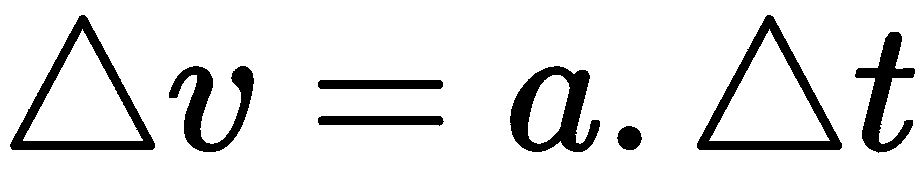

使用 ggez 创建桌面二维游戏

在前一章中，我们看到了如何使用 `quicksilver` 框架从单一源代码集构建基于动画循环架构的交互式软件（通常是桌面或网页浏览器中的动画游戏）。这种方法的一个缺点是，许多在桌面上可用的输入/输出函数在网页浏览器中不可用，因此网页浏览器框架不一定提供与桌面平台提供的桌面应用程序一样多的功能，例如文件存储。

此外，在使用动画循环架构时，获取离散输入（如鼠标点击、键入字母或数字）相当尴尬。为此，事件驱动架构更为合适。

在本章中，将介绍另一个应用程序框架——`ggez` 框架。该框架处理动画循环和离散事件，但在编写本书时，它仅支持二维桌面应用程序。

在前一章中，我们了解到为了计算各种图形对象的位置和方向，需要一些解析几何和三角学的知识。对于更复杂的应用，这些数学计算可能会变得令人难以承受。为了简化代码，将位置封装在点对象中，将平移封装在向量对象中是有用的，因此在本章中，我们将探讨如何执行这些封装。`nalgebra` 数学库帮助我们完成这项工作，也将在本章中介绍。

本章将涵盖以下主题：

+   理解线性代数

+   实现 `gg_ski` 项目

+   实现 `gg_silent_slalom` 项目

+   实现 `gg_assets_slalom` 项目

+   实现 `gg_whac` 项目

特别是，您将看到与上一章中查看的相同三个项目（`gg_ski`、`gg_silent_slalom` 和 `gg_assets_slalom`）的实现，以演示动画循环，以及一个 Whac-A-Mole 游戏（`gg_whac`）以演示处理离散事件。

# 技术要求

本章使用了前一章中实现的动画循环架构和回转滑雪游戏的引用。`ggez` 框架要求操作系统良好支持 OpenGL 3.2 API 以正确渲染图形对象。因此，旧操作系统如 Windows XP 不能使用。

本章的完整源代码位于[`github.com/PacktPublishing/Creative-Projects-for-Rust-Programmers`](https://github.com/PacktPublishing/Creative-Projects-for-Rust-Programmers)存储库的 `Chapter07` 文件夹中。

macOS 用户可能难以安装 `coreaudio-sys`。将 `coreaudio-sys` 的补丁版本升级到 `0.2.3` 可以解决这个问题。

# 项目概述

在本章中，我们将首先探讨线性代数是什么以及为什么它对描述和操作任何图形游戏中的对象是有用的。然后，我们将探讨如何使用 `nalgebra` 库在我们的程序中执行线性代数运算。

之后，我们将重新创建前一章中使用的相同项目，但使用 `nalgebra` 库和 `ggez` 框架而不是 `quicksilver` 框架。`gg_ski` 是 `ski` 的重写，`gg_silent_slalom` 是 `silent_slalom` 的重写，而 `gg_assets_slalom` 是 `assets_slalom` 的重写。

在本章结束时，我们将通过 `gg_whac` 项目来查看一个完全不同的游戏的实现，以了解如何在将动画循环与事件驱动架构混合的架构中处理离散事件。这还将展示如何创建和将小部件（如按钮）添加到窗口中。

# 理解线性代数

线性代数是数学的一个分支，涉及一阶方程组系统，如下所示：


这个方程组系统对某些值有解（即，）。除了在解方程组方面有用外，线性代数的概念和方法对于表示和操作几何实体也是很有用的。

特别地，平面上任何位置都可以用两个坐标表示，*x* 和 *y*，而空间中任何位置都可以用三个坐标表示，*x*，*y* 和 *z*。此外，平面上位置的任何平移都可以用两个坐标表示，*Δx* 和 *Δy*，而空间中位置的任何平移都可以用三个坐标表示，*Δx*，*Δy* 和 *Δz*。

例如，考虑平面上两个位置：

+   *p[1]*: 它的坐标是 *x = 4, y = 7.*

+   *p[2]*: 它的坐标是 *x = 10, y = 16.*

考虑平面上两个平移：

+   *t[1]*: 它的坐标是 .

+   *t[2]*: 它的坐标是  .

你可以说，如果你通过 *t[1]* 平移将 *p[1]* 位置平移，你会到达 *p[2]* 位置。计算是通过添加相应的坐标来完成的：*p[1x] + t[1x] = p[2x]*（或者，用数字来说，4 + 6 = 10）和 *p[1y] + t[1y] = p[2y]*（或者，用数字来说，7 + 9 = 16）。

如果你依次对 *p[1]* 位置应用两个平移——*t[1]* 平移和 *t[2]* 平移——那么你将获得另一个位置（比如说，*p[3]*）。如果你首先将两个平移（通过逐成员求和它们的分量）相加，然后将结果平移应用到 *p[1]* 上，你也会得到相同的结果。

因此，对于 *x* 坐标，我们有 *(p[1x] + t[1x]) + t[2x] = p[1x] + (t[1x] + t[2x])*，对于 *y* 坐标也有类似的等式。因此，可以添加变换。您可以通过将各自的坐标相加来向另一个变换添加变换，而不是将一个位置添加到另一个位置上。

您可以通过将计算应用于位置和变换实体本身来简化您的几何计算，使用以下公式：


在线性代数中，有两个概念可以应用于这类操作：

+   **向量**：代数*向量*是一组可以添加到另一个向量中的数字，得到另一个向量，这正是表示变换所需的。

+   **点**：代数*点*是一组不能添加到另一个点中的数字，但可以通过一个向量增加，从而得到另一个点，这正是表示位置所需的。

因此，线性代数的 *N 维向量* 适合表示 *N 维几何空间中的变换，而线性代数的 *N 维点* 适合表示 *N 维几何空间中的位置*。

`nalgebra` 库（发音为 *en-algebra*）是一系列代数算法的集合，它为这些类型的二维点和向量类型提供了实现，因此它将在所有以下项目中使用。

使用这个库，您可以编写以下程序，该程序显示了哪些操作是允许的，哪些是不允许的，使用向量和点：

```rs
use nalgebra::{Point2, Vector2};
fn main() {
    let p1: Point2<f32> = Point2::new(4., 7.);
    let p2: Point2<f32> = Point2::new(10., 16.);
    let v: Vector2<f32> = Vector2::new(6., 9.);

    assert!(p1.x == 4.);
    assert!(p1.y == 7.);
    assert!(v.x == 6.);
    assert!(v.y == 9.);

    assert!(p1 + v == p2);
    assert!(p2 - p1 == v);
    assert!(v + v - v == v);
    assert!(v == (2\. * v) / 2.);

    //let _ = p1 + p2;
    let _ = 2\. * p1;
}
```

`main` 函数的前三个语句创建两个二维点和一个二维向量，其坐标为 `f32` 数字。这种内部数值类型通常可以*推断*出来，但在这里为了清晰起见进行了指定。

以下四个语句显示，`Point2` 和 `Vector2` 类型都包含 `x` 和 `y` 字段，这些字段由 `new` 函数的参数初始化。因此，`Point2` 和 `Vector2` 类型看起来非常相似，实际上许多库和许多开发者只使用一个类型来存储位置和变换。

然而，这些类型对于允许的操作是不同的。以下四个语句显示了哪些操作可以进行：

+   将一个向量加到一个点上（`p1 + v`），得到另一个点。

+   从两个点中减去一个点（`p2 - p1`），得到一个向量。

+   将两个向量相加或相减（`v + v - v`），在两种情况下都得到一个向量。

+   将一个向量乘以一个数字或除以一个数字（`(2\. * v) / 2.`），在两种情况下都得到一个向量。

在向量上允许执行一些操作，这些操作在点（因为它们对它们没有意义）上是不允许的，最后两个语句展示了这一点。你不能将两个点相加（`p1 + p2`），实际上，这个操作被注释掉以防止编译错误。你不应该将一个点乘以一个数字（`2\. * p1`），尽管，出于某种原因，`nalgebra` 库允许这样做。

如果你想了解更多关于 `nalgebra` 库的信息，你可以在 [`www.nalgebra.org/`](https://www.nalgebra.org/) 找到它的文档。

现在我们已经看到了使用 `nalgebra` 库处理几何坐标的好方法，让我们看看如何在游戏应用中使用它们。

# 实现 `gg_ski` 项目

本章的前三个项目只是对上一章中涵盖的三个项目的重写，但它们被转换成使用 `ggez` 框架和 `nalgebra` 库。它们如下所示：

+   `ski` 项目已更名为 `gg_ski`。

+   `silent_slalom` 项目已更名为 `gg_silent_slalom`。

+   `assets_slalom` 项目已更名为 `gg_assets_slalom`。

每个项目的行为与其在 第六章 中对应的项目的行为非常相似，即 *使用 Quicksilver 创建 WebAssembly 游戏*，因此你可以回到那一章查看每个项目的截图。对于所有三个项目，`gg_ski`、`gg_silent_slalom` 和 `gg_assets_slalom`，`Cargo.toml` 文件有以下更改。不再是 `quicksilver` 依赖项，而是以下依赖项：

```rs
ggez = "0.5"
nalgebra = "0.18"
```

术语 `ggez`（发音为 *G. G. easy*）是多人在线游戏玩家使用的俚语。

`ggez` 框架不可否认地受到了 **LÖVE 游戏框架** 的启发。它们之间的主要区别在于编程语言。LÖVE 使用 C++ 实现，可以用 Lua 编程，而 `ggez` 既可以实现也可以用 Rust 编程。

现在，让我们比较 `ski` 项目和 `gg_ski` 项目的 `main.rs` 源代码。

## 主函数

在文件末尾，有 `main` 函数，它为游戏准备上下文然后运行游戏：

```rs
fn main() -> GameResult {
    let (context, animation_loop) = &mut ContextBuilder::new
     ("slalom", "ggez")
        .window_setup(conf::WindowSetup::default().title("Slalom"))
        .window_mode(conf::WindowMode::default().dimensions(SCREEN_WIDTH, 
          SCREEN_HEIGHT))
        .add_resource_path("static")
        .build()?;
    let game = &mut Screen::new(context)?;
    event::run(context, animation_loop, game)
}
```

在这个函数中，你可以看到，当你使用 `ggez` 框架时，你不仅仅运行模型。首先，你应该创建三个对象：

+   在我们的案例中，这是一个窗口。它被分配给 `context` 变量。

+   一个动画循环，它使该上下文动画化。它被分配给 `animation_loop` 变量。

+   在我们的案例中，模型是 `Screen` 类型。它被分配给 `game` 变量。

创建这些对象后，你可以使用这三个对象作为参数调用 `run` 函数。

要创建上下文和动画循环，首先通过调用 `ContextBuilder::new` 函数创建一个 `ContextBuilder` 对象；然后，通过调用其方法——`window_setup`、`window_mode` 和 `add_resource_path` 来修改这个构建器。最后，调用 `build` 方法的调用返回一个上下文和一个动画循环。

然而，请注意以下事项：

+   对`new`的调用指定了应用程序的名称（`"slalom"”）和创建者的名称（`"ggez"`）。

+   对`window_setup`的调用指定了窗口标题栏中的文本（`"Slalom"`）。

+   对`window_mode`的调用指定窗口的期望大小。

+   对`add_resource_path`的调用指定了将包含在运行时加载的资源的文件夹名称（`"static"`），即使我们在这个项目中不会使用资源。

关于`Screen`模型，请注意它是使用`new`方法创建的，因此我们将不得不提供此方法；然而，我们可以为这种类型的创建方法使用任何其他名称。

## 输入处理模式

`quicksilver`和`ggez`都采用基于动画循环的**模型-视图-控制器**（**MVC**）模式。这是通过要求模型实现一个具有两个必需方法的特质来完成的：

+   `update`是控制器。

+   `draw`是视图。

两个框架都运行一个隐式循环，该循环周期性地（每秒多次）调用以下操作：

+   控制器用于更新模型，使用可能的输入数据和模型的先前值

+   视图用于更新屏幕，使用模型的更新值

然而，这些框架在获取输入时使用的技巧有实质性的不同。`quicksilver`是一个完整的面向动画循环的框架。控制器（或`update`函数）通过访问输入设备的状态来获取输入——它可以检查鼠标的位置以及哪些鼠标按钮和键盘键被按下。

相反，`ggez`的输入处理是事件驱动的，因为它捕获输入设备的*转换*，而不是输入设备的*状态*。存在几种可能的输入设备转换：

+   鼠标的移动（*鼠标移动*）

+   鼠标按钮的按下（*鼠标按钮按下*）

+   按压鼠标按钮的释放（*鼠标按钮抬起*）

+   按键的按下（*按键按下*）

+   按压键盘键的释放（*按键抬起*）

在`ggez`中，对于这些可能的输入设备转换中的每一个，特质声明了一个可选的处理程序例程，该例程可以由应用程序代码为模型实现。这些例程被称为`mouse_motion_event`、`mouse_button_down_event`、`mouse_button_up_event`、`key_down_event`和`key_up_event`。

如果在动画循环时间框架内发生事件，则相关处理程序将在`update`函数被调用之前被调用。在这些事件处理程序中，应用程序代码应将（在模型中）从事件中收集的信息存储起来，例如哪个键被按下或鼠标移动到了哪个位置。然后，`update`函数可以处理这些输入数据，为视图准备所需的信息。

为了更好地理解这些技巧，以以下事件序列或时间线为例：

+   `update`函数每秒调用 10 次——也就是说，每十分之一秒调用一次——因此，每秒帧数=10。

+   用户在 `0.020` 秒时按下 *A* 键，并在 `0.070` 秒后释放，然后他们在 `0.140` 秒时按下 *B* 键，并在 `0.380` 秒后释放。

对于 `quicksilver`，我们有以下的时间线：

| **在时间点** | **输入设备状态** | **更新函数中的输入处理** |
| --- | --- | --- |
| `0.0` | 没有按键被按下。 | 没有操作。 |
| `0.1` | 没有按键被按下。 | 没有操作。 |
| `0.2` | 按下了 *B* 键。 | 处理了 *B* 键。 |
| `0.3` | 按下了 *B* 键。 | 处理了 *B* 键。 |
| `0.4` | 没有按键被按下。 | 没有操作。 |
| `0.5` | 没有按键被按下。 | 没有操作。 |

对于 `ggez`，我们有以下的时间线：

| **在时间点** | **输入事件** | **更新函数中的输入处理** |
| --- | --- | --- |
| `0.0` | 没有输入事件。 | 模型中没有存储任何按键信息。 |
| `0.1` | 使用 *A* 键作为参数调用了 `key_down_event` 函数。它在模型中存储了 *A* 键。使用 *A* 键作为参数调用了 `key_up_event` 函数。它没有做任何事情。 | 从模型中读取 *A* 键。它被处理并重置。 |
| `0.2` | 使用 *B* 键作为参数调用了 `key_down_event` 函数。它在模型中存储了 *B* 键。 | 从模型中读取 *B* 键。它被处理并重置。 |
| `0.3` | 没有输入事件。 | 模型中没有存储任何按键信息。 |
| `0.4` | 使用 *B* 键作为参数调用了 `key_up_event` 函数。它没有做任何事情。 | 模型中没有存储任何按键信息。 |
| `0.5` | 没有输入事件。 | 模型中没有存储任何按键信息。 |

注意到对于 `quicksilver`，*A* 键从未被按下，而 *B* 键被按下了两次。这对于连续事件，如使用摇杆，可能是有益的，但不适用于离散事件，如点击命令按钮或向文本框中输入文本。

然而，`quicksilver` 有捕获所有同时发生事件的优点。例如，`quicksilver` 可以轻松处理和弦，即当几个键同时连续按下时。

相反，对于 `ggez`，只要在某个时间段内只按下一个键，所有按键都会被适当次数地处理。这对于按钮和文本框来说是预期的；然而，和弦没有被正确处理。`ggez` 处理的唯一键组合是涉及 *Shift*、*Ctrl* 和 *Alt* 特殊键的组合。

## gg_ski 项目的输入处理

在 `ggez` 应用程序可以捕获的许多事件中，`gg_ski` 游戏只捕获了两个事件——右箭头键或左箭头键的按下和释放。处理这些事件会将相关的输入信息存储在模型中，以便 `update` 函数可以使用它。因此，模型必须包含一些额外的字段，与 `quicksilver` `ski` 项目中包含的字段相比。

因此，我们现在有一个模型，其中包含一些由事件函数更新的字段，供`update`函数使用，以及一些由`update`函数更新的其他字段，供`draw`函数使用。为了区分这些输入字段，最好将它们封装在以下定义的结构中：

```rs
struct InputState {
    to_turn: f32,
    started: bool,
}
```

`to_turn`字段表示用户按下了箭头键以改变滑雪的方向。如果只按下了左键，方向角度应该递减，因此此字段的值应该是`-1.0`。如果只按下了右键，方向角度应该递增，因此此字段的值应该是`1.0`。如果用户没有按下任何箭头键，方向应该保持不变，因此此字段的值应该是`0.0`。

`started`字段表示比赛已经开始。在这个项目中没有使用它。使用以下行将此结构的一个实例添加到模型中：

```rs
input: InputState,
```

键按下的捕获是通过以下代码完成的：

```rs
fn key_down_event(
    &mut self,
    _ctx: &mut Context,
    keycode: KeyCode,
    _keymod: KeyMods,
    _repeat: bool,
) {
    match keycode {
        KeyCode::Left => { self.input.to_turn = -1.0; }
        KeyCode::Right => { self.input.to_turn = 1.0; }
        _ => (),
    }
}
```

`keycode`参数指定了哪个键被按下。如果左键或右键被按下，`to_turn`字段被设置为`-1.0`或`+1.0`，分别。任何其他被按下的键都被忽略。

通过以下代码捕获键的释放：

```rs
fn key_up_event(&mut self, _ctx: &mut Context, keycode: KeyCode, _keymod: KeyMods) {
    match keycode {
        KeyCode::Left | KeyCode::Right => {
            self.input.to_turn = 0.0;
        }
        _ => (),
    }
}
```

如果左键或右键被释放，`to_turn`字段被设置为`0.0`以停止方向的变化。任何其他键的释放都被忽略。

## 与 quicksilver 的其他差异

在`quicksilver`和`ggez`之间，除了描述的概念差异之外，还有一些细微的差异，这些差异我在以下小节中进行了说明。

### 特质名称

模型需要实现的特质名称对于`quicksilver`是`State`，对于`ggez`是`EventHandler`。因此，对于`quicksilver`，我们有以下行：

```rs
impl State for Screen {
```

但在`ggez`中，我们有以下：

```rs
impl EventHandler for Screen {
```

### 上下文类型

使用`quicksilver`和`ggez`，你需要实现`update`方法和`draw`方法。这两个方法都接收一个参数，用于描述两个框架的输入/输出上下文。这个上下文是用于接收交互输入（通过`update`方法）和发出图形输出（通过`draw`方法）的对象。

然而，对于`quicksilver`，此上下文参数的类型是`Window`，如下所示：

```rs
fn update(&mut self, window: &mut Window) -> Result<()> {
...
fn draw(&mut self, window: &mut Window) -> Result<()> {
```

对于`ggez`，它是`Context`。因此，我们现在有以下签名：

```rs
fn update(&mut self, ctx: &mut Context) -> GameResult {
...
fn draw(&mut self, ctx: &mut Context) -> GameResult {
```

### 新方法

`quicksilver`的`State`特质需要实现`new`方法，这是框架用来创建模型实例的方法。`ggez`的`EventHandler`特质没有这样的方法，因为模型实例是在`main`函数中的应用代码中显式创建的，正如我们所看到的。

### 角度测量的单位

虽然`quicksilver`旋转角度必须以度为单位指定，而`ggez`旋转角度必须以弧度为单位指定，因此角度常量和变量以这些测量单位指定。因此，我们现在有以下几行：

```rs
const STEERING_SPEED: f32 = 110\. / 180\. * PI; // in radians/second
const MAX_ANGLE: f32 = 75\. / 180\. * PI; // in radians
```

### 如何指定 FPS 速率

要指定所需的**每秒帧数**（**FPS**）速率，在`quicksilver`中使用时，`main`函数中指定了两个参数，而`ggez`使用另一种技术。对于`ggez`，`update`函数每秒总是调用 60 次（如果可能的话），但应用程序代码可以通过编写以下`update`函数的主体来模拟不同的速率：

```rs
const DESIRED_FPS: u32 = 25;
while timer::check_update_time(ctx, DESIRED_FPS) {
    ...
}
```

这段代码的目的是确保`while`循环的主体以指定的速率执行，在这种情况下是每秒`25`帧。让我们看看这是如何实现的。

我们代码中指定的所需速率意味着主体应该每`1000 / 25 = 40`毫秒执行一次。当`update`函数执行时，如果自上次执行以来少于 40 毫秒已经过去，`check_update_time`函数将返回`false`，因此这次不会执行`while`循环的主体。很可能在下一个`update`调用时，时间仍然不足以满足要求，因此`check_update_time`函数将再次返回`false`。在随后的执行中，当自上次主体执行以来至少过去了 40 毫秒时，将返回`true`，因此主体将被执行。

这允许速率低于 60 FPS。然而，还有一个特性。如果由于某种原因，一帧比分配的时间长——比如说，130 毫秒——导致动画卡顿，那么`check_update_time`函数将连续多次返回`true`来弥补失去的时间。

当然，如果每一帧都太慢以至于花费太多时间，你将无法获得所需的速率。尽管如此，只要你的帧在所需的时间内处理完毕，这种技术就能确保平均帧率将是指定的速率。

要说实际平均速率接近所需速率，只要一帧的平均时间小于分配给帧的时间就足够了。相反，如果你的帧平均需要 100 毫秒，实际的帧率将是 10 FPS。

### 处理滑雪转向

在`update`循环的主体中，滑雪转向的处理方式不同。在`ski`项目中，只有在该时刻按下箭头键时才会调用`steer`函数。相反，在`gg_sky`项目中，以下语句总是被执行：

```rs
self.steer(self.input.to_turn);
```

`steer`函数在任何时间帧中都会被调用，传递之前通过输入处理方法设置的值。如果这个值是`0`，滑雪板不会转向。

### 新位置和速度的计算

此外，`update`函数的主体现在包含以下语句：

```rs
let now = timer::time_since_start(ctx);
self.period_in_sec = (now - self.previous_frame_time)
    .as_millis() as f32 / 1000.;
self.previous_frame_time = now;
```

它们的目的是计算滑雪的正确运动学。在力学中，为了计算位置变化（），你必须将当前速度（也称为**速度**，*v*）乘以前一帧以来经过的时间（）。这导致以下方程：


要计算速度变化（），你必须将当前加速度（*a*）乘以自前一帧以来经过的时间（），这导致以下方程：



因此，为了计算位置变化和速度变化，我们需要知道自前一帧以来经过的时间。`ggez` 框架提供了 `timer::time_since_start` 函数，该函数返回自应用程序开始以来的持续时间。我们从前一帧的时间中减去持续时间，以获得两个帧之间的时间差。然后，将持续时间转换为秒。最后，保存当前时间，以便在下一帧的计算中使用。

### 绘制背景

由 `draw` 方法实现的 MVC 视图使用以下语句绘制白色背景：

```rs
graphics::clear(ctx, graphics::WHITE);
```

现在，让我们看看如何绘制组合形状。

### 绘制组合形状

要绘制一个组合形状，而不是单独绘制所有组件，首先创建一个 `Mesh` 对象，它是一个包含所有组件形状的组合形状，然后绘制 `Mesh` 对象。要创建 `Mesh` 对象，使用以下代码使用 `MeshBuilder` 类：

```rs
let ski = graphics::MeshBuilder::new()
    .rectangle(
        DrawMode::fill(),
        Rect {
            x: -SKI_WIDTH / 2.,
            y: SKI_TIP_LEN,
            w: SKI_WIDTH,
            h: SKI_LENGTH,
        },
        [1., 0., 1., 1.].into(),
    )
    .polygon(
        DrawMode::fill(),
        &[
            Point2::new(-SKI_WIDTH / 2., SKI_TIP_LEN),
            Point2::new(SKI_WIDTH / 2., SKI_TIP_LEN),
            Point2::new(0., 0.),
        ],
        [0.5, 0., 1., 1.].into(),
    )?
    .build(ctx)?;
```

让我们来看看这段代码做了什么：

1.  首先，`new` 函数创建一个 `MeshBuilder` 对象。

1.  然后，这些方法指导这些网格构建器如何创建网格组件。`rectangle` 方法解释了如何创建一个矩形，它将成为滑雪板体，`polygon` 方法解释了如何创建一个多边形，它将成为滑雪板尖。矩形的特点是其绘制模式（`DrawMode::fill()`）、其位置和大小（`x`、`y`、`w` 和 `h`）以及其颜色（`1., 0., 1., 1.`）。多边形的特点是其绘制模式、其顶点列表和其颜色。它只有三个顶点，所以它是一个三角形。

1.  然后，`build` 方法创建并返回指定的网格。请注意，以问号结尾的方法调用是可能失败的，并且颜色由红绿蓝 alpha 四元组指定，其中每个数字的范围是 `0` 到 `1`。

要绘制一个网格，使用以下语句：

```rs
graphics::draw(
    ctx,
    &ski,
    graphics::DrawParam::new()
        .dest(Point2::new(
            SCREEN_WIDTH / 2\. + self.ski_across_offset,
            SCREEN_HEIGHT * 15\. / 16\. - SKI_LENGTH / 2.
                - SKI_TIP_LEN,
        ))
        .rotation(self.direction),
)?;
```

这个 `draw` 方法与定义 MVC 架构视图的 `draw` 方法不同。这可以在 `ggez::graphics` 模块中找到，而包含的方法（视图）是 `ggez::event::EventHandler` 特性的一个部分。

`graphics::draw`方法的第一个参数——`ctx`——是我们绘制上下文。第二个参数——`&ski`——是我们绘制的网格。第三个参数是一组参数，封装在`DrawParam`对象中。这种类型允许我们指定许多参数，其中两个如下所述：

+   使用`dest`方法指定的绘制网格的点

+   网格必须旋转的角度（以弧度为单位），使用`rotation`方法指定

因此，我们现在已经看到了如何在屏幕上绘制。然而，在调用这些语句之后，实际上并没有任何东西出现在屏幕上，因为这些语句只是为离屏输出做了准备。要获取输出，需要一个最终化语句，这将在下一节中描述。

### 结束绘制方法

视图（即`draw`方法）应以以下语句结束：

```rs
graphics::present(ctx)?;
timer::yield_now();
```

在 OpenGL 使用的典型双缓冲技术中，所有的`ggez`绘图操作不是直接输出到屏幕上，而是在一个隐藏的缓冲区中。`present`函数快速交换显示的屏幕缓冲区与隐藏的绘制缓冲区，从而立即显示场景，避免出现可能出现的闪烁。最后一条语句告诉操作系统停止使用 CPU 进行此过程，直到必须绘制下一帧。通过这样做，如果帧的处理速度比时间帧快，应用程序可以避免使用 100%的 CPU 周期。

因此，我们已经完成了对`gg_ski`项目的考察。在下一节中，我们将考察`gg_silent_slalom`项目是如何在此基础上构建的，以创建一个没有声音或文本的滑雪游戏。

# 实现`gg_silent_slalom`项目

在本节中，我们将考察`gg_silent_slalom`项目，这是前一章节中提出的`gg_silent_slalom`游戏的`ggez`框架的实现。在这里，我们只考察`gg_ski`项目和`silent_slalom`项目之间的差异。

正如我们在前一节中看到的，`ggez`将输入作为事件处理。在这个项目中，还处理了两个其他的关键事件——`Space`和`R`：

```rs
KeyCode::Space => {
    self.input.started = true;
}
KeyCode::R => {
    self.input.started = false;
}
```

空格键用于命令比赛的开始，因此它将`started`标志设置为`true`。*R*键用于将滑雪板重新定位在斜坡的起点，因此它将`started`标志设置为`false`。

此标志随后在`update`方法中使用，如下代码所示：

```rs
match self.mode {
    Mode::Ready => {
        if self.input.started {
            self.mode = Mode::Running;
        }
    }
```

当处于`Ready`模式时，不是直接检查键盘状态，而是检查`started`标志。速度和加速度的计算考虑了自前一帧计算以来实际经过的时间：

```rs
self.forward_speed = (self.forward_speed
    + ALONG_ACCELERATION * self.period_in_sec * self.direction.cos())
    * DRAG_FACTOR.powf(self.period_in_sec);
```

为了计算新的前进速度，沿着斜坡的加速度（`ALONG_ACCELERATION`）通过余弦函数（`self.direction.cos()`）投影到滑雪板方向，然后将结果乘以经过的时间（`self.period_in_sec`）以获得速度增量。

然后将增加的速度乘以一个小于`1`的系数，以考虑摩擦。这个系数是 1 秒钟的`DRAG_FACTOR`常量。为了得到实际经过时间的减少系数，必须使用指数函数（`powf`）。

为了计算滑雪尖头的新水平位置，执行以下语句：

```rs
self.ski_across_offset +=
    self.forward_speed * self.period_in_sec * self.direction.sin();
```

这将速度（`self.forward_speed`）乘以经过的时间（`self.period_in_sec`），以获得空间增量。这个增量通过正弦函数（`self.direction.sin()`）投影到水平方向，以获得水平位置的变化。

为了计算沿斜面的移动，执行类似的计算，这实际上是滑雪板位置偏移，因为滑雪板总是绘制在相同的*Y*坐标上。

在`draw`方法中绘制标杆，首先，使用以下语句创建两个网格：

```rs
let normal_pole = graphics::Mesh::new_circle(
    ctx,
    DrawMode::fill(),
    Point2::new(0., 0.),
    GATE_POLE_RADIUS,
    0.05,
    [0., 0., 1., 1.].into(),
)?;
let finish_pole = graphics::Mesh::new_circle(
    ctx,
    DrawMode::fill(),
    Point2::new(0., 0.),
    GATE_POLE_RADIUS,
    0.05,
    [0., 1., 0., 1.].into(),
)?;
```

在这里，网格是直接创建的，没有使用`MeshBuilder`对象。`new_circle`方法需要上下文、填充模式、中心、半径、容差和颜色作为参数。容差是在性能和图形质量之间的权衡。前一个网格用于绘制所有标杆，除了终点标杆，后一个网格用于绘制终点标杆的标杆。

然后，使用如下语句等绘制这些网格，以显示所有标杆：

```rs
graphics::draw(
    ctx,
    pole,
    (Point2::new(SCREEN_WIDTH / 2\. + gate.0, gates_along_pos),),
)?;
```

这里，第三个参数（具有`DrawParam`类型）以一种简单但有些晦涩的方式指定；它是一个只包含一个元素的元组。这个元素被解释为网格将被绘制的位置，对应于前一个章节中看到的`dest`方法调用。

因此，我们现在也已经看到了`gg_silent_slalom`项目的特殊性。在下一节中，我们将查看添加了声音和文本的`gg_assets_slalom`项目。

# 实现`gg_assets_slalom`项目

在本章中，我们将检查`gg_assets_slalom`项目，这是前一章中介绍的`assets_slalom`游戏`ggez`框架的实现。在这里，我们只检查`gg_silent_slalom`项目和`assets_slalom`项目之间的差异。

主要区别在于资产加载的方式。这些项目的资产分为两种——字体和声音。为了封装这些资产，`ggez`不是使用具有`Asset<Font>`和`Asset<Sound>`类型的对象，而是分别使用具有`graphics::Font`和`audio::Source`类型的对象。这些资产被加载到模型的构造函数中。例如，`Screen`对象的构造函数包含以下语句：

```rs
font: Font::new(ctx, "/font.ttf")?,
whoosh_sound: audio::Source::new(ctx, "/whoosh.ogg")?,
```

第一个语句加载一个包含`TrueType`字体的文件用于`ctx`上下文，并返回一个封装了这个字体的对象。第二个语句（对于`ctx`上下文）加载一个包含 OGG 声音的文件，并返回一个封装了这个声音的对象。这两个文件必须存在于`main`函数中通过`add_resource_path`方法指定的`asset`文件夹中，并且它们必须是支持的格式之一。

`quicksilver`和`ggez`在加载资源方面有一个重要的区别。`quicksilver`异步加载它们，创建需要确保资源已加载的`future`对象。另一方面，`ggez`是同步的；当它加载资源时，它会阻塞应用程序直到资源完全加载。创建的对象不是`future`对象，因此可以立即使用。

由于它使用`future`对象，`quicksilver`更为复杂，但这种复杂性在桌面应用程序中可能没有太大用处，因为如果你的应用程序的资源不超过几兆字节，从本地存储加载它们相当快，因此应用程序启动时的某些阻塞语句不会造成不便。当然，为了防止动画减速，资源必须在应用程序启动时、更改游戏级别或游戏结束时加载。一旦资源被加载，它就立即可用。

最容易使用的资源是声音。要播放声音，定义以下函数：

```rs
fn play_sound(sound: &mut audio::Source, volume: f32) {
    sound.set_volume(volume);
    let _ = sound.play_detached();
}
```

其第一个参数是`sound`资源，第二个参数是期望的`volume`级别。这个函数只是设置音量，然后使用`play_detached`方法播放声音。这个方法将新声音与任何其他正在播放的声音重叠。还有一个`play`方法，它在开始播放新声音之前会自动停止播放旧的声音。

要播放固定音量的声音，例如表示无法进入门的声音，可以使用以下语句：

```rs
play_sound(&mut self.bump_sound, 1.);
```

此外，为了使声音与速度成比例，可以使用以下语句：

```rs
play_sound(&mut self.whoosh_sound, self.forward_speed * 0.005);
```

字体也非常容易使用：

```rs
let text = graphics::Text::new((elapsed_shown_text, self.font, 16.0));
graphics::draw(ctx, &text, (Point2::new(4.0, 4.0), graphics::BLACK))?;
```

第一个语句通过调用`new`函数创建一个文本形状。它有一个包含三个字段的元组作为参数：

+   要打印的字符串（`elapsed_shown_text`）

+   用于此文本的可伸缩字体对象（`self.font`）

+   生成文本的期望大小（`16.0`）

第二个语句在`ctx`上下文中绘制创建的文本形状。这个语句指定了一个元组，它将被转换为`DrawParam`值的第三个参数。指定的子参数是目标点（`Point2::new(4.0, 4.0)`）和要使用的颜色（`graphics::BLACK`）。

因此，我们现在已经涵盖了整个游戏。在下一节中，我们将查看另一个游戏，它使用鼠标点击和其他类型的资源——图像。

# 实现 gg_whac 项目

在本节中，我们将检查`gg_whac`项目，这是在`ggez`框架中实现著名的**打地鼠**街机游戏的一个实现。首先，让我们尝试玩一玩。

在`gg_whac`文件夹中运行`cargo run --release`后，会出现以下窗口，显示一片草地：


对于那些不熟悉这款游戏的人来说，以下是一些规则。当你点击开始按钮时，以下事情会发生：

1.  开始按钮消失。

1.  倒计时从左上角的 40 秒开始，到 0 结束。

1.  一只可爱的小鼹鼠随机出现在草地上。

1.  鼠标光标变成一个禁止符号。

1.  如果你将鼠标光标移至鼹鼠身上，它就会变成一个十字形，并出现一个大锤；只要你的鼠标光标保持在鼹鼠上方，你就可以用鼠标拖动这个大锤。

你的窗口应该看起来类似于以下：


如果你点击鼠标主按钮，当鼠标光标悬停在鼹鼠上方时，鼹鼠就会消失，并在另一个位置出现另一个鼹鼠。同时，一个计数器会告诉你你成功击打了多少只鼹鼠。当倒计时达到 0 时，你会看到你的得分。

## 资产

要了解这个应用程序的行为，首先，让我们看看`assets`文件夹的内容：

+   `cry.ogg`是鼹鼠从草地上跳出来时产生的声音。

+   `click.ogg`是锤子击中鼹鼠时的声音。

+   `bump.ogg`是锤子击中草地但未击中鼹鼠时的声音。

+   `two_notes.ogg`是游戏结束时由于倒计时结束而产生的铃声。

+   `font.ttf`是所有可见文本使用的字体。

+   `mole.png`是鼹鼠的图片。

+   `mallet.png`是锤子的图片。

+   `lawn.jpg`是用于填充背景的图片。

+   `button.png`是用于开始按钮的图片。

我们在前面一节中已经看到了如何加载和使用声音和字体。这里，有一种新的资产类型——图片。图片通过以下之类的语句声明：

```rs
lawn_image: graphics::Image,
```

它们在应用程序初始化时通过以下之类的语句被加载：

```rs
lawn_image: graphics::Image::new(ctx, "/lawn.jpg")?
```

它们通过以下之类的语句显示：

```rs
graphics::draw(ctx, &self.lawn_image, lawn_params)?;
```

这里，`lawn_params`参数，其类型为`DrawParam`，可以指定一个位置、一个缩放、一个旋转，甚至一个裁剪。

## 应用程序的一般结构和事件

现在，让我们检查源代码的结构。就像我们在本章前面看到的先前的项目一样，这个项目做了以下几件事：

+   定义了一些常量

+   定义了一个`struct Screen`类型的模型

+   实现了`EventHandler`特质及其所需的`update`和`draw`方法，以及可选的`mouse_button_down_event`和`mouse_button_up_event`方法

+   定义了`main`函数

模型最重要的字段是`mode`，其类型由以下代码定义：

```rs
enum Mode {
    Ready,
    Raising,
    Lowering,
}
```

初始模式是 `Ready`，其中倒计时停止，游戏准备开始。当游戏进行时，有以下状态：

+   没有鼹鼠出现。

+   一只鼹鼠从地面升起。

+   一只鼹鼠升起并等待被击中。

+   鼓槌即将击中鼹鼠。

+   被击中的鼹鼠会降入地面。

嗯，实际上，第一个状态不存在，因为游戏开始后，一只鼹鼠就会跳出来，而且，一旦你击中一只鼹鼠，另一只鼹鼠也会跳出来。第二和第三状态由 `Mode::Raising` 表示。简单来说，当鼹鼠达到其最大高度时，它不会被提升。

第四和第五状态由 `Mode::Lowering` 表示。简单来说，鼹鼠和鼓槌同时下降。

关于输入操作，应注意对于 `EventHandler` 特性，没有实现键处理方法，因为这款游戏不使用键盘。相反，它使用鼠标，因此有如下代码：

```rs
fn mouse_button_down_event(&mut self, _ctx: &mut Context,
    button: MouseButton, x: f32, y: f32) {
    if button == MouseButton::Left {
        self.mouse_down_at = Some(Point2::new(x, y));
    }
}

fn mouse_button_up_event(&mut self, _ctx: &mut Context,
    button: MouseButton, x: f32, y: f32) {
    if button == MouseButton::Left {
        self.mouse_up_at = Some(Point2::new(x, y));
    }
}
```

当鼠标按钮被按下时调用第一个方法，当鼠标按钮被释放时调用第二个方法。

这些方法的第三个参数（`button`）是一个枚举，表示哪个按钮已被按下；`MouseButton::Left` 实际上代表主鼠标按钮。

这些方法的第四和第五个参数（`x` 和 `y`）是鼠标按钮被按下时鼠标位置的坐标。它们的单位是像素，其坐标系的起点是上下文的最左上角顶点，在我们的案例中是窗口的客户区域。

只处理主鼠标按钮。当它被按下时，代表当前鼠标位置的点被存储在模型的 `mouse_down_at` 字段中，当它被释放时，它被存储在模型的 `mouse_up_at` 字段中。

这些字段在模型中以以下方式定义：

```rs
    mouse_down_at: Option<Point2>,
    mouse_up_at: Option<Point2>,
```

它们的值初始化为 `None`，并且只有前述代码将其设置为 `Point2` 值；一旦这些事件被 `update` 方法处理，它就会重置为 `None`。因此，每个鼠标事件只处理一次。

## 模型的其他字段

除了我们已描述的字段外，模型还有以下其他字段：

```rs
start_time: Option<Duration>,
active_mole_column: usize,
active_mole_row: usize,
active_mole_position: f32,
n_hit_moles: u32,
random_generator: ThreadRng,
start_button: Button,
```

`start_time` 字段用于显示游戏中的当前剩余时间，并在游戏结束时显示“游戏结束”文本。它初始化为 `None`，然后每次按下开始按钮时，当前时间都会存储在其中。

鼹鼠不会出现在完全随机的位置。草坪被秘密地组织成三行五列。一只鼹鼠会出现在这 15 个位置中的 1 个，随机选择。`active_mole_column` 和 `active_mole_row` 字段包含当前显示的鼹鼠的零基于列和行。

`active_mole_position` 字段包含当前蚂蚁出现的比例。`0` 值表示蚂蚁完全隐藏。`1` 值表示蚂蚁的图像（代表其身体的一部分）已经完全出现。`n_hit_moles` 字段统计被击中的蚂蚁数量。

`random_generator` 字段是一个伪随机数生成器，用于生成下一个要显示的蚂蚁的位置。最后，`start_button` 是表示开始按钮的字段。然而，它的类型在库中没有定义。它在这个应用程序中定义，正如我们将解释的那样。

## 定义一个小部件

商业应用程序有满屏的小型、交互式图形元素，如按钮和文本框。这些元素通常由 Microsoft Windows 文档命名为 **控件**，在类 Unix 环境中则称为 **小部件**（来自窗口对象）。使用图形原语定义小部件是一项相当复杂的任务，因此如果您想开发商业应用程序，您可能应该使用一个定义了一组小部件的库。

Rust 标准库和 `ggez` 框架都没有定义小部件。然而，如果您只需要一些非常简单的小部件，您可以自己开发它们，例如我们将为这个项目开发按钮。让我们看看这是如何实现的。

首先，有一个 `Button` 类型的定义，可以实例化以添加到窗口中的任何按钮：

```rs
struct Button {
    base_image: Rc<graphics::Image>,
    bounding_box: Rect,
    drawable_text: graphics::Text,
}
```

我们的按钮只是一个按我们想要的尺寸调整过的图像，上面有居中的文本。这个图像对所有按钮都是相同的，因此应该在程序中共享以节省内存。这就是为什么 `base_image` 字段是一个指向图像的引用计数指针。

`bounding_box` 字段指示按钮的期望位置和大小。图像将被拉伸或缩小以适应此大小。`drawable_text` 字段是一个文本形状，它将在按钮图像上绘制作为其标题。`Button` 类型实现了几个方法：

+   使用 `new` 创建一个新的按钮

+   使用 `contains` 检查给定点是否在按钮内部

+   使用 `draw` 在指定上下文中显示自身

`new` 方法有许多参数：

```rs
fn new(
    ctx: &mut Context,
    caption: &str,
    center: Point2,
    font: Font,
    base_image: Rc<graphics::Image>,
) -> Self {
```

`caption` 参数是显示在按钮内部的文本。`center` 参数是按钮中心的期望位置。`font` 和 `base_image` 参数是使用的字体和图像。

要创建我们的按钮，使用以下表达式：

```rs
start_button: Button::new(
    ctx,
    "Start",
    Point2::new(600., 40.),
    font,
    button_image.clone(),
),
```

它指定了 `"Start"` 作为标题，宽度为 `600` 像素，高度为 `40` 像素。

要绘制按钮，首先，我们使用以下表达式检查主鼠标按钮是否当前被按下：

```rs
mouse::button_pressed(ctx, MouseButton::Left)
```

通过这样做，可以使按钮看起来像被按下，从而提供按钮操作的视觉反馈。然后，我们使用以下表达式检查鼠标光标是否在按钮内部：

```rs
rect.contains(mouse::position(ctx))
```

当鼠标悬停在按钮上时，这会将按钮标题的颜色变为红色，以向用户显示按钮可以被点击。因此，我们现在已经看到了这个项目的最有趣的部分，这也结束了我们对`ggez`框架的探讨。

# 摘要

我们已经看到了如何使用`ggez`框架在桌面端构建二维游戏。这个框架不仅允许我们根据动画循环架构和 MVC 架构模式来结构化应用程序，还可以获取离散的输入事件。此外，我们还了解了为什么线性代数库对于图形应用程序来说可能很有用。

我们创建并查看了一个应用程序——`gg_ski`、`gg_silent_slalom`、`gg_assets_slalom`和`gg_whac`。

尤其是我们学习了如何使用`ggez`框架构建一个图形桌面应用程序，该框架根据 MVC 架构进行结构化，以及如何实现动画循环架构和事件驱动架构，可能是在同一个窗口中。此外，我们还学习了如何使用`ggez`在网页上绘制图形元素，以及如何使用`ggez`加载和使用静态资源。在章节的结尾，我们将二维点和向量封装在结构中，并看到了如何使用`nalgebra`库来操作它们。

在下一章中，我们将探讨一个完全不同的技术：解析。解析文本文件对于许多目的都很有用，特别是用于解释或编译源代码程序。我们将查看`nom`库，它使得解析任务变得更容易。

# 问题

1.  线性代数中向量和点之间的区别是什么？

1.  与代数向量和点相对应的几何概念是什么？

1.  为什么即使在面向动画循环的应用程序中，捕获事件也可能很有用？

1.  为什么在桌面游戏中加载同步资源可能是一个好主意？

1.  `ggez`是如何从键盘和鼠标获取输入的？

1.  `ggez`框架中使用了哪些网格？

1.  你如何使用`ggez`构建一个`ggez`网格？

1.  你如何使用`ggez`获得期望的动画帧率？

1.  你如何使用`ggez`在期望的位置绘制网格，并使用期望的缩放和旋转值？

1.  你如何使用`ggez`播放声音？

# 进一步阅读

可以从[`github.com/ggez/ggez`](https://github.com/ggez/ggez)下载`ggez`项目。这个仓库包含许多示例项目，包括一个完整的彗星街机游戏。
