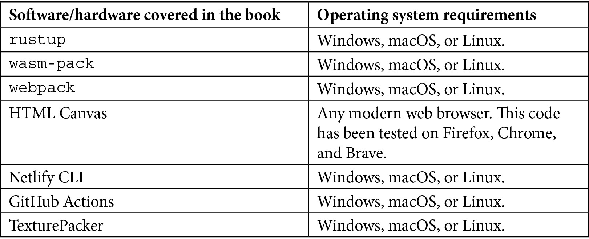

# 前言

Rust 编程语言连续 6 年在 Stack Overflow 上保持“最受欢迎”的技术排名，而 JavaScript 则连续 9 年成为最常用的编程语言，因为它在所有网络浏览器上运行（[`bit.ly/3JBg4ms`](https://bit.ly/3JBg4ms)）。现在，多亏了 WebAssembly（或 Wasm），您可以在无处不在的平台中使用您喜欢的语言。本书是一本易于遵循的参考书，帮助您开发自己的游戏，教您所有关于游戏开发以及如何从头开始创建无尽跑酷游戏的知识。您将从在浏览器窗口中绘制简单的图形开始，然后学习如何将主要角色移动到屏幕上。您还将创建游戏循环、渲染器等，所有这些都是在 Rust 中编写的。在屏幕上放置简单的形状后，您将通过添加精灵、声音和用户输入来增加挑战。随着您的进步，您将发现如何实现过程生成的世界，并添加音效和音乐。最后，您将学习如何保持您的 Rust 代码干净和有序，以便您可以继续实现新功能并将您的应用程序部署到网络上。到本书结束时，您将使用 Rust 编程语言构建了一个 2D 游戏，将其部署到网络上，并足以自信地开始构建自己的游戏。

# 本书面向的对象

这本游戏开发书籍是为对 Rust 感兴趣并希望创建和部署 2D 游戏到网络上的开发者而编写的。希望在没有 C++ 编程的情况下在 WebAssembly 平台上构建游戏的开发者，以及希望探索 WebAssembly 并与 JavaScript 网络开发者一起工作的开发者，也会发现这本书很有用。本书还将帮助 Rust 开发者通过使他们熟悉 WebAssembly 工具链，从服务器端迁移到客户端。假设您对 Rust 编程有一定的了解，但您不需要是专家。

# 本书涵盖的内容

*第一章*，*你好，WebAssembly*，为您搭建了第一个 WebAssembly 项目，解释了工具链，并在浏览器中运行了一个应用程序，绘制到我们将在这本书中使用的 HTML Canvas 上。

*第二章*，*绘制精灵*，通过向您展示如何将 `.png` 文件渲染到屏幕上来向您介绍我们的主要角色，红帽男孩。然后，我们将让红帽男孩通过动画和精灵表进行奔跑。

*第三章*，*创建游戏循环*，介绍了一个非常基本的游戏引擎，这样我们就可以以每秒 60 帧的速度让我们的角色在屏幕上四处移动。

*第四章*，*使用状态机管理动画*，描述了如何使用状态机和 Rust 类型状态模式让红帽男孩奔跑、滑动和跳跃。

*第五章*，*碰撞检测*，开始让游戏变得有趣，让红帽男孩撞到并跳过障碍物。我们将介绍轴对齐边界框，并对其进行调整以考虑透明度。

*第六章*，*创建无尽跑酷游戏*，将游戏从一个场景带到红帽男孩向右跑的场景，跳过程序生成的障碍物和平台，这些障碍物和平台可以持续到你玩不下去为止。

*第七章*，*音效与音乐*，展示了如何使用 Web Audio API 通过音效和吸引人的音乐让游戏获得真正的沉浸感。

*第八章*，*添加用户界面*，将 HTML 与画布集成以创建用户界面，重新构建游戏以使其适应。

*第九章*，*测试、调试和性能*，帮助我们为游戏编写一些自动化测试，并使用浏览器工具调查性能。

*第十章*，*持续部署*，将我们的游戏部署到网络上，让任何人都可以玩！

*第十一章*，*更多资源和下一步是什么？*，带我们了解如何为更大、更有雄心的游戏制定下一步计划。

# 要充分利用这本书

本书期望您对 Rust 有基本的了解，但不涵盖语法。它不期望您是专家；您不会编写任何宏或复杂的特性，所以即使是 Rust 速查表也足够了。本书的结构是一个教程，最好从头到尾完成。



本书中的代码使用 Rust 版本 1.57.0 进行了测试。大多数工具都将由`rust-webpack-template`自动安装。

**如果您正在使用这本书的数字版，我们建议您亲自输入代码或从书的 GitHub 仓库（下一节中有一个链接）获取代码。这样做将帮助您避免与代码复制粘贴相关的任何潜在错误。**

# 下载示例代码文件

您可以从 GitHub 下载本书的示例代码文件[`github.com/PacktPublishing/Game-Development-with-Rust-and-WebAssembly`](https://github.com/PacktPublishing/Game-Development-with-Rust-and-WebAssembly)。如果代码有更新，它将在 GitHub 仓库中更新。

我们还有其他来自我们丰富的书籍和视频目录的代码包，可在[`github.com/PacktPublishing/`](https://github.com/PacktPublishing/)找到。查看它们吧！

# 代码实战

本书的相关*代码实战*视频可在[`bit.ly/3uxXl4W`](https://bit.ly/3uxXl4W)查看。

# 下载彩色图片

我们还提供了一个包含本书中使用的截图和图表彩色图像的 PDF 文件。您可以从这里下载：[`static.packt-cdn.com/downloads/9781801070973_ColorImages.pdf`](https://static.packt-cdn.com/downloads/9781801070973_ColorImages.pdf)。

# 使用的约定

本书使用了多种文本约定。

`文本中的代码`: 这表示文本中的代码单词、数据库表名、文件夹名、文件名、文件扩展名、路径名、虚拟 URL、用户输入和 Twitter 昵称。以下是一个示例：“Cypress 通过`cy.request()`方法执行其大部分 API 测试，该方法作为对被测试的 Web 服务器的`GET`命令。”

代码块设置如下：

```rs
enum RedHatBoyState {
    Jumping,
    Running,
    Sliding,
}
```

当我们希望引起你对代码块中特定部分的注意时，相关的行或项目将以粗体显示：

```rs
impl RedHatBoyContext {
        pub fn update(mut self, frame_count: u8) -> 
        Self {
        ...
        self.position.x += self.velocity.x;
        self.position.y += self.velocity.y;
        if self.position.y > FLOOR {
            self.position.y = FLOOR;
        }
```

任何命令行输入或输出都应如下编写：

```rs
the trait `From<SlidingEndState>` is not implemented for `RedHatBoyStateMachine`
```

**粗体**: 这表示新术语、重要单词或你在屏幕上看到的单词——例如，菜单或对话框中的单词以**粗体**显示。以下是一个示例：“从 GUI 的任何测试启动中，用户将能够点击**添加新测试**按钮。”

小贴士或重要提示

看起来像这样。

# 联系我们

我们读者的反馈总是受欢迎的。

**一般反馈**: 如果你对此书的任何方面有疑问，请通过 customercare@packtpub.com 给我们发邮件，并在邮件主题中提及书籍标题。

**勘误**: 尽管我们已经尽一切努力确保内容的准确性，但错误仍然可能发生。如果你在此书中发现错误，我们将不胜感激，如果你能向我们报告这一点。请访问[www.packtpub.com/support/errata](http://www.packtpub.com/support/errata)并填写表格。

**盗版**: 如果你在网上以任何形式发现我们作品的非法副本，如果你能提供位置地址或网站名称，我们将不胜感激。请通过版权@packt.com 与我们联系，并在邮件主题中提及书籍标题。

**如果你有兴趣成为作者**: 如果你有一个你擅长的主题，并且你感兴趣的是撰写或为书籍做出贡献，请访问[authors.packtpub.com](http://authors.packtpub.com)。

# 分享你的想法

一旦你阅读了《使用 Rust 和 WebAssembly 进行游戏开发》，我们很乐意听听你的想法！请[点击此处直接进入此书的亚马逊评论页面](https://packt.link/r/1801070970)并分享你的反馈。

你的评论对我们和科技社区都很重要，并将帮助我们确保我们提供高质量的内容。
