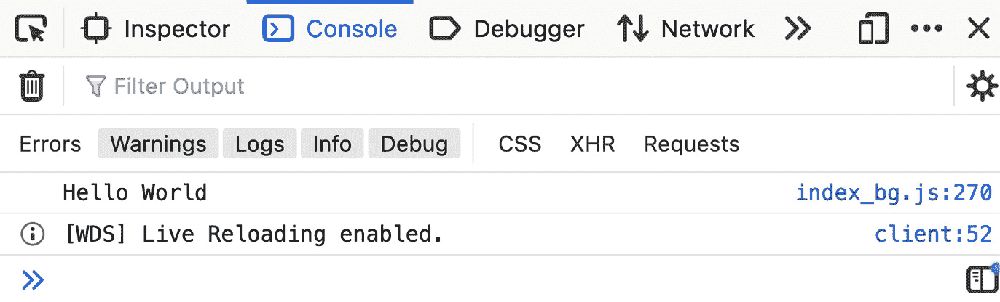
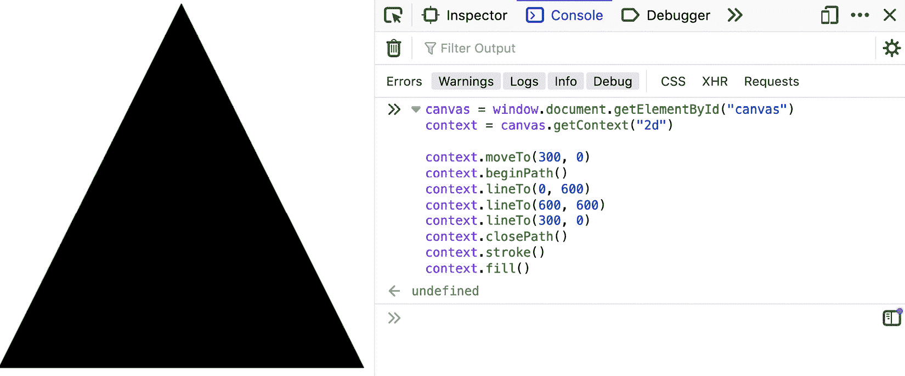
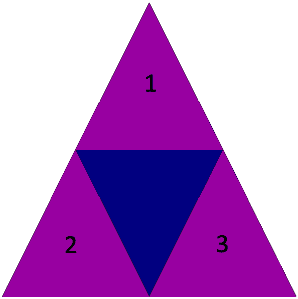
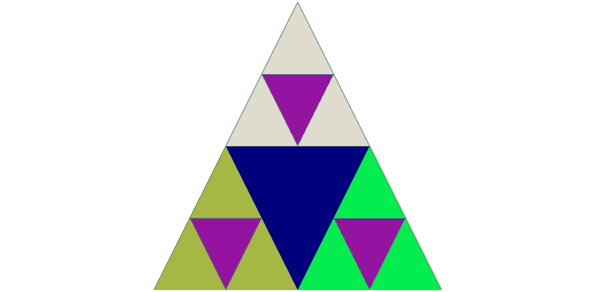
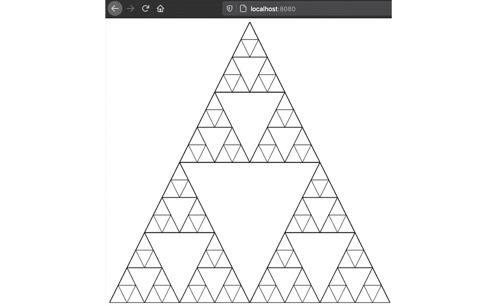
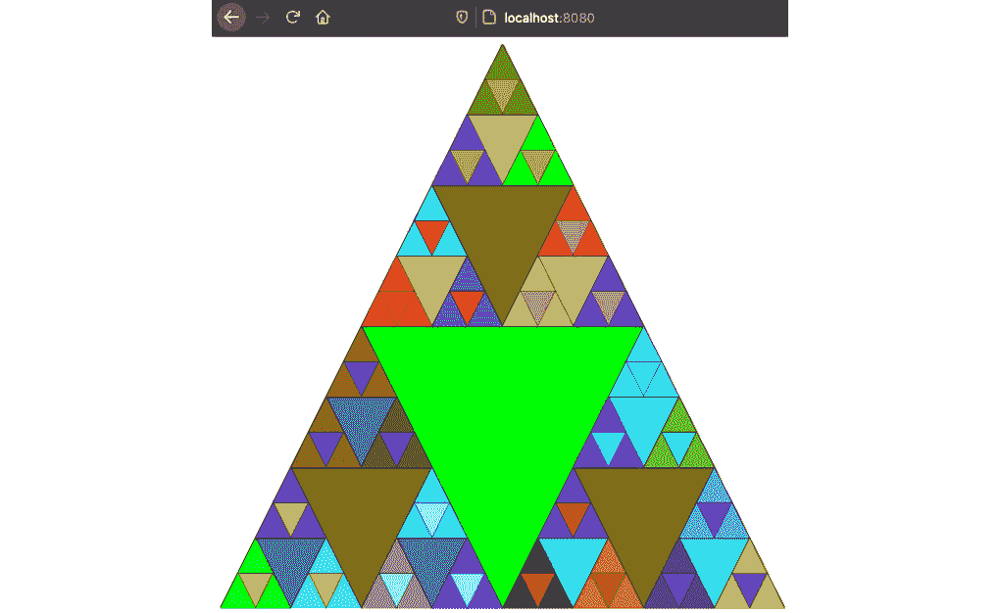

# *第一章*: 欢迎来到 WebAssembly

让我们直奔主题——如果你拿着这本书，你可能已经知道你喜欢 Rust，并且认为 **WebAssembly** 是将你的 Rust 程序部署到网页上的绝佳方式。好消息——你是对的！Rust 和 WebAssembly 是程序员天堂中的完美搭配，尽管 WebAssembly 仍处于早期阶段，但游戏开发是 WebAssembly 的理想候选者。我很高兴能引导你使用 Stack Overflow 的“最受欢迎”的语言 Rust 来构建网页游戏。

本章全部关于为你提供游戏开发旅程的工具。在本章中，我们将涵盖以下主题：

+   什么是 WebAssembly？

+   创建 Rust 和 WebAssembly 项目的骨架

+   将 JavaScript 代码转换为 Rust 代码

+   使用 HTML5 Canvas 绘制到屏幕上

# 技术要求

要跟随项目骨架，你需要安装 `rustup` 来安装 Rust 工具链。这可以在 [`rustup.rs/`](https://rustup.rs/) 找到。虽然你可以使用 `rustup` 工具之外的方式安装 Rust 和其各种工具链，但这并不简单，我这里不会记录它。你还需要一个用于编写 Rust 代码的编辑器，虽然你可以使用几乎任何带有 rust-analyzer 的编辑器，如果你是 Rust 编写的初学者，我推荐 Visual Studio Code 和可在 [`bit.ly/3tAUyH2`](https://bit.ly/3tAUyH2) 找到的 Rust 扩展。它很容易设置，并且开箱即用。

最后，你需要一个网络浏览器，在本章中，你需要对终端和 **Node.js** 有一定的了解。如果你遇到困难，本章的代码可以在 [`github.com/PacktPublishing/Game-Development-with-Rust-and-WebAssembly/tree/chapter_1`](https://github.com/PacktPublishing/Game-Development-with-Rust-and-WebAssembly/tree/chapter_1) 找到。整本书的最终代码在主分支 [`github.com/PacktPublishing/Game-Development-with-Rust-and-WebAssembly`](https://github.com/PacktPublishing/Game-Development-with-Rust-and-WebAssembly)。

查看以下视频，了解代码的实际应用：[`bit.ly/3qMV44E`](https://bit.ly/3qMV44E)

# 什么是 WebAssembly？

你选择了这本书（谢谢！）所以很可能会对 WebAssembly 有一些了解，但以防万一，让我们从 [`WebAssembly.org`](https://WebAssembly.org) 捕获一个定义：

"WebAssembly（简称 Wasm）是一种基于栈的虚拟机的二进制指令格式。Wasm 被设计为编程语言的便携式编译目标，使得部署在客户端和服务器应用程序的网页上成为可能。"

换句话说，**Wasm**是一种二进制格式，我们可以将其编译为其他语言，以便在浏览器中运行。这与将语言如 TypeScript 转换为 JavaScript 进行源到源编译或转译不同，这些语言在 JavaScript 环境中运行时仍然是 JavaScript。这些语言最终仍然是在运行 JavaScript，而 Wasm 是字节码。这使得下载更小，并且在运行时去除了解析和编译步骤，这可以带来显著的性能提升。但说真的——你使用 Rust 和 Wasm 并不是为了性能提升，这些提升也并不保证。你使用它是因为你喜欢 Rust。

没关系！

Rust 拥有出色的类型系统、优秀的开发者工具和出色的社区。虽然 WebAssembly 最初是为 C 和 C++设计的，但 Rust 是 WebAssembly 的绝佳语言，原因有很多，这些原因也是你喜爱 Rust 的原因。现在，对于 Web 存在的大部分时间来说，编写在浏览器中运行的应用程序意味着编写 JavaScript，而且多年来，JavaScript 已经发展成为一个适合该目的的现代语言。我并不是在这里告诉你，如果你喜欢 JavaScript，你应该停止使用它，但如果你热爱 Rust，你绝对应该开始编译为 Wasm 并在浏览器中运行应用程序。

重要提示

本书专注于使用 Rust 和 Wasm 制作基于 Web 的游戏，但你绝对可以在 Node.js 等服务器端环境中运行 Wasm 应用程序。如果你对此感兴趣，你可以查看 Mike Rourke 的书籍《Learn WebAssembly》，可在[`bit.ly/2N89prp`](https://bit.ly/2N89prp)找到，或者查看官方的`wasm-bindgen`指南，可在[`bit.ly/39WC63G`](https://bit.ly/39WC63G)找到。

重要提示

本书假设你对 Rust 有一定的了解，尽管你不需要成为专家。如果你在任何时候对 Rust 的概念感到困惑，我强烈建议你停下来查看*"这本书"*，《Rust 编程语言》，可在[`doc.rust-lang.org/book/`](https://doc.rust-lang.org/book/)免费获取。

因此，既然我已经说服你去做你本来就要做的事情，让我们来看看你需要的一些工具，以便用 Rust 编写 Web 游戏：

+   `rustup`：如果你正在编写 Rust 代码，那么你很可能已经在使用`rustup`了。如果不是，你应该使用它，因为它是安装 Rust 的标准方式。它允许轻松安装工具链、Rust 编译器，甚至可以启动 Rust 文档。你需要它来安装**Wasm 工具链**，你可以从之前的链接中安装它。本书中的代码已在 Rust 版本 1.57.0 上进行了测试。

+   **Node.js**: 我知道——我承诺我们会用 Rust 来编写！我们会的，但这仍然是一个 Web 应用程序，你将使用 Node.js 来运行应用程序。我建议安装当前的长期支持版本（写作时为**16.13.0**）。较老的 Node.js 版本可能无法与包创建工具按预期工作。如果你使用 Ubuntu Linux，在使用 Debian 发行版时要特别小心，因为它现在安装了一个非常旧的版本。如果有疑问，请使用管理多个版本的工具，如 Linux/Mac 的**Node Version Manager**（**nvm**）工具或 Windows 的相应 nvm-windows 工具，以确保你使用的是长期发布版本。我本人使用 asdf 工具（[`asdf-vm.com/`](https://asdf-vm.com/)）来管理多个版本，尽管我不太推荐那些之前没有使用过版本管理工具的人使用它。

+   **webpack**: 我们将使用 webpack 来打包我们的应用程序以供发布并运行开发服务器。大多数时候，你不必担心它，但它是存在的。

    重要提示

    当前模板使用 webpack 4。确保在查找文档时检查这一点。

+   `wasm-pack`: 这是一个用于构建由 Rust 生成的 WebAssembly 代码的 Rust 工具。像 webpack 一样，大多数时候你不会知道它的存在，因为它由 webpack 管理，你的 Rust 应用程序将主要由 Rust 构建工具管理。

+   `wasm-bindgen`: 这是你需要了解的一个 crate，以便编写由 Rust 生成的 WebAssembly 代码。WebAssembly 的一个限制是，你不能访问`wasm-bindgen`创建的绑定以及调用 JavaScript 函数所需的样板代码，同时它还提供了创建反向绑定的工具，以便 JavaScript 代码可以回调到 Rust 代码。随着我们阅读本书，我们将详细介绍`wasm-bindgen`的工作原理，但为了避免现在就陷入细节，你可以将其视为一个库，用于从 Rust 代码中调用 JavaScript。

+   `web-sys`: 这是一个由许多预生成的绑定组成的 crate，使用`wasm-bindgen`为 Web 创建。我们将使用`web-sys`来调用浏览器 API，如 canvas 和`requestAnimationFrame`。本书假设您至少对 Web 开发有一定的了解，但不需要在这个领域有专业知识，实际上，Rust 游戏开发的一个优点就是我们只需将浏览器视为一个平台库，在上面调用函数。`web-sys` crate 意味着我们不必自己创建所有这些绑定。

+   `Canvas`：HTML Canvas 是一个 `<canvas>` 浏览器元素，例如标题或段落，但它允许你直接在其上绘制。这就是我们制作视频游戏的方法！有许多方法可以将内容绘制到画布上，包括 `WebGL` 和 `WebGPU`，但我们将使用此项目的大部分内置 Canvas API。虽然这不是制作游戏的绝对最快方式，但对于学习目的来说足够快，并且避免了向我们的技术栈添加更多技术。

最后，在搜索 `web-sys`、`web-bindgen` 或其他用于 WebAssembly 的 Rust 包时，你可能会遇到对 `cargo-web` 和 `stdweb` 的引用。虽然这两个项目对于 Rust 作为 WebAssembly 源的开发很重要，但它们自 2019 年以来都没有更新，可以安全忽略。现在我们已经知道了我们将使用的工具，让我们开始构建我们的第一个 Rust 项目。

# 一个 Rust 项目骨架

重要提示

这些说明是基于撰写时 `rust-webpack-template` 的状态。在阅读此内容时，它可能已经发生变化，所以请密切关注我们所做的更改。如果它们没有意义，请检查 `wasm-pack` 的文档，并使用你的最佳判断。

到目前为止，我将假设你已经安装了 `rustup` 和 Node.js。如果你还没有安装，请按照你平台的说明进行安装，然后按照以下步骤操作：

1.  **初始化项目**

让我们先为你的应用程序创建一个项目骨架，它将是 Rust Wasm 小组的 Rust webpack 模板。它可以在 GitHub 上找到 [`github.com/rustwasm/rust-webpack-template`](https://github.com/rustwasm/rust-webpack-template)，但你不需要下载它。相反，使用 `npm init` 来创建它，如下所示：

```rs
mkdir walk-the-dog
cd walk-the-dog
npm init rust-webpack
```

你应该看到如下内容：

```rs
npx: installed 17 in 1.941s
 🦀 Rust + 🕸 WebAssembly + Webpack = ❤
Installed dependencies ✅
```

恭喜！你已经创建了你的项目。

1.  **安装依赖项**

你可以使用 `npm` 安装依赖项：

```rs
npm install
```

重要提示

如果你更喜欢使用 `yarn`，你可以，除了 `npm init` 命令之外。我将在这本书中使用 `npm`。

1.  **运行服务器**

安装完成后，你现在可以使用 `npm run start` 运行开发服务器。你可能看到如下错误：

```rs
ℹ  Installing wasm-pack
Error: Rust compilation.
at ChildProcess.<anonymous> (/walk-the-dog/node_modules/@wasm-tool/wasm-pack-plugin/plugin.js:221:16)
at ChildProcess.emit (events.js:315:20)
at maybeClose (internal/child_process.js:1048:16)
at Socket.<anonymous> (internal/child_process.js:439:11)
at Socket.emit (events.js:315:20)
at Pipe.<anonymous> (net.js:673:12)
```

如果发生这种情况，你需要手动安装 `wasm-pack`。

1.  **安装 wasm-pack**

在 Linux 和 macOS 系统上，`wasm-pack` 可以通过一个简单的 cURL 脚本安装：

```rs
curl https://rustwasm.github.io/wasm-pack/installer/init.sh -sSf | sh
```

Windows 用户有一个单独的安装程序，可以在 [`rustwasm.github.io`](https://rustwasm.github.io) 找到。

1.  **运行服务器 – 第二部分**

现在 `wasm-pack` 已经安装，webpack 可以使用它，你应该能够运行应用程序：

```rs
npm run start
```

当你看到 `｢``wdm``｣``: 编译成功。` 时，你可以在 `http://localhost:8080` 浏览你的应用程序。好吧，是的，它是一个空白页面，但如果你打开开发者工具控制台，你应该会看到以下内容：



图 1.1 – Hello WebAssembly！

你已经将应用程序在浏览器中运行，但 Rust 生态系统更新速度比你所使用的模板能够跟上得更快。

1.  **更新 Rust 版本**

最新的 Rust 版本，包含最新的 Rust 习惯用法和约定，是 2021 版。这在生成的 `Cargo.toml` 文件中的 `package` 部分进行了更改，如下所示：

```rs
# You must change these to your own details.
[package]
name = "rust-webpack-template"
description = "Walk the Dog - the game for the Rust Games with WebAssembly book"
version = "0.1.0"
authors = ["Eric Smith <paytonrules@gmail.com>"]
categories = ["wasm"]
readme = "README.md"
edition = "2021"
```

这里只更改了 `edition` 字段。

1.  **更新依赖**

除非你恰好在模板更新时下载了它，否则生成的 `Cargo.toml` 文件中的依赖项不会是最新的和最好的。由于我们两个都不那么幸运，你将需要打开该文件并修改依赖项到以下内容。请注意，省略号只是用来标记文件中的空白，并不需要输入：

```rs
wasm-bindgen = "0.2.78"
...
[dependencies.web-sys]
version = "0.3.55"
...
[dev-dependencies]
wasm-bindgen-test = "0.3.28"
futures = "0.3.18"
js-sys = "0.3.55"
wasm-bindgen-futures = "0.4.28"
```

这些是我写这本书时使用的版本。如果你喜欢冒险，你可以去 [`crates.io`](http://crates.io) 找到每个依赖项的最新版本，这正是我会做的，但我是个受苦的贪吃鬼。你可能比我聪明，所以你会使用这里指定的版本，以确保示例代码能正常工作。

1.  **更新 console_error_panic_hook**

`console_error_panic_hook` 是在 WebAssembly 应用程序开发期间非常实用的 crate。它将 Rust 代码中的 panic 转发到控制台，以便你可以调试它们。当前的模板试图通过功能标志将其隐藏起来，但不幸的是，有一个错误，它不起作用。请记住仔细检查你生成的代码；如果它看起来不像我在这里复制的样子，那么错误可能已经被修复，但在此期间，请删除以下代码（仍然在 `Cargo.toml` 中）。

```rs
[target."cfg(debug_assertions)".dependencies]
console_error_panic_hook = "0.1.5"
```

然后将它添加到 [dependencies] 部分，在 wasm-bindgen 下方是一个好位置：

```rs
console_error_panic_hook = "0.1.7"
```

然后，我们将将其作为一个条件依赖项，这样你就不需要在发布构建时部署它，但到目前为止，这已经足够进步了。谁还愿意继续与 `config` 文件纠缠呢？我想在屏幕上绘制东西！

小贴士

虽然这个应用程序使用一个 `npm init` 模板来创建自身，但你也可以使用它的输出创建一个 `cargo generate` 模板，这样你就不必每次创建应用程序时都重做这些更改，只需创建一个 `git` 仓库即可。当然，如果你这么做，你将落后于 `rust-webpack` 模板的更新，所以这是一个权衡。如果你对使用 `cargo generate` 来创建自己的模板感兴趣，你可以在这里找到更多信息：[`bit.ly/3hCFWTs`](https://bit.ly/3hCFWTs)。

# 绘制到画布上

要用 Rust 编写我们的游戏，我们需要在屏幕上绘制图形，为此，我们将使用 HTML Canvas 元素和 2D 上下文。Canvas 提供了一个直接在屏幕上绘制的 API，无需了解 WebGL 或使用外部工具。虽然这不是世界上速度最快的科技，但对于我们的小型游戏来说，它完全适用。让我们开始将我们的 Rust 应用从 *"Hello World"* 转换为能够绘制 **Sierpiński 三角形** 的应用程序。

重要提示

Sierpiński 三角形是一种通过绘制一个三角形，然后将该三角形细分为四个三角形，接着再将这些三角形细分为四个三角形，以此类推而创建的分形图像。听起来很复杂，但就像许多分形一样，它仅由几行数学公式构成：

1.  **添加画布**

Canvas 是一个让我们可以自由绘制的 HTML 元素，使其成为游戏的理想选择。实际上，在撰写本文时，Adobe Flash 已经正式退役，如果你在网上看到一款游戏，无论是 2D 还是 3D，它都是在 `canvas` 元素中运行的。Canvas 可以用于游戏中的 WebGL 或 WebGPU，WebAssembly 也会与这些技术很好地配合，但它们超出了本书的范围。我们将使用内置的 Canvas 2D API 和其 2D 上下文。这意味着你不需要学习着色语言，我们能够非常快速地将图像显示在屏幕上。这也意味着，如果你需要的话，你可以在 **Mozilla 开发者网络**（**MDN**）Web 文档网站上找到优秀的文档：[`mzl.la/3tX5qPC`](https://mzl.la/3tX5qPC)。

要在画布上绘制图形，我们需要将其添加到网页中。打开 `static/index.html` 文件，在 `<body>` 标签下添加 `<canvas id="canvas" tabindex="0" height="600" width="600">您的浏览器不支持 canvas。</canvas>`。宽度和高度相当随意，但看起来现在很合适。"您的浏览器不支持 canvas。" 这条消息将在不支持 HTML Canvas 的浏览器上显示，但现在已经很少见了。

重要提示

确保不要删除 `<script>` 标签。它正在运行你在这个项目中构建的 JavaScript 和 WebAssembly！

1.  **清理错误**

最后，我们可以开始编写一些 Rust 代码了！好吧，我们至少可以删除一些 Rust 代码。在 `src/lib.rs` 文件中，你会看到一个名为 `main_js()` 的函数，其代码如下：

```rs
// This provides better error messages in debug mode.
// It's disabled in release mode so it doesn't bloat 
   up the file size.
    #[cfg(debug_assertions)]
    console_error_panic_hook::set_once();
```

你可以继续删除注释和 `[cfg(debug_annotations)]` 注解。目前，我们将保留它在构建中运行，并在准备生产时使用功能标志将其移除。

重要提示

如果你编辑器中出现了错误，说 `console::log_1(&JsValue::from_str("Hello world!"))` 代码缺少一个不安全块，不要担心——这个错误是错误的。不幸的是，这是 rust-analyzer 中的一个错误，已经在这次问题中得到了解决：[`bit.ly/3BbQ39m`](https://bit.ly/3BbQ39m)。你会在任何使用底层过程宏的东西上看到这个错误。如果你使用的编辑器支持实验性设置，你可能能够解决这个问题；检查 `rust-analyzer.experimental.procAttrMacros` 设置。如果有疑问，请检查 `npm run start` 的输出，因为这是编译器错误的更准确来源。

小贴士

如果你偏离这本书并决定部署，请转到 *第十章*，*持续部署*，学习如何在发布模式下通过功能标志隐藏该功能，这样你就不需要将不需要的代码部署到生产环境中。

删除这段代码将在应用程序启动时移除 `warning: Found 'debug_assertions' in 'target.'cfg(...)'.dependencies'.` 消息。此时，你可能已经注意到我没有告诉你更改后要重新启动服务器，这是因为 `npm start` 运行 `webpack-dev-server`，它会自动检测更改，然后重新构建并刷新应用程序。除非你正在更改 webpack 配置，否则你不需要重新启动。

## 当前代码

到目前为止，我一直都在告诉你该做什么，而你一直在盲目地做，因为你像一位好读者一样跟随着。你非常勤奋，虽然有点过于信任，但现在该看看当前源代码，看看我们的 WebAssembly 库里到底有什么。首先，让我们从 `use` 指令开始。

```rs
use wasm_bindgen::prelude::*;
use web_sys::console;
```

第一个导入是 `wasm_bindgen` 的 `prelude`。这会引入你很快就会看到的宏，以及一些对于编写 Web Rust 非常必要的类型。幸运的是，这并不多，而且不应该过多地污染命名空间。

重要提示

使用 `*` 语法并从给定的模块导入所有内容。如果模块有很多导出的名称，你现在在你的项目中也有这些相同的名称，并且在编码时并不明显。例如，如果 `wasm_bindgen::prelude` 中有一个名为 `add` 的函数，而你命名空间中也有一个名为 `add` 的函数，它们就会冲突。你可以通过在调用函数时使用显式命名空间来解决这个问题，但为什么要一开始就使用 `*` 呢？按照惯例，许多 Rust 包都有一个名为 `prelude` 的模块，可以通过 `*` 导入以方便使用；其他模块应该使用它们的完整名称导入。

另一个重要的是 `web_sys::console`，它从 `web_sys` 中引入了 `console` 命名空间，而 `web_sys` 又模仿了 JavaScript 中的 `console` 命名空间。现在是详细讨论这两个模块功能的好时机。我之前已经说过，但可能需要重复一遍 —— `wasm_bindgen` 提供了绑定 JavaScript 函数的能力，这样你就可以在 WebAssembly 中调用它们，并且可以将你的 WebAssembly 函数暴露给 JavaScript。又是那种语言，我们通过编写 Rust 来试图避免的语言，但在这里我们无法避免，因为我们是在浏览器中工作的。

实际上，WebAssembly 的一项限制是它不能操作 DOM，这是一个比较委婉的说法，意思是它不能改变网页。它能做的是调用 JavaScript 中的函数，而这些函数再去做实际的工作。此外，JavaScript 对你的 WebAssembly 类型一无所知，所以任何传递给 JavaScript 对象的数据都会被打包到共享内存中，然后由 JavaScript 取出，以便将其转换为它理解的形式。这需要编写大量的重复代码，而 `wasm-bindgen` crate 就是为了解决这个问题而存在的。稍后，我们将使用它来将我们自己的自定义绑定绑定到第三方 JavaScript 代码上，但已经内置在浏览器中的所有函数，比如 `console.log` 呢？这就是 `web-sys` 发挥作用的地方。它使用 `wasm-bindgen` 来绑定浏览器环境中的所有函数，这样你就不需要手动指定它们。可以把它想象成一个辅助 crate，它会说：“是的，我知道你需要所有这些函数，所以我为你创建了它们。”

因此，总结一下，`wasm-bindgen` 给你提供了在 WebAssembly 和 JavaScript 之间通信的能力，而 `web-sys` 包含了大量预先创建的绑定。如果你特别感兴趣于了解 WebAssembly 和 JavaScript 之间的调用是如何工作的，可以查看 Lin Clark 的这篇文章，它详细解释了这一点，并且配有图片：[`hacks.mozilla.org/2018/10/calls-between-javascript-and-webassembly-are-finally-fast-%F0%9F%8E%89/`](https://hacks.mozilla.org/2018/10/calls-between-javascript-and-webassembly-are-finally-fast-%F0%9F%8E%89/)。

### 小型分配器

在使用语句之后，你会看到一个关于 `wee_alloc` 功能的注释块，这是一个比默认 Rust 分配器使用更少内存的 WebAssembly 分配器。我们没有使用它，并且在 `Cargo.toml` 文件中已经禁用了它，所以你可以从源代码和 `Cargo.toml` 中删除它。

### 主函数

最后，我们来到了程序的主体部分：

```rs
#[wasm_bindgen(start)]
pub fn main_js() -> Result<(), JsValue> {
```

`wasm_bindgen(start)` 注解导出 `main_js` 以便它可以被 JavaScript 调用，而 `start` 参数标识它是程序的起点。如果你好奇，可以查看 `pkg/index_bg.wasm.d.ts` 来看看它生成了什么。你还会想注意返回值，`Result`，其中错误类型可以是 `JsValue`，它代表 JavaScript 拥有的对象，而不是 Rust。

在这一点上，你可能开始想知道你将如何跟踪 JavaScript 和 Rust 的区别，我建议你现在不要过于担心这个问题。有很多术语冒了出来，而且你不可能全部记住；只需让它在那里游荡，当它再次出现时，我会再次解释。`JsValue` 只是 Rust 代码中的一个代表 JavaScript 对象。

最后，让我们看看内容：

```rs
console_error_panic_hook::set_once();
// Your code goes here!
console::log_1(&JsValue::from_str("Hello world!"));
Ok(())
```

第一行设置了 panic 钩子，这意味着任何 panic 都会被重定向到网页浏览器的控制台。你将需要它来进行调试，最好将其放在程序的开始部分。我们这一行，我们的 *Hello World*，是 `console::log_1(&JsValue::from_str("Hello world!"));`。这调用了 JavaScript 的 `console.log` 函数，但它使用的是 `log_1` 版本，因为 JavaScript 版本接受可变参数。这是在使用 `web-sys` 时会反复出现的事情，JavaScript 支持 `varargs` 而 Rust 不支持。因此，`web-sys` 模块中创建了多种变体来匹配替代方案。如果你期望的 JavaScript 函数不存在，那么查看 Rust 的 `web-sys` 文档（[`bit.ly/2NlRmOI`](https://bit.ly/2NlRmOI)），看看是否有类似但为处理多个参数而构建的版本。

小贴士

一系列宏，用于解决一些常用函数（如 `log`）的问题，但这将是读者的练习。

最后，函数返回 `Ok(())`，这是 Rust 程序的典型做法。现在我们已经看到了生成的代码，让我们用我们自己的方式来分析它。

## 绘制三角形

我们已经花费了很多时间深入研究我们目前拥有的代码，仅仅向控制台输出 *"Hello World"* 就已经足够多了。为什么我们不玩点有趣的东西，实际上在画布上画点东西呢？

我们将要模仿以下 JavaScript 代码在 Rust 中实现：

```rs
canvas = window.document.getElementById("canvas")
context = canvas.getContext("2d")
context.moveTo(300, 0)
context.beginPath()
context.lineTo(0, 600)
context.lineTo(600, 600)
context.lineTo(300, 0)
context.closePath()
context.stroke()
context.fill()
```

这段代码获取我们在 `index.html` 中放置的画布元素，获取其 2D 上下文，然后绘制一个黑色三角形。在上下文中绘制形状的一种方法是通过绘制线路径，然后描边，在这个例子中，填充它。你实际上可以在大多数浏览器内置的网页开发者工具中使用浏览器查看这个。这个截图来自 Firefox：



图 1.2 – 一个简单的画布三角形

让我们在 Rust 程序中做同样的事情。你会看到它有点…不同。从顶部快速添加一个 `use` 语句开始：

```rs
use wasm_bindgen::JsCast;
```

然后，用以下内容替换现有的 `main_js` 函数：

```rs
console_error_panic_hook::set_once();
let window = web_sys::window().unwrap();
let document = window.document().unwrap();
let canvas = document
    .get_element_by_id("canvas")
    .unwrap()
    .dyn_into::<web_sys::HtmlCanvasElement>()
    .unwrap();
let context = canvas
    .get_context("2d")
    .unwrap()
    .unwrap()
    .dyn_into::<web_sys::CanvasRenderingContext2d>()
    .unwrap();
context.move_to(300.0, 0.0); // top of triangle
context.begin_path();
context.line_to(0.0, 600.0); // bottom left of triangle
context.line_to(600.0, 600.0); // bottom right of triangle
context.line_to(300.0, 0.0); // back to top of triangle
context.close_path();
context.stroke();
context.fill();
Ok(())
```

有一些明显的差异，但乍一看，你可能只是觉得 Rust 代码比 JavaScript 代码要“嘈杂”得多，这是真的。你可能会倾向于认为它不够优雅或者不够干净，但我认为这取决于个人观点。JavaScript 是一种动态类型语言，这很明显。它忽略了 `undefined` 和 `null`，如果任何值不存在，它可能会崩溃。它使用鸭子类型来调用上下文中的所有函数，这意味着如果函数存在，它就会简单地调用它；否则，它会抛出异常。

Rust 代码采取了一种非常不同的方法，这种方法更倾向于显式性和安全性，但代价是代码有额外的噪声。在 Rust 中，当你对结构体调用方法时，你必须更加显式，这就是为什么需要类型转换，你必须承认 `null` 或失败的 `Result` 类型，这就是为什么有所有的 unwraps。我多年来一直在使用动态语言，包括 JavaScript，我非常喜欢它们。我确实非常喜欢它们，比写 C++ 更好，我发现 C++ 过于冗长，实际上并没有真正提供一些安全优势，但我认为通过一些调整，我们可以使 Rust 代码几乎和 JavaScript 一样优雅，而不会忽略异常和结果。

不谈我的牢骚，如果你还在运行程序，你会注意到一个小的细节——Rust 代码无法编译！这让我想到，当我们从 JavaScript 代码翻译到 Rust 代码时，我们需要覆盖的第一个问题。

### web-sys 和功能标志

`web-sys` 包大量使用功能标志来保持其大小。这意味着每次你想使用一个函数但该函数不存在时，你都需要检查它关联的功能标志，这可以在其文档中找到，并将其添加到 `Cargo.toml` 文件中。幸运的是，这有很好的文档记录，并且足够容易完成；我们甚至不需要重新启动服务器！

查看我们的错误，我们应该看到以下内容：

```rs
error[E0425]: cannot find function 'window' in crate 'web_sys'
--> src/lib.rs:18:27
|
18 | let window = web_sys::window().unwrap();
|                           ^^^^^^ not found in 'web_sys'
```

还有几个同类的错误，但这里我们看到的是 `window` 不在 `web_sys` 模块中。现在，如果你查看 `web-sys` 中 `window` 函数的文档，在 [`bit.ly/3ak3sAR`](https://bit.ly/3ak3sAR)，你会看到，是的，它确实存在，但有一个消息：“此 API 需要以下 crate 功能被激活：Window”。

打开 `cargo.toml` 文件，查找 `dependencies.web-sys`。你会看到它有一个 `features` 条目，其中只包含 `["console"]`；继续添加 `"Window"`、`"Document"`、`"HtmlCanvasElement"`、`"CanvasRenderingContext2d"` 和 `"Element"` 到这个列表中。为了明确，你不需要所有这些功能标志只是为了 `window` 函数；这是我们使用到的所有函数。

你会注意到项目会自动重新构建，并且应该能够成功构建。如果你在浏览器中查看，你会看到你自己的黑色三角形！让我们扩展它，并了解我们是如何做到这一点的。

小贴士

当您期望在 `web-sys` 上存在的函数不存在时，请去检查文档中的功能标志。

### DOM 交互

您会注意到，在获取上下文之后绘制三角形的函数与方法在 JavaScript 中看起来几乎相同——绘制线路径、描边和填充。与 DOM 交互的顶部代码看起来……不同。让我们分析一下这里发生了什么：

+   解包选项

获取 `Window` 只是在 `web-sys` 包中的一个函数，您在将 `Window` 功能添加到 `Cargo.toml` 时启用了它。然而，您会注意到它的末尾有 `unwrap`：

```rs
let window = web_sys::window().unwrap();
```

在 JavaScript 中，`window` 可以是 `null` 或 `undefined`，至少在理论上是这样，在 Rust 中，这被翻译成 `Option<Window>`。您可以看到 `unwrap` 被应用于 `window()`、`document()` 和 `get_element_by_id()` 的结果，因为它们都返回 `Option<T>`。

+   `dyn_into`

`dyn_into`究竟是什么意思？嗯，这个奇怪之处解释了 JavaScript 和 Rust 在类型处理方式上的差异。当我们使用 `get_element_by_id` 获取画布时，它返回 `Option<Element>`，而 `Element` 没有任何与画布相关的函数。在 JavaScript 中，您可以使用动态类型假设元素有 `get_context` 方法，如果您错了，程序将抛出异常。这与 Rust 的原则相悖；实际上，这是一个开发者方便的地方，可能是另一个开发者潜在错误的隐藏之处，因此为了使用 `Element`，我们必须调用 `dyn_into` 函数将其转换为 `HtmlCanvasElement`。这个方法是通过 `use wasm_bindgen::JsCast` 声明引入作用域的。

重要提示

注意，`HtmlCanvasElement`、`Document` 和 `Element` 都是在 `web-sys` 中需要添加的功能标志。

+   两次解包？

在调用 `get_context("2d")` 之后，我们实际上调用了两次 `unwrap`；这不是一个打字错误。实际情况是 `get_context` 返回一个 `Result<Option<Object>>`，所以我们两次解包它。这是一个游戏在失败时无法恢复的情况，所以 `unwrap` 是可以接受的，但如果您用 `expect` 替换它们，以便可以提供更清晰的错误信息，我并不会抱怨。

## 一个 Sierpiński 三角形

现在让我们来点真正的乐趣，绘制一个几级深的 Sierpiński 三角形。如果你愿意接受挑战，你可以在跟随这里提供的解决方案之前尝试自己编写代码。算法的工作方式是先绘制第一个三角形（你正在绘制的那个），然后绘制另外三个三角形，其中第一个三角形具有相同的顶点，但它的其他两个点位于原始三角形的每一边的中点。然后，在左下角绘制第二个三角形，其顶点位于左侧的中点，其右下角位于原始三角形底部的中点，其左下角位于原始三角形的左下角。最后，在原始三角形的右下角创建第三个三角形。这会在中间留下一个倒三角形形状的“洞”。这比解释起来更容易可视化，所以让我们看看一张图片？



图 1.3 – 一级 Sierpiński 三角形

每个编号的三角形都是已经绘制的。倒置的蓝色三角形是原始三角形留下的部分，因为我们没有覆盖它。

所以这是一个被细分成四个的三角形。现在，算法是递归的，它将每个三角形再次细分。所以，二级深，它看起来像这样：



图 1.4 – 二级 Sierpiński 三角形

注意，它**不会**细分中心倒置的三角形，只会细分你创建的三个紫色三角形。实际上，所有点朝下的三角形只是“快乐的意外”，让形状看起来很酷。现在，你已经有足够的知识来绘制自己的 Sierpiński 三角形了，有一个例外——你应该在上下文中移除 `fill` 语句。否则，所有三角形都会被填充成黑色，你将无法看到它们。试试看吧。

### 绘制 Sierpiński 三角形

那么，你尝试了吗？不，我也不会；我想我们有很多共同之处。要开始创建 Sierpiński 三角形，让我们用三角形函数替换硬编码的三角形。这是 `draw_triangle` 的第一次尝试：

```rs
fn draw_triangle(context: &web_sys::CanvasRenderingContext2d,     points: [(f64, f64); 3]) {
        let [top, left, right] = points;
        context.move_to(top.0, top.1);
        context.begin_path();
        context.line_to(left.0, left.1);
        context.line_to(right.0, right.1);
        context.line_to(top.0, top.1);
        context.close_path();
        context.stroke();
}
```

与我们最初开始的硬编码版本相比，有一些小的变化。函数接受对上下文的引用和一个包含三个点的列表。点本身由元组表示。我们还去掉了 `fill` 函数，所以我们只有一个空三角形。将内联的 `draw_triangle` 替换为函数调用，它应该看起来像这样：

```rs
let context = canvas
    .get_context("2d")
    .unwrap()
    .unwrap()
    .dyn_into::<web_sys::CanvasRenderingContext2d>()
    .unwrap();
draw_triangle(&context, [(300.0, 0.0), (0.0, 600.0), (600.0, 600.0)]);
```

现在你正在绘制一个空三角形，你就可以开始绘制递归三角形了。与其从递归开始，不如先绘制三个更多的三角形。第一个将具有相同的顶点和两个侧面点：

```rs
draw_triangle(&context, [(300.0, 0.0), (150.00, 300.0), (450.0, 300.0)]);
```

注意，第三个元组在`300.0`和`600.0`之间有一个中点，而不是在`0`和`600.0`之间，因为三角形的顶点位于其他两个点的中点之间。还要注意，随着向下移动，y 坐标会变大，这与许多 3D 系统相反。现在，让我们添加左下角和右下角的三角形：

```rs
draw_triangle(&context, [(150.0, 300.0), (0.0, 600.0), (300.0, 600.0)]);
draw_triangle(&context, [(450.0, 300.0), (300.0, 600.0), (600.0, 600.0)]);
```

你的三角形应该看起来像这样：


图 1.5 – 你的三角形

到目前为止，你应该开始看到一种模式，我们可以开始将硬编码的三角形转换成算法。我们将创建一个名为`sierpinski`的函数，它接受上下文、三角形尺寸和深度函数，这样我们就可以只绘制我们想要的三角形数量，而不是无限绘制并导致浏览器崩溃。然后，我们将那些调用该函数的函数移动到该函数中：

```rs
fn sierpinski(context: &web_sys::CanvasRenderingContext2d, points: [(f64, f64); 3], depth: u8) {
    draw_triangle(&context, [(300.0, 0.0), (0.0, 600.0), 
     (600.0, 600.0)]);
    draw_triangle(&context, [(300.0, 0.0), (150.00, 300.0), 
     (450.0, 300.0)]);
    draw_triangle(&context, [(150.0, 300.0), (0.0, 600.0), 
     (300.0, 600.0)]);
    draw_triangle(&context, [(450.0, 300.0), (300.0, 
     600.0), (600.0, 600.0)]);
}
```

此函数目前忽略除上下文之外的所有内容，但你可以将`main_js`中的那四个`draw_triangle`调用替换为对`sierpinski`的调用：

```rs
sierpinski(&context, [(300.0, 0.0), (0.0, 600.0), (600.0, 600.0)], 2);
```

现在非常重要，你只发送深度为`2`，这样图像在进展过程中将继续保持相同。将这个调用视为一个原型单元测试，确保我们在重构过程中行为没有改变。现在，在`sierpinski`中，取第一个三角形并让它使用传入的点：

```rs
fn sierpinski(context: &web_sys::CanvasRenderingContext2d, points: [(f64, f64); 3], depth: u8) {
    draw_triangle(&context, points);
    ...
```

然后，在绘制三角形之后，减少深度值一个单位，并查看它是否仍然大于`0`。然后，绘制剩余的三角形：

```rs
...
let depth = depth - 1;
if depth > 0 {
    draw_triangle(&context, [(300.0, 0.0), (150.00, 300.0), 
     (450.0, 300.0)]);
    draw_triangle(&context, [(150.0, 300.0), (0.0, 600.0), 
     (300.0, 600.0)]);
    draw_triangle(&context, [(450.0, 300.0), (300.0, 
     600.0), (600.0, 600.0)]);
}
```

现在，为了完成递归，你可以将所有的`draw_triangle`调用替换为对`sierpinski`的调用：

```rs
if depth > 0 {
    sierpinski(
        &context,
        [(300.0, 0.0), (150.00, 300.0), (450.0, 300.0)],
        depth,
    );
    sierpinski(
        &context,
        [(150.0, 300.0), (0.0, 600.0), (300.0, 600.0)],
        depth,
    );
    sierpinski(
        &context,
        [(450.0, 300.0), (300.0, 600.0), (600.0, 600.0)],
        depth,
    );
    }
```

到目前为止一切顺利——你应该仍然看到一个被细分成四个三角形的三角形。最后，我们可以实际上计算原始三角形上每条线的中点，并使用这些点来创建递归三角形，而不是硬编码它们：

```rs
let [top, left, right] = points;
if depth > 0 {
    let left_middle = ((top.0 + left.0) / 2.0, (top.1 + 
     left.1) / 2.0);
    let right_middle = ((top.0 + right.0) / 2.0, (top.1 + 
     right.1) / 2.0);
    let bottom_middle = (top.0, right.1);
    sierpinski(&context, [top, left_middle, right_middle], 
     depth);
    sierpinski(&context, [left_middle, left, 
     bottom_middle], depth);
    sierpinski(&context, [right_middle, bottom_middle, 
     right], depth);
}
```

计算线段中点的方法是取每端的*x*和*y*坐标，将它们相加，然后除以二。虽然前面的代码可以工作，但让我们通过编写一个新函数来使其更清晰，如下所示：

```rs
fn midpoint(point_1: (f64, f64), point_2: (f64, f64)) -> (f64, f64) {
    ((point_1.0 + point_2.0) / 2.0, (point_1.1 + point_2.1) 
    / 2.0)
}
```

现在，我们可以在前面的函数中使用它，以增加清晰度：

```rs
if depth > 0 {
    let left_middle = midpoint(top, left);
    let right_middle = midpoint(top, right);
    let bottom_middle = midpoint(left, right);
    sierpinski(&context, [top, left_middle, right_middle], 
     depth);
    sierpinski(&context, [left_middle, left, 
     bottom_middle], depth);
    sierpinski(&context, [right_middle, bottom_middle, 
     right], depth);
}
```

如果你一直在跟随，你应该确保你仍然显示一个有四个内部三角形的三角形，以确保你没有犯任何错误。现在，进行重大揭秘——将原始`Sierpinski`调用中的深度更改为`5`：

```rs
sierpinski(&context, [(300.0, 0.0), (0.0, 600.0), (600.0, 600.0)], 5);
```

你应该看到一个像这样的三角形递归绘制：



图 1.6 – 三角形的递归绘制

看起来不错！但那些我们在原始图中看到的颜色呢？它们使它变得更加有趣。

### 当库不兼容时

此图像的早期示例在每个递归层中用不同的随机颜色填充了三角形。因此，第一个三角形是一种颜色，第三个和第四个是另一种颜色，接下来的九个又是另一种颜色，以此类推。这使得图像更加有趣，*并且*提供了一个很好的例子，说明当库不完全兼容 WebAssembly 时应该怎么做。

要创建一个随机颜色，我们需要一个随机数生成器，而这不是标准库的一部分，而是在一个 crate 中找到的。你可以通过更改`Cargo.toml`文件将其作为依赖项添加：

```rs
console_error_panic_hook = "0.1.7"
rand = "0.8.4"
```

当你这样做时，你会得到一个看起来像以下内容的编译器错误（尽管你的消息可能略有不同）：

```rs
error: target is not supported, for more information see: https://docs.rs/getrandom/#unsupported-targets
   --> /usr/local/cargo/registry/src/github.com-
   1ecc6299db9ec823/getrandom-0.2.2/src/lib.rs:213:9
    |
213 | /         compile_error!("target is not supported, for more information see: \
214 | |                         https://docs.rs/getrandom/#unsupported-targets");
```

这是一个递归依赖项，在这种情况下是`getrandom`，在 WebAssembly 目标上无法编译的情况。在这种情况下，这是一个非常有帮助的错误信息，如果你点击链接，你将在文档中找到解决方案。具体来说，你需要为`getrandom`启用`js`功能标志。回到你的`Cargo.toml`文件，并添加以下内容：

```rs
getrandom = { version = "0.2.3", features = ["js"] }
```

这添加了带有`js`功能的`getrandom`依赖项，你的代码将开始重新编译。从这个例子中我们可以吸取的教训是，并非每个 Rust crate 都能在 WebAssembly 目标上编译，当这种情况发生时，你需要检查文档。

小贴士

当一个 crate 无法*缓慢*编译时，阅读错误信息并遵循指示。当你感到沮丧时，很容易忽略构建中断的原因。

### 随机颜色

现在我们已经让随机 crate 与我们的项目一起构建，让我们在绘制三角形时将其颜色改为随机颜色。为此，我们将在绘制三角形之前设置`fillStyle`的颜色，并添加一个`fill`命令。这通常是`Context2D` API 的工作方式。你设置上下文的状态，然后使用该状态执行命令。这需要一点时间来适应，但你会习惯的。让我们将`color`作为三个`u8`元组的参数添加到`draw_triangle`中：

```rs
fn draw_triangle(
    context: &web_sys::CanvasRenderingContext2d,
    points: [(f64, f64); 3],
    color: (u8, u8, u8),
) {
```

重要提示

颜色在这里表示为三个组件，红色、绿色和蓝色，每个值可以从`0`到`255`。我们在这章中使用元组是因为我们可以快速取得进展，但如果这开始让你感到烦恼，你可以创建合适的`struct`s。

现在，由于`draw_triangle`需要一个颜色，我们的应用程序无法编译。让我们转到`sierpinski`函数，并给它传递一个颜色。我们将把颜色发送到`sierpinski`函数，而不是在那里生成它，这样我们就可以在每一层得到一个颜色。第一代将是一种纯色，然后第二代将都是一种颜色，然后第三代是第三种颜色，以此类推。所以让我们添加这个：

```rs
fn sierpinski(
    context: &web_sys::CanvasRenderingContext2d,
    points: [(f64, f64); 3],
    color: (u8, u8, u8),
    depth: u8,
) {
    draw_triangle(&context, points, color);
    let depth = depth - 1;
    let [top, left, right] = points;
    if depth > 0 {
        let left_middle = midpoint(top, left);
        let right_middle = midpoint(top, right);
        let bottom_middle = midpoint(left, right);
        sierpinski(&context, [top, left_middle, 
         right_middle], color, depth);
        sierpinski(&context, [left_middle, left, 
         bottom_middle], color, depth);
        sierpinski(&context, [right_middle, bottom_middle, 
         right], color, depth);
    }
}
```

我将`color`作为第三个参数而不是第四个，因为我认为这样看起来更好。请记住将颜色传递给其他调用。最后，为了我们可以编译，我们将向初始的`sierpinski`调用发送一个颜色：

```rs
sierpinski(
    &context,
    [(300.0, 0.0), (0.0, 600.0), (600.0, 600.0)],
    (0, 255, 0),
    5,
);
```

由于这是一个 RGB 颜色，`(0, 255, 0)`代表绿色。现在，我们已经使代码编译成功，但它没有任何作用，所以让我们从原始调用向下工作，再次进入`sierpinski`函数。我们不仅传递颜色，还要创建一个新的元组，其中每个组件都有一个随机数。你需要在顶部的使用声明中添加`use rand::prelude::*;`。然后，在`sierpinski`函数中，在`if depth > 0`检查之后，添加以下代码：

```rs
let mut rng = thread_rng();
let next_color = (
    rng.gen_range(0..255),
    rng.gen_range(0..255),
    rng.gen_range(0..255),
);
...
sierpinski(
    &context,
    top, left_middle, right_middle],
    next_color,
    depth,
);
sierpinski(
    &context,
    [left_middle, left, bottom_middle],
    next_color,
    depth,
);
sierpinski(
    &context,
    [right_middle, bottom_middle, right],
    next_color,
    depth,
);
```

在深度检查内部，我们随机生成`next_color`，然后将其传递给所有的递归`sierpinski`调用。但当然，我们的输出仍然没有变化。我们从未更改`draw_triangle`来改变颜色！这会有一点奇怪，因为`context.fillStyle`属性在 JavaScript 中接受`DOMString`，所以我们需要进行转换。在`draw_triangle`的顶部添加两行：

```rs
let color_str = format!("rgb({}, {}, {})", color.0, color.1, color.2);
context.set_fill_style(&wasm_bindgen::JsValue::from_str(&color_str));
```

在第一行，我们将三个无符号整数的元组转换为字符串`"rgb(255, 0, 255)"`，这是`fillStyle`属性所期望的。在第二行，我们使用`set_fill_style`来设置它，进行那种奇特的转换。关于这个函数，你需要理解两件事。第一是，通常，JavaScript 属性是公开的，你可以设置它们，但`web-sys`生成`getter`和`setter`函数。第二是，这些生成的函数通常接受`JsValue`对象，它们代表 JavaScript 拥有的对象。幸运的是，`wasm_bindgen`为这些提供了工厂函数，所以我们可以轻松地创建它们并使用编译器作为我们的指南。

小贴士

无论何时从 JavaScript 代码转换为 Rust，请确保检查相应函数的文档，以查看所需的类型。将字符串传递给 JavaScript 并不像你想象的那么简单。

最后，我们实际上需要填充三角形才能看到那些颜色，所以在`context.stroke()`之后，你需要恢复你之前删除的`context.fill()`方法，然后就是大功告成了！



图 1.7 – 填充的三角形

你已经完成了，你现在可以开始创建真正的游戏了。

# 摘要

在本章中，我们做了很多。我们使用 Rust 编写了第一个 WebAssembly 应用程序，从*"Hello World"*过渡到使用 HTML Canvas 在浏览器中绘图。你添加了 crate，运行了开发服务器，并与 DOM 进行了交互。你学到了很多关于与浏览器交互的知识，包括以下内容：

+   使用`#[wasm_bindgen(start)]`创建主入口点

+   将 JavaScript 代码转换为 Rust 代码

+   处理编译为 JavaScript 的 crate

你也已经接触到了 HTML Canvas。坦白说，这有点像一场旋风，所以如果你觉得有些信息没有跟上，请不要担心，因为我们会再次涵盖这些主题——包括在下一章，我们将开始绘制精灵。
