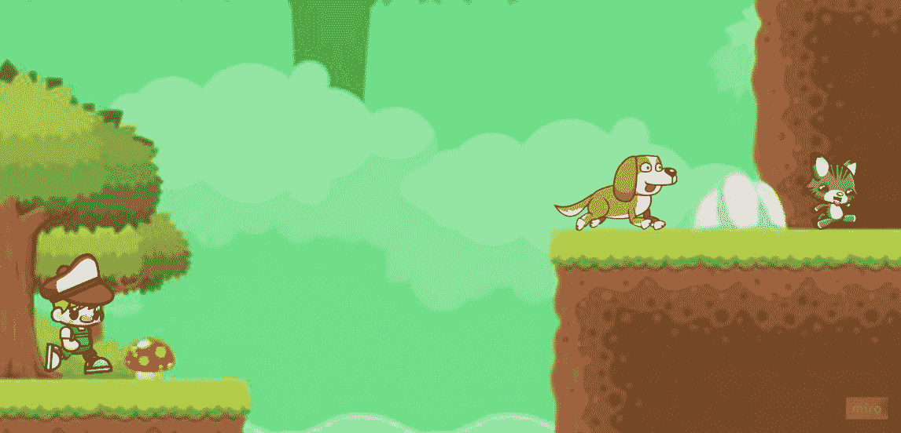
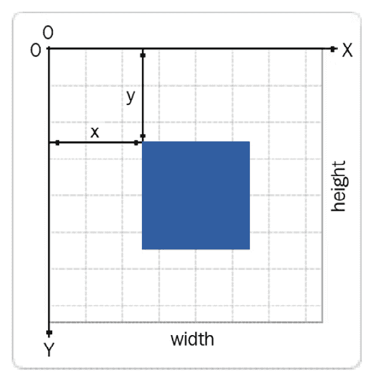
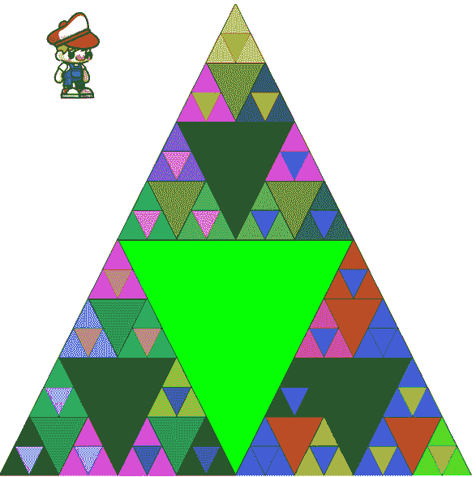
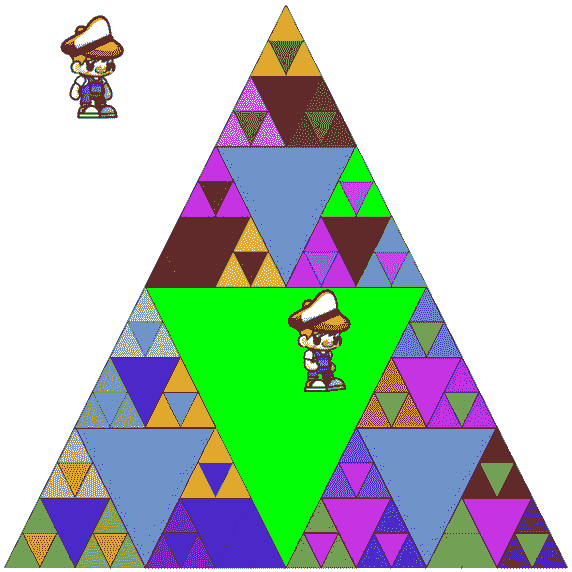

# 第二章：*第二章*：绘制精灵

现在我们已经有一个运行中的应用，并且开始在屏幕上绘制，我们可以开始制作真正看起来像游戏的东西。这意味着**渲染精灵**，这只是一个说法，意思是绘制图片。所以，在本章中，我们将通过进行一点游戏设计来定义这些图片是什么，然后我们将渲染一个静态精灵到屏幕上。由于静态图片是一个非常无聊的游戏，我们甚至会让精灵动起来。

在本章中，我们将做以下事情：

+   设计我们的游戏，遛狗。

+   将精灵渲染到画布上。

+   使用精灵表单一次性加载多个精灵。

+   通过精灵表单动画化一个角色。

到本章结束时，你将绘制角色而不是静态三角形，甚至它们会在屏幕上奔跑。

# 技术要求

除了*第一章*的技术要求*Hello WebAssembly*之外，你还需要下载位于[`github.com/PacktPublishing/Game-Development-with-Rust-and-WebAssembly/wiki/Assets`](https://github.com/PacktPublishing/Game-Development-with-Rust-and-WebAssembly/wiki/Assets)的资产。我们还会基于该章节的结果进行构建，所以不要丢弃代码。如果你因为无法被社会规则驯服而按顺序阅读这本书，那么你可以在[`github.com/PacktPublishing/Game-Development-with-Rust-and-WebAssembly/tree/chapter_1`](https://github.com/PacktPublishing/Game-Development-with-Rust-and-WebAssembly/tree/chapter_1)找到上一章的源代码并从这里开始。如果你遇到难题，你可以在[`github.com/PacktPublishing/Game-Development-with-Rust-and-WebAssembly/tree/chapter_2`](https://github.com/PacktPublishing/Game-Development-with-Rust-and-WebAssembly/tree/chapter_2)找到本章的完整源代码。

查看以下视频以查看代码的实际运行情况：[`bit.ly/3wOpCqy`](https://bit.ly/3wOpCqy)

# 快速游戏设计会议

在上一章中，我让你创建了一个名为“遛狗”的项目，你如此沉浸于创建 Rust 项目和我令人兴奋的散文中，以至于你甚至没有问为什么项目会叫这个名字。现在我们将深入研究这本书中我们要制作的这款游戏——**遛狗**。

*遛狗*是一个概念简单的无尽跑酷游戏。你扮演一个男孩，带着他的狗穿过森林，当你的狗被跑过的猫吓到并开始追逐它时，你开始追逐你的狗穿过森林，途中躲避障碍，直到你撞到其中一个并跌倒。这时，当然，狗会转身来看看你。

未经你猜测，这个游戏的灵感是在我遛狗时在冰上走时产生的。我使用了*Miro*([`miro.com`](https://miro.com))来制作原型，只是为了感受游戏将看起来是什么样子：



图 2.1 – 假设的遛狗屏幕

在你得到我是个伟大艺术家的想法之前，我使用的所有资源都是通过创意共享许可在网络上免费提供的。你可能注意到背景相对于角色来说有点模糊，这是因为我在将角色复制粘贴到 Miro 并拖动角落时几乎没有做任何努力来调整角色的比例。当我们将实际对象放入我们的游戏中时，我们需要做出比这更好的努力。

在这个阶段，诱惑就是可以说“我们完成了”然后开始编码。鉴于我们的游戏规模较小，我认为我们不需要完整的处理就可以开始编码，但我确实想确保我们澄清关于游戏的一些事情。

得分是通过测量我们的小红帽男孩（简称 RHB）跑了多远来计算的——和大多数无尽跑者游戏一样，如*Canabalt*（[`canabalt.com/`](http://canabalt.com/)）或在没有互联网连接时启动 Google Chrome 时出现的*恐龙霸王龙*游戏。狗和猫可以轻松地导航所有障碍，只是给玩家提供如何捕捉狗的想法，也许通过走玩家无法跟随的路线来误导玩家。障碍将包括你可以撞到的岩石和箱子，以及你可以掉进去的水。RHB 有一个滑动动画，所以有时他需要从小悬崖下滑行，狗可以轻松地从下面跑过。这不足以成为一个完整的游戏，但足以给我们一个未来章节的功能清单。让我们告别我们可爱的小三角形，开始渲染我们可爱的小红帽男孩。

# 渲染 sprite

Sprite 是一个如此常见的术语，以至于在谈话中可以使用它而不必真正知道它的含义，但正确地定义它意味着正确地定义位图，而这又意味着正确地定义像素图。你知道术语 sprite 是在 20 世纪 70 年代由 Danny Hillis（[`bit.ly/3aZlJ72`](http://bit.ly/3aZlJ72)）提出的吗？这太令人疲惫了。

虽然我觉得所有这些都很有趣，但你不是为此而买这本书的，所以为了我们的目的，sprite 是从文件中加载的 2D 图像。红帽男孩、他的狗和猫以及背景都将被定义为 sprite。让我们不要在定义上浪费时间，开始绘制一个。

## 加载图像

我们首先将资源解压缩，并将`Idle (1).png`文件从`resized/rhb`复制到项目中`static`目录下。这样就可以从程序中访问它。随着我们构建程序，我们需要进一步的整理，但对于一个文件来说，这样是可以的。接下来，我们需要修改我们的代码。你可以暂时保留 Sierpiński 三角形，因为它和精灵放在一起看起来很可爱，但首先要做的是使用`HTMLImage`元素来加载一张图片。目前，重要的是在调用 Sierpiński 三角形之前加载并绘制图片。它看起来是这样的：

```rs
#[wasm_bindgen(start)]
pub fn main_js() -> Result<(), JsValue> {
    ....
    let image = web_sys::HtmlImageElement::new().unwrap();
    image.set_src("Idle (1).png");
    sierpinski(
        &context,
        [(300.0, 0.0), (0.0, 600.0), (600.0, 600.0)],
        (0, 255, 0),
        5,
    );
    Ok(())
}
```

你将再次遇到`^^^^^^^^^^^^^^^ could not find `HtmlImageElement` in `web_sys``错误。记住，`web-sys`包大量使用了功能标志，所以你需要将`HtmlImageElement`添加到`Cargo.toml`中的功能标志列表中。在你添加之后，重建将需要更长的时间，但应用程序将再次构建。现在你已经加载了图像，我们可以绘制它。

## 画布坐标

在我们绘制之前，我们需要讨论一下`line_to`和`move_to`命令，这些命令可能当时没有意义，这就是为什么我们需要讨论坐标系的原因：



图 2.2 – 来源：Mozilla (http://mzl.la/30NLhxX)

我们的画布被划分为一个 600 x 600 的 2D 网格。为什么是 600 x 600？因为这是我们创建在 HTML 页面上的画布元素的宽度和高度，我们在*第一章*，*Hello WebAssembly*中创建了它。这个大小完全是任意的，随着我们的游戏发展，我们可能会改变它。网格的单位是像素，所以当我们将原始三角形的顶部移动到`(300.0, 0.0)`时，我们将其向右移动了 300 像素（因为`(0.0, 0.0)`位于画布的左上角。

## 绘制图像

在这个阶段绘制一个图像看起来并不复杂 – 我们将使用 JavaScript 中的`drawImage`命令；只是我们会使用针对`HtmlElement`的`web-sys`版本。

小贴士

记住，JavaScript 函数经常使用函数重载，而 Rust 不支持，所以一个 JavaScript 函数在 Rust 中可能有多个相应的变体。

因此，让我们在加载图像的代码之后立即添加绘制命令，然后我们就完成了：

```rs
image.set_src("Idle (1).png");
context.draw_image_with_html_image_element(&image, 0.0, 0.0);
...
```

我们忽略了`draw_image_with_html_image_element`命令中的`Result`，但应该会绘制图像，但是，它…没有。结果是，你不能在设置图像元素的源之后立即绘制图像，因为图像还没有被加载。为了等待图像加载，我们将使用`HtmlImageElement`的`onload`回调，你可以在 Rust 中使用`set_onload`来设置它。为了做到这一点，你需要了解一些在 WebAssembly 环境中使用 JavaScript 回调的知识。

## JavaScript 回调

当你通过 Rust 中的`set_onload`函数设置`onload`回调时，你是在通过 WebAssembly 调用 JavaScript，通过`web-sys`为你生成的函数。不幸的是，将以下 JavaScript 代码翻译成 Rust 变得复杂，因为 JavaScript 是垃圾回收的，而 Rust 使用手动内存管理，拥有著名的借用检查器。以下是一个例子：

```rs
image.onload = () => { alert("loaded"); }
```

这意味着要实际传递一个函数到 JavaScript，就像我们在这里想要做的那样，你必须使用一个复杂的签名，并且仔细考虑 Rust 的借用规则。这是一种在你正确理解之后才变得有意义的代码，但可能很难编写。让我们来分析一下我们需要做什么。

回到我们的源代码中，在创建`HtmlImageElement`之后，我们可以尝试以直观的方式添加一个`onload`回调：

```rs
let image = web_sys::HtmlImageElement::new().unwrap();
image.set_onload(|| {
    web_sys::console::log_1(&JsValue::from_str("loaded"));
});
image.set_src("Idle (1).png");
...
```

直观可能是一种夸张，但这与我们迄今为止知道如何编写的代码相符。不幸的是，这不起作用，因为你会在编译器错误中看到类型不匹配的问题，如下所示：

```rs
error[E0308]: mismatched types
  --> src/lib.rs:43:22
   |
   |       image.set_onload(|| {
   |  ______________________^
   | |         web_sys::console.log_1("loaded");
   | |     });
   | |_____^ expected enum `Option`, found closure
   |
   = note: expected enum `Option<&js_sys::Function>`
           found closure `[closure@src/lib.rs:43:22: 45:6]`
```

正如错误信息所说，`set_onload`不接收 Rust 闭包，而是接收`Option<&js_sys::Function>`。不幸的是，错误信息没有告诉你如何修复它，而且不清楚如何创建`js_sys::Function`对象。你可以做的是首先创建一个`Closure`对象，首字母大写"C"，然后尝试将其传递给`set_onload`：

```rs
let image = web_sys::HtmlImageElement::new().unwrap();
let callback = Closure::once(|| {
    web_sys::console::log_1(&JsValue::from_str("loaded"));
});
image.set_onload(callback);
```

`Closure`是`wasm-bindgen`结构体，用于将 Rust 闭包传递到 JavaScript。在这里，我们使用`Closure`上的`once`函数，因为我们知道`onload`处理程序只被调用一次。然而，我们仍然不能直接将其发送到 JavaScript；通过`image.set_onload(callback)`尝试这样做会导致以下错误：

```rs
error[E0308]: mismatched types
  --> src/lib.rs:47:22
   |
47 |     image.set_onload(callback);
   |                      ^^^^^^^^ expected enum `Option`, 
   found struct `wasm_bindgen::prelude::Closure`
```

记住`set_onload`需要`Option<&js_sys::Function>`，而到目前为止，我们只创建了`Closure`。幸运的是，`Closure`结构体提供了一种进行转换的方法，如下所示：

```rs
image.set_onload(Some(callback.as_ref().unchecked_ref()));
```

首先，我们在回调函数上调用`as_ref`，它返回一个原始的`JsValue`，然后我们调用`unchecked_ref`，将其转换为`&Function`对象。我们将它传递给`Some`，因为在 JavaScript 中`onload`可以是`null`。太棒了！它编译成功了！现在的绘制代码如下：

```rs
let image = web_sys::HtmlImageElement::new().unwrap();
let callback = Closure::once(|| {
    web_sys::console::log_1(&JsValue::from_str("loaded"));
});
image.set_onload(Some(callback.as_ref().unchecked_ref()));
image.set_src("Idle (1).png");
context.draw_image_with_html_image_element(&image, 0.0, 0.0);
...
```

如果你运行应用程序，它**仍然**没有显示我们的图片，但在浏览器控制台中记录了一个错误：

```rs
Uncaught Error: closure invoked recursively or destroyed already
```

闭包何时被销毁？这一切都在`main`函数中，因此闭包在函数完成几行后销毁，此时`callback`变量不再在作用域内。为了看到我们的日志消息，我们可以在设置`on_load`函数之后在代码中添加一个额外的调用：

```rs
image.set_onload(Some(callback.as_ref().unchecked_ref()));
callback.forget();
```

在回调函数上调用`forget()`将内存管理从 Rust 转移到 JavaScript，从而有效地创建了一个故意的内存泄漏。这不是我们经常想要做的事情，而且它在这里严格是为了帮助我们克服最新的错误，通过防止闭包被销毁。如果你编译这段代码并检查浏览器控制台，你会看到现在有“loaded”的消息。这很好，但是它仍然没有绘制我们的图片，因为我们实际上还没有等待图片加载完成。为此，我们需要一个异步函数。

提示

将 Rust 闭包转换为 JavaScript 闭包是那些 JavaScript 和 Rust 之间的抽象到处泄漏的案例之一，这可能会让人感到“不小心在孩子面前发誓”般的沮丧。所以，当你做错或感到困惑时，不要感到难过；这仅仅意味着你是一个凡人。

重要提示

在这本书中，我们将有更多发送闭包到 JavaScript 的示例，但你可能会发现自己想要交叉引用官方文档[`bit.ly/3kSyOSI`](http://bit.ly/3kSyOSI)和[`bit.ly/3sXt1OW`](http://bit.ly/3sXt1OW)。

## 异步 Rust

Rust 添加了 `async`，让运行时知道可以将函数设置为异步执行。在该函数内部，你可以使用 `await` 调用来暂停当前线程/进程的执行，并允许应用程序的其他部分继续运行，直到等待的函数可以恢复。关键点是，虽然 `await` 暂停了当前执行上下文的执行，但它允许其他代码继续执行。这使得它非常适合那些永远不会停止执行游戏循环的游戏。与基于回调的代码相比，它的工作方式也更为简洁，因此我们将在这里（结合通道）使用它，以确保我们不会在图像加载完成之前尝试绘制图像。

如果你熟悉在传统 Rust 中使用 `async`/`.await`，那么你知道这些函数需要在运行时中执行，通常使用 `tokio` 或 `async-std` 等 crate。该运行时负责传递控制权并恢复它。以下是从 `async-std` 库仓库中的简单示例：

```rs
use async_std::task;
fn main() -> Result<(), surf::Error> {
    task::block_on(async {
        let url = "https://www.rust-lang.org";
        let mut response = surf::get(url).send().await?;
        let body = response.body_string().await?;
        dbg!(url);
        dbg!(response.status());
        dbg!(response.version());
        dbg!(response.header_names());
        dbg!(response.header_values());
        dbg!(body.len());
        Ok(())
    })
}
```

在这里，`async` 块被包裹在一个名为 `task::block_on` 的函数中，该函数在每个 `await` 调用中处理停止该块的执行，然后在 `await` “醒来”进行未来处理时恢复执行。所有这些都需要生成线程或检查事件循环，这些代码你不需要编写，因为你从 `async-std` 中获取它们。

如果你熟悉其他原生支持 async/.await 语法的高级语言，例如 JavaScript，你可能会想知道为什么这个额外步骤是必要的。答案是，与 JavaScript 不同，Rust 语言中不存在 `async` 和 `await` 关键字，但如果没有额外的 crate，它们将无法工作，但这是我们为了获得额外功能所付出的代价。

这是坏消息，但好消息是——在 WebAssembly 中，我们不需要任何额外的运行时！我们的代码在浏览器中运行，因此可以使用浏览器的运行时；我们只需要使用一个 crate 在本地事件循环中生成 futures，而这个 crate 已经存在——`wasm_bindgen_futures`。

### 生成 future

自然地，我们谈论的是“未来”，但作为一个期货的使用者，你通常不会直接创建`Future`类型。你声明一个函数或闭包为`async`，当调用一个`async`函数时，其返回值将被包裹在`Future`中。然后，调用者可以通过调用`await`来等待那个`Future`实例完成。这种方法的优点是，尽管在调用`await`时程序实际上并没有停止，但从代码作者的视角来看，它看起来像是停止了。这使得代码看起来更加线性。实际上，程序的执行会继续；否则，它将变得无响应，但运行时会处理在`Future`完成时从上次停止的地方恢复程序。

如果你忘记了，我们正在尝试将精灵绘制到画布上，为此，我们必须首先等待图像加载。为此，我们最终将使用期货，但我们需要先构建一些基础设施。我们将首先向`HtmlImageElement`添加一个`onload`回调，当图像加载时，它会调用一个`oneshot`通道。一个`oneshot`通道是一个接收者实现了`Future`特质的通道，因此我们可以调用`await`来等待它接收消息。如果我们设置`onload`回调向那个通道发送消息，然后我们可以在接收者上调用`await`，这样执行就会阻塞，直到图像加载完成。然后，我们实际上可以绘制图像，因为我们知道它已经加载了。为了使所有这些工作，我们需要将所有内容包裹在一个`async`块中并启动返回的期货。这是`await`语法的限制；它只能在`async`函数或块内部工作。自然地，我们将从…`Cargo.toml`文件开始实现。

我想从`.TOML`文件开始并不自然，但我们需要将期货依赖项拉入我们的 WebAssembly 项目中。它们已经在测试中存在，所以我们将`futures`和`wasm-bindgen-futures`从`dev-dependencies`移动到标准的`dependencies`块中。你可以将它们放在`getrandom`下面，如下面的代码所示：

```rs
getrandom = { version = "0.2.3", features = ["js"] }
futures = "0.3.17"
wasm-bindgen-futures = "0.4.28"
```

现在我们有了对 Rust 期货的访问权限，我们可以使用`wasm_bindgen_futures::spawn_local`来启动一个本地期货并将所有用于绘制图像的代码放入其中。回到我们之前编写的用于加载`HtmlImageElement`的代码，我们希望将所有这些代码包裹在一个对`spawn_local`的调用中，如下面的代码所示：

```rs
wasm_bindgen_futures::spawn_local(async move {
    let image = web_sys::HtmlImageElement::new().unwrap();
    let callback = Closure::once(move || {
        web_sys::console::log_1(&JsValue::from_str("loaded"));
    });
    image.set_onload(Some(callback.as_ref().unchecked_ref()));
    callback.forget();
    image.set_src("Idle (1).png");
    context.draw_image_with_html_image_element
        (&image, 0.0, 0.0);
    sierpinski(
...
});
```

当你调用`spawn_local`时，你需要将其作为一个标记为`async,`的块传递，因为`spawn_local`需要`Future`。我们已经将这个块标记为`move`，以便给块赋予我们在此块中引用的任何绑定所有权。稍后，我们还需要确保我们正确处理这个闭包的生命周期，它必须是`'static`，但就目前而言，我们不必担心这一点，因为一切都在闭包中。这张图片仍然不会绘制，因为当`Future`运行到完成时，它会生成，但我们的程序会退出。我们需要等待图像加载，为此，我们将使用`oneshot`通道。

`oneshot`通道的工作方式就像它的名字一样；你可以调用一次，此时它被消耗，不能再调用。这意味着当你将`oneshot`通道移动到 Rust 闭包中时，闭包立即变为`FnOnce`。实际上，如果你尝试将`oneshot`移动到`FnMut`或`Fn`，你会得到编译器错误，副作用是当你试图找出问题所在时，你的头发会掉落。所以，不要这样做——这很痛苦。

相反，让我们在`spawn_local`块内部创建通道，然后通过向通道发送消息来替换回调中的`web_sys::console::log_1`调用。更改如下所示：

```rs
let (success_tx, success_rx) = futures::channel::oneshot::channel::<()>();
let image = web_sys::HtmlImageElement::new().unwrap();
let callback = Closure::once(move || {
    success_tx.send(());
});
...
```

在第一行，我们创建了`unit`类型的`oneshot`通道，并将其发射器移动到回调中。我们移除了日志消息，并用对发射器上的`send`的调用替换了它。现在，在我们尝试绘制图像之前，我们需要等待该消息被发送。让我们修改闭包下面的代码：

```rs
image.set_onload(Some(callback.as_ref().unchecked_ref()));
image.set_src("Idle (1).png");
success_rx.await;
context.draw_image_with_html_image_element(&image, 0.0, 0.0);
```

首先，我们移除了`forget`调用，因为它不再必要，因为我们将在尝试绘制图像之前等待`onload`函数被调用。这使得当作用域完成时删除闭包变得可以接受。然后，我们调用`success_rx.await`以阻塞，直到加载完成。最后，我们将像之前一样绘制图像，它就会出现！



图 2.3 – 我是红帽男孩，三角形的国王

重要提示

在这里我们忽略了大量的结果，这是一个坏习惯。在下一章中，我们将开始构建我们的游戏，以便更好地分离关注点，并且在这个过程中，我们将移除它，转而使用显式的错误处理或调用`expect`，如果我们真正想要停止执行。

你可能会想知道为什么我们在这里使用`spawn_local`，而不是简单地使用标准的 Rust 通道并在其上调用`recv`，原因在于`recv`调用会阻塞主线程的执行，这在浏览器中是绝对不允许的。基于浏览器的代码必须允许浏览器继续其事件循环，而暂停它会导致浏览器本身变得无响应。你可以使用`try_rcv`调用，因为它不会阻塞，但你必须在一个循环中检查它，以确保等待图像加载完成。这也会暂停浏览器，并可能引起那些令人烦恼的“浏览器无响应”错误。由于浏览器和视频游戏意外地都不能使应用程序变得无响应，我们将使用`spawn_local`块和`async`/`await`语法。记住，虽然`await`上下文会暂停本地执行，但程序本身实际上仍在运行，只是为了不断地轮询并查看`Future`是否完成。

恭喜！在我承诺你会在一千个单词之后在屏幕上绘制图像之后，你做到了，但还有一件事我们必须关注。让我们对代码做一些小的修改：

```rs
image.set_onload(Some(callback.as_ref().unchecked_ref()));
image.set_src("rhg.png");
success_rx.await;
```

现在，如果你运行应用程序，屏幕上什么也没有绘制，包括三角形！这是因为我们等待一个成功的加载，而这个加载永远不会到来。我们需要处理错误情况，以便在加载失败的情况下继续，而不是挂起，即使我们只想停止错误。我们想要做的是在图像加载完成时发送一条消息（一个`unit`）或向接收者发送另一条消息（错误），无论哪种方式。

你可能会认为当加载失败时，你可以将`success_tx`改为接受`unit`或错误代码。我们可以使用`JsValue`作为错误，因为浏览器中的任何错误代码都将是这个类型。

重要提示

`JsValue`是一种表示直接来自 JavaScript 的任何值的类型。在 Rust 代码中，我们将经常将这些类型转换为更具体的 Rust 类型。

那段代码看起来是这样的：

```rs
let (success_tx, success_rx) = futures::channel::oneshot::channel::<Result<(), JsValue>>();
let image = web_sys::HtmlImageElement::new().unwrap();
let callback = Closure::once(move || {
    success_tx.send(Ok(()));
});
let error_callback = Closure::once(move |err| {
success_tx.send(Err(err)); 
});
image.set_onload(Some(callback.as_ref().unchecked_ref()));
image.set_onerror(Some(error_callback.as_ref().unchecked_ref()));
```

这将立即变成一个编译器错误：

```rs
70 |         let error_callback = Closure::once(move |err| {
   |                                                     
^^^^^^^^^^ value used here after move
71 |             success_tx.send(Err(err));
```

`success_tx`不能同时移动到两个闭包中。我们需要使用 Rust 构造来在线程之间共享通道，以便我们可以在两个回调中使用它。

重要提示

我们也可以在这里使用两个`oneshot`通道和一个`select`语句，但在编写本文时，这并没有在 WebAssembly 中很好地工作。

我们将创建通道，然后设置成功和错误发送者的引用计数版本。这意味着这两个发送者将发送到同一个接收者。这两个都需要被包裹在`Mutex`中，就像这里所示，替换原始的`oneshot`通道创建：

```rs
let (success_tx, success_rx) = futures::channel::oneshot::channel::<Result<(), JsValue>>();
let success_tx = Rc::new(Mutex::new(success_tx));
let error_tx = Rc::clone(&success_tx);
```

注意，我们将开始向通道发送 `Result`，这样我们就可以在以后区分成功和失败。你需要确保导入 `std::rc::Rc` 和 `std::sync::Mutex`。现在 `success_tx` 已经被更改为 `Rc<Mutex<Sender>>`，你需要更新 `success` 回调以反映这一点。你将想要锁定对 `Mutex` 的访问并然后发送 `success` 消息。你的第一次尝试可能看起来像这样：

```rs
let image = web_sys::HtmlImageElement::new().unwrap();
let callback = Closure::once(move || {
    success_tx
        .lock()
        .and_then(|oneshot| Ok(oneshot.send(Ok(()))));
});
...
```

这会锁定 `Mutex` 并向其 `oneshot` 发送 `Ok(())`。这几乎是对的，但有一个问题导致编译器错误，如下所示：

```rs
error[E0507]: cannot move out of dereference of `std::sync::MutexGuard<'_, futures::futures_channel::oneshot::Sender<Result<(), wasm_bindgen::JsValue>>>`
  --> src/lib.rs:38:40
   |
38 |                 .and_then(|oneshot| Ok(oneshot.send(Ok(()))));
   |                                        ^^^^^^^^^^^^^^^^^^^^ move occurs because value has type `futures::futures_channel::oneshot::Sender<Result<(), wasm_bindgen::JsValue>>`, which does not implement the `Copy` trait
```

编译器错误信息很长，所以值得分解。正如错误所说，`.and_then(|oneshot| Ok(oneshot.send(Ok(()))));` 这一行需要将 `oneshot` 值移动到闭包中。这是因为 `oneshot` 没有实现拷贝。这很有道理；如果你可以拷贝 `oneshot`，那么你可以多次使用它。好吧，所以 `oneshot` 必须移动到闭包中——那么问题是什么？移动并不坏，但错误信息说，“错误[E0507]：不能从 `std::sync::MutexGuard` 的解引用中移动”。`Mutex` 会获取你移动到其中的值的所有权，你不能只是移动它的值而留下“什么也没有”。因此，编译器阻止了这个操作。

这些错误既是 Rust 的一个伟大特性，也是 Rustacean 存在的痛苦之源。在这里，编译器正在阻止我们犯线程错误，这种错误在几乎所有其他语言中都很容易犯，但副作用是难以阅读的错误。Rust 团队一直在努力改进编译器信息的清晰度，但有些事情确实很难。当编译器让你感到困惑时，请慢慢仔细地阅读错误，你通常会弄清楚它试图告诉你什么。

那么，如何解决这个问题呢？你需要确保在仍然可以访问底层 `Sender` 的同时，永远不要从 `Mutex` 引用中移出。我们可以通过使用 `Option<T>` 类型来实现这一点，它实现了拷贝和 `take` 函数。这将允许我们在锁定 `Mutex` 内部用 `None` 替换 `Sender`。然后，任何其他使用该 `Mutex` 引用的用户都将拥有 `None` 并能适当地使用它。

首先，修改 `success_tx` 的创建，使其接受 `Option`，如下面的代码所示：

```rs
let (success_tx, success_rx) = futures::channel::oneshot::channel::<Result<(), JsValue>>();
let success_tx = Rc::new(Mutex::new(Some(success_tx)));
let error_tx = Rc::clone(&success_tx);
```

现在，在 `success` 回调中，我们需要修改代码以考虑传输器是可选的。这里我们将使用 `take` 来立即将 `Some(transmitter)` 替换为 `None`，当它被使用时。这是 `success` 回调：

```rs
let callback = Closure::once(move || {
    if let Some(success_tx) = success_tx.lock().ok()
       .and_then(|mut opt| opt.take()) {
        success_tx.send(Ok(()));
    }
});
```

在这里，我们使用了`if let`构造来从`Mutex`和`Option`中获取发送器。如果你从`success_tx.lock()`的代码跟下来，你会看到我们调用`ok`将`lock()`的结果转换为`Option`，使用`and_then`函数对`Option`的`Some`版本进行操作，然后最终使用`take`来获取`Option`的值。在`if`条件中，我们用`Ok`结果调用发送器的`send`函数，并且我们不再需要围绕`send`调用的奇怪`Ok`包装器。关键是`Option`永远不会从`Mutex`中移出；它被`None`替换。由于在锁定期间没有人可以访问`oneshot`结构，代码是线程安全的，而且因为我们使用了`Option`，`Mutex`总是包含某些东西——即使它是`None`。

我们终于可以编写开始所有这些的`error`回调了，它非常相似：

```rs
let error_callback = Closure::once(move |err| {
    if let Some(error_tx) = error_tx.lock().ok()
       .and_then(|mut opt| opt.take()) {
        error_tx.send(Err(err));
    }
});
...
```

那个`error`回调需要使用`set_onerror`调用设置。我们之前有那个，但以防你之前没有添加，它看起来如下：

```rs
image.set_onload(Some(callback.as_ref().unchecked_ref()));
image.set_onerror(Some(error_callback.as_ref().unchecked_ref()));
...
```

我将`set_onerror`调用放在现有的`set_onload`调用下面，以保持对称。我们不需要为错误添加第二个`await`调用。因为`error_tx`是`success_tx`的克隆，并且我们受到保护，不会同时收到错误和成功，因为`oneshot`只能触发一次。

现在，我们正确地处理了错误和成功的情况，并且没有收到编译器错误。如果你现在看看你的浏览器，你应该只看到三角形，因为我们不再卡在`await`调用了。继续恢复`image.set_src("Idle (1).png")`的调用，使其再次使用正确的文件，RHB 就会重新出现。

所以，就是这样——我们的游戏现在再次显示图像并处理错误。但是，如果你的游戏显示的图像是...多于一个呢？

# 精灵表

创建一个每个精灵都是其自身独立文件的游戏当然可能，但这意味着当游戏开始时，玩家需要等待每个文件单独加载。组织游戏精灵的一种常见方式是**精灵表**，它由两部分组成。第一部分是包含许多精灵的图像文件，就像这样：


图 2.4 – 精灵表顶部

第二部分是坐标和元数据的映射，它允许我们“裁剪”我们需要的每个图像，就像饼干切割器一样。例如，如果我们想要显示前面图中的第一个精灵（碰巧命名为`Dead (7).png`），我们需要知道其位置和尺寸：


图 2.5 – 图表中一个精灵

我画了一个框，标记了你想要从图像中“裁剪”的帧，当你想要绘制`Dead (7).png`时。当你想要绘制不同的文件，比如`Slide (1).png`时，你可以在绘制时使用相同的图像但不同的帧。

为了知道每个精灵表格的帧和名称，我们需要加载一个单独的文件，该文件存储所有这些信息以及图像本身。在我们的情况下，我们将使用一个名为 *TexturePacker* 的工具（[`www.codeandweb.com/texturepacker`](https://www.codeandweb.com/texturepacker)）为我生成的文件，该工具允许你导出一个看起来像这样的 JSON 文件：

```rs
{"frames": {
"Dead (1).png":
{
     "frame": {"x":0,"y":0,"w":160,"h":136},
     "rotated": false,
     "trimmed": false,
     "spriteSourceSize": {"x":0,"y":0,"w":160,"h":136},
     "sourceSize": {"w":160,"h":136}
}
...
```

*TexturePacker* 通过精灵名称生成了一个包含查找表的 JSON 文件。在这种情况下，名为 "`Dead` `(7).png`" 的精灵位于 (`0,0`)，宽度为 109 像素，高度为 67 像素，因此位于较大图像的左上角。要绘制图像，你最终将使用一个 `drawImage` 函数版本，它接受源坐标，即你在前面的代码中看到的尺寸，以及你想要在画布上定位绘制的目标坐标。

因此，为了渲染之前从精灵表格中渲染的相同的 `Idle` `(1).png`，我们需要做以下事情：

1.  加载 JSON 文件。

1.  将 JSON 文件解析为 Rust 结构体。

1.  将图像加载到 `HtmlImageElement`。

1.  使用允许我们只绘制图像元素一部分的 `drawImage` 版本。

没有其他事情要做，让我们开始吧。

## 加载 JSON

在你之前下载的资产中，有一个名为 `sprite_sheets` 的目录，其中包含两个文件，`rhb.json` 和 `rhb.png`。请将这两个文件都复制到 `static` 目录中，以便它们可以被我们的项目加载。现在，让我们回到 `lib.rs` 并开始编辑以加载我们的表格。

在这种情况下，我们将首先编写一个全新的函数来调用 `fetch_json`。它将使用 `window.fetch` 调用来检索 JSON 文件，然后从响应体中提取 JSON。这需要两个异步调用，因此我们将整个内容编写为一个 `async` 函数。请将所有这些内容放在 `main` 之后：

```rs
async fn fetch_json(json_path: &str) -> Result<JsValue, JsValue> {
    let window = web_sys::window().unwrap();
    let resp_value = wasm_bindgen_futures::JsFuture::from(
        window.fetch_with_str(json_path)).await?;
    let resp: web_sys::Response = resp_value.dyn_into()?;
    wasm_bindgen_futures::JsFuture::from(resp.json()?).await
}
```

目前还有一些事情甚至无法编译，我们将在逐行分析时修复它们。

首先，我们检索 `window`。再一次，我们使用 `unwrap` 因为 `window()` 是一个 `Option`；在下一章，我们将更好地处理我们的错误。第二条线是一个难题；我们将分部分来处理它：

```rs
let resp_value = wasm_bindgen_futures::JsFuture::from(
    window.fetch_with_str(&"rhb.json")).await?;
```

第一部分是调用 `wasm_bindgen_futures::JsFuture::from`，这有点误导。`JsFuture` 不是一个 JavaScript future，而是一个由 JavaScript promise 支持的 Rust future。我们想要一个 Rust future，这样我们最终可以在它上面调用 `await`。我们使用以下内容调用 `from`：

```rs
window.fetch_with_str(json_path)
```

这对应于 JavaScript 中的 `window.fetch` 函数，但就像许多其他 JavaScript 函数一样，`fetch` 是重载的，因此我们需要显式调用它为 `with_str`。该函数返回 `Promise`，我们立即通过之前讨论的 `from` 调用将其转换为 future。最后，我们调用 `await?`，这将阻塞直到 `fetch` 返回。这是允许的，因为 `fetch_json` 函数是 `async`。

你还在吗？如果你理解了这一点，你就已经解决了最困难的部分。接下来，我们将返回的`resp_value`转换为`Response`，因为`fetch`调用解析为`JsValue`。再一次，我们必须从 JavaScript 的动态类型转换为 Rust 的静态类型，而`dyn_into()`函数就是做这件事的。

现在我们已经得到了一个响应（对应于浏览器中的`Response`对象），我们可以调用它的`json()`函数，对应于网络`Response`对象的`json()`函数。该函数也返回一个 promise，所以我们用`JsFuture`包装它，并用`await`调用阻塞它。

最后，这个函数返回`Result<JsValue, JsValue>`，这意味着它是一个`Result`，其`Ok`或`Err`情况都是动态 JavaScript 对象。这就是为什么我们可以在任何地方使用`?`。

但当然，这仍然无法编译，因为我们再次缺少一个功能标志。确保你将`Response`添加到`web-sys`依赖项列表中，你应该再次变为绿色。嗯，除了那个说`fetch_json`没有被调用的警告。

## 解析 JSON

回到`main`函数中，我们将绘制顺序设置为红帽男孩、Sierpiński 三角形，然后是另一个红帽男孩。所以，在调用`sierpinski`之后，让我们获取对应红帽男孩数据文件的"`rhb.json`"文件：

```rs
context.draw_image_with_html_image_element(&image, 0.0, 0.0);
let json = fetch_json("rhb.json").await.unwrap();
```

这会获取 JSON，但不会将其解析成我们可以使用的结构。我们有几种 JSON 解析的选项，包括使用浏览器内置的功能，但这是本 Rust 书籍，所以让我们使用 Rust 库，**Serde**。

Serde 是 Rust 中更受欢迎的序列化库之一，它擅长将 JSON（以及许多其他格式）转换为 Rust 结构。在`Cargo.toml`中添加必要的依赖项：

```rs
serde = {version = "1.0.131", features = ["derive"] }
```

我们需要的 crate 是`serde`，它可以泛型处理序列化和反序列化（你之前在编辑器中将`rhb.json`文件复制到`static`目录中的文件。在顶部，你应该看到类似这样的内容：

```rs
{"frames": {
"Dead (1).png":
{
     "frame": {"x":0,"y":0,"w":160,"h":136},
     "rotated": false,
     "trimmed": false,
     "spriteSourceSize": {"x":0,"y":0,"w":160,"h":136},
     "sourceSize": {"w":160,"h":136}
}
...
```

这份 JSON 文档描述了一个帧的哈希，其中每个帧的键是图像的名称`("Dead (1).png")`，下面的结构是该图像的属性。我们关心的属性是`frame`。"`Dead (1).png`"的图像位于（`210, 493`），宽度为 71 像素，高度为 115 像素。回到代码中，我们可以解析我们之前获取的 JSON。

首先，我们需要设置`serde`可以使用的数据结构。在`lib.rs`的顶部，我们可以添加`Deserialize`过程宏到作用域中：

```rs
use serde::Deserialize;
```

你还想要添加`HashMap`从`std::collections`：

```rs
use std::collections::HashMap;
```

现在，我们将逆向工作。你将有一个包含前面 JSON 中查找表的`Sheet`类。你可以在`lib.rs`文件中的任何地方放置这个结构体，只是不要在函数内部。我把它放在了顶部：

```rs
#[derive(Deserialize)]
struct Sheet {
    frames: HashMap<String, Cell>,
}
```

`[derive(Deserialize)]`宏意味着我们可以将`Sheet`用作反序列化 JSON 的目标，`HashMap`和`String`会自动工作，但我们还没有定义`Cell`。这将代表包含`frame`的部分 JSON，这是我们关心的，因为它是目标精灵所在的位置。我们将在`Sheet`之上添加所有需要的结构体：

```rs
#[derive(Deserialize)]
struct Rect {
    x: u16,
    y: u16,
    w: u16,
    h: u16,
}
#[derive(Deserialize)]
struct Cell {
    frame: Rect,
}
```

太好了——我们有一系列结构可以保存我们需要绘制图像的数据映射，但我们还没有填充它们，但幸运的是，`wasm-bindgen`通过`serde-serialize`功能使这变得非常简单。要启用该功能，你需要再次更新`Cargo.toml`，将基本的`wasm-bindgen`依赖项替换为以下内容：

```rs
wasm-bindgen = { version = "0.2.78", features = ["serde-serialize"] }
```

之前你只有`wasm-bindgen = "0.2.78"`，现在你需要添加`serde-serialize`功能标志，所以你必须使用稍微复杂一点的语法。构建之后，你只需用一行代码`into_serde`导入 JSON 数据，在你获取 JSON 之后：

```rs
let json = fetch_json("rhb.json")
    .await
    .expect("Could not fetch rhb.json");
let sheet: Sheet = json
    .into_serde()
    .expect("Could not convert rhb.json into a Sheet 
     structure");
```

我移除了`unwrap`调用，并用`expect`替换了它们，因为我希望在这些情况下有一个特定的消息。

提示

我们使用的几乎所有依赖都非常年轻，这本书不太可能跟上每一个怪癖。为了跟上，请坚持使用书中使用的版本，但为了你自己的未来项目，记住，当依赖似乎不起作用时，要检查文档中的功能标志、版本号或两者。

现在我们有了 sheet，我们就可以加载图片并在其中绘制精灵了。

## 用我们的“饼干切割器”绘制

回想一下，我们已经有四个步骤来从精灵图中绘制。我们已经完成了前两个：

1.  加载 JSON 文件。

1.  将 JSON 文件解析为 Rust 结构。

1.  将图像加载到`HtmlImageElement`。

1.  使用允许我们只绘制图像元素一部分的`drawImage`版本。

第 3 步是你之前已经做过的，就像所有优秀的程序员一样，当我们需要两次编写相同的代码时，我们会立即使用一个工具…

当然是复制粘贴！你以为我会说一个函数吗？我们会留到以后再说。

提示

更重要的是，为了使某物第二次工作而复制粘贴是完全可接受的；只是避免将其作为最终版本提交。

将从`let (success_tx, success_rx)`到`success_rx.await`的所有内容复制并粘贴到下面，在那里我们将`rhb.json`转换为`Sheet`：

```rs
let sheet: Sheet = json
    .into_serde()
    .expect("Could not convert rhb.json into a Sheet 
     structure");
let (success_tx, success_rx) = futures::channel::oneshot::channel::<()>();
...
image.set_src("Idle (1).png");
success_rx.await;
```

多亏了 Rust 的工作方式，你不需要重命名任何变量，因为每次你使用`let`，你都会覆盖之前的变量版本并创建一个新的绑定。在粘贴的代码中，我们只需要做一个小改动——加载图像 sheet 而不是"`Idle (1().png`"：

```rs
image.set_src("rhb.png");
```

第 3 步现在已经完成；我们已加载包含许多精灵的大图像。最后，我们将绘制我们想要的精灵。让我们绘制"`Run (1).png`"精灵，它虽然看起来相似，但将允许我们添加一些与之配合的动画。我们将使用带有源位置的`drawImage`调用版本，这是我们之前讨论过的帧，以及目标位置，我们将在这里放置图像在画布上。为了确保我们看到新图像，让我们将其放置在中间附近。在最后一个`await`调用之后添加此图像：

```rs
let sprite = sheet.frames.get("Run (1).png").expect("Cell not found");
context.draw_image_with_html_image_element_and_sw_and_sh_and_dx_and_dy_and_dw_and_dh(
    &image,
    sprite.frame.x.into(),
    sprite.frame.y.into(),
    sprite.frame.w.into(),
    sprite.frame.h.into(),
    300.0,
    300.0,
    sprite.frame.w.into(),
    sprite.frame.h.into(),
);
```

第一行，`sheet.frames.get`通过名称检索精灵，如果名称错误，会抛出`expect`异常。下一行是一个怪物，因为`drawImage`在 JavaScript 中有九种参数版本，在 Rust 中通过调用`draw_image_with_html_image_element_and_sw_and_sh_and_dx_and_dy_and_dw_and_dh`来表示。这听起来很复杂，但它的意思是用源矩形（我们的帧）绘制图像到目标矩形，其中源矩形由四个位置和大小坐标表示，目标矩形也由四个坐标表示。源矩形是我们的帧，从我们之前加载的 JSON 文件中绘制。目标矩形从（`300,300`）开始，将 RHB 放置在画布的大约中心，并使用相同的宽度和高度，因为我们不想改变图像的大小。最终结果是这个：



图 2.6 – 多个红帽男孩

原始 RHB 在左上角，使用自己的图像文件，而精灵图集中的第二个 RHB 大约在三角形的中心。你会注意到他的右手稍微缩回，因为这是他跑步动画的开始。

说到跑步动画，我们不妨看看它是如何运作的？

重要提示

以我们在这里的方式加载精灵图集和图像只是实现这种技术的方式之一。例如，另一种选择可能是将 JSON 和图像嵌入 Rust 可执行文件中，可能通过 Base64 编码它们，从而一次性完成所有数据加载。它们也可以通过 webpack 打包到目标应用程序中，并暴露给我们的 Rust 应用程序。所有这些不同的方式都伴随着它们自己的权衡，在我们的情况下，我们为了满足调用服务器的需求，牺牲了一些复杂性和初始加载时间。为你的游戏找到最佳解决方案。

# 添加动画

小精灵动画的工作原理就像翻页书或电影。快速展示一系列图像，其中每个图像都绘制得与前一个图像略有不同，从而产生运动的错觉。画布上的动画以类似的方式工作，其中精灵图集中的每一帧都像翻页书中的一幅画：


图 2.7 – 红帽男孩的跑步动画

要绘制正在跑步的红帽男孩，我们只需按顺序绘制图像，一次一个，并在绘制最后一个图像后循环。对于循环来说很简单，对吧？

当然，事情并不那么简单。首先，我们不能简单地使用无限循环，因为这将会阻止浏览器进行任何处理，导致浏览器标签页冻结。其次，我们必须确保在每一帧之间清除画布。否则，我们会看到所有图像合并在一起，因为一个图像会在另一个图像之上绘制。所以，每次我们绘制画布时，我们都需要先清除它，然后绘制所需的帧。

重要提示

如果你熟悉传统游戏开发中的双缓冲，并且担心我们在清除画布然后重新绘制时看到闪烁，不用担心。画布元素已经为你处理了这个。

幸运的是，你已经几乎知道了绘制动画 RHB 所需的所有知识。你需要将 Rust 闭包传递给一个函数，并从精灵表中绘制精灵。唯一你不了解的是如何清除画布，我们稍后会介绍，但我们必须首先说再见：

1.  `sierpinski` 以及它所使用的所有代码，包括 `midpoint` 和 `draw_triangle` 函数。它们为我们服务得很好，将会被怀念。

1.  **删除闲置的 RHB**: 我们可能需要费力地保留闲置的 RHB 精灵，但这将需要处理我们为创建精灵表而编写的重复代码。最好在 BOSS 发现之前删除所有这些复制粘贴的代码。

不，继续删除 `spawn_local` 闭包中直到我们加载 `rhb.json` 文件之前的所有内容。删除这些内容后，你的代码在 `spawn_local` 附近应该看起来像这样：

```rs
let context = canvas
    .get_context("2d")
    .unwrap()
    .unwrap()
    .dyn_into::<web_sys::CanvasRenderingContext2d>()
    .unwrap();
wasm_bindgen_futures::spawn_local(async move {
    let json = fetch_json("rhb.json")
        .await
        .expect("Could not fetch rhb.json");
    ...
```

因此，在生成本地未来之前，你最后要做的事情是获取 `2d` 上下文，而在生成未来之后的第一件事是加载 JSON。

现在，是时候将绘制改为回调函数了。

1.  `setInterval` 函数，被称为 `set_interval_with_callback`。首先，我们需要设置回调本身，使用我们之前使用的 `Closure` `结构体`。在 `success_rx.await` 调用之后，添加以下内容：

    ```rs
    let interval_callback = Closure::wrap(Box::new(move || {}) as Box<dyn FnMut()>);
    ```

这设置了一个空的 `Closure`，但与之前我们创建 `Closure` 的时候不同，我们这次使用 `Closure::wrap` 而不是 `Closure::once`。为什么？因为这个闭包将会被多次调用。这也意味着我们需要使用 `Box` 并进行显式转换，`as Box<dyn FnMut()>`，因为 `wrap` 函数需要 `Box`，并且编译器没有足够的信息来推断类型。

现在我们有一个空的间隔回调，我们可以安排它被调用。在下一行，添加以下内容：

```rs
window.set_interval_with_callback_and_timeout_and_arguments_0(
    interval_callback.as_ref().unchecked_ref(),
    50,
);
```

添加这个将会启动每 50 毫秒调用我们的 `interval_callback` 的过程；然而，这样做将会导致错误。如果你通过控制台查看浏览器的错误日志，你会看到这个重复的：

```rs
Uncaught Error: closure invoked recursively or destroyed already
```

这听起来应该很熟悉，因为我们已经在本章中修复过一次了。修复方法是将我们传递给 `setInterval` 的闭包再次忘记，这样 Rust 就不会在我们离开这个 future 的作用域时销毁它。在 `set_interval` 调用后添加此行：

```rs
interval_callback.forget();
```

然后，返回并检查控制台以验证错误是否已消失。你可能需要刷新浏览器以确保不会出现陈旧的错误消息来混淆你。

现在你已经安排了一个定期的回调，让我们在回调中添加一行来清除屏幕：

```rs
let interval_callback = Closure::wrap(Box::new(move || {
    context.clear_rect(0.0, 0.0, 600.0, 600.0);
}) as Box<dyn FnMut()>);
```

这将无法编译，因为在这个回调之外，我们仍在调用 `draw_image`。由于我们将 `context` 移入这个 `Closure`，我们触犯了借用检查器。为了解决这个问题，我们需要将绘图代码移入闭包，如下所示：

```rs
let interval_callback = Closure::wrap(Box::new(move || {
    context.clear_rect(0.0, 0.0, 600.0, 600.0);
    let sprite = sheet.frames.get("Run(1).png").expect
        ("Cell not found");
    context.draw_image_with_html_image_element_and_sw_and_sh_and_dx_and_dy_and_dw_and_dh(
        &image,
        sprite.frame.x.into(),
        sprite.frame.y.into(),
        sprite.frame.w.into(),
        sprite.frame.h.into(),
        300.0,
        300.0,
        sprite.frame.w.into(),
        sprite.frame.h.into(),
    );
}) as Box<dyn FnMut()>);
```

恭喜！你现在每 50 毫秒清除屏幕并重新绘制它。不幸的是，看起来什么都没有，因为你总是在绘制相同的图像。让我们改变代码，让它从 "`Run (1).png`" 到 "`Run (8).png`" 无限循环。

在闭包外部初始化一个帧计数器：

```rs
let mut frame = -1;
let interval_callback = Closure::wrap(Box::new(move || {
```

现在，在闭包内部，我们将帧计数器在 0 和 7 之间循环：

```rs
let interval_callback = Closure::wrap(Box::new(move || {
    frame = (frame + 1) % 8;
```

为什么是 0 到 7，而不是到帧 8？因为我们将在下一行调整它，当我们构造 `framename` 时：

```rs
let interval_callback = Closure::wrap(Box::new(move || {
    frame = (frame + 1) % 8;
    let frame_name = format!("Run ({}).png", frame + 1);
```

最后，我们不再每次都获取 "`Run (1).png`"，而是从精灵图集中获取构造的精灵名称。只需将 `sheet.get` 调用改为使用 `&frame_name`，并将 `get` 调用移至 `clear_rect` 调用之上：

```rs
let frame_name = format!("Run ({}).png", frame + 1);
let sprite = sheet.frames.get(&frame_name).expect("Cell not found");
```

现在看看，红帽男孩正在跑！


图 2.8 – 你在书中看不到跑步，相信我

# 摘要

在本章中，我们介绍了将精灵渲染到屏幕上的内容，包括精灵图集，但实际上我们涵盖的内容远不止于此。我们介绍了如何在 WebAssembly 应用中使用 futures 和 `async` 代码，如何解析 JSON，以及可能最令人困惑的是，如何通过 `Closure` 结构体将 Rust 闭包发送到 JavaScript。我们还回顾了在 WebAssembly 环境中使用 Rust 的一些怪癖，这些怪癖在 *第一章* *Hello WebAssembly* 中有所提及。本章很有趣，但我们编写了一些混乱的代码。

在下一章中，我们将通过为我们的游戏设置一个简单的架构并编写一个合适的游戏循环来处理这个问题。以免你认为 *第三章**，创建游戏循环* 只是对代码进行重构，我们还将让我们的朋友红帽男孩在屏幕上移动。它将开始看起来像一款真正的游戏！
