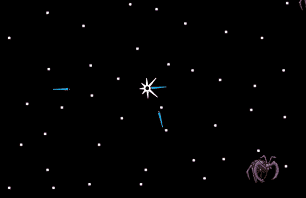
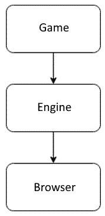
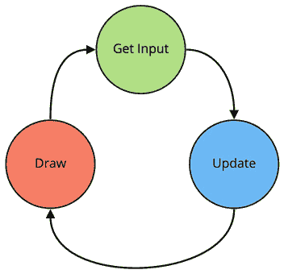
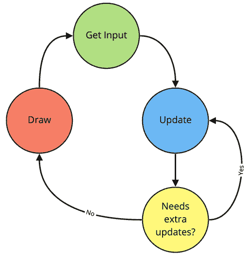

# *第三章*：创建游戏循环

在前两章中，我们专注于构建应用程序、设置环境和在屏幕上显示图形，而没有关注创建一个实际运行的游戏。这里没有交互性，也没有直接添加更多角色的简单方法，除非复制和粘贴更多代码。在本章中，这将改变，我们将添加游戏循环和键盘事件，但首先，我们需要重构代码，使其为新功能做好准备。准备好深入挖掘——这将是一个繁忙的章节。

我们将涵盖以下内容：

+   游戏的最小化架构

+   创建游戏循环

+   添加键盘输入

+   移动红帽男孩

到本章结束时，我们将拥有一个可以扩展新功能和处理输入的迷你游戏引擎。

# 技术要求

本章没有新的技术要求；我建议确保你的编辑器/IDE 设置对你来说很舒适。你将进行很多更改，你希望你的编辑器能帮助你。本章的源代码可在 [`github.com/PacktPublishing/Game-Development-with-Rust-and-WebAssembly/tree/chapter_3`](https://github.com/PacktPublishing/Game-Development-with-Rust-and-WebAssembly/tree/chapter_3) 找到。

观看以下视频以查看代码的实际效果：[`bit.ly/3qP5NMa`](https://bit.ly/3qP5NMa)

# 最小化架构

几年前，在准备一场关于 HTML5 游戏开发的演讲时，我有一个顿悟。在我预定演讲的前一天，我已经写好了幻灯片并准备好了演讲稿，但我有一个小问题——我没有演示！我需要一个游戏的演示来结束我的演讲；实际上，我在幻灯片中提到了它，所以我必须制作它。如果你曾经面临过截止日期，你就知道接下来会发生什么。我关于干净代码和软件架构的所有想法都被抛到了一边，我一边破解一边砍伐，最终在 HTML5 中制作出了 *《小行星》* 的工作原型。你仍然可以在我的 GitHub 上找到它：[`github.com/paytonrules/Boberoids`](https://github.com/paytonrules/Boberoids)，附带一个没有意义的名字。

根据几乎任何标准，代码都很糟糕。与 *第一章* 中的代码、*《Hello WebAssembly》* 和 *第二章* 中的 *《绘制精灵》* 一样，代码直线推进，没有模块、关注点分离或测试，这种代码从程序开始到结束都是暴力破解。但在那次演示的前一天凌晨 2 点左右，发生了一件有趣的事情——它竟然成功了！事实上，为了准备本章，我克隆了将近 10 年前的程序，运行 `python -m http.server`，浏览到 `http://localhost:8000`，然后，好吧，这里就是——一个基本上工作的 *《小行星》* 克隆：



图 3.1 – 带有公司标志的彗星

当然，这段代码也几乎不可能扩展或调试。没有封装，所有内容都在一个文件中；天哪，甚至没有合适的`README`文件。从任何客观标准来看，这都是**糟糕**的软件。

它太糟糕了，以至于在制作这个演示文稿的同时，我开始同时进行一个名为"*Eskimo*"的开源项目（[`github.com/paytonrules/Eskimo`](https://github.com/paytonrules/Eskimo)），该项目旨在成为一个**优秀**的游戏框架，拥有我那时所知的最佳面向对象设计，采用测试先行的方法，并内置了 CI 等特性。如果你查看提交日期，你可能会注意到我在这个项目上的最后提交是在你可以在前面的屏幕截图中看到的*Asteroids*克隆之后两年。如果你只是简单地做代码审查，代码实际上比上述游戏的代码要好得多。但它实际上并不工作。

我从未用*Eskimo*制作出一个可工作的游戏。像许多在我之前的开发者一样，我陷入了写框架而不是制作游戏的陷阱，花了很多时间“完善”我的框架，以至于我对我所声称制作的游戏失去了兴趣。这困扰了我很长时间，我一直在问自己这个问题，“为什么我在做所有错误的事情时完成了游戏，而在做正确的事情时失败了？”好的代码在现实生活中有什么真正的意义？

我不会让你保持悬念；为了这本书的目的，我们将把最小架构定义为一种**使下一个功能更容易实现**的架构。这意味着我们将做一些架构工作，但仅足够使未来的事情变得容易。我们将密切关注额外的复杂性和“镀金”。我们正在制作一个游戏，而不是一个引擎，我们希望完成这个游戏。

## 好的吗？糟糕的吗？我是那个有代码的人

最小架构听起来很简单，但可能很难，所以让我用一个反例来解释。

Eskimo 有一个`Events`对象，它通过一个构造函数创建，该构造函数接受`jquery`、`document`、一个`game`对象和一个`canvas`。它有所有这些，因为我将依赖注入的原则推向了极致，并试图确保`Events`对象不会直接依赖于这些事物中的任何一项。

问题是什么？这三个对象永远不会改变。你不会在任何游戏中替换`jquery`、`document`或`canvas`，至少不是用*Eskimo*，而且由于这个原因，理解 Eskimo 代码需要很多理解。虽然代码在理论上更加灵活，并遵循依赖反转原则（[`bit.ly/3uh7fWU`](http://bit.ly/3uh7fWU)），但它实际上使得添加未来的功能变得更加困难，因为我无法记住这些依赖项具体做了什么。我的错误是在没有理由的情况下，出于一种错误的“好代码”感，提前注入了这些依赖项。

我们将专注于我们的目标，即制作一个游戏，并不想陷入制作框架的困境。这意味着我们使程序演变成游戏的过程将在每次需要时引入一点灵活性。回到两个示例游戏，*Asteroids* 和 *Eskimo*，我们可以将它们视为在刚性尺度上。*Asteroids* 克隆非常刚性。它就像一根钢杆，如果你想改变它，你就不能。你只能打破它。与此同时，*Eskimo* 游戏框架具有无限的可塑性，以至于它实际上什么也做不了。它在自己身上坍塌成一块粘稠的物质。我们的游戏，也就是那个跑得这么远的红帽男孩，也是非常刚性的。添加第二个对象，比如狗，就需要在整个小型应用程序中更改大量代码，并可能引入缺陷。

因此，为了将我们的游戏添加更多功能，特别是交互性，我们需要引入一些灵活性。我们将加热我们的钢杆，使其可以弯曲，弯曲它，然后让它再次硬化。

## 分层架构

我们将首先引入一个小型分层架构。具体来说，我们将有三个层：



图 3.2 – 分层架构

这个架构的一条规则是，层只能使用其层或以下的东西。所以从底部开始，浏览器层将是一系列针对浏览器的特定小函数。例如，我们的 `window` 函数最终会在这里。同时，引擎层将是跨越我们游戏工作的工具，例如 `GameLoop` 结构。最后，游戏是包含我们实际游戏逻辑的层。最终，我们将花费大部分开发时间在这个层，尽管最初，我们将在 `Engine` 和 `Browser` 层花费大量时间，直到它们稳定下来。

为什么这样做？我们之前提到的规则是，任何架构的改变都必须使未来的改变更容易，所以让我们确定一下现在使改变困难的原因：

+   将所有内容都放在一个长函数中使代码难以跟踪。

+   提取所有 `Browser` 代码将使我们能够统一错误处理。

第一点反映的是我们的大脑只能容纳这么多信息。将所有代码放在一个地方意味着上下滚动试图找到东西的位置，并试图记住几乎所有的代码。将代码提取到各种具有**名称**的结构中，如模块、函数和结构体，让我们减少头脑中的信息量。这就是为什么合适的设计感觉编程起来很舒服。抽象过多，你就把跟踪程序所有细节的工作替换成了跟踪所有抽象的工作。我们将尽最大努力保持事物在最佳状态。

分层方法的原因之二特定于 Rust 和 `wasm-bindgen` 函数，它们都返回 `JsValue` 作为错误类型。虽然这在浏览器中工作得很好，但当与 Rust 程序的其他部分混合时则不太理想，因为 `JsValue` 没有实现大多数其他 Rust 错误实现的 `std::Error::error` 类型。这意味着你不能编写如下所示的函数：

```rs
async fn doesnt_compile() -> Result<(), Box<dyn std::error::Error>> {
    let window = web_sys::window()?;
    let json = fetch_json("rhb.json").await?;
    ...
}
```

之前的代码无法编译，因为虽然 `ThreadPool::new` 返回一个 `Result<ThreadPool, Error>`，但 `fetch_json` 返回 `Result<JsValue, JsValue>`，这些结果无法混合。在 `browser` 模块中，我们将使用 `anyhow` crate 将 JsValues 映射到标准错误，同时我们也将用它来隐藏 API 的奇怪细节，创建一个适合我们目的的 API。让我们开始创建我们的 `browser` 模块。

## 创建浏览器模块

第一步是在 `src` 目录下创建一个名为 `browser.rs` 的文件，并在 `lib.rs` 的顶部使用 `mod browser` 引用它。虽然理论上我们可以将每个模块都放在 `lib.rs` 中，但我们不是怪物，我们会将它们拆分成自己的文件。到本章结束时，`lib.rs` 将非常小。我们添加到 `browser` 的第一个功能实际上将是一个宏，一个全新的宏，如下所示：

```rs
macro_rules! log {
    ( $( $t:tt )* ) => {
        web_sys::console::log_1(&format!( $( $t )*
          ).into());
    }
}
```

我很乐意宣称我是一个伟大的宏程序员，一次就写出了那个宏，但事实是那个小小的宏直接来自 Rust 和 WebAssembly 文档 ([`bit.ly/3abbdJ9`](https://bit.ly/3abbdJ9))。这是一个允许你使用类似于 `format!` 函数的语法通过 `log!` 在控制台中进行日志记录的宏。在 `lib.rs` 中，给 `browser` 模块声明添加一个注解，如下所示：

```rs
#[macro_use]
mod browser;
```

这使得 `log!` 在使用 `browser` 模块时可用。鉴于我们将进行很多更改，我们可能需要一些简单的调试。下一步将是添加 `anyhow` crate，我们将使用它来统一 WebAssembly 和纯 Rust 代码的错误处理。依赖项添加到 `Cargo.toml` 中，作为 `anyhow = "1.0.51"`。这个 crate 提供了一些我们将广泛使用的功能：

+   符合 `std::error::Error` 特质的 `anyhow::Error` 类型

+   一个 `anyhow!` 宏，允许我们创建符合类型的错误消息，并使用字符串

+   一个 `anyhow::Result<T>` 类型，它是 `Result<T, anyhow::Error>` 的快捷方式

现在请将 `use anyhow::{anyhow, Result};` 添加到使用声明顶部，这样我们就可以在创建新函数时使用它们了。

现在 `browser` 模块已经准备好了，让我们从 `main` 的顶部开始向下工作，提取函数。让我们从这里开始：

```rs
#[wasm_bindgen(start)]
pub fn main_js() -> Result<(), JsValue> {
    console_error_panic_hook::set_once();
    let window = web_sys::window().unwrap();
    let document = window.document().unwrap();
```

`wasm_bindgen` 宏必须保留在那里，并且它只与返回 `Result<(), JsValue>` 的函数兼容。这意味着虽然我们可以在整个程序中使用适当的 Rust 错误，但在最后，如果我们想从这个函数返回，我们需要将其转换回 `JsValue`。幸运的是，一旦我们编写了游戏循环，这就不会成为问题。

重要提示

`Wasm_bindgen` 错误处理有点粗糙，Wasm 工作组已经注意到了这一点。为了参考，您可以在以下链接中查看缺陷：[`bit.ly/3d8x0D7`](https://bit.ly/3d8x0D7)。

接下来是执行代码，有两个函数可以直接拖入 `browser.rs` 文件。我们将一步一步地进行重构。首先，让我们在浏览器模块中创建一个函数，如下所示：

```rs
pub fn window() -> Result<Window> {}
```

这段代码无法编译，因为它没有返回任何内容，而且它对 `Window` 类型一无所知。请继续在文件顶部导入这些内容。它应该看起来像这样：

```rs
use web_sys::Window;
```

小贴士

如果您还没有做，请将 Rust Analyzer 与您选择的编辑器配合使用。我使用 emacs，并使用键盘快捷键 `c a` 来导入模块。这对于这类工作来说是一个节省时间的好方法。从现在开始，我不会记录您在移动文件时需要的每个 `use` 声明；只需遵循编译器错误即可。

该函数也无法编译，因为您没有返回任何内容。您可以开始直接复制（不要剪切）`lib.rs` 中的 `window()` 调用：

```rs
pub fn window() -> Result<Window> {
    web_sys::window().unwrap()
}
```

您在这里不需要用 `let` 绑定变量。由于那个 `unwrap`，这段代码仍然无法编译。在这种情况下，`web_sys::window` 返回 `Option<Window>`，`unwrap` 将提取 `Window` 对象，或者引发 panic。这些都不符合 `Result<Window>`，我们需要做的是处理 `window` 以某种方式缺失的错误情况。

重要提示

当尝试混合使用 `Option` 和 `Result` 时，有两种观点——使用 `ok` 将 `Result` 转换为 `Option`，或者使用 `ok_or_else` 将 `Result` 转换为 `Option`。我更喜欢后者，因为虽然这意味着要写很多包含 "`<X>`"（未找到）的错误消息，但另一种选择是失去有用的错误诊断。

为了使这个函数与 `Result<Window>` 返回类型兼容，记住，这是一个 `Result<Window, anyhow::Error>` 的缩写，我们将使用 `anyhow!` 宏。因此，为了将 `Option` 转换为 `Result` 并使这个函数编译，您可以这样做：

```rs
pub fn window() -> Result<Window> {
    web_sys::window().ok_or_else(|| anyhow!("No Window Found"))
}
```

现在您已经有一个函数，`browser::window()`，它将返回 `Window` 或适当的错误。

重要提示

Nightly Rust 目前有一个名为 `NoneError` 的错误，它有助于在 `Option` 和 `Result` 类型之间架起桥梁，但我们现在将坚持使用标准。

最后，我们可以将 `lib` 中的 `web_sys::window()` 调用替换为 `lib` 中的 `browser::window()` 调用：

```rs
let window = browser::window().expect("No Window Found");
let document = window.document().unwrap();
```

现在的`window()`调用将使用`expect`来确保如果没有窗口，程序会崩溃。稍后，你会看到我们可以使用`?`运算符，但到目前为止，我们必须绕过`main_js`返回`Result<(), JsValue>`。如果这是唯一需要更改的地方，引入`anyhow`就没有意义了。幸运的是，当我们用`browser`模块中的新`document`函数重复这个过程时，你可以看到优势。我们可以跳过那个过程的每个步骤，直接得到最终结果：

```rs
pub fn document() -> Result<Document> {
    window()?.document().ok_or_else(|| anyhow!
        ("No Document Found"))
}
```

如果这段代码无法编译，别忘了在模块顶部的`use`声明中添加`Document`。随着我们做出这些更改，你需要将`use`声明移动到`browser`中，但你将能够从`lib.rs`中删除它们。

现在，你实际上可以将`lib.rs`中的两个`window()`和`document()`调用缩减为一个调用，如下所示：

```rs
pub fn main_js() -> Result<(), JsValue> {
    console_error_panic_hook::set_once();
let document = browser::document().expect("No Document Found");
...
```

在`lib.rs`中有一个地方我们使用了刚刚删除的 window 变量。在`spawn_local` `Closure`的底部附近，在创建`interval_callback`之后，有一个调用`window.set_interval_with_callback_and_timeout_and_arguments_0`，可以用`browser::window().unwrap()`替换`window`。它看起来如下所示：

```rs
let interval_callback = Closure::wrap(Box::new(move || {
    ...
}) as Box<dyn FnMut()>);
browser::window()
    .unwrap()
    .set_interval_with_callback_and_timeout_and_arguments_0(
        interval_callback.as_ref().unchecked_ref(),
        50,
    );
interval_callback.forget();
```

我们接下来的函数将获取`canvas`对象，但比前两个函数要复杂一些。我们对那个部分的`unwrap`调用相当随意，所以我们需要做一些转换以获取更具体的错误。最终结果看起来像这样：

```rs
pub fn canvas() -> Result<HtmlCanvasElement> {
    document()?
        .get_element_by_id("canvas")
        .ok_or_else(|| anyhow!
            ("No Canvas Element found with ID 'canvas'"))?
        .dyn_into::<web_sys::HtmlCanvasElement>()
        .map_err(|element| anyhow!("Error converting {:#?}
          to HtmlCanvasElement", element))
}
```

在这里有几个值得特别注意的地方。首先，`get_element_by_id`调用硬编码为`'canvas'` ID。我们将继续保留这个设置，直到它引起问题为止，但我们将不会在需要之前将其设置为可配置的。接下来，我们使用了`ok_or_else`将`get_element_by_id`从`Option`转换为`Result`。最有趣的是对`dyn_into`函数的调用。如前所述，几乎每个调用 JavaScript 的函数都会返回`JsValue`类型，因为 JavaScript 是一种动态类型语言。我们知道`get_element_by_id`返回的元素将返回`HtmlCanvasElement`，至少如果我们已经检索到了正确的 JavaScript 节点，我们可以将其从`JsValue`转换为正确的元素。这就是`dyn_into`的作用——它将`JsValue`转换为适当的 Rust 类型。为了使用`dyn_into`，你必须导入`wasm_bindgen::JsCast`，因为 rust-analyzer 无法自动导入。它可以导入`web_sys::HtmlCanvasElement`。

我们将创建一个看起来非常相似的`context`函数：

```rs
pub fn context() -> Result<CanvasRenderingContext2d> {
    canvas()?
        .get_context("2d")
        .map_err(|js_value| anyhow!("Error getting 2d 
          context {:#?}", js_value))?
        .ok_or_else(|| anyhow!("No 2d context found"))?
        .dyn_into::<web_sys::CanvasRenderingContext2d>()
        .map_err(|element| {
            anyhow!( "Error converting {:#?} to
                      CanvasRenderingContext2d",
                      element
            )
        })
}
```

你在这里可能会看到一个奇怪的现象，那就是我们紧接着使用`map_err`和`ok_or`。这是因为`get_context`返回`Result<Option<Object>, JsValue>`，而旧代码通过两次调用`unwrap`来“解决”这个问题。所以我们现在所做的就是将错误（`JsValue`）映射到`Error`，然后取内部的`Option`并将`None`情况映射到一个值上。

记住，如果你在跟随并遇到编译困难，请更新你的 `use` 声明。让我们稍微加快一点速度。我们可以为 `spawn_local` 添加一个函数：

```rs
pub fn spawn_local<F>(future: F)
where
    F: Future<Output = ()> + 'static,
{
    wasm_bindgen_futures::spawn_local(future);
}
```

小贴士

如果你正在编写这样的包装器并且不确定签名应该是什么，首先看看你正在包装的函数，并模仿其签名。

让我们也在 `browser` 中添加 `JSON` 获取：

```rs
pub async fn fetch_with_str(resource: &str) ->
  Result<JsValue> {
    JsFuture::from(window()?.fetch_with_str(resource))
        .await
        .map_err(|err| anyhow!("error fetching {:#?}", 
                                err))
}
pub async fn fetch_json(json_path: &str) -> Result<JsValue> {
    let resp_value = fetch_with_str(json_path).await?;
    let resp: Response = resp_value
        .dyn_into()
        .map_err(|element| anyhow!("Error converting {:#?}
           to Response", element))?;
    JsFuture::from(
        resp.json()
            .map_err(|err| anyhow!("Could not get JSON from 
              response {:#?}", err))?,
    )
    .await
    .map_err(|err| anyhow!("error fetching JSON {:#?}", err))
}
```

我将 `fetch_json` 扩展为两个函数，因为我认为 `fetch_with_str` 将会可重用，但这并不是严格必要的。`fetch_json` 函数几乎不属于 `browser` 模块。一方面，它专门调用 `wasm_bindgen` API，将 `JsValue` 错误映射到标准的 `Error`；另一方面，当我们决定从响应中获取 `JSON` 时，那里有一点点行为。最终，这有点像是一种判断。

写完所有这些函数后，你可以回到 `lib.rs` 模块并更新主函数以使用新的函数。正如你所见，它已经开始显著缩小，顶部应该看起来像以下这样，在适当的地方使用浏览器模块中的新函数：

```rs
#[wasm_bindgen(start)]
pub fn main_js() -> Result<(), JsValue> {
    console_error_panic_hook::set_once();
    let context = browser::context().expect("Could not get 
      browser context");
    browser::spawn_local(async move {
        let sheet: Sheet = browser::fetch_json("rhb.json")
            .await
            .expect("Could not fetch rhb.json")
            .into_serde()
            .expect("Could not convert rhb.json into a 
                     Sheet structure");
        let image =
          web_sys::HtmlImageElement::new().unwrap();
...
```

你可以看到，我们移除了所有中间对 `window` 和 `context` 的调用，转而使用一个对 `context` 的调用。我们还刚刚使用 `expect` 调用 `fetch_json` 来抛出错误。最后，你会在 `window.set_interval_with_callback_and_timeout_and_arguments_0` 行看到一条编译错误。你可以通过将 `window` 替换为 `browser::window().unwrap()` 来修复它。`unwrap` 部分看起来很丑，但我们会继续重构，直到它也消失。它在上面的代码片段中没有重现，但你也可以从 `lib.rs` 中删除 `fetch_json` 函数；它不再被使用了。

这就带我们来到了下一个要提取的部分——加载图像。

## 加载图像

我敢打赌你认为你已经完成了图像的加载，不是吗？好吧，当我们将其转换为函数时，我们就会完成。让我们暂时再次看看原始实现：

```rs
let image = web_sys::HtmlImageElement::new().unwrap();
let (success_tx, success_rx) =
   futures::channel::oneshot::channel::<Result<(),JsValue>>();
let success_tx = Rc::new(Mutex::new(Some(success_tx)));
let error_tx = Rc::clone(&success_tx);
let callback = Closure::once(Box::new(move || {
    if let Some(success_tx) = 
      success_tx.lock().ok().and_then(|mut opt| opt.take())
    {
        success_tx.send(Ok(()));
    }
}));
let error_callback = Closure::once(Box::new(move |err| {
    if let Some(error_tx) = 
      error_tx.lock().ok().and_then(|mut opt| opt.take()) {
        error_tx.send(Err(err));
    }
}));
image.set_onload(Some(callback.as_ref().unchecked_ref()));
image.set_onload(Some(error_callback.as_ref().unchecked_ref()));
image.set_src("rhb.png");
success_rx.await;
```

乍一看，这似乎是 `browser` 模块中的一个函数，`load_image`，但仔细思考后，这里有很多内容只是一个函数。例如，如果你选择，你可以创建一个图像元素而不用担心它是否会被加载，或者你可能愿意使用 `set_src` 而不考虑它是否已加载。不，`let image = web_sys::HtmlImageElement::new().unwrap()` 之后的所有内容实际上是引擎行为。这意味着是我们创建第二个模块 `engine` 的时候了！

`engine` 模块将包含我们将贯穿整个游戏使用的库和函数。我们是 `engine` 模块。实际上，为了分解这种行为，我们将遵循几个步骤：

1.  创建一个 `browser` 函数，`new_image`。

1.  创建一个 `browser` 函数来创建 JS 闭包。

1.  创建一个 `engine` 模块。

1.  创建一个 `engine` 函数，`load_image`。

让我们从对`browser`的更改开始；我们将创建两个新函数来创建`Closure`和图像：

```rs
pub fn new_image() -> Result<HtmlImageElement> {
    HtmlImageElement::new().map_err(|err| anyhow!("Could 
      not create HtmlImageElement: {:#?}", err))
}
pub fn closure_once<F, A, R>(fn_once: F) ->
  Closure<F::FnMut>
where
    F: 'static + WasmClosureFnOnce<A, R>,
{
    Closure::once(fn_once)
}
```

第一个函数只是`HtmlImageElement`的一个包装器；没有太多可解释的。在未来，我们可能会决定我们想要自己的图像类型，但现在我们将坚持使用浏览器提供的类型。`closure_once`函数因其类型签名而变得复杂。在这种情况下，我们只是模仿`wasm_bindgen`中的`Closure::once`函数的完全相同的类型签名。稍后，我们将为`Closure`类型编写一些实用函数，以便更容易地使用它们，但在这个例子中，我们只创建一个直接的包装器。

重要提示

可以有力地论证，我们应该在这个模块中转换更多类型。具体来说，我们应该使用我们自己的类型来表示`Closure`、`HtmlImageElement`和其他浏览器提供的类型。这可能是一个更好的方法，但为了现在，我们将坚持使用提供的类型，以便学习材料并保持简单架构。像所有编程决策一样，这是一个权衡。

这涵盖了*步骤 1*和*步骤 2*，*步骤 3*很快——在源目录中创建一个名为`engine.rs`的文件，并将`mod engine`声明添加到`lib.rs`中。现在对于*步骤 4*，我们一直害怕的那个。在`engine.rs`中，添加以下内容：

```rs
pub async fn load_image(source: &str) -> Result<HtmlImageElement> {
    let image = browser::new_image()?;
    let (complete_tx, complete_rx) = 
      channel::<Result<()>>();
    let success_tx = 
      Rc::new(Mutex::new(Some(complete_tx)));
    let error_tx = Rc::clone(&success_tx);
    let success_callback = browser::closure_once(move || {
        if let Some(success_tx) =
          success_tx.lock().ok().and_then(
          |mut opt| opt.take()) {
            success_tx.send(Ok(()));
        }
    });
    let error_callback: Closure<dyn FnMut(JsValue)> = 
      browser::closure_once(move |err| {
        if let Some(error_tx) =
          error_tx.lock().ok().and_then(
          |mut opt| opt.take()) {
            error_tx.send(Err(anyhow!("Error Loading Image:
              {:#?}", err)));
        }
    });
    image.set_onload(Some(
      success_callback.as_ref().unchecked_ref()));
    image.set_onerror(Some(
      error_callback.as_ref().unchecked_ref()));
    image.set_src(source);
    complete_rx.await??;
    Ok(image)
}
```

我故意省略了`use`语句，这样你就能习惯于添加它们，并思考你需要和正在使用哪些声明。然而，这段代码有两个陷阱，我想指出：

+   为了使`unchecked_ref`编译，你需要使用`wasm_bindgen:JsCast`。

+   当你导入`channel`时，确保你选择`futures::channel::oneshot::channel`。`channel`有几种不同的实现，如果你不小心抓错了，这段代码将无法编译。

当你不确定时，看看`lib.rs`并验证哪些依赖项在那里被使用，因为这是这段代码被提取的地方。

回到我们添加的代码，请注意我们一直在使用我们新的`browser`函数，没有直接依赖于`wasm-bindgen`函数。我们仍然依赖于`wasm-bindgen`的`Closure`和`JSValue`类型，以及`unchecked_ref`函数，但我们已经减少了直接平台依赖的数量。我们唯一的 JS 依赖是`HtmlImageElement`。现在，看看函数的非常开始处，你会看到`new_image`调用可以使用`?`运算符在出现错误时提前返回，使用标准的 Rust 错误类型。这就是为什么我们在`browser`函数中映射了那些错误的原因。

在方法的第一行之后，函数的其余部分与之前基本相同，将任何直接调用`wasm-bindgen`函数替换为`browser`中的相应调用。我们已经将通道改为发送`anyhow::Result`，并在`error_callback`中使用`anyhow!`。这然后允许我们通过调用`complete_rx.await??`和`Ok(image)`来结束函数。这两个`??`不是误印；`complete_rx.await`返回`Result<Result<(), anyhow::Error>, Canceled>`。由于`anyhow::Error`和`Canceled`都符合`std::error::Error`，我们可以通过每次使用`?`来处理这些错误。

我们在这个函数中仍然有两个警告，因为两个`send`调用都返回了我们没有处理的`Result`。我们不能只是使用`?`，因为这些结果被`Closure`类型所包裹，所以我们将推迟处理这些不太可能发生的错误，并在*第九章*中介绍错误记录，*测试、调试和性能*。

现在你已经完成了所有这些，你应该能够替换`main`中的代码，调用我们新的函数：

```rs
let sheet: Sheet = json
    .into_serde()
    .expect("Could not convert rhb.json into a Sheet 
             structure");
let image = engine::load_image("rhb.png")
    .await
    .expect("Could not load rhb.png");
let mut frame = -1;
```

关于加载`Sheet`的内容没有任何变化；那只是为了确保你把它放在正确的位置。之后，动画我们的小**红帽男孩**（**RHB**）的代码开始，但我们根本不会使用它。那将被我们的游戏循环所取代，我们现在开始介绍它。

# 创建游戏循环

这款游戏的核心，以及几乎所有游戏，都只是一个无限循环。你可以把它们简化成这样：



图 3.3 – 基本游戏循环

这意味着，从理论上讲，这些实现起来非常简单，如下所示：

```rs
while(!quit) {
    handleInput()
    updateGame()
    drawGame()
}
```

核心来说，这就是我们要写的，但正如你可能猜到的，如果它那么简单，我就不会专门用一整章来介绍它了。不，我们在编写过程中将处理两个问题：

+   `requestAnimationFrame`函数。

+   **帧率和物理**：我们之前编写的循环会以计算机能运行的最快速度运行。嗯，互联网上的每台计算机速度都一样吗？当然不是，所以我们需要确保我们能在循环中考虑到机器速度的差异，尽可能做到这一点。我们将使用所谓的**固定步长**游戏循环来实现。

    重要提示

    如果你愿意，你可以写一本关于游戏循环的书，但本节在很大程度上借鉴了[`gameprogrammingpatterns.com/game-loop.html`](https://gameprogrammingpatterns.com/game-loop.html)和[`gafferongames.com/post/fix_your_timestep/`](https://gafferongames.com/post/fix_your_timestep/)。

## RequestAnimationFrame

我们将从`requestAnimationFrame`函数开始，这是一个浏览器函数，它“请求”尽快绘制新帧。然后浏览器将这个帧绘制在处理鼠标点击、操作系统事件和猫咪视频等事物之间。您可能会认为这会非常慢，但实际上，通常情况下，它能够以每秒 60 帧的速度渲染，只要您的游戏能够跟上。问题是，与之前我们的`setInterval`调用不同，这个函数需要在每个动画的末尾被调用。一个相当直接的 JavaScript 动画版本可能看起来像这样：

```rs
function animate(now) {
    draw(now);
    requestAnimationFrame(animate);
}
requestAnimationFrame(animate);
```

因此，`requestAnimationFrame`使用`animate`函数作为其参数被调用。浏览器随后在下一次帧上调用`animate`函数，绘制并请求下一个帧。这看起来像是一个无限循环，但实际上，由于`requestAnimationFrame`的调用，它并不会阻塞浏览器。这还接受一个参数`now`，它是回调函数开始时的毫秒时间戳。我们将使用这个时间戳来调整我们的物理引擎，随着游戏循环的演变。实际上，在 Rust 中编写游戏循环有点奇怪，因为借用保证，所以让我们先写一个非常基本的循环：

您可以从为`requestAnimationFrame`添加一个简单的包装器开始，如以下代码所示：

```rs
pub fn request_animation_frame(callback: &Function) -> 
  Result<i32> {
    window()?
        .request_animation_frame(callback)
        .map_err(|err| anyhow!("Cannot request animation
                                frame {:#?}", err))
}
```

`Function`类型是一个纯 JavaScript 类型，仅在`js-sys`包中可用。虽然我们可以导入它，但如果可能的话，我宁愿不添加另一个 crate 依赖；然而，如果我们对函数签名和实现进行一些小的修改，实际上我们不必直接使用`Function`类型：

```rs
pub fn request_animation_frame(callback: &Closure<
  dyn FnMut(f64)>) -> Result<i32> {
    window()?
        .request_animation_frame(callback.as_ref().unchecked_ref())
        .map_err(|err| anyhow!("Cannot request animation
                                frame {:#?}", err))
}
```

我们不使用`&Function`，而是`request_animation_frame`将接受`&Closure<dyn FnMut(f64)>`作为其参数。然后，在调用`web-sys`版本的`request_animation_frame`时，它将调用`callback.as_ref().unchecked_ref()`。这会将`Closure`转换为`Function`，而不需要显式依赖`Function`类型，这在您创建这些函数的自己的版本时值得思考。`web-sys`的制作者必须匹配每个潜在的使用场景，因此他们将创建尽可能广泛的接口。作为一个应用程序程序员，您不需要那个库中的大部分内容。因此，您可以将接口缩小到自己的使用场景，这样会使您的工作更加容易。实际上，为了使事情更加简洁，我们将将其转换为一种类型，其中有一个小的变化：

```rs
pub type LoopClosure = Closure<dyn FnMut(f64)>;
pub fn request_animation_frame(callback: &LoopClosure) ->
  Result<i32> {
// ...
```

从我的小抱怨继续，您可能会认为现在可以编写一个简单的游戏循环，如下所示：

```rs
pub fn animate(perf: f64) {
    browser::request_animation_frame(animate);
}
```

啊，如果只有，但请记住，我们需要传递一个 JavaScript `Closure`，而不是 Rust `fn`。使用我们之前使用的`Closure::once`将不起作用，因为这个闭包将被多次调用，但幸运的是，有`Closure::wrap`，它将做到这一点。我们将在`browser`中创建一个针对`request_animation_frame`函数的特定`Closure`的函数，称为`create_raf_closure`：

```rs
pub fn create_raf_closure(f: impl FnMut(f64) + 'static) ->
  LoopClosure {
    closure_wrap(Box::new(f))
}
```

传入的函数具有`'static`生命周期。任何传递给这个函数的`FnMut`都不能有任何非静态引用。这不是我个人的决定；这是我们将要调用的`Closure::wrap`函数的要求。

小贴士

想了解更多关于静态生命周期的信息，请查看*Rust by Example*书籍，免费在此处提供：[`doc.rust-lang.org/rust-by-example/scope/lifetime/static_lifetime.html`](https://doc.rust-lang.org/rust-by-example/scope/lifetime/static_lifetime.html)。

说到`Closure::wrap`，让我们将其包裹在`closure_wrap`函数中，这样我们刚刚添加的代码就可以编译了，如下所示：

```rs
pub fn closure_wrap<T: WasmClosure + ?Sized>(data: Box<T>)
  -> Closure<T> {
    Closure::wrap(data)
}
```

这是一个包装函数，我们只是匹配被包装函数的相同签名——`Closure::wrap`。因为`Closure`上的`wrap`函数创建了一个可以多次调用的`Closure`，所以它需要被包裹在`Box`中并存储在堆上。

小贴士

`wasm-bindgen`的夜间构建提供了一个更方便的`new`函数，它可以为你处理装箱。在这本书中，我们将坚持使用稳定构建，但你可以尝试使用夜间构建。

现在你已经了解了基本的游戏循环和如何调用`request_animation_frame`，你可能认为，“我已经搞定了”，并创建如下游戏循环：

```rs
let animate = create_raf_closure(move |perf| {
    request_animation_frame(animate);
});
request_animation_frame(animate);
```

这更接近了，但还不是最终结果。记得之前提到的，我们传递给`create_raf_closure`的`Closure`必须具有`'static`生命周期，这意味着`Closure`引用的所有内容都必须由闭包拥有。目前并不是这样。`animate`变量属于当前作用域，并在该作用域完成时被销毁。当然，`animate`本身就是`Closure`，因为这是一个自引用数据结构。`animate`变量是`Closure`，但也在`Closure`内部被引用。这是 Rust 的一个经典问题，因为`borrow`检查器不允许这样做。

想象一下，如果情况不是这样会怎样——如果`animate`可以在`Closure`中被引用，但属于`Closure`外部的作用域。当程序退出这个作用域时，它将被销毁，而`Closure`将不再有效——这是一个`Null`指针错误，并且会导致崩溃。这就是自引用数据结构的问题，因此我们需要找到一种绕过`borrow`检查器的方法。

由于目前还没有地方放置这段代码，让我们再次尝试一个假设的循环：

```rs
let f = Rc<RefCell<Option<LoopClosure>>> =  
  Rc::new(RefCell::new(None));
let g = f.clone();
let animate = Some(create_raf_closure(move |perf: f64| {
    request_animation_frame(f.borrow().as_ref().unwrap());
});
*g.borrow_mut() = animate;
request_animation_frame(g.borrow().as_ref().unwrap());
```

目前，我有点希望我在写 JavaScript，但让我们慢慢地通过这段代码。我们正在做的是创建两个指向内存中同一位置的引用，使用`Rc` `struct`，使我们能够同时将`f`和`g`指向同一事物，同时将`f`移动到`animate Closure`中。另一个技巧是它们都指向`Option`，这样我们可以在`f`完全定义之前将其移动到`Closure`中。最后，当我们通过`*g.borrow_mut() = animate`将`Closure`赋值给`g`时，我们`f`因为它们指向同一位置。你明白了吗？不，我也不明白。让我们快速回顾一下类型，以重申我们做了什么。`f`被设置为以下内容：

+   使用`Rc`创建一个引用计数指针

+   使用`RefCell`允许内部可变性

+   `Option`允许我们将`f`赋值为`None`

+   `LoopClosure`用于持有与`request_animation_frame`参数匹配的可变`Closure`

然后`g`被设置为`f`的一个克隆，这样它们就指向同一事物，`f`被移动到`animate` `Closure`中。通过解引用`*`运算符和`borrow_mut`函数，`g`被赋值给`animate`。因为`f`指向与`g`同一位置，它也将包含`animate Closure`。最后，我们可以通过借用它，将其转换为引用，并调用`unwrap`来实际获取真正的`Closure`来调用`request_animation_frame`。是的，`unwrap`又回来了；我们将在创建我们的真实函数时处理其中一个。最后，当`g`离开作用域时，它可以被销毁，因为`f`仍然在`Closure`中，并将保留内存。

重要提示

再次，我很想为这段代码争取功劳，但事实是它大部分定义在`wasm-bindgen`指南中，[`bit.ly/3v5FG3j`](https://bit.ly/3v5FG3j)。

现在我们已经知道了我们的游戏循环的核心将是什么样子，我们该如何将它与一个游戏整合呢？

## 一个游戏特性

要编写我们的游戏循环，我们有几种选择。我们可以直接在循环中编写游戏，但这会与之前开始的样子非常相似。我们可以创建一个`GameLoop`结构体，包含`update`和`draw`函数，这是一个显著的改进，但仍然将所有内容绑定到一个结构体中。我们将稍微超出这个范围，并从流行的游戏框架 XNA 或其现代版本 MonoGame 中汲取灵感。在 XNA 框架中，游戏开发者将实现一个`Game`类型，包含`update`和`draw`方法。这比将所有代码都堆在一个地方稍微复杂一些，但比完整的实体-组件框架要简单得多。它应该适合我们的目的，因为它从小的开始，并且随着游戏的扩大应该允许扩展。XNA 之所以非常成功，是有原因的。

重要提示

你可以在[`www.monogame.net/`](https://www.monogame.net/)了解 XNA 的现代等价物，MonoGame。

我们将创建一个接受任何实现了`Game`特质的`start`函数。`Game`特质将包含两个函数，`update`和`draw`。我们将通过游戏循环首先更新然后绘制场景。所有这些都将放入`engine`模块；实际上，可以说这是我们整个“引擎”。让我们从简单的版本开始——首先，是特质：

```rs
pub trait Game {
    fn update(&mut self);
    fn draw(&self, context: &CanvasRenderingContext2d);
}
```

到目前为止一切顺利。注意`draw`函数如何接受`CanvasRenderingContext2d`作为参数。现在，对于循环的其余部分——你可以在`Game`特质或`load_image`之后添加这个，实际上这并不重要，只要它在`engine`模块中即可：

```rs
pub struct GameLoop;
type SharedLoopClosure = Rc<RefCell<Option<LoopClosure>>>;
impl GameLoop {
    pub async fn start(mut game: impl Game + 'static) -> 
      Result<()> {
        let f: SharedLoopClosure =
          Rc::new(RefCell::new(None));
        let g = f.clone();
        *g.borrow_mut() = Some(
          browser::create_raf_closure(move |perf: f64| {
            game.update();
            game.draw(&browser::context().expect("Context
              should exist"));
            browser::request_animation_frame(
              f.borrow().as_ref().unwrap());
        }));
        browser::request_animation_frame(
            g.borrow()
                .as_ref()
                .ok_or_else(|| anyhow!("GameLoop: Loop is 
                                        None"))?,
        )?;
        Ok(())
    }
}
```

这稍微大一点，但没有什么是你以前没见过的。我们将创建一个没有数据的`GameLoop`结构体，并添加一个`SharedLoopClosure`类型来简化`f`和`g`变量的类型。然后，我们将添加一个`GameLoop`的实现，包含一个名为`start`的方法，该方法接受`Game`特质作为参数。请注意，特质是`'static`，因为任何移动到“raf”闭包中的内容都必须是`'static`。我们遵循之前使用的片段来设置我们的`request_animation_frame`循环，关键变化在于内部，我们在更新后绘制，传递`draw`函数的`CanvasRenderingContext2d`。

这种简单游戏循环存在一个问题。通常，`request_animation_frame`每秒运行 60 帧，但如果`update`或`draw`任一函数的执行时间超过 1/60 秒，它将减慢速度，使游戏运行得更慢。很久以前，我记得通过关闭桌面上的“**Turbo**”按钮来击败关卡，这使得以前不可能的挑战变得容易，因为游戏在较慢的速度下更容易玩。由于我们希望在处理器速度不同的情况下保持一致的游戏体验，我们将采取一个称为“固定”时间步的通用方法。

## 修复我们的时间步

你可能会注意到我们编写的`update`函数没有接受`perf`作为参数；实际上，它是未使用的。现在，想象一下尝试模拟一只狗在屏幕上奔跑，没有任何关于帧间时间间隔的知识。根据计算机和你的猜测，狗可能会悠闲地从左到右漫步，或者像子弹一样飞过去。我们可以做的是在每个更新时发送 delta 时间，这可以工作，但会很快变得复杂。相反，我们将假设每个 tick 的时间相同，即 1/60 秒，并在落后时多次调用`update`以“赶上”。看起来是这样的：



图 3.4 – 固定步长游戏循环

这不是一个完美的解决方案；如果我们的游戏非常慢，它将陷入停滞，但应该足够满足我们的需求。这就是为什么我让我们创建了一个`GameLoop`结构体——为了跟踪上一次更新的时间。我们将在`GameLoop`结构体中添加两个字段：

```rs
const FRAME_SIZE: f32 = 1.0 / 60.0 * 1000.0;
pub struct GameLoop {
    last_frame: f64,
    accumulated_delta: f32,
}
```

这添加了一个表示帧长度的常量，转换为毫秒。我们将在`last_frame`字段中跟踪上一帧何时被请求，并将累积一个 delta，总计自上次渲染以来的物理时间。这并不完全相同，正如你将在`start`函数中实现该计数器时看到的那样。说到那个函数，我们将在该函数的开始处初始化一个可变的`GameLoop`：

```rs
impl GameLoop {
    pub async fn start(mut game: impl Game + 'static) ->
      Result<()> {
        let mut game_loop = GameLoop {
            last_frame: browser::now()?,
            accumulated_delta: 0.0,
        };
        ...
```

这以适当的方式初始化了`GameLoop`，使用`now`作为上一帧的时间而不是`0`，这样我们的循环就不会在第一次渲染之前执行数百万次更新。`browser::now()`尚未实现，所以你需要将其添加到`browser`模块中：

```rs
pub fn now() -> Result<f64> {
    Ok(window()?
        .performance()
        .ok_or_else(|| anyhow!
            ("Performance object not found"))?
        .now())
}
```

这只是一个围绕网络浏览器`now`函数的包装器。如果你一直认真跟随，你可能会认识到这会导致编译错误。你需要将"`Performance`"功能标志添加到`web-sys`功能列表中，以引入该函数。

现在我们已经创建了一个游戏循环对象，在`request_animation_frame`闭包内部，我们将添加我们的累加器：

```rs
*g.borrow_mut() = Some(browser::create_raf_closure(move 
  |perf: f64| {
    game_loop.accumulated_delta += (
      perf - game_loop.last_frame) as f32;
    while game_loop.accumulated_delta > FRAME_SIZE {
        game.update();
        game_loop.accumulated_delta -= FRAME_SIZE;
    }
    game_loop.last_frame = perf;
    game.draw(&browser::context().expect("Context should
      exist"));
```

与上次相比，变化的是我们不再立即调用`update`函数，而是计算`perf`与`request_animation_frame`函数开始执行回调函数的时间之间的差异。如果你记得，`perf`是一个高精度时间戳。我们获取现在（在`perf`中）和上一帧之间的差异，并将其添加到`accumulated_delta`中。然后，我们将其与期望的`FRAME_SIZE`（那是 1/60 秒）进行比较，如果有`update`。然后我们从 delta 中减去帧大小。这一切的效果是什么？如果`game.draw`执行时间过长，以至于我们无法在 1/60 秒内完成 1 帧，代码将运行额外的更新来赶上。

在这里举一个例子很有帮助。假设你在世界开始的时间`0`开始玩游戏。当第一次执行`request_animation_frame`回调时，它可能非常接近`0`，可能低至`1`毫秒，因为没有在第一帧上延迟。代码会将这个值加到`accumulated_delta`上，然后与`FRAME_SIZE`比较，发现积累的 delta 还不够，所以跳过`update`。`last_frame`值被存储（我们再次说它是`1`），屏幕被绘制，然后调用`request_animation_frame`。

第二次，`perf`的值可能大约是第一帧的大小。我们将使用`17`毫秒进行简单计算。所以`perf`是`17`；从它减去`last_frame`，即`1`，并将`16`毫秒加到`accumulated_delta`上。新的`accumulated_delta`值是`17`，所以游戏更新一次，`accumulated_delta`减少到`1`。游戏继续进行一次更新到一次绘制，直到出现问题。`draw`调用需要`40`毫秒！谁知道为什么——也许是一段意外的自动播放视频启动，消耗了资源。这无关紧要，因为`accumulated_delta`激增到`40`，这比`2`帧大。现在，`accumulated_delta`上的循环运行`update`两次，丢弃一帧动画来补偿性能下降。这里要记住的重要事情是，它丢弃了一个*draw*但不是一个*update*，所以尽管玩家可能会看到一些视觉伪影，物理仍然可以正常工作。

重要提示

你可能会想知道额外的`accumulated_delta`会发生什么，因为它不太可能是`FRAME_SIZE`的精确倍数。更高级的游戏循环会将这个值传递给绘制，并使用它来在两个更新值之间进行插值。对于我们的游戏，我们不需要这个功能，只需将那个`delta`滚动到下一帧。

重要提示

为什么使用`f32`作为`accumulated_delta`？你观察得真仔细！简短的版本是，因为我们可以。稍微长一点的版本是，我们只使用`f64`，因为 JavaScript 使用 64 位的`Number`类型来表示所有数字。如果我能，我会尽可能使用更小的值，以及整数，因为`f64`的额外大小并不是真的必要，并且当它被重复使用时可能会对性能产生意外的拖累。

所以，这就是你的游戏循环——至少是它的“循环”部分。虽然现在它是可用的，但它不提供一种轻松加载我们资源的方法。虽然我们可以保持现状，并在开始游戏循环之前始终加载资源，但一个更干净的方法是将这个规则集成到游戏循环中。

## 加载资源

将我们的游戏循环扩展以处理加载资源，需要向我们的特质中添加一个函数，一个精确的`async`函数。这将允许我们将目前被`lib`中的`spawn_local`包裹的所有异步代码放入一个返回包含`Game`的`Result`的函数中。你可以从向`Game`特质添加该函数开始：

```rs
pub trait Game {
    async fn initialize(&self) -> Result<Box<dyn Game>>;
    fn update(&mut self);
    fn draw(&self, context: &Renderer);
}
```

很不幸，这不能编译。`async`特质函数还没有在稳定的 Rust 中实现，但幸运的是，我们可以使用一个 crate 来获取这个功能。将`async-trait = "0.1.52"`添加到`Cargo.toml`中，然后向特质添加以下属性宏：

```rs
#[async_trait(?Send)]
pub trait Game {
```

你还需要导入`async_trait::async_trait`。`async_trait`允许我们在特质中添加`async`函数。我们可以使用它与`?Send`特质一起，因为我们不需要我们的 futures 是线程安全的。现在，我们可以将其添加到游戏循环中：

```rs
impl GameLoop {
    pub async fn start(game: impl Game + 'static) ->
      Result<()> {
        let mut game = game.initialize().await?;
        ....
```

就这样！游戏被异步初始化，第一行是`Result`。请注意，传入的`game`不再需要是可变的，因为我们没有在任何地方修改它。我们几乎准备好将我们的旧`set_interval`集成到这个中，但我想在绘制周围做一点清理工作。

## 清洁绘图

目前，我们正在向绘制循环发送原始的`CanvasRenderingContext2d`，带有所有那些尴尬的函数，例如`draw_image_with_html_image_element_and_sw_and_sh_and_dx_and_dy_and_dw_and_dh`。这可以工作，但看起来很糟糕，而且就像我们在`browser`模块中所做的那样，我们可以使用一个包装器来将上下文的宽接口缩小到更小的一个，以适应我们的需求。我们将用我们自己的`Renderer`对象替换传递`CanvasRenderingContext2d`，该对象具有更易于使用的函数。

我们将首先在`engine`中为我们的`Renderer`创建一个结构：

```rs
pub struct Renderer {
    context: CanvasRenderingContext2d,
}
```

这是一个简单的包装器，包含渲染上下文。现在，我们只需将两个实现方法添加到`Renderer`结构中：

```rs
impl Renderer {
    pub fn clear(&self, rect: &Rect) {
        self.context.clear_rect(
            rect.x.into(),
            rect.y.into(),
            rect.width.into(),
            rect.height.into(),
        );
    }
    pub fn draw_image(&self, image: &HtmlImageElement,
      frame: &Rect, destination: &Rect) {
        self.context
            .draw_image_with_html_image_element_and_sw_and_sh_                and_dx_and_dy_and_dw_and_dh(
                &image,
                frame.x.into(),
                frame.y.into(),
                frame.width.into(),
                frame.height.into(),
                destination.x.into(),
                destination.y.into(),
                destination.width.into(),
                destination.height.into(),
            )
            .expect("Drawing is throwing exceptions!
                     Unrecoverable error.");
    }
}
```

这两个函数，`clear`和`draw_image`，都封装了`context`函数，但使用更少的参数。我们不是传递四个参数和`clear_rect`，而是传递`clear` `Rect`。我们不是传递那个极其长的函数名，而是传递`draw_image` `HtmlImageElement`和两个`Rect`结构。目前，如果我们不能绘制，我们会使用`expect`来 panic！我相信这应该返回`Result`。

重要提示

到现在为止，这本书中有些代码你可能认为可以做得更好。试试看！我总是在跟随书籍时这样做，你没有理由不这样做。只是尽量记住你与书籍的不同之处。

当然，这两个函数都接受`Rect`，但我们没有`Rect`结构。让我们现在将`Rect`添加到`engine`中：

```rs
pub struct Rect {
    pub x: f32,
    pub y: f32,
    pub width: f32,
    pub height: f32,
}
```

现在，我们可以将绘制函数更改为接受`Renderer`而不是`CanvasRenderingContext2d`。因此，我们更新了特质：

```rs
#[async_trait(?Send)]
pub trait Game {
    ...
    fn draw(&self, renderer: &Renderer);
}
```

然后，我们可以对循环进行修改。目前，我们在传递给`create_raf_closure`的`Closure`中创建`context`。这个调用返回`Result`，因此要访问`context`，我们必须调用`unwrap`或`expect`。现在我们可以使用的更简洁的方法是在`Closure`外部创建`Renderer`，如下所示：

```rs
let mut game_loop = GameLoop {
    last_frame: browser::now()?,
    accumulated_delta: 0.0,
};
let renderer = Renderer {
    context: browser::context()?,
};
...
*g.borrow_mut() = Some(browser::create_raf_closure(
  move |perf: f64| {
    ...
    game.draw(&renderer);
    browser::request_animation_frame(f.borrow().as_ref().        unwrap());
}));
```

将这个移出`request_animation_frame`闭包意味着我们不再需要使用`expect`语法了——太好了！

将`draw`修改为`game.draw(&renderer)`的小改动将使我们的`draw`函数更容易编写。我认为我们正在实现我们的目标，即通过改变代码使其*更容易*前进。让我们通过将我们的动画代码从`lib`中取出并使用游戏循环来证明这一点。

## 集成游戏循环

我们已经编写了这个游戏循环，这很好，但现在是时候真正使用它了。记住，我们有 `GameLoop` 结构体，但它操作的是 `Game` 特质。因此，为了使用这个循环，我们需要实现这个特质。我们将在另一个模块 `game` 中实现它，我们将在 `game.rs` 中创建它，然后使用 `lib.rs` 中的 `mod game` 指令声明将其添加到库中。我们将从几个结构体开始：

```rs
use crate::engine::{Game, Renderer};
use anyhow::Result;
use async_trait::async_trait;
pub struct WalkTheDog;
#[async_trait(?Send)]
impl Game for WalkTheDog {
    async fn initialize(&self) -> Result<Box<dyn Game>> {
        Ok(Box::new(WalkTheDog {}))
    }
    fn update(&mut self) {}
    fn draw(&self, renderer: &Renderer) {}
}
```

确保添加 `#[async_trait(?Send)]` 注解，这允许你实现具有 `async` 函数的特质。只要你从 `engine` 中添加所需的 `use` 声明，就可以编译，因为 `Game` 按需实现了这个特质。它实际上什么都没做，但可以编译。`initialize` 函数可能看起来有点奇怪，因为我们正在取 `self` 并将其丢弃，以换取一个新的 `WalkTheDog` 结构体——而且是在堆上丢弃！我们这样做是为了在下一章中看到的一些更改，所以现在就请耐心等待。

现在，让我们将来自 `lib.rs` 的绘制代码移动到 `draw` 中，并在过程中更新它：

```rs
fn draw(&self, renderer: &Renderer) {
    let frame_name = format!("Run ({}).png", self.frame +
                              1);
    let sprite = self.sheet.frames.get(&frame_name).expect(
      "Cell not found");
    renderer.clear(Rect {
        x: 0.0,
        y: 0.0,
        width: 600.0,
        height: 600.0,
    });
    renderer.draw_image(
        &self.image,
        Rect {
            x: sprite.frame.x.into(),
            y: sprite.frame.y.into(),
            width: sprite.frame.w.into(),
            height: sprite.frame.h.into(),
        },
        Rect {
            x: 300.0,
            y: 300.0,
            width: sprite.frame.w.into(),
            height: sprite.frame.h.into(),
        },
    );
}
```

这只包含对 `lib.rs` 中代码的微小更改，尽管它肯定无法编译。对 `context` 的调用被替换为对 `renderer` 的调用，并且我们使用了新的 `Rect` 结构体。这无法编译，因为 `self` 没有包含 `sheet`、`frame` 或 `image`。我们需要将它们添加到 `game` 模块中，如下所示：

```rs
#[derive(Deserialize)]
struct SheetRect {
    x: i16,
    y: i16,
    w: i16,
    h: i16,
}
#[derive(Deserialize)]
struct Cell {
    frame: SheetRect,
}
#[derive(Deserialize)]
pub struct Sheet {
    frames: HashMap<String, Cell>,
}
pub struct WalkTheDog {
    image: HtmlImageElement,
    sheet: Sheet,
    frame: u8,
}
```

在这里，我们将从 `lib.rs` 中序列化精灵图精灵的代码移动到 `WalkTheDog` 结构体中，并为 `frame`、`HtmlImageElement` 和 `Sheet` 添加了字段。请注意，我们从 `lib` 中取出了 `Rect` 并将其重命名为 `SheetRect`。这是从我们的精灵图中特定的矩形。在 `game` 中，我们也有一个 `Rect` 结构体。这是我们用作游戏域对象的矩形。这种重命名现在可能有些令人困惑，但它是为了区分这两个矩形，并且在我们继续前进时是有帮助的。

`WalkTheDog` 结构体具有使 `draw` 编译所需的字段，但它可能会让你对 `initialize` 提出疑问。具体来说，如果我们打算将我们的加载代码移动到 `initialize` 中，`WalkTheDog` 结构体是否真的总是有 `HtmlImageElement` 和 `Sheet`？不，它不是。我们需要将这些字段转换为 `Option` 类型，并使 `draw` 函数考虑到它们：

```rs
pub struct WalkTheDog {
    image: Option<HtmlImageElement>,
    sheet: Option<Sheet>,
    frame: u8,
}
```

我们可以使用 `as_ref()` 函数来借用 `image` 和 `sheet`，然后使用 `and_then` 和 `map` `Option` 函数干净地获取帧并绘制它：

```rs
fn draw(&self, renderer: &Renderer) {
    let frame_name = format!("Run ({}).png", self.frame + 1);
    let sprite = self
        .sheet
        .as_ref()
        .and_then(|sheet| sheet.frames.get(&frame_name))
        .expect("Cell not found");
    renderer.clear(&Rect {
        x: 0.0,
        y: 0.0,
        width: 600.0,
        height: 600.0,
    });
    self.image.as_ref().map(|image| {
        renderer.draw_image(
            &image,
            &Rect {
                x: sprite.frame.x.into(),
                y: sprite.frame.y.into(),
                width: sprite.frame.w.into(),
                height: sprite.frame.h.into(),
            },
            &Rect {
                x: 300.0,
                y: 300.0,
                width: sprite.frame.w.into(),
                height: sprite.frame.h.into(),
            },
        );
    });
```

这很好——我们有一个什么也不绘制的游戏，但这没关系，因为我们的初始化代码仍然无法编译。让我们准备绘制，将 `lib.rs` 中的加载代码复制到游戏循环中的 `initialize` 函数。现在不要进行任何剪切和粘贴；我们将在最后清理 `lib.rs`。`Initialize` 应该看起来像这样：

```rs
impl Game for WalkTheDog {
    async fn initialize(&self) -> Result<Box<dyn Game>> {
        let sheet: Sheet = browser::fetch_json("rhb.json")
            .await
            .expect("Could not fetch rhb.json")
            .into_serde()
            .expect("Could not convert rhb.json into a 
                     Sheet structure");
        let image = engine::load_image("rhb.png")
            .await
            .expect("Could not load rhb.png");
        Ok(Box::new(WalkTheDog {
            image: Some(image),
            sheet: Some(sheet),
            frame: self.frame,
        }))
    }
    ...
```

那是一个很好的复制粘贴，但我们可以通过使用`?`操作符使其更加简洁。这是改进后的版本：

```rs
    async fn initialize(&self) -> Result<Box<dyn Game>> {
        let sheet = browser::fetch_json(
          "rhb.json").await?.into_serde()?;
        let image = 
          Some(engine::load_image("rhb.png").await?);
        Ok(Box::new(WalkTheDog {
            image,
            sheet,
            frame: self.frame,
        }))
    }
```

看看那个函数有多小、多干净。我们只尝试了三次，但最终做到了。现在我们有了`initialize`和`draw`，我们可以编写`update`函数。我们在`lib.rs`中编写的版本使用了`set_interval_with_callback_and_timeout_and_arguments_0`来动画化我们的红帽男孩，但那不再适用了。相反，`update`函数需要跟踪经过的帧数，并在适当的时候前进。在原始代码中，我们每`50`毫秒调用一次`set_interval`回调。在这段新代码中，`update`将每秒的 1/60，即`16.7`毫秒被调用。因此，为了大约匹配动画，我们希望每三次更新就更新当前精灵帧；否则，我们的小 RHB 会跑得非常快。

如果你查看`rhb.json`文件，你会看到`Run`动画中有八个帧。如果我们想每 3 次更新前进一个精灵帧，这意味着完成动画需要 24 次更新。到那时，我们将想要回到开始处再次播放。所以，我们需要从`update`函数中更新的帧计数计算精灵帧：

```rs
fn update(&mut self) {
    if self.frame < 23 {
        self.frame += 1;
    } else {
        self.frame = 0;
    }
}
```

这与我们的当前`draw`代码不兼容，因为它使用`frame`来查找要渲染的精灵。当它查找不存在的`Run (9).png`时，程序会崩溃。我们将更新`draw`函数，从`frame`获取精灵索引：

```rs
fn draw(&self, renderer: &Renderer) {
    let current_sprite = (self.frame / 3) + 1;
    let frame_name = format!("Run ({}).png", 
      current_sprite);
    ...
```

`current_sprite`变量将从 1 循环到 8，然后再次循环。你信不过我？欢迎使用我们之前编写的`log!`宏来检查我的工作；事实上，我鼓励你这么做。不是因为我很自大，而是因为总是对代码进行实验，而不是盲目地输入，总是好的。然后我们用那个数字来查找帧名。

完成这个任务后，我们现在有一个可以渲染到画布上的游戏循环，以及一个渲染我们跑步的 RHB 的游戏；我们只需要将其集成。我们将在`engine`中的`WalkTheDog`结构体定义下方添加一个普通的构造函数：

```rs
impl WalkTheDog {
    pub fn new() -> Self {
        WalkTheDog {
            image: None,
            sheet: None,
            frame: 0,
        }
    }
}
```

没有什么特别之处——只是为了让创建游戏对象更容易。现在，对于你一直等待的时刻——整合所有这些更改的新主函数：

```rs
#[wasm_bindgen(start)]
pub fn main_js() -> Result<(), JsValue> {
    console_error_panic_hook::set_once();
    browser::spawn_local(async move {
        let game = WalkTheDog::new();
        GameLoop::start(game)
            .await
            .expect("Could not start game loop");
    });
    Ok(())
}
```

真的，就是这样——这就是全部。你创建一个本地 future，创建一个新的游戏，然后调用`GameLoop::start(game).await`来启动它。你可以从`lib.rs`中删除所有未使用的代码，例如额外的`use`声明和当所有内容都在这里时我们定义的结构。看起来很棒！

我们为了达到这个目标修改了很多代码，但现在我们有一个带有正确循环的运行游戏。我们本可以在这里结束这一章，但如果代码实际上做了些新的事情，那会更好，不是吗？

# 添加键盘输入

大多数游戏都有某种形式的用户输入；否则，它们就不再是游戏了。在本节中，我们将开始监听键盘事件，并使用它们来控制我们的 RHB。这意味着将键盘输入添加到游戏循环中，并将其传递给`update`函数。我们不会做的事情是进一步的重构。系统在这个阶段已经相当模块化，并且可以接受我们的新更改。

我们获取键盘事件的具体过程可能与你习惯的 Web 开发有所不同。在一个普通程序中，你会监听按键被按下——换句话说，按下然后释放——然后做一些事情，比如在按钮释放时更新屏幕。这与游戏不符，因为典型的玩家希望在按键按下时立即发生动作，并且希望它在按下期间持续。想象一下用箭头键在屏幕上移动。你期望在按下箭头键的瞬间开始移动，而不是在释放它之后。此外，传统的编程不考虑像同时按下“上”和“右”这样的情况。如果我们将这些作为两个独立的行为处理，我们将先向右移动，然后向上，然后再次向右，然后向上，就像我们在上楼梯一样。我们将监听每一个`keyup`和`keydown`事件，并将它们全部打包成一个`keystate`，该状态存储了所有当前按下的键。然后我们将这个状态传递给`update`函数，以便游戏可以确定如何处理所有当前按下的键。

重要提示

这种方法在游戏中很常见，但也带来一个缺点。如果你想只在按钮被按下时触发某些动作，比如开枪，你必须跟踪前一个更新是否有键被抬起，下一个更新是否有键被按下。因此，通过从事件驱动方法切换到全局键状态，我们失去了事件。幸运的是，这很容易重新创建。

要获取键盘事件，我们必须在`canvas`上监听`keydown`和`keyup`事件。让我们在`engine`中开始一个新的函数`prepare_input()`：

```rs
fn prepare_input() {
    let onkeydown = browser::closure_wrap(
      Box::new(move |keycode: web_sys::KeyboardEvent| {})
        as Box<dyn FnMut(web_sys::KeyboardEvent)>);
    let onkeyup = browser::closure_wrap(Box::new(
      move |keycode: web_sys::KeyboardEvent| {})
        as Box<dyn FnMut(web_sys::KeyboardEvent)>);
    browser::canvas()
        .unwrap()
        .set_onkeydown(Some(onkeydown.as_ref().unchecked_ref()));
    browser::canvas()
        .unwrap()
        .set_onkeyup(Some(onkeyup.as_ref().unchecked_ref()));
    onkeydown.forget();
    onkeyup.forget();
}
```

小贴士

确保你在 HTML 文件中将`canvas`元素设置一个`tabIndex`属性；否则，它无法获得焦点并且无法处理键盘事件。

这就足够我们开始了。它应该看起来很熟悉，因为我们是以与`load_image`和`request_animation_frame`相同的方式设置`Closure`对象的。我们必须确保在设置后对两个`Closure`实例都调用`forget`，这样它们就不会在设置后立即被释放，因为 Rust 应用程序中没有东西在持有它们。你还需要将`KeyboardEvent`功能添加到`web-sys`中，以便包含它。否则，这里没有你之前没见过的东西。它只是目前还没有做任何事情。

小贴士

与 Rust 中的大多数事物不同，如果你没有添加`forget`调用，你不会在编译时遇到错误。你几乎会立即遇到 panic，而且并不总是伴随着有用的错误信息。如果你认为你已经设置了 JavaScript 的回调，并且正在遇到 panic，问问自己是否有什么东西在程序中保留了那个回调。如果没有，你可能忘记了添加`forget`。

我们正在监听输入，所以现在我们需要跟踪所有这些输入。在这个函数中尝试将事件压缩到`keystate`中很诱人，但这很麻烦，因为这个函数一次只处理一个`keyup`或`keydown`，并且对其他所有键一无所知。如果你想同时跟踪`ArrowUp`和`ArrowRight`被按下，你在这里无法做到。我们将做的是在游戏循环开始之前设置监听器一次，例如使用`initialize`，然后处理每次更新中的所有新按键事件，更新我们的`keystate`。这意味着需要将这些闭包的状态与传递给`request_animation_frame`的闭包共享。是时候添加一个通道了。我们将在`prepare_input`中创建一个`unbounded`通道，这是一个如果你让它无限增长的话会无限增长的通道，然后返回它的接收器。我们将传递发送器到`onkeyup`和`onkeydown`，并将`KeyboardEvent`发送到每个发送器。让我们看看这些变化：

```rs
fn prepare_input() -> Result<UnboundedReceiver<KeyPress>> {
    let (keydown_sender, keyevent_receiver) = unbounded();
    let keydown_sender = Rc::new(RefCell::new(keydown_sender));
    let keyup_sender = Rc::clone(&keydown_sender);
    let onkeydown = browser::closure_wrap(Box::new(move |keycode: web_sys::KeyboardEvent| {
        keydown_sender
            .borrow_mut()
            .start_send(KeyPress::KeyDown(keycode));
    }) as Box<dyn FnMut(web_sys::KeyboardEvent)>);
    let onkeyup = browser::closure_wrap(Box::new(move |keycode: web_sys::KeyboardEvent| {
        keyup_sender
            .borrow_mut()
            .start_send(KeyPress::KeyUp(keycode));
    }) as Box<dyn FnMut(web_sys::KeyboardEvent)>);
    browser::window()?.set_onkeydown(Some(onkeydown.as_ref().unchecked_ref()));
    browser::window()?.set_onkeyup(Some(onkeyup.as_ref().unchecked_ref()));
    onkeydown.forget();
    onkeyup.forget();
    Ok(keyevent_receiver)
}
```

函数现在返回`Result<UnboundedReceiver<KeyPress>>`。`UnboundedReceiver`和`unbounded`都在`futures::channel::mspc`模块中，并在文件顶部的`use`声明中声明。我们使用`unbounded`函数在第一行创建无界通道，然后创建`keydown_sender`和`keyup_sender`的引用计数版本，这样我们就可以在发送两个事件到同一个接收器的同时，将每个事件移动到它们各自的闭包中。请注意，`unbounded`通道使用`start_send`而不是`send`。最后，我们将`keyevent_receiver`作为`Result`返回。你可能考虑有两个独立的通道，一个用于`keyup`，一个用于`keydown`，虽然我确信这是可以做到的，但我尝试了，发现这种方法更直接。

仔细观察，你可能会想知道`KeyPress`是什么。实际上，你无法仅仅通过检查它来确定发生了什么类型的`KeyboardEvent`。为了跟踪事件是`keyup`还是`keydown`，我们将这些事件包裹在一个我们将在`engine.rs`中定义的枚举类型中：

```rs
enum KeyPress {
    KeyUp(web_sys::KeyboardEvent),
    KeyDown(web_sys::KeyboardEvent),
}
```

这种`enum`方法意味着我们不需要管理两个通道。现在我们有一个函数可以监听并将所有我们的按键事件放入通道，我们需要编写第二个函数来从通道中获取所有这些事件并将它们减少到`KeyState`。我们可以在`engine`模块中这样做，如下所示：

```rs
fn process_input(state: &mut KeyState, keyevent_receiver: &mut UnboundedReceiver<KeyPress>) {
    loop {
        match keyevent_receiver.try_next() {
            Ok(None) => break,
            Err(_err) => break,
            Ok(Some(evt)) => match evt {
                KeyPress::KeyUp(evt) => state.set_released(&evt.code()),
                KeyPress::KeyDown(evt) => state.set_pressed(&evt.code(), evt),
            },
        };
    }
}
```

这个函数接受`KeyState`和`Receiver`，并通过从接收器中取出每个条目来更新`state`，直到其为空。理论上，这看起来在接收器不断被填满的情况下可能会创建无限循环的可能性，但我无法通过正常手段（像疯子一样按键盘）做到这一点，如果有人决定编写一个脚本填充这个通道并破坏他们自己的游戏，那也是他们的自由。`KeyState`必须作为`mut`传递，这样我们就可以更新当前的状态，而不是在每次更新时从一个全新的状态开始。我们假设`KeyState`已经存在而编写了这个函数，但我们也需要在`engine`模块中创建它：

```rs
pub struct KeyState {
    pressed_keys: HashMap<String, web_sys::KeyboardEvent>,
}
impl KeyState {
    fn new() -> Self {
        KeyState {
            pressed_keys: HashMap::new(),
        }
    }
    pub fn is_pressed(&self, code: &str) -> bool {
        self.pressed_keys.contains_key(code)
    }
    fn set_pressed(&mut self, code: &str, event: web_sys::KeyboardEvent) {
        self.pressed_keys.insert(code.into(), event);
    }
    fn set_released(&mut self, code: &str) {
        self.pressed_keys.remove(code.into());
    }
}
```

`KeyState`结构体只是`HashMap`的一个包装器，存储了`KeyboardEvent.code`到其`KeyboardEvent`的查找。如果`code`不存在，则表示按键没有被按下。代码是键盘上物理按键的实际表示。你可以在 MDN Web Docs 上找到所有可用的`KeyboardEvent`代码列表：[`mzl.la/3ar9krK`](https://mzl.la/3ar9krK)。

小贴士

当有疑问时，Mozilla 的 MDN Web Docs 是网上关于浏览器库的最佳资源。

我们已经创建了所需的库和结构来处理键盘输入，因此现在我们可以将其集成到我们的`GameLoop`中。在我们开始循环之前，在`start`函数中调用`prepare_input`：

```rs
pub async fn start(mut game: impl Game + 'static) -> Result<()> {
    let mut keyevent_receiver = prepare_input()?;
    game.initialize().await?;
```

然后，我们将`keyevent_receiver`移动到`request_animation_frame`闭包中，并在每次更新时处理输入：

```rs
let mut keystate = KeyState::new();
*g.borrow_mut() = Some(browser::create_raf_closure(move |perf: f64| {
    process_input(&mut keystate, &mut keyevent_receiver);
```

你可以看到，我们在`request_animation_frame`闭包之前初始化了一个空的`KeyState`，这样我们就可以从一个空的状态开始。现在每一帧都会调用我们的`process_input`函数并生成一个新的`KeyState`。这就是我们需要对我们游戏循环所做的所有更改，以跟踪`KeyState`。唯一剩下的事情是将它传递给我们的`Game`对象，以便可以使用它。一些游戏实现会将此存储为全局变量，但我们将只将其传递给`Game`特质。我们将更新特质的`update`函数以接受`KeyState`：

```rs
pub trait Game {
    ...
    fn update(&mut self, keystate: &KeyState);
    ...
```

现在，我们可以在每个循环中将`KeyState`传递给`update`函数：

```rs
while game_loop.accumulated_delta > frame_size {
    game.update(&keystate);
    game_loop.accumulated_delta -= frame_size;
}
```

最后，为了使我们的游戏能够编译，我们需要更新`game`模块中的`WalkTheDog::update`签名，以匹配：

```rs
#[async_trait(?Send)]
impl Game for WalkTheDog {
    ...
    fn update(&mut self, keystate: &KeyState) {
```

就这样！我们得到了一个处理键盘输入并将状态传递给我们的`Game`的`GameLoop`。我们花费了很多时间编写代码，使得我们可以编写游戏，但实际上我们还没有更新我们的游戏。我们可怜的小 RHB 仍然只在一个地方运行。他看起来很开心，但现在我们已经有了输入，我们为什么不移动他呢？

# 移动红帽男孩

移动游戏对象意味着跟踪位置而不是像你预期的那样硬编码它。我们将在`engine`中创建一个`Point`结构，它将为 RHB 保存一个*x*和*y*位置。在每次`update`调用时，我们还将根据按下的哪个键为他计算一个速度。每个方向的大小都相同，所以如果同时按下`ArrowLeft`和`ArrowRight`，他将停止移动。在计算他的速度后，我们将使用这个数字更新他的位置。这应该足以让我们在屏幕上移动他。让我们先从向`WalkTheDog`游戏结构体添加`position`开始：

```rs
pub struct WalkTheDog {
    image: Option<HtmlImageElement>,
    sheet: Option<Sheet>,
    frame: u8,
    position: Point,
}
```

当然，`Point`还不存在，所以我们将它在`engine`中创建：

```rs
#[derive(Clone, Copy)]
pub struct Point {
    pub x: i16,
    pub y: i16,
}
```

注意，我们在这里使用整数，这样我们就不必在不需要时处理浮点数数学。虽然`canvas`函数都接受`f64`值，但这只是因为`JavaScript`中只有一个数字类型，根据 MDN Web Docs ([`mzl.la/32PpIhL`](https://mzl.la/32PpIhL))，使用整数坐标的`canvas`更快。你还需要更新`WalkTheDog::new`函数以填写默认的`position`。让我们现在使用`0, 0`：

```rs
impl WalkTheDog {
    pub fn new() -> Self {
        WalkTheDog {
            image: None,
            sheet: None,
            frame: 0,
            position: Point { x: 0, y: 0 },
        }
    }
}
```

我承诺我会停止提醒你做这件事，但请确保你已经在文件顶部添加了`crate::engine::Point`的`use`声明。`initialize`函数也需要更新以考虑`position`。这实际上是我们为什么用`Clone`和`Copy`标记`Point`的原因。这使得它能够复制到新的`WalkTheDog` `initialize`函数中，如下所示：

```rs
impl Game for WalkTheDog {
    async fn initialize(&self) -> Result<Box<dyn Game>> {
        let json = browser::fetch_json("rhb.json").await?;
        let sheet = json.into_serde()?;
        let image =
          Some(engine::load_image("rhb.png").await?);
        Ok(Box::new(WalkTheDog {
            image,
            sheet,
            position: self.position,
            frame: self.frame,
        }))
}
....
```

为了让`position`有任何意义，我们需要更新`draw`函数，使其真正被使用：

```rs
#[async_trait(?Send)]
impl Game for WalkTheDog {
    ...
    fn draw(&self, renderer: &Renderer) {
        ....
        self.image.as_ref().map(|image| {
            renderer.draw_image(
                &image,
                &Rect {
                    x: sprite.frame.x.into(),
                    y: sprite.frame.y.into(),
                    width: sprite.frame.w.into(),
                    height: sprite.frame.h.into(),
                },
                &Rect {
                    x: self.position.into(),
                    y: self.position.into(),
                    width: sprite.frame.w.into(),
                    height: sprite.frame.h.into(),
                },
            );
        });
    }
}
```

确保你更新的是第二个`Rect`而不是第一个。第一个`Rect`是我们从精灵图中取出的切片。第二个是我们想要绘制它的位置。这将导致游戏有明显的改变，因为 RHB 现在在左上角。最后，我们将修改`update`以根据在`KeyState`中按下的哪个键来计算速度。我们将在更新当前帧之前添加这个，如下所示：

```rs
fn update(&mut self, keystate: &KeyState) {
    let mut velocity = Point { x: 0, y: 0 };
    if keystate.is_pressed("ArrowDown") {
        velocity.y += 3;
    }
    if keystate.is_pressed("ArrowUp") {
        velocity.y -= 3;
    }
    if keystate.is_pressed("ArrowRight") {
        velocity.x += 3;
    }
    if keystate.is_pressed("ArrowLeft") {
        velocity.x -= 3;
    }
```

"`ArrowDown`"和"`ArrowUp`"等字符串等都在[`mzl.la/3ar9krK`](https://mzl.la/3ar9krK)中列出，尽管你也可以通过简单地记录按键时的代码来找出它们。你可以看到，如果按下"`ArrowDown`"，我们将增加`y`，如果按下"`ArrowUp`"，我们将减少它，这是因为原点位于左上角，随着向下移动`y`增加，而不是向上。注意，我们在这里没有使用`if/else`。我们想要考虑每个按下的键，而不是在第一个按下的键上短路。接下来，我们根据速度调整位置：

```rs
if keystate.is_pressed("ArrowLeft") {
    velocity.x -= 3;
}
self.position.x += velocity.x;
self.position.y += velocity.y;
```

回到浏览器，你现在可以使用箭头键来移动 RHB！如果他不动，确保你点击画布以将其聚焦。如果他仍然不动，而你确信你已经一切都正确，请在`start`函数中添加一些`log!`消息，并确保`KeyState`正在创建，或者在`update`函数中查看你是否真的得到了一个新的`KeyState`。我们在这里覆盖了很多内容，如果你在跟随，很容易出错，但现在你有一个调试工具来找出问题。

小贴士

在某些浏览器上，当`canvas`获得焦点时，它周围会有一条边框，点击后会出现。你可以通过添加样式`outline: none`来移除它。

# 摘要

这是一章艰难、漫长且复杂的章节。我将引用亚伦·希莱加斯在其书中经常使用的一句话：“编程很难，你并不愚蠢。”有很多地方，一个小小的打字错误就能让你陷入困境，你可能不得不来回多次检查。这都是正常的——这是学习过程的一部分。我鼓励你在进入下一章之前，先尝试我们构建的框架，因为这是确保你理解所有代码的绝佳方式。

最后，我们取得了很大的成就。我们创建了一个游戏循环，它将以每秒 60 帧的速度在浏览器中运行，同时以固定步骤更新。我们设置了一个类似于 XNA 的游戏“引擎”，并将引擎关注点与游戏关注点分离。我们的浏览器界面被封装在一个模块中，这样我们就可以隐藏浏览器实现的一些细节。我们甚至处理了输入，使这个工作像真正的游戏引擎一样。我们在代码运行的同时完成了所有这些。

随着我们的前进，代码应该更容易处理，因为我们现在有明确的地方来放置东西。浏览器函数放在浏览器中，引擎函数放在引擎中，游戏放在游戏模块中，尽管你可能觉得这不是一个游戏，因为 RHB 不能跑、跳和滑动。

猜猜我们接下来要做什么？
