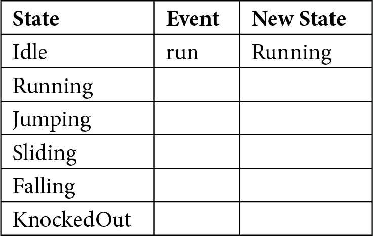

# *第四章*：使用状态机管理动画

在上一章中，我们创建了一个最小化的游戏*引擎*，允许我们移动主要角色并播放简单的动画，但它远非功能齐全。没有可以导航的世界，唯一播放的动画是跑步，**红帽男孩**（**RHB**）对任何物理都不做出反应。在这个时候，如果我们想重新命名我们的游戏，它将被称为*红帽男孩和空旷的虚空*。

虽然这可能是一个有趣的名字，但它不会让游戏变得有趣。最终，我们希望 RHB 在森林中追逐他的狗，那里有可以跳跃的平台和可以滑过的障碍，为了做到这一点，我们需要确保他可以滑动、跳跃和跑步。我们还需要确保他在做这些事情时看起来、表现和表现不同。

在本章中，我们将介绍一种常见的游戏开发模式来管理所有这些，即状态机，通过`if`语句实现。

我们将涵盖以下主题：

+   介绍状态机

+   管理动画

+   为遛狗添加状态

+   `空闲`, `运行`, `滑动`, 和 `跳跃` 动画

到本章结束时，你将能够使用状态机在动画之间干净地切换，同时始终播放正确的动画。

# 技术要求

本章中没有新的 crate 或其他技术要求。本章的源代码可在[`github.com/PacktPublishing/Game-Development-with-Rust-and-WebAssembly/tree/chapter_4`](https://github.com/PacktPublishing/Game-Development-with-Rust-and-WebAssembly/tree/chapter_4)找到。

查看以下视频以查看代码的实际应用：[`bit.ly/35sk3TC`](https://bit.ly/35sk3TC)

# 介绍状态机

游戏、Web 应用程序，甚至是加密货币矿工，都必须管理系统的*状态*。毕竟，如果系统现在没有做正确的事情，如果没有当前状态，那么它不是在运行，对吗？状态也是分形的。在我们的游戏中，我们有`playing`状态和`game over`状态。一旦我们添加菜单项，我们将有更多的状态。同时，我们的 RHB 也有状态：他在跑步、滑动、跳跃、死亡和死亡。让我们说昏迷，这比黑暗要好一些。

重点是我们的游戏正在做很多事情，并且维护着一个包含许多子状态的大型游戏状态。当应用程序从一个状态移动到另一个状态时，系统的规则会改变。例如，当 RHB 在跑步时，空格键可能会让他跳跃，但当他正在跳跃时，按下空格键不会做任何事情。规则是你不能在已经跳跃时跳跃。你可以通过一个包含许多值或布尔值的大型结构来维持这种状态，例如`jumping = true`，在 Rust 程序中，你可能像这样将其存储在枚举类型中：

```rs
enum RedHatBoyState {
    Jumping,
    Running,
    Sliding,
}
```

这在小程序中效果相当不错，但对于更大的程序，有两件事你需要管理。第一，我已经暗示过了，可能存在关于状态之间转换的规则。也许你不能直接从 `Jumping` 转换到 `Sliding`，但 `enum` 无法阻止这一点。第二是，除了每个状态的规则不同之外，经常在状态之间的 *转换* 发生事情，比如播放音效或更新分数；为此，你需要一个状态机。

## 定义状态机

关于状态机，最令人困惑的事情可能是命名，因为存在状态机、有限状态机、状态模式等等，所有这些通常被程序员交替使用。因此，为了清晰起见，让我们这样定义它们：

+   **状态机**：一个系统状态的模型，表示为一系列状态及其之间的转换

+   `trait` 对象，您可以在以下链接中找到：[`doc.rust-lang.org/book/ch17-03-oo-design-patterns.html`](https://doc.rust-lang.org/book/ch17-03-oo-design-patterns.html)。它相当不错，但不是 Rust 的惯用语法，我们不会使用它。

状态机既帮助我们保持对系统在头脑中的心理模型，又防止我们在代码中犯愚蠢的错误，例如当 RHB 跳跃时播放跑步动画。当然，缺点是你需要理解状态机，所以让我们来解决这个问题。我们将使用 RHB 作为我们的例子。RHB 可以是 **Running**、**Idle**、**Jumping**、**Sliding**、**Falling** 或 **KnockedOut**。我们可以使用状态 **转换表** 来列出这些：


转换表目前只有三列，分别是起始状态、引起转换的事件以及转换到的状态。事件与转换的不同之处在于，事件是导致系统发生转换的原因，而转换是在状态变化期间发生的事情。

这是一个微妙的不同之处，有时它会被交替使用，因为名称通常会相同。让我们通过一个状态转换来澄清这一点。RHB 从 `Idle` 状态开始，在那里他站立并 `run`：



当移动到 `Running` 状态时，我们在转换过程中实际上做了一些事情。具体来说，我们开始向右移动；在 `x` 方向上增加速度。你可以在表中命名这个转换：


虽然这是正确的，但通常我们不会费心命名转换和事件，因为它们变得冗余。虽然我们可以继续添加到这个表中，但我们也可以用几种类型的图来模拟状态机。我偏爱简单的圆圈和线条，其中圆圈是状态，线条是转换。


图 4.1 – 状态机图

这个图表是之前表格的详细版本，所有条目都已填写。它从**Idle**状态开始，通过**Run**事件过渡到**Running**状态。从那里，它可以有几个方向。如果玩家**滑动**，它可以进入**Sliding**状态；如果玩家**跳跃**，它可以进入**Jumping**状态。这两种状态最终都会在滑动或跳跃结束后返回到**Running**状态。**Running**、**Sliding**和**Jumping**都可以在撞到东西时过渡到**Falling**状态。

这确实导致图表中间有很多转换。最后，当**下落**结束时，**Falling**状态通过**End**事件过渡到**KnockedOut**状态。如果你熟悉这种类型的图表，你可能会指出，我本可以使用**超状态**来包含**Running**、**Jumping**和**Sliding**，并使用一个事件将所有这些转换到**Falling**。你是对的，但我们就不会在我们的实现中关注这一点了。

你可能会问，所有这些有什么好处？这真的符合我们在上一章中提到的**最小架构**吗？首先回答第二个问题，答案是，嗯……也许？我发现状态机帮助我把属于一起的代码放在一起，而不是像使用简单的`enum`时那样在我的代码库中散布`match`语句。这并不意味着我们不会使用那些`match`语句；它们只是会集中在一个地方。

我还发现它符合我对代码工作方式的思维模型，并且它有助于防止错误，因为你**根本无法**执行一个无效的操作，因为这个操作在那个特定状态下不可用。坦白说，状态机无论我们是否对其进行建模都存在，如果我们能够在代码中对其进行建模，而不是让它意外出现，那么它会更干净。所以，这些都是好处，这就是为什么我认为它适合我们的最小架构。现在，是时候实现它了。

## 使用类型实现

**面向对象**（**OO**）状态模式通常作为策略模式的一种变体来实现，其中在运行时根据各种转换替换实现相同状态接口的不同对象。图表看起来大致如下：


图 4.2 – 状态模式

在模式的面向对象（OO）版本中，`enum`，我们可以用它以比传统对象更清晰的方式枚举状态。第二个是**泛型类型**，我们将用它来将每个状态建模为**类型状态**。

重要提示

我最初编写的原始状态机实现主要基于 Ana Hobden（又名 Hoverbear）这篇优秀的文章，她在[`hoverbear.org/blog/rust-state-machine-pattern/`](https://hoverbear.org/blog/rust-state-machine-pattern/)上发表了这篇文章。虽然这本书不再使用该模式，但我鼓励你阅读它以获取另一种方法。

### 类型状态模式

**类型状态**是将对象的状态嵌入其类型中的高级名称。它的工作方式是，你有一个具有一个泛型参数的泛型结构，该参数表示状态。然后，每个状态都将有可以返回新状态的方法。因此，与它们在*图 4.2*中所示的情况一样，每个状态都有自己的方法来返回新状态。*图 4.2*中的状态可能看起来像这样：


图 4.3 – 类型状态模式

在这个图中，`State<GenericStateOne>`有一个`next`方法，它消耗`self`并返回`State<GenericStateTwo>`。同时，`State<GenericStateTwo>`只有一个`update`方法，它接受一个可变借用`self`。这意味着如果你尝试在`State<GenericStateTwo>`上调用`next`，编译器会捕获你。在传统的 OO 模式中，所有状态都必须处理所有相同的方法，因为它们共享一个接口，所以这种防御是不可能的。通常，这意味着实现你实际上不关心的方法，然后返回一个错误状态或`Self`，并在运行时进行调试。

此外，我们可以使用`mod`关键字和 Rust 的隐私规则来确保无法创建任何无效状态。我们可以通过保持`State`的内部私有，使其无法直接构造，来确保无法从`GenericStateOne`移动到`GenericStateTwo`而不调用`next`方法。这被称为**使非法状态不可表示**，这是一种确保你不会在程序中犯错的绝佳方法。

重要提示

我追踪到“使非法状态不可表示”的表述是来自 Yaron Minsky ([`blog.janestreet.com/effective-ml-revisited/`](https://blog.janestreet.com/effective-ml-revisited/))；然而，这种做法和表述很可能比那还要早。

类型状态可能会让人感到害怕，因为它们既是一个新概念，也是新术语，所以如果你感到有点困惑，请不要担心。

小贴士

Rust 中关于类型状态有很多很好的信息。有一个来自 Strange Loop 的 Will Crichton 的精彩演讲（https://youtu.be/bnnacleqg6k?t=2015），以及[`docs.rust-embedded.org/book/static-guarantees/typestate-programming.htm`](https://docs.rust-embedded.org/book/static-guarantees/typestate-programming.htm)和[`cliffle.com/blog/rust-typestate/`](http://cliffle.com/blog/rust-typestate/)上的博客。

如果你想要暂时忘记所有关于泛型和类型理论的知识，它们可以总结如下：

+   对象的每个状态都由一个单独的结构体表示。

+   你只能通过该结构体上的方法从一个状态推进到另一个状态。

+   你可以使用隐私规则保证只能创建有效的状态。

剩下的只是细节。

最后，我们需要一个 `enum` 来 *持有* 我们的类型状态。每个状态都是泛型的，所以继续我们之前的例子，任何将与我们的状态机交互的结构体都需要持有 *要么* `State<GenericStateOne>` 或 `State<GenericStateTwo>`。为了做到这一点，我们可能需要将包含的结构体也做成泛型的，然后每次状态改变时都创建包含结构体的新版本，或者将泛型对象包裹在一个 `enum` 中。

我们将使用 `enum`，因为它阻止了类型状态的泛型性质在整个程序中传播，使得类型状态成为一个实现细节。我们将编写 Rust 非常擅长的那种状态机。让我们开始吧。

# 管理动画

我们将创建状态机来管理不同的动画。具体来说，当 RHB 不在移动时，它是 `Idle` 状态，但当它在移动时，它是 `Running` 状态。当他跳跃时，他是 `Jumping` 状态。你明白这个意思。

这些不同的 RHB 状态对应于使用状态机管理的不同动画。我们首先创建带有状态机的 RHB，然后将其集成到我们的当前应用程序中。我们将从代表 RHB 的结构体开始，让编译器错误驱动进一步的开发。这有时被称为 **编译器驱动开发**，尽管它不是一个正式的方法，如 **测试驱动开发**。它可以在具有强大类型系统和优秀编译器错误的语言中工作得非常好，如 Rust。让我们从如何表示 RHB 开始。

`RedHatBoy` 结构体将包含状态机、精灵表和图像，因为最终它将自行绘制：

```rs
struct RedHatBoy {
    state_machine: RedHatBoyStateMachine,
    sprite_sheet: Sheet,
    image: HtmlImageElement,
}
```

重要提示

所有这些代码都属于 `game` 模块。这意味着你可以将它放在 `game.rs` 文件中，或者如果你愿意，可以将其放在一个单独的文件中，并使用 `mod` 关键字将其引入 `game` 模块。我会把这个决定留给你。

当然，这不会工作，因为你还没有创建状态机。你确实有来自 *第三章* 的 `Sheet` 结构体，*创建游戏循环*。让我们创建 `RedHatBoyStateMachine`：

```rs
#[derive(Copy, Clone)]
enum RedHatBoyStateMachine {
    Idle(RedHatBoyState<Idle>),
    Running(RedHatBoyState<Running>),
}
```

看到我们之前讨论的 `enum`，可能仍然不清楚为什么我们要使用它，因为我们将会创建所有这些类型状态结构。还不存在的 `RedHatBoyState` 是一个包含另一个类型的泛型类型，其中这些类型代表各种状态。那么，为什么还需要冗余的 `enum`？因为我们希望能够在不使用堆或动态分派的情况下轻松地在状态之间切换。让我们想象我们以以下方式定义了 `RedHatBoy` 结构体：

```rs
struct RedHatBoy {
    state: RedHatBoyState<Idle>,
    sprite_sheet: Sheet,
}
```

现在状态被固定到一个状态。当然，我们可以用以下方式定义：

```rs
struct RedHatBoy<T> {
    state: RedHatBoyState<T>,
    sprite_sheet: Sheet,
}
```

但是当然，现在`RedHatBoy`也必须是一个泛型类型。你可以使用`Box<dyn State>`而不使用`enum`来使这可行，但这不是很方便，并且需要在每个状态上实现相同的方法，所以我们将坚持使用`enum`。我必须承认我不喜欢类型中的这种重复，比如`*Idle*(RedHatBoyState<*Idle*>)`，但我们会看到，随着状态机的实现，`enum`包装器变得极其有用。确保`enum`也是`Copy,Clone`，原因你很快就会看到。

重要提示

如果你对这个感兴趣，*《Rust 编程语言》*有一章描述了如何以传统的面向对象方式实现状态模式。有趣的是，他们最终放弃了它，转而使用`enum`。你可以在这里找到：[`bit.ly/3hBsVd4`](https://bit.ly/3hBsVd4)。

当然，这段代码仍然无法编译，因为我们还没有创建那些状态，也没有创建`RedHatBoyState` `x`。这就是我所说的编译器驱动开发。我们可以从创建`RedHatBoyState`开始：

```rs
mod red_hat_boy_states {
    use crate::engine::Point;
    #[derive(Copy, Clone)]
    pub struct RedHatBoyState<S> {
        context: RedHatBoyContext,
        _state: S,
    }
    #[derive(Copy, Clone)]
    pub struct RedHatBoyContext {
        frame: u8,
        position: Point,
        velocity: Point,
    }
}
```

所有与单个状态相关的代码都将放入其自己的模块`red_hat_boy_states`中，这样我们就可以只公开`game`模块其余部分所需的方法。这将使得意外创建一个状态而不使用提供的方法变得不可能，因此，不可能意外地执行无效的转换。从`RedHatBoyState<Idle>`转换到`RedHatBoyState<Running>`的唯一方法将通过`RedHatBoyState<Idle>`上的方法来实现。重要的是`RedHatBoyState`和`RedHatBoyContext`都是公开的，但它们的成员是私有的，这样我们就可以按预期使用它们。

在新模块中，`RedHatBoyState`是一个简单的泛型类型，它包含`_state`，这个字段永远不会被读取，因此使用了下划线，以及`RedHatBoyContext`。现在，`RedHatBoyContext`是一个包含所有状态共有数据的结构。在这种情况下，那就是正在渲染的帧、位置和速度。我们需要它以便状态转换可以修改 RHB 的状态。将所有这些放入`red_hat_boy_states`模块意味着我们没有改变编译器错误信息。我们需要将那个模块导入到`game`模块中，使用`use self::red_hat_boy_states::*;`，你可以在`game`模块的任何地方添加它。这让我们前进了一步，但如果我们查看下面的编译器输出，我们还没有完成：

```rs
error[E0412]: cannot find type 'Idle' in this scope
  --> src/game.rs:19:25
   |
19 |     Idle(RedHatBoyState<Idle>),
   |                                    ^^^^ not found in 
   this scope
```

对于`Running(RedHatBoyState<Running>)`也有相应的`enum`变体。`Idle`和`Running`这两个状态都不存在。我们可以在`red_hat_boy_states`模块内部轻松创建这两个状态，注意这两个也必须是`Clone`：

```rs
#[derive(Copy, Clone)]
struct Idle;
#[derive(Copy, Clone)]
struct Running;
```

## 状态之间的转换

恭喜！您为 RHB 创建了两个状态。但这...什么也没做。还有一些东西缺失。首先，我们不能从`Idle`状态转换到`Running`状态，而且当它们不在转换过程中时，这些状态实际上并不做任何事情。让我们现在处理一个转换。我们将在`RedHatBoyState<Idle>`上添加一个方法，从`Idle`状态转换到`Running`状态：

```rs
mod red_hat_boy_states {
    ....
    impl RedHatBoyState<Idle> {
        pub fn run(self) -> RedHatBoyState<Running> {
            RedHatBoyState {
                context: self.context,
                _state: Running {},
            }
        }
    }
```

这是从`Idle`状态到`Running`状态的转换，而`run`方法就是魔法发生的地方。这只是一个函数，它接受一个`RedHatBoy<Idle>`状态并将其转换为`RedHatBoy<Running>`状态，目前它不会改变任何`RedHatBoyContext`数据。那么，你可能想知道，这有什么魔法？

这意味着要从`Idle`状态转换到`Running`状态，你可以使用`run`，但也意味着你不能从`Running`状态转换回`Idle`状态，这是有道理的，因为游戏不允许这种行为。该函数还接受`mut self`，这意味着当它被调用时，它会消耗当前状态。这意味着如果你想在转换到`Running`状态后保留`Idle`状态，你必须克隆它，如果你这样做，你很可能真的想这么做。

你也不能直接创建`Running`状态，因为它的数据成员是私有的，这意味着你不能不小心创建那个状态。你也不能创建`Idle`状态，这是一个问题，因为它是起始状态。我们稍后会解决这个问题，但首先，让我们深入了解我们将如何通过状态机与状态交互。

## 管理状态机

初始时，我们可能会倾向于通过在`RedHatBoyStateMachine` `enum`上添加方法来实现我们的状态机，如下所示：

```rs
#[derive(Copy, Clone)]
enum RedHatBoyStateMachine {
    Idle(RedHatBoyState<Idle>),
    Running(RedHatBoyState<Running>),
}
impl RedHatBoyStateMachine {
    fn run(self) -> Self {
        match self {
            RedHatBoyStateMachine::Idle(state) => 
             RedHatBoyStateMachine::Running(state.run()),
            _ => self,
        }
    }
}
```

这并不糟糕，但这意味着我们的状态机上的每个方法都可能需要匹配`RedHatBoyStateMachine` `enum`的当前变体。然后，它将根据转换或`self`返回新的变体，当转换当前无效时。换句话说，虽然如果我们对`Running`状态调用`run`，编译器会报错，但如果我们对当前变体为`Running`的`RedHatBoyStateMachine`调用`run`，编译器不会报错。这种错误，即错误地在不正确的状态上调用`run`，正是我们试图通过类型状态避免的。我们费尽心思编写这些类型状态，只是为了在每个`RedHatBoyStateMachine` `enum`的方法上立即放弃其中的一个好处。

不幸的是，我们无法完全摆脱这个问题，因为我们正在使用`enum`来包含我们的状态。我们无法像使用泛型结构那样在`enum`的变体上实现方法，如果我们打算用`enum`包装状态，我们就必须匹配变体。我们可以做的是通过减少在状态中操作的方法数量来减少这种错误的可能性。具体来说，我们不会在`enum`上调用`run`，而是创建一个接受`Event`的`transition`函数。这看起来像以下代码：

```rs
#[derive(Copy, Clone)]
enum RedHatBoyStateMachine {
    Idle(RedHatBoyState<Idle>),
    Running(RedHatBoyState<Running>),
}
pub enum Event {
    Run,
}
impl RedHatBoyStateMachine {
    fn transition(self, event: Event) -> Self {
        match (self, event) {
            (RedHatBoyStateMachine::Idle(state), 
             Event::Run) => {
                RedHatBoyStateMachine::Running(state.run())
            }
            _ => self,
        }
    }
}
```

我们用另一个`enum`解决了`enum`引起的问题！这非常*Rusty*。在这种情况下，我们创建了一个名为`Event`的`enum`来表示可能发生在我们机器上的每一个事件，并用名为`transition`的方法替换了名为`run`的方法。

因此，我们不会有很多小的方法，如 run、jump 等，我们将有一个名为`transition`的方法和许多`Event`变体。这如何改进事情？因为当我们想要添加转换时，我们只需要更新一个`match`语句，而不是可能添加多个小的`match`语句。记住，这个函数接受`mut self`，这意味着调用`transition`将消耗`self`并返回一个新的`RedHatBoyStateMachine`，就像`run`方法在`RedHatBoyState<Idle>`上做的那样。

## 使用 Into 编写整洁的代码

我们实际上可以使用`From`特质来改进这个方法的易用性。如果你不熟悉，`From`特质是 Rust 的一个特性，它允许我们定义如何从一个类型转换为另一个类型。在你的类型上实现`From`特质也会实现`Into`特质，这将提供一个`into`方法，使得类型之间的转换变得容易。

我们知道，如果我们有`RedHatBoyState<Running>`，它将转换为`RedHatBoyStateMachine::Running`变体，如果我们通过实现`From`特质来编写转换，我们将能够用`into`调用替换包装。这虽然说了很多话，但代码却很少，所以以下就是`From`特质的实现样子：

```rs
impl From<RedHatBoyState<Running>> for RedHatBoyStateMachine {
    fn from(state: RedHatBoyState<Running>) -> Self {
        RedHatBoyStateMachine::Running(state)
    }
}
```

这可以放在`RedHatBoyStateMachine`实现下方。它定义了如何从`RedHatBoy<Running>`转换为`RedHatBoyStateMachine`，并且这与我们在`transition`方法中编写的少量代码相同。因为我们现在有了这个，我们可以使那个方法更加简洁，如下所示：

```rs
impl RedHatBoyStateMachine {
    fn transition(self, event: Event) -> Self {
        match (self, event) {
            (RedHatBoyStateMachine::Idle(state), 
             Event::Run) => state.run().into(),
            _ => self,
        }
    }
    ...
```

将`RedHatBoyStateMachine::Idle::Running(state.run)`这样的调用替换为`into`不仅更美观、更简洁；它还意味着如果`run`改变为返回不同的状态，只要有一个从状态到`RedHatBoyStateMachine` `enum`的`From`特质被编写，`transition`方法就可以保持不变。这是一个使我们的代码更加灵活的小改动。

有点奇怪的是，我们称之为状态机的`RedHatBoyStateMachine` `enum`是因为我们通常不会将枚举类型与行为相关联，但这个方法就是为什么我们称之为机器。我们使用`enum`来持有各种泛型状态，我们使用向`enum`添加方法的能力来使其使用起来更加方便。各种状态知道如何从一个状态转换到另一个状态，机器知道何时进行转换。

## 集成状态机

现在我们已经构建了一个状态机，尽管它只有两个状态，但我们实际上需要用它来做些事情。回想一下我们当前的游戏，让 RHB 在一个无意义的虚空中奔跑。我们将想要改变它，使得 RHB 从左角开始，当用户按下 *右箭头键* 时开始奔跑。换句话说，他们将从一个 `Idle` 状态过渡到 `Running` 状态。当这种情况发生时，我们还想确保显示适当的动画。

我们将从将 `RedHatBoy` 放入 `WalkTheDog` 游戏开始：

```rs
pub struct WalkTheDog {
    image: Option<HtmlImageElement>,
    sheet: Option<Sheet>,
    frame: u8,
    position: Point,
    rhb: Option<RedHatBoy>,
}
...
impl WalkTheDog {
    pub fn new() -> Self {
        WalkTheDog {
            image: None,
            sheet: None,
            frame: 0,
            position: Point { x: 0, y: 0 },
            rhb: None,
        }
    }
}
```

由于 `RedHatBoy` 包含一个精灵图集，所以现在 `RHB` 必须是一个 `Option` 类型。由于精灵图集直到在 `initialize` 中加载图像后才可用，我们必须将 `rhb` 设置为 `Option` 类型。我们希望在 `initialize` 函数中初始化机器，为此，我们将为 `Idle` 状态创建一个方便的 `new` 方法：

```rs
mod red_hat_boy_states {
    use crate::engine::Point;
    const FLOOR: i16 = 475;
    ...
    impl RedHatBoyState<Idle> {
        pub fn new() -> Self {
            RedHatBoyState {
                context: RedHatBoyContext {
                    frame: 0,
                    position: Point { x: 0, y: FLOOR },
                    velocity: Point { x: 0, y: 0 },
                },
                _state: Idle {},
            }
        }
        ...
```

由于 `Idle` 是初始状态，所以它将是唯一获得 `new` 函数的状态，正如之前提到的。我们还引入了一个名为 `FLOOR` 的常量，它标记了屏幕的底部，当 RHB 跳跃时，他将落在那里。

我在这里将其展示为好像它定义在 `red_hat_boy_states` 模块的顶部。现在，在 `Game` 的 `initialize` 方法中，我们仍然有一个编译错误，因为我们还没有在游戏中设置 `RedHatBoy`。我们可以在加载精灵图集之后立即这样做，并且我们会保留两个精灵图集副本；这不是因为我们想要两个副本，而是因为我们将在成功用新代码替换旧代码后删除所有旧代码。你可以在这里看到这些更改：

```rs
#[async_trait(?Send)]
impl Game for WalkTheDog {
    async fn initialize(&self) -> Result<Box<dyn Game>> {
        let sheet: Option<Sheet> = browser::fetch_json(
         "rhb.json").await?.into_serde()?;
        let image = Some(engine::load_image(
         "rhb.png").await?);
        Ok(Box::new(WalkTheDog {
            image: image.clone(),
            sheet: sheet.clone(),
            frame: self.frame,
            position: self.position,
            rhb: Some(RedHatBoy::new(
                sheet.clone().ok_or_else(|| anyhow!
                    ("No Sheet Present"))?,
                image.clone().ok_or_else(|| anyhow!
                    ("No Image Present"))?,
            )),
        }))
    }
...
```

由于 Rust 的借用规则，我们在这里不得不修改大量的代码。我们的意图是 `clone` `sheet` 和 `image`，并将这些传递给 `RedHatBoy::new` 方法。然而，如果我们这样做，我们还需要在为 `WalkTheDogStruct` 上的 `image` 和 `sheet` 字段设置值时克隆 `image` 和 `sheet`。为什么？因为 `image: image` 这一行是一个移动操作，之后无法访问。这就是移动后的借用错误。因此，我们克隆 `image` 和 `sheet`，并将克隆的实例移动到 `WalkTheDog` 中。然后，在创建 `RedHatBoy` 时，我们再次克隆它们。

对于 `sheet` 也是如此。我们还需要在最初分配 `sheet` 时明确指出 `sheet` 的类型，因为编译器已经无法推断出类型了。幸运的是，这是一个中间步骤；我们正在解决编译错误，并最终将这段代码缩减到我们实际需要的样子。我们目前还不能这样做，因为我们用两个编译错误替换了一个！

之前，当我们创建 `WalkTheDog` 时，`rhb` 字段没有被填充，所以这没有编译通过。为了将 `rhb` 字段设置为一个值，我们假设存在一个 `RedHatBoy::new` 方法，但实际上它不存在，所以这也没有编译通过。我们还传递了即将存在的构造函数克隆的 `sheet` 和 `image`。由于 `Sheet` 类型目前不支持 `clone`，这也导致了编译错误。我们需要修复这两个编译错误才能继续前进。

在我们继续之前，我想指出我们如何在每个`clone`调用中使用`ok_or_else`构造，然后是`?`运算符。`RedHatBoy`不需要持有`Option<Sheet>`或`Option<HtmlImageElement>`，所以它的构造函数将接受`Sheet`和`HtmlImageElement`。调用`ok_or_else`将`Option`转换为`Result`，如果值不存在，`?`将返回`initialize`方法中的`Error`。这防止了代码的其余部分需要不断验证`Option`类型的存在，因此代码将更加简洁。`Option`类型很棒，但任何时候你都可以用实际值替换处理`Option`类型。

两个编译器错误中，最容易修复的是`sheet`没有实现`clone`。在 Rust 社区中，很多人在所有公共类型上都派生了`Clone`，虽然在这本书中我不会遵循这种做法，但将`Clone`添加到`Sheet`及其引用的类型中并没有任何理由，如下所示。记住，`Sheet`位于`engine`模块中：

```rs
#[derive(Deserialize, Clone)]
pub struct SheetRect {
    pub x: i16,
    pub y: i16,
    pub w: i16,
    pub h: i16,
}
#[derive(Deserialize, Clone)]
pub struct Cell {
    pub frame: SheetRect,
}
#[derive(Deserialize, Clone)]
pub struct Sheet {
    pub frames: HashMap<String, Cell>,
}
```

现在，我们只剩下一个编译器错误，`RedHatBoy`没有`new`函数，所以让我们为`RedHatBoy`结构体创建一个`impl`块，并定义它，如下所示：

```rs
impl RedHatBoy {
    fn new(sheet: Sheet, image: HtmlImageElement) -> Self {
        RedHatBoy {
            state_machine: RedHatBoyStateMachine::Idle(
             RedHatBoyState::new()),
            sprite_sheet: sheet,
            image,
        }
    }
}
```

这创建了一个处于`Idle`状态的`RedHatBoy`新实例。我们还在`initialize`函数中加载了`sprite_sheet`和`image`，并将它们传递给这个构造函数。恭喜！我们的代码编译成功了！

## 绘制 RedHatBoy

不幸的是，这仍然没有做什么。`RedHatBoy`从未被绘制！我们想要的接口是调用`self.rhb.draw()`并看到 RHB 绘制空闲动画。我们还想在按下*右箭头*时调用`run`函数，看到 RHB 奔跑。

让我们从在`RedHatBoy`上实现`draw`开始。我们将创建一个模拟`WalkTheDog`中绘制函数的绘制函数，只使用`RedHatBoyState`中共享的`RedHatBoyContext`。以下代码是作为`impl RedHatBoy`块的一部分编写的：

```rs
impl RedHatBoy {
    ...
    fn draw(&self, renderer: &Renderer) {
        let frame_name = format!(
            "{} ({}).png",
            self.state_machine.frame_name(),
            (self.state_machine.context().frame / 3) + 1
        );
        let sprite = self
            .sprite_sheet
            .frames
            .get(&frame_name)
            .expect("Cell not found");
        renderer.draw_image(
            &self.image,
            &Rect {
                x: sprite.frame.x.into(),
                y: sprite.frame.y.into(),
                width: sprite.frame.w.into(),
                height: sprite.frame.h.into(),
            },
            &Rect {
                x: self.state_machine.context()
                 .position.x.into(),
                y: self.state_machine.context()
                 .position.y.into(),
                width: sprite.frame.w.into(),
                height: sprite.frame.h.into(),
            },
        );
    }
}
```

这几乎与我们的 RHB（RedHatBoy）正在运行的`draw`函数中已有的代码完全相同。我们不需要总是使用还不存在的`frame_name`函数。

我们还从`context()`获取`position`和`frame`，另一个还不存在的函数。同样，我们将让编译器引导我们创建这两个函数；编译器驱动开发再次发挥作用！`RedHatBoyStateMachine` `enum`需要提供一个返回`RedHatBoyContext`和`frame_name`的方法。我们可以添加以下实现：

```rs
impl RedHatBoyStateMachine {
    ...
    fn frame_name(&self) ->&str {
        match self {
            RedHatBoyStateMachine::Idle(state) => 
             state.frame_name(),
            RedHatBoyStateMachine::Running(state) => 
             state.frame_name(),
        }
    }
    fn context(&self) ->&RedHatBoyContext {
        match self {
            RedHatBoyStateMachine::Idle(state) 
             =>&state.context(),
            RedHatBoyStateMachine::Running(state) 
             =>&state.context(),
        }
    }
}
```

我承认我不喜欢这两种方法，曾考虑创建一个特质，让各种状态实现作为替代方案。经过一番思考，我决定这更简单，因为如果你不匹配每个`enum`变体，Rust 编译器将会失败，所以我愿意接受这些重复的*case*语句。

`frame_name` 和 `context` 方法都委托给当前活动的 `state` 来获取所需的数据。在 `frame_name` 的情况下，这将是一个返回给定状态在 `rhb.json` 中动画名称的方法，正如在每个状态上定义的那样。`context` 方法尤其奇怪，因为我们总是为每个状态返回相同的字段，并且总是这样，因为该数据在所有状态之间共享。这需要一种泛型实现，我们将在稍后编写。一个练习是使用宏简化这些函数，但在这里我们不会这样做。

重要提示

你可能已经注意到，这一行 `self.state_machine.context().position.x` 违反了`self`应该只与 `state_machine`（它的朋友）通信，但相反，它通过 `context` 与 `position` 通信。这种方式将 `RedHatBoy` 与 `RedHatBoyContext` 的内部结构耦合在一起，这可以通过在 `state machine` 上添加 `position_x` 和 `position_y` 的获取器来避免，这些获取器将委托给 `context`，而 `context` 又会委托给 `position`。Demeter 法则是设置值时的一个很好的指导原则，你应该几乎总是遵循它来处理可变数据，但在这个案例中，数据是不可变的。我们无法通过这个获取器更改上下文，违反 Demeter 法则的缺点并不那么相关。我不认为有必要创建更多的委托函数只是为了避免违反一个任意指南，但如果它成为一个问题，我们总是可以更改它。有关此信息的更多信息，请参阅 [`wiki.c2.com/?LawOfDemeter`](https://wiki.c2.com/?LawOfDemeter)。

再次遵循编译器，我们将 `RedHatBoy` 上的 `draw` 方法中的错误移动到了 `RedHatBoyStateMachine` 中，因为没有任何状态有 `frame_name` 或 `context` 方法。在这两个方法中，`frame_name` 更直接，所以我们将首先实现它。它是一个获取 `rhb.json` 文件中帧名称的获取器，并且对于每个状态都是不同的，所以我们将把这个方法放在每个状态上，如下所示：

```rs
mod red_hat_boy_states {
    use crate::engine::Point;
    const FLOOR: i16 = 475;
    const IDLE_FRAME_NAME: &str = "Idle";
    const RUN_FRAME_NAME: &str = "Run";
    impl RedHatBoyState<Idle> {
        ...
        pub fn frame_name(&self) -> &str {
            IDLE_FRAME_NAME
        }
    }
    ...
    impl RedHatBoyState<Running> {
        pub fn frame_name(&self) -> &str {
            RUN_FRAME_NAME
        }
    }
}
```

我们添加了两个常量，`IDLE_FRAME_NAME` 和 `RUN_FRAME_NAME`，分别对应于我们的精灵图集 `Idle` 和 `Run` 部分的帧名称。然后我们在 `RedHatBoyState<Idle>` 上创建了一个新的方法 `frame_name`，以及一个全新的实现 `RedHatBoyState<Running>`，它也包含一个 `frame_name` 方法。

值得考虑的是，我们是否可以使用特质对象（[`bit.ly/3JSyoI9`](https://bit.ly/3JSyoI9)）而不是我们的 `enum` 来表示 `RedHatBoyStateMachine`，这可能是可行的。我已经尝试过它，但没有找到令人满意的解决方案，但我鼓励你试一试。如果你自己尝试代码，你会从这本书中学到更多。

现在我们已经处理了 `frame_name` 方法，我们想要添加一个 `context` 方法。这个方法将为每个状态做同样的事情，返回上下文，并且我们可以为它们都写一个通用的，就像这里展示的：

```rs
mod red_hat_boy_states {
    ....
    #[derive(Copy, Clone)]
    pub struct RedHatBoyState<S> {
        context: RedHatBoyContext,
        _state: S,
    }
    impl<S> RedHatBoyState<S> {
        pub fn context(&self) -> &RedHatBoyContext {
            &self.context
        }
}
...
```

这是 Rust 的一项相当酷的特性。由于我们有一个泛型结构体，我们可以在泛型类型上写方法，它将适用于所有类型。最后，还有一个编译器错误，在 `draw` 函数中引用上下文中的帧或位置字段。这些字段是私有的，但只要 `RedHatBoyContext` 是一个不可变类型，我们就可以将它们公开，如下所示：

```rs
mod red_hat_boy_states {
    ...
    #[derive(Copy, Clone)]
    pub struct RedHatBoyContext {
        pub frame: u8,
        pub position: Point,
        pub velocity: Point,
        }
        ...
```

最后，我们需要在 `WalkTheDog#draw` 函数中调用这个方法。你可以在这个，诚然有些尴尬的一行中添加它，就在 `draw` 函数的末尾：

```rs
fn draw(&self, renderer: &Renderer) {
    ...
    self.rhb.as_ref().unwrap().draw(renderer);
```

如果你已经成功跟上了，你应该会看到以下屏幕：


图 4.4 – RHBs

在顶部，我们有我们旧的、永不停歇的 RHB，而在底部，我们的新 RHB 正在静止不动。新版本功能更少；我们退步了，但为什么？这为我们接下来要做的事情做好了准备，就是移动它并改变动画。说到动画，RHB 的“空闲”版本目前什么都没做，因为`frame`从未改变。当 RHB 处于空闲状态时，它会缓慢呼吸地站立，所以让我们开始吧，好吗？

## 更新 RHB

我们的 `RedHatBoy` 结构体将有一个 `update` 函数，它将转而委托给状态机上的 `update` 函数。这是一个新方法，因为每个状态都需要更新，以便推进动画。我们将从 `WalkTheDog` 的 `update` 中调用 `RedHatBoy` 的 `update`。这有很多更新，但实际上只是委托：

```rs
#[async_trait(?Send)]
impl Game for WalkTheDog {
    ...
    fn update(&mut self, keystate: &KeyState) {
....
        if self.frame < 23 {
            self.frame += 1;
        } else {
            self.frame = 0;
        }
        self.rhb.as_mut().unwrap().update();
    }
}
impl RedHatBoy {
    ...
    fn update(&mut self) {
        self.state_machine = self.state_machine.update();
    }
}
impl RedHatBoyStateMachine {
    ...
    fn update(self) -> Self {
        match self {
            RedHatBoyStateMachine::Idle(mut state) => {
                if state.context.frame < 29 {
                    state.context.frame += 1;
                } else {
                    state.context.frame = 0;
                }
                RedHatBoyStateMachine::Idle(state)
            }
            RedHatBoyStateMachine::Running(_) => self,
        }
    }
}
```

在 `WalkTheDog` 的 `update` 函数中，我们只在 `update` 函数的末尾添加了一行新代码：

```rs
self.rhb.as_mut().unwrap().update();
```

这很酷，因为 `rhb` 是 `Option`，我们稍后会修复这个问题。我们向 `RedHatBoy` `struct` 的 `update` 方法添加了另一个小功能，它只是通过状态机的 `update` 函数更新 `state_machine`。这一行，以及其他类似的行，是为什么状态机需要是 `Copy` 的原因。如果不是，那么因为 `update` 通过 `mut self` 参数消耗 `self`，你就必须使用类似 `Option` 的东西将 `self` 移入 `update`，然后再重置它。通过使一切成为 `Copy`，你将获得一个更加方便的 `update` 函数。

最后，行为的主体在`RedHatBoyStateMachine#update`函数中。在这里，我们匹配`self`并在可变的`state`参数上更新当前帧，然后返回一个新的`Idle`状态，并带有更新后的帧的移动`context`。不幸的是，这段代码无法编译；`context`不是一个公共数据成员，所以你不能分配它。现在，我们将继续使`context`公共，但你应该感到烦恼。记得我之前提到的 Demeter 法则。获取不可变数据值是一回事，而设置可变值则是另一回事。这种耦合可能会导致未来的真正问题。我们现在**不会**修复它，所以请继续使`context`公共，但我们将非常密切地关注这段代码。

到目前为止，如果你查看`WalkTheDog`的`update`和`RedHatBoyStateMachine`的`update`，你会看到相似之处。一个是更新左上角的奔跑 RHB，另一个是更新左下角的空闲 RHB。现在是时候开始合并这两个对象了。让我们继续这样做。

## 添加奔跑状态

关于状态，有一点需要记住的是，无论你是否实现状态机，它们都存在。虽然我们还没有在`RedHatBoyState<Running>`中实现任何内容，但`Running`状态目前存在于`WalkTheDog`中；RHB 现在正四处奔跑在虚空中！我们只需要将细节移动到我们的状态机中，这样我们作为程序员就可以真正看到状态以及它们作为一个连贯单元所做的事情。此外，我们还将停止有一个在屏幕左下角孤独奔跑的悲伤男孩。

我们可以通过修改`RedHatBoyStateMachine`中的`update`函数来快速实现这一点，使其与`Idle`中的版本匹配，只是奔跑动画的帧数不同。如下所示：

```rs
impl RedHatBoyStateMachine {
    ...
    fn update(self) -> Self {
        match self {
            ...
            RedHatBoyStateMachine::Running(mut state) => {
                if state.context.frame < 23 {
                    state.context.frame += 1;
                } else {
                    state.context.frame = 0;
                }
                RedHatBoyStateMachine::Running(state)
            }
        }
    }
}
```

现在，状态机在理论上能够绘制奔跑动画，但我们还没有编写任何代码来触发这种转换。另外缺少的东西可能更加微妙。`Running`动画有`23`帧，而`Idle`动画有`29`帧。如果我们要在`24`帧时从`Idle`转换到`Running`，游戏就会崩溃。

最后，我想我们都可以同意，这里存在的这种重复可以改进。这两个函数之间唯一的区别是帧数。所以，我们有一些事情要做：

1.  重构重复的代码。

更新`context.frame`的代码存在一个名为`update`函数在`context`上重复操作的代码异味。为什么不将这个函数移动到`RedHatBoyContext`中呢？如下所示：

```rs
const IDLE_FRAMES: u8 = 29;
const RUNNING_FRAMES: u8 = 23;
...
impl RedHatBoyStateMachine {
    fn update(self) -> Self {
        match self {
            RedHatBoyStateMachine::Idle(mut state) => {
                state.context = 
                 state.context.update(IDLE_FRAMES);
                RedHatBoyStateMachine::Idle(state)
            }
            RedHatBoyStateMachine::Running(mut state) 
             => {
                state.context = state.context.update(
                 RUNNING_FRAMES);
                RedHatBoyStateMachine::Running(state)
            }
        }
    }
}
mod red_hat_boy_states {
    ...
    impl RedHatBoyContext {
        pub fn update(mut self, frame_count: u8) -> 
         Self {
            if self.frame < frame_count {
                self.frame += 1;
            } else {
                self.frame = 0;
            }
            self
        }
    } 
```

`RedHatBoyContext`现在有一个`update`函数，该函数增加帧数，当总帧数达到时循环回`0`。注意它如何以与我们转换相同的方式工作，消耗`self`，并返回一个新的`RedHatBoyContext`，尽管实际上整个时间都是同一个`instance`。这给了我们与我们在其他地方使用的相同类型的*功能性*接口。总帧数随着每个状态的变化而变化，所以我们将其作为参数传递，使用常量以提高清晰度。

1.  修复 Demeter 法则违反。

看看每个`match`语句的两边，它们几乎是相同的，都在以我们不喜欢的早期方式修改`context`。现在是解决这个问题的好时机，我们可以通过再次将`RedHatBoyState<S>`的字段设为私有，并在各自的`RedHatBoy`状态实现中创建新方法来实现，如下所示：

```rs
mod red_hat_boy_states {
    ...
    const IDLE_FRAMES: u8 = 29;
    const RUNNING_FRAMES: u8 = 23;
    ....
    impl RedHatBoyState<Idle> {
        ....
        pub fn update(&mut self) {
            self.context = self.context.update(
             IDLE_FRAMES);
        }
    }
    impl RedHatBoyState<Running> {
         ...
         pub fn update(&mut self) {
            self.context = self.context.update(
             RUNNING_FRAMES);
        }
    }
}
```

好了！这样更好。`context`不再是不恰当的公共的，每个单独的状态都处理自己的更新。它们之间的唯一区别是它们使用的常量，将它们与实现本身捆绑在一起是很合适的。说到这里，确保将`RUNNING_FRAMES`和`IDLE_FRAMES`常量移动到`red_hat_boy_states`模块中。

我们需要修改`RedHatBoyStateMachine`上的`update`方法，以便在每个状态上调用这个新方法：

```rs
impl RedHatBoyStateMachine {
    ....
    fn update(self) -> Self {
        match self {
            RedHatBoyStateMachine::Idle(mut state) => 
            {
                state.update();
                RedHatBoyStateMachine::Idle(state)
            }
            RedHatBoyStateMachine::Running(mut state) 
             => {
                state.update();
                RedHatBoyStateMachine::Running(state)
            }
        }
    }
}
```

在`update`中，每个臂现在都会更新状态，然后返回状态。这里有一些可疑的重复；我们稍后会再次查看。

1.  在每次`update`时移动 RHB。

如果 RHB 要在运行状态下运行，它需要尊重速度。换句话说，更新动画化帧，但不移动，所以让我们将其添加到`RedHatBoyContext`的`update`方法中：

```rs
fn update(mut self, frame_count: u8) -> Self {
    ...
    self.position.x += self.velocity.x;
    self.position.y += self.velocity.y;
    self
}
```

当然，RHB 现在不会移动，因为我们没有改变速度。这很快就会到来。

1.  确保在状态之间转换时帧计数重置为`0`。

在我们的状态机中，游戏对象可能发生两种类型的更改。有一种是在状态没有变化时发生的更改。这就是`update`所做的工作，目前这些都是在`RedHatBoyStateMachine`中编写的。还有在转换时发生的更改，这些是在定义为类型类方法的转换函数中发生的。

我们已经通过`run`方法从`Idle`状态转换到`Running`状态，并且我们可以在转换时确保重置帧率。这是一个你可以在这里看到的小改动：

```rs
    impl RedHatBoyContext {
        ...
        fn reset_frame(mut self) -> Self {
            self.frame = 0;
            self
        }
    }
    impl RedHatBoyState<Idle> {
        ....
        pub fn run(self) -> RedHatBoyState<Running> {
            RedHatBoyState {
                context: self.context.reset_frame(),
                _state: Running {},
            }
        }
    }
```

`RedHatBoyContext`增加了一个名为`reset_frame`的函数，该函数将它的帧计数重置为`0`并返回自身。通过返回自身，我们可以将调用链在一起，这很快就会派上用场。`run`方法也演变为在`RedHatBoyContext`上调用`reset_frame()`并使用新的`context`版本在新的`RedHatBoyState`结构体中。

1.  在转换时开始运行。

现在我们已经通过在转换时重新启动动画来防止崩溃，让我们开始在转换时向前跑步。这将非常短：

```rs
mod red_hat_boy_states {
....
const RUNNING_SPEED: i16 = 3;
...
impl RedHatBoyContext {
    ...
        fn run_right(mut self) -> Self {
            self.velocity.x += RUNNING_SPEED;
            self
        }
    }
    impl RedHatBoyState<Idle> {
        pub fn run(self) -> RedHatBoyState<Running> {
            RedHatBoyState {
                context: self.context.reset_frame()
                 .run_right(),
                _state: Running {},
            }
        }
    }
```

我们在`RedHatBoyContext`上又增加了一个名为`run_right`的方法，它只是简单地将前进速度添加到速度中。同时，我们在转换中链式调用了`run_right`（看！）方法。别忘了将`RUNNING_SPEED`常量添加到模块中。

1.  在*右*箭头上开始跑步。

最后，我们实际上需要在按下`ArrowRight`按钮时调用这个事件。在这个时候，我们可以跟随在`WalkTheDog`实现中我们正在做这件事的地方：

```rs
impl Game for WalkTheDog {
    ...
    if keystate.is_pressed("ArrowRight") {
        velocity.x += 3;
        self.rhb.as_mut().unwrap().run_right();
    }
}
impl RedHatBoy {
    ...
    fn run_right(&mut self) {
        self.state = self.state.transition(
         Event::Run);
    }
}
```

这将现在开始我们的 RHB 跑步，以至于他会直接跑出屏幕！


图 4.5 – 这可能是个问题

在这一点上，我们可以重新建立*月球漫步*，将 RHB 带回屏幕上，但这并不真正服务于游戏的目的。你可以创建一个事件，每次更新时重置水平速度，就像当前代码所做的那样，或者你可以跟踪当按键抬起时移除一些速度。第二个感觉更好，但将迫使我们编写一些事件，并可能从`Running`状态转换到`Idle`状态。不，我们将采取第三种方法：忽略它并刷新！在我们的实际游戏中，我们不需要向后移动，也不需要停止，所以我们不会这样做。让我们不要花更多的时间编写代码，我们最终会删除它。说到这一点。

1.  删除原始代码。

现在新的改进版 RHB 正在移动，是时候移除`WalkTheDog`中对工作表、元素、框架等的所有引用，基本上是任何不是`RedHatBoy` `struct`的东西：

```rs
pub struct WalkTheDog {
   rhb: Option<RedHatBoy>,
}
```

而不是用无休止的删除来让你感到无聊，我简单地说你可以删除所有不是`rhb`的字段，并跟随编译器错误来删除其余的代码。当你完成时，`WalkTheDog`会变得非常短，就像它应该的那样。至于箭头键，你只需要担心`ArrowRight`键，以及向右移动。

提示

正如我说的，我们不会在这里恢复向上、向下或向后的移动，但你当然可以考虑通过扩展状态机来恢复向后行走的功能。这样做将帮助你内化这里的教训，并节省你不断刷新的麻烦。

所以，现在 RHB 可以在屏幕上跑步，但这并不有趣。让我们添加滑动。

## 转换到滑动

从跑步到滑动的转换将涉及添加一个新的滑动状态，这样我们就能看到滑动动作，同时检查滑动何时完成并转换回跑步状态。这意味着滑动将在`update`函数上有自己的变体。我们可以从在*下*箭头上添加滑动开始，将其处理得就像跑步一样。我们将快速完成这个过程，因为大部分都是熟悉的。让我们首先在`WalkTheDog`的`update`方法中添加滑动：

```rs
impl Game for WalkTheDog {
    fn update(&mut self, keystate: &KeyState) {
        ...
        if keystate.is_pressed("ArrowDown") {
            self.rhb.as_mut().unwrap().slide();
        }
    }
}
```

是时候跟随编译器了。RedHatBoy 没有滑动方法，所以让我们添加它，如下所示：

```rs
impl RedHatBoy {
    ...
    fn slide(&mut self) {
        self.state_machine = self.state_machine.transition(
         Event::Slide);
    }
}
```

通过 `Event::Slide` 事件进行转换不存在。根本就没有 `Event::Slide`，所以让我们添加这些：

```rs
enum Event {
    ....
    Slide,
}
impl RedHatBoyStateMachine {
    fn transition(self, event: Event) -> Self {
        match (self, event) {
            ...
            (RedHatBoyStateMachine::Running(state), 
             Event::Slide) => state.slide().into(),
            _ => self,
        }
    }
    ...
```

上一段代码块中没有新内容。当 RHB 是 `Running` 状态时，它可以通过 `Event::Slide` 事件和 `slide` 方法转换到 `Sliding` 状态，而 `slide` 方法在 `RedHatBoyState<Running>` 类型状态上不存在。这与其他从 `Idle` 到 `Running` 的转换非常相似。

为了继续编译器，我们需要向 `RedHatBoyState<Running>` 类型状态添加一个 `slide` 方法，如下所示：

```rs
mod red_hat_boy_states {
    ...
    impl RedHatBoyState<Running> {
        ...
        pub fn slide(self) -> RedHatBoyState<Sliding> {
            RedHatBoyState {
                context: self.context.reset_frame(),
                _state: Sliding {},
            }
        }
    }
```

`RedHatBoyState<Running>` 上的 `slide` 方法将状态转换为 `RedHatBoyState<Sliding>`，仅在 `context` 上调用 `reset_frame` 确保滑动动画从帧 `0` 开始播放。我们还在 `slide` 方法上调用 `into`，这意味着我们需要为 `RedHatBoyState<Sliding>` 创建一个变体，并为其创建一个 `From` 实现，如下所示：

```rs
enum RedHatBoyStateMachine {
    ...
    Sliding(RedHatBoyState<Sliding>),
}
impl From<RedHatBoyState<Sliding>> for RedHatBoyStateMachine {
    fn from(state: RedHatBoyState<Sliding>) -> Self {
        RedHatBoyStateMachine::Sliding(state)
    }
}
```

在这一点上，你会在 `RedHatBoyStateMachine` 的 `frame_name`、`context` 和 `update` 方法的错误上看到错误，因为它们对应的 `match` 调用没有为新的 `Sliding` 变体添加情况。我们可以通过向这些 `match` 语句添加情况来修复这个问题，这将模仿其他情况：

```rs
impl RedHatBoyStateMachine {
    ...   
    fn frame_name(&self) -> &str {
        match self {
            ...
            RedHatBoyStateMachine::Sliding(state) => 
             state.frame_name(),
        }
    }
    fn context(&self) ->&RedHatBoyContext{
        match self {
            ...
            RedHatBoyStateMachine::Sliding(state) 
             => &state.context(),
        }
    }
    fn update(self) -> Self {
        match self {
            RedHatBoyStateMachine::Sliding(mut state) => {
                state.update();
                RedHatBoyStateMachine::Sliding(state)
            }
        }
    }
}
```

再次，我们用另一个编译器错误替换了一个。没有 `Sliding` 状态，它也没有我们假设它应有的方法。我们可以通过填充它，添加一些常数来修复这个问题：

```rs
mod red_hat_boy_states {
    const SLIDING_FRAMES: u8 = 14;
    const SLIDING_FRAME_NAME: &str = "Slide";
    ...
   #[derive(Copy, Clone)]
    struct Sliding;
    impl RedHatBoyState<Sliding> {
        pub fn frame_name(&self) -> &str {
            SLIDING_FRAME_NAME
        }
        pub fn update(&mut self) {
            self.context = self.context.update(
             SLIDING_FRAMES);
        }
    }
}
```

如果你查看这段代码，你会发现它与我们的现有运行代码非常相似。如果你一直跟着做，你会看到 RHB 开始在地面上滑动，直到他滑过屏幕的右边缘：


图 4.6 – 安全

阻止 RHB 滑动与之前我们所做的方法略有不同。我们需要做的是确定滑动动画何时完成，然后立即过渡回运行状态，无需任何用户输入。我们将从检查代表我们的机器的 `enum` 的 `update` 方法中动画是否完成开始，然后从滑动状态创建一个新的过渡。我们可以通过修改 `RedHatBoyStateMachine` 的 `update` 方法，在滑动分支更新后进行检查，如下所示：

```rs
fn update(self) -> Self {
    match self {
        ...
        RedHatBoyStateMachine::Sliding(mut state) => {
            state.update(SLIDING_FRAMES);
            if state.context().frame >= SLIDING_FRAMES {
                RedHatBoyStateMachine::Running(
                 state.stand())
            } else {
                RedHatBoyStateMachine::Sliding(state)
            }
        }
    }
}
```

这还不能编译，因为 `stand` 还未定义，并且因为 `SLIDING_FRAMES` 在 `red_hat_boy_states` 模块中。你可能认为我们可以将 `SLIDING_FRAMES` 公开并定义一个 `stand` 方法，或者我们可以将 `SLIDING_FRAMES` 移动到 `game` 模块。这两种方法都可以工作，但我认为现在是时候更全面地查看我们的 `update` 方法了。

`match`语句的每一臂都会更新当前状态，然后返回一个新的状态。在`Running`和`Idle`的情况下，总是相同的状态，但在`Sliding`的情况下，有时会是`Running`状态。结果是`update`是一个转换，只是有时会转换回起始状态。在状态图中，它看起来像这样：


图 4.7 – 从滑动到运行

如果我们对此要严格一些，我们可以说，当`Updating`状态接收到**Update**事件时，它可以转换回**Sliding**或**Running**。这是一个状态至少在概念上存在，但我们实际上不必在我们的代码中创建它。

`Sliding`状态上的`update`实际上最好建模为一个转换，因为它是一个最终返回状态的函数。想到这一点，这正是`update`方法中的其他臂所做的事情！是的，它们永远不会转换到另一个状态，但每个分支都会调用`update`然后返回一个状态。所以，在我们将`Sliding`添加到`update`方法之前，让我们重构以使`update`对其他两个状态都是转换。

由于我们正在使用编译器驱动开发，我们将更改`update`方法，使其看起来像`update`已经是一个转换：

```rs
pub enum Event {
    ...
    Update,
}
impl RedHatBoyStateMachine {
    fn transition(self, event: Event) -> Self {
        match (self, event) {
            (RedHatBoyStateMachine::Idle(state), 
             Event::Run) => state.run().into(),
            (RedHatBoyStateMachine::Running(state), 
             Event::Slide) => state.slide().into(),
            (RedHatBoyStateMachine::Idle(state), 
             Event::Update) => state.update().into(),
(RedHatBoyStateMachine::Running(state), 
             Event::Update) => state.update().into(),
            _ => self,
        }
    }
    ...
    fn update(self) -> Self {
        self.transition(Event::Update)
    }
}
```

通过这些更改，我们将`Update`转换为`Event`，并在`transition`方法中为`match`添加了两个额外的臂。这两个臂的工作方式与其他转换相同：它们在类型状态上调用一个方法，然后将状态转换为带有`From`特质的`RedHatBoyStateMachine`枚举。你现在得到的编译器错误可能有点奇怪；它看起来像这样：

```rs
error[E0277]: the trait bound 'RedHatBoyStateMachine: From<()>' is not satisfied
   --> src/game.rs:155:83
    |
155 |             (RedHatBoyStateMachine::Idle(state), Event::Update) => state.update().into(),
    |                                                                                  ^^^^ the trait 'From<()>' is not implemented for 'RedHatBoyStateMachine'
```

你可能预计错误会提到`update`方法没有返回任何内容，但请记住，所有 Rust 函数都会返回一些内容；它们只是在没有返回其他内容时返回`Unit`。所以这个错误在告诉你没有方法可以从`()`或`Unit`转换为`RedHatBoyStateMachine`类型的值。这不是我们想要修复的；我们想要使两个状态上的`update`调用都返回新状态。那些更改是下一个：

```rs
mod red_hat_boy_states {
    impl RedHatBoyState<Idle> {
        ...
        pub fn update(mut self) -> Self {
            self.context = self.context.update(
             IDLE_FRAMES);
            self
        }
}
...
impl RedHatBoyState<Running> {
    ...
    pub fn update(mut self) -> Self {
        self.context = self.context.update(RUNNING_FRAMES);
        self
    }
}
...
```

这些更改很小但很重要。`RedHatBoyState<Idle>`和`RedHatBoyState<Running>`的`update`方法现在都返回`Self`，因为即使状态没有改变，这些仍然是返回新状态的类型状态方法。它们现在也接受`mut self`而不是`&mut self`。如果你可变借用它，就不能返回`self`，所以这个方法停止编译。更重要的是，这意味着这些方法不会进行不必要的复制。它们在调用时获取`self`的所有权，然后返回它。所以，如果你担心由于额外的复制而导致的优化问题，你不必担心。

现在，我们只剩下一个编译器错误，我们之前已经见过：

```rs
the trait 'From<red_hat_boy_states::RedHatBoyState<red_hat_boy_states::Idle>>' is not implemented for 'RedHatBoyStateMachine'
```

我们没有实现从 `Idle` 状态转换回 `RedHatBoyStateMachine enum` 的转换。这与其他我们编写的类似，实现了 `From<RedHatBoyState<Idle>>`，如下所示：

```rs
impl From<RedHatBoyState<Idle>> for RedHatBoyStateMachine {
    fn from(state: RedHatBoyState<Idle>) -> Self {
        RedHatBoyStateMachine::Idle(state)
    }
}
```

记住，这些 `From` 特质的实现并不在 `red_hat_boy_states` 模块中。`red_hat_boy_states` 模块了解各个状态，但不知道 `RedHatBoyStateMachine`。这不是它的职责。

现在我们已经重构了代码，我们的小 RHB 不再滑动。相反，他有点坐下来，因为 `Sliding` 状态没有处理 `Update` 事件。现在让我们修复这个问题。

## 在滑动和返回之间转换

我们使用类型状态模式为我们的各个状态的一部分原因是为了在出错时得到编译器错误。例如，如果我们处于 `Running` 状态时调用 `run`，它甚至无法编译，因为没有这样的方法。有一个地方这个规则不适用，那就是 `RedHatBoyStateMachine` `enum` 上的 `transition` 方法。如果你用一个 `RedHatBoyStateMachine` 变体和一个没有匹配的 `Event` 变体对调用 `transition`，它将返回 `Self`。

正是因为这个原因，我们的 RHB 才会坐着。他过渡到 `Sliding` 状态，然后停止更新，永远停留在同一个状态。我们将通过添加对 `Update` 事件的匹配来解决这个问题，然后，正如你所猜到的，跟随编译器来实现滑动动画。

这是从添加到转换方法开始的，如下所示：

```rs
impl RedHatBoyStateMachine {
    fn transition(self, event: Event) -> Self {
        match (self, event) {
            ...
            (RedHatBoyStateMachine::Sliding(state), 
             Event::Update) => state.update().into(),
            _ => self,
        }
    }
```

这个匹配就像其他匹配一样；我们在 `Sliding` 和 `Update` 上进行匹配并调用 `update`。就像之前一样，我们会得到一个错误：

```rs
the trait 'From<()>' is not implemented for 'RedHatBoyStateMachine'
```

`Sliding` 状态仍然有一个更新方法，该方法不会返回一个状态。这在我们当前的设置中是不可行的，但并不像在其他两个状态中那样简单，只需让 `update` 方法返回 `Self`。

记住，从 `Sliding` 状态的 `update` 方法可以返回两种可能的状态：`Sliding` 和 `Running`。这如何与我们的当前设置相匹配？我们需要做的是让 `update` 返回一个 `SlidingEndState` `enum`，它可以要么是 `Sliding`，要么是 `Running`，然后我们将实现一个 `From` 特质，将这个转换成 `RedHatBoyStateMachine` 的适当变体。这很难解释，所以让我们看看它是如何工作的。我们可以修改 `RedHatBoyState<Sliding>` 上的 `update` 方法，使其像本节开头所提出的：

```rs
mod red_hat_boy_states {
    ...
    impl RedHatBoyState<Sliding> {
        ...
        pub fn update(mut self) -> SlidingEndState {
            self.context = self.context.update(
             SLIDING_FRAMES);
            if self.context.frame >= SLIDING_FRAMES {
                SlidingEndState::Complete(self.stand())
            } else {
                SlidingEndState::Sliding(self)
            }
        }
    }
}
```

我们已经将原本考虑放入 `RedHatBoyStateMachine` 的 `update` 方法中的代码移动到了 `RedHatBoyState<Sliding>` 的 `update` 方法中。从概念上讲，这是有道理的；状态应该知道自己的行为。在每次更新时，我们更新 `context`，然后检查动画是否完成，使用 `if self.context.frame >= SLIDING_FRAMES`。如果动画完成，我们将返回这个新 `enum` 的一个变体，而这个变体目前还不存在：`SlidingState`。`SlidingState` 变体可以是 `Complete` 或 `Sliding`。

重要提示

确实有点奇怪，这里的`update`方法没有返回另一个状态，可能意味着我们并没有使用一个*纯*状态类型方法。一个替代方案可能是从`update`返回下一个`Event`，并将其发送回`RedHatBoyStateMachine`上的`transition`方法的调用。这种实现最终看起来非常奇怪，因为状态返回的`Events`只被`RedHatBoyStateMachine`使用，在`red_hat_boy_states`模块中其他地方没有引用。不管`update`返回的奇怪值让你有多不舒服，我都鼓励你尝试其他方法。也许你的方法比我的更好！

再次跟随编译器，我们有两个明显的问题：没有`stand`方法，也没有`SlidingEndState` `enum`。我们可以在我们刚刚编写的代码旁边处理这两个问题，如下所示：

```rs
impl RedHatBoyState<Sliding> {
    ...
    pub fn stand(self) -> RedHatBoyState<Running> {
        RedHatBoyState {
            context: self.context.reset_frame(),
            _state: Running,
        }
    }
}
pub enum SlidingEndState {
    Complete(RedHatBoyState<Running>),
    Sliding(RedHatBoyState<Sliding>),
}
```

转换到`Running`的唯一副作用是我们再次在`context`上调用`reset_frame`。记住，这必须在每次转换时都做，否则程序可能会尝试用`frame`来动画化新状态，这是无效的，会导致崩溃。所以，我们将在每次转换时将帧重置回`0`。

这又让我们遇到了一个需要修复的编译器错误。这次，它是这样的：

```rs
the trait 'From<SlidingEndState>' is not implemented for 'RedHatBoyStateMachine'
```

仔细注意那个源特质。它不是来自任何一个状态，而是来自中间的`SlidingEndState`。我们将像之前一样解决这个问题，使用`From`特质，但我们需要使用`match`语句从`enum`中提取它：

```rs
impl From<SlidingEndState> for RedHatBoyStateMachine {
    fn from(end_state: SlidingEndState) -> Self {
        match end_state {
            SlidingEndState::Complete(running_state) => 
             running_state.into(),
            SlidingEndState::Sliding(sliding_state) => 
             sliding_state.into(),
        }
    }
}
```

在这里，我们通过`end_state`进行匹配，从`enum`中获取实际的`State`，然后再次调用该状态的`into`方法以到达`RedHatBoyStateMachine`。虽然有点模板化，但这样做使得转换更容易。

现在我们有了它！现在运行游戏，你会看到 RHB 短暂地滑行然后又弹回到跑步状态。现在我们已经添加了三个动画，是时候处理`WalkTheDog`实现中的这些丑陋的线条了：`self.rhb.as_mut().unwrap().slide()`。

我们将`rhb`视为`Option`类型，并不是因为它真的会变成`None`，而是因为我们还没有在`WalkTheDog``struct`初始化之前拥有它。一旦`WalkTheDog`初始化，`rhb`就再也不会是`None`了，因为系统的状态已经改变。幸运的是，我们现在有一个工具来处理这个问题，那就是我们熟悉的状态机！

## 我看到的每一件小事

`WalkTheDog`可以处于两种状态，`Loading`或`Loaded`，在初始化之后。幸运的是，我们在编写我们的`GameLoop`时已经考虑到了这一点。记住`GameLoop`从`initialize`返回`Result<Game>`；我们目前总是返回`Ok(WalkTheDog)`。如果我们让`WalkTheDog`成为一个枚举并返回我们游戏的不同状态会怎样？这意味着`WalkTheDog`将是一个状态机，有两个状态，而`initialize`将成为转换！这正是我们要做的。将`WalkTheDog`修改为不再是`struct`而是枚举，如下所示：

```rs
pub enum WalkTheDog {
    Loading,
    Loaded(RedHatBoy),
}
```

这太棒了；现在一切都坏了！哎呀！我们需要调整`WalkTheDog`的实现来考虑两种变体。首先，我们将更改`WalkTheDog`上的`initialize`函数：

```rs
#[async_trait(?Send)]
impl Game for WalkTheDog {
    async fn initialize(&self) -> Result<Box<dyn Game>> {
        match self {
            WalkTheDog::Loading => {
                let json = browser::fetch_json(
                 "rhb.json").await?;
                let rhb = RedHatBoy::new(
                    json.into_serde::<Sheet>()?,
                    engine::load_image("rhb.png").await?,
                );
                Ok(Box::new(WalkTheDog::Loaded(rhb)))
            }
            WalkTheDog::Loaded(_) => Err(anyhow!
                ("Error: Game is already initialized!")),
        }
}
...
```

记得在*第三章*中，*创建游戏循环*，我们让这个函数返回`Game`？这就是原因！为了确保`initialize`只调用一次，`initialize`必须在它的变体上匹配`self`，如果我们调用`initialize`两次，我们将通过`anyhow!`返回一个错误。否则，`Loading`分支内部的所有内容都与之前相同，只是我们返回`WalkTheDog::Loaded`而不是`WalkTheDog`。这确实会导致编译器警告，在 Rust 的未来版本中这将成为一个错误，因为`RedHatBoy`不是公开的，但它被公开类型暴露。为了消除这个警告，你需要将`RedHatBoy`公开，这是可以的；继续这样做。我们还需要更改`new`构造函数，以反映新的类型，如下所示：

```rs
impl WalkTheDog {
    pub fn new() -> Self {
        WalkTheDog::Loading
    }
}
```

`WalkTheDog`枚举在初始化后开始于`Loading`，这里没有什么特别之处。现在`update`和`draw`函数都需要反映变化的状态；你可以在这里看到这些变化：

```rs
#[async_trait(?Send)]
impl Game for WalkTheDog {
    ...
    fn update(&mut self, keystate: &KeyState) {
        if let WalkTheDog::Loaded(rhb) = self {
            if keystate.is_pressed("ArrowRight") {
                rhb.run_right();
            }
            if keystate.is_pressed("ArrowDown") {
                rhb.slide();
            }
            rhb.update();
        }
    }
    fn draw(&self, renderer: &Renderer) {
        ...
        if let WalkTheDog::Loaded(rhb) = self {
            rhb.draw(renderer);
        }
    }
}
```

你可以争论这并不是对`Option`类型的真正改变，因为我们每次操作`rhb`时仍然需要检查`Game`的状态，这是真的，但我认为这更清楚地揭示了系统的意图。这也带来了好处，可以消除`as_ref`、`as_mut`代码，这些代码通常很令人困惑。现在我们已经清理了那段代码，让我们给 RHB 添加一个额外的动画。让我们看看这个男孩跳起来吧！

## 转换到跳跃

再次逐个检查跳跃的每个变化是多余的。相反，我可以推荐你进行以下更改：

```rs
impl Game for WalkTheDog {
    ...
    fn update(&mut self, keystate: &KeyState) {
        if let WalkTheDog::Loaded(rhb) = self {
            ...
            if keystate.is_pressed("Space") {
                rhb.jump();
            }
        }
    }
}
impl RedHatBoy {
    ...
    fn jump(&mut self) {
        self.state_machine = self.state_machine.transition(
         Event::Jump);
    }
}
```

你应该能够跟踪编译器错误，从`rhb.json`中直接查找所需的常量值。帧数是动画中`Jump`中的图像数量乘以`3`，然后减去`1`，动画的名称是`Jump`。确保你在`Jumping`的转换方法中处理`update`事件。

做完所有这些，你会看到 RHB 在地面上打滑，做一种舞蹈般的动作：


图 4.8 – 那不是跳跃

小贴士

如果你卡住了，这些答案可以在[`github.com/PacktPublishing/Rust-Game-Development-with-WebAssembly/tree/chapter_4/`](https://github.com/PacktPublishing/Rust-Game-Development-with-WebAssembly/tree/chapter_4/)找到。然而，我强烈建议在查看答案之前先尝试解决这个问题。看看我们为前三个过渡做了什么，并尝试理解我们做了什么。即使你卡住了，这里练习所花费的时间也是宝贵的。

如果你已经正确实现了代码以过渡到跳跃状态，我们的 RHB 将永远播放他的跳跃动画，同时在地面滑行。我们之前在滑行状态中见过这种情况，所以现在是时候弄清楚跳跃有什么不同了。当然，我们知道跳跃有什么不同——你会向上跳！嗯，至少有一点。

我们需要做三件事。首先，当 RHB 跳跃时，我们给他赋予垂直速度；其次，我们需要添加重力，这样 RHB 在跳跃时才会真正落下。最后，我们着陆时需要过渡到奔跑状态，使用我们永远耐用的状态机：

1.  在`Jump`上向上跳。

休息一下，思考一下，这应该放在哪里？应该放在`update`函数中，还是`jump`事件中，或者可能在`enum`实现中？不，这是一个过渡变化，因为它发生在`jump`事件上，它属于`Running`类型类的`jump`方法。你应该已经有了从奔跑到跳跃的过渡，所以让我们更新这个函数以添加垂直速度：

```rs
mod red_hat_boy_states {
    ...
    const JUMP_SPEED: i16 = -25;
    ...
    impl RedHatBoyState<Running> {
        ...
        pub fn jump(self) -> RedHatBoyState<Jumping> {
            RedHatBoyState {
                context: self.context.set_vertical_
                 velocity(JUMP_SPEED).reset_frame(),
                _state: Jumping {},
            }
        }
        ...
    impl RedHatBoyContext {
        ...
        fn set_vertical_velocity(mut self, y: i16) -> 
         Self {
            self.velocity.y = y;
            self
        }
```

记住在我们二维坐标系中，`y`在顶部是`0`，所以我们需要一个负速度才能向上跳。它还会重置帧，使跳跃动画从帧`0`开始。`RedHatBoyContext`中的实现使用了接受`mut self`并返回一个新的`RedHatBoyContext`的相同模式。现在，如果你让应用刷新，RHB 将像超人一样起飞！

1.  添加重力。

为了使跳跃更自然，我们将在每次更新时应用重力。我们将*无论状态如何*都这样做，因为稍后我们需要让 RHB 从平台和悬崖上掉下来，我们不想每次都要不断选择何时应用重力。这将在`RedHatBoyContext`的`update`函数中实现，就在顶部：

```rs
mod red_hat_boy_states {
...
const GRAVITY: i16 = 1;
    impl RedHatBoyContext {
        fn update(mut self, frame_count: u8) -> Self {
             self.velocity.y += GRAVITY;
```

如果你现在刷新页面，你会遇到一个一闪而过的问题，你可能会看到一个空白的屏幕。屏幕其实并不空白；RHB 直接穿过了地面！


图 4.9 – 告诉我的家人我爱他们

我们需要用我们的第一个案例来处理**碰撞解决**。

1.  着陆地面。

这是对下一章的一点点剧透，但碰撞检测分为两个步骤。第一步是检测，找到物体碰撞的地方，第二步是解决，处理碰撞。由于 RHB 的空旷空间中没有东西可以碰撞，我们可以在同一个`update`函数中简单地检查他的新位置是否超过了地板，并将位置更新回地板。记住，你是在更新到新位置之后做这个操作的：

```rs
    impl RedHatBoyContext {
        pub fn update(mut self, frame_count: u8) -> 
        Self {
            ...
            self.position.x += self.velocity.x;
            self.position.y += self.velocity.y;
            if self.position.y > FLOOR {
                self.position.y = FLOOR;
            }
```

这可能感觉有些多余，但我们无法知道重力是否将 RHB 拉过了地面，除非我们实际计算他最终的位置，而且我们没有绘制中间状态，所以性能成本最小。这个更改防止了 RHB 穿过地面，并产生了一个漂亮的跳跃弧线，但他会一直执行跳跃动画。我们需要将状态从`Jumping`变回`Running`，并且我们需要在`RedHatBoyStateMachine`中做出这个决定，因为它是一个基于条件的状态改变，就像从`Sliding`过渡到`Running`的那个一样。

这是状态机的更改，就像我们为`Sliding`所做的更改一样，如下所示：

```rs
impl RedHatBoyState<Jumping> {
    ...
    pub fn update(mut self) -> JumpingEndState {
        self.context = self.context.update(
         JUMPING_FRAMES);
        if self.context.position.y >= FLOOR {
            JumpingEndState::Complete(self.land())
        } else {
            JumpingEndState::Jumping(self)
        }
    }
}
```

所以，如果位置在地板上，我们需要通过`stand`方法过渡到`Running`状态，但我们不能！我们从未编写过从`Sliding`到`Running`的转换，只有相反的转换。我们也从未编写过`JumpingEndState`枚举，或者通过`From`转换出去的方法。所以，现在你应该会看到关于所有这些的几个编译器错误，第一个如下所示：

```rs
error[E0599]: no method named 'land' found for struct 'red_hat_boy_states::RedHatBoyState' in the current scope
   --> src/game.rs:413:48
    |
258 |     pub struct RedHatBoyState<S> {
    |     ---------------------------- method 'land' not found for this
```

有编译器错误，但没有`land`方法。所以，去写它。*我是认真的：自己去写。我不会在这里重现它*。你可以继续跟随我们之前编写的代码和方法来实现它们。你可以做到的；我相信你。当你这样做的时候，你将会有一个从`Idle`到`Running`，然后到`Jumping`，再回到`Running`的干净动画。然后，你会离开屏幕，因为我们还没有一个完整的场景，但我们正在朝着这个目标前进！

重要提示

如果遇到难题，你总是可以检查在[`github.com/PacktPublishing/Rust-Game-Development-with-WebAssembly/tree/chapter_4/`](https://github.com/PacktPublishing/Rust-Game-Development-with-WebAssembly/tree/chapter_4/)仓库中该章节的源代码。

# 摘要

本章涵盖了一个主题，但它是游戏开发中最重要的话题之一。状态机在游戏中无处不在，我们在实现一个小的状态机来管理`WalkTheDog` `enum`的`Loaded`和`Loading`状态时已经看到了这一点。它们是实现必须与玩家行为相对应的动画状态的一种特别好的方式，而 Rust 有很好的方法来实现这种模式。我们使用了两种：简单的用于`WalkTheDog`，以及更复杂的`RedHatBoyStateMachine`，它使用了类型状态模式。类型状态模式是 Rust 中常用的一种模式，无论是在游戏开发内部还是外部，你都可以期待在许多 Rust 项目中看到它。

我们还多次使用编译器来驱动开发。这是一种极其有用的技术，你可以从你希望代码看起来像什么开始，并使用编译器的错误信息来帮助你完成其余的实现。代码就像是一个数字画，你使用高级代码来画线，编译器的错误信息告诉你如何填充它们。Rust 有非常好的编译器错误信息，并且随着每个版本的发布而变得越来越好，密切关注它们将为你带来巨大的回报。

现在我们已经让 RHB 能够跑和跳了，那么他跑和跳在什么东西上呢？我们将在下一章把他放入一个场景，并让他跳到上面。
