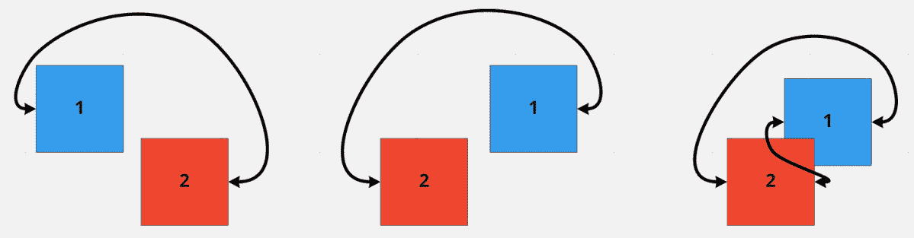
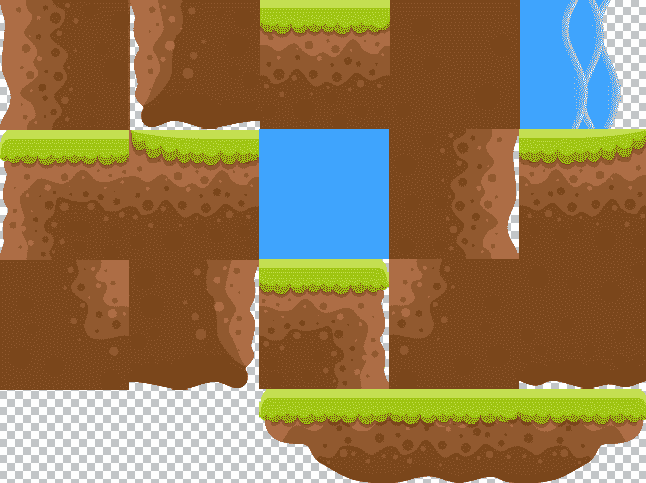
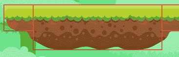

# 第五章：*第五章*：碰撞检测

为了让我们的游戏更有趣，我们的“小红帽男孩”（**RHB**）需要奔跑、跳跃和滑行。幸运的是，我们已经实现了所有这些功能，但他还需要有东西可以跳上，有东西可以滑下，还有东西可以撞到。为了让这个游戏更有趣，我们需要添加**碰撞检测**，这是游戏设计中最有乐趣且最复杂的部分之一。

碰撞检测始于数学，检测两个形状是否相交，但会引出各种有趣的问题。在本章中，我们将处理其中的一些问题，例如，我们如何处理精灵的透明度？我们如何确保玩家从上方着陆在平台上，但如果他们在下面则会撞到平台？对于形状不是简单盒子的精灵怎么办？这将是一次非常有趣的体验！

在本章中，我们将涵盖以下主题：

+   创建真实场景

+   与轴对齐的边界框

+   从精灵图中获取边界框

+   撞到石头上

+   在平台上着陆和掉落

到本章结束时，你将拥有一个真正的游戏，尽管它可能是一个简短的游戏。你将拥有构建自己场景的技能，拥有良好的碰撞检测，并且知道如何将碰撞事件与你的程序集成。如果你想的话，可以向场景中添加自己的新对象，并与之碰撞或跳离，甚至掉出世界。让我们开始吧！

# 技术要求

你需要从[`github.com/PacktPublishing/Game-Development-with-Rust-and-WebAssembly/wiki/Assets`](https://github.com/PacktPublishing/Game-Development-with-Rust-and-WebAssembly/wiki/Assets)下载本章的最新资源。

你可以在此章节的源代码：[`github.com/PacktPublishing/Game-Development-with-Rust-and-WebAssembly/tree/chapter_5`](https://github.com/PacktPublishing/Game-Development-with-Rust-and-WebAssembly/tree/chapter_5)。

下载中没有新的资源，所以如果你之前已经下载过，就无需再次下载。

观看以下视频，看看代码的实际效果：[`bit.ly/36BJYJd`](https://bit.ly/36BJYJd)

# 创建真实场景

目前，RHB 可以随意移动，在一个空旷的虚空中，就像《黑客帝国》中的那样。这是进步；所有那些动画都是真正的劳动成果，但它不是一个游戏。是时候让 RHB 进入一个环境——一个背景，平台，也许还有一些可以跳过的东西。让我们从背景开始。

## 添加背景

目前，我们的游戏只能从精灵图中渲染图像，我们可以用它作为背景，但对于一张图片来说这是过度设计。相反，我们将添加一个新的`struct`，它可以从`.png`文件中绘制简单的图像。然后，我们将将其添加到`WalkTheDog`中的`draw`和`initialize`函数中：

1.  创建一个`Image`结构体。

我们可以自下而上地处理这些更改，先在引擎中添加代码，然后将其集成到游戏中。我们的 `Image` `struct` 将会使用我们在 *第二章*，*绘制精灵* 中编写的很多相同代码，但设置会更简单，因为我们不会使用表格。所有这些代码都应该放入 `engine` 模块中。

从一个持有 `HtmlImageElement` 的 `struct` 开始：

```rs
pub struct Image {
    element: HtmlImageElement,
    position: Point,
}
impl Image {
    pub fn new(element: HtmlImageElement, position: 
        Point) -> Self {
        Self { element, position }
    }
}
```

这里没有你以前在其他形式中没有看到过的内容。`Image struct` 包含图像元素，假设是通过 `load_image` 函数加载的，以及它在场景中的位置。`Image` 还需要一个绘制函数，但在 `Renderer` 中没有简单的方法可以绘制整个图像。这需要一个新的方法，如下所示：

```rs
impl Renderer {
    ...
    pub fn draw_entire_image(&self, image: 
        &HtmlImageElement, position: &Point) 
            self.context
            .draw_image_with_html_image_element(image, 
                position.x.into(), position.y.into())
            .expect("Drawing is throwing exceptions! 
                Unrecoverable error.");
    }
}
```

这个函数与我们之前写的 `draw_image` 函数非常相似，但它使用的是更简单的 JavaScript `drawImage` 函数版本，该版本只接受一个图像和一个位置。要使用这种方法，你需要知道你正在绘制的图像有多大。如果它太大或太小，它将显示得与源图像一样大或一样小。

1.  现在你已经为 `Renderer` 添加了一个方法，请继续更新 `Image` 实现以使用它来绘制图像：

    ```rs
    impl HtmlImageElement {
        ...
        pub fn draw(&self, renderer: &Renderer) {
            renderer.draw_entire_image
                (&self.element,&self.position)
        }
    }
    ```

现在你已经可以绘制图像了，让我们来加载它。

1.  加载图像。

背景图像可以在下载的资产中找到，在 `original/freetileset/png/BG/BG.png` 中，可以将其复制到 `static` 目录。然后，它可以被加载并用于创建一个 `Image` `struct`。这将在 `game` 模块的 `WalkTheDog` 的 `initialize` 函数中完成，如下所示：

```rs
impl Game for WalkTheDog {
    async fn initialize(&mut self) -> Result<Box<dyn 
        Game>> {
        match self {
            WalkTheDog::Loading => {
                let sheet = browser::fetch_json
                    ("rhb.json").await?.into_serde()?;
                let background = engine::
                    load_image("BG.png").await?;
                ....
```

在前面的代码片段中，只有高亮显示的最后一行是新的，它从文件中加载背景。我们的 `WalkTheDog` `enum` 只包含 `RedHatBoy`，所以我们将不得不稍微重构一下代码。虽然我们可以在 `WalkTheDog::Loaded` 状态中持有 `RedHatBoy` 和 `Background` 的元组，但这会变得非常烦人，而且会很快。

1.  要做到这一点，将 `enum` 改成如下所示：

    ```rs
    pub enum WalkTheDog {
        Loading,
        Loaded(Walk),
    }
    ```

我们将用 `WalkTheDog` 来代表我们的游戏，但我决定让 RHB 带狗去"`Walk"。在一个通用框架中，我可能会称这个为"`Walk`应该可以工作。

1.  `Walk` 结构将需要包含 RHB 和背景，所以请继续添加：

    ```rs
    pub struct Walk {
        boy: RedHatBoy,
        background: Image,
    }
    ```

确保你已经从 `engine` 模块导入了 `Image`。现在，你可以沿着 `game` 模块向下工作，并跟随编译器错误。在 `WalkTheDog` 的 `initialize` 函数中，你应该看到一个错误，即 "`` expected struct `Walk`, found struct `RedHatBoy` ``"。

1.  通过创建带有我们已加载的背景的 `Walk` 并将其设置在返回的 `WalkTheDog::Loaded` 中来修复这个问题。这看起来如下所示：

    ```rs
    impl Game for WalkTheDog {
        async fn initialize(&mut self) -> Result<Box<dyn 
             Game>> {
            ...
            Ok(Box::new(WalkTheDog::Loaded(Walk {
                boy: rhb,
                background: Image::new(background, Point {                 
                    x: 0, y: 0 }),
            })))
        }
        ...
    }
    ```

这将创建一个带有男孩和位于左上角的`background`的`Walk`，但你仍然会在`WalkTheDog`的`update`方法中看到几个编译错误，因为所有这些假设`WalkTheDog::Loaded`包含`RedHatBoy`。每个都可以以完全相同的方式更改。第一个看起来像这样：

```rs
impl Game for WalkTheDog {
    ...
    fn update(&mut self, keystate: &KeyState) {
        if let WalkTheDog::Loaded(walk) = self {
            if keystate.is_pressed("ArrowRight") {
                walk.boy.run_right();
            }
            ...
```

`if let WalkTheDog::Loaded`这一行没有变化，除了现在变量名是`walk`而不是`rhb`。然后，我们在`boy`上调用`run_right`，但通过`walk`结构。你可以争论我们应该在`Walk`上添加方法而不是委托给`boy`，但我们现在先不这么做。毕竟，`walk.run_right()`并没有真正意义。在修复`update`中的所有类似编译错误后，你还可以像这样修复`draw`中的类似错误：

```rs
impl Game for WalkTheDog {
    ...
    fn draw(&self, renderer: &Renderer) {
        if let WalkTheDog::Loaded(walk) = self {
             walk.boy.draw(renderer);
        }
        ...
```

做完所有这些，你现在将再次绘制……嗯，你将再次绘制 RHB。

1.  接下来，继续绘制我们游戏的背景。绘制背景只是使用我们新的绘制函数的问题，所以让我们在`walk.boy.draw`函数调用之前添加它，如下所示：

    ```rs
    impl Game for WalkTheDog {
        ...
        fn draw(&self, renderer: &Renderer) {
            if let WalkTheDog::Loaded(walk) = self {
                 walk.background.draw(renderer);
                 walk.boy.draw(renderer);
            }
            ...
    ```

做完这些后，你应该看到 RHB 站在背景前面，就像这样：


图 5.1 – 站在森林中

看起来，你可能会想，为什么 RHB 的`x`坐标是`0`时却这么靠右？请记住这个想法，因为我们很快就会处理它。首先，让我们使用我们的精灵图集从*第二章*，*绘制精灵*，将一个平台放到屏幕上。

## 添加障碍物

有 RHB 站在背景前面真是太好了，看起来也很棒，但场景仍然有点空。如果场景中还有其他东西会怎样？一些宏伟的、创新的、超越生命的东西。嗯，艺术预算很低，所以为什么不放一块石头呢？

我们新的`Image`类意味着我们不需要很多代码，而且你之前都见过。要添加障碍物，请按照以下步骤操作：

1.  首先，从`assets`中的`original/freetileset/png/Object/Stone.png`复制`Stone.png`到`static`目录。现在，你可以像添加`Background`一样将其添加到`Walk`中，如下所示：

    ```rs
    struct Walk {
        boy: RedHatBoy,
        background: Image,
        stone: Image,
    }
    ```

这将再次开始引起编译错误，因为`Walk`是在没有石头的情况下创建的。

1.  在`initialize`中，像加载背景一样加载石头，如下所示：

    ```rs
    impl Game for WalkTheDog {
        async fn initialize(&mut self) -> Result<Box<dyn 
            Game>> {
            ...
            match self {
                WalkTheDog::Loading => {
                    ...
                    let background = engine::load_image
                        ("BG.png").await?;
                    let stone = engine::
                        load_image("Stone.png").await?;
                    ...
    ```

1.  然后，你需要拿起我们刚刚加载的石头，并将其添加到`Walk`中。我们将通过取`FLOOR`值（`600`）并减去石头图像的高度（恰好是`54`像素）来确保石头在地面上。如果我们把石头放在`y`位置`546`，它应该正好坐在地面上。以下是创建`Walk`的更新：

    ```rs
    impl Game for WalkTheDog {
        async fn initialize(&mut self) -> Result<Box<dyn 
            Game>> {
            ....
            Ok(Box::new(WalkTheDog::Loaded(Walk {
                boy: rhb,
                background: Image::new(background, Point { 
                    x: 0, y: 0 }),
                stone: Image::new(stone, Point { x: 150, 
                    y: 546 }),
            })))
    ```

1.  石头距离右边`150`像素，所以它将在 RHB 前面。最后，使用`draw`方法绘制石头。这个添加如下：

    ```rs
    impl Game for WalkTheDog {
        ...
        fn draw(&self, renderer: &Renderer) {
            if let WalkTheDog::Loaded(walk) = self {
                walk.background.draw(renderer);
                walk.boy.draw(renderer);
                walk.stone.draw(renderer);
            }
    ```

代码更改很小，只是用与`boy`和`background`相同的`draw`调用绘制石头。这样做，你将看到 RHB 走向石头：


图 5.2 – 注意那块石头！

现在，如果 RHB 走进那块石头，他会安全地躲在它后面，就像这样：


图 5.3 – 世界上最简单的游戏

这没什么意思。虽然我们已经学会了如何将新对象添加到游戏中，并为更互动的体验绘制它们，但游戏还没有任何挑战。我们想让男孩撞到石头上并倒下，结束游戏。为此，我们需要了解一些关于边界框和碰撞检测的知识，所以让我们在下一节中学习这些内容。

# 轴对齐边界框

在我们的游戏中检查两个对象是否发生碰撞，理论上可以通过检查每个对象中的每个像素，看它们是否共享一个位置来实现。这种逻辑不仅编写起来非常复杂，而且在计算上也非常昂贵。我们需要以每秒`60`帧的速度运行，不能浪费我们宝贵的处理能力去追求那种完美——至少如果我们想让游戏有趣的话。幸运的是，我们可以使用一种简化方法，它足够接近以欺骗我们愚蠢的眼睛，就像我们无法分辨动画实际上只是一系列静态图像一样。这种简化方法被称为*边界框*。

边界框只是一个矩形，我们将用它来进行碰撞，而不是检查精灵上的每个像素。你可以想象每个精灵周围都有一个盒子，看起来像这样：


图 5.4 – 边界框

这些盒子实际上并没有绘制出来；它们只存在于游戏的内存中，除非你想调试它们。当你使用盒子时，你只需要检查盒子的值——顶部(*y*)，左边(*x*)，右边(*x* + 宽度)，和底部(*y* + 高度)。这使比较变得更快。让我们更详细地谈谈如何检测两个盒子是否相交。

注意

术语“**轴对齐**”听起来很复杂，但实际上它只是意味着盒子没有旋转。*Y*将向上和向下，*X*从左到右，并且始终与游戏的坐标系对齐。

## 碰撞

为了检测两个框是否碰撞或重叠，它们将存在于我们从本书开始就一直在使用的同一 2D 坐标空间中。它们可能不可见，但它们就在那里，坐在石头所在的位置或与 RHB 一起运行。它们需要一个 *x* 和 *y* 的位置，就像精灵已经有了，还需要一个宽度和高度。当我们检查两个框是否碰撞时，我们在 *x* 和 *y* 轴上检查。让我们首先看看你如何判断两个框在 *x* 轴上是否相交。给定有两个框，如果框 1 的左侧（或 *x* 位置）小于框 2 的右侧，但框 1 的右侧大于框 2 的左侧，那么框 1 就与框 2 相交。这更容易通过视觉来解释：



图 5.5 – 碰撞

前面的图显示了三组可能发生碰撞的两个框，在一个 *x* 随着向右移动而增加的空间中，就像我们的画布一样。前两个比较没有发生碰撞，但第三个发生了。

看一下第一个比较，其中框 1 在框 2 的左侧，两者之间有一个间隙。正如你所见，框 1 的左侧明显在框 2 的右侧左侧，如箭头所示。这满足了碰撞的第一个条件——框 1 的左侧必须小于框 2 的右侧。然而，框 1 的右侧在框 2 的左侧左侧，这违反了我们的第二个条件。为了碰撞，框 1 的右侧必须大于（在右侧）框 2 的左侧，因此这两个框没有发生碰撞。

在第二个比较中，框 1 被移动到框 2 的右侧，再次没有重叠。框 1 的右侧现在在框 2 的左侧右侧，因此它们满足了碰撞的第二个条件，但框 1 的左侧现在也在框 2 的右侧右侧，所以框子没有满足第一个条件，仍然没有发生碰撞。

最后，在第三个比较中，框 1 的左侧再次在框 2 的右侧右侧，但框 1 的左侧在框 2 的右侧左侧。这两个框发生了碰撞。框 1 和框 2 有重叠的 *x* 值，所以它们发生了碰撞。

如果图片不是你的风格，查看实际数字也可以帮助你了解这个算法是如何工作的。假设框 1 和框 2 都是 10 x 10，我们可以形成一个表格，如下所示：


在这张表的每一行中——也就是说，每一组坐标的示例集——框 2 处于相同的位置。这里实际上有四个示例。在第一行中，框 1 完全位于框 2 的左侧。在第二行中，框 1 的右边缘撞到了框 2 的左边缘，因此它们发生了碰撞。在第三行中，它们发生碰撞是因为框 1 的左边缘撞到了框 2 的右边缘。最后，在第四行中，框 1 并不完全位于框 2 的右侧。这些值具有与图像相同的属性；第一个框的左边缘或右边缘位于第二个框的左边缘和右边缘之间。这个长篇的解释导致以下简短的伪代码：

```rs
if (box_one.x < box_two.right) &&
    (box_one.right > box_two.x) {
        log!("Collision!");
    }
```

这满足了我在一开始提到的两个条件，但关于垂直轴（*y*）呢？它的工作方式类似，只是我们不是使用左右两侧，而是分别使用顶部和底部值。框 1 的顶部必须位于框 2 的底部之上，这意味着小于框 2 的底部。框 1 的底部必须位于框 2 的顶部之下。如果这两个条件都成立，则框发生碰撞。记住，在我们的坐标系中，*y* 值随着屏幕向下移动而增加：


图 5.6 – 垂直碰撞

让我们花点时间来处理这三个比较，就像我们之前做的那样。对于第一个比较，框 1 的顶部在框 2 的底部之上，但框 1 的底部也在框 2 的顶部之上，所以它们没有重叠。

在第二种情况下，框 1 完全位于框 2 下方，没有发生碰撞。框 1 的底部在框 2 的顶部下方，这是碰撞必须满足的条件，但框 1 的顶部也在框 2 的底部下方，因此我们的第一条垂直碰撞规则不成立。

在第三个比较中，框 1 的顶部在框 2 的底部之上，框 1 的底部在框 2 的顶部之下，所以我们有碰撞。这意味着我们可以扩展我们的伪代码，使其看起来像以下这样：

```rs
if (box_one.x < box_two.right) &&
    (box_one.right > box_two.x) &&
    (box_one.y < box_two.bottom) &&
    (box_one.bottom > box_two.y) {
        log!("Collision!");
    }
```

这四个条件必须同时满足才能发生碰撞。既然我们已经知道了碰撞，现在我们可以将约束框应用到 RHB 和石头上，以便它们可以发生碰撞。不幸的是，一种天真方法会导致非常困难的碰撞和几乎不可能的游戏。这个问题可以用一个词来概括——透明度。

### 透明度

在 *图 5.7* 中，我为 RHB 和石头画了红色的约束框：


图 5.7 – 约束框

这些约束框是通过使用加载后的整个精灵的大小创建的，使用了 `HTMLImageElement` 的宽度和高度属性。正如你所见，框的大小远大于它们对应的精灵，特别是 RHB 的那个。这是因为精灵具有透明度，我们不想将其包含在我们的约束框中。目前，框发生了碰撞，RHB 会在接触到石头之前就被撞倒。这不是我们想要的！

这是边界框碰撞的主要调试技术的一个例子——绘制边界框以便可以看到哪里出了问题。在这种情况下，RHB 的框太大了。它应该是包含整个图像所需的最小尺寸，而这个错误揭示的是我们在*第二章*，*绘制精灵*中使用的精灵表包含了很多透明度。在 RHB 能够正确与石头碰撞之前，我们需要修复这个问题，所以让我们开始剪辑精灵表。

# 剪辑精灵表

为了让 RHB 撞到石头上，我们得处理透明度问题。让我们看一下 RHB 所来源的原始`.png`文件。图像的一部分如图*图 5.8*所示，如下：


图 5.8 – 精灵表

这是*空闲*动画的两个帧，黑色线条显示了图像的边界。正如你所见，这些图像中有很多额外的空间，所以使用与图像相同大小的边界框是不行的。这就是你在*图 5.7*中看到的边界框问题。我们有两个选择来解决这个问题。最简单的方法，尽管有点烦人，就是在我们图形编辑器中打开精灵表，找出每个精灵的实际边界框像素。然后，我们将这些信息存储在代码或单独的文件中，并使用这些边界框。这会加快开发速度，但意味着需要加载比必要的更大的图像，并且渲染大量的透明度而没有理由。避免编写一些代码而造成的性能损失是很大的，但如果我们处于游戏马拉松中并且需要匆忙完成游戏，我们可能会这样做。

我们将要使用一个*剪辑后的*精灵表，其中已经移除了透明度。这意味着需要写一点代码来确保精灵仍然对齐，但仅仅因为图形文件更小而节省的内存就足够补偿了。

我们剪辑后的精灵表将看起来如下（这是一个片段）：


图 5.9 – 剪辑后的纸张

注意，虽然空白区域被剪辑了，但并没有全部移除。这是因为整个表中的每个矩形大小都是相同的。看看 RHB 被击出的版本在水平方向上占据了整个矩形，而空闲的 RHB 在垂直方向上占据了它。这意味着我们将在边界框中考虑到一些透明度，但幸运的是，我们的精灵表 JSON 也将包含这些数据。我们还需要确保精灵正确对齐，以便动画不会在屏幕上跳动。幸运的是，JSON 也提供了这些数据。

注意

这里使用的所有精灵图集都是使用一个名为**TexturePacker**的工具生成的。这包括与图形一起的 JSON 文件。虽然你可以制作自己的纹理图，但你为什么要这么做呢？TexturePacker（包括免费和付费版本）可以在以下网址找到：[`bit.ly/3hvZtDQ`](https://bit.ly/3hvZtDQ)。TexturePacker 内置了裁剪精灵图集和导出我们需要的用于在游戏中使用的数据的工具。

裁剪版本的精灵图集数据文件将包含比我们在*第二章*，“绘制精灵”中使用的更多一些信息。以下是新 JSON 文件中前两个空闲精灵的示例：

```rs
"Idle (1).png":
{
    "frame": {"x":117,"y":122,"w":71,"h":115},
    "rotated": false,
    "trimmed": true,
    "spriteSourceSize": {"x":58,"y":8,"w":71,"h":115},
    "sourceSize": {"w":160,"h":136}
},
"Idle (2).png":
{
    "frame": {"x":234,"y":122,"w":71,"h":115},
    "rotated": false,
    "trimmed": true,
    "spriteSourceSize": {"x":58,"y":8,"w":71,"h":115},
    "sourceSize": {"w":160,"h":136}
},
```

两个框架都包含了我们之前用来裁剪精灵的`frame`数据，但它们还包含了一个`spriteSourceSize`字段。该字段包含了精灵不透明部分的边界框。换句话说，前两个空闲帧的精灵从左侧的`57`个透明像素和顶部的`8`个像素开始。这些信息对于对齐裁剪后的精灵至关重要，因为它们都从`0,0`开始。如果没有使用这些信息，动画就会在页面上到处跳跃，看起来非常糟糕。幸运的是，通过将精灵的位置与`spriteSourceSize`的*x*和*y*坐标相加，就可以纠正这个问题。这将导致精灵看起来没有在正确的位置上——也就是说，当我们把精灵定位在`0`时，它会在右侧显示`58`个像素，但只要我们在进行碰撞检测时也考虑到`spriteSourceSize`，那就没关系了。一旦我们考虑了`spriteSourceSize`，我们的边界框就会紧贴精灵图集，透明度最小化：


图 5.10 – 正确的边界框

注意

如果你想要为调试绘制自己的边界框，我建议你这么做，你可以在`Renderer`中添加一个`draw_rect`函数并在上下文中绘制矩形。代码可以在*第五章*，“碰撞检测”的源代码中找到，网址为[`github.com/PacktPublishing/Rust-Game-Development-with-WebAssembly/tree/chapter_5/`](https://github.com/PacktPublishing/Rust-Game-Development-with-WebAssembly/tree/chapter_5/)。

使用这些新的、修正后的边界框，RHB 和石头不会发生碰撞，最终可以安全地跳过石头。在下一节中，我们将开始添加新的裁剪精灵图集。

## 添加裁剪图集

在 `assets` 文件夹的 `sprite_sheets` 目录中，你可以找到名为 `rhb_trimmed.png` 和 `rhb_trimmed.json` 的新精灵图版本。将这些文件复制到 `static` 目录，但请确保将文件重命名为 `rhb.png` 和 `rhb.json`。如果服务器尚未运行，请启动它，你应该会看到 RHB 在屏幕上弹跳，因为图集中的精灵不再正确对齐。他也会稍微悬停在地面之上：


图 5.11 – 摇晃的 RHB

我们的首要任务是修复他的动画，使其不再如此生硬。这就是为什么我们之前花了那么多时间讨论 `spriteSourceSize` —— 为了修复他的动画。首先，我们将添加该字段到 `Cell` 中，你可能记得它位于 `engine` 模块中，如下代码片段所示：

```rs
#[derive(Deserialize, Clone)]
#[serde(rename_all = "camelCase")]
pub struct Cell {
    pub frame: SheetRect,
    pub sprite_source_size: SheetRect,
}
```

这些更改包括添加了 `#[serde(rename_all)]` 指令和一个 `sprite_source_size` 字段。虽然 `spriteSourceSize` 是 JSON 中的名称，但这是 Rust，在 Rust 中，我们使用蛇形命名法来命名变量，这就是为什么我们使用 `serde(rename_all)` 指令。`rename_all = "camelCase"` 可能看起来有些反直觉，因为我们实际上是将名称更改为蛇形命名法，但这是因为该指令指的是序列化，而不是反序列化。如果我们要将此结构写入 JSON 文件，我们希望将任何变量重命名为 camelCase，这意味着在反序列化时，我们需要做相反的操作。多亏了我们之前的工作，`sprite_source_size` 将从新的 JSON 文件中加载，所以接下来，我们需要调整绘制，以便动画再次对齐。

在 `game` 模块和 `RedHatBoy` 实现中，我们将稍微修改 `draw` 函数以考虑裁剪。它看起来如下所示：

```rs
impl RedHatBoy {
    ...
    fn draw(&self, renderer: &Renderer) {
        ...
        renderer.draw_image(
        &self.image,
        &Rect {
                x: sprite.frame.x.into(),
                y: sprite.frame.y.into(),
                width: sprite.frame.w.into(),
                height: sprite.frame.h.into(),
            },
        &Rect {
                x: (self.state_machine.context().position.x 
                    + sprite.sprite_source_size.x as i16)
                    .into(),
                y: (self.state_machine.context().position.y 
                    + sprite.sprite_source_size.y as i16)
                    .into(),
                width: sprite.frame.w.into(),
                height: sprite.frame.h.into(),
            },
        );
    }
```

我已经为了上下文复制了整个 `draw_image` 调用，但只有两行发生了变化。请记住，`draw_image` 调用需要两个矩形——源矩形，它保持不变，和目标矩形，这是我们更改的部分。*x* 和 *y* 坐标都通过 `sprite_source_size` 及其相应的坐标进行调整。将值转换为 `i16` 可能会让你感到紧张，因为这可能导致数学错误，如果精灵图中的 *x* 或 *y* 位置超过 215，但那将是一个非常奇怪的图。最后，`into` 调用作用于计算结果，将 `i16` 转回 `f32` 以供 `Rect` 结构体使用。在做出这些更改后，你应该会看到动画正确播放，RHB 应该回到他最初的位置，即在石头旁边：

![图 5.12 – 良好的边界框]


图 5.12 – 良好的边界框

如果你使用`draw_rect`绘制边界框，确保它使用与图像相同的边界框。注意边界框不再重叠。尽管如此，它们仍然非常接近，RHB 稍微悬停在地面之上。所以，让我们稍微调整他的起点。在`red_hat_boy_states`模块的顶部，我们将更改一个常量并添加一个新的，如下所示：

```rs
const FLOOR: i16 = 479;
const STARTING_POINT: i16 = -20;
```

之前，`FLOOR`是`475`，但让我们将 RHB 向下推几个像素。我们还将给 RHB 一个负的*x*位置，以便在他和石头之间留出一点空间。记住，RHB 会调整回右边以考虑动画，所以他实际上不会被画到屏幕外。接下来，我们将修改`RedHatBoyState<Idle>`实现，特别是`new`函数，以移动 RHB 的起点。这个变化在这里显示：

```rs
impl RedHatBoyState<Idle> {
    fn new() -> Self {
        RedHatBoyState {
            context: RedHatBoyContext {
                frame: 0,
                position: Point {
                    x: STARTING_POINT,
                    y: FLOOR,
                },
                velocity: Point { x: 0, y: 0 },
            },
            _state: Idle {},
        }
    }
}
```

再次，我包括了整个`impl`以提供上下文，但唯一的变化是 RHB 的`RedHatBoyContext`的初始位置，使用了新的常量。这样做，RHB 就会站在一小段跑道上，这样他就可以跳过石头，就像这样：


图 5.13 – 跑步起步

我们图像中的边界框是正确的，但我们还没有实际使用它们。这就是为什么如果你按右箭头，RHB 仍然会开始奔跑并直接穿过石头后面。是时候给石头和 RHB 合适的轴对齐边界框了，而不仅仅是画出它们，然后使用它们将 RHB 撞倒。多么有趣啊！

# 与障碍物碰撞

要有碰撞，我们实际上必须将我们看到的 RHB 和石头上的边界框放在一起。然后，在`WalkTheDog`的`update`函数中，我们需要检测这个碰撞，当发生碰撞时，我们将 RHB 移动到`Falling`和`KnockedOut`状态，这对应于精灵图中的`Dead`动画。大部分代码，尤其是状态机，都是非常熟悉的，所以我会避免重复的部分，并突出显示差异。我会提醒你新状态中需要更改的内容，你总是可以检查最终的代码在[`github.com/PacktPublishing/Rust-Game-Development-with-WebAssembly/tree/chapter_5/`](https://github.com/PacktPublishing/Rust-Game-Development-with-WebAssembly/tree/chapter_5/)。

让我们从最简单的边界框开始，即石头的边界框。

## 石头的边界框

石头是最简单的边界框，因为我们只需使用`HTMLImageElement`的大小。但这并不总是如此。如果你看围绕石头画有边界框的图片，你会注意到它比石头的实际尺寸要大，尤其是在角落处。目前这已经足够好了，但随着我们继续前进，我们需要记住这一点。

要向`engine`模块中的`Image`实现添加边界框，我们希望在创建`Image`时，在其`new`函数中计算边界框，如下所示：

```rs
pub struct Image {
    element: HtmlImageElement,
    position: Point,
    bounding_box: Rect,
}
impl Image {
    pub fn new(element: HtmlImageElement, position: Point) -> Self {
        let bounding_box = Rect {
            x: position.x.into(),
            y: position.y.into(),
            width: element.width() as f32,
            height: element.height() as f32,
        };
        Self {
            element,
            position,
            bounding_box,
        }
    }
    ....
}
```

在这里，我们向`Image` `struct`中添加了`bounding_box`，并在`new`函数中使用其`HTMLImageElement`后端的`width`和`height`来构建它。值得注意的是，我们必须将`element.width()`和`element.height()`调用转换为`f32`。这应该是安全的，但如果以后我们绘制一个非常大的图像，那么它可能成为一个问题。还值得注意的是，通过在`new`函数中创建边界框，我们确保了每次更新`position`时，我们也需要更新`bounding_box`。我们可以通过每次计算`bounding_box`来解决这个问题，这是一个不错的解决方案，但这确实意味着可能会损失性能。在这种情况下，我们将保持`struct`中的`position`和`bounding_box`都是私有的，以确保它们不会不同步。`Image`对象目前还没有移动。

由于`bounding_box`是私有的，我们需要提供一个访问器，所以现在就来做这件事：

```rs
impl Image {
    ...
    pub fn bounding_box(&self) ->&Rect {
        &self.bounding_box
    }
}
```

这样就处理了石头；现在，让我们给 RHB 一个边界框。

## 为 RedHatBoy 定义一个边界框

由于`RedHatBoy`上的边界框比精灵表更复杂，所以边界框的处理也稍微复杂一些。它需要与表的位置对齐，并且需要根据动画进行调整。因此，我们无法像处理`Image`那样存储一个与对象绑定的`bounding_box`。相反，我们将根据其当前状态和精灵表来计算其边界框。代码实际上看起来非常类似于`draw`，如下所示：

```rs
impl RedHatBoy {
    ...
    fn bounding_box(&self) ->Rect {
        let frame_name = format!(
            "{} ({}).png",
            self.state_machine.frame_name(),
            (self.state_machine.context().frame / 3) + 1
        );
        let sprite = self
            .sprite_sheet
            .frames
            .get(&frame_name)
            .expect("Cell not found");
        Rect {
            x: (self.state_machine.context().position.x + 
                sprite.sprite_source_size.x as i16).into(),
            y: (self.state_machine.context().position.y + 
                sprite.sprite_source_size.y as i16).into(),
            width: sprite.frame.w.into(),
            height: sprite.frame.h.into(),
        }
    }
    ...
}
```

为了计算`bounding_box`，我们首先从状态名称和当前帧创建`frame_name`，就像我们在`draw`中做的那样，然后使用我们在更新`draw`函数时所做的相同计算从这些值计算`Rect`。实际上，这是一个清理那些两段代码中重复代码的好时机，使用重构。让我们从`RedHatBoy`实现中提取函数来获取帧和精灵名称：

```rs
impl RedHatBoy {
    ...
    fn frame_name(&self) -> String {
        format!(
            "{} ({}).png",
            self.state_machine.frame_name(),
            (self.state_machine.context().frame / 3) + 1
        )
    }
    fn current_sprite(&self) -> Option<&Cell> {
        self.sprite_sheet.frames.get(&self.frame_name())
    }
    ...
}
```

对于`current_sprite`，你需要确保你导入了`engine::Cell`。现在，我们可以替换`bounding_box`实现中的重复代码，如下所示：

```rs
impl RedHatBoy {
    …
    fn bounding_box(&self) ->Rect {
        let sprite = self.current_sprite().expect("Cell not
            found");
        Rect {
            x: (self.state_machine.context().position.x + 
                sprite.sprite_source_size.x as i16).into(),
            y: (self.state_machine.context().position.y + 
                sprite.sprite_source_size.y as i16).into(),
            width: sprite.frame.w.into(),
            height: sprite.frame.h.into(),
        }
    }
    ...
}
```

进一步来说，我们可以通过从`bounding_box`中移除重复代码来缩小`draw`函数，使其更加精简：

```rs
impl RedHatBoy {
    ...
    fn draw(&self, renderer: &Renderer) {
        let sprite = self.current_sprite().expect("Cell not 
            found");
        renderer.draw_image(
        &self.image,
        &Rect {
                x: sprite.frame.x.into(),
                y: sprite.frame.y.into(),
                width: sprite.frame.w.into(),
                height: sprite.frame.h.into(),
            },
            &self.bounding_box(),
        );
    }
    ...
}
```

这使得实现更加小巧、干净，但需要注意我们每帧都在查找`current_sprite`两次。我们现在不会努力修复它，因为我们没有看到任何问题，但以后我们可能想要缓存这个值。

现在我们有了两个边界框，我们实际上可以看到 RHB 是否与石头发生碰撞。

## 在碰撞时崩溃

为了在碰撞时崩溃，我们需要使用之前提到的伪代码来检查两个矩形是否相交，但这次使用的是真实代码。我们将添加这段代码到`Rect`中，如果你还记得，它是`engine`模块的一部分。这段代码是`Rect`结构体的实现，如下所示：

```rs
impl Rect {
    pub fn intersects(&self, rect: &Rect) -> bool {
        self.x < (rect.x + rect.width)
        && self.x + self.width > rect.x
        && self.y < (rect.y + rect.height)
        && self.y + self.height > rect.y
    }
}
```

这段代码复现了之前的伪代码，检查是否存在任何重叠，如果存在则返回`true`。每次你看到`rect.x + rect.width`，那就是右边，而`rect.y + height`是底部。我个人更喜欢在每个条件下将相同的矩形放在这个函数的左侧，因为我发现这样更容易阅读和思考。我们将在`WalkTheDog`的`update`函数中使用这段代码。这段代码很小，但它将引发一系列连锁反应。碰撞代码如下：

```rs
impl WalkTheDog {
    ...
    fn update(&mut self, keystate: &KeyState) {
        if let WalkTheDog::Loaded(walk) = self {
            ...
           walk.boy.update();
            if walk
                .boy
                .bounding_box()
                .intersects(walk.stone.bounding_box())
            {
                walk.boy.knock_out();
            }
        }
    }
}
```

碰撞检查将在调用`boy`上的`update`之后立即发生。我们检查男孩的边界框是否与石头相交，使用我们全新的`intersects`函数，如果相交，我们在 RHB 上使用`knock_out`。可怜的 RHB；幸运的是，你总是可以刷新。

`knock_out`函数还不存在；创建它将意味着更新我们的状态机。`KnockOut`事件将导致转换到`Falling`状态，然后当`Falling`动画完成后，将转换到`KnockedOut`状态。我们在等什么？让我们敲出 RHB！

### KnockOut 事件

正如我们在*第四章*中提到的，*使用状态机管理动画*，我们将向`RedHatBoyStateMachine`添加新状态，并“跟随编译器”以了解在哪里填写必要的代码。Rust 的类型系统在这方面做得很好，它使这类工作变得容易，并在过程中提供有用的错误信息，所以我只会突出显示独特的段落。记住，你总是可以使用[`github.com/PacktPublishing/Rust-Game-Development-with-WebAssembly`](https://github.com/PacktPublishing/Rust-Game-Development-with-WebAssembly)上的源代码提前查看，尽管我强烈建议你首先尝试自己编写实现。

你可以在`game`模块中通过向`Event`枚举添加`KnockOut`事件，并在`RedHatBoy`上添加`knock_out`方法来开始，就像其他状态机转换一样，如下所示：

```rs
pub enum Event {
    Run,
    Jump,
    Slide,
    KnockOut,
    Update,
}
...
impl RedHatBoy {
    ...
    fn knock_out(&mut self) {
        self.state_machine = 
            self.state_machine.transition(Event::KnockOut);
}
    ...
```

这只会将编译器错误移动到`RedHatBoyStateMachine`，因为匹配语句是不完整的，所以你需要向`RedHatBoyStateMachine`添加一个`KnockOut`事件，它将从`Running`状态转换到`Falling`状态。这个转换是这样的：

```rs
impl RedHatBoyStateMachine {
    fn transition(self, event: Event) -> Self {
        match (self, event) {
            ...
            (RedHatBoyStateMachine::Running(state), 
                Event::KnockOut) => state.knock_out
                    ().into(),
            (RedHatBoyStateMachine::Jumping(state), 
                Event::KnockOut) =>   
                    state.knock_out().into(),
            (RedHatBoyStateMachine::Sliding(state), 
                Event::KnockOut) =>   
                    state.knock_out().into(),
            _ => self,
        }
    }
    ...
```

你可能会想知道为什么我们还有从`Jumping`和`Sliding`到`Falling`的转换；这是因为如果我们不这样做，那么用户可以简单地按住空格键连续跳跃，或者适时滑动，他们就会直接穿过石头。所以，我们需要确保这三种状态都会转换到`Falling`，这样游戏才不会有任何错误。

当然，还有很多东西缺失。`Falling`状态还不存在，既不是`RedHatBoyStateMachine` `enum`的成员，也不是一个结构体。`Sliding`、`Jumping`或`Running`的类型状态没有`knock_out`方法，而且没有实现将`Falling`转换为`RedHatBoyStateMachine::Falling`的`From`特质。你需要像之前一样添加这两个，并填补其余的编译器错误。你会发现你需要两个新的常量，一个是跌倒动画中的帧数，另一个是精灵图中跌倒动画的名称。你可以查看`rhb.json`来找出这些值，或者查看以下列表：

```rs
const FALLING_FRAMES: u8 = 29; // 10 'Dead' frames in the sheet, * 3 - 1.
const FALLING_FRAME_NAME: &str = "Dead";
```

如果你已经做了所有必要的样板更改，你最终会创建一个从`Running`状态到`Falling`状态的转换，如下面的代码所示：

```rs
impl RedHatBoyState<Running> {
    pub fn knock_out(self) -> RedHatBoyState<Falling> {
        RedHatBoyState {
                context: self.context,
                _state: Falling {},
        }
    }
    ...
```

注意，你目前只是在转换状态，并没有对`RedHatBoyContext`进行任何更改。这就是为什么事情变得奇怪，因为当 RHB 与石头碰撞时，他会跌倒…并且一直滑动和跌倒：


图 5.14 – 跌倒时滑动？

转换正确地进入了`Dead`动画，但它并没有停止 RHB 的前进动作。让我们将转换改为停止`RedHatBoy`：

```rs
impl RedHatBoyState<Running> {
    pub fn knock_out(self) -> RedHatBoyState<Falling> {
        RedHatBoyState {
                context: self.context.reset_frame().stop(),
                _state: Falling {},
        }
    }
    ...
```

现在，当我们设置新状态时，我们调用`reset_frame()`将帧设置为`0`，就像我们更改动画时总是做的那样，并调用新的`stop`函数来停止角色的前进动作。当然，这个函数还没有编写。它附加到`RedHatBoyContext`实现中，将`velocity.x`设置为`0`：

```rs
impl RedHatBoyContext {
      fn stop(mut self) -> Self {
          self.velocity.x = 0;
              self
        }
    }
...
```

当从`Sliding`状态转换到`Falling`状态，以及从`Jumping`状态转换到`Falling`状态时，你也想进行相同的转换，以便转换匹配。这将停止角色的前进动作，但不会停止死亡动画反复播放。这是因为我们从未从`Falling`状态转换到`KnockedOut`状态，而`KnockedOut`状态本身还不存在。幸运的是，我们之前已经编写过类似的代码。记得在*第四章*，*使用状态机管理动画*中，当滑动动画完成时，我们从一个`Sliding`动画转换回`Running`动画。这段代码位于`RedHatBoyState<Sliding>`的`update`函数中，这里重新呈现：

```rs
impl RedHatBoyState<Sliding> {
    ...
    pub fn update(mut self) -> SlidingEndState {
        self.update_context(SLIDING_FRAMES);
        if self.context.frame >= SLIDING_FRAMES {
            SlidingEndState::Running(self.stand())
        } else {
            SlidingEndState::Sliding(self)
        }
    }
}
```

在这段代码中，我们检查每次更新，通过`if state_machine.context.frame>= SLIDING_FRAMES`来查看`Sliding`动画是否完成。如果是，我们返回`Running`状态而不是`Sliding`状态。为了达到这个程度，你之前已经必须向`RedHatBoyState<Falling>`添加了一个`update`方法，可能是一个通用的默认方法来播放动画。现在，你需要模仿这种行为并转换到新的`KnockedOut`状态。具体来说，你需要做以下几步：

1.  创建一个`KnockedOut`状态。

1.  从`Falling`状态创建一个转换到`KnockedOut`状态。

1.  在`update`动作中检查`Falling`动画是否完成，如果是，则切换到`KnockedOut`状态，而不是停留在`Falling`状态。

1.  在`RedHatBoyState<Falling>`中创建一个`enum`来处理`update`方法的两种结束状态，以及相应的`From`特质，以便将其转换为`RedHatBoyStateMachine`适当的`enum`变体。

这里唯一的新事物是`RedHatBoyState<KnockedOut>`将不需要`update`方法，因为在`KnockedOut`状态下，RHB 什么都不做。我们不会逐行通过那段代码，相反，我强烈建议你自己尝试。如果你卡住了，你可以查看[`github.com/PacktPublishing/Game-Development-with-Rust-and-WebAssembly/tree/chapter_5`](https://github.com/PacktPublishing/Game-Development-with-Rust-and-WebAssembly/tree/chapter_5)中的代码。完成之后，它应该看起来像这样：


图 5.15 – 正在打盹

同时，我会假设你已经做到了，因为你很棒，所以我们将继续到跳到平台上的动作。

# 跳到平台上

现在 RHB 撞到石头上，我们需要找到一种方法来越过它。玩游戏并尝试跳过岩石；你会注意到这真的很困难。时机必须恰到好处，让人联想到经典游戏*Pitfall*中的 Atari 2600 蝎子。在本章的后面部分，我们将通过缩小边界框并增加 RHB 的水平速度来调整这一点，但首先，我们将在石头上方放置一个平台，RHB 可以跳上去以避开岩石。除了用新的精灵图在屏幕上放置平台并给它一个边界框外，我们还需要处理一种新的碰撞类型。具体来说，我们需要处理来自平台上面的碰撞，这样我们才能着陆。

## 添加平台

我们将首先添加来自新精灵图的平台。这个精灵图实际上包含了我们将在接下来的章节中构建地图的元素，但现在我们只用它来制作一个平台。精灵图看起来是这样的：




图 5.16 – 我们的平台

图片被分割成没有轮廓但形状排列方式可见的正方形，称为瓦片。这些正方形是我们将混合匹配以制作 RHB 跳过和滑过的各种障碍物的精灵。瓦片也紧密排列在一起，所以我们不需要担心任何偏移。目前，我们只需要右下角的平台，它将浮在石头上方：


图 5.17 – 一个平台

这个设置方便地将精灵按顺序排列，所以它将很容易在精灵图中访问。你现在可以看到那些标记三个精灵的虚线。让我们将其放入我们的游戏中。在`assets`目录的`sprite_sheets`中，你会找到两个文件，`tiles.json`和`tiles.png`。这是瓦片的图，我们将在启动时加载它。为了有一个可以加载它的东西，我们首先在`game`模块中创建一个`Platform`结构体：

```rs
struct Platform {
    sheet: Sheet,
    image: HtmlImageElement,
    position: Point,
}
impl Platform {
    fn new(sheet: Sheet, image: HtmlImageElement, position:         Point) -> Self {
        Platform {
            sheet,
            image,
            position,
        }
    }
}
```

到目前为止，这只是为了加载预期的数据。在这个阶段，你可能注意到`sheet`和`image`被反复配对，这意味着它们是重构为新的结构，如`SpriteSheet`的良好候选者。我们现在不会这么做，因为我们不想过早地进行重构并得到一个糟糕的抽象，但我们会留心如果它再次出现时的重复。

平台需要两样东西。它需要被绘制，并且需要一个边界框，这样我们才能在上面着陆。为了绘制这个框，我们需要一起绘制构成该平台的底部三个瓦片。查看`tiles.json`，由于框架名称都是像`14.png`这样的数字，所以请相信我，瓦片是`13.png`、`14.png`和`15.png`。

注意

使用像 TexturePacker 这样的工具可以显著更容易地确定需要查看哪些瓦片。如果你没有这个工具可用，你可以只从图中绘制每个图像，同时显示它们的名称，然后修改 JSON 文件中的名称以使其更易读。

现在让我们深入到`Platform`的`draw`函数中，它里面有一个小技巧，如下所示：

```rs
impl Platform {
    ...
fn draw(&self, renderer: &Renderer) {
        let platform = self
            .sheet
            .frames
            .get("13.png")
            .expect("13.png does not exist");
        renderer.draw_image(
        &self.image,
        &Rect {
                x: platform.frame.x.into(),
                y: platform.frame.y.into(),
                width: (platform.frame.w * 3).into(),
                height: platform.frame.h.into(),
            },
            &Rect {
                x: self.position.x.into(),
                y: self.position.y.into(),
                width: (platform.frame.w * 3).into(),
                height: platform.frame.h.into(),
            },
        );
}
```

小技巧是我们知道这三个瓦片在图中恰好相邻，所以我们不会从图中取出所有三个精灵，而是只获取第一个精灵宽度的三倍。这恰好包括了其他两个瓦片。别忘了第二个`Rect`是目的地，因此应该使用`position`字段。这个第二个矩形也对应于平台的边界框，所以让我们创建平台的边界框函数并在这里使用它。这些更改如下所示：

```rs
impl Platform {
    ...
    fn bounding_box(&self) ->Rect {
        let platform = self
            .sheet
            .frames
            .get("13.png")
            .expect("13.png does not exist");
        Rect {
            x: self.position.x.into(),
            y: self.position.y.into(),
            width: (platform.frame.w * 3).into(),
            height: platform.frame.h.into(),
        }
    }
    fn draw(&self, renderer: &Renderer) {
        ...
        renderer.draw_image(
            &self.image,
            &Rect {
                x: platform.frame.x.into(),
                y: platform.frame.y.into(),
                width: (platform.frame.w * 3).into(),
                height: platform.frame.h.into(),
            },
            &self.bounding_box(),
        );
    }
```

这段代码与其他代码有相同的问题，我们在每次绘制时都搜索框架，并且我们在这里做了两次。我们还在每次`bounding_box`调用时构造`Rect`，而我们之前明确避免过。为什么改变？因为我知道未来，我们很快就会改变构建这个结构的方式，所以在这里节省一个或两个周期不值得担心。相信我。

既然我们已经制作了一个理论上可以绘制的平台，让我们实际绘制它。首先，我们将它添加到`Walk`结构体中，如下所示：

```rs
struct Walk {
    boy: RedHatBoy,
    background: Image,
    stone: Image,
    platform: Platform,
}
```

当然，这不会编译，因为当我们创建`Walk`时，我们没有平台。我们需要更新`WalkTheDog`中的`initialize`函数以包含新的`Platform`，如下所示：

```rs
impl Game for WalkTheDog {
    async fn initialize(&mut self) -> Result<Box<dyn Game>> {
        match self {
            WalkTheDog::Loading => {
                ...
                let stone = engine::
                   load_image("Stone.png").await?;
                let platform_sheet = browser::
                    fetch_json("tiles.json").await?;
                let platform = Platform::new(
                    platform_sheet.into_serde::<Sheet>()?,
                    engine::load_image("tiles.png").await?,
                    Point { x: 200, y: 400 },
                );
                ...
                Ok(Box::new(WalkTheDog::Loaded(Walk {
                    boy: rhb,
                    background: Image::new(background,
                        Point { x: 0, y: 0 }),
                    stone: Image::new(stone, Point { x: 
                        150, y: 546 }),
                    platform,
                })))
                ...
```

这里只有几个小的改动，我已经用高亮标记了。然后我们获取`tiles.json`，并使用它和`tiles.png`创建一个新的`Platform`。最后，我们用`platform`创建`Walk`。绘制平台是一个简单的改动，添加到`WalkTheDog`的`draw`函数中，如下所示：

```rs
fndraw(&self, renderer: &Renderer) {
    ...
    if let WalkTheDog::Loaded(walk) = self {
        walk.background.draw(renderer);
        walk.boy.draw(renderer);
        walk.stone.draw(renderer);
        walk.platform.draw(renderer);
    }
}
```

如果你正确地完成了这个任务，你应该会看到以下内容：


图 5.18 – 一次逃脱！

但是，尽管平台有一个边界框，你现在还没有使用它，所以我们需要将它添加到`WalkTheDog`的`update`函数中。当与平台碰撞时，你希望从`Jumping`状态转换回`Running`状态。这个转换已经写好了 – 我们在着陆地板时做这个转换 – 所以你只需要添加一个检查和一个可以执行转换的事件。

我们还需要确保 RHB（红帽男孩）留在平台上。目前，重力会直接将他拉穿平台，无论是否有碰撞或者玩家处于`Running`（跑步）状态。这个解决方案稍微复杂一些。一个简单的解决方案，我知道因为我就是写的，是在玩家站在平台上时停止应用重力。这直到它不起作用，当 RHB 从平台上跑开并停留在空中时，会产生一个**Wile E. Coyote**效果。假设他能够向下看，他会举一个牌子，然后重重地摔到地上。

相反，我们继续在每一帧上应用重力，并检查 RHB 是否仍在着陆平台上。如果他还在，我们就立即调整他回到平台的顶部。这意味着 RHB 会反复“着陆”，直到他到达平台的尽头，然后掉落。幸运的是，这对用户是不可见的，因为我们每次更新都会计算 RHB 的新位置，这导致他向右移动，直到他掉落边缘，就像他应该做的那样。

让我们从向`update`函数添加检查开始，这样 RHB 就能站在平台上：

```rs
fn update(&mut self, keystate: &KeyState) {
    if let WalkTheDog::Loaded(walk) = self {
        ...
        walk.boy.update();
        if walk
            .boy
            .bounding_box()
            .intersects(&walk.platform.bounding_box())
        {
            walk.boy.land();
        }
        if walk
            .boy
            .bounding_box()
            .intersects(walk.stone.bounding_box())
        {
            walk.boy.knock_out()
        }
        ...
    }
}
```

我也重现了男孩与石头相交的检查，这样你可以看到我们在检查石头之前检查了边界框。哪个检查先进行并不重要，但我更喜欢最后检查那些可以杀死玩家的东西。这样我们就不至于在玩家真正想要站在平台上时杀死他们。就像我们在`RedHatBoy`上创建`knock_out`方法一样，`land`方法和它对应的`Event`还不存在。你现在可以创建它们两个，并跟随编译器，直到你需要在状态机中编写转换，如下所示：

```rs
impl RedHatBoyStateMachine {
    fn transition(self, event: Event) -> Self {
        match (self, event) {
            (RedHatBoyStateMachine::Jumping(state), Event::Land) => {
                state.land().into()
            }
            ...
```

记住，我们已经编写了从 `Jumping` 到 `Running` 的转换方法，所以你不需要再写它，但如我之前提到的，这并不足以使 RHB 落在平台上。转换会发生，但 RHB 会直接穿过平台并撞到地上。这很不酷。为了使 RHB 保持平台上的状态，我们需要将其 *y* 位置设置为边界框的顶部。这意味着需要将 `Land` 事件修改为存储平台边界框的 *y* 位置。

小贴士

由于我们使用了 `enum` 来表示事件，我们可以通过将其作为我们使用的变体的一部分来传递任何所需的数据。Rust 的 `enum` 是 Rust 的一个伟大特性。

在与平台的每一次交汇中，我们将通过 `Land` 事件进行转换。这意味着 `Update` 事件会因为重力将玩家向下拉一点，但随后 `Land` 事件会将他们推回到原位。由于我们没有绘制中间状态，所以看起来会很好。这个系统并不完美，但我们并不是在编写物理引擎。现在让我们来做这件事；我们将首先修改 `land` 函数为 `land_on`，并传入一个 *y* 位置：

```rs
impl Game for WalkTheDog {
    ...
    fn update(&mut self, keystate: &KeyState) {
        ...
        if walk
            .boy
            .bounding_box()
            .intersects(&walk.platform.bounding_box())
        {
            walk.boy.land_on(walk.platform.bounding_box().y);
        }
    }
    ...
}
```

现在，`land_on` 而不是 `land` 会获取平台 `bounding_box` 的 *y* 位置。如果你只跟随编译器错误，你最终需要修改 `Land` 事件以保存位置并修改 `Jumping` 类型状态上的 `land` 方法。它可能看起来像这样：

```rs
impl RedHatBoyState<Jumping> {
    ...
    pub fn land_on(mut self, position: f32) -> 
        RedHatBoyState<Running> {
            self.context.position.y = position as i16;
            RedHatBoyState {
                context: self.context.reset_frame(),
                _state: Running,
        }
    }
```

作为初步尝试，这似乎是可行的。遗憾的是 `self` 必须是可变的，但转换将 RHB 的位置恢复到平台顶部。问题是 RHB 的 *y* 位置实际上代表了他的左上角。这意味着如果你按照这个思路继续下去，你会得到类似这样的结果：


图 5.19 – 这看起来不正确

幸运的是，`RedHatBoy` 知道自己的高度，因此我们可以在设置 *y* 位置时调整高度。我们需要在 `Land` 事件中将 `self.bounding_box.height()` 作为参数包含在内，然后在转换过程中考虑它，如下所示：

```rs
impl RedHatBoyState<Jumping>{
    ...
    fn land_on(mut self, position: f32, height: f32) {
        let position = (position - height) as i16;
        RedHatBoyState {
            context: self.context.reset_frame(),
            _state: Running,
        }
    }
}
```

这似乎可行，但它还有一个问题。边界框实际上在动画过程中会改变大小，基于动画的当前帧，因为剪裁精灵会略微缩小和扩大。由于我们在每一帧检查碰撞，当 RHB 在平台上时，我们会反复调用 `Land`。如果我们不断地根据当前帧的高度改变着陆位置，行走看起来会非常“弹跳”。尽管边界框略有变化，但如果我们为这个计算使用一个恒定的玩家高度值，看起来会更好。

小贴士

游戏开发通常有很多试错。当数学上正确的解决方案表现不佳或看起来不正确时，请记住，游戏的感觉比数学准确性更重要。

我们已经有了玩家高度调整；我们只是将其创建为`FLOOR`常量。在`game`模块中，你会看到`FLOOR`常量被设置为`479`。那么，这意味着我们可以使用游戏的高度（`600`），减去`FLOOR`来得到玩家的身高。我们可以使用这个信息来创建两个新的常量。第一个，`HEIGHT`，可以在游戏模块中定义为`const HEIGHT: i16 = 600`，并用于我们硬编码的`600`值的地方。第二个，`PLAYER_HEIGHT`，可以在`red_hat_boy_states`模块中定义，如下所示：

```rs
mod red_hat_boy_states {
use super::HEIGHT;
  ...
    const FLOOR: i16 = 479;
    const PLAYER_HEIGHT: i16 = HEIGHT - FLOOR;
```

`PLAYER_HEIGHT`属于`red_hat_boy_states`模块，因为它只会在那里使用，但为了计算它，我们需要将`game::HEIGHT`导入到`red_hat_boy_states`模块中。我们通过高亮的`use`语句来完成这个操作。现在我们有了调整 RHB 着陆时的正确值，我们可以在`land_on`方法和`RedHatBoyContext`中考虑到它：

```rs
impl RedHatBoyContext {
    ...
    fn set_on(mut self, position: i16) -> Self {
        let position = position - PLAYER_HEIGHT;
        self.position.y = position;
        self
    }
}
...
impl RedHatBoyState<Jumping> {
    pub fn land_on(self, position: f32) ->         RedHatBoyState<Running> {
        RedHatBoyState {
            context: self.context.reset_frame()
            .set_on(position as i16),
            _state: Running,
          }
     }
...
```

我们已经将 RHB 位置的调整移动到了`RedHatBoyContext`中的`set_on`方法。`set_on`方法始终调整玩家的身高，这就是为什么它被命名为`set_on`而不是`set_position_y`。它还返回`self`，这样我们就不需要`mut self` anymore，与`RedHatBoyContext`上的其他操作相匹配。

将`land`方法更改为`land_on`方法也要求你修改在`RedHatBoyState<Jumping>`的`update`方法中对其的调用。毕竟，现在没有`land`方法了。记住，在调用`set_on`时，我们必须考虑到高度，如下所示：

```rs
    impl RedHatBoyState<Jumping> {
        pub fn update(mut self) -> JumpingEndState {
            self.update_context(JUMPING_FRAMES);
            if self.context.position.y >= FLOOR {
                JumpingEndState::Landing(self.land_on
                    (HEIGHT.into()))
            } else {
                JumpingEndState::Jumping(self)
            }
        }
```

在这里，我们正在检查 RHB 是否已经超过了`FLOOR`，并将其推回到`HEIGHT`。记住，当我们调用`land_on`时，我们发送的是 RHB 脚的位置，而不是他的头部。你可以争论`update`方法不应该检查是否触地，而`WalkTheDog`中的高级`update`方法应该检查与地面的碰撞，并在适当的时候使用`Land`事件。我认为我可能会同意，但我们已经对这个章节做了足够多的改动，所以现在我们将保持现状。

这调整了 RHB 着陆时的位置。他在跳跃结束时将被定位在平台或地面上。现在，我们需要确保`Land`事件在 RHB 着陆后防止他穿过平台。`Land`事件将在平台上的`Running`发生时发生，但它没有被处理，所以你会直接穿过，因为重力开始起作用。我们需要为每个在平台上有效的状态创建一个`Land`转换，其中状态保持不变，但`y`位置被强制回到平台的顶部。

注意

如果我可以从*Big Nerd Ranch*系列书籍中借用一句话，编程很难，你并不愚蠢。这些变化可能看起来像是完全成形出现的，因为我是一个超级专家，但在许多情况下，这些只是通过大量的尝试和错误、重新阅读旧书和运气才得以实现。所以，如果你没有立刻想到这个解决方案或者事情变得有些混乱，不要担心。再次尝试代码，放慢速度，享受乐趣。我们正在制作一个游戏！

幸运的是，解释为什么我们需要这段代码比实际编写它更困难。我们将在`transition`方法中处理`Running`状态的`Land`事件：

```rs
impl RedHatBoyStateMachine {
    fn transition(self, event: Event) -> Self {
        match (self, event) {
            ...
            (RedHatBoyStateMachine::Running(state), Event::
                Land(position)) => {
                state.land_on(position).into()
            }
```

然后，我们将向`RedHatBoyState<Running>`状态类型添加一个`land_on`方法，如下所示：

```rs
...
impl RedHatBoyState<Running> {
    ...
    pub fn land_on(self, position: f32) -> 
        RedHatBoyState<Running> {
        RedHatBoyState {
            context: self.context.set_on(position as   
                i16),
            _state: Running {},
        }
    }
}
```

对于`Running`状态中的每个`Land`事件，你调整位置并保持在`Running`状态。有了这个，你应该能看到 RHB 跳到平台上：


图 5.20 – 在平台上奔跑

在平台上奔跑开始工作，但如果你尝试跑到平台边缘之外，你会找到一个奇怪的 bug。RHB 会从底部掉下去！


图 5.21 – 我的上帝！我是怎么到这里的？

结果表明，我们在处理重力方面存在一个相当狡猾的 bug，我们可以将其称为“终端速度”bug，我们可以在下一步解决这个问题。

### 终端速度

如果你记录 RHB 在`update`方法中跳跃到平台上并走过它时的`y`方向`velocity`，它看起来像这样：


图 5.22 – 永恒的重力！

如果你还记得，我们在每次更新时都会将重力增加`1`，直到玩家再次跳跃。这意味着最终，重力变得如此之大，以至于在更新时玩家被完全拉到平台下方，并且实际上不再与平台相交。我们的平台目前位于`400`。当玩家落在平台上时，他位于`279`，即平台的*Y 轴*减去玩家的身高。在第一帧，我们通过重力将其向下拉`1`，检查是否与平台相交（确实相交），然后着陆。在下一帧，我们将其向下拉`2`，下一帧拉`3`，以此类推。最终，我们实际上将其完全拉到平台下方，他不再与平台相交，然后——他突然在平台下方。我们需要通过给重力一个**终端速度**来修复这个问题。

在现实世界中，终端速度是由于物体周围空气的阻力而下降时所能达到的最快速度（更多信息请参阅[`go.nasa.gov/3roAWGL`](https://go.nasa.gov/3roAWGL)）。我们不会计算 RHB 的真实终端速度，因为他的世界中没有空气，但我们可以使用非常科学的挑选一个数字并看看它是否可行的方法。我们将 RHB 的最大正*y*速度设置为`20`，并将他的更新锁定在这个值。这将在`RedHatBoyContext`的`update`方法中实现，我们已经在那里修改了*y*以适应重力。相应的代码如下：

```rs
mod red_hat_boy_states {
    ...
    const TERMINAL_VELOCITY: i16 = 20;
    ...
    impl RedHatBoyContext {
        pub fn update(mut self, frame_count: u8) -> Self {
            if self.velocity.y < TERMINAL_VELOCITY {
                self.velocity.y += GRAVITY;
            }
           ...
```

将速度锁定在`20`解决了我们穿过平台的问题，现在 RHB 应该像预期的那样从平台上掉落。然而，如果你尝试滑动（按下箭头键），你会看到 RHB 直接穿过平台。这是因为`Sliding`状态不会响应`Land`事件。你可以用与修复`Running`相同的方式修复这个问题，这是一个练习题。试试看，记住如果你卡住了，最终源代码可在[`github.com/PacktPublishing/Game-Development-with-Rust-and-WebAssembly/tree/chapter_5`](https://github.com/PacktPublishing/Game-Development-with-Rust-and-WebAssembly/tree/chapter_5)找到。一个提示——当你保持同一状态时，你不需要调用`reset_frame`！

这几乎就是全部内容了，但还有两件事需要注意——撞到平台底部和边界框的透明度。

## 来自下方的碰撞

目前，如果 RHB 与平台发生碰撞，他会出现在顶部，这对于着陆来说很好，但如果他从平台下方来，那就不是那么好了。如果你现在取消注释与石头的碰撞并向前直行，你会发现你突然弹跳到平台上！为什么？因为 RHB 的头部实际上撞到了平台的底部，这次碰撞触发了`land_on`事件。他不是撞头倒下，而是传送到了平台上！

我们需要在这里进行特殊的碰撞检测。RHB 只有从平台上方落下时才能落在平台上；否则，游戏就结束了。幸运的是，这可以在`update`函数中通过检查碰撞方式的两处小改动来处理。当`RedHatBoy`在平台*上方*时与平台发生碰撞意味着着陆；否则，就像撞到石头一样，你会被击倒。你还需要是*下降*状态；否则，你会在跳跃上升的同时粘在平台上，产生奇怪的效果。让我们看看这个改动：

```rs
impl Game for WalkTheDog {
    ...
    fn update(&mut self, keystate: &KeyState) {
        if let WalkTheDog::Loaded(walk) = self {
            ...
            walk.boy.update();
            if walk
                .boy
                .bounding_box()
                .intersects(&walk.platform.bounding_box())
            {
                if walk.boy.velocity_y() > 0 && walk.boy.pos_y() < walk.platform.position.y {
                    walk.boy.land_on(walk.platform.bounding_box().y);
                } else {
                    walk.boy.knock_out();
                }
            }
            ...
        }
    }
}
```

修改是为了检查 `RedHatBoy` 在 *y* 方向上的速度是否大于 `0`，因此 RHB 正在向下移动。我们还检查 *y* 位置是否小于平台 *y* 位置的上端。这意味着男孩在平台上方，所以他正在着陆；否则，男孩撞到了平台上，我们将他击倒。`pos_y` 和 `velocity_y` 函数还不存在，所以我们将它们添加到 `RedHatBoy` 中，如下所示：

```rs
impl RedHatBoy {
    ...
    fn pos_y(&self) -> i16 {
        self.state_machine.context().position.y
    }
    fn velocity_y(&self) -> i16 {
        self.state_machine.context().velocity.y
    }
    ...
}
```

获取 `RedHatBoy` 的 *y* 值有点棘手，因为它们实际上在 `RedHatBoyContext` 上，但我们能够在这里完成它，并使用 getter 来方便地包装它们。

信息

为了这本书，这里的代码相当明确，但你可以通过为 `RedHatBoy` 的 `falling` 提取一个方法来使其更具表现力。我们现在就保持原样，但你在自己的代码中可能需要考虑一些更具表现力的名称。

就这样，RHB 终于可以跑了，跳过石头，落在平台上，也可以从平台上掉下来。然而，你可能已经注意到碰撞非常粗糙。他很容易撞到平台的底部，因为图像的透明部分发生了碰撞。他也可以从平台的边缘走过，这同样是因为图像的透明部分：


图 5.23 – 信不信由你，我正在空中行走

让我们花点时间调整我们的边界框来处理透明度。

## 边界框中的透明度

我们边界框的问题在于我们使用图像尺寸作为边界框。这意味着我们的角色周围会有很多额外的空间用于边界框。在这张屏幕截图中，我使用了本章早些时候的 `draw_rect` 方法来显示场景中所有三个对象的边界框：


图 5.24 – 到处都是边界框

平台在边界框中有很多空白区域，尤其是在左下角和右下角。RHB 的帽子角落附近也有空白区域。当我们关闭石头的碰撞检查并尝试在平台下行走时，RHB 在实际碰到它之前就已经“碰撞”到了平台的左下角。

RHB 脚周围的空白区域也是一个问题；它们是造成空中着陆效果的原因。他的边界框的远右边缘与平台相交，所以他会在真正到达正确位置之前就着陆。如果你看到他离开平台的边缘，你会看到当他离开时也有同样的问题。他在空中走了几步之后才开始下落。

我们将从处理 RHB 的边界框开始，使着陆和从平台上掉下来的动作看起来更逼真。

### 修复游戏以适应

我们可以使用一些算法来使边界框更好地匹配图像中的实际像素，但最终，它们都不是必要的。花点时间玩大多数平台游戏，你会发现碰撞并不完美，99% 的时间，这已经足够好了。在花点时间通过玩游戏进行“研究”后，我确定如果我们仅仅让边界框只宽到脚那么宽，他将发展出更加逼真的着陆。这有点反直觉。如果我们缩小边界框，他的手臂和帽子会超出边界框的边缘；我们会错过碰撞！这有关系吗？


图 5.25 – 一个窄边界框

答案是，“也许。”边界框和碰撞检测不仅仅是数学问题，它们也是游戏设计问题。当我在玩游戏时，感觉让边界框刚好包裹住脚是正确的。也许当你玩的时候，当你落在平台上或者手没有碰撞到时，会感觉太难，所以改变边界框吧！这不是一成不变的。

经过实验，我发现我还想缩短边界框，这样 RHB 就不会被他的帽子擦过而击倒。为了模仿这一点，我们可以先重命名 `bounding_box` 为 `destination_box`，因为这代表精灵渲染到的位置。它需要位于游戏中的 `RedHatBoy` 位置，但具有源图像的宽度和高度；否则，图像将看起来被压扁。然后，我们可以重新实现 `RedHatBoy` 的边界框，如下所示：

```rs
impl RedHatBoy {
    ...
    fn bounding_box(&self) -> Rect {
        const X_OFFSET: f32 = 18.0;
        const Y_OFFSET: f32 = 14.0;
        const WIDTH_OFFSET: f32 = 28.0;
        let mut bounding_box = self.destination_box();
        bounding_box.x += X_OFFSET;
        bounding_box.width -= WIDTH_OFFSET;
        bounding_box.y += Y_OFFSET;
        bounding_box.height -= Y_OFFSET;
        bounding_box
    }
```

我们从图像的原始尺寸 `destination_box` 开始，简单地通过一些偏移量缩小它。我通过使用高科技的选数和看数系统选择了这些数字。这给了我一个看起来自然的边界框，在跳跃和从悬崖上掉下来时不会太小，以至于 RHB 从来不会碰到任何东西。

如果你全局查找并替换了 `bounding_box` 并将其更改为 `destination_box`，那么碰撞检测将是不正确的。我们需要使用 `bounding_box` 来检查碰撞，并使用 `destination_box` 来绘制。绘制应该已经完成；你需要进入 `WalkTheDog` 中的 `update` 方法，并确保每个 `intersects` 调用都在 `bounding_box` 上，而不是 `destination_box`。

使用新的 `bounding_box` 方法和正确绘制的图像，你得到的 RHB 的边界框看起来像这样：


图 5.26 – 一个紧贴的边界框

你可以看到它比图像小得多，这使得游戏看起来更好，玩起来也更宽容。他着陆和从平台上掉下来的准确性更高，没有悬浮效果。你也可能发现现在跳过石头更容易，因为 RHB 的透明部分不会撞到岩石。

这留下了平台边缘周围的空白区域。我们可以缩小它的边界框，但这样会导致玩家在落在边缘时从平台顶部掉落。平台底部比顶部窄，这是一个问题，因为我们撞到的是底部，而落在顶部。我们真正想要做的是将平台分成多个边界框。

### 细分边界框

将边界框细分就像它的名字一样——我们将要取当前用于平台的那个边界框，并将其分成几个。这将显著减少框中额外的空间量，并改善我们的碰撞检测。你可能认为我们会使用复杂的算法或工具来确定使用哪些框，我们会——那是我们的眼睛。

具体来说，我们将查看平台，看到空白区域，然后尝试几个边界框分割的版本，直到我们找到一个我们喜欢的解决方案。我们可以通过使`Platform`能够有多个边界框来开始这个过程。我们将再次将`bounding_box`重命名为`destination_box`，然后创建一个新的方法来从原始框构建一个`bounding_boxes`向量，如下所示：

```rs
impl Platform {
    fn bounding_boxes(&self) -> Vec<Rect> {
        const X_OFFSET: f32 = 60.0;
        const END_HEIGHT: f32 = 54.0;
        let destination_box = self.destination_box();
        let bounding_box_one = Rect {
            x: destination_box.x,
            y: destination_box.y,
            width: X_OFFSET,
            height: END_HEIGHT,
        };
        let bounding_box_two = Rect {
            x: destination_box.x + X_OFFSET,
            y: destination_box.y,
            width: destination_box.width - (X_OFFSET * 
                2.0),
            height: destination_box.height,
        };
        let bounding_box_three = Rect {
            x: destination_box.x + destination_box.width – 
                X_OFFSET,
            y: destination_box.y,
            width: X_OFFSET,
            height: END_HEIGHT,
        };
        vec![bounding_box_one, bounding_box_two,  
            bounding_box_three]
    }
```

在这种方法中，我们创建三个矩形，每个都旨在与平台匹配，从平台的起始框开始。这是两个边缘上的小矩形和一个中间的大矩形。当我们画出这些框时，它看起来像这样：



图 5.27 – 平台边界框

这样碰撞的空白区域就少多了。你可能想知道`X_OFFSET`和`END_HEIGHT`的值是从哪里来的，而事实是我只是画了框，直到我满意为止。这并不花哨；只是足够好。

现在我们使用边界框的向量而不是一个，我们需要更改`WalkTheDog`的`update`方法中的逻辑，以确保 RHB 可以与任何框发生碰撞，并使代码编译。这段代码如下所示：

```rs
#[async_trait(?Send)]
impl Game for WalkTheDog {
    ...
    fn update(&mut self, keystate: &KeyState) {
        ...
        for bounding_box in &walk.platform.bounding_boxes() {
            if walk.boy.bounding_box()
                .intersects(bounding_box) {
                if walk.boy.velocity_y() > 0 && 
                    walk.boy.pos_y() < 
                        walk.platform.position.y {
                    walk.boy.land_on(bounding_box.y);
                    } else {
                        walk.boy.knock_out();
                    }
                }
            }
           ...
        }
    }
```

这里的变化是循环遍历所有边界框，并检查任何框上的碰撞。这里只有三个框，所以我们不必每次都检查这三个框。如果电脑不能数到三，你可能需要一个新电脑。

如果你再次暂时注释掉与石头的碰撞，你会看到你几乎可以走在平台下面：


Figure 5.28 – Just short enough

在这一点上，你可能想知道这应该算作一次碰撞吗。毕竟，他的帽子确实刮到了平台的底部。玩家可能很难判断他们是否能从平台下通过。我们能找到这个问题的解决方案吗？

### 通过常量进行游戏设计

在我们浏览这一节时，我们为诸如`FLOOR`和`PLAYER_HEIGHT`之类的值引入了越来越多的常数。大多数时候，我们因为魔法数字会导致代码重复和错误，所以将它们视为“坏”的。这是真的，但对我们使用的多数数字来说，我们没有重复。不，在这种情况下，我们可以使用常数来阐明数字的含义，并用于游戏设计。然后我们可以利用游戏设计来隐藏一些小瑕疵，比如我们的平台高度几乎刚刚超过玩家。

我们在最初创建平台时，将其位置设置为`Point { x: 200, y: 400 }`。这些是魔法数字——对此表示歉意。我们实际上知道`400`的*y*值将平台放置在一个相当令人困惑的位置。如果*y*是`370`，那么你需要从下面穿过它，如果是`420`，你需要从上面越过它。我们可以为这个创建两个常数并设置位置。这个变化在这里显示：

```rs
const LOW_PLATFORM: i16 = 420;
const HIGH_PLATFORM: i16 = 375;
#[async_trait(?Send)]
impl Game for WalkTheDog {
    async fn initialize(&self) -> Result<Box<dyn Game>> {
        match self {
            WalkTheDog::Loading => {
                ...
                let platform = Platform::new(
                    platform_sheet.into_serde::<Sheet>()?,
                    engine::load_image("tiles.png").await?,
                    Point {
                        x: 370,
                        y: LOW_PLATFORM,
                    },
                );
```


图 5.29 – 你不可能成功的！

你可能会注意到在这个截图中的平台稍微向右偏。我想能够跳过石头然后跳到平台上。用我们最初构建的方式来做这是不可能的，所以我将平台向右移动。我创建了一个名为`FIRST_PLATFORM`的常数，用于平台的*x*位置，将其设置为`370`，然后设置`Platform`的*x*位置为那个值。

我发现实际上用用户的速度和重力组合跳过石头几乎是不可能的。即使缩小了 RHB 的碰撞框，他跳得高但并不远。幸运的是，这可以通过常数轻松调整——只需将`RUNNING_SPEED`从`3`增加到`4`，他就移动得足够快，使得跳过石头变得容易。

在我们设计无尽跑酷游戏时，我们会发现可以通过游戏设计来隐藏碰撞中的任何缺陷。你将不断需要调整玩家的速度、边界框高度和障碍物位置等值。你将游戏编码到常数中的越多，这就会变得越容易。

### 一个快速挑战

当我们编写代码使 RHB 从平台下方跳起时被击倒，我们引入了这里可以看到的 bug：


图 5.30 – 他是怎么到那里的？

发生的情况是，当 RHB 撞到平台的底部时，他会进入`Falling`状态，但他不会改变他的速度，所以他继续跳跃。然后，在`KnockedOut`状态下，重力不再作用于 RHB。你的挑战是修复这个缺陷。你需要修改状态以反映这些变化。在你检查[`github.com/PacktPublishing/Game-Development-with-Rust-and-WebAssembly/tree/chapter_5`](https://github.com/PacktPublishing/Game-Development-with-Rust-and-WebAssembly/tree/chapter_5)之前试一试。这些更改很小，并且都在现有代码中。

# 摘要

在本章中，我们通过让 RHB 跑进障碍物和跳上平台，使`WalkTheDog`更接近一个游戏。我们用对齐的边界框完成了所有这些工作，在一个看起来像真实游戏的场景中，有背景，而不是一个空旷的虚无。我们还处理了一些处理修剪精灵图的怪癖，正确处理边界框，并利用我们在*第四章*中构建的状态机来处理新的动画和管理`RedHatBoy`的状态。

我们还学习了碰撞不仅仅是围绕一个图像画一个框。是的，这是相交框背后的数学，但也是检查玩家是否着陆或撞到平台。我们用矩形调试了碰撞框，并使用这些矩形制作了一个更好的匹配框。我们甚至将一个图像细分为多个碰撞框！

本章内容丰富，我们做了很多工作，我鼓励你在认为合适的情况下调整和修改代码。让 RHB 跳得更高或更低，或者让他移动得更慢。尝试缩小边界框，以便更容易跳过石头或将石头放在平台上。发挥你的想象力！

总的来说，我们已经将游戏设置得可以成为一个无限跑酷游戏，有随机生成的地形和令人信服的从左到右的滚动效果。我们将在下一章中开发这个功能。
