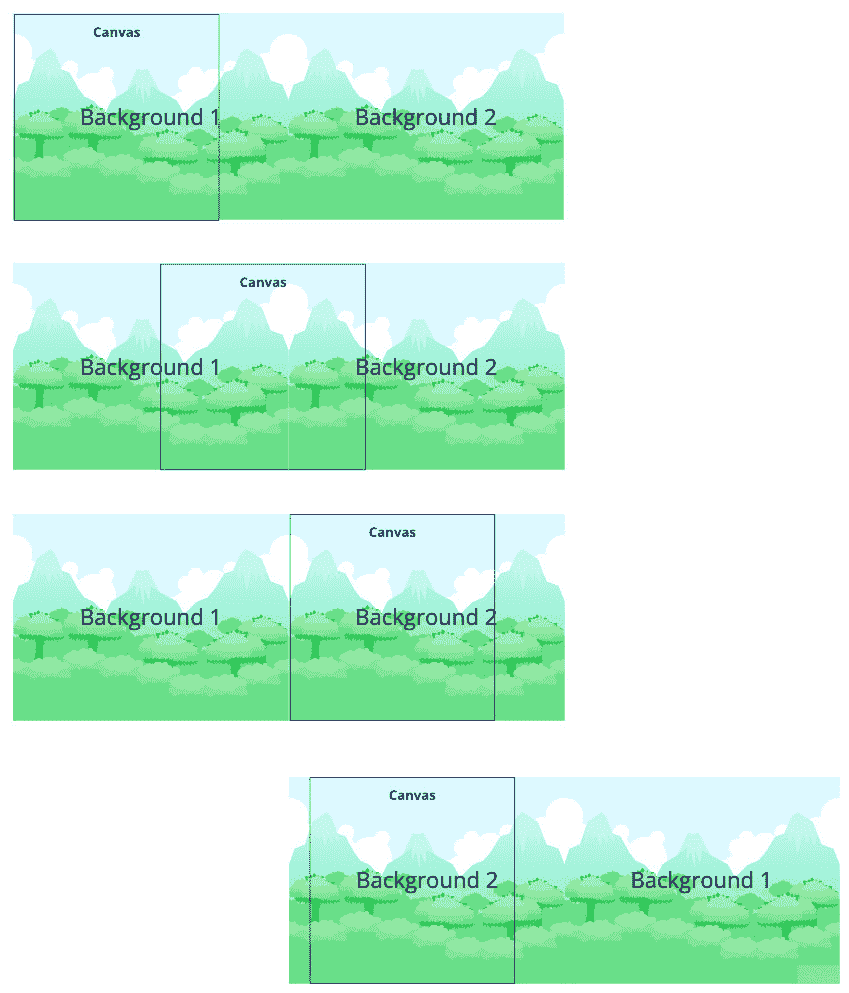
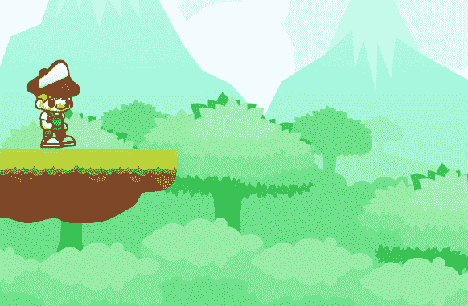
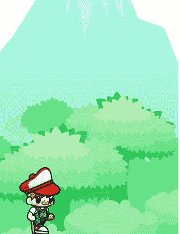
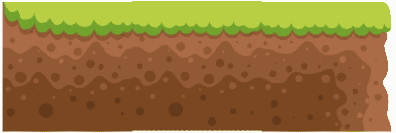
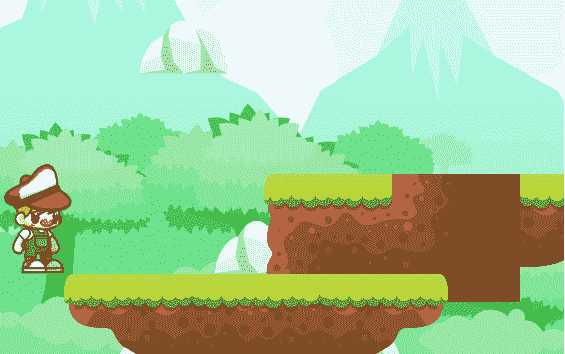
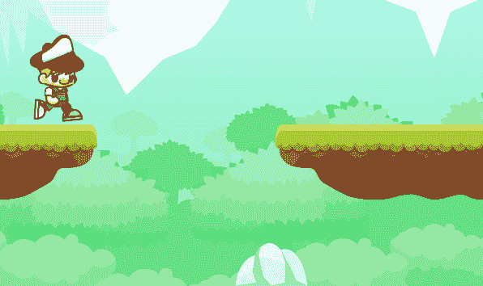
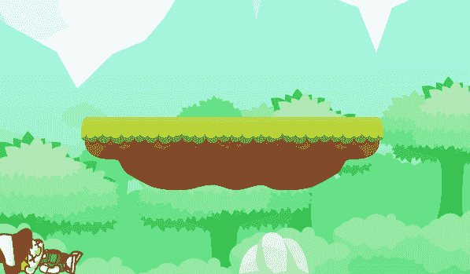
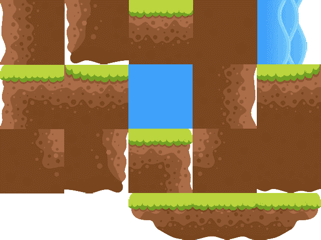

# 第六章：*第六章*：创建无限跑酷游戏

**红帽男孩**（**RHB**）可以跑步，跳上平台，甚至撞到岩石并摔倒。但一旦他开始向右跑，他就从屏幕上消失，再也没有出现过。这并不复杂，如果你等待足够长的时间，游戏甚至会因为缓冲区溢出错误而崩溃。在本章中，我们将通过在 RHB 跑步时生成新的场景来使我们的游戏真正实现无限，这些场景包含新的障碍和挑战。它们甚至包含随机性，一切始于 RHB 保持在原地！这是一个真正的技巧。

在本章中，我们将涵盖以下主题：

+   滚动背景

+   优化以实现无限跑酷

+   创建动态关卡

到本章结束时，你将拥有一个功能齐全的无限跑酷游戏，并且能够为 RHB 创建可以跳过和滑过的障碍物。

# 技术要求

对于本章，你需要所有在[`github.com/PacktPublishing/Game-Development-with-Rust-and-WebAssembly/wiki/Assets`](https://github.com/PacktPublishing/Game-Development-with-Rust-and-WebAssembly/wiki/Assets)的资源。就像在前几章中一样，你可以在[`github.com/PacktPublishing/Game-Development-with-Rust-and-WebAssembly/tree/chapter_6`](https://github.com/PacktPublishing/Game-Development-with-Rust-and-WebAssembly/tree/chapter_6)找到源代码。

查看以下视频，了解代码的实际应用：[`bit.ly/35pES1T`](https://bit.ly/35pES1T)

# 滚动背景

要用无限背景让 RHB 从左到右跑，我们有两种选择，如下：

+   根据图案或数学公式程序化生成背景。

+   使用 Hanna-Barbera 技术。

虽然第一种选择可能看起来更有趣或更动态，但 Hanna-Barbera 技术要简单得多，这就是我们将用于 Walk the Dog 的技术。Hanna-Barbera 技术是什么？首先，它可能根本不叫这个名字，但这就是我给它取的名字。Hanna-Barbera 是一家动画工作室，从 20 世纪 50 年代到 90 年代制作了一系列非常受欢迎的卡通，包括汤姆和杰瑞、弗林斯通一家、神秘岛、约吉熊等等。如果你是那个年代的孩子，你会醒来看到“周六早晨卡通”，这些卡通由 Hanna-Barbera 的作品主导。虽然该工作室因其深受喜爱的角色而闻名，但他们也因削减成本而闻名。他们制作了大量的卡通，并需要最大化他们快速且低成本地制作卡通的方式。

Hanna-Barbera 卡通最常见的特点之一是重复的背景。例如，在《YOgI 熊》的一集结束时，Ranger Smith 会开始追逐 YOgI 熊穿越 Jellystone 公园。然而，如果你仔细观察，Jellystone 公园似乎有一系列相同的树木在重复（见[`bit.ly/3BNuNXZ`](https://bit.ly/3BNuNXZ)以获取示例）。这种节省金钱的技术将非常适合我们的无尽跑酷游戏。我们将使用我们现在使用的相同背景元素，并在 RHB 向右跑时将其向左移动。紧接着，它将变成相同背景的副本，从而创建两个具有相同源图像的`Image`元素。一旦第一张图像完全移出屏幕，我们将将其移动到第二张图像的右侧。这两个背景将循环，创造出背景永远在移动的错觉：



图 6.1 – 在背景上滑动画布

这种技术依赖于三个因素。第一个是背景必须是无缝的，这样两个图像之间就没有可见的缝隙。幸运的是，我们的背景就是为了这个目的而构建的，并且它将工作得很好。第二个是画布窗口需要比背景小，这样整个背景就永远不会显示在屏幕上。如果我们这样做，那么第一个背景就可以完全移出屏幕到左边，然后被移动到第二个背景的右边，而这一切都不会有任何明显的缝隙或撕裂。这是因为这一切都发生在窗口边界之外。我倾向于将其想象成戏剧中的幕后，然后迅速跳到幕布的右侧。

最后，我们必须使用另一个错觉并冻结主要角色。不是将角色从屏幕左边移动到右边，而是将物体从右向左移动，几乎就像在跑步机上一样。从视觉上看，这看起来就像角色在跑步一样，并且它有一个优点，即修复了一个错误，如果玩家持续向右跑，他们的*x*位置最终会溢出（变得比我们用来保存它的 i16 更大），从而导致游戏崩溃。我们将不得不通过改变*x*速度来调整我们的思维，但一旦你习惯了它，你会发现它工作得相当容易。让我们开始制作我们的滚动背景。

注意

对于这种技术的另一个示例，请访问[`bit.ly/3BPNBGc`](https://bit.ly/3BPNBGc)，它解释了这种技术在持续向上移动的游戏中的应用，例如 Doodle Jump。

## 修复 RHB 的 x 坐标

我们可以随意滚动背景，但如果我们继续同时将 RHB 向右移动，效果将是让他以双倍速度奔跑。相反，我们希望 RHB 原地奔跑，而岩石和平台则向他移动，就像它们在传送带上一样。在本节结束时，我们将看到 RHB 向右跑进一个空白的白色空间，而一切都在他身边经过，就像他正在跑过世界的尽头。

让我们从`game::red_hat_boy_states`模块开始，并在`RedHatBoyContext`的`update`方法中不更新`x`：

```rs
impl RedHatBoyContext {
    fn update(mut self, frame_count: u8) -> Self {
         ...
         // DELETE THIS LINE! self.position.x += 
           self.velocity.x
         self.position.y += self.velocity.y;
         ...
```

通过这个改变，RHB 将原地运行，周围没有任何东西移动。我们保持`velocity`不变，因为这个值将被代码库的其余部分使用。为了方便使用，我们将添加一些方法。首先，让我们向`RedHatBoy`实现添加一个访问器，如下所示：

```rs
impl RedHatBoy {
    ...
    fn walking_speed(&self) -> i16 {
        self.state_machine.context().velocity.x
    }
```

此函数的工作方式与我们的其他几个`RedHatBoy`访问器类似，这使得获取`context`值更容易。接下来，让我们添加一个新的实现——`Walk`结构体的`Walk`：

```rs
impl Walk {
    fn velocity(&self) -> i16 {
        -self.boy.walking_speed()
    }
}
```

`Walk`实现仅在`WalkTheDog`枚举处于`Loaded`状态时可用，并且它翻转`boy`的`walking_speed`。当`boy`向右移动时，这意味着其他所有东西都在向左移动。现在，在`WalkTheDog`的`update`函数中，我们可以使用该值将其他所有东西向左移动。在更新`walk.boy`之后，我们可以更新`stone`和`platform`的位置，使它们与以下代码匹配：

```rs
impl Game for WalkTheDog {
    ...
    fn update(&mut self, keystate: &KeyState) {
        if let WalkTheDog::Loaded(walk) = self {
            ...
            walk.boy.update();
            walk.platform.position.x += walk.velocity();
            walk.stone.move_horizontally(walk.velocity());
            ...
```

你应该得到一个编译器错误，因为`stone`没有`move_horizontally`函数。`Stone`是`Image`类型，可以在`engine`模块中找到，而`Image`上的`position`是私有的。我们将保持这种方式，并在此处将`move_horizontally`添加到`Image`实现中，如下所示：

```rs
impl Image {
    ...
    pub fn move_horizontally(&mut self, distance: i16) {
        self.bounding_box.x += distance as f32;
        self.position.x += distance;
    }
}
```

这段代码可能有两件事会让你感到烦恼。第一点是我们在`Platform`上直接操作`position`，但使用了`Image`上的方法。这种不一致性是一个*异味*，告诉我们我们的代码中可能有问题——在这种情况下，`stone`和`platform`有两个不同的接口来修改它们的位置，尽管代码已经被复制。现在，我们将保持原样，但这是一个关于我们可能想要稍后做出的更改的提示。另一点是我们在更新`bounding_box`和`position`值时使用了相同的内容。这是一个我们将留到下一节（在`Rect Point`上放置`position`）的重构，尽管如果你有雄心壮志，你现在就可以做。

注意

代码异味是一个编程术语，由 Kent Beck 提出，并由 Martin Fowler 在其书籍《重构》中普及。如果你因为编程而获得报酬，无论是游戏还是其他，你应该看看这本书。

现在，你应该看到 RHB 原地奔跑，岩石和平台在他下面移动：



图 6.2 – 岩石去哪了？

提示

如果更改似乎没有显示出来，不要忘记重新启动服务器。我删除代码时就是这样做的，出于某种原因。

我们可以通过匹配`WalkTheDogupdate`函数中的`stone`和`platform`移动来开始移动背景。这个更改看起来如下所示：

```rs
fn update(&mut self, keystate: &KeyState) {
    if let WalkTheDog::Loaded(walk) = self {
        ...
        walk.platform.position.x += walk.velocity();
        walk.stone.move_horizontally(walk.velocity());
        walk.background.move_horizontally(walk.velocity());
        ...
```

这个小小的更改意味着 RHB 现在可以走出世界的边缘：



图 6.3 – 看看，这空旷的虚无！

然而，我们不想这样，所以让我们学习如何使用两个平铺背景来模拟一个无限的背景。

## 无限背景

要得到无限背景，我们需要两个背景图像而不是一个。我们将首先将`background`存储为数组，而不是在`Walk`中只存储一个`Image`，如下所示：

```rs
struct Walk {
    boy: RedHatBoy,
    backgrounds: [Image; 2],
    stone: Image,
    platform: Platform,
}
```

这将导致几个编译器错误，因为`backgrounds`不存在；即使它存在，代码也期望它是一个`Imagearray`。幸运的是，错误在很大程度上是有意义的，我们可以找出需要做什么。再次移动到`Game`实现的`initialize`中，让我们在初始化`Walk`时设置一个`backgrounds`数组，而不是只有一个，如下所示：

```rs
impl Game for WalkTheDog {
    async fn initialize(&mut self) -> Result<Box<dyn Game>> {
        match self {
            WalkTheDog::Loading => {
                ...
                let background_width = background.width() 
                 as i16;
                Ok(Box::new(WalkTheDog::Loaded(Walk {
                    boy: rhb,
                    backgrounds: [
                        Image::new(background.clone(), 
                        Point { x: 0, y: 0 }),
                        Image::new(
                            background,
                            Point {
                                x: background_width,
                                y: 0,
                            },
                        ),
                    ],
                    stone: Image::new(stone, Point { x: 
                     150, y: 546 }),
                    platform,
                })))
                ...
```

与我们之前的变化相比，这里发生了一些额外的事情，所以让我们更详细地看看这段代码。我们首先获取`background`的`width`属性。这是我们加载`HtmlImageElement`时创建的临时变量，而不是我们一直在使用的附加到`Walk`的`background`属性。我们这样做是为了防止在`Walk`初始化期间出现借用后移动错误。然后，我们让`Walk`接受一个`Image`对象的数组，确保在第一次创建时克隆`background`属性。最后，我们确保将第二个`Image`定位在`background_width`处，以便它与第一个背景对齐，位于屏幕之外。

然而，我们还没有完成编译器错误的问题。这是因为背景正在更新和绘制。我们将做出最简单的更改，以便我们可以重新开始编译和运行。首先，将我们在`update`函数中刚刚编写的`move_horizontally`代码替换为以下代码，该代码遍历所有背景并将它们移动：

```rs
fn update(&mut self, keystate: &KeyState) {
   if let WalkTheDog::Loaded(walk) = self {
        ...
        walk.platform.position.x += walk.velocity();
        walk.stone.move_horizontally(walk.velocity());
        let velocity = walk.velocity();
        walk.backgrounds.iter_mut().for_each(|background| {
            background.move_horizontally(velocity);
        });
```

确保使用`iter_mut`，以便`background`是可变的。注意，您需要将`walk.velocity()`绑定到一个临时变量上；否则，您将得到一个编译器错误，提示`cannot borrow '*walk' as immutable because it is also borrowed as mutable`。现在，您可以更新`draw`函数来绘制所有背景：

```rs
fn draw(&self, renderer: &Renderer) {
    ...
        if let WalkTheDog::Loaded(walk) = self {
            walk.backgrounds.iter().for_each(|background| {
                background.draw(renderer);
            });
           ...
```

在这里，我们再次遍历`backgrounds`并绘制它们，依赖于画布只显示屏幕上的背景。如果你在运行此代码时玩游戏，你会看到 RHB 跑得更远，但不会无限跑。这是因为我们没有循环背景。如果你运行游戏足够长时间，你会看到游戏也会因为缓冲区溢出错误而崩溃，但我们在下一节中会修复这个问题。首先，我们需要让背景循环。我们可以通过将`update`函数中的循环替换为显式解构数组的代码来实现这一点，如下所示：

```rs
fn update(&mut self, keystate: &KeyState) {
   if let WalkTheDog::Loaded(walk) = self {
       ...
       walk.platform.position.x += walk.velocity();
       walk.stone.move_horizontally(walk.velocity());
       let velocity = walk.velocity();
       let [first_background, second_background] = &mut 
        walk.backgrounds;
       first_background.move_horizontally(velocity);
       second_background.move_horizontally(velocity);
       if first_background.right() < 0 {
            first_background.set_x(
             second_background.right());
       }
       if second_background.right() < 0 {
            second_background.set_x(
             first_background.right());
       }
       ...
```

在这里，我们首先用`let [first_background, second_background] = &mut walk.backgrounds;`替换`for`循环，以便访问两个背景。然后，我们将它们都向左移动，就像我们在循环中做的那样，并检查图像的右侧是否为负。这意味着图像已经离屏幕，因此我们可以继续将其移动到另一个背景的右侧。如果你输入这段代码，它将无法编译，因为`set_x`和`right`在`Image`结构体上不存在。再次打开`engine`模块，这样我们就可以将它们添加到`Image`中，如下所示：

```rs
impl Image {
    ...
    pub fn move_horizontally(&mut self, distance: i16) {
        self.set_x(self.position.x + distance);
    }
    pub fn set_x(&mut self, x: i16) {
        self.bounding_box.x = x as f32;
        self.position.x = x;
    }
    pub fn right(&self) -> i16 {
        (self.bounding_box.x + self.bounding_box.width) as 
         i16
    }
}
```

在这里，我们添加了一个`set_x`函数，它更新`position`和`bounding_box`，就像我们之前做的那样，并且我们让`move_horizontally`调用它以避免重复。我们还添加了一个`right`函数，它根据当前位置计算`bounding_box`的右侧。有了这个，RHB 现在可以永远向右跑！嗯，直到缓冲区溢出并崩溃。幸运的是，我们将在下一节中处理这个问题。

# 重构以实现无限运行

到现在为止，你已经正确地注意到了一个模式。每次我们添加一个新功能，我们首先重构旧代码，使其更容易添加。这在大多数形式的软件开发中通常是一个好的实践，我们现在也将遵循相同的模式。在创建无限背景时，我们识别出了一些代码异味，所以现在让我们清理这些，从处理所有这些类型转换开始。

## f32 与 i16

我们不得不多次将值从`i16`转换为`f32`然后再转换回来。这不是一个安全的操作；`f32`的最大值比`i16`的最大值大几个数量级，因此我们的程序有可能在大的`f32`上崩溃。`HtmlImageElement`使用`u32`类型，所以所有为了让编译器闭嘴的类型转换都是不正确的。我们在这里有两个选择：

+   将我们的数据类型（如`Rect`和`Point`）与`HtmlImageElement`匹配。

+   将`Rect`和任何其他域对象设置为我们的首选、较小的类型，并在需要时转换为较大的类型。

我想我们到目前为止一直在使用第二个选择——即随机抛掷以使编译器编译——但这并不是理想的选择。虽然第一个选择很有吸引力，因为我们不会有任何类型转换，但我更喜欢`Rect`和`Point`尽可能小，因此我们将它们设置为使用`i16`作为它们的值。这对于我们所有的游戏对象来说已经足够大了，而且较小的尺寸可能对性能有益。

注意

WebAssembly 规范没有`i32`类型，所以在这里`i32`同样有效。它也没有无符号类型，所以可能值得分析哪种类型最快。就我们的目的而言，我们将选择最小的合理大小——`i16`。正如我的一位教授曾经说过，“我们用 16 位到达了月球！”

要开始这种方法，将`engine::Rect`中的所有字段从`f32`更改为`i16`。然后，跟随编译器错误。首先让它编译，根据需要将`i16`转换为`f32`。在编译并再次运行之后，寻找我们可以从`i16`转换为`f32`的地方，并在可能的情况下将其删除。这将包括查看`Event`枚举中的`Land`事件，它包含一个`f32`，并将其更改为`i16`。最后，寻找所有将值转换为`i16`的地方，并看看它是否仍然必要。这最终会在很多地方，但应该不会太痛苦；最终，应该只剩下几个必要的转换。这样做时要慢而仔细，以免在处理错误时陷入困境。

## 一个更有用的矩形

`Rect`实现只包含`intersects`方法，但它可以使用两个非常有用的方法：`right`和`bottom`。如果你看看我们刚刚在`Image`上写的那个方法，你会看到它非常适合`right`函数。让我们继续添加到`Rect`中：

```rs
impl Rect {
    pub fn intersects(&self, rect: &Rect) -> bool {
        self.x < rect.right()
        && self.right() > rect.x
        && self.y < rect.bottom()
        && self.bottom() > rect.y
    }
    pub fn right(&self) -> i16 {
        self.x + self.width
    }
    pub fn bottom(&self) -> i16 {
        self.y + self.height
    }
```

添加`right`和`bottom`方法将防止这种添加逻辑散布到游戏逻辑中。我们还重构了`intersects`以使用这些新方法。现在，让我们回到我们刚刚编写的`Image`代码，并更新它以使用新的`right`方法，如下所示：

```rs
impl Image {
    ...
    pub fn right(&self) -> i16 {
        self.bounding_box.right()
    }
}
```

当我们在`Image`中时，让我们处理`position`和`bounding_box`的重复。

### 设置矩形的坐标

包含边界框`Rect`和位置`Point`的图像是由于我们的代码演变而发生的意外。所以，问题是，我们想要保留哪一个？我们可以始终保留图像的`bounding_box`，这意味着每次我们绘制时都需要构造一个`Point`，因为我们需要它来调用`draw_entire_element`。我们还可以创建一个只包含`width`和`height`的`Dimens`结构，并在需要时在更新中构造一个`Rect`。虽然我怀疑创建这些对象的成本将不会引起注意，但它在每一帧上都令人烦恼。

我们将要做的是给 `Rect` 一个 `position` 字段——毕竟，这就是 `Rect` 的 `x` 和 `y` 坐标。这是一个看似微小的变化，但具有深远的影响，因为我们不断地用 `x` 和 `y` 初始化 `Rect`。幸运的是，我们可以使用编译器来简化这个过程。我们首先将 `Rect` 改为持有 `position` 字段，而不是 `x` 和 `y`：

```rs
pub struct Rect {
    pub position: Point,
    pub width: i16,
    pub height: i16,
}
```

添加 `position` 将会在各个地方引起编译错误，这是预料之中的。我们知道我们经常需要同时访问 `x` 和 `y` 值并使用 `x` 和 `y` 创建一个 `Rect`，因此为了便于操作，我们将为 `Rect` 添加两个 `factory` 方法，如下所示：

```rs
impl Rect {
    pub fn new(position: Point, width: i16, height: i16) -> 
     Self {
        Rect {
            position,
            width,
            height,
        }
    }
    pub fn new_from_x_y(x: i16, y: i16, width: i16, height: 
     i16) -> Self {
        Rect::new(Point { x, y }, width, height)
    }
    ...
```

现在，当我们修复 `Rect` 的所有地方时，我们将停止直接创建 `Rect`，而是使用新的构造方法。我们还将添加 `x` 和 `y` 的获取器，因为我们经常访问它们，如下所示：

```rs
impl Rect {
    ...
    pub fn x(&self) -> i16 {
        self.position.x
    }
    pub fn y(&self) -> i16 {
        self.position.y
    }
```

这为你提供了修复编译错误所需的大部分工具。我不会全部重新展示，因为错误有很多，而且重复性很高。有两个例子你可以使用，以处理除一个错误之外的所有错误。第一个是将所有对 `.x` 或 `.y` 的引用替换为对方法的引用。

这就是在 `Rect` 的 `intersects` 方法中这样做的方式：

```rs
impl Rect {
    ...
    pub fn intersects(&self, rect: &Rect) -> bool {
        self.x() < self.right()
        && self.right() > rect.x()
        && self.y() < rect.bottom()
        && self.bottom() > rect.y()
    }
```

如你所见，它与之前相同，只是将 `x` 和 `y` 替换为 `x()` 和 `y()`。除了在访问 `x` 或 `y` 时看到错误外，你还会在创建 `Rect` 时看到错误，因为 `position` 字段未指定。你将想要直接使用构造方法之一来创建 `Rect`，如下所示在 `Image` 的实现中：

```rs
impl Image {
     pub fn new(element: HtmlImageElement, position: Point) 
      -> Self {
        let bounding_box = Rect::new(position, 
         element.width() as i16, element.height() as i16);
        ...
```

解决那些将在 `engine` 和 `game` 模块中出现的编译错误，将只留下一个剩余的失败。这可以在 `Image` 的 `set_x` 方法中找到。这是因为我们需要设置 `bounding_box.x` 的值。而不是使用 `position.x`，这会编译但如果我们再次更改 `Rect` 的内部结构，则会暴露我们于错误之中，我们将向 `Rect` 实现中添加一个设置器，如下所示：

```rs
impl Rect {
    ...
    pub fn set_x(&mut self, x: i16) {
        self.position.x = x
    }
}
```

现在，在 `Image` 中，我们可以通过使用 `set_x` 来修复最后的编译错误，如下所示：

```rs
impl Image {
    ...
    pub fn set_x(&mut self, x: i16) {
        self.bounding_box.set_x(x);
        self.position.x = x;
    }
```

注意

你可能已经注意到，当代码使用设置器而不是直接使用公共变量时，代码是不一致的。一般来说，我的经验法则是像 `Rect` 这样的简单结构不需要设置器和获取器，特别是如果我们保持它们不可变的话。然而，如果内部结构发生变化，就像这里发生的那样，那么是时候添加一个抽象来隐藏内部结构了。从 `x` 和 `y` 到位置的这一变化，最终证明了设置器的必要性。

在这个阶段，你应该看到 RHB 向右跑并再次跳上跳下平台。确保每次成功编译时都检查这种行为，因为当你进行大量的小改动时，很容易出错。

现在我们已经为`Rect`准备了存储`position`，我们可以从`Image`中移除该数据的重复。我们将从从`Image`结构体中移除`position`开始，如下所示：

```rs
pub struct Image {
    element: HtmlImageElement,
    bounding_box: Rect,
}
```

现在，让我们跟随编译器，从`Image`实现中移除所有对`position`的引用。幸运的是，现在没有对`position`的引用存在于`Image`实现之外，所以我们可以通过进行一些快速更改来完成这项工作。这些更改如下所示。注意，我们之前在哪里使用`position`，现在我们使用`bounding_box.position`或`bounding_box.x()`：

```rs
impl Image {
    pub fn new(element: HtmlImageElement, position: Point) 
     -> Self {
        let bounding_box = Rect::new(position, 
         element.width() as i16, element.height() as i16);
        Self {
            element,
            bounding_box,
        }
    }
    pub fn draw(&self, renderer: &Renderer) {
        renderer.draw_entire_image(&self.element, 
         &self.bounding_box.position)
    }
    pub fn bounding_box(&self) ->&Rect {
        &self.bounding_box
    }
    pub fn move_horizontally(&mut self, distance: i16) {
        self.set_x(self.bounding_box.x() + distance);
    }
    pub fn set_x(&mut self, x: i16) {
        self.bounding_box.set_x(x);
    }
    ...
```

现在我们已经从`Image`中移除了重复，我们准备好将一个关卡中的所有障碍物放入一个共享的`trait`中，这样我们就可以在一个列表中使用它们。这样做将允许我们修复当缓冲区因无限运行而溢出时发生的错误，并为动态添加许多共享段准备代码。让我们开始吧！

## 障碍物特质

目前，在`Walk`结构体中，石头和平台是独立的对象。如果我们想给游戏添加更多障碍物，我们必须向这个结构体添加更多字段。如果我们想要有一个无限生成的跳过和滑过的物品列表，这就会成为一个问题。我们真正想要做的是保持一个`Obstacles`列表，遍历每一个，并检查当`RedHatBoy`与之相交时应该做什么。我们为什么要这样做呢？让我们看看：

+   它将消除消除 RHB 时的重复，并消除我们为了继续当前模式而必须创建的*未来*重复。

+   我们希望将每个`Obstacle`视为相同，这样我们就可以在飞行中创建障碍物。

+   我们将能够移除任何已经离开屏幕的障碍物。

我们将首先在`game`模块中创建一个名为`check_intersection`的新`Obstacle`特质，以及两个已经在`Platform`上存在的特质：

```rs
pub trait Obstacle {
    fn check_intersection(&self, boy: &mut RedHatBoy);
    fn draw(&self, renderer: &Renderer);
    fn move_horizontally(&mut self, x: i16);
}
```

为什么有三个方法？`stone`和`platform`都将实现`Obstacle`，我们需要遍历它们，绘制它们，并移动它们。所以，这就是为什么特质包含`move_horizontally`和`draw`。新的方法`check_intersection`存在，因为`platform`允许你着陆在上面，而`stone`则不行。所以，我们需要一个可以处理不同类型`Obstacle`交叉的不同抽象。现在我们已经创建了我们的`trait`，我们可以在`Platform`结构体上实现它。我们可以从将`draw`从`Platform`实现中提取出来并创建一个`move_horizontally`方法开始，如下所示：

```rs
impl Obstacle for Platform {
    fn draw(&self, renderer: &Renderer) {
    ...
    }
    fn move_horizontally(&mut self, x: i16) {
        self.position.x += x;
    }
}
```

我在这里省略了`draw`的实现，因为这个方法没有变化。同时，`move_horizontally`模仿了之前在`update`中识别出的代码。

最后，让我们添加`check_intersection`函数，该函数目前存在于`WalkTheDog`的`update`方法中：

```rs
for bounding_box in &walk.platform.bounding_boxes() {
    if walk.boy.bounding_box().intersects(bounding_box) {
        if walk.boy.velocity_y() > 0 && walk.boy.pos_y() < 
         walk.platform.position.y {
            walk.boy.land_on(bounding_box.y);
        } else {
            walk.boy.knock_out();
        }
    }
}
```

为`Platform`实现的版本应该非常相似，没有对`walk`的引用，如下所示：

```rs
impl Obstacle for Platform {
    ...
    fn check_intersection(&self, boy: &mut RedHatBoy) {
        if let Some(box_to_land_on) = self
            .bounding_boxes()
            .iter()
            .find(|&bounding_box| boy.bounding_box()
             .intersects(bounding_box))
        {
            if boy.velocity_y() > 0 && boy.pos_y() < 
             self.position.y {
                boy.land_on(box_to_land_on.y());
            } else {
                boy.knock_out();
            }
        }
    }
}
```

这段代码大体相同，但有一个相当重要的优化：而不是遍历`Platform`中的每个边界框，这段代码使用`find`来获取第一个相交的边界框。如果有（`if let Some(box_to_land_on)`），那么我们处理碰撞。这防止了在找到碰撞后的重复检查。其余的代码稍微短一些，没有对`walk`的引用，这是很棒的。现在，我们需要将`Walk`中的`Platform`替换为对堆上的它的引用，如下所示：

```rs
struct Walk {
    boy: RedHatBoy,
    backgrounds: [Image; 2],
    stone: Image,
    platform: Box<dyn Obstacle>,
}
```

备注

我们在这里确实有一个替代方案，那就是使用一个包含每种障碍物类型的枚举，就像我们在状态机中做的那样。使用`dyn`关键字进行动态分发的权衡是，一个查找表被存储在内存中。这个好处是我们写更少的样板代码，而且代码不需要每次添加障碍物时都更新。在这种情况下，我认为`trait`和枚举对状态机一样好，但这是值得记住的。

这将导致两个编译错误，我们可以通过进行小的修改来修复它们。在`WalkTheDog`的`initialize`方法中，我们在创建`Walk`时没有正确设置`platform`，所以让我们进行一个小改动，如下所示：

```rs
impl Game for WalkTheDog {
    async fn initialize(&mut self) -> Result<Box<dyn Game>> {
        match self {
            WalkTheDog::Loading => {
                ...
                Ok(Box::new(WalkTheDog::Loaded(Walk {
                    ...
                    platform: Box::new(platform),
                })))
            }
            ...
```

这只是一个单行的改动，涉及将`platform`替换为`platform: Box::new(platform)`。另一个修复是你会记得的一个问题——当`stone`使用名为`move_horizontally`的方法时，直接在`x`上设置位置。这就是为什么我们在`Platform`结构体上的`Obstacle`特质中创建了那个方法。这个改动可以在`WalkTheDog`的`update`函数中找到，如下所示：

```rs
impl Game for WalkTheDog {
    ...
    fn update(&mut self, keystate: &KeyState) {
        if let WalkTheDog::Loaded(walk) = self {
            ...
            let velocity = walk.velocity();
            walk.platform.move_horizontally(velocity);
            walk.stone.move_horizontally(velocity);
```

`platform`和`stone`都有`move_horizontally`函数，这是一个迹象表明这些接口可以被合并，我们将在稍后做到这一点。最后，我们必须用对这个函数的调用替换我们移动到`check_intersection`中的代码。在`update`函数的稍低处，你将想要更新以下代码：

```rs
impl Game for WalkTheDog {
    ...
    fn update(&mut self, keystate: &KeyState) {
        if let WalkTheDog::Loaded(walk) = self {
            ...
            if second_background.right() < 0 {
                second_background.set_x(
                 first_background.right());
            }
            walk.platform.check_intersection(&mut 
             walk.boy);
            if walk
                .boy
                .bounding_box()
                .intersects(walk.stone.bounding_box())
            {
                 walk.boy.knock_out()
            }
```

`check_intersection`的调用在检查你是否撞到石头之前，在背景更新之后。你可能注意到检查与石头碰撞的代码有所不同，从某种意义上说，当与`boy`碰撞时，它总是被击倒，但它在概念上也是相同的，因为你再次检查与障碍物的碰撞，然后做些什么。这就是为什么我们需要将当前是`Image`类型的`stone`转换为`Obstacle`类型。但应该是什么类型呢？

### 障碍物与平台

我们需要另一种类型的`Obstacle`，它不能着陆，而目前`stone`是一个`Image`。向`Image`添加功能并不合适，因为`Obstacle trait`是一个`game`概念，而`Image`是`engine`的一部分。相反，我们将创建一种总是导致用户与之碰撞的`Obstacle`类型，称为`Barrier`，并将`stone`转换为那种类型。这是一块非常危险的石头。

我们将首先创建一个`Barrier`结构体，并使用占位符实现`Obstacle`特质，如下所示：

```rs
pub struct Barrier {
    image: Image,
}
impl Obstacle for Barrier {
    fn check_intersection(&self, boy: &mut RedHatBoy) {
        todo!()
    }
    fn draw(&self, renderer: &Renderer) {
        todo!()
    }
    fn move_horizontally(&mut self, x: i16) {
        todo!()
    }
}
```

小贴士

我在使用`add-missing-members`操作时，用`rust-analyzer`生成了这个骨架。在我的编辑器（emacs）中，这只需要输入`c v`。在 Visual Studio Code 中，只需点击灯泡并选择`todo!`宏，如果没有实现就调用此代码，将抛出一个运行时异常，这是为了向编译器传达临时代码的存在。

注意

目前，所有的`Barrier`对象都必须是`Image`，而`Platform`使用精灵表。你可能想为所有东西使用精灵表，甚至为所有东西使用一个精灵表，这也是可以的——甚至更好。我们将保持现状，因为我们已经对这个应用程序进行了足够的重新设计。

在我们填充所有那些`todo!`块之前，让我们添加一个典型的`new`方法来创建`Barrier`对象：

```rs
impl Barrier {
    pub fn new(image: Image) -> Self {
        Barrier { image }
    }
}
```

现在，我们可以填充函数。`draw`和`move_horizontally`函数可以委托给`Image`，如下所示：

```rs
impl Obstacle for Barrier {
    ...
    fn draw(&self, renderer: &Renderer) {
        self.image.draw(renderer);
    }
    fn move_horizontally(&mut self, x: i16) {
        self.image.move_horizontally(x);
    }
}
```

最终的函数`check_intersection`将略有不同。与`Platform`不同，`Platform`是男孩可以着陆的地方，而`Barrier`总是导致碰撞。这个代码已经在`WalkTheDog`的`update`方法中存在，因为我们就是用它来处理`stone`的。让我们在这里模仿那个实现：

```rs
impl Obstacle for Barrier {
    ...
    fn check_intersection(&self, boy: &mut RedHatBoy) {
        if boy.bounding_box().intersects(
         self.image.bounding_box()) {
              boy.knock_out()
        }
    }
}
```

`Barrier`目前还没有被使用。因此，我们可以从将`stone`从`Image`改为`Barrier`开始。然而，我们将做得更多。我们将在`Walk`中创建一个包含所有`Obstacle`类型的列表。这将使我们能够减少`Walk`中的特定代码量，并且可以更简单地动态生成新的障碍物。记住，这是我们重构的原因。让我们创建我们的列表并将其添加到`Walk`结构体中，如下所示：

```rs
struct Walk {
    boy: RedHatBoy,
    backgrounds: [Image; 2],
    obstacles: Vec<Box<dyn Obstacle>>,
}
```

注意，我们已经从`Walk`中移除了`platform`和`stone`，我们需要更新其余的实现，并将对`stone`和`platform`的直接引用替换为对`Obstacle`向量的引用。这并不意味着我们永远不会再次提到`platform`和`stone`；我们仍然需要加载图像和精灵表，但我们只会提到一次。再次提醒，我们将查看编译器错误信息，这些信息大量抱怨`WalkTheDog`中的`initialize`、`update`和`draw`方法。让我们首先从修改`initialize`函数开始，如下所示：

```rs
impl Game for WalkTheDog {
    async fn initialize(&self) -> Result<Box<dyn Game>> {
                ...
                Ok(Box::new(WalkTheDog::Loaded(Walk {
                    ...
                    obstacles: vec![
                        Box::new(Barrier::new(Image::new(
                        stone, Point { x: 150, y: 546 }))),
                        Box::new(platform),
                    ],
                })))
                ...
```

我们只更改了`Walk`结构的构建，将`stone`和`platform`的引用替换为初始化`obstacles`向量。向量中的第一个项目现在是一个`Barrier`，但这只是我们之前创建的`stone`对象被新的`Barrier`结构包装起来。第二个是之前创建的`platform`对象。所有内容都必须在`Box`中，这样我们才能使用`Obstacle`特质。接下来我们将做的几个更改必须在`update`方法中完成。我们将稍微调整一下代码，首先更新`boy`，然后是我们的背景，最后是我们的`obstacles`，如下所示：

```rs
impl Game for WalkTheDog {
    ...
    fn update(&mut self, keystate: &KeyState) {
        if let WalkTheDog::Loaded(walk) = self {
            ...
            if second_background.right() < 0 {
                second_background.set_x(
                 first_background.right());
            }
            walk.obstacles.iter_mut().for_each(|obstacle| {
                obstacle.move_horizontally(velocity);
                obstacle.check_intersection(&mut walk.boy);
            });
        }
    }
    ...
```

在`update`中不应有直接引用`stone`或`platform`。现在，检查障碍物移动以及它们是否相交的代码应该只有四行长，并且位于`update`方法的底部——这还是慷慨地计算了闭合花括号。确保你使用`iter_mut`方法，因为我们正在循环中修改`obstacle`。我们可以判断我们的设计方向是否正确的一种方式是，我们正在编写的代码更少，但与更多事物协同工作。最后，我们需要绘制所有的`obstacles`，这可以通过更新`draw`方法来实现，如下所示：

```rs
impl Game for WalkTheDog {
    ...
    fn draw(&self, renderer: &Renderer) {
        ...
        if let WalkTheDog::Loaded(walk) = self {
            ...
            walk.obstacles.iter().for_each(|obstacle| {
                obstacle.draw(renderer);
            });
        }
    }
}
```

在这种情况下，我们可以使用`for_each`和普通的`iter()`。正如你可能猜到的，当我们想要在屏幕上添加更多障碍物时，我们只需将它们添加到`obstacles`列表中。到目前为止，代码应该再次工作；RHB 应该跳过平台和石头，然后撞到它们。现在，我们只需要处理如果让 RHB 继续运行时发生的崩溃。我们将在下一部分处理这个问题。

## 随着障碍物从屏幕上消失时移除它们

如果你让 RHB 向右跑足够长的时间，你会看到一个类似这样的崩溃信息：

```rs
panicked at 'attempt to add with overflow', src/engine.rs:289:20
Stack:
```

上述代码来自浏览器的日志。在这里，图像向左移动越来越远，直到最终达到有符号 16 位整数的最大长度。这是因为在障碍物从屏幕上消失时，我们从未从障碍物 Vec 中移除障碍物，我们应该这样做。让我们在`update`函数中添加一行代码，就在我们移动和与障碍物碰撞之前，如下所示：

```rs
impl Game for WalkTheDog {
    ...
    fn update(&mut self, keystate: &KeyState) {
        if let WalkTheDog::Loaded(walk) = self {
            ...
            walk.obstacles.retain(|obstacle| 
             obstacle.right() > 0);
            walk.obstacles.iter_mut().for_each(|obstacle| {
                obstacle.move_horizontally(velocity);
                obstacle.check_intersection(&mut walk.boy);
            });
            ...
```

`retain`函数将保留任何与传入的谓词匹配的`obstacles`。在这种情况下，如果障碍物的最右端点在屏幕的左侧边缘的右侧，这将发生。这意味着我们正在两次遍历障碍物列表。如果我们使用 Rust 的 nightly 构建，我们可以使用`drain_filter`函数来避免这种情况，但我们的`obstacles`列表永远不会长到成为问题。为了使这段代码编译，你需要在`Obstacle`特质中添加一个额外的方法——`right`方法，用于`Obstacle`的最右端点。这可以在以下代码中看到：

```rs
trait Obstacle {
    ...
    fn right(&self) -> i16;
}
```

这种方法需要添加到`Obstacle`的`Platform`和`Barrier`实现中。`Barrier`可以直接委托到它持有的图像，而`Platform`稍微复杂一些，因为它有多个盒子。我们希望使用最后一个边界框的右边，如下所示：

```rs
impl Obstacle for Platform {
    ...
    fn right(&self) -> i16 {
        self.bounding_boxes()
            .last()
            .unwrap_or(&Rect::default())
            .right()
    }
}
```

这段代码使用`last`获取最后一个边界框并解包它，因为`last`返回一个`Option`。我们不希望返回一个`Result`然后强迫每个人使用`Result`，所以我们使用`unwrap_or(&Rect::default())`在`Platform`没有边界框时返回一个空的`Rect`。一个空的边界框实际上等同于没有边界框。然后，我们使用`right`获取最后一个`Rect`的最右侧值。

`Rect`还没有默认实现，所以我们需要在`engine`中的`Rect`和`Point`结构上添加`#[derive(Default)]`注解。该注解通过使用该`struct`中每个字段的默认值来自动实现`Default`特质。`Point`需要这个注解，因为它位于`Rect`结构中，所以为了让宏对`Rect`起作用，它也必须对`Point`起作用。幸运的是，添加这个注解并没有真正的害处。

这样，你可以让 RHB 运行尽可能长时间，而不会发生缓冲区溢出。现在，我们需要给 RHB 提供许多可以跳上的平台。我们将从共享精灵图集开始。让我们深入研究这个重构的最后部分。

## 分享精灵图集

每个`Platform`都有一个对`Image`和`Sheet`的引用，我们随意称之为“精灵图集”。当我们开始生成更多的`Platform`对象时，我们希望共享图集的引用。因此，现在是时候在我们的`engine`中添加一个`SpriteSheetstruct`以实现这一点。让我们打开`engine`模块并添加这个新概念。

### 创建精灵图集

我们将首先在`engine`模块中创建一个`struct`，它同时包含`HtmlImageElement`和`Sheet`：

```rs
pub struct SpriteSheet {
    sheet: Sheet,
    image: HtmlImageElement,
}
```

现在，让我们创建一个实现，它将封装我们在`Platform`中使用的图集的常见行为：

```rs
impl SpriteSheet {
    pub fn new(sheet: Sheet, image: HtmlImageElement) -> 
     Self {
        SpriteSheet { sheet, image }
    }
    pub fn cell(&self, name: &str) -> Option<&Cell> {
        self.sheet.frames.get(name)
    }
    pub fn draw(&self, renderer: &Renderer, source: &Rect, 
     destination: &Rect) {
        renderer.draw_image(&self.image, source, destination);
    }
}
```

我最初考虑让`draw`函数接受我们正在绘制的`cell`属性的名称，但现在，我们的`Platform`一次绘制多个`cell`，我们希望保持这种功能。让我们将`Platform`中的`HtmlImageElement`和`Sheet`替换为`SpriteSheet`字段，如下所示：

```rs
pub struct Platform {
    sheet: SpriteSheet,
    position: Point,
}
```

不要忘记从`engine`模块导入`SpriteSheet`。现在，你可以跟随编译器简化`Platform`，通过移除对`Sheet`和`HtmlImageElement`的引用，只使用`SpriteSheet`。特别是，你需要更改`new`函数，使其接受一个`SpriteSheet`而不是两个参数。以下代码显示了如何在`WalkTheDog`的`initialize`方法中初始化这一点：

```rs
impl Game for WalkTheDog {
    async fn initialize(&mut self) -> Result<Box<dyn Game>> 
    {
        match self {
            WalkTheDog::Loading => {
                ...
                let platform = Platform::new(
                    SpriteSheet::new(
                        platform_sheet.into_serde::
                         <Sheet>()?,
                        engine::load_image(
                         "tiles.png").await?,
                    ),
                    Point { x: 200, y: 400 },
                );
                ...
```

`Platform` 的其余部分可以修改以适应新的接口。注意，你不再需要说 `frames`，可以直接调用 `sheet.cell`。`draw` 方法现在将委托给 `self.sheet.draw` 并传递 `renderer` 而不是 `Image`。这个结构很小，如果我们不想要在多个 `Platform` 对象之间共享相同的 `SpriteSheet`，那么这就不值得努力。但我们确实想要共享一个 `SpriteSheet`，而不是在各个地方复制内存。因此，我们需要使其能够共享。

### 共享精灵表

要在多个 `Platform` 之间共享 `SpriteSheet`，我们需要将其存储在一个所有平台都可以指向的地方，并指定一个作为 `SpriteSheet` 的所有者。我们可以给 `SpriteSheet` 一个 `static` 生命周期，并使其全局，但这意味着它必须是一个 `Option`，因为它在 `initialize` 被使用之前不可用。相反，我们将 `SpriteSheet` 的引用计数版本存储在 `Walk` 结构体中。这是一个权衡，因为我们将使用引用计数而不是所有权来跟踪何时应该删除 `SpriteSheet`，但作为交换，我们只会在内存中复制指针而不是整个 `SpriteSheet`。

让我们将 `obstacle_sheet` 添加到 `Walk` 结构体中，如下所示：

```rs
struct Walk {
    obstacle_sheet: Rc<SpriteSheet>,
    ...
}
```

你需要确保将 `use std::rc::Rc` 添加到 `game` 模块的顶部。我们还需要确保 `Platform` 可以接受一个引用计数的 `SpriteSheet` 而不是接受 `SpriteSheet` 的所有权，如下所示：

```rs
pub struct Platform {
    sheet: Rc<SpriteSheet>,
    ...
}
impl Platform {
    pub fn new(sheet: Rc<SpriteSheet>, position: Point) -> 
     Self {
        Platform { sheet, position }
    }
    ...
```

在这里，我们将 `SpriteSheet` 替换为 `Rc<SpriteSheet>`。这让我们只剩下最后一个需要做的修改——我们必须初始化 `Walk` 结构体，并设置 `obstacle_sheet` 和平台，如下所示：

```rs
#[async_trait(?Send)]
impl Game for WalkTheDog {
    async fn initialize(&mut self) -> Result<Box<dyn Game>> 
    {
        match self {
            WalkTheDog::Loading => {
                ...
                let tiles = browser::fetch_json(
                 "tiles.json").await?;
                let sprite_sheet = 
                 Rc::new(SpriteSheet::new(
                    tiles.into_serde::<Sheet>()?,
                    engine::load_image("tiles.png").await?,
                ));
                let platform = Platform::new(
                    sprite_sheet.clone(),
                    Point {
                        x: FIRST_PLATFORM,
                        y: LOW_PLATFORM,
                    },
                );
                ...
                Ok(Box::new(WalkTheDog::Loaded(Walk {
                    ...
                    obstacles: vec![
                        Box::new(Barrier::new(Image::new(
                        stone, Point { x: 150, y: 546 }))),
                        Box::new(platform),
                    ],
                    obstacle_sheet: sprite_sheet,
                })))
```

在 `initialize` 中有两个部分发生了变化。首先，在调用 `fetch_json` 获取 `tiles.json` 之后，我们使用它通过 `Rc::new` 创建一个名为 `sprite_sheet` 的引用计数 `SpriteSheet`。请注意，我们将 `let platform_sheet` 替换为 `let tiles`，因为这个名字更好——它毕竟是在加载 `tiles.json`。然后，当我们使用 `Platform::new` 创建 `platform` 时，我们传递给它创建的精灵 `_sheet` 的副本。之前，这是直接完成的，但我们在一分钟后还需要 `sprite_sheet`。

然后，当我们创建 `Walk` 结构体时，我们需要将创建的表格传递给 `obstacle_sheet` 字段。这不需要克隆，因为 `Walk` 是 `sprite_sheet` 的最终所有者，所以 `sprite_sheet` 可以移动到其中。这将增加引用计数，并且不会克隆整个 `SpriteSheet`。我们将需要在创建每个 `Platform` 时克隆 `obstacle_sheet`，以确保正确计数引用，但不用担心这个问题——编译器会强制我们这样做。

因此，我们现在准备重新评估我们的`Platform`对象是如何工作的。目前，它只能创建一个`Platform`，但没有任何理由它不能创建许多玩家可以站立的物体。当我们生成关卡时，我们会需要这个功能。我们将在下一步实现它。

## 许多不同的平台

当前的`Platform`结构体假设它使用的是精灵图中相同的三个单元格，包括计算边界框。因此，为了允许使用多种类型的平台，我们需要传递从图中要渲染的单元格，并且我们需要为每个潜在的`Platform`传递自定义的边界框。例如，假设你想要将提供的瓷砖集（`tiles.json`）排列成一个小悬崖：



图 6.4 – 下面小心！

这将需要传递`11`、`2`和`3`个平台瓷砖。这些瓷砖不是水平排列或整齐排列的，并且边界框与我们的其他平台不匹配。当我们创建这个平台时，我们需要在`tiles.json`中查找瓷砖尺寸，并手动从提供的尺寸中计算出边界框。这意味着我们需要改变`Platform`的工作方式，使其不那么具体。

让我们从更改`Platform`结构体开始，使其能够持有边界框和精灵列表，如下所示：

```rs
pub struct Platform {
    sheet: Rc<SpriteSheet>,
    bounding_boxes: Vec<Rect>,
    sprites: Vec<Cell>,
    position: Point,
}
```

当我们在改变`Platform`以使其不那么具体的同时，我们还将引入一个优化：`Platform`将持有精灵单元格而不是每次绘制时都查找它们。这里有两个优化，因为我们还在存储`Platform`的边界框而不是每次创建时都计算它们。

这个改变将几乎破坏`Platform`实现的每一部分，最显著的是`new`构造函数，它需要接受一个精灵名称列表和边界框列表，然后将精灵名称转换为单元格，如下所示：

```rs
impl Platform {
    pub fn new(
        sheet: Rc<SpriteSheet>,
        position: Point,
        sprite_names: &[&str],
        bounding_boxes: &[Rect],
    ) -> Self {
        let sprites = sprite_names
            .iter()
            .filter_map(|sprite_name| 
             sheet.cell(sprite_name).cloned())
            .collect();
        ...
```

这不是`new`方法的全部内容，只是开始。我们首先更改了签名，使其接受四个参数。`sheet`和`position`已经存在，但`new`方法现在接受一个精灵名称列表作为字符串切片数组的引用。你可以取一个`Vec`的`String`对象，但使用字符串切片的引用要方便得多，因为它更容易调用。Clippy 也会反对代码接受一个`Vec<String>`，我们将在*第九章*中介绍，*测试、调试和性能*。

在构造函数中，我们首先使用迭代器通过`filter_map`调用查找精灵表中的每个`Cell`。我们使用`filter_map`而不是`map`，因为`sheet.cell`可以返回`None`，所以我们需要跳过任何无效的精灵名称。`filter_map`结合了`filter`和`map`，可以自动拒绝任何值为`None`的选项，但如果存在，则映射内部值。`Option`上的`cloned`方法将返回一个`Option<T>`，对于任何`Option<&T>`，它都会克隆内部值。我们使用这个方法来获取内部`Cell`的所有权。让我们继续我们的构造函数：

```rs
        ...
        let bounding_boxes = bounding_boxes
            .iter()
            .map(|bounding_box| {
                Rect::new_from_x_y(
                    bounding_box.x() + position.x,
                    bounding_box.y() + position.y,
                    bounding_box.width,
                    bounding_box.height,
                )
            })
            .collect();
        Platform {
            sheet,
            position,
            sprites,
            bounding_boxes,
        }
    }
```

我们继续进行，通过接收传入的边界框，这些边界框是`&[Rect]`类型，并将它们转换为`Vec<Rect>`，以便由`Platform`结构体拥有。然而，我们不是简单地调用`collect`或`to_owned`，而是对每个`Rect`进行调整，使其`position`与`Platform`的实际`position`相匹配。因此，`bounding_boxes`需要相对于其图像传入，其中图像从`(0,0)`开始。想象一下你正在绘制的图像位于左上角。然后，在这些图像周围“绘制”边界框，跳过任何相对于左上角的不透明区域。然后，将所有内容移动到游戏中的正确位置。这就是我在指定边界框时防止混淆所使用的心理模型。

注意

Rust 有一些相当不错的工具用于函数式编程风格，如`filter`和`map`。了解它们是值得的。

提示

对于构造函数来说，有四个参数已经很多了，所以你可能需要考虑用`Builder`模式替换这段代码。我们没有在这里这样做，因为这会分散我们对当前主题的关注，但它是一个值得改进的代码。例如，你可以查看这里的非官方*Rust 设计模式*书籍：`https://bit.ly/3GKxMld`。

你还需要更改获取`bounding_boxes`的函数，这将变得很小：

```rs
impl Platform {
    ...
    fn bounding_boxes(&self) -> &Vec<Rect> {
        &self.bounding_boxes
    }
}
```

好吧，这要容易得多！确保你返回`Vec`的引用而不是`Vec`实例。我们在这里不需要进行任何更多的计算；`Platform`正在接收其边界框。对于`Platform`的其余实现来说，不会那么简单，因为我们需要修改`move_horizontally`和`draw`以考虑这些更改。需要修改`move_horizontally`的更改如下所示：

```rs
impl Obstacle for Platform {
    ...
    fn move_horizontally(&mut self, x: i16) {
        self.position.x += x;
        self.bounding_boxes.iter_mut()
         .for_each(|bounding_box| {
            bounding_box.set_x(bounding_box.position.x + 
             x);
        });
    }
```

原始代码只移动位置，因为`bounding_boxes`是在需要时计算的。现在`bounding_boxes`存储在`Platform`上，每次我们移动`Platform`时都需要进行调整。否则，你会在一个地方看到`Platform`的图像，在另一个地方看到边界框，并且会出现非常奇怪的错误。问我怎么知道。

最后，让我们更新 `draw` 函数以适应新的结构。原始实现假设它是三个单元格宽，并且每次绘制时都会查找每个单元格，而新的实现将遍历每个单元格并单独绘制它。它还需要考虑每个单元格的宽度。所以，如果单元格宽度为 `50` 像素，那么第一个单元格将位于 `0`，第二个位于 `50`，以此类推：

```rs
impl Obstacle for Platform {
    ...
    fn draw(&self, renderer: &Renderer) {
        let mut x = 0;
        self.sprites.iter().for_each(|sprite| {
            self.sheet.draw(
                renderer,
                &Rect::new_from_x_y(
                    sprite.frame.x,
                    sprite.frame.y,
                    sprite.frame.w,
                    sprite.frame.h,
                ),
                // Just use position and the standard 
                   widths in the tileset
                &Rect::new_from_x_y(
                    self.position.x + x,
                    self.position.y,
                    sprite.frame.w,
                    sprite.frame.h,
                ),
            );
            x += sprite.frame.w;
        });
    }
```

这不是世界上我最喜欢的代码，但它能完成任务。它首先创建一个局部、临时的 `x`，用于计算每个 `Cell` 相对于 `position` 的偏移量。然后，它遍历精灵，绘制每一个，同时调整它们的 `position` 和 `x`。注意，在目标 `Rect` 中，我们通过 `self.position.x + x` 来推进 `x` 位置。这确保每个 `cell` 都被绘制在之前的一个右边。最后，我们根据 `cell` 的宽度计算下一个 `x` 位置。这个 `draw` 的实现没有使用 `destination_box` 方法，这意味着没有人使用它，你可以安全地删除它。

注意

此代码假设 `width` 是可变的，而 `height` 是固定的，并且精灵从左向右移动。在这里，一个两层平台需要用两个平台来构建。

`Platform` 现在应该可以使用我们可以构造的任何精灵列表来工作。现在，我们只需要在 `WalkTheDog::initialize` 中正确初始化 `Platform`，如下所示：

```rs
impl Game for WalkTheDog {
    async fn initialize(&mut self) -> Result<Box<dyn Game>> 
    {
        match self {
            WalkTheDog::Loading => {
                ...
                let platform = Platform::new(
                    sprite_sheet.clone(),
                    Point {
                        x: FIRST_PLATFORM,
                        y: LOW_PLATFORM,
                    },
                    &["13.png", "14.png", "15.png"],
                    &[
                        Rect::new_from_x_y(0, 0, 60, 54),
                        Rect::new_from_x_y(60, 0, 384 - (60 
                         * 2), 93),
                        Rect::new_from_x_y(384 - 60, 0, 60, 
                         54),
                    ],
                );
                ...
```

有了这些，`Platform` 已经通过两个额外的参数创建——瓷砖列表和边界框列表——构成了我们一直以来的平台。注意，我们现在可以传递一个简单的字符串数组作为精灵的名称。这是因为我们接受 `&[&str]` 类型作为参数，而不是 `Vec<String>`。你可能想知道我从哪里得到了三个边界框矩形。毕竟，之前我们在 `bounding_boxes` 方法中使用偏移量来计算它们。我只是查看了 `tiles.json` 并做了数学计算，考虑到了我们之前使用的偏移量。这些测量值与我们在计算边界框时使用的相同。你可能还想知道为什么这些不使用常量，尤其是在我赞扬了在 *第五章* *碰撞检测* 中使用常量的优点之后。那是因为我们将在下一节创建它们。

到这一点，你应该回到了起点——RHB 正在等待跳过一块石头。现在，我们准备创建一系列动态段。在下一个部分的结尾，你将拥有制作无尽跑酷游戏所需的结构。

# 创建动态关卡

我们长时间观察的初始屏幕，其中 RHB 从一个石头跳到一个平台上，我们将称之为“段”。这不是一个技术术语，而是一个为了生成它们而创造的观念。当 RHB 向右移动（即，当所有障碍物向左移动时），我们将生成新的段到屏幕右侧，我们将创建这些段，以便我们可以控制生成的内容以及它们如何组合。可以这样想：如果我们随机生成障碍物，那么我们的平台看起来会杂乱无章，并且会以无法击败的方式排列，如下所示：



图 6.5 – 一个真正的随机关卡

相反，我们将创建一个段，第一个段看起来就像我们的一个平台和一个岩石，并通过存储在`Walk`中的“时间线”值将它们连接起来。这个时间线将代表`x`轴上最后一个段的右侧。当这个值接近屏幕边缘时，我们将生成另一个新的段并将时间线移回。采用这种方法，RHB 可以运行我们喜欢的时间，我们将拥有关卡设计师的自由。我们将能够创建既容易又难以导航的段，尽管我们需要确保它们都能相互锁合并能被击败。这是最有意思的部分！

## 创建一个段

我们将首先创建一个介绍屏幕并将其作为一个段来创建。让我们通过创建一个名为`segments.rs`的新文件来实现这一点，并确保将`mod segments`添加到`lib.rs`文件中。这个模块不是出于典型的软件设计原因而创建的；通常，是因为`game.rs`变得相当长，这些段更接近于关卡而不是真正的代码。

注意

记住`game.rs`可以通过使用包含`mod.rs`文件的目录分解成一个模块，使用单独的文件。我们在这里不这样做，因为我觉得当文件数量较多时，解释新代码的去向变得更加困难——至少在书籍形式中是这样。如果你对此感到舒适，那么请随意将其分解成更小的块。

每个段将是一个返回障碍物列表的函数。让我们在`segments.rs`中创建一个公共函数，它返回游戏初始化时相同的列表：

```rs
pub fn stone_and_platform(
    stone: HtmlImageElement,
    sprite_sheet: Rc<SpriteSheet>,
    offset_x: i16,
) -> Vec<Box<dyn Obstacle>> {
    const INITIAL_STONE_OFFSET: i16 = 150;
    vec![
        Box::new(Barrier::new(Image::new(
            stone,
            Point {
                x: offset_x + INITIAL_STONE_OFFSET,
                y: STONE_ON_GROUND,
            },
        ))),
        Box::new(create_floating_platform(
            sprite_sheet,
            Point {
                x: offset_x + FIRST_PLATFORM,
                y: LOW_PLATFORM,
            },
        )),
    ]
}
```

看，这是常数！我们希望段模块尽可能看起来是数据驱动的，所以我们将在这个文件中使用常数。这段代码无法编译，因为`create_floating_platform`函数还不存在，但它执行的功能与`WalkTheDog`的`initialize`方法中的对应代码相同。唯一的区别是它使用了不存在的`create_floating_platform`函数，以及一些也不存在的常数。

该函数本身从`stone`中获取`HtmlImageElement`，从`Rc<SpriteSheet>`创建`Barrier`和`Platform`，同时还需要一个`offset_x`值。这是因为虽然第一个`Barrier`和`Platform`可能分别位于`150`和`200`，但在未来，我们希望它们与时间轴的距离是这么多像素。它返回一个障碍物向量，我们可以在`WalkTheDog`的`initialize`方法以及任何其他生成段的地方使用。

信息

你可能已经注意到我们为`SpriteSheet`使用了`Rc`，但只是接管了`HtmlImageElement`的所有权，当它被调用时可能需要克隆。这是一个很好的发现！你可能希望考虑将`HtmlImageElement`也改为`Rc`。`HtmlImageElement`足够小，如果我们克隆它，可能就足够了，但在*第九章*，*测试、调试和性能*中可能值得调查。

让我们继续创建缺少的函数——即`create_floating_platform`：

```rs
fn create_floating_platform(sprite_sheet: Rc<SpriteSheet>, position: Point) -> Platform {
    Platform::new(
        sprite_sheet,
        position,
        &FLOATING_PLATFORM_SPRITES,
        &FLOATING_PLATFORM_BOUNDING_BOXES,
    )
}
```

这是一个相当小的函数，因为它只是委托给`Platform`构造函数并传递重要信息。正如你所见，有两个新的常量与`stone_and_platform`中的其他常量一起使用。我告诉你常量会回来的！

小贴士

如果你想在声明`FLOATING_PLATFORM_BOUNDING_BOXES`时使用`Rect::new_from_x_y`，你需要将其和`Rect::new`声明为`pub const fn`。

`segments`模块的其余部分由常量和`use`语句组成。你可以从我们之前使用的代码中推断出所有常量的值，或者直接查看[`github.com/PacktPublishing/Game-Development-with-Rust-and-WebAssembly/blob/chapter_6/src/segments.rs`](https://github.com/PacktPublishing/Game-Development-with-Rust-and-WebAssembly/blob/chapter_6/src/segments.rs)。在这里重现那段代码将相当于填充。通过将所有值放入常量中，代码看起来越来越数据驱动，函数只是返回我们为每个段想要的数据。

小贴士

使用`serde`可以将这些段序列化为 JSON，然后从 JSON 文件中读取它们，而不是将级别写入 Rust 代码。这是一个你可以尝试的实验；我更喜欢 Rust 代码版本。

一旦填写了常量和`use`语句，你就可以在`WalkTheDog`的`initialize`方法中使用新的`stone_and_platform`函数。是的，又是那个。让我们用这个新函数替换硬编码的障碍物列表：

```rs
#[async_trait(?Send)]
impl Game for WalkTheDog {
    async fn initialize(&mut self) -> Result<Box<dyn Game>> 
    {
        match self {
            WalkTheDog::Loading => {
                ...
                Ok(Box::new(WalkTheDog::Loaded(Walk {
                    ...
                    obstacles: stone_and_platform(stone, 
                    sprite_sheet.clone(), 0),
                    obstacle_sheet: sprite_sheet,
                })))
```

确保你从`segments`中导入`stone_and_platform`！现在我们已经有一个创建初始场景的函数，我们可以添加时间轴并反复生成场景。让我们开始吧。

小贴士

你可能已经注意到，这会在`segments`和`game`之间产生一个循环依赖。你说得对。为了解决这个问题，将`segments`所依赖的任何在`game`中的东西放入另一个模块，这个模块同时被`game`和`segments`依赖。这已经被留给你作为一个练习。

## 添加时间线

我们需要在段落的宽度上初始化时间线。我们可以通过找到障碍物列表中的最右端点来计算这个值，我们将使用之前用过的那些酷炫的功能结构。这将是一个独立的函数，我们可以将其保留在`game`模块中，如下所示：

```rs
fn rightmost(obstacle_list: &Vec<Box<dyn Obstacle>>) -> i16 {
    obstacle_list
        .iter()
        .map(|obstacle| obstacle.right())
        .max_by(|x, y| x.cmp(&y))
        .unwrap_or(0)
}
```

这个函数遍历一个`vec`的`Obstacle`，获取它的`right`值。然后，它使用`max_by`函数来确定右边的最大值。最后，它使用`unwrap_or`，因为虽然`max_by`在技术上可以返回`None`，但如果它在这里这样做，那么我们就完全搞砸了，我们最好把所有图形都推到屏幕的最左边。现在我们有了这个函数，我们可以在`Walk`结构体中添加一个`timeline`值，如下所示：

```rs
struct Walk {
    ...
    stone: HtmlImageElement,
    timeline: i16,
}
```

我们还添加了对`HtmlImageElement`的引用，因为我们稍后会需要它。现在，我们将使用`stone`和`timeline`初始化`Walk`——是的，我们又回到了那个函数中——我们将不得不稍微调整代码以处理借用检查器：

```rs
impl Game for WalkTheDog {
    async fn initialize(&mut self) -> Result<Box<dyn Game>> 
    {
        match self {
            WalkTheDog::Loading => {
                ...
                let starting_obstacles = stone_and_platform
                 (stone.clone(), sprite_sheet.clone(), 0);
                let timeline = rightmost(
                 &starting_obstacles);
                Ok(Box::new(WalkTheDog::Loaded(Walk {
                    ...
                    obstacles: starting_obstacles,
                    obstacle_sheet: sprite_sheet,
                    stone,
                    timeline,
                })))
            }
```

在这里，我们在初始化`Walk`之前将`starting_obstacles`和`timeline`绑定，因为我们已经移动了`obstacles`，所以无法再获取`timeline`。注意，当我们把`stone`传递给`stone_and_platform`时，我们现在克隆了`stone`。从现在开始，我们需要这样做，因为每个`Barrier`障碍物都拥有一个`Image`，最终是它的`HtmlImageElement`。最后，我们将`stone`和`timeline`传递给`Walk`结构体。现在我们有了`timeline field`，我们可以通过将生成的障碍物的最右边向左移动来更新它，并在必要时生成更多的障碍物。我们的`Canvas`仍然是`600`像素宽，所以如果我们发现在`1000`点之后的最右边没有障碍物，我们就需要生成更多的障碍物。

这些更改属于`WalkTheDog`的`update`方法，在更新逻辑的末尾：

```rs
impl Game for WalkTheDog {
    ...
    fn update(&mut self, keystate: &KeyState) {
        if let WalkTheDog::Loaded(walk) = self {
            ...
            walk.obstacles.iter_mut().for_each(|obstacle| {
                obstacle.move_horizontally(velocity);
                obstacle.check_intersection(&mut walk.boy);
            });
            if walk.timeline < TIMELINE_MINIMUM {
                let mut next_obstacles = 
                 stone_and_platform(
                    walk.stone.clone(),
                    walk.obstacle_sheet.clone(),
                    walk.timeline + OBSTACLE_BUFFER,
                );
                walk.timeline = rightmost(&next_obstacles);
                walk.obstacles.append(&mut next_obstacles);
            } else {
                walk.timeline += velocity;
            }
        }
```

在移动障碍物之后，我们检查`walk.timeline`是否小于`TIMELINE_MINIMUM`，它在模块顶部被设置为`1000`。如果是，我们在`walk.timeline + OBSTACLE_BUFFER`处创建另一个`stone_and_platform`段，`OBSTACLE_BUFFER`是一个常量，被设置为`20`。为什么是`20`？我们需要一点缓冲区来确保段之间不会完全重叠，`20`看起来是合适的。你可以使用更大的数字或者根本不用。然后，我们将`walk.timeline`更新为新障碍物的最右边，并将这些障碍物添加到列表中，准备绘制。

如果`walk.timeline`超过了`TIMELINE_MINIMUM`，我们只需将其减少到 RHB 的行走速度，直到下一次更新。添加此代码后，你应该会看到以下类似的内容：



图 6.6 – 当一个平台结束时，另一个平台在召唤

没错 – 你有一个无尽跑酷游戏！那么，我们怎么只读到这本书的一半呢？嗯，我们的跑酷者有点无聊，因为它只是反复出现同样的两个物体。我们不妨用多个段落增加一些随机性和创意，怎么样？

## 创建段落

创建随机段落意味着使用随机库在每次需要时选择不同的段落。让我们首先将之前编写的代码提取到一个函数中，如下所示：

```rs
impl Game for WalkTheDog {
    ...
    fn update(&mut self, keystate: &KeyState) {
        if let WalkTheDog::Loaded(walk) = self {
            ...
            if walk.timeline < TIMELINE_MINIMUM {
                walk.generate_next_segment()
            } else {
                walk.timeline += velocity;
            }
        }
        ...
    }
}
impl Walk {
    ...
    fn generate_next_segment(&mut self) {
        let mut next_obstacles = stone_and_platform(
            self.stone.clone(),
            self.obstacle_sheet.clone(),
            self.timeline + OBSTACLE_BUFFER,
        );
        self.timeline = rightmost(&next_obstacles);
        self.obstacles.append(&mut next_obstacles);
    }
}
```

信息

`WalkTheDog`有一个严重的`WalkTheDog`病例，并且进入了`Walk`。

现在，`Walk`可以生成下一个段落，我们将使用来自*第一章*，“Hello WebAssembly”，的`random` crate 来选择下一个段落。当然，我们只有一个段落，所以这不会意味着太多。它看起来是这样的：

```rs
impl Walk {
    ...
    fn generate_next_segment(&mut self) {
        let mut rng = thread_rng();
        let next_segment = rng.gen_range(0..1);
        let mut next_obstacles = match next_segment {
            0 => stone_and_platform(
                self.stone.clone(),
                self.obstacle_sheet.clone(),
                self.timeline + OBSTACLE_BUFFER,
            ),
            _ =>vec![],
        };
        self.timeline = rightmost(&next_obstacles);
        self.obstacles.append(&mut next_obstacles);
    }
}
```

不要忘记在文件顶部添加`use rand::prelude::*;`。这将在`0`和，嗯，`0`之间生成一个随机数。然后，它匹配那个值并生成所选段落，在这种情况下，将始终是`stone_and_platform`。这里有一个默认情况，但这只是为了让编译器安静下来 – 它不会发生。我将创建第二个名为`platform_and_stone`的段落，它与第一个相同，除了它翻转了`stone`和`platform`的位置，然后使用我们之前创建的`HIGH_PLATFORM`常量将平台提高。现在，`generate_next_segment`函数看起来是这样的：

```rs
impl Walk {
    ...
    fn generate_next_segment(&mut self) {
        let mut rng = thread_rng();
        let next_segment = rng.gen_range(0..2);
        let mut next_obstacles = match next_segment {
            0 => stone_and_platform(
                self.stone.clone(),
                self.obstacle_sheet.clone(),
                self.timeline + OBSTACLE_BUFFER,
            ),
            1 => platform_and_stone(
                self.stone.clone(),
                self.obstacle_sheet.clone(),
                self.timeline + OBSTACLE_BUFFER,
            ),
            _ =>vec![],
        };
        self.timeline = rightmost(&next_obstacles);
        self.obstacles.append(&mut next_obstacles);
    }
}
```

在这里，你可以看到我得到了两个段落，它们都以相同的方式被调用。确保`gen_range`现在生成一个从`0`到`2`的数字。运行此代码后，我可以看到一个新的段落：



图 6.7 – 谁动了那块石头？

如果你尝试复制/粘贴前面的代码，它将不会工作，因为你没有`platform_and_stone`。这没有包括在这里，因为你已经拥有了创建你自己的*段落*所需的所有知识。你可以从复制/粘贴`stone_and_platform`并调整其值开始。然后，你可以尝试使用精灵图集创建平台。记住，你不仅限于我们精灵图集中的三个图像。整个图集看起来是这样的：



图 6.8 – 精灵图集

你可以用这个来制作更大的平台、阶梯，甚至是悬崖。试着制作几种不同的形状。试着通过跳过我们一直在使用的平台中的中间瓷砖来制作更小的平台。RHB 可以滑动；你能为他制作一个可以滑下的东西吗？

对于一个真正的挑战，看看水精灵。目前，RHB 不能穿过地面，因为我们使用了`FLOOR`变量，但如果我们不使用它呢？RHB 会淹死吗？从悬崖上掉下来吗？是时候成为一个游戏设计师了！

# 摘要

是时候坦白了。如果你像我一样，是一个程序员，这意味着你可能坐在一个房间里，背后堆满了像这样的一堆书。在那堆书中，你可能只打开了一半，而且你可能只从头到尾读了一本或两本。不包括《哈利·波特》在内。

好消息！到目前为止，你已经制作了一个无尽跑酷游戏。它没有声音，碰撞框相当大（你尝试过从平台下穿过吗？），而且没有菜单系统，但到目前为止，你已经有一个游戏了。你可以通过在游戏中探索来让它更有趣，你也可以使用这个基础来制作更大或完全不同的无尽跑酷游戏。如果你在这个时候停止跟随，我不会怪你，因为你已经学到了很多。

但如果你决定留下来阅读下一章，我们将增加一个对任何游戏都必需的沉浸式体验要求——*声音*。难道你不想听听 RHB 的声音吗？
