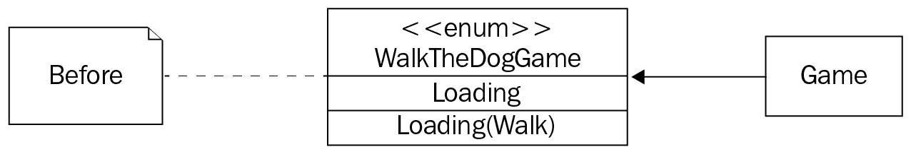

# 第八章：*第八章*：添加 UI

可能看起来我们已经为视频游戏开发了一切所需，从某种程度上说，我们确实如此，除了每次小**红帽男孩**（**RHB**）撞到岩石时需要刷新页面的那个烦恼。一个真正的游戏有“新游戏”或“最高分”的按钮，在本章中，我们将添加这个 UI。这样做可能看起来微不足道，但你可能从网络开发中熟悉的基于事件的 UI 与我们的游戏循环并不匹配。为了添加一个简单的按钮，我们需要对我们的应用程序进行重大更改，甚至需要写一点 HTML。

在本章中，你将执行以下操作：

+   设计一个新的游戏按钮

+   在游戏结束时显示按钮

+   开始新游戏

在本章结束时，你将拥有一个更完整功能的 UI 框架和使其工作的技能。

# 技术要求

你需要一些额外的资源，这次来自[`github.com/PacktPublishing/Game-Development-with-Rust-and-WebAssembly/wiki/Assets`](https://github.com/PacktPublishing/Game-Development-with-Rust-and-WebAssembly/wiki/Assets)中的`assets`下载的`ui`目录。字体是来自[`www.kenney.nl`](https://www.kenney.nl)的 Kenny Future Narrow。按钮来自[`www.gameart2d.com/`](https://www.gameart2d.com/)。两者都是 CC0 许可。和之前一样，本章的最终代码可在[`github.com/PacktPublishing/Game-Development-with-Rust-and-WebAssembly/tree/chapter_8`](https://github.com/PacktPublishing/Game-Development-with-Rust-and-WebAssembly/tree/chapter_8)的相应分支上找到。

查看以下视频，了解代码的实际应用：[`bit.ly/3DrEeNO`](https://bit.ly/3DrEeNO)

# 设计一个新的游戏按钮

当 RHB 撞到岩石上时，他会倒下，嗯，让我们说他要小睡一会儿。不幸的是，到那时，玩家必须刷新页面才能开始新游戏。在大多数游戏中，我们会看到一系列用于新游戏和最高分的按钮。目前，我们只将添加一个新游戏按钮，它会从头开始重新开始。这看起来可能是一个简单的任务，但实际上，我们还有很多事情要做。

首先，我们需要决定我们想要如何实现按钮。我们实际上有两个选择。我们可以在引擎中创建一个按钮，这将是一个渲染到画布上的精灵，就像其他所有东西一样，或者我们可以使用一个 HTML 按钮并将其定位在画布上。第一个选项看起来会正确，并且不需要任何传统的网络编程，但它也将要求我们检测鼠标点击和处理按钮点击动画。换句话说，我们可能需要实现一个按钮。这比我们想要实现来让游戏工作要多，所以我们打算使用传统的 HTML 按钮并使其*看起来*像是一个游戏元素。

因此，我们将编写一些 HTML 和 CSS，这样我们就可以让按钮看起来像是游戏引擎的一部分。然后，我们将使用 Rust 将按钮添加到屏幕上并处理点击事件。这将是难点部分。

## 准备用户界面

从概念上讲，我们的用户界面将像 FPS 中的 HUD 或按钮叠加在游戏本身前面时的工作方式。想象一下，在游戏上方有一个完全透明的玻璃板，按钮就像是一张贴在玻璃上的贴纸。这意味着，在网页的上下文中，我们需要一个与 canvas 大小和位置相同的 div。

小贴士

这不是一本关于 HTML 或 CSS 的书，所以我不会花太多时间来介绍它，除了我们一直在使用的 canvas。如果你不是网页开发的专家，不用担心——快速浏览[`learnxinyminutes.com/docs/html/`](https://learnxinyminutes.com/docs/html/)就能了解足够多的内容。我们也会在这一节中使用一点 CSS，你可以在[`learnxinyminutes.com/docs/css/`](https://learnxinyminutes.com/docs/css/)找到类似的速查表。

我们可以快速更新`index.html`以包含所需的 div，如下所示：

```rs
<body>
  <div id="ui" style="position: absolute"></div>
  <canvas id="canvas" tabindex="0" height="600" width="600">
    Your browser does not support the Canvas.
  </canvas>
  <script src="img/index.js"></script>
</body>
</html>
```

注意，`ui` div 是`position: absolute`，这样它就不会“推”下面的`canvas`元素。你可以通过将一个标准的 HTML 按钮放入`div`元素中来看如何实现，如下所示：

```rs
<div id="ui" style="position: absolute">
  <button>New Game</button>
</div>
```

这将产生一个看起来如下所示的屏幕：


图 8.1 – 新游戏按钮！

如果你完全水平缩小屏幕，它可能不会响应得很好，但游戏在那个情况下是无法工作的，所以应该没问题。现在我们有了按钮，我们需要让它看起来像是一个游戏元素，为此我们需要添加样式。请创建一个名为`styles.css`的文件在`static`目录下，并在`index.html`中添加对其的链接，如下所示：

```rs
<html>
<head>
  <meta charset="UTF-8">
    <title>My Rust + Webpack project!</title>
<link rel="stylesheet" href="styles.css" type="text/css" 
      media="screen">
</head>
```

当然，一个指向空文件的链接对我们来说并没有什么帮助。为了证明链接是有效的，请修改`index.html`文件，移除`ui` div 上的内联样式，使其看起来像`<div id="ui">`。这将导致按钮将 canvas 元素向下推，你的游戏可能会稍微偏离：


图 8.2 – 新游戏在顶部

现在，在 CSS 文件中，你将为该 div 添加一个样式。这个样式不是内联的并不是很重要，除了它能方便地检查我们的 CSS 文件是否被加载。在 CSS 文件中，插入以下内容：

```rs
#ui {
    position: absolute;
}
```

这是一个 CSS 选择器，用于任何具有`ui` ID 的元素，并将它们的定位设置为`absolute`。如果你的 CSS 文件正在加载，那么新游戏按钮应该再次位于画布的顶部。稍后，我们将在游戏代码中程序化地添加该按钮，但现在我们只想让它显示出来，看起来正确。我们希望给它一个看起来像视频游戏的字体，以及背景。让我们从字体开始。在你的资源中，你会看到一个名为`ui`的目录，其中包含一个名为`kenney_future_narrow-webfont.woff2`的文件。**WOFF**代表**Web 开放字体格式**，这是一种在所有现代浏览器中都能工作的字体格式。

注意

无论何时你不确定一个功能是否与浏览器兼容，有时即使你确定，也要检查[`caniuse.com/`](https://caniuse.com/)以进行双重确认。对于 WOFF 文件，你可以在这里看到结果：[`caniuse.com/?search=woff`](https://caniuse.com/?search=woff)。

将`kenney_future_narrow-webfont.woff2`复制到应用程序的`static`目录中，以便它被构建过程选中。然后，你需要指定 CSS 中的`@font-face`，以便元素可以在此渲染，如下所示：

```rs
@font-face {
  font-family: 'Ken Future';
  src: url('kenney_future_narrow-webfont.woff2');
}
```

我们在这里所做的就是加载一个名为`Ken Future`的简单名称的新字体，以便我们可以在其他样式中引用它，并通过指定的 URL 加载它。现在，我们可以使用这个额外的 CSS 将所有按钮更改为使用该字体：

```rs
button {
    font-family: 'Ken Future';
}
```

现在，你应该能看到按钮以更像是游戏的字体渲染，如下所示：


图 8.3 – 使用 Kenney Future 字体的新游戏

由于那个传统的网络背景，按钮仍然看起来非常像 HTML 按钮。为了使其看起来更像游戏按钮，我们将使用背景和 CSS 精灵来创建一个具有圆角和悬停颜色的漂亮按钮。

### CSS 精灵

作为游戏开发者，你已经知道什么是精灵；你没有忘记*第二章*，*绘制精灵*，对吧？在**CSS 精灵**的情况下，这个术语有点名不副实，因为它实际上并不是指精灵，而是指精灵图。

从概念上讲，CSS 精灵的工作方式与使用 canvas 渲染它们相同。你从更大的精灵中切出一块，并只渲染那一部分。我们将只使用 CSS 而不是 Rust 来完成整个操作。由于我们使用 CSS，我们可以改变鼠标悬停在按钮上和点击按钮时的背景。这将使按钮看起来正确，我们不需要编写 Rust 代码就能达到相同的效果。点击按钮是浏览器非常擅长的事情，所以我们将利用它。

我们将使用下载资源中`ui`目录下的`Button.svg`文件，因此你可以将该文件复制到游戏项目的`static`目录中。SVG 文件实际上包含了一个完整的按钮库，看起来如下所示：


图 8.4 – Button.svg 的顶部

我们希望裁剪出宽的蓝色、绿色和黄色按钮，作为按钮在不同状态下的背景。我们将首先使用 CSS 中的`background`属性将按钮的背景设置为 SVG 文件。您将按照以下方式更新样式：

```rs
button {
    font-family: 'Ken Future';
    background: -72px -60px url('Button.svg');
}
```

在`background`中的像素值`-72px`和`-60px`表示将背景向左移动`72`像素，向上移动`60`像素以与空白蓝色按钮对齐。您可以在矢量图形编辑器中获取这些值，例如`url`值指定要加载的文件。进行这些更改后，您会看到按钮的背景变成了新的背景……嗯，差不多吧。


图 8.5 – 按钮及裁剪后的背景

如您所见，背景被裁剪了，所以您只能看到一半，按钮本身仍然保留了一些默认 HTML 按钮的效果。我们可以通过添加更多的 CSS 来去除边框并将按钮大小调整为与背景匹配，如下所示：

```rs
button {
    font-family: 'Ken Future';
    background: -72px -60px url('Button.svg');
    border: none;
    width: 82px;
    height: 33px;
}
```

`width`和`height`值是从*Inkscape~中提取的，这将使按钮与源中的按钮背景大小相同。与之前使用的精灵图一样，我们需要从原始源中裁剪出一个部分，所以在这种情况下，有一个从`(72, 60)`开始的矩形，宽度和高度为`82x33`。进行这些更改后，按钮现在看起来像是一个游戏按钮而不是一个网页按钮。


图 8.6 – 新的游戏按钮

仍然还有一些问题。按钮现在在视觉上没有与用户交互，所以点击时它看起来就像一张图片。我们可以通过 CSS 伪类`#active`和`#hover`来解决这个问题。

注意

一些浏览器，特别是 Firefox，会将**新游戏**渲染在一行上而不是两行。

注意

更多关于伪类的信息，请查看 Mozilla 文档：[`developer.mozilla.org/en-US/docs/Web/CSS/Pseudo-classes`](https://developer.mozilla.org/en-US/docs/Web/CSS/Pseudo-classes)。

在每个伪类中，我们将更改背景属性以与另一个背景对齐。同样，数字是从 Inkscape 中提取的，一旦添加到其中，就会进行一些调整以确保它们对齐。首先，我们可以处理`hover`样式，即鼠标悬停在图像上时。

这会产生一个看起来像这样的悬停按钮：

```rs
button:hover {
    background: -158px -60px url('Button.svg');
}
```


图 8.7 – 悬停

然后，我们将添加`active`样式，这是鼠标点击时的样子：

```rs
button:active {
    background: -244px -60px url('Button.svg');
}
```

这会产生一个点击后的按钮，看起来像这样：


图 8.8 – 激活状态

最后的问题是，我们的按钮真的很小，对于一个游戏来说，并且位于左上角。使用传统的 CSS 方法（宽度）和高度来放大按钮是有问题的，就像我们在这里改变宽度值时看到的那样：


图 8.9 – 那不是一个按钮

改变宽度和高度将意味着改变我们从精灵图中取出的“切片”，所以我们不希望这样。我们将使用的是 CSS 的 `translate` 属性，配合 `scale` 函数，看起来是这样的：

```rs
button {
    font-family: 'Ken Future';
    background: -72px -60px url('Button.svg');
    border: none;
    width: 82px;
    height: 33px;
    transform: scale(1.8);
}
```

这给了我们一个大小合适、背景正确的按钮，但它不在正确的位置。


图 8.10 – 按钮的左侧被切掉

现在按钮变大了，看起来像是一个游戏按钮，我们只需要将其放置在正确的位置。你可以通过添加 `translate` 到 `transform` 属性来实现这一点，其中 `translate` 是 `move` 的一个花哨说法。你可以如下看到：

```rs
button {
    font-family: 'Ken Future';
    background: -72px -60px url('Button.svg');
    border: none;
    width: 82px;
    height: 33px;
    transform: scale(1.8) translate(150px, 100px);
}
```

这将使新游戏按钮大致位于屏幕中央。


图 8.11 – 新游戏按钮！

注意

在 div 中居中按钮需要比我在这本书中想要覆盖的 CSS 知识更多。由于我们正在手动定位事物，我们可以先“过得去”。如果你对 Web 开发更熟悉，请随意使其真正完美居中。如果你对使用 Flexbox 实现完美居中感兴趣，请查看这里：[`webdesign.tutsplus.com/tutorials/how-to-create-perfectly-centered-text-with-flexbox--cms-27989`](https://webdesign.tutsplus.com/tutorials/how-to-create-perfectly-centered-text-with-flexbox--cms-27989)。

新的游戏按钮现在显示出来了，但它没有任何作用，因为我们的代码没有对 `onclick` 做任何处理。它只是一个悬浮的按钮，用它的无效性来挑衅我们。请继续从 `index.html` 中移除 `button` 元素，但保留具有 `ui` ID 的 `div`。相反，我们将使用 Rust 在需要时动态添加和移除按钮，并实际处理点击事件。为此，我们需要对我们的 `browser` 和 `engine` 模块做一些扩展，让我们深入研究。

## 使用 Rust 显示按钮

我们已经编写了 HTML 代码来显示按钮，看起来相当不错，但实际上我们需要能够根据命令显示和隐藏它。这意味着我们需要与浏览器交互并使用 `browser` 模块。我们有一段时间没有这样做过了，所以让我们回顾一下如何将我们传统上会写的 JavaScript 代码转换为我们将要使用的 `web-sys` 的 Rust 代码。首先，我们需要代码来将按钮插入到 `ui` div 中。有好多方法可以做到这一点；我们将使用 `insertAdjacentHTML`，这样我们就可以直接从代码中将字符串发送到屏幕上。在 JavaScript 中，它看起来是这样的：

```rs
let ui = document.getElementById("ui");
ui.insertAdjacentHTML("afterbegin", "<button>New Game</button>");
```

注意

您可以在[`developer.mozilla.org/en-US/docs/Web/API/Element/insertAdjacentHTML`](https://developer.mozilla.org/en-US/docs/Web/API/Element/insertAdjacentHTML)找到这个函数的文档。当涉及到查找浏览器 API 时，**Mozilla 开发者网络**（**MDN**）是你的朋友。

我们在*第二章*“绘制精灵”和*第三章*“创建游戏循环”中花费了大量时间将此类代码转换为 Rust，但让我们刷新一下记忆，安抚一下那些按顺序阅读书籍的怪物。任何 JavaScript 函数或方法都可能在`web-sys`包中找到，其名称已从 PascalCase 转换为 snake_case，并且大多数函数返回`Option`。通常，你可以尝试一下，它就会工作。让我们在`browser`中创建一个新的函数，看看是否如此，如下所示：

```rs
pub fn draw_ui(html: &str) -> Result<()> {
    document()
        .and_then(|doc| {
            doc.get_element_by_id("ui")
                .ok_or_else(|| anyhow!("UI element not found"))
        })
        .and_then(|ui| {
            ui.insert_adjacent_html("afterbegin", html)
                .map_err(|err| anyhow!("Could not insert 
                    html {:#?}", err))
        })
}
```

这个`draw_ui`函数假设存在一个具有`ui` ID 的 div，就像`canvas`函数假设有一个`canvas` ID 一样。这意味着它并不**非常**通用，但我们现在不需要更复杂的解决方案。如果我们以后需要，我们会编写更多的函数。一如既往，我们不希望因为“完美”代码的想法而走得太远，因为我们还有游戏要完成。

再次强调，Rust 版本的代码要长得多，使用`and_then`和映射错误来确保我们处理错误情况，而不是像 JavaScript 那样崩溃或停止程序。这是代码在 Rust 中在美学上不那么吸引人，但在我看来更好的一个案例，因为它突出了错误的可能原因。我们马上需要的另一个函数是用来隐藏`ui`元素，它在 JavaScript 中的样子如下：

```rs
let ui = document.getElementById("ui");
let firstChild = ui.firstChild;
ui.removeChild(firstChild);
```

这个函数获取`ui` div 的第一个子元素，并使用`removeChild`方法将其移除。为了彻底，我们应该遍历所有的`ui`子元素并确保它们都被移除，但我们在这里没有这么做，因为我们已经知道只有一个。我们还移除了子元素（而不仅仅是设置它们的可见性为隐藏），这样它们就不会影响布局，并且移除了任何事件监听器。再次强调，你将需要将 JavaScript 转换为 Rust。在这种情况下，`firstChild`变为`first_child()`方法，`removeChild`变为`remove_child`，如下所示：

```rs
pub fn hide_ui() -> Result<()> {
    let ui = document().and_then(|doc| {
        doc.get_element_by_id("ui")
            .ok_or_else(|| anyhow!("UI element not found"))
    })?;
    if let Some(child) = ui.first_child() {
        ui.remove_child(&child)
            .map(|_removed_child| ())
            .map_err(|err| anyhow!("Failed to remove child 
                {:#?}", err))
    } else {
        Ok(())
    }
}
```

这个函数与 `draw_ui` 有点不同，部分原因是因为 `first_child` 缺失不是一个错误；它只是意味着你在一个空的 UI 上调用了 `hide_ui`，而我们不希望它出错。这就是为什么我们使用 `if let` 构造，并在它不存在时显式地返回 `Ok(())`。`ui` div 已经是空的，所以这没问题。此外，还有那个奇怪的调用 `map(|_removed_child| ())`，我们之所以调用它是因为 `remove_child` 返回正在被移除的 `Element`。我们在这里不关心它，所以我们再次显式地将它映射到我们的单元值。最后，当然，我们使用 `anyhow!` 处理错误。

这个函数揭示了一些重复，所以让我们在最终版本中继续重构它，如下所示：

```rs
pub fn draw_ui(html: &str) -> Result<()> {
    find_ui()?
        .insert_adjacent_html("afterbegin", html)
        .map_err(|err| anyhow!("Could not insert html 
            {:#?}", err))
}
pub fn hide_ui() -> Result<()> {
    let ui = find_ui()?;
    if let Some(child) = ui.first_child() {
        ui.remove_child(&child)
            .map(|_removed_child| ())
            .map_err(|err| anyhow!("Failed to remove child 
                {:#?}", err))
    } else {
        Ok(())
    }
}
fn find_ui() -> Result<Element> {
    document().and_then(|doc| {
        doc.get_element_by_id("ui")
            .ok_or_else(|| anyhow!("UI element not found"))
    })
}
```

在这里，我们将两个重复的 `document().and_then` 调用替换为对 `find_ui` 的调用，这是一个私有函数，它确保我们在找不到 UI 时总是得到相同的错误。这简化了一小部分代码，并使得在 `draw_ui` 中使用 `try` 操作符成为可能。`find_ui` 函数返回 `Element`，所以你需要确保导入 `web_sys::Element`。

我们已经在 `browser` 中设置了绘制按钮所需的工具。要程序化地显示我们的按钮，我们只需调用 `browser::draw_ui("<button>New Game</button>")`。这很好，但我们实际上还不能处理按钮点击事件。我们有两种选择。第一种是创建一个带有 `onclick` 处理程序的按钮，例如 `browser::draw_ui("<button onclick='myfunc'>New Game</button>")`。这将需要将我们的 Rust 包中的函数暴露给浏览器。它还需要某种类型的全局变量，该函数可以操作它。如果 `myfunc` 要操作游戏状态，那么它需要访问游戏状态。我们可以在事件队列中使用某种方法，这是一个可行的方案，但不是我们将要做的。

我们将要做的相反是，通过 `web-sys` 库在 Rust 代码中设置 `onclick` 变量，将其设置为写入通道的闭包。其他代码可以监听这个通道，看看是否发生了点击事件。这段代码将与我们在 *第三章* 中编写的代码非常相似，即 *创建游戏循环*，用于处理键盘输入。我们将在 `engine` 模块中从一个函数开始，该函数接受 `HtmlElement` 并返回 `UnboundedReceiver`，如下所示：

```rs
pub fn add_click_handler(elem: HtmlElement) -> UnboundedReceiver<()> {
    let (click_sender, click_receiver) = unbounded();
    click_receiver
}
```

不要忘记使用 `use web_sys::HtmlElement` 将 `HtmlElement` 带入作用域。这并不会做太多，而且看起来似乎与点击事件无关，而且我们也不明显地需要 `UnboundedReceiver`。当我们给按钮添加点击处理程序时，我们不想移动任何关于游戏的元素到闭包中。在这里使用通道让我们能够封装点击处理并使其与对点击事件的响应分离。让我们继续创建 `on_click` 处理程序，如下所示：

```rs
pub fn add_click_handler(elem: HtmlElement) -> 
    UnboundedReceiver<()> {
    let (mut click_sender, click_receiver) = unbounded();
    let on_click = browser::closure_wrap(Box::new(move || {
        click_sender.start_send(());
    }) as Box<dyn FnMut()>);
    click_receiver
}
```

我们所做的更改是将`click_sender`变为可变的，然后将其移动到新创建的闭包`on_click`中。你可能还记得前面章节中的`closure_wrap`，它需要接收一个堆分配的闭包，换句话说是一个`Box`，在这个例子中，它将传递一个我们未使用的`mouse`事件，这样我们就可以安全地跳过它。将类型转换为`Box<dyn FnMut()>`是必要的，以平息编译器并允许这个函数转换为`WasmClosure`。在这个内部，我们调用发送者的`start_send`函数并传递一个单位。由于我们没有使用任何其他参数，我们只需让接收者检查任何事件即可。

最后，我们需要将这个闭包分配给`elem`上的`on_click`方法，以便按钮实际上可以处理它，如下所示：

```rs
pub fn add_click_handler(elem: HtmlElement) -> UnboundedReceiver<()> {
    let (mut click_sender, click_receiver) = unbounded();
    let on_click = browser::closure_wrap(Box::new(move || {
        click_sender.start_send(());
    }) as Box<dyn FnMut()>);
    elem.set_onclick(Some(on_click.as_ref().unchecked_ref()));
    on_click.forget();
    click_receiver
}
```

我们添加了对`elem.set_onclick`的调用，这对应于 JavaScript 中的`elem.onclick =`。注意我们如何将`set_onclick`传递一个`Some`变体，因为`onclick`本身在 JavaScript 中可以是`null`或`undefined`，因此，在 Rust 中可以是`None`，它是一个`Option`类型。然后我们传递`on_click.as_ref().unchecked_ref()`，这是我们多次使用来将`Closure`转换为`web-sys`可以使用函数的模式。

最后，我们还要确保忘记`on_click`处理程序。如果没有这个处理程序，当我们实际创建这个回调时，程序将会崩溃，因为`on_click`尚未正确地传递给 JavaScript。我们这样做了几次，所以在这里我不会过多地强调这一点。现在我们已经编写了所有代码，我们需要显示一个按钮并处理对其的响应，并且我们需要将其集成到我们的游戏中。让我们弄清楚如何显示这个按钮。

# 游戏结束时显示按钮

我们可以在`Game`的`update`方法中通过检查每一帧游戏是否结束以及按钮是否存在来显示和隐藏按钮，确保我们只显示或隐藏一次，这可能会工作，但我认为你可以感觉到如果这样做，面条代码开始形成。一般来说，最好在`update`中避免过多的条件逻辑，因为它会变得混乱并允许逻辑错误。相反，我们可以将每个看起来像`if (state_is_true)`的条件检查视为系统的两种不同状态。所以，如果新游戏按钮被显示，那就是一种游戏状态，如果它没有被显示，那就是另一种游戏状态。你知道这意味着什么——是时候使用状态机了。

## 状态机回顾

在*第四章* *使用状态机管理动画*中，我们将 RHB 转换为状态机，以便在事件上轻松且更重要的是正确地更改动画。例如，当我们想让 RHB 跳跃时，我们通过类型状态方法从`Running`变为`Jumping`，只改变一次状态，只改变一次速度并播放一次声音。这段代码在此处重现以供清晰理解：

```rs
    impl RedHatBoyState<Running> {
        ...
        pub fn jump(self) -> RedHatBoyState<Jumping> {
            RedHatBoyState {
                context: self
                    .context
                    .reset_frame()
                    .set_vertical_velocity(JUMP_SPEED)
                    .play_jump_sound(),
                _state: Jumping {},
            }
        }
```

类型状态工作得很好，但如果不需要那种功能，它们也会很嘈杂。这就是为什么在同一个章节中，我们选择将我们的游戏本身建模为一个简单的`enum`，如下所示：

```rs
pub enum WalkTheDog {
    Loading,
    Loaded(Walk),
}
```

这将发生显著变化，因为我们现在有一个需要状态机的难题。当 RHB 被击倒时，游戏结束，新的游戏按钮应该出现。这是一个在状态改变时需要发生一次的副作用，这正是我们状态机的完美用例。不幸的是，将代码重构为状态机将需要相当数量的代码，因为我们的当前实现状态机的方法虽然优雅，但有点嘈杂。此外，实际上这里有两个状态机在工作，一开始并不明显。第一个是我们一开始看到的，从`Loading`到`Loaded`的状态机，你可以将其视为没有`Walk`和有`Walk`的情况。第二个是`Walk`本身的状态机，它从`Ready`移动到`Walking`再到`GameOver`。你可以这样可视化它：


图 8.12 – 嵌套状态机

如你所见，我们这里有两个状态机，一个是从`Loading`到`Loaded`，另一个代表三个游戏状态`Ready`、`Walking`和`GameOver`。还有一个未画出的第三个状态机，著名的`RedHatBoyStateMachine`，它管理着`RedHatBoy`的动画。图中的一些状态模仿了`RedHatBoyStateMachine`中的状态，其中`Idle`是`Ready`，`Walking`是`Running`，因此有将`RedHatBoyStateMachine`移动到`WalkTheDogStateMachine`的诱惑。这可能可行，但请记住，`Walk`没有“跳跃”状态，所以这样做的话，你需要开始检查布尔值，模型开始崩溃。最好接受这种相似性，因为游戏很大程度上依赖于 RHB 的行为，但将`RedHatBoyStateMachine`视为具有更细粒度的状态。真正起作用的是将`Loading`和`Loaded`转换为`Option`。具体来说，我们将我们的游戏建模如下：

```rs
struct WalkTheDogGame {
    machine: Option<WalkTheDogStateMachine>
}
```

这段代码目前还没有打算在任何地方编写；它只是在这里为了清晰起见。在这里使用`Option`有一个很大的优势，这与我们的`update`函数的工作方式有关。为了清晰起见，我将在下面重现我们游戏循环的一部分：

```rs
let mut keystate = KeyState::new();
*g.borrow_mut() = Some(browser::create_raf_closure(move |perf: f64| {
    process_input(&mut keystate, &mut keyevent_receiver);
    game_loop.accumulated_delta += (perf – 
        game_loop.last_frame) as f32;
    while game_loop.accumulated_delta > FRAME_SIZE {
        game.update(&keystate);
        game_loop.accumulated_delta -= FRAME_SIZE;
    }
```

这里关键的部分是`game.update`行，它对`game`对象执行可变借用，而不是将其移动到`update`中。这是因为一旦`game`被`FnMut`拥有，它就不能被移动出来。尝试这样做会导致以下编译器错误：

```rs
error[E0507]: cannot move out of `*game`, as `game` is a captured variable in an `FnMut` closure
```

这样的可变借用很棘手，因为它们可能会使你在调用栈中向下导航时更难导航借用检查器。在这种情况下，如果我们尝试以与`RedHatBoyStateMachine`相同的方式实现另一个状态机，这会成为一个问题。在我们的状态机实现中，每个`typestate`方法消耗机器并返回一个新的。现在，让我们想象我们正在将整个游戏建模为`enum`，如下所示：

```rs
enumWalkTheDogGame {
    Loading,
    Loaded(Walk),
    Walking(Walk),
    GameOver(Walk)
}
```

为了使`update`中的可变借用工作，我们不得不在每次状态改变时克隆整个游戏，因为`from`函数无法获取其所有权。换句话说，我们`game.update`函数中的闭包是将`game`“借出”给`update`函数。这不能反过来“给予”`from`函数——它并不拥有它！这样做需要克隆整个游戏，这可能在每一帧都发生！

将游戏建模为持有可选的`WalkTheDogStateMachine`有两个优点：

+   我们可以在`Option`上调用`take`来获取状态机的所有权。

+   类型反映了状态机在游戏加载后才可用。

    注意

    自然，有许多方式可以建模我们的游戏类型，其中一些可能比我们在这里选择的更好。然而，在你开始尝试制作这个类型的“更简单”版本之前，让我提醒你，我已经尝试了这种解决方案的几种不同变体，并最终发现使用`Option`是最直接的选择。其他几种实现要么以复杂的借用结束，要么是不必要的克隆。要小心，但也要勇敢。你可能会找到比我更好的方法！

在深入实际实现之前，这个实现相当长，我们先了解一下我们要实现的设计。



图 8.13 – 之前

这很简单，但它并没有做到我们需要的所有事情。现在，让我们重新设计状态机。


图 8.14 – 之后

是的，这需要更多的代码，甚至没有反映实现的细节，或者我们编写的`From`特质，这些特质使得在`enum`值和结构体之间转换变得容易。编写一些处理状态机模板代码的宏超出了本书的范围，但这不是一个坏主意。你可能会想知道为什么每个状态都持有自己的`Walk`实例，因为每个状态都有它，这是因为我们将在转换时改变`Walk`，而单个状态不容易访问父`WalkTheDogState`容器数据。然而，在可能的情况下，我们将将公共数据从`Walk`移动到`WalkTheDogState`。

提示

这一节有很多代码，片段通常一次只显示几行，这样就不会太多难以处理。然而，当你跟随时，你可能希望重新组织代码以便更容易找到。例如，我更喜欢在`game`模块中自上而下地工作，顶部是常量，然后是“最大的”`struct`，在这个例子中是`WalkTheDog`，然后是它所依赖的任何代码，这样调用栈就会沿着页面向下流动。这就是[`github.com/PacktPublishing/Game-Development-with-Rust-and-WebAssembly/tree/chapter_8`](https://github.com/PacktPublishing/Game-Development-with-Rust-and-WebAssembly/tree/chapter_8)是如何组织的。你也可以开始将其拆分成更多的文件。我不会这样做，以便更容易以书籍的形式解释。

## 重新设计为状态机

在真正的重构中，我们会在每次更改后确保游戏处于运行状态，但我们的更改将导致级联编译错误，这意味着我们将会有一段时间无法工作，所以这个更改并不是真正的重构，而更像是一次重新设计。当你进行这种更改时，你应该尽可能快地进入编译状态，并尽可能长时间地保持在该状态，但尽管我在写这一章时做到了这一点，我并不会让你经历所有中间步骤。我们将继续前进，就好像我们事先就知道我们的设计将会成功一样，因为我们这次就是这样做的，但不要在家里尝试。如果你是 Git 的常规用户，现在是一个创建分支的绝佳时机，以防万一。

我们将首先替换`game`模块中的这段代码：

```rs
pub enum WalkTheDog {
    Loading,
    Loaded(Walk),
}
```

我们将用以下内容替换它：

```rs
pub struct WalkTheDog {
    machine: Option<WalkTheDogStateMachine>,
}
```

这将在各个地方引发编译错误。这是我们将采取捷径的章节，在实现状态机的同时暂时让编译器出错，只是为了确保这一章不会有一千页那么长。所以，如果你长时间与出错的代码库工作感到不舒服，那很好——只需相信我非常聪明，第一次就全部搞对了。假装一下——一切都会好起来的。

由于我们具有心灵感应能力，确切地知道这种设计将会如何发展，我们可以继续前进，知道最终一切都会顺利地结合在一起，不会出现错误。这次更改正是我们之前讨论过的内容——`enum WalkTheDog`变成了一个包含其`machine`实例的结构体，该实例是一个`optional`字段。目前，`WalkTheDogStateMachine`不存在，所以我们将添加它，如下所示：

```rs
enum WalkTheDogStateMachine {
    Ready(WalkTheDogState<Ready>),
    Walking(WalkTheDogState<Walking>),
    GameOver(WalkTheDogState<GameOver>),
}
```

当我们在 Rust 中实现状态机时，我们需要`enum`作为状态的容器，这样`WalkTheDog`就不需要是一个泛型`struct`。我们已经将编译错误向下移动，因为没有`WalkTheDogState`和定义的状态。让我们接下来这样做：

```rs
struct WalkTheDogState<T> {
    _state: T,
    walk: Walk,
}
struct Ready;
struct Walking;
struct GameOver;
```

目前，各种状态 `Ready`、`Walking` 和 `GameOver` 都不存储任何数据。随着我们的进行，这会有所改变，但所有状态都有 `Walk`，这样它们就可以保存在共同的 `WalkTheDogState` 结构体中。现在我们已经创建了状态机，我们需要看看旧版本的 `WalkTheDog` 是在哪里被使用的。第一个是在 `WalkTheDog` 的小型 `impl` 块中，在旧代码中我们创建了 `enum`，如下所示：

```rs
impl WalkTheDog {
    pub fn new() -> Self {
        WalkTheDog::Loading {}
    }
}
```

这将不起作用，并且无法编译，所以让我们用空的 `WalkTheDog` 实例来替换它，如下所示：

```rs
impl WalkTheDog {
    pub fn new() -> Self {
        WalkTheDog { machine: None }
    }
}
```

这个更改用 `machine` 设置为 `None` 的旧 `enum` 替换掉了。你现在可以将 `None` 视为 `Loading` 状态，当机器存在时，你就是 `Loaded` 状态。说到加载，下一个逻辑上需要更改的地方是在 `WalkTheDog` 的 `Game` 实现中。查看我们多次遇到的 `initialize` 函数，你将在这里看到一个编译器错误：

```rs
#[async_trait(?Send)]
impl Game for WalkTheDog {
    async fn initialize(&self) -> Result<Box<dyn Game>> {
        match self {
            WalkTheDog::Loading => {
```

`match self` 这一行将不再起作用，因为 `self` 不是 `enum`。我们需要的做法是匹配 `machine`，如果它是 `None`，那么加载新的机器；如果它存在，那么就使用 `Err`，就像我们现在做的那样，因为 `initialize` 被以某种方式调用了两次。我们可以从替换 `match` 语句的两个部分开始，所以匹配应该从如下开始：

```rs
#[async_trait(?Send)]
impl Game for WalkTheDog {
    async fn initialize(&self) -> Result<Box<dyn Game>> {
        match self.machine {
            None => {
```

仔细观察，我们会发现我们现在匹配 `self.machine`，并且匹配 `None`。在我们深入 `None` 匹配分支之前，让我们快速更改 `WalkTheDog::Loaded(_)` 的匹配，如下所示：

```rs
impl Game for WalkTheDog {
    async fn initialize(&self) -> Result<Box<dyn Game>> {
        match self.machine {
            ...
            Some(_) => Err(anyhow!("Error: Game is already  
                initialized!")),
```

这只是将 `WalkTheDog::Loaded` 改为 `Some`，使用相同的错误信息。

提示

为了获得更清晰的错误信息，你可以在 `WalkTheDog` 结构体上使用 `#[derive(Debug)]`。这样做会产生级联效应，因为它所依赖的每一项也必须使用 `#[derive(Debug)]`，所以我们在这里不会这样做，但这是一个好主意，尤其是如果你在这里遇到问题时。

现在匹配语句的两个部分都正确地匹配了 `Option` 类型，我们需要修改 `initialization` 以返回正确的类型。在 `None` 分支的底部，你将想要创建一个类似于以下所示的状态机，在返回值之前：

```rs
impl Game for WalkTheDog {
    async fn initialize(&self) -> Result<Box<dyn Game>> {
        match self.machine {
            None => {
                ...
                let timeline = 
                    rightmost(&starting_obstacles);
                let machine = WalkTheDogStateMachine
                    ::Ready(WalkTheDogState {
                    _state: Ready,
                    walk: Walk {
                        boy: rhb,
                        backgrounds: [
                            Image::new(background.clone(), 
                                Point { x: 0, y: 0 }),
                            Image::new(
                                background,
                                Point {
                                    x: background_width,
                                    y: 0,
                                },
                            ),
                        ],
                        obstacles: starting_obstacles,
                        obstacle_sheet: sprite_sheet,
                        stone,
                        timeline,
                    },
                });
                ...
```

这与之前的代码非常相似；`Walk` 的构建没有改变，但它被所有状态机的噪音所掩盖。我们将 `machine` 变量绑定到 `WalkTheDogStateMachine::Ready`，使用初始化的 `WalkTheDogState` 实例，这反过来又将其内部 `_state` 值设置为 `Ready`，并且状态具有 `Walk`。这很嘈杂，在我们将这个文件重新编译后，我们将进行真正的重构，使这一行更干净一些，但现在我们先把它放在一边。

现在，我们之前让 `initialize` 返回一个新的 `Result<Box<dyn Game>>`，所以我们需要返回一个新的 `Game` 实例。所以，在添加 `machine` 之后，添加以下内容：

```rs
impl Game for WalkTheDog {
    async fn initialize(&self) -> Result<Box<dyn Game>> {
        match self.machine {
            None => {
                ...
                 Ok(Box::new(WalkTheDog {
                    machine: Some(machine),
                }))
```

注意

由于 `initialize` 接收 `self` 并实际上没有使用它，所以它在 `Game` 特质中是否应该存在是有争议的。创建一个单独的特质，例如 `Initializer`，将需要大量的修改，这是一项留给读者的练习。

这确保了 `initialize` 返回一个机器处于正确状态的游戏。我们还有两个更大的特质方法，`update` 和 `draw`，需要处理，而 `update` 填满了编译错误，所以让我们接下来处理它。

### 将更新扩展到状态机

`update` 函数充满了编译错误，是游戏行为的核心，并且还有一个额外的挑战。直观地，你可能认为你可以像这样修改函数的开始部分：

```rs
impl Game for WalkTheDog {
    ...
    fn update(&mut self, keystate: &KeyState) {
        if let Some(machine) = self.machine {
            ...
```

`if let Some(machine) = self.machine` 这行代码最终会因以下错误而无法编译：

```rs
error[E0507]: cannot move out of `self.machine.0` which is behind a mutable reference
   -->src/game.rs:676:32
    |
676 |         if let Some(machine) = self.machine {
    |                     -------    ^^^^^^^^^^^^ help: consider borrowing here: `&self.machine`
```

现在，你可能尝试，就像我一样，通过将行更改为 `if let Some(machine) = &mut self.machine` 来修复这个问题。这会一直有效，直到你尝试在 `WalkTheDogState` 上实现一个转换。因为你有一个借用的机器，当你后来在状态上匹配时，你也会有一个借用的状态，就像以下示例所示：

```rs
impl Game for WalkTheDog {
    ...
    fn update(&mut self, keystate: &KeyState)
        if let Some(machine) = &mut self.machine {
            match machine {
                WalkTheDogStateMachine::Ready(state) => {
```

在这里，`state` 值是借用的，与大多数其他情况不同，其中匹配分支会接管值，并且这不是立即显而易见的。如果我们将从 `Ready` 转换到 `Walking`，它就会变得明显。为了编写 `state._state.run_right()` 并到达 `Walking`，你的转换需要像下面这样才能编译：

```rs
impl WalkTheDogState<Ready> {
    fn start_running(&mut self) -> WalkTheDogState<Walking> {
        self.run_right();
        WalkTheDogState {
            _state: Walking,
            walk: self.walk,
        }
    }
}
```

注意，我们正在从 `&mut WalkTheDogState<Ready>>` 转换到 `WalkTheDogState<Walking>`，这是一个奇怪的转换，也是一个错误的提示。你看不见的是，这段代码无法编译。使用 `walk` 返回新的 `WalkTheDogState` 是我们不能做的操作，因为 `state` 是借用的。`start_running` 方法不拥有 `state`，因此它不能接管 `state.walk`，因此不能返回新的实例。这个问题的解决方案是在每次转换时克隆整个 `Walk`，但这样做效率低下。相反，我们可以在 `Game` 实现中一直向上接管 `machine` 的所有权，通过名为 `take` 的合适函数。我们不会在机器上使用可变借用，而是像下面这样调用 `take`：

```rs
impl Game for WalkTheDog {
    ...
    fn update(&mut self, keystate: &KeyState) {
        if let Some(machine) = self.machine.take() {
```

这段代码与之前相同，但这次我们在 `Option<WalkTheDogStateMachine>` 上调用了 `take` 方法。这会将 `self` 中的状态机替换为 `None`，并将现有的 `machine` 绑定到 `if let Some(machine)` 中的变量。现在，在这个作用域内，我们对 `machine` 拥有完全的控制权，可以在最终调用 `self` 中状态机的 `replace` 方法将其移回函数末尾之前做任何我们想做的事情。这有点尴尬，但它可以绕过可变借用的问题。它还引入了一个潜在的错误，即当控制退出 `update` 函数时，`machine` 可能仍然被设置为 `None`，这可能会意外地停止游戏。为了防止这种情况发生，在我们继续更新这个函数之前，我们将在 `if let` 语句之外添加 `assert`，如下所示：

```rs
impl Game for WalkTheDog {
    ...
    fn update(&mut self, keystate: &KeyState) {
        if let Some(machine) = self.machine.take() {
            ...
        }
        assert!(self.machine.is_some());
```

不幸的是，这是一个运行时错误，而不是编译时错误，但它会立即让我们知道我们是否在下一部分中出错。这个 `assert` 可能有点过度，因为我们将在 `if let` 块内部显著减少代码量；事实上，它将只有一行。首先，我们将向我们的状态机添加一个对不存在函数 `update` 的调用，如下所示：

```rs
impl Game for WalkTheDog {
    ...
    fn update(&mut self, keystate: &KeyState) {
        if let Some(machine) = self.machine.take() {
            self.machine.replace(machine.update(keystate));
            if keystate.is_pressed("ArrowRight") {
```

在 `if let Some(machine)` 之后立即添加 `self.machine.replace(machine.update(keystate))` 这一行。`if let` 块中 `replace` 以下的全部代码将变成实现状态中的各种 `update` 函数的一部分，所以你想要做的是要么将这段代码复制粘贴到你可以获取它的某个地方，要么简单地注释掉它。接下来，我们将在 `WalkTheDogStateMachine` 上创建一个 `impl`，使用这个新的 `update` 方法，它将返回新的状态。这个空的版本看起来像这样：

```rs
impl WalkTheDogStateMachine {
    fn update(self, keystate: &KeyState) -> Self {
    }
}
```

现在，你可以从 `Game` 中的 `update` 方法调用它，它看起来像这样：

```rs
impl Game for WalkTheDog {
    ...
    fn update(&mut self, keystate: &KeyState) {
        if let Some(machine) = self.machine.take() {
            self.machine.replace(machine.update(keystate));
        }
        assert!(self.machine.is_some());
    }
```

`WalkTheDogStateMachine` 中的 `update` 方法有点空，我们可能需要在里面放一些代码。我们可以在更新中调用 `match self`，然后在这个 `update` 函数中为每个状态编写行为，例如调用 `state._state.walk.boy.run_right()`，这会起作用，但看起来很糟糕。相反，我们将匹配 `self` 并将任务委托给单个 `state` 类型。这将导致一个相当冗余的 `match` 语句，如下所示：

```rs
impl WalkTheDogStateMachine {
    fn update(self, keystate: &KeyState) -> Self {
        match self {
            WalkTheDogStateMachine::Ready(state) 
                =>state.update(keystate).into(),
            WalkTheDogStateMachine::Walking(state) 
                =>state.update(keystate).into(),
            WalkTheDogStateMachine::GameOver(state) 
               =>state.update().into(),
        }
    }
}
```

我们之前在 `RedHatBoyStateMachine` 中看到了这个模式的变体，在那里我们必须匹配 `enum` 的每个变体才能将任务委托给状态，而且不幸的是，没有很好的解决办法。幸运的是，它很小。这个 `match` 语句将无法编译，因为没有任何 `typestates` 类型有 `update` 方法。事实上，对于 `typestates` 没有任何实现。让我们通过为所有三个创建占位符实现来继续我们的委托，如下所示：

```rs
impl WalkTheDogState<Ready> {
    fn update(self, keystate: &KeyState) -> 
        WalkTheDogState<Ready> {
        self
    }
}
impl WalkTheDogState<Walking> {
    fn update(self, keystate: &KeyState) -> 
        WalkTheDogState<Walking> {
        self
    }
}
impl WalkTheDogState<GameOver> {
    fn update(self) -> WalkTheDogState<GameOver> {
        self
    }
}
```

值得我们回顾一下类型状态的工作方式。类型状态是一种泛型状态的结构。所以`WalkTheDogState<T>`是结构，我们通过向`WalkTheDogState<T>`的实现中添加方法来实现状态之间的转换，其中`T`是具体状态之一。所有这些占位符都只是返回`self`，所以`update`目前还没有做任何事情。仔细观察你会发现，`GameOver`不需要`KeyState`，因为它不需要它。

`WalkTheDogStateMachine`上的`update`方法试图使用`into`将每个类型状态转换回`enum`，但我们还没有编写这些。回忆一下*第四章*，*使用状态机管理动画*，再次，我们需要实现`From`以将各种状态转换回`enum`类型。这些在这里实现：

```rs
impl From<WalkTheDogState<Ready>> for WalkTheDogStateMachine {
    fn from(state: WalkTheDogState<Ready>) -> Self {
        WalkTheDogStateMachine::Ready(state)
    }
}
impl From<WalkTheDogState<Walking>> for WalkTheDogStateMachine {
    fn from(state: WalkTheDogState<Walking>) -> Self {
        WalkTheDogStateMachine::Walking(state)
    }
}
impl From<WalkTheDogState<GameOver>> for WalkTheDogStateMachine {
    fn from(state: WalkTheDogState<GameOver>) -> Self {
        WalkTheDogStateMachine::GameOver(state)
    }
}
```

这只是为了开始而做的样板代码，但它展示了这些是如何工作的。`WalkTheDogStateMachine`上的`update`方法使用`match`获取每个变体的`state`值。然后，在各个类型状态上调用`update`方法。每个`update`方法都返回它转换到的状态，尽管现在它们都返回`self`。最后，回到`WalkTheDogStateMachine`的`update`方法中，我们调用`into`将类型状态转换回`enum`变体。

注意

你可能还记得，对于`RedHatBoyStateMachine`，我们使用了转换函数和`Event` `enum`来推进状态机。新的`WalkTheDogStateMachine`枚举有更少的事件，因此不需要额外的复杂性。

是时候考虑每个状态实际上应该做什么了。以前，这些状态中的每一个都被推到了`Game` `update`方法中——例如，以下旧代码：

```rs
impl Game for WalkTheDog {
    ...
    fn update(&mut self, keystate: &KeyState) {
        if let WalkTheDog::Loaded(walk) = self {
            if keystate.is_pressed("ArrowRight") {
                walk.boy.run_right();
            }
            if keystate.is_pressed("Space") {
                walk.boy.jump();
            }
            if keystate.is_pressed("ArrowDown") {
                walk.boy.slide();
            }
```

在旧系统中，如果游戏是`Loaded`状态，那么按下`ArrowRight`键时，男孩可以`run_right`，按下`Space`键时可以跳跃。这工作得很好，但值得注意的是以下内容：

+   如果 RHB 已经在跑步，`run_right`函数将不起作用。

+   如果 RHB 没有在跑步，`jump`和`slide`函数将不起作用。

我们在`RedHatBoyStateMachine`中处理得相当好，并将继续这样做，但这也揭示了，一旦 RHB 开始向右移动，我们并不真的关心玩家是否推动了`WalkTheDogStateMachine`。当游戏处于`Ready`状态时，我们会检查用户是否按下了`ArrowRight`键并转换状态。否则，我们就会保持在同一状态。

我们可以修改`WalkTheDogState<Ready>`以反映这一新现实。函数的第一个更改将是进行此检查，如下所示：

```rs
impl WalkTheDogState<Ready> {
    fn update(self, keystate: &KeyState) -> ReadyEndState {
        if keystate.is_pressed("ArrowRight") {
            ReadyEndState::Complete(self.start_running())
        } else {
            ReadyEndState::Continue(self)
        }
    }
}
```

有一种类型和一种方法不存在，因此这段代码目前无法编译。`start_running`的转换还不存在，尽管我们讨论了编写类似的内容。我们也没有`ReadyEndState`类型。让我们首先解决第二个问题。

我们之前已经使用过这种模式来处理任何可以返回多个状态的`typestate`方法，例如`Jumping`或`Sliding`上的`update`方法。我们创建了一个新的`enum`，它可以表示任一返回状态。在`WalkTheDogState<Ready>`的`update`方法的情况下，游戏在更新结束时可以是`Ready`（`ReadyEndState::Continue`）或者完成并转换到`Walking`（`ReadyEndState::Complete`）。

让我们先实现`From`特质，将`ReadyEndState`转换为`WalkTheDogStateMachine`：

```rs
enum ReadyEndState {
    Complete(WalkTheDogState<Walking>),
    Continue(WalkTheDogState<Ready>),
}
impl From<ReadyEndState> for WalkTheDogStateMachine {
    fn from(state: ReadyEndState) -> Self {
        match state {
            ReadyEndState::Complete(walking) => 
                walking.into(),
            ReadyEndState::Continue(ready) => ready.into(),
        }
    }
}
```

这是一些你之前已经见过的通用模板。对于`ReadyEndState`，我们有两种状态，因为`WalkTheDogState<Ready>`的`update`方法可以结束在两种状态中。为了从`ReadyEndState`转换到`WalkTheDogStateMachine`，我们创建了一个`From`特质，并在`ReadyEndState`的两个变体上匹配，并从中提取它们的字段。这两个都是类型状态，分别是`WalkTheDogState<Ready>`和`WalkTheDogState<Walking>`，因此我们使用它们的`into`方法将它们转换为`WalkTheDogStateMachine`类型。这些特质之前已经编写好了。

对`self.start_running`的调用仍然不会工作，因为我们还没有编写它！当玩家调用一个以转换命名的`typestate`方法时会发生什么，看起来像这样：

```rs
impl WalkTheDogState<Ready> {
    ...
    fn start_running(mut self) -> WalkTheDogState<Walking> {
        self.run_right();
        WalkTheDogState {
            _state: Walking,
            walk: self.walk,
        }
    }
```

让我们回顾一下这些内容。每个`状态`转换都作为各种类型状态上的一个方法来编写——在这个例子中，是`WalkTheDogState<Ready>`，其中源状态是`self`，返回值是目标状态。在这里，我们通过编写一个名为`start_running`的方法从`Ready`转换到`Walking`。

实际实现并没有做太多。我们首先调用`self.run_right`，这个方法还不存在，所以我们必须编写它。在发送 RHB 开始跑之后，我们通过返回一个带有`_state`为`Walking`的新`WalkTheDogState`实例来进入`Walking`状态。仔细看看`start_running`函数的签名，你会发现它接受`mut state`。这意味着获取对`self`的独占所有权，我们可以这样做，因为我们拥有状态中的一切。这也是我们最初创建`Option<WalkTheDogStateMachine>`的原因之一！然而，为什么在这里我们取`mut state`而不是`state`并不明显，部分原因是因为`run_right`方法还不存在。当我们添加我们的新委托方法时，这应该会变得清晰，所以让我们立即用以下代码来做这件事：

```rs
impl WalkTheDogState<Ready> {
    ...
    fn run_right(&mut self) {
        self.walk.boy.run_right();
    }
}
```

在`WalkTheDogState<Ready>`上的这个函数通过其`walk`字段调用`boy`的`run_right`方法。`boy`上的`run_right`方法需要一个可变借用，这就是为什么我们在之前的委托上要求一个可变借用。这也是为什么我们之前在`start_running()`方法中需要`mut state`的原因。你不能从最初不可变的事物上获取可变借用。

为了保持代码整洁，我们现在比之前做了更多的委托。这使得我们的方法更小，更容易理解，但代价是行为将分散在多个地方。我认为最终，这将使我们的代码更容易思考，因为我们不必在任何时候考虑太多代码，所以这种权衡是值得的。我们必须小心，不要在我们将代码拆分成块并分散到各个地方时丢失任何原始代码。

### 重新实现 draw

现在，我们已经从原始的`update`方法中移除了所有编译错误，部分是通过移除其功能的一个大块，我们可以继续更新`Walking`状态以确保它正常工作，但我相信这已经有一段时间没有从游戏中得到任何有意义的反馈了。毕竟，在这个时候，游戏无法编译也无法绘制。我们如何知道任何东西在正常工作？让我们花点时间更新`Game`的`draw`方法，这样我们就可以真正编译代码并查看它的工作情况。

`draw`方法将首先借鉴`update`方法，并用对`WalkTheDogStateMachine`的委托来替换其当前实现，如下所示：

```rs
impl Game for WalkTheDog {
    ...
    fn draw(&self, renderer: &Renderer) {
        renderer.clear(&Rect::new(Point { x: 0, y: 0 }, 
            600, 600));
        if let Some(machine) = &self.machine {
            machine.draw(renderer);
        }
    }
}
```

与我们对`update`所做的更改相比，有两点略有不同。第一点是，我们只借用`self.machine`，因为我们不需要可变访问。我们还在`draw`的顶部清除了屏幕。这发生在每个状态变化时，所以没有理由不这么做。此外，如果我们犯了任何错误，这将帮助我们调试，因为屏幕会变白。

让我们通过向`WalkTheDogStateMachine`添加一个`draw`方法来继续委托，该方法可以从每个案例中提取状态以进行绘制，如下所示：

```rs
impl WalkTheDogStateMachine {
    ...
    fn draw(&self, renderer: &Renderer) {
        match self {
            WalkTheDogStateMachine::Ready(state) => 
                state.draw(renderer),
            WalkTheDogStateMachine::Walking(state) => 
                state.draw(renderer),
            WalkTheDogStateMachine::GameOver(state) => 
                state.draw(renderer),
        }
    }
}
```

这几乎与我们在之前写的`update`方法完全相同，只是使用了借用的`self`而不是消耗`self`。其余的都是对各种状态的委托。与`update`不同，每个状态都以完全相同的方式进行绘制，因此我们可以用一个方法来填充这些，如下所示：

```rs
impl<T> WalkTheDogState<T> {
    fn draw(&self, renderer: &Renderer) {
        self.walk.draw(renderer);
    }
}
```

任何状态都会将`draw`委托给`Walk`，因为绘制实际上并不基于状态而改变。我们终于可以继续并重新实现`draw`方法，这次是在`Walk`上，如下所示：

```rs
impl Walk {
    fn draw(&self, renderer: &Renderer) {
        self.backgrounds.iter().for_each(|background| {
            background.draw(renderer);
        });
        self.boy.draw(renderer);
        self.obstacles.iter().for_each(|obstacle| {
            obstacle.draw(renderer);
        });
    }
    ...
}
```

这段代码并不新鲜，但如果你忘记了它，我也不怪你。这是我们旧的`draw`代码，来自*第六章*，*创建无限跑酷游戏*，只是将`walk`变量替换为`self`。其余的都是相同的。

在这一点上，你会注意到一些令人兴奋的事情——代码再次编译成功！但如果你仔细观察游戏，你会看到它有点静态。


图 8.15 – 站得非常稳……

红帽男孩已经停止了动画！他不会做他那个小小的空闲动画，因为我们不再像以前那样调用`update`；快到回去修复`update`方法的时候了。

### 重构初始化

在我们继续恢复功能之前，你可能记得我说过`WalkTheDogStateMachine`的创建是“被所有状态机噪音所掩盖”。具体来说，它看起来像这样：

```rs
                let machine = WalkTheDogStateMachine
                    ::Ready(WalkTheDogState {
                    _state: Ready,
                    walk: Walk {
```

创建`WalkTheDogStateMachine`需要创建它的`Ready`变体，并传递一个`WalkTheDog`状态，其`_state`变量设置为`Ready`。除了嘈杂之外，它还要求你记住状态机的正确初始状态。这正是构造函数的作用！

让我们为`WalkTheDogState<Ready>`创建一个构造函数，如下所示：

```rs
impl WalkTheDogState<Ready> {
    fn new(walk: Walk) -> WalkTheDogState<Ready> {
        WalkTheDogState {
            _state: Ready,
            walk,
        }
    }
    ...
```

这使得创建一个新的`WalkTheDogState<Ready>`类型状态变得更容易；接受`Walk`，它需要是有效的。让我们也使创建整个机器更容易，使用更小的构造函数：

```rs
impl WalkTheDogStateMachine {
    fn new(walk: Walk) -> Self {
        WalkTheDogStateMachine
            ::Ready(WalkTheDogState::new(walk))
    }
    ...
```

这个构造函数使用正确的状态创建整个机器，并将`Walk`传递给它。现在我们已经创建了这些辅助方法，我们可以对原始的初始化方法进行更改，通过使用`WalkTheDogStateMachine`构造函数使其更容易阅读：

```rs
impl Game for WalkTheDog {
    async fn initialize(&self) -> Result<Box<dyn Game>> {
        match self.machine {
            None => {
                ...
                let machine = WalkTheDogStateMachine
                    ::new(Walk {
                    boy: rhb,
                    ...
```

这是一个小小的改动，但它既使阅读变得更轻松，也使操作更安全。在`Ready`状态下创建`WalkTheDogStateMachine`是容易做到的，而在错误的状态下创建它则不是。

现在我们已经完成了这个小插曲，我们可以回到按计划完成更新方法。

### 完成更新

这段在`Game`中的*原始* `update`函数揭示了我们的当前代码中缺少的内容：

```rs
impl Game for WalkTheDog {
    ...
    fn update(&mut self, keystate: &KeyState) {
        if let WalkTheDog::Loaded(walk) = self {
            ...
            if keystate.is_pressed("ArrowDown") {
                walk.boy.slide();
            }
            walk.boy.update();
            ...
```

在所有按钮按下检查之后，我们正在更新`boy`。让我们继续在我们的`WalkTheDogState<Ready>`实现中的新版本的`update`函数中添加这个操作，如下所示：

```rs
impl WalkTheDogState<Ready> {
    fn update(mut self, keystate: &KeyState) -> 
        ReadyEndState {
        self.walk.boy.update();
        if keystate.is_pressed("ArrowRight") {
            ReadyEndState::Complete(self.start_running())
        } else {
            ReadyEndState::Continue(self)
        }
}
...
```

这里有两个改动，所以别忘了现在将`update`改为接受`mut self`而不是`self`。它在函数签名中隐藏着。此外，我们还添加了对`self.walk.boy.update()`的调用，以再次开始更新男孩。

做完这件事，你会看到 RHB 再次空闲，准备开始追逐他的隐形狗。但如果你按下了右箭头，RHB 会冻结，在他的跑步动画的第一帧。这不是我们想要的，而且有趣的是，控制台日志中没有错误，因为没有抛出异常。只是`Walking`状态在其`update`函数中没有做任何事情。我们可以通过将之前注释/复制/删除的一些代码放回游戏的`Walking`状态中，来恢复这段代码，如下所示：

```rs
impl WalkTheDogState<Walking> {
    ...
    fn update(mut self, keystate: &KeyState) -> 
        WalkTheDogState<Walking> {
        if keystate.is_pressed("Space") {
            self.walk.boy.jump();
        }
        ...
        if self.walk.timeline < TIMELINE_MINIMUM {
            self.walk.generate_next_segment();
        } else {
            self.walk.timeline += walking_speed;
        }
        self
    }
}
```

在`WalkTheDogState<Walking>`中，我们已经修改了`update`方法，使其接受一个`mut self`，然后恢复了大部分旧的`Game` `update`代码。由于篇幅原因，我没有展示整个方法，只是复制了代码片段的开始和结束部分，中间部分省略了；你可以安全地复制粘贴所有原始代码。我们做了一些修改，以使代码适应新的位置。原始代码中读取`walk.boy`的地方现在读取`self.walk.boy`。我还趁机将`velocity`重命名为`walking_speed`，以明确它指的是 RHB 行走速度。我们做的最后一个更改是移除了`if keystate.is_pressed("ArrowRight")`代码，因为现在没有必要检查这个按键了。最后，我们返回`self`，因为目前还没有从`WalkTheDogState<Walking>`中过渡出去的方法。如果你全部正确地完成这些，你会发现你的代码可以编译并运行！实际上，截至此刻，所有行为都已恢复，包括我们必须刷新才能开始新游戏的问题。那么，我们现在就添加一个新的游戏按钮，怎么样？

# 开始新游戏

如果你记得我们最初计划的行为，如果你不记得，我也不怪你，我们想在 RHB 崩溃并倒下时在屏幕上绘制一个新的游戏按钮。然后，当它被点击时，我们希望开始一个新的游戏。为了实现这一点，我们需要做以下几步：

1.  检查`RedHatBoyStateMachine`是否处于`KnockedOut`状态，如果是，则从`Walking`状态过渡到`GameOver`状态。

1.  在这个过渡过程中，绘制新的游戏按钮。

1.  添加一个`onclick`处理程序，以便当按钮被点击时，我们使用一个新的`Walk`实例过渡回`Ready`状态。

1.  在过渡到`Ready`状态时，隐藏按钮并重新开始游戏。

我们之前编写的所有代码都是为了使这个更改更容易。让我们看看我们是否正确地做到了这一点：

1.  从`Walking`状态过渡到`GameOver`状态。

要从`Walking`状态过渡到`GameOver`状态，我们需要在`WalkTheDogState<Walking>`的`update`方法中返回`GameOver`状态，但我们应该在什么时候做这件事呢？我们需要查看男孩是否被击倒，然后进行相应的更改。我们目前还没有这个功能，所以我们需要创建它，并且让我们像本章一直做的那样自顶向下工作。首先，我们将修改`WalkTheDogState<Walking>`的`update`方法，以检查一个不存在的函数：

```rs
impl WalkTheDogState<Walking> {
    ...
    fn update(mut self, keystate: &KeyState) -> 
        WalkingEndState {
        ...
        if self.walk.timeline < TIMELINE_MINIMUM {
            self.walk.generate_next_segment()
        } else {
            self.walk.timeline += walking_speed;
        }
        if self.walk.knocked_out() {
            WalkingEndState::Complete(self.end_game())
        } else {
            WalkingEndState::Continue(self)
        }
    }
}
```

现在，我们不再总是返回`Walking`状态，而是返回`WalkingEndState`，这个状态目前还不存在，但将模仿我们在`WalkTheDogState<Ready>`上的`update`方法中使用的模式。当当前状态是`knocked_out`时，我们将返回包含`WalkTheDogState<GameOver>`类型实例的`Complete`变体。这将是从`end_game`转换返回的状态，这个转换也还没有写。否则，我们将返回`Continue`，其字段为当前的`WalkTheDogState<Walking>`状态。这是两个还不存在的函数，`knocked_out`和`end_game`，以及一个全新的类型。你可以通过遵循与`ReadyEndState`相同的模式来创建`WalkingEndState`类型及其相应的`From`特质，将其转换为`WalkTheDogStateMachine`。我不会在这里重现那段代码。我们将从那里开始，通过使`knocked_out`工作来继续前进，这将从`Walk`委托给`RedHatBoyStateMachine`，中间有一些委托：

```rs
impl Walk {
    fn knocked_out(&self) -> bool {
        self.boy.knocked_out()
    }
    ...
}
impl RedHatBoy {
    ...
    fn knocked_out(&self) -> bool {
        self.state_machine.knocked_out()
    }
    ...
}
impl RedHatBoyStateMachine {
    ...
    fn knocked_out(&self) -> bool {
        matches!(self, RedHatBoyStateMachine
            ::KnockedOut(_))
    }
}
```

我们可以将`WalkTheDogState`传递给`RedHatBoyStateMachine`以获取新状态，并遵循面向对象指导原则“告诉，不要询问”，但有时你只想检查一个布尔值。在这里，我们询问`Walking`状态，它询问`RedHatBoy`，最终询问`RedHatBoyStateMachine`是否被击倒。`RedHatBoyStateMachine`使用方便的`matches!`宏来检查`self`是否与`enum`变体匹配，并返回它们是否匹配。现在我们可以检查红帽男孩是否被击倒，我们只有一个编译错误——“在`WalkTheDogState`结构中找不到名为`end_game`的方法”。

是时候实现`end_game`转换方法了，它将代表我们的转换。我们可以从实现一个什么也不做，只是将`walk`从`Walking`转换为`GameOver`的转换开始，如下所示：

```rs
impl WalkTheDogState<Walking> {
    fn end_game(self) -> WalkTheDogState<GameOver> {
        WalkTheDogState {
            _state: GameOver,
            walk: self.walk,
        }
    }
    ...
```

这使我们回到了编译状态，意味着当 RHB 崩溃并被击倒时，游戏处于`GameOver`状态。然而，它什么也不做，所以现在是*第二步*——绘制新的游戏按钮。

1.  绘制新的游戏按钮。

在很多页之前，我说：“为了以编程方式显示我们的按钮，我们只需调用`browser::draw_ui("<button>New Game</button>")`。”但我们在什么时候调用它？嗯，我们现在调用它，就在创建新状态之前：

```rs
impl WalkTheDogState<Walking> {
    fn end_game(self) -> WalkTheDogState<GameOver> {
        browser::draw_ui("<button>New Game</button>");        
        WalkTheDogState {
            _state: GameOver,
            walk: self.walk,
        }
    }
    ...
```

如果你在这条代码行中添加这一行，你将看到我们很久以前在 RHB 撞到岩石时编写的新的游戏按钮。这一行有一个警告，因为我们没有处理`draw_ui`的结果，我们暂时忽略它。

1.  为按钮添加`onclick`处理程序。

为了将点击处理程序添加到按钮，我们需要获取我们刚刚绘制的元素的引用。我们没有这个引用，因为`insert_adjacent_html`函数不提供它，所以我们需要找到我们刚刚添加到屏幕上的按钮，以便我们可以将其事件处理程序附加到它上。我们之前在`document`上使用了`get_element_by_id`两次，所以可能是时候在`browser`模块中编写一个包装函数，如下所示：

```rs
pub fn find_html_element_by_id(id: &str) -> Result<HtmlElement> {
    document()
        .and_then(|doc| {
            doc.get_element_by_id(id)
                .ok_or_else(|| anyhow!("Element with 
                    id {} not found", id))
        })
        .and_then(|element| {
            element
                .dyn_into::<HtmlElement>()
                .map_err(|err| anyhow!("Could not cast 
                    into HtmlElement {:#?}", err))
        })
}
```

我们对这个函数中查找元素的方式做了一些轻微的调整。通常，我们想要`HtmlElement`而不是通用的`Element`类型，所以在这个函数中，我们提前添加了一个调用`dyn_into`来执行转换。因此，这个函数首先获取文档，然后获取元素，最后将其转换为`HtmlElement`类型，同时使用`anyhow!`来规范化错误。

现在我们有了查找元素的方法，我们可以回到`game`中的转换，找到新添加的新游戏按钮，然后向它添加一个点击处理程序，如下面的代码所示：

```rs
impl WalkTheDogState<Walking> {
    fn end_game(self) -> WalkTheDogState<GameOver> {
        let receiver = browser::draw_ui("<button id='new_game'>New Game</button>")
            .and_then(|_unit| browser::
                find_html_element_by_id("new_game"))
            .map(|element| engine::
                add_click_handler(element))
            .unwrap();
        WalkTheDogState {
            _state: GameOver,
            walk: self.walk,
        }
    }
```

我们在这里重现了整个转换特性，但有三个变化。第一个变化是我们向新游戏按钮添加了`id`；自然地，它是`new_game`。然后，我们在`and_then`块中找到文档中的元素，并使用`map`函数将这个元素传递给最近创建的`add_click_handler`函数。现在，我们遇到了一个小问题。我们需要`receiver`在点击事件发生时获取点击消息，但`add_click_handler`函数返回带有`UnboundedReceiver`的`Result`。挑战在于`end_game`函数不返回`Result`。在*第九章*，*测试、调试和性能*中，我们将探讨如何调试这类条件，但现在，我们只能咬紧牙关并添加`unwrap`。

现在我们有了`receiver`，它会在玩家点击`GameOver`状态的`update`函数以及我们接收到事件转换到`Ready`状态时接收消息。这意味着我们需要将`receiver`添加到`GameOver`结构体中，如下所示：

```rs
struct GameOver {
    new_game_event: UnboundedReceiver<()>,
}
```

这将提示你添加`futures::channel::mpsc::UnboundedReceiver`的`use`声明。现在`GameOver`结构体有了这个字段，我们需要在转换中传递它，如下所示：

```rs
impl WalkTheDogState<Walking> {
    fn end_game(self) -> WalkTheDogState<GameOver> {
        let receiver = browser::draw_ui("<button 
id='new_game'>New Game</button>")
            .and_then(|_unit| browser::
                find_html_element_by_id("new_game"))
            .map(|element| engine::
                add_click_handler(element))
            .unwrap();
        WalkTheDogState {
            _state: GameOver {
                new_game_event: receiver,
            },
            walk: self.walk,
        }
    }
```

这是此方法的最终更改，只是将字段添加到`GameOver`中。有趣的是，这是我们第一次向任何状态结构体添加字段，但随着你扩展这个游戏，你很可能会做更多类似的事情。各种状态都有它们独有的数据，它们属于`state`结构体。

是时候回到`WalkTheDogState<GameOver>`的实现及其`update`方法了，它目前只是返回`GameOver`状态，使游戏永远处于该状态。相反，我们希望检查新游戏事件是否发生（因为按钮被点击），然后返回`Ready`状态以重新开始。这里复制的这段小代码如下：

```rs
impl WalkTheDogState<GameOver> {
    fn update(mut self) -> GameOverEndState {
        if self._state.new_game_pressed() {
            GameOverEndState::Complete(self.new_game())
        } else {
            GameOverEndState::Continue(self)
        }
    }
}
impl GameOver {
    fn new_game_pressed(&mut self) -> bool {
        matches!(self.new_game_event.try_next(), 
            Ok(Some(())))       
    }
}
```

在`WalkTheDogState<GameOver>`的实现中，我们检查状态以查看是否按下了新游戏按钮，如果是，则返回`GameOverEndState::Complete`变体；否则，返回`GameOverEndState::Continue`变体。这是我们已经在每个其他更新方法中使用的相同模式，你可以继续复制`GameOverEndState`枚举及其相应的`From`特质，以将类型转换为`WalkTheDogStateMachine`枚举。这段代码在此处未复制，但请记住，如果你遇到困难，可以在[`github.com/PacktPublishing/Game-Development-with-Rust-and-WebAssembly/tree/chapter_8`](https://github.com/PacktPublishing/Game-Development-with-Rust-and-WebAssembly/tree/chapter_8)找到示例代码。

在`GameOver`的实现中，我们有检查`new_game_event`（对应玩家的点击）是否发生的详细信息。调用`try_next`将立即返回`Result`，不阻塞，或者如果通道仍然打开，则返回`Ok`，无论其中是否有内容。请记住，我们以每秒 60 帧的速度运行，不能使用阻塞调用。最后，我们使用方便的 matches!宏来检查是否成功向通道发送了`unit`的消息或`Ok(Some(()))`。如果事件存在，则返回`true`。

这段代码无法编译，因为我们没有从`GameOver`到`Ready`的转换代码，这是我们将在下一步中编写的。

1.  在**新游戏**上重新开始游戏。

重新开始游戏意味着在`new_game`转换上执行两件事。第一是隐藏按钮或“UI”，第二是从头开始重新创建`Walk`。第一件事实际上更容易，所以我们将从这里开始：

```rs
impl WalkTheDogState<GameOver> {
    ...
    fn new_game(self) -> WalkTheDogState<Ready> {
        browser::hide_ui();
        WalkTheDogState {
            _state: Ready,
            walk: self.walk,
        }
    }
}
```

这是另一个转换，这次是从`GameOver`到`Ready`，副作用是隐藏 UI。然后它移动到一个新的状态，具有我们结束时的相同行走，这并不是我们想要的。


图 8.16 – 我点击了新游戏 – 小伙子，快跑！

按钮被隐藏了，但 RHB 仍然被打败了。从`GameOver`到`Ready`的转换意味着从旧的一个创建一个新的`Walk`实例，因此游戏重新开始。这有点挑战性，因为我们不再能够访问我们最初创建`Walk`和`RedHatBoy`时使用的各种图像和精灵表。我们将通过`Walk`实现的构造函数从现有的一个克隆它们。我们不会调用这个`clone`，因为这个词意味着一个完全相同的副本，而实际上这是一个重置。你可以在下面看到实现：

```rs
impl Walk {
    fn reset(walk: Self) -> Self {
        let starting_obstacles =
            stone_and_platform(walk.stone.clone(), 
                walk.obstacle_sheet.clone(), 0);
        let timeline = rightmost(&starting_obstacles);
        Walk {
            boy: walk.boy,
            backgrounds: walk.backgrounds,
            obstacles: starting_obstacles,
            obstacle_sheet: walk.obstacle_sheet,
            stone: walk.stone,
            timeline,
        }
    }
    ...
}
```

`reset`函数消耗`Walk`并返回一个新的实例。它以与`initialize`中创建相同的方式重新创建`starting_obstacles`，然后重新计算`timeline`。然后，它构建一个新的`Walk`，将`Walk`中的所有值（除了`starting_obstacles`和`timeline`）移动到新实例中。不过，这个函数还不够正确，因为它会重置`Walk`，但会留下`boy`处于其`KnockedOut`状态。我们需要为`boy`提供一个类似的`reset`函数，如下所示：

```rs
impl RedHatBoy {
    ...
    fn reset(boy: Self) -> Self {
        RedHatBoy::new(
            boy.sprite_sheet,
            boy.image,
            boy.state_machine.context().audio.clone(),
            boy.state_machine.context().jump_sound.clone(),
        )
    }
```

在`RedHatBoy`上写`reset`要比在`Walk`上容易得多，因为我们很久以前就为`RedHatBoy`创建了一个构造函数，`new`。我们也应该为`Walk`做同样的事情，但这个重构取决于你。记住，为了编译通过，`RedHatBoyContext`上的`audio`和`jump_sound`字段需要是公开的。

现在我们有了`RedHatBoy`的`reset`函数，我们可以在`Walk`的`reset`函数中使用它，如下所示：

```rs
impl Walk {
    ...
    fn reset(walk: Self) -> Self {
        ...
        Walk {
            boy: RedHatBoy::reset(walk.boy),
            ...
        }
    }
}
```

我们还需要在从`GameOver`到`Ready`的原生转换中调用这个函数，如下所示：

```rs
impl WalkTheDogState<GameOver> {
    ...
    fn new_game(self) -> WalkTheDogState<Ready> {
        browser::hide_ui();
        WalkTheDogState {
            _state: Ready,
            walk: Walk::reset(self.walk),
        }
    }
}
```

如果你做了所有这些，你会发现当你点击新游戏按钮时，游戏会重置，玩家会回到起点。你应该能够按下右箭头键并再次开始行走。你应该能这样做，但它不起作用，因为我们还没有考虑到 UI 的一个特性——焦点。

1.  注意焦点！

结果，当我们点击新游戏按钮使游戏准备好再次播放时，还有一件事要做。当游戏开始时，我们设置了画布以获得焦点，以便它能够接收键盘输入。我们使用原始 HTML 中的`tabIndex`字段做到了这一点。当玩家点击**新游戏**时，他们会将焦点转移到按钮上，然后隐藏按钮，这意味着没有任何东西会接收到我们正在监听的键盘事件。你可以通过点击**新游戏**然后点击按钮消失后的画布来看到这个效果。如果你点击画布，它会重新获得焦点，你就可以再次玩游戏了。

我们可以在`browser`模块的`hide_ui`函数中自动将焦点转回画布。是否应该在这里讨论这个问题是有争议的，因为可能存在你想要隐藏 UI 但不重置焦点的情况，但我们的游戏没有这种情况，所以我认为我们是安全的。这个更改如下所示：

```rs
pub fn hide_ui() -> Result<()> {
    let ui = find_ui()?;
    if let Some(child) = ui.first_child() {
        ui.remove_child(&child)
            .map(|_removed_child| ())
            .map_err(|err| anyhow!("Failed to remove 
                child {:#?}", err))
            .and_then(|_unit| {
                canvas()?
                    .focus()
                    .map_err(|err| anyhow!("Could not 
set focus to canvas! 
                            {:#?}", err))
            })
    } else {
        Ok(())
    }
}
```

在对移除子项进行第一次`map_err`调用之后，我们添加了第二个`and_then`调用，它从早期的`map`调用中获取`unit`，立即忽略它，然后请求`canvas`上的`focus`。`focus`调用的错误不会返回`anyhow!`类型，所以编译器会报错，我们通过`map_err`调用解决这个问题。`focus`函数是我们通过`web-sys`调用的 JavaScript 函数，它在 MDN 上有文档（[`mzl.la/30YGOMm`](https://mzl.la/30YGOMm)）。

通过这个更改，你可以点击**新游戏**并开始另一轮尝试。我们做到了！

## 预加载

你可能会注意到按钮在屏幕上显示时是可见地加载的——也就是说，图像和字体还没有下载到浏览器中，所以它不会立即出现。这是网络浏览器的标准行为。为了确保你不需要等待整个页面的图像、字体和其他资源加载完毕才能看到页面，浏览器会懒加载资源。这是如此常见，以至于你可能没有注意到当页面加载时`Button.svg`和`kenney_future_narrow-webfont.woff2`资源立即加载，以便当按钮出现时，它是瞬间的。打开`index.html`文件，并按照这里所示进行更改：

```rs
<!DOCTYPE html>
<html>
<head>
  <meta charset="UTF-8">
  <title>My Rust + Webpack project!</title>
  <link rel="stylesheet" href="styles.css" type="text/css" 
      media=
  "screen">
  <link rel="preload" as="image" href="Button.svg">
  <link rel="preload" as="font" href=
  "kenney_future_narrow-webfont.woff2">
</head>
```

带有`preload`属性的`link`标签将在渲染页面之前预加载资源。你通常希望尽量减少这种行为，因为你不希望用户在空白屏幕上等待很长时间，如果你要制作一个非常大的游戏，包含许多资源，你可能需要在代码中使用更灵活的解决方案，并添加一个加载屏幕。我们的游戏目前很小，所以这完全适用。随着这个变化，新的游戏按钮不仅出现，而且响应迅速。

# 摘要

你可以从两个角度来看本章的结尾。第一个可能是说，“就为了一个按钮？”你确实有这个疑问。毕竟，我们的用户界面（UI）只是一个新的游戏按钮，虽然这是事实，但我们实际上覆盖了很多内容。我们通过`web-sys`将 DOM 集成到我们的应用中，并相应地调整了我们的游戏以处理它。通过利用 DOM，我们能够利用浏览器来实现点击和悬停等行为，而无需检测鼠标在画布中的位置并创建可点击区域。现在，你可以使用 CSS Grid 和 Flexbox 等工具创建更复杂的 UI，所以如果你熟悉网络开发，你在这整本书中都在做，那么你将能够为你的游戏制作高质量的 UI。如果你在寻找一个起点，尝试给这个游戏添加一个分数。你可以在更新时增加分数，并在游戏结束菜单中显示它，或者在游戏右下角显示，或者两者都要！我期待看到它。

就这样，我们将从新功能开发转移到确保我们的当前功能正常且运行快速。现在是时候开始进行一些测试和调试了，所以我们将在下一章深入探讨这一点。
