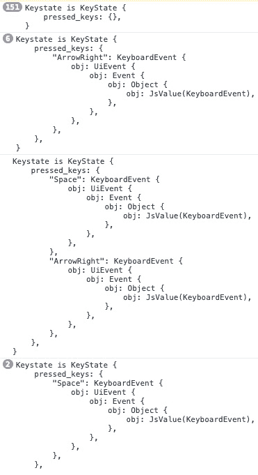
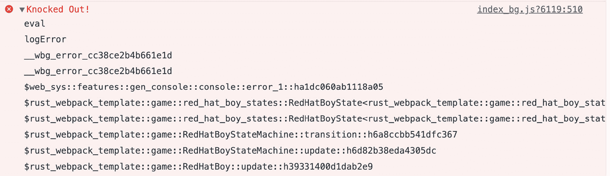
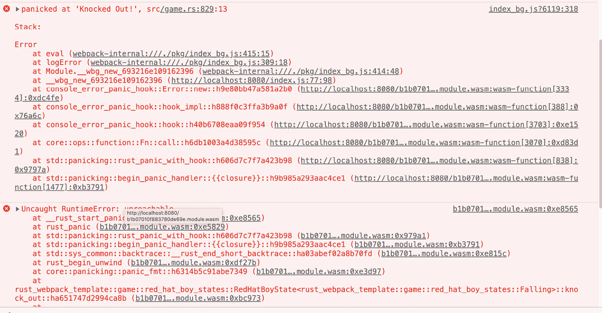
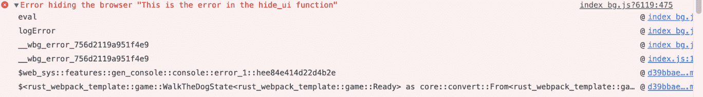
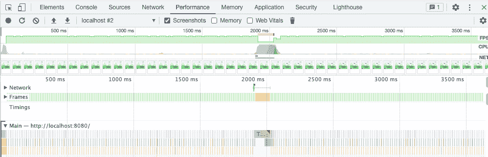
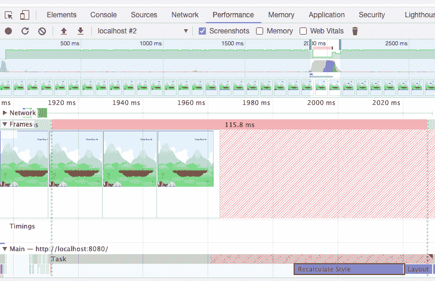
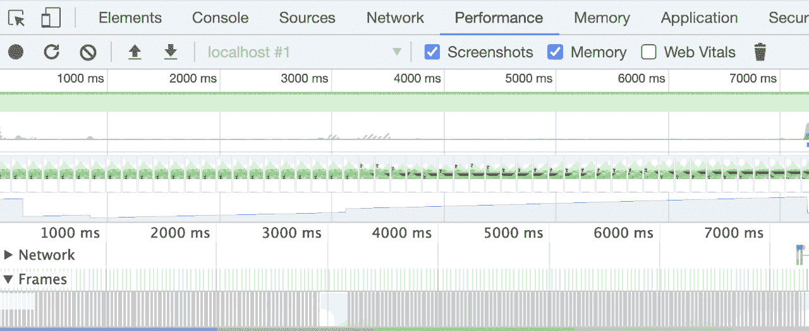
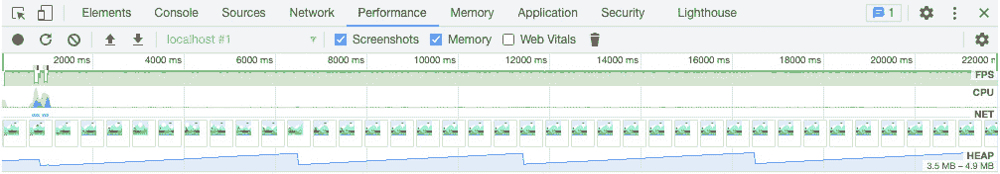

# *第九章*: 测试、调试和性能

在这本书中，我们使用两个工具来测试我们的逻辑——也就是说，编译器和我们的眼睛。如果游戏无法编译，它就是有问题的，如果**红帽男孩**(**RHB**)看起来不对，它也是有问题的——这很简单。幸运的是，编译器提供了很多工具来确保我们不会犯错误。但是，让我们说实话——这还不够。

开发一个游戏可能是一个漫长的过程，尤其是如果你是一个爱好者。当你在一周内只有 4 个小时可以用来工作的时候，你不能把所有的时间都花在同一个错误上。为了确保我们的游戏能够正常工作，我们需要对其进行测试，找出错误，并确保它不会太慢。这正是我们在这里要做的。

本章将涵盖以下主题：

+   创建自动化测试

+   调试游戏

+   使用浏览器测量性能

完成本章后，你将能够修复我们迄今为止编写的错误，并确保它们不再发生。

# 技术要求

在本章中，我们将使用 Chrome 开发者工具来调试代码并监控性能。其他浏览器也配备了强大的开发者工具，但为了本章的截图和说明，我们将使用 Chrome。

本章的源代码可在[`github.com/PacktPublishing/Game-Development-with-Rust-and-WebAssembly/tree/chapter_9`](https://github.com/PacktPublishing/Game-Development-with-Rust-and-WebAssembly/tree/chapter_9)找到。

查看以下视频，了解代码的实际应用：[`bit.ly/3NKppLk`](https://bit.ly/3NKppLk)

# 创建自动化测试

在一个理想的世界里，每个系统都应该有大量的测试，包括自动和手动测试，由开发人员和 QA 团队完成。以下是一些测试你的游戏是否正确工作的方法：

+   使用类型来防止程序员错误

+   自己玩游戏

+   执行自动化单元测试

+   执行自动化集成测试

到目前为止，我们只使用了前两种，这在现实世界的代码中是一个不幸的常见做法。这可能适合个人或爱好项目，但它对于生产应用来说不够健壮，尤其是那些由团队编写的应用。

几乎任何应用程序都可以从自动的、程序员编写的单元测试中受益，随着程序变得越来越大，它也开始从集成测试中受益。这两种测试类型之间的区别并没有一个一致的定义，因为你通常在看到它们时才会知道，但幸运的是，我们可以使用 Rust 的定义。Rust 和 Cargo 提供了两种测试类型：

+   通过 `cargo test` 进行单元测试

+   通过 `wasm-pack test` 进行集成测试

单元测试通常以程序员为中心。它们在方法或函数级别编写，具有最少的依赖。你可能会有一个针对`if/else`语句每个分支的测试，而在循环的情况下，你可能会有针对列表为 0、1 或多个条目的测试。这些测试很小、很快，应该在几秒钟或更短的时间内运行。这是我首选的测试形式。

集成测试通常会从更高的层次查看应用程序。在我们的代码中，集成测试会自动化浏览器，并基于事件（如鼠标点击）在整个程序中工作。这些测试编写起来耗时更长，更难维护，并且经常因为神秘的原因而失败。那么，为什么还要编写它们呢？单元测试通常不会测试应用程序的各个部分，或者它们可能只在小范围内这样做。这可能导致一种情况，即单元测试全部通过，但游戏却无法运行。由于集成测试的缺点，大多数系统将比单元测试少，但它们需要它们来获得其好处。

在 Rust 中，单元测试是与模块并行的，并通过`cargo test`运行。在我们的设置中，它们将作为 Rust 可执行程序的一部分运行，直接在机器上运行。集成测试存储在`tests`目录中，并且只能访问你的 crate 公开的事物。它们在浏览器中运行——可能是一个无头浏览器——通过`wasm-pack test`。单元测试可以直接测试内部方法，而集成测试必须像真实程序一样使用你的 crate。

小贴士

汉姆·沃克（Ham Vocke）有一篇非常详细的关于*测试金字塔*的文章，它描述了一种组织系统中所有测试的方法：[`martinfowler.com/articles/practical-test-pyramid.html`](https://martinfowler.com/articles/practical-test-pyramid.html)。

## 测试驱动开发

我有一个坦白要说。我通常以测试驱动的方式编写所有代码，即先写一个测试，然后在开发过程的每个步骤中让它失败。如果我们在这本书的开发过程中遵循这个过程，我们可能会有一大堆测试——可能超过 100 个。此外，**测试驱动开发**（**TDD**）对设计施加了很大的压力，这往往会导致更松散耦合的代码。那么，为什么我们没有这样做呢？

好吧，TDD 有其缺点，其中最大的可能是我们会生成大量的测试代码。我们在这本书中已经写了很多代码，所以想象一下还要跟着测试一起做——你可以看到为什么我觉得最好省略掉我通常写的测试。毕竟，这本书的标题不是《测试驱动的 Rust》。然而，仅仅因为我们没有先写测试，并不意味着我们不希望确保我们的代码能正常工作。这就是为什么在许多情况下，我们使用类型系统作为防止错误的第一道防线，例如使用类型状态模式进行状态转换。类型系统是使用 Rust 而不是 JavaScript 进行这款游戏的优点之一。

这并不是说自动化测试不能为我们程序提供价值。Rust 生态系统高度重视测试，以至于测试框架被内置到 Cargo 中，并且为任何 Rust 程序自动设置。通过单元测试，我们可以测试诸如碰撞检测或我们著名的状态机等算法。我们可以确保游戏仍然按照我们的预期运行，尽管我们无法测试游戏是否有趣或漂亮。为此，你可能需要一直玩游戏直到你讨厌它，但游戏如果基础功能正常，会更有趣。我们可以使用测试以及类型来确保代码按预期工作，这样我们就可以将注意力转向游戏是否有趣。为此，我们需要设置测试运行器，然后编写一些在浏览器外和浏览器内运行的测试。

注意

如果你对 TDD 感兴趣，Kent Beck 的书《通过示例进行测试驱动开发》（[Test-Driven Development By Example](https://amzn.to/3o1R663)）仍然是一个极好的资源。对于使用 TypeScript 和 React 的基于 Web 的方法，你可以看看一本叫做《自己动手制作电子表格》（[Build Your Own Spreadsheet](https://buildyourownspreadsheet.com/)）的优秀书籍。

## 入门

如我们之前提到的，Rust 内置了运行测试的能力——既包括单元测试和集成测试。不幸的是，我们很久以前在*第一章*，“Hello WebAssembly”，所使用的模板在撰写本文时仍然存在过时的设置。如果尚未修复，在命令提示符下运行 `cargo test` 将无法编译，更不用说运行测试了。幸运的是，错误并不多。只是有一个过时的 `async` 代码用于浏览器测试，而我们不会在自动生成的测试中使用。这些测试位于 `tests` 目录下的 `app.rs` 文件中。在 Cargo 项目中，传统上集成测试会放在这里。我们将很快通过使用单元测试来更改这个设置，但首先，让我们通过删除错误的 `async_test` 设置测试来确保它能编译。在 `app.rs` 中，你可以删除那个函数以及其上的 `#[wasm_bindgen_test(async)]` 宏，这样你的 `app.rs` 文件看起来就像这样：

```rs
use futures::prelude::*;
use wasm_bindgen::JsValue; 
use wasm_bindgen_futures::JsFuture;
use wasm_bindgen_test::{wasm_bindgen_test, wasm_bindgen_test_configure};
wasm_bindgen_test_configure!(run_in_browser);
// This runs a unit test in native Rust, so it can only use Rust APIs.
#[test]
fn rust_test() {
    assert_eq!(1, 1);
}
// This runs a unit test in the browser, so it can use browser APIs.
#[wasm_bindgen_test]
fn web_test() {
    assert_eq!(1, 1);
}
```

注意

在这本书出版后，模板将被修复，并且很可能会编译。我将假设这一点，无论你如何更改代码，以便它与此处的内容相匹配。

一些 `use` 声明不再需要了，但它们将很短，所以你可以保留它们并忽略警告。现在，`app.rs` 包含了两个测试 - 一个将在 JavaScript 环境中运行，例如浏览器，另一个将作为原生 Rust 测试运行。这两个都只是示例，其中 `1` 仍然等于 `1`。要运行原生 Rust 测试，你可以运行 `cargo test`，就像你可能习惯的那样。这将运行带有 `test` 宏注解的 `rust_test` 函数。你可以通过 `wasm-pack test --headless --chrome` 命令运行基于浏览器的测试，这些测试带有 `wasm_bindgen_test` 宏。这将使用 Chrome 浏览器在无头环境中运行网络测试。你也可以使用 `--firefox`、`--safari` 和 `--node`，如果你愿意，但你必须指定你将在哪个 JavaScript 环境中运行它们。请注意，`--node` 不会工作，因为它没有浏览器。

我们将开始使用 `#[test]` 宏编写测试，这个宏在原生环境中运行 Rust 代码，就像编写一个标准的 Rust 程序一样。要测试的最简单的事情是一个纯函数，所以让我们试试。

## 纯函数

`#[test]` 注解并使用 `cargo test` 运行。

当前设置在 `test/app.rs` 文件中运行我们唯一的 Rust 测试，这使得在 Cargo 看来，它是一个集成测试。我不喜欢这样，更愿意使用 Rust 习惯在执行代码的文件中编写单元测试。在这个第一个例子中，我们将测试 `Rect` 上的 `intersects` 函数，这是一个复杂到足以出错的自纯函数。我们将把这个测试添加到 `engine.rs` 文件的底部，因为 `Rect` 就是在那里定义的，然后我们将使用 `cargo test` 运行它。让我们在这个模块的底部添加一个测试，用于 `Rect` 上的 `intersect` 方法，如下所示：

```rs
#[cfg(test)]
mod tests {
    use super::*;
    #[test]
    fn two_rects_that_intersect_on_the_left() {
        let rect1 = Rect {
            position: Point { x: 10, y: 10 },
            height: 100,
            width: 100,
        };
        let rect2 = Rect {
            position: Point { x: 0, y: 10 },
            height: 100,
            width: 100,
        };
        assert_eq!(rect2.intersects(&rect1), true);
    }
}
```

大部分内容在 Rust 书籍中有记录，见 [`bit.ly/3bNBH3H`](https://bit.ly/3bNBH3H)，但复习一下永远不会有害。我们首先使用 `#[cfg(test)]` 属性宏告诉 Cargo 不要编译和运行此代码，除非我们在运行测试。然后，我们使用 `mod` 关键字创建一个 `tests` 模块，以将我们的测试与代码的其他部分隔离开。之后，我们使用 `use super::*` 导入 `engine` 代码。然后，我们通过编写一个函数 `two_rects_that_intersect_on_the_left` 并用 `#[test]` 宏注解它来编写我们的测试，这样测试运行器就可以找到它。其余的都是一个相当标准的测试。它创建了两个矩形，第二个矩形与第一个矩形重叠，然后确保 `intersects` 函数返回 `true`。你可以使用 `cargo test` 运行这个测试，你将看到以下输出：

```rs
    Finished test [unoptimized + debuginfo] target(s) in 1.48s
     Running target/debug/deps/rust_webpack_template-5805000a6d5d52b4
running 1 test
test engine::tests::two_rects_that_intersect_on_the_left ... ok
test result: ok. 1 passed; 0 failed; 0 ignored; 0 measured; 0 filtered out
     Running target/debug/deps/app-ec65f178e238b04b
running 1 test
test rust_test ... ok
test result: ok. 1 passed; 0 failed; 0 ignored; 0 measured; 0 filtered out
```

你将看到两组结果。第一个结果是关于我们的新测试`two_rects_that_intersect_on_the_left`，它将通过。然后，你会看到`rust_test`运行，它也将通过。`rust_test`测试位于`tests\app.rs`中，它是与项目骨架一起创建的。因为它位于`tests`目录中，所以它作为一个集成测试运行——这是 Cargo 的标准。单元测试和集成测试之间的区别在于，集成测试作为一个单独的 crate 运行，并使用生产代码作为单独的库。这意味着它们以与你的 crate 用户相同的方式使用代码，但它们不能调用内部或私有函数。当你运行单元测试时，更容易获得完整的覆盖率，但有一个前提是它们可能不太现实。我们的代码不是作为 crate 使用的，所以我们不会使用很多集成测试。

现在我们已经为我们的代码编写了第一个单元测试，我们可以为这个`intersects`方法编写更多测试，包括以下情况发生时：

+   当矩形在顶部或底部重叠时

+   当矩形在右侧重叠时

+   当矩形*不*重叠时——也就是说，当函数返回 false 时

我们应该在`intersects`函数的每个分支都有一个测试。我们将这些测试留给你作为练习，因为重复它们将是多余的。随着我们的代码库增长，如果大部分代码可以像这样轻松地进行测试，那将是理想的，但不幸的是，对于这个游戏，很多代码都与浏览器交互，因此我们将有两种不同的测试方式。第一种方式是用存根替换浏览器，这样我们就不需要运行基于浏览器的测试。我们将在下一节中这样做。

## 隐藏浏览器模块

在*第三章*“创建游戏循环”中，我们将浏览器功能分离到了一个`browser`模块中。我们可以利用这个**接口**注入测试版本的浏览器功能，使其作为原生 Rust 代码运行，并允许我们编写测试。

注意

术语**接口**来自迈克尔·费瑟斯的书籍《与遗留代码有效协作》（[`amzn.to/3kas1Fa`](https://amzn.to/3kas1Fa)）。这本书是用 C++和 Java 编写的，但仍然是你可以找到的关于遗留代码的最佳书籍。接口是一个可以插入测试行为以替换真实行为的地方，而**启用点**是代码中允许这种情况发生的地方。

接口是我们可以在不更改该处代码的情况下改变程序行为的地方。看看`game`模块中的以下代码：

```rs
impl WalkTheDogState<GameOver> {
    ...
    fn new_game(self) -> WalkTheDogState<Ready> {
        browser::hide_ui();
        WalkTheDogState {
            _state: Ready,
            walk: Walk::reset(self.walk),
        }
    }
}
```

我们想测试当游戏从 `GameOver` 状态转换为 `Ready` 状态时，UI 是否被隐藏。我们可以通过集成测试来完成这项工作，检查在这次转换之后包含 UI 的 `div` 属性是否为空。我们可能想这样做，但这样的测试通常编写和维护起来要困难一些。当游戏增长时，这一点尤其正确。另一种方法，我们将在这里使用，是用不与浏览器交互的 `browser` 模块的版本来替换它。接口是 `hide_ui`，这是一种我们可以替换而不实际更改代码的行为，而启用点是 `use` 声明，这是我们引入 `browser` 模块的地方。

我们可以通过条件编译启用使用 `browser` 模块的测试版本。与 `#[cfg(test)]` 宏仅在测试模式下编译时包含 `test` 模块的方式相同，我们可以使用 `cfg` 指令导入 `browser` 模块的不同版本，如下所示：

```rs
#[cfg(test)]
mod test_browser;
#[cfg(test)]
use test_browser as browser;
#[cfg(not(test))]
use crate::browser;
```

上述代码可以在 `game` 模块的顶部找到，我们之前在这里导入 `crate::browser`。在这里，我们可以使用 `mod` 关键字从 `src/game/test_browser.rs` 文件中引入 `test_browser` 模块的 内容，但仅在我们运行测试构建时。然后，我们可以使用 `test_browser as browser` 使函数通过 `browser::` 调用来可用 – 同样，仅在测试构建中 – 就像我们调用生产代码中的 `browser` 一样。最后，我们可以添加 `#[cfg(not(test))]` 注解到 `use crate::browser` 以防止将真实的 `browser` 代码导入到测试中。

注意

我第一次在 Klausi 的博客上看到这项技术，[`bit.ly/3ENxhWQ`](https://bit.ly/3ENxhWQ)，但在 Rust 代码中相当常见。

如果你这样做并运行 `cargo test`，你会看到很多错误，例如 `cannot find function `fetch_json` in module `browser` ``，因为尽管我们正在导入一个测试模块，但我们还没有用任何代码填充它。在这种情况下，遵循编译器错误是一个好主意，它会指出在 `src/game/test_browser.rs` 中还没有文件。它还会列出在 `game` 模块中使用但未在 `test_browser.rs` 文件中定义的函数。为了解决这个问题，你可以创建 `test_browser.rs` 文件，并引入所需的最小内容以重新开始编译，如下所示：

```rs
use anyhow::{anyhow, Result};
use wasm_bindgen::JsValue;
use web_sys::HtmlElement;
pub fn draw_ui(html: &str) -> Result<()> {
    Ok(())
}
pub fn hide_ui() -> Result<()> {
    Ok(())
}
pub fn find_html_element_by_id(id: &str) -> Result<HtmlElement> {
    Err(anyhow!("Not implemented yet!"))
}
pub async fn fetch_json(json_path: &str) -> Result<JsValue> {
    Err(anyhow!("Not implemented yet!"))
}
```

如您所见，`game`模块中只使用了四个在`browser`中定义过的函数，而我们只填入了足够编译的代码。为了进行测试，我们需要放置一些具有某种跟踪状态的模拟实现。您可能还会注意到，由于在运行 Rust 原生测试时它们无法工作，所以这段代码中同时使用了`JsValue`和`HtmlElement`。它们需要一个浏览器运行时，因此为了继续沿着这条路径前进，我们最终需要为`HtmlElement`和`JsValue`创建测试版本，或者为它们创建包装类型，这可能在`engine`模块中完成。不过，现在我们先保留这些不变，尝试使用标准的 Rust 测试框架编写我们的第一个测试。我们将通过设置游戏在`GameOver`状态并过渡到`Running`状态来测试我之前提到的状态机变化，然后检查 UI 是否被隐藏。该测试的*开始部分如下所示：

```rs
#[cfg(test)]
mod tests {
    use super::*;
    use futures::channel::mpsc::unbounded;
    use std::collections::HashMap;
    use web_sys::{AudioBuffer, AudioBufferOptions};
    fn test_transition_from_game_over_to_new_game() {
        let (_, receiver) = unbounded();
        let image = HtmlImageElement::new().unwrap();
        let audio = Audio::new().unwrap();
        let options = AudioBufferOptions::new(1, 3000.0);
        let sound = Sound {
            buffer: AudioBuffer::new(&options).unwrap(),
        };
        let rhb = RedHatBoy::new(
            Sheet {
                frames: HashMap::new(),
            },
            image.clone(),
            audio,
            sound,
        );
        let sprite_sheet = SpriteSheet::new(
            Sheet {
                frames: HashMap::new(),
            },
            image.clone(),
        );
        let walk = Walk {
            boy: rhb,
            backgrounds: [
                Image::new(image.clone(), Point { x: 0, y: 
                  0 }),
                Image::new(image.clone(), Point { x: 0, y: 
                  0 }),
            ],
            obstacles: vec![],
            obstacle_sheet: Rc::new(sprite_sheet),
            stone: image.clone(),
            timeline: 0,
        };
        let state = WalkTheDogState {
            _state: GameOver {
                new_game_event: receiver,
            },
            walk: walk,
        };
    }
}
```

哎呀——测试这么多的代码只是为了测试几行 Rust，而且这甚至不是一个完整的测试。它只是设置游戏到我们需要它处于的状态，*在我们过渡到`Ready`状态之前*。这揭示了关于我们设计的大量信息，特别是它可能是我所说的*天真*。构建对象非常困难，尽管`game`、`engine`和`browser`模块是分开的，但它们仍然相当紧密地耦合在一起。它确实可以工作，但只是在解决我们面前的问题。这是完全可以接受的——我们有一个具体的目标，那就是构建一个小型的无限跑酷游戏，我们做到了，但这同时也意味着，如果我们想要开始扩展我们的游戏引擎，使其更加灵活，我们就需要做出进一步的改变。我倾向于将软件设计看作是雕刻，而不是构建。你从一个大块的代码开始，然后逐渐雕刻，直到它看起来像你想要的样子，而不是遵循蓝图来建造完美的房子。

这个测试揭示了我们设计的一些方面如下：

+   创建新的`Walk`结构并不容易。

+   `game`模块与`web-sys`和`wasm-bindgen`的耦合程度远超我们的想象。

我们有意选择不在项目早期尝试创建完美的抽象。这也是我们最初没有以测试驱动的方式编写代码的原因之一。TDD 会强烈推动进一步抽象和分层，这可能会隐藏我们试图学习的游戏代码。例如，我们可能不会使用`HtmlImageElement`或`AudioBuffer`，而是围绕这些对象编写包装器或抽象（我们已经有了一个`Image`结构体），这在中等或长期内可能更有利于项目的发展，但在短期内可能更难理解。

这是一种冗长的说法，意思是由于我们没有考虑到这一点，现在很难为这段代码编写独立的单元测试。如果你能运行这个测试，你会看到以下内容：

```rs
thread 'game::tests::test_transition_from_game_over_to_new_game' panicked at 'cannot call wasm-bindgen imported functions on non-wasm targets', /Users/eric/.cargo/registry/src/github.com-1ecc6299db9ec823/web-sys-0.3.52/src/features/gen_HtmlImageElement.rs:4:1
```

结果表明，尽管我们用`test_browser`替换了生产中的`browser`，但我们仍在尝试调用浏览器代码。我已经指出了`HtmlElement`和`JsValue`，但这个测试还包括`AudioBuffer`和`AudioBufferOptions`。按照现在的样子，如果没有启用更多功能标志并对`engine`进行更改，这段代码是无法编译的。它仍然与浏览器耦合得太紧密了。

尝试在测试框架中使用此代码的行为展示了耦合的力量，通常将遗留代码放入框架中，以识别这些依赖问题并解决它们是非常有用的。不幸的是，这是一个耗时过程，我们不会在本节中继续使用它，尽管它可能会在我的博客[paytonrules.com](http://paytonrules.com)上某个时候出现。相反，我们将通过在浏览器中运行的测试来测试此代码。

## 浏览器测试

在本章的开头，我提到过有**单元测试**和**浏览器测试**。区别在于，虽然浏览器测试可能与单元测试测试相同的行为，但它们在无头浏览器中自动化了所需的行为。这使得测试更加真实，但同时也更慢，更容易因为不稳定的原因而失败。我更喜欢我的系统有一个大量的单元测试和较少的更集成的测试，以确保一切连接正确无误，但我们并不总能得到我们想要的结果。

相反，我们将通过跳过针对遗留代码的依赖破坏技术，并编写一个在浏览器中运行的测试来获取我们所需的东西——行为的验证。我们将移除添加了`test_browser`模块的代码，以及`test_browser`文件本身。我们将保留之前编写的测试，并对其进行两项更改，如下所示：

1.  将`AudioBufferOptions`添加到`Cargo.toml`中`web-sys`功能列表中。

1.  在`engine`模块中，将`Sound`结构体上的`buffer`字段设置为公共的，这样我们就可以在这个测试中直接创建`Sound`。

这两项更改将使代码能够编译，但还不会使其在测试中运行。为此，我们需要进行一些更改。首先，我们需要将`#[test]`宏更改为`#[wasm_bindgen_test]`。然后，我们需要向我们的`test`模块添加两个语句，如下所示：

```rs
#[cfg(test)]
mod tests {
    use super::*;
    use futures::channel::mpsc::unbounded;
    use std::collections::HashMap;
    use web_sys::{AudioBuffer, AudioBufferOptions};
    use wasm_bindgen_test::wasm_bindgen_test;
    wasm_bindgen_test::wasm_bindgen_test_configure!
        (run_in_browser);
    #[wasm_bindgen_test]
    fn test_transition_from_game_over_to_new_game() {
        ...
```

首先要添加的是`use wasm_bindgen_test::wasm_bindgen_test`，以便宏存在。第二是`wasm_bindgen_test::wasm_bindgen_test_configure!(run_in_browser);`。这个指令告诉测试运行器在浏览器中运行，以便代码可以与 DOM 交互，类似于应用程序的方式。这个测试不会在`cargo test`中运行，所以你需要使用`wasm-pack test --headless –chrome`命令。这将使用 Chrome 浏览器的无头版本运行 Web 测试。当你运行它们时，你应该看到以下输出：

```rs
running 1 test
test rust_webpack_template::game::tests::test_transition_from_game_over_to_new_game … ok
```

现在，我们有一个正在运行且通过测试，但唯一的问题是我们没有任何断言。我们已经编写了一个“安排”步骤，但还没有检查结果。这个测试的目的是确保当状态转换发生时 UI 被隐藏，因此我们需要更新测试来检查这一点。我们可以通过添加动作和断言步骤来实现，如下所示：

```rs
#[wasm_bindgen_test]
fn test_transition_from_game_over_to_new_game() {
    ...
    let document = browser::document().unwrap();
    document
        .body()
        .unwrap()
       .insert_adjacent_html("afterbegin", "<div 
            id='ui'></div>")
        .unwrap();
    browser::draw_ui("<p>This is the UI</p>").unwrap();
    let state = WalkTheDogState {
        _state: GameOver {
            new_game_event: receiver,
        },
        walk: walk,
    };
    state.new_game();
    let ui =  
        browser::find_html_element_by_id("ui").unwrap();
    assert_eq!(ui.child_element_count(), 0);
}
```

在这里，我们通过将`div`属性和`ui` ID 插入到文档中来开始测试——毕竟，这是在游戏的`index.html`中。然后，`browser::draw_ui`将 UI 绘制到浏览器中，即使浏览器是无头运行的，所以我们看不到。我们继续在`GameOver`状态中创建`WalkTheDogState`；在下一行，我们通过`state.new_game()`方法将其转换为`Ready`状态。最后，我们通过查找`div`属性并检查其`child_element_count`来检查 UI 是否被清除。如果它是`0`，代码就是正确的，这个测试将会通过。如果你运行这个测试，你会看到这个测试*确实*通过了，所以你可能想要注释掉`let next_state: WalkTheDogState<Ready> = state.`这一行，然后再次运行以确保在转换发生时测试失败。

这仍然是一个非常长的测试，但至少它在工作。可以通过在各个模块中创建一些工厂方法来清理测试，这样就可以更容易地创建结构体。你会注意到测试中充满了`unwrap`调用。这是因为，在测试中，我希望如果事情不是预期的，它们立即崩溃。不幸的是，基于浏览器的测试使用`wasm_bindgen_test`宏并不允许你像标准 Rust 测试那样返回`Result`以提高可读性。这是你应该尝试使你的测试以原生 Rust 测试方式运行的原因之一。

## 异步测试

测试 Web 应用程序的最大挑战之一，无论是 Wasm 还是传统的 JavaScript 应用程序，都是在`async`块或函数中发生的代码。想象一下在一个`async`测试中调用一个函数，然后立即尝试验证它是否工作。根据定义，你不能这样做，因为它是异步运行的，可能还没有完成。幸运的是，`wasm_bindgen_test`通过使测试函数本身是`async`的来非常容易地处理这个问题。

让我们看看一个更简单的例子，并尝试为`browser`模块中的`load_json`函数编写一个测试：

```rs
#[cfg(test)]
mod tests {
    use super::*;
    use wasm_bindgen_test::wasm_bindgen_test;
    wasm_bindgen_test::wasm_bindgen_test_configure!
        (run_in_browser);
    #[wasm_bindgen_test]
    async fn test_error_loading_json() {
        let json = fetch_json("not_there.json").await;
        assert_eq!(json.is_err(), true);
    }
}
```

这可以在`browser`模块中找到。在这里，我们首先使用样板代码来设置一个`tests`模块，导入`browser`和`wasm_bindgen_test`，并配置测试在浏览器中运行。测试本身只有两行。尝试加载一个不存在的`JSON`文件并报告错误。这个测试的关键区别在于它是`async`的，这允许我们在测试中使用`await`并在不添加任何“等待”逻辑的情况下编写断言。这很好，但有几件事情需要记住：

+   如果`fetch_json`可能会挂起，这个测试也会挂起。

+   这个测试将尝试加载一个文件。理想情况下，我们不想在单元测试中这样做。

这个测试将会运行并通过。我们可以用这种方式测试所有的`browser`函数，接受`browser`模块的测试将需要使用文件系统。如果我在专业环境中接手这个系统，我可能会这样做。你可以非常努力地模拟这些测试中的实际浏览器，但这样做会消除其防止缺陷的能力。毕竟，如果你从`browser`模块中移除浏览器，你怎么知道代码是正确的？

如果我被分配了这段代码并要求维护它，我可能会采用以下策略：

+   咒骂那个没有编写测试就写代码的家伙的名字（就是我！）。

+   在需要更改代码时编写测试。如果它没有变化，就别麻烦了。继续使用浏览器自动化，就像我们之前做的那样。

+   随着时间的推移，将更多依赖于`wasm-bindgen`和`web-sys`的代码移入`browser`模块，以便`engine`和`game`可以模拟它。

+   尽可能多地编写尽可能多的 Rust 原生测试，然后尽可能地将基于浏览器的单元测试本地化。

关于集成测试，我怀疑我会在 Cargo 的意义上编写任何集成测试。对于 Cargo 库，所有的集成测试都是写在`tests`目录中，并作为一个单独的包编译。当你编写一个将被其他人使用的库时，这是一个很好的主意，但我们正在编写一个应用程序，并没有提供 API。我会编写的集成测试是任何使用真实浏览器的测试，但这些测试在意义上是集成在浏览器中的，而不是作为 Rust 集成测试运行。

然而，我们不能仅仅依靠添加测试来确保我们的代码工作。有时，我们只是必须调试它。让我们深入探讨这一点。

# 游戏调试

要调试一个传统的程序，无论是 Java、C#还是 C++，我们必须设置断点并逐步执行代码。在 JavaScript 中，我们可以输入单词`debugger`来设置断点，但尽管 WebAssembly 在浏览器中运行，但它不是 JavaScript。那么，我们如何调试它？

关于使用 WebAssembly 进行调试的信息很多，但如何调试 WebAssembly 呢？根据官方的 Rust WebAssembly 文档，很简单——你不能！

不幸的是，WebAssembly 的调试故事仍然不成熟。在大多数 Unix 系统中，DWARF 用于编码调试器需要提供源代码级别的程序检查所需的信息。在 Windows 上有一个替代格式，它以类似的方式编码了相似的信息。目前，WebAssembly 还没有等效的格式。因此，当前的调试器提供的功能有限，我们最终只能通过编译器输出的原始 WebAssembly 指令来逐步执行，而不是我们编写的 Rust 源代码。

– [`rustwasm.github.io/docs/book/reference/debugging.html`](https://rustwasm.github.io/docs/book/reference/debugging.html)

所以，这就是全部内容——没有调试，章节结束。这很简单。

但事情并非如此简单。当然，你可以调试你的应用程序——你只是不能使用浏览器开发者工具逐步执行调试器中的 Rust 代码。这项技术还没有准备好。但这并不意味着我们不进行调试；它只是意味着我们将采取更传统的调试方法。

之前，我提到当我编写代码时，我通常会编写很多测试。我也通常不太常用调试器。如果我们把代码分成小块，这些小块可以很容易地通过测试来执行，那么调试器就很少需要了。话虽如此，我们没有在这个项目中这样做，所以我们需要一种调试现有代码的方法。我们将从记录开始，然后获取堆栈跟踪，最后使用 linters 来防止在发生之前出现错误。

注意

事实并非像 Rust Wasm 网站所陈述的那样简单明了。在撰写本文时，Chrome 开发者工具已经添加了对`wasm-bindgen`的支持。你可以在这里看到这个问题的进展：[`github.com/rustwasm/wasm-bindgen/issues/2389`](https://github.com/rustwasm/wasm-bindgen/issues/2389)。到你阅读这本书的时候，Rust Wasm 以及 Chrome 以外的浏览器的调试工具可能已经现代化了，但到目前为止，我们必须使用更传统的工具，如`println!`和日志。

## 日志、错误与恐慌

如果你一直在跟随并在这个过程中感到困惑，那么你很可能使用了我们在*第三章*“创建游戏循环”中编写的`log!`宏来查看发生了什么。如果你一直在这样做，恭喜你！你一直在用与我最初编写代码时相同的方式进行调试。打印行调试在许多语言中仍然是标准做法，并且几乎是唯一保证在任何地方都能工作的调试形式。如果你没有这样做，那么它看起来是这样的：

```rs
impl WalkTheDogStateMachine {
    fn update(self, keystate: &KeyState) -> Self {
        log!("Keystate is {:#?}", keystate);
        match self {
            WalkTheDogStateMachine::Ready(state) => 
                state.update(keystate),
            WalkTheDogStateMachine::Walking(state) => 
                state.update(keystate),
            WalkTheDogStateMachine::GameOver(state) => 
               state.update(),
        }
    }
```

在前面的例子中，我们通过`update`函数在每一刻记录`KeyState`。这不是一个很好的日志，因为它会每秒显示 60 次空的`KeyState`，但对于我们的目的来说已经足够好了。然而，这个日志有一个缺陷：`KeyState`没有实现`Debug`特质。你可以通过在`KeyState`结构体上添加`derive(Debug)`注解来添加它，如下所示：

```rs
#[derive(Debug)]
pub struct KeyState {
    pressed_keys: HashMap<String, web_sys::KeyboardEvent>,
}
```

当您添加这个功能时，控制台将记录所有您的键状态变化，这在您的键盘输入损坏时将非常有用：



图 9.1 – 记录 KeyState

通常情况下，任何 `pub struct` 都应该 `use` `#[derive(Debug)]`，但这不是默认选项，因为它可能会使大型项目的编译时间变长。当不确定时，请继续使用 `#[derive(Debug)]` 并记录信息。现在，可能 `log!` 对您来说不够明显，您希望文本明亮、明显且为红色。为此，您需要使用 JavaScript 中的 `console.error` 并编写一个类似于 `log` 宏的宏，我们已经在 `browser` 模块中有了这个宏。这个宏看起来是这样的：

```rs
macro_rules! error {
    ( $( $t:tt )* ) => {
        web_sys::console::error_1(&format!( $( $t )* 
            ).into());
    }
}
```

这与 `log` 宏相同，但使用 `console` 对象上的 `error` 函数。`error` 函数有两个优点。第一个是它是红色的，另一个优点是它还会显示堆栈跟踪。以下是一个在 Chrome 中玩家被击倒时调用 `error` 的示例：



图 9.2 – 错误日志

这不是世界上最易读的堆栈跟踪，但看过 `console::error_1` 函数的几行后，您可以看到这个日志是从 `WalkTheDogState<Walking>::end_game` 调用的。这个日志实际上是针对真正的错误，而不是仅仅的信息记录，并且这个堆栈跟踪可能不会在所有浏览器中清晰地显示。您还希望谨慎地保留这个日志在生产代码中，因为您可能不希望向好奇的玩家暴露这么多信息。我们将确保它不在生产部署中，这将在 *第十章* *持续部署* 中创建。

最后，如果您想确保程序在发生错误时停止，我们将继续使用 `panic!` 宏。一些错误是可以恢复的，但许多不是，我们不希望我们的程序在损坏的状态下艰难前行。在 *第一章* *Hello WebAssembly* 中，我们包含了 `console-error-panic-hook` crate，以便如果程序崩溃，我们会得到一个堆栈跟踪。让我们将调用 `error`! 替换为调用 `panic`! 并看看区别：



图 9.3 – 潜意识日志

在这里，您可以看到它看起来略有不同，但信息基本上是相同的。在最顶部有一个地方写着 `src/game.rs:829`，这告诉您 `panic` 被调用的确切位置。通常，如果您需要在生产代码中包含错误，您可能会更倾向于使用 `panic` 而不是 `error`，因为这种错误应该是罕见的，并且应该快速失败。`error` 函数在调试期间更有用，所以您最终会移除那些。

我们有时会忽略另一种错误，那就是编译器和代码检查器给出的警告和错误。我们可以在运行程序之前使用 Rust 生态系统中的工具来检测错误。现在让我们来看看这个。

## 检查和 Clippy

Rust 编译器之所以出色，其中一个特点就是它内置了一个检查器，除了它已经提供的警告和错误之外。如果你不熟悉，检查器是一种静态代码分析工具，它通常会发现样式错误，以及编译器可能无法发现的潜在逻辑错误。这个术语来自衣服上的 lint，所以你可以把使用检查器想象成在你的代码上刷 lint 刷子。我们已经从编译器那里收到了一些警告，我们已经忽略了一段时间，其中大多数看起来像这样：

```rs
warning: unused `std::result::Result` that must be used
   --> src/game.rs:241:9
    |
241 |         browser::hide_ui();
    |         ^^^^^^^^^^^^^^^^^^^
    |
    = note: `#[warn(unused_must_use)]` on by default
    = note: this `Result` may be an `Err` variant, which should be handled
```

这些都是可能发生错误的情况，但我们可能不希望它发生时崩溃，所以恐慌或调用 `unwrap` 不是选项。传播 `Result` 类型是一个选项，但我不认为我们想在存在小的浏览器问题时阻止从一个状态移动到另一个状态。因此，我们将使用 `error` 情况在这里记录。你可以在 `https://bit.ly/3q1936N` 的示例源代码中看到它。让我们修改代码，以便记录任何错误：

```rs
impl WalkTheDogState<GameOver> {
    ...
    fn new_game(self) -> WalkTheDogState<Ready> {
        if let Err(err) = browser::hide_ui() {
            error!("Error hiding the browser {:#?}", err);
        }
        WalkTheDogState {
            _state: Ready,
            walk: Walk::reset(self.walk),
        }
    }
}
```

在这里，我们将 `browser::hide_ui()` 行更改为 `if let Err(err) = browser::hide_ui()` 并在发生错误时进行记录。我们可以通过强制 `hide_ui` 在一段时间内返回错误来查看错误日志将是什么样子：



图 9.4 – 一个假错误

在书籍形式中，堆栈跟踪被截断，但你可以看到我们得到了一个错误日志，其中包含 `Error hiding the browser` 和 `This is the error in the hide_ui function`，这是我强制放入 `hide_ui` 的错误消息。堆栈跟踪还显示了 `game::Ready`，这会显示如果你有无限的空间来显示整个消息，你将正在过渡到 `Ready` 状态。

应该处理所有生成的警告。大多数警告都是同一种类型，即 `Result` 类型，其中 `Err` 变体被忽略。这些可以通过处理 `Err` 情况并记录或调用 `panic`（如果游戏确实应该在此时崩溃）来删除。大部分情况下，我使用了 `if let` 模式，但如果 `request_animation_frame` 失败，我就使用 `unwrap`。我不认为如果那样失败，游戏能工作。

我们还忽略了一个警告，但我们应该解决它，如下所示：

```rs
warning: associated function is never used: `draw_rect`
   --> src/engine.rs:106:12
    |
106 |     pub fn draw_rect(&self, bounding_box: &Rect) {
    |            ^^^^^^^^^
    |
    = note: `#[warn(dead_code)]` on by default
```

这个警告有点独特，因为我们使用了这个函数来*调试*。你可能不想在你的游戏中绘制矩形，但正如我们在 *第五章* *碰撞检测* 中所做的那样，调试碰撞框是至关重要的，所以我们会希望它可用。为了保留它，让我们用 `allow` 关键字来注释它，如下所示：

```rs
impl Renderer {
    ...
    #[allow(dead_code)]
    pub fn draw_rect(&self, bounding_box: &Rect) {
```

这应该会留下无编译错误的编译结果，但我们还可以使用一个额外的工具来查看我们的代码是否可以改进。如果你在 Rust 生态系统中度过了很多时间，那么你可能已经听说过 `Cargo.toml` 文件，但针对当前系统本身。安装很简单，你可能已经安装过并忘记了，但如果你还没有，只需要一个 shell 命令：

```rs
rustup component add clippy
```

一旦你安装了 Clippy，你可以运行 `cargo clippy` 并看到我们编写坏 Rust 代码的其他所有方式。

注意

当代码很棒时，我写了它，而你跟随着。当它很糟糕时，我们一起完成。我不会制定规则。

当我运行 `cargo clippy` 时，我得到 `17` 个警告，但你的数字可能不同，取决于你何时运行它。我不会逐个解释，但让我们突出一个错误：

```rs
warning: writing `&Vec<_>` instead of `&[_]` involves one more reference and cannot be used with non-Vec-based slices.
   --> src/game.rs:945:29
    |
945 | fn rightmost(obstacle_list: &Vec<Box<dyn Obstacle>>) -> i16 {
    |                             ^^^^^^^^^^^^^^^^^^^^^^^ help: change this to: `&[Box<dyn Obstacle>]`
    |
    = note: `#[warn(clippy::ptr_arg)]` on by default
    = help: for further information visit https://rust-lang.github.io/rust-clippy/master/index.html#ptr_arg
```

`game` 模块中的 `rightmost` 函数可以被修改以使用更少的引用并变得更加灵活。这里的 `help` 非常好，因为它告诉我如何修复它。所以，让我们改变 `rightmost` 函数签名，使其看起来如下：

```rs
fn rightmost(obstacle_list: &[Box<dyn Obstacle>]) -> i16 {
```

这并不能修复任何错误，但它确实移除了一个 Clippy 警告，并使方法更加灵活。

Clippy 经常会通知你更好的惯用用法。我想突出一个 Clippy 警告，看起来像这样：

```rs
warning: match expression looks like `matches!` macro
   --> src/game.rs:533:9
    |
533 | /         match self {
534 | |             RedHatBoyStateMachine::KnockedOut(_) => true,
535 | |             _ => false,
536 | |         }
    | |_________^ help: try this: `matches!(self, RedHatBoyStateMachine::KnockedOut(_))`
    |
    = help: for further information visit https://rust-lang.github.io/rust-clippy/master/index.html#match_like_matches_macro
```

我在代码的早期版本中遇到了这个错误很多次。在运行 Clippy 之前，我不知道存在 `matches!` 宏，但它所做的正是处理你需要检查 `enum` 是否是特定情况的精确情况。这就是为什么代码现在使用 Clippy 建议的，即在 `impl` `RedHatBoyStateMachine` 中：

```rs
impl RedHatBoyStateMachine {
    ...
    fn knocked_out(&self) -> bool {
        matches!(self, RedHatBoyStateMachine::KnockedOut(_))
    }
```

小贴士

许多编辑器使它非常容易将 Clippy 作为语法检查的一部分启用，这样你就不需要显式地运行它。如果你能启用它，你应该这样做。

许多其他错误都是关于过度使用 `clone` 和在不必要的时候使用 `into`。我强烈建议你通读代码并修复这些问题，花点时间理解为什么它们被标记出来。在 *第十章* *持续部署* 中，我们将把 Clippy 添加到我们的构建过程中，这样我们就不必继续忍受这些错误。

到目前为止，代码已经经过（一点）测试，我们已经处理了我们能想到的所有编译错误和警告。可以说游戏是可行的，但它足够快吗？接下来要检查的是它的性能。所以，我们现在就来做这件事。

# 使用浏览器测量性能

调试性能的第一步是回答这个问题，*你是否有性能问题？* 太多的开发者，尤其是游戏开发者，过早地担心性能，并引入了复杂的代码来获得并不存在的性能提升。

例如，你知道为什么这么多代码使用 `i16` 和 `f16` 吗？好吧，当我几年前回到学校时，我在 C++中参加了一门游戏优化课程，我们的最终项目需要优化一个粒子系统。最大的性能提升是将 32 位整数转换为 16 位整数。正如我的教授所说，“*我们在 16 位上登上了月球！*”所以，当我编写这段代码时，我内化了这个教训，并将变量设置为 16 位，除非它们被发送到 JavaScript，在那里一切都是 32 位的。好吧，让我直接引用 WebAssembly 规范（可在[`webassembly.github.io/spec/core/syntax/types.html`](https://webassembly.github.io/spec/core/syntax/types.html)找到）：

数字类型用于分类数值。

*i32* 和 *i64* 类型分别用于分类 32 位和 64 位整数。整数本身不是有符号或无符号的；它们的解释由单个操作决定。

*f32* 和 *f64* 类型分别用于分类 32 位和 64 位的浮点数据。它们对应于由 IEEE 754-2019 标准（第 3.3 节）定义的相应二进制浮点表示，也称为单精度和双精度。

结果表明，WebAssembly 不支持 16 位数值，所以所有针对 `i16` 的优化都是无意义的。它没有造成任何伤害，也没有必要回去更改它，但它强化了优化的第一条规则：**先测量**。考虑到这一点，让我们调查两种不同的方法来衡量我们游戏的表现。

## 帧率计数器

我们的游戏表现不佳有两种方式：使用过多的内存和降低帧率。其中第二种对于像这样小型游戏来说更为重要，因此我们首先需要关注帧率。如果帧率持续落后，我们的游戏循环将尽可能处理它，但游戏看起来会抖动，响应也会不佳。所以，我们需要知道当前的帧率，而最好的方法是在屏幕上显示它。

我们将首先添加一个函数 `draw_text`，该函数将在屏幕上绘制任意文本。这是调试文本，所以类似于 `draw_rect` 函数，我们需要禁用显示代码未使用的警告。写文本是 `engine` 模块中 `Renderer` 的一个功能，如下所示：

```rs
impl Renderer {
    ...
    #[allow(dead_code)]
    pub fn draw_text(&self, text: &str, location: &Point) -> Result<()> {
        self.context.set_font("16pt serif");
        self.context
            .fill_text(text, location.x.into(), 
                location.y.into())
            .map_err(|err| anyhow!("Error filling text 
                {:#?}", err))?;
        Ok(())
    }
}
```

我们在这里硬编码了字体，因为这只是用于调试目的，所以不值得定制。现在，我们需要将帧率计算器添加到游戏循环中，这个游戏循环位于`engine`模块的`GameLoop`的`start`方法中。你可以通过回顾*第三章*，*创建一个游戏循环*来刷新你对它是如何工作的记忆。帧率可以通过取最后两个帧之间的差值，除以 1,000，将毫秒转换为秒，并计算其倒数（即 1 除以该数值）来计算。这很简单，但它会导致屏幕上的帧率波动得很厉害，并且不会显示非常有用的信息。我们可以做的是每秒更新一次帧率，这样我们就可以在屏幕上得到一个相当稳定的性能指标。

让我们将这段代码添加到`engine`模块中。我们将从一个独立的函数开始，这个函数将在`start`方法中每秒计算一次帧率，如下所示：

```rs
unsafe fn draw_frame_rate(renderer: &Renderer, frame_time: f64) {
    static mut FRAMES_COUNTED: i32 = 0;
    static mut TOTAL_FRAME_TIME: f64 = 0.0;
    static mut FRAME_RATE: i32 = 0;
    FRAMES_COUNTED += 1;
    TOTAL_FRAME_TIME += frame_time;
    if TOTAL_FRAME_TIME > 1000.0 {
        FRAME_RATE = FRAMES_COUNTED;
        TOTAL_FRAME_TIME = 0.0;
        FRAMES_COUNTED = 0;
    }
    if let Err(err) = renderer.draw_text(
        &format!("Frame Rate {}", FRAME_RATE),
        &Point { x: 400, y: 100 },
    ) {
        error!("Could not draw text {:#?}", err);
    }
}
```

哦不——这是一个`unsafe`函数！这是本书中的第一个，也可能是最后一个。我们在这里使用`unsafe`函数是因为有`static mut`变量——即`FRAMES_COUNTED`、`TOTAL_FRAME_TIME`和`FRAME_RATE`——在多线程环境中并不安全。我们知道这个函数不会以多线程的方式被调用，我们也知道如果它被调用，它只会显示一个奇怪的帧率值。这并不是我一般推荐的做法，但在这个情况下，我们不想让`GameLoop`或`engine`模块被这些值污染，或者将它们放入线程安全的类型中。毕竟，我们不想因为一大堆`Mutex`锁调用而让我们的帧率计算器运行得太慢。所以，我们将接受这个调试函数是`unsafe`的，颤抖一会儿，然后继续。

函数首先设置初始的`FRAMES_COUNTED`、`TOTAL_FRAME_TIME`和`FRAME_RATE`值。在每次调用`draw_frame_rate`时，我们更新`TOTAL_FRAME_TIME`和`FRAMES_COUNTED`的数量。当`TOTAL_FRAME_TIME`超过`1000`时，这意味着已经过去了 1 秒，因为`TOTAL_FRAME_TIME`是以毫秒为单位的。我们可以将`FRAME_RATE`设置为`FRAMES_COUNTED`的数量，因为那正是我们刚刚创建的`draw_text`函数。这个函数将在每一帧上最后被调用，这是很重要的，因为如果不是这样，我们就会在帧率上直接绘制游戏。如果我们不在每一帧上绘制帧率，我们也不会看到它，除了在屏幕上短暂的闪烁，这几乎不适合调试。

现在，让我们在`start`函数中添加对`GameLoop`的调用，如下所示：

```rs
impl GameLoop {
    pub async fn start(game: impl Game + 'static) -> Result<()> {
        ...
        *g.borrow_mut() = Some(browser::create_raf_closure
             (move |perf: f64| {
            process_input(&mut keystate, &mut 
                keyevent_receiver);
            let frame_time = perf - game_loop.last_frame;
            game_loop.accumulated_delta += frame_time as 
                f32;
            while game_loop.accumulated_delta > FRAME_SIZE {
                game.update(&keystate);
                game_loop.accumulated_delta -= FRAME_SIZE;
            }
            game_loop.last_frame = perf;
            game.draw(&renderer);
            if cfg!(debug_assertions) {
                unsafe {
                    draw_frame_rate(&renderer, frame_time);
                }
            }
            ...
```

`game_loop.accumlated_delta`这一行有轻微的变化，将帧长度的计算拉入一个临时变量`frame_time`。然后，在绘制之后，我们通过检查`if cfg!(debug_assertions)`来确定是否处于调试/开发模式。这将确保这不会出现在部署的代码中。如果我们处于调试模式，我们将在`unsafe`块内调用`draw_frame_rate`。我们发送该函数`renderer`和`frame_time`，我们刚刚将其拉入临时变量。添加此代码可以在屏幕上提供清晰的帧率测量：


图 9.5 – 显示帧率

在我的机器上，帧率稳定在`60`，偶尔会有不稳定的短暂波动。这很好，除非你正在编写关于调试性能问题的章节。那么，你可能会有问题。

幸运的是，在早期草稿中，有一次帧率下降，那是在 RHB 撞到岩石的时候。当`index.html`。换句话说，我们必须删除`index.html`中高亮显示的代码：

```rs
<!DOCTYPE html>
<html>
<head>
  <meta charset="UTF-8">
  <title>My Rust + Webpack project!</title>
  <link rel="stylesheet" href="styles.css" type="text/css" 
      media=
  "screen">
  <link rel="preload" as="image" href="Button.svg">
  <link rel="preload" as="font" href=
  "kenney_future_narrow-webfont.woff2">
</head>
```

如果你删除了预加载的资源，你应该会看到帧率短暂下降。显示帧率是确保你作为开发者立即看到性能问题的绝佳方式。如果帧率下降，那么你就遇到了问题，就像我们没有预加载资源时遇到的情况一样。有时，我们需要的不仅仅是帧率计数器。所以，让我们保留预加载代码被删除的状态，并在浏览器调试器中查看性能问题。

## 浏览器调试器

每个现代浏览器都有开发者工具，但我会在这个部分使用 Chrome，因为它是开发者中最受欢迎的。一般来说，它们看起来都很相似。为了获取性能信息，我必须启动游戏并在 Chrome 中打开开发者工具。然后，我必须右键单击并点击**检查**，尽管有其他很多打开工具的方法。从那里，我必须点击**性能**选项卡并开始录制。然后，我必须将 RHB 撞到岩石并停止录制。由于我知道我有一个特定的性能下降点，我想尽快到达那里，以隐藏调试器中其他代码的任何噪音。完成这些后，我会看到一个图表，就像这样：



图 9.6 – 性能选项卡

这有很多噪音，但你可以看到图表发生了变化。在**帧**行有一个粉红色的块，表明那里发生了某些事情。我可以使用我的光标选择看起来像山一样的部分，并将其拖动以放大。现在，我会看到以下屏幕：



图 9.7 – 丢失的帧

在这里，你可以看到一帧是**115.8 毫秒**。我打开了**帧**部分（看看**帧**旁边的灰色箭头是如何指向下方的），以查看这些帧上绘制了什么——我们可怜的击倒 RHB。115.8 毫秒的帧太长了，如果你将鼠标悬停在其上，它会显示**丢失的帧**。在**帧**部分下方，是**主**部分，它显示了应用程序正在做什么。我在这里突出显示了**重新计算样式**，根据**工具提示**窗口，它显示为**33.55 毫秒**，这个窗口在我将鼠标悬停在其上时出现。

`index.html`文件，这应该会加快布局的重新计算。如果你这样做并重新测量性能，你会看到类似这样的：



图 9.8 – 没有丢失帧！

这值得担心吗？可能吧——看到按钮加载是明显的，但扩展这一章来修复它并不值得。你知道如何修复它，也知道如何在**性能**标签页中找到问题，而这正是现在重要的。无论如何，我们还有另一个问题要回答：这款游戏占用了多少内存？

## 检查内存

当我编写这个游戏时，我经常让它全天在后台运行，结果我的浏览器开始占用我电脑的所有内存，变得非常不响应。我开始怀疑这个游戏有内存泄漏，所以我开始调查。你可能认为由于 Rust 的保证，在 Rust 中不可能有内存泄漏，这确实更难，但记住，我们的大部分代码都与 JavaScript 通信，我们并不一定有相同的保证。幸运的是，我们可以使用我们用来测试性能的相同工具来检查这一点。

点击左上角的**无符号**来清除性能数据。然后，开始另一个记录并播放一段时间。这次，不要试图立即死亡；让游戏播放一会儿。然后，停止记录并再次查看性能数据，这次确保你点击**内存**按钮。现在，你可以查看结果，它可能看起来像这样：



图 9.9 – 内存分析

你能看到屏幕底部的蓝色波浪吗，它显示了右下角的**堆**？这表明我们的内存增长，然后定期回收。这可能不是我们想要的理想状态，但我们现在并不试图控制到那种程度。Chrome 和大多数浏览器都在单独的线程中运行它们的垃圾收集器，这样就不会像你想象的那么影响性能。进行实验并在应用程序中创建一个内存预算，并保持所有分配都在那个预算内，但这超出了本书的范围。幸运的是，内存被回收了，看起来游戏并没有无控制地增长。

经过进一步调查，发现我浏览器的问题是由我们公司的缺陷跟踪器引起的，它使用的内存比这个小游戏多得多！如果你遇到性能问题，请确保考虑其他标签页、浏览器扩展程序以及可能减慢你电脑速度的其他任何东西。

# 摘要

这一章与之前的不同，因为从许多方面来看，我们的游戏已经完成了！但当然，它并不完美，这就是为什么我们花了一些时间来研究我们可以如何调查缺陷并使代码库更加健壮。

我们深入研究了自动化测试，为我们的转换编写了单元测试，并编写了在浏览器中运行的集成测试。我们现在对任何未预见的错误和代码崩溃时的堆栈跟踪都有记录，这两者都是调试困难错误的必要诊断工具。然后，我们使用了代码检查器和 Clippy 来清理我们的代码，并移除编译器无法捕获的微妙问题。最后，我们调查了浏览器中的性能问题，发现我们没有遇到任何问题！

在下一章中，我们将把那些测试集成到 CI/CD 设置中，甚至将它们部署到生产环境中。我们在等什么？让我们把这个东西发布出去！
