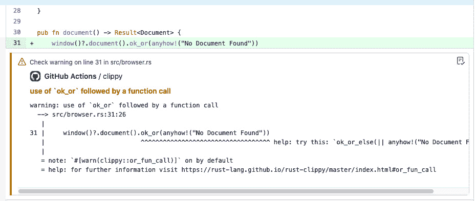

# *第十章*：持续部署

传统的游戏发布方式是创建一个主副本的构建版本，并将其发送到制造工厂。这在游戏行业内外经常被称为**黄金版**，如果你正在制作一个将被发送到游戏机并在商店销售的 AAA 游戏，情况也是如此。这个过程既耗时又极其昂贵；幸运的是，我们不必这样做！《Walk the Dog》是一款基于网页的游戏，我们需要将其发布到网站上。由于我们是在部署到网络上，我们可以使用所有最佳的网络实践，包括持续部署，这意味着我们可以直接从源代码控制中部署任何我们想要的构建版本。

在本章中，我们将涵盖以下主题：

+   创建**持续集成**/**持续交付**（**CI**/**CD**）管道

+   部署测试和生产构建

当本章完成时，你将能够将你的游戏发布到网络上！否则你怎么能变得富有和出名呢？

# 技术要求

除了 GitHub 账户外，你还需要一个 Netlify 账户。这两个账户都有显著的免费层，所以如果成本成为问题，那么恭喜！你的游戏起飞了！你还需要熟悉 Git。你不需要成为专家，但你需要能够创建仓库并将它们推送到 GitHub。如果你对 Git 一无所知，那么 GitHub 的*入门指南*是一个不错的起点：[`docs.github.com/en/get-started`](https://docs.github.com/en/get-started)。本章的示例代码可在[`github.com/PacktPublishing/Game-Development-with-Rust-and-WebAssembly/tree/chapter_10`](https://github.com/PacktPublishing/Game-Development-with-Rust-and-WebAssembly/tree/chapter_10)找到。

查看以下视频，看看代码的实际应用：[`bit.ly/3DsfDsA`](https://bit.ly/3DsfDsA)

# 创建一个 CI/CD 管道

当你在本地运行`npm run build`时，发布构建版本会被放入`dist`目录中。理论上，你可以将那个目录复制到某个服务器上以部署你的应用程序。只要服务器知道`wasm` `MIME`类型，这就会起作用，但手动复制到目录是一种非常过时的软件部署方式。如今，我们在服务器上自动化构建和部署，包括已经提交到源代码控制中的额外代码。这比传统方式复杂得多，那么为什么它更好呢？

以这种方式自动化构建的实践通常被称为 CD，其定义相当广泛。请看以下来自[`continuousdelivery.com`](https://continuousdelivery.com)的引用：

持续交付是将所有类型的更改（包括新功能、配置更改、错误修复和实验）安全、快速且可持续地部署到生产环境或用户手中的能力。

你可能会读到这里并认为，从你的机器的 `dist` 目录复制到服务器上确实是那样，但事实并非如此。在手动部署时可能会出现一些问题。我们在这里列出了一些：

+   文档可能错误或缺失，意味着只有一个人知道如何部署。

+   部署的代码可能与源控制中的代码不同。

+   部署可能仅基于本地配置，例如个人机器上存在的 `rustc` 版本。

有许多更多原因说明为什么你不应该在本地简单地运行 `npm run build` 然后复制粘贴到服务器上。但当一个团队规模较小时，说“我稍后再处理”是非常诱人的。而不是听从那个小声音，让我们尝试思考部署的哪些特性是安全且快速的，正如定义所说。我们可以从一些前面的要点相反开始。如果这些是手动部署不满足 CD 的原因，那么一个符合资格的过程将能够做到以下几点：

+   自动化流程，以便团队中的每个人都可以重复执行。

+   总是从源控制中部署。

+   在源控制中声明配置，以确保它永远不会错误。

正确的 CD 流程远不止前面列表中的内容。事实上，“完美”的 CD 往往更像是一个要达到的目标，而不是一个你达到的最终状态。由于我们是一个人的乐队，我们不会从 *持续交付* 书籍（[`amzn.to/32bf9bt`](https://amzn.to/32bf9bt)）中的每一个要点开始，但我们会创建一个 `main` 分支，并将其部署到生产站点。为此，我们将使用两种技术：GitHub Actions 和 Netlify。

注意

CI 指的是频繁地将代码合并到主分支（在 Git 术语中为 `main`）并运行所有测试，以确保代码仍然工作。CI/CD 是将集成和交付实践结合起来的缩写，尽管它有点冗余，因为 CD 已经包含了 CI。

GitHub Actions 是来自 GitHub 的相对较新的技术。它在将分支推送到 GitHub 时用于运行任务。它非常适合运行 CI/CD，因为它直接构建在我们已经使用的源控制系统中，并且有一个相当不错的免费层。如果你决定使用不同的工具，例如 Travis CI 或 GitLab CI/CD，你可以使用这个实现来指导你如何使用那些其他工具。到目前为止，相似之处多于不同之处。

在 GitHub Actions 上运行 CI 后，我们将部署到 Netlify。你可能想知道，如果我们声称的目标是减少新技术数量，为什么我们还要使用 Netlify，那是因为，虽然我们可以直接部署到 GitHub Pages，但那不会支持创建测试构建。在我看来，良好的 CD 流程的一个重要部分是能够创建可以实验和尝试的生产类似构建。Netlify 将提供这种功能。如果你的团队已经超过一个人，你将能够在代码审查 PR 的过程中尝试游戏。此外，Netlify 默认支持 Wasm，这很方便。

注意

在 GitHub 的术语中，PR 是你希望合并到 `main` 分支的分支。你创建一个 PR 并请求审查。这个分支在允许合并到 `main` 分支之前可以运行其他检查。其他工具，如 GitLab，将这些称为 **合并请求**（**MRs**）。我倾向于坚持使用 PR 这个术语，因为我已经习惯了。

我们的流水线将会相当简单。在每次推送到 PR 分支时，我们将检出代码，构建并运行测试，然后将代码推送到 Netlify。如果构建是分支构建，你将获得一个临时 URL 来测试该构建。如果推送的是 `main`，那么它将部署一个发布构建。在未来，你可能希望在生产部署方面有更多的严谨性，例如用发布说明标记发布，但这应该足以让我们开始。

第一步是确保构建机器使用与我们本地相同的 Rust 版本。`rustup` 工具允许你安装多个 Rust 编译器的多个版本以及多个工具链，你需要确保团队中的每个人都以及 CI 都使用相同的 Rust 版本。幸运的是，`rustup` 提供了多种实现方式。我们将使用 `toolchain` 文件，这是一个指定当前项目工具链的文件。除了确保任何构建此软件包的机器都将使用相同的 Rust 版本外，它还记录了用于开发的 Rust 版本。每个 Rust 项目都应该有一个这样的文件。

注意

在撰写本章时，我发现我在第一稿的 *第一章* 中犯了一个错误，*Hello WebAssembly*。我没有记录正在使用的 Rust 版本，也没有确保安装了 `wasm32-unknown-unknown` 工具链。这些正是当你尝试设置 CI 构建时出现的错误类型，因为你已经忘记了所有那些早期假设，这也是为什么拥有 CI 构建很重要的原因之一。遗憾的是，你总是会忘记文档，但构建机器不会说谎。这就是为什么我经常在项目开始时设置 CI 的原因。

`toolchain` 文件命名为 `rust-toolchain.toml`，并保存在软件包的根目录中。我们可以创建一个如下所示的文件：

```rs
[toolchain]
channel = "1.57.0"
targets = ["wasm32-unknown-unknown"]
```

上述工具链说明我们将使用 Rust 编译器的`1.57.0`版本和`wasm32-unknown-unknown`目标，这样我们就可以确保能够编译成 WebAssembly。现在我们已经确保了使用的 Rust 版本，我们就可以开始在 GitHub Actions 中设置 CI/CD 流水线。你可以尝试使用新版本，但这里使用的是经过测试的`1.57.0`。

## GitHub Actions

就像许多其他 CI/CD 工具一样，GitHub Actions 是由你的源仓库中的配置文件定义的。当你创建第一个配置文件，在 Actions 中称为*工作流程*时，GitHub 会将其识别，然后启动一个*运行器*。你可以在 GitHub 仓库的**操作**标签页中查看输出。以下截图显示了我在编写本章时该标签页的样子：


图 10.1 – 绿色构建

这是一个在 GitHub 上运行的示例工作流程，其中我已更新部署版本以使用 Node.js 的长周期版本。你必须去**操作**标签页查看*工作流程*的结果，这有点遗憾。我想营销赢了。听到*工作流程*和*流水线*这样的术语也有些令人困惑。*工作流程*是 GitHub Actions 的一个特定术语，指的是通过我们接下来要构建的配置在其基础设施上运行的一系列步骤。*流水线*是 CD 术语，指的是部署软件所需的一系列步骤。所以，如果我在 GitHub Actions 上运行并使用他们的术语，我可以有一个由一个或多个工作流程组成的流水线。这个流水线将由一个工作流程组成，所以你可以互换使用它们。

要开始构建我们的流水线，我们需要确保我们有一个用于“遛狗”的 GitHub 仓库。你可能已经有了，如果没有，你有两个选择：

+   从现有的代码创建一个新的仓库。

+   分叉示例代码。

你可以选择其中之一，但如果你一直写的代码在某处仓库中不存在，那就太遗憾了。如果你决定从我的仓库中分叉，那么请确保你从*第九章**，测试、调试和性能*的示例代码[`github.com/PacktPublishing/Game-Development-with-Rust-and-WebAssembly/tree/chapter_9`](https://github.com/PacktPublishing/Game-Development-with-Rust-and-WebAssembly/tree/chapter_9)进行分叉。否则，所有的工作都将为你完成。在任何情况下，从现在开始，我将假设你的代码已经在 GitHub 上的某个仓库中。

提示

如果在任何时候你感到困惑，你可以查阅 GitHub Actions 文档[`docs.github.com/en/actions/learn-github-actions/understanding-github-actions`](https://docs.github.com/en/actions/learn-github-actions/understanding-github-actions)。我们将尽量保持工作流程简单，所以你不需要成为 Actions 专家。

我们可以用一种 GitHub Actions 的“Hello World”来开始设置工作流程。这个工作流程将简单地检查代码，在推送后几乎立即变绿。创建一个名为 `.github/workflows/build.yml` 的文件，并向其中添加以下 YAML：

```rs
on: [push]
name: build
jobs:
  build:
    runs-on: ubuntu-latest
    steps:
      - uses: actions/checkout@v2
```

**YAML**（**另一种标记语言**）是许多 CI/CD 管道的标记语言。如果你以前从未见过它，请注意它对空白字符敏感。这意味着，有时如果你从文件复制粘贴到另一个文件，或者从一本书复制到代码中，它可能不是语法正确的。在这里，我每个制表符使用两个空格，这是标准格式，YAML 不允许使用制表符。

小贴士

YAML 主要是可以自我解释的，而且它也不是本章的重要收获。所以，如果你对某些 YAML 语法感到困惑，可能不值得担心。但以防万一，有一个相当不错的 YAML 技巧表可以在 [`quickref.me/yaml`](https://quickref.me/yaml) 找到。

在大多数情况下，你可以将 YAML 读取为键值对的列表。这个工作流程从 `on` 键开始，它将在每次 `push` 事件上运行这个工作流程。它是一个数组，所以你可以为多个事件设置工作流程，但我们不会这么做。下一个键 `name` 给工作流程一个名字。然后，我们添加 `jobs` 键，它将只有一个工作。在我们的例子中，它是 `build`。我们指定我们的工作在 `ubuntu-latest` 上运行，使用 `runs-on` 键。然后，最后，我们定义它的步骤列表。这个工作目前只有一个步骤，`uses: actions/checkout@v2`，这值得深入解释。每个步骤可以是 shell 命令，或者——你猜对了——一个 *动作*。你可以创建自己的动作，但大多数动作都是由 GitHub 社区创建的；它们可以在 GitHub Actions 市场找到。

你可能能够猜到 `actions/checkout@v2` 检查代码，而且你是对的。但你可能想知道它是从哪里来的，以及你应该如何知道它。这就是 Actions 市场发挥作用的地方，可以在 [`github.com/marketplace?type=actions`](https://github.com/marketplace?type=actions) 找到：


图 10.2 – Actions 市场 place

你的工作流程由一系列按顺序运行的步骤组成，其中大部分可以在 GitHub 市场找到。不要让“市场”这个名字欺骗了你；动作不需要花钱。它们是开源项目，免费如啤酒。让我们深入了解我们将要使用的第一个动作 ([`github.com/marketplace/actions/checkout`](https://github.com/marketplace/actions/checkout))：


图 10.3 – Checkout

检出操作几乎可以在每个工作流程中找到，因为它在没有首先检出代码的情况下很难做任何事情。如果你浏览这个页面，你会看到关于该操作的完整功能文档，以及一个写着**使用最新版本**的大绿色按钮。如果你点击那个按钮，会呈现一个小片段，展示如何将操作集成到你的工作流程中：


图 10.4 – 复制并粘贴我！

这些操作是工作流程的构建块。在 GitHub Actions 中设置 CI/CD 管道意味着在市场上搜索，将操作添加到你的工作流程中，并阅读文档。这比过去我使用的 Bash 脚本混乱要容易得多，尽管不必担心，你仍然可以调用可靠的 Bash 脚本。

注意

我想强调，这并不是要表明 GitHub Actions 优于其他任何 CI/CD 解决方案。如今，有这么多优秀的工具可以用于这项工作，很难推荐一个工具而不是另一个。多年来，我相当多地使用了 Travis CI 和 GitLab CI/CD，它们也非常出色。话虽如此，GitHub Actions 也非常出色。

如果你提交这个更改并将其推送到你的仓库内的一个分支（现在不要使用`main`），你可以检查**操作**选项卡以查看工作流程成功运行，如下面的截图所示：


图 10.5 – 检出代码

我们已经检出了代码，现在我们需要在 GitHub *runner*上构建它。runner 只是一个机器的别称。要在本地机器上构建 Rust，你需要安装`rustup`程序，并带有已安装的编译器和工具链。我们可以运行一系列 shell 脚本；然而，我们将查看市场上是否有任何 Rust 操作。我不会让你悬而未决——在[`actions-rs.github.io/`](https://actions-rs.github.io/)可以找到一个完整的 Rust 相关操作库。这是一个很棒的集合，这将使我们的构建更容易。我们将添加以下步骤：

+   安装工具链 ([`actions-rs.github.io/#toolchain`](https://actions-rs.github.io/#toolchain))。

+   安装 wasm-pack ([`actions-rs.github.io/#install`](https://actions-rs.github.io/#install))。

+   运行 Clippy ([`actions-rs.github.io/#clippy-check`](https://actions-rs.github.io/#clippy-check))。

上述链接将带你去每个操作的官方文档，所有这些文档都是由 Nikita Kuznetsov ([`svartalf.info/`](https://svartalf.info/))创建和维护的。由于每个操作都在 YAML 中指定，它可以使用它喜欢的任何键。潜在地，这意味着有很多标志和配置需要记录，但我们将坚持使用简单的标志。

那么，我们还在等什么呢？让我们添加安装工具链所需的步骤，如下所示：

```rs
steps:
  - uses: actions/checkout@v2
  - uses: actions-rs/toolchain@v1
     with:
       toolchain: 1.57.0
       target: wasm32-unknown-unknown
       override: true
       components: clippy
```

我在示例中保留了 checkout 步骤以供参考，但我们添加的代码以 `- uses: actions-rs/toolchain@v1` 开始。`-` 字符很重要——这是 YAML 语法中序列条目的表示。所以，步骤 1 是第一行 `- uses: actions/checkout@v2`。步骤 2 以 `uses: actions-rs/toolchain@v1` 开始，这是我们使用的动作的名称。请注意，下一行 `with:` 前面没有减号。这是因为它是同一步骤的一部分，这是一个具有 `uses:` 和 `hash:` 键的 YAML 哈希。这些字段必须对齐，因为 YAML 对空白字符敏感。如果你对 YAML 仍然感到困惑，我建议你不要想得太多；它实际上只是一个简单的纯文本标记格式，它以它看起来的方式工作。

依次，`with` 键被设置为另一个包含 `toolchain`、`target`、`override` 和 `components` 键的映射。它们设置了 `toolchain`（1.57.0）和 `target`（wasm32-unknown-unknown）的值，并确保安装了 `clippy` 组件。最后，`override: true` 标志确保这个版本的 Rust 是在这个目录中的版本。

通过这个步骤，你已经添加了所需的工具链。然而，如果你在工作流程中尝试运行构建，它仍然会失败，因为你还没有在构建机器上安装 `wasm-pack`。你可以按以下方式添加这个步骤：

```rs
- uses: actions-rs/install@v0.1
   with:
     crate: wasm-pack
     version: 0.9.1
     use-tool-cache: true
```

你可能已经开始看到模式了。一个新的步骤以 `-` 字符开始，并 `使用` 一个动作。在这种情况下，它是 `actions-rs/install@v0.1`。它的参数是 `wasm-pack` 包，版本 0.9.1。然而，我们还指定了重要的 `use-tool-cache`，这将确保如果该版本的 `wasm-pack` 可以使用预构建的二进制文件，它将这样做。这可以节省你几分钟的构建时间，所以尽可能使用它。

因此，我们准备构建 WebAssembly，但在我们开始担心构建 Wasm 之前，还有一件事要做，那就是运行 Clippy。当我们它在 *第九章* 中运行时，*测试、调试和性能*，我们手动运行了一次，但将这种代码检查集成到构建中以便及早捕获这类错误是很重要的。通常，我甚至在我的独立项目中也会安装这种检查，因为我忘记在本地运行它。我们可以像这样添加这个步骤：

```rs
- name: Annotate commit with clippy warnings
   uses: actions-rs/clippy-check@v1
     with:
       token: ${{ secrets.GITHUB_TOKEN }}
```

在这个例子中，我保留了 `name` 字段，它直接来自 [`actions-rs.github.io/#clippy-check`](https://actions-rs.github.io/#clippy-check) 文档。这是因为当它运行时，这个名字将出现在 GitHub Actions UI 上，我可能会忘记 `clippy-check` 是什么。它需要的唯一参数是 `token` 字段，设置为魔法 `${{ secrets.GITHUB_TOKEN }}` 字段。该字段将展开为你的实际 GitHub API 令牌，这是 GitHub Actions 在每次工作流程运行时自动生成的。这个令牌是必要的，因为此操作实际上可以注释提交中 Clippy 生成的任何警告，因此它需要能够写入存储库。以下截图显示了这样一个例子，我故意引入了一个 Clippy 错误：


图 10.6 – GitHub Actions 中的 Clippy 错误

这个错误也出现在提交本身中：



图 10.7 – 提交中的 Clippy 错误

这个功能很棒，但除非你正在写一本书，否则不要引入 Clippy 错误来炫耀；否则，这并不安全。现在我们已经检查了 Rust 代码中的惯用错误，是时候构建和运行测试了。由于这是一个 Wasm 项目，为此步骤，我们需要 Node.js。

## Node.js 和 webpack

`actions-rs` 家族的操作是为 Rust 代码设计的，因此在 `actions` 的末尾添加了 `-rs`。因此，我们需要在其他地方查找来安装 Node.js。幸运的是，安装 Node.js 是如此普遍，以至于它是 GitHub 提供的默认操作之一。我们可以添加另一个步骤来设置 Node.js，如下所示：

```rs
- uses: actions/setup-node@v2
   with:
     node-version: '16.13.0'
```

GitHub 提供的任何操作都可以在 `actions` 存储库中找到，这个操作叫做 `setup-node`。在这种情况下，我们只需要一个参数，`node-version`，我已经将其设置为 `setup-node` 步骤。它们看起来如下：

```rs
- run: npm install
- run: npm test
- run: npm run build
```

注意，这些步骤中没有一个有 `uses` 键——它们只是调用 `run`，这会按照在 shell 中编写的命令运行。由于已经安装了 Node.js，你可以安全地假设 `npm` 也是可用的，并在你的工作流程中作为三个额外的步骤安装、测试和运行构建。这是一个提交你的工作流程并尝试它的好时机。

小贴士

在提交和推送代码之前，运行它通过一个 YAML 语法验证器可能会有所帮助。这不能保证它在 GitHub Actions 中有效，但至少可以确保它是有效的 YAML 语法，并防止在缩进中推送简单的错误而浪费时间。[`onlineyamltools.com/validate-yaml`](https://onlineyamltools.com/validate-yaml) 是一个简单的在线示例，Visual Studio Code 在 [`marketplace.visualstudio.com/items?itemName=redhat.vscode-yaml`](https://marketplace.visualstudio.com/items?itemName=redhat.vscode-yaml) 提供了一个插件。

这个构建可能会在`-run: npm test`时失败，以下错误被突出显示：

```rs
Error: Must specify at least one of `--node`, `--chrome`, `--firefox`, or `--safari`
```

在*第九章*，“测试、调试和性能”中，我们使用`wasm-pack test --headless --chrome`命令运行了基于浏览器的测试。构建脚本运行`npm test`，这对应于在*第一章*，“Hello WebAssembly”中为我们创建的`package.json`文件中的测试脚本。如果这个文件名听起来不熟悉，那是因为我们还没有花时间在上面。打开它，你会看到测试条目，它应该看起来像这样：

```rs
{
  ...
  "scripts": {
    "build": "rimraf dist pkg && webpack",
    "start": "rimraf dist pkg && webpack-dev-server --open 
       -d --host 0.0.0.0",
    "test": "cargo test && wasm-pack test --headless"
  },
...
} 
```

在前面高亮的代码中，你可以看到它运行了`cargo test`然后是`wasm-pack test --headless`，但没有指定浏览器。这就是我们的构建错误！你可以通过将`--chrome`添加到传递给`wasm-pack test`的参数列表中，并将其推送到 GitHub 来修复它。

注意

有可能这个代码在项目骨架的新版本中已经被修复，所以你没有看到这个错误。如果是这样，你已经完成了——恭喜！了解`npm test`背后正在运行的任务仍然是有用的。

到目前为止，你应该有一个大约需要 4 分钟的构建，这比我想的小项目要长一点，但我们把优化构建留给 DevOps 团队。你已经完成了本节 CI 步骤，现在可以继续 CD 部分。

# 部署测试和生产构建

对于部署，我们将使用 Netlify，这是一家专注于`main`的云计算公司，它将执行生产构建。在这里，生产被定义得比较宽松，因为我们不会深入讨论诸如为您的应用获取自定义域名或监控错误等任务，但这是将公开可用的应用版本。

为了从 GitHub 部署到 Netlify，我们不得不做一些配置，以便 GitHub 可以访问您的 Netlify 账户，并且我们有一个可以推送的网站。因此，我们将使用 Netlify CLI 来设置一个网站并为其 GitHub 推送做准备。我们不会使用 Netlify 提供的内置 Netlify-GitHub 连接，因为它除非你是管理员，否则不适用于存储库。在这种情况下，如果你使用其他 Git 提供商，这也更适用，因为 Netlify CLI 可以与它们中的任何一个一起工作。

注意

有一个论点可以提出，我们在这里没有练习 CD，因为我们不会在我们的机器上完全配置像 Ansible 或 Terraform 这样的工具。Netlify 配置是不可丢弃的，所以它不是 CD 或 DevOps。这是真的，但这本书不是关于如何在代码中配置 Netlify 的，所以我们不会在这里关心这个问题。我们不得不在某处划一条线。

第一步是安装 CLI 本身，这可以通过在根目录下运行`npm install netlify-cli --save`来完成。这将本地安装`netlify-cli`，位于此项目的`node_modules`目录中，因此它不会污染你的本地环境。`--save`标志会自动将`netlify-cli`添加到`package.json`中依赖项列表。

小贴士

如果你运行 Netlify CLI 时遇到问题，请确保你使用的是 Node.js 的`16.13.0`版本或更高版本。早期版本存在一些问题。

安装 Netlify CLI 后，你需要调用`npm exec netlify login`来登录你的 Netlify 账户。在撰写本文时，`npm exec`是确保你使用本地`netlify`命令的方式，但你也可以使用`npx`或直接调用`node_modules\.bin`中的副本。这可能会在未来再次改变，所以最好在 Google 上搜索一下。重要的是，除非你知道自己在做什么，否则你可能不想安装全局版本的`netlify`命令。

当你调用`npm exec netlify login`时，它将通过网页浏览器引导你完成登录过程。然后，你将想要调用`npm exec netlify init -- --manual`。中间添加`--`很重要，这样`--manual`就会传递给`netlify`命令，而不是`npm exec`。你将想要选择`rust-games-webassembly`。你的构建命令是`npm run build`，要部署的目录是`dist`。你可以接受默认设置，直到说明说**给这个 Netlify SSH 公钥访问你的仓库**。然后，你将想要复制提供的密钥并将其添加到 GitHub 下的你的仓库的**设置** | **部署密钥**页面，如下面的截图所示：


图 10.8 – 部署密钥

你可以接受默认设置，但不要配置提供的`webhook`设置。虽然你可以这样做，但我想要确保只有当构建通过时才推送测试构建，所以我们将这添加到 GitHub Actions 中。这也将更多的行为保留在源代码控制中。这是因为我们将在工作流程步骤中明确地推送到 Netlify，而通过 GitHub GUI 进行配置意味着可能会有更多我们可能会忘记的设置。

当命令完成时，你应该会看到一个显示**成功！Netlify CI/CD 已配置**的消息。它会告诉你，当你向这些分支推送时，它们将自动部署。由于我们没有设置 webhook，这是不正确的，还有更多的事情要做。

注意

当然，自本书出版以来，CLI 可能已经更改了其界面。重要的是你想要在 Netlify 中创建网站，并且不想要设置 webhook，因为我们将使用 GitHub Actions。如果选项已更改，你可以查看官方 Netlify 文档，网址为 [`docs.netlify.com/cli/get-started/`](https://docs.netlify.com/cli/get-started/)。

要将部署到 Netlify 的步骤添加到工作流程中，我们需要在工作流程中添加一个步骤。该步骤如下：

```rs
- name: Deploy to Netlify
  uses: nwtgck/actions-netlify@v1.2
  with:
    publish-dir: './dist'
    production-branch: main
    github-token: ${{ secrets.GITHUB_TOKEN }}
    deploy-message: "Deploy from GitHub Actions"
    enable-pull-request-comment: true
    enable-commit-comment: true
    overwrites-pull-request-comment: true
  env:
    NETLIFY_AUTH_TOKEN: ${{ secrets.NETLIFY_AUTH_TOKEN }}
    NETLIFY_SITE_ID: ${{ secrets.NETLIFY_SITE_ID }}
  timeout-minutes: 1
```

我们使用的是 `nwtgck/actions-netlify@v1.2` 动作，因为它有一个酷炫的功能，就是可以在执行部署的提交上评论。还有其他使用 Netlify 的动作，如果你愿意，你可以在安装 CLI 后使用 `runs` 命令。有很多选项，所有这些都应该被视为设置此工作流程的一种示例，而不是实际设置它的方式。

前几个标志有些是自我解释的。构建目录是 `dist`，所以这就是我们将要发布的。生产分支是 `main`，我们还需要再次使用 `github-token`，以便操作可以注释提交。接下来的三个标志将启用一个 PR 注释，告诉你应用部署到了哪里。将相同的注释放在评论上，然后如果你部署同一个分支多次，覆盖 `pull-request-comment`。我们已经将这些全部设置为 true。

这两个 `env` 字段可能是最令人困惑的，因为它们指定了一个你还没有的 `NETLIFY_AUTH_TOKEN` 令牌和 `NETLIFY_SITE_ID` 网站 ID。网站 ID 是两者中更容易找到的，你可以通过图形用户界面或命令行界面来获取它。要从命令行界面获取它，请在命令提示符中运行 `npm exec netlify status`。你应该会得到一个看起来像这样的输出：

```rs
$ npm exec netlify status
 ──────────────────────┐
 Current Netlify User  │
 ──────────────────────┘
Name:  You
Email: you@gmail.com
Teams:
                                    Your team: Collaborator
────────────────────┐
 Netlify Site Info  │
────────────────────┘
Current site: site-name
Admin URL: https://app.netlify.com/sites/site-name
Site URL: https://site-name.netlify.app
Site Id:  SITE_ID
```

最后一行显示了你的 `NETLIFY_SITE_ID` 网站 ID。然后你可以将那个网站 ID 添加到 GitHub 仓库的 `Secrets` 部分中，它位于 `NETLIFY_SITE_ID`：


图 10.9 – 在 GitHub 中设置网站 ID

此外，你还需要一个个人访问令牌来访问部署。在 Netlify UI 中找到它有点棘手，但它确实在**用户设置**下，你可以通过点击屏幕右上角的用户图标来找到它：


图 10.10 – 用户设置

然后，选择**应用程序**，而不是**安全**，你将看到**个人访问令牌**部分，如下面的截图所示：


图 10.11 – 个人访问令牌

你可以看到 `Netlify Deploy` 或类似的内容。复制该令牌并将其添加到 GitHub 的秘密中，这次命名为 `NETLIFY_AUTH_TOKEN`：


图 10.12 – 显示两个密钥

一旦你添加了这两个键，你就可以将更改提交到工作流程，将它们推上去，你将收到来自 GitHub Actions 机器人的电子邮件，告诉你你的应用程序已被部署到一个测试 URL。它也被注释到了提交中，你可以在下面的屏幕截图中看到：


图 10.13 – 部署以测试

或者，你可以访问样本仓库，在那里你可以看到评论在 [`bit.ly/3DR1dS5`](https://bit.ly/3DR1dS5)。提交信息中的部署链接将不再工作，因为它是一个测试 URL，但它曾经是有效的。这让我们还有另一件事要测试。到目前为止，我们一直在向一个分支推送——至少，如果你注意到了，你应该会这样——但如果我们将部署到 `main` 分支，我们将得到一个生产部署。你可以以任何你喜欢的方式将你的代码推送到 `main`，本地合并，然后推送或创建一个 PR。无论如何，你只需要将一个分支推送到 `main`，你应该会得到一个生产部署。

我知道我做到了——你可以在 [`rust-games-webassembly.netlify.app/`](https://rust-games-webassembly.netlify.app/) 上玩“Walk the Dog”。我们发布了！

# 摘要

我提到我们发布了吗？在本章中，我们为“Walk the Dog”游戏构建了一个小型但功能齐全的 CI/CD 管道。我们学习了如何创建 GitHub Actions 工作流程，并参观了如何在市场上找到操作。此外，我们开始在 Netlify 上创建测试和生产部署。我们甚至在完成后会收到电子邮件！你可以扩展这个流程来做诸如仅在 PR 上进行测试构建或添加集成测试之类的事情，你可以将其用作其他系统上不同 CI/CD 管道的模型。本章虽然简短，但至关重要，因为游戏实际上必须发布。

当然，虽然游戏可能已经发布，但它永远不会完成。在下一章中，我们将讨论一些你可以承担的挑战，以使你的“Walk the Dog”版本优于书本版本。我迫不及待地想看看你会做什么！
