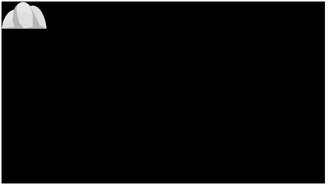
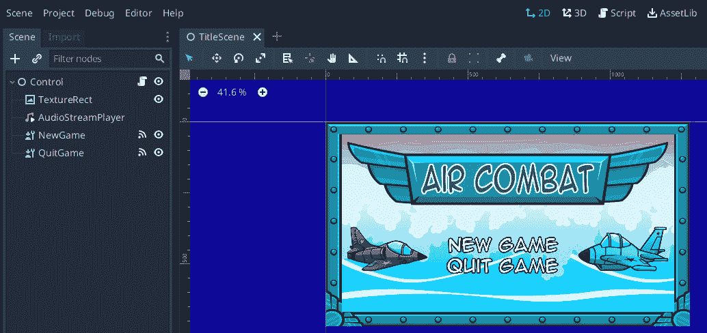

# 第十一章：*第十一章*：更多资源和下一步是什么？

如果你已经通读了这本书的每一部分，阅读并编写了代码，那真是太棒了！我相信没有更好的学习方法，现在你有一个可以运行的游戏。此外，你可能花了大量时间在犯错时调试，在想要娱乐时调整，对那些没有解释得很好的陌生部分感到困惑。然而，你可能还在想你是否真的学到了什么，或者你只是复制/粘贴了我所写的内容而没有理解。不用担心——这是正常的，这就是为什么我们要进行一点回顾。

在本章中，我们将涵盖以下内容：

+   一个具有挑战性的回顾

+   更多资源

本章完成后，你将验证你所学的知识，我希望能在网上看到你的游戏！

# 技术要求

本章包含少量代码，可在[`github.com/PacktPublishing/Game-Development-with-Rust-and-WebAssembly/tree/chapter_11`](https://github.com/PacktPublishing/Game-Development-with-Rust-and-WebAssembly/tree/chapter_11)找到。

游戏的最终版本也可在[`github.com/PacktPublishing/Game-Development-with-Rust-and-WebAssembly`](https://github.com/PacktPublishing/Game-Development-with-Rust-and-WebAssembly)找到，游戏的部署生产版本在[`rust-games-webassembly.netlify.app/`](https://rust-games-webassembly.netlify.app/)。

要完成这个挑战，你需要[`github.com/PacktPublishing/Game-Development-with-Rust-and-WebAssembly/wiki/Assets`](https://github.com/PacktPublishing/Game-Development-with-Rust-and-WebAssembly/wiki/Assets)中资产的最新版本。

查看以下视频，了解代码的实际应用：[`bit.ly/3JVabRg`](https://bit.ly/3JVabRg)

# 一个具有挑战性的回顾

在书中审查代码是一个奇怪的概念；毕竟，你可以直接翻到前面的章节来回顾你学到的知识，那么现在为什么要重复呢？同时，我教过很多课程，如果有一件事是一致的，那就是有时候聪明的学生静静地坐着，倾听，点头，然后离开教室，对你说的话一无所知。唯一获得理解的方法是将我们迄今为止所练习的知识应用于构建。幸运的是，我们正好有这个工具。

## 狗发生了什么事？

在*第二章*，*绘制精灵*中，我们进行了一次快速的游戏设计会议，描述了我们的小**红帽男孩**（**RHB**）是如何追逐他的狗，而那只狗被一只猫吓到了。然而，在接下来的九个章节中，狗的身影却从未出现。简单来说，添加狗和猫所需的知识点并不多，而且如果添加它们可能会显得多余。添加它们将是一个很好的方式来巩固你所学的知识，也许还能在学习过程中学到一些新技巧。为了添加狗，需要以下几个步骤，这里故意以高层次概述：

1.  将狗精灵图集放入游戏：你需要将精灵图集放入游戏，这个图集位于`sprite_sheets`文件夹中的`assets`目录，名为`dog_sheet`。这是狗在奔跑动画中的样子，准备好被放置到游戏中。查看*第二章*，*绘制精灵*，以提醒自己这是如何工作的。

添加狗`struct`：游戏中需要有一个狗`struct`作为众多游戏对象之一。它看起来会与`RedHatBoy`对象相似，正如你可能猜到的，这意味着你可能需要使用状态机，正如我们在*第四章*，*使用状态机管理动画*中提到的。你会用状态机做什么？确保狗在游戏开始时向右走，当 RHB 发生碰撞时，它会转身跑回 RHB。你需要为向右跑和向左跑设置状态。狗也应该在开始时保持静止，确保在 RHB 追逐之后的一段时间内才开始奔跑。

1.  扩展`WalkTheDogStateMachine`：为了让狗保持静止，以及让 RHP 忽略用户指令，你需要将`WalkTheDogStateMachine`扩展到`Ready`状态之外。我们已经在*第八章*，*添加用户界面*中涵盖了所有这些内容。

当然，这是一种添加狗的简单方法，但作为一个视频游戏，你的想象力是唯一的限制。可能最简单的事情就是让狗跑出屏幕，然后在 RHB 倒下后跑回来。你也可以让狗保持在屏幕上，并像玩家尝试的那样安全地导航平台。这将意味着需要更多的更改。

1.  向无尽跑酷游戏添加提示：在*第六章*，*创建无尽跑酷*中，我们根据玩家的位置和随机值创建了游戏的部分。每个部分也可以为狗添加“提示”，这样狗就知道何时跳跃以绕过各种障碍。

1.  确保狗会吠叫：作为一个狗的主人，我知道它们的一个特点——它们不是*安静的*。我们的狗应该发出声音，比如吠叫，使用我们在*第七章*中提到的相同技术，*声音效果和音乐*。你还可以添加一些跑步声音效果，以及当用户未能通过平台或撞到岩石时的碰撞声。

1.  记分：这个游戏实际上并没有记分，但它可以。它使用基于时间的模型，玩家存活时间越长，得分就越高，每次玩家在平台上完成跳跃或滑行穿过箱子时，都会增加奖励。有大量的选择。你将在我们最初在*第三章*中实现的`Game`对象中保持这个分数，*创建游戏循环*，并使用我们在*第八章*中使用的相同技术显示它，*添加用户界面*。

1.  使用滑行：除了我们迄今为止使用的那些小岛和岩石之外，瓦片精灵图集还有更多的图形。我们还有一个滑行动画，但我们没有足够短的东西可以滑行。使用*第六章*中提到的技术，*创建无限跑酷游戏*，设置一个玩家可以滑行的段落。

这是个陈词滥调，但限制真的是你的想象力。多年前，我教了一个 HTML5 游戏开发的研讨会，我给学生提供了一个*Asteroids*克隆版作为起点。其中一个人下周就带着一个类似马里奥的平台游戏回来了！

小贴士

记住，这本书的每一章都可以从仓库的 Git 标签[`github.com/PacktPublishing/Game-Development-with-Rust-and-WebAssembly`](https://github.com/PacktPublishing/Game-Development-with-Rust-and-WebAssembly)中访问。此外，主分支包含整个游戏，包括我完成这些挑战时的解决方案。如果你这本书买得早，你甚至可以看到我现场工作在[www.twitch.tv/paytonrules](http://www.twitch.tv/paytonrules)。

# 更多资源

在完成这个游戏并完成我刚才提到的挑战之后，也许你想要在下一款游戏中做得更大。我希望你能这样做。你可以添加粒子效果、爆炸或在线记分系统。你还可以将这个框架作为一款完全原创游戏的起点。你也可以决定使用这个游戏作为介绍，并使用一个完全不同的框架开始一个全新的游戏。本节旨在向你展示，如果你想要继续制作游戏，特别是使用 Rust 和 WebAssembly，你现在有哪些选项可用。

## 使用 JavaScript 库

整个游戏都是使用 Rust 作为我们的首选语言编写的，有效地摒弃了整个 JavaScript 生态系统。这是一个有意的选择，但并非唯一的选择。我们也可以从现有的 JavaScript 框架调用 Rust Wasm 库，或者可以使用`wasm-bindgen`从 Rust 代码中调用 JavaScript 库或框架。第一个方法更实用，是向现有 JavaScript 项目引入 Rust 的绝佳方式。第二个方法更有趣，所以自然地，我们将简要地看看这个例子，使用 PixiJS 编写的示例。

### PixiJS

**PixiJS** ([`pixijs.com/`](https://pixijs.com/)) 是一个流行的、高效的 JavaScript 框架，用于在 JavaScript 中制作游戏和可视化。它有一个基于 Canvas 和 WebGL 的渲染器，是获得高性能 2D 图形而不必自己编写 WebGL 着色器的好方法。它支持众多酷炫的功能，比我们游戏中使用 Canvas 要快得多。它有像这样的截图：

(img/Figure_11.01_B17151.jpg)

图 11.1 – 一个纹理网格 (https://bit.ly/3JkhbXw)

它也比我们的引擎复杂得多，这也是本书没有使用它的一个原因，但它在你的*下一个*游戏中尝试是非常棒的。要从 Rust 代码中使用 JavaScript 库，你需要使用`wasm-bindgen`库导入函数，如下所示：

```rs
#[derive(Serialize, Deserialize)]
struct Options {
    width: f32,
    height: f32,
}
#[wasm_bindgen]
extern "C" {
    type Application;
    type Container;
    #[wasm_bindgen(method, js_name = "addChild")]
    fn add_child(this: &Container, child: &Sprite);
    #[wasm_bindgen(constructor, js_namespace = PIXI)]
    fn new(dimens: &JsValue) -> Application;
    #[wasm_bindgen(method, getter)]
    fn view(this: &Application) -> HtmlCanvasElement;
    #[wasm_bindgen(method, getter)]
    fn stage(this: &Application) -> Container;
    type Sprite;
    #[wasm_bindgen(static_method_of = Sprite, js_namespace 
        = PIXI)]
    fn from(name: &JsValue) -> Sprite;
}
// This is like the `main` function, except for JavaScript.
#[wasm_bindgen(start)]
pub fn main_js() -> Result<(), JsValue> {
    let app = Application::new(
        &JsValue::from_serde(&Options {
            width: 640.0,
            height: 360.0,
        })
        .unwrap(),
    );
    let body = 
        browser::document().unwrap().body().unwrap();
    body.append_child(&app.view()).unwrap();
    let sprite = 
        Sprite::from(&JsValue::from_str("Stone.png"));
    app.stage().add_child(&sprite);
    console_error_panic_hook::set_once();
    Ok(())
}
```

我已经隐藏了`use`声明，但这是从我们的游戏中使用 PixiJS 渲染静态屏幕的`lib.rs`版本。现在还没有什么乐趣，但足以展示如何使用`wasm_bindgen`宏和`extern "C" struct`将任何 JavaScript 函数导入到你的 Rust 库中，你可能想使用。这允许你在 Rust 程序中使用任意 JavaScript 代码，只需要一点粘合代码来连接各个部分。实际上，这正是`web_sys`的工作方式，我们一直在各处使用它。

为了使用所有这些 Pixi 代码，你需要添加对`pixi.js` JavaScript 库的引用，而快速且简单的方法是将以下内容添加到`index.html`中：

```rs
<!DOCTYPE html>
<html>
<head>
  <meta charset="UTF-8">
  <title>My Rust + Webpack project!</title>
  <link rel="stylesheet" href="styles.css" type="text/css"
      media=         "screen">
  <link rel="preload" as="image" href="Button.svg">
  <link rel="preload" as="font" href=
  "kenney_future_narrow-webfont.woff2">
  <script src="img/pixi.js">
  </script>
</head>
...
```

在一个专业的部署环境中，你可能想使用 WebPack 将 JavaScript 与你的源代码捆绑在一起，但现在这就可以了。我也已经从 HTML 中移除了我们的 canvas 元素，因为 Pixi 提供了自己的。

在 Rust 代码中，我能够从 `pixi.js` 中导入 `PIXI.Application`、`PIXI.Container` 和 `PIXI.Sprite` 类型，并且我还引入了与它们相关的一些函数。这使得我可以在 `main_js` 中使用它们，就像使用原生的 Rust 代码一样。这里的示例并不专业，到处都在使用 `unwrap`，但它成功地创建了一个 PixiJS 应用程序，并从我们游戏中已有的文件中创建了一个 `Sprite`。然后，它将其添加到 `stage` 中，这是 PixiJS 的一个概念，你可以将其视为画布。这段代码导致了一个看起来像这样的屏幕：



图 11.2 – 一块石头

好吧，看起来并不怎么样，但重点是你可以通过使用 `wasm-bindgen` 声明你需要的类型，在 Rust 项目中使用 PixiJS。我们在这里不会涵盖所有内容，但 `wasm-bindgen` 的文档在 [`rustwasm.github.io/wasm-bindgen/reference/attributes/index.html`](https://rustwasm.github.io/wasm-bindgen/reference/attributes/index.html) 上非常详尽。

更重要的是，也许你不喜欢 PixiJS，而想使用 **PhaserJS**；同样的原则适用！你可以使用任何 JavaScript 程序员可用的优秀框架进行游戏开发，例如 **Three.JS** 和 **Babylon3D**，只要你能在你的 WebAssembly 项目中包含它们。但如果你根本不想使用 JavaScript，但仍想在网络上运行呢？

### Macroquad

**Macroquad** ([`macroquad.rs/`](https://macroquad.rs/)) 是用 Rust 编写的许多游戏开发库之一。作者将其称为“**游戏库**”，这意味着它并不像整个框架那样功能全面，但它比仅仅编写 HTML Canvas 元素的功能要多，就像我们在游戏中做的那样。它支持开箱即用的 WebAssembly，无需编写任何 JavaScript。以下是一个 Macroquad 中代码的示例：

```rs
use macroquad::prelude::*;
#[macroquad::main("BasicShapes")]
async fn main() {
    loop {
        clear_background(RED);
        draw_line(40.0, 40.0, 100.0, 200.0, 15.0, BLUE);
        draw_rectangle(screen_width() / 2.0 - 60.0, 100.0,
            120.0, 60.0, GREEN);
        draw_circle(screen_width() - 30.0, screen_height() 
            - 30.0, 15.0, YELLOW);
        draw_text("HELLO", 20.0, 20.0, 20.0, DARKGRAY);
        next_frame().await
    }
}
```

这个非常简单的示例只需通过指定目标 `cargo build --target wasm32-unknown-unknown` 就可以在网络上编译和运行——没有 JavaScript，没问题。Macroquad 很好，但它并不是一个完整的引擎。那么，如果你想要那种体验呢？

### Bevy

另一个具有更多功能的选项是 **Bevy** ([`bevyengine.org/`](https://bevyengine.org/))，自从其最初发布以来就非常受欢迎，并支持 WebAssembly。它的“Hello World”与 Macroquad 版本非常不同，如下所示：

```rs
use bevy::prelude::*;
fn main() {
    App::new().add_system(hello_world_system).run();
}
fn hello_world_system() {
    println!("hello world");
}
```

这个系统最独特的地方是 `add_system` 函数，它允许你向 Bevy 引擎添加“系统”。Bevy 使用现代的实体组件系统进行开发，旨在帮助您构建程序结构以及提高性能。它正以极快的速度迅速流行起来，并且发展速度超过了其文档的更新速度。目前，如果你想要学习如何使用 Bevy 进行 2D 和 3D 游戏开发，你最好的选择是加入这里的社区：[`bevyengine.org/community/`](https://bevyengine.org/community/)。如果你这样做，你会得到回报，因为 Bevy 是一个非常先进的引擎，但它没有像 Unity3D 或 Unreal 那样的编辑器。如果你在寻找这样的编辑器，幸运的是，你有一个非常好的选择。

### Godot

我第一次在 Rust 中进行游戏开发是使用 Godot 游戏引擎 ([`godotengine.org`](https://godotengine.org))。Godot 是一个真正免费且开源的引擎，受到业余爱好者和专业游戏开发者的喜爱。它自带内置语言 GDScript，无需额外安装，但也能够通过 GDNative 包装器使用 Rust。GDNative 最初是为了允许使用 C 和 C++ 而设计的，它与 Rust 的配合非常出色。它拥有自己繁荣的社区，你可以在以下链接下载它：[`godot-rust.github.io`](https://godot-rust.github.io)。

使用 Godot 将意味着获得一个功能齐全的 2D 和 3D 引擎，其性能可以与 Unity3D 的最佳表现相媲美。在你阅读这本书的整个过程中，你可能一直想看到这样一个合适的商业游戏引擎：



图 11.3 – Godot 游戏引擎

如果是这样，Godot 就是你的选择。要查看用 Rust 编写的示例 Godot 程序，你可以查看我在 [`github.com/paytonrules/Aircombat`](https://github.com/paytonrules/Aircombat) 上写的程序。

# 概述

网站 [`arewegameyet.rs`](https://arewegameyet.rs) 提出了问题，“*Rust 是否准备好进行游戏开发？*”，并以“*几乎准备好了*”作为回答。尊重地说，因为这是一个非常酷的网站，我不同意。我们拥有 JavaScript 开发者在几年前就拥有的所有工具，以及优秀的类型系统和 Wasm 的所有优势。我们拥有的工具比游戏开发历史上大多数开发者拥有的工具都要多，虽然我们可能还没有 Unity 或 Unreal，但我们拥有构建我们自己的所有东西。所以，出去那里，创建你自己的游戏，扩展引擎，享受乐趣！我希望听到你比这个更好的游戏。如果你需要帮助，想要展示你的游戏，或者只是想和志同道合的人一起消磨时光，你可以在 Rustacean Station Discord 上找到我 [`discord.gg/cHc3Gyc`](https://discord.gg/cHc3Gyc)。你总是可以在 Twitter 上找到我作为 `@paytonrules`，我非常期待收到你的来信。
