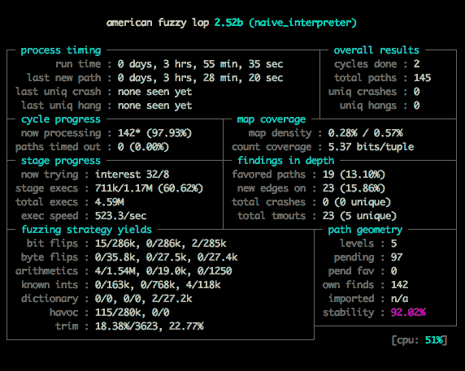

# 顺序 Rust 性能和测试

"先让它工作，然后让它美观，然后如果你真的、真的需要，再让它快速。"

- *乔·阿姆斯特朗*

在上一章中，我们讨论了现代计算机架构的基础——CPU 及其功能、内存层次结构及其相互作用。我们简要介绍了 Rust 程序的调试和性能分析。在本章中，我们将继续这一讨论，深入探讨顺序 Rust 程序的性能特性，暂时推迟对并发性能的考虑。我们还将讨论用于展示 Rust 程序适用性的测试技术。为什么在一本关于并行编程的书中，我们会专门用一整章来讨论顺序程序？我们在这种顺序环境中所讨论的技术适用于并行环境，并且至关重要。在这里我们所获得的是关注的重点——快速且正确——尽管如此，我们将在适当的时候讨论并行编程。同样重要的是要理解，快速并行代码的生产与快速顺序代码的生产是密不可分的。这是因为我们将在整本书中处理的一个冷酷、严峻的数学现实。

到本章结束时，我们将：

+   已经了解了 Amdahl 定律和 Gustafson 定律

+   已经调查了 Rust 标准库`HashMap`的内部结构

+   能够使用 QuickCheck 对替代 HashMap 实现进行随机验证

+   能够使用 American Fuzzy Lop 来演示同一

+   已使用 Valgrind 和 Linux Perf 来检查 Rust 软件的性能

# 技术要求

本章需要安装一个可工作的 Rust 环境。验证安装的详细步骤在第一章，*预备知识——机器架构和 Rust 入门*中有所介绍。这里将使用 Valgrind 工具集。许多操作系统捆绑了 valgrind 包，但您可以在[`valgrind.org/`](http://valgrind.org/)找到您系统的进一步安装说明。Linux Perf 也被许多 Linux 发行版捆绑。本章所需的其他任何软件都将作为文本的一部分安装。

您可以在 GitHub 上找到本书项目的源代码：[`github.com/PacktPublishing/Hands-On-Concurrency-with-Rust`](https://github.com/PacktPublishing/Hands-On-Concurrency-with-Rust)。本章的源代码位于`Chapter02`目录下。

# 递减回报

严峻的事实是，当将越来越多的并发计算资源应用于问题时，回报是递减的。执行并行计算意味着一些协调开销——在存在屏障或围栏的情况下，创建新线程、分块数据和内存总线问题。并行计算不是免费的。考虑这个`Hello, world!`程序：

```rs
fn main() {
    println!("GREETINGS, HUMANS");
}
```

很简单，对吧？编译并运行它 100 次：

```rs
hello_worlds > rustc -C opt-level=3 sequential_hello_world.rs
hello_worlds > time for i in {1..100}; do ./sequential_hello_world > /dev/null; done

real    0m0.091s
user    0m0.004s
sys     0m0.012s
```

现在，考虑基本上相同的程序，但涉及到创建线程的开销：

```rs
use std::thread;

fn main() {
    thread::spawn(|| println!("GREETINGS, HUMANS"))
        .join()
        .unwrap();
}
```

编译并运行它 100 次：

```rs
hello_worlds > rustc -C opt-level=3 parallel_hello_world.rs
hello_worlds > time for i in {1..100}; do ./parallel_hello_world > /dev/null; done

real    0m0.115s
user    0m0.004s
sys     0m0.012s
```

这意味着在我的测试系统中线程创建的时间为 0.24 毫秒。当然，这是在没有任何同步的情况下。关键是，这并不是免费的。它也不是魔法。假设你有一个程序在一个处理器上运行需要 24 小时，并且程序中有一部分必须顺序执行，总共消耗了总运行时间的 1 小时。剩下的 23 小时代表可以并行运行的计算。如果这个计算很重要并且需要尽快完成，那么可能会倾向于投入尽可能多的硬件。你应该期望有多大的改进？

对于这个问题的一个众所周知的答案是阿姆达尔定律。它表明计算的加速与顺序部分所占时间的倒数加上并行时间所占百分比除以总新计算单元数成比例，即*1/(s + p / N)*。当*N*趋向于无穷大时，*1/s == 1/(1-p)*，在我们的例子中，*1/(1 - (23/24)) = 24*。也就是说，你所能期望的最大加速因子是 24 倍，具有无限额外的容量。哎呀。

阿姆达尔定律有点悲观，正如 John Gustafson 在 1988 年重新评估阿姆达尔定律时所指出的：

“在桑迪亚国家实验室，我们目前正在研究涉及大规模并行处理的项目。对于大规模并行化的可行性存在相当多的怀疑；这种怀疑主要集中在阿姆达尔定律上，这是 Gene Amdahl 在 1967 年提出的一个论点，即即使在一个给定问题中串行工作的比例很小，比如说 s，那么从无限数量的并行处理器中获得的最大加速比也只有 1/s。我们现在有一个 1024 处理器系统的计时结果，证明了阿姆达尔 1967 年论点背后的假设对于当前的大规模并行方法是不适当的。”

古斯塔夫森认为，实际的工作负载会将计算的时间因素视为固定，并相应地调整输入工作量。在一些假设的、非常重要的计算中，我们会认为 24 小时是可以接受的，并且随着可用的处理器总数增加，我们会急忙找出如何增加更多的计算，以便将时间恢复到一天。随着总工作量的增加，计算的串行部分趋向于零。这本身可能有些乐观，并且显然不适用于没有更多数据集可用的问题。通信开销没有包含在这两种分析中。

最终，必须内化的东西是——并行计算会带来递减的回报。具体如何形成取决于你的问题、机器等等，但这是事实。程序员必须做的是弯曲这条曲线，即减少串行计算所占的时间百分比，要么通过增加每个古斯塔夫森的并行计算相对部分，使用更大的数据集，要么通过优化串行计算的运行时间。本章的剩余部分将专注于后者——提高串行计算的运行时间。

# 性能

在本节中，我们将关注一个常见数据结构的串行性能——关联数组。我们将应用上一章中学习的工具来探测不同的实现。我们将关注关联数组，因为它是一个相当熟悉的领域，在计算机科学入门课程中研究过，并且在大多数高级语言中默认可用，Rust 也不例外，除了高级位之外。我们将首先查看 Rust 的关联数组，它被称为`std::collections::HashMap`。

# 标准库 HashMap

让我们探索一下`HashMap`的内部结构。我发现，检查不熟悉的数据结构的一个好起点是直接跳到源代码中的结构定义本身。特别是在 Rust 代码库中，会有公共的`rustdoc`注释和私有的注释来解释实现目标。鼓励读者亲自检查`HashMap`的注释。在这本书中，我们检查的是 Rust 的 SHA `da569fa9ddf8369a9809184d43c600dc06bd4b4d`。`src/libstd/collections/hash/map.rs`中的注释解释说，`HashMap`是用线性探测罗宾汉桶窃取实现的。线性探测意味着我们将发现`HashMap`是用单元格存储实现的——可能是因为我们将讨论的原因，它可能是一个连续的内存结构，并且应该能够直接理解实现，线性探测是实现关联数组的常用方法。罗宾汉桶窃取可能不太常见，但私有的注释将其描述为“这个哈希表中的主要性能技巧”，然后引用了 Pedro Celis 1986 年的*罗宾汉哈希法*：

"如果一个插入操作与现有元素冲突，并且该元素的“探测距离”（元素与其理想位置的距离）高于我们已探测的距离，则交换这两个元素。"

如果你亲自提取论文，你还会进一步发现：

"(罗宾汉哈希)导致了一种新的搜索算法，该算法在表几乎满的情况下平均只需要 2.6 次探测即可成功搜索。不成功的搜索只需要 O(ln n)次探测。"

还不错。这里是`HashMap`：

```rs
pub struct HashMap<K, V, S = RandomState> {
    // All hashes are keyed on these values, to prevent 
    // hash collision attacks.
    hash_builder: S,

    table: RawTable<K, V>,

    resize_policy: DefaultResizePolicy,
}
```

好吧，所以，它与`RawTable<K, V>`交互，我们可以跳转到那个定义：

```rs
pub struct RawTable<K, V> {
    capacity_mask: usize,
    size: usize,
    hashes: TaggedHashUintPtr,

    // Because K/V do not appear directly in any of the
    // types in the struct, inform rustc that in fact 
    // instances of K and V are reachable from here.
    marker: marker::PhantomData<(K, V)>,
}
```

但也许这不是最具有启发性的结构定义。集合上的常见操作通常是深入挖掘的好地方，所以让我们看看`HashMap::insert`：

```rs
    pub fn insert(&mut self, k: K, v: V) -> Option<V> {
        let hash = self.make_hash(&k);
        self.reserve(1);
        self.insert_hashed_nocheck(hash, k, v)
    }
```

然后进入`HashMap::reserve`：

```rs
    pub fn reserve(&mut self, additional: usize) {
        let remaining = self.capacity() - self.len(); // this can't 
        overflow
        if remaining < additional {
            let min_cap = 
            self.len().checked_add(additional)
                      .expect("reserve overflow");
            let raw_cap = self.resize_policy.raw_capacity(min_cap);
            self.resize(raw_cap);
        } else if self.table.tag() && remaining <= self.len() {
            // Probe sequence is too long and table is half full,
            // resize early to reduce probing length.
            let new_capacity = self.table.capacity() * 2;
            self.resize(new_capacity);
        }
    }
```

是因为我们的存储接近当前总容量，所以`reserve`扩展了底层存储容量，还是为了减少探测长度，`HashMap::resize`被调用。这表示：

```rs
    #[inline(never)]
    #[cold]
    fn resize(&mut self, new_raw_cap: usize) {
        assert!(self.table.size() <= new_raw_cap);
        assert!(new_raw_cap.is_power_of_two() || new_raw_cap == 0);

        let mut old_table = replace(&mut self.table, 
        RawTable::new(new_raw_cap));
        let old_size = old_table.size();

        if old_table.size() == 0 {
            return;
        }

        let mut bucket = Bucket::head_bucket(&mut old_table);

        // This is how the buckets might be laid out in memory:
        // ($ marks an initialized bucket)
        //  ________________
        // |$$$_$$$$$$_$$$$$|
        //
        // But we've skipped the entire initial cluster of buckets
        // and will continue iteration in this order:
        //  ________________
        //     |$$$$$$_$$$$$
        //                  ^ wrap around once end is reached
        //  ________________
        //  $$$_____________|
        //    ^ exit once table.size == 0
        loop {
            bucket = match bucket.peek() {
                Full(bucket) => {
                    let h = bucket.hash();
                    let (b, k, v) = bucket.take();
                    self.insert_hashed_ordered(h, k, v);
                    if b.table().size() == 0 {
                        break;
                    }
                    b.into_bucket()
                }
                Empty(b) => b.into_bucket(),
            };
            bucket.next();
        }

        assert_eq!(self.table.size(), old_size);
    }
```

我们回到了`RawTable`，并且对名为`Bucket`的结构有了线索：

```rs
pub struct Bucket<K, V, M> {
    raw: RawBucket<K, V>,
    table: M,
}
```

好吧，我们在这里绕了一些圈子。桶参数化表是基于`M`而不是表持有一些桶的集合。`RawBucket`被描述为`RawTable`桶的不安全视图，其中有两个变体——`EmptyBucket`和`FullBucket`。这些变体用于填充`BucketState`枚举：

```rs
pub enum BucketState<K, V, M> {
    Empty(EmptyBucket<K, V, M>),
    Full(FullBucket<K, V, M>),
}
```

在这里，我们可以看到它在`HashMap::insert_hashed_ordered`中被使用：

```rs
    fn insert_hashed_ordered(&mut self, hash: SafeHash, k: K, v: V) {
        let mut buckets = Bucket::new(&mut self.table, hash);
        let start_index = buckets.index();

        loop {
            // We don't need to compare hashes for value swap.
            // Not even DIBs for Robin Hood.
            buckets = match buckets.peek() {
                Empty(empty) => {
                    empty.put(hash, k, v);
                    return;
                }
                Full(b) => b.into_bucket(),
            };
            buckets.next();
            debug_assert!(buckets.index() != start_index);
        }
    }
```

如果我们深入到`empty.push(hash, k, v)`，我们会发现以下内容：

```rs
    pub fn put(mut self, hash: SafeHash, key: K, value: V) 
        -> FullBucket<K, V, M> 
    {
        unsafe {
            *self.raw.hash() = hash.inspect();
            ptr::write(self.raw.pair(), (key, value));

            self.table.borrow_table_mut().size += 1;
        }

        FullBucket {
            raw: self.raw,
            table: self.table,
        }
    }
```

整洁。`ptr::write(self.raw.pair(), (key, value))`展示了我们正在使用由原始内存指针操作构建的结构，这对于将在关键`路径`中大量使用的结构来说很合适。`self.raw.pair()`返回将`(key, value)`移动到其中的适当偏移量，与我们已经熟悉的`HashMap::insert`移动语义相匹配。看看`RawBucket`的定义：

```rs
pub struct RawBucket<K, V> {
    hash_start: *mut HashUint,
    // We use *const to ensure covariance with respect to K and V
    pair_start: *const (K, V),
    idx: usize,
    _marker: marker::PhantomData<(K, V)>,
}
```

这里，我们有两个原始指针：`hash_start`和`pair_start`。前者是我们存储对哈希的第一个内存位置，后者是对的。这对数据在内存中是连续存储的，这正如你所期望的。表模块文档将这种方法称为*未压缩*数组。`RawTable`持有容量和数据，某种程度上。实际上，`RawTable`持有的数据被仔细地放置在内存中，正如我们所看到的，但没有*所有者*，正如 Rust 类型系统所理解的那样。这就是`marker: marker::PhantomData<(K, V)>`的作用。`PhantomData`指示编译器表现得好像`RawTable<K, V>`拥有`(K, V)`对，尽管由于我们正在进行的所有不安全指针操作，这实际上不能通过 Rust 来证明。我们可以通过检查确定`RawTable`通过`RawTable::raw_bucket_at`拥有其数据，因为它计算数据在内存中的位置：

```rs
    fn raw_bucket_at(&self, index: usize) -> RawBucket<K, V> {
        let hashes_size = self.capacity() * size_of::<HashUint>();
        let pairs_size = self.capacity() * size_of::<(K, V)>();

        let (pairs_offset, _, oflo) =
            calculate_offsets(hashes_size, pairs_size, 
                              align_of::<(K, V)>());
        debug_assert!(!oflo, "capacity overflow");

        let buffer = self.hashes.ptr() as *mut u8;
        unsafe {
            RawBucket {
                hash_start: buffer as *mut HashUint,
                pair_start: buffer.offset(pairs_offset as isize) 
                              as *const (K, V),
                idx: index,
                _marker: marker::PhantomData,
            }
        }
    }
```

好吧，通过检查和测试，正如您可以在模块底部看到的那样。

# 简单的 HashMap

我们还能如何实现 Rust 中的关联数组，它与标准库中的 `HashMap` 又将如何比较？显然，标准库的 `HashMap` 是巧妙的，它只存储足够的信息来减少从理想偏移量到总探测次数，通过在底层表的修改之间共享信息来实现。实际上，表模块中的注释断言，我们刚刚完成的设计与作为 `Vec<Option<(u64, K, V)>>` 结构的表相比要快得多——其中 `u64` 是键哈希，但可能仍然使用 Robin Hood 哈希和线性探测。如果我们做得更简单会怎样呢？我们将只支持两种操作——`insert` 和 `lookup`——以保持事情简单明了。我们还将保持与 `HashMap` 类似的大致类型约束，以便比较类似的事物。

开始一个新的 Rust 项目，命名为 `naive_hashmap`：

```rs
> cargo new naive_hashmap
     Created library `naive_hashmap` project
```

编辑 `naive_hashmap/Cargo.toml` 以看起来像这样：

```rs
[package]
name = "naive_hashmap"
version = "0.1.0"

[dependencies]
rand = "0.4.2"

[dev-dependencies]
quickcheck = "0.6"
criterion = "0.1"

[[bench]]
name = "naive"
harness = false

[[bin]]
name = "naive_interpreter"
doc = false

[[bin]]
name = "standard"
doc = false

[[bin]]
name = "naive"
doc = false

[[bench]]
name = "specialized"
harness = false

[[bin]]
name = "specialized_interpreter"
doc = false

[[bin]]
name = "specialized"
doc = false
```

目前不必过于担心一些开发依赖项，它们将在适当的时候解释。请注意，在接下来的讨论中，我们将在所有代码讨论之前对项目运行编译命令。如果您正在跟随书中预先编写的源代码，应该没有问题。如果您在书中进行编写，则需要注释掉目标。现在，打开 `naive_hashmap/src/lib.rs` 并添加以下前言：

```rs
#[cfg(test)]
extern crate quickcheck;

use std::hash::{BuildHasher, Hash, Hasher};
use std::borrow::Borrow;
use std::collections::hash_map::RandomState;
use std::{cmp, mem, ptr};
```

大多数 crate 根开始都有一个相当长的前言，`naive_hashmap` 也不例外。接下来是我们的 `HashMap` 结构：

```rs
#[derive(Default)]
pub struct HashMap<K, V, S = RandomState>
where
    K: Eq,
    V: ::std::fmt::Debug,
{
    hash_builder: S,
    data: Vec<(u64, K, V)>,
}
```

我们的简单 `HashMap` 与我们迄今为止看到的标准库 `HashMap` 有何不同？简单实现维护了参数化哈希器和类型约束，以及 `V` 实现的 `Debug` 特性约束，以便于调整。在底层结构方面，主要区别在于使用了 `Vec`——正如标准库 `HashMap` 的注释所指出的——但没有使用 `Option` 包装器。我们不实现删除操作，因此没有必要使用 `Option`，即使我们这样做，这个实现的计划也将完全依赖于 `Vec::remove`。`Vec::remove` 将移除索引右侧的所有元素向左移动的事实应该被充分理解。朋友们，这不会是一个快速的实现。现在：

```rs
impl<K: Eq, V> HashMap<K, V, RandomState>
where
    K: Eq + Hash,
    V: ::std::fmt::Debug,
{
    pub fn new() -> HashMap<K, V> {
        HashMap {
            hash_builder: RandomState::new(),
            data: Vec::new(),
        }
    }
}

fn make_hash<T: ?Sized, S>(hash_builder: &S, t: &T) -> u64
where
    T: Hash,
    S: BuildHasher,
{
    let mut state = hash_builder.build_hasher();
    t.hash(&mut state);
    state.finish()
}

impl<K, V, S> HashMap<K, V, S>
where
    K: Eq + Hash,
    S: BuildHasher,
    V: ::std::fmt::Debug,
{
    pub fn with_hasher(hash_builder: S) -> HashMap<K, V, S> {
        HashMap {
            hash_builder: hash_builder,
            data: Vec::new(),
        }
    }
```

我们的朴素实现在这里遵循标准库，实现了一个参数化为`RandomState`的`HashMap`——这样用户就不必考虑底层的哈希器——并且哈希器可以通过`HashMap::with_hasher`进行交换。Rust 团队选择以经过验证的密码学安全哈希算法来实现`RandomState`，这对于一个打算在公共互联网上使用的语言来说很合适。一些用户可能不会希望这个属性——而是选择一个更快、可能存在漏洞的哈希算法——并将`RandomState`替换为其他东西。我们的朴素`HashMap`保留了这种能力。

让我们检查我们的朴素`HashMap`的插入操作：

```rs
    pub fn insert(&mut self, k: K, v: V) -> Option<V> {
        let hash = make_hash(&self.hash_builder, &k);

        let end = self.data.len();
        for idx in 0..end {
            match self.data[idx].0.cmp(&hash) {
                cmp::Ordering::Greater => {
                    self.data.insert(idx, (hash, k, v));
                    return None;
                }
                cmp::Ordering::Less => continue,
                cmp::Ordering::Equal => {
                    let old = mem::replace(&mut self.data[idx].2, v);
                    return Some(old);
                }
            }
        }
        self.data.push((hash, k, v));
        None
    }
```

我们的朴素实现保持了标准库`HashMap`的 API，但仅此而已。键被哈希处理，然后在整个数据存储中进行线性搜索以找到满足以下两个条件之一的索引：

+   我们的新哈希值大于存储中的某个哈希值，在这种情况下，我们可以插入我们的键值对

+   我们的新哈希值等于存储中的某个哈希值，在这种情况下，我们可以替换现有的值

键值对按照它们的有序哈希值存储。插入的开销包括：

+   对键进行哈希处理

+   搜索插入索引，这是一个与存储的键值对数量成线性关系的操作

+   可能将内存中的键值对进行移位以适应存储中新的键

查找遵循类似的方案：

```rs
    pub fn get<Q: ?Sized>(&mut self, k: &Q) -> Option<&V>
    where
        K: Borrow<Q> + ::std::fmt::Debug,
        Q: Hash + Eq + ::std::fmt::Debug,
    {
        let hash = make_hash(&self.hash_builder, k);

        for &(bucket_hash, _, ref v) in &self.data {
            if hash == bucket_hash {
                return Some(v);
            }
        }
        None
    }
```

键被哈希处理，并在存储中进行针对该特定哈希值的线性搜索。在这里，我们只支付以下成本：

+   对键进行哈希处理

+   如果存在，搜索检索偏移量

在我们询问程序是否*快速*且*正确*之前，让我们花点时间考虑这一点。证明软件适用性的通常方式是通过单元测试，Rust 语言中直接内置了这种最小设置。单元测试是两个过程封装在一个方法中。当编写单元测试时，程序员将：

+   生成*示例数据*以测试软件中的某些代码路径

+   编写更多代码以证明当示例数据应用于测试的系统时，存在一个或多个期望的属性

这是一个很好的测试方法，用于证明被测试系统的“快乐路径”按预期工作。单元测试的弱点在于第一个过程，程序员必须非常努力地思考并生成一个示例数据集，以锻炼正确的代码路径，证明没有边缘情况，等等。人类在这方面做得不好，因为这项任务很繁琐，倾向于证明自己亲手制作的东西的功能，存在慢性盲点，或者其它原因。我们*擅长*做的是为我们的系统制定高级属性，这些属性必须始终成立或在特定情况下成立。幸运的是，对于程序员来说，*计算机*在执行繁琐、重复的任务以及为测试生成示例数据方面非常出色。

# 使用 QuickCheck 进行测试

考虑到这一点，在这本书中，我们将广泛使用*基于属性的测试*，某些文献也称之为*生成性测试*。基于属性的测试与单元测试有略微不同但相似的流程。当编写属性测试时，程序员将：

+   为被测试系统生成有效输入的方法

+   编写更多代码来证明对于所有有效的输入，系统的一个期望属性或属性始终成立

基于属性的测试在发现软件中的边缘情况方面非常出色，这些边缘情况是程序员可能没有想到的，或者，有时甚至不理解为潜在的问题。我们将使用 Andrew Gallant 的 QuickCheck，这是一个从 Haskell QuickCheck 模式而来的工具，由 Koen Claessen 和 John Hughes 在 2000 年的论文《QuickCheck: A Lightweight Tool for Random Testing of Haskell Programs》中介绍。首先，一些前言，以便我们进入测试模块：

```rs
#[cfg(test)]
mod test {
    extern crate quickcheck;

    use super::*;
    use quickcheck::{Arbitrary, Gen, QuickCheck, TestResult};
```

如果我们要对我们的简单`HashMap`进行单元测试，我们可能会编写一个测试，在其中插入一个特定的任意键/值对，然后断言能够使用相同的键检索相同的值。这与基于属性的测试有何关联？属性是，如果我们对一个空的`HashMap`执行插入操作，键为`k`，值为`v`，然后立即检索`k`，我们将返回`v`。下面是具体做法：

```rs
    #[test]
    fn get_what_you_give() {
        fn property(k: u16, v: u16) -> TestResult {
            let mut system_under_test = HashMap::new();

            assert_eq!(None, system_under_test.insert(k, v));
            assert_eq!(Some(&v), system_under_test.get(&k));

            TestResult::passed()
        }
        QuickCheck::new().quickcheck(property as fn(u16, u16) -> 
                                     TestResult);
    }
```

测试名为`get_what_you_give`，并按照惯例用`#[test]`进行注释。不同之处在于这个测试有一个名为`inner`的属性函数，它编码了我们之前详细阐述的属性，并调用 QuickCheck 来实际运行属性测试，默认情况下 100 次，使用不同的输入。QuickCheck 如何管理这一点非常出色。根据 Claessen 和 Hughes 的论文，QuickCheck 为标准库中许多类型实现了`Arbitrary`特质。QuickCheck 定义`Arbitrary`如下，在`quickcheck/src/arbitrary.rs`中：

```rs
pub trait Arbitrary : Clone + Send + 'static {
    fn arbitrary<G: Gen>(g: &mut G) -> Self;

    fn shrink(&self) -> Box<Iterator<Item=Self>> {
        empty_shrinker()
    }
}
```

`Gen` 参数是 `rand:Rng` 的包装器，包含一些额外的机制来控制分布。这两个函数是 `arbitrary` 和 `shrink`。`arbitrary` 的作用很容易解释：它生成新的、随机的 `Arbitrary` 类型实例。`shrink` 函数稍微复杂一些。假设我们已生成一个接受 `u16` 向量的函数，但恰好有一个错误，如果向量中的某个成员是 `0`，它就会崩溃。QuickCheck 测试可能会找到这个问题，但第一个生成的任意向量可能有上千个成员和许多 `0` 条目。这不是一个非常有用的失败案例来开始诊断。一旦 QuickCheck 找到失败的案例，根据 `Arbitrary::shrink` 的定义，该案例将被收缩。我们的假设向量将被减半，如果新的案例也是失败的，那么它将再次减半，以此类推，直到它不再失败，此时——希望如此——我们的失败案例将是一个更有用的诊断工具。

由于宏的使用，`u16` 的 `Arbitrary` 实现有些复杂，但如果你眯起眼睛看，它就会变得清晰：

```rs
macro_rules! unsigned_arbitrary {
    ($($ty:tt),*) => {
        $(
            impl Arbitrary for $ty {
                fn arbitrary<G: Gen>(g: &mut G) -> $ty {
                    #![allow(trivial_numeric_casts)]
                    let s = g.size() as $ty;
                    use std::cmp::{min, max};
                    g.gen_range(0, max(1, min(s, $ty::max_value())))
                }
                fn shrink(&self) -> Box<Iterator<Item=$ty>> {
                    unsigned_shrinker!($ty);
                    shrinker::UnsignedShrinker::new(*self)
                }
            }
        )*
    }
}

unsigned_arbitrary! {
    usize, u8, u16, u32, u64
}
```

通过 `unsigned_arbitrary!` 生成任意实例，每个实例随后通过 `unsigned_shrinker!` 生成一个收缩器。这个宏太长了，无法在这里重印，但基本思路是在每次收缩时移除无符号整数的一半，直到达到零，此时放弃收缩。

在原始 QuickCheck 论文发表后的 15 年里，John Hughes 总结了他在接下来的 15 年中的经验，并在他的 2016 年论文 *Experiences with QuickCheck: Testing the Hard Stuff and Staying Sane* 中进行了总结。Hughes 指出，野外许多基于属性的测试并不生成原始类型。原始类型足够的应用领域往往是代码库中那些罕见的、受祝福的纯函数。相反，由于程序中的许多函数本质上是状态性的，基于属性的测试倾向于生成对状态系统的任意 *动作*，*模拟* 预期的行为，并验证被测试的系统是否按照其模型行为。

这如何应用到我们的天真 `HashMap` 上？被测试的系统是天真 HashMap，这很清楚。我们的动作是：

+   `INSERT` 键值

+   `LOOKUP` 键

希望这很简单。那么模型呢？在这个特定的情况下，我们很幸运。我们的模型已经为我们编写好了：标准库的 `HashMap`。我们只需要确认，如果将相同的动作按相同的顺序应用到我们的天真 `HashMap` 和标准 `HashMap` 上，那么模型和被测试系统将得到相同的返回值。这看起来如何？首先，我们需要动作：

```rs
    #[derive(Clone, Debug)]
    enum Action<T>
    where
        T: Arbitrary,
    {
        Insert(T, u16),
        Lookup(T),
    }
```

我们的`Action<T>`在`T: Arbitrary`上参数化，并且所有通过插入操作传递的值都被标记为`u16`。这样做主要是为了方便。键和值可以是任意类型或具体类型，具体取决于测试者的偏好。我们的`Arbitrary`定义如下：

```rs
    impl<T> Arbitrary for Action<T>
    where
        T: Arbitrary,
    {
        fn arbitrary<G>(g: &mut G) -> Action<T>
        where
            G: Gen,
        {
            let i: usize = g.gen_range(0, 100);
            match i {
                0...50 => Action::Insert(Arbitrary::arbitrary(g), 
                                         u16::arbitrary(g)),
                _ => Action::Lookup(Arbitrary::arbitrary(g)),
            }
        }
    }
```

任何操作发生的可能性都是相同的，并且`T`或`u16`的任何实例都可以用于。我们对原始`HashMap`与标准库中的`HashMap`的验证：

```rs
    #[test]
    fn sut_vs_genuine_article() {
        fn property<T>(actions: Vec<Action<T>>) -> TestResult
        where
            T: Arbitrary + Eq + Hash + ::std::fmt::Debug,
        {
            let mut model = ::std::collections::HashMap::new();
            let mut system_under_test = HashMap::new();

            for action in actions.into_iter() {
                match action {
                    Action::Insert(k, v) => {
                        assert_eq!(model.insert(k.clone(), v), 
                        system_under_test.insert(k, v));
                    }
                    Action::Lookup(k) => {
                        assert_eq!(model.get(&k), 
                        system_under_test.get(&k));
                    }
                }
            }
            TestResult::passed()
        }
        QuickCheck::new().quickcheck(property as fn(Vec<Action<u8>>) -> 
                                     TestResult);
    }
}
```

希望这看起来与我们的先前的 QuickCheck 测试相似。再次强调，我们有一个内部属性函数执行实际工作，并要求 QuickCheck 在任意的`Action<u8>`向量上运行这个属性测试。对于向量中存在的每个操作，我们将它们应用于模型和被测试的系统，验证结果是否相同。这里故意选择了`u8`类型，而不是像`u64`这样的大域类型。编写 QuickCheck 测试的一个关键挑战是探测极端不可能发生的事件。QuickCheck 是盲目的，因为如果某个路径是最可能被选择的路径，那么每次运行都可能会选择相同的路径。虽然数百万的 QuickCheck 测试可以提供对用途适用性的高信心，但运行的无视性质意味着 QuickCheck 也应该与称为模糊测试器的工具一起使用。这些工具不会检查程序的正确功能与模型是否一致。相反，它们的唯一目的是验证程序崩溃的缺失。

# 使用美国模糊跳蚤进行测试

在这本书中，我们将使用美国模糊跳蚤（American Fuzzy Lop），这是一种在其他系统语言中广泛使用的最佳模糊测试工具。AFL 是一个外部工具，它接受输入数据集、从`STDIN`读取输入的可执行文件，并使用各种启发式方法对数据集进行变异以找到崩溃的输入。我们的目标是寻找原始`HashMap`中的崩溃错误，这意味着我们需要某种程序来运行我们的`HashMap`。实际上，如果你还记得项目的`Cargo.toml`文件，我们已经为此建立了基础设施：

```rs
[[bin]]
name = "naive_interpreter"
doc = false
```

`naive_interpreter`的源代码看起来有点古怪，但除此之外并无异常：

```rs
extern crate naive_hashmap;

use std::io;
use std::io::prelude::*;

fn main() {
    let mut hash_map = naive_hashmap::HashMap::new();

    let n = io::stdin();
    for line in n.lock().lines() {
        if let Ok(line) = line {
            let mut cmd = line.split(" ");
            match cmd.next() {
                Some("LOOKUP") => {
                    if let Some(key) = cmd.next() {
                        let _ = hash_map.get(key);
                    } else {
                        continue;
                    }
                }
                Some("INSERT") => {
                    if let Some(key) = cmd.next() {
                        if let Some(val) = cmd.next() {
                            let _ = hash_map.insert(key.to_string(), 
                            val.to_string());
                        }
                    } else {
                        continue;
                    }
                }
                _ => continue,
            }
        } else {
            break;
        }
    }
}
```

行从`stdin`读取，这些行沿空格分割并解释为命令，要么是`LOOKUP`要么是`INSERT`，这些命令被解释为对原始`HashMap`的操作。AFL 运行的数据集可以几乎存储在任何地方。按照惯例，在这本书中，我们将数据集存储在项目的顶层`resources/directory`目录中。这里是`resources/in/mixed_gets_puts`：

```rs
LOOKUP 10
INSERT abs 10
LOOKUP abs
```

您的输入语料库越大，AFL 可以变异的材料就越多，也许您会发现崩溃的漏洞越快。即使在像简单的`HashMap`这样的情况下，我们可以合理地确信不会有崩溃的漏洞——由于缺乏指针操作和可能致命的整数运算——建立良好的语料库来支持未来的努力也是值得的。在构建项目的发布版本后，启动 AFL 运行只需一个 cargo 命令：

```rs
> cargo afl build --release
> cargo afl fuzz -i resources/in/ -o resources/out/ target/release/naive_interpreter
```

这表示在 AFL 下执行`target/release/naive_interpreter`，输入语料库位于`resources/in`，并将任何失败的案例输出到`resources/out`。这样的崩溃通常是非常好的单元测试。现在，模糊工具的一般技巧是它们不是任何快速循环测试驱动开发循环的一部分。这些工具运行时间很长，通常在专用硬件上过夜或持续多天。例如，这是我在编写本章时进行的 AFL 运行：



这里有很多信息，但请考虑 AFL 运行时指标是以天为单位的。与其他模糊器相比，使用 AFL 的一个关键优势是 AFL 在安全社区中的突出地位。有许多论文描述了其实现及其，嗯，*全面*的接口。强烈建议您浏览本章的*进一步阅读*部分以获取更多信息。

# 使用 Criterion 进行性能测试

我们现在可以相当有信心，我们简单的`HashMap`在已检查的属性上与标准库具有相同的行为。但简单的`HashMap`的运行时性能如何？为了回答这个问题，我们将编写一个基准测试，但不是使用夜间渠道中可用的不稳定 Bencher 子系统编写的基准测试。相反，我们将使用 Jorge Aparicio 的 criterion——受 Bryan O'Sullivan 同名的 Haskell 工具的启发——它可在稳定版上使用，并进行了统计上有效的运行采样。所有 Rust 基准测试代码都位于顶级`benches/`目录下，criterion 基准测试也不例外。打开`benches/naive.rs`并给它这个前言：

```rs
#[macro_use]
extern crate criterion;
extern crate naive_hashmap;
extern crate rand;

use criterion::{Criterion, Fun};
use rand::{Rng, SeedableRng, XorShiftRng};
```

这个基准测试通过伪随机性产生有趣的运行。与单元测试类似，基准测试中的手工数据集往往会倾向于作者的某些隐含偏见，从而损害基准测试。除非，当然，手工数据集正是所需的。编写良好的基准测试程序是一项相当繁重的工作。我们使用的`Rng`是`XorShift`，这是一种以速度著称的伪随机生成器，其加密安全性较低。这符合我们的需求：

```rs
fn insert_and_lookup_naive(mut n: u64) {
    let mut rng: XorShiftRng = SeedableRng::from_seed([1981, 1986,
                                                       2003, 2011]);
    let mut hash_map = naive_hashmap::HashMap::new();

    while n != 0 {
        let key = rng.gen::<u8>();
        if rng.gen::<bool>() {
            let value = rng.gen::<u32>();
            hash_map.insert(key, value);
        } else {
            hash_map.get(&key);
        }
        n -= 1;
    }
}
```

第一个基准测试，命名为 `insert_and_lookup_native`，对原始的 `HashMap` 进行了伪随机的插入和查找操作。细心阅读的读者会注意到，`XorShiftRng` 在每个基准测试中都使用了相同的种子。这很重要。虽然我们希望避免手动制作基准测试数据集，但我们确实希望每次运行时数据集都是相同的，否则基准测试比较就没有依据。值得注意的是，基准测试的其余部分不应该有太多惊喜。生成随机操作，应用它们，等等。由于我们对标准库中的 `HashMap` 的时间感兴趣，因此我们也为它创建了一个基准测试：

```rs
fn insert_and_lookup_standard(mut n: u64) {
    let mut rng: XorShiftRng = SeedableRng::from_seed([1981, 1986, 
                                                       2003, 2011]);
    let mut hash_map = ::std::collections::HashMap::new();

    while n != 0 {
        let key = rng.gen::<u8>();
        if rng.gen::<bool>() {
            let value = rng.gen::<u32>();
            hash_map.insert(key, value);
        } else {
            hash_map.get(&key);
        }
        n -= 1;
    }
}
```

在撰写本书时，Criterion 提供了一种比较两个函数的方法，或者比较一个在参数化输入上运行的函数，但不同时比较两者。这在我们这里是个问题，因为我们想比较多个输入上的两个函数。为此，这个基准测试依赖于一个名为 `insert_lookup!` 的小宏：

```rs
macro_rules! insert_lookup {
    ($fn:ident, $s:expr) => {
        fn $fn(c: &mut Criterion) {
            let naive = Fun::new("naive", |b, i| b.iter(||                   
                                   insert_and_lookup_naive(*i))
            );
            let standard = Fun::new("standard", |b, i| b.iter(|| 
                                      insert_and_lookup_standard(*i))
            );

            let functions = vec![naive, standard];

            c.bench_functions(&format!("HashMap/{}", $s),
                              functions, &$s);
        }
    }
}

insert_lookup!(insert_lookup_100000, 100_000);
insert_lookup!(insert_lookup_10000, 10_000);
insert_lookup!(insert_lookup_1000, 1_000);
insert_lookup!(insert_lookup_100, 100);
insert_lookup!(insert_lookup_10, 10);
insert_lookup!(insert_lookup_1, 1);
```

这里关键是，我们创建了两个用于比较的 `Fun`，分别称为 `naive` 和 `standard`，然后使用 `Criterion::bench_functions` 运行两个之间的比较。在宏的调用中，我们评估 `insert_and_lookup_*` 从 `1` 到 `100_000`，这是对标准和原始 `HashMap` 进行插入操作的总数。最后，我们需要设置 criterion 组和主函数：

```rs
criterion_group!{
    name = benches;
    config = Criterion::default();
    targets = insert_lookup_100000, insert_lookup_10000, 
              insert_lookup_1000, insert_lookup_100, 
              insert_lookup_10, insert_lookup_1
}
criterion_main!(benches);
```

运行 criterion 基准测试与执行 Rust 内置基准测试没有区别：

```rs
> cargo bench
   Compiling naive_hashmap v0.1.0 (file:///home/blt/projects/us/troutwine/concurrency_in_rust/external_projects/naive_hashmap)
    Finished release [optimized] target(s) in 5.26 secs
     Running target/release/deps/naive_hashmap-fe6fcaf7cf309bb8

running 2 tests
test test::get_what_you_give ... ignored
test test::sut_vs_genuine_article ... ignored

test result: ok. 0 passed; 0 failed; 2 ignored; 0 measured; 0 filtered out

     Running target/release/deps/naive_interpreter-26c60c76389fd26d

running 0 tests

test result: ok. 0 passed; 0 failed; 0 ignored; 0 measured; 0 filtered out

     Running target/release/deps/naive-96230b57fe0068b7
HashMap/100000/naive    time:   [15.807 ms 15.840 ms 15.879 ms]
Found 13 outliers among 100 measurements (13.00%)
  2 (2.00%) low mild
  1 (1.00%) high mild
  10 (10.00%) high severe
HashMap/100000/standard time:   [2.9067 ms 2.9102 ms 2.9135 ms]
Found 7 outliers among 100 measurements (7.00%)
  1 (1.00%) low severe
  5 (5.00%) low mild
  1 (1.00%) high mild

HashMap/10000/naive     time:   [1.5475 ms 1.5481 ms 1.5486 ms]
Found 9 outliers among 100 measurements (9.00%)
  1 (1.00%) low severe
  2 (2.00%) high mild
  6 (6.00%) high severe
HashMap/10000/standard  time:   [310.60 us 310.81 us 311.03 us]
Found 11 outliers among 100 measurements (11.00%)
  1 (1.00%) low severe
  2 (2.00%) low mild
  3 (3.00%) high mild
  5 (5.00%) high severe
```

以此类推。如果基准测试系统中安装了 gnuplot，Criterion 还会友好地生成你的运行时 gnuplot 图形。这强烈推荐。

# 使用 Valgrind 套件进行检查

您的特定基准测试输出可能会有所不同，但很明显，原始实现并不快。我们有哪些工具可用来诊断我们代码的问题，引导我们找到优化的热点，或者帮助我们确信需要更好的算法？现在，我们将离开 Rust 特定工具的领域，深入到系统程序员熟悉的工具。如果您不熟悉它们，那也没关系——我们将描述它们的使用方法，并且对于有志于阅读的读者来说，有大量的外部材料可用。好吧，首先，我们需要一些程序来测试我们的原始 `HashMap` 和标准 `HashMap`。`naive_interpreter` 可以工作，但它做了很多额外的操作，这可能会使问题复杂化。为此，为了检验目的，我们需要两个程序，一个用于建立基线，一个用于我们的实现。我们的基线，称为 `bin/standard.rs`：

```rs
extern crate naive_hashmap;
extern crate rand;

use std::collections::HashMap;
use rand::{Rng, SeedableRng, XorShiftRng};

fn main() {
    let mut rng: XorShiftRng = SeedableRng::from_seed([1981, 1986, 
                                                       2003, 2011]);
    let mut hash_map = HashMap::new();

    let mut insert_empty = 0;
    let mut insert_present = 0;
    let mut get_fail = 0;
    let mut get_success = 0;

    for _ in 0..100_000 {
        let key = rng.gen::<u16>();
        if rng.gen::<bool>() {
            let value = rng.gen::<u32>();
            if hash_map.insert(key, value).is_none() {
                insert_empty += 1;
            } else {
                insert_present += 1;
            }
        } else {
            if hash_map.get(&key).is_none() {
                get_fail += 1;
            } else {
                get_success += 1;
            }
        }
    }

    println!("INSERT");
    println!("  empty:   {}", insert_empty);
    println!("  present: {}", insert_present);
    println!("LOOKUP");
    println!("  fail:    {}", get_fail);
    println!("  success: {}", get_success);
}
```

我们的测试文章程序与之前完全相同，只是前言略有不同：

```rs
extern crate naive_hashmap;
extern crate rand;

use naive_hashmap::HashMap;
use rand::{Rng, SeedableRng, XorShiftRng};

fn main() {
    let mut rng: XorShiftRng = SeedableRng::from_seed([1981, 1986, 
                                                       2003, 2011]);
    let mut hash_map = HashMap::new();

    let mut insert_empty = 0;
    let mut insert_present = 0;
    let mut get_fail = 0;
    let mut get_success = 0;

    for _ in 0..100_000 {
        let key = rng.gen::<u16>();
        if rng.gen::<bool>() {
            let value = rng.gen::<u32>();
            if hash_map.insert(key, value).is_none() {
                insert_empty += 1;
            } else {
                insert_present += 1;
            }
        } else {
            if hash_map.get(&key).is_none() {
                get_fail += 1;
            } else {
                get_success += 1;
            }
        }
    }

    println!("INSERT");
    println!("  empty:   {}", insert_empty);
    println!("  present: {}", insert_present);
    println!("LOOKUP");
    println!("  fail:    {}", get_fail);
    println!("  success: {}", get_success);
}
```

这很容易，与之前探索的基准测试代码精神相似。现在，让我们设置基线。首先，内存分配：

```rs
naive_hashmap > valgrind --tool=memcheck target/release/standard
==13285== Memcheck, a memory error detector
==13285== Copyright (C) 2002-2015, and GNU GPL'd, by Julian Seward et al.
==13285== Using Valgrind-3.12.0.SVN and LibVEX; rerun with -h for copyright info
==13285== Command: target/release/standard
==13285==
INSERT
  empty:   35217
  present: 15071
LOOKUP
  fail:    34551
  success: 15161
==13285==
==13285== HEAP SUMMARY:
==13285==     in use at exit: 0 bytes in 0 blocks
==13285==   total heap usage: 7 allocs, 7 frees, 2,032 bytes allocated
==13285==
==13285== All heap blocks were freed -- no leaks are possible
==13285==
==13285== For counts of detected and suppressed errors, rerun with: -v
==13285== ERROR SUMMARY: 0 errors from 0 contexts (suppressed: 0 from 0)
```

总共分配了七个内存块，释放了七个内存块，总共分配了 2,032 字节。对原始的 memcheck 运行结果相同：

```rs
==13307== HEAP SUMMARY:
==13307==     in use at exit: 0 bytes in 0 blocks
==13307==   total heap usage: 7 allocs, 7 frees, 2,032 bytes allocated
```

原始运行速度明显较慢，所以不是分配内存让我们陷入困境。由于这些程序分配的内存如此之少，我们将跳过 Valgrind massif——它不太可能发现任何有用的信息。Valgrind cachegrind 应该很有趣。以下是基线：

```rs
naive_hashmap > valgrind --tool=cachegrind --branch-sim=yes target/release/standard
==13372== Cachegrind, a cache and branch-prediction profiler
==13372== Copyright (C) 2002-2015, and GNU GPL'd, by Nicholas Nethercote et al.
==13372== Using Valgrind-3.12.0.SVN and LibVEX; rerun with -h for copyright info
==13372== Command: target/release/standard
==13372==
--13372-- warning: L3 cache found, using its data for the LL simulation.
INSERT
  empty:   35217
  present: 15071
LOOKUP
  fail:    34551
  success: 15161
==13372==
==13372== I   refs:      25,733,614
==13372== I1  misses:         2,454
==13372== LLi misses:         2,158
==13372== I1  miss rate:       0.01%
==13372== LLi miss rate:       0.01%
==13372==
==13372== D   refs:       5,400,581  (2,774,345 rd   + 2,626,236 wr)
==13372== D1  misses:       273,218  (  219,462 rd   +    53,756 wr)
==13372== LLd misses:        36,267  (    2,162 rd   +    34,105 wr)
==13372== D1  miss rate:        5.1% (      7.9%     +       2.0%  )
==13372== LLd miss rate:        0.7% (      0.1%     +       1.3%  )
==13372==
==13372== LL refs:          275,672  (  221,916 rd   +    53,756 wr)
==13372== LL misses:         38,425  (    4,320 rd   +    34,105 wr)
==13372== LL miss rate:         0.1% (      0.0%     +       1.3%  )
==13372==
==13372== Branches:       3,008,198  (3,006,105 cond +     2,093 ind)
==13372== Mispredicts:      315,772  (  315,198 cond +       574 ind)
==13372== Mispred rate:        10.5% (     10.5%     +      27.4%   )
```

让我们分拆一下：

```rs
==13372== I   refs:      25,733,614
==13372== I1  misses:         2,454
==13372== LLi misses:         2,158
==13372== I1  miss rate:       0.01%
==13372== LLi miss rate:       0.01%
```

第一部分详细说明了我们的指令缓存行为。`I refs: 25,733,614`告诉我们标准程序总共执行了 25,733,614 条指令。这通常是在密切相关实现之间进行比较的有用方法，正如我们稍后将看到的那样。回想一下，cachegrind 模拟了一个具有两级指令和数据缓存的机器，第一级缓存被称为`I1`或`D1`（指令或数据缓存），最后一级缓存以`LL`开头。在这里，我们看到第一级和最后一级指令缓存在我们的 2,500 万条指令运行中各自缺失了大约 2,500 次。这与我们的程序如此之小相符。第二部分如下：

```rs
==13372== D   refs:       5,400,581  (2,774,345 rd   + 2,626,236 wr)
==13372== D1  misses:       273,218  (  219,462 rd   +    53,756 wr)
==13372== LLd misses:        36,267  (    2,162 rd   +    34,105 wr)
==13372== D1  miss rate:        5.1% (      7.9%     +       2.0%  )
==13372== LLd miss rate:        0.7% (      0.1%     +       1.3%  )
```

这是数据缓存行为，分为之前讨论的两个缓存层，并进一步细分为读取和写入。第一行告诉我们，总共对缓存进行了 5,400,581 次读取和写入，其中 2,774,345 次读取和 2,626,236 次写入。然后这些总数进一步按第一级和最后一级缓存进行划分。这里我们发现标准库的`HashMap`表现很好，`D1`缺失率为 5.1%，`LLd`缺失率为 0.7%。最后一个百分比是关键：它越高，我们的程序访问主内存的次数就越多。如您在第一章，“预备知识——机器架构和 Rust 入门”中回忆的那样，这样做会非常慢。第三部分如下：

```rs
==13372== LL refs:          275,672  (  221,916 rd   +    53,756 wr)
==13372== LL misses:         38,425  (    4,320 rd   +    34,105 wr)
==13372== LL miss rate:         0.1% (      0.0%     +       1.3%  )
```

这侧重于数据缓存和指令缓存访问 LL 缓存的组合行为。就我个人而言，我并不经常发现这一部分与之前讨论的部分相比有启发。您的体验可能会有所不同。最后一部分如下：

```rs
==13372== Branches:       3,008,198  (3,006,105 cond +     2,093 ind)
==13372== Mispredicts:      315,772  (  315,198 cond +       574 ind)
==13372== Mispred rate:        10.5% (     10.5%     +      27.4%   )
```

这详细说明了我们程序的分支预测错误行为。在运行程序中，我们通过广泛的分支来淹没标准库的`HashMap`，但这仍然有助于建立某种基线。第一行告诉我们，在执行过程中共进行了 3,008,198 次分支。其中大多数——3,006,105 次——是条件分支，即基于某些条件的跳转。这与我们在运行程序中的条件语句数量相符。少数分支是间接的，意味着它们根据先前指令的结果跳转到内存中的偏移量。总的来说，我们的分支预测错误率是 10.5%。

好吧，原始的`HashMap`实现表现如何？

```rs
naive_hashmap > valgrind --tool=cachegrind --branch-sim=yes target/release/naive
==13439== Cachegrind, a cache and branch-prediction profiler
==13439== Copyright (C) 2002-2015, and GNU GPL'd, by Nicholas Nethercote et al.
==13439== Using Valgrind-3.12.0.SVN and LibVEX; rerun with -h for copyright info
==13439== Command: target/release/naive
==13439==
--13439-- warning: L3 cache found, using its data for the LL simulation.
INSERT
  empty:   35217
  present: 15071
LOOKUP
  fail:    34551
  success: 15161
==13439==
==13439== I   refs:      15,385,395,657
==13439== I1  misses:             2,376
==13439== LLi misses:             2,157
==13439== I1  miss rate:           0.00%
==13439== LLi miss rate:           0.00%
==13439==
==13439== D   refs:       1,609,901,359  (1,453,944,896 rd   + 155,956,463 wr)
==13439== D1  misses:       398,465,518  (  398,334,276 rd   +     131,242 wr)
==13439== LLd misses:            12,647  (        2,153 rd   +      10,494 wr)
==13439== D1  miss rate:           24.8% (         27.4%     +         0.1%  )
==13439== LLd miss rate:            0.0% (          0.0%     +         0.0%  )
==13439==
==13439== LL refs:          398,467,894  (  398,336,652 rd   +     131,242 wr)
==13439== LL misses:             14,804  (        4,310 rd   +      10,494 wr)
==13439== LL miss rate:             0.0% (          0.0%     +         0.0%  )
==13439==
==13439== Branches:       4,430,578,248  (4,430,540,970 cond +      37,278 ind)
==13439== Mispredicts:          193,192  (      192,618 cond +         574 ind)
==13439== Mispred rate:             0.0% (          0.0%     +         1.5%   )
```

已经有一些突出的地方。首先，简单实现执行了 15,385,395,657 条指令，而基准值只有 25,733,614 条。简单实现实际上比标准库做了多得多的工作。在这个阶段，不查看任何进一步的数据，合理地得出结论：正在检查的程序存在根本性的缺陷：需要重新思考算法。任何微优化都无法解决这个问题。但是，这一点是事先就理解的；这也是为什么程序一开始就被称作“简单”的原因。第二个主要关注点是，`D1`缓存的未命中率比基准值高出近 20%，不容忽视的是，与基准值相比，对第一级缓存的读写操作要多得多。奇怪的是，与基准值相比，简单实现受`LLd`缓存未命中的影响更小——10,494 比 34,105。这里没有假设。跳过分支预测部分，我们发现简单实现保持了主题，并且比标准实现执行了更多的分支，但总的误预测数量较少。这与以线性查找和比较为主的算法相吻合，正如简单实现一样。

# 使用 Linux perf 进行检测

值得注意的是，Valgrind 的 cachegrind 是一个模拟。如果你有 Linux 系统的访问权限，可以使用 perf 工具获取关于程序缓存性能的真正、真实的数据以及更多。这非常推荐，并且我们将在整本书中这样做。像 git 一样，perf 是一个带有自己子命令和各自选项的工具集——perf。

这是一个值得阅读文档的工具。无论如何，在 perf 下标准看起来是什么样的？

```rs
naive_hashmap > perf stat --event task-clock,context-switches,page-faults,cycles,instructions,branches,branch-misses,cache-references,cache-misses target/release/standard > /dev/null

 Performance counter stats for 'target/release/standard':

      6.923765      task-clock (msec)         #    0.948 CPUs utilized
             0      context-switches          #    0.000 K/sec
           633      page-faults               #    0.091 M/sec
    19,703,427      cycles                    #    2.846 GHz
    26,234,708      instructions              #    1.33  insn per cycle
     2,802,334      branches                  #  404.741 M/sec
      290,475      branch-misses             #   10.37% of all branches
       635,526      cache-references          #   91.789 M/sec
     67,304      cache-misses              # 10.590 % of all cache refs

       0.007301775 seconds time elapsed
```

简单实现的效果如何？

```rs
naive_hashmap > perf stat --event task-clock,context-switches,page-faults,cycles,instructions,branches,branch-misses,cache-references,cache-misses target/release/naive > /dev/null

 Performance counter stats for 'target/release/naive':

    1323.724713      task-clock (msec)         #    1.000 CPUs utilized
              1      context-switches          #    0.001 K/sec
            254      page-faults               #    0.192 K/sec
  3,953,955,131      cycles                    #    2.987 GHz 15,390,499,356      instructions               #  3.89  insn per cycle    4,428,637,974      branches                    # 3345.588 M/sec
      204,132      branch-misses               #  0.00% of all branches
    455,719,875      cache-references          #  344.271 M/sec
   21,311      cache-misses                 # 0.005 % of all cache refs

       1.324163884 seconds time elapsed
```

这与 Valgrind 模拟的结果相当吻合，并得出相同的结论：插入的工作量过多。分支过多，指令过多，经验丰富的读者会提前看到这一点，但能够将已知的事物用数字表示出来是值得的。

# 更好的简单 HashMap

我们如何比简单实现做得更好？显然，有算法改进的空间——我们可以实现任何类型的探测——但如果我们要与标准库的 HashMap 竞争，那么我们很可能有特定的原因。特定的原因意味着我们对我们知道的数据有独特的了解，或者愿意做出一般数据结构无法做出的权衡。广泛地说，在构建接近机器性能极限的软件时，应该有以下主要目标：

1.  改进底层算法，减少总工作量。

1.  提高数据访问的缓存局部性。这可能意味着：

    1.  保持你的工作集在 L1 缓存中

    1.  压缩你的数据以更好地适应缓存。

1.  避免分支预测。这可能意味着：

    1.  在可能的情况下完全消除分支

    1.  限制你分支的概率分布。

这如何应用到我们这里呢？好吧，假设我们知道对于我们的应用程序`K == u8`，但我们仍然有一个不受约束的`V`。`u8`是一个基数低的键，我们应该能够通过牺牲一点内存来为`u8`键构建一个更快的结构。不幸的是，Rust 在稳定渠道中还没有类型特殊化。类型特殊化对于在不破坏抽象的情况下生产高性能软件非常重要。它允许程序员定义一个抽象接口和实现，然后在以后，将一些参数化类型专门化为具有特殊目的的实现的具体形式。Rust RFC 1210 ([`github.com/rust-lang/rfcs/pull/1210/files#diff-b652f1feca90247198ee29514ac22cf3`](https://github.com/rust-lang/rfcs/pull/1210/files#diff-b652f1feca90247198ee29514ac22cf3))详细说明了 Rust 中的特殊化将如何工作，Rust PR 31844 ([`github.com/rust-lang/rust/issues/31844`](https://github.com/rust-lang/rust/issues/31844))跟踪了正在进行的实现，也就是说，所有这些都只暴露在 nightly 版本中。这一章坚持使用稳定版本，因此，不幸的是，我们将需要创建一个新的 HashMap 而不是进行特殊化。鼓励读者亲自尝试特殊化。这相当不错。

我们将`HashMapU8`实现放在`naive_hashmap/src/lib.rs`中。实现相当小：

```rs
pub struct HashMapU8<V>
where
    V: ::std::fmt::Debug,
{
    data: [Option<V>; 256],
}

impl<V> HashMapU8<V>
where
    V: ::std::fmt::Debug,
{
    pub fn new() -> HashMapU8<V> {
        let data = unsafe {
            let mut data: [Option<V>; 256] = mem::uninitialized();
            for element in data.iter_mut() {
                ptr::write(element, None)
            }
            data
        };
        HashMapU8 { data: data }
    }

    pub fn insert(&mut self, k: u8, v: V) -> Option<V> {
        mem::replace(&mut self.data[(k as usize)], Some(v))
    }

    pub fn get(&mut self, k: &u8) -> Option<&V> {
        let val = unsafe { self.data.get_unchecked((*k as usize)) };
        val.as_ref()
    }
}
```

这里的想法很简单——`u8`是一种具有如此基数的数据类型，我们可以将每个可能的键重新组合成一个数组偏移量。每个键的值是一个`Option<V>`，如果没有为键设置过值，则为`None`，否则为`Some`。不需要进行哈希处理，并且在没有特殊化处理的情况下，我们放弃了该类型的要求。每个`HashMapU8`将保留`256 * ::core::mem::size_of::<Option<V>>()`字节。鉴于这个实现中存在不安全代码，进行一次 AFL 运行以搜索崩溃是值得的。专门化映射的解释器与原始解释器类似，只是我们现在注意解析`u8`键：

```rs
extern crate naive_hashmap;

use std::io;
use std::io::prelude::*;
use std::str::FromStr;

fn main() {
    let mut hash_map = naive_hashmap::HashMapU8::new();

    let n = io::stdin();
    for line in n.lock().lines() {
        if let Ok(line) = line {
            let mut cmd = line.split(" ");
            match cmd.next() {
                Some("LOOKUP") => {
                    if let Some(key) = cmd.next() {
                        if let Ok(key) = u8::from_str(key) {
                            let _ = hash_map.get(&key);
                        } else {
                            continue;
                        }
                    } else {
                        continue;
                    }
                }
                Some("INSERT") => {
                    if let Some(key) = cmd.next() {
                        if let Ok(key) = u8::from_str(key) {
                            if let Some(val) = cmd.next() {
                          let _ = hash_map.insert(key, 
                           val.to_string());
                            } else {
                                continue;
                            }
                        }
                    } else {
                        continue;
                    }
                }
                _ => continue,
            }
        } else {
            break;
        }
    }
}
```

我将省略 AFL 输出，但作为提醒，以下是运行专门解释器的方法：

```rs
> cargo afl build --release
> cargo afl fuzz -i resources/in/ -o resources/out/ target/release/specialized_interpreter
```

生成标准基准测试的方法将与原始实现的方法非常相似，只是我们会在这里和那里替换一些名称。我们将跳过列出代码，希望你能按照自己的需求进行复现。然而，结果是有希望的：

```rs
HashMap/100000/speciali time:   [662.01 us 665.28 us 668.44 us]
HashMap/100000/standard time:   [2.3471 ms 2.3521 ms 2.3583 ms]

HashMap/10000/specializ time:   [64.294 us 64.440 us 64.576 us]
HashMap/10000/standard  time:   [253.14 us 253.31 us 253.49 us]
```

与之前的`naive.rs`和`standard.rs`类似，我们还有一个`specialized.rs`运行器，为了避免重复，我们在这里将不列出。让我们通过 Valgrind cachegrind 运行专门化：

```rs
naive_hashmap > valgrind --tool=cachegrind --branch-sim=yes target/release/specialized
==24235== Cachegrind, a cache and branch-prediction profiler
==24235== Copyright (C) 2002-2015, and GNU GPL'd, by Nicholas Nethercote et al.
==24235== Using Valgrind-3.12.0.SVN and LibVEX; rerun with -h for copyright info
==24235== Command: target/release/specialized
==24235==
--24235-- warning: L3 cache found, using its data for the LL simulation.
INSERT
  empty:   256
  present: 50032
LOOKUP
  fail:    199
  success: 49513
==24235==
==24235== I   refs:      5,200,051
==24235== I1  misses:        2,248
==24235== LLi misses:        2,068
==24235== I1  miss rate:      0.04%
==24235== LLi miss rate:      0.04%
==24235==
==24235== D   refs:        443,562  (233,633 rd   + 209,929 wr)
==24235== D1  misses:        4,736  (  3,249 rd   +   1,487 wr)
==24235== LLd misses:        3,512  (  2,112 rd   +   1,400 wr)
==24235== D1  miss rate:       1.1% (    1.4%     +     0.7%  )
==24235== LLd miss rate:       0.8% (    0.9%     +     0.7%  )
==24235==
==24235== LL refs:           6,984  (  5,497 rd   +   1,487 wr)
==24235== LL misses:         5,580  (  4,180 rd   +   1,400 wr)
==24235== LL miss rate:        0.1% (    0.1%     +     0.7%  )
==24235==
==24235== Branches:        393,599  (391,453 cond +   2,146 ind)
==24235== Mispredicts:      57,380  ( 56,657 cond +     723 ind)
==24235== Mispred rate:       14.6% (   14.5%     +    33.7%   )
```

与标准的`valgrind`运行相比，我们执行的总指令数大约是 1/5，并且`D1`和`LLd`缺失的数量也显著减少。这并不奇怪。我们的`HashMapU8`的哈希是一个极其便宜的指针偏移量，存储的大小将舒适地适应缓存。Linux perf 也有类似的故事：

```rs
naive_hashmap > perf stat --event task-clock,context-switches,page-faults,cycles,instructions,branches,branch-misses,cache-references,cache-misses target/release/specialized > /dev/null

 Performance counter stats for 'target/release/specialized':

     1.433884      task-clock (msec)         #    0.788 CPUs utilized
            0      context-switches          #    0.000 K/sec
          104      page-faults               #    0.073 M/sec
    4,138,436      cycles                    #    2.886 GHz
    6,141,529      instructions              #    1.48  insn per cycle
      749,155      branches                  #  522.466 M/sec
       59,914      branch-misses             #    8.00% of all branches
       74,760      cache-references          #   52.138 M/sec

       0.001818537 seconds time elapsed
```

呼吸！让我们总结一下我们的努力：

| 名称 | 任务时钟（毫秒） | 指令 | 分支 | 分支缺失 | 缓存引用 | 缓存缺失 |
| --- | --- | --- | --- | --- | --- | --- |
| 专用 | 1.433884 | 6,141,529 | 749,155 | 59,914 | 74,760 | n/a |
| 标准 | 6.923765 | 26,234,708 | 2,802,334 | 290,475 | 635,526 | 67,304 |
| 原始 | 1323.724713 | 15,390,499,356 | 4,428,637,974 | 204,132 | 455,719,875 | 21,311 |

# 摘要

我们应该从所有这些中理解什么？为了生产能够在机器能力边缘运行的软件，你必须理解一些重要的事情。首先，如果你没有测量你的程序，你只是在猜测。像 criterion 那样测量运行时间是很重要的，但这是一个粗略的洞察。*我的程序在哪里花费了时间？* 是 Valgrind 套件和 perf 可以回答的问题，但你必须要有基准来为你的问题提供上下文。测量然后验证行为也是这项工作的重要部分，这就是为什么我们在 QuickCheck 和 AFL 上花费了这么多时间。其次，有一个目标在心中。在本章中，我们将标准库`HashMap`的速度作为我们的目标，但在实际的代码库中，总会有需要抛光和改进的地方。重要的是要知道需要做什么来解决当前的问题，这将告诉你你的时间需要花在哪里。第三，了解你的机器。现代的超标量、并行机器编程很奇怪，如果不考虑它们的行为，理解你的程序为什么会以这种方式运行将会很困难。最后，算法是最重要的。我们的原始`HashMap`未能良好地执行，因为我们为每次插入执行平均 O(n/2)操作的想法是错误的，我们在实践中证明了这一点。标准库的`HashMap`是一个基于线性探测的通用结构，很明显，在使其适用于各种情况时投入了大量的思考。当你的程序运行得太慢时，与其进行微优化，不如退一步考虑问题空间。是否有更好的算法可用，是否有关于数据的洞察可以用来将算法转向其他方向？

这就是性能工作的精髓。在我看来，相当令人满意。

# 进一步阅读

在本章中，我们介绍了如何测量和改进串行 Rust 程序的性能，同时展示了程序适合其用途。这是一个巨大的工作领域，有大量的文献可供参考。

+   *Rust 的 std::collections 绝对糟糕*，可在[`www.reddit.com/r/rust/comments/52grcl/rusts_stdcollections_is_absolutely_horrible/`](https://www.reddit.com/r/rust/comments/52grcl/rusts_stdcollections_is_absolutely_horrible/)找到。原文作者承认标题有点吸引点击，但 Reddit 上的讨论值得一读。标准库`HashMap`的原始作者对实现中的设计决策进行了评论。

+   *罗宾汉哈希法*，1985 年，Pedro Celis。这篇论文介绍了用于构建关联数组的罗宾汉哈希策略，是 Rust 中实现的基础。论文还探讨了没有进入 Rust 实现但可能对有志于构建哈希搜索结构的读者感兴趣的进一步搜索策略。

+   *罗宾汉哈希法*，Emmanuel Goossaert，可在[`codecapsule.com/2013/11/11/robin-hood-hashing/`](http://codecapsule.com/2013/11/11/robin-hood-hashing/)找到。Rust 标准库的 HashMap 持续引用这篇博客文章及其后续文章，文中均有链接。这里的描述比 Celis 的论文更高级，因此可能更容易理解。

+   *通过算法复杂性攻击拒绝服务*，2003 年，Scott Crosby 和 Dan Wallach。这篇论文概述了通过利用网络服务实现中的算法爆炸来进行的拒绝服务攻击。这篇论文的后果影响了 Rust 决定默认提供安全的 HashMap。

+   *QuickCheck：用于 Haskell 程序随机测试的轻量级工具*，2000 年，Koen Claessen 和 John Hughes。这篇论文介绍了 QuickCheck 工具用于 Haskell，并将基于属性的测试引入了世界。这里的研究建立在之前的随机测试工作之上，但新颖之处在于意识到计算机已经足够快，可以支持类型指导的生成，并在单页附录中提供实现。许多后续论文都基于这一篇来提高属性测试器的探测能力。

+   *随机测试评估*，1984 年，Joe Duran 和 Simeon Ntafos。20 世纪 70 年代和 80 年代是软件测试的有趣时期。形式方法被视为即将到来，而首选的测试方法依赖于对程序结构的深入了解。Duran 和 Ntafos 将当时的理想技术与方法随机生成数据进行了比较，发现随机性与显著减少程序员的工作量相比更有优势。这篇论文将随机测试推向了舞台。

+   *使用 QuickCheck 的经验：测试困难的东西并保持理智*，2016 年，约翰·休斯。这篇论文是 Claessen 和休斯最初 QuickCheck 论文的后续，休斯在其中描述了他随后的十五年在做属性测试方面的经验。这篇论文中阐述的技术是对 2000 年论文中提出的技术的重要发展，对于任何将属性测试作为其工作一部分的人来说都值得研究。我的看法是，这应该是大多数人。

+   *美国模糊跳鼠网站*，可在[`lcamtuf.coredump.cx/afl`](http://lcamtuf.coredump.cx/afl/)找到。AFL 是针对高效变异输入以触发错误的研究成果。截至撰写本书时，它是同类产品中的佼佼者，并拥有长长的奖杯列表。网站提供了 AFL 的文档和相关研究，以深入了解其功能。

+   *紧凑数据结构：实用方法*，2016 年，贡萨洛·纳瓦罗。利用缓存局部性的主要技术之一是缩小工作集的各个元素，这意味着工作集中有更多的元素可用。紧凑数据结构，那些可以在其信息理论最小表示上进行操作的数据结构，是一个持续且令人兴奋的研究领域。纳瓦罗的书籍非常出色，对于任何对探索这一优化途径感兴趣的人来说都值得研究。

+   *vec_map*，多位作者。`vec_map`是一个 Rust crate，它利用了本章`HashMapU8`相同的思想，但在一个通用实现中，与标准库 HashMap 完全兼容。源代码非常有趣，强烈推荐。

+   *重新评估 Amdahl 定律*，1988 年，约翰·古斯塔夫森。这是一篇非常简短的论文，清楚地解释了 Amdahl 的公式以及古斯塔夫森对其基本假设的反对。只有在阅读了几次之后，或者有人向你解释之后，才能清楚地看出这篇论文描述的是一个将串行部分缩小的解释。

+   *跟踪特殊化问题（RFC 1210）*，可在[`github.com/rust-lang/rust/issues/31844`](https://github.com/rust-lang/rust/issues/31844)找到。这个问题很好地揭示了 Rust 社区如何稳定一个主要功能的方式。原始的 RFC 来自 2016 年。从那时起，几乎每次接受之后，nightly 版本中都有一个功能标志用于实验，并且关于使工作稳定的影响的辩论一直在进行。
