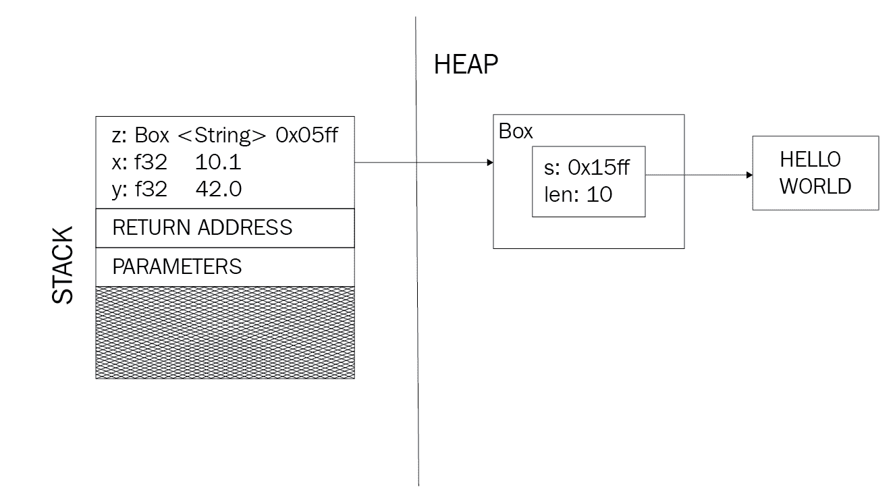

# 第一章：欢迎来到 Rust！

首先，感谢您拿起这本书！你们中的许多人可能只在大学时讨论过算法和数据结构这个话题。实际上，无论这是您编程生涯的第一次尝试与否，我们都努力使这本书成为一次极好的学习体验。我们的主要关注点将是 Rust 对算法和数据结构设计的独特影响，因此我们想从回顾一些重要的基础知识开始。

从 Rust 2018 版的变化开始，我们将探讨借用和所有权、可变性以及并发如何影响数据可以存储的位置以及可以执行哪些算法。在本章中，您可以期待学习以下内容：

+   快速回顾 Rust 以及 2018 版（Rust 1.31）中期待的内容

+   关于借用和所有权的最新和最佳内容

+   我们如何正确利用并发和可变性

+   指向 Rust 所在之处的引用（不是指针！）

# 2018 年的 Rust

Rust 有多久了？它始于 2006 年，是 Mozilla 工程师 Graydon Hoare 的一个副项目，后来（在 2009 年）被公司采纳。快进到不到十年后的 2015 年 5 月 15 日，Rust 团队宣布了稳定版本 1.0！

在其发展过程中，许多特性被添加和移除（例如，垃圾回收器、类和接口），以帮助它成为今天既快速又安全的语言。

在深入探讨 Rust 中的借用和所有权、可变性、并发、安全性等之前，我们想回顾一下 Rust 的一些主要概念以及它们如何显著改变架构模式。

# 2018 年版

Rust 的 2015 年版基本上是 1.0 版本，增加了一些非破坏性特性。然而，在 2015 年和 2018 年之间，特性和**请求评论（RFCs**）——Rust 社区改变核心特性的方式——不断积累，对向后兼容性的担忧也随之产生。

为了保持这种兼容性，引入了版本，并且随着第一个附加版本，许多重大变化被纳入了语言：

+   模块路径系统的变化

+   `dyn Trait`和`impl Trait`语法

+   `async`/`await`语法

+   生命周期语法的简化

通过这些新增特性，Rust 将异步编程引入其语法（`async`/`await`关键字），并提高了语言的可用性。本书默认使用 2018 年 12 月 6 日发布的 Rust 2018 版（[`blog.rust-lang.org/2018/12/06/Rust-1.31-and-rust-2018.html`](https://blog.rust-lang.org/2018/12/06/Rust-1.31-and-rust-2018.html)），因此所有以下代码片段都将包含这些新的语言特性！

# Rust 语言

当今许多已建立的编程语言是多范式语言，但仍然专注于面向对象的原则。这意味着它们有类、方法、接口、继承等，这些在 Rust 中都找不到，这使得许多已建立的开发者学习曲线陡峭。

经验更丰富的读者可能会错过许多使 Rust 成为优秀语言的方面，例如静态与动态方法调用、内存布局等。我认识到这些事情的重要性，但为了简洁和专注，选择将其留给您进一步探索。请参阅 *进一步阅读* 部分，以获取资源。

作为一种多范式语言，Rust 有许多功能概念和范式来指导它，但它们使得传统的面向对象模式更难应用。除了不使用类和接口来组织代码之外，还有各种方法来处理错误、更改代码本身，甚至与原始指针一起工作。

在以下章节中，我们想要探索一些使 Rust 独特并对我们开发算法和数据结构有重大影响的几个概念。

# 对象和行为

在 Rust 中组织代码与常规的面向对象语言（如 C#）略有不同。在那里，一个对象应该改变自己的状态，接口是简单的合同定义，而专业化通常是通过类继承来建模的：

```rs
class Door {
    private bool is_open = false;

    public void Open() {
        this.is_open = true;
    }
}
```

在 Rust 中，这种模式将需要任何 `Door` 实例的恒定可变性（因此需要显式锁定以实现线程安全），而且没有继承，`GlassDoor` 将不得不重复代码，这使得维护变得更加困难。

相反，建议创建特质来实现（共享）行为。特质与传统语言中的抽象类有很多共同之处（例如方法的默认实现），而且 Rust 中的任何 `struct` 都可以（并且应该）实现这些特质中的几个：

```rs
struct Door {
    is_open: bool
}

impl Door {
    fn new(is_open: bool) -> Door {
        Door { is_open: is_open }
    }
}

trait Openable {
    fn open(&mut self);
}

impl Openable for Door {
    fn open(&mut self) {
        self.is_open = true;
    }
}

#[cfg(test)]
mod tests {
    use super::*;

    #[test]
    fn open_door() {
        let mut door = Door::new(false);
        door.open();
        assert!(door.is_open);
    }
}
```

这种模式在标准库中非常常见，第三方库甚至会在自己的代码中通过实现特质来向现有类型添加行为（也称为扩展特质）。

除了典型的类，其中数据字段和方法位于单个结构中之外，Rust 强调通过声明一个用于数据的 `struct` 和一个用于方法/函数的 `impl` 部分来分离它们。特质命名并封装行为，以便可以轻松导入、共享和重用。

# 出错

除了课程之外，Rust 没有另一个众所周知的伴侣：`null`。在没有指针和非常不同的内存管理模型的情况下，不存在典型的 `null` 指针/引用。

相反，该语言使用`Option`和`Result`类型，让开发者能够建模成功或失败。实际上，也没有异常系统，因此任何函数的失败执行都应该在返回类型中指示。只有在需要立即终止的情况下，该语言才提供用于恐慌的宏：`panic!()`。

`Option<T>`和`Result<T, E>`都封装了一个（`Option<T>`）或两个（`Result<T, E>`）值，可以返回以传达错误或是否找到了某些内容。例如，一个`find()`函数可以返回`Option<T>`，而像`read_file()`这样的函数通常会有`Result<T, E>`返回类型来传达内容或错误：

```rs
fn find(needle: u16, haystack: Vec<u16>) -> Option<usize> {
    // find the needle in the haystack
}

fn read_file(path: &str) -> Result<String, io::Error> {
    // open the path as a file and read it
}
```

通常使用`match`或`if let`子句来处理这些返回值，以处理成功或失败的情况：

```rs
match find(2, vec![1,3,4,5]) {
    Some(_) => println!("Found!"),
    None => println!("Not found :(")
}

// another way
if let Some(result) = find(2, vec![1,2,3,4]) {
    println!("Found!")
}

// similarly for results!
match read_file("/tmp/not/a/file") {
    Ok(content) => println!(content),
    Err(error) => println!("Oh no!")
}
```

这是因为`Option<T>`和`Result<T, E>`都是具有泛型类型参数的枚举；它们可以假设其变体中的任何类型。对其变体的匹配提供了访问其内部值和类型的能力，从而允许执行代码的一个分支并相应地处理该情况。这不仅消除了需要具有多个——有时是类型转换——异常臂的 try/catch 结构的需求，而且还使失败成为需要处理的正常工作流程的一部分。

# 宏

另一方面，Rust 具有使用宏进行元编程的能力——基本上是编程编程！宏在 Rust 代码编译之前展开，这使得它们比普通函数拥有更多的功能。生成的代码可以动态创建函数或为结构体实现特质。

这些代码片段通过减少创建和初始化向量、派生结构体克隆能力或简单地打印内容到命令行的需求，使日常生活变得更加容易。

这是一个简化版的`vec![]`声明性宏示例，它包含在*《Rust 编程语言》（第二版，附录 D）*中：

```rs
#[macro_export] 
macro_rules! vec {
     ( $( $x:expr ),* ) => {
         {             
            let mut temp_vec = Vec::new();              
             $( temp_vec.push($x); )*      
            temp_vec
         }     
    }; 
}
```

声明性宏在模式上工作，如果该模式匹配，则运行代码；前面的示例匹配`*0 - n*`表达式（例如，一个数字，或返回数字的函数）并插入`temp_vec.push(...)` *n* 次，迭代提供的表达式作为参数。

第二种类型，过程宏，操作方式不同，通常用于提供默认的特质实现。在许多代码库中，可以在结构体顶部找到`#[derive(Clone, Debug)]`语句来自动实现`Clone`和`Debug`特质。

在本章的后面，我们将使用一个结构体，`FileName`，来展示引用计数，但为了使用调试字面量`"{:?}"`将其打印到命令行，我们需要派生`Debug`，它递归地将所有成员打印到命令行：

```rs
#[derive(Debug)]
struct FileName {
    name: Rc<String>,
    ext: Rc<String>
}
```

Rust 标准库已经提供了几个宏，通过创建自定义宏，您可以最小化必须编写的样板代码。

# 不安全

Rust 的代码是“安全”的，因为编译器在内存访问和管理方面检查并强制执行某些行为。然而，有时这些规则必须被放弃，使得代码变得不安全。`unsafe`是 Rust 中的一个关键字，它声明了一段代码，可以执行 C 编程语言允许你做的许多事情。例如，它允许用户执行以下操作（来自*《Rust 编程语言》*，第 19.1 章）：

+   解引用原始指针

+   调用一个`不安全`的函数或方法

+   访问或修改可变静态变量

+   实现一个`unsafe`特质

这四种能力可以用于诸如非常低级的设备访问、语言互操作性（编译器无法知道原生库如何使用它们的内存）等情况。在大多数情况下，当然在这本书中，`unsafe`是不必要的。事实上，Rustonomicon（[`doc.rust-lang.org/nomicon/what-unsafe-does.html`](https://doc.rust-lang.org/nomicon/what-unsafe-does.html)）定义了一个列表，列出了语言试图通过提供安全部分来防止发生的问题：

+   解引用空、悬垂或未对齐的指针。

+   读取未初始化的内存。

+   破坏指针别名规则。

+   生成无效的原始值：

    +   悬垂/空引用

    +   空的`fn`指针

    +   不是 0 或 1 的布尔值

    +   未定义的`enum`判别符

    +   字符超出范围[`0x0`, `0xD7FF`]和[`0xE000`, `0x10FFFF`]

    +   非 UTF8 字符串

+   调用其他语言。

+   导致数据竞争。

这些潜在问题在安全 Rust 中被防止，这无疑使开发者的生活变得更轻松，尤其是在设计算法或数据结构时。因此，这本书将始终使用安全 Rust。

# 借用和所有权

Rust 以其内存管理模型而闻名，该模型用编译时对内存安全的检查取代了运行时垃圾回收。Rust 能够在没有垃圾回收器的情况下工作，并且仍然让程序员摆脱易出错的内存管理，原因简单（但不容易）：借用和所有权。

虽然具体细节相当复杂，但高层次的观点是，编译器为开发者插入任何“提供*x*数量的内存”和“移除*x*数量的内存”（对于 C 程序员来说类似于`malloc()`和`free()`）语句。然而，它是如何做到这一点的呢？

所有权规则如下：

+   值的所有者是变量

+   在任何时候，只允许一个所有者

+   当所有者超出作用域时，值就会丢失

这就是 Rust 声明性语法发挥作用的地方。通过声明一个变量，编译器在编译时就知道需要预留一定量的内存。其生命周期也是明确定义的，从块的开始到结束，或只要`struct`实例存在。如果这个变量的大小在编译时已知，编译器就可以为函数提供所需的精确内存量。为了说明这一点，让我们考虑这个片段，其中两个变量以确定的顺序分配和释放：

```rs
fn my_func() {
    // the compiler allocates memory for x 
    let x = LargeObject::new(); 
    x.do_some_computation();
    // allocate memory for y
    let y = call_another_func();
    if y > 10 {
        do_more_things();
    }
} // deallocate (drop) x, y
```

这难道不是每个其他编译器都做的事情吗？答案是是的——也不是。在编译时，“提供*x*量的内存”这部分相对简单；棘手的部分是跟踪在可以自由传递引用时还有多少内存在使用中。如果在函数执行过程中，某个局部引用变得无效，静态代码分析会告诉编译器引用背后的值的生命周期。然而，如果在函数执行过程中某个线程在未知的时间改变了这个值呢？

在编译时，这是不可能知道的，这就是为什么许多语言使用垃圾回收器在运行时进行这些检查。Rust 放弃了这种方法，采用两种主要策略：

+   每个变量在任何时候都恰好由一个作用域拥有

+   因此，开发者被迫按照要求传递所有权

尤其是在处理作用域时，栈变量的特性非常有用。存在两个内存区域，栈和堆，类似于其他语言，开发者使用类型来决定是分配堆（`Box`、`Rc`等）还是栈内存。

栈内存通常是短暂的且较小的，以先进先出的方式操作。因此，在将变量放入栈之前，必须知道其大小：


堆内存不同；它是内存的一部分，这使得在需要时很容易分配更多内存。没有顺序，内存通过地址访问。由于堆上的地址指针在编译时已知大小，它非常适合放在栈上：



在其他语言中，栈变量通常按值传递，这意味着整个值被复制并放置在函数的栈帧中。Rust 也这样做，但它还使该变量在——现在的父——作用域中的进一步使用无效。所有权移动到新的作用域，并且只能作为返回值转移回来。当尝试编译这个片段时，编译器会报错：

```rs
fn my_function() {
    let x = 10;
    do_something(x); // ownership is moved here
    let y = x;       // x is now invalid!
}
```

借用类似，但不是复制整个值，而是将原始值的引用移动到新的作用域。就像在现实生活中一样，值继续由原始作用域拥有；具有引用的作用域只是允许像提供的那样使用它。当然，这也带来了可变性的缺点，并且一些函数可能需要所有权，这既有技术原因也有语义原因，但它也有优点，例如更小的内存占用。

这些是借用规则：

+   拥有者可以拥有不可变或可变引用，但不能同时拥有两者

+   可以有多个不可变引用，但只能有一个可变引用

+   引用不能是无效的

通过将前面的片段更改为将变量借用给`do_something()`（假设这是允许的，当然），编译器将很高兴：

```rs
fn my_function() {
    let x = 10;
    do_something(&x); // pass a reference to x
    let y = x;        // x is still valid!
}
```

借用的变量在很大程度上依赖于生命周期。最基本的生命周期是它在其中创建的作用域。然而，如果引用应该进入结构体字段，编译器如何知道底层值没有被无效化？答案是显式生命周期！

# 特殊生命周期

一些生命周期是不同的，Rust 用`'`来表示它们。虽然这可能是预定义的`'static`，但在处理结构时，创建自己的生命周期也是同样可能的。

当考虑底层内存结构时，这是有意义的：如果输入参数被传递到函数中并在最后返回，它的生命周期超过了函数。虽然函数在其生命周期内拥有这部分内存，但它不能借用一个比它实际存在的时间更长的变量。因此，这个片段无法工作：

```rs
fn another_function(mut passing_through: MyStruct) -> MyStruct {
    let x = vec![1, 2, 3];

    // passing_through cannot hold a reference 
    // to a shorter lived x!
    // the compiler will complain.
    passing_through.x = &x;

    return passing_through;
} // x's life ends here
```

原因是`passing_through`变量比`x`存在的时间更长。解决这个问题有几种方法：

+   将`MyStruct`的类型定义更改为要求所有权。这样，结构现在拥有变量，并且它的生命周期将与结构相同：

```rs
fn another_function(mut passing_through: MyStruct) -> MyStruct {
    let x = vec![1, 2, 3];

    // passing_through owns x and it will be
    // dropped together with passing_through.
    passing_through.x = x; 

    return passing_through;
}
```

+   将`x`克隆到`passing_through`以传递所有权：

```rs
fn another_function(mut passing_through: MyStruct) -> MyStruct {
    let x = vec![1, 2, 3];
    let y = &x;

    // passing_through owns a deep copy of x'value that is be
    // dropped together with passing_through.
    passing_through.x = y.clone(); 

    return passing_through;
}
```

+   在这种情况下，`vec![]`是静态定义的，因此将其作为函数参数可能是有意义的。这不仅更高效地分配内存，还可以强制执行适当的生命周期：

```rs
fn another_function<'a>(mut passing_through: MyStruct<'a>, x: &'a Vec<u32>) -> MyStruct<'a> {

    // The compiler knows and expects a lifetime that is 
    // at least as long as the struct's 
    // of any reference passed in as x. 
    passing_through.x = x; 

    return passing_through;
}
```

生命周期给许多 Rust 用户带来了很多奇怪的错误，在 2018 版中有一个可以少担心的问题。随着非词法生命期的引入，借用检查器变得更聪明了，现在它能够在一定程度上检查变量是否被使用。回想一下借用规则，如果创建了一个可变引用，则不能存在不可变引用。

在 Rust 1.31 之前，这段代码无法编译：

```rs
fn main() {     
    let mut a = 42;     
    let b = &a; // borrow a     
    let c = &mut a; // borrow a again, mutably         
    // ... but don't ever use b
}
```

现在它将能够编译，因为编译器不仅检查作用域的开始和结束，还检查引用是否被使用过。

# 多个所有者

单一所有权的功能虽然强大，但并不适用于所有用例。例如，大型对象或需要其他实例拥有的共享对象，在这些情况下不可变所有权会使生活变得更简单。考虑一个需要传入拥有对象的函数：

```rs
#[derive(Debug)]
struct FileName {
    name: String,
    ext: String 
}

fn no_ref_counter() {
    let name = String::from("main");
    let ext = String::from("rs");

    for _ in 0..3 {
        println!("{;?}", FileName {
                    name: name, 
                    ext: ext 
        });
    }
}
```

当尝试编译`no_ref_counter()`时，编译器为循环的每次迭代创建一个作用域，并拥有其中使用的任何值。这只会成功一次，因为之后变量已经被移动，并且对于后续迭代不可访问。

因此，这些值（在这种情况下，`name`和`ext`）消失了，编译将产生两个错误，每个错误对应于字符串的“第二次”移动：

```rs
error[E0382]: use of moved value: `name`
 --> src/main.rs:63:33
 |
63 | let _ = FileName { name: name, ext: ext };
 |                            ^^^^ value moved here in previous iteration of loop
 |
 = note: move occurs because `name` has type `std::string::String`, which does not implement the `Copy` trait

error[E0382]: use of moved value: `ext`
 --> src/main.rs:63:44
 |
63 | let _ = FileName { name: name, ext: ext };
 |                                       ^^^ value moved here in previous iteration of loop
 |
 = note: move occurs because `ext` has type `std::string::String`, which does not implement the `Copy` trait
```

一种解决方案是在每次迭代中克隆对象，但这会导致大量的缓慢内存分配。为此，Rust 标准库提供了一个解决方案：引用计数。

引用计数器（`std::rc::Rc<T>`）封装了一个在堆上分配的类型为`T`的变量，并在创建时返回一个**不可变**引用。这个引用可以以低开销克隆（它只是增加引用计数），但永远不会转换为可变引用。无论如何，它就像拥有数据一样，通过函数调用和属性查找传递。

虽然这需要改变变量类型，但现在调用`clone()`比直接克隆数据要便宜得多：

```rs
use std::rc::Rc;

#[derive(Debug)]
struct FileName {
    name: Rc<String>,
    ext: Rc<String> 
}

fn ref_counter() {
    let name = Rc::new(String::from("main"));
    let ext = Rc::new(String::from("rs")));

    for _ in 0..3 {
        println!("{;?}", FileName {
                    name: name.clone(), 
                    ext: ext.clone() 
        });
    }
}
```

运行此代码片段会打印出`FileName`对象的调试版本三次：

```rs
FileName { name: "main", ext: "rs" }
FileName { name: "main", ext: "rs" }
FileName { name: "main", ext: "rs" }
```

这种方法对于单线程和不可变场景非常有效，但会拒绝编译多线程代码。这个解决方案将在下一节讨论。

# 并发和可变性

Rust 管理内存的方法是一个强大的概念。事实上，它足够强大，可以促进并发和并行执行。然而，首先：Rust 标准库中的线程是如何工作的？

并发和并行性是两种不同的执行模式。虽然并发意味着程序的某些部分可以独立运行，但并行性指的是这些部分同时执行。为了简单起见，我们将这两个概念统称为并发。

由于其底层性质，Rust 提供了操作系统线程功能的 API（例如，Linux/Unix 系统上的 POSIX）。如果没有变量传递到作用域中，其使用非常简单：

```rs
use std::thread; 

fn threading() { 
    // The to pipes (||) is the space where parameters go,
    // akin to a function signature's parameters, without
    // the need to always declare types explicitly. 
    // This way, variables can move from the outer into the inner scope
    let handle = thread::spawn(|| { 
        println!("Hello from a thread");
    }); 
    handle.join().unwrap(); 
}
```

然而，在传递数据时，为了保持 Rust 的安全性保证，需要做更多的工作，尤其是在涉及可变性时。在深入探讨这一点之前，回顾不可变性是很重要的。

# 不可变变量

Rust——就像许多函数式语言一样——拥抱不可变变量。它们是默认的，改变可变性需要使用`mut`进行显式声明，这告诉编译器变量将要被用于什么（读取或写入）。

函数式编程语言因通过不可变性保证促进并发工作能力而闻名；读取数据不会产生副作用！要求显式可变性给编译器一个检查何时以及是否需要可变性的机会，因此是否可能发生数据竞争。

这导致编译时警告和错误而不是运行时崩溃和奇怪的竞争条件，这是许多生产用户所欣赏的。简而言之，如果可变性是（罕见的）选项而不是规范，那么思考代码就更容易。

# 阴影（Shadowing）

与改变变量属性不同，用不同的值（例如，原始值的更改副本）覆盖变量通常更易于阅读。这种技术被称为**阴影（shadowing）**。

通常，这用于重用变量名，即使实际值已经改变，以便在当前情况下工作。此代码片段清理`String`，通过在整个函数中使用相同的名称，始终可以清楚地知道是输入参数被更改：

```rs
fn sanitize(s: String) -> String {
    let s = s.trim();
    let s = s.replace(" ", "_");
    s
} 
```

虽然这与改变变量的值类似，但阴影（shadowing）并不会取代可变性，尤其是在实际改变该变量的属性成本较低时；Rust 为此有一个特定的设计模式！

# 内部可变性

变量能否同时是不可变和可变的？当然可以。装箱变量（`Box`、`Rc`等）是对堆的不可变引用，它们包含实际值。

对于这些类型的容器，没有理由说内部变量不能被更改——这是一个可以在 Rust 中使用`RefCell`安全完成的任务。`RefCell`维护值的单一所有权，但允许在运行时进行可变借用**检查**。而不是编译器错误，违反借用规则将导致运行时`panic!`，使程序崩溃。

整个概念被称为**内部可变性（interior mutability）**，通常与`Rc`结合使用，以便为多个所有者提供可变性的值。显然，为了提供良好的用户体验，强烈建议确保借用规则不会被其他方式违反。

将`RefCell`包裹在`Rc`中充当拥有多个所有者的看门人，包括更改内容的方式。这实际上类似于更传统的编程语言，如 Java 或 C#，在这些语言中，通常在方法调用之间移动引用，指向堆内存中的对象实例。

这种模式对于实现复杂程序和数据结构非常重要，因为特定变量的所有权并不总是明确的。例如，本书后面我们将研究双链表，它著名地有一个指向前一个和后继节点的指针。哪个节点**应该**拥有哪个指针的所有权？内部可变性允许我们说两者都有。考虑我们稍后将使用的节点声明：

```rs
use std::cell::RefCell;
use std::rc::Rc;

#[derive(Clone)]
struct Node {
    value: String,
    next: Link,
    prev: Link,
}

type Link = Option<Rc<RefCell<Node>>>;
```

通过这个列表声明，我们可以看到这个`append`函数简单版本中的模式：

```rs
pub fn append(&mut self, value: String) {
    let new = Rc::new(RefCell::new(Node::new(value)));
    match self.tail.take() {
        Some(old) => {
            old.borrow_mut().next = Some(new.clone());
            new.borrow_mut().prev = Some(old);
        }
        None => self.head = Some(new.clone()),
    };
}
```

此代码在列表的前端（头部）添加一个新节点，该节点包含所有以节点形式存储在堆上的数据。为了在列表头部添加一个节点，必须正确设置引用，以便前一个和下一个指针实际上指向相同的节点而不是副本。更详细的探索将在第三章，“列表，列表，还有更多列表”中介绍。现在，重要部分是使用`borrow_mut()`设置变量。这个可变引用仅在赋值期间存在，因此排除了创建过大作用域并违反借用规则的可能性。

通过使用`RefCell`函数的`borrow_mut()`，它将检查并强制执行借用规则，并在违反规则的情况下引发恐慌。稍后，我们还将讨论`Mutex`类型，它本质上是多线程版本的这些单元格。

# 数据移动

介绍片段展示了启动线程但未将任何数据传递到作用域中的代码。就像任何其他作用域一样，它需要拥有一个值的所有权或至少一个借用引用才能处理该数据。在这种情况下，传递所有权是我们想要的，这被称为**移动数据**到作用域中。

如果我们将简介中的片段修改为包含一个用于从线程内部打印的简单变量，编译将会失败：

```rs
use std::thread; 

fn threading() { 
    let x = 10;
    let handle = thread::spawn(|| { 
        println!("Hello from a thread, the number is {}", x);
    }); 
    handle.join().unwrap(); 
}
```

原因很简单：编译器无法确定每个作用域的生命周期（当线程需要时`x`还在吗？），因此拒绝编译代码：

```rs
Compiling ch1 v0.1.0 (file:///code/ch1) 
error[E0373]: closure may outlive the current function, but it borrows `x`, which is owned by the current function 
 --> src/main.rs:5:32 
 | 
5 |     let handle = thread::spawn(|| { 
 |                                ^^ may outlive borrowed value `x` 
6 |         println!("Hello from a thread, the number is {}", x); 
 |                                                           - `x` is borrowed here 
help: to force the closure to take ownership of `x` (and any other referenced variables), use the `move` keyword 
 | 
5 |     let handle = thread::spawn(move || { 
 |                                ^^^^^^^
```

如编译器消息所示，添加`move`关键字将解决问题！此关键字允许一个线程将所有权传递给另一个线程；它“移动”内存区域：

```rs
fn threading() { 
    let x = 10;
    let handle = thread::spawn(move || {
        println!("Hello from a thread, the number is {}", x);
    }); 
    handle.join().unwrap(); 
} 
```

当运行此片段时，输出如下：

```rs
Hello from a thread, the number is 10
```

然而，对于将多个消息传递到线程或实现**演员模型**，Rust 标准库提供了通道。通道是单消费者、多生产者队列，允许调用者从多个线程发送消息。

此片段将启动 10 个线程，每个线程将一个数字发送到通道，发送者执行完毕后，这些数字将被收集到一个向量中：

```rs
use std::sync::mpsc::{channel, Sender, Receiver};

fn channels() {
    const N: i32 = 10;
    let (tx, rx): (Sender<i32>, Receiver<i32>) = channel();
    let handles = (0..N).map(|i| {
        let _tx = tx.clone();
        thread::spawn(move || { 
            // don't use the result
            let _ = _tx.send(i).unwrap(); 
        })
    });
    // close all threads
    for h in handles {
        h.join().unwrap();
    }
    // receive N times
    let numbers: Vec<i32> = (0..N).map(|_|
            rx.recv().unwrap()
        ).collect();

    println!("{:?}", numbers);
}
```

如预期，输出如下：

```rs
[0, 1, 2, 3, 4, 5, 6, 7, 8, 9]
```

使用这些工具，多线程应用程序可以在线程之间移动数据，而无需手动锁定或无意中创建副作用的风险。

# 数据共享

除了将数据以某种方式发送到线程之外，许多程序在共享状态上操作，其中多个执行流必须访问和更改一个或多个共享变量。通常，这需要使用**互斥锁**（简称**互斥**），以确保在锁定互斥锁内访问任何内容时，都保证是单个线程。

这是一个旧概念，在 Rust 标准库中实现。它是如何方便访问变量的？将变量包装成 `Mutex` 类型将提供锁定机制，从而使其可以从多个并发写入者处访问。然而，他们还没有拥有那个内存区域。

为了在多个线程之间提供这种所有权——类似于 `Rc` 在单个线程中所做的——Rust 提供了 `Arc` 的概念，一个原子引用计数器。使用这个 `Mutex`，它是一个线程安全的 `Rc` 包装 `RefCell` 的等价物，一个包装可变容器的引用计数器。为了提供一个例子，这工作得很好：

```rs
use std::thread;
use std::sync::{Mutex, Arc};

fn shared_state() {
    let v = Arc::new(Mutex::new(vec![]));
    let handles = (0..10).map(|i| {
        let numbers = Arc::clone(&v);
        thread::spawn(move || {
            let mut vector = numbers
                .lock()
                .unwrap();
            (*vector).push(i);
        })
    });

    for handle in handles {
        handle.join().unwrap();
    }
    println!("{:?}", *v.lock().unwrap());
}
```

当运行此示例时，输出如下：

```rs
[0, 1, 2, 3, 4, 5, 6, 7, 8, 9] 
```

虽然进行并发编程的首选方式仍然是尽可能多地使用不可变变量，但安全的 Rust 提供了处理共享数据而不产生副作用的工具。

# Send 和 Sync

这些标记特质是 Rust 多线程策略的基础。它们有各自的目的：

+   `Send`: 数据类型可以安全地从一条线程发送（移动）到另一条线程

+   `Sync`: 数据类型可以在线程之间共享，无需手动锁或互斥区域

这些标记特质在标准库的所有基本类型中实现，并且可以继承到自定义类型中（如果一个类型的所有属性都是 `Sync`，那么该类型本身也是 `Sync`）。

实现 `Sync` 或 `Send` 是不安全的，因为编译器无法知道你是否正确，代码是否可以在线程之间共享/发送，这就是为什么这样做非常不寻常。

如果你的程序需要这种深度的 Rust 编程，务必阅读《Rust 书》第十六章（[`doc.rust-lang.org/1.31.0/book/ch16-04-extensible-concurrency-sync-and-send.html`](https://doc.rust-lang.org/1.31.0/book/ch16-04-extensible-concurrency-sync-and-send.html)）的相关内容。

# 深入 Rust

Rust 的另一个强点是它繁荣的社区。许多用户积极参与他们的本地社区（通过参加或组织聚会）或通过工作组、IRC/Discord 频道或官方论坛在线参与。以下是最重要的在线资源：

+   主网站，包含指向各种资源的链接：[`www.rust-lang.org`](https://www.rust-lang.org)

+   Rust 用户论坛：[`users.rust-lang.org`](https://users.rust-lang.org)

+   官方的 Twitter 账号：[`twitter.com/rustlang`](https://twitter.com/rustlang)

+   一系列位于 [`wiki.mozilla.org/Rust`](https://wiki.mozilla.org/Rust) 的 IRC 频道

+   Rust 的官方博客：[`blog.rust-lang.org`](https://blog.rust-lang.org)

+   《Rust 书》：[`doc.rust-lang.org/book/`](https://doc.rust-lang.org/book/)

除了这些，用户还创建了额外的内容，例如播客、博客以及各种工具和库。然而，最令人印象深刻的用户贡献可以在核心语言中找到！

Rust 的官方 GitHub 仓库位于[`github.com/rust-lang`](https://github.com/rust-lang)，其中包含了众多资源（例如网站、博客、书籍和文档）的源代码，并且非常欢迎贡献。

Mozilla 在创建和培养开源社区方面有着令人印象深刻的记录，Rust 也不例外。作为这些社区的活跃成员，我们鼓励每个人参与进来，帮助使 Rust 成为最受欢迎和最有用的语言之一！

# 请求评论（RFCs）

由于 Rust 的开源特性，有一套治理规则在位，以保持接口的稳定性和灵活性，同时鼓励随着语言的发展进行变革和讨论。

对于像编程语言及其标准库这样敏感的事物，比常规的拉取请求审批更严格的过程是必要的，以便进行更深入的讨论。想象一下更改单个关键字的影响，以及会有多少项目立即停止工作！

这就是 RFCs 发挥作用的地方。它们为所有利益相关者提供了一个平等的机会来参与讨论。开源项目中整合变更的典型工作流程使用的是分支和拉取请求方法，其中贡献者创建一个**拉取请求**（**PR**）来提出变更（[`help.github.com/articles/about-pull-requests/`](https://help.github.com/articles/about-pull-requests/)）。与 RFC 过程不同，在大型代码库中这很难管理，并且只有在解决方案提出之后才开始讨论，大大缩小了焦点。

活跃和过去的 RFCs 的仓库可以在这里找到：[`github.com/rust-lang/rfcs`](https://github.com/rust-lang/rfcs)。

# 摘要

Rust 是一种多范式语言，具有卓越的概念：该语言强调通过结构和特性实现数据和行为的分离，使用宏进行元编程，并利用显式的内存所有权来确定变量的生命周期。了解这些生命周期可以消除运行时垃圾收集的需要，同时，通过仅在特定情况下允许可变借用，极大地促进了并发性。

因此，线程和其他异步进程只能在它们拥有可变所有权时更改变量，这通常在编译时强制执行，但也可以在运行时完成！因此，安全的 Rust 实际上没有数据竞争。

Rust 生态系统另一个显著的优势是其多元化和包容性的社区。Mozilla 赞助了社区的发展，开发过程由 RFCs 指导，活动由中心组织并宣传，在线上提供学习资源。成为生态系统的一部分另一种方式是向`crates.io`（[`crates.io/`](https://crates.io/)），Rust 的公共包仓库贡献包。阅读下一章，了解更多关于`cargo`的信息，它是 Rust 构建和打包的通用工具。

# 问题

+   特性和接口有什么不同？

+   为什么 Rust 没有垃圾回收器？

+   列举三个在 Rust 中创建生命周期（显式和隐式）的例子！

+   变量的不可变性为什么很重要？

+   同步标记特性有什么作用？

+   你可以去哪里参与 Rust 社区？

+   为什么 RFC 比 PR 更受欢迎？

# 进一步阅读

以下书籍提供了更多信息：

+   *《Rust 并发实战》* by Brian L. Troutwine (Packt)

+   *《Rust 中的函数式编程》* by Andrew Johnson (Packt)
