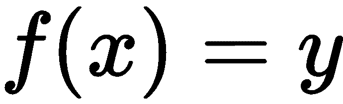
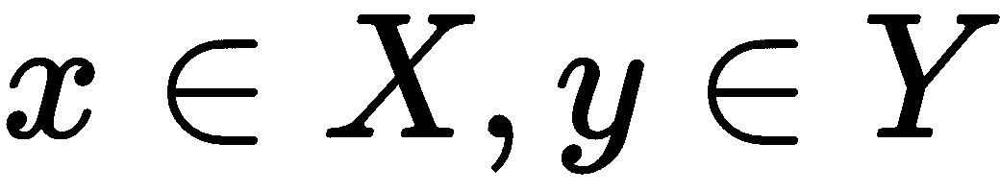

# 第三章：高效存储

在前几章的基础上，我们现在可以继续探讨算法和数据结构的更多架构方面。Rust——凭借其所有权模型——要求在算法设计中考虑生命周期、内存放置和可变性。在本章中，你可以期待学习以下主题：

+   考虑速度和可读性的权衡

+   访问堆和栈变量

+   不变性如何影响设计

# 堆和栈

如我们在第一章中讨论的那样，*Hello Rust!*，由于栈变量相比堆分配数据具有低开销和速度优势，因此栈变量更受欢迎。对于栈变量，Rust 的类型甚至允许零开销结构，因此不会存储额外的元数据。以下代码片段断言数组或用户定义类型没有使用额外的字节：

```rs
use std::mem;

struct MyStruct {
    a: u8,
    b: u8,
    c: u8
}

fn main() {
    assert_eq!(mem::size_of::<MyStruct>(), 3 * mem::size_of::<u8>());
    assert_eq!(mem::size_of::<[MyStruct; 2]>(), 3 * mem::size_of::<u8>() * 2);
}
```

因此，`MyStruct`类型的实例大小始终是三个字节——非常适合将其放置在栈上。这有什么好处呢？简而言之，数据局部性。与指针解引用不同，数据存储在执行点，这使得它易于缓存且访问速度快。

没有可预测大小（例如`String`实例）的类型需要堆分配，就像被`Rc`、`Cell`、`RefCell`或`Box`实例包裹的对象一样。然而，堆分配和访问代价不菲，因为最小化这些通常能带来巨大的性能提升。

# 有大小和无大小

为了编译器能够将编写的代码转换为二进制格式，有必要知道每种类型的大小。正如我们之前讨论的那样，大小很重要，这样我们就可以在栈上放置其他类型，如果大小与其包含的数据无关（有大小类型），这很容易做到。这个最好的例子是`u32`：它使用 32 位（或 4 字节），无论你存储`0`还是`10000900`。

当类型是无大小或动态大小时，情况并非如此，最好的例子是`str`类型。根据字符数，这种类型的大小会有很大变化，这也是为什么实例通常以切片的形式出现。

切片是 Rust 提供泛型算法给所有数据类型的方式，它们将在第十二章中进一步讨论，*标准库算法*。

切片通过存储一个固定大小的引用（`&str`）到堆分配的值及其字节数来绕过大小问题。类似于指针，这是一个固定大小的对先前未指定大小的值的视图。每次创建某种类型的指针（`&`、`Rc`、`Box`、`Cell` 等）时，都会将引用与长度和一些（固定大小）元数据一起存储。当类型事先未知时——例如在处理 Rust 的泛型时——了解大小与未指定大小之间的区别特别有用。

# 泛型

Rust 支持泛型，甚至允许我们强制实现某些特质。这些约束可以作为一个附加在函数定义上的 where 子句，或者是在泛型类型声明中使用冒号：

```rs
fn my_generic_func<T: MyTrait>(t: T) {
    // code 
}

// ... is the same as 

fn my_generic_func <T>(t: T) where T: MyTrait {
    // code
}

// but better use in 2018 and beyond

fn my_generic_func(t: impl MyTrait) {
    // code
}
```

此外，2018 年的 `impl Trait` 语法简化了输入和返回参数的单个特质要求（执行静态而不是动态分派），从而消除了使用 `Box` 或冗长的类型约束（如前面片段中的 `MyTrait`）的需要。除非需要多个特质实现（例如，`fn f(x: T) where T: Clone + Debug + MyTrait {}`），否则 `impl Trait` 语法允许我们将它们放在它们应该放的地方，即参数列表中：

```rs
fn my_generic_func<T>(t: T) {
    // code 
}

// ... is the same as 

fn my_generic_func <T: Sized>(t: T) {
    // code
}
```

当使用泛型时，情况会稍微复杂一些。类型参数默认是 `Sized`（见前面的片段），这意味着它们不会匹配未指定大小的类型。为了匹配这些类型，可以使用特殊的 `?Sized` 类型约束。这个片段还展示了传递引用所需的更改：

```rs
fn my_generic_func <T: ?Sized>(t: &T) {
    // code
}
```

然而，任何类型的堆分配引用在访问包含的值时都会多一个步骤。

# 访问盒子

额外的步骤听起来不多，但它有相当大的影响。这种为了在各个函数或线程之间轻松共享所有权而进行的权衡，消除了尽可能将大量数据放入 CPU 缓存的能力，因为指针使任何数据局部性变得困难。堆分配本身是昂贵的操作，减少这些操作将已经提供重大的速度提升。

此外，如果编译器在某个地方仍然引用了 boxed 值，它就无法释放 boxed 值——这个问题在程序大且复杂时尤其明显。类似于 C# 或 Java 中的孤儿对象，一个保存的 `Rc` 引用很容易被遗忘，从而造成内存泄漏。因此，建议仅在需要时使用堆内存。

在 Rust 中需要 boxed 值的一个额外建议是“优先使用对象组合而不是类继承”（Gang of Four 1995:20）。在没有类继承的情况下，显然选择使用对象组合。考虑到你也应该“面向接口编程而不是面向实现”（同上），通常会有一个强烈的愿望将特质的引用放在 `struct` 中，而不是直接与实现交互。

要在 Rust 中应用这种架构，语言要求我们将特质的实现放入`Box<dyn TheTrait>`中，这使得处理、测试和推理变得更加困难。这个特质对象要求编译器依赖于动态分派，这比默认的静态分派要慢得多。

静态和动态分派是许多编程语言（包括 Rust）中调用函数的两种主要方式。对于静态分派函数，位置在编译时已知，而动态分派函数仅在运行时已知，并且必须在指向实际地址的**虚表**中查找。两者都有其优点，所以使用时要谨慎。

除了泛型之外，没有默认的解决方案来解决这个问题。Rust 2018 的`impl Trait`添加缓解了函数参数和返回值的问题，但不能用于字段类型。

到目前为止，看起来最好的选择是使用具体类型而不是特质来避免多次解引用操作——只要在更改时重构似乎可行。如果你创建了一个库，泛型对于性能和灵活性来说是一个更好的选择。

# 拷贝和克隆

在第一章，“Hello Rust!”中，我们讨论了`Send`，这是一个标记特质，允许一个类型“发送”到多个线程。类似但更简单的是局部移动，这在程序中很常见——例如，当你将一个变量传递给一个函数时。

相反，拷贝和克隆发生在不同的场合。当一个变量被赋值给另一个变量时，编译器通常会隐式地拷贝值，对于栈分配的变量，这可以安全且便宜地完成。

`Copy`是变量的值的隐式、位拷贝。如果该变量是指针，内存责任就会变得模糊（谁负责释放？）并且编译将失败。这就是`Clone`发挥作用的地方。该特质要求显式实现`clone()`函数以提供适当的类型拷贝。

克隆始终是类型的深度拷贝——通过手动实现（使用`Clone`特质）或使用`derive`宏来实现。然后，克隆只是调用`clone()`函数的问题，这个操作并不一定便宜。以下代码片段说明了这两个操作：

```rs
let y = 5;
let x = y;                 // Copy

let a = Rc::new(5);
let b = a.clone();         // Clone
```

这些特质和操作的常规用法通常是直观的，不太可能出错。通常编译器会清楚地指出需要`Copy`实现。

建议尽可能使用`Copy`特质或实现，但要注意破坏性变更。添加特质是一个非侵入性操作，而移除特质可能会破坏其他人的代码。

虽然拷贝和克隆对于向多个作用域提供所有权非常有用，但在处理不可变存储时是必需的。

# 不可变存储

垃圾收集器大大简化了可变性，因此，许多这些语言不需要特定的修饰符来表示可变性。虽然这种垃圾收集机制以运行时频繁清理为代价，但无需关心变量是否可变是非常方便的。它让开发者能够专注于他们正在实现的逻辑。

那么为什么 Rust（以及许多函数式语言）又引入了这个概念？

# 状态和推理

对象的状态本质上是在任何给定时间其字段具有的当前值。通过对象本身通过定义的行为（称为方法）上的消息来更改此状态，根据面向对象的原则。这些状态更改需要可变性。

在它们的整个生命周期中，大多数对象会多次改变其状态，由于这发生在运行时，我们常常在沮丧中查看对象的调试打印，心想，“这个值是如何到这里来的？”

不可变数据结构通过使其内容无法更改来解决这个问题，所以每次查看对象时，它都具有完全正确的值。众所周知，大多数变量不需要可变，除非存在资源限制，否则建议创建具有新状态的另一个对象实例。这个原则被称为**写时复制**，它提高了可读性，从而改善了维护性。

采用写时复制的流行类型是`String`——在几乎任何语言中。该类型封装了一个字节数组，并使用提供的字符集（通常是 UTF-8）对其进行解释，如果你修改了一个字符，则该数组会被复制并保存所做的更改。这种情况发生的频率很高，以至于`String`分配成为常见的性能陷阱。

在 Rust 标准库中，有一个`Cow`枚举（`std::borrow::Cow`），它会在需要修改或拥有权时懒加载包含的引用。为了一个很好的例子，请查看 Cow 文档：[`doc.rust-lang.org/std/borrow/enum.Cow.html`](https://doc.rust-lang.org/std/borrow/enum.Cow.html)。

写时复制的原则也可以在文件系统中找到，用于创建快照（例如，在 ZFS 或 BRTFS 中），并且以运行时资源为代价提供了不可变性和可变性的好处。这是维护性和绝对性能之间的权衡。持久数据结构也采用了类似的概念，这些结构可以是部分或完全持久的，同时仍然是不可变的。

# 并发与性能

在多线程场景中，拥有易于推理的代码且状态无法更改尤为重要。这防止了所谓的异常（或副作用）发生，即对象的状态在依赖的线程之外被更改。

锁通常是为了改变共享对象的状态——它们保护临界区，在任何给定时间只有一个线程可以修改。其他线程必须“排队”等待锁释放才能访问该部分。在 Rust 中，这被称为**互斥锁**。

锁和互斥区域有以下几个原因不好：

+   它们必须按照正确的顺序（获取和释放）进行。

+   当一个线程在互斥区域中崩溃时会发生什么？

+   它们很难无缝集成到它们所保护的程序部分中。

+   它们是性能的瓶颈。

不变性是一种避免所有这些问题的简单方法，并且有许多不可变数据结构库可用，包括一个名为**Rust 持久数据结构**（**RPDS**）的库（[`crates.io/crates/rpds`](https://crates.io/crates/rpds)），它使用写时复制和版本控制来捕获状态变化。由于这些变化是相互叠加的，线程可以在一次只完全读取一个一致的对象状态的同时，无需等待或获取锁。

**无锁数据结构**是数据结构的一种特殊版本，其实施非常具有挑战性。这些数据结构使用原子操作来修改重要部分（例如，栈的头指针）并因此在不锁定的情况下实现优异的性能。

**持久数据结构**是一种创建数据结构的方法，它们在效率和可变性方面与传统对应物一样高效，但更适合并发。这是通过保持原始数据不可变并存储版本化更改集来实现的。

不可变数据的概念最好在函数式编程的背景下思考。函数式编程建立在数学函数的原则之上。一个函数是两个数据集（通常是*X*和*Y*）之间的关系，其中*X*中的每个元素在*Y*中都有且只有一个元素与之对应，使用*f*函数映射（简而言之：**其中 **）。

作为结果，输入数据*X*不会被改变以产生输出数据*Y*，这使得并行运行*f*函数变得容易。缺点是运行时成本的提高：无论操作是什么，无论是仅仅在输入数据上翻转一个位还是彻底重写一切，结果总是完整的复制。

为了减少这种低效，可以使用 Gang of Four 在*X*迭代器上的装饰器模式来堆叠仅有的更改并在每次调用时执行它们，从而减少运行时复杂度并避免输出数据的多次复制。一个问题仍然存在，即如果输入和输出都很大，则需要大量的内存。这是一个棘手的情况，只能通过程序员仔细思考更好地分解函数来避免。

# 摘要

在代码的细节之上提升一个层次，本章讨论了设计和使用类型时的考虑因素。Rust 在代码中对栈分配和堆分配变量的区分提供了一种应该用来提高性能和 API 灵活性的控制级别。"Sized"，一个主要用于栈分配值的标记特质，是泛型类型参数的默认值，可以通过应用 `?Sized` 约束来放宽。

当与更面向对象的架构一起工作时，特质对象成为了一种“使用接口”而不是特定实现的方法。然而，它们会带来性能成本，即动态调度，这是在可维护性和性能之间的另一种权衡。

除了移动之外，Rust 在必要时可以复制或克隆变量。对于有大小值，Copy 执行深拷贝；无大小值需要克隆的引用。当使用名为“写时复制”的原则处理不可变数据类型时，这些操作经常遇到。选择我们是否能够在任何给定时间推理对象的状态，并避免数据竞争条件，但每次更改都需要创建一个副本，这是设计数据结构时的另一个重要权衡。

这种权衡将在下一章中变得明显，我们将开始处理列表，例如单链表、双链表和动态数组。

# 问题

+   `Sized` 类型与其他类型有何不同？

+   `Clone` 与 `Copy` 有何区别？

+   不变数据结构的主要缺点是什么？

+   应用程序如何从不可变数据结构中受益？

+   想象一下你想要工作的一个不可变列表——你将如何将它分配到多个线程中？

# 进一步阅读

关于本章涵盖的主题的更多信息，请查看以下链接：

+   [`cglab.ca/~abeinges/blah/too-many-lists/book/`](http://cglab.ca/~abeinges/blah/too-many-lists/book/)

+   [`doc.rust-lang.org/std/mem/fn.size_of.html`](https://doc.rust-lang.org/std/mem/fn.size_of.html)

+   [`en.wikipedia.org/wiki/Functional_programming`](https://en.wikipedia.org/wiki/Functional_programming)

+   [`en.wikipedia.org/wiki/Persistent_data_structure`](https://en.wikipedia.org/wiki/Persistent_data_structure)
