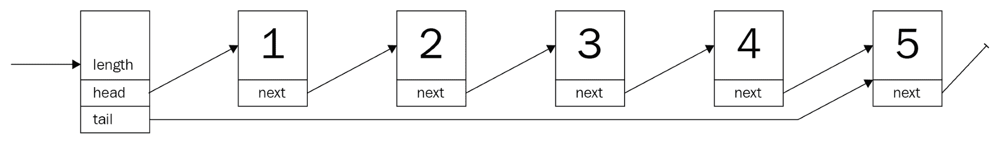
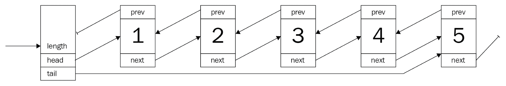
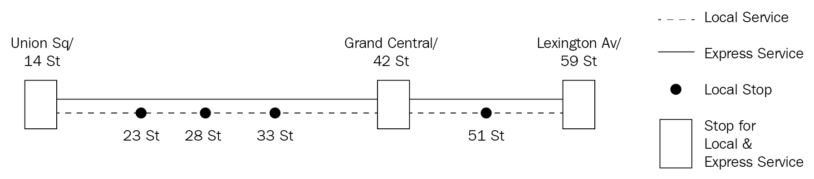
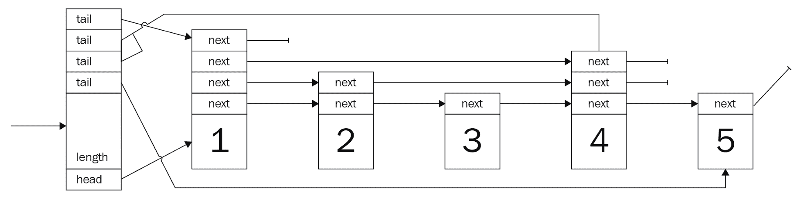
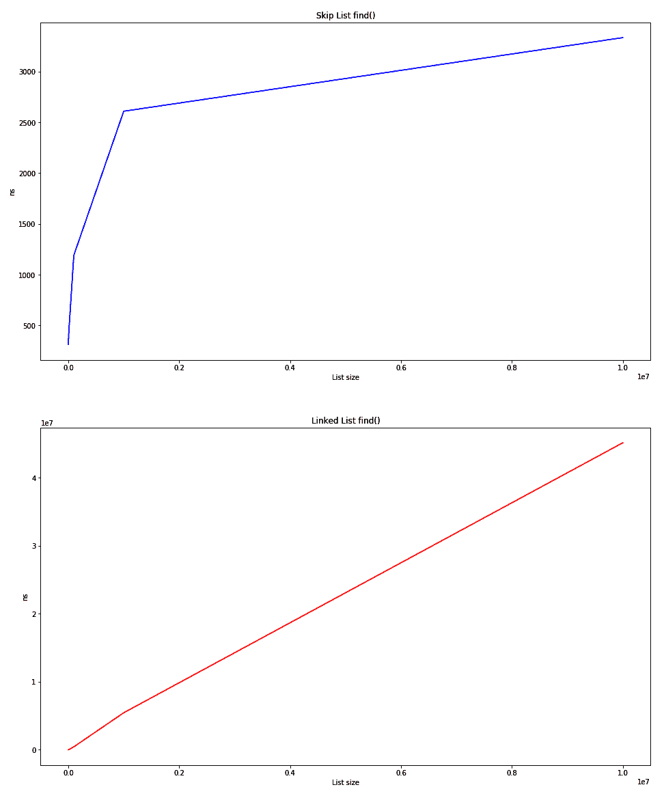
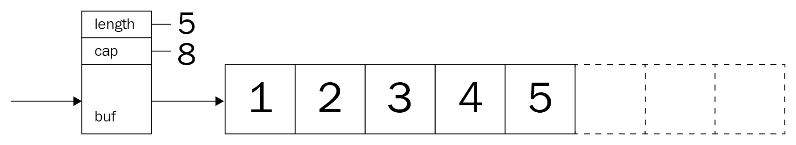

# 列表，列表，还有更多列表

列表无处不在：购物清单、待办事项清单、食谱、西方国家街道号码……简而言之，无处不在。它们的定义特征，以线性、定义好的关系存储事物，帮助我们跟踪物品并在以后找到它们。从数据结构的角度来看，它们对于几乎任何程序都是必不可少的，并且以各种形状和形式出现。虽然某些列表在 Rust 中实现起来可能很棘手，但一般原则也可以在这里找到，还有一些关于借用检查器的宝贵经验教训！在本章之后，我们希望你知道更多关于以下内容：

+   （双链）列表以及何时使用它们

+   数组列表，也称为 Rust 的向量

+   跳表，以及理想情况下纽约地铁系统

+   实现一个简单的交易日志

最后的注意事项，本章将构建各种列表的安全实现，尽管不安全的版本可能更快且代码更少。这个决定是因为，在处理常规用例时，不安全几乎从未是解决方案。查看本章“进一步阅读”部分的链接，了解不安全列表。

# 链表

为了跟踪一堆物品，有一个简单的解决方案：在列表中的每个条目中，存储一个指向下一个条目的指针。如果没有下一个项目，则存储`null`/`nil`/`None`等，并保持对第一个项目的指针。这被称为**单链表**，其中每个项目通过单个链接与下一个项目连接，如下面的图所示——但你已经知道了：



那么链表的真实用例是什么？难道每个人不都是用动态数组来处理所有事情吗？

考虑一个事务日志，这是一个典型的只追加结构。任何新的命令（如 SQL 语句）都简单地追加到现有链中，并最终写入持久存储。因此，初始要求很简单：

+   向现有列表中添加命令

+   从头到尾按顺序重放每个命令

换句话说，它是一个队列（或**LIFO**——即**后进先出**）结构。

# 事务日志

首先，必须定义一个列表——在 Rust 中，由于缺少`null`类型，每个项目通过一个`Option`属性链接到下一个。`Option`实例是封装值（在这种情况下是一个堆引用，如`Box`、`Rc`等）或无值的枚举。为什么？让我们来看看！

创建一个典型实现以探索某个方面始终是一个好主意，特别是编译器经常提供出色的反馈。因此，整数列表的实现是第一步。每个列表元素的这个`struct`怎么样？

看看下面的代码片段：

```rs
struct Node {
    value: i32,
    next: Option<Node>
}
```

对于实际考虑，它需要一个知道从哪里开始以及列表长度的方法。考虑到计划的`append`操作，一个指向末尾（尾部）的引用也会很有用：

```rs
struct TransactionLog {
    head: Option<Node>, 
    tail: Option<Node>,
    pub length: u64
}
```

看起来很棒！但它真的工作吗？

```rs
error[E0072]: recursive type `Node` has infinite size
 --> ch4/src/lib.rs:5:1
 |
5 | struct Node {
 | ^^^^^^^^^^^^^ recursive type has infinite size
6 | value: i32,
7 | next: Option<Node>
 | ------------------ recursive without indirection
 |
 = help: insert indirection (e.g., a `Box`, `Rc`, or `&`) at some point to make `Node` representable
```

不幸的是，它不起作用——回想一下前面的章节，原因变得很清楚：编译器无法确定数据结构的大小，因为整个列表必须嵌套在第一个元素中。然而，正如我们所知，编译器无法以这种方式计算并因此分配所需的内存量——这就是为什么需要引用类型的原因。

引用类型（如`Box`、`Rc`等）非常适合，因为它们在堆上分配空间，因此允许更大的列表。这是一个更新后的版本：

```rs
use std::cell::RefCell;
use std::rc::Rc;

struct Node {
    value: i32,
    next: Option<Rc<RefCell<Node>>>
}

struct TransactionLog {
    head: Option<Rc<RefCell<Node>>>,
    tail: Option<Rc<RefCell<Node>>>,
    pub length: u64
}
```

将每个节点项存储在`Rc<RefCell<T>>`中提供了按需检索和替换数据的能力（内部可变性模式）——在执行列表操作时至关重要。另一个好的做法是别名类型，特别是如果有许多泛型。这使得替换类型实现变得容易，并提供了更易读的定义：

```rs
type SingleLink = Option<Rc<RefCell<Node>>>;

#[derive(Clone)]
struct Node {
    value: i32,
    next: SingleLink,
}

```

完美！这是事务日志的基本定义，但为了使用它，还有很多事情要做。首先，值类型必须是`String`：

```rs
#[derive(Clone)]
struct Node {
    value: String,
    next: SingleLink,
}

impl Node {
    // A nice and short way of creating a new node
    fn new(value: String) -> Rc<RefCell<Node>> {
        Rc::new(RefCell::new(Node {
            value: value,
            next: None,
        }))
    }
}

```

除了那个，创建一个空列表将很有用，因此列表的`impl`块目前只有一个函数——`new_empty()`：

```rs
impl TransactionLog {
    pub fn new_empty() -> TransactionLog {
        TransactionLog { head: None, tail: None, length: 0 }

    }
}
```

尽管如此，还有很多事情要做。为了总结，事务日志有两个要求：

+   在末尾添加条目

+   从前面删除条目

让我们从第一个要求开始：向列表的末尾添加项目！

# 添加条目

事务日志现在可以创建并保存条目，但无法向列表中添加任何内容。通常，列表具有将元素添加到任一端的能力——只要有一个指向该端点的指针。如果情况不是这样，任何操作都会变得计算成本高昂，因为必须查看每个项目以找到其后续者。有了列表末尾（尾部）的指针，这种情况就不会发生在追加操作中；然而，要访问列表上的随机索引，可能需要花费一些时间来遍历所有内容。

命名——尤其是如果你英语是第二语言——通常很棘手。操作在不同的语言或库中有不同的名称。例如，向列表添加项目的常见名称包括`push`（可以添加到前面或后面）、`push_back`、`add`、`insert`（通常带有位置参数）或`append`*.* 除了能够猜测方法名称外，一些名称暗示了与其他名称完全不同的过程！如果你设计接口或库，找到最描述性和最简单的名称，并在可能的情况下重复使用！

这就是链表做得非常好的事情之一——在任一端添加项目。尽管如此，还有一些关键事项不应被忽视：

+   在方法内创建 `Node` 对象使得 API 更好，并且更好地处理所有权。

+   边界情况，例如空列表。

+   增加长度是一个好主意。

+   使用 `RefCell` 的 `borrow_mut()` 函数（内部可变性）来获取可变所有权，以便使用它设置新的后继者。

一旦考虑到这一点，实际的实现并不太糟糕。Rust 的 `Option` 类型提供了一个方法来检索它包含的值的所有权，并用 `None` 替换它（参见 `Option.take()` 的文档——[`doc.rust-lang.org/std/option/enum.Option.html#method.take`](https://doc.rust-lang.org/std/option/enum.Option.html#method.take) 和 `mem::replace()`——[`doc.rust-lang.org/stable/std/mem/fn.replace.html`](https://doc.rust-lang.org/stable/std/mem/fn.replace.html)），这方便地缩短了添加新节点所需的代码：

```rs
pub fn append(&mut self, value: String) {
    let new = Node::new(value);
    match self.tail.take() {
        Some(old) => old.borrow_mut().next = Some(new.clone()), 
        None => self.head = Some(new.clone())
    }; 
    self.length += 1;
    self.tail = Some(new);
}
```

有了这个，现在可以创建任何字符串命令通过日志。然而，这里也缺少一个重要的东西：日志回放。

# 日志回放

通常在数据库中，事务日志是在发生数据库必须恢复的糟糕情况下的一个弹性措施，或者为了保持副本更新。原理相当简单：日志代表了一系列按此顺序执行的命令。因此，为了重新创建数据库的最终状态，必须从最旧的条目开始，并按此顺序应用后续的每个事务。

你可能已经注意到这很好地符合了链表的功能。那么，当前实现中缺少了什么？

能够从前面开始删除元素。

由于整个数据结构类似于队列，这个函数将被命名为 `pop`，因为这是此类操作的典型名称。此外，`pop` 将消耗返回的项目，使列表成为单次使用的结构。这很有意义，可以避免重复播放任何内容！

这看起来比实际要复杂得多：内部可变性模式确实增加了实现的复杂性。然而，它使整个实现变得安全——多亏了 `RefCells` 在运行时检查借用规则。这也导致了最后一部分的函数链——它从其包装器中检索值：

```rs
pub fn pop(&mut self) -> Option<String> {
    self.head.take().map(|head| {
        if let Some(next) = head.borrow_mut().next.take() {
            self.head = Some(next);
        } else {
            self.tail.take();
        }
        self.length -= 1;
        Rc::try_unwrap(head)
            .ok()
            .expect("Something is terribly wrong")
            .into_inner()
            .value
    })
}
```

按顺序调用此函数返回插入的命令顺序，提供了一种很好的回放功能。对于实际应用，提供将此状态序列化到磁盘的能力也很重要，特别是由于此操作完全消耗了列表。此外，优雅地处理错误（而不是恐慌和崩溃）也是推荐的。

# 使用后

无论何时需要销毁列表，Rust 都会调用一个自动实现的 `drop()` 方法。然而，由于这是一个自动化的过程，每个成员都会递归地被销毁——直到嵌套的 `next` 指针级别超过执行 `drop()` 方法的栈，导致程序因意外栈溢出信息而崩溃。

因此，对于生产使用，最好也实现 `Drop` 特性，并迭代地销毁列表元素。顺便说一下，在使用派生的 `Debug` 实现打印 `Node` 时也会发生栈溢出——原因相同。

# 总结

日志（事务）是链表的一个很好的用例：它们通常会增长到意外的尺寸，且不需要索引。虽然在其他语言中链表通常是一个非常简单的类型，但在 Rust 中它却隐藏着大量的挑战。这主要归因于借用和所有权概念，这些概念要求程序员详细考虑数据应该放在哪里。然而，对于实际应用场景，最好使用 Rust 的标准库链表 (`std::collections::LinkedList`)。从性能角度来看，在最坏的情况下，在单链表中查找特定项目需要查看整个列表，导致运行时复杂度为 `O(n)`，其中 `n` 是列表中的项目数量（关于运行时复杂性的更多内容请参阅第八章，*算法评估*）。

# 优点

链表的主要优点是能够以低廉的成本增长到非常大的尺寸，始终保持一定的方向，并允许单独访问项目。是什么使得这种数据结构独一无二？

有几个要点：

+   每个项目的开销分配较低。

+   项目数量仅受堆内存限制。

+   迭代时可以进行修改。

+   方向是严格强制执行的——不能回头。

+   实现相当简单（即使在 Rust 中也是如此）。

+   高效的追加、预追加、删除和插入操作——与数组相比（不需要移动）。

通常，在有限内存不允许开销分配的环境（如动态数组）或作为异构无锁数据结构的基础时，链表表现良好。

# 缺点

链表有一些明显的缺点：

+   索引效率低下，因为必须查看每个节点。

+   迭代通常涉及在堆上进行大量的跳跃，这需要更多的时间，并使得操作难以缓存。

+   反转列表非常低效。

最后一点很重要，因此，通常链表实现还会有一个回链，使其成为双向链表。

# 双向链表

上一节的事务日志需要升级。产品团队希望用户能够通过向前和向后查看每个步骤做了什么来检查日志。这对常规链表来说是个坏消息，因为它在除了向前之外的地方效率非常低。那么，这是如何纠正的呢？

这是通过双向链表来纠正的。双向链表引入了`back`链接。虽然这听起来像是一个微小的变化，但它允许向后以及向前工作在该列表上，这显著提高了查找项的能力。通过在先前的单链表项中增加一个反向指针，几乎就创建了一个双向链表：

```rs
#[derive(Debug, Clone)]
struct Node {
    value: String,
    next: Link,
    prev: Link,
}

type Link = Option<Rc<RefCell<Node>>>;

#[derive(Debug, Clone)]
pub struct BetterTransactionLog {
    head: Link, 
    tail: Link,
    pub length: u64,
}
```

与单链表类似，列表本身只包含一个头指针和一个尾指针，这使得访问列表的任一端既便宜又容易。此外，节点现在也包含一个指向前一个节点的指针，使得列表看起来像这样：



这也是使 Rust 中的双向链表变得棘手的地方。如果存在所有权的层次结构，所有权原则是很好的：客户有一个地址，文本文件有几行文本，等等。然而，双向链表中的节点对其邻居的任何一方都没有明确的所有权。

# 更好的事务日志

因此，需求列表得到了扩展：

+   向前移动通过日志

+   向后移动通过日志

+   移动不会消耗日志

对于双向链表来说，这是一个很好的匹配，因此现有的事务日志可以进行升级！有了对节点两个邻居的指针，它可以解决这个问题。然而，在不删除元素的情况下移动列表怎么办呢？

为了实现这一点，需要另一个概念：**迭代器**。Rust 的迭代器依赖于编程的函数式方面，并为与语言中所有其他数据结构和命令的集成提供了一个灵活的接口。例如，`for`循环将检测迭代器并按预期行为。

**迭代器**是指向当前项的指针，有一个名为`next()`的方法，该方法在移动指针的同时产生下一个项！当使用更函数式的方法处理集合时，这个概念被大量应用：通过将它们链接在一起并在调用`next()`之后应用一个函数，遍历列表可以非常高效。请参阅*进一步阅读*部分和本书的最后一章以获取更多信息！

数据模型将看起来像单链表，因此大多数操作都可以直接使用——它们只需要升级以支持反向指针。

# 检查日志

查看列表而不消耗它是迭代器的任务（见信息框），这在 Rust 以及大多数其他语言中都是一个简单的接口或特性的实现。事实上，这是如此常见，以至于 Rust 文档有一个非常好的文章([`doc.rust-lang.org/std/iter/index.html#implementing-iterator`](https://doc.rust-lang.org/std/iter/index.html#implementing-iterator))，这正是所需的。

由于我们已经在处理堆引用，迭代器可以简单地保存一个可选的节点引用，并且很容易向前和向后移动：

```rs
pub struct ListIterator {
    current: Link,
}

impl ListIterator {
    fn new(start_at: Link) -> ListIterator {
        ListIterator {
            current: start_at,
        }
    }
}
```

如文档所述，`for`循环使用两个特性：`Iterator`和`IntoIterator`。实现前者通常是一个好主意，因为它提供了对`Iterator`中强大方法的访问，如`map`、`fold`等，并且与其他——兼容的——迭代器很好地链接在一起：

```rs
impl Iterator for ListIterator {
    type Item = String;
    fn next(&mut self) -> Option<String> {
        let current = &self.current;
        let mut result = None;
        self.current = match current {
            Some(ref current) => {
                let current = current.borrow();
                result = Some(current.value.clone());
                current.next.clone()
            },
            None => None
        };
        result
    }
}
```

这个迭代器负责移动一个方向：向前。我们如何走回头路呢？

# 反转

现在，由于要求也包括向后移动，迭代器需要双向移动。一种简单的方法是简单地向结构体中添加一个名为`reverse()`的函数，但这不会很好地集成，并且需要开发者阅读这个 API，并且它还增加了额外的工作，因为向前/向后迭代器是分开的。

Rust 的标准库为此提供了一个有趣的概念：`DoubleEndedIterator`。实现这个特性将提供以标准化的方式反转迭代器的能力，通过提供一个`next_back()`函数来获取前一个值——对于双向链表来说，这只是一个将哪个属性设置为当前项的问题！因此，这两个迭代器共享大量代码：

```rs
impl DoubleEndedIterator for ListIterator {
    fn next_back(&mut self) -> Option<String> {
        let current = &self.current;
        let mut result = None;
        self.current = match current {
            Some(ref current) => {
                let current = current.borrow();
                result = Some(current.value.clone());
                current.prev.clone()
            },
            None => None
        };
        result
    }
}
```

在此基础上，可以通过在列表类型上调用`iter()`函数来创建迭代器，通过调用`iter().rev()`，迭代器将被反转，提供向前和向后的能力。

# 总结

双向链表在很多情况下是普通链表的改进版本（也是默认版本），这得益于每个节点只需一个指针和稍微复杂一些的操作带来的更好的灵活性。

尤其是通过保持代码的安全性（在 Rust 术语中，即没有使用`unsafe {}`），代码中充满了`RefCells`和`borrow()`来创建一个在运行时由借用检查器审计的数据结构。查看 Rust 的`LinkedList`源代码，情况并非如此（更多内容请参阅第七章，*Rust 中的集合*)。基本结构是相似的，但操作在底层使用了一堆不安全的代码——这需要良好的 Rust 编写经验。

`PhantomData<T>`是一个零大小的类型，当涉及泛型时，它向编译器传达有关一系列事情的信息，例如释放行为、大小等。

作为快速预览，这里提供了 Rust 标准库的`LinkedList<T>`定义和实现。它是一个双链表！此外，`push_front_node`（`prepend`）函数展示了如何使用不安全区域来加速插入。有关更多信息，请查看章节末尾的“进一步阅读”部分中链接到在线书籍《用大量链表学习 Rust》：

```rs
pub struct LinkedList<T> {
    head: Option<Shared<Node<T>>>,
    tail: Option<Shared<Node<T>>>,
    len: usize,
    marker: PhantomData<Box<Node<T>>>,
}

struct Node<T> {
    next: Option<Shared<Node<T>>>,
    prev: Option<Shared<Node<T>>>,
    element: T,
}

[...]

impl<T> LinkedList<T> {
    /// Adds the given node to the front of the list.
    #[inline]
    fn push_front_node(&mut self, mut node: Box<Node<T>>) {
        unsafe {
            node.next = self.head;
            node.prev = None;
            let node = Some(Shared::from(Box::into_unique(node)));

            match self.head {
                None => self.tail = node,
                Some(mut head) => head.as_mut().prev = node,
            }

            self.head = node;
            self.len += 1;
        }
    }

// [...]  The remaining code was left out.

}
```

无论实现方式如何，双链表都有其普遍的优缺点。

# 优点

作为链表，原理相同但略有不同。然而，当列表是一个好选择的主要观点与单链表是共享的：

+   每个项目的开销较低（但比单链表多）。

+   项目计数仅受堆内存的限制。

+   迭代时的变异是可能的。

+   实现起来更复杂，但仍然相当简单。

+   插入、删除、追加和预追加仍然高效。

+   高效的反向。

这使得双链表成为两种链表版本的优越版本，这也是为什么它通常是默认的`LinkedList`类型。

# 缺点

双链表与其较简单的兄弟共享许多缺点，用“无法回头”替换为“更多内存开销”和“更复杂的实现”。以下是列表再次：

+   索引仍然效率低下。

+   节点也分配在堆上，这也需要大量的跳跃。

+   每个节点必须存储一个额外的指针。

+   实现更复杂。

不高效的索引和迭代是许多开发者想要摆脱的问题，因此他们发明了一种更奇特的链表版本：跳表。

# 跳表

许多人喜欢纽约——我们也是如此。它有许多难以描述的品质；它是一个疯狂（以好的方式）、充满活力的城市，汇集了许多文化、背景、种族、活动和机会。纽约还拥有庞大的公共交通网络，几乎像欧洲的城市一样。

这一切与跳表有什么关系？一个地铁系统可以表示为一个简单的站点列表（用街道号码表示，在美国很常见）：`14 -> 23 -> 28 -> 33 -> 42 -> 51 -> 59 -> 68`。然而，纽约地铁系统有一种称为**快车**的东西，可以减少覆盖更大距离所需的站点数量。

假设有人想从第 14 站去第 51 站。他们不必看到车门打开和关闭五次，他们可以在第三个站点下车。实际上，这就是纽约人在 14 街（联合广场）和 51 街之间乘坐 4、5 和 6 号线的方式。将地铁线路图侧放，看起来大致如下：



地铁服务列车在沿途的每个站点都会停靠，但快车服务列车会跳过某些较小的站点，只在旅客可以在这两种服务之间换乘的共享站停靠。在某些站点，这种跳过实际上就是列车直接驶过，有时会同时让游客和当地人感到困惑。

用数据结构表达，列表本质上是由几个列表组成的，每个列表位于不同的级别。最低级别包含*所有*节点，而上层级别是它们的“快车服务”，可以跳过一定数量的节点以更快地前进。这导致了一个多层列表，仅在具有这些特定级别连接的某些节点上融合在一起：



理想情况下，每个级别的节点数是上一级别节点数的一半，这意味着需要一个能够处理增长列表并保持此约束的决策算法。如果不保持此约束，搜索时间会变差，在最坏的情况下，它就像一个带有大量开销的常规链表。

节点的级别是通过概率方法决定的：只要硬币翻转结果相同，就增加级别。虽然这产生了期望的分布，但这只有当高级节点均匀分布时才有意义。在*进一步阅读*部分有一些关于改进版本的帖子。

此外，跳表必须是有序的才能正常工作。毕竟，如果列表的元素是无序的，列表如何知道它跳过了什么？然而，一般来说，这个——基本——跳表的节点类型看起来是这样的：

```rs
type Link = Option<Rc<RefCell<Node>>>;

struct Node {
    next: Vec<Link>,
    pub value: u64,
}
```

为了将它们连接起来，还需要一种列表类型：

```rs
struct SkipList {
    head: Link,
    tails: Vec<Link>,
    max_level: usize,
    pub length: u64,
}
```

最引人注目的是，`struct`与之前的列表非常相似。确实如此——这种关系是无可否认的，因为它们几乎共享所有属性。然而，有两个区别：`tails`是一个`Vec<Link>`，而`max_level`是列表的一个属性。

`tails`属性是一个向量，是因为每个级别都会有一个尾部，这意味着每当发生追加操作时，所有尾部可能都需要更新。此外，开发者负责提供适当的`max_level`值，因为更改`max_level`会导致构建一个新的列表！

回到之前的例子，产品团队要求更多功能！用户对列表中缺乏明确的方向感到困惑，他们很烦恼没有快速跳过开头冗长但不太有趣部分的方法。

因此，产品团队希望以下内容：

+   与已记录的交易相关的时间

+   能够快速跳转到任意时间

+   从那里开始迭代

这听起来不像是一个跳表吗？

# 最佳交易日志

为了按照产品团队描述的方式改进交易日志，跳表是一个完美的选择。按一个`u32`数字——从初始时间戳开始的毫秒偏移量——对命令进行排序怎么样？它包含的命令将被存储为与偏移量关联的字符串。

尽管如此，列表及其节点需要被实现。

与之前的实现（尤其是单链表是一个紧密的亲戚）相比，这个声明有两个主要差异。首先，下一个指针是一个数组，这是由于节点在每一个级别都有一个不同的后继节点。

其次，内容之前被命名为`value`，但为了区分时间戳偏移和实际内容，`value`已被替换为`offset`和`command`：

```rs
#[derive(Clone)]
struct Node {
    next: Vec<Link>,
    pub offset: u64,
    pub command: String,
}
```

这些节点构成了这个——改进的——交易日志的基础。与单链表一样，这是通过创建一个具有头指针的类型来完成的。

# 列表

除了指向头部的简单指针外，列表最好还存储长度以及元素可以拥有的最大级别。这个用户提供的参数至关重要，因为如果它设置得太低，搜索将接近单链表的搜索性能（`O(n)`）。

相反，选择一个过高的最大级别也会导致分布不均，可能会看到与水平迭代（`O(n + h)`）一样多的垂直（向下级别）迭代，这些都不好。大 O 符号（`O(n)`等）将在第八章 *算法评估* 中讨论。

因此，这个参数需要设置得稍微反映列表未来的大小，并且最高级别最多只包含两个或三个节点：

```rs
#[derive(Clone)]
pub struct BestTransactionLog {
    head: Link,
    tails: Vec<Link>,
    max_level: usize,
    pub length: u64,
}
```

`tails`属性是一个指向每个级别尾部的向量。当添加数据时，这是更新这个交易日志的主要地方，多亏了我们的跳表只添加性质。

# 添加数据

基本数据结构准备就绪后，需要一个插入数据的功能。如前所述，跳表只能在某些值可以比较并按升序排列的情况下工作。这很有意义：跳过前进只有在你知道你要去哪里时才有用！

创建有序列表的一个非常有效的方法是通过进行**排序插入**（有时称为**插入排序**）。通常，这会给插入逻辑增加一些复杂性，以找到节点正确的位置。然而，由于时间戳是自然升序的，并且是一个可比较的值，这个版本的交易日志无需复杂的插入即可工作，因此需要更少的测试，并且在一年后阅读时更少头痛。

事实上，这意味着可以重用早期部分的一些代码：

```rs
pub fn append(&mut self, offset: u64, value: String) {
    let level = 1 + if self.head.is_none() {
        self.max_level   // use the maximum level for the first node
    } else { 
        self.get_level() // determine the level by coin flips
    };

    let new = Node::new(vec![None; level], offset, value);

    // update the tails for each level
    for i in 0..level {
        if let Some(old) = self.tails[i].take() {
            let next = &mut old.borrow_mut().next;
            next[i] = Some(new.clone());
        }
        self.tails[i] = Some(new.clone());
    }

    // this is the first node in the list
    if self.head.is_none() {
        self.head = Some(new.clone());
    }
    self.length += 1;
}
```

然而，还有一个重要的补充：决定一个节点应该（也）存在于哪个级别。这就是使列表强大的原因，并且是在创建节点之前完成的：

```rs
    let level = 1 + if self.head.is_none() {
        self.max_level
    } else { 
        self.get_level()
    };
    let new = Node::new(vec![None; level], offset, value);
```

这个片段显示了某些重要细节：

+   第一个节点始终存在于所有级别上，这使得搜索变得相当容易，因为算法只需要向下移动。然而，这仅得益于只添加不删除的方法！

+   每个节点的`next`向量必须存储该级别索引处的后续指针，这意味着实际的长度需要是`最高级别 + 1`。

那么你如何决定级别呢？这是一个很好的问题，因为这是高性能跳表的核心。

# 升级

由于跳表中的`search`操作非常类似于二叉搜索树中的`search`操作（第五章的第一节[84f203ac-a9f6-498b-90ff-e069c41aaca0.xhtml]，*健壮树*，将更深入地介绍这一点），它必须保持一定节点的分布才能有效。威廉·普的原始论文提出了一种通过反复抛硬币（假设*p = 0.5*）来创建特定级别上所需节点分布的方法。

这是提出的算法（*威廉·普，跳表：平衡树的概率替代方案，图 5*）：

```rs
randomLevel()
    lvl := 1
    -- random() that returns a random value in [0...1)
    while random() < p and lvl < MaxLevel do
        lvl := lvl + 1
    return lvl 
```

由于这是一个简单易懂的实现，本章中的跳表也将使用这种方法。然而，有更好的方法来生成所需的分布，这留给你进一步探索。为此任务，将使用第一个外部 crate：`rand`。

`rand`由 Rust 项目提供，但发布在其自己的仓库中。当然，有关于为什么这不是默认标准库的一部分的讨论；然而，如果需要用更轻量级的东西替换，或者目标平台不受支持，有选择地导入 crate 还是不错的。

这段 Rust 代码应该可以很好地工作，并在调用时生成所需的级别：

```rs
fn get_level(&self) -> usize {
    let mut n = 0;
    // bool = p(true) = 0.5
    while rand::random::<bool>() && n < self.max_level {
        n += 1;
    }
    n
}
```

关于算法，请记住：输出的级别范围是`[0, max_level]`，包括级别。每次插入一个值时，都会调用此函数来获取结果节点的级别，因此跳跃实际上可以使`search`更快。

# 跳跃搜索

跳表只类似于二叉搜索树，但它能够在不进行昂贵平衡的情况下实现相同的运行时间复杂度（`O(log n)`）。这是由于跳表允许的跳跃。从逻辑上讲，这是有道理的：通过跳过多个节点，这些节点不需要被检查以确定它们是否是正在搜索的值。节点越少，比较就越少，从而导致运行时间减少。

跳跃的实现也很快，可以通过几个循环在一个函数中实现：

```rs
pub fn find(&self, offset: u64) -> Option<String> {
    match self.head {
        Some(ref head) => {
            let mut start_level = self.max_level;
            let node = head.clone();
            let mut result = None;
            loop {
                if node.borrow().next[start_level].is_some() {
                    break;
                }
                start_level -= 1;
            }
            let mut n = node;
            for level in (0..=start_level).rev() {
                loop {
                    let next = n.clone();
                    match next.borrow().next[level] {
                        Some(ref next) 
                            if next.borrow().offset <= offset => 
                                n = next.clone(),
                        _ => break
                    };
                }
                if n.borrow().offset == offset {
                    let tmp = n.borrow();
                    result = Some(tmp.command.clone());
                    break;
                }
            }
            result
        }
        None => None,
    }
}
```

这 30 行代码允许你在几步之内快速搜索列表。首先，必须从最高可能的级别开始，找到一个合理的起始级别，以查看哪个级别有有效的后续节点。以下是这个部分发生的事情：

```rs
            let mut start_level = self.max_level;
            let node = head.clone();
            loop {
                if node.borrow().next[start_level].is_some() {
                    break;
                }
                start_level -= 1;
            }

```

一旦确定了这一级别，下一步就是垂直移动到所需的节点并向下移动，因为潜在的下一个节点的值大于我们正在寻找的值：

```rs
            let mut n = node;
            for level in (0..=start_level).rev() {
                loop {
                    let next = n.clone();
                    match next.borrow().next[level] {
                        Some(ref next) 
                            if next.borrow().offset <= offset => 
                                n = next.clone(),
                        _ => break
                    };
                }
                if n.borrow().offset == offset {
                    let tmp = n.borrow();
                    result = Some(tmp.command.clone());
                    break;
                }
            }
            result
```

最后，搜索结果以包含在指定时间发出的命令的`Option`返回——或者`None`。根据失败语义，使用带有适当消息的`Result`可能是一个更好的选择，该消息告知用户为什么没有结果（列表为空，未找到值等）。

# 思考与讨论

`skip list`是一种迷人的数据结构，因为它实现起来相对简单，并且结合了列表中树状结构的优点，而无需进行昂贵的插入或平衡。为了可视化这种数据结构的强大功能，以下是一个比较跳表和（`std::collections::`）`LinkedList`的`find()`操作的图表：



跳表查找()和链表查找()的图形输出

第一张图（较高的）显示了跳表根据`O(log n)`类型的函数表现，这证明了实现是有效的！第二张图（较低的）显示了`LinkedList`中的线性搜索，所需时间以`O(n)`增长。原始数字甚至更加令人印象深刻：

| **大小** | **跳表 [平均纳秒]** | **链表 [平均纳秒]** |
| --- | --- | --- |
| 1,000 | 311 | 825 |
| 10,000 | 438 | 17,574 |
| 100,000 | 1,190 | 428,259 |
| 1,000,000 | 2,609 | 5,440,420 |
| 10,000,000 | 3,334 | 45,157,562 |

这些数字反映了单个`find()`方法调用所需的**纳秒**（**ns**），这是在多次试验中平均得出的。这确实是一个用于搜索的非常好的数据结构。

# 优点

简而言之：`搜索`。检索单个项目所需的步骤数是线性的（找到项目所需的步骤数与列表中的项目数相同），在**最坏的情况下**。通常，时间会达到二叉搜索树的水平！

在更实际的意义上，这将提供在列表中存储大量数据并快速找到所需项的能力。然而，还有更多；以下是一些优点：

+   项目数量仅受堆内存限制

+   搜索非常高效

+   比许多树更易于实现

然而，这个列表也有缺点。

# 缺点

跳表的内存效率和其复杂性可能是一个问题。采用只追加的方法，本书中实现的列表避免了排序插入等一些复杂性（我们稍后会讨论）。其他要点包括以下内容：

+   内存效率：大量的指针会带来开销

+   实现复杂性

+   需要排序

+   更新成本高昂

+   将节点提升到某些级别的概率方法

根据项目的类型，这些问题可能具有威慑力。然而，还有其他类型的列表可能更适合，其中之一就是动态数组。

# 动态数组

**数组**是存储数据序列的另一种常见方式。然而，它们缺少列表的一个基本特性：扩展。数组之所以高效，是因为它们是一个长度为 *n* 的固定大小容器，其中每个元素的大小相等。因此，可以通过计算使用简单公式 `start_address + n * element_size` 跳转到的地址来访问任何元素，这使得整个过程非常快速。此外，这对 CPU 缓存非常友好，因为数据始终至少有一个跳跃距离。

使用数组来模拟列表行为的想法已经存在很长时间了（Java 1.2 在 1998 年包含了`ArrayList`类，但这个想法可能更早）并且它仍然是实现列表高性能的绝佳方式。Rust 的`Vec<T>`使用了相同的技巧。首先，这是如何构建数组列表的：



因此，这个 Rust 实现将使用数组（实际上是一个切片，但稍后再谈）作为主要的存储设施：

```rs
pub struct DynamicArray {
    buf: Box<[Option<u64>]>,
    cap: usize, 
    pub length: usize,
}
```

策略是，以内存和潜在的过度分配为代价来模拟动态列表大小。因此，关键点是当前分配的大小被超过，列表需要增长时。问题变成了这样：需要多少内存？

内存过少的后果是，重新分配将很快再次发生——这将消除与常规列表相比的任何性能提升。如果调整大小过大，将会浪费很多内存，并且根据程序的目标平台，这可能会成为一个大问题。因此，获取更多内存的策略是至关重要的。Rust 的`Vec`采用了一种智能实现，允许精确分配和简单地将当前内部数组的大小加倍（或更多）的摊销分配。

Java 的实现通过简单地创建一个新数组来增长向量，该数组将旧容量加上旧容量的位右移版本（向右一位）相加。当然，只有当这足够时才会这样做。通常，这会导致将当前容量的半数或更多添加到可能元素的数量中。自然地，在丢弃原始内存之前，所有现有元素都会（浅拷贝）到新数组中。在代码中，它看起来如下（来自 OpenJDK 8，`ArrayList`类，第 237 至 247 行；新增行以提高可读性）：

```rs
private void grow(int minCapacity) {
    // overflow-conscious code
    int oldCapacity = elementData.length;
    int newCapacity = oldCapacity + (oldCapacity >> 1);  

    if (newCapacity - minCapacity < 0)  
        newCapacity = minCapacity;

    if (newCapacity - MAX_ARRAY_SIZE > 0)  
        newCapacity = hugeCapacity(minCapacity);  

    // minCapacity is usually close to size, so this is a win:          
    elementData = Arrays.copyOf(elementData, newCapacity);  
}  
```

这段代码具有迷人的简单性，并被全球数十亿个程序使用，本书动态数组的实现也将采用相同的策略。

再次，产品团队又有另一个功能请求。用户非常喜欢来回切换功能，所以他们想在单独的列表中保存一些值得注意的时间戳。

通常，这类需求会直接让开发者转向哈希表或字典类型。然而，这些通常不会保留插入项的顺序，如果迭代是主要关注点，它们可能不是最有效的方法。

# 喜爱的交易

为了清理产品团队的需求，以下是一个所需功能的列表：

+   在列表中保存交易的时间戳

+   通过索引快速访问元素，顺序不限

+   按照保存的顺序迭代项目

动态数组利用底层的扩展数组，并且运行得非常快，可以直接访问索引同时支持迭代——非常适合保存一系列值得注意的时间戳。直接索引访问提供了一种方法，可以获取存储的数据而无需遍历整个列表，并且由于事务时间戳基本上是`u64`数字（毫秒），数据结构可以是一个包含多个`u64`的动态数组。

除了之前的列表之外，这次，节点只存储数据，因此也可以是一个类型别名：

```rs
type Node = Option<u64>;
```

将节点设置为`Option`类型是必要的，因为内部切片的容量和实际长度可能不同——这意味着需要一个“空”标记：

```rs
pub struct TimestampSaver {
    buf: Box<[Node]>,
    cap: usize,
    pub length: usize,
}
```

一旦声明了节点类型，它就可以在新的列表内部缓冲区中使用。这种结构被称为**boxed 切片**（见下一节），并以类似数组的方式存储节点。

# 内部数组

数组定义为在编译时具有已知大小的数据结构。Rust 对此非常认真，数组构造函数只会接受常量来表示数组的大小。`[0u8; 4]`将工作，但`let my_array_size = 2 * 2; [0u8; my_array_size]`不会。

那么，如何动态地重新分配一个新的数组呢？在 Rust 中，还有一种叫做`slices`的东西，它是序列数据结构的一个视图，类似于数组。当存储在`Box`指针中时，它们非常适合：在堆上分配，具有动态大小的数组的所有优点。

如前所述，此实现与 Java 的`ArrayList`增长策略相同，并且每次需要更多容量时至少增加 50%。虽然这有一个不幸的指数增长效应，但它已经为几十年的 Java——一种非常流行的语言——工作了。

Rust 实现接近其 Java 对应物；事实上，只是缺少了超大的种类：

```rs
fn grow(&mut self, min_cap: usize) {
    let old_cap = self.buf.len();
    let mut new_cap = old_cap + (old_cap >> 1);

    new_cap = cmp::max(new_cap, min_cap);
    new_cap = cmp::min(new_cap, usize::max_value());
    let current = self.buf.clone();
    self.cap = new_cap;

    self.buf = vec![None; new_cap].into_boxed_slice();
    self.buf[..current.len()].clone_from_slice(&current);
}
```

你很快就会看到使用了`vec![]`宏——“*为什么是那个？*”你可能会问。不幸的是，除了`vec![]`宏之外，没有一种既好又安全的方法来分配这个 boxed 切片。然而，这个宏的使用允许创建一个具有适当大小的空向量，并将其转换为 boxed 切片——一个存储在`Box`中的切片。此后，这个切片可以从之前的切片中克隆数据。

此代码在`usize`长度内运行良好，这取决于程序编译的平台。

# 快速访问

由于底层的切片，访问索引的成本很低。实际上，它总是花费相同的时间，无论索引是什么（这使得它与之前讨论的列表不同）。因此，对`at()`函数的调用将简单地相应地转发：

```rs
pub fn at(&mut self, index: usize) -> Option<u64> {
    if self.length > index {
        self.buf[index]
    } else {
        None
    }
}
```

在这里，Rust 实现又必须处理共享借用内容或克隆数据结构，这可能会需要更多的内存。在底层，一个`u64`会被隐式克隆。

为了满足所有要求，`Iterator`特质也必须实现。与双向链表不同，迭代器不能存储单个节点并从那里向前或向后移动。它必须存储指向整个列表的指针，以及当前索引：

```rs
pub struct ListIterator {
    current: usize,
    data: Box<[Node]>,
}
```

这个`struct`使得实现已经很明确了。根据需要移动当前指针：

```rs
impl Iterator for ListIterator {
    type Item = u64;

    fn next(&mut self) -> Option<u64> {
        if self.current < self.data.len() {
            let item = self.data[self.current];
            self.current += 1;
            item
        } else {
            None
        }
    }
}

impl DoubleEndedIterator for ListIterator {
    fn next_back(&mut self) -> Option<u64> {
        if self.current < self.data.len() {
            let item = self.data[self.current];
            if self.current == 0 {
                self.current = self.data.len() - 1;
             } else {
                self.current -= 1;
            }
            item
        } else {
            None
        }
    }
}
```

这是一个简单清晰的迭代器：没有解包、显式借用等，只是一个简单的计数器，在通过列表移动时会递增或递减。

# 总结

动态数组是一种非常灵活的方式来使用类似数组的结构作为列表——而且实现和使用都非常简单。实际上，添加其他功能（如`prepend`、在指定位置插入等）只需几行代码。

对于 Rust 来说，与其他列表类型的不同之处在于清晰定义的层次所有权：列表`struct`拥有内部结构，而内部结构又拥有其元素中的数据。元素之间没有链接，这可能会造成对谁拥有什么的歧义，这使得动态数组成为 Rust 代码生产力的一个很好的例子。

# 优点

除了只有几行代码之外，动态数组还有不少优点：

+   速度：数组/切片使事情变得非常快

+   简单且快速访问元素

+   清晰的拥有结构

+   快速追加和迭代

+   非常 CPU 缓存友好

一件事很清楚：在许多情况下它都很快。但是，当动态数组不是最佳选择时呢？

# 缺点

然而，这种类型的列表也非常内存低效，而且其刚性的结构也可能是一个缺点：

+   除了追加操作之外，其他操作将需要移动元素

+   增长策略不是内存高效的

+   需要一个单独的大块内存

+   大小受`usize`类型限制，该类型在不同平台上有所不同

+   随着列表大小的增加，增长速度会降低

这就结束了这次对列表领域的探索之旅，希望是以成功的方式结束。在下一章开始之前，快速总结一下所有重要的部分。

# 概述

列表无处不在！虽然这是真的，但这是一个让一切变得更难的事实。哪种列表是完成这项工作的正确工具？它在添加和稍后查找元素时表现如何？如果我的有效负载大小真的很小，开销是什么？

这些都是程序员今天面临的问题，作者希望对这些决策提供一些指导。回顾一下：最简单的是单链表，双向链表在此基础上构建。跳表本质上是由多层单链表组成，以内存开销为代价提供出色的搜索性能。最后但同样重要的是，还有动态数组——一种列表类型，它像列表一样包装和管理数组以存储数据。

在 Rust 中实现这些结构需要许多指向堆的指针，特别是 `Rc` 和 `RefCells`，它们从本章的开始到结束都是伴侣。当你考虑单链表的结构时，每个项目都需要访问下一个项目——但具有可预测的大小。这个事实要求程序员使用引用，但如果这个列表在程序中传递，可能本身就在堆上，会如何呢？结果是简化事情并将它们从一开始就放在堆上，并使用内部可变的 `Rc` 和 `RefCell` 结构来实现这一点。

同样，双链表也是如此。除了单链表兄弟提供的正向（下一个）指针外，双链表节点还需要指向前方。因此，每个项目除了有效载荷外还有两个指针，这使得一系列强大的功能成为可能，如即时列表反转。

与此同时，跳表在本章中已被实现为单链表（但当然也可以是双链表）。它们的主要改进是快速搜索包含数据的强大能力——就像二叉搜索树一样。这意味着，几乎无论大小如何，查找性能在绝对和相对意义上都远远优于常规列表。不幸的是，这需要每个节点有更多的指针。

最流行的数据结构可能是动态数组。通常被称为 `Vec<T>`（Rust）、`ArrayList`（Java）、`List<T>`（C#）或简单地 `list()`（Python），这些是在数组周围包装的智能分配和重新分配的包装器。通过这样做，它们可以满足对快速元素访问和快速迭代的需要，但代价是在调整大小时进行浅拷贝，以及拥有大量可用内存。这些是存储少量小到中等大小项目的最佳选择。

下一章将深入探讨更非线性的数据结构：树。这些结构通过其构建方式提供了有趣的功能，并且对于读密集型任务来说是一个很好的选择。

# 问题

+   为什么在 Rust 中实现链表很棘手？

+   Rust 的标准库 `LinkedList` 是如何工作的？

+   双链表和跳表之间有什么区别？

+   动态数组在元素访问方面是否优于跳表？

+   动态数组为什么是 CPU 缓存的绝佳选择？

+   动态数组还有哪些增长策略？

+   Rust 对数组非常重视，那么动态数组在内部使用什么呢？

# 进一步阅读

您可以参考以下链接获取更多信息：

+   *《用过多的链表学习 Rust》* ([`cglab.ca/~abeinges/blah/too-many-lists/book/README.html`](http://cglab.ca/~abeinges/blah/too-many-lists/book/README.html))

+   实现 `Iterator` 特性 ([`doc.rust-lang.org/std/iter/index.html#implementing-iterator`](https://doc.rust-lang.org/std/iter/index.html#implementing-iterator))

+   *跳表：正确实现* ([`doc.rust-lang.org/std/iter/index.html#implementing-iterator`](https://doc.rust-lang.org/std/iter/index.html#implementing-iterator))

+   *跳表：平衡树的概率替代方案*，威廉·普（William Pugh）([`www.epaperpress.com/sortsearch/download/skiplist.pdf`](https://www.epaperpress.com/sortsearch/download/skiplist.pdf))
