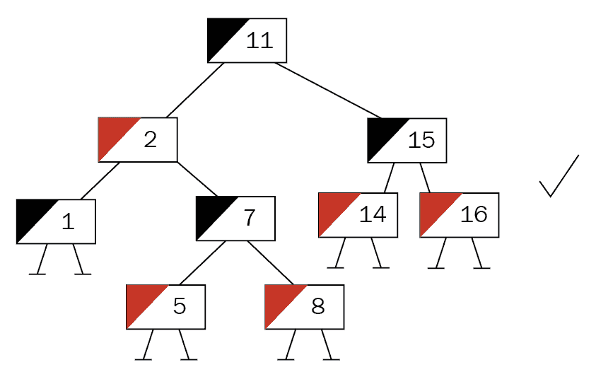

# 强健的树

列表非常适合存储大量项目，但查找特定元素怎么办？在前一章中，跳表在简单地查找项目时，比常规链表表现要好得多。为什么？因为它利用了一种类似于平衡树结构的迭代策略：在那里，内部顺序让算法能够有策略地跳过项目。然而，这仅仅是开始。许多库、数据库和搜索引擎都是基于树构建的；事实上，每当程序编译时，编译器都会创建一个抽象语法树。

基于树的数据库结构结合了各种智能想法，我们将在本章中探讨，所以你可以期待以下内容：

+   实现和理解二叉搜索树

+   了解自平衡树

+   前缀或后缀树是如何工作的

+   优先队列内部使用什么

+   图，最通用的树结构

# 二叉搜索树

树结构几乎就像一个链表：每个节点都有分支——在二叉树的情况下，有两个分支——代表该节点的子节点。由于这些子节点有自己的子节点，节点数量呈指数增长，构建了一个类似常规树倒置的层次结构。

二叉树是这些结构的一个子集，只有两个分支，通常称为左和右。然而，这并不本质上帮助树的性能。这就是为什么使用*二叉搜索树*，其中左表示小于或等于其父节点的值，而右表示大于该父节点的任何值，被建立起来的原因！

如果这让你感到困惑，别担心；会有代码。首先，一些词汇：你该如何称呼树的远端？叶子。剪掉分支？修剪。每个节点的分支数量？分支因子（二叉树的分支因子为 2）。

很好，把这些都弄清楚后，节点就可以展示了——尽管它们看起来很像前一章中的双链表：

```rs
type Tree = Option<Box<Node>>;

struct Node {
    pub value: u64,
    left: Tree,
    right: Tree,
}
```

同样，树结构本身只是对根节点的指针：

```rs
pub struct BinarySearchTree {
    root: Tree,
    pub length: u64,
}
```

在你能够熟悉新的数据结构之前，前一章的产品团队又回来了！你们在改进事务日志方面做得很好，他们希望继续这种进步，并构建一个**物联网（IoT**）设备管理平台，以便用户可以使用数字名称注册设备，并在以后搜索它。然而，搜索必须非常快，这对于许多宣布将超过 10,000 个设备纳入新系统的客户来说尤其关键！

这不是一个用二叉搜索树获得更多经验的好机会吗？

# 物联网设备管理

物联网空间中的设备管理主要关于存储和检索特定的设备或设备孪生。这些对象通常存储地址、配置值、加密密钥或其他东西，以便没有人需要手动连接。因此，保持库存至关重要！

目前，产品团队决定采用数字“名称”，以便比竞争对手更快地可用，并保持要求简短：

+   存储物联网设备对象（包含 IP 地址、数字名称和类型）

+   通过数字名称检索物联网对象

+   遍历物联网对象

树的一个很好的用途：数字名称可以用来创建一个树并快速搜索它。存储此物联网设备信息的基本对象看起来像这样：

```rs
#[derive(Clone, Debug)]
pub struct IoTDevice {
    pub numerical_id: u64,
    pub address: String,
}
```

为了简单起见，这个对象将在代码中直接使用（添加泛型并不太复杂，但会超出本书的范围）：

```rs
type Tree = Option<Box<Node>>;
struct Node {
    pub dev: IoTDevice,
    left: Tree,
    right: Tree,
}
```

从这个基本实现开始，可以实施必要的操作，`add`和`find`。

# 更多设备

与列表不同，树在插入时做出一个主要决定：新元素将放在哪一侧？从根节点开始，每个节点的值与将要插入的值进行比较：这是否大于或小于那个值？任一决定都会导致向下进入不同的子树（左或右）。

此过程（通常是递归地）重复，直到目标子树为`None`，这正是新值插入的位置——作为树的叶子。如果这是第一个进入树中的值，它就成为根节点。这里有一些问题，更有经验的程序员可能已经有一种奇怪的感觉：如果你按升序插入数字会发生什么？

这些感觉是有道理的。按升序插入（例如，`1`，`2`，`3`，`4`）将导致一个基本上是伪装成列表的树！这也被称为（非常）不平衡的树，将不会有其他树的所有好处：

```rs
  1
/  \ 
     2
   /   \
         3
       /   \ 
             4 
```

在本章中，我们将更深入地探讨平衡树以及为什么平衡树对于实现高性能很重要。为了避免与二叉搜索树相关的这种陷阱，理想情况下第一个要插入的值应该是所有元素的中位数，因为它将被用作根节点，如下面的代码片段所示：

```rs
pub fn add(&mut self, device: IoTDevice) {
    self.length += 1;
    let root = mem::replace(&mut self.root, None);
    self.root = self.add_rec(root, device);
}

fn add_rec(&mut self, node: Tree, device: IoTDevice) -> Tree {
    match node {
        Some(mut n) => {
            if n.dev.numerical_id <= device.numerical_id {
                n.left = self.add_rec(n.left, device);
                Some(n)
            } else {
                n.right = self.add_rec(n.right, device);
                Some(n)
            }
        }
        _ => Node::new(device),
    }
}
```

将代码分为两部分，这部分代码递归地遍历树以找到适当的位置，并将新值作为叶子附加在那里。实际上，插入并不比常规的树遍历在搜索或迭代中不同。

**递归**是函数调用自身。想想电影《盗梦空间》——梦中有梦，梦中有梦。这是同样的概念。在编程中有一些影响：原始函数最后被销毁，因为只有当所有递归调用返回后它才完成。这也意味着所有内容都存在于更小的栈上，这可能导致在调用过多时栈溢出！通常，递归算法也可以迭代实现，但它们更难理解——所以要明智选择！

# 查找正确的一个

能够将设备添加到树中，更重要的是能够再次检索它们。就像前一章中的跳表一样，这种检索理想情况下运行在 *O(log n)* 时间内，这意味着在搜索时将跳过大多数元素。

因此，如果树在某一方向上倾斜，性能接近 *O(n)*，查看的元素更多，从而使得搜索变慢。由于倾斜的树更像列表，递归插入算法会因只有单个项目的“层级”数量众多而快速溢出栈。否则，递归算法只调用树的高度次数，在平衡树中这是一个相当小的数字。算法本身类似于之前展示的插入算法：

```rs
pub fn find(&self, numerical_id: u64) -> Option<IoTDevice> {
    self.find_r(&self.root, numerical_id)
}

fn find_r(&self, node: &Tree, numerical_id: u64) -> Option<IoTDevice> {
    match node {
        Some(n) => {
            if n.dev.numerical_id == numerical_id {
                Some(n.dev.clone())
            } else if n.dev.numerical_id < numerical_id {
                self.find_r(&n.left, numerical_id)
            } else {
                self.find_r(&n.right, numerical_id)
            }
        }
        _ => None,
    }
}
```

虽然这个片段的目的是找到特定的节点，但它与列举每个设备有着密切的关系——这是此服务用户肯定希望拥有的功能。

# 查找所有设备

在访问每个节点时遍历树并执行回调可以以三种方式完成：

+   前序，执行回调 *在下降之前*

+   中序，它执行回调 *在下降到左子树之后，但在下降到右子树之前*

+   后序，其中回调在 *下降后* 执行

这些遍历策略中的每一种都会产生不同的树元素顺序，其中中序产生排序输出，而前序和后序则创建更结构化的排序。对于我们的用户来说，中序遍历将提供最佳体验，因为它还让他们更好地推理预期的结果，如果以列表形式显示，则更容易导航。

虽然以递归方式实现这种行走非常简单，但提供一个迭代器更符合用户习惯（就像前一章中的列表一样），并且它使许多附加功能成为可能，例如 `map()` 和 `filter()`。然而，这种实现必须是迭代的，这使得它更复杂，并减少了树的一些效率。

因此，此树支持一个 `walk()` 函数，每次遇到节点时都会调用提供的函数，这可以用来填充迭代器的向量：

```rs
pub fn walk(&self, callback: impl Fn(&IoTDevice) -> ()) {   
    self.walk_in_order(&self.root, &callback);
}

fn walk_in_order(&self, node: &Tree, callback: &impl Fn(&IoTDevice) -> ()) {
    if let Some(n) = node {
        self.walk_in_order(&n.left, callback);
        callback(&n.dev);
        self.walk_in_order(&n.right, callback);
    }
}
```

这里展示了如何使用这种行走方法构建向量的示例：

```rs
let my_devices: RefCell<Vec<IoTDevice>> = RefCell::new(vec![]); tree.walk(|n| my_devices.borrow_mut().push(n.clone()));
```

拥有这种行走能力，目前所有需求都已得到满足。

# 总结

由于它们的简单性，二叉搜索树非常高效。事实上，本节中整个树实现只用不到 90 行 Rust 代码完成，每个函数大约 10 行。

二叉树的效率允许大量使用递归，这通常会导致与迭代版本相比更容易理解的函数。在理想情况下，即当树完全平衡时，函数只需要处理 *log2(n)* 个节点（*n* 是节点总数）——在一个包含 100 万个元素的树中只有 19 个！

不平衡的树会显著降低性能，并且它们很容易意外创建。最不平衡的树是通过插入已经排序的值创建的，这会在搜索性能上造成很大的差异：

```rs
test tests::bench_sorted_insert_bst_find ... bench: 16,376 ns/iter (+/- 6,525)
test tests::bench_unsorted_insert_bst_find ... bench: 398 ns/iter (+/- 182)
```

这些结果反映了跳表和前一章中的双链表之间的差异。

# 优点

回顾一下，二叉搜索树对用户来说有许多好处：

+   简单实现

+   高效且快速的搜索

+   遍历允许不同的排序

+   非常适合大量未排序的数据

# 缺点

通过使用二叉搜索树，其缺点很快就会变得明显：

+   最坏情况下的性能与链表相当

+   不平衡的树很容易意外创建

+   不平衡的树不能“修复”

+   递归算法在不平衡的树上可能会溢出

显然，许多更深层次的问题都源于树以某种方式不平衡——对此有一个解决方案：自平衡二叉搜索树。

# 红黑树

在之前的树结构中，有一个主要的缺点：插入到树中的先前未知的键序列无法排序。想想大多数标识符是如何生成的；它们通常是递增的数字。对这些数字进行洗牌并不总是有效，尤其是在它们逐渐添加时。由于这会导致不平衡的树（极端情况表现得就像一个列表），鲁道夫·拜尔提出了一个特殊的自平衡树的想法：红黑树。

这棵树是一个二叉搜索树，它在插入后添加了重新平衡的逻辑。在这个操作中，知道何时停止“平衡”至关重要——这就是发明者想到使用两种颜色：红色和黑色。

在文献中，红黑树被描述为满足一系列规则的二叉搜索树：

+   根节点始终是黑色

+   每个其他节点要么是红色，要么是黑色

+   所有叶子（通常是 `null`/`NIL` 值）都被认为是黑色的

+   红色节点只能有黑色子节点

+   从根到其叶子的任何路径都有相同数量的黑色节点

通过强制执行这些规则，可以通过编程验证树是否平衡。这些规则是如何做到这一点的呢？规则 4 和 5 提供了答案：如果每个分支都必须有相同数量的黑色节点，那么两边不可能有显著的一边比另一边长，除非有很多红色节点。

这些能有多少呢？最多和黑色节点一样多——因为它们不能有红色子节点。因此，一个分支不能显著超过另一个，使得这棵树保持平衡。验证函数的代码很好地说明了这一点：

```rs

pub fn is_a_valid_red_black_tree(&self) -> bool {
    let result = self.validate(&self.root, Color::Red, 0);
    let red_red = result.0;
    let black_height_min = result.1;
    let black_height_max = result.2;
    red_red == 0 && black_height_min == black_height_max
}

// red-red violations, min black-height, max-black-height
fn validate(
    &self,
    node: &Tree,
    parent_color: Color,
    black_height: usize,
) -> (usize, usize, usize) {
    if let Some(n) = node {
        let n = n.borrow();
        let red_red = if parent_color == Color::Red && n.color == Color::Red {
            1
        } else {
            0
        };
        let black_height = black_height + match n.color {
            Color::Black => 1,
            _ => 0,
        };
        let l = self.validate(&n.left, n.color.clone(), black_height);
        let r = self.validate(&n.right, n.color.clone(), black_height);
        (red_red + l.0 + r.0, cmp::min(l.1, r.1), cmp::max(l.2, r.2))
    } else {
        (0, black_height, black_height)
    }
}
```

就像二叉搜索树一样，树中的每个节点都有两个子节点，键要么大于、等于或小于当前节点的键。除了键（如键值对）之外，节点还存储一个颜色，插入时为红色，并指向其父节点。为什么？这是因为所需的平衡，这将在后面描述。首先，这可以是一个典型的节点：

```rs
type BareTree = Rc<RefCell<Node>>;
type Tree = Option<BareTree>;

struct Node {
    pub color: Color,
    pub key: u32,
    pub parent: Tree,
    left: Tree,
    right: Tree,
}
```

使用这些节点，可以创建一个树，就像二叉搜索树一样。实际上，插入机制完全相同，只是设置了父指针。新插入的节点总是着色为红色，一旦就位，树可能会违反规则。只有在这种情况下，才是寻找和修复这些问题的时机。

插入后，树处于无效状态，需要一系列步骤来恢复红黑树属性。这个系列，由旋转和重新着色*组成，从插入节点开始，向上到根节点被认为是有效的。总之，红黑树是一种旋转和重新着色直到恢复平衡的二叉搜索树。

**重新着色**只是将指定节点的颜色更改为特定颜色，这在进行树平衡的最后一步发生。**旋转**是一组三个节点（当前节点、其父节点和其祖父节点）的操作。它通过围绕指定节点左旋或右旋来折叠类似列表的链到树中。结果是改变了层次结构，中心节点的左子节点或右子节点位于顶部，其子节点相应地调整：


显然，这个例子太简单了，它只能在最初的几次插入中发生。在重新定义一组节点层次结构之后，旋转需要重新着色。为了增加复杂性，旋转通常会连续发生：


前面的树已经插入了一个节点，现在违反了规则 4：*红色节点上不能有红色子节点*。下一步是确定需要哪些步骤来建立平衡。为此，检查父节点的兄弟节点的颜色（即叔叔的颜色）。红色表示将两个兄弟节点都着色为黑色，并将它们的父节点着色为红色不会使树无效，并修复条件。这里不是这种情况（叔叔是 `None`，这意味着黑色），需要进行一些旋转：


第一步是将节点排列成一条左子节点的链（在这种情况下），这是通过围绕中心节点，插入节点的父节点旋转来完成的：


一旦链对齐，第三个节点（祖父节点）向右旋转就通过提升中间节点（“最年轻”的节点/插入节点）创建了一个有效的子树，前父节点和祖父节点分别位于左侧和右侧。然后，新的星系被重新着色，程序重新开始，以新子树的根为中心（在这个例子中，尽管如此，树已经有效）：



这些步骤可以重复进行，直到树有效且到达根节点（这可能与您开始时的情况不同）。这个根节点也被启发式地涂成黑色，这不会违反规则，但缩短了潜在的红色-红色违规。有关修复操作的代码，请参阅以下小节。

产品团队甚至将这段时间用来强调他们的新产品理念。物联网平台相当受欢迎，客户一直在大量使用它——并且在他们继续添加顺序编号的设备时，他们认识到了重大的减速。这导致了愤怒的客户服务电话，然后转向产品团队寻求帮助——现在是时候实施解决方案并替换当前的设备管理树了。

# 更好的物联网设备管理

我们用户面临的问题很清楚：如果一个二叉搜索树遇到排序数据（如增量 ID），它只能始终向一侧追加，从而创建一个不平衡的树。红黑树能够在插入时执行更多操作（如旋转子树）的代价下处理这个问题，这对用户来说是可接受的。

这棵树与二叉搜索树有类似的节点，增加了颜色字段和父字段，后者相对于二叉搜索树来说，变化更大。多亏了回指，树节点不能仅拥有指向子节点和父节点的指针（因为，谁拥有这个值，父节点还是子节点？），这需要 Rust 中一个众所周知的模式：内部可变性。正如在前一章中讨论的，`RefCell` 拥有数据的内存部分，并在运行时处理借用检查，以便可以获取可变和不可变引用：

```rs
type BareTree = Rc<RefCell<Node>>;
type Tree = Option<BareTree>;

struct Node {
    pub color: Color,
    pub dev: IoTDevice,
    pub parent: Tree,
    left: Tree,
    right: Tree,
}

impl Node {
    pub fn new(dev: IoTDevice) -> Tree {
        Some(Rc::new(RefCell::new(Node {
            color: Color::Red,
            dev: dev,
            parent: None,
            left: None,
            right: None,
        })))
    }
}
```

一旦设置到位，就可以添加设备。

# 更多的设备

一旦创建了树，`add()` 函数允许用户添加设备。然后，树继续像二叉搜索树一样插入新键，只是在之后立即检查和修复任何错误。在二叉搜索树中可以使用简单的 `if` 条件来决定前进的方向，而在红黑树中，方向有更大的影响，嵌套 `if` 条件会导致混乱、难以阅读的代码。

因此，让我们首先创建 `enum`，这样每当需要决定方向（例如，插入，节点相对于另一个节点的位置等）时，我们都可以依赖这个 `enum`。对于树的颜色也是如此：

```rs
#[derive(Clone, Debug, PartialEq)]
enum Color {
    Red,
    Black,
}

#[derive(PartialEq)]
enum RBOperation {
    LeftNode,
    RightNode,
}
```

现在，`add()`函数可以使用 Rust 的 match 子句来优雅地组织两个分支：

```rs
pub fn add(&mut self, device: IoTDevice) {
    self.length += 1;
    let root = mem::replace(&mut self.root, None);
    let new_tree = self.add_r(root, device);
    self.root = self.fix_tree(new_tree.1);
}

fn add_r(&mut self, mut node: Tree, device: IoTDevice) -> (Tree, BareTree) {
    if let Some(n) = node.take() {
        let new: BareTree;
        let current_device = n.borrow().dev.clone();

        match self.check(&current_device, &device) {
            RBOperation::LeftNode => {
                let left = n.borrow().left.clone();
                let new_tree = self.add_r(left, device);
                new = new_tree.1;
                let new_tree = new_tree.0.unwrap();
                new_tree.borrow_mut().parent = Some(n.clone());
                n.borrow_mut().left = Some(new_tree);
            }

            RBOperation::RightNode => {
                let right = n.borrow().right.clone();
                let new_tree = self.add_r(right, device);
                new = new_tree.1;
                let new_tree = new_tree.0.unwrap();

                new_tree.borrow_mut().parent = Some(n.clone());
                n.borrow_mut().right = Some(new_tree);
            }
        }
        (Some(n), new)
    } else {
        let new = Node::new(device);
        (new.clone(), new.unwrap())
    }
}
```

代码的主要部分之一是“检查”两个设备，即比较它们以提供它们应该附加到的方向。这种比较是在一个单独的函数中完成的，以提高可维护性：

```rs
fn check(&self, a: &IoTDevice, b: &IoTDevice) -> RBOperation {
    if a.numerical_id <= b.numerical_id {
        RBOperation::LeftNode
    } else {
        RBOperation::RightNode
    }
}
```

虽然这个树会将每个更大的项目附加到左侧（这似乎很奇怪），但算法并不关心；无论怎样它们都会工作——通过将其封装到自己的函数中，改变变得快速且简单。

# 平衡这棵树

在节点正确添加后，`fix_tree()`负责迭代地恢复红黑树的性质——这是非常好地描述性和演示性的，但它很长，所以让我们将其分成几个部分。最初，函数确定它是否应该停止（或甚至不开始）——这仅在两种情况下发生：

+   当它已经是根节点时

+   当当前检查节点的父节点是红色时

显然，前者是常规的退出标准，因为循环优化并移动当前指针（`n`代表节点）从底部向树根移动以停止在那里：

```rs
fn fix_tree(&mut self, inserted: BareTree) -> Tree {
    let mut not_root = inserted.borrow().parent.is_some();

    let root = if not_root {
        let mut parent_is_red = self.parent_color(&inserted) == Color::Red;
        let mut n = inserted.clone();
        while parent_is_red && not_root {
            if let Some(uncle) = self.uncle(n.clone()) {
```

一旦开始，循环立即寻找特定节点的叔叔节点（即祖父的第二个孩子）及其颜色。叔叔节点可以是黑色（或`None`）或红色，下面将讨论这两种情况。同样重要的是要找出它是哪个叔叔，因此当前指针指向哪个节点：左节点或右节点。让我们看一下下面的代码片段：

```rs
           if let Some(uncle) = self.uncle(n.clone()) {
                let which = uncle.1;
                let uncle = uncle.0;

                match which {
                    RBOperation::LeftNode => {
                        // uncle is on the left
                        // ...

                    RBOperation::RightNode => {
                        // uncle is on the right
                        // ...
```

这个信息对于确定这个树区域的旋转顺序至关重要。实际上，两个分支将执行相同的步骤，但相反：

```rs
                        // uncle is on the left
                        let mut parent = n.borrow().parent
                                         .as_ref().unwrap().clone();
                        if uncle.is_some()
                            && uncle.as_ref().unwrap().borrow()
                               .color == Color::Red
                        {
                            let uncle = uncle.unwrap();
                            parent.borrow_mut().color = Color::Black;
                            uncle.borrow_mut().color = Color::Black;
                            parent.borrow().parent.as_ref()
                              .unwrap().borrow_mut().color =
                                                        Color::Red;

                            n = parent.borrow().parent.as_ref()
                                 .unwrap().clone();
                        } else {
                            if self.check(&parent.borrow().dev, 
                                          &n.borrow().dev)
                                            == RBOperation::LeftNode
                            {
                                // do only if it's a right child
                                let tmp = n.borrow().parent.as_ref()
                                          .unwrap().clone();
                                n = tmp;
                                self.rotate(n.clone(), 
                                Rotation::Right);
                                parent = n.borrow().parent.as_ref()
                                         .unwrap().clone();
                            }
                            // until here. then for all black uncles
                            parent.borrow_mut().color = Color::Black;
                            parent.borrow().parent.as_ref()
                              .unwrap().borrow_mut().color =
                                                     Color::Red;
                            let grandparent = n
                                .borrow()
                                .parent
                                .as_ref()
                                .unwrap()
                                .borrow()
                                .parent
                                .as_ref()
                                .unwrap()
                                .clone();
                            self.rotate(grandparent, Rotation::Left);
                        }
```

这段代码包含大量的`unwrap()`、`clone()`和`borrow()`实例，这是内部可变性模式的后果。在这种情况下，宏可以帮助减少代码的冗长性。

一部分树的运算完成后，下一迭代通过检查是否存在红色-红色违规来准备，以查看循环是否需要继续。

在主循环退出后，当前节点的指针向上移动到树根节点（毕竟，这将是函数的返回值）并着色为黑色。为什么？这是一个快捷解决方案，否则会导致另一个迭代需要执行许多更昂贵的步骤，而红黑树的规则要求根节点必须是黑色的：

```rs
            not_root = n.borrow().parent.is_some();
            if not_root {
                parent_is_red = self.parent_color(&n) == Color::Red;
            }
        }
        while n.borrow().parent.is_some() {
            let t = n.borrow().parent.as_ref().unwrap().clone();
            n = t;
        }
        Some(n)
    } else {
        Some(inserted)
    };
    root.map(|r| {
        r.borrow_mut().color = Color::Black;
        r
    })
```

使用这个快捷方式，可以返回一个有效的树，可以将其设置为新的根。然而，树的主要目的是找到东西，这与常规的二叉搜索树并没有太大的不同。

# 现在找到正确的

这段代码几乎可以重用自二叉搜索树。除了`borrow()`调用（而不是简单的解引用或`*`运算符）增加了处理时间外，它们提供了持续一致的搜索速度。为了更好地重用现有函数，要找到的值被封装到一个虚拟节点中。这样，就不需要为比较节点创建额外的接口：

```rs
pub fn find(&self, numerical_id: u64) -> Option<IoTDevice> {
    self.find_r(
        &self.root,
        &IoTDevice::new(numerical_id, "".to_owned(), "".to_owned()),
    )
}

fn find_r(&self, node: &Tree, dev: &IoTDevice) -> Option<IoTDevice> {
    match node {
        Some(n) => {
            let n = n.borrow();
            if n.dev.numerical_id == dev.numerical_id {
                Some(n.dev.clone())
            } else {
                match self.check(&n.dev, &dev) {
                    RBOperation::LeftNode => self.find_r(&n.left, dev),
                    RBOperation::RightNode => self.find_r(&n.right, dev),
                }
            }
        }
        _ => None,
    }
}
```

这又是树的递归遍历，直到找到指定的值。此外，"常规"的树遍历也被添加到了红黑树变体中：

```rs
pub fn walk(&self, callback: impl Fn(&IoTDevice) -> ()) {
    self.walk_in_order(&self.root, &callback);
}

fn walk_in_order(&self, node: &Tree, callback: &impl Fn(&IoTDevice) -> ()) {
    if let Some(n) = node {
        let n = n.borrow();

        self.walk_in_order(&n.left, callback);
        callback(&n.dev);
        self.walk_in_order(&n.right, callback);
    }
}
```

在这些部分修复后，平台的表现始终很快！

# 总结

红黑树是优秀的自平衡二叉树，类似于**AVL**（代表**Adelson-Velsky and Landis**）树。两者几乎同时出现，但 AVL 树由于分支高度差较小而被认为是优越的。无论使用哪种树结构，两者都比它们的简单兄弟二叉搜索树快得多。使用排序数据在插入（本例中为 100,000 个元素）上的基准测试显示了平衡树和不平衡树之间的差异：

```rs
test tests::bench_sorted_insert_bst_find ... bench: 370,185 ns/iter (+/- 265,997)
test tests::bench_sorted_insert_rbt_find ... bench: 900 ns/iter (+/- 423)
```

平衡树的另一种变体是 2-3-4 树，这是一种可以将红黑树转换成的数据结构。然而，2-3-4 树，就像本章后面将要提到的 B 树一样，是非二叉的。因此，它在本章的后面简要讨论，但我们鼓励您寻找其他来源以获取详细信息。

在 Rust 中实现红黑树的一个主要优点是，在旋转或"解包"节点祖父节点时，对借用和所有权的深入理解。在编程练习中实现自己的版本是非常推荐的！

# 优点

红黑树相对于常规二叉搜索树有几个可取的特性：

+   平衡使搜索始终快速

+   可预测，内存使用低

+   插入操作相对较快

+   二叉树的简单性

+   容易验证

然而，这种数据结构也有一些显著的缺点，尤其是在计划实现它的时候！

# 缺点

速度很快，但你的实现能否达到这一点？让我们来看看红黑树的缺点：

+   实现复杂，尤其是在 Rust 中

+   并发写入需要锁定整个树

+   与二叉搜索树相比，性能很好，但其他树在相同复杂度下表现更好

+   跳表（来自上一章）在更好的并发性和更简单的实现上表现相似

在任何情况下，红黑树都是深入复杂二叉树结构的绝佳之旅。一种更奇特的二叉树结构是堆（不要与主内存的一部分混淆）。

# 堆

由于二叉树是树的最基本形式，因此设计了多种变体，用于特定目的。红黑树是初始树的先进版本，而二叉堆是二叉树的一种版本，它不便于搜索。

实际上，它有一个特定的目的：找到节点的最大值或最小值。这些堆（最小堆或最大堆）是以一种方式构建的，使得根节点总是具有所需属性（最小或最大）的值，因此可以以恒定时间检索——也就是说，获取所需的时间总是相同的。一旦检索到，树将以一种方式恢复，使得下一次操作可以正常工作。那么，这是如何实现的呢？

堆（无论是最小堆还是最大堆）都有效，因为一个节点的子节点总是具有整个树相同的属性。在最大堆中，这意味着根节点是序列中的最大值，因此它必须是它的子节点中的最大值（最小堆的情况与此相同，只是方向相反）。虽然没有特定的顺序（例如左节点大于右节点），但有一个惯例是对于最大堆优先考虑右节点，对于最小堆优先考虑左节点。

在插入一个新节点后，它会被添加到最后，然后需要在树中确定其位置。完成这一操作的策略很简单：查看父节点；如果它更大（在最大堆中），则交换这两个节点，并重复此操作，直到不再适用或成为根节点。我们称此操作为**上堆**。

同样，删除操作也是这样进行的。一旦删除，现在为空的槽位会被树的一个叶子节点替换——这个叶子节点要么是最小值（最大堆）要么是最大值（最小堆）。然后，实现与插入相同的比较，但方向相反。将此节点与其子节点比较和交换可以恢复堆的性质，这被称为**下堆**。

如果你注意到了一个节点的旅程，有一个细节可能会对你显而易见：树总是“填满”的。这意味着每一层都是完全填充的（也就是说，每个节点都有两个孩子），使其成为一个**完全二叉树**，并保持总顺序。这是一个让我们可以在数组（动态或静态）中实现此树并使跳跃变得便宜的性质。一旦你看到一些图表，一切都会变得清晰：


通常，堆被用来创建某种类型的优先队列，这得益于快速检索最高或最低值项的能力。一个非常基本的堆可以用 Rust 作为数组实现，这将提供使其工作所需的一切，但不会像`Vec`那样方便。

在物联网设备平台取得巨大成功之后，计划增加一个附加功能。产品团队正在寻求一种高效处理来自设备消息的方法，以便客户只需处理消息的实际处理，跳过“管道”代码。由于处理可以在（短）间隔内执行，他们需要一个快速排序它们的方法——理想情况下，让消息最多的设备先来。

这听起来像是堆数据结构，不是吗？实际上，它可以是最大堆。

# 一个巨大的收件箱

通常，堆被用作各种优先队列。这样的队列存在于任何资源受限的环境中（以及其他所有地方），但它们的目的是以有序的方式输出事物。通过使用消息数量来确定消息通知的优先级，堆可以完成这个特性的繁重工作。在深入探讨难点之前，这里有一些包含信息的数据位：

```rs
#[derive(Clone, Debug)]
pub struct MessageNotification {
    pub no_messages: u64,
    pub device: IoTDevice,
}
```

理念是使用消息的数量作为指示器，以确定首先轮询哪个设备，这就是为什么需要设备。使用这种类型，堆不需要任何特定的节点或链接类型来工作：

```rs
pub struct MessageChecker {
    pub length: usize,
    heap: Vec<Box<MessageNotification>>,
}
```

这里有两个有趣的观点：其底层结构是一个常规的 `Vec<T>`，这是因为它具有扩展能力（Rust 的数组在编译时确定大小），以及 `push` 或 `pop` 的功能。

另一个值得注意的修改是，不需要 `Option`，这从代码中移除了一个检查，并使其更容易阅读。然而，由于堆的许多操作与直接、基于 1 的索引访问很好地配合工作，在到达 `Vec<T>` 之前必须对索引进行转换。

那么，数据是如何进入的？

# 消息的进入

一旦消息到达，当上堆操作“冒泡”项目直到找到其适当位置时，它会被推送到数组的末尾。在 Rust 代码中，这看起来是这样的：

```rs
pub fn add(&mut self, notification: MessageNotification) {
    self.heap.push(Box::new(notification));
    self.length = self.heap.len();
    if self.length > 1 {
        let mut i = self.length;
        while i / 2 > 0 && self.has_more_messages(i, i / 2) {
            self.swap(i, i / 2);
            i /= 2;
        }
    }
}
```

初始时，新的通知位于 `Vec<T>` 的末尾的 `Box` 中，通过 `push()` 插入。然后一个简单的 `while` 循环通过在 `has_more_messages()` 函数为真时重复交换来冒泡新的添加项。何时为真？让我们看看代码：

```rs
fn has_more_messages(&self, pos1: usize, pos2: usize) -> bool {
    let a = &self.heap[pos1 - 1];
    let b = &self.heap[pos2 - 1];
    a.no_messages >= b.no_messages
}
```

通过封装这个函数，如果需要，可以轻松地将堆转换为最小堆——索引转换也在这里封装起来。

取出数据需要在一个名为 `pop()` 的函数中反向执行这个过程。

# 取出消息

从 `Vec<T>` 中移除第一个元素并不困难——实际上，`Vec<T>` 随带一个 `swap_remove()` 函数，它正好符合堆的需求：通过用最后一个元素替换它来从 `Vec<T>` 中移除第一个元素！这使得代码显著缩短，因此更容易推理：

```rs
pub fn pop(&mut self) -> Option<MessageNotification> {
    if self.length > 0 {
        let elem = self.heap.swap_remove(0);
        self.length = self.heap.len();
        let mut i = 1;
        while i * 2 < self.length {
            let children = (i * 2, i * 2 + 1);
            i = if self.has_more_messages(children.0, children.1) {
                if self.has_more_messages(children.0, i) {
                    self.swap(i, children.0);
                    children.0
                } else {
                    break;
                }
            } else {
                if self.has_more_messages(children.1, i) {
                self.swap(i, children.1);
                children.1
                } else {
                    break;
                }    
            }
        }
        Some(*elem)
    } else {
        None
    }
}
```

显然，这段代码并不短——那么有什么问题呢？冒泡下降。向下交换需要查看子节点（位于`i * 2`和`i * 2 + 1`的位置）以确定下一次迭代应该继续的位置。

# 总结

堆数据结构实现起来非常简单。没有冗长的展开、借用或其他调用，指针由`Vec`拥有，可以轻松交换。除此之外，上堆操作只是一个`while`循环，就像（稍微复杂一点的）下堆函数一样。

然而，堆的另一个典型用途是排序！考虑将一组数字放入堆中而不是`MessageNotification`对象，它们将按顺序输出。由于上堆/下堆操作的效率，该排序算法的最坏情况运行时间非常好——但更多内容将在第九章“排序事物”中介绍。

# 优点

紧凑且低复杂度的实现使二叉堆成为任何需要排序数据结构的绝佳选择。其他好处包括以下内容：

+   效率很高的列表排序方法

+   在并发情况下表现良好

+   存储有序数组的一种非常高效的方法

然而，也存在一些缺点。

# 缺点

堆通常很好，但有两大缺点限制了它们的使用：

+   除了队列或排序之外的使用场景很少

+   有更好的排序方法

二叉堆是二叉树中的最后一种，下一节将介绍另一种相当奇特的树形结构变体：前缀树。

# 前缀树

前缀树是另一种有趣的数据结构——特别是它的发音方式！根据你的母语，直觉可能会指导你一种方法，但——根据维基百科——这个名字是感谢爱德华·弗雷德金，他以前缀树的方式发音这种树，即像在检索中发音**trie**。许多英语使用者倾向于说“try”。

在解决这个问题之后，前缀树实际上做了什么，以至于值得有一个不同的名字？结果是使用检索并不是一个坏主意：前缀树存储字符串。

想象一下，必须以某种方式存储这本书的全部词汇，以便找出某些单词是否包含在书中。这该如何高效地完成？

在前面的章节之后，你应该已经有了答案，但如果考虑字符串——它们作为`char`实例的数组或列表存储——这将使用大量的内存。由于每个单词都必须使用英文字母表中的字母，我们不能利用这一点吗？

前缀树做的是类似的事情。它们使用字符作为树中的节点，其中父节点是前面的字符，所有子节点（仅限于字母表的大小）是跟随的。以下是一个存储字符串 ABB、ABC、CAACB、CAACA、BBB 和 BBA 的前缀树图：


以这种方式存储字符串可以非常高效地进行搜索。你只需遍历要存储的键中的字母，就可以找出（或存储）该字符串是否包含在例如集合中。实际上，如果字符串只能有特定的大小，那么检索时间将是恒定的，并且无论 trie 存储 10 个还是 1000 万个单词都无关紧要。通常，这对于集合数据结构或具有字符串键的键值存储（例如散列，但稍后再讨论）很有用。就像二叉搜索树一样，这种结构具有强大的分层内存管理（即没有“回指”的指针），使其非常适合 Rust。

最近，产品团队再次查看了用户的设备键，并发现典型的物联网设备使用代表路径的键，它们通常会看起来像`countryA/cityB/factoryC/machine1/positionX/sensorY`。想起了之前工作得很好的树，他们认为可以使用这些来改进目录。但您已经有了更好的想法！

# 更现实的物联网设备管理

这样的路径往往有很大的重叠，因为单个位置中有无数个传感器和设备。此外，由于分层属性，它们是唯一的，并且如果需要找到传感器，它们是可读的。非常适合 trie！

这个 trie 的基础将是一个节点类型，它存储子节点、当前字符，如果是完整键的节点，则存储本章早些时候提到的`IoTDevice`对象。这在 Rust 中看起来是这样的：

```rs
struct Node {
    pub key: char,
    next: HashMap<char, Link>,
    pub value: Option<IoTDevice>,
}
```

这次，子节点是一个不同的数据结构：一个`HashMap`。映射（也称为字典、关联数组）明确存储一个键和一个值，而“散列”这个词暗示了将在下一章讨论的方法。目前，`HashMap`保证将单个字符与节点类型相关联，从而为迭代铺平道路。除此之外，这种数据结构还允许进行获取或添加类型的操作，这显著提高了代码的可读性。

由于可能的单词开头数量相似，根也是一个`HashMap`，这使得 trie 有多个根：

```rs
pub struct BestDeviceRegistry {
    pub length: u64,
    root: HashMap<char, Link>,
}
```

为了填充这些映射以数据，需要一个添加路径的方法。

# 添加路径

将字符串插入 trie 的算法可以用几句话来描述：遍历单词中的每个字符，并沿着 trie 向下追踪。如果一个节点尚不存在，则创建它，并将对象添加到最后一个条目。

当然，还需要决定一些特殊情况：如果字符串已经存在，会发生什么？覆盖还是忽略？在这个实现中，最后的写入将获胜——也就是说，它将覆盖之前存在的任何内容：

```rs
pub fn add(&mut self, device: IoTDevice) {
    let p = device.path.clone();
    let mut path = p.chars();
    if let Some(start) = path.next() {
        self.length += 1;
        let mut n = self.root
                .entry(start)
                .or_insert(Node::new(start, None));
        for c in path {
            let tmp = n.next
                    .entry(c)
                    .or_insert(Node::new(c, None));
            n = tmp;
        }
        n.value = Some(device);
    }
}
```

另一个特殊情况是根节点，因为它不是一个真正的节点，而是一个`HashMap`。一旦 trie 设置完成，最重要的事情就是再次获取内容！

# 步行

添加和搜索工作非常相似：遵循链接到键的字符，并在最后返回“值”：

```rs
pub fn find(&mut self, path: &str) -> Option<IoTDevice> {
    let mut path = path.chars();
    if let Some(start) = path.next() {
        self.root.get(&start).map_or(None, |mut n| {
            for c in path {
                match n.next.get(&c) {
                    Some(ref tmp) => n = tmp,
                    None => break,
                }
            }    
            n.value.clone()
        })
    } else {
        None
    }
}
```

由于 trie 不按任何特定顺序（甚至不一致）存储字符串，以可预测的方式获取相同的数据是棘手的！像二叉树一样遍历它效果足够好，但只有插入顺序是确定的，这在测试实现时应予以注意：

```rs
pub fn walk(&self, callback: impl Fn(&IoTDevice) -> ()) {
    for r in self.root.values() {
        self.walk_r(&r, &callback);
    }
}

fn walk_r(&self, node: &Link, callback: &impl Fn(&IoTDevice) -> ()) {
    for n in node.next.values() {
        self.walk_r(&n, callback);
    }
    if let Some(ref dev) = node.value {
        callback(dev);
    }
}
```

如前所述，这种遍历被称为广度优先遍历。

# 总结

Trie 数据结构是一种通过存储公共前缀来高效存储和查找字符串的方法，并且在实践中经常被使用。一个用例是流行的 Java 搜索引擎 Lucene，它使用这种结构来存储搜索索引中的单词，但跨不同领域还有许多其他示例。此外，简单性非常适合实现自定义 trie 来存储整个单词或其他对象，而不是字符。

# 优点

内置的前缀对于高效存储非常有用，除此之外，还有以下好处：

+   易于实现，便于定制

+   字符串集合的最小内存需求

+   对于已知最大长度的字符串，检索时间恒定

+   提供了异构算法（例如，Burst Sort）

虽然 trie 很棒，但它也很简单，这带来了一系列缺点。

# 缺点

Tries 可以在很多形状和形式中工作，但不幸的是，不能处理每个用例。其他缺点包括以下内容：

+   它有一个发音奇怪的名称

+   遍历时没有确定性顺序

+   没有重复的键

这就结束了更异构的树种类。接下来是 B-Tree，它本质上是一种通用树！

# B-Tree

正如你所注意到的，将子节点的数量限制为 2（就像之前的二叉树一样）会产生一个只允许算法决定是向左还是向右走的树，并且很容易硬编码。此外，在节点中仅存储单个键值对可能会被视为空间浪费——毕竟，指针可以比实际的有效负载大得多！

B-Tree 通常在每个节点中存储多个键和值，这使得它们更节省空间（有效负载到指针的比率更高）。作为树，这些（键值）对中的每一个都有子节点，它们持有位于节点之间的值。因此，B-Tree 存储键、值和子节点三重组合，还有一个额外的子指针来覆盖任何“其他”值。以下图显示了简单的 B-Tree。注意指向包含较小键的节点的额外指针：


如此所示，B-Tree 可以有不同数量的键值对（只有键是可见的），但它们将有一个最大子节点数——由*顺序*参数定义。因此，二叉搜索树可以被视为一个 2 阶 B-Tree，但没有自平衡的额外好处。

为了实现自平衡的特性，B-树具有某些特性（由唐纳德·克努特定义）：

1.  每个节点只能有*order*个子节点

1.  任何非叶节点或根节点至少有*order/2*个子节点

1.  根节点至少有两个子节点

1.  当节点有*order*个子节点时，所有节点都持有*order - 1*个键

1.  所有叶节点都位于同一级别

自平衡是如何工作的？它比红黑树简单得多。首先，新键只能插入到叶级别。其次，一旦新键找到一个节点，该节点就会根据先前的规则进行评估——特别是如果现在有超过*order - 1*个键。如果是这样，节点就必须分割，将中心键移动到父节点，如下面的图所示：


然后，将子节点放入它们预定的位置（特别是如果提升节点有子节点时尤为重要），然后重复这个过程直到根节点有效。

这个过程创建了一个被称为**胖树**（与高树相对）的东西，这意味着增加高度只能通过分割来实现，这并不经常发生。为了与节点一起工作，它们包含有关自己的额外信息：

```rs
type Tree = Box<Node>;

#[derive(Clone, PartialEq, Debug)]
enum NodeType {
    Leaf,
    Regular,
}

#[derive(Clone)]
struct Node {
    keys: Vec<Option<(u64, String, Option<Tree>)>>,
    left_child: Option<Tree>,
    pub node_type: NodeType,
}
```

在这种情况下，节点的类型由一个属性`node_type`确定，但整个节点也可以被封装在一个枚举中。此外，还附加了一个特殊的变量来处理比`keys`向量中关联的三元组相关的键更低的键。 

与二叉树一样，B-树在搜索和插入操作上表现出对数时间复杂度（*O(log2(n))*)，并且由于简化了重新平衡，它们是数据库索引的绝佳选择。实际上，许多 SQL 数据库（如 SQLite 和 SQL Server）使用 B-树来存储这些搜索索引，并使用 B+树来存储表，因为它们以智能的方式访问磁盘。

产品团队也听说了这件事，由于之前在物联网设备管理解决方案上的尝试取得了巨大成功，他们考虑用更好的数据结构来替换红黑树！他们希望通过创建一个更简化的原始数据库版本来减少错误数量，因此要求实际上保持不变。

# 物联网数据库

如前所述的实施方式，此树基于`IoTDevice`的`numerical_id`属性作为键，并将设备对象作为值。在代码中，节点看起来与之前的示例非常相似：

```rs
type Tree = Box<Node>;
type KeyType = u64;

type Data = (Option<IoTDevice>, Option<Tree>);

#[derive(Clone, PartialEq, Debug)]
enum NodeType {
    Leaf,
    Regular,
}

#[derive(Clone, PartialEq)]
enum Direction {
    Left,
    Right(usize),
}

#[derive(Clone)]
struct Node {
    devices: Vec<Option<IoTDevice>>,
    children: Vec<Option<Tree>>,
    left_child: Option<Tree>,
    pub node_type: NodeType,
}
```

与三元组不同，此节点类型使用同步索引来查找与指定键值对关联的子节点。这些对也是通过评估包含的设备的`numerical_id`属性而专门创建的，从而简化了代码和最终对键的更新。节点缺少的是父指针，这使得整个红黑树代码变得更加复杂。

树本身存储为一个在 boxed 节点上的`Option`（别名为`Tree`），以及`order`和`length`属性：

```rs
pub struct DeviceDatabase {
    root: Option<Tree>,
    order: usize,
    pub length: u64,
}
```

最后，为了检查树的合法性，这里有一个`validate`方法，它递归地找到最小和最大叶子高度，并检查子节点数量是否在范围内（如前面提到的规则所示）：

```rs
pub fn is_a_valid_btree(&self) -> bool {
    if let Some(tree) = self.root.as_ref() {
        let total = self.validate(tree, 0);
        total.0 && total.1 == total.2
    } else {
        false // there is no tree
    }
}

fn validate(&self, node: &Tree, level: usize) -> (bool, usize, usize) {
    match node.node_type {
        NodeType::Leaf => (node.len() <= self.order, level, level),
        NodeType::Regular => {
            // Root node only requires two children, 
            //  every other node at least half the
            // order
            let min_children = if level > 0 { 
                self.order / 2usize } else { 2 };
            let key_rules = node.len() <= self.order && 
                 node.len() >= min_children;

            let mut total = (key_rules, usize::max_value(), level);
            for n in node.children.iter().chain(vec![&node.left_child]) {
                if let Some(ref tree) = n {
                    let stats = self.validate(tree, level + 1);
                    total = (
                        total.0 && stats.0,
                        cmp::min(stats.1, total.1),
                        cmp::max(stats.2, total.2),
                    );
                }
            }
            total
        }
    }
}
```

建立了这些基本结构之后，我们可以继续讨论如何向树中添加新设备。

# 添加内容

B-树将新条目添加到其叶子节点，随着节点变得过大，这些条目会像气泡一样上升。为了有效地找到位置，这需要递归地进行，根据需要移除和替换所有权。以下是`add()`函数，它负责检索根节点的所有权，并使用现有或新节点进行递归调用：

```rs
type Data = (Option<IoTDevice>, Option<Tree>);

pub fn add(&mut self, device: IoTDevice) {
    let node = if self.root.is_some() {
        mem::replace(&mut self.root, None).unwrap()
    } else {
        Node::new_leaf()
    };

    let (root, _) = self.add_r(node, device, true);
    self.root = Some(root);
}
```

除了根节点的情况外，`add_r()`函数（递归调用）返回两份数据：它下降到的键以及在“提升”的情况下要添加到它返回的任何节点的设备和子节点。原则上，这个函数的工作方式如下：

1.  递归地找到适当的叶子节点，并执行排序插入。

1.  如果它不是重复项，则增加长度。

1.  如果节点现在有比允许的更多的键：分割。

1.  将原始节点及其新值的关键字返回给调用者。

1.  将新节点放置在它原来的位置。

1.  添加提升后的键。

1.  从步骤 3 重复，直到到达根级别：

```rs

fn add_r(&mut self, node: Tree, device: IoTDevice, is_root: bool) -> (Tree, Option<Data>) {
    let mut node = node;
    let id = device.numerical_id;

    match node.node_type {
        NodeType::Leaf => {                 // 1
            if node.add_key(id, (Some(device), None)) {
                self.length += 1;           // 2
            }
        }
        NodeType::Regular => {
            let (key, (dev, tree)) = node.remove_key(id).unwrap();
            let new = self.add_r(tree.unwrap(), device, false);
            if dev.is_none() {              // 5
                node.add_left_child(Some(new.0));
            } else {
                node.add_key(key, (dev, Some(new.0)));
            }
                                            // 6
            if let Some(split_result) = new.1 {
                let new_id = &split_result.0.clone().unwrap();
                node.add_key(new_id.numerical_id, split_result);
            }
        }
    }

    if node.len() > self.order {             // 3
        let (new_parent, sibling) = node.split();

        // Check if the root node is "full" and add a new level
        if is_root {
            let mut parent = Node::new_regular();
            // Add the former root to the left
            parent.add_left_child(Some(node));
            // Add the new right part as well
            parent.add_key(new_parent.numerical_id, 
                           (Some(new_parent), Some(sibling)));
            (parent, None)
        } else {
                                            // 4
            (node, Some((Some(new_parent), Some(sibling))))
        }
    } else {
        (node, None)
    }
}
```

由于根节点是一个特殊情况，其中在树中添加了一个新层级，因此必须在最后一个分割发生的地方处理这个问题——在`add_r()`函数中。这就像创建一个新的非叶子节点，将前一个根节点放在左边，其兄弟节点放在右边，将新父节点放在顶部作为根节点。

在这个实现中，大量的繁重工作是由节点的几个函数的实现完成的，包括`split()`。虽然这很复杂，但它封装了树的内部工作原理——这一点不应该过多暴露，以便于变更：

```rs
pub fn split(&mut self) -> (IoTDevice, Tree) {
    let mut sibling = Node::new(self.node_type.clone());

    let no_of_devices = self.devices.len();
    let split_at = no_of_devices / 2usize;

    let dev = self.devices.remove(split_at);
    let node = self.children.remove(split_at);

    for _ in split_at..self.devices.len() {
        let device = self.devices.pop().unwrap();
        let child = self.children.pop().unwrap();
        sibling.add_key(device.as_ref().unwrap()
                        .numerical_id, (device, child));
    }

    sibling.add_left_child(node);
    (dev.unwrap(), sibling)
}
```

如前所述，分割会产生一个新兄弟节点和两个新父节点。兄弟节点将接收键的上半部分，原始节点保留下半部分，中间的节点成为新的父节点。

添加了几个设备后，让我们谈谈如何将它们取回。

# 搜索内容

B-树的搜索工作方式与二叉树搜索相同：递归地检查每个节点以确定路径。在 B-树中，这变得非常方便，因为它可以在循环中完成，在这种情况下，由`get_device()`函数完成：

```rs
pub fn get_device(&self, key: KeyType) -> Option<&IoTDevice> {
    let mut result = None;
    for d in self.devices.iter() {
        if let Some(device) = d {
            if device.numerical_id == key {
                result = Some(device);
                break;
            }
        }
    }
    result
}
```

此函数在节点结构中实现，并对键本身进行常规线性搜索。如果找不到该键，`find_r()`函数必须决定是否继续，它通过评估节点类型来决定。由于叶节点没有子节点，找不到所需的键将结束搜索，返回`None`。常规节点允许在树的更深层继续搜索：

```rs
pub fn find(&self, id: KeyType) -> Option<IoTDevice> {
    match self.root.as_ref() {
        Some(tree) => self.find_r(tree, id),
        _ => None,
    }
}

fn find_r(&self, node: &Tree, id: KeyType) -> Option<IoTDevice> {
    match node.get_device(id) {
        Some(device) => Some(device.clone()),
        None if node.node_type != NodeType::Leaf => {
            if let Some(tree) = node.get_child(id) {
                self.find_r(tree, id)
            } else {
                None
            }
        }
        _ => None,
    }
}
```

在树值中查找某物的另一种方法是遍历树。

# 遍历树

与本章前面提到的二叉树类似，遍历可以使用不同的策略进行，即使需要遍历的分支更多。以下代码展示了中序树遍历算法，其中回调函数在左子节点和当前查看的子节点之前执行：

```rs
pub fn walk(&self, callback: impl Fn(&IoTDevice) -> ()) {
    if let Some(ref root) = self.root {
        self.walk_in_order(root, &callback);
    }
}

fn walk_in_order(&self, node: &Tree, callback: &impl Fn(&IoTDevice) -> ()) {
    if let Some(ref left) = node.left_child {
        self.walk_in_order(left, callback);
    }

    for i in 0..node.devices.len() {
        if let Some(ref k) = node.devices[i] {
            callback(k);
        }

        if let Some(ref c) = node.children[i] {
            self.walk_in_order(&c, callback);
        }
    }
}
```

由于内部排序，这种遍历可以按升序检索键。

# 总结

B-树很棒。它们在现实世界的应用中广泛使用，Rust 中的实现并不复杂，并且无论插入顺序如何都能保持良好的性能。此外，通过减少树的高度，树的顺序可以显著提高性能。建议事先估计键值对的数量并相应地调整顺序。

作为基准，让我们通过插入 100,000 个未排序的唯一元素并使用`find()`检索它们来评估这些树。点的大小表示方差，而沿*Y*轴显示的值是纳秒：


未排序查找的图表输出

除了这些，它的性能与其他树相当，但代码行数和代码复杂度都大大减少，这对其他开发者的可读性和可维护性都有影响。

# 优点

此类树在设置相应的顺序参数时可以达到极高的性能：

+   比其他自我平衡树实现起来更简单

+   广泛应用于数据库技术

+   由于自我平衡，性能可预测

+   可以进行范围查询

+   最小化磁盘访问的变体（B+树）

树的缺点很少。

# 缺点

绝对性能在很大程度上取决于树的顺序；除此之外，此树没有很多缺点。

# 图表

在它们最通用的形式中，树是图——有向无环图。一个通用图可以被描述为节点集合，有时被称为顶点，具有某些属性，例如是否允许循环。这些节点之间的连接也有自己的名称：边。这些边也可以具有某些属性，特别是权重和方向（如单行道）。

通过强制实施这些约束，可以构建一个模型，就像树一样，很好地反映了某种现实。有一件事通常被表示为加权图：互联网。虽然现在这可能是过度简化，因为各种版本的互联网协议（IPv4 和 IPv6）和**网络地址转换**（NAT）技术隐藏了大量的在线参与者，但在其早期，互联网可以被描绘为由路由器、计算机和服务器（节点）通过定义速度和延迟（权重）的链接（边）相互连接的集合。

以下图示展示了一个随机、无向、无权图：


除了人类，人类通常可以合理高效地通过这个相互连接的节点网络找到路径，而计算机需要特定的指令来在其中找到任何东西！这需要新的算法来处理这种复杂性——一旦网络中的节点数超过在时间内可以查看的节点数，这尤其棘手。这导致了许多路由算法的发展，以及寻找循环和分割网络的技术，或者流行的 NP 难问题，如旅行商问题或图着色问题。旅行商问题定义如下。

找到城市之间的最优（最短）路径，且不重复访问任何一个城市。在左侧是一些欧洲城市；在右侧，两种可能的解决方案（虚线与实线）：


现在，有许多图的例子，最明显的是社交图（在社交网络中），但也是 TensorFlow 深度学习 API、状态机以及提供通用查询语言以遍历图的图数据库的一部分。甚至可以找到一些不那么明显的用例，例如存储遗传序列（节点是 DNA 的小部分）！

为了跳出理论构建，你如何在程序中**高效**地表示一个图？作为一个具有出度顶点列表的节点结构？那么你将如何找到特定的节点？这是一个棘手的问题！图也有一个习惯，那就是会变得相当大，任何曾经想要将对象图序列化为 JSON 的人都可以证明：它们很容易耗尽内存。

处理这种数据结构的最简单方法是惊人的：一个矩阵。这个矩阵可以是稀疏的（即大小不一的列表的列表），称为**邻接表**，或者是一个完整的矩阵（邻接矩阵）。特别是对于矩阵，其大小通常是任意一边的节点数以及每个交叉处的权重（或表示“连接”或“未连接”的布尔值）。许多实现还会在它自己的列表中保留“真实”的节点，使用索引作为 ID。以下图示展示了如何将图显示为矩阵：


Rust 提供了许多实现复杂图结构的优秀工具：枚举和模式匹配提供了以低开销操作节点和边类型的方法，而迭代器和函数式方法则消除了对冗长循环的需求。让我们看看 Rust 中的一个通用图结构：

```rs
struct ASimpleGraph {
    adjacency_list: Vec<Vec<usize>>,
}
```

这个邻接列表可以存储节点以及它们是否连接，这使得它成为一个有限的无向无权图——非常适合存储对象之间简单的关系。已经，这样的数据结构有能力实现复杂的路由算法或在回溯算法中耗尽资源。在邻接列表中，列表中的每个索引代表边的起点，包含的元素（也是列表）是任何出边。要遍历图，从起点索引开始，通过搜索其边找到下一个索引。然后重复，直到到达目标节点！

当产品团队听到这个惊人的数据结构——并且他们现在非常了解你的能力——他们提出了一个新产品：字面意义上的物联网（这是一个工作标题）。他们的想法是为客户提供一种方式来模拟具有内置距离的复杂传感器放置！客户可以然后去评估彼此之间距离在某个范围内的所有传感器，找到单个故障点，或规划快速检查它们的路线。

总结来说，客户应该能够做到以下事情：

+   创建或添加节点列表

+   根据节点之间的物理距离连接节点

+   根据提供的距离找到两个节点之间的最短路径

+   获取指定节点的邻居列表，直到一定度数

伟大的想法，对吧？非常适合图。

# 字面意义上的物联网

为了在这些要求上取得领先，必须做出选择图表示的方法：列表还是矩阵？两者都工作得很好，但出于解释原因，示例将使用基于向量向量的邻接列表：

```rs
pub struct InternetOfThings {
    adjacency_list: Vec<Vec<Edge>>,
    nodes: Vec<KeyType>,
}
```

如前所述，将实际值、标识符甚至整个对象保留在其自己的列表中，并简单地使用`usize`类型的索引进行工作是有意义的。在这个示例中，边的结构可以表示为一个元组，但这样更易于阅读：

```rs
#[derive(Clone, Debug)]
struct Edge {
   weight: u32,
    node: usize,
}
```

在有了这两个结构之后，只需几行代码就可以向图中添加节点（或...事物）：

```rs
fn get_node_index(&self, node: KeyType) -> Option<usize> {
    self.nodes.iter().position(|n| n == &node)
}

pub fn set_edges(&mut self, from: KeyType, edges: Vec<(u32, KeyType)>) {
    let edges: Vec<Edge> = edges.into_iter().filter_map(|e| {
        if let Some(to) = self.get_node_index(e.1) {
            Some(Edge { weight: e.0, node: to }) 
            } else {
                None
            }}).collect();
    match self.nodes.iter().position(|n| n == &from) {
        Some(i) => self.adjacency_list[i] = edges,
        None => {
            self.nodes.push(from);
            self.adjacency_list.push(edges)
        }
    }
}
```

在该函数中，有一个关键的检查：每个边必须连接到一个有效的节点，否则它将不会被添加到图中。为了实现这一点，代码在其内部节点存储中查找`edges`参数中提供的 ID，以找到其索引，这是通过 Rust 的迭代器特质的`position()`函数完成的。它返回当提供的谓词返回 true 时的位置！同样，迭代器的`filter_map()`函数将只包括其结果集中评估为`Some()`（而不是`None`）的元素。因此，节点必须有一个设置器，该设置器也会初始化邻接表：

```rs
pub fn set_nodes(&mut self, nodes: Vec<KeyType>) {
    self.nodes = nodes;
    self.adjacency_list = vec![vec![]; self.nodes.len()]
}
```

一旦完成，图就准备好了。我们首先去找邻居怎么样？

# 邻域搜索

邻域搜索是一个非常简单的算法：从提供的节点开始，跟随每条边，并返回你找到的内容。在我们的案例中，关系度很重要。

就像之前展示的树算法一样，递归是解决这个问题的好选择。虽然迭代解决方案通常会更节省内存（没有栈溢出），但一旦你掌握了递归，它就更加描述性强。此外，一些编译器（包括部分`rustc`，但不保证）会将递归展开成循环，提供两者的最佳结合（寻找尾调用优化）！显然，最重要的是要有预期的增长；10 万个递归调用很可能会填满栈。

然而，运行邻域的函数是双重的实现。首先，面向公众的函数负责验证输入数据，并查看节点是否实际上存在：

```rs
pub fn connected(&self, from: KeyType, degree: usize) -> Option<HashSet<KeyType>> {
    self.nodes.iter().position(|n| n == &from).map(|i| {
        self.connected_r(i, degree).into_iter().map(|n| 
        self.nodes[n].clone()).collect()
    })
}
```

在处理完这些之后，递归调用可以创建一个包含所有邻居的列表，并对每个邻居运行相同的调用。返回一组节点也消除了重复：

```rs
fn connected_r(&self, from: usize, degree: usize) -> HashSet<usize> {
    if degree > 0 {
        self.adjacency_list[from]
            .iter()
            .flat_map(|e| {
                let mut set = self.connected_r(e.node, degree - 1);
                set.insert(e.node);
                set
            }).collect()
    } else {
        HashSet::new()
    }
}
```

由于递归调用返回内部表示（即索引），外部函数将这些转换回用户可以理解的数据。这个函数可以作为其他功能的基础，例如交叉两个节点的邻域，以及邻近搜索。或者，更实际一点，在传感器故障的情况下，公司可以检查是否存在一个共同设备负责（交叉），或者是否有其他附近的传感器报告了类似的测量结果，以排除故障（邻域搜索）。现在，让我们继续更复杂的事情：寻找最短路径。

# 最短路径

这个算法的根源在于早期的网络：路由器必须决定将数据包转发到何处，而没有关于其背后的任何知识。他们只能在没有完美信息的情况下做出最佳决定！计算机科学的先驱之一 Edsger Dijkstra 提出了一个以他的名字命名的图路由算法：Dijkstra 算法。

该算法迭代工作，遍历每个节点以累加它们的权重，从而找到到达该节点的距离（或成本）。然后，它将继续在成本最低的节点上操作，这使得该算法成为一个“贪婪”算法。这会一直持续到达到所需的节点或没有更多节点可以评估。

立即收敛到当前最佳（**局部最优解**）以找到最佳整体解决方案（**全局最优解**）的算法被称为**贪婪算法**。这当然很棘手，因为到达全局最优解的路径可能需要接受成本的增加！没有保证找到全局最优解的方法，所以这是关于减少陷入局部最优解的概率。2018 年一个著名的贪婪算法是随机梯度下降，它用于训练神经网络。

在代码中，它看起来是这样的：

```rs
pub fn shortest_path(&self, from: KeyType, to: KeyType) -> Option<(u32, Vec<KeyType>)> {
    let mut src = None;
    let mut dest = None;

    for (i, n) in self.nodes.iter().enumerate() {
        if n == &from {
            src = Some(i);
        }
        if n == &to {
            dest = Some(i);
        }
        if src.is_some() && dest.is_some() {
            break;
        }
    }
    if src.is_some() && dest.is_some() {
        let (src, dest) = (src.unwrap(), dest.unwrap());

        let mut distance: Vec<TentativeWeight> =
            vec![TentativeWeight::Infinite; self.nodes.len()];
        distance[src] = TentativeWeight::Number(0);

        let mut open: Vec<usize> = 
                  (0..self.nodes.len()).into_iter().collect();
        let mut parent = vec![None; self.nodes.len()];
        let mut found = false;
        while !open.is_empty() {
            let u = min_index(&distance, &open);
            let u = open.remove(u);

            if u == dest {
                found = true;
                break;
            }

            let dist = distance[u].clone();

            for e in &self.adjacency_list[u] {
                let new_distance = match dist {
                    TentativeWeight::Number(n) => 
                       TentativeWeight::Number(n + e.weight),
                    _ => TentativeWeight::Infinite,
                };

                let old_distance = distance[e.node].clone();

                if new_distance < old_distance {
                    distance[e.node] = new_distance;
                    parent[e.node] = Some(u);
                }
            }
        }
        if found {
            let mut path = vec![];
            let mut p = parent[dest].unwrap();
            path.push(self.nodes[dest].clone());
            while p != src {
                path.push(self.nodes[p].clone());
                p = parent[p].unwrap();
            }
            path.push(self.nodes[src].clone());

            path.reverse();
            let cost = match distance[dest] {
                TentativeWeight::Number(n) => n,
                _ => 0,
            };
            Some((cost, path))
        } else {
            None
        }
    } else {
        None
    }
}
```

由于这是一段较长的代码，让我们将其分解。这是确保源节点和目标节点都是图中的节点的样板代码：

```rs
pub fn shortest_path(&self, from: KeyType, to: KeyType) -> Option<(u32, Vec<KeyType>)> {
    let mut src = None;
    let mut dest = None;

    for (i, n) in self.nodes.iter().enumerate() {
        if n == &from {
            src = Some(i);
        }
        if n == &to {
            dest = Some(i);
        }
        if src.is_some() && dest.is_some() {
            break;
        }
    }
    if src.is_some() && dest.is_some() {
        let (src, dest) = (src.unwrap(), dest.unwrap());
```

然后，每个节点都会分配一个试探性权重，初始时为无限大，除了原节点，其到达成本为零。“开放”列表，包含所有尚未处理的节点，方便地使用 Rust 的范围创建——因为它对应于我们正在处理的索引。

一旦确定了较低的成本，父数组会跟踪每个节点的父节点，这提供了一种追踪最佳可能路径的方法！

```rs
        let mut distance: Vec<TentativeWeight> =
            vec![TentativeWeight::Infinite; self.nodes.len()];
        distance[src] = TentativeWeight::Number(0);

        let mut open: Vec<usize> = 
                     (0..self.nodes.len()).into_iter().collect();
        let mut parent = vec![None; self.nodes.len()];
        let mut found = false;
```

现在，让我们深入探讨路径查找。辅助函数`min_index()`接受当前距离并返回下一个最容易到达（即距离最低）的节点的索引。然后，这个节点将从开放列表中移除。如果已经到达目的地，这也是一个停止的好时机。关于这方面的更多思考，请参阅关于贪婪算法的前一个信息框。将`found`设置为`true`将有助于区分无结果和提前停止。

对于这个节点的每条边，都会计算新的距离，如果更低，则将其插入到距离列表中（从源节点看）。由于在更新向量时确保不借用，因此会有很多克隆操作。对于`u64`（或`u32`）类型，这不应该产生很大的开销（指针通常也这么大），但对于其他类型，这可能会成为性能陷阱：

```rs
        while !open.is_empty() {
            let u = min_index(&distance, &open);
            let u = open.remove(u);

            if u == dest {
                found = true;
                break;
            }

            let dist = distance[u].clone();

            for e in &self.adjacency_list[u] {
                let new_distance = match dist {
                    TentativeWeight::Number(n) => 
                        TentativeWeight::Number(n + e.weight),
                    _ => TentativeWeight::Infinite,
                };

                let old_distance = distance[e.node].clone();

                if new_distance < old_distance {
                    distance[e.node] = new_distance;
                    parent[e.node] = Some(u);
                }
            }
        }
```

在这个循环退出后，需要准备一个距离数组和父数组以便返回给调用者。首先，在父数组中从目标节点追踪回原节点，这将导致两个节点之间的反向最优路径：

```rs
        if found {
            let mut path = vec![];
            let mut p = parent[dest].unwrap();  
            path.push(self.nodes[dest].clone());
            while p != src {
                path.push(self.nodes[p].clone());
                p = parent[p].unwrap();
            }
            path.push(self.nodes[src].clone());
            path.reverse();
            let cost = match distance[dest] {     
                TentativeWeight::Number(n) => n,
                _ => 0,
            };
            Some((cost, path))
        } else {
            None
        }
    } else {
        None
    }
}
```

通过严格遵循距离最低的节点，Dijkstra 算法在提前停止时实现了很好的运行时间，并且可以通过使用更有效的数据结构（如堆）来有效地获取下一个节点来进一步提高运行时间。

图中的最短路径的现代方法通常使用*A*（发音为“a star”）算法。虽然它基于相同的原理，但也稍微复杂一些，因此超出了本书的范围。

# 总结

图的实现非常简单：在邻接表或矩阵中清晰的拥有权使得它们几乎无需费力即可使用！除此之外，还有两个尚未在本实现中涵盖的额外方面：枚举及其实现，以及使用常规操作（此处：比较）与本实现。

这表明遵守标准接口提供了很好的方式，除了枚举提供的灵活性外，还可以与标准库或知名操作进行接口。只需几行代码，就可以以可读的方式表示和操作无穷大。这也有助于更算法化的方面，这些方面将在本书的后续章节中介绍。现在，让我们再次专注于图。

# 优点

图结构独特，很少有其他方法可以达到相同的效果。在这个环境中工作使你能够深入关注关系，并以不同的方式思考问题。以下是使用图的一些优点：

+   在建模关系方面非常出色

+   高效检索特定节点的依赖关系

+   简化复杂抽象

+   使某些问题得以解决

你选择矩阵或列表表示通常是主观的选择，例如，虽然矩阵提供了简单的删除操作，但列表首先以更有效的方式存储边。这全都是权衡的结果。

# 缺点

这使我们想到了这种特定数据结构的缺点：

+   无法高效地解决某些问题（例如，具有特定属性的节点列表）

+   更低效的资源利用率

+   存在未解决的问题（例如，具有大量城市的旅行商问题）

+   通常需要重新考虑问题

在此基础上，我们可以总结本章关于树及其相关内容。

# 概述

本章深入探讨了树，从最简单的形式开始：二叉搜索树。此树通过创建一个左分支和一个右分支来准备插入的数据，这两个分支分别持有较小的或较大的值。因此，搜索算法可以根据当前节点和传入的值选择方向，从而跳过大多数其他节点。

然而，常规的二叉搜索树有一个主要的缺点：它可能变得不平衡。红黑树为此提供了一个解决方案：通过旋转子树，保持平衡的树结构，并保证搜索性能。

堆是对树结构的一种更奇特的使用。它们的主要用途是优先队列，它们可以高效地在常数时间内产生数组中的最低或最高数字。上移和下移操作在插入或删除时修复结构，使得根节点再次是最低（最小堆）或最高（最大堆）数字。

另一个非常奇特的结构是 trie。它们专门用于存储字符串，并且通过将字符作为节点，并以所需的方式“分支”单词，非常高效地找到与特定字符串关联的数据。

要提高泛化水平，B-树是树的一种通用形式。它们持有多个值，它们之间的范围导致一个子节点。类似于红黑树，它们是平衡的，并且节点只添加到叶子节点，在那里它们可能被“提升”到更高的级别。通常，这些用于数据库索引。

最后但同样重要的是，树的最通用形式：图。图是一种灵活的方式来表达受限制的关系，例如没有循环和方向性。通常，每个节点都有加权连接（边），这提供了在节点之间转换的成本概念。

在覆盖了一些基本的数据结构之后，下一章将探讨集合和映射（有时称为字典）。实际上，其中一些已经在本章中使用过了，所以下一章将专注于实现我们自己的。

# 问题

+   二叉搜索树在搜索时如何跳过几个节点？

+   什么是自平衡树？

+   为什么树中的平衡很重要？

+   堆是一种二叉树吗？

+   tries 有哪些好的用例？

+   什么是 B-树？

+   图的基本组成部分是什么？
