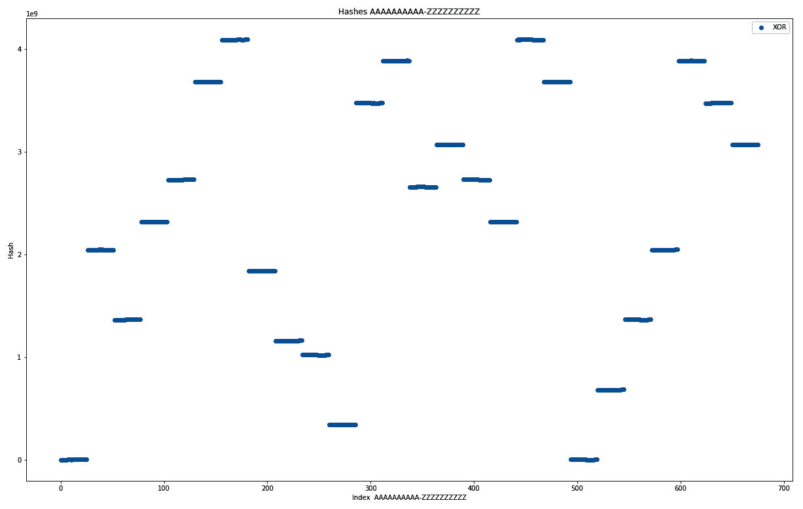
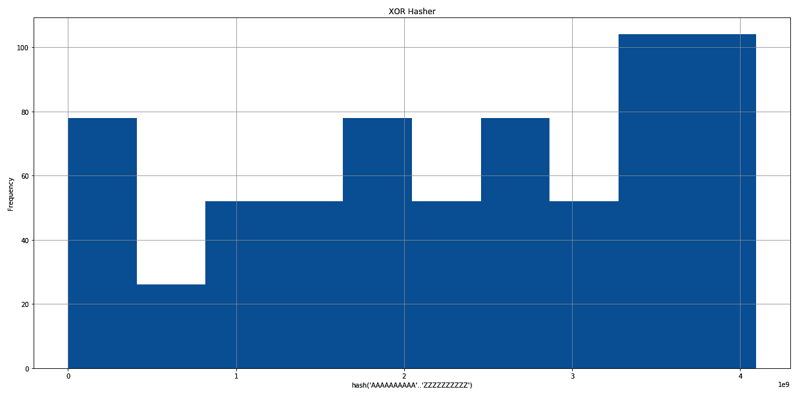
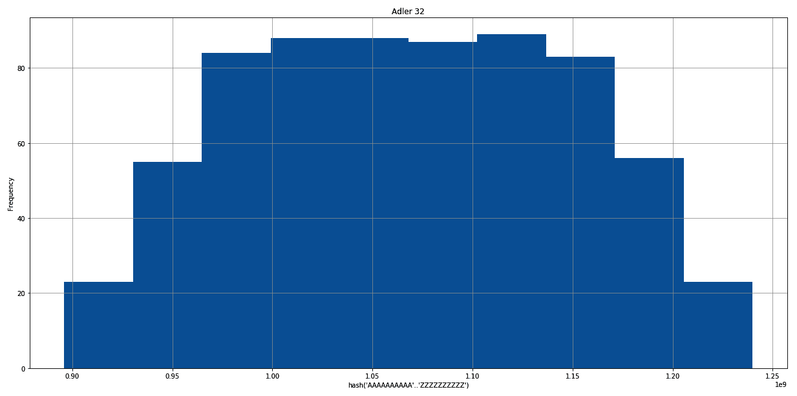
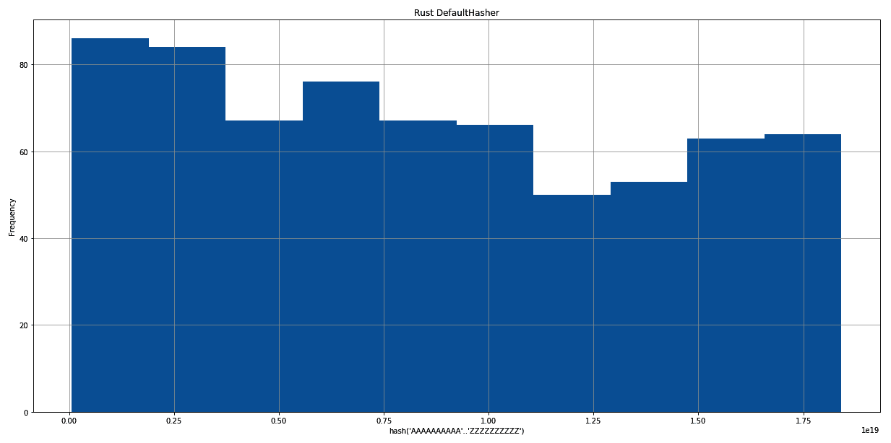
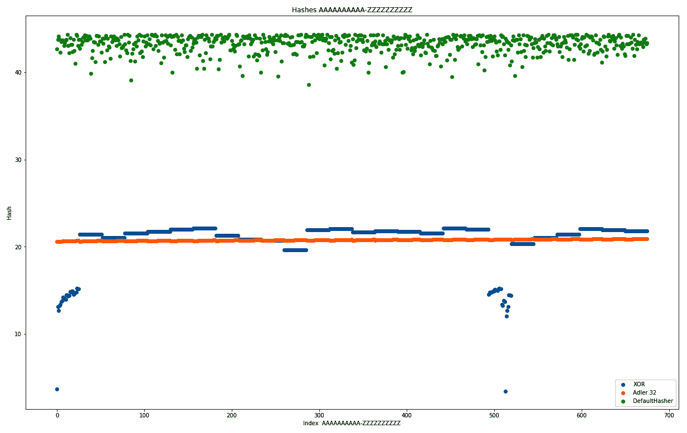
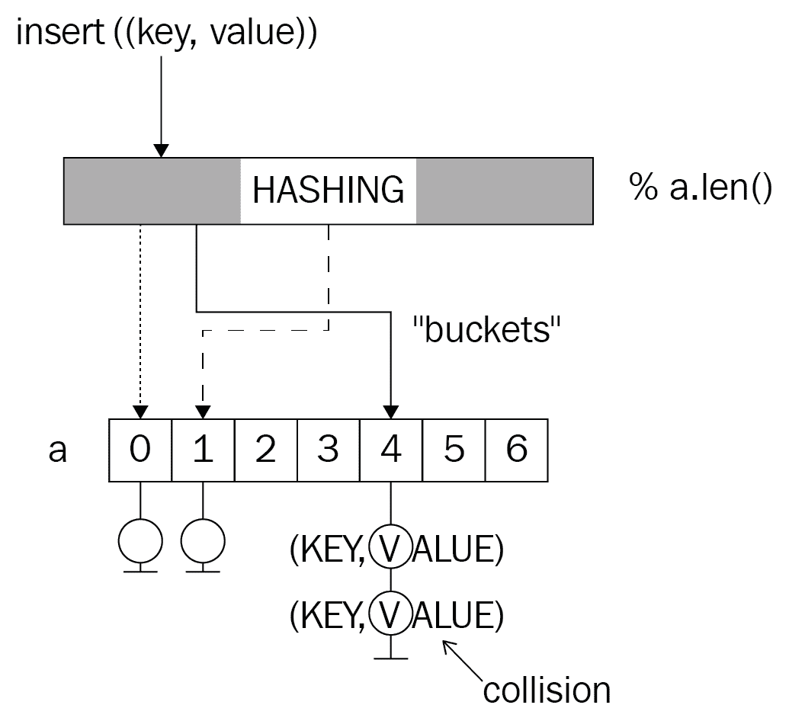
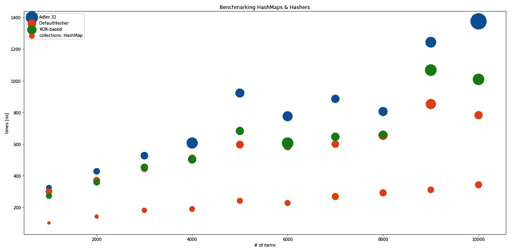
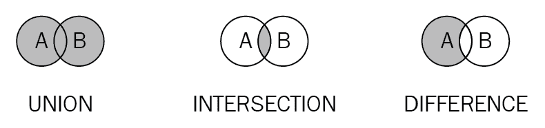

# 探索映射和集合

到目前为止，数据结构在搜索方面只变得更快速，本章也不例外。使其不同之处在于为什么以及如何在两种高级数据结构中找到数据：映射和集合。前者也被称为字典、关联数组、对象或哈希表，而后者通常被看作是一个数学概念。两者都可以依赖于哈希技术，这是一种允许以常数（或接近常数）时间检索项目、检查它们是否包含在集合中或在分布式哈希表中路由请求的技术。

这些数据结构也比之前的数据结构高一个层次，因为它们都是建立在现有结构之上的，例如动态数组或树，而且更不用说本章从算法开始。理解本章将为进入书的第二部分做好很好的准备，在那里算法是主要焦点。本章学习的内容包括以下：

+   哈希函数及其用途

+   如何基于不同的数据结构实现集合

+   使映射特殊的原因

# 哈希

生日悖论是一个众所周知的现象；两个人在这一年共享这个特殊的日子，似乎很常见，而且当它发生时我们仍然会感到兴奋。从统计学的角度来看，遇到这样的人的概率实际上非常高，因为在只有 23 人的房间里，概率就已经达到了 50%。虽然这可能是一个有趣的事实，但为什么要在介绍哈希函数的章节中提到这一点呢？

生日可以被视为一个哈希函数——尽管不是一个好的哈希函数。哈希函数是映射一个值到另一个固定大小的值的函数，例如将生日日期和月份组合成`u64`，如下所示：

```rs
fn bd_hash(p: &Person) -> u64 {
    format!("{}{}", p.day, p.month) as u64
} 
```

这个函数实际上将证明非常无效，如下所示：

+   不询问某人，很难确定性地知道他们的生日

+   空间限制在 366 个唯一值内，这也使得冲突非常可能

+   它们不是均匀分布在整个年份中

什么使一个好的哈希函数？这取决于用例。可以与哈希函数相关联的属性有很多，如下所示：

+   单向或双向（即，给定一个哈希值，能否得到原始值？）

+   确定性

+   均匀

+   固定或可变范围

在任何领域设计好的哈希函数都是一个**非常**困难的任务；在经过几年的使用后，无数算法被证明对于它们设计的目的是过于薄弱的，SHA-1 就是最新的显眼受害者。

对于各种用例，都有各种各样的哈希算法可用，从加密安全的到类似于奇偶校验位以减轻篡改的算法。本节将重点介绍我们认为有趣的几个领域；对于更全面的了解，维基百科([`en.wikipedia.org/wiki/List_of_hash_functions`](https://en.wikipedia.org/wiki/List_of_hash_functions))提供了一个显示可用哈希算法及其文章的列表。

**签名**是哈希算法中最重要的领域之一，它们可以像信用卡号码的最后一位数字（用于验证号码）一样简单，也可以是 512 位的强大加密摘要函数，其中单个冲突就是该特定算法的终结。

在密码学之外，哈希还应用于完全不同的领域，例如对等路由或以树状结构编码信息。**地理哈希**是一个很好的例子；这些地理哈希不是通过比较经纬度，而是通过比较哈希值的前几个字符来快速检查一个区域是否靠近（或位于）另一个区域。该算法已被纳入公共领域，可以在[`geohash.org/`](http://geohash.org/)找到。由于在事先已知整个可能的输入空间（地球上的坐标）的情况下，可以排除该空间中的冲突。

什么是**冲突**？当两个不同的输入参数导致相同的输出时，就会发生冲突，使得哈希变得模糊。在密码学中，这一事实将导致大规模危机，就像你找到了另一个匹配你门锁的钥匙一样。主要区别在于，在物理世界中，尝试你邻居家的每一扇门是非常不切实际的，但使用完全连接的计算机，这可以在几秒钟内完成。这意味着潜在的输入与哈希函数本身的质量一样重要——无论是时间与实践（如物理物品），还是适用范围（地球坐标，集群中的最大节点数）——将一个函数转移到更大范围的领域会导致意想不到的结果。

总结来说，当键的潜在空间不足以承受全面枚举（暴力破解）时，或者当哈希函数的输出分布不均匀时，就会发生冲突。

# 创建你自己的

为了将对象表示为数字（用于哈希表或比较），大多数语言的内置类型都带有用于此目的的可靠哈希函数，因此几乎从不建议自己构建，除非投入大量时间和精力。更好的选择是使用内置的，或者使用提供经过测试和验证方法的库。

然而，了解这些函数是如何构建的很重要，所以让我们创建一个简单的实现来分析基本原理。以下是一个使用前一个和当前字节进行异或操作以保存它们的二进制差异的例子，然后将它左移四次（以填充`u32`类型）：

```rs
pub fn hashcode(bytes: &[u8]) -> u32 {
    let mut a = 0_u32;
    for (i, b) in bytes.iter().enumerate() {
        a ^= *b as u32;
        a <<= i % 4;
    }
    a
}
```

当这个函数应用于一系列重复字母字符串时，这些值是如何分布的？直方图和散点图讲述了这个故事，如下所示：


XOR 哈希器的输出图表

这个直方图显示了当函数应用于所有`AA`-`ZZ`的组合时哈希输出的分布，但每个字母重复十次，所以第一个字符串是`AAAAAAAAAAAAAAAAAAAA`（20 个字母），最后一个字符串是`ZZZZZZZZZZZZZZZZZZZZ`，产生了 675 种 20 个字母“单词”的组合。这导致了一个不太理想的分布，其中最高频率是最低频率的五倍。虽然速度可能是使用该函数的一个因素，但它显然会对密码学产生次优结果。

在散点图中，它看起来如下：



散点图的输出图表

散点图显示了一个不同的故事。在*x*轴上，显示每个组合的索引，在*y*轴上显示哈希输出。因此，水平线表示冲突，它们无处不在！探索这种函数的进一步特性可能很有趣，但最初的结果看起来相当糟糕，寻找更好的算法是任何人最好的时间利用方式。让我们继续讨论校验和与摘要。

# 消息摘要

消息摘要的创建是为了保证真实性；如果一条消息被发送，这条消息的摘要或签名提供了一种检查消息是否被篡改的能力。因此，签名通常会以不同于原始消息的方式传输。

显然，这个哈希函数必须遵循一些基本规则才能被认为是好的，如下列所示：

+   无论消息大小如何，签名都必须快速且易于获取

+   签名只能有固定长度

+   函数必须最小化冲突

这个组包含的哈希函数是最受欢迎的，也是许多安全研究人员的目标：MD5、SHA-1/2/3 或 Adler 32。Adler 32 在`zlib`库中被广泛使用以确保文件完整性，但不应用于验证消息，因为 32 位输出空间有限。然而，它易于实现和理解，这使得它非常适合本书的目的：

```rs
const MOD_ADLER: u32 = 65521;

pub fn adler32(bytes: &[u8]) -> u32 {
    let mut a = 1_u32;
    let mut b = 0_u32;

    for byte in bytes {
        a = (a + byte as u32) % MOD_ADLER;
        b = (b + a) % MOD_ADLER;
    }

    (b << 16) | a
}
```

该算法对任何字节流的字节进行求和，并通过应用模运算来避免溢出，使用一个大质数（`65521`），这使得字节在不改变最终结果的情况下更难改变。由于有许多方法可以改变求和的运算数而不影响结果，该算法有相当大的弱点！

此外，在模运算应用后进行回绕（滚动）会给字节顺序赋予一些权重，所以如果字节的和不够大，算法预计会产生更多的碰撞。通常，此算法主要保护随机传输错误导致的位变化，在验证消息方面并不实用。

# 总结

哈希是一种非常实用的工具，开发者每天都在使用——无论是自觉还是不自觉。整数比较速度快，因此可以通过比较它们的哈希值来提高检查两个字符串相等性的效率。通过哈希，可以使得不同的键变得可比较——这是分布式数据库用来为行分配分区的方法。

**模运算哈希**是一种技术，允许分布式数据库确定性地将一行数据分配到分区。首先对行的键进行哈希处理，然后使用最大分区数与模运算符相结合，以获得存储该行的目标位置。

之前，我们探索了一些哈希函数（基于 XOR 和 Adler 32），但我们从未比较过它们。此外，Rust 的标准库提供了一个哈希函数（为`HashSet<K,V>`/`HashMap<K,V>`构建，并为所有标准类型实现），这是一个很好的基准。

首先，直方图——显示每个哈希出现的次数。如前所述，基于 XOR 的方法产生一个非常奇怪的分布，其中一些哈希明显比其他哈希出现得更频繁，如下所示：



XOR Hasher 的输出图表

在这种情况下，Adler 校验和创建了一个正态分布，这可能是由于重复的内容，以及求和的交换性质（*2 + 1 = 1 + 2*）。考虑到压缩文件中的传输错误可能产生重复，它似乎是一个针对该用例的合理选择。但在大多数其他场景中，它可能表现不佳：



Adler 32 的输出图表

下面的内容是 Rust 的默认选择，基于`SipHash`的`DefaultHasher`：



Rust DefaultHasher 的输出图表

通过观察三个分布，它们在哈希表中的应用变得明显，其中频率直接转换为每个桶中列表的长度。虽然长度为一是最佳选择，但如果发生任何碰撞，相同长度的列表至少能提供最佳性能。Rust 标准库显然做出了一个很好的选择，即基于`SipHash`的实现（[`link.springer.com/chapter/10.1007/978-3-642-34931-7_28`](https://link.springer.com/chapter/10.1007/978-3-642-34931-7_28)）。

比较散点图也揭示了散列函数的行为。请注意，它已按对数刻度缩放，以便将结果放入可管理的图中，如下所示：



XOR、Adler 32 和 DefaultHasher 的比较图

虽然比例尺不允许进行详细的判断，但看起来像一条线的总是碰撞密集的行为。正如从直方图所预期的那样，Adler 32 和基于 XOR 的方法都没有显示出云状。由于 *y* 轴显示实际的散列值（对数刻度），它越垂直分布，分布就越好。理想情况下，每个 *x* 值都有一个唯一的散列值，但每个 *y* 值大致相同的点数预示着均匀的散列函数。再次强调，Rust 的 `DefaultHasher` 在这个图中看起来非常好，而两个竞争者当在类似情况下使用时都显示出不太理想的行为。

最后提醒一句。这是软件开发者对散列的看法：安全研究人员和专业人士对散列的了解要多得多。他们应该负责提出创建消息签名的新方法，这样我们就可以专注于构建优秀的软件，并使用最好的可能组件来完成这项工作。简而言之：*不要为任何生产系统构建自己的散列函数。*

现在，让我们看看在数据结构中散列的实际应用：映射。

# 映射

数组中的索引操作快速、简单且易于理解，但有一个缺点：它们只适用于整数。由于 **数组** 是内存中连续的部分，可以通过均匀分割来访问，这使得元素之间的跳跃变得容易，那么这也可以用于任意键吗？是的！这就是映射的用武之地。

**映射**（也称为字典或关联数组），是一种以高效方式存储和管理唯一键值对的数据结构。这些结构旨在快速提供对与键相关联的值的访问，这些键通常以下两种方式之一存储：

+   一个散列表

+   一棵树

当键值对存储在树中时，结果与上一章讨论的非常相似：自平衡树将提供一致的性能，避免散列表的最坏情况成本。

由于在前一章中已经广泛讨论了树，因此本节主要关注散列表。它使用散列函数将提供的键转换为某种数字，然后将其“映射”到数组桶中。这就是整个键值对通常作为列表（或树）存储以有效地处理冲突的地方。每当查找键时，映射可以搜索相关的桶以找到确切的键。通过散列键插入键值对，使用模运算在数组中找到一个位置，并将对追加到桶中的列表。

如果列表中有两个或更多元素，则发生了一个或多个冲突：



虽然这通常会导致很好的访问时间，但每当需要存储相似哈希值（由于哈希函数不好）时，最坏的情况将是搜索一个无序列表——具有线性性能。这导致了一个包含所有数据的`Entry`类型的 boxed 切片，它是一个元组的向量。在这种情况下，实现甚至使用了泛型：

```rs
type Entry<K, V> = Vec<(K, V)>;

pub struct HashMap<K, V>
where
 K: PartialEq + Clone,
 V: Clone,
{
   hash_fn: Box<dyn (Fn(&K) -> usize)>,
   store: Box<[Entry<K, V>]>,
   pub length: usize,
}
```

此外，哈希函数可以自由选择，并存储为 boxed 函数，这使得在对象内部存储并随时调用变得方便。这也允许用户为特定用例自定义哈希类型。

通过将索引与某个哈希值关联，映射缺乏以任何顺序遍历其内容的能力。因此，键和值不能以任何顺序迭代，需要在任何操作发生之前进行排序。

再次强调，产品团队正在创新，另一个功能真的可以为客户带来很多价值：将邮编与其关于位置的实际情况关联起来。这样，网络服务可以缓存常用数据，减少数据库的负载，同时更快地为客户提供服务！由于这些位置是手动更新的，因此不需要过期，地图可以在启动时填充。

客户还提供了一份简明的要求列表以供协助，如下所示：

+   在其唯一名称下插入位置信息

+   使用名称快速检索信息

+   获取所有位置名称及其相关信息

+   使用名称更新位置

一个哈希表在这里会做得很好，不是吗？

# 位置缓存

缓存值是映射的典型用例，因为即使有大量项目，也不会对性能产生太大影响，因为键总是唯一的。这些键甚至可以携带自己的信息！

对于上一节中定义的用例，每个客户使用一个国家的邮编来识别位置；它们通常覆盖的区域只包含一个办公室。邮政编码以字符串形式存储，以涵盖现实世界中广泛的系统，并且每个国家都是唯一的。

多亏了之前的通用实现，整个`LocationCache`类型可以是一个专门的`HashMap`的别名，只需要在创建时提供哈希函数，如下所示：

```rs
pub type LocationCache = HashMap<String, LocationInformation>;
```

`HashMap`本身是一个自定义实现，它包含一个类型为`K`的键，该键必须还实现`PartialEq`（用于直接比较键实例），以及`Clone`（出于实际原因）。

# 哈希函数

除了提供通用的数据结构外，该实现允许用户提供一个自定义的哈希函数，该函数仅将键类型的引用映射到`usize`返回类型。返回类型的选择是任意的，并且是为了避免溢出而选择的。

由于之前实现的哈希函数比 Adler 32 校验和算法表现更好，位置缓存将使用这个。回想一下，该算法在字节与其前驱之间应用 XOR 操作，然后根据字节索引进行左移位。或者，Rust 的`DefaultHasher`也是可用的：

```rs
pub fn hashcode(bytes: &[u8]) -> u32 {
    let mut a = 0_u32;
    for (i, b) in bytes.iter().enumerate() {
        a ^= *b as u32;
        a <<= i % 4;
    }
    a
}
```

选择一个哈希算法是一个重要的决定，正如我们将在*总结*部分看到的那样。但首先，需要添加位置！

# 添加位置

为了添加位置，有两个重要的步骤：

1.  计算哈希

1.  选择一个桶

进一步的操作，例如进行排序插入，也会提高性能，但可以通过在每个桶中使用树而不是列表来省略这些操作。

位置缓存实现使用哈希与数组长度之间的简单模运算来选择桶，这意味着除了常规的哈希冲突之外，选择内部存储的大小也会对性能产生重大影响。选择太小的大小，桶将重叠，不管哈希函数如何！

在 Rust 代码中，第一部分是在第一行使用提供的 boxed `hashcode`函数创建哈希。接下来是找到桶，通过应用类似于模运算的操作（哈希与存储数组最高索引之间的二进制 AND 操作）以及附加列表的线性搜索。如果找到键，则更新附加对；如果没有找到，则将其添加到向量中：

```rs
pub fn insert(&mut self, key: K, value: V) {
    let h = (self.hash_fn)(&key);
    let idx = h & (self.store.len() - 1);
    match self.store[idx].iter().position(|e| e.0 == key) {
        Some(pos) => self.store[idx][pos] = (key, value),
        None => {
            self.store[idx].push((key, value));
            self.length += 1
        }
    }
}
```

一旦存储了位置和匹配的哈希值，就可以再次检索。

# 获取位置

就像插入一样，检索过程也有相同的步骤。无论是`get()`函数返回一个值还是`remove()`函数，两者都经过相同的步骤：哈希、匹配桶、进行线性搜索，最后与预期的返回类型匹配。`get()`函数可以利用 Rust 强大的迭代器通过使用`find`在桶的向量内匹配谓词，并且由于返回的是`Option<Item>`，可以使用其`map`函数提取值而不是返回整个对：

```rs
pub fn get(&self, key: &K) -> Option<V> {
    let h = (self.hash_fn)(key);
    let idx = h & (self.store.len() - 1);
    self.store[idx]
        .iter()
        .find(|e| e.0 == *key)
        .map(|e| e.1.clone())
}

pub fn remove(&mut self, key: K) -> Option<V> {
    let h = (self.hash_fn)(&key);
    let idx = h & (self.store.len() - 1);
    match self.store[idx].iter().position(|e| e.0 == key) {
        Some(pos) => {
            self.length -= 1;
            Some(self.store[idx].remove(pos).1)
        }
        _ => None,
    }
}
```

`remove`函数实际上是`insert`函数的逆操作；如果找到，不是更新键值对，而是从桶中移除并返回给调用者。

# 总结

哈希表是一个非常好的数据结构，它们的值往往无法过高估计，尤其是在缓存或简化代码时，否则可能需要使用数组索引将标签（或键）与值匹配。它们的关键突破点是哈希函数本身，以及桶的选择和组织，所有这些都值得在计算机科学中撰写整个博士论文和论文。

虽然哈希表快速且易于实现，但真正的问题是：它的性能如何？这是一个有效的问题！软件工程师倾向于更喜欢自己的实现，而不是学习别人已经创建的内容，尽管这是本书的整个前提，但基准测试让我们保持诚实，并帮助我们欣赏别人所做的工作。

这个`HashMap`的表现如何，特别是与`std::collections::HashMap<K,V>`相比？我们已经看到在某些直方图中，哈希函数远非理想，但性能影响是什么？这里有一个散点图来回答所有这些问题；它显示了这里实现的`HashMap`与使用`DefaultHasher`的`HashMap<K,V>`（标准库中的唯一选择）的不同哈希函数（Adler 32、`DefaultHasher`、基于 XOR 的）进行了比较。以下基准测试是在相同长度为 10 到 26 个字符、在*A*到*Z*之间随机排列的 1,000 到 10,000 个字符串上进行的。*y*轴显示`get()`操作所需的时间（纳秒），*x*轴显示映射中的项目数量。大小表示结果的偏差：



Adler 32、DefaultHasher、基于 XOR 的、collections-HashMap 的结果偏差散点图

这个图显示了特定哈希函数的实际价值和用途，因为它们都应用到了这个`HashMap`上，以及与使用`DefaultHasher`的`std::collections::HashMap<K,V>`的惊人的 Rust 社区的工作，Adler 32 作为一个校验和算法，表现相当糟糕，这是预期的，随着插入项数量的增加，甚至方差还在增加。令人惊讶的是，基于 XOR 的算法并没有像预期的那样糟糕，但与表现一致的`DefaultHasher`相比，仍然有较高的方差。

所有这些都与标准库中提供的`HashMap<K,V>`有很大差距。这是一个好消息，因为这种哈希表实现的性能也比第五章中介绍的树和跳表差，第五章是*健壮树*，第四章是*列表，列表，更多列表*。

这证明了虽然理论听起来很棒（恒定时间检索，最佳情况）——实现细节可以决定一个特定数据结构的成败，这就是为什么我们怀疑`collections::HashMap`排序、插入以及使用特质而不是 boxed（哈希）函数可以显著提高性能。

# 优点

哈希表提供了一种很好的键值关联方式，如下所示：

+   低开销存储

+   默认通过哈希对复杂键进行哈希处理

+   易于理解

+   恒定时间检索

然而，与树或其他高效检索结构相比，可能还有一些令人烦恼的事情。

# 缺点

尽管常数时间检索听起来很吸引人，但基准测试显示这并不那么简单。缺点如下：

+   性能高度依赖于哈希函数和应用

+   实现简单，但难以正确实现

+   无序存储

通过使用基于树的映射可以减轻一些这些缺点，但那将是前一章中描述的树，这里还有一个数据结构需要讨论：集合。

# 集合

**结构化查询语言** (**SQL**) 是一种声明性语言，旨在执行数据库操作。它的主要特点是能够表达你想要什么，而不是如何实现（“我想得到一组符合谓词 X 的项”与“使用谓词 X 过滤每个项”）；这也使得非程序员能够与数据库交互，这是今天许多 NoSQL 数据库所缺乏的一个方面。

你可能会想：这有什么相关？SQL 允许我们将数据视为通过关系链接在一起的集合，这使得它非常易于使用。将集合视为一个独特的对象集合就足以理解语言以及如何操作结果。虽然这个定义也被称为朴素集合论，但它对大多数目的来说是一个有用的定义。

通常，一个集合具有作为成员的元素，可以使用句子或规则来描述，例如所有正整数，但它只会包含每个元素一次，并允许执行几个基本操作：并集、交集、差集和笛卡尔积，即两个集合的组合，使得元素以每种可能的方式组合：



由于集合元素是唯一的，因此任何集合的实现都必须确保每个元素在数据结构中是唯一的，这就是实际数据结构特殊的地方；它优化了唯一性和检索。

那么，在向量上使用线性搜索来保证唯一性怎么样？它是可行的，但在已填充集合中插入将比新集合花费更长的时间。此外，前几章讨论了树在查找事物方面比列表更好，这也是为什么一个好的集合实现不应该使用它们的原因。

Rust 标准库中的集合知道两种类型的集合：`BTreeSet<K,V>` 和 `HashSet<K,V>`，这两个名称都暗示了它们的实现。如第五章中所述，*鲁棒树*，B-树是一种通用的、自平衡的树实现，允许每个节点有任意数量的子节点，并在其键的搜索中非常高效。

`HashSet<K,V>` 是不同的。通过存储键的哈希表示，如果哈希分布均匀，则可以在常数时间内完成查找。由于哈希集合和哈希映射有相同的内部机制，本节将重点介绍基于树的实现，另一节将进一步深入探讨哈希映射的深度。

除了插入和检查集合是否包含某个元素之外，集合应该提供的主要操作还包括并集、交集和差集，以及迭代器。这些操作的存在将提供一种有效的方法来以各种方式组合多个集合，这也是它们有用的原因之一。

在 Rust 代码中，基于 trie 的集合可能看起来如下：

```rs
type Link<K> = Box<Node<K>>;

struct Node<K>
where
    K: PartialEq + Clone + Ord,
{
    pub key: K,
    next: BTreeMap<K, Link<K>>,
    ends_here: bool,
}

pub struct TrieSet<K>
where
    K: PartialEq + Clone + Ord,
{
    pub length: u64,
    root: BTreeMap<K, Link<K>>,
}
```

这是第五章（84f203ac-a9f6-498b-90ff-e069c41aaca0.xhtml）的 trie 实现版本，*鲁棒树*，增加了泛型，并使用 `BTreeMap<K,V>` 作为根节点来避免创建过多的 trait 依赖。这允许任意链的简单数据类型作为 trie 存储起来，这是一个高度有效的数据结构，其中重叠仅在它们分叉时才被保留（关于 trie 的更多信息，请参阅第五章（84f203ac-a9f6-498b-90ff-e069c41aaca0.xhtml），*鲁棒树*）。

这个存储器能存储数字吗？是的，尽管它们必须转换成字节数组，但这样就可以在这个集合中存储任何东西。

*产品团队有一个想法：他们想存储网络分析软件的网络地址。他们想存储这些地址，以便在上面运行一些基本分析：哪些网络设备同时存在于两个网络中，收集所有在所有或不在某些指定网络中的地址。由于 IP 地址是唯一的，并且由必须具有共同前缀的单独字节组成，这不是使用 trie 集合的绝佳机会吗？*

# 存储网络地址

存储网络地址不是一个难题，而且有很多人都在寻找解决方案。它们的二进制结构提供了一个机会来创建一些非常具体的东西——如果时间不是问题的话。

然而，在许多情况下，一个现成的数据结构实现已经足够覆盖大多数基本用例，尤其是当这并不是你的主要关注点时。因此，网络地址存储可以简单地是一个类型别名，它指定了 trie 集合的键类型，如下所示：

```rs
pub type NetworkDeviceStore = TrieSet<u8>;
```

对 trie 的 `insert`（以前的 `add`）函数的轻微修改允许用户简单地将键类型的切片传递给该函数，如下面的代码所示：

```rs
pub fn insert(&mut self, elements: &[K]) {
    let mut path = elements.into_iter();

    if let Some(start) = path.next() {
        let mut n = self
            .root
            .entry(start.clone())
            .or_insert(Node::new(start.clone(), false));
        for c in path {
            let tmp = n
                .next
                .entry(c.clone())
                .or_insert(Node::new(c.clone(), false));
            n = tmp;
        }
        if !n.ends_here {
            self.length += 1;
        }
        n.ends_here = true;
    }
}
```

与前一章所做的工作相比，这个实现只在几个细节上有所不同。首先，重要的是要避免两次增加长度，这可以通过检查键是否以新键的最后一个节点结束来避免。这个标志也是新增的，因为其他实现是专门为了存储 `IoTDevice` 类型的实例而实现的，每个节点都会有一个可选的设备附加到它，以表示键的完成。

类似的推理也应用于 `walk` 和 `contains` 函数。

# 网络操作

产品团队的一个关键要求是能够在该集合上运行简单的分析。作为第一步，这些分析可以由集合操作和比较它们的长度来组成，以便创建简单的指标。

然而，有一件重要的事情是要也能获取回地址。为此，这次实现提供了一个迭代器实现，它消耗了字典树并将其存储为`Vec<T>`，如下所示：

```rs
// [...] trie set implementation
    pub fn into_iter(self) -> SetIterator<K> {
        let v: RefCell<Vec<Vec<K>>> = RefCell::new(vec![]);
        self.walk(|n| v.borrow_mut().push(n.to_vec()));
        SetIterator::new(v.into_inner(), 0)
    }
}

pub struct SetIterator<K>
where
    K: PartialEq + Clone + Ord,
{
    data: Vec<Vec<K>>,
    last_index: usize,
}

impl<K> SetIterator<K>
where
    K: PartialEq + Clone + Ord,
{
    fn new(data: Vec<Vec<K>>, start_at: usize) -> SetIterator<K> {
        SetIterator {
            data: data,
            last_index: start_at,
        }
    }
}

impl<K> Iterator for SetIterator<K>
where
    K: PartialEq + Clone + Ord,
{
    type Item = Vec<K>;

    fn next(&mut self) -> Option<Vec<K>> {
        let result = self.data.get(self.last_index);
        self.last_index += 1;
        result.cloned()
    }
}

```

一旦创建了向量，一个索引就可以用来跟踪迭代器的移动。集合操作实际上并不比这复杂多少。然而，它们实际上都使用了`walk()`函数，这要求我们在 lambda 表达式（或闭包）中提供可变性，因此需要一个`RefCell`来动态处理可变性管理。

# 并集

集合并集的定义是，在任一集合中出现的每个元素都必须出现在结果中。因此，挑战是从两个集合中插入元素到结果集中，而不创建重复项。

由于这是由`insert`过程处理的，一个简单的实现可能如下所示：

```rs
pub fn union(self, other: TrieSet<K>) -> TrieSet<K> {
    let new = RefCell::new(TrieSet::new_empty());
    self.walk(|k| new.borrow_mut().insert(k));
    other.walk(|k| new.borrow_mut().insert(k));
    new.into_inner()
}
```

这消耗了两个集合，只返回结果。下一个操作，交集，看起来非常相似。

# 交集

要找到两个集合的共同元素，交集是完成这个任务的一种方法。定义也正好描述了这一点，这就是为什么 Rust 中的简单实现也遵循这个模式，如下所示：

```rs
pub fn intersection(self, other: TrieSet<K>) -> TrieSet<K> {
    let new = RefCell::new(TrieSet::new_empty());
    if self.length < other.length {
        self.walk(|k| {
            if other.contains(k) {
                new.borrow_mut().insert(k)
            }
        });
    } else {
        other.walk(|k| {
            if self.contains(k) {
                new.borrow_mut().insert(k)
            }
        });
    }
    new.into_inner()
}
```

作为最后一个函数，差异很重要，因为它从结果集中排除了共同元素。

# 差异

有时，不是需要公共元素，而是需要移除两个集合中出现的元素。这个操作也被称为两个集合的补集，它只在元素不在另一个集合中出现时才将元素插入到结果中：

```rs
pub fn difference(self, other: TrieSet<K>) -> TrieSet<K> {
    let new = RefCell::new(TrieSet::new_empty());
    self.walk(|k| {
        if !other.contains(k) {
            new.borrow_mut().insert(k)
        }
    });
    new.into_inner()
}
```

这样，集合就完成了，并且可以提供所有所需的功能。

# 总结

集合并不复杂，但很有用。虽然数据库索引可能是 B 树，但结果集是主键集合，在最后一步之前被移动和操作，最后从磁盘检索相关的行信息。这些就是集合数据结构派上用场并提供简单解决方案的时刻。

类似于日常任务，当使用列表时，创建唯一元素列表可能非常低效；然而，将它们存储在集合中则不需要额外努力。实际上，大多数元素可以直接扔进集合中，而集合本身也不会插入重复项。

# 优点

集合是一个高级数据结构，它执行以下操作：

+   为唯一列表提供了一个简单的接口

+   实现了一个数学概念

+   有一个非常高效的存储和检索其元素的方式

# 缺点

集合也有一些缺点，主要是以下这些：

+   元素顺序的确定性取决于实现

+   与映射相比，并不总是增加很多价值

+   有限的使用场景

由于将更频繁地使用映射，让我们深入了解那些。

# 摘要

**哈希**艺术（以及科学）在于从任意对象（无论是字符串、`类型`实例还是集合）创建一个单一表示（通常是数字）；有一种方法可以将它们分解成数字，这些数字应该反映特定的用例。真正的问题是你想实现什么，以及期望从结果中获得哪些特性。加密哈希处理的是最小化冲突并创建签名，这些签名在轻微修改后会产生非常不同的哈希值，而地理哈希则是将地球坐标分层结构化为字符串的一种方法。当两个（或更多）输入到一个哈希函数中导致相同的输出时，这被称为冲突——对于任何加密哈希来说都是不好的信号，但如果主要是存储在哈希映射中，只要冲突均匀分布，那就没问题。然而，最重要的是，软件工程师**永远**不应该自己设计哈希函数，尤其是如果安全性是一个关注点的话。

**映射**在底层数据结构中存储和管理键值对，这通常是树或数组，将哈希映射到称为哈希映射的键值对。通过使用哈希函数来描述键并将对排序到桶中（数组元素），哈希映射是哈希的绝佳用例。这些桶基本上是存储列表（或树）的数组的索引，当不同的输入导致相同的桶时。因此，哈希映射的最佳性能是常数时间（*O(1)*）检索任何值，而最坏情况是线性时间（*O(n)*），如果哈希函数返回一个常数。在现实中，还有其他可能有益的用途，例如缓存，其中用例限制了潜在的输入，并且始终实现最佳性能。

与映射不同，**集合**是存储唯一元素集合以执行集合操作的优秀数据结构。它们可以像哈希映射一样实现，使用哈希函数或树。在本章中，我们基于前一章（*鲁棒树*）修改后的 trie 数据结构实现了一个集合，以及基本的三种操作：并集、交集和差集。

在下一章中，我们将继续探索 Rust 的`std::collections`库及其内容。这包括一些基准测试和查看更多实现细节，因为这些是实现书中迄今为止讨论的所有概念的最好实现。

# 问题

+   什么使一个好的哈希函数？

+   你如何估计一个哈希函数对特定任务的适用性？

+   校验和哈希在其他方面有用吗？

+   实现映射的两种方法是什么？

+   桶是什么？

+   一个集合能否替代列表？

+   什么使集合有用？

# 进一步阅读

参考以下链接获取更多信息：

+   [`geohash.org/`](http://geohash.org/)

+   *Fletcher 校验和* ([`en.wikipedia.org/wiki/Fletcher%27s_checksum`](https://en.wikipedia.org/wiki/Fletcher%27s_checksum))

+   Rust 的`HashMap`实现原理([`www.reddit.com/r/rust/comments/52grcl/rusts_stdcollections_is_absolutely_horrible/d7kcei2`](https://www.reddit.com/r/rust/comments/52grcl/rusts_stdcollections_is_absolutely_horrible/d7kcei2))

+   [Rust 标准库中的哈希函数文档](https://doc.rust-lang.org/std/hash/)

+   维基百科的哈希函数列表([`en.wikipedia.org/wiki/List_of_hash_functions`](https://en.wikipedia.org/wiki/List_of_hash_functions))
