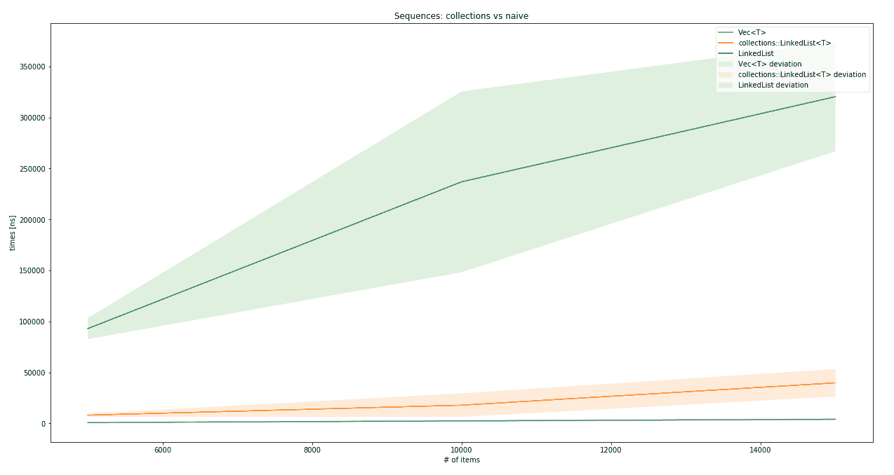
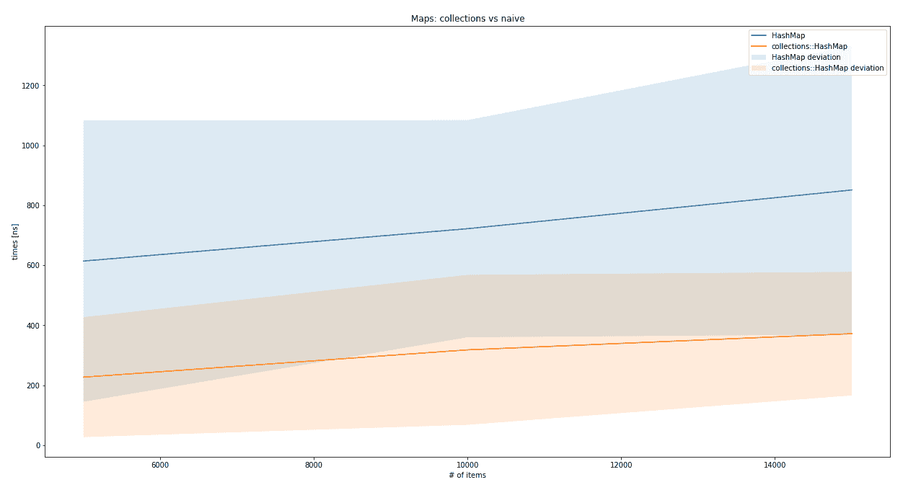
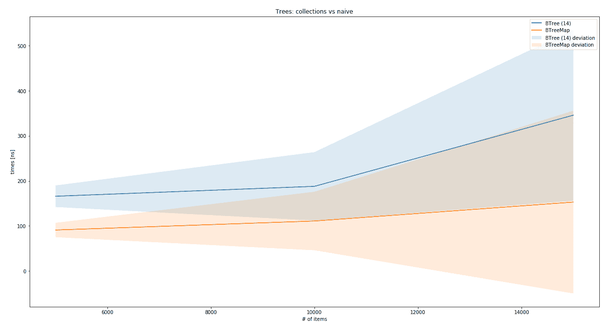

# 第七章：Rust 的集合

在前面的章节中，我们实现了一系列数据结构，这在现实中很少发生。特别是在 Rust 中，优秀的 `Vec<T>` 覆盖了大量的用例，如果需要映射类型结构，`HashMap<T>` 也覆盖了其中大部分。那么还有什么？它们是如何实现的？为什么实现它们如果它们不会被使用呢？这些都是很好的问题，它们将在本章中得到解答。你可以期待学习以下内容：

+   如 `LinkedList<T>`、`Vec<T>` 或 `VecDeque<T>` 之类的序列数据类型

+   Rust 的 `BinaryHeap<T>` 实现

+   `HashSet<T>` 和 `BTreeSet<T>`

+   如何使用 `BTreeMap<T>` 和 `HashMap<T>` 映射事物

# 序列

任何类型的列表都是典型程序中最基本的数据结构；它们提供了灵活性，可以用作队列、栈，以及可搜索的结构。然而，限制和操作在不同的数据结构之间造成了巨大的差异，这就是为什么 `std::collections` 的文档提供了一个决策树，以找出解决特定问题实际所需的集合类型。

以下在第四章 “列表，列表，更多列表” 中进行了讨论：

+   **动态数组** (`Vec<T>`) 是最通用且最易于使用的顺序数据结构。它们结合了数组的速度和可访问性，列表的动态大小，并且是构建更高阶结构（如栈、堆或甚至树）的基本构建块。因此，在不确定的情况下，`Vec<T>` 总是一个不错的选择。

+   `VecDeque<T>` 是 `Vec<T>` 的一个近亲，实现为一个 **环形缓冲区**——一个动态数组，它围绕两端回绕，使其看起来像一个环形结构。由于底层结构仍然与 `Vec<T>` 相同，因此许多方面也适用于这里。

+   在 Rust 中，`LinkedList<T>` 的功能非常有限。直接索引访问将是不高效的（它是一个计数迭代），这可能是为什么它只能迭代、合并和拆分，以及从后端和前端插入或检索。

这是一个很好的入门，那么让我们深入探讨 Rust 的 `std::collections` 中每个数据结构！

# `Vec<T>` 和 `VecDeque<T>`

就像第四章 “列表，列表，更多列表” 中的动态数组一样，`Vec<T>` 和 `VecDeque<T>` 是可增长的、类似列表的数据结构，支持索引，并且基于堆分配的数组。除了之前实现的动态数组之外，它默认是泛型的，没有对泛型类型的任何约束，允许使用任何类型。

`Vec<T>` 旨在尽可能减少开销，同时提供一些保证。在其核心，它是一个包含 (`指针`, `长度`, `容量`) 的三元组，提供了修改这些元素的 API。`容量` 是分配以存放项的内存量，这意味着它与 `长度` 有根本的不同，`长度` 是当前持有的元素数量。如果提供了零大小类型或没有初始长度，`Vec<T>` 实际上不会分配任何内存。`指针` 只指向内存中保留的区域，该区域被封装为 `RawVec<T>` 结构。

`Vec<T>` 的主要缺点是其前端的插入效率不高，这正是 `VecDeque<T>` 旨在提供的。它被实现为一个环形，环绕数组的边缘，当内存需要扩展或需要在指定位置插入元素时，会创建一个更复杂的情况。由于 `Vec<T>` 和 `VecDeque<T>` 的实现相当相似，它们可以在类似的环境中使用。这可以在它们的架构中体现出来。

# 架构

这两种结构，`Vec<T>` 和 `RawVec<T>`，都以相同的方式分配内存：通过使用 `RawVec<T>` 类型。这种结构是围绕低级函数的一个包装，用于在内存的堆部分分配、重新分配或释放数组，专为在高级数据结构中使用而构建。其主要目标是避免容量溢出、内存不足错误和一般性溢出，从而为开发者节省大量样板代码。

`Vec<T>` 使用此缓冲区的方式很简单。每当长度威胁要超过容量时，就分配更多内存并将所有元素转移，如下面的代码所示：

```rs
#[stable(feature = "rust1", since = "1.0.0")]
pub fn reserve(&mut self, additional: usize) {
    self.buf.reserve(self.len, additional);
}
```

因此，接下来会调用 `reserve()` 函数，然后是 `try_reserve()`，接着是 `RawVec<T>` 的 `amortized_new_size()`，它也会决定大小：

```rs
fn amortized_new_size(&self, used_cap: usize, needed_extra_cap: usize)
    -> Result<usize, CollectionAllocErr> {

    // Nothing we can really do about these checks :(
    let required_cap = used_cap.checked_add(needed_extra_cap).ok_or(CapacityOverflow)?;
    // Cannot overflow, because `cap <= isize::MAX`, and type of `cap` is `usize`.
    let double_cap = self.cap * 2;
    // `double_cap` guarantees exponential growth.
    Ok(cmp::max(double_cap, required_cap))
}
```

让我们来看看 `VecDeque<T>`。除了内存分配之外，`VecDeque<T>` 还必须处理数据在环形中的环绕，这为在指定位置插入元素或容量需要增加时增加了相当大的复杂性。然后，需要将旧元素复制到新的内存区域，从环绕列表的最短部分开始。

与 `Vec<T>` 类似，当 `VecDeque<T>` 满时，它会将缓冲区大小加倍，但使用 `double()` 函数来实现。*请注意，加倍不是一个保证的策略，可能会改变。*

*然而，无论取代它的是什么，都必须保留操作的运行时复杂性。* 以下是用以确定数据结构是否已满以及是否需要增长大小的函数：

```rs
#[inline]
fn is_full(&self) -> bool {
    self.cap() - self.len() == 1
}

#[inline]
fn grow_if_necessary(&mut self) {
    if self.is_full() {
        let old_cap = self.cap();
        self.buf.double();
        unsafe {
            self.handle_cap_increase(old_cap);
        }
        debug_assert!(!self.is_full());
    }
}
```

`handle_cap_increase()`函数将决定新的环应该放在哪里以及如何处理复制到新缓冲区，优先考虑尽可能少地复制数据。除了`Vec<T>`之外，在`VecDeque<T>`上调用`new()`函数会在`RawVec<T>`中分配足够的空间以容纳七个元素，然后可以插入而不会增加底层内存的大小，因此当它为空时不是一个零大小结构。

# 插入

向`Vec<T>`添加元素有两种方式：`insert()`和`push()`。前者接受两个参数：要插入元素的位置索引和数据。在插入之前，索引上的位置将通过将所有后续元素移动到末尾（向右）来释放。因此，如果元素在前面插入，每个元素都必须移动一个位置。`Vec<T>`代码如下所示：

```rs
#[stable(feature = "rust1", since = "1.0.0")]
pub fn insert(&mut self, index: usize, element: T) {
    let len = self.len();
    assert!(index <= len);

    // space for the new element
    if len == self.buf.cap() {
        self.reserve(1);
    }

    unsafe {
        // infallible
        // The spot to put the new value
        {
            let p = self.as_mut_ptr().add(index);
            // Shift everything over to make space. (Duplicating the
            // `index`th element into two consecutive places.)
            ptr::copy(p, p.offset(1), len - index);
            // Write it in, overwriting the first copy of the `index`th
            // element.
            ptr::write(p, element);
        }
        self.set_len(len + 1);
    }
}
```

当通过调用`push()`进行高效移动时，新项目可以添加而无需移动数据，如下所示：

```rs
#[inline]
#[stable(feature = "rust1", since = "1.0.0")]
pub fn push(&mut self, value: T) {
    // This will panic or abort if we would allocate > isize::MAX bytes
    // or if the length increment would overflow for zero-sized types.
    if self.len == self.buf.cap() {
        self.reserve(1);
    }
    unsafe {
        let end = self.as_mut_ptr().offset(self.len as isize);
        ptr::write(end, value);
        self.len += 1;
    }
}
```

正规的`Vec<T>`的主要缺点是无法高效地向前面添加数据，这正是`VecDeque<T>`擅长的领域。执行此操作的代码既简洁又短小，如下所示：

```rs
#[stable(feature = "rust1", since = "1.0.0")]
pub fn push_front(&mut self, value: T) {
    self.grow_if_necessary();

    self.tail = self.wrap_sub(self.tail, 1);
    let tail = self.tail;
    unsafe {
        self.buffer_write(tail, value);
    }
}
```

在这些函数中使用`unsafe {}`，代码比仅使用安全的 Rust 要短得多，也快得多。

# 查找

使用数组类型数据分配的主要优点是简单的快速元素访问，这是`Vec<T>`和`VecDeque<T>`共有的。使用括号直接访问的正式方式由`Index<I>`特质提供（`let my_first_element= v[0];`）。

除了直接访问之外，迭代器还提供了搜索、折叠、映射等功能。其中一些与这一节中的`LinkedList<T>`部分相当。

例如，`Vec<T>`的所有权迭代器（`IntoIter<T>`）拥有缓冲区的指针并将当前元素的指针向前移动。不过，这里也有一个陷阱：如果一个元素的大小是零字节，指针应该如何移动？返回什么数据？`IntoIter<T>`结构提出了一个巧妙的解决方案（**ZSTs**是**零大小类型**，所以实际上不占用空间）：

```rs
pub struct IntoIter<T> {
    buf: NonNull<T>,
    phantom: PhantomData<T>,
    cap: usize,
    ptr: *const T,
    end: *const T,
}
// ...

#[stable(feature = "rust1", since = "1.0.0")]
impl<T> Iterator for IntoIter<T> {
    type Item = T;

    #[inline]
    fn next(&mut self) -> Option<T> {
        unsafe {
            if self.ptr as *const _ == self.end {
                None
            } else {
                if mem::size_of::<T>() == 0 {
                    // purposefully don't use 'ptr.offset' because for
                    // vectors with 0-size elements this would return the
                    // same pointer.
                    self.ptr = arith_offset(self.ptr as *const i8, 1) as *mut T;

                    // Make up a value of this ZST.
                    Some(mem::zeroed())
                } else {
                    let old = self.ptr;
                    self.ptr = self.ptr.offset(1);

                    Some(ptr::read(old))
                }
            }
        }
    }
// ...
}
```

注释已经说明了正在发生的事情，迭代器避免反复返回相同的指针，而是将其增加一个并返回一个清零的内存。这显然是 Rust 编译器不会容忍的事情，因此在这里使用`unsafe`是一个很好的选择。此外，常规迭代器（`vec![].iter()`）在`core::slice::Iter`实现中被泛化，它作用于内存的泛型、类似数组的部分。

与之相反，`VecDeque<T>`的迭代器会通过在环中移动索引直到完成一圈来达到目的。以下是它的实现，如下面的代码所示：

```rs
#[stable(feature = "rust1", since = "1.0.0")]
pub struct Iter<'a, T: 'a> {
    ring: &'a [T],
    tail: usize,
    head: usize,
}
// ...
#[stable(feature = "rust1", since = "1.0.0")]
impl<'a, T> Iterator for Iter<'a, T> {
    type Item = &'a T;

    #[inline]
    fn next(&mut self) -> Option<&'a T> {
        if self.tail == self.head {
            return None;
        }
        let tail = self.tail;
        self.tail = wrap_index(self.tail.wrapping_add(1), self.ring.len());
        unsafe { Some(self.ring.get_unchecked(tail)) }
    }
//...
}
```

在其他特质中，两者都实现了在两端工作的`DoubleEndedIterator<T>`，一个特殊的功能称为`DrainFilter<T>`，以便仅在应用谓词的情况下从迭代器中检索项目。

# 删除

`Vec<T>` 和 `VecDeque<T>` 在删除元素时都保持高效。尽管如此，它们不会改变分配给数据结构的内存量，这两种类型都提供了一个名为 `shrink_to_fit()` 的函数来调整容量以适应其长度。

在 `remove` 操作中，`Vec<T>` 将剩余的元素移向序列的开始。像 `insert()` 函数一样，它只是简单地复制整个剩余数据并偏移，如下所示：

```rs
#[stable(feature = "rust1", since = "1.0.0")]
pub fn remove(&mut self, index: usize) -> T {
    let len = self.len();
    assert!(index < len);
    unsafe {
        // infallible
        let ret;
        {
            // the place we are taking from.
            let ptr = self.as_mut_ptr().add(index);
            // copy it out, unsafely having a copy of the value on
            // the stack and in the vector at the same time.
            ret = ptr::read(ptr);

            // Shift everything down to fill in that spot.
            ptr::copy(ptr.offset(1), ptr, len - index - 1);
        }
        self.set_len(len - 1);
        ret
    }
} 
```

对于 `VecDeque<T>`，情况要复杂得多：因为数据可以绕过底层缓冲区的末端（例如，尾部在索引三，头部在索引五，所以从三到五的空间被认为是空的），它不能盲目地单向复制。因此，有一些逻辑来处理这些不同的情况，但这里添加的代码太长了。

# LinkedList<T>

Rust 的 `std::collection::LinkedList<T>` 是一个使用 `unsafe` 指针操作来绕过我们在第四章列表、列表和更多列表中必须进行的 `Rc<RefCell<Node<T>>>` 解包的双向链表。虽然不安全，但这是对该问题的绝佳解决方案，因为指针操作易于理解，并提供显著的好处。让我们看看以下代码：

```rs
#[stable(feature = "rust1", since = "1.0.0")]
pub struct LinkedList<T> {
    head: Option<NonNull<Node<T>>>,
    tail: Option<NonNull<Node<T>>>,
    len: usize,
    marker: PhantomData<Box<Node<T>>>,
}

struct Node<T> {
    next: Option<NonNull<Node<T>>>,
    prev: Option<NonNull<Node<T>>>,
    element: T,
}
```

`NonNull` 是一个结构，它起源于 `std::ptr::NonNull`，在 `unsafe` 领域提供了一个非零指针到堆内存的一部分。因此，在基本层面上可以跳过内部可变性模式，消除运行时检查的需要。

# 架构

基本上，`LinkedList` 是按照我们在第四章列表、列表和更多列表中构建双向链表的方式构建的，增加了 `PhantomData<T>` 类型指针。为什么？这是必要的，以便在泛型涉及时通知编译器包含标记的类型属性。有了它，编译器可以确定一系列事情，包括析构行为、生命周期等。《PhantomData<T>` 指针是一个零大小的添加，它假装拥有类型 `T` 的内容，因此编译器可以对此进行推理。

# 插入

`std::collections::LinkedList` 使用了几个不安全的方法来避免我们在以安全方式实现双向链表时看到的 `Rc<RefCell<Node<T>>>` 和 `next.as_ref().unwrap().borrow()` 调用。这也意味着在两端添加节点需要使用 `unsafe` 来设置这些指针。

在这种情况下，代码易于阅读和理解，这对于避免由于执行不稳定的代码而导致的意外崩溃非常重要。这是在前面添加节点的基本函数，如下所示：

```rs
fn push_front_node(&mut self, mut node: Box<Node<T>>) {
    unsafe {
        node.next = self.head;
        node.prev = None;
        let node = Some(Box::into_raw_non_null(node));

        match self.head {
            None => self.tail = node,
            Some(mut head) => head.as_mut().prev = node,
        }

        self.head = node;
        self.len += 1;
    }
}
```

这段代码被公开的 `push_front()` 函数包裹，如下面的代码片段所示：

```rs
#[stable(feature = "rust1", since = "1.0.0")]
pub fn push_front(&mut self, elt: T) {
    self.push_front_node(box Node::new(elt));
}
```

`push_back()`函数，它执行与之前相同的操作，但作用于列表的末尾，工作方式如下。此外，链表可以像添加单个节点一样轻松地附加另一个列表，因为它几乎与添加单个节点相同，但需要额外的语义（例如：列表是否为空？）来处理：

```rs
#[stable(feature = "rust1", since = "1.0.0")]
pub fn append(&mut self, other: &mut Self) {
    match self.tail {
        None => mem::swap(self, other),
        Some(mut tail) => {
            if let Some(mut other_head) = other.head.take() {
                unsafe {
                    tail.as_mut().next = Some(other_head);
                    other_head.as_mut().prev = Some(tail);
                }

                self.tail = other.tail.take();
                self.len += mem::replace(&mut other.len, 0);
            }
        }
    }
}
```

添加项目是链表的一个强项。但查找元素呢？

# 查找

`collections::LinkedList`在很大程度上依赖于`Iterator`特质来查找各种项目，这是非常好的，因为它节省了很多精力。这是通过广泛实现各种迭代器特质来实现的，使用几个结构，如下所示：

+   `Iter`

+   `IterMut`

+   `IntoIter`

从技术上讲，`DrainFilter`也实现了`Iterator`，但它实际上是一个便利包装器。以下是`LinkedList`使用的`Iter`结构声明：

```rs
#[stable(feature = "rust1", since = "1.0.0")]
pub struct Iter<'a, T: 'a> {
    head: Option<NonNull<Node<T>>>,
    tail: Option<NonNull<Node<T>>>,
    len: usize,
    marker: PhantomData<&'a Node<T>>,
}
```

如果你还记得之前列表的声明，就会很明显，它们非常相似！事实上，它们是相同的，这意味着在遍历链表时，你实际上是在创建一个新的列表，每次调用`next()`都会变得更短。正如预期的那样，这是一个非常高效的过程，在这里被采用，因为没有任何数据被复制，`Iter`结构的头部可以随着当前头部的`prev`/`next`指针来回移动。

`IterMut`和`IntoIter`的结构略有不同，这是由于它们的目的不同。`IntoIter`获取整个列表的所有权，并根据请求调用`pop_front()`或`pop_back()`。

`IterMut`必须保留对原始列表的可变引用，以便向调用者提供可变引用，但除此之外，它基本上是一个`Iter`类型结构。

另一个也进行迭代的结构是`DrainFilter`，正如其名所示，它用于移除项目。

# 移除

链表包含两个函数：`pop_front()`和`pop_back()`，它们简单地封装了一个名为`pop_front_node()`的“内部”函数：

```rs
#[inline]
fn pop_front_node(&mut self) -> Option<Box<Node<T>>> {
    self.head.map(|node| unsafe {
        let node = Box::from_raw(node.as_ptr());
        self.head = node.next;

        match self.head {
            None => self.tail = None,
            Some(mut head) => head.as_mut().prev = None,
        }

        self.len -= 1;
        node
    })
}
```

这样，要从`LinkedList<T>`中移除特定元素，必须通过分割和附加列表（跳过所需元素）来完成，或者使用`drain_filter()`函数，它几乎就是这样做。

# 总结

`Vec<T>`和`VecDeque<T>`都基于堆分配的数组构建，并且在`insert`和`find`操作上表现良好，这得益于消除了几个步骤。然而，书中早期提到的动态数组实现实际上可以与这些相媲美。

之前实现的双向链表与`std::collections`提供的`LinkedList<T>`相比并不理想，后者构建得更加简单，并且不使用进行运行时借用检查的`RefCells`：



显然，如果你需要链表，不要自己实现，`std::collections::LinkedList<T>` 在链表方面非常出色。通常，`Vec<T>` 会表现得更好，同时提供更多功能，所以除非链表绝对必要，否则 `Vec<T>` 应该是默认选择。

# 映射和集合

Rust 的映射和集合主要基于两种策略：B-Tree 搜索和哈希。它们是两种非常不同的实现，但达到了相同的结果：将键与值关联（映射）以及基于键提供快速的唯一集合（集合）。

Rust 中的哈希使用 `Hasher` 特征，它是一个通用的、有状态的哈希器，从任意字节流中创建哈希值。通过重复调用适当的 `write()` 函数，可以将数据添加到哈希器的内部状态，并通过 `finish()` 函数完成。

在 Rust 中，B-Tree 的优化程度很高。`BTreeMap` 文档提供了丰富的细节，说明了为什么常规实现（如之前所示）在缓存效率低下，并且没有针对现代 CPU 架构进行优化。因此，他们提供了一个更有效的实现，这绝对令人着迷，你应该在源代码中查看它。

# HashMap 和 HashSet

`HashMap` 和 `HashSet` 都使用哈希算法来生成存储和检索值所需的唯一键。哈希是通过 `Hasher` 特征的实例（如果没有指定则为 `DefaultHasher`）为每个实现了 `Hash` 和 `Eq` 特征的键创建的。它们允许将 `Hasher` 实例传递给 `Hash` 实现者以生成所需输出，并将数据结构用于比较键的相等性。

如果要将自定义结构用作哈希键（用于映射，或者简单地存储在集合中），则也可以从该实现中派生出来，这会将结构的每个字段添加到 `Hasher` 的状态中。如果特徵是手动实现的，它必须为两个相等的键创建相等的哈希值。

由于这两种数据结构都基于实现了此特性的键，并且都应该高度优化，因此出现了一个问题：为什么需要两种变体？

让我们看看源代码，如下所示：

```rs
#[derive(Clone)]
#[stable(feature = "rust1", since = "1.0.0")]
pub struct HashSet<T, S = RandomState> {
    map: HashMap<T, (), S>,
}
```

本节剩余部分将仅讨论 `HashMap`。

# 架构

`HashMap` 是一种高度优化的数据结构，它使用一种称为 **Robin Hood 哈希** 的性能启发式方法来改善缓存行为，从而提高查找时间。

Robin Hood 哈希最好与插入算法线性探测一起解释，这与上一章中使用的哈希表算法有些相似。然而，它不是数组数组的数组（或 `Vec<Vec<(K, V)>>`），基本数据结构是一个扁平数组，它被包裹在一个称为 `RawTable<K, V>` 的结构中（以及所有不安全的代码）。

表将数据组织成代表特定哈希值的桶（空或满）。线性探测意味着每当发生冲突（两个哈希值相等，而它们的键不相等）时，算法会继续查找（“探测”）下一个桶，直到找到一个空桶。

罗宾汉的部分是计算从原始（理想）位置的距离，每当桶中的元素更接近其理想位置（即更丰富）时，桶的内容就会交换，并且搜索继续使用从其桶中移出的元素。因此，搜索从富有（只有少量步骤远离理想位置）到贫穷（那些远离理想位置的人）。

这种策略将数组组织成以哈希值为中心的簇，大大减少了键值方差，同时提高了 CPU 缓存友好性。影响这种行为的另一个主要因素是表的大小以及有多少个桶被占用（称为**负载因子**）。`HashMap`的`DefaultResizePolicy`在负载因子为 90.9%时将表的大小改变为 2 的更高次幂——这是一个为罗宾汉桶窃取提供理想结果的数量。还有一些关于如何管理这种增长而不必重新插入每个元素的好想法，但它们肯定超出了本章的范围。如果你对此感兴趣，建议阅读源代码的注释（见*进一步阅读*部分）。

# 插入

罗宾汉哈希策略已经描述了`insert`机制的大部分内容：对键值进行哈希，寻找空桶，并在过程中根据它们的探测距离重新排列元素：

```rs
pub fn insert(&mut self, k: K, v: V) -> Option<V> {
    let hash = self.make_hash(&k);
    self.reserve(1);
    self.insert_hashed_nocheck(hash, k, v)
}
```

此函数只执行第一步并扩展基本数据结构——如果需要的话。`insert_hashed_nocheck()`函数通过在现有表中搜索哈希值并提供相应的桶来提供下一步。元素负责将自己插入正确的位置。完成这一步骤所需的步骤取决于桶是满的还是空的，这被建模为两种不同的结构：`VacantEntry`和`OccupiedEntry`。后者简单地替换值（这是一个更新），而`VacantEntry`必须找到一个离分配的桶不太远的空位：

```rs
pub fn insert(self, value: V) -> &'a mut V {
    let b = match self.elem {
        NeqElem(mut bucket, disp) => {
            if disp >= DISPLACEMENT_THRESHOLD {
                bucket.table_mut().set_tag(true);
            }
            robin_hood(bucket, disp, self.hash, self.key, value)
        },
        NoElem(mut bucket, disp) => {
            if disp >= DISPLACEMENT_THRESHOLD {
                bucket.table_mut().set_tag(true);
            }
            bucket.put(self.hash, self.key, value)
        },
    };
    b.into_mut_refs().1
}
```

调用`robin_hood()`执行前面描述的搜索和交换。这里有一个有趣的变量是`DISPLACEMENT_THRESHOLD`。这难道意味着一个值可以有的位移上限吗？是的！这个值是`128`（因此需要`128`次错过），但这并不是随机选择的。实际上，代码注释详细说明了为什么以及如何选择这个值，如下所示：

```rs
// The threshold of 128 is chosen to minimize the chance of exceeding it.
 // In particular, we want that chance to be less than 10^-8 with a load of 90%.
 // For displacement, the smallest constant that fits our needs is 90, // so we round that up to 128.
 //
// At a load factor of α, the odds of finding the target bucket after exactly n
 // unsuccessful probes[1] are
 //
 // Pr_α{displacement = n} =
 //       (1 - α) / α * ∑_{k≥1} e^(-kα) * (kα)^(k+n) / (k + n)! * (1 - kα / (k + n + 1))
 //
 // We use this formula to find the probability of triggering the adaptive behavior
 //
 // Pr_0.909{displacement > 128} = 1.601 * 10^-11
 //
 // 1\. Alfredo Viola (2005). Distributional analysis of Robin Hood linear probing // hashing with buckets.
```

如评论所述，一个元素实际上超过该阈值的可能性*非常低*。一旦每个元素都找到了合适的位置，就可以进行查找。

# 查找

查找条目是`HashMap`的插入过程的一部分，它依赖于相同的函数来提供合适的条目实例以添加数据。就像插入过程一样，查找过程几乎相同，只是在最后省略了一些步骤，如下所示：

+   创建键的哈希

+   在表中找到哈希的桶

+   离开桶比较键（线性搜索）直到找到

由于所有这些都已经实现并用于其他函数，`get()`相当短，如下面的代码所示：

```rs
pub fn get<Q: ?Sized>(&self, k: &Q) -> Option<&V>
    where K: Borrow<Q>,
            Q: Hash + Eq
{
    self.search(k).map(|bucket| bucket.into_refs().1)
}
```

同样，`remove`函数需要`search`，并且删除是在条目类型上实现的。

# 删除

`remove`函数看起来很像`search`函数，如下所示：

```rs
#[stable(feature = "rust1", since = "1.0.0")]
pub fn remove<Q: ?Sized>(&mut self, k: &Q) -> Option<V>
    where K: Borrow<Q>,
            Q: Hash + Eq
{
    self.search_mut(k).map(|bucket| pop_internal(bucket).1)
}
```

有一个主要区别：`search`返回一个可变的桶，可以从其中删除键（或者更确切地说，是整个桶，因为它现在为空）。`HashMap`最终证明是一段令人印象深刻的代码；`BTreeMap`能与之竞争吗？

# BTreeMap 和 BTreeSet

在第五章中讨论 B 树，*鲁棒树*，其目的是存储键值对——非常适合映射类型的数据结构。它们通过有效地最小化到达（或排除）键所需的比较次数来实现查找和检索这些对的能力。此外，树保持键的顺序，这意味着迭代将是隐式有序的。与`HashMap`相比，这可能是一个优点，因为它跳过了一个可能昂贵的步骤。

由于——就像`HashSet`一样——`BTreeSet`只是使用带有空值（只有键）的`BTreeMap`，因此本节只讨论后者，因为假设工作方式相同。再次，让我们从架构开始。

# 架构

Rust 的`BTreeMap`选择了一种有趣的方法，通过创建大型单个节点来最大化搜索性能。回想一下节点的典型大小（即它们拥有的子节点数量），它们多于两个（只有根节点），或者树的水平数的一半到树的水平数的子节点数。在一个典型的 B-Tree 中，水平很少超过 10，这意味着节点保持相当小，节点内的比较次数也相应较少。

Rust `BTreeMap`的实现者选择了一种不同的策略来改善缓存行为。为了提高缓存友好性和减少所需的堆分配次数，Rust 的`BTreeMap`每个节点存储从*level - 1*到*2 * level - 1*个元素，这导致了一个相当大的键数组。

虽然——小数组的键——足以适应 CPU 的缓存，但树本身有更多的这些数组，因此可能需要查看更多的节点。如果一个节点中的键值对数量更高，整体节点数量就会减少，如果键数组仍然适合 CPU 的缓存，这些比较就可以尽可能快地进行。使用更智能的搜索（如二分搜索）来减轻搜索键的大数组带来的缺点，因此拥有较少节点的整体性能提升超过了缺点。

通常，当将本书中较早提到的 B-Tree 与 `BTreeMap` 进行比较时，只有几个相似之处脱颖而出，其中之一就是插入新元素。

# 插入

就像每个 B-Tree 一样，插入操作首先搜索插入的位置，然后如果节点具有超过预期数量的值（或子节点），则应用拆分过程。插入操作分为三个部分，它从要调用的第一个方法开始，该方法将一切粘合在一起并返回预期的结果：

```rs
#[stable(feature = "rust1", since = "1.0.0")]
pub fn insert(&mut self, key: K, value: V) -> Option<V> {
    match self.entry(key) {
        Occupied(mut entry) => Some(entry.insert(value)),
        Vacant(entry) => {
            entry.insert(value);
            None
        }
    }
}
```

第二步是找到可以插入键值对的节点句柄，如下所示：

```rs
#[stable(feature = "rust1", since = "1.0.0")]
pub fn entry(&mut self, key: K) -> Entry<K, V> {
    // FIXME(@porglezomp) Avoid allocating if we don't insert
    self.ensure_root_is_owned();
    match search::search_tree(self.root.as_mut(), &key) {
        Found(handle) => {
            Occupied(OccupiedEntry {
                handle,
                length: &mut self.length,
                _marker: PhantomData,
            })
        }
        GoDown(handle) => {
            Vacant(VacantEntry {
                key,
                handle,
                length: &mut self.length,
                _marker: PhantomData,
            })
        }
    }
}
```

一旦知道了句柄，条目（无论是模拟空位还是占用位的结构）就会插入新的键值对。如果条目之前是占用的，值将被简单地替换——不需要进一步的操作。如果位置是空的，新值可能会触发树的重平衡，其中更改会向上冒泡到树中：

```rs
#[stable(feature = "rust1", since = "1.0.0")]
pub fn insert(self, value: V) -> &'a mut V {
    *self.length += 1;

    let out_ptr;

    let mut ins_k;
    let mut ins_v;
    let mut ins_edge;

    let mut cur_parent = match self.handle.insert(self.key, value) {
        (Fit(handle), _) => return handle.into_kv_mut().1,
        (Split(left, k, v, right), ptr) => {
            ins_k = k;
            ins_v = v;
            ins_edge = right;
            out_ptr = ptr;
            left.ascend().map_err(|n| n.into_root_mut())
        }
    };

    loop {
        match cur_parent {
            Ok(parent) => {
                match parent.insert(ins_k, ins_v, ins_edge) {
                    Fit(_) => return unsafe { &mut *out_ptr },
                    Split(left, k, v, right) => {
                        ins_k = k;
                        ins_v = v;
                        ins_edge = right;
                        cur_parent = left.ascend().map_err(|n| n.into_root_mut());
                    }
                }
            }
            Err(root) => {
                root.push_level().push(ins_k, ins_v, ins_edge);
                return unsafe { &mut *out_ptr };
            }
        }
    }
}
```

查找键已经是插入过程的一部分，但也值得仔细看看。

# 查找

在树结构中，插入和删除都是基于查找正在修改的键。在 `BTreeMap` 的情况下，这是通过从父模块导入的 `search_tree()` 函数完成的：

```rs
pub fn search_tree<BorrowType, K, V, Q: ?Sized>(
    mut node: NodeRef<BorrowType, K, V, marker::LeafOrInternal>,
    key: &Q
) -> SearchResult<BorrowType, K, V, marker::LeafOrInternal, marker::Leaf>
        where Q: Ord, K: Borrow<Q> {

    loop {
        match search_node(node, key) {
            Found(handle) => return Found(handle),
            GoDown(handle) => match handle.force() {
                Leaf(leaf) => return GoDown(leaf),
                Internal(internal) => {
                    node = internal.descend();
                    continue;
                }
            }
        }
    }
}

pub fn search_node<BorrowType, K, V, Type, Q: ?Sized>(
    node: NodeRef<BorrowType, K, V, Type>,
    key: &Q
) -> SearchResult<BorrowType, K, V, Type, Type>
        where Q: Ord, K: Borrow<Q> {

    match search_linear(&node, key) {
        (idx, true) => Found(
            Handle::new_kv(node, idx)
        ),
        (idx, false) => SearchResult::GoDown(
            Handle::new_edge(node, idx)
        )
    }
}
```

代码本身非常易于阅读，这是一个好兆头。它还避免了递归的使用，而是使用 `loop{}` 构造，这对于大范围查找来说是一个优点，因为 Rust 目前还没有将尾递归调用展开成循环（？）。无论如何，这个函数返回键所在的节点，让调用者从该节点中提取值和键。

# 删除

`remove` 函数封装了被占用节点的 `remove_kv()` 函数，该函数从 `search_tree()` 挖掘出的句柄中删除一个键值对。这种删除还会触发节点合并，如果节点现在拥有的子节点数量少于最小数量。

# 总结

如本节所示，映射和集合有很多共同之处，Rust 收集库提供了两种方式来实现它们。`HashMap` 和 `HashSet` 使用一种智能方法来查找和将值插入到称为 Robin Hood 哈希的桶中。回想一下 第六章 的比较基准测试，*探索映射和集合*，它提供了一个更稳定且性能显著更好的实现：



`BTreeMap`和`BTreeSet`基于 B-树的不同、更有效的实现。它有多高效（和有效）？让我们来看看！



对于 B-树的简单实现（来自第五章，*鲁棒树*），性能并不那么糟糕。然而，尽管可能需要在这里和那里做一些调整，但证据表明，有一个更好、更快的树存在，那么为什么不使用它呢？

# 摘要

Rust 标准库具有出色的集合部分，提供了一些基本数据结构的优化实现。

我们从`Vec<T>`和`VecDeque<T>`开始，它们都基于堆分配的数组，并封装在`RawVec<T>`结构中。由于数组基础和基于指针的`unsafe`操作，它们在保持内存效率高的同时表现出色。

`LinkedList<T>`是一个双向链表，由于直接数据操作和缺乏运行时检查，它表现得很出色。虽然它在分割和合并方面表现优异，但大多数其他操作比`Vec<T>`慢，并且缺少一些有用的功能。

`HashSet`和`HashMap`基于相同的实现（`HashMap`），除非指定不同，否则使用`DefaultHasher`来生成对象的哈希键。这个键使用罗宾汉哈希方法存储（并稍后检索），这种方法与原始实现相比提供了主要性能优势。

或者，`BTreeSet`和`BTreeMap`使用 B-树结构来组织键和值。这种实现也是专门化的，并且针对 CPU 缓存友好性进行优化，通过减少节点数量（从而最小化分配次数）来创建高性能的数据结构。

在下一章中，我们将解析 O 表示法，这是到目前为止使用得很少，但对于接下来的内容（算法）是必要的。

# 问题

+   哪个`std::collections`数据结构在这里没有讨论？

+   截至 2018 年，`Vec<T>`或`VecDeque<T>`是如何增长的？

+   `LinkedList<T>`是否是一个好的默认数据结构？

+   2018 年的`HashMap`默认使用哪种哈希实现？

+   `BTreeMap`相对于`HashMap`有哪些三个优点？

+   `BTreeMap`的内部树是更宽还是更高？

# 进一步阅读

您可以参考以下链接，了解更多关于本章涵盖主题的信息：

+   [`doc.rust-lang.org/std/collections/index.html`](https://doc.rust-lang.org/std/collections/index.html)

+   [`cglab.ca/~abeinges/blah/rust-btree-case/`](http://cglab.ca/~abeinges/blah/rust-btree-case/)

+   [`doc.rust-lang.org/src/std/collections/hash/map.rs.html#148`](https://doc.rust-lang.org/src/std/collections/hash/map.rs.html#148)
