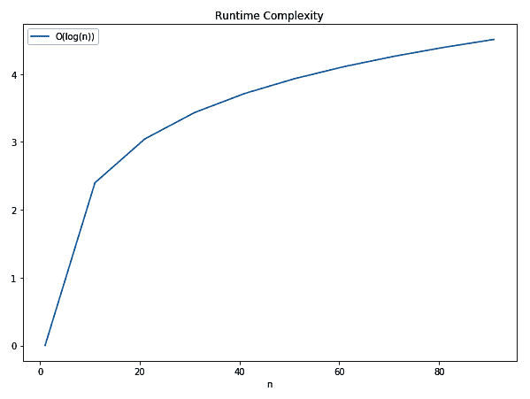
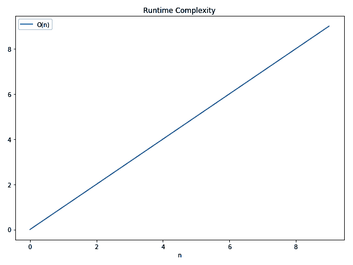
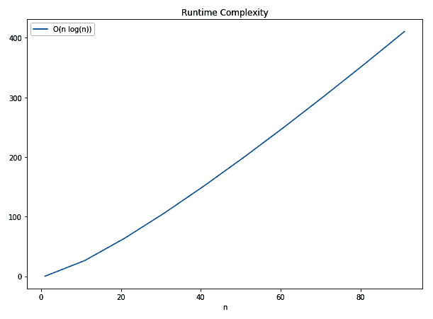
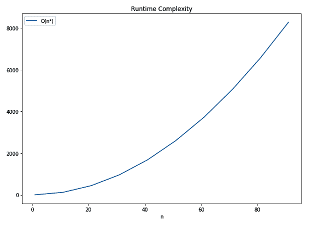
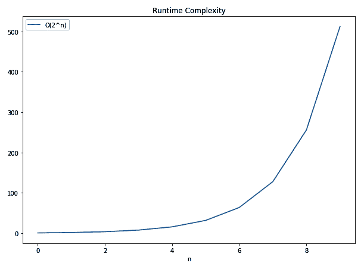
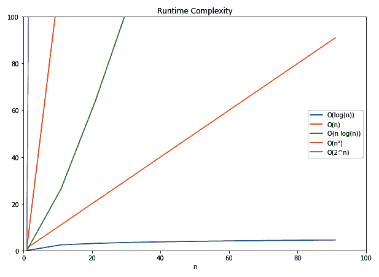

# 第八章：算法评估

当将算法视为定义实体时，是什么使得一个算法比另一个算法更好？是完成所需的步骤数？所分配的内存量？CPU 周期？它们如何在具有不同内存分配器的机器和操作系统之间进行比较？

这里有很多问题需要回答，因为比较他人的工作对于找到解决给定问题的最佳方法非常重要。在本章中，你可以期待了解以下内容：

+   实践中评估算法

+   对算法和数据结构行为进行分类

+   估算更好算法的可行性

# 大 O 符号

物理学不是本书的主题，但其影响深远，强大到无处不在，甚至算法这样的虚拟构造也要遵守！然而，无论设计多么伟大，它们仍然受限于两个重要因素：时间和空间。

时间？无论何时需要完成任何事情，都需要一系列步骤。通过将每个步骤的时间乘以步骤的数量，总时间——绝对时间——很容易计算。或者我们认为是这样。对于计算机来说，这*大部分*是正确的，但许多问题使得真正知道这一点变得非常困难，因为现代 CPU 的能力远远超过了前几代。这仅仅是由于更高的时钟频率吗？额外的核心？SIMD？仅仅计算绝对时间并不能真正实现算法之间的可比性。也许步骤的数量是我们应该使用的。

在过去几年中，空间（即内存）在许多领域已经成为一种商品，甚至在嵌入式空间也是如此。尽管情况有所改善，但仍然值得注意存储在内存中的字节数以及这对算法目标的贡献。换句话说，这是否值得？许多算法任务面临着存储在内存中的内容与按需计算的内容之间的权衡。后者可能刚好足够解决问题，也可能不够；这是开发者必须做出的决定。

# 他人代码

因此，每个算法都必须有一个“所需步骤数”和“所需内存字节数”属性，对吗？接近：由于它们是不断变化的变量，有必要找到一个描述他人所取得的成就的通用方法。

通常，程序员本能地知道如何做到这一点：“这个玩意儿真的做了两次吗？！”应该是一个熟悉的呼喊。这里说了什么？假设它是一个具有输入参数`x`的函数，听起来这个函数对`x`做了两次操作。从数学的角度来说，这可以表示为*f(x) = 2x*。

这实际上是在说，对于每个输入，完全执行函数所需的步骤数是输入的两倍——这不是我们一直在寻找的吗？有什么更好的方法来写下它？

# 大 O 符号

从（数学）函数的角度来看这个问题，这是数学、计算机科学、物理学等领域的一个共同需求：他们都想知道一个函数有多贵。这就是为什么爱德蒙·兰道发明了一种常见的符号：大 O 符号（或兰道符号），由大写字母 *O* 组成，它声明了函数的 *阶*。然后主要增长因子放在字母 *O* 后面的括号中。

还有其他一些相关的符号，使用小 *o*、Omega、Theta 等，但在实际应用中这些不太相关。请参阅 *进一步阅读* 部分，了解唐纳德·克努特关于此的文章。

# 渐近运行时间复杂度

对于计算机科学来说，在实现算法时，确切的绝对运行时间通常并不重要（你总是可以获取更快的计算机）。相反，运行时间复杂度更重要，因为它直接影响了性能，作为工作整体的一个衡量标准，独立于细节。

由于这并不是一个精确的测量，实际性能受其他因素的影响，因此坚持使用渐近的（即：粗略的）度量是最好的策略。除此之外，算法有最好和最坏的情况。除非你试图改进特定的情况，否则通常比较的是最坏的情况：

```rs
let my_vec = vec![5,6,10,33,53,77];
for i in my_vec.iter() {
    if i == 5 {
        break;
    }    
    println!("{}", i);
}
```

对此进行迭代，`Vec<T>` 的运行时间复杂度为 *O(n)*，其中 *n* 是 `Vec<T>` 的长度，无论循环是否会立即中断。为什么？因为悲观主义。实际上，通常很难说输入向量看起来是什么样子，以及它何时会真正退出，所以最坏的情况是它遍历整个序列而没有中断，即 *n* 次。现在我们已经看到了如何写下这一点，让我们看看如何找出我们自己的算法的运行时间复杂度。

# 自行制作

只有少数方面会改变算法的复杂度，那些已经证明会成比例增加算法所需总时间的方面。

这些如下所示：

+   一个算术运算（`10 + 30`）

+   一个赋值（`let x = 10`）

+   一个测试（`x == 10`）

+   基本类型的读取或写入（`u32`、`bool` 等）

如果一段代码只执行这些操作中的一个，那么它是一步，即 *O(1)*，并且每当有一个选择（`if` 或 `match`），就必须选择更复杂的分支。无论任何输入参数如何，它都将执行相同数量的步骤——即常数时间。如果它们在循环中运行，事情就变得更有趣了。

# 循环

当在一个循环中，且循环的迭代次数在编译时未知时，它将对运行时间复杂度产生重大影响。如果之前提到的操作在循环中执行（例如，一个 `sum` 操作），可以将算术操作的复杂度声明为 *O(1 * n)*。在添加另一个操作后，我们可以将其表示为 *O(2 * n)*，虽然这是正确的，但这些不是循环的主要驱动力。无论执行 *n* 次的操作数量如何，主要增长因子仍然是 *n*。因此，我们简单地说是 *O(n)*，除非你试图比较同一算法，其中迭代次数实际上是有区别的。如果有后续的循环，则选择最昂贵的那个。

然而，在嵌套循环之后，复杂度会显著变化。考虑这个（真的很差）比较两个列表的算法：

```rs

let my_vec = vec![1,1,1,4,6,7,23,4];
let my_other_vec = vec![66,2,4,6,892];

for i in my_vec.iter() {
    for j in my_other_vec.iter() {
        if i == j {
            panic!();
        }
    }
}
```

对于第一个集合中的每个元素，第二个集合将被完全迭代。换句话说，每个元素被查看 *n * m* 次，导致运行时间复杂度为 *O(n*m)*，或者如果两个集合大小相同，则为 *O(n²)*。

能变得更糟吗？是的！

# 递归

由于所有递归算法都可以展开成循环，因此它们可以达到相同的结果。然而，递归，或者更具体地说回溯（将在第十一章[0131b10b-0ea4-4663-966a-46d6ecda142b.xhtml]“随机与组合”中更详细地讨论），使得创建更高的运行时间复杂度变得更容易。

典型的组合问题会导致指数级的运行时间，因为存在许多变体（例如不同的颜色），必须枚举 *n* 次以满足约束，而这个约束只在最后评估。如果有两种颜色，那么在图中没有两种颜色可以相邻的情况下，序列的运行时间复杂度将是 *O(2^n)*。

递归算法也使得快速估计运行时间复杂度变得困难，因为分支发展难以可视化。

# 复杂度类别

通常，所有算法都落入几个类别之一。让我们按增长速度的顺序查看这些类别。根据文献的不同，可能会有更多或更少的类别，但这是一个好的起点，因为它们代表了增长行为的主要方向。

# O(1)

常数时间，这意味着所有操作都将花费相同的时间。由于这个图表将在 *y* 值为 *1* 的水平线上，我们将跳过它以节省一棵树。

# O(log(n))

增长由对数函数（通常以 2 为底）定义，这比线性增长更好。

这是数学函数的图像：



# O(n)

线性时间，这意味着解决方案的性能以线性方式依赖于输入：



# O(n log(n))

这有时被称为准线性时间，是排序能够达到的最佳复杂度：



# O(n²)

平方运行时间对于搜索或排序算法的直观实现来说是典型的：



# O(2n)

这是最昂贵的类别之一，通常可以在一些非常难以解决的问题中找到。这个图表的 *x* 值（*0 - 10*）显著小于 `O(n log(n))` 图表，并产生更高的 *y* 值（或运行时间）：



# 比较

拥有个体图表对于想象预期的运行时间和估计当输入增加时任务性能可能的样子非常有帮助。然而，如果我们把这些线都画在一张图上，它们的性能就会变得明显。

典型的比较是针对线性时间复杂度（*O(n)*），因为大多数直观的解决方案都预期能够达到这种性能：



考虑到这张图，我们可以在下一节中查看问题和它们的预期性能。

# 在野外

事实上，有很多因素可能会影响空间和运行时间复杂度的选择。通常，这些因素是资源约束的形式，例如嵌入式设备上的功耗、云托管环境中的时钟周期等等。

由于很难找出特定算法的复杂度，了解一些常见的复杂度是有帮助的，这样选择就会变得直观。通常，运行时间复杂度并不是唯一重要的方面，绝对执行时间也很重要。在这些条件下，如果 *n* 足够小，较高的运行时间复杂度可能是可取的。

这在 `Vec<T>` 只包含少量元素时表现得最好，其中线性搜索比排序后运行二分搜索要快得多。与立即搜索相比，排序的开销可能太大。

获得这种权衡和整体实现正确对于整个程序来说非常有益，并且会超过任何其他优化。让我们看看日常生活中可以找到的一些运行时间复杂度。

# 数据结构

所有类型的列表算法几乎总是表现出 *O(n)* 的行为，因为大多数操作都涉及移动或遍历其他元素。因此，在某个位置插入或删除元素，以及查找元素（当未排序时），都是 *O(n)*。这在链表中尤为明显，只有少数例外：动态数组元素的访问（*O(1)*）、前缀/后缀元素或列表，以及链表中添加元素时的列表分割（*O(1)*）。

列表的特殊情况，例如**栈**和**队列**，利用这些异常，并允许用户仅在该列表的端点插入或删除。另一方面，**跳表**采用类似树的策略以实现出色的搜索性能，这也会加快插入和删除的速度。但这是以内存为代价的，因为额外的元素与列表长度成比例（*log(n)*)。

对于搜索，**树**是很好的。常规树（即可以是 B 树的一切）在许多操作上表现出*O(log(n))*的复杂度，包括插入、删除和查找。这特别出色，因为与*O(n)*的差异实际上随着集合中元素数量的增加而增加。

最好的可能就是**映射**和**集合**，如果底层实现使用了合适的哈希算法。如果没有冲突，任何操作*都应该*在常数时间内（*O(1)*）完成。通常会有一些冲突，但运行时间复杂度不会超过*O(n)*，因为如果所有其他方法都失败了，线性搜索仍然有效。因此，实际性能将介于两者之间，其中哈希算法是最重要的因素。对于大多数库来说，哈希映射（和集合）比基于树的对应物要快。

# 日常事物

每当需要排序时，有很多方法可以实现这一点，但基础是*O(n²)*。这与大多数人整理袜子的方式相同：挑选一个并找到匹配的，然后重复（称为**选择排序**）。否则，如何比较所有元素以找到它们的顺序？更好的方法，如堆排序、归并排序等，在最坏情况下都表现出*O(n log(n))*的行为，这是排序算法可能达到的最佳（一致）性能。此外，由于任何排序算法的最佳情况是*O(n)*——确保一切都已经排序——平均情况最为重要。我们将在本书后面的章节中探讨这方面的策略。

搜索（或查找）是另一个我们将在第十章“寻找东西”中探讨的主题，但相关的运行时间复杂度是很好的例子。在大多数未排序的数据结构上进行搜索将通常是*O(n)*，而排序的集合可以利用二分搜索（树的搜索策略）并实现*O(log(n))*。为了节省排序的成本，理想的哈希表提供了搜索的最佳情况：*O(1)*。

# 异常事物

在早期列表中省略的一个类别是**多项式时间**（简称**P**）。这个类比指数时间类更快地解决，但比*O(n²)*差。这些问题包括检查一个数是否为素数，或解决数独。然而，这个类别中还有其他问题，实际上并没有“快速”（即在 P 时间内可解）的解决方案，但可以在 P 时间内验证解决方案。这些被称为**NP**（**非确定性多项式时间**的缩写）问题，其中最困难的是 NP-难（见信息框）。

P、NP、NP-完全和 NP-难之间的区别并不直观。NP 问题是可以使用非确定性图灵机在 P 时间内解决的问题。**NP-难**问题是没有解决方案的问题，如果解决了，将会有多项式时间解决方案，如果它也是一个 NP 问题，那么它也被认为是 NP-完全的。此外，找到其中一个类（NP-难或 NP-完全）的解决方案将意味着所有 NP-难/NP-完全问题的解决方案。

虽然没有已知算法可以快速解决这些问题，但通常有一些原始方法会导致**非常**长的运行时间。这个领域中的流行问题包括旅行商问题（*O(n!)*）、背包问题（*O(2^n)*）和子集和问题（*O(2^(n/2)*)），所有这些问题目前都是通过启发式方法或编程技术来解决（或近似）的。对那些感兴趣的人来说，请查看进一步阅读部分以获取链接。

# 摘要

大 O 符号是描述算法（或数据结构）的时间和空间需求的一种方式。这并不是一门精确的科学；它关于找到所提到的事物的主要增长因子来回答这个问题：当问题空间变大时会发生什么？

任何算法都将属于几个相关的类别，这些类别描述了该行为。通过将算法应用于一个额外的元素，需要采取多少额外的步骤？一个简单的方法是可视化单个图表，并思考它是否将是线性的（*O(n)*）、准线性的（*O(n log(n)*）、二次的（*O(n²)*）甚至是指数的（*O(2^n)*）。无论情况如何，总是最好做的工作比要查看的元素少，例如常数（*O(1)*）或对数（*O(log(n)*）行为！

选择操作通常基于最坏的行为，即将要发生的上限。在下一章中，我们将更详细地研究这些行为在流行搜索算法中的情况。

# 问题

+   为什么要在例如语句数量上估计运行时间复杂度？

+   运行时间复杂度如何与数学函数相关？

+   通常提供的复杂度类是最好还是最坏的情况？

+   为什么循环在估计复杂度时很重要？

+   *O(n log(n))*的运行时间复杂度比*O(log(n))*更好还是更差？

+   一些常见的复杂度类有哪些？

# 进一步阅读

您可以参考以下链接，获取本章涵盖主题的更多信息：

+   维基百科关于最佳、最坏和平均情况复杂性的列表 ([`en.wikipedia.org/wiki/Best,_worst_and_average_case`](https://en.wikipedia.org/wiki/Best,_worst_and_average_case))

+   Big O Cheatsheet ([`bigocheatsheet.com/`](http://bigocheatsheet.com/))

+   西北大学的启发式算法 ([`optimization.mccormick.northwestern.edu/index.php/Heuristic_algorithms`](https://optimization.mccormick.northwestern.edu/index.php/Heuristic_algorithms))

+   麻省理工学院的启发式设计和优化 ([`www.mit.edu/~moshref/Heuristics.html`](http://www.mit.edu/~moshref/Heuristics.html))

+   由唐纳德·克努特所著的 *Big Omicron And Big Omega And Big Theta* ([`www.phil.uu.nl/datastructuren/10-11/knuth_big_omicron.pdf`](http://www.phil.uu.nl/datastructuren/10-11/knuth_big_omicron.pdf))
