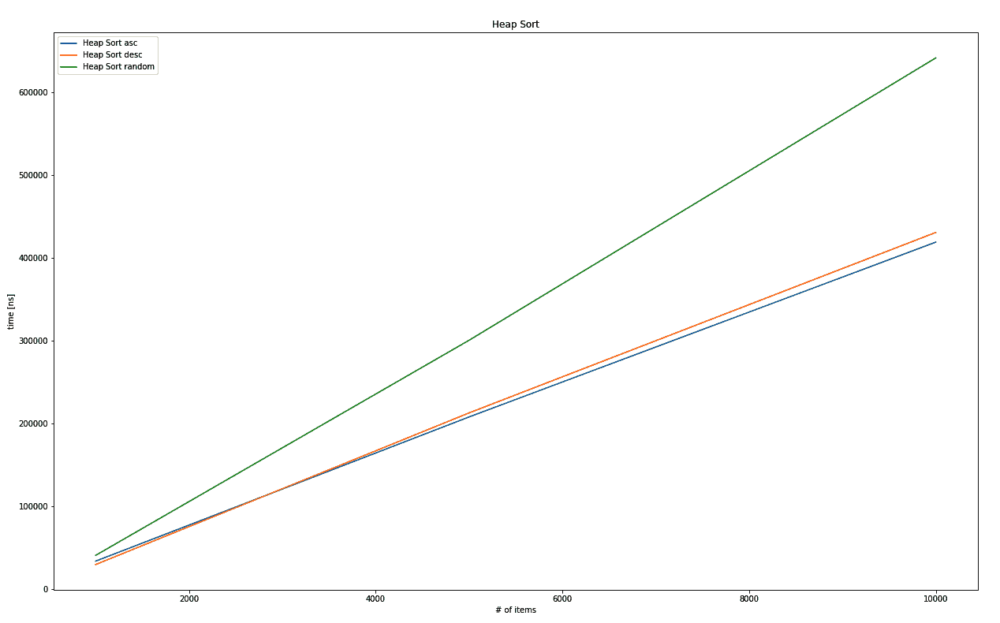

# 第九章：排序事物

*整理房屋，整理心灵*是一句谚语，正如其德语变体一样，意味着秩序在我们的生活中起着重要作用。任何想要最大化效率的人都必须依赖秩序，否则可能会偶尔花费大量时间在慢慢展开的混乱中进行搜索。拥有特定顺序的事物是很好的；但到达那里的过程是昂贵的。

这通常感觉不像是我们时间的良好利用，或者简单地可能不值得。虽然计算机并不确切地感觉，但排序事物所需的时间成本是相似的。最小化这一时间是发明新算法和改进其效率的目标，这对于像排序这样的常见任务来说是必要的。调用`mycollection.sort()`不应该需要几秒钟（或几分钟甚至几小时），因此这也是可用性的问题。在本章中，我们将探讨几个解决方案，因此你可以期待学习以下内容：

+   实现和分析排序算法

+   了解更多关于（不）著名的排序策略

# 从混乱到有序

有许多排序算法（及其各自的变体），每个都有其独特的特性。由于不可能在单章中涵盖每个算法，并且考虑到它们的有限实用性，本章涵盖了选定的几个。

选择应展示在排序项目集合中常见的不同策略，其中许多已经在不同语言的各个库中实现。由于你们中的许多人永远不会为生产目的实现任何排序算法，本节旨在使你们熟悉在发出`mycollection.sort()`调用时幕后发生的事情，以及为什么这可能需要令人惊讶的大量时间。

排序算法根据这些属性分为不同的组：

+   **稳定**：在比较相等值时保持相对顺序

+   **混合**：结合两种或多种排序方法（例如，按集合长度）

+   **原地**：使用索引而不是完整副本来传递集合

虽然稳定和混合算法更复杂，并且在许多情况下处于更高层次（因为它们结合了各种方法），但原地排序是常见的，它减少了算法必须执行的空间和复制量。

我们已经触及了一个非常基础的排序算法：**插入排序**。这是现实生活中大多数事情所使用的确切算法：当向书架上添加新书时，大多数人会拿起书，查看排序属性（例如作者的姓氏），并从字母*A*开始，找到他们当前收藏中的位置。这是一个非常有效的方法，用于以最小的开销构建新的收藏，但它不值得单独成章。

让我们从绝对经典且总是任何大学课程的一部分的简单算法开始：冒泡排序。

# 冒泡排序

冒泡排序是臭名昭著的算法，大学生通常将其作为他们第一个学习的排序算法。在性能和运行时间复杂度方面，它无疑是排序集合的最差方法之一，但非常适合教学。

原理很简单：遍历一个数组，扫描两个元素，并通过交换将它们带入正确的顺序。重复这些步骤，直到没有交换发生。以下图显示了在示例数组 `[8, 9, 7, 6]` 上的此过程，总共进行了四次交换，通过反复比较两个连续的元素，建立了 `[6, 7, 8, 9]` 的顺序。


此图还显示了算法的一个有趣（且命名）的特性：元素“冒泡”到它们预期的位置。图中的数字`6`通过一次交换，从集合的最后位置移动到第一个位置。

当这被转换成 Rust 代码时，其简洁性仍然保持：两个嵌套循环遍历集合，而外层循环也可以无限运行，因为内层部分做了所有的比较和交换。

冒泡排序，臭名昭著，是一段简短的代码：

```rs
pub fn bubble_sort<T: PartialOrd + Clone>(collection: &[T]) -> Vec<T> {
    let mut result: Vec<T> = collection.into();
    for _ in 0..result.len() {
        let mut swaps = 0;
        for i in 1..result.len() {
            if result[i - 1] > result[i] {
                result.swap(i - 1, i);
                swaps += 1;
            }
        }
        if swaps == 0 {
            break;
        }
    }
    result
}
```

为了更容易处理，该算法创建了输入数组的副本（使用`Into<T>`特质的`into()`方法）并使用`Vec<T>`提供的`swap()`方法交换元素。

嵌套循环已经暗示了（最坏情况）的运行时间复杂度：*O(n²)*。然而，由于在运行中没有交换时提前停止，部分有序集合将被惊人地快速排序。事实上，冒泡排序的最佳情况非常快，因为它基本上是单次遍历（换句话说，在这种情况下是*O(n)*）。

下面的图表显示了三种情况：排序已排序的集合（升序数字和降序数字），以及排序一个由不同数字随机打乱的数组：


冒泡排序升序、降序和随机排序数组的输出图比较

该算法将产生一个升序序列，但打乱后的集合的绝对运行时间比传统的最坏情况还要差：按降序排序的集合。无论如何，这些运行时间的指数性质显示了为什么冒泡排序不适合实际应用。

希尔排序有时被称为冒泡排序的优化版本！

# 希尔排序

冒泡排序总是将一个元素与相邻的元素进行比较，但这重要吗？许多人会说，这取决于未排序集合的现有顺序：这些未来的邻居是相隔很远还是很近？

壳排序的发明者唐纳德·希尔（Donald Shell）肯定有类似的思路，并使用元素之间的“间隙”来采用冒泡排序的交换方法进行进一步的跳跃。通过利用特定的策略来选择这些间隙，运行时间可以发生显著变化。希尔的原策略是从集合长度的一半开始，通过将间隙大小减半直到零，实现了*O(n²)*的运行时间。其他策略包括根据当前迭代*k*（例如，*2^k - 1*）的某种形式的计算选择数字，或者根据经验收集的间隙([`sun.aei.polsl.pl/~mciura/publikacje/shellsort.pdf`](http://sun.aei.polsl.pl/~mciura/publikacje/shellsort.pdf))，这些间隙还没有固定的运行时间复杂度！

以下图表解释了壳排序的一些工作原理。首先，选择初始间隙，原始论文中是`n / 2`。从那个间隙开始（在这个特定的例子中是`2`），保存元素并与间隙另一端的元素进行比较，换句话说，当前索引减去间隙：


如果间隙另一端的元素更大，它将替换原始元素。然后，这个过程以间隙大小的步长向索引零移动，所以问题变成了：什么将填补那个空隙（`7`被`8`覆盖，所以空隙是`8`所在的位置）——原始元素，还是它之前的元素“间隙”步数？

在这个例子中，它是`7`，因为没有前面的元素。在更长的集合中，在原始元素插入之前可能会发生更多的移动。在完成索引 2 的插入过程后，它会对索引 3 重复这个过程，从间隙向集合的末尾移动。之后，间隙大小会减少（在我们的例子中，减半），然后重复插入步骤，直到集合有序（并且间隙大小为零）。

单词，甚至是一张图片，都让人难以理解正在发生的事情。然而，代码却很好地展示了工作原理：

```rs
pub fn shell_sort<T: PartialOrd + Clone>(collection: &[T]) -> Vec<T> {
    let n = collection.len();
    let mut gap = n / 2;
    let mut result: Vec<T> = collection.into();

    while gap > 0 {
        for i in gap..n {
            let temp = result[i].clone();

            let mut j = i;
            while j >= gap && result[j - gap] > temp {
                result[j] = result[j - gap].clone();
                j -= gap;
            }
            result[j] = temp;
        }
        gap /= 2;
    }
    result
}
```

这个片段展示了壳排序的价值：使用正确的间隙策略，它可以实现与更复杂的排序算法相似的结果，但它实现起来要短得多，理解起来也容易得多。正因为如此，它对于嵌入式用例来说可能是一个不错的选择，在这些用例中，没有库，只有有限的空间可用。

在测试集上的实际性能很好：


壳排序升序、降序和随机排序数组之间的输出图比较

即使是据说会产生*O(n²)*运行时间的原始间隙策略，随机集合也产生了更接近线性行为的结果。绝对是一个良好的性能，但它能与堆排序相比吗？

# 堆排序

在本书中我们之前已经讨论过排序数字的话题（第五章，*健壮的树*），当时在讨论树：堆。堆是一种类似树的数据结构，其根节点具有最高（最大堆）或最低（最小堆）数值，在插入或删除元素时保持有序。因此，排序机制可以简单到将所有内容插入堆中，然后再检索出来！

由于（二叉）堆的已知运行时间复杂度为*O(log n*)，并且整个数组都必须插入，因此估计的运行时间复杂度将是*O(n log n*)，这是排序中最佳性能之一。以下图表显示了右侧的树表示法中的二叉堆和左侧的数组实现：


在 Rust 标准库中，有一个可用的`BinaryHeap`结构，这使得实现变得快速且简单：

```rs
pub fn heap_sort<T: PartialOrd + Clone + Ord>(collection: &[T]) -> Vec<T> {
    let mut heap = BinaryHeap::new();
    for c in collection {
        heap.push(c.clone());
    }
    heap.into_sorted_vec()
}
```

使用堆进行排序的事实将产生相当均匀的结果，使其成为无序集合的优秀选择，但对于预先排序的集合则不是最佳选择。这是因为无论预先存在的排序如何，堆都会被填充和清空。绘制不同情况几乎显示没有差异：



堆排序升序、降序和随机排序数组的输出图比较

另一种非常不同的策略，称为*分而治之*，被一组算法所采用。我们现在将要探索的这一组算法，从归并排序开始。

# 归并排序

战斗中的一个基本策略，以及在排序集合中，是分而治之。归并排序正是通过递归地将集合分成两半，直到只剩下一个元素来做到这一点。合并操作可以利用预先排序的集合的优势，将这些单个元素按正确顺序放在一起。

这所做的就是将问题规模（换句话说，集合中的元素数量）减少到更易于管理的块，这些块预先排序，以便更容易比较，从而在最坏情况下的运行时间复杂度为*O(n log n*)。以下图表显示了拆分和合并过程（请注意，比较和排序仅在合并步骤开始）：


这个原则有多种实现方式：自下而上、自上而下、使用块以及其他变体。实际上，截至 2018 年，Rust 的默认排序算法是 Timsort，这是一种稳定、混合算法，它将插入排序（直到一定大小）与归并排序相结合。

在 Rust 中实现简单的归并排序，再次是一个很好的使用递归的地方。首先，评估序列的左半部分，然后是右半部分，然后才开始合并，首先是通过比较两个已排序的结果（左和右）并从任一边选择元素。一旦这些运行用完了元素，剩下的就简单地附加，因为元素显然更大。这个结果被返回给调用者，重复在更高层次上的合并，直到达到原始调用者。

下面是典型归并排序实现的 Rust 代码：

```rs

pub fn merge_sort<T: PartialOrd + Clone + Debug>(collection: &[T]) -> Vec<T> {
    if collection.len() > 1 {
        let (l, r) = collection.split_at(collection.len() / 2);
        let sorted_l = merge_sort(l);
        let sorted_r = merge_sort(r);
        let mut result: Vec<T> = collection.into();
        let (mut i, mut j) = (0, 0);
        let mut k = 0;
        while i < sorted_l.len() && j < sorted_r.len() {
            if sorted_l[i] <= sorted_r[j] {
                result[k] = sorted_l[i].clone();
                i += 1;
            } else {
                result[k] = sorted_r[j].clone();
                j += 1;
            }
            k += 1;
        }

        while i < sorted_l.len() {
            result[k] = sorted_l[i].clone();
            k += 1;
            i += 1;
        }

        while j < sorted_r.len() {
            result[k] = sorted_r[j].clone();
            k += 1;
            j += 1;
        }

        result
    } else {
        collection.to_vec()
    }
}
```

这种行为也有回报，创建了一个准线性的运行时间复杂度，如下面的图表所示：


Quicksort 升序、降序和随机输出图比较

另一个分而治之类型的算法是快速排序。由于多种原因，这是一种非常有趣的排序列表的方法。

# 快速排序

这种算法在最佳情况下显著优于归并排序，并迅速被采纳为 Unix 的默认排序算法，以及 Java 的参考实现。通过使用与归并排序类似的策略，快速排序实现了更快的平均和最佳速度。不幸的是，最坏情况下的复杂度与冒泡排序一样：*O(n²)*。为什么会这样？你可能会问。

快速排序在全集的部分上操作，有时是递归的，并交换元素以建立顺序。因此，关键问题变成了：我们如何选择这些部分？这个选择部分被称为分区方案，通常包括交换，而不仅仅是选择一个分割索引。选择是通过选择一个枢轴元素来进行的，其值是所有内容与之比较的。

小于枢轴值的所有内容都移到一边，而大于的内容则移到另一边——通过交换。一旦算法检测到一边是升序（另一边是降序），就可以在两个序列相交的地方进行分割。然后，整个过程重新开始，每个分区都从新开始。

下面的插图显示了基于先前示例集合的元素选择和排序。虽然在这个例子中，分区只有一个长度与剩余部分相比，但如果这些是更长的序列，同样的过程也会适用：


这里使用的分区方案被称为霍尔方案，以 1959 年发明快速排序的发明者，安东尼·霍尔爵士命名。还有其他方案（Lomuto 似乎是最受欢迎的替代方案）可能通过权衡其他方面（如内存效率或交换次数）来提供更好的性能。无论分区方案如何，选择枢轴值在性能中也起着重要作用，它产生的部分越均匀（如中位数），值就越好。潜在策略包括以下：

+   选择中位数

+   选择算术平均值

+   选择一个元素（随机、第一个或最后一个，如这里所示）

在 Rust 代码中，快速排序通过三个函数实现：

+   公共 API 以提供可用的接口

+   一个包装的递归函数，它接受一个低索引和高索引来对中间部分进行排序

+   实现霍尔划分方案的划分函数

由于它操作的是最初提供的同一向量，根据它们的索引交换元素，因此这个实现可以被认为是就地操作。以下是代码：

```rs
fn partition<T: PartialOrd + Clone + Debug>(
    collection: &mut [T],
    low: usize,
    high: usize,
) -> usize {
    let pivot = collection[high].clone();
    let (mut i, mut j) = (low as i64 - 1, high as i64 + 1);

    loop {
        'lower: loop {
            i += 1;
            if i > j || collection[i as usize] >= pivot {
                break 'lower;
            }
        }

        'upper: loop {
            j -= 1;
            if i > j || collection[j as usize] <= pivot {
                break 'upper;
            }
        }

        if i > j {
            return j as usize;
        }
        collection.swap(i as usize, j as usize);
    }
}

fn quick_sort_r<T: PartialOrd + Clone + Debug>(collection: &mut [T], low: usize, high: usize) {
    if low < high {
        let pivot = partition(collection, low, high);
        quick_sort_r(collection, low, pivot);
        quick_sort_r(collection, pivot + 1, high);
    }
}

pub fn quick_sort<T: PartialOrd + Clone + Debug>(collection: &[T]) -> Vec<T> {
    let mut result = collection.to_vec();
    quick_sort_r(&mut result, 0, collection.len() - 1);
    result
}
```

在这个实现中，另一个新的方面是使用循环标签，这有助于提高结构和可读性。这是由于霍尔使用了 do-until 类型的循环，这种语法在 Rust 中不可用，但算法需要避免无限循环。

`break`/`continue`指令是臭名昭著的 goto 指令的亲戚，因此它们应该仅在使用时谨慎且非常小心，以增加可读性。循环标签提供了一种实现这一点的工具。它们允许读者跟踪确切是哪个循环正在退出或继续。语法略微借鉴了生命周期的语法：`'mylabel: loop { break 'mylabel; }`。

快速排序的性能特征确实很有趣。自其发明以来，罕见的 worst case 行为或*O(n²)*触发了数十年的优化，其中最新的是 2009 年的 Dual-Pivot Quicksort，它已被 Oracle 的 Java 7 库采用。有关更详细的解释，请参阅*进一步阅读*部分。

在原始数据集上运行快速排序，最坏情况和最佳情况行为明显可见。在降序和（令人好奇的）升序数据集上的性能明显是*O(n²)*，而随机数组则被快速处理：


快速排序在升序、降序和随机排序数组之间的输出图比较

这种行为说明了快速排序的强项，这些强项更符合“现实世界”类型的场景，其中最坏的情况很少出现。然而，在当前各种编程语言的库中，排序是以混合方式进行的，这意味着这些通用算法根据它们的优点被使用。这种方法被称为**Introsort**（来自自省排序），在 C++的`std::sort`中，它依赖于快速排序直到某个点。然而，Rust 的标准库使用 Timsort。

# 摘要

将事物排序是一个非常基本的问题，它以许多不同的方式得到解决，这些方式在诸如最坏情况运行时间复杂度、所需内存、相等元素的相对顺序（稳定性）以及整体策略等方面有所不同。本章介绍了一些基本方法。

**冒泡排序**是实施起来最简单的算法之一，但它有很高的运行时成本，最坏情况下的行为为*O(n²)*。这是因为它简单地根据嵌套循环交换元素，使得元素“冒泡”到集合的任一端。

**希尔排序**可以看作是冒泡排序的改进版本，有一个主要优点：它不是从交换相邻元素开始。相反，有一个间隔，元素在这个间隔内进行比较和交换，覆盖了更长的距离。这个间隔大小随着每一轮的进行而改变，从原始方案的*O(n²)*最坏情况运行时复杂度到最快变体的*O(n log n)*。实际上，一些经验推导出的间隔的运行时复杂度甚至无法可靠地测量！

**堆排序**利用数据结构的属性来创建一个有序集合。正如之前所提到的，堆在其根节点保留最大（或最小）元素，并在每次`pop()`时返回它。因此，堆排序简单地将整个集合插入堆中，然后按顺序逐个检索。这导致运行时复杂度为*O(n log n)*。

基于树的策略也存在于**归并排序**中，这是一种分而治之的方法。该算法递归地将集合分成一半以排序子集，然后再处理整个集合。这项工作是在从递归调用返回时进行的，当结果子集需要合并时。因此得名。通常，这将导致运行时复杂度为*O(n log n)*。

**快速排序**也使用分而治之的方法，但不是每次都简单地将集合分成两半，而是使用一个枢轴值，在查看每个子集合之前，将其他值与枢轴值交换。这导致最坏情况下的行为为*O(n²)*，但快速排序通常因其频繁的平均复杂度为*O(n log n)*而被使用。

现在，标准库使用混合方法，如 Timsort、Introsort 或模式击败的快速排序，以获得最佳绝对和相对运行时性能。Rust 的标准库提供基于归并排序的稳定排序函数（`slice::sort()`与`slice::sort_unstable()`），以及基于模式击败的快速排序的不稳定排序函数。

本章旨在成为下一章的基础，下一章将介绍如何找到特定元素，这通常需要有序集合！

# 问题

+   为什么排序是编程的一个重要方面？

+   在冒泡排序中是什么使得值向上冒泡？

+   为什么希尔排序是有用的？

+   堆排序在其最佳情况下能否优于冒泡排序？

+   归并排序和快速排序有什么共同之处？

+   混合排序算法是什么？

# 进一步阅读

这里有一些额外的参考资料，您可能需要参考本章所涵盖的内容：

+   *双轴快速排序* ([`web.archive.org/web/20151002230717/http://iaroslavski.narod.ru/quicksort/DualPivotQuicksort.pdf`](https://web.archive.org/web/20151002230717/http://iaroslavski.narod.ru/quicksort/DualPivotQuicksort.pdf))

+   C++ 排序解释 ([`zhuanlan.zhihu.com/p/27633895`](https://zhuanlan.zhihu.com/p/27633895))

+   维基百科上的 Introsort ([`zh.wikipedia.org/wiki/Introsort`](https://zh.wikipedia.org/wiki/Introsort))

+   维基百科上的 Timsort ([`zh.wikipedia.org/wiki/Timsort`](https://zh.wikipedia.org/wiki/Timsort))

+   打败快速排序的模式 ([`github.com/orlp/pdqsort`](https://github.com/orlp/pdqsort))
