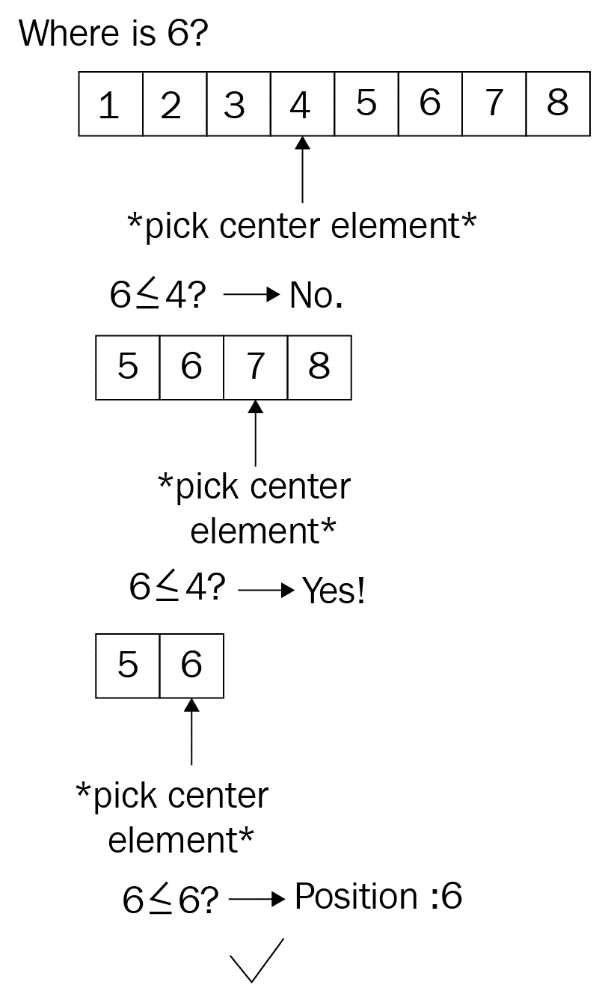

# 寻找东西

搜索“某物”的问题始终与您正在搜索的空间直接相关。您肯定经历过在家里找钥匙的经历：搜索空间包含从前一天穿过的夹克到钥匙可能滑入的袜子抽屉中的任何东西。在找到物品（以及花费大量时间上楼下楼和在不同房间中搜索之后），您会发誓将来要使东西更整齐……

我们遇到的这个问题比我们愿意承认的要多，但它说明了我们可以通过算法解决的一个基本问题，而不需要任何特定的顺序来构建。在本章中，我们将探讨如何做到以下几点：

+   在混乱的无序数组中寻找项目

+   在准备和搜索之间做出权衡

# 寻找最佳

搜索域存在于多个抽象级别：在文本中找到一个词通常比简单地调用`contains()`函数要复杂，如果有多个结果，哪个是您要找的？这一类问题都归纳在**信息检索**的范畴下，其中通过排名、索引、理解、存储和搜索等问题来解决，以检索最佳结果（对于所有定义）。本章仅关注后者，即我们实际上查看一系列项目（例如，索引）以找到匹配项。

这意味着我们将直接比较项目（*a == b*）以确定接近度，而不是使用诸如距离或局部敏感哈希函数之类的工具。这些可以在更具体的领域找到，如模糊搜索或匹配文本体，这是一个独立的领域。要了解更多关于哈希的信息，请参阅第六章*探索映射和集合*或本章的*进一步阅读*部分。

从最简单的实现开始，让我们看看线性搜索。

# 线性搜索

线性搜索是一个听起来很高级的名字，我们在几乎每一个程序和日常生活中都会这样做：遍历一系列项目以找到第一个匹配项。不需要任何预处理或类似步骤；集合可以原样使用，这意味着标准库通常已经提供了通用的实现。在 Rust 的情况下，迭代器特质通过名为`position()`（或`rposition()`）、`find()`、`filter()`或甚至`any()`的函数提供了这个功能。`fold()`也可以用来找到你要找的东西。以下是一个流程图的示例：


然而，从根本上说，这是一个遍历每个项目的循环，该循环要么退出，要么收集所有与谓词（一个评估函数，它接受一个类型的项目并返回一个布尔值）匹配的项目：

```rs
pub fn linear_search<T: Eq + Clone>(haystack: &[T], needle: &T) -> Option<usize> {
    for (i, h) in haystack.iter().enumerate() {
        if h.eq(needle) {
            return Some(i);
        }
    }
    None
}
```

这个算法显然表现出 *O(n)* 的时间复杂度，随着集合大小的增长而增长。迭代 10,000 个项目会花费一些时间，即使谓词执行得很快，那么这种策略应该如何改进呢？

# 跳跃查找

线性地逐个遍历一个集合只有在接近潜在匹配项时才是有效的，但很难确定——“接近匹配”是什么意思？在无序集合中，这确实是不可能知道的，因为任何项目都可以跟随。因此，先对集合进行排序怎么样？如第九章排序事物中讨论的那样，排序在准线性时间复杂度下可以比遍历超过一定大小的长集合中的每个项目要快得多。

跳跃查找利用了对它跳过的范围的了解，就像跳表一样：


在排序后，搜索可以显著更快，并且一旦算法接近匹配项，可以跳过一定数量的元素以线性方式搜索。每次跳跃可以跳过多少个元素？这是一件需要测试的事情，但首先这里是完成这项工作的代码：

```rs
pub fn jump_search<T: Eq + PartialOrd + Clone>(
    haystack: &[T],
    needle: &T,
    jump_size: usize,
) -> Option<usize> {
    if jump_size < haystack.len() {
        let mut i = 0;
        while i < haystack.len() - 1 {
            if i + jump_size < haystack.len() {
                i += jump_size
            } else {
                i = haystack.len() - 1;
            }
            if &haystack[i] == needle {
                return Some(i);
            } else if &haystack[i] > needle {
                return linear_search(&haystack[
                                    (i - jump_size)..i], needle);
            }
        }
    }
    None
}
```

API 预期一个预排序的切片，这意味着严格来说，排序不是算法运行时间的一部分。没有排序，时间复杂度可能大约是 *O(n / k + k)*，其中 k 是步长，在最坏的情况下可以减少到 *O(n)*。

包括排序机制，排序算法将轻松超越搜索的时间复杂度，将其提高到 *O(n log n)*。虽然跳跃的选择可以显著提高这种搜索算法的绝对运行时间，但它不会像树结构那样表现良好。然而，作为策略，二分查找做得很好。

# 二分查找

二叉树通过从集合中创建分支来大大减少比较操作的次数，就像二叉树一样。这会即时创建一个树，从而实现更好的搜索性能。其重要性在于可预测性，这允许我们构建树，并为算法可以期望的结果分支提供选项。

二分查找，就像跳跃查找一样，需要输入的切片是有序的才能工作。然后算法将数组分成两半，并选择最有可能包含该元素的一侧。一旦有两个集合，其行为与二叉树遍历非常相似，如下所示：



再次强调，由于排序的努力超过了算法的时间复杂度，因此将考虑排序算法的结果：*O(n log n)*。然而，我们也应该对实际性能感兴趣，如果集合已经排序；它将显著降低！首先，让我们看看一些代码，以便更容易理解：

```rs
pub fn binary_search<T: Eq + PartialOrd>(
    haystack: &[T],
    needle: &T,
) -> Option<usize> {
    let (mut left, mut right) = (0, haystack.len() - 1);
    while left <= right {
        let pivot = left + (right - left) / 2;
        if needle < &haystack[pivot] {
            right = pivot - 1;
        } else if needle > &haystack[pivot] {
            left = pivot + 1;
        } else {
            return Some(pivot); // lucky find
        }
    }
    None
}
```

虽然算法的递归实现也可以工作，尽管它并不显著更短，但它包含了栈溢出的风险，因此采用了迭代方法。

在选择枢轴（中心）元素后，算法必须通过以下三种情况之一来确定下一次迭代的集合：

+   包含较小值的左侧部分

+   包含较大值的右侧部分

+   完全不是；枢轴元素也是结果

这种树状行为允许运行时间复杂度达到*O(log n)*，因为搜索的项目数量会一直减半，直到找到所需的元素。然而，这一切是如何比较的呢？

# 总结

这三种方法有所不同，二分搜索是当前最先进的算法类型。实际上，它可以用于任何已排序的 Rust 切片（当然，如果它们已排序的话），并用于查找所需的内容。

比较这些算法比较棘手：线性搜索在无序数据集上效果很好，如果排序不是可选项，那么它是唯一可以搜索这些数据集的方法。如果排序是可选项，那么二分搜索会快得多（`asc`是排序方向：升序）：

```rs
test tests::bench_binary_search_10k_asc ... bench: 80 ns/iter (+/- 32)
test tests::bench_binary_search_1k_asc ... bench: 63 ns/iter (+/- 17)
test tests::bench_binary_search_5k_asc ... bench: 86 ns/iter (+/- 28)
test tests::bench_jump_search_10k_asc ... bench: 707 ns/iter (+/- 160)
test tests::bench_jump_search_1k_asc ... bench: 92 ns/iter (+/- 10)
test tests::bench_jump_search_5k_asc ... bench: 355 ns/iter (+/- 46)
test tests::bench_linear_search_10k_asc ... bench: 2,046 ns/iter (+/- 352)
test tests::bench_linear_search_1k_asc ... bench: 218 ns/iter (+/- 22)
test tests::bench_linear_search_5k_asc ... bench: 1,076 ns/iter (+/- 527)
test tests::bench_std_binary_search_10k_asc ... bench: 93 ns/iter (+/- 10)
test tests::bench_std_binary_search_1k_asc ... bench: 62 ns/iter (+/- 7)
test tests::bench_std_binary_search_5k_asc ... bench: 89 ns/iter (+/- 27)
```

当绘制时，差异明显可见，线性搜索显示出其线性特征。将绝对运行时间排除在外将显示运行时间复杂度，如下面的图表所示：


此图表显示了每种算法的相对行为，以显示其运行时间复杂度：二分搜索为*O(log n)*，线性搜索为*O(n)*，以及跳转搜索，由于参数选择（跳转大小是数组长度的三分之一），几乎呈线性：


这就是全部内容——搜索算法的简要介绍。通常，这更多是关于数据，并且事先有一些排序方法可以创建一个快速找到所需项的强大机会。

# 概述

搜索作为信息检索（以及其他）过程中的一个基本方法，是一种独立于所使用的数据结构来查找东西的方式。有三种流行的算法类型：线性搜索、跳转搜索和二分搜索。在关于映射和集合的早期章节中已经讨论了完全不同的方法（如局部敏感哈希），但它们仍然需要一个快速比较的机制。

线性搜索是最简单的方法：遍历一个集合，并将元素与要查找的元素进行比较。这也在 Rust 的迭代器中得到了实现，并表现出*O(n)*的运行时间复杂度。

跳转搜索更优越。通过在已排序的集合上操作，它们可以使用大于 1 的步长（就像线性搜索一样）来更快地跳转到所需部分，通过检查相关部分是否已经通过。虽然绝对速度更快，但最坏情况下的运行时间复杂度仍然是*O(n)*。

（在撰写本文时）最快的方法是二分查找，它也作用于有序集合，并反复将所需部分一分为二，采用树状策略进行操作。实际上，该算法本身的运行时间复杂度也是 *O(log n)*。

在下一章中，我们将探讨一些更奇特算法：回溯、随机数生成等！

# 问题

1.  什么是信息检索？

1.  现代搜索引擎和数据库是否使用简单的搜索算法？

1.  为什么线性搜索的运行时间复杂度是 *O(n)*？

1.  跳查比线性查找做得更好是什么？

1.  什么是二分查找，为什么它与树形结构相似？

# 进一步阅读

这里有一些额外的参考资料，您可能需要参考本章所涵盖的内容：[`www.aaai.org/ocs/index.php/AAAI/AAAI14/paper/view/8357/8643`](https://www.aaai.org/ocs/index.php/AAAI/AAAI14/paper/view/8357)。
