# 第十一章：随机和组合

虽然排序和搜索是计算机科学中两个非常基本的问题，但它们远非唯一。实际上，这些问题已经被那些深入研究这些领域的人彻底解决了。在当今世界，解决现实世界问题的解决方案更有可能涉及生成随机数、几个项目的最佳组合（组合数学）、将几个时间段“合并”成单个数字，以及可视化结果。随机数生成算法和高效解决组合问题已经成为非常重要的。特别是对于后者，实现将特定于解决方案，但有一些基本方法仍然存在。在本章中，我们将讨论这些基本方法之一，并了解以下内容：

+   实现回溯算法

+   利用动态规划技术

+   伪随机数生成器的工作原理

# 伪随机数

在过去几年里，随机数生成在受欢迎程度上有了显著的提升，然而许多开发者只是简单地接受他们所使用的技术提供的生成器。然而，好的随机数对于许多应用至关重要，如加密和安全（或者缺乏安全；参见 2010 年索尼 PlayStation 3 安全事件，该事件引发了一个著名的 XKCD——[`xkcd.com/221/`](https://xkcd.com/221/)），模拟、游戏、统计学和生物学。

基本原则是：序列越随机越好。原因很明显。如果一个随机数序列中的任何数字在统计上依赖于另一个数字，它就变成了可以预测的模式，而可预测的随机性是不存在的。因此，随机序列中的数字在统计上必须是独立的，才能被认为是好的随机数。

要获取这些随机数，可以使用伪随机数生成器或真正的随机数生成器（或者你可以买一本书——[`www.rand.org/pubs/monograph_reports/MR1418.html`](https://www.rand.org/pubs/monograph_reports/MR1418.html)）。由于计算机是确定性机器，没有外部影响的情况下，后者是不可能的，这也是为什么实际上已经有过（失败的）尝试去实现真正的随机数。另一方面，**伪随机数生成器**（**PRNGs**）是确定性的，但开始时使用相当随机的输入（鼠标指针移动、网络流量等），并定期基于这个种子产生数字。

PRNGs 还享有速度优势（因为不需要物理交互，例如测量大气噪声），并且输出对于许多应用来说通常足够好。事实上，如果种子非常接近随机，PRNGs 可以做得很好，这在现代密码学中可以见到。

有许多机构正在研究 PRNG 及其在生成加密保存的随机数方面的有效性，例如，德国的 BSI 提供了一份深入的分析论文([`bit.ly/2AOIcBl`](https://bit.ly/2AOIcBl))。这是一个与 IT 安全密切相关且非常有趣的话题。然而，对于非安全研究人员来说，有一种简单的方法可以一眼评估随机数生成器的质量：视觉检查。在随机决定是否在散点图中绘制每个单独的像素时，不应该有任何可见的模式。

下面的图表是 Python 的 `numpy.random` 随机数生成器，它是为了从相同的种子提供相同的数字而创建的：

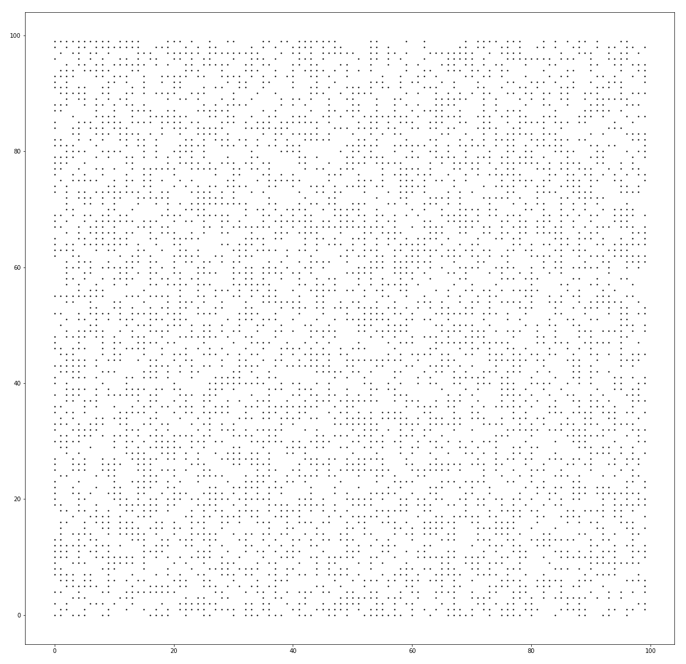

对于统计工作和一些模拟来说，它已经足够好了，但不应该依赖于它来进行加密工作。

无论工作类型如何，一个糟糕的随机生成器永远不会像这样：

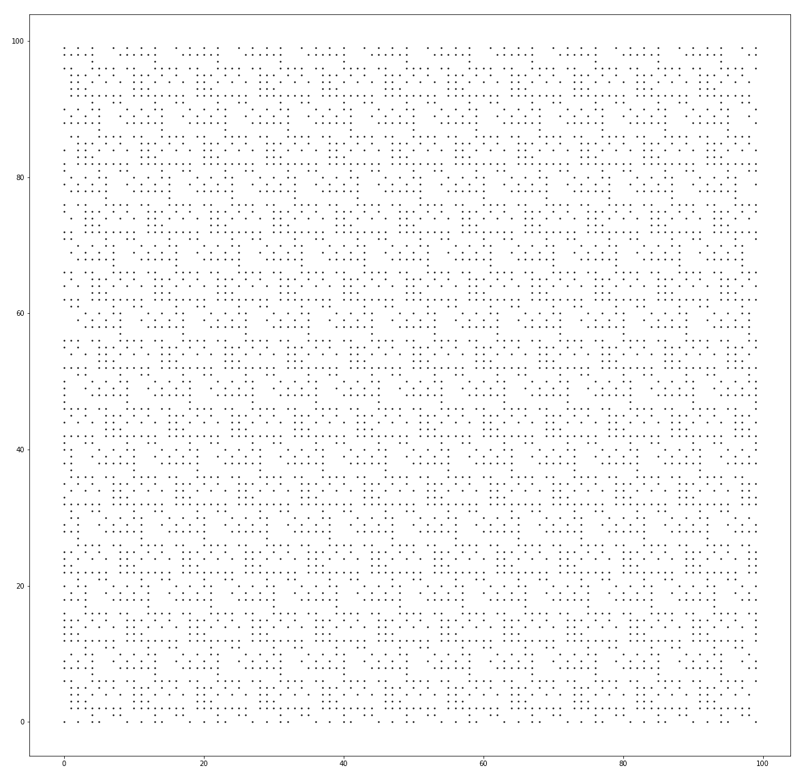

如模式所示，在这个随机生成器中可以找到系统错误！遗憾的是，这并不罕见，即使在像 Windows 上的 PHP 这样的广泛使用的技术中也是如此([`boallen.com/random-numbers.html`](https://boallen.com/random-numbers.html))。

多亏了种子，PRNG 可以创建可重复以及接近随机的数字，这对于模拟或简单地为了数据科学目的抽取随机样本来说非常有用。一个非常古老且经过充分研究的方法是**线性同余生成器**，或**LCG**。

# LCG

LCG 是生成伪随机数序列的最古老方法之一。它遵循一个简单、递归的公式：

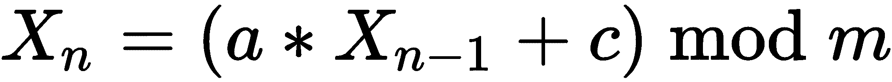

*X* 表示随机数（或者更准确地说，序列中的 *n^(th)* 随机数）。它是基于其前驱数乘以一个因子 *a*，并偏移一个常数 *c*。模运算符确保没有溢出。第一个 *X* 是什么？种子！因此，随机数序列将从种子开始，如果需要的话，提供确定性。

这些参数设置需要经过显著的测试；实际上，许多库和编译器开发者有不同的设置。维基百科页面提供了一个概述([`en.wikipedia.org/wiki/Linear_congruential_generator`](https://en.wikipedia.org/wiki/Linear_congruential_generator#Parameters_in_common_use))：

```rs
pub struct LCG {
    xn: f32,
    m: f32,
    c: f32,
    a: f32,
}

impl LCG {
    fn seeded(seed: u32) -> LCG {
        LCG {
            xn: seed as f32,
            m: 2e31,
            a: 171f32,
            c: 8f32,
        }
    }

    fn new(seed: f32, m: f32, a: f32, c: f32) -> LCG {
        LCG {
            xn: seed,
            m: m,
            a: a,
            c: c,
        }
    }

    fn next_f32(&mut self) -> f32 {
        self.xn = (self.a * self.xn + self.c) % self.m;
        self.xn / self.m
    }
}
```

这个参数设置虽然随机选择，但看起来并不糟糕：

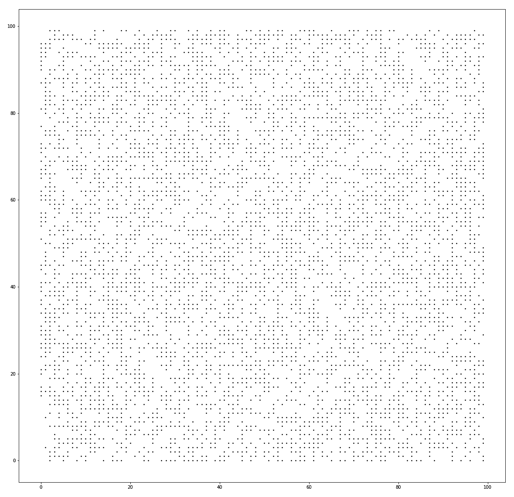

之前作为糟糕示例生成的位图也使用了 LCG，但使用了另一个随机参数设置：

```rs
impl LCG {
    fn seeded(seed: u32) -> LCG {
        LCG {
            xn: seed as f32,
            m: 181f32,
            a: 167f32,
            c: 0f32,
        }
    }
...
}
```

由于结果显然很糟糕，这表明参数在这里是多么重要。通常，这些不是你应该调整的设置（或者你会知道它们）。同样，两位科学家提出了一组特定的“魔法数字”，这允许更好的随机数生成器：Wichmann-Hill PRNG。

# Wichmann-Hill

当 Brian Wichmann 和 David Hill 发明他们的随机数生成器时，他们采取了一种扩展的 LCG 方法。它基于 LCG，但使用三个经过修改并按（魔法）素数组合的 LCG。

这些数字相加后，产生一个长度为 6,953,607,871,644（或 6.95 * 10¹²）的序列，这意味着在调用这个数量的 PRNG 之后，它将重新开始：

```rs
const S1_MOD: f32 = 30269f32;
const S2_MOD: f32 = 30307f32;
const S3_MOD: f32 = 30323f32;

pub struct WichmannHillRng {
    s1: f32,
    s2: f32,
    s3: f32,
}

impl WichmannHillRng {
    fn new(s1: f32, s2: f32, s3: f32) -> WichmannHillRng {
        WichmannHillRng {
            s1: s1,
            s2: s2,
            s3: s3,
        }
    }

    pub fn seeded(seed: u32) -> WichmannHillRng {
        let t = seed;
        let s1 = (t % 29999) as f32;
        let s2 = (t % 29347) as f32;
        let s3 = (t % 29097) as f32;
        WichmannHillRng::new(s1, s2, s3)
    }

    pub fn next_f32(&mut self) -> f32 {
        self.s1 = (171f32 * self.s1) % S1_MOD;
        self.s2 = (172f32 * self.s2) % S2_MOD;
        self.s3 = (170f32 * self.s3) % S3_MOD;
        (self.s1 / S1_MOD + self.s2 / S2_MOD + self.s3 / S3_MOD) % 1f32
    }
}
```

生成器表现良好，正如视觉检查所显示的。事实上，Wichmann-Hill 生成器在过去被用于各种技术和应用中，所以这并不令人惊讶。

这里是视觉分析：

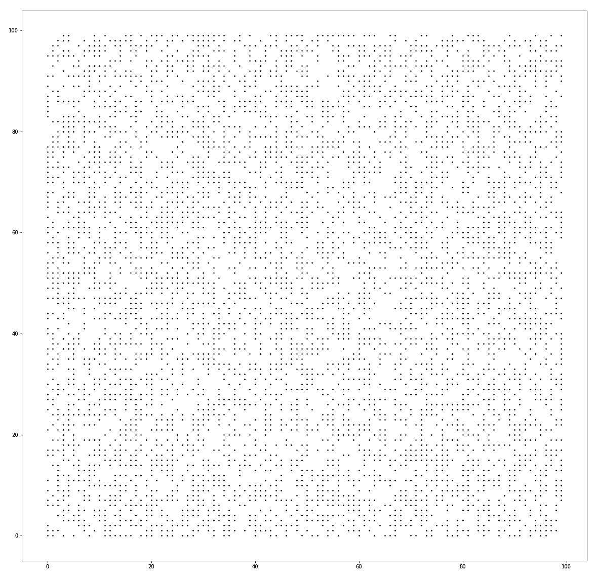

显然，为每个随机生成器的变体实现都是不高效的。幸运的是，在 [`crates.io/`](https://crates.io/) 上有一个出色的 crate 叫做 `rand`。

# rand crate

当谈到随机数生成器时，有一个非常出色的 crate 不能跳过：`rand`。由于 Rust 的标准库不包含随机函数，这个 crate 提供了那个，还有更多。

特别是，`rand` crate 提供了多种实现，从常规的 PRNG 到操作系统数字生成器的接口（在类 Unix 系统上是 `/dev/random`），还包括适用于其他目标（如 WebAssembly）的兼容接口！

这些特性在本章中难以描述，因此更多关于这些特性的信息可以在它们自己的书中找到（[`rust-random.github.io/book/`](https://rust-random.github.io/book/)）。

# 从后往前

有一些问题人类比计算机更容易解决。这些问题通常具有某种空间性质（例如，旅行商问题、背包问题），并且依赖于模式，这两者都是人类擅长的领域。这类问题的另一个名称是优化问题，其解决方案旨在最小化或最大化某个特定方面（例如，最小距离或最大值）。这个类别的子集是约束满足问题，其中解决方案必须符合一组规则，同时最小化或最大化另一个属性。

创建这些解决方案所使用的暴力方法是算法类别中的回溯法，其中许多小的选择通过递归组合在一起形成一个解决方案。从根本上说，这种寻找最优解的搜索可以运行以找到所有可能的组合（*穷举搜索*）或提前停止。为什么是递归？什么让它比常规循环更适合？

典型的约束满足问题需要逐步向现有物品集合中添加物品，然后评估它们的质量。回溯算法就是这样，一旦它早期遇到一个坏解决方案，它就可以回溯，以便在最佳可能的时间跳过。在讨论例子时，这一点会更加清晰，所以这里有可以通过常规回溯算法解决的两个著名问题：0-1 背包问题和 N 皇后问题。

# 打包背包或 0-1 背包问题

背包问题非常现实：每次你只带随身行李乘坐廉价航空公司时，事情就会变得复杂。我真的需要**这个**吗？我可以在家留下我的数码单反相机，用手机拍照，对吧？

这些是表达物品潜在价值和关于其重量（或这些航班上的体积）的考虑的陈述，我们通常希望带上最有价值的（对我们来说）物品出行。虽然这听起来像是一个算法问题，但它远非简单。让我们从目标开始：

*给定 n 个物品（具有重量和价值），找到提供最高价值且不超过背包容量 W 的物品子集。*

从这个基础上，构建解决方案的方式可以如下构建：作为一个穷举搜索算法，每个可能的解决方案都可以是最佳解决方案。然而，这只有在所有解决方案都被评估之后才会变得清晰。因此，让我们首先生成所有可能的解决方案，然后再考虑最佳方案。

对于任何递归场景，首先关注退出条件非常重要：递归何时停止以及它将返回什么？在背包问题的情况下，停止条件是围绕当前重量构建的：

+   重量超过容量

+   当前重量已达到容量

+   没有剩余的物品

如果容量已经超过，算法返回数据类型的最小值，并在该执行分支上进行“回溯”。然而，如果重量正好等于容量，或者没有剩余物品，则返回一个中性值。

那么返回值表示什么？它是物品的总价值，由于这是一个寻找最大价值的过程，所以比较两种可能性的返回值：

+   包括物品

+   排除物品

因此，我们将取递归调用有或没有当前物品的返回值的最大值，从而排除任何超过提供的容量组合：

```rs
pub trait Backtracking {
    fn fill(&self, items: Vec<&Item>) -> u64;
    fn fill_r(&self, remaining: &[&Item], current_weight: usize) -> i64;
}
```

关于架构的说明：由于这个例子将使用动态规划（参考以下代码）进行改进，因此一个很好的结构方法是创建并实现一个针对这两种技术的特性：

```rs

#[derive(Debug, PartialEq)]
pub struct Item {
    pub weight: u32,
    pub value: u32,
}

pub struct Knapsack {
    capacity: usize,
}

impl Knapsack {
    pub fn new(capacity: usize) -> Knapsack {
        Knapsack { capacity: capacity }
    }
}

impl Backtracking for Knapsack {

    fn fill(&self, items: Vec<&Item>) -> u64 {
        let value = self.fill_r(&items, 0);
        if value < 0 {
            0
        } else {
            value as u64
        }
    }

    fn fill_r(&self, remaining: &[&Item], current_weight: usize)
     -> i64 {
        let w = current_weight;

        if w > self.capacity {
            return i64::min_value();
        }

        if remaining.len() > 0 && w < self.capacity {
            let include = remaining[0].value as i64
                + self.fill_r(&remaining[1..], current_weight 
                + remaining[0].weight as usize);
            let exclude = self.fill_r(&remaining[1..], current_weight);
            if include >= exclude {
                include
            } else {
                exclude
            }
        } else {
            0
        }
    }

}
```

关于此算法的运行时间复杂度的问题仍然存在——这次并不那么明确。有些人建议它是*O(2^n)*，但有两个主要增长因素：容量以及可用物品的数量。在这本书中，图表将关注要添加到包中的物品数量，这涉及到（伪）多项式复杂度（大于*O(n²)*）。无论如何，你应该知道这是一个使用回溯法解决的高成本问题。

在大学中，回溯法的另一个流行例子是 8 后问题（或者，在其一般形式中，N 后问题）。

# N 后问题

N 后棋问题（8 后问题/谜题的推广版本）定义如下：

*在一个 N×N 的棋盘上，放置 N 个王棋，使得它们不能相互攻击。*

作为第一步，理解棋盘中王棋的移动方式非常重要，幸运的是，这很简单：王棋可以直线向上、向下、向左、向右以及斜线移动，如下面的图示所示：

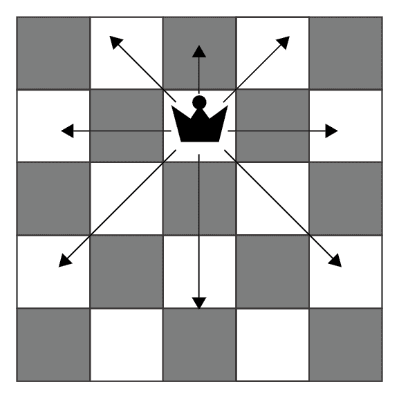

了解这一点后，其余部分与前面的背包问题非常相似，但由各种放置选项引起的可能性更多。有几种策略可以应对这种情况：

+   单独对每个单元格进行操作，这会导致大量的递归调用迅速发生

+   单独对每一行（或列）进行操作，并对单元格进行迭代

后者显然是首选方法，因为 10×10 的棋盘会导致每个单独的单元格有 100 次递归调用（包括分配等），因此很快就会导致栈溢出。因此，第二种选择（按行）是最佳权衡，因为每一行/列至少要放置一个王棋，并且排除了其他王棋的放置：

```rs
pub struct ChessBoard {
    board: Vec<Vec<bool>>,
    n: usize,
}

impl ChessBoard {
    pub fn new(n: usize) -> ChessBoard {
        ChessBoard {
            n: n,
            board: vec![vec![false; n]; n],
        }
    }

    pub fn place_queens(&mut self) -> bool {
        self.place_queens_r(0)
    }

    pub fn place_queens_r(&mut self, column: usize) -> bool {
        if column < self.n {
            for r in 0..self.n {
                if self.is_valid(r, column) {
                    self.board[r][column] = true;
                    if self.place_queens_r(column + 1) {
                        return true;
                    }

                    self.board[r][column] = false;
                }
            }
            false
        }
        else {
            true
        }
    }

    fn is_valid(&self, row: usize, col: usize) -> bool {
        for i in 0..self.n {
            if self.board[i][col] {
                return false;
            }
            if self.board[row][i] {
                return false;
            }
        }
        let mut i = 0;
        let (mut left_lower, mut left_upper, mut right_lower, 
             mut right_upper) =
            (true, true, true, true);

        while left_lower || left_upper || right_lower || right_upper {
            if left_upper && self.board[row - i][col - i] {
                return false;
            }
            if left_lower && self.board[row + i][col - i] {
                return false;
            }
            if right_lower && self.board[row + i][col + i] {
                return false;
            }
            if right_upper && self.board[row - i][col + i] {
                return false;
            }
            i += 1;
            left_upper = row as i64 - i as i64 >= 0 
                         && col as i64 - i as i64 >= 0;
            left_lower = row + i < self.n && col as i64 - i 
                         as i64 >= 0;

            right_lower = row + i < self.n && col + i < self.n;
            right_upper = row as i64 - i as i64 >= 0 
                          && col + i < self.n;
        }
        true
    }
// ...
}
```

策略很简单：对于每一行的每个单元格，检查在当前条件下是否可以放置一个有效的王棋。然后，深入递归，一旦找到有效的设置就结束。结果如下（*n = 4*）：

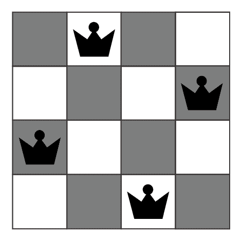

然而，此算法的计算复杂度呈指数增长（*O(2^n)*），这意味着对于大的*n*，它将不会在任何合理的时间内完成：

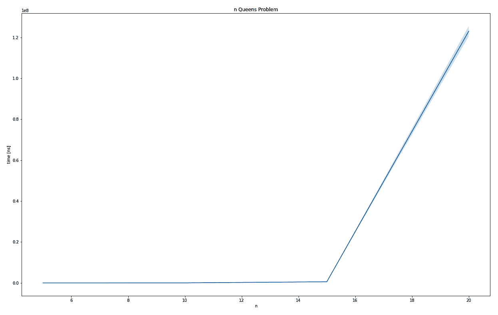

N 后问题的输出图

尽管这个特定的问题可能更像是一个教学问题，但这种方法肯定可以应用于其他（类似）用例，尤其是在空间域中。

# 高级问题解决

回溯算法计算并找到特定问题的最佳整体解决方案。然而，如第八章中所述，*算法评估*，有些问题具有非常大的计算复杂度，这导致运行时间非常长。由于这不太可能通过仅仅提高计算机的速度和智能来解决，因此需要更智能的方法。

在多种策略和技术可供选择的情况下，选择一种最适合解决你问题的方法是你的选择。由于 Rust 在速度和内存效率方面的优势，它在这一领域的位置可能至关重要，因此关注复杂问题的解决方案可能在将来（在作者看来）会得到回报。

首先是一种旨在提高回溯算法复杂度的令人惊讶的编程技术：动态规划。

# 动态规划

动态规划的概念是这些你本以为有不同名称的技术之一：缓存。基本思想是将相关的临时结果保存到缓存中，并使用这个预先计算的结果，而不是反复重新计算！

这意味着必须检查问题和潜在解决方案，以找到相关的子问题，因此任何结果都可以被缓存。这种方法的优点是它找到了可能的全局最佳解决方案，但代价是可能的高运行时间复杂度。

# 背包问题改进

例如，让我们检查背包求解器的递归调用。为了简洁起见，这个背包将使用三个物品的列表来填充，每个物品的重量均匀为 1，容量为 2。由于回溯算法按顺序遍历物品列表（并尝试包含或排除特定物品），背包求解器可以看作是一个函数 *K*，它将任何剩余的物品以及剩余容量映射到特定的值：

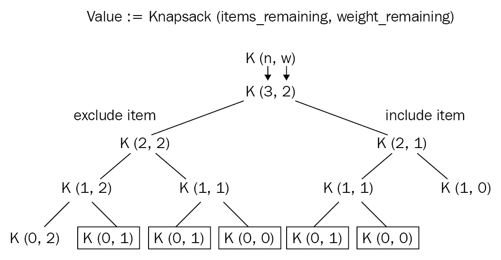

因此，在相同级别上，相同的输入参数导致相同的值，这很容易缓存。在先前的图中，被矩形标记的节点至少被计算了两次。这个例子是从 GeeksforGeeks 的文章中摘取的（[`www.geeksforgeeks.org/0-1-knapsack-problem-dp-10/`](https://www.geeksforgeeks.org/0-1-knapsack-problem-dp-10/))，关于 0-1 背包问题。

在做任何事情之前，我们现在可以给回溯算法实现一个不同的特性：

```rs
pub trait DynamicProgramming {
    fn fill(&self, items: Vec<&Item>) -> u64;
}
```

然后进行实现，作为一个有两个输入参数的函数，每个输入参数的组合都可以保存在一个二维数组中，这降低了运行时间复杂度到遍历这个矩阵，导致 *O(n * W)* 的运行时间复杂度：

```rs

impl DynamicProgramming for Knapsack {

    fn fill(&self, items: Vec<&Item>) -> u64 {
        let mut cache = vec![vec![0u64; self.capacity + 1]; 
                        items.len() + 1];
        for i in 1..items.len() + 1 {
            for w in 1..self.capacity + 1 {
                if items[i -1].weight as usize <= w {
                    let prev_weight = 
                        w - (items[i - 1].weight as usize);
                    cache[i][w] = max(
                        items[i - 1].value as u64 
                        + cache[i - 1][prev_weight],
                        cache[i - 1][w],
                    );
                } else {
                    cache[i][w] = cache[i - 1][w]
                }
            }
        }
        cache[items.len()][self.capacity]
    }
}

```

代码从递归调用链转变为构建一个矩阵，其中特定组合的最大值只是一个查找，这极大地提高了绝对和相对运行时间（使用回溯法时，20 个物品需要 41,902 +/- 10,014 纳秒，而动态规划则需要 607 +/- 138 纳秒）：

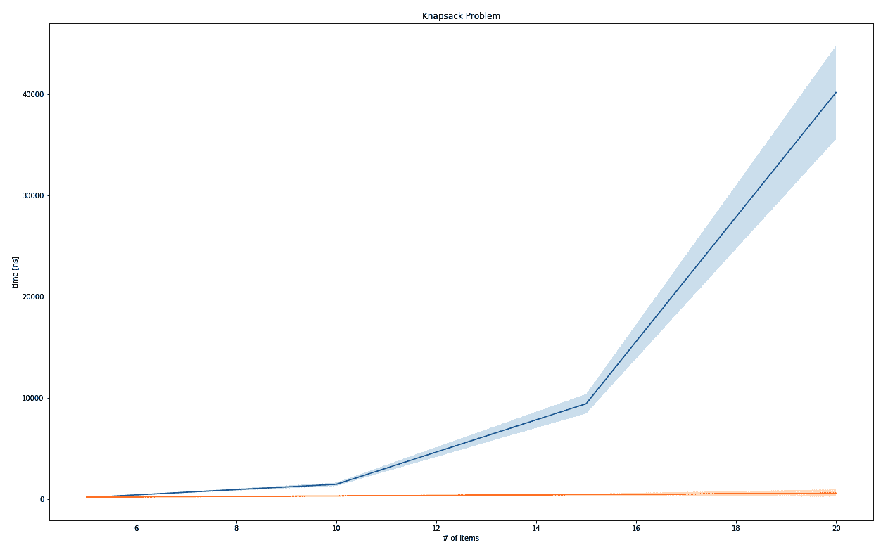

背包问题的输出图

相对而言，运行时间复杂度有了显著提升：

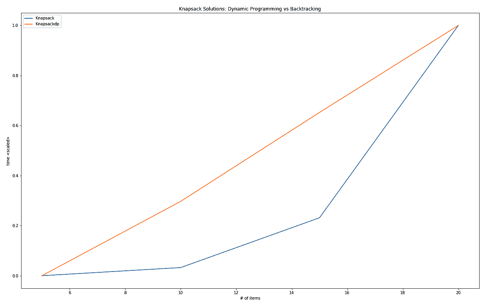

动态规划和回溯法的运行时间复杂度对比图

将这种策略（或类似策略）应用于允许这种优化的问题，可以允许更高的输入参数，因此能够解决现实世界问题！想象一下，一家航空公司试图计算出它能携带的最有价值货物，但它一次只能限制在 40 种不同的物品中。

由于存在许多更难的问题（例如，一个称为 NP 难问题的问题类），人们想出了找到良好解决方案的方法。

# 元启发式方法

动态规划非常适合约束满足问题。然而，通过类似系统猜测或元启发式方法可以找到更好的解决方案。这些与问题无关的解决方案生成器可以根据多种方式分类，例如，它们是否基于群体、是否受自然界启发，以及是在全局还是局部搜索。

无论选择哪种优化算法，它都会将问题视为搜索问题，试图在提供的解决方案中找到最佳可能的解决方案。在没有找到最佳解决方案的保证的情况下，它通常会找到一个足够好的解决方案。多亏了 NP 难问题的昂贵运行时间，有各种各样的方法可以找到比更具体解决方案更好的解决方案。

流行的元启发式方法包括以下几种：

+   模拟退火

+   遗传算法

+   粒子群优化

+   蚂蚁群优化

+   避免搜索

Rust 的生态系统具有几个实现这些元启发式策略的 crate。一些这些 crate 的进展可以在[`www.arewelearningyet.com/metaheuristics/`](http://www.arewelearningyet.com/metaheuristics/)上追踪。

# 例子——遗传算法

例如，旅行商问题，其中需要找到连接*n*个城市的最短路径的旅行。其运行时间复杂度为*O(n!)*，只有 20 个城市在计算上非常昂贵，但可以通过从城市的随机顺序（旅行）开始，然后反复重新组合或随机改变（变异）这些旅行中的几个，只选择最好的，并使用这些旅行重新开始过程来解决足够好。

使用`rsgenetic`crate ([`crates.io/crates/rsgenetic`](https://crates.io/crates/rsgenetic))，实现解决方案变成实现`TspTour`trait 的问题，这需要提供一个`fitness()`函数以便评估解决方案，一个`crossover()`函数将两个父代重新组合成新的后代旅行，以及一个`mutate()`函数对旅行应用随机变化：

```rs
impl Phenotype<TourFitness> for TspTour {
    ///
    /// The Euclidean distance of an entire tour.
    ///
    fn fitness(&self) -> TourFitness {
        let tour_cities: Vec<&City> = self.tour.iter().map(|t| 
                                      &self.cities[*t]).collect();
        let mut fitness = 0f32;
        for i in 1..tour_cities.len() {
            fitness += distance(tour_cities[i], tour_cities[i - 1]);
        }
        -(fitness.round() as i32)
    }

    ///
    /// Implements the crossover for a TSP tour using PMX
    ///
    fn crossover(&self, other: &TspTour) -> TspTour {
        // ...

        TspTour {
            tour: offspring,
            cities: self.cities.clone(),
            rng_cell: self.rng_cell.clone(),
        }
    }

    ///
    /// Mutates the solution by swapping neighbors at a chance
    ///
    fn mutate(&self) -> TspTour {
        let mut rng = self.rng_cell.borrow_mut();
        if rng.gen::<f32>() < MUTPROB {
            let mut mutated: Tour = self.tour.clone();
            for i in 0..mutated.len() {
                if rng.gen::<f32>() < INDPB {
                    let mut swap_idx = rng.gen_range(0, 
                                       mutated.len() - 2);
                    if swap_idx >= i {
                        swap_idx += 1;
                    }
                    let tmp = mutated[i];
                    mutated[i] = mutated[swap_idx];
                    mutated[swap_idx] = tmp;
                }
            }
            TspTour {
                tour: mutated,
                cities: self.cities.clone(),
                rng_cell: self.rng_cell.clone(),
            }
        } else {
            self.clone()
        }
    }
}
```

一旦实现了这些，框架允许你设置一个选择器来选择每一代中最佳的*n*个解决方案以创建下一代的人口。这些步骤会重复进行，直到适应度值停滞（收敛），并且最后一代的最高适应度可以被认为是该问题的良好解决方案。

经过几代之后，可以找到这样的解决方案：

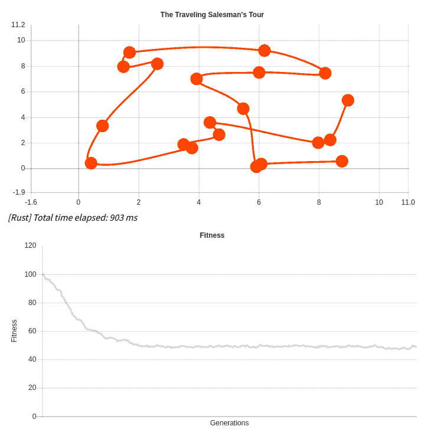

在我的博客[`blog.x5ff.xyz`](https://blog.x5ff.xyz/blog/azure-functions-wasm-rust-ai/#)中可以找到更深入地探讨在 JavaScript 以及 Rust（和 Wasm）中解决这个问题的方法。可以采取类似的方法来安排背包中高度有价值物品的组合，这留给你去发现。

# 摘要

除了常规数据结构、排序以及搜索方法之外，还有许多其他问题出现。本章讨论了这些问题的一个小子集：生成随机数和解决约束满足问题。

随机数生成在许多方面都很有用：加密、游戏、赌博、模拟、数据科学—all 都需要好的随机数。好的？有两种重要的类型：伪随机数和“真实”随机数。后者的来源必须是物理世界（计算机是确定性的），前者可以用 LCG 或 Wichmann-Hill 生成器（使用魔法数组合 LCG）来实现。

约束满足问题是寻找符合一组约束条件最佳组合的问题。一种称为回溯的技术通过递归生成所有组合来构建当前排列的状态，但会回溯那些不满足所需约束的组合。8 皇后（或 N 皇后）问题和 0-1 背包问题都是展示昂贵运行时行为的回溯算法示例。

高级技术，如动态规划或元启发式（返回足够好的解决方案）可以显著提高解决这些挑战的速度（或对于更大的规模）。作为一个快速且高效的编程语言，Rust 在未来可以在这些技术中发挥重要作用。

在下一章中，我们将探讨 Rust 标准库提供的算法。

# 问题

+   PRNGs 和 RNGs 之间的区别是什么？

+   哪个 crate 在 Rust 中提供随机数生成器？

+   如何使用回溯法解决组合问题？

+   什么是动态规划？

+   元启发式是如何成为解决难题的无特定问题方法的？

# 进一步阅读

这里有一些额外的参考资料，您可能需要参考以了解本章所涵盖的内容：

+   [`en.wikipedia.org/wiki/Random_number_generator_attack`](https://en.wikipedia.org/wiki/Random_number_generator_attack)

+   [`blog.x5ff.xyz`](https://blog.x5ff.xyz)

+   [`en.wikipedia.org/wiki/Metaheuristic`](https://en.wikipedia.org/wiki/Metaheuristic)
