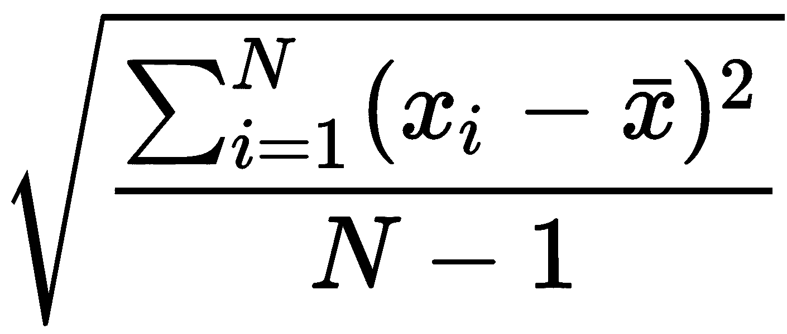

# 第二章：函数式控制流

控制流是编程的最基本构建块。早期的语言没有数据结构或函数的概念，只有程序流程。这些控制流结构随着时间的推移而演变，从简单的分支和循环到 Rust 中可用的复杂值表达式。

在本章中，我们将开始开发构成本书所有代码示例基础的项目。第一个项目的需求将立即介绍。然后，我们将为您提供将项目需求转化为带有测试的代码概要的具体步骤。最后，我们将开发完整的可交付成果的代码。

学习成果：

+   收集项目需求

+   根据项目需求构建解决方案

+   使用和识别函数式风格的表达式

+   使用集成和单元测试测试解决方案

# 技术要求

运行提供的示例需要 Rust 的最近版本：

[`www.rust-lang.org/en-US/install.html`](https://www.rust-lang.org/en-US/install.html)

本章的代码也可在 GitHub 上找到：

[`github.com/PacktPublishing/Hands-On-Functional-Programming-in-RUST`](https://github.com/PacktPublishing/Hands-On-Functional-Programming-in-RUST)

每章的`README.md`文件中也包含了具体的安装和构建说明。

# 设计程序

为了设计程序，让我们看看项目所需的各种方面。

# 收集项目需求

考虑这种情况：您的工程公司正在考虑签订一份合同，为房地产开发商设计控制电梯的软件。合同列出了三个正在开发中的建筑，它们具有不同的高度和非均匀的电梯设计。电梯设计将由其他分包商最终确定，并在软件合同中标后不久可用。

为了提交您的提案，您的公司应展示您电梯控制软件的基本功能。一旦中标，您将需要将这些功能整合到最终软件中，以及必要的修改以适应物理电梯的规格和行为。

为了赢得提案，您的团队就几个关键点达成一致，以超越竞争对手。具体来说，您的电梯应做到以下几点：

+   在楼层之间移动的时间更短

+   在每个楼层位置停留得更精确

+   为乘客提供更平稳的乘坐体验

作为项目提案的配套程序交付成果，您应提供电梯行为的模拟。您负责进一步的细节和实现。

现在应该解决以下问题：

+   程序将访问和存储哪些数据？

+   程序将期望什么输入？

+   程序应该产生什么输出？

经过一番考虑，您的团队就一些行为达成一致：

+   程序应强调电梯的位置、速度和加速度。速度决定乘坐时间。加速度决定乘坐舒适度。静止时的位置决定停靠精度。这些都是您公司需要强调的关键卖点，因此演示软件应反映相同的信息。

+   程序应以文件作为输入，描述楼层数和楼层高度，以及电梯需要处理的楼层请求列表。

+   程序输出应该是关于电梯位置、速度和加速度的实时信息。在处理完所有楼层请求后，程序应打印位置、速度和加速度的平均值和标准差。

# 从需求构建代码图

为了概述我们的代码解决方案，我们将使用 `stubs` 方法。为了使用此过程，我们只需正常启动一个代码项目，并在想到时填写高级细节。细节将在最终确定大纲之前保持未实现状态。在我们对整体程序设计满意后，我们就可以开始实现程序逻辑了。我们现在开始这个项目。

# 创建 Rust 项目

要创建一个新的 Rust 项目，我们将执行以下步骤（或者，您也可以调用 `cargo new`）：

1.  为 Rust 项目创建一个新文件夹

1.  创建一个 `Cargo.toml` 文件，其内容如下：

```rs
[package]
name = "elevator"
version = "1.0.0"

[dependencies]
```

1.  创建一个 `src/main.rs` 文件，如下所示：

```rs
fn main()
{
   println!("main")
}
```

现在，我们可以使用 `cargo build` 构建项目。

# 为每个程序需求编写存根

程序要求通常表述为结果。运行此程序时应该产生哪些效果？用代码回答这个问题通常很简单。以下是将项目需求系统地转化为代码的步骤列表：

1.  列出所有程序需求

1.  列出每个需求的相关依赖或先决条件

1.  从需求列表和依赖列表创建依赖图

1.  编写实现依赖图的存根

通过实践，这些步骤可以合并为编写存根代码的单一步骤。然而，如果在项目的架构阶段感到不知所措，那么明确执行这些步骤可能有所帮助。这是一个将复杂问题分解为更小问题的可靠方法：

1.  首先，列出所有程序需求，从之前的考虑中我们知道我们需要存储位置、速度和加速度的实时数据。程序应接受一个描述楼层数、楼层高度和要处理的楼层请求列表的输入文件或标准输入。程序输出应该是实时电梯的位置、速度和加速度，并在完成时总结所有运输请求。总结应列出位置、速度和加速度的平均值和标准差。

1.  第二，为每个需求列出依赖项或先决条件。数据似乎具有原子性，没有依赖项或先决条件。程序流程似乎自然地采用轮询循环的形式，从传感器更新实时状态信息，并在每次循环中发出运动命令。电梯状态和运动命令之间存在时间延迟的循环依赖：运动命令基于状态选择，下一个循环将实现这些命令的时间调整效果。

1.  第三，使用以下内容从需求列表和依赖列表创建依赖图：

    1.  存储位置、速度和加速度状态

    1.  存储电机输入电压

    1.  存储输入建筑描述和楼层请求

    1.  解析输入并将其存储为建筑描述和楼层请求

    1.  当有剩余的楼层请求时循环：

        1.  更新位置、速度和加速度

        1.  如果队列中的下一个楼层请求得到满足，则从队列中移除它

        1.  调整电机控制以处理下一个楼层请求

        1.  打印实时统计信息

    1.  打印摘要

1.  第四，编写实现依赖图的占位符。我们将更新`src/main.rs`以实现此占位符逻辑。注意，由`let`绑定声明的变量存储在`main`函数内部。可变状态必须存储在函数或数据结构内部。这在下述代码块中显示：

```rs
pub fn run_simulation()
{

   //1\. Store location, velocity, and acceleration state
   let mut location: f64 = 0.0; // meters
   let mut velocity: f64 = 0.0; // meters per second
   let mut acceleration: f64 = 0.0; // meters per second squared

   //2\. Store motor input voltage
   let mut up_input_voltage: f64 = 0.0;
   let mut down_input_voltage: f64 = 0.0;

   //3\. Store input building description and floor requests
   let mut floor_count: u64 = 0;
   let mut floor_height: f64 = 0.0; // meters
   let mut floor_requests: Vec<u64> = Vec::new();

   //4\. Parse input and store as building description and floor requests

   //5\. Loop while there are remaining floor requests
   while floor_requests.len() > 0
   {
      //5.1\. Update location, velocity, and acceleration

      //5.2\. If next floor request in queue is satisfied, then remove from queue

      //5.3\. Adjust motor control to process next floor request

      //5.4\. Print realtime statistics
   }

   //6\. Print summary
   println!("summary");
}

fn main()
{
   run_simulation()
}
```

或者，我们也可以将循环作为单独的函数编写。该函数将检查条件，并且该函数可能会再次调用自己。当一个函数调用自己时，这被称为**递归**。递归是函数式编程中极其常见且重要的模式。然而，这种特定的递归类型，称为**尾递归**，目前在 Rust 中不建议使用（参见 RFC #271 ([`github.com/rust-lang/rfcs/issues/271`](https://github.com/rust-lang/rfcs/issues/271))——没有这个提议的优化，尾递归可能会不必要地使用额外的堆栈空间并耗尽内存）。

递归循环代码将如下所示：

```rs
fn process_floor_requests(...)
{
   if floor_requests.len() == 0 { return; }

   //5.1 Update location, velocity, and acceleration

   //5.2 If next floor request in queue is satisfied, then remove from queue

   //5.3 Adjust motor control to process next floor request

   //5.4 Print realtime statistics

   //tail recursion
   process_floor_requests(...)
}
```

# 实现程序逻辑

一旦创建了占位程序，我们就可以继续用工作代码替换占位符。

# 填写空白

现在我们已经有了代码占位符和每个需要实现的功能的映射，我们可以开始编写代码逻辑。在此阶段，如果你在一个团队中工作，那么这是一个划分工作的好时机。架构阶段可能由一个人完成，或者作为一个团队，但不能并行进行。相比之下，实现阶段可以分解成单独工作的部分。

# 解析输入并将其存储为建筑描述和楼层请求

为了解析输入，我们首先需要决定是期望从`stdin`还是从文件接收输入。我们将采用以下约定：如果程序提供了文件名，则从该文件读取；如果文件名是`-`，则从`stdin`读取，否则从`test1.txt`读取。

使用 Rust 的 `std::env` 包和模式 `match` 语句，我们可以相当容易地完成这项任务。如下所示：

```rs
let buffer = match env::args().nth(1) {
   Some(ref fp) if *fp == "-".to_string()  => {
      let mut buffer = String::new();
      io::stdin().read_to_string(&mut buffer)
                 .expect("read_to_string failed");
      buffer
   },
   None => {
      let fp = "test1.txt";
      let mut buffer = String::new();
      File::open(fp)
         .expect("File::open failed")
         .read_to_string(&mut buffer)
         .expect("read_to_string failed");
         buffer
   },
   Some(fp) => {
      let mut buffer = String::new();
      File::open(fp)
         .expect("File::open failed")
         .read_to_string(&mut buffer)
         .expect("read_to_string failed");
      buffer
   }
};

```

现在，我们需要解析字符串的输入。对于输入中的每一行，我们将解析的值存储为楼层数、楼层高度或楼层请求，按此顺序。以下是实现此功能的代码：

```rs
for (li,l) in buffer.lines().enumerate() {
   if li==0 {
      floor_count = l.parse::<u64>().unwrap();
   } else if li==1 {
      floor_height = l.parse::<f64>().unwrap();
   } else {
      floor_requests.push(l.parse::<u64>().unwrap());
   }
}
```

# 更新位置、速度和加速度

在这里，我们需要更新程序的状态，以反映自上次循环迭代以来状态变量的物理变化。所有这些变化都取决于对自上次迭代以来经过的时间的了解，但我们没有存储这些信息。所以，让我们对我们的代码做一些小的修改。

1.  在循环外部存储上一次迭代的时间戳：

```rs
let mut prev_loop_time = Instant::now();
```

1.  计算经过的时间，然后覆盖上一次的时间戳：

```rs
let now = Instant::now();
let dt = now.duration_since(prev_loop_time)
            .as_fractional_secs();
prev_loop_time = now;
```

1.  为了提高精度，在循环结束时暂停一段时间（记录亚毫秒级的测量值很困难）：

```rs
thread::sleep(time::Duration::from_millis(10));
```

现在，我们可以开始计算新的位置、速度和加速度。位置是计算为前一个位置加上速度乘以时间。速度是计算为前一个速度加上加速度乘以时间。加速度是按照 *F=ma* 计算的，并将从电机力和载重计算得出。此时，我们意识到载重没有在输入文件中指定，但在经过一些讨论后，团队决定使用标准的载重而不是更改输入格式。

经过一些研究，你发现电梯载重大约为 1,200 公斤。同样，你估计一个简单的直流电机可以产生大约每伏特 8 牛顿的力。生成的代码如下所示：

```rs
location = location + velocity * dt;
velocity = velocity + acceleration * dt;
acceleration = {
   let F = (up_input_voltage - down_input_voltage) * 8.0;
   let m = 1200000.0;
   //-9.8 is an approximation of acceleration due to gravity
   -9.8 + F/m
};
```

# 如果队列中的下一个楼层请求得到满足，那么就将其从队列中移除

为了完成楼层请求，我们必须到达目的地楼层并停止。我们假设足够低的速度可以用某种形式的制动器停止。这将使我们稳定地保持在原地，直到乘客离开或进入电梯。代码如下：

```rs
let next_floor = floor_requests[0];
if (location - (next_floor as f64)*floor_height).abs() < 0.01
   && velocity.abs() < 0.01
{
   velocity = 0.0;
   floor_requests.remove(0);
}
```

# 调整电机控制以处理下一个楼层请求

为了调整电机控制，我们需要决定我们想要多少加速度，然后计算需要多少力来实现目标加速度。根据我们的目标，我们希望旅行时间更短，运动病更少，以及停止位置更准确。

为了实现这些目标，我们应该优化的指标是最大化平均速度，最小化加速度，以及最小化停止位置误差。所有这些目标相互竞争优先级，因此我们需要在它们之间做出妥协，以实现良好的整体性能。

经过一些研究，你发现舒适的加速度限制在每秒 1 到 1.5 米之间。你决定将目标定为最大 1 m/s²，在特殊情况下可以放宽到 1.5 m/s²。

对于速度，你决定超过 5 m/s 的载货速度是不安全的，所以你会实现一个最大速度，否则，速度应该总是最大化以达到下一个楼层。

对于位置精度，目标加速度与当前速度与目标目的地的计算是至关重要的。在这里，你将尝试将加速度保持在 1 m/s²附近，同时留有足够的空间进行额外的加速度。当足够接近目的地时，可能需要使用不同的加速度目标来进行更小的动作和速度调整。

要用代码实现这一点，我们首先计算减速范围。这定义为从该距离开始，在当前速度下，我们需要以大于 1 m/s²的加速度减速，以便在目的地停下。我们的加速度缓冲区提供了一些修正空间，这使得从下一个楼层开始减速之前，这是一个安全的目标。这在上面的代码中显示：

```rs
//it will take t seconds to decelerate from velocity v at -1 m/s²
let t = velocity.abs() / 1.0;

//during which time, the carriage will travel d=t * v/2 meters
//at an average velocity of v/2 before stopping
let d = t * (velocity/2.0);

//l = distance to next floor
let l = (location - (next_floor as f64)*floor_height).abs();

```

为了计算目标加速度，我们需要考虑三种情况：

+   如果我们在减速范围内，那么我们应该减速

+   如果我们不在减速范围内且不在最大速度，那么我们应该加速

+   如果我们不在减速范围内但已经达到最大速度，那么我们不应该改变速度：

```rs
let target_acceleration = {
   //are we going up?
   let going_up = location < (next_floor as f64)*floor_height;

   //Do not exceed maximum velocity
   if velocity.abs() >= 5.0 {
      //if we are going up and actually going up
      //or we are going down and actually going down
      if (going_up && velocity>0.0)
      || (!going_up && velocity<0.0) {
         0.0
      //decelerate if going in wrong direction
      } else if going_up {
         1.0
      } else {
         -1.0
      }

   //if within comfortable deceleration range and moving in right direction, decelerate
   } else if l < d && going_up==(velocity>0.0) {
      if going_up {
         -1.0
      } else {
         1.0
      }

   //else if not at peak velocity, accelerate
   } else {
      if going_up {
         1.0
      } else {
         -1.0
      }
   }
};
```

最后，使用目标加速度，我们可以计算出应该施加到每个电机上的电压，以实现所需的加速度。通过倒推之前用于计算加速度的公式，我们现在可以从目标加速度计算出所需的电压，如下所示：

```rs
let gravity_adjusted_acceleration = target_acceleration + 9.8;
let target_force = gravity_adjusted_acceleration * 1200000.0;
let target_voltage = target_force / 8.0;
if target_voltage > 0.0 {
   up_input_voltage = target_voltage;
   down_input_voltage = 0.0;
} else {
   up_input_voltage = 0.0;
   down_input_voltage = target_voltage.abs();
};
```

# 打印实时统计数据

要打印实时统计数据，我们将使用一个控制台格式化库。这允许我们轻松地在屏幕上移动光标并写入清晰且易于格式化的文本。这在上面的代码中显示：

1.  要开始，我们应该获取一些信息和`stdout`的句柄，并将其存储在循环之外。这在上面的代码中显示：

```rs
let termsize = termion::terminal_size().ok();
let termwidth = termsize.map(|(w,_)| w-2).expect("termwidth");
let termheight = termsize.map(|(_,h)| h-2).expect("termheight");
let mut _stdout = io::stdout(); //lock once, instead of once per write
let mut stdout = _stdout.lock().into_raw_mode().unwrap();
```

1.  在循环内部，让我们首先清除一个空间来渲染我们的输出：

```rs
print!("{}{}", clear::All, cursor::Goto(1, 1));
for tx in 0..(termwidth-1)
{
   for ty in 0..(termheight-1)
   {
      write!(stdout, "{}", cursor::Goto(tx+1, ty+1));
      write!(stdout, "{}", " ");
   }
}
```

1.  然后，我们可以渲染电梯井和载货平台。电梯井将是简单的括号，每个楼层左面和右面各一个。电梯载货平台将是一个`X`标记，放置在离当前载货平台位置最近的楼层上。我们通过将`floor_height`乘以楼层相对于地面的偏移量来计算每个楼层的位置。然后，我们将每个楼层的位置与载货平台的位置进行比较，以找到最近的一个。代码如下：

```rs
print!("{}{}{}", clear::All, cursor::Goto(1, 1), cursor::Hide);
let carriage_floor = (location / floor_height).floor() as u64;
let carriage_floor = cmp::max(carriage_floor, 0);
let carriage_floor = cmp::min(carriage_floor, floor_count-1);
for tx in 0..(termwidth-1)
{
   for ty in 0..(termheight-1)
   {
      write!(stdout, "{}", cursor::Goto(tx+1, ty+1));
      if tx==0 && (ty as u64)<floor_count {
         write!(stdout, "{}", "[");
      } else if tx==1 && (ty as u64)==((floor_count-1)-carriage_floor) {
         write!(stdout, "{}", "X");
      } else if tx==2 && (ty as u64)<floor_count {
         write!(stdout, "{}", "]");
      } else {
         write!(stdout, "{}", " ");
      }
   }
}
stdout.flush().unwrap();
```

1.  现在，我们需要打印实时统计数据。除了位置、速度和加速度之外，让我们还显示最近的楼层和电机输入电压，如下所示：

```rs
write!(stdout, "{}", cursor::Goto(6, 1));
write!(stdout, "Carriage at floor {}", carriage_floor+1);
write!(stdout, "{}", cursor::Goto(6, 2));
write!(stdout, "Location          {}", location);
write!(stdout, "{}", cursor::Goto(6, 3));
write!(stdout, "Velocity          {}", velocity);
write!(stdout, "{}", cursor::Goto(6, 4));
write!(stdout, "Acceleration      {}", acceleration);
write!(stdout, "{}", cursor::Goto(6, 5));
write!(stdout, "Voltage [up-down] {}", up_input_voltage-down_input_voltage);
```

1.  这里，我们发现终端屏幕正在撕裂，所以让我们调整输出以使用缓冲区：

```rs
let mut terminal_buffer = vec![' ' as u8; (termwidth*termheight) as usize];
for ty in 0..floor_count
{
   terminal_buffer[ (ty*termwidth + 0) as usize ] = '[' as u8;
   terminal_buffer[ (ty*termwidth + 1) as usize ] =
      if   (ty as u64)==((floor_count-1)-carriage_floor) { 'X' as u8 }
      else { ' ' as u8 };
   terminal_buffer[ (ty*termwidth + 2) as usize ] = ']' as u8;
   terminal_buffer[ (ty*termwidth + termwidth-2) as usize ] = '\r' as u8;
   terminal_buffer[ (ty*termwidth + termwidth-1) as usize ] = '\n' as u8;
}
let stats = vec![
   format!("Carriage at floor {}", carriage_floor+1),
   format!("Location          {}", location),
   format!("Velocity          {}", velocity),
   format!("Acceleration      {}", acceleration),
   format!("Voltage [up-down] {}", up_input_voltage-down_input_voltage)
];
for sy in 0..stats.len()
{
   for (sx,sc) in stats[sy].chars().enumerate()
   {
      terminal_buffer[ sy*(termwidth as usize) + 6 + sx ] = sc as u8;
   }
}
write!(stdout, "{}", String::from_utf8(terminal_buffer).unwrap()); 
```

现在，我们的屏幕将清楚地显示实时信息，直到循环结束。

# 打印总结

要打印我们的摘要，我们应该包括位置、速度和加速度的平均值和标准差。此外，查看电机控制的统计数据可能也很有趣，所以让我们也显示电压统计数据。此时，我们意识到数据存储的信息不足以计算平均值或标准差。

要计算变量的平均值，我们需要计算每个记录值的总和，并记录我们记录了多少个数据点。然后，我们将总值除以记录数，从而得到我们对时间平均值的估计。

要计算标准差，我们需要变量每个观测值的完整记录。此外，还需要平均值和记录数。然后，我们将使用以下公式来计算标准差：



在循环开始之前，我们需要声明新的变量来存储我们的数据：

1.  要使用新变量存储数据，请使用以下代码：

```rs
let mut record_location = Vec::new();
let mut record_velocity = Vec::new();
let mut record_acceleration = Vec::new();
let mut record_voltage = Vec::new();
```

1.  然后，在每次迭代之前，在计算新值之前，我们将存储每个数据点：

```rs
record_location.push(location);
record_velocity.push(velocity);
record_acceleration.push(acceleration);
record_voltage.push(up_input_voltage-down_input_voltage);
```

1.  最后，我们计算统计信息：

```rs
let record_location_N = record_location.len();
let record_location_sum: f64 = record_location.iter().sum();
let record_location_avg = record_location_sum / (record_location_N as f64);
let record_location_dev = (
   record_location.clone().into_iter()
   .map(|v| (v - record_location_avg).powi(2))
   .fold(0.0, |a, b| a+b)
   / (record_location_N as f64)
).sqrt();

let record_velocity_N = record_velocity.len();
let record_velocity_sum: f64 = record_velocity.iter().sum();
let record_velocity_avg = record_velocity_sum / (record_velocity_N as f64);
let record_velocity_dev = (
   record_velocity.clone().into_iter()
   .map(|v| (v - record_velocity_avg).powi(2))
   .fold(0.0, |a, b| a+b)
   / (record_velocity_N as f64)
).sqrt();

let record_acceleration_N = record_acceleration.len();
let record_acceleration_sum: f64 = record_acceleration.iter().sum();
let record_acceleration_avg = record_acceleration_sum / (record_acceleration_N as f64);
let record_acceleration_dev = (
   record_acceleration.clone().into_iter()
   .map(|v| (v - record_acceleration_avg).powi(2))
   .fold(0.0, |a, b| a+b)
   / (record_acceleration_N as f64)
).sqrt();

let record_voltage_N = record_voltage.len();
let record_voltage_sum = record_voltage.iter().sum();
let record_voltage_avg = record_voltage_sum / (record_voltage_N as f64);
let record_voltage_dev = (
   record_voltage.clone().into_iter()
   .map(|v| (v - record_voltage_avg).powi(2))
   .fold(0.0, |a, b| a+b)
   / (record_voltage_N as f64)
).sqrt();
```

1.  在退出程序之前，我们必须打印统计信息：

```rs
write!(stdout, "{}{}{}", clear::All, cursor::Goto(1, 1), cursor::Show).unwrap();

write!(stdout, "Average of location                 {:.6}\r\n", record_location_avg);
write!(stdout, "Standard deviation of location      {:.6}\r\n", record_location_dev);
write!(stdout, "\r\n");

write!(stdout, "Average of velocity                 {:.6}\r\n", record_velocity_avg);
write!(stdout, "Standard deviation of velocity      {:.6}\r\n", record_velocity_dev);
write!(stdout, "\r\n");

write!(stdout, "Average of acceleration             {:.6}\r\n", record_acceleration_avg);
write!(stdout, "Standard deviation of acceleration  {:.6}\r\n", record_acceleration_dev);
write!(stdout, "\r\n");

write!(stdout, "Average of voltage                  {:.6}\r\n", record_voltage_avg);
write!(stdout, "Standard deviation of voltage       {:.6}\r\n", record_voltage_dev);
write!(stdout, "\r\n");

stdout.flush().unwrap();
```

现在，已经组装好了所有部件，我们有一个完整的模拟。在测试输入上运行程序会产生一个漂亮的图形和结果摘要。这应该足以作为初始提案的补充。

# 将长段分解成组件

一旦项目功能正常，我们就可以开始寻找简化设计和消除冗余的机会。这里的第一个步骤应该是寻找类似代码的模式。我们的摘要统计是一个很好的例子，应该进行清理。我们有四个变量，我们跟踪并显示它们的统计数据。每个统计的计算都是相同的，但我们为每个变量显式地重复计算。输出格式化也有相似之处，所以我们也应该清理这一点。

为了消除冗余，首先要问的问题是代码是否可以重写为一个函数。在这里，我们确实有机会通过创建一个接受变量数据和打印摘要的函数来使用这个模式。这是按照以下方式完成的：

1.  我们可以编写这个函数，如下所示：

```rs
fn variable_summary<W: Write>(stdout: &mut raw::RawTerminal<W>, vname: &str, data: Vec<f64>)
{
   //calculate statistics
   let N = data.len();
   let sum: f64 = data.iter().sum();
   let avg = sum / (N as f64);
   let dev = (
      data.clone().into_iter()
      .map(|v| (v - avg).powi(2))
      .fold(0.0, |a, b| a+b)
      / (N as f64)
   ).sqrt();

   //print formatted output
   write!(stdout, "Average of {:25}{:.6}\r\n", vname, avg);
   write!(stdout, "Standard deviation of {:14}{:.6}\r\n", vname, dev);
   write!(stdout, "\r\n");
}
```

1.  要调用函数，我们需要提供每个`name`和`data`变量：

```rs
write!(stdout, "{}{}{}", clear::All, cursor::Goto(1, 1), cursor::Show).unwrap();
variable_summary(&mut stdout, "location", record_location);
variable_summary(&mut stdout, "velocity", record_velocity);
variable_summary(&mut stdout, "acceleration", record_acceleration);
variable_summary(&mut stdout, "voltage", record_voltage);
stdout.flush().unwrap();
```

重新编写改进了程序的两个重要方面：

+   统计计算更容易阅读和调试

+   使用统计和摘要函数涉及很少的冗余，这减少了意外使用错误的变量名或其他常见错误的可能性

短小、易读的代码是健壮的，可以防止错误。长而冗余的代码是脆弱的，容易出错。

# 寻找抽象

在编写代码草稿后，再次阅读代码并寻找可能的改进是一个好习惯。在审查项目时，特别关注丑陋的代码、反模式和未经检查的假设。审查后，我们发现代码不需要修正。

然而，我们应该指出一个使用的函数式抽象，它显著减少了行数，那就是迭代器的使用。在计算我们的变量摘要时，我们总是使用迭代器来计算总和和统计。一些运算符尚未介绍，让我们更仔细地看看：

```rs
let N = data.len();
let sum: f64 = data.iter().sum();
let avg = sum / (N as f64);
let dev = (
   data.clone().into_iter()
   .map(|v| (v - avg).powi(2))
   .fold(0.0, |a, b| a+b)
   / (N as f64)
).sqrt();

```

在这里，使用了两个重要的迭代器方法——`map` 和 `fold`。`map` 接受一个映射函数并返回一个修改后的值的迭代器。`fold` 方法持有一个累加器值（参数 1），并且对于迭代器中的每个元素，应用累加器函数（参数 2），返回累加的值作为结果。调用 `fold` 函数时，会消耗迭代器。

迭代器由一个具有 `next` 方法的特质定义，它可能返回序列中的下一个项目。一个简单的无限列表可以这样定义：

```rs
struct Fibonacci
{
 curr: u32,
 next: u32,
}

impl Iterator for Fibonacci
{
   type Item = u32;
   fn next(&mut self) -> Option<u32>
   {
      let new_next = self.curr + self.next;
      self.curr = self.next;
      self.next = new_next;
      Some(self.curr) //infinite list, never None
   }
}

fn fibonacci() -> Fibonacci
{
   Fibonacci { curr: 1, next: 1 }
}
```

这些对象定义了一个迭代器。`map` 函数和其他流修改器只是将输入流包装在另一个迭代器中，该迭代器应用修改器。

或者，统计计算可以用 `for` 循环来定义。结果看起来如下：

```rs
let N = data.len();
let mut sum = 0.0;
for di in 0..data.len()
{
   sum += data[di];
}
let avg = sum / (N as f64);
let mut dev = 0.0;
for di in 0..data.len()
{
   dev += (data[di] - avg).powi(2);
}
dev = (dev / (N as f64)).sqrt();
```

相比之下，我们可以看到函数式代码稍微短一点。更重要的是，函数式代码是**声明性的**。当代码只描述需求时，我们称这种代码为**声明性的**。当代码描述满足需求的机器指令时，我们称这种代码为**命令式的**。声明式风格相对于命令式风格的主要好处是声明式风格是自文档化的，并且通过使错误更明显来防止错误。

由于这些原因，在寻找抽象时，我们鼓励查看 `for` 循环。在大多数情况下，`for` 循环可能是杂乱的或不受欢迎的。迭代器和组合器可能是帮助提高代码质量的良好解决方案。

# 编写测试

要从命令行运行测试，请输入 `cargo test`。我们将经常这样做。

# 单元测试

单元测试专注于测试程序的内联接口和组件。它也被称为**白盒测试**。首先创建单元测试时，查看所有顶级类型、特性和函数是一个好主意。所有顶级标识符都适合作为测试用例。根据程序的结构，测试这些组件的组合以覆盖预期用例也可能是一个好主意。

我们有一个实用函数，即统计计算，这是一个很好的单元测试候选。然而，这个函数不返回任何结果。相反，它立即将输出打印到控制台。为了测试这一点，我们应该将函数分解为两个组件——一个用于计算统计，另一个用于打印统计。这看起来如下：

```rs
fn variable_summary<W: Write>(stdout: &mut raw::RawTerminal<W>, vname: &str, data: Vec<f64>)
{
   let (avg, dev) = variable_summary_stats(data);
   variable_summary_print(stdout, vname, avg, dev);
}

fn variable_summary_stats(data: Vec<f64>) -> (f64, f64)
{
   //calculate statistics
   let N = data.len();
   let sum: f64 = data.iter().sum();
   let avg = sum / (N as f64);
   let dev = (
      data.clone().into_iter()
      .map(|v| (v - avg).powi(2))
      .fold(0.0, |a, b| a+b)
      / (N as f64)
   ).sqrt();
   (avg, dev)
}

fn variable_summary_print<W: Write>(stdout: &mut raw::RawTerminal<W>, vname: &str, avg: f64, dev: f64)
{
   //print formatted output
   write!(stdout, "Average of {:25}{:.6}\r\n", vname, avg);
   write!(stdout, "Standard deviation of {:14}{:.6}\r\n", vname, dev);
   write!(stdout, "\r\n");
}
```

现在我们已经将统计计算独立成一个函数，我们可以更容易地为其编写单元测试。首先，我们提供一些测试数据，然后验证每个结果。同时请注意，只要我们在测试声明中添加`use super::*;`，单元测试就可以访问私有函数。以下是我们统计计算的几个单元测试：

```rs
#[cfg(test)]
mod tests {
   use super::*;

   #[test]
   fn variable_stats() {
      let test_data = vec![
         (vec![1.0, 2.0, 3.0, 4.0, 5.0], 3.0, 1.41),
         (vec![1.0, 3.0, 5.0, 7.0, 9.0], 5.0, 2.83),
         (vec![1.0, 9.0, 1.0, 9.0, 1.0], 4.2, 3.92),
         (vec![1.0, 0.5, 0.7, 0.9, 0.6], 0.74, 0.19),
         (vec![200.0, 3.0, 24.0, 92.0, 111.0], 86.0, 69.84),
      ];
      for (data, avg, dev) in test_data
      {
         let (ravg, rdev) = variable_summary_stats(data);
         //it is not safe to use direct == operator on floats
         //floats can be *very* close and not equal
         //so instead we check that they are very close in value
         assert!( (avg-ravg).abs() < 0.1 );
         assert!( (dev-rdev).abs() < 0.1 );
      }
   }
}
```

现在，如果我们运行`cargo test`，单元测试将会运行。结果应该显示一个测试通过。

# 集成测试

集成测试侧重于测试程序的外部接口。它也被称为**黑盒测试**。要创建集成测试，关注程序或模块的输入和输出应该是什么。考虑不同的选项、数据和可能的内部交互配置来创建测试。然后，这些测试应该提供对完成程序高级行为的良好覆盖。

要创建集成测试，我们首先需要将我们的项目重新配置为一个可以被导入的模块。集成测试无法访问除了它们可以从`use`语句中引用的符号之外的其他符号。为了实现这一点，我们可以将程序逻辑移动到`src/lib.rs`文件中，并为`src/main.rs`使用一个简单的包装器。在此更改之后，`lib.rs`文件应包含来自`main.rs`的所有代码，其中一项更改是将`main`函数重命名为`run_simulation`并使该函数公开。`main.rs`包装器应如下所示：

```rs
extern crate elevator;

fn main()
{
   elevator::run_simulation();
}
```

现在，为了创建集成测试：

1.  创建一个`tests/`目录

1.  在`tests/`目录中创建一个`integration_tests.rs`文件

1.  在`integration_tests.rs`文件中，为每个测试用例创建函数

在这里，我们将创建一个单独的测试用例，以接受特定的电梯请求并检查请求是否在合理的时间内得到处理。测试框架如下：

```rs
extern crate elevator;
extern crate timebomb;
use timebomb::timeout_ms;

#[test]
fn test_main() {
   timeout_ms(|| {
      elevator::run_simulation();
   }, 300000);
}
```

作为输入，我们将使用一个`5`层的建筑，每层`5.67`米，以及`7`个楼层请求。文件将存储为`test1.txt`，并应具有以下结构：

```rs
5
5.67
2
1
4
0
3
1
0
```

在这些测试到位后，我们现在可以确认基本逻辑是正常工作的，并且整个程序作为整体可以正常工作。要运行所有测试，请调用`cargo test`，或使用特定的测试用例`cargo test casename`。

一个示例测试运行如下：

```rs
[ ]   Carriage at floor 1
[ ]   Location          2.203829
[ ]   Velocity          -2.157214
[ ]   Acceleration      1.000000
[X]   Voltage [up-down] 1620000.000000

[ ]   Carriage at floor 3
[ ]   Location          11.344785
[X]   Velocity          0.173572
[ ]   Acceleration      -1.000000
[ ]   Voltage [up-down] 1320000.000000

[ ]   Carriage at floor 4
[X]   Location          19.235710
[ ]   Velocity          2.669347
[ ]   Acceleration      -1.000000
[ ]   Voltage [up-down] 1320000.000000

[ ]   Carriage at floor 1
[ ]   Location          0.133051
[ ]   Velocity          0.160799
[ ]   Acceleration      -1.000000
[X]   Voltage [up-down] 1320000.000000
```

一旦模拟完成，总结和测试结果如下：

```rs
Average of location                 5.017036
Standard deviation of location      8.813507

Average of velocity                 -0.007597
Standard deviation of velocity      2.107692

Average of acceleration             0.000850
Standard deviation of acceleration  0.995623

Average of voltage                  1470109.838195
Standard deviation of voltage       149352.287579

test test_main ... ok

test result: ok. 1 passed; 0 failed; 0 ignored; 0 measured; 0 filtered out

running 1 test
test tests::variable_stats ... ok

test result: ok. 1 passed; 0 failed; 0 ignored; 0 measured; 0 filtered out
```

# 总结

在本章中，我们概述了收集项目需求、设计解决方案以及实施完成交付物的步骤。我们关注了如何使用功能思维来明确这个过程。

在收集程序需求时，所需的数据、输入和输出应该被明确。当将需求转换为代码计划时，创建一个依赖图作为中间步骤可以帮助简化复杂的设计。在测试时，函数成为很好的单元来覆盖。相比之下，一行又一行的命令式代码几乎不可能进行测试。

我们将在整本书中持续开发这个软件项目。这个第一个模拟交付成果将伴随项目提案，并希望有助于我们的公司获得合同。在下一章中，你将收到开发者的反馈，并遇到你的竞争对手。

# 问题

1.  三元运算符是什么？

1.  单元测试的另一个名称是什么？

1.  集成测试的另一个名称是什么？

1.  声明式编程的另一个名称是什么？

1.  命令式编程是什么？

1.  迭代器特质中定义了什么？

1.  fold 将会以哪个方向遍历迭代器序列？

1.  依赖图是什么？

1.  `Option` 有哪两个构造函数？
