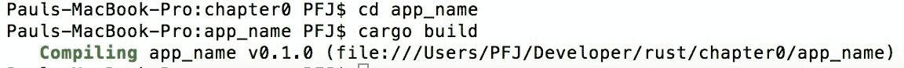
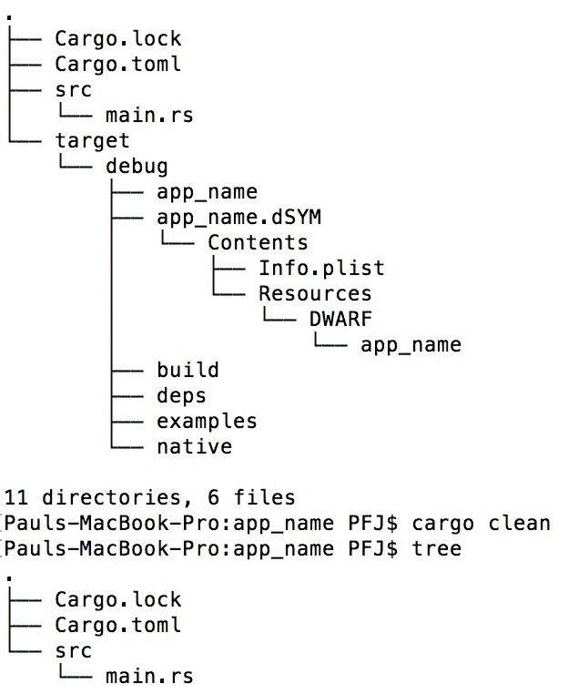

# 第一章：介绍和安装 Rust

Rust 是编程语言中不断增长的新成员之一。如果您从未使用过 Rust，但来自几乎任何过程式语言（如 C 或 Pascal）或习惯于使用 shell 脚本，那么您在使用 Rust 时应该会很快感到宾至如归。

熟悉 Rust 很简单，在本章中，我们将涵盖以下主题：

+   使用 rustup 安装 Rust

+   测试安装

+   设置项目

+   查看可用的 IDE

+   使用 Cargo 进行自动化

# 安装 Rust

与大多数语言一样，Rust 适用于大量平台。不可能为每个操作系统的每个变体安装编译器。幸运的是，有一个官方的安装 Rust 的方法，尽管细节可能略有不同，但在所有平台上过程几乎相同。因此，本书将介绍如何在 Fedora 27 上使用 rustup 安装 Rust。

[`rustup.rs`](https://rustup.rs/)始终包含有关如何在所有平台上开始使用的最新说明。在 Linux 和 macOS 上，它看起来可能如下：


在 Windows 上，此文本将被替换为指向`rustup-init.exe`的链接，这是一个在 Windows 上安装和设置 rustup 的可执行文件。

# 在 Linux 上安装 rustup

运行显示在[`rustup.rs`](https://rustup.rs/)上的建议命令。在终端中运行此命令。脚本建议一些默认设置，并要求您确认。完成整个脚本后，它的大致样子如下：


注意，此脚本尝试通过编辑您的`.profile`和`.bash_profile`文件来为您设置 rustup。如果您使用的是自定义设置，例如另一个 shell，您可能需要手动添加`source $HOME/.cargo/env`命令。

完成此脚本后，您可以通过从终端注销并重新登录来验证它是否成功，并检查工具是否已添加到您的路径中：


# gcc 的先决条件

要构建链接到外部库的任何软件，您需要一个 C 编译器和您可能链接的任何库的开发版本。为了确保一切正常工作，请使用您操作系统的标准方法安装编译器。

在 Fedora 中，这将使用`dnf`工具完成：

```rs
sudo dnf install -y gcc
```

如果您不确定是否已安装 gcc，请在终端窗口中输入以下命令：

```rs
gcc -version  
```

如果 gcc 已安装，您将看到类似以下内容：


# 测试您的安装

打开一个命令提示符窗口并输入以下内容：

```rs
rustc --version  
```

如果一切安装正确，您将看到类似以下内容：


# 集成开发环境

为了有效地编写 Rust，你至少需要某种文本编辑器。所有流行的编辑器都得到了适当的支持，所以如果你的首选是 Vim、Emacs 或其他任何一种，你都会在那里找到一个高质量的 Rust 扩展。网站[`areweideyet.com/`](https://areweideyet.com/)应该会提供当前的情况。

我们将介绍来自微软的轻量级 IDE，**Visual Studio Code**及其最新的 Rust 扩展，简单地称为**Rust**。这个 IDE 应该在不同桌面环境中都能很好地工作。安装说明和多个平台的包可在 Visual Studio Code 的主站点[`code.visualstudio.com`](https://code.visualstudio.com/)找到。

1.  打开 Visual Studio Code 并转到命令面板，可以通过视图菜单或通过键盘快捷键*Ctrl* + *Shift* + *P*（可能在不同的平台上有所不同）。输入`install extension`以查找正确的命令，然后选择安装扩展：


1.  在选择此选项后，在下一个字段中输入`rust`以查找 Rust 扩展。在撰写本文时，最新版本是由**kalitaalexey**制作的：


1.  你可以通过按安装按钮立即安装 Rust；或者，点击列表项本身以首先显示有关扩展的信息。安装后，重新加载编辑器。Rust 扩展现在已安装并准备好使用！

# 你的第一个 Rust 项目

你的第一个 Rust 项目可能不会特别出色。如果有的话，它将服务于以下四个目的：

+   展示 Rust 项目的结构

+   展示如何手动创建项目

+   展示如何使用 Rust Cargo 脚本创建项目

+   编译和执行程序

# Rust 项目的结构

不论你在哪个平台上开发，Rust 项目都将具有以下结构：


前面的截图显示了最简单的 Rust 项目的结构，因此可以使用以下命令进行复制：

| **OS X/Linux** | **Windows（从命令提示符）** |
| --- | --- |

|

```rs
mkdir firstproject cd firstproject touch Cargo.toml mkdir src cd src touch main.rs
```

|

```rs
md firstproject cd firstproject md src echo $null >> Cargo.toml cd src echo $null >> main.rs
```

|

`echo $null >> filename`命令可以在不启动记事本的情况下创建一个空文件；保存文件并退出。

`Cargo.toml`文件是 Rust 的**Makefile**等效物。当手动创建`.toml`文件时，应将其编辑为包含类似以下内容：


Rust 项目的结构可以扩展，包括文档以及构建结构，如下所示：


# 自动化

虽然手动创建 Rust 项目没有错，但 Rust 确实附带了一个非常方便的实用工具，称为**Cargo**。Cargo 不仅可以自动化项目的设置，还可以编译和执行 Rust 代码。Cargo 可以用来创建库所需的组件，而不是可执行文件，还可以生成应用程序文档。

# 使用 Cargo 创建二进制包

就像任何其他脚本一样，Cargo 默认在当前工作目录上工作。（例如，在编写本章时，我的示例代码的工作目录在 Mac 和 Linux 系统上为 `~/Developer/Rust/chapter0`，在 Windows 10 系统上为 `J:\Developer\Rust\Chapter0`。）

在其最简单的形式中，Cargo 可以生成正确的文件结构，如下所示：

```rs
cargo new demo_app_name -bin 
```

前面的命令告诉 Cargo 创建一个名为 `demo_app_name` 的新结构，并且它应该是一个二进制文件。如果您移除 `-bin`，它将创建一个名为的结构，这将是一个库（或者更准确地说，是除了二进制文件之外的东西）。

如果您不想使用根目录（比如说您想在您的二进制框架内创建一个库），那么在 `demo_app_name` 之前，您应该附加与您的工作目录相关的结构。

在我之前给出的简单示例中，如果我想在我的二进制结构中创建一个库，我会使用以下命令：

```rs
cargo new app_name/mylib  
```

这将创建如下结构：


`Cargo.toml` 文件在此阶段无需编辑，因为它包含了我们在手动创建项目时必须手动输入的信息。

Cargo 有多个目录分隔符“翻译器”。这意味着前面的示例可以在 OS X、Linux 和 Windows 上使用而不会出现问题；Cargo 已经将 `/` 转换为 `\` 以适应 Windows。

# 使用 Cargo 构建和运行应用程序

由于我们都能创建目录结构，因此 Cargo 能够构建和执行我们的源代码。

如果您查看本章附带源代码，您将找到一个名为 `app_name` 的目录。要使用 Cargo 构建此包，请在终端（或 Windows 上的命令）窗口中输入以下内容：

```rs
cd app_name 
cargo build app_name  
```

这将构建源代码；最后，您将被告知编译已成功完成：



接下来，我们可以使用 Cargo 如下执行二进制文件：

```rs
cargo run
```

如果一切顺利，您将看到以下内容：


就像任何一种工具一样，可以将构建和执行“链式连接”到一行中，如下所示：

```rs
cargo build; cargo run  
```

您可能想知道为什么第一个操作是移动到应用程序结构而不是直接输入 `cargo build`。这是因为 Cargo 正在寻找 `Cargo.toml` 文件（记住，这充当构建脚本）。

# 使用 Cargo 清理源代码树

当 Rust 编译器编译源文件时，它会生成一个称为对象文件的东西。对象文件将源文件（我们可以阅读和理解）编译成可以与其他库连接以创建二进制的形式。

这是一个好主意，因为它可以减少编译时间；如果源文件没有更改，就没有必要重新编译文件，因为对象文件将是相同的。

有时，目标文件会过时，或者另一个目标文件中的代码由于冲突导致恐慌。在这种情况下，清理构建是很常见的。这会删除目标文件，然后编译器必须重新编译所有源文件。

此外，它应该在创建发布构建之前始终执行。

标准的 Unix `make`程序使用`clean`命令（`make clean`）执行此操作。Cargo 以类似于 Unix 中的`make`实用程序的方式执行清理操作：

```rs
cargo clean  
```

比较目录显示了使用前面的 Cargo 命令会发生什么：



整个目标目录结构已经被简单地删除（前面的截图来自 Mac，因此有`dSYM`和`plist`文件。这些在 Linux 和 Windows 上不存在）。

# 使用 Cargo 创建文档

与其他语言一样，Rust 能够根据源文件的元标签创建文档。以下是一个示例：

```rs
fn main() 
{ 
   print_multiply(4, 5); 
} 

/// A simple function example 
/// 
/// # Examples 
/// 
/// ```

/// print_multiply(3, 5);

///

/// ```rs 

fn print_multiply(x: i32, y: i32) 
{ 
   println!("x * y = {}", x * y); 
} 
```

以`///`开头注释将被转换为文档。

文档可以通过两种方式之一创建：通过 Cargo 或使用**rustdoc**程序。

# rustdoc 与 Cargo

与 Cargo 提供的其他操作一样，当创建文档时，它充当 rustdoc 的包装器。唯一的区别是，使用 rustdoc 时，你必须指定源文件所在的目录。在这种情况下，Cargo 表现得比较笨拙，并为所有源文件创建文档。

在最简单的形式中，rustdoc 命令的使用方法如下：

```rs
cargo doc
rustdoc src/main.rs  
```

Cargo 确实有优势，可以在`root`文件夹内创建文档结构，而 rustdoc 则在目标文件夹内创建结构（使用`cargo clean`删除）。

# 使用 Cargo 帮助进行单元测试

希望单元测试不是你陌生的东西。单元测试是一种针对特定函数或方法而不是整个类或命名空间的测试。它确保函数在其呈现的数据上正确运行。

Rust 中的单元测试非常简单创建（在`assert_unittest`和`unittest`目录中给出了两个示例）。以下是从`unittest`示例中摘录的：

```rs
fn main() { 
    println!("Tests have not been compiled, use rustc --test instead (or cargo test)"); 
} 

#[test] 
fn multiply_test() 
{ 
   if 2 * 3 == 5 
   { 
      println!("The multiply worked"); 
   } 
} 
```

当构建并执行时，你可能会对以下结果感到惊讶：


尽管乘法`2 x 3`不等于`5`，但这个单元测试仍然通过的原因是单元测试不是测试操作的结果，而是测试操作本身是否工作。从早期阶段理解这种区别非常重要，以防止以后产生混淆。

我们遇到了单元测试的限制：如果我们不是测试数据而是测试操作，我们如何知道操作的结果本身是正确的？

# 坚定自我！

单元测试为开发者提供了一系列称为断言方法的方法：

```rs
#[test] 
fn multiply() 
{ 
   assert_eq!(5, 2 * 3); 
} 
assert_eq! (assert equal) macro. The first argument is the answer expected, and the second argument is what is being tested. If *2 * 3 = 5*, then the assertion is true and passes the unit test.
```

# Cargo 能做什么？

对于 Rust 开发者来说，Cargo 是一个惊人的实用工具。除了这些常用功能外，它还有其他命令，如下表所示。所有命令都遵循以下形式：

```rs
cargo <command> <opts>  
```

| **命令** | **执行的操作** |
| --- | --- |

|

```rs
fetch
```

| 此命令从网络中获取软件包的依赖项。如果可用锁文件，此命令将确保所有 Git 依赖项和/或注册表依赖项都已下载并本地可用。在锁文件更改之前，`cargo fetch` 之后永远不会调用网络。如果锁文件不可用，则此操作相当于 `cargo generate-lockfile`。将生成锁文件，并更新所有依赖项。 |
| --- |

|

```rs
generate-lockfile
```

| 此命令为项目生成锁文件。锁文件通常在发出 `cargo build` 命令时生成（你将在目录结构中看到它作为 `Cargo.lockfile`）。 |
| --- |

|

```rs
git-checkout
```

| 此命令检出 Git 仓库。你需要使用以下形式：

```rs
cargo git-checkout -url=URL        
```

|

|

```rs
locate-project
```

| 此命令定位软件包。 |
| --- |

|

```rs
login
```

| 此命令将注册表中的 API 令牌保存到本地。调用形式如下：

```rs
cargo login -host=HOST   token        
```

|

|

```rs
owner
```

| 此命令管理注册表上软件包的所有者。这允许更改软件包的所有权（软件包是一个 Rust 库），以及向软件包添加令牌。此命令将修改指定注册表（或默认注册表）上软件包的所有者。请注意，软件包的所有者可以上传新版本、撤回旧版本，还可以修改所有者集合，因此请谨慎操作！ |
| --- |

|

```rs
package
```

| 此命令将本地软件包组装成可分发的 tarball。 |
| --- |

|

```rs
pkgid
```

| 此命令打印一个完全限定的软件包规范。 |
| --- |

|

```rs
publish
```

| 此命令将软件包上传到注册表。 |
| --- |

|

```rs
read-manifest
```

| 此命令读取清单文件（`.toml`）。 |
| --- |

|

```rs
rustc
```

| 此命令编译完整软件包。当前软件包指定的目标将与所有依赖项一起编译。指定的选项将全部传递给最终的编译器调用，而不是任何依赖项。请注意，编译器仍将无条件接收如 `-L`、`--extern` 和 `--crate-type` 等参数，而指定的选项将简单地添加到编译器调用中。此命令要求只编译一个目标。如果当前软件包有多个目标可用，则必须使用 `--lib`、`--bin` 等过滤器来选择要编译的目标。 |
| --- |

|

```rs
search
```

| 此命令在 [`crates.io/`](https://crates.io/) 搜索软件包。 |
| --- |

|

```rs
update
```

| 此命令根据本地锁文件中记录的依赖项更新依赖项。典型选项包括：

+   `--package SPEC` (要更新的软件包)

+   `--aggressive` (强制更新 `<name>` 的所有依赖项)

+   `--precise PRECISE` (更新单个依赖项到精确的 `PRECISE`)

此命令要求已存在一个 `Cargo.lock` 文件，该文件由 `cargo build` 或相关命令生成。如果给出了包规范名称（`SPEC`），则将执行保守的锁文件更新。这意味着只有由 `SPEC` 指定的依赖项将被更新。如果必须更新依赖项才能更新 `SPEC`，则其传递依赖项也将被更新。所有其他依赖项将保持锁定在其当前记录的版本。如果指定了 `PRECISE`，则不得同时指定 `--aggressive`。`PRECISE` 是一个字符串，表示正在更新的包应该更新到的精确修订版本。例如，如果包来自 Git 仓库，则 `PRECISE` 将是仓库应该更新到的确切修订版本。如果没有给出 `SPEC`，则将重新解析所有依赖项并更新。 |

|

```rs
verify-project
```

| 此命令确保项目被正确创建。 |
| --- |

|

```rs
version
```

| 此命令显示 Cargo 的版本。 |
| --- |

|

```rs
yank
```

| 此命令从索引中移除已推送的 crate。`yank` 命令从服务器的索引中移除之前推送的 crate 版本。此命令不会删除任何数据，crate 仍然可以通过注册表的下载链接进行下载。请注意，已锁定到已移除版本的现有 crate 仍然可以下载已移除的版本以供使用。然而，Cargo 不会允许任何新的 crate 锁定到任何已移除的版本。 |
| --- |

如你现在所欣赏的，Cargo 工具脚本非常强大且灵活。

# 摘要

我们现在已经安装了一个完整的 Rust 环境，并准备开始使用。我们已经解释了如何手动和通过 Cargo 工具设置项目，你应该已经对 Cargo 的有用性有了认识。

在下一章中，我们将探讨任何语言的基础：**变量**。
