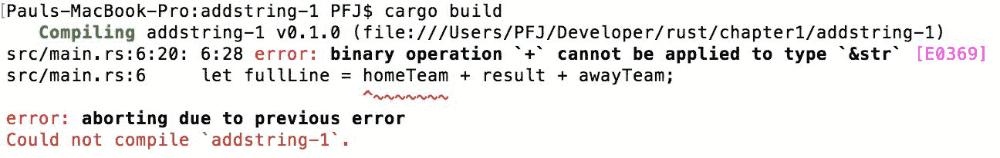
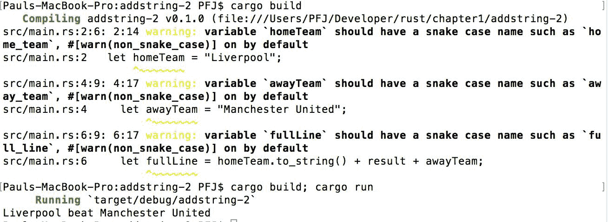
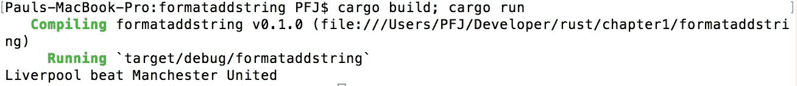
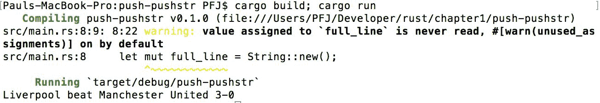
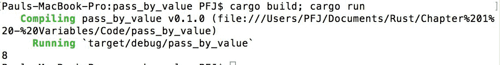
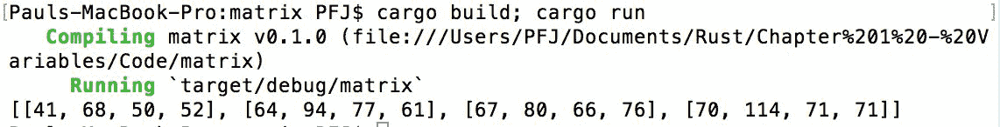
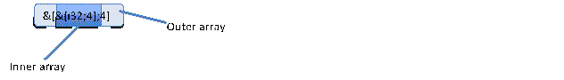
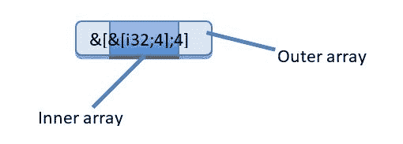

# 第二章：变量

与所有编程语言一样，我们需要一种方式在我们的应用程序中存储信息。这些信息可以是任何东西，并且与每种其他语言一样，它存储在变量中。然而，与每种其他语言不同，Rust 不按（比如说）C 的方式存储数据。

因此，在本章中，我们将做以下事情：

+   理解变量可变性

+   看看 Rust 如何在变量中存储信息，以及可用的变量类型

+   看看 Rust 如何处理向量变量类型

+   理解 Rust 如何以及如何不能操作变量

+   看看 Rust 如何传递变量

+   看看 Rust 如何内部存储变量

# 变量可变性

与许多其他语言不同，Rust 默认变量不可变。这意味着如果未明确定义为可变的，变量绑定实际上是常量。编译器会检查所有变量突变，并拒绝接受可变不可变变量绑定。

如果你来自 C 语言家族之一，不可变可以被认为是与 `const` 类型大致相同。

# 创建变量

在 Rust 中创建新的变量绑定，我们使用以下形式：

```rs
let x = 1; 
```

这意味着我们创建了一个名为 `x` 的新变量绑定，其内容将是 `1`。数字的默认类型取决于具体情况，但通常是一个 32 位有符号整数。如果我们需要一个可以改变的变量，我们使用以下形式：

```rs
let mut x = 1; 
```

默认情况下，Rust 中的所有变量都是不可变的；因此，我们必须明确地将变量定义为可变的。

# 我们如何让编译器知道我们想让 `x` 是一个整型？

Rust 有一种方式可以通知编译器和开发者变量类型。例如，对于 32 位的 `int`，我们会使用以下形式：

```rs
let x = 1i32; 
```

换句话说，`x` = `1`，一个 32 位有符号的 `int`。

如果没有定义 `i32`（或任何其他值），编译器将根据值的用法决定类型，默认为 `i32`。

# 定义其他变量类型

其他变量类型可以像 `int` 变量一样声明。

# 浮点数

与其他语言一样，在 Rust 中可以执行浮点运算。与整型变量一样，浮点型变量定义为 32 位 `float` 如下：

```rs
let pi = 3.14f32; 
```

对于 64 位的 `float`，它将被定义为如下：

```rs
let pi = 3.14f64; 
```

变量是字面值。另一种声明大小的方式是通过类型：

```rs
let pi: f32 = 3.14; 
```

如果省略了类型（例如，let `x` = `3.14`），变量将被声明为 64 位浮点变量。

# 有符号和无符号整数

一个有符号的 `int`（可以具有正负值）的定义如下：

```rs
let sint = 10i32; 
```

无符号的 `int` 在定义中用 `u` 代替 `i`：

```rs
let usint = 10u32; 
```

再次，这些是数字字面量，可以通过类型进行相同的声明：

```rs
let sint: i32 = 10; 
```

有符号和无符号的 `int` 值可以是 8、16、32 或 64 位长。

# 常量和静态

Rust 有两种类型的常量：**const**和**static**。Const 有点像别名：它们的内含在它们被使用的地方被替换。语法如下：

```rs
const PI: f32 = 3.1415927; 
```

静态变量更像是变量。它们具有程序的全球作用域，并且如下定义：

```rs
static MY_VARIABLE: i32 = 255; 
```

它们不能被更改。

Rust 能够猜测局部函数变量的类型。这被称为**局部类型推断**。然而，它只是局部的，所以静态和常量的类型必须始终显式指定。

# 在使用前定义变量值

虽然在某些语言中这不是强制性的，但在 Rust 中，变量必须有一个初始值，即使它是零。这是一个好习惯，也有助于调试，因为所有变量都有已知的内容。如果没有，就存在未定义行为的风险。

未定义行为意味着程序执行的动作是任何人都可以猜测的。例如，如果变量没有初始值，它们的值将是分配值时内存中任意的内容。

# 字符串

通常，字符串可以通过两种方式之一来定义：

```rs
let myName = "my name"; 
```

这被称为**字符串切片**。这些将在稍后处理。

第二种方式是使用`String::new();`。这是一个字符串，首字母大写 S。它在堆上分配，并且可以动态增长。

在这一点上，打破当前的叙述并讨论 Rust 如何使用内存是个好主意，因为它将极大地帮助解释即将到来的许多主题。

# Rust 如何使用内存

任何 Rust 程序占用的内存分为两个不同的区域：堆和栈。简单来说，栈包含原始变量，而堆存储复杂类型。就像我女儿卧室地板上的混乱一样，堆可以不断增长，直到可用内存耗尽。栈更快、更简单，但可能不会无限增长。Rust 中的每个绑定都在栈上，但这些绑定可能指向堆或其他地方的东西。

所有这些都直接与字符串示例相关。绑定`myName`在栈上，并引用一个字面量静态字符串`*my name*`。这个字符串是静态的，意味着它在程序开始时就在内存中。它也是静态的，这意味着它不能被改变。

`String::new`另一方面，在堆上创建一个字符串。它最初是空的，但可能增长以填充整个虚拟内存空间。

这里是一个正在增长的字符串的例子：

```rs
let mut myStringOne = "This is my first string ".to_owned(); 
let myStringTwo = "This is my second string. "; 
let myStringThree = "This is my final string"; 
myStringOne = myStringOne + myStringTwo + myStringTwo + myStringThree + myStringTwo; 
```

创建字符串的一种方法是在字符串切片上调用`to_owned`方法，就像我们刚才做的那样。还有其他方法，但这是最推荐的一种，因为它强调了所有权问题。我们稍后会回到这个问题。

在这里，绑定`myStringOne`最初是 24 个字符长，并且至少会在堆上分配那么大的空间。绑定`myStringOne`实际上是`myStringOne`在堆上位置的引用。

当我们向`myStringOne`添加内容时，它在堆上占用的空间会增加；然而，对基本位置的引用保持不变。

变量的生命周期和作用域必须考虑。例如，如果我们在一个函数的部分定义了一个字符串，然后尝试在函数外部访问这个字符串，我们会得到编译器错误。

# 回到字符串

正如我们之前在堆和栈上看到的，我们也可以这样定义一个字符串：

```rs
let mut myString = String::new(); 
```

`String::`告诉编译器我们将使用标准库中的`String`，我们告诉程序我们将创建一个可变的字符串，并在名为`myString`的地方将其引用存储在栈上。

动态字符串可以创建为空，或者预先为其分配内存。例如，如果我们想存储单词*You'll never walk alone*（总共 23 个字节），预先为它们分配空间。这是如何做的：

```rs
let mut ynwa = String::with_capacity(23); 
ynwa.push_str("You'll never walk alone"); 
```

这只是一个性能优化，通常不是必需的，因为当字符串需要增长时，它们会自动增长。以下做了大致相同的工作：

```rs
let mut ynwa = "You'll never walk alone".to_owned(); 
```

Rust 字符串不是以空字符终止的，完全由有效的 Unicode 组成。因此，它们可以包含空字节和任何语言的字符，但它们可能需要的字节数比它们包含的字符数多。

# 字符串切片

字符串切片一开始可能会让人感到困惑。我们这样定义一个字符串切片：

```rs
let homeTeam = "Liverpool"; 
```

来自更动态的语言，你可能会认为我们在将字符串`Liverpool`赋值给变量绑定`homeTeam`。然而，实际情况并非如此。`homeTeam`绑定实际上是一个字符串切片：一个指向字符串某一部分的引用，而这个字符串实际上位于别处。

字符串切片也不是可变的。

以下在 Rust 中是不行的：

```rs
let homeTeam = "Liverpool"; 
let result = " beat "; 
let awayTeam = "Manchester United"; 
let theString = homeTeam + result + awayTeam; 
```

编译器不会允许这样做，并且会给出如下错误：



我们不能直接连接字符串切片，因为字符串切片是不可变的。为了做到这一点，我们首先需要将字符串切片转换成可变的东西，或者使用类似`format!`宏的方式来构建字符串。让我们都试一试。

和之前一样，`to_owned()`方法接受方法附加到的切片，并将其转换为`String`类型：

```rs
fn main() { 
    let homeTeam = "Liverpool"; 
    let result = " beat "; 
    let awayTeam = "Manchester United"; 

    let fullLine = homeTeam.to_owned() + result + awayTeam; 

    println!("{}", fullLine); 
} 
```

`to_owned()`方法只应用于第一个切片。这把字符串切片`homeTeam`转换成 String，在 String 上使用`+`操作符是可行的。

当构建并执行时，你会看到以下内容：



# 这些警告是什么意思？

Rust 推荐使用的格式是蛇形命名法（而不是驼峰命名法）。如果我们把变量名从`homeTeam`改为`home_team`，就可以移除警告。这并不是致命的，或者不太可能导致程序进行杀戮性的狂暴；这更多的是一个风格问题。

# 使用`format!`宏

`format!`宏的工作方式与其他语言的字符串格式化器类似：

```rs
fn main() { 
    let home_team = "Liverpool"; 
    let result = " beat "; 
    let away_team = "Manchester United"; 

    let full_line = format!("{}{}{}", home_team, result, away_team); 

    println!("{}", full_line); 
} 
```

格式字符串中的`{}`标记了后续参数的位置。这些位置按顺序填充，因此`full_line`将是`home_team`、`result`和`away_team`的连接。

当上述代码片段编译并执行时，你会看到以下内容：



# 构建字符串

我们已经看到，我们可以从字符串切片（使用`to_owned()`或`format!`宏）创建一个 String，或者我们可以使用`String::new()`创建它。

有两种进一步的方法可以帮助构建字符串：`push`向字符串添加单个字符，而`push_str`向字符串添加一个`str`。

以下展示了这一过程：

```rs
fn main() { 
    let home_team = "Liverpool"; 
    let result = " beat "; 
    let away_team = "Manchester United"; 
    let home_score = '3'; // single character 
    let away_score = "-0"; 

    let mut full_line = format!("{}{}{} ", home_team, result, away_team); 

    // add the character to the end of the String     
    full_line.push(home_score); 

    // add the away score to the end of the String 
    full_line.push_str(away_score); 

    println!("{}", full_line); 
} 
```

当这段最后代码编译并执行时，你会看到以下内容：



# 代码审查

上述代码与之前示例中的代码略有不同，我们之前只是简单地使用`to_owned()`将切片转换为字符串。我们现在必须创建一个可变字符串并将其分配给该字符串，而不是像之前那样只添加到`full_line`的末尾。

原因是正在转换为字符串的切片不是可变的；因此，创建的类型也将是非可变的。由于你不能向非可变变量添加内容，所以我们不能使用`push`和`push_str`方法。

# 投掷

Rust 允许变量以不同的方式进行转换。这是通过使用`as`关键字实现的。这与 C#中的用法相同：

```rs
let my_score = 10i32; 
let mut final_score : u32 = 100; 
let final_score = my_score as u32; 
```

我们还可以将类型转换为其他类型（例如，`float`到`int`）：

```rs
let pi = 3.14; 
let new_pi = pi as i32; // new_pi = 3 
```

然而，像这种精度丢失的投掷效果可能并不理想。例如，如果你将一个超过`i8`位大小的浮点数投掷到`i8`，数字会被截断为`0`：

```rs
let n = 240.51; 
let n_as_int = n as i8; // n_as_int = 0   
```

如果你尝试转换的类型不兼容，将会发生错误；例如：

```rs
let my_home = "Newton-le-Willows"; 
let my_number = my_home as u32; // cannot convert &str to u32 
```

Rust 不会在原始类型之间进行隐式转换，即使这样做是安全的。也就是说，如果一个函数期望一个`i8`作为参数，你必须将`i16`值转换为`i8`然后再传递。这样做的原因是为了实现最大程度的类型检查，从而减少潜在（且更复杂）的隐藏错误数量。

# 字符串方法

在任何语言中，字符串都很重要。没有它们，与用户的沟通变得困难，如果数据来自网络服务（以 XML、纯文本或 JSON 的形式），则需要对这些数据进行操作。Rust 为开发者提供了标准库中的许多方法来处理字符串。以下是一些有用方法的表格（现在不用担心类型）：

| **方法** | **作用** | **用法（或示例项目）** |
| --- | --- | --- |
| `from(&str) -> String` | 此方法从一个字符串切片创建一个新的 String。 |

```rs
let s   = String::from("Richmond");   
```

|

| `from_utf8(Vec<u8>) -> Result<String, FromUtf8Error>` | 此方法从一个有效的 UTF-8 字符向量创建一个新的字符串缓冲区。如果向量包含非 UTF-8 数据，它将失败。 |
| --- | --- |

```rs

let s   = String::from_utf8(vec!(33, 34)).expect("UTF8 decoding failed);   
```

|

| `with_capacity(usize) -> String` | 此方法预先分配一个具有指定字节数的 String。 |
| --- | --- |

```rs
let s   = String::with_capacity(10);   
```

|

| `as_bytes -> &[u8]` | 此方法将字符串输出为字节切片。 |
| --- | --- |

```rs
let s = "A String".to_owned();
let slice = s.as_bytes();
```

|

| `insert(usize, char)` | 此方法在位置 `index` 插入 `char`。 |
| --- | --- |

```rs
let mut s = "A String".to_owned();
s.insert(2, 'S');
// s = "A SString"
```

|

| `len -> usize` | 此方法返回字符串的字节长度。因此，它可能大于字符串中的字符数。 |
| --- | --- |

```rs
let s = "A String äö";
// s.len() => 13
```

|

| `is_empty -> bool` | 此方法返回 `true`，如果字符串为空。 |
| --- | --- |

```rs
let s1 = "".to_owned();
let s2 = "A String".to_owned();
// s1.is_empty() => true
// s2.is_empty() => false
```

|

| `is_char_boundary(usize) -> bool` | 此方法返回 `true`，如果索引处的字符位于 Unicode 边界上。 |
| --- | --- |

```rs
let s1 = "Hellö World";
// s1.is_char_boundary(5) => false
// s1.is_char_boundary(6) => true
```

|

# 泛型和数组

对于来自 C# 或 C++ 背景的人来说，无疑已经习惯了泛型类型（通常称为具有类型 `T`）；你会习惯看到如下内容：

```rs
T a = new T(); 
```

泛型允许为几种类型定义方法。在其最一般的形式中，`T` 表示“任何类型”。例如，以下函数接受两个可以是任何类型 `T` 的参数：

```rs
fn generic_function<T>(a: T, b: T) 
```

`T`，如前所述，可以是任何类型。这意味着我们无法对它们做太多，因为只有少数方法实现了“任何类型”。例如，如果我们想将这些变量相加，我们需要对泛型类型进行一些限制。我们本质上需要告诉 Rust，“T 可以是任何类型，只要它实现了加法。”关于这一点稍后会有更多介绍。

# 数组

数组易于构建。例如：

```rs
let my_array = ["Merseybus", "Amberline", "Crosville", "Liverbus", "Liverline", "Fareway"]; 
```

数组必须遵守一些规则，如下所示：

+   数组具有固定的大小。它永远不会增长，因为它作为连续的内存块存储。

+   数组的内容只能是单一类型。

与任何类型的变量一样，默认情况下数组是不可变的。即使数组是可变的，整体大小也不能改变。例如，如果一个数组有五个元素，它不能变成六个。

我们还可以创建具有类型的数组，如下所示：

```rs
let mut my_array_two: [i32; 4] = [1, 11, 111, 1111]; 
let mut empty_array: [&str; 0] = []; 
```

还可以通过以下方式创建具有相同值的数组多次：

```rs
let number = [111; 5]; 
```

这将创建一个名为 `number` 的数组，包含 `5` 个元素，所有元素都初始化为值 `111`。

# 数组性能

虽然数组很有用，但它们确实有性能损失；与数组上的大多数操作一样，Rust 运行时会执行边界检查以确保程序不会访问数组越界。这防止了经典的数组溢出攻击和错误。

# 向量

虽然数组易于使用，但它们有一个很大的缺点：它们不能调整大小。向量（`Vec`）的行为类似于 C# 中的 `List`。它也是一个泛型类型，因为 `Vec` 本身实际上是 `Vec<T>`。

`Vec` 类型位于标准库中（`std::vec`）。

创建向量时，我们使用类似于以下任一的方法：

```rs
let mut my_vector: Vec<f32> = Vec::new(); // explicit definition 
```

或者这样：

```rs
let mut my_alt_vector = vec![4f32, 3.14, 6.28, 13.54, 27.08]; 
```

`Vec` 宏中的 `f32` 告诉编译器向量的类型是 `f32`。`f32` 可以省略，因为编译器可以确定向量的类型。

# 创建具有初始大小的向量

与字符串一样，可以创建一个具有初始内存分配的向量，如下所示：

```rs
let mut my_ids: Vec<i64> = Vec::with_capacity(30); 
```

# 通过迭代器创建向量

创建向量的另一种方法是使用迭代器。这是通过`collect()`方法实现的：

```rs
let my_vec: Vec<u64> = (0..10).collect(); 
```

迭代器的格式非常方便。与`let foo = {0,1,2,3};`这样的类似，这被缩短为使用`..`，这意味着所有在*a*和*b*之间的数字（*b*被排除 - 因此`0 .. 10`创建一个包含 0,1,2,3,4,5,6,7,8,9 的向量）。这可以在本书提供的源示例中看到。

# 向量中添加和删除元素

类似于字符串，可以使用`push`和`pull`方法向向量列表中添加和删除元素。这些方法从向量栈的顶部添加或删除。考虑以下示例：

```rs
fn main() { 
    let mut my_vec : Vec<i32> = (0..10).collect(); 
    println!("{:?}", my_vec);  
    my_vec.push(13); 
    my_vec.push(21); 
    println!("{:?}", my_vec);  
    let mut twenty_one = my_vec.pop(); // removes the last value 
    println!("twenty_one= {:?}", twenty_one);  
    println!("{:?}", my_vec);  
} 
```

我们使用从 0 开始到 10（因此最后一个值是 9）的值创建向量列表。

行`println!("{:?}", my_vec);`输出`my_vec`的全部内容。`{:?}`在这里是必需的，因为`Vec<i32>`没有实现某些格式化功能。

然后我们在向量列表的顶部添加 13 和 21，显示输出，然后从向量列表中移除最顶部的值，再次输出。

# 通过切片操作数组或向量

数组和向量都可以使用一个值（如`my_vec[4]`）来访问。然而，如果你想操作数组的一部分，那么你将从一个数组中取一个切片。切片就像是对原始事物一部分的窗口。

要创建一个切片，使用以下方法：

```rs
let my_slice = &my_vec[1..5];  
```

切片也没有预定义的大小：它可以是 2 字节，也可以是 202 字节。因此，切片的大小在编译时是未知的。这一点很重要，因为它阻止了某些方法的工作。

# 传递值

到目前为止，我们一直在单个方法内保持一切。对于小型演示（或方法测试），这是可以的。然而，对于更大的应用程序，方法之间传递值是必不可少的。

Rust 有两种主要方式将信息传递给其他方法：通过引用或通过值。通过引用通常意味着借用，这意味着所有权只是暂时性地给出，函数调用后可以再次使用。通过值意味着所有权的永久性改变，这意味着函数的调用者将无法访问该值，或者它可能意味着复制数据。

# 通过值传递

以下代码显示了如何在两个函数之间传递一个数字，并接收一个结果：

```rs
fn main() 
{ 
    let add = add_values(3, 5);  
    println!("{:?}", add); 
} 

fn add_values(a: i32, b: i32) -> i32 
{ 
    a + b 
} 
```

让我们看看接收函数的定义行：

```rs
fn add_values(a: i32, b: i32) -> i32 
```

与任何编程语言一样，我们必须给函数一个名字，然后是一个参数列表。参数名称后面跟着一个冒号和参数的类型。

我们的功能返回一个特定类型的值（在这种情况下，`i32`）。只要你不意外地在那里放置分号，函数中最后评估的内容将从函数返回。隐式返回语句也存在，但它不是必需的，如果可能的话，通常更好的风格是省略它。

构建并运行后，你会看到以下内容：



# 通过引用传递

通过引用传递的变量看起来是这样的：

```rs
fn my_function(a: &i32, b: &i32) -> i32 
```

我们将两个变量作为引用，并返回一个值。

要从引用中获取值，首先要做的就是取消引用。这是通过星号（`*`）操作符完成的：

```rs
let ref_num = &2; 
let deref_num = *ref_num; 
// deref_num = 2 
```

# 引用类型

引用可以以三种方式之一书写：`&`、`ref` 或 `ref mut`：

```rs
let mut var = 4; 
let ref_to_var = &var; 
let ref second_ref = var; 
let ref mut third_ref = var; 
```

这里的引用都是等效的。然而，请注意，前面的代码由于可变引用规则而无法正常工作。Rust 允许多个不可变引用指向一个东西，但如果取了可变引用，则在此期间不能存在其他引用。因此，最后一行将不会工作，因为已经有两个活跃的引用指向 var。

# 一个实际例子

在示例代码 `matrix` 中，我们可以看到如何使用二维数组以及如何通过引用传递，接收函数计算矩阵乘法的结果。让我们来检查一下代码：

```rs
fn main()  
{ 
    // first create a couple of arrays - these will be used 
    // for the vectors 
    let line1: [i32; 4] = [4, 2, 3, 3]; 
    let line2: [i32; 4] = [3, 4, 5, 7]; 
    let line3: [i32; 4] = [2, 9, 6, 2]; 
    let line4: [i32; 4] = [5, 7, 2, 4]; 

    // create two holding arrays and assign 
    // we are creating an array of references 
    let array_one = [&line1, &line3, &line4, &line2]; 
    let array_two = [&line2, &line1, &line3, &line4]; 

    // let's do the multiply 
    // we are passing in a ref array containing ref arrays 
    let result = matrix_multiply(&array_one, &array_two); 
    println!("{:?}", result); 
} 

fn matrix_multiply(vec1: &[&[i32;4];4], vec2: &[&[i32;4];4]) -> [[i32; 4];4] 
{ 
    // we need to create the arrays to put the results into 
    let mut result = [[0i32; 4]; 4]; 

    // loop through the two vectors 
    for vone in 0..4 
    { 
       for vtwo in 0..4 
       { 
          let mut sum = 0; 
          for k in 0..4 
          { 
               sum += vec1[vone][k] * vec2[k][vtwo]; 
          } 
          result[vone][vtwo] = sum; 
       } 
    } 
    result 
} 
```

编译后，你会得到以下输出：



我们在这里真正需要考虑的是 `matrix_multiply` 函数的定义行：

```rs
fn matrix_multiply(vec1: &[&[i32;4];4], vec2: &[&[i32;4];4]) -> [[i32; 4];4] 
```

如果你还记得我们之前是如何告诉函数变量名和类型的，我们说它是 `variable_name: variable_type`。前面的行可能看起来非常不同，但实际上并不是：



我们正在传递一个持有数组的引用，该数组持有其他数组的引用。数组使用 `[i32;4]` 定义；因此，引用是 `&[i32;4]`。这是内部数组。外部数组 `[i32;4]` 也是一个引用（`&[i32;4]`），大小为 4。因此，当我们把它们放在一起时，我们就有以下内容：



上述例子很好地展示了如何通过引用传递，尽管在现实中，编译器很可能会优化这个小数据样本，使其运行更快。然而，它确实展示了如何操作。

金规则是，你发送给函数的内容必须与函数期望的内容相匹配。

# 摘要

我们在本章中涵盖了大量的内容，我真心鼓励你尝试创建函数并传递值。

如果你不想每次创建新应用程序时都不断创建新项目，你可以在 Rust Playground 网站上创建和测试你的代码（[`play.rust-lang.org`](https://play.rust-lang.org)）。在这里，你可以输入你的代码，点击运行，立即查看你所写的内容是否有效。

在下一章中，我们将介绍如何获取信息，以及验证你的输入。
