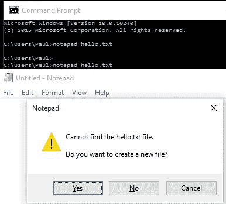

# 第三章：输入和输出

到目前为止，我们只看到了来自我们示例的数据，并且只使用了 `println!` 宏函数。虽然 `println!` 宏非常有用，但我们真的需要查看输出。我们还需要知道如何获取数据，一旦数据进入，我们必须检查输入的类型是否是所需的类型。

在本章中，我们将涵盖以下主题：

+   检查输出数据的方式

+   检查如何将数据输入到应用程序中

+   使用命令行参数启动程序

+   讨论 Rust 中的方法与其他语言中的方法的不同之处

+   标准库的简要介绍

# Rust 中的函数和方法

当我们看 C++或 C#时，方法是一个类内的编程单元，它执行特定的任务。Rust 中的方法是与复合数据结构或结构体相关联的函数。这些方法通过使用 `self` 参数来访问对象的数据。它们在 `impl` 块中定义，如下面的示例所示（更完整的示例可以在源示例中找到）：

```rs
struct Point { 
    x: f64, 
    y: f64 
} 

impl Point { 
    fn origin() -> Point { 
        Point {x: 0.0, y: 0.0 } 
    } 

    fn new(my_x: f64, my_y: f64) -> Point { 
        Point { x: my_x, y: my_y } 
    } 
} 
```

在这里，我们定义了一个名为 `Point` 的结构体，用于表示二维空间中的点。然后，我们为该结构体定义了两个构造方法：`origin` 用于创建位置在 `0`,`0` 的新点，另一个用于创建任意新点。

# println! 和 println 之间的区别

到目前为止，我们使用 `println!` 来输出文本。这是可以的，但考虑一下 `println!` 做了什么。每次你看到 `!` 标记时，它都象征着宏。宏用于在编译时而不是在运行时执行函数的一部分。

考虑以下内容：

```rs
println!("{}", a); 
Console.WriteLine("{0}", a); 
a on the line. In this case, a can be of any type that supports conversion to a formatted output. The same applies to Rust. A line is output with the value of a.
```

`println!` 宏实际上是在 Rust 标准库中实现的。

# 标准库简介

为了理解 `println!` 的来源，我们需要简要地看一下 Rust 标准库。如果你熟悉 C、C++或 C#（或任何其他常用语言），你可能会用到类似的东西：

```rs
#include <stdio.h> 
#include <stdlib> 
using System.Collections.Generic; 
```

这些是编译器附带的标准库，开发者可以选择性地包含。它们包含许多有用的过程、函数和方法，所有这些都是为了使开发更简单，这样你就不需要在需要执行常见任务时不断重新发明轮子。

在 Rust 中，类似的系统以 crate 的形式存在。std crate 包含 Rust 标准库，并且默认包含在所有其他 crate 中。这意味着你可以使用那里的功能，而无需额外步骤。

箱子被进一步分为模块层次结构，其中双冒号 `::` 是路径的分隔符。例如，`std::fmt` 是 `std` 模块内的 `fmt` 模块。它包含字符串格式化和打印功能。例如，我们之前已经使用过的 `println!` 宏就在那里。

那么为什么我们每次使用 `println!` 宏时都不需要写 `std::fmt::println!` 呢？因为 `println!` 是许多自动导入到每个命名空间的标准宏之一。

您也可以自己将事物导入当前命名空间，以节省一些按键。这是通过使用关键字完成的。以下是一个使用标准库中的 `HashMap` 集合类型的示例，而不使用使用关键字：

```rs
let mut my_hashmap: std::collections::HashMap<String, u8> =  
    std::collections::HashMap::new(); 
my_hashmap.insert("one".to_owned(), 1); 
```

每次都明确地拼写完整的命名空间是可能的，但如您所见，噪声与信号比略低。将 `HashMap` 导入当前命名空间可以有所帮助。这段代码与之前的代码等价：

```rs
use std::collections::HashMap; 
let mut my_hashmap: HashMap<String, u8> = HashMap::new(); 
my_hashmap.insert("one".to_owned(), 1); 
```

Rust 的库系统与其他语言略有不同，因此可能对新手来说是一个绊脚石。我发现意识到使用子句不是使代码可见和可调用的必要条件是有用的：它们只是将命名空间导入到当前命名空间中。

# 库

`std` 库定义了我们已经遇到的原始类型（`array`、不同大小的浮点数和整数、`String` 等），但也包含了许多其他模块。它们还定义了常用的宏（如 `write!` 和 `println!`）。

为了本章的目的，我们将仅涵盖 `std::io`、`std::fs` 和 `std::fmt`。这些模块涉及输入/输出、文件系统和格式化。`io` 和 `fs` 模块将在本章后面讨论。

# 控制输出格式

`std::fmt` 模块为开发者提供了一系列用于格式化和打印字符串的实用工具。让我们从 `format!` 宏开始。这个宏返回一个字符串。

我们已经看到，如果我们使用 `println!`(`Hello {}`, `myString`)，代码将在 `Hello` 后打印 `myString` 的内容。`format!` 宏的工作方式几乎相同，只是它返回格式化的字符串而不是输出它。实际上，`println!` 在底层本质上使用 `format!`。

# 定位输出

在 C# 中，更有用的扩展之一是 `string.Format(...);`。这允许根据特定位置的参数构建字符串。例如，以下语句构建了一个字符串，其中字符串字面量之后的参数位置被插入到字符串中（在这里，字母 `B` 在字符串中间和末尾各插入了一次）：

```rs
var myString = string.Format("Hello {0}, I am a {1}{1}{2} computer model {1}", name, "B", "C"); 
```

Rust 也支持这种形式，但不同之处在于可以省略位置。

考虑以下示例：

```rs
format!("{} {}", 2, 10); // output 2 10 
format!("{1} {} {0} {}", "B", "A"); 
```

第一个例子是我们之前看到的。格式字符串按顺序填充右侧的参数。

在第二个例子中，看起来我们要求四个参数，但实际上只提供了两个。这种方式是，当填充非位置参数时，会忽略位置参数。在编程中，索引通常从零开始。这就是处理参数的方式：

+   `{1}` 插入第二个参数 `A`

+   `{}`插入第一个参数`B`

+   `{0}`插入第一个参数`B`

+   `{}`插入第二个参数`A`

因此，输出将是 A B B A。

以下是对位置参数的两个重要规则：

1.  引号内的所有参数都必须使用。未能这样做将导致编译器错误。

1.  你可以在格式化字符串中多次引用相同的参数。

# 命名参数

如格式化表所示，可以使用命名参数。这些参数的操作类似于位置参数；不过，区别在于使用的是命名参数。这在确保字符串中输出的值是正确的参数方面非常有用。

在使用命名参数时，在格式化字符串中使用空参数是完全可接受的，例如：

```rs
format!("{b} {a} {} {t}", b = "B", a = 'a', t = 33); 
```

处理非位置参数与命名参数的规则与位置参数的规则相似：在确定位置时忽略命名参数。因此，输出将是 B a B 33。

# 指定参数类型

与 C 家族语言中的许多字符串处理一样，可以根据格式化字符串创建字符串（例如，`{0:##.###}`将给出形式为 xy.abc 的格式化输出）。

在 Rust 中也可以做类似的事情，如下所示：

```rs
let my_number = format!("{:.3}", 3.1415927); 
```

在格式化字符串中，冒号表示我们正在请求对值的格式化。点号和数字`3`表示我们希望将数字格式化为三位小数。格式化器会为我们四舍五入值，因此输出将是 3.142。

# 格式化特性

格式化特性决定了格式化输出的生成方式。它们都以相同的方式进行使用：`{:trait_name}.`

以下是目前可用的特性：

| **格式化字符串** | **特性** | **含义** | **示例** |
| --- | --- | --- | --- |
| `{}` | 显示 | 人类可读表示。并非所有事物都实现了 Display。 | 123 => "123" |
| `{:?}` | Debug | 内部表示。几乎一切事物都实现了 Debug。 | b"123" => [49, 50, 51] |
| `{:b}` | Binary | 将数字转换为二进制 | 123 => "1111011" |
| `{:x}` | LowerHex | 小写十六进制 | 123 => 7b |
| `{:X}` | UpperHex | 大写十六进制 | 123 => 7B |
| `{:e}` | LowerExp | 带有指数的小写数字 | 123.0 => 1.23e2 |
| `{:E}` | UpperExp | 带有指数的上标数字 | 123.0 => 1.23E2 |
| `{:p}` | 指针 | 指针位置 | &123 => 0x55b3fbe72980（每次运行可能指向不同的地址） |

类似地，输出也可以使用格式化参数进行格式化。

# 格式化参数

实际上有四个可用的格式化参数。它们列在下面的表中：

| **参数** | **用途** |
| --- | --- |
| `Fill`/`Alignment` | 与`Width`参数一起使用。基本上，如果输出小于宽度，这将添加额外的字符。 |

| `Sign`/`#`/`0` | 格式化器使用的标志：

+   `Sign` 表示符号应该始终输出（仅限数值）。如果值是正数，则 `+` 符号永远不会显示；同样，`-` 符号仅对 `Signed` 值显示。

+   `*#*` 表示将使用另一种打印形式。通常，如果使用 `{:x}`，则使用小写十六进制格式。通过使用 `#x`，参数前面将加上 `0x`。

+   `0` 用于用 `0` 字符填充结果。它是符号感知的。

|

| `Width` | 指定输出应该如何表示。例如，如果你有一个浮点计算，需要输出到小数点后四位，而结果只有两位小数，则宽度格式化器（与填充格式化参数结合使用）将创建所需的填充输出。 |
| --- | --- |

| `Precision` | 对于任何非数值，精度是最大宽度。例如，如果你有最大宽度为五，而一个包含八个字符的字符串，它将在五个字符后截断。对于整数，它被忽略。对于浮点类型，它表示小数点后的位数：

+   整数 `.N:`：在这种情况下，`N` 是精度。

+   整数后跟一个 `$ (.N$:)`：这使用格式参数 `N` 作为精度。该参数必须是 `usize` 类型。

+   `.*:`：这意味着 `{}` 中的内容与两个格式输入相关联。第一个持有 `usize` 精度，第二个持有要打印的值。

|

所有这些格式化器的示例都在本章的源代码示例中。

# 获取信息

到目前为止，我们一直专注于从 Rust 程序中获取信息，而不是输入信息。

输入是通过 `std::io` 模块完成的，使用 `io::stdin()` 函数获取一个读取器，然后在该读取器上调用 `read_line`。我们将输入的数据放入一个动态增长的 `String`，它需要是可变的。

输入的一个简单示例如下所示：

```rs
// 03/readline/src/main.rs
use std::io; 
fn main() {     
    let reader: io::Stdin = io::stdin(); 
    let mut input_text: String = String::new(); 

    reader.read_line(&mut input_text).expect("Reading failed"); 
    println!("Read {}", input_text); 
} 
```

我们可以在前面的代码中看到 Rust 的错误处理。`read_line` 方法返回一个结果类型，这意味着操作可能失败。结果类型在其内部封装了两个泛型类型，对于 `read_line` 来说，它们是 `usize`（用于报告读取了多少字节）和 `io::Error`（用于报告输入过程中的任何错误）。实际读取的字符串放在函数的第一个参数中，在这种情况下是 `input_text`。

在该结果类型上，我们的示例调用 `expect` 方法。它期望一切顺利，并返回第一个值（在这种情况下是 `usize`）。如果有错误，`expect` 方法会将“读取失败”打印到标准输出并退出程序。

这不是处理结果类型的唯一方法，但在我们预期事情通常能顺利进行的情况下，这是一种常见的方法。

处理错误的另一种方法是显式调用结果上的 `is_err` 方法。它返回一个布尔值，如下所示：

```rs
    let result: Result<usize, io::Error> = reader.read_line(&mut input_text); 
    if result.is_err() { 
        println!("failed to read from stdin"); 
        return; 
    } 
```

如果我们希望进一步将输入解析为另一种类型，我们可以使用 `parse` 方法。

例如，如果我们想从输入中获取一个`i32`。`read_line`方法在输入数据中包含一个回车符，因此我们需要在解析之前使用`trim`方法将其去除：

```rs
    let trimmed = input_text.trim(); 
    let option: Option<i32> = trimmed.parse::<i32>().ok(); 
```

为了这个示例，最后一行使用`ok`方法将结果类型转换为`Option`。`Option`是结果的简化版本。这是一个有用的库，它可以有两种结果：`Some`或`None`。

这里，如果条目结果是`None`，则值不是整数，而`Some`将是一个整数：

```rs
match option { 
        Some(i) => println!("your integer input: {}", i), 
        None => println!("this was not an integer: {}", trimmed) 
    }; 

```

# 命令行参数

当程序启动时，它可以带参数或不带参数启动。这些参数通常在调用程序时作为参数传入。一个简单的例子是启动手册应用（在许多 BSD 和 Linux 机器上都可以找到）：

```rs
man ffmpeg 
```

在前面的语句中，`man`是要调用带有`ffmpeg`参数的程序或脚本的名称。类似地，看看以下针对 Windows 用户的示例：



`记事本`是程序名称，第一个参数是要读取的文件（在这个例子中，文件不存在，因此 UI 询问是否要创建它）。

一个程序加载另一个程序以执行任务的情况并不少见。

在 C 中，`main`的参数列表如下所示：

```rs
int main(int argc, char *argv[])
```

`argc`是`argv`中参数的最大数量，其中`argv`持有参数。在这里，程序名称是`argv[0]`，所以所有附加参数从 1 开始。

Rust 的`main`不接收这样的参数。命令行参数可以通过标准库`std::env::args`（环境参数）获得。为了简单起见，将参数存储在`Vec<String>`中是很方便的，因为`env::args`返回一个迭代器，它产生一个`String`。

直接将参数传递给`main`的情况并不少见：

```rs
// 03/args/src/main.rs
use std::env; 
fn main() { 
    let args: Vec<String> = env::args().collect(); 
    println!("There was {:?} arguments passed in. They were {:?}.", args.len() - 1, &args[1..]); 
} 
```

`collect`方法将迭代器转换为向量，使得可以通过索引访问它。没有它，我们就必须逐个处理参数。

# 文件处理

我们对程序内外获取信息的巡视的最后一部分是使用文件。就 Rust 而言，文件只是另一个流，只是这个流去往别处。

当使用与文件相关的任何东西时，使用`try!`宏来捕获所有错误是很重要的。

# 从文件中读取

在这里，我们将使用`std::io`、`std::io::prelude::*`和`std::fs::File`。`std::io`是标准输入/输出库，`prelude`后的`*`表示使用预定义库中的任何内容，而`std::fs`是文件系统库。

文件系统调用非常特定于平台；Windows 用户使用类似`C://Users/Paul/Documents/My Documents`的路径作为用户的主目录，而 Linux 和 macOS 机器会使用`~/`作为用户的主目录。如果没有为文件指定路径，程序将假定文件位于二进制所在的同一目录中。

# 加载文件

要打开文件，我们使用`File::open(filename)`。我们可以使用`try!`宏或`match`来捕获异常，如下所示：

```rs
let file = try!(File::open("my_file.txt")) 
```

或者可以使用以下方法：

```rs
let file = match File::open("my_file.txt") { 
    Ok(file) => file, 
    Err(..) => panic!("boom"), 
} 
```

如果文件可以打开，`File::open`将授予文件读取权限。为了加载文件，我们基于文件创建一个`BufReader`：

```rs
let mut reader = BufReader::new(&file); 
let buffer_string = &mut String::new(); 
reader.read_line(buffer_string); 
println!("Line read in: {}", buffer_string); 
```

一旦文件被读取，可以通过`reader.close()`显式关闭流。然而，Rust 的资源管理系统保证了当其绑定超出作用域时文件将被关闭，所以这不是强制的。

# 写入文件

写入文件是一个两步过程：打开文件（如果之前不存在，则可能创建它）然后写入文件。这与 C 系列语言中写入文件的方式非常相似。

你可以通过对`std::fs::File::create`的单次调用来创建一个用于写入的文件。同一命名空间中的`open`方法用于打开文件进行读取。如果你需要更精细的权限，`std::fs::OpenOptions::new`创建一个对象，通过它可以调整参数然后打开文件。

与任何文件操作一样，任何操作都可能失败，因此应该始终检查结果：

```rs
let file: Result<File,Error> = options.open(path); 

```

如前所述，Rust 经常使用泛型类型`Result<T,U>`作为错误捕获机制。它封装了两个值：当操作成功时使用左侧的值，当操作不成功时使用右侧的值。

一旦完成文件创建，我们就可以继续写入文件。

首先，我们检查`Result`比较的结果。如果没有抛出错误，则表示没有错误，然后我们可以创建一个`BufWriter`：

```rs
let mut writer = BufWriter::new(&file); 
writer.write_all(b"hello text file\n"); 
```

我们不需要刷新缓冲区，因为`write_all`会为我们完成这个操作（它会在完成后调用`flush()`）。如果你不使用`write_all`，那么你需要调用`flush()`以确保缓冲区被清除。

# `expect`的使用

Rust 包含一个非常有用的函数`expect`。此方法与任何具有`Option`或`Result`类型（例如，文件写入示例中的`Result`）的调用一起使用。它通过将值从选项中移出并返回它来工作。如果`option`/`result`类型包含错误，`expect`调用将停止你的程序并打印出错误信息。

例如，以下语句将返回`File`或`Error`到`file`中：

```rs
let file: Result<File, Error> = options.open("my_file.txt").expect("Opening the file failed"); 
```

在`unwrap`方法中有一个简短的形式。这与`expect`方法相同，但在失败的情况下不会打印任何内容。一般来说，`Some(a).unwrap()`将返回`a`。

通常更喜欢使用`expect`而不是`unwrap`，因为完整的错误信息使得更容易找到错误来源。

# XML 和 Rust

由于 Rust 非常适合在服务器上运行，因此考虑 XML 以及它在 Rust 中的处理似乎是合适的。

幸运的是，Rust 自带一个名为`Xml`的 crate，其工作方式与标准流读写类似。

# 读取文件

就像标准文件一样，我们首先需要打开文件并创建一个读取器：

```rs
let file = File::open("my_xmlfile.xml").unwrap();
let reader =BufferedReader::new(file);
```

接下来，我们开始读取。与普通读取器不同，我们使用`EventReader`。这提供了一系列事件（如`StartElement`、`EndElement`和`Error`），这些事件对于从不同节点读取是必需的：

```rs
let mut xml_parser = EventReader::new(reader); 
```

接下来，我们按照以下方式遍历文件：

```rs
for e in xml_parser.events() { 
     match e { 
         StartElement { name, .. } => { 
              println!("{}", name); 
         } 
         EndElement {name} => { 
             println!("{}", name); 
         } 
         Error(e) => { 
             println!("Error in file: {}", e); 
      } 
      _ => {} 
   } 
} 
_ => {} essentially means that you don't care what is left, do something with it (in this case, the something is nothing). You will see the symbol _ quite a bit in Rust. Commonly, it is used in loops where the variable being acted on is never used, for example:
```

```rs
for _ in something() {...} 
```

我们不会使用迭代器；我们只需要一些东西来使迭代能够跳到下一个值。

# 写入文件

编写 XML 文件比读取复杂得多。在这里，我们必须显式使用`XmlEvent`和`EventWriter`。我们还使用`EmitterConfig`，正如其名称所暗示的，即创建一个配置然后使用它。`EventWriter`、`EmitterConfig`和`XmlEvent`都是`xml::writer`的一部分。

让我们先考虑主函数。首先，创建文件和两个引用，一个指向`stdin`，一个指向`stdout`，如下所示：

```rs
let mut file = File::create("myxml_file.xml).unwrap(); 
let mut output = io::stdout(); 
let mut input = io::stdin(); 
```

接下来，我们通过`EmitterConfig`创建写入器：

```rs
let mut writer = EmitterConfig::new().preform_indent(true).create_writer(&mut file); 
```

现在我们已经设置了写入器。`perform_indent`告诉写入器当为真时对每个节点进行缩进。

最后，我们创建一个循环并写入 XML。你会注意到一个对`handle_event`的调用；我们很快就会处理这个问题：

```rs
loop { 
    print!("> "); 
    output.flush().unwrap(); 
    let mut line = String::new(); 
    match input.readline(&mut line) { 
         Ok(0) => break, 
         Ok(_) => match handle_event(&mut writer, line) { 
              Ok(_) => {} 
              Err(e) => panic!("XML write error: {}", e) 
         } 
         Err(e) => panic!("Input error: {}", e); 
    } 
} 
```

函数`handle_event`的定义比我们之前看到的要复杂一些：

```rs
fn handle_event<W: Write>(w: &mut EventWriter<W>, line: String) -> Result<()> { 
```

在 C#中，前面的定义将类似，并且会写成如下所示：

```rs
Result handle_result<T>(EventWriter<T> w, string line) where T:Write 
```

我们将一个类型（无论是`class`、`string`、`i32`还是其他任何类型）传递给函数作为参数。在这种情况下，我们使用`std::io::Write`作为`EventWriter`使用的参数。

函数本身没有什么特别之处。我们首先通过修剪字符串来移除任何空白或回车：

```rs
let line = line.trim(); 
```

我们现在使用`XmlEvent`来生成代码：

```rs
let event: XmlEvent = if line.starts_with("+") && line.len() > 1 { 
    XmlEvent::start_element(&line[1..]).into() 
} else if line.starts_with("-") { 
    XmlEvent::end_element().into() 
} else { 
    XmlEvent::characters(&line).into() 
   }; 
    w.write(&line).into(); 
} 
```

`into()`将指针转换为结构（称为`self`）。在这种情况下，它接受（比如说）`XmlEvent::characters(&line)`，并将其发送回行中。

# 概述

在本章中，我们涵盖了相当多的内容，你应该对处理字符串、XML 和文件感到更加熟悉，这些都可以用来为你的代码添加更多功能。请随时检查本章提供的示例。

在下一章中，我们将探讨循环、递归和分支。
