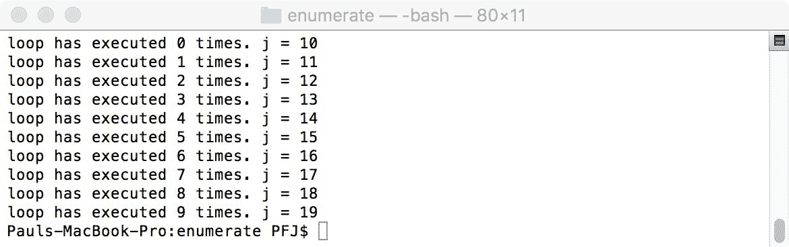
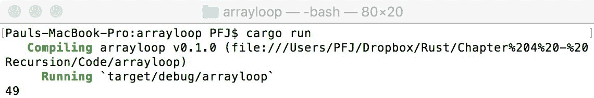
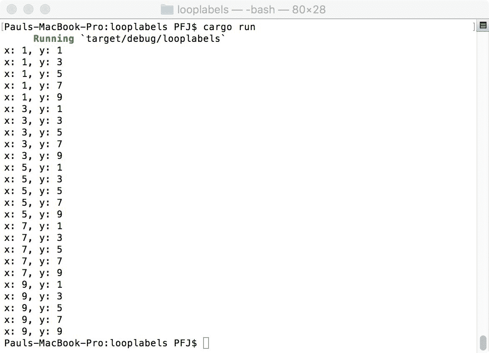
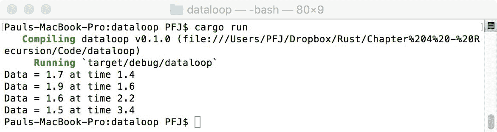
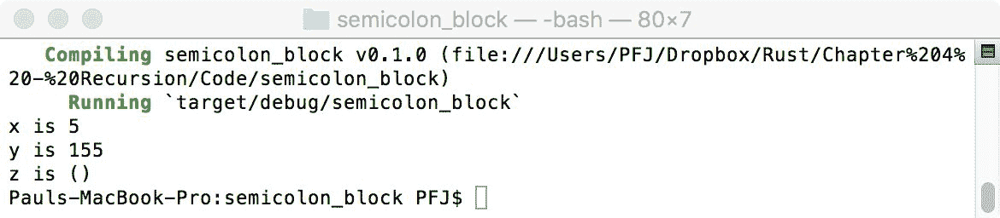

# 第四章：条件、递归和循环

任何编程语言中的循环和条件都是操作的基本方面。你可能正在遍历一个列表，试图找到匹配项，当匹配发生时，分支执行其他任务；或者，你可能只想检查一个值是否满足条件。在任何情况下，Rust 都允许你这样做。

在本章中，我们将涵盖以下主题：

+   可用的循环类型

+   循环中的不同类型分支

+   递归方法

+   当分号（`;`）可以省略及其含义

# 循环

Rust 本质上具有三种类型的循环：

+   `loop`是最简单的一种——它只是重复执行代码块，直到使用到循环中断关键字。

+   `while`类似于循环，但有一个条件——只要条件为真，代码块就会重复执行

+   `for`与上述两种不同——它是用于遍历序列的

# `for`循环

`for`循环与 C-like 语言中的相同结构略有不同。在 C 中，`for`循环由三部分组成：初始化、停止条件和步进指令。Rust 的`for`循环则更高级一些：它们用于遍历序列。

让我们从简单的例子开始——一个从`0`到`10`的循环，并输出值：

```rs
for x in 0..10 
{ 
    println!("{},", x); 
} 
```

我们创建一个变量`x`，它从范围（`0..10`）中逐个获取元素，并对它进行一些操作。在 Rust 术语中，`0..10`不仅是一个变量，也是一个**迭代器**，因为它从一系列元素中返回一个值。

这显然是一个非常简单的例子。我们也可以定义迭代器以相反的方向工作。在 C 中，你可能会期望类似`for (i = 10; i > 0; --i)`的东西。在 Rust 中，我们使用`rev()`方法来反转迭代器，如下所示：

```rs
for x in (0..10).rev() 
{ 
    println!("{},", x); 
}  
```

值得注意的是，范围不包括最后一个数字。所以，对于前面的例子，输出的值是`9`到`0`；本质上，程序生成从`0`到`10`的输出值，然后以相反的顺序输出。

`for`循环的一般语法如下：

```rs
for var in sequence
{ 
    // do something 
}   
```

以下代码的 C#等价代码如下：

```rs
foreach(var t in conditionsequence) 
     // do something  
```

# 使用`enumerate`

`loop`条件也可以更复杂，使用多个条件和变量。例如，可以使用`enumerate`来跟踪`for`循环。这将跟踪循环执行了多少次，如下所示：

```rs
for(i, j) in (10..20).enumerate() 
{ 
     println!("loop has executed {} times. j = {}", i, j); 
} 
```

以下是输出：



假设我们有一个数组需要遍历以获取值。在这里，可以使用`enumerate`方法来获取数组成员的值。条件返回的值将是一个引用，所以如下所示的代码将无法执行（`line`是一个`&`引用，而期望的是`i32`）：

```rs
// 04/enumerate/src/main.rs
fn main()  
{ 
    let my_array: [i32; 7] = [1i32,3,5,7,9,11,13]; 
    let mut value = 0i32; 
    for(_, line) in my_array.iter().enumerate() 
    { 
       value += line; 
    } 
    println!("{}", value); 
} 
```

这可以简单地从引用值转换回来，如下所示：

```rs
for(_, line) in my_array.iter().enumerate() 
    { 
       value += *line; 
    } 
```

`iter().enumerate()` 方法同样可以与 `Vec` 类型（或任何实现了迭代器特质的类型）一起使用，如下面的代码所示：

```rs
// 04/arrayloop/src/main.rs
fn main()  
{ 
    let my_array = vec![1i32,3,5,7,9,11,13]; 
    let mut value = 0i32; 

    for(_,line) in my_array.iter().enumerate() 
    { 
       value += *line; 
    } 
    println!("{}", value); 
} 

```

在这两种情况下，最后的值都将是 `49`，如下面的截图所示：



# `_` 参数

你可能想知道 `_` 参数是什么。在 Rust 中，即使我们不使用变量绑定，通常也不允许省略变量绑定。我们可以使用 `_` 来表示我们知道这个位置需要一个变量绑定，但我们永远不会使用它。

# 简单循环

循环的一种简单形式被称为 `循环`：

```rs
loop 
{ 
    println!("Hello"); 
} 
```

上述代码没有循环结束关键字，如 `break`；它将一直输出 `Hello`，直到手动终止应用程序。

# while 条件

`while` 条件通过条件扩展循环，正如你将在下面的代码片段中看到的那样：

```rs
while (condition) 
{ 
    // do something 
} 
```

让我们看看以下示例：

```rs
fn main() { 
    let mut done = 0u32; 
    while done != 32 
    { 
        println!("done = {}", done); 
        done += 1; 
    } 
} 
```

上述代码将输出 `done = 0` 到 `done = 31`。循环将在 `done` 等于 `32` 时终止。

# 提前终止循环

根据循环内迭代的 数据大小，循环可能会在处理器时间上花费较多。例如，假设服务器正在从数据记录应用程序接收数据，例如从气相色谱仪测量值；在整个扫描过程中，它可能记录大约五十万个数据点及其相关的时间位置。

对于我们的目的，我们想要将所有记录的值相加，直到值超过 1.5，一旦达到这个值，我们就可以停止循环。

看起来很简单？但有一件事没有提到：没有保证记录的值会超过 1.5，那么如果值达到了，我们如何终止循环？

我们可以通过两种方式之一来完成这个操作。第一种是使用 `while` 循环并引入一个布尔值作为测试条件。在以下示例中，`my_array` 代表发送到服务器的数据的一个非常小的子集：

```rs
// 04/terminate-loop-1/src/main.rs
fn main()  
{ 
    let my_array = vec![0.6f32, 0.4, 0.2, 0.8, 1.3, 1.1, 1.7, 1.9]; 
    let mut counter: usize = 0; 
    let mut result = 0f32; 
    let mut quit = false; 

    while quit != true 
    { 
        if my_array[counter] > 1.5 
        { 
            quit = true; 
        } 
        else 
        { 
            result += my_array[counter]; 
            counter += 1; 
        } 
    } 
     println!("{}", result); 
} 
```

这里结果是 `4.4`。这段代码完全可接受，尽管稍微有些冗长。Rust 还允许使用 `break` 和 `continue` 关键字（如果你熟悉 C，它们的工作方式相同）。

我们使用 `break` 的代码如下：

```rs
// 04/terminate-loop-2/src/main.rs
fn main()  
{ 
    let my_array = vec![0.6f32, 0.4, 0.2, 0.8, 1.3, 1.1, 1.7, 1.9]; 
    let mut result = 0f32; 

    for(_, value) in my_array.iter().enumerate() 
    { 
       if *value > 1.5 
       { 
           break; 
       } 
       else 
       { 
           result += *value; 
       } 
    } 
    println!("{}", result); 
} 
```

再次强调，这将给出 `4.4` 的答案，表明所使用的两种方法是等效的。

如果我们在前面的代码示例中将 `break` 替换为 `continue`，我们将得到相同的结果（`4.4`）。`break` 和 `continue` 的区别在于 `continue` 跳转到迭代中的下一个值而不是跳出，所以如果我们 `my_array` 的最终值为 `1.3`，最后的输出应该是 `5.7`。

当使用 `break` 和 `continue` 时，始终要记住这个区别。虽然这可能会导致代码崩溃，但错误地使用 `break` 和 `continue` 可能会导致你意想不到或不想得到的结果。

# 使用循环标签

Rust 允许我们给循环添加标签。这可以非常有用，例如在嵌套循环中。这些标签作为循环的符号名称，并且因为我们有一个循环的名称，我们可以指示应用程序在该名称上执行任务。

考虑以下简单的例子：

```rs
// 04/looplabels/src/main.rs
fn main()  
{ 
    'outer_loop: for x in 0..10  
    { 
        'inner_loop: for y in 0..10  
        { 
            if x % 2 == 0 { continue 'outer_loop; }  
            if y % 2 == 0 { continue 'inner_loop; } 
            println!("x: {}, y: {}", x, y); 
        } 
    } 
} 
```

这段代码会做什么？

在这里，`x % 2 == 0`（或`y % 2 == 0`）意味着如果一个变量除以二没有余数，那么条件就满足，并且执行花括号中的代码。当`x % 2 == 0`，或者当循环的值是偶数时，我们将告诉应用程序跳到`outer_loop`的下一个迭代，而`outer_loop`是一个奇数。然而，我们还有一个内层循环。同样，当`y % 2`是偶数时，我们将告诉应用程序跳到`inner_loop`的下一个迭代。

在这种情况下，应用程序将输出以下结果：



虽然这个例子可能看起来非常简单，但它确实在检查数据时提供了很大的速度。让我们回到我们之前将数据发送到网络服务的例子。回想一下，我们有两个值——记录的数据和一些其他值；为了方便，它将是一个数据点。每个数据点相隔 0.2 秒记录；因此，每第五个数据点是一秒。

这次，我们想要所有数据大于 1.5 的数据点及其相关的时间，但只在该数据点正好在一秒时。因为我们希望代码易于理解和阅读，我们可以在每个循环上使用循环标签。

以下代码并不完全正确。你能找出原因吗？代码编译如下：

```rs
// 04/looplabels-2/src/main.rs
fn main()  
{ 
    let my_array = vec![0.6f32, 0.4, 0.2, 0.8, 1.3, 1.1, 1.7, 1.9, 1.3, 0.1, 1.6, 0.6, 0.9, 1.1, 1.31, 1.49, 1.5, 0.7]; 
    let my_time = vec![0.2f32, 0.4, 0.6, 0.8, 1.0, 1.2, 1.4, 1.6, 1.8, 2.0, 2.2, 2.4, 2.6, 2.8, 3.0, 3.2, 3.4, 3.6, 3.8]; 

    'time_loop: for(_, time_value) in my_time.iter().enumerate() 
    { 
       'data_loop: for(_, value) in my_array.iter().enumerate() 
       { 
           if *value < 1.5 
           { 
               continue 'data_loop; 
           } 
           if *time_value % 5f32 == 0f32 
           { 
               continue 'time_loop; 
           } 
           println!("Data point = {} at time {}s", *value, *time_value); 
       } 
    } 
} 
```

这个例子是一个非常好的例子，可以展示正确的运算符的使用。问题是`if *time_value % 5f32 == 0f32`这一行。我们正在取一个浮点值，并使用另一个浮点数的模来查看我们最终是否得到一个浮点数的 0。

将任何非`string`、`int`、`long`或`bool`类型的值与另一个值进行比较，从来不是一个好主意，尤其是如果该值是由某种形式的计算返回的。我们也不能简单地使用`continue`在时间循环中，那么我们该如何解决这个问题呢？

如果你还记得，我们正在使用`_`而不是命名参数来进行循环的枚举。这些值始终是整数；因此，如果我们用一个变量名替换`_`，那么我们可以使用`% 5`来进行计算，代码就变成了以下这样：

```rs
'time_loop: for(time_enum, time_value) in my_time.iter().enumerate() 
    { 
       'data_loop: for(_, value) in my_array.iter().enumerate() 
       { 
           if *value < 1.5 
           { 
               continue 'data_loop; 
           } 
           if time_enum % 5 == 0 
           { 
               continue 'time_loop; 
           } 
           println!("Data point = {} at time {}s", *value, *time_value); 
       } 
    } 

```

下一个问题在于输出并不正确。代码给出了以下：

```rs
Data point = 1.7 at time 0.4s 
Data point = 1.9 at time 0.4s 
Data point = 1.6 at time 0.4s 
Data point = 1.5 at time 0.4s 
Data point = 1.7 at time 0.6s 
Data point = 1.9 at time 0.6s 
Data point = 1.6 at time 0.6s 
Data point = 1.5 at time 0.6s 
```

数据点是正确的，但时间完全错误，并且不断重复。我们仍然需要在数据点步骤中使用`continue`语句，但时间步骤是错误的。有几个解决方案，但可能最简单的方法是将数据和时间存储在一个新的向量中，然后在最后显示这些数据。

以下代码更接近所需的结果：

```rs
// 04/looplabels-3/src/main.rs
fn main()  
{ 
    let my_array = vec![0.6f32, 0.4, 0.2, 0.8, 1.3, 1.1, 1.7, 1.9, 1.3, 0.1, 1.6, 0.6, 0.9, 1.1, 1.31, 1.49, 1.5, 0.7]; 
    let my_time = vec![0.2f32, 0.4, 0.6, 0.8, 1.0, 1.2, 1.4, 1.6, 1.8, 2.0, 2.2, 2.4, 2.6, 2.8, 3.0, 3.2, 3.4, 3.6, 3.8]; 
    let mut my_new_array = vec![]; 
    let mut my_new_time = vec![]; 

    'time_loop: for(t, _) in my_time.iter().enumerate() 
    { 
       'data_loop: for(v, value) in my_array.iter().enumerate() 
       { 
           if *value < 1.5 
           { 
               continue 'data_loop; 
           } 
           else 
           { 
               if t % 5 != 0 
               { 
                    my_new_array.push(*value); 
                    my_new_time.push(my_time[v]); 
               }        
           } 

           if v == my_array.len() 
           { 
               break; 
           } 
       } 
    } 

    for(m, my_data) in my_new_array.iter().enumerate() 
    { 
        println!("Data = {} at time {}", *my_data, my_new_time[m]); 
    } 
} 

```

现在，我们将得到以下输出：

```rs
Data = 1.7 at time 1.4 
Data = 1.9 at time 1.6 
Data = 1.6 at time 2.2 
Data = 1.5 at time 3.4 
Data = 1.7 at time 1.4 
```

是的，我们现在有了正确的数据，但时间又重新开始。我们很接近，但还不是正确的。我们没有继续`time_loop`循环，我们还需要引入一个`break`语句。为了触发`break`，我们将创建一个新的变量`done`。当`v`，`my_array`的枚举器达到向量的长度（这是向量中的元素数量）时，我们将这个值从`false`改为`true`。然后，在`data_loop`外部进行测试。如果`done == true`，则跳出循环。

代码的最终版本如下：

```rs
// 04/dataloop/src/main.rs
fn main()  
{ 
    let my_array = vec![0.6f32, 0.4, 0.2, 0.8, 1.3, 1.1, 1.7, 1.9, 1.3, 0.1, 1.6, 0.6, 0.9, 1.1, 1.31, 1.49, 1.5, 0.7]; 
    let my_time = vec![0.2f32, 0.4, 0.6, 0.8, 1.0, 1.2, 1.4, 1.6, 1.8, 2.0, 2.2, 2.4, 2.6, 2.8, 3.0, 3.2, 3.4, 3.6]; 
    let mut my_new_array = vec![]; 
    let mut my_new_time = vec![]; 
    let mut done = false; 

    'time_loop: for(t, _) in my_time.iter().enumerate() 
    { 
       'data_loop: for(v, value) in my_array.iter().enumerate() 
       {  
           if v == my_array.len() - 1 
           { 
               done = true; 
           } 

           if *value < 1.5 
           { 
               continue 'data_loop; 
           } 
           else 
           { 
                if t % 5 != 0 
                { 
                    my_new_array.push(*value); 
                    my_new_time.push(my_time[v]); 
                } 
                else 
                { 
                    continue 'time_loop; 
                } 
           } 
       } 
       if done {break;} 
    } 

    for(m, my_data) in my_new_array.iter().enumerate() 
    { 
        println!("Data = {} at time {}", *my_data, my_new_time[m]); 
    } 
} 
```

我们从代码中得到的最终输出如下：



# 递归函数

最后要考虑的循环形式被称为**递归函数**。这是一个在满足条件之前会调用自身的函数。在伪代码中，函数看起来是这样的：

```rs
float my_function(i32:a: i32) 
{ 
    // do something with a 
    if (a != 32) 
    { 
        my_function(a); 
    } 
    else 
    { 
        return a; 
    } 
} 

```

递归函数的实际实现看起来是这样的：

```rs
// 04/recurse-1/src/main.rs
fn recurse(n: i32)  
{ 
     let v = match n % 2  
     { 
         0 => n / 2, 
         _ => 3 * n + 1 
     }; 
     println!("{}", v); 

     if v != 1  
     {  
         recurse(v)  
     } 
} 

fn main()  
{  
     recurse(25)  
} 

```

递归函数的想法非常简单，但我们需要考虑这个代码的两个部分。第一部分是`recurse`函数中的`let`行及其含义：

```rs
let v = match n % 2  
     { 
         0 => n / 2, 
         _ => 3 * n + 1 
     }; 
```

另一种写法如下：

```rs
let mut v = 0i32; 
if n % 2 == 0 
{ 
     v = n / 2; 
} 
else 
{ 
     v = 3 * n + 1; 
} 
```

第二部分是分号并不在所有地方使用。考虑以下示例：

```rs
fn main()  
{  
     recurse(25)  
} 
```

# 有分号和没有分号之间有什么区别？

在 Rust 中，几乎一切都是表达式。这意味着几乎每件事都返回一个值。一个例外是变量绑定语句`let`。在`let`语句以及许多其他语句中，结尾的分号是语法的一个强制部分。

然而，在表达式的情况下，分号有两个作用：它丢弃表达式的返回值，同时允许进一步的语句。所以如果表达式是块中的最后一个，那么在它那里有分号意味着最后一个值被丢弃，而没有分号则意味着返回最后一个值。

以下是一个例子，应该会使它变得清楚：

```rs
// 04/semicolon_block/src/main.rs
fn main()  
{ 
    let x = 5u32; 

    let y =  
    { 
        let x_squared = x * x; 
        let x_cube = x_squared * x; 
        x_cube + x_squared + x 
    }; 

    let z =  
    { 
        2 * x; 
    }; 

    println!("x is {:?}", x); 
    println!("y is {:?}", y); 
    println!("z is {:?}", z); 
} 
```

分号有两种不同的用法。让我们首先看看`let y`这一行：

```rs
let y =  
    { 
        let x_squared = x * x; 
        let x_cube = x_squared * x; 
        x_cube + x_squared + x // no semi-colon 
    }; 
```

这段代码执行以下操作：

+   大括号内的代码将被处理

+   最后的行，没有分号，被分配给`y`

实质上，这被视为一个内联函数，它将没有分号的行返回到变量中。

要考虑的第二行是关于`z`的：

```rs
    let z =  
    { 
        2 * x; 
    }; 
```

再次，大括号内的代码将被评估。在这种情况下，行以分号结尾，因此结果被丢弃，空值`()`被绑定到`z`。

当它执行时，我们将得到以下结果：



在代码示例中，`fn main`中调用`recurse`的行，有分号和无分号都会给出相同的结果，因为 Rust 运行时不使用`main`的返回值做任何事情。

# 摘要

在本章中，我们介绍了 Rust 中可用的不同类型的循环，以及理解何时使用分号以及省略分号意味着什么。我们还考虑了枚举和遍历向量以及数组，以及如何处理它们所包含的数据。

在下一章中，我们将了解为什么 Rust 是服务器应用程序的良好选择：内存管理。
