# 第六章：创建您的 Rust 应用程序

我们现在大约完成了这本书的一半，而不是仅仅继续，这一章有几个任务供您尝试。尝试这些任务将有助于巩固我们到目前为止所涵盖的内容。

为了完成这些，您需要使用 Cargo 创建一个完整的代码项目，如第一章中所示，*介绍和安装 Rust*。如果您遇到困难，源代码目录中包含可能的解决方案。

# 项目 1 - 让我们从一些数学开始

数据分析非常重要，了解如何产生直线关系通常非常重要。您需要构建几个函数，以完成所谓的线性回归分析。

# 要求

以下是我们项目的一些简要要求：

+   数据将来自两个向量，并将是浮点数

+   答案将只存储在主中，并从那里显示

+   两个向量必须具有相同数量的元素

# 提供的数据

本项目的所需数据位于`第六章`文件夹中的`Projects/MathsData.txt`文件中。应在应用程序内使用文件内容（复制并粘贴）。如果数据集元素数量不同，请从元素数量较多的集合的末尾删除元素。

让我们看看所需的数学：

+   **直线的方程**：

方程非常简单：

*y = mx + c*，其中*m*是斜率，*c*是 y 轴上的截距

+   **回归线的斜率**：

方程如下：

&gt;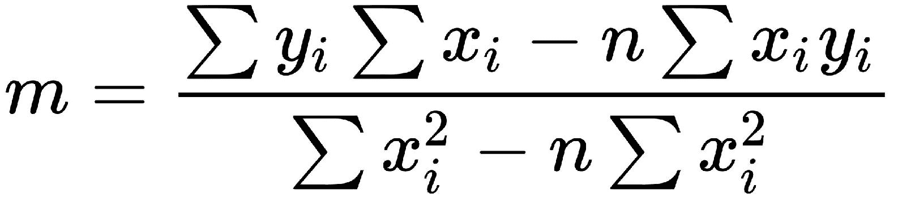

这可能看起来很复杂，但只要记住以下规则，它就相当简单：

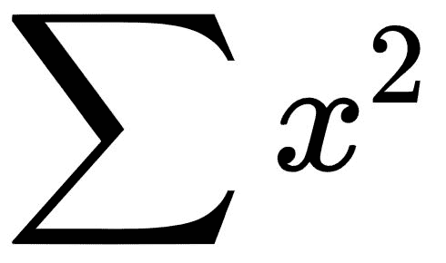不等于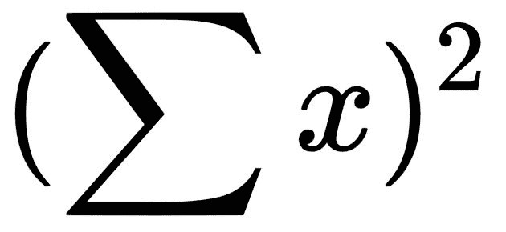

那么，区别是什么？

表示它是 x²的总和，而是 x 平方的总和。以下代码作为示例：

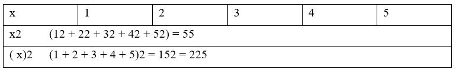

为了节省时间，此时进行以下计算是值得的：

+   每个集合的*xy*，然后是每个的∑*xy*

+   ∑*x*, ∑*y*, ∑*x²*, (∑x)², 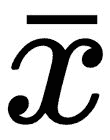（*x*的平均值），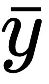（*y*值的平均值）

需要数据用于回归斜率和*y*值上的截距。之后，只需将数字插入即可。

例如，∑y = 5.8907，∑x = 5，∑x² = 7.5，(∑x)² = 25，n = 4，∑xy = 8.8528

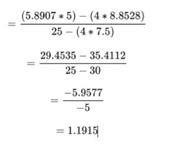

此外，从现在开始的所有数学都不比之前的难。

+   **获取截距**：

我们已经通过方程得到了*y*轴上的截距公式（*c*），如下所示：

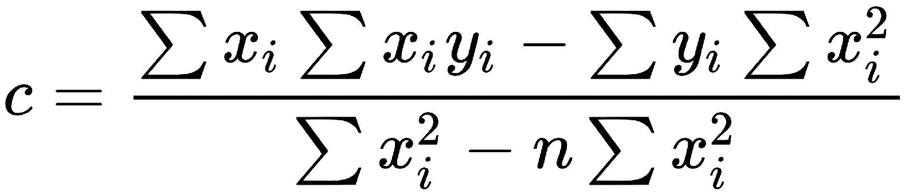

再次，使用之前相同的数据，数字填入并给出答案为-0.0167。

现在，这是 y 轴上的截距；然而，我们还想得到 x 轴上的截距。为此，我们可以这样说，我们想知道当 y = 0 时 x 的值。直线的方程是 *y = mx + c*；因此，为了得到 *x* 本身，方程将是以下这样：

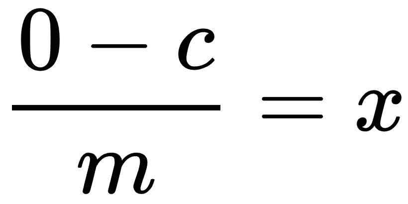

简单！

+   **偏差必须已知**：

在回归分析中还有两个因素需要考虑——标准差（更广为人知的是线的误差）和 *r²* 值（相关系数；换句话说，直线实际上有多好）。

这两个方程比之前稍微难一些，但不是很多。

首先，一些额外的计算将涵盖标准差和 r² 的计算。

对于标准差，我们需要知道 *(y[expt] - y[calc])²*。这可以在行内完成，如下所示：

y[expt] 是实验中的值，y[calc] 可以读作 mx + c（三者都是已知的）。因此，如果我们只输入数字然后平方结果，我们最终得到 (y[expt] - y[calc])²。然后把这些数字加起来得到 ∑(y[expt] - y[calc])²。

在 r² 的计算中，我们需要计算 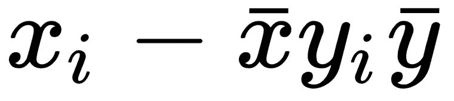 并然后汇总结果。这很容易，分母的部分也是如此。

然而，等等；偏差和 r² 计算中有一个共同的项目，即开平方根。这实际上只是另一种说平方根的方式。

现在只需要输入数字。

# 应用程序输出

应用程序必须输出以下信息：

+   每个向量中的元素数量

+   如果向量的元素数量不相同，输出被移除的值以及从哪个向量移除

+   直线的方程

+   X 和 Y 轴上的截距

+   数据的标准差

+   r² 值

# 项目 2 - 一些文本操作

回文是一个单词，它的拼写从后往前读和从前往后读是一样的。例如，单词 *madam* 就是一个回文。

# 要求

以下是一个简要的要求列表：

+   应用程序从键盘接收一行文本。

+   如果直线是空的或包含非字母字符，应该失败。

+   输入的任何文本都应该转换为小写或大写。

+   应该在单独的函数中测试单词是否是回文。如果是，函数应该返回 true；否则应该返回 false。

+   调用函数应该输出输入的文本是否（或不是）一个回文。

# 代码注释

回文函数应该是递归的。

# 项目 3 - 面积和体积

这个项目应该有助于巩固你应用程序的测试和文档。

你有一个简单的网络服务在某台服务器上运行。它作为一个测试平台，让用户发送数据并接收回数据。该服务期望输入三个字符串，如下所示：

+   用户名（字符串，非空，必须超过 6 个字符，不允许有空格）

+   密码（字符串，非空，必须超过 8 个字符，不能有空格，必须包含 1 个大写字母，1 个数字）

+   命令字符串

命令字符串是一个以逗号分隔的列表，包含是否为体积或面积计算，形状类型和参数列表的详细信息。

# 形状类型

| **类型** | **形状** | **类型** | **形状** |
| --- | --- | --- | --- |
| 0 | 圆/球体 | 3 | 五边形 |
| 1 | 三角形/棱锥 | 4 | 八边形 |
| 2 | 矩形/盒子 | 5 | 用户定义 |

# 体积或面积

对于命令字符串，区域由 true 给出，体积由 false 给出。

# 用户定义的形状

这个形状由你决定。它应该是一个目前不在列表上的形状。

# 计算公式

你应该使用以下公式进行计算：

| 形状 | 面积 | 体积 |
| --- | --- | --- |
| 圆/球体(r = 半径) | *A = Πr²* | *V = 4/3Πr³* |
| 三角形/棱锥(b = 底边，h = 高，l = 长度，w = 宽) | *A = 1/2bh* | 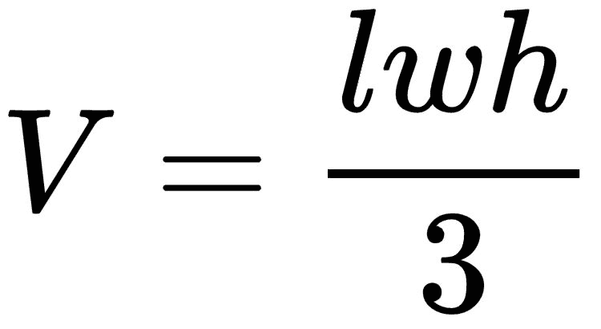 |
| 矩形/盒子(l = 长度，h = 高，b = 宽) | *A = lh* | *V = lbh* |
| 五边形(a = 边长，h = 高) | 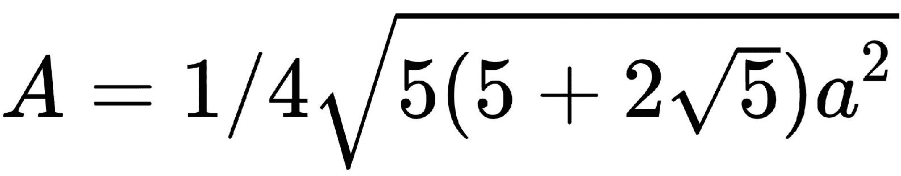 | 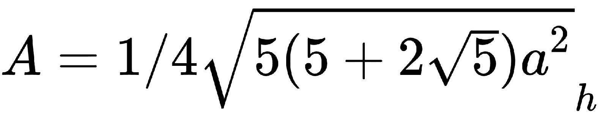 |
| 八边形(a 和 s = 边长，h = 高) | 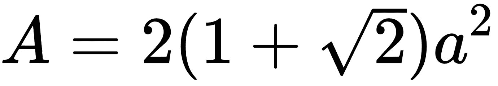 | 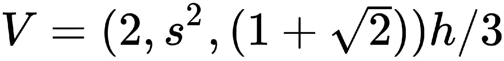 |

# 测试标准

考虑以下测试标准：

1.  **命令行**：在测试参数数据时，任何值为**0**的值应导致第一次测试失败。对于第二次测试，**0**应替换为你选择的浮点值。

命令行必须以下列格式提供：

```rs
volume/area, type, params 
```

例如，true, 1, 3.1, 33.12, 4.3 是有效的；而 false, 1, 12 将失败。（它需要传递两个值。）

命令行如 false, 1, 12.1, 13.5, 1.4, 0 不会失败，因为参数列表中超过计算所需参数数量的任何内容都可以忽略。

如果命令失败，输出应该始终是-1。

1.  **用户名和密码**：用户名和密码必须符合谜题开始时设定的标准。如果失败，输出应该是“用户名失败”或“密码失败”。不需要其他原因。

# 自动文档

应为每个函数生成文档，并清楚地说明入口和出口参数。

# 使用正则表达式（regex）

虽然 Rust 自带正则表达式作为其自己的包，但你被鼓励创建自己的方法来测试字符串输入。

# 输入和输出

与所有其他示例一样，这都应该通过标准终端的输入和输出点（读取键盘和显示器）进行。我建议使用三个提示：*用户名*，*密码*和*命令行*，因为每次输入后，将更容易测试提交的输入并相应地做出反应。

# 项目 4 – 内存

在这个项目中，你需要执行以下操作：

1.  预留一个 1024 字节的内存块。

1.  用随机字符填充那块内存。

1.  创建一个大小也是 1,024 字节的数组。

1.  将内存块的内容复制到数组中。

1.  创建一个由`capacity`函数设置的 1,024 字节限制的字符串。

1.  将内存块的内容复制到字符串中。

到目前为止，你可能想知道为什么我们有三个相同的内存块。简单的原因是，你现在将创建一段代码，将依次将每个成员旋转 3 次，先进行简单的左移位旋转，然后向右旋转 3 次。

# 位运算旋转

在 Rust 中，使用 `<<` 和 `>>` 运算符执行位运算旋转。

例如，如果我们有一个名为 `x` 的变量，它向左旋转了 3 位，我们将写 `x << 3`，而向右旋转则是 `x >> 3`。

假设我们有一个 *x = 01101001*，`x << 3` 将会是 01001000，而 `x >> 3` 将会是 00001101。

# 旋转注意事项

虽然我们可以简单地使用 `x << 3`，但这个谜题需要我们执行单次旋转 3 次（所以实际上是 `x << 1`，`x << 1`，`x << 1`）。

# 输出

并不期望你开始时的值就是你最终得到的值（如果你移位太远，字节中的空位将被 0 填充）。你应该能够找出有多少字节具有值为 0。你应该在最后显示这个结果。

# 摘要

尝试这四种不同的编程挑战应该有助于巩固你从本书前半部分获得的知识。在下半部分，我们将探讨更高级的主题，并继续探索 Rust 可以提供的强大和灵活性。
